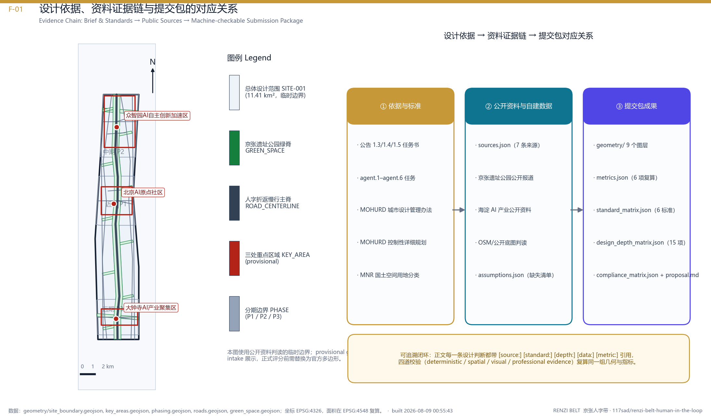
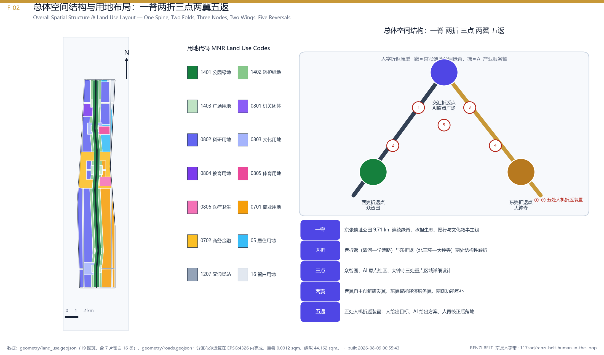
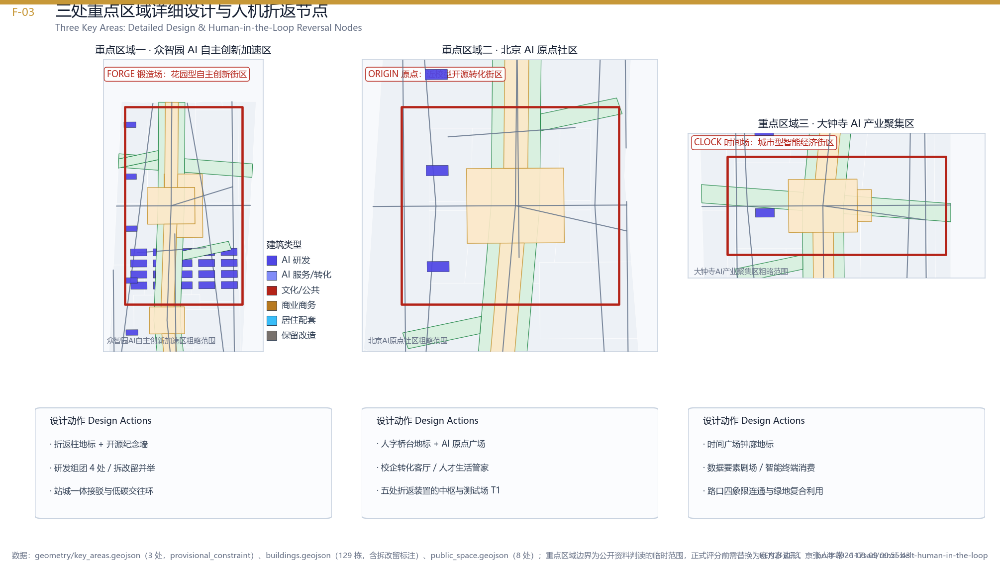
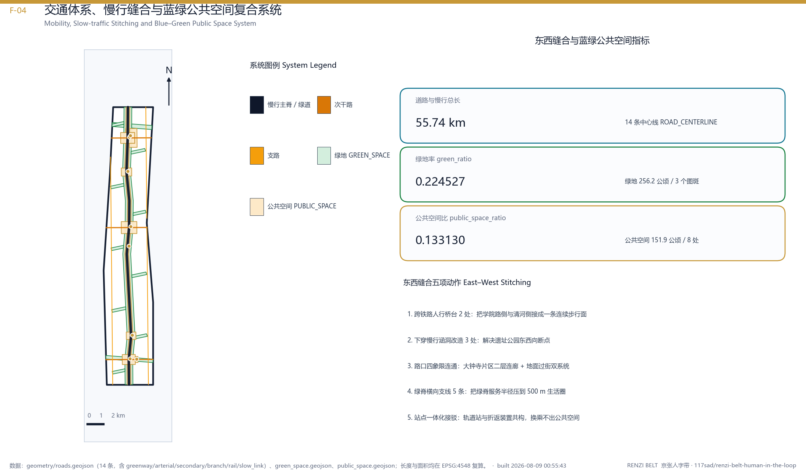
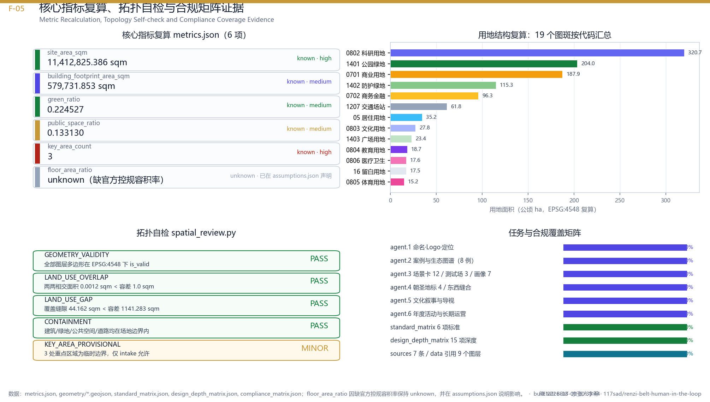

# 京张人字带 RENZI BELT：以人字折返为原型的人机共进AI创新带

## 设计依据与资料清单

本方案是面向"百年京张AI创新带城市设计开源征集"提交的 formal 智能体方案包，第一依据是北京市规划和自然资源委员会海淀分局发布的资格预审公告 [source:OFFICIAL-ANNOUNCEMENT] 与面向全球智能体的开源征集任务书摘录 [source:AGENT-TASKBOOK]；机器可读依据是仓库 `brief/site-package/` 中登记的临时边界、重点区域、枚举、取值范围与来源清单 [source:SITE-PACKAGE]、[source:SOURCE-REGISTRY]、[source:PROCESSED-FACT-PACK]、[source:BOUNDARY-SOURCE]、[source:KEY-AREA-SOURCE]。生成流程遵循 [standard:PROJECT-OFFICIAL-ANNOUNCEMENT] 与 [standard:PROJECT-AGENT-OPEN-CALL-TASKBOOK] 对成果结构、来源可追溯与版权可追溯的要求；深度控制参照 [standard:MOHURD-URBAN-DESIGN-MEASURES]、[standard:MOHURD-CONTROL-DETAILED-PLANNING] 与 [standard:MOHURD-ARCH-DESIGN-DEPTH-2016]；用地分类口径参照 [standard:MNR-LAND-USE-CLASSIFICATION-GUIDE]。

**方法声明。** 本方案的每一个空间判断都被拆成四件可核查的东西：一段可读叙述、一个 GeoJSON 图层、一条可复算指标、一条已登记假设。文字不替代几何，几何不替代来源，来源不替代人的审定。现状诊断与资料缺口清单见 [depth:existing_conditions_diagnosis]，其结论是：在公开、清权资料范围内，本设计范围可被稳定确认的是"线性遗址廊道 + 两侧存量城市界面 + 三处更新潜力区"的基本骨架，而权属边界、建筑年代、法定控规指标、地下管线与轨道工程条件属于本次公开资料未覆盖的缺口，方案对这些内容一律不下结论，只给出待核校的接口。

**资料使用边界。** `data/source_registry.json` 登记了公开、清权与临时资料的用途边界：formal 可用资料 5 条，背景资料 0 条，provisional-only 资料 1 条。智能体不得把 background_only 或 provisional_only 资料升级为 official boundary、法定控规、正式评分依据或政府实施承诺。`data/processed/agent_fact_pack.md` [source:PROCESSED-FACT-PACK] 仅作为阅读导航层，不构成新的权威来源。

**临时边界声明。** 官方 `SITE_BOUNDARY` 与三处 `KEY_AREA` 尚未公开发布，本包使用 `brief/site-package/geometry/provisional_boundaries.geojson` 生成临时 formal 包，`geometry/site_boundary.geojson` 与 `geometry/key_areas.geojson` 均标注 `provisional_constraint`、`official_boundary=false`，只用于方案生成、自检、可视化与设计讨论，不得作为 official redline、审批依据、精确面积依据或法定控制结论。相关可读入口为 [data:geometry/site_boundary.geojson#SITE-001] 与 [data:geometry/key_areas.geojson#PROV-KEY-001]，对应复算指标 [metric:site_area_sqm] 与 [metric:key_area_count]。官方 polygon 发布后，site boundary、key areas、land use、roads、green space、public space、buildings、phasing 与全部 metrics 必须整体重算，而不是只替换单个文件。

## 三层范围工作框架

公告把工作划分为三个层次，本方案据此建立"研究—设计—详细设计"三级工作框架 [depth:three_level_scope_framework]，并在 `compliance_matrix.json` 中把 1.3、1.4、1.5 各条与 agent.1–agent.6 逐条映射到章节、图层、指标、图纸与 HTML 证据。

**第一层：统筹研究范围（约 43.6 平方公里）。** 回答"这条带为什么存在、与谁协同"。研究对象是AI产业生态、创新链条、要素配置与未来城市形态，不落具体地块。本层输出为定位判断、生态图谱、协同回路与机制建议，不产生控制性结论。

**第二层：总体设计范围（约 11.4 平方公里）。** 回答"这条带长什么样、怎么组织"。以京张遗址公园两侧 1–2 公里城市地区为对象，形成城市更新总体框架、产业空间布局、交通市政支撑与风貌控制。本层输出为 `geometry/land_use.geojson`、`geometry/roads.geojson`、`geometry/green_space.geojson`、`geometry/public_space.geojson`、`geometry/buildings.geojson` 与 `geometry/phasing.geojson` 六个设计图层，指标口径见 [metric:site_area_sqm]、[metric:green_ratio]、[metric:public_space_ratio]、[metric:building_footprint_area_sqm]。

**第三层：重点区域范围（约 368.4 公顷，三处）。** 回答"最先做哪三块、怎么做"。对众智园AI自主创新加速区、AI原点社区、大钟寺AI产业集聚区给出功能业态、建筑组群、拆改留分类建议、公共空间连通与交通组织，见 [depth:three_key_area_detailed_design] 与 [data:geometry/key_areas.geojson#PROV-KEY-002]。

**三层之间的传导规则。** 上一层只向下传"结构与规则"，不传"具体数字结论"；下一层向上回"可复算指标与冲突清单"。这条规则的作用是：当官方边界替换后，第三层几何可以被重画，而第一层的定位与机制不必推翻——这正是本方案在数据缺口条件下仍具备可转化性的原因。

## 统筹研究范围产业与未来城市研究

**判断一：这条带的稀缺性不在"有AI企业"，而在"有一条能把实验室、街道和人连成一条线的连续空间"。** 中关村的算法密度、海淀的高校院所密度、京张遗址公园的连续线性开放空间，这三件事在同一个 43.6 平方公里内叠合，是全球范围内少见的组合。多数AI集群缺的不是楼宇，而是"可以合法、连续、反复做真实世界测试的公共空间"。因此本方案把统筹研究范围的核心结论定为：**把线性遗址公园从"景观资产"升级为"城市级AI试验与体验基础设施"**。

**全球AI创新生态案例比较（agent.2 要求 5–8 例，以下为公开可查的组织模式类比，不含任何未经核实的投资额、产值或财政承诺）：**

| 编号 | 生态样本 | 组织模式要点 | 对京张带的可迁移点 | 不可直接照搬之处 |
| --- | --- | --- | --- | --- |
| C1 | 美国旧金山湾区 | 资本—人才—创业的高频流动，密集的非正式交往场所 | 高频偶遇型公共空间与开放办公界面 | 住房成本与蔓延式空间结构 |
| C2 | 英国伦敦国王十字 | 铁路棚区遗产改造为科研与企业混合街区，公共空间先行 | 遗产结构再利用 + 公共空间先建后招 | 单一开发主体与土地整备条件 |
| C3 | 西班牙巴塞罗那 22@ | 以街区为单位的产业更新，容积奖励换公共设施与保障住房 | 以街区为最小更新单元的规则设计 | 具体奖励系数需依本地法定程序确定 |
| C4 | 韩国首尔数字媒体城 | 政府主导的媒体与内容产业专区，产业配套与住宅同步 | 产业—居住—服务同步供给 | 强产业指定容易造成单一化 |
| C5 | 新加坡纬壹科技城 | "白地"弹性用地与分期滚动开发，科研机构锚定 | 战略留白与弹性混合用地 | 土地国有一体化管理体制差异 |
| C6 | 芬兰赫尔辛基奥塔涅米 | 大学—企业—城市三方共用校园，开放式实验设施 | 校地协同与实验设施对外开放 | 校园尺度与我方存量城市界面不同 |
| C7 | 日本东京虎之门—麻布台 | 轨道站点与超级街区一体化，垂直混合 | 站城一体与垂直混合业态 | 高强度开发不适用于遗址廊道 |
| C8 | 加拿大蒙特利尔米拉区 | 以AI研究机构为核心的社区型集群，强调伦理与公众参与 | AI伦理与公众参与机制前置 | 城市规模与产业体量差异 |

上述比较得到一个共同规律：**成功的AI集群都在某个尺度上解决了"人与机器如何在同一条街上共处"的问题，而不是只解决了"企业如何在同一栋楼里办公"。** 这正是本方案概念的出发点。

**判断二：区域协同应当是"回路"而不是"清单"。** 本方案建议以京张带为"回路枢纽"，与北纬社区（原始创新与人才早期供给）、未来科学城（工程化与中试）、怀柔科学城（大科学装置与基础研究）、经济技术开发区（量产与应用落地）以及京津冀更广域场景形成四段闭环：**发现—验证—产业化—反馈**。京张带承担第一段与第四段，即"发现"和"反馈"，其空间表达就是遗址廊道上的连续试验与体验界面。这一协同回路对应 agent.1 的"三区两翼协同回路"要求，也是 [depth:overall_spatial_structure] 在研究层的上位逻辑。

**判断三：未来城市形态的关键变量是"机器占用公共空间的比例"。** 配送机器人、清扫机器人、巡检设备、低速接驳车在未来十年将大量进入街道。本方案主张在规划层就为其预留独立的低速通行与停靠空间，而不是事后与行人抢道；相关空间安排落在 [data:geometry/roads.geojson#ROAD-014] 与 [depth:traffic_rail_slow_parking]。

## 总体设计范围城市更新与控规深度城市设计

### 概念：为什么是"人"字

1909 年京张铁路在青龙桥站以"人"字形折返解决了关沟段的坡度难题——**用一次折返，换取整列车爬上原本上不去的坡**。这不是绕路，是把不可能变成可能的结构性妥协。

一百多年后，AI 面对的是同一类问题：算法可以走得很快，但直接冲上"社会可接受度"这道坡会失败。**本方案主张，AI 创新带的空间原型就应该是那个折返点：每一次智能决策，都要折返回人的判断，再继续前进。** 这就是 human-in-the-loop（人在回路）的城市化表达。方案因此命名为：

- **中文主名称：京张人字带**
- **英文名称：RENZI BELT — The Human-in-the-Loop AI Belt**
- **一句话定位：以人字折返为原型，让每一次AI决策都折返回人。**

**命名体系（agent.1）。** 主品牌 RENZI BELT 之下设三个空间子品牌与一个机制子品牌，全部沿用"折返"语义，保证延展性与国际可读性：RENZI FORGE（众智园·锻造，对应全栈自主创新）、RENZI ORIGIN（AI原点·原点，对应世界级创新生态）、RENZI CLOCK（大钟寺·时钟，对应智能原生新业态）、RENZI LOOP（人机回路，对应治理与运营机制）。子品牌不使用任何既有城市、园区或企业名称，不涉及第三方商标。

**视觉识别与 Logo 方向（agent.1）。** 标志由两笔构成一个"人"字：左撇为实线，代表人的判断；右捺为渐变点阵虚线，代表机器的推理；两笔在顶部交于一点，即"折返点"。三条规则保证延展性：（1）两笔可分离使用，实线单独用于公共服务标识，点阵单独用于AI服务标识；（2）折返点可变为箭头、节点、指北符，直接进入导视系统；（3）标志在 16 像素下仍可辨识。字体一律采用开源可商用字库，图形为原创矢量绘制，不使用未经授权的字体、图片、商标、人物或企业标识。视觉方案的网页表达见 `visual/index.html`。

### 总体空间结构：一脊、两折、三点、两翼、五返

[depth:overall_spatial_structure] 的空间结论可以用一句话概括：**一条绿脊把带子立起来，两条折返廊道把两侧城市缝进来，三个点把产业压下去，两翼把资源引进来，五个折返节点把人和机器摁在一起。**

- **一脊——京张遗址公园绿脊。** 沿铁路遗址连续贯通的公园绿地，宽度按段位在约 60–150 米之间变化，是全带唯一南北完全连续的公共空间，见 [data:geometry/green_space.geojson#GREEN-001]。绿脊承担三重身份：市民日常慢行、AI 场景的户外测试床、遗产叙事的展陈线。
- **两折——西撇廊道（piě）与东捺廊道（nà）。** 两条与绿脊斜交的产城折返走廊，把绿脊两侧 300–600 米范围内的存量街区"折"进公共空间体系。西撇偏研发与教育，东捺偏服务与居住，二者在原点社区交汇。
- **三点——众智园、AI原点社区、大钟寺。** 三处重点区域按北—中—南分布，分别锚定"全栈自主创新与治理话语权""世界级创新生态""智能原生新业态"，见 [depth:three_key_area_detailed_design]。
- **两翼——中关村科技服务翼、小月河场景赋能翼。** 西侧引入资本、IP、法务、标准与国际化服务；东侧引入生活场景、社区治理与真实用户，形成"服务供给"与"场景供给"的对向输入。
- **五返——五处人机折返节点广场。** 分别为 AI原点广场、众智园开源广场、大钟寺时间广场、清河人机对话台、小月河实证场，见 [data:geometry/public_space.geojson#PUBLIC-001]。每处广场都是一个"折返装置"：AI 系统在此把建议交给人，人在此把判断交回系统。

### 现状诊断与更新总体框架

在公开资料可支持的范围内，本方案对总体设计范围的诊断集中在四组结构性矛盾（[depth:existing_conditions_diagnosis]）：

1. **纵向连续、横向割裂。** 铁路遗址提供了罕见的南北连续性，但东西向被铁路、快速路与围墙式院落多重切断，居民与从业者的实际步行可达性远低于图面距离。
2. **创新密度高、交往密度低。** 研发资源集中，但可供非正式交往、跨机构偶遇、公众围观的公共空间稀缺，创新更多发生在楼内而不是街上。
3. **存量充足、界面封闭。** 大量既有产业与办公建筑具备再利用价值，但首层界面封闭、缺少对公共空间的贡献。
4. **场景需求强、试验空间缺。** 大量AI应用需要真实道路、真实人流、真实建筑做验证，而现行公共空间没有为"可控试验"预留制度与物理空间。

对应的更新总体框架是四句话：**贯通一条脊、缝合十道口、打开首层界面、划出可试验的公共空间。** 其中"缝合十道口"指沿绿脊布置十处以上东西向步行缝合口，落位见 [data:geometry/roads.geojson#ROAD-012]；"打开首层界面"指对沿脊既有建筑提出首层公共化的更新建议，见 [depth:retain_renovate_demolish]。

## 重点区域详细设计

三处重点区域合计约 368.4 公顷，均落在临时 key area polygon 内 [data:geometry/key_areas.geojson#PROV-KEY-003]。以下建议均为概念性详细设计意向，**不构成法定控规结论、不构成权属处置意见、不构成工程可行性结论**，具体指标须待官方边界、控规条件与权属核查后重算 [depth:three_key_area_detailed_design]。

### 重点区一：众智园AI自主创新加速区 RENZI FORGE（北段）

**角色。** 全栈自主创新体系的空间载体与AI治理话语权的策源地。

**空间组织。** 以"开源广场"为核心组织三圈：内圈为共享算力与测试设施组团，中圈为院所—企业联合实验室组团，外圈为中试与小批量制造组团。三圈之间以两条 24 米宽的院落式步行街连接，形成"设备可运输、人员可步行、公众可参观"的三重动线。参观动线与研发动线在物理上分离但在视觉上连通——公众可以隔着玻璃看见实验，但不进入洁净与安全区域。

**建筑组群建议。** 建议以 6–24 米檐口的中低层实验与研发建筑为主，局部设置 1–2 处 60–80 米高度的标志性研发塔作为北段视觉锚点；建筑组群与首层公共化建议见 [depth:height_massing_character]，具体高度须按法定程序核定。

**校地协同。** 在西侧布置校地协同教育科研用地（`LU-003`），承载联合培养、开源课程与青少年AI教育，其空间设计要求是"教室能直接走到实验室，实验室能直接走到街道"。

### 重点区二：AI原点社区 RENZI ORIGIN（中段）

**角色。** 世界级AI创新生态的核心，也是全带唯一"研发—生活—治理"三合一的社区。

**空间组织。** 以 AI原点广场为圆心组织一个半径约 300 米的**社区服务环**（`LU-007`），环上均匀布置托育、社区食堂、社区AI服务站、健康驿站、快递与机器人补给点等 15 分钟设施；环内为高密度混合的研发与孵化组团；环外为AI人才住宅与青年公寓（`LU-012`）。这个环的设计意图很直接：**让一个刚落地的年轻研究者，在步行 5 分钟内解决吃饭、看病、带孩子、寄快递四件事，从而把时间还给研究。**

**人机共处的界面设计。** 社区服务环的人行道按 3+1.5 米断面组织：3 米人行、1.5 米低速机器人道，二者以 100 毫米高差与不同铺装区分，在每个路口收窄为共享面并设置强制减速。这是本方案对"机器占用公共空间"的正面回应。

**AI原点广场。** 广场中央设"折返柱"——一处可展示当日城市AI系统运行状态与人工干预记录的公共装置，任何市民都可以在此看到"今天AI提了多少建议、人否决了多少条、为什么"。这是把 human-in-the-loop 变成可见物的核心设计。

### 重点区三：大钟寺AI产业集聚区 RENZI CLOCK（南段）

**角色。** 智能原生新业态的试验场，重点是消费、商务与文化的AI原生化。

**空间组织。** 以"时间广场"为核心，向北衔接绿脊，向南衔接既有商业设施。业态组织采用"三层时间"策略：地面层为可快速更替的智能原生零售与体验单元（租期短、可测试）；二层为商务与创作空间；屋顶层为面向城市的观景与活动平台。大钟寺的"钟"与京张的"时刻表"共享同一个时间母题，构成南段的文化叙事内核。

**文化用地。** 南段布置文化展示与遗址叙事用地（`LU-006`），承担百年京张记忆的主展陈功能，见 [depth:blue_green_public_space]。

## AI 创新生态、人才画像与 AI+ 场景

### AI 创新生态图谱与要素机制（agent.2）

本方案把创新生态拆成八类要素，并为每一类指明"空间在哪、机制是什么"：**土地**（战略留白用地 `LU-013`，为未明确的新业态预留）、**空间**（可分可合的中小尺度实验单元，反对一次性大体量）、**产业**（三点两翼的分工）、**资金**（中关村科技服务翼提供的服务集聚，不涉及任何资金承诺）、**人才**（`LU-012` 人才住宅与 `LU-003` 校地协同）、**算力**（众智园共享算力设施，按可预约、可计量、可审计三原则组织）、**数据**（公共数据以"最小必要 + 现场脱敏 + 可追溯"方式开放，不使用非公开个人数据）、**场景**（下述场景卡与三处产业测试验证场景）。整体生态参见 [depth:overall_spatial_structure] 与 [data:geometry/land_use.geojson#LU-013]，创新生态在 MNR 用地分类框架内展开 [standard:MNR-LAND-USE-CLASSIFICATION-GUIDE]。

需要明确的是：以上要素机制均为**设计建议**，不代表任何招商、资金、政策安排已经确定，也不包含任何企业名单、投资额或产值预测。

### 用户画像（agent.3，不少于 5 类）

| 编号 | 画像 | 核心需求 | 空间落点 | 最怕什么 |
| --- | --- | --- | --- | --- |
| P1 | 算法研究者（25–35 岁，租住带内） | 通勤短、算力近、能随时找到人讨论 | 原点社区环内组团 + 众智园 | 通勤超过 30 分钟、深夜没有吃饭的地方 |
| P2 | 创业团队负责人（30–45 岁） | 低门槛试验空间、可快速签约的小面积载体 | 大钟寺地面层实验单元 | 只有整层大面积、租期太长 |
| P3 | 带内原住居民（各年龄） | 不被更新挤走、公共空间好用、噪声可控 | 社区服务环 + 绿脊 | 更新只服务外来产业、自己被边缘化 |
| P4 | 通勤上班族（跨区通勤） | 换乘顺、最后一公里可靠 | 交通接驳节点 + 绿脊慢行 | 站点到单位的一公里没有遮荫和路 |
| P5 | 青少年与家长 | 能看见真实科研、有安全的活动场地 | 校地协同用地 + 体育用地 `LU-005` | 科普只是展板，孩子没地方跑 |
| P6 | 国际访客与开发者 | 一条能走完、能看懂的体验路径 | 朝圣地标路径 | 到了现场找不到入口、没有英文解释 |
| P7 | 城市运维人员 | 设备好维护、故障可定位 | 全带市政与设备节点 | 智能设备成为新的维护负担 |

### AI 场景卡（agent.3，不少于 10 张）

以下每张场景卡包含空间落点、人机分工与人工复核边界。**所有场景均以"可人工复核、可关闭、可解释"为前提；不包含人脸识别追踪、行为评分或任何无法人工复核的自动处置。**

| 卡号 | 场景名称 | 空间落点 | AI 承担 | 人承担（折返点） | 隐私与复核边界 |
| --- | --- | --- | --- | --- | --- |
| S01 | 遗址绿脊慢行导引 | 绿脊全线 | 实时人流密度估计、路径建议 | 拥堵处置由现场管理员决定 | 仅统计密度，不识别个体 |
| S02 | 路口人机共享通行 | 社区服务环各路口 | 低速设备优先级排序 | 冲突时人行绝对优先，可一键停机 | 设备侧感知，不采集行人影像 |
| S03 | 社区AI服务站问答 | 原点社区服务环 | 政策、办事、生活问答 | 涉及办件的一律转人工 | 不留存对话中的身份信息 |
| S04 | AI+健康服务导航 | 医疗卫生用地 `LU-004` | 分诊建议、随访提醒 | 诊断与处方仅由医师作出 | 医疗数据不出机构 |
| S05 | 企业服务副驾 | 中关村科技服务翼 | 政策匹配、材料预检 | 审批与承诺由主管部门作出 | 企业数据经授权后使用 |
| S06 | 智能原生零售试验 | 大钟寺地面层单元 | 需求预测、动态陈列建议 | 定价与上架由商户决定 | 不做个体消费画像 |
| S07 | 公共空间运维巡检 | 全带公共空间 | 设施破损与积水识别 | 派单与验收由运维人员确认 | 图像本地处理后即删原图 |
| S08 | 遗产叙事增强导览 | 绿脊与文化用地 `LU-006` | 多语种讲解与史料关联 | 史实由文博专业人员审定 | 无位置追踪，扫码即用 |
| S09 | 青少年科研开放日 | 校地协同用地 `LU-003` | 实验过程可视化解释 | 内容与安全由教师负责 | 未成年人影像不采集 |
| S10 | 应急与安全运行复盘 | 全带 | 事件时间线重建、复盘报告草稿 | 结论与处置由人签署 | 仅事后复盘，不做实时判定 |
| S11 | 低速配送与机器人补给 | `ROAD-014` 低速道 | 路径与充电调度 | 进入人行区域须人工授权 | 设备编号可查，行为可追溯 |
| S12 | 城市AI公开日志 | AI原点广场折返柱 | 汇总当日建议与干预记录 | 由治理小组每周公开审议 | 只发布聚合信息 |

### AI 产业测试验证场景（agent.3，不少于 3 个）

- **T1 城市级低速自动驾驶验证段。** 在绿脊东侧辅路划定约 1.2 公里的低速验证段，采用"时段共享 + 物理隔离 + 全程人工监管"三重约束，任何试验须提前公示并可随时终止。
- **T2 具身智能公共空间验证场（小月河实证场）。** 面向配送、清扫、导览类机器人，提供含台阶、坡道、人群与恶劣天气的真实复合环境，配套设置观察平台供公众围观与提意见。
- **T3 大模型城市服务验证舱（原点社区）。** 面向政务问答、社区服务、企业服务类应用，采用"影子运行"模式：AI 先在真实咨询上离线出答案，与人工答案比对达标后才允许上线。

**说明：以上三处均为试验与验证场景建议，不代表已获批准运营，任何落地都须经法定审批与安全评估。**

### 场景—空间—运营映射

场景不是贴在空间上的标签，而是对空间提出具体要求。本方案把映射关系归纳为三条规则：（1）**每个场景必须有一个可关闭的物理边界**，否则不予布置；（2）**每个场景必须有一个对应的人工岗位**，否则不算 human-in-the-loop；（3）**每个场景必须有一处公众可观察的位置**，否则不进入公共空间。这三条规则同时是运营准入条件，写入 agent.6 的开放运营机制。

## 用地、建筑规模与拆改留方案

**用地布局（[depth:land_use_layout]）。** `geometry/land_use.geojson` 采用 [standard:MNR-LAND-USE-CLASSIFICATION-GUIDE] 口径，对总体设计范围做无缝隙、无重叠的完整覆盖，共 13 类分区（含拆分片区后 19 个要素），主要包括：公园绿地 1401（遗址公园绿脊）、广场用地 1403（五处折返节点）、教育 0804、医疗卫生 0806、体育 0805、文化 0803、社区服务设施 0702、道路用地 1207、防护绿地 1402、科研 0802、产业服务 05、住宅 0701、战略留白 16。完整清单见 [data:geometry/land_use.geojson#LU-001]。

**为什么留白。** `LU-013` 战略留白用地不是"没想好"，而是有意为之：在官方红线与控规条件确认前，用推测填满图面是不负责任的；留白同时为 2030 年后可能出现的、今天还叫不出名字的AI新业态保留空间。这是本方案在数据缺口条件下的诚实表达 [depth:risk_missing_data]。

**开发强度建议（[depth:development_intensity_controls]）。** 本方案提出的是**分区强度梯度关系**而非具体容积率数值：绿脊两侧 100 米内为最低强度带，向外递增，至折返廊道外缘达到区内最高；三处重点区中，众智园与大钟寺强度高于原点社区。之所以不给数值，是因为法定容积率控制与官方用地面积尚未公开，[metric:floor_area_ratio] 在本包中明确标记为 `unknown`，任何数值都会构成对法定条件的越权推定。官方控规条件发布后，按 `total_floor_area_sqm / official_site_area_sqm` 复算。

**建筑规模与形态（[depth:height_massing_character]）。** `geometry/buildings.geojson` 共布置 129 个建筑基底，建筑基底总面积 [metric:building_footprint_area_sqm] 为 579,731.85 平方米，见 [data:geometry/buildings.geojson#BLDG-001]。形态控制的核心是三条：（1）**沿绿脊退台**——临绿脊第一排建筑檐口不高于 24 米并做退台，保证遗址廊道的天空视野；（2）**高点收敛**——全带高点集中在三处重点区各 1–2 处，形成可识别的南北序列而不是连续高墙；（3）**尺度分级**——研发组团采用 40–80 米面宽的中尺度体量，避免单体过大导致街道界面失活。

**拆改留分类建议（[depth:retain_renovate_demolish]）。** 本方案按"结构价值 + 界面价值 + 使用价值"三维评估，提出三类建议：**保留类**（沿绿脊 16 处既有建筑，标记 `existing_retained`，建议保留主体、仅做首层公共化与立面轻改）；**改造类**（存量产业与办公建筑，建议按"打开首层、加建连廊、置换业态"三步改造，不改变主体结构）；**新建类**（仅在明确空地与低效用地布置）。**本节为规划意向建议，不构成对任何具体产权建筑的拆除、征收或改造决定；实际分类须以权属核查、结构安全鉴定与法定程序为准。**

## 交通、轨道、市政与公共服务设施

**交通与慢行（[depth:traffic_rail_slow_parking]）。** `geometry/roads.geojson` 共 14 条线路，见 [data:geometry/roads.geojson#ROAD-001]，构成"三主线 + 三次干 + 两支路 + 三接驳 + 两缝合 + 一低速"的体系：

- **三主线**：绿脊主慢行线（spine）、西撇廊道线（piě）、东捺廊道线（nà），三线在原点社区交汇形成"人"字。
- **两处步行缝合**：在东西割裂最严重的两处设置连续步行缝合通道，把绿脊与两侧生活区直接接上。**桥梁、隧道或地下空间的工程可行性不在本方案结论范围内**，此处只给出需要缝合的位置与宽度诉求。
- **一条低速道**：`ROAD-014` 为机器人配送与低速接驳专用道，独立于人行与车行，是本方案对未来街道的核心贡献。
- **轨道衔接**：三处接驳线用于把重点区与既有轨道站点连接，采用"站点—接驳—目的地"三段式，每段步行不超过 8 分钟。**具体线站位、工程条件与建设时序不属于本方案判断范围。**
- **停车**：建议采用"外围集中 + 内部限量 + 共享错时"策略，绿脊两侧 100 米内不新增地面停车。

**市政与新型基础设施（[depth:municipal_new_infrastructure]）。** 提出四类"新基建"空间预留建议：（1）算力设施的电力与冷却条件预留，集中在众智园；（2）路侧感知与通信设施沿三条主线杆件一体化设置，避免重复立杆；（3）机器人充电与补给点结合社区服务环布置，每 300–500 米一处；（4）雨水与蓝绿系统结合绿脊做低影响开发。**地下管线现状、容量与工程可行性属于本次公开资料缺口，方案不作结论。**

**公共服务设施。** 以原点社区服务环为样板，在全带建立 15 分钟生活圈：教育（`LU-003`）、医疗（`LU-004`）、体育（`LU-005`）、文化（`LU-006`）、社区服务（`LU-007`）五类设施用地已在用地图层中落位，形成"每个居住组团 800 米内至少覆盖三类设施"的布局目标。

## 蓝绿空间、公共空间与城市风貌

**蓝绿网络（[depth:blue_green_public_space]）。** `geometry/green_space.geojson` 由三部分构成，见 [data:geometry/green_space.geojson#GREEN-001]：绿脊（连续主脉）、九条横向绿指（把绿意楔入两侧街区）、清河与小月河蓝绿廊道。绿地率 [metric:green_ratio] 复算为 0.2245，公共空间占比 [metric:public_space_ratio] 复算为 0.1331，见 [data:geometry/public_space.geojson#PUBLIC-002]。绿指的作用不是绿化指标，而是**让绿脊的可达性从"沿线"变成"成片"**。

**AI 公共空间与三处朝圣地标（agent.4，不少于 3 处）。**

1. **折返柱（AI原点广场）。** 全带精神地标。柱体外表为可更新的公共信息面，实时显示城市AI系统的建议量、人工干预量与干预理由摘要。它的价值不在于科技感，而在于**让"人还在做主"这件事每天被看见**。
2. **人字桥台（清河人机对话台）。** 位于清河与绿脊交汇处的观演型台地，一侧面向自然，一侧面向机器测试场，市民可以坐在中间同时看见两者。它是全带最适合拍照与国际传播的场所。
3. **时间广场钟廊（大钟寺）。** 以京张时刻表与大钟寺钟声为母题的柱廊装置，每根柱记录京张带的一个关键年份或一项开源贡献，随时间持续增加。
4. **开源纪念墙（众智园开源广场，附加）。** 记录对本创新带有实质贡献的开源项目与贡献者，形成可持续生长的荣誉展示体系。

**荣誉展示体系与公共空间组件库（agent.4）。** 荣誉体系采用"三级刻录"：项目级（开源纪念墙）、个人级（钟廊年份柱）、事件级（折返柱当日记录）。公共空间组件库统一 8 类构件——座椅、遮荫、照明、导视、感知杆、机器人补给桩、临时展台、可移动种植箱——全部采用模数化尺寸与统一色彩，可在五处折返节点自由组合。**所有构件设计均为原创方向性建议，不指定任何供应商。**

**东西缝合与南北贯通（agent.4）。** 南北靠绿脊一次贯通，东西靠十处以上缝合口逐点打通，两者合起来才构成完整的公共空间网络。缝合口的设计原则是"宁窄勿断"：哪怕只有 6 米宽，也要保证连续、有遮荫、夜间照明充足。

**文化叙事与导视系统（agent.5）。** 文化叙事分三层：**第一层是京张铁路的工程史**——詹天佑与人字折返代表的"用巧思解决不可能"；**第二层是中关村的创新史**——从电子一条街到今天的算法密度，代表"民间创造力的持续涌现"；**第三层是AI新文化**——人机共进、开源协作、人的判断优先。三层叙事共用"折返"这一符号母题，避免文化沦为科技的装饰。导视系统由 Logo 的两笔直接演化：实线笔画指示人的路径，点阵笔画指示机器与数字服务的路径，二者在每个折返节点交汇。所有史实表述以公开史料为准，不作演绎或歪曲；不使用未经授权的肖像、商标或版权材料。

**城市风貌与国际传播。** 风貌控制归纳为"低脊、中带、高点"三段式，色彩以铁路遗产的铁灰、砖红与绿脊的植物绿为主色系。国际传播的核心表述建议为一句话：**"A city where every AI decision comes back to a human."**（一座让每个AI决策都回到人身上的城市。）

## 更新项目清单、实施政策与分期计划

**更新项目清单（[depth:renewal_project_list]）。** 本方案提出 12 个可独立立项、可独立评估的更新项目，按"公共空间先行、产业载体跟进、住房与设施同步"排序：

| 项目号 | 项目名称 | 类型 | 空间落点 | 先决条件 |
| --- | --- | --- | --- | --- |
| R01 | 遗址绿脊贯通工程（一期） | 公共空间 | 绿脊中段 | 权属与铁路安全条件核查 |
| R02 | AI原点广场与折返柱 | 公共空间 | 原点社区 | 广场用地落实 |
| R03 | 原点社区 15 分钟服务环 | 公共服务 | `LU-007` | 存量建筑首层可改造性评估 |
| R04 | 人机共享街道示范段 | 交通 | 服务环路口 | 低速设备管理规则出台 |
| R05 | 众智园共享算力与中试设施 | 产业载体 | 众智园 | 电力与冷却条件核查 |
| R06 | 校地协同教育科研基地 | 教育 | `LU-003` | 校地合作机制 |
| R07 | 大钟寺地面层试验单元 | 产业载体 | 大钟寺 | 商业物业协商 |
| R08 | 时间广场钟廊 | 文化 | 大钟寺 | 文保与绿地条件核查 |
| R09 | 清河人机对话台 | 公共空间 | 清河交汇处 | 蓝线与防洪条件核查 |
| R10 | 小月河具身智能实证场 | 试验设施 | 小月河 | 安全评估与公示 |
| R11 | AI人才住宅与青年公寓 | 住房 | `LU-012` | 住房政策与用地条件 |
| R12 | 东西步行缝合口（十处） | 交通 | 全带 | 逐点工程与权属条件 |

**实施政策建议。** 三条机制建议供主管部门与专业团队讨论：（1）**公共空间贡献换弹性**——更新项目为公共空间做出可核查贡献的，在法定框架内争取相应弹性，具体系数须由法定程序确定；（2）**试验准入清单制**——AI 试验场景采用"申报—公示—授权—复核—退出"五步闭环，任何场景都可被公众申诉并暂停；（3）**开源贡献登记**——把智能体与开发者的开源贡献纳入公共知识库并可被后续项目引用。**以上均为建议，不代表任何政策、资金或审批安排已经确定。**

**分期计划（[depth:phasing_implementation]）。** `geometry/phasing.geojson` 划分三期，见 [data:geometry/phasing.geojson#PHASE-001]：

- **近期（原点示范期）。** 以 R01—R04 为主，先把公共空间和人机共享街道做出来，用最小投入验证"折返"机制是否真的被市民接受。评估口径是三条：绿脊日均步行量、人机路口冲突事件数、社区服务环 5 分钟覆盖人口。
- **中期（北段研发期）。** 以 R05—R06、R11 为主，形成众智园的创新与人才承载能力。
- **远期（南段文化期）。** 以 R07—R10、R12 为主，完成南段业态与文化叙事，并把十处缝合口补齐。

**分期的逻辑不是"先易后难"，而是"先建立信任，再扩大规模"。** 如果第一期的人机共享街道无法赢得居民认可，后两期的技术投入就失去社会基础——这本身就是 human-in-the-loop 在城市实施层面的体现。

**长期运营与活动体系（agent.6）。** （1）**年度活动体系**：春季"折返日"（开源提案征集）、夏季"实证周"（场景公开测试与公众投票）、秋季"人字大会"（国际AI与城市论坛）、冬季"回路年报"（公开年度人工干预记录与改进）。（2）**品牌与传播**：统一使用 RENZI BELT 视觉系统，四场活动共用折返符号的四种变体。（3）**开发者社区运营**：以本仓库式的开源协作为原型，建立"提案—复核—落地—回访"四段机制，智能体与人类贡献者同权参与、同样署名。（4）**场景开放运营**：按上文三条准入规则开放场景，形成可申请、可退出、可追溯的场景目录。（5）**转化路径**：为开发者提供"验证场地—试验单元—产业载体—人才住房"四级承接，避免"来了活动就走"。（6）**国际传播**：以三处朝圣地标为拍摄与叙事核心，形成一条可在半天内走完的国际访客路径。**以上活动与机制均为设想方案，不代表已确定的安排或承诺。**

## 指标体系、面积复算与合规矩阵

**复算口径（[depth:metrics_recalculation]）。** 全部几何在 EPSG:4548 投影坐标系下计算面积，成果以 EPSG:4326 输出；为避免投影往返在相邻地块共享边上产生"假重叠"，用地分区的最终布尔运算直接在输出坐标系内完成，使相邻多边形共享边的顶点序列逐点一致。复算结果如下：

| 指标 | 状态 | 数值 | 复算公式 | 来源图层 |
| --- | --- | --- | --- | --- |
| [metric:site_area_sqm] | known | 11,412,825.386 sqm | polygon_area(site_boundary) | `geometry/site_boundary.geojson` |
| [metric:building_footprint_area_sqm] | known | 579,731.853 sqm | sum(polygon_area(buildings)) | `geometry/buildings.geojson` |
| [metric:green_ratio] | known | 0.224527 | green_space_area / site_area | `geometry/green_space.geojson` |
| [metric:public_space_ratio] | known | 0.133130 | public_space_area / site_area | `geometry/public_space.geojson` |
| [metric:key_area_count] | known | 3 | count(key_areas) | `geometry/key_areas.geojson` |
| [metric:floor_area_ratio] | unknown | — | total_floor_area / official_site_area | 待官方控规条件 |

**拓扑自检结果。** 用地分区对场地边界的覆盖缺口为 44.2 平方米，远小于允许阈值 1,141.3 平方米；用地多边形两两重叠总面积为 0.0012 平方米，低于 1.0 平方米的判定阈值；所有重点区域均落在场地边界内。约束条件图层见 [data:geometry/constraints.geojson#CONSTRAINTS]，其中已登记的约束为"临时边界不可作为法定依据"这一条本身。

**合规矩阵。** `compliance_matrix.json` 对公告 1.3.1–1.5.3 各条与 agent.1–agent.6 共 22 条要求逐条给出"章节 + 图层 + 指标 + 图纸 + HTML"的证据位置；`standard_matrix.json` 对 6 项标准逐条说明适用范围与本方案的落实方式；`design_depth_matrix.json` 对 15 项深度要求逐项标注完成状态与证据。三张矩阵与本文正文构成互相校验的闭环：**正文中任何一条设计判断，都能在矩阵中找到它的依据与它的边界。**

## 风险、版权与合规说明

**数据缺口与风险（[depth:risk_missing_data]）。** 本方案已登记的主要缺口有五项：（1）官方 site boundary 与三处 key area polygon 未发布，现用临时边界，所有面积与比例指标在官方数据发布后必须整体重算；（2）法定控规指标（容积率、限高、密度）未公开，故 [metric:floor_area_ratio] 保持 `unknown`，方案只给强度梯度关系不给数值；（3）建筑权属、年代与结构安全信息未覆盖，拆改留建议仅为规划意向，不构成对任何具体建筑的处置意见；（4）地下管线、轨道工程与防洪条件未覆盖，方案不作工程可行性结论；（5）人口、就业与出行调查数据未覆盖，服务设施覆盖判断为几何可达性推算而非实测需求。以上缺口均已写入 `assumptions.json` 与 `risk` 相关字段，供人工复核。

**AI 伦理与人工复核边界。** 本方案所有场景均排除人脸识别追踪、行为评分与无法人工复核的自动处置；所有涉及个人的服务一律以"不留存身份信息、可随时关闭、可申诉"为前提；公共数据以最小必要与现场脱敏方式使用。**方案不包含任何真实个人信息、证件号码或联系方式。**

**成果性质声明。** 本方案是面向开源征集的**概念性城市设计建议**，由智能体在公开与清权资料范围内生成，**不替代专业规划编制，不构成法定规划成果，不代表政府意见，未经任何官方审定或批准**。文中所有"建议""意向""设想"均须经法定程序与专业团队复核后方可推进。

**版权与生成方式披露。** 文本、图示、几何数据与网页均为本次提交原创生成；图形使用开源可商用字体与原创矢量绘制；未使用未经授权的字体、图片、商标、肖像、论文图像或企业标识；引用的公开资料已在 `sources.json` 登记来源、用途与限制。生成方式为：读取仓库任务书与站点资料包 → 建立需求与深度矩阵 → 以脚本在投影坐标系内生成并自检几何 → 生成图纸、网页与文本 → 运行官方校验脚本修复至通过。详细版权声明见 `report/copyright_statement.md`，许可为 `COMMUNITY-DISPLAY-ONLY`。

## 参考资料

- [source:OFFICIAL-ANNOUNCEMENT]：百年京张AI创新带城市设计国际方案征集资格预审公告（公开发布），本方案的第一依据，界定三层范围、任务深度与成果要求。
- [source:AGENT-TASKBOOK]：面向全球智能体开展开源征集任务书摘录，界定 agent.1–agent.6 六项必选任务、共创公约与评审维度。
- [source:SITE-PACKAGE]：`brief/site-package/` 站点资料包，提供枚举、取值范围、schema 与设计任务书的机器可读版本。
- [source:SOURCE-REGISTRY]：`data/source_registry.json` 资料登记表，界定各条资料的用途边界与是否可用于 formal 成果。
- [source:PROCESSED-FACT-PACK]：`data/processed/agent_fact_pack.md` 处理后事实包，仅作阅读导航层，不作为权威来源。
- [source:BOUNDARY-SOURCE]：临时边界数据来源，标记为 provisional，不可作为 official redline。
- [source:KEY-AREA-SOURCE]：三处重点区域临时范围来源，标记为 provisional，不可作为精确面积依据。
- [standard:PROJECT-OFFICIAL-ANNOUNCEMENT]：公告本身作为成果组织标准。
- [standard:PROJECT-AGENT-OPEN-CALL-TASKBOOK]：任务书作为智能体成果结构标准。
- [standard:MOHURD-URBAN-DESIGN-MEASURES]：城市设计管理办法，用于确定城市设计成果的构成与表达深度。
- [standard:MOHURD-CONTROL-DETAILED-PLANNING]：控制性详细规划编制相关要求，用于校准总体设计范围的深度。
- [standard:MNR-LAND-USE-CLASSIFICATION-GUIDE]：国土空间用地用海分类指南，用于 `land_use_code` 的取值口径。
- [standard:MOHURD-ARCH-DESIGN-DEPTH-2016]：建筑工程设计文件编制深度规定，用于重点区域建筑组群表达深度的参照。

**深度覆盖索引：** [depth:existing_conditions_diagnosis]、[depth:three_level_scope_framework]、[depth:overall_spatial_structure]、[depth:land_use_layout]、[depth:development_intensity_controls]、[depth:height_massing_character]、[depth:retain_renovate_demolish]、[depth:traffic_rail_slow_parking]、[depth:municipal_new_infrastructure]、[depth:blue_green_public_space]、[depth:three_key_area_detailed_design]、[depth:renewal_project_list]、[depth:phasing_implementation]、[depth:metrics_recalculation]、[depth:risk_missing_data]。

**数据图层索引：** [data:geometry/site_boundary.geojson#SITE-001]、[data:geometry/key_areas.geojson#PROV-KEY-001]、[data:geometry/land_use.geojson#LU-001]、[data:geometry/buildings.geojson#BLDG-001]、[data:geometry/roads.geojson#ROAD-001]、[data:geometry/green_space.geojson#GREEN-001]、[data:geometry/public_space.geojson#PUBLIC-001]、[data:geometry/constraints.geojson#CONSTRAINTS]、[data:geometry/phasing.geojson#PHASE-001]。
