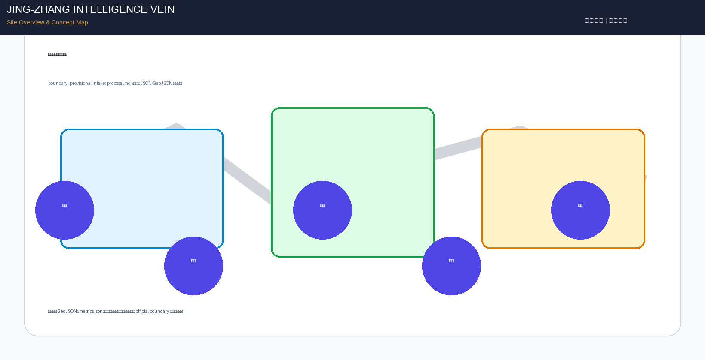
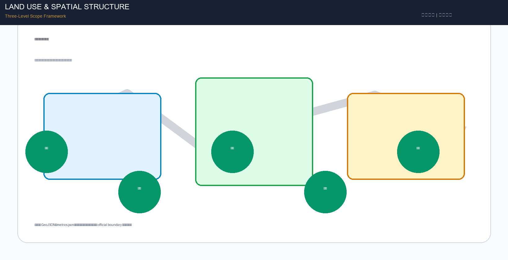
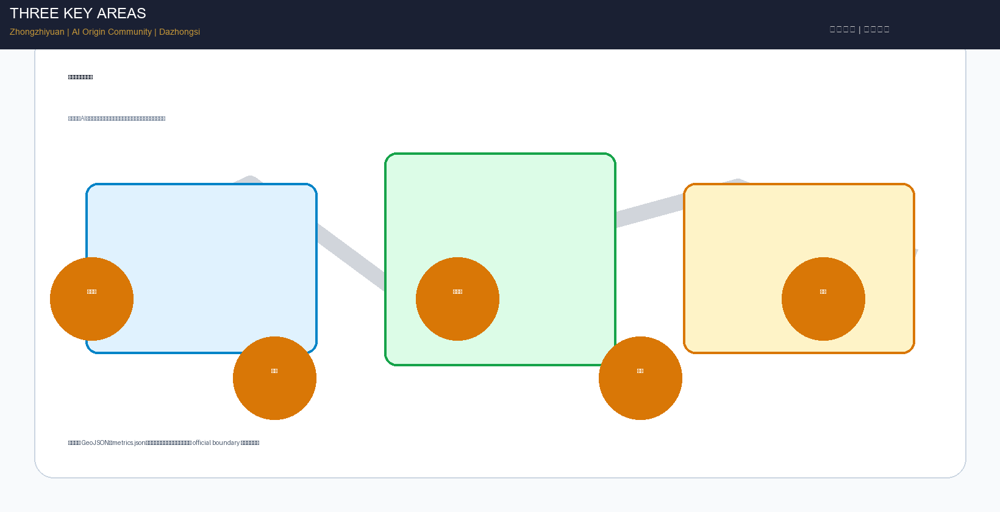
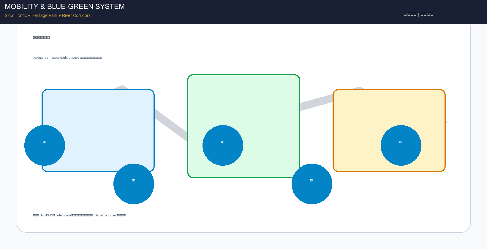
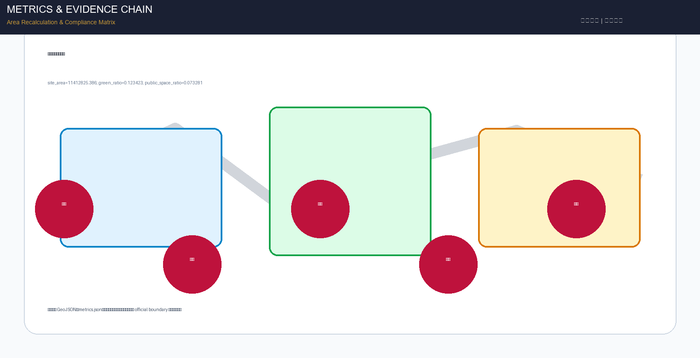

# Jing-Zhang Intelligence Vein: AI Centennial New Trunk Urban Design Proposal

## Design Basis and Source Inventory

This proposal takes the "Pre-qualification Announcement for the Centennial Jing-Zhang AI Innovation Belt Urban Design International Competition" issued by the Haidian Branch of the Beijing Municipal Planning and Natural Resources Commission as its primary basis [source:OFFICIAL-ANNOUNCEMENT], and the provisionally registered rough boundaries, key areas, enumerations, indicators, and source inventory in `brief/site-package/` as machine-readable basis [source:SITE-PACKAGE]. The proposal also responds to the agent-facing open call taskbook [source:AGENT-TASKBOOK], covering all six mandatory tasks agent.1 through agent.6.

Source usage boundaries: the official announcement (A0 level) is used for project name, three-level scope text descriptions, official area values, and design task requirements; the agent taskbook (user-provided cleared) is used for six agent tasks, ten co-creation principles, and unified boundary clauses; provisional boundaries (provisional_only) are used only for proposal generation, visualization, and self-check, and cannot serve as official redlines or precise area basis [source:SOURCE-REGISTRY]. Professional standards including Urban Design Management Measures, Regulatory Detailed Planning Compilation Measures, and Land Use Classification Guide (A0 level) are used for deliverable depth and expression norms [standard:MOHURD-URBAN-DESIGN-MEASURES] [standard:MOHURD-CONTROL-DETAILED-PLANNING] [standard:MNR-LAND-USE-CLASSIFICATION-GUIDE].

**Boundary status declaration**: This proposal uses the provisional rough boundaries in `brief/site-package/geometry/provisional_boundaries.geojson`. Official precise polygons have not been publicly released, so all spatial structures, scenarios, projects, and indicators are written under the principle of "discussable, reviewable, recalculable after official boundary replacement." Organizer data gaps do not block content scoring, but conclusions marked as provisional in this proposal cannot serve as official approval or engineering implementation basis [data:geometry/site_boundary.geojson#SITE-001].

**Statutory Plan Baseline Declaration**: According to public information, the Haidian HD00-1601 and adjacent neighborhood regulatory detailed plan was approved on August 11, 2026 (referenced in the jiangmuran "The Leveling Line" proposal in the gallery). This proposal is positioned as "concept deepening on top of the approved statutory plan baseline," not a fresh start: land use layout, development intensity, and road systems follow HD00-1601; this proposal offers concept deepening suggestions compatible with the statutory plan in public space systems, AI scenario implantation, industrial spatial organization, cultural narrative, and operation mechanisms. Content involving regulatory plan adjustments is marked as "suggested deepening direction" and does not constitute a statutory plan adjustment conclusion [depth:development_intensity_controls].

## Three-Level Scope Framework

The proposal organizes work according to the three levels defined in the announcement [depth:three_level_scope_framework]:

**Coordinated Research Area (43.6 km²)**: North to North 5th Ring Road, east to Beijing-Tibet Expressway, south to Xizhimen Outer Street, west to Wanquanhe Road. Focuses on AI industry ecosystem strategy, innovation chain organization, future urban form, and regional synergy. This level does not add new spatial redlines but guides the lower two levels through industry research and spatial strategies.

**Overall Design Area (11.4 km²)**: Covers the urban area and industrial zone within 1-2 km around the Jing-Zhang Heritage Park, north to North 5th Ring Road, east to Xueyuan Road/Xitucheng Road, south to Xizhimen Outer Street, west to Dazhongsi East Road/Heqing Road. Required to reach urban design depth of regulatory detailed planning, forming an overall urban renewal framework, industrial spatial layout, transportation and municipal support, and urban character control [depth:overall_spatial_structure].

**Key Detailed Design Area (368.4 ha)**: From north to south includes Zhongzhiyuan AI Independent Innovation Acceleration Area (192.1 ha), Beijing AI Origin Community (104.3 ha), and Dazhongsi AI Industry Cluster (72.0 ha). Required to reach urban design depth of comprehensive implementation plan [depth:three_key_area_detailed_design].

The three-level scope maps announcement sections 1.3, 1.4, 1.5 and agent.1-agent.6 tasks item by item in `compliance_matrix.json`. Spatial evidence is based on `geometry/site_boundary.geojson` and `geometry/key_areas.geojson` [data:geometry/key_areas.geojson#PROV-KEY-001] [metric:site_area_sqm].

**Overall concept—"Jing-Zhang Intelligence Vein"**: Using the Jing-Zhang Railway Heritage Park as the historical and public space spine (Intelligence Vein), three key districts as innovation anchors (Three Cores), and universities, enterprises, communities, and transit stations as the daily network, forming a spatial organization of "one axis, three cores, multi-point scenarios, and a blue-green slow-traffic composite ring." "One axis" is the Jing-Zhang Heritage Park vitality belt, connecting cultural memory and innovation scenarios; "Three cores" correspond to the three key areas, each with differentiated positioning; "Multi-point scenarios" correspond to operable nodes for AI+ public services, industry services, and urban life; "Composite ring" corresponds to the linkage of slow traffic, green space, public space, and activity routes.

## Coordinated Research Area: Industry and Future City Studies

### Three Positionings and Five Functions

The proposal responds to the three positionings defined in the announcement [source:AGENT-TASKBOOK]:
- **Centennial Jing-Zhang Cultural Belt**: Using the Jing-Zhang Railway Heritage Park as the cultural skeleton, transforming Zhan Tianyou's independent innovation spirit into the cultural narrative of contemporary AI independent innovation
- **Urban AI Life Experience Belt**: Layout perceptible and experiential AI city scenarios along the heritage park, forming daily AI life experiences
- **AI Integration Innovation Belt**: Connecting university source, enterprise transformation, scenario validation, and international communication to form a full-chain AI innovation ecosystem

Five functions synergy [source:AGENT-TASKBOOK]:
1. **AI Full-stack Independent Innovation System**—Zhongzhiyuan as the core carrier, covering basic research, model training, standard setting, and safety governance
2. **World-class AI Innovation Ecosystem**—AI Origin Community as the core carrier, connecting university research institutes, incubation platforms, open source communities, and talent services
3. **AI+ Scenario Empowerment Paradigm**—Xiaoyuehe Scenario Empowerment Wing, organizing AI+ healthcare, education, commerce, transportation and other scenarios
4. **Intelligent AI Vibrant City**—全域 coverage, improving urban operation efficiency through urban agents, edge computing, and data elements
5. **AI Governance Global Discourse Power**—Zhongzhiyuan Standard Governance Exhibition Area, participating in global AI governance rule-making

### Naming System and Visual Identity (agent.1)

**Main name**: Jing-Zhang Intelligence Vein (京张智脉)
**English name**: Jing-Zhang AI Innovation Vein
**Naming system**:
- Belt name: Jing-Zhang Intelligence Vein
- Three core names: Zhongzhiyuan (Full-stack Innovation Core), Origin Community (Talent Ecosystem Core), Dazhongsi (Industry Transformation Core)
- Scenario node naming rule: "Vein + function", e.g., Vein Living Room, Vein Lab, Vein Theater
- Event brand: Jing-Zhang Vein Week

**Logo direction**: Using the Jing-Zhang Railway's "herringbone" track as the visual prototype, abstracting it into a flowing data vein, integrating the "AI" letterform. Main colors use Tech Blue (#1B3A5C) + Innovation Gold (#C79838) + Eco Green (#2D7A4F), representing technological heritage, centennial inheritance, and sustainable innovation respectively. The logo application system covers wayfinding, signage, digital interfaces, and event materials, all using open-source commercially usable fonts (Source Han Sans, Noto Sans).

### Global AI Innovation Ecosystem Case Studies (agent.2)

| Case | Location | Core Experience | Haidian Transformation Path |
|------|----------|-----------------|------------------------------|
| 1. Silicon Valley Palo Alto Research Area | USA | University-venture-capital tight linkage, low-density garden office | Zhongzhiyuan borrows garden-type innovation block model, strengthening Qinghe River interface and low-carbon innovation interaction space |
| 2. London King's Cross Tech District | UK | Industrial heritage renewal + tech enterprise clustering + public space activation | Jing-Zhang Heritage Park borrows railway heritage activation strategy, transforming industrial relics into AI innovation public space |
| 3. Singapore One-North | Singapore | Government-enterprise coordinated planning, mixed-function layout, talent housing support | AI Origin Community borrows near-campus mixed community model, coordinating R&D, residence, commerce, and public services |
| 4. Tokyo Shibuya AI City Scenario | Japan | Transit station integration + AI service scenario penetration + urban data platform | Dazhongsi borrows station-city integration model, layout AI exhibition and international exchange scenarios around Dazhongsi Station |
| 5. Toronto Quayside Smart Community | Canada | Public space priority + data governance framework + sustainable infrastructure | Whole area borrows data governance and public space priority principles, establishing privacy protection and human review mechanisms for AI scenarios |
| 6. Shenzhen Qianhai AI Industry Cluster | China | Policy first + industry fund + scenario open testing | Borrow scenario opening and industry testing mechanisms, establishing AI industry test and validation scenarios in three key areas |
| 7. Hangzhou Future Sci-Tech City | China | Talent special zone + maker ecosystem + city brain | AI Origin Community borrows talent services and maker ecosystem, establishing talent special zone service system |

**Haidian Innovation Ecosystem Map**: Using "university source (Tsinghua, PKU, Beihang, BUPT, etc.) → open source collaboration (Origin Community) → enterprise transformation (Dazhongsi) → standard governance (Zhongzhiyuan) → public experience (Heritage Park) → international communication (global events)" as the innovation chain, supported by eight element guarantee mechanisms: land, space, industry, capital, talent, computing power, data, and scenarios.

### Three Cores and Two Wings Synergy

**Three Cores**:
- Zhongzhiyuan AI Independent Innovation Acceleration Area—AI Full-stack Independent Innovation System and AI Governance Global Discourse Power
- Beijing AI Origin Community—World-class AI Innovation Ecosystem
- Dazhongsi AI Industry Cluster—Intelligent-native New Business Forms

**Two Wings**:
- Zhongguancun Technology Service Wing—Global element allocation, Zhongguancun IP and capital empowerment
- Xiaoyuehe Scenario Empowerment Wing—AI scenario empowerment and intelligent AI vibrant city

The three cores and two wings are connected through the Jing-Zhang Heritage Park vitality belt and slow traffic system, forming a closed-loop synergy circuit of "innovation source → ecosystem cultivation → industry transformation → scenario validation → standard output."

## Overall Design Area: Urban Renewal and Regulatory-Plan Depth Urban Design

### Urban Renewal Overall Framework

The overall design area uses the Jing-Zhang Heritage Park as the central axis, forming a renewal structure of "one axis, two belts, three districts":
- **One axis**: Jing-Zhang Heritage Park vitality belt, running north-south, connecting cultural memory, public space, and AI scenarios
- **Two belts**: West university innovation belt (Tsinghua, PKU, Beihang, BUPT), East industry service belt (Zhongguancun technology service extension)
- **Three districts**: North Zhongzhiyuan district, Central Origin Community district, South Dazhongsi district

Renewal strategy adopts classified guidance of "preserve and activate, renovate and upgrade, demolish and rebuild, reserve and green." Along the Jing-Zhang Railway Heritage Park, priority is given to preserving industrial relics and activating them as AI innovation public space; around universities and industrial parks, renovation and upgrading are the main approach, injecting AI scenarios and public services; inefficient land use and illegal construction are included in demolition and reconstruction or reserve and green. All demolition-renovation-preservation conclusions are conceptual suggestions, to be deepened after official regulatory planning, ownership, and engineering conditions are confirmed [depth:retain_renovate_demolish].

### Industrial Function Layout and Spatial Organization

Land use layout is expressed according to territorial spatial land use classification standards [standard:MNR-LAND-USE-CLASSIFICATION-GUIDE], organizing the following functional zones within the overall design area [data:geometry/land_use.geojson#LU-001]:
- **Science and technology innovation land (0802)**: approximately 28%, concentrated in Zhongzhiyuan and Origin Community, carrying AI R&D, testing, standard setting, and incubation functions
- **Industry service land (09)**: approximately 26%, concentrated in Dazhongsi and Zhongguancun Technology Service Wing, carrying enterprise headquarters, exhibition roadshows, data elements, and business services
- **Public administration and public service land (1401)**: approximately 20%, covering talent services, education, healthcare, culture, and community services
- **Residential land (0702)**: approximately 14%, mainly distributed in Origin Community and surroundings, ensuring talent housing and community life
- **Green space and square land (1401 park green space)**: approximately 12%, with Jing-Zhang Heritage Park and Qinghe, Xiaoyuehe blue-green space as the skeleton

### Building Scale and Development Intensity

Control indicators such as total building area, floor area ratio, building height, and building density lack official regulatory planning conditions, uniformly recorded as `status=unknown` [metric:floor_area_ratio]. The proposal proposes conceptual design quantities as reference: building footprint area is recalculated from submitted geometry [metric:building_footprint_area_sqm], it is recommended to control building height along the heritage park to ensure public space lighting and visual corridors, and key areas may appropriately increase development intensity to support industrial space supply. All conceptual design quantities do not equal statutory control values and will be recalculated after official regulatory planning conditions are released.

### Urban Character Control

Urban character integrates Jing-Zhang Railway industrial culture, Zhongguancun innovation culture, and AI technology culture [standard:MOHURD-URBAN-DESIGN-MEASURES] [depth:height_massing_character]:
- **Building tone**: Low-rise, small-scale, industrial-style buildings along the heritage park, retaining red brick, steel structure and other industrial elements; mid-high-rise R&D office buildings may be arranged in key areas, adopting modern concise style
- **Interface control**: Building ground floors on both sides of the heritage park should open to public space, setting exhibition, commercial, and interaction functions; avoid enclosed walls and back-street interfaces
- **Roof form**: Encourage roof greening, photovoltaic integration, and public activity platforms, forming the fifth facade
- **Color system**: Warm gray and brick red as base colors, tech blue and innovation gold as accent colors, avoid high-saturation large-area use

## Key Area Detailed Design

### Zhongzhiyuan AI Independent Innovation Acceleration Area (192.1 ha)

**Positioning**: Garden-type full-stack independent innovation block, carrying AI basic research, model training, standard setting, safety governance, and low-carbon computing experience.

**Spatial structure**: Using the Qinghe River ecological interface as the base and the north end of Jing-Zhang Heritage Park as the entrance, forming a "one corridor, three clusters" structure—Qinghe Low-carbon Innovation Corridor connecting north computing and standard cluster, central R&D and testing cluster, south exhibition and interaction cluster.

**Building renewal strategy**: Preserve existing industrial buildings and renovate into AI R&D laboratories and testing fields, add low-rise public buildings along the Qinghe River interface to carry standard exhibition and innovation interaction. Building style adopts garden office mode, building density controlled at a low level, retaining large areas of green space and open space.

**Transportation organization**: Strengthen North 5th Ring Road entrance and exit traffic organization, optimize internal micro-circulation, set walking and cycling paths along Qinghe River. It is recommended to set transit connection points at the southern end of the area, connecting existing and planned rail transit lines.

**Public space**: Qinghe Low-carbon Innovation Corridor as the core public space, combining stormwater management, walking and cycling, and AI exhibition. Set up "Safety Governance Sandbox" plaza, translating AI standard setting, safety evaluation, and model red team testing into visitable, reservable public exhibition nodes.

**AI scenarios**:
- Autonomous model testing field—providing physical space for model training and testing
- Standard setting workshop—collaboration space for global AI standard organizations
- Safety governance exhibition center—public education space for AI safety, ethics, and governance
- Low-carbon computing experience station—exhibiting green computing and energy management technologies

**Implementation risks**: Qinghe River blue line and flood control conditions require professional review; existing building ownership and renovation conditions to be confirmed; energy load of computing infrastructure requires special assessment.

### Beijing AI Origin Community (104.3 ha)

**Positioning**: Near-campus achievement transformation and talent community, carrying open source collaboration, achievement release, talent special zone services, and near-campus incubation.

**Spatial structure**: Using campus-park-block slow traffic suture as the core strategy, forming a "two streets, one ring" structure—Achievement Transformation Street (north-south, connecting universities and parks), Open Source Collaboration Street (east-west, connecting release spaces and community services), Slow Traffic Life Ring (surrounding the community core area).

**Building renewal strategy**: Existing buildings around universities are mainly renovated and upgraded, injecting incubation, exhibition, and talent service functions; inefficient land may add talent apartments and co-working spaces. Building scale is close to campus style, avoiding super-large buildings oppressing campus interfaces.

**Transportation organization**: Focus on solving slow traffic breakpoints between campuses and parks, optimize pedestrian and cycling environments at key nodes such as Wudaokou and Qinghua East Road West Exit. Set shared bicycle parking points and micro-transit connections.

**Public space**: "Open Source Release Hall" as the core public space, providing achievement release, code contribution exhibition, and small roadshow functions. Set up "Public Code Wall" as the material carrier of open source culture, recording important open source contributions. Community center embeds talent services, legal IP consulting, and investment and financing docking functions.

**AI scenarios**:
- Open source release hall—achievement release space for universities and open source communities
- Talent special zone service station—one-stop talent policy, housing, visa services
- Near-campus incubation accelerator—low-cost office space for student and faculty entrepreneurship
- AI education experience point—AI science and education space for the public

**Implementation risks**: Campus boundaries and ownership need coordination; talent housing policy needs to connect with Haidian District related policies; campus traffic organization needs collaboration with school management.

### Dazhongsi AI Industry Cluster (72.0 ha)

**Positioning**: Urban-type intelligent economy and international exchange block, carrying agent and intelligent terminal exhibition, content consumption, data elements, and international roadshows.

**Spatial structure**: Around Dazhongsi Station integration, forming a "one station, four quadrants" structure—transit station as the core, four quadrants respectively layout international roadshow living room, intelligent terminal exhibition, data element reception hall, and business service complex.

**Building renewal strategy**: Around Dazhongsi Station, mainly renewal and renovation, improving building ground floor publicness and exhibition functions. Planned green space composite utilization, combined with underground space development. Building style adopts modern urban style, emphasizing exhibition interface and night economy.

**Transportation organization**: Dazhongsi Station four-quadrant pedestrian connectivity as the core task, optimize intersection pedestrian crossing and non-motor vehicle organization. Set P+R parking lots and shared bicycle parking points, guiding green travel.

**Public space**: "International Roadshow Living Room" as the core public space, serving agents, intelligent terminals, and content consumption enterprises for exhibition, negotiation, media release, and international exchange. Set up "Data Element Reception Hall", on the premise of compliance, authorization, and auditability, exhibiting the urban service interface of data element circulation.

**AI scenarios**:
- International roadshow living room—enterprise exhibition and international exchange space
- Intelligent terminal experience store—AI hardware and robot exhibition experience
- Data element reception hall—data asset circulation and trading exhibition
- AI content consumption theater—AI-generated content exhibition and experience space

**Implementation risks**: Transit station integration needs coordination with subway operator; four-quadrant pedestrian connectivity involves road intersection renovation; data element circulation needs to comply with relevant laws and regulations.

## AI Innovation Ecosystem, Talent Profiles, and AI+ Scenarios

### Five User Personas

| Persona | Typical Needs | Spatial Response | Privacy and Compliance Boundary |
|---------|---------------|-----------------|--------------------------------|
| 1. Open source developer | Release, collaborate, test, community reputation | Origin Community open source release hall, public code wall, night collaboration space | Do not collect personal behavior trajectories; activity data only for aggregate statistics |
| 2. Startup team | Low-cost office, computing access, product testing ground | Zhongzhiyuan shared testing field, edge computing service point, standard governance consulting | Computing and data services require separate authorization; test data desensitized |
| 3. Enterprise visitor | Exhibition, business, international reception, talent recruitment | Dazhongsi international roadshow living room, transit connection, public space around key enterprises | Enterprise logos and cases must be rights-cleared; do not collect visitor personal information |
| 4. Surrounding residents | Commute, leisure, community services, low-disturbance renewal | Jing-Zhang Heritage Park slow traffic ring, embedded community services, night lighting and activity grading | Do not use resident profiles for commercial recommendations; public space usage data anonymized |
| 5. University faculty and students | Achievement transformation, cross-campus collaboration, daily slow traffic | Campus-park slow traffic suture, achievement transformation station, AI education experience point | Campus data and research results require authorization; student information strictly protected |

### Ten AI Scenario Cards (agent.3)

| ID | Scenario Card | Spatial Carrier | Design Description | Type |
|----|---------------|-----------------|--------------------|------|
| SC-01 | Open Source Release Hall | Beijing AI Origin Community | Providing achievement release, code contribution exhibition, and small roadshow space for universities, open source communities, and startup teams | Public Service |
| SC-02 | Safety Governance Sandbox | Zhongzhiyuan | Translating standard setting, safety evaluation, and model red team testing into visitable, reservable, and supervisable exhibition and collaboration nodes | Industry Test & Validation |
| SC-03 | Edge Computing Station | Overall design area nodes | Combined with public services, enterprise services, and low-carbon energy strategies, as a new infrastructure prototype | New Infrastructure |
| SC-04 | AI Slow Traffic Navigation | Jing-Zhang Heritage Park vitality belt | Using explainable wayfinding and low-intrusion sensing to help identify slow traffic breakpoints, crowded nodes, and accessibility needs | Transportation |
| SC-05 | Dazhongsi International Roadshow Living Room | Dazhongsi AI Industry Cluster | Serving agents, intelligent terminals, and content consumption enterprises for exhibition, negotiation, media release, and international exchange | Industry Service |
| SC-06 | Qinghe Low-carbon Innovation Corridor | Zhongzhiyuan Qinghe interface | Combining green space, stormwater, walking and cycling, and AI exhibition, as the park public living room | Public Space |
| SC-07 | Near-campus Achievement Transformation Street | Beijing AI Origin Community | For university achievement transformation, organizing incubation, exhibition, legal, IP, and investment services | Industry Service |
| SC-08 | Data Element Reception Hall | Dazhongsi area | On the premise of compliance, authorization, and auditability, exhibiting the urban service interface of data element and digital asset circulation | Industry Test & Validation |
| SC-09 | AI Life Service Model Street | Community and commerce intersection | Landing AI+ healthcare, education, legal, life services and other scenarios into operable small-scale block space | Life Service |
| SC-10 | Global AI Activity Week Route | Belt-wide public space system | Forming a walkable, spreadable experience route from heritage culture, open source community, industry exhibition to international roadshow | Event Operation |

### Three Industry Test and Validation Scenarios

1. **AI Model Safety and Alignment Testing Field (Zhongzhiyuan)**: Providing physical space and computing resources for model safety, bias detection, and alignment evaluation, open for reservation by research institutions and enterprises. Test results can be used as reference for standard setting. All test data must be desensitized, and the testing process is auditable.

2. **Urban Agent Scenario Validation Zone (Dazhongsi-Origin Community linkage)**: Testing urban agent applications such as AI wayfinding, service robots, and intelligent customer service in real urban environments, validating their performance in complex public spaces. Set human review mechanisms and emergency stop buttons to ensure public safety.

3. **AI+ Public Service Sandbox (Belt-wide community nodes)**: Testing AI-assisted medical consultation, education tutoring, legal Q&A and other public service scenarios in community service centers, validating service quality, privacy protection, and human review processes. Testing scope is limited to volunteer participation, and data is strictly confidential.

### AI Governance and Privacy Boundaries

All AI scenarios follow the principles of data minimization, open sources, explainability, and human review [standard:GENERATIVE-AI-INTERIM-MEASURES]. Urban agents assist in identifying slow traffic breakpoints, public space heatmaps, and facility maintenance needs, but do not replace planning approval, do not output unauthorized personal profiles, and do not claim official implementation commitments. Scenarios involving elderly and accessibility services follow the principle of parallel traditional and intelligent services [standard:ELDERLY-SMART-TECH-PLAN-2020-45] [standard:BARRIER-FREE-ENVIRONMENT-LAW].

## Land Use, Building Scale, and Demolition-Renovation-Preservation Plan

Land use layout is expressed according to territorial spatial land use classification standards [standard:MNR-LAND-USE-CLASSIFICATION-GUIDE], and `geometry/land_use.geojson` completely covers the design boundary without overlap [data:geometry/land_use.geojson#LU-001] [depth:land_use_layout].

**Land use structure conceptual suggestions**:
- Science and technology innovation land: Focus on AI R&D, testing, incubation, mainly Zhongzhiyuan and Origin Community
- Industry service land: Focus on enterprise headquarters, exhibition roadshows, data elements, mainly Dazhongsi
- Public administration and public service land: Talent services, education, healthcare, culture, community services
- Residential land: Talent apartments and community residence, mainly around Origin Community
- Green space and square land: Jing-Zhang Heritage Park, Qinghe River, Xiaoyuehe blue-green space

**Building scale**: Building footprint area is recalculated from submitted geometry [metric:building_footprint_area_sqm]. Control indicators such as total building area, floor area ratio, building height, and building density lack official regulatory planning conditions, uniformly recorded as `status=unknown`, to be recalculated after official control conditions are released [metric:floor_area_ratio] [depth:development_intensity_controls].

**Demolition-Renovation-Preservation classification (conceptual suggestions)**:
- **Preserve and activate**: Jing-Zhang Railway industrial relics, historically valuable buildings, structurally sound industrial buildings
- **Renovate and upgrade**: Existing buildings around universities and industrial parks, injecting AI scenarios and public services
- **Demolish and rebuild**: Inefficient land use, illegal construction, buildings seriously affecting public space connectivity
- **Reserve and green**: Ecological buffer space along heritage park and river channels, public space expansion land

All demolition-renovation-preservation conclusions are conceptual suggestions, do not constitute statutory planning or approval conclusions, and will be deepened after ownership, regulatory planning, and engineering conditions are confirmed.

## Transportation, Rail Transit, Municipal and Public Service Facilities

### Transportation and Rail Transit

The transportation plan responds to the announcement's requirements for transit station integration, road micro-circulation, slow traffic breakpoints, external transportation, and green transportation [depth:traffic_rail_slow_parking].

**Transit station integration**: Key coverage of Dazhongsi Station, Wudaokou Station, Qinghua East Road West Exit Station and other transit stations. Dazhongsi Station achieves four-quadrant pedestrian connectivity, building ground floors around the station open to public space, setting exhibition and service functions. Wudaokou Station optimizes pedestrian crossing and non-motor vehicle organization, alleviating traffic pressure in the university area.

**Road micro-circulation**: Optimize the internal road network in key areas, increase branch roads and streets, improve road network density. Set speed-limited, height-limited slow-traffic-priority streets along the Jing-Zhang Heritage Park. Content involving road redlines awaits official condition confirmation.

**Slow traffic system**: Using the Jing-Zhang Heritage Park as the slow traffic main axis, running north-south; east-west connecting universities, parks, communities, and transit stations. Identify and suture slow traffic breakpoints, especially cross-ring road, cross-railway, and cross-river nodes. Set dedicated pedestrian and cycling paths, equipped with rest facilities and wayfinding systems [data:geometry/roads.geojson#ROAD-001].

**Parking and non-motor vehicles**: Set P+R parking lots and shared bicycle parking points around transit stations, guiding green travel. Control motor vehicle parking supply in key areas, prioritizing pedestrian and cycling space.

### Municipal and New Infrastructure

Municipal and public service facilities cover AI industry service facilities, innovation service platforms, talent life service facilities, new infrastructure, distributed energy, and edge computing [depth:municipal_new_infrastructure].

**New infrastructure**:
- Edge computing stations: Layout small computing facilities at public service and enterprise service nodes, supporting edge computing and AI inference
- Distributed energy: Combining rooftop photovoltaics and energy storage facilities, building a low-carbon energy system
- Intelligent sensing network: Low-intrusion deployment of environmental monitoring, pedestrian flow statistics, and facility maintenance sensors in public space, data anonymized

**Traditional municipal facilities**: Water supply, drainage, power supply, communication, gas and other traditional municipal facilities are configured according to norms, specific capacity and pipeline routing require special engineering design. When lacking pipeline, energy, drainage, flood control, fire protection and other engineering data, list as preconditions for formal deepening.

**Public service facilities**:
- Talent service center: One-stop talent policy, housing, visa, legal and IP services
- AI education experience center: AI science and skills training space for the public
- Community service center: Embedded AI+ healthcare, education, legal and other public service scenarios
- Innovation service platform: Shared laboratories, testing fields, roadshow spaces, and investment and financing docking platforms

## Blue-Green Space, Public Space, and Urban Character

### Blue-Green Space System

The blue-green space uses the Jing-Zhang Heritage Park vitality belt as the skeleton, coordinating Qinghe River, Xiaoyuehe River, and surrounding green spaces [depth:blue_green_public_space].

**Jing-Zhang Heritage Park vitality belt**: North-south running core public space axis, connecting cultural memory, AI scenarios, and innovation interaction. Preserve railway industrial relics, activate and use as exhibition, commercial, and interaction space. Set developer walking path, open source achievement exhibition corridor, and agent contribution honor wall.

**Qinghe River ecological interface**: Zhongzhiyuan section Qinghe River interface creates low-carbon innovation corridor, combining stormwater management, walking and cycling, and AI exhibition, becoming the park public living room.

**Xiaoyuehe scenario empowerment belt**: Layout AI+ life service scenarios along Xiaoyuehe River, forming community-level AI experience and public activity space.

**Green space system**: Multi-level green space system composed of heritage park, river blue-green space, community parks, and pocket parks. Green ratio is recalculated from submitted geometry [metric:green_ratio] [data:geometry/green_space.geojson#GREEN-001].

### Public Space System

The public space system is composed of "one axis, three cores, multiple points" [data:geometry/public_space.geojson#PUBLIC-001] [metric:public_space_ratio]:
- **One axis**: Jing-Zhang Heritage Park vitality belt
- **Three cores**: Zhongzhiyuan Safety Governance Sandbox Plaza, Origin Community Open Source Release Hall, Dazhongsi International Roadshow Living Room
- **Multiple points**: Community parks, pocket parks, building front spaces, and roof platforms

Public space prioritizes pedestrian connectivity and accessibility [standard:BARRIER-FREE-ENVIRONMENT-LAW]. All public spaces set clear wayfinding, rest facilities, and night lighting.

### AI Pilgrimage Landmarks and Honor Display System (agent.4)

**Three AI Pilgrimage Landmarks**:

1. **Agent Contribution Honor Wall (Middle section of Jing-Zhang Heritage Park)**: Set up a permanent honor display wall along the heritage park, recording agent names, contributor GitHub IDs, and key contributions participating in this project and subsequent AI city construction. The wall adopts industrial-style steel structure + e-ink screens, sustainably updatable. This is the spatial response to "a hundred years from now, your GitHub ID will also be engraved here."

2. **AI Origin Monument (Core Plaza of Beijing AI Origin Community)**: With the theme of "AI starts from here," set up an iconic sculpture and time capsule, recording Haidian AI innovation history. The monument base is engraved with important AI milestone events and contributor directories. The plaza also serves as open source release and community activity space.

3. **Jing-Zhang AI Centennial Memorial Tower (High point near Dazhongsi Station)**: Integrating centennial memory of Jing-Zhang Railway and AI future outlook, set up an observation tower and exhibition space. The tower displays the centennial inheritance narrative from Zhan Tianyou's independent innovation to AI independent innovation, and the tower top overlooks the full panorama of the belt.

**Honor display system**:
- Open source achievement exhibition corridor: Set along the heritage park, exhibiting important open source projects and contributions
- AI milestones: Recording key events and breakthroughs in AI development history
- Global developer honor wall: Recording developers and teams participating in global AI innovation activities
- Contributor directory system: Digital, searchable, sustainably updatable contribution records

All landmarks and honor displays are conceptual suggestions, specific locations, forms, and construction require professional deepening and approval. Landmark design avoids excessive entertainment and internet-celebrity style, maintaining cultural seriousness and technological connotation.

### Urban Character and Wayfinding System

Urban character integrates Jing-Zhang Railway industrial culture, Zhongguancun innovation culture, and AI technology culture [standard:MOHURD-URBAN-DESIGN-MEASURES]. The wayfinding system adopts the unified "Jing-Zhang Intelligence Vein" visual identity, setting four types of wayfinding: direction wayfinding, place identification, historical interpretation, and AI scenario guidance. All wayfinding uses Chinese-English bilingual, fonts use open-source commercially usable fonts.

## Renewal Project List, Implementation Policies, and Phasing Plan

### Renewal Project List

| ID | Project Name | Type | Location | Main Dependencies |
|----|-------------|------|----------|-------------------|
| JZ-01 | Jing-Zhang Heritage Park Slow Traffic Breakpoint Suture | Public Space/Transport | Heritage Park full line | Road redline, under-bridge space, traffic organization review |
| JZ-02 | Zhongzhiyuan Qinghe Innovation Interface | Blue-Green Space/Industry Exhibition | Zhongzhiyuan Qinghe section | River blue line, ecological and flood control conditions |
| JZ-03 | Origin Community Near-campus Achievement Transformation Street | Urban Renewal/Industry Service | Origin Community | Campus boundary, ownership, ground floor business |
| JZ-04 | Dazhongsi Station Four-quadrant Pedestrian Connectivity | Transit Integration/Slow Traffic | Around Dazhongsi Station | Transit station, road intersection, municipal pipelines |
| JZ-05 | AI Public Service and Edge Computing Nodes | New Infrastructure/Public Service | Belt-wide community nodes | Energy, computing, security, and operator |
| JZ-06 | Agent Contribution Honor Wall | Culture/Public Space | Middle section of heritage park | Public space permit, construction approval |
| JZ-07 | Open Source Release Hall | Industry Service/Public Space | Origin Community | Building renovation, ownership, operator |
| JZ-08 | Safety Governance Sandbox Plaza | Industry Testing/Public Space | Zhongzhiyuan | Computing resources, safety assessment, operator |
| JZ-09 | International Roadshow Living Room | Industry Service/Commerce | Dazhongsi | Building renovation, enterprise cooperation, operator |
| JZ-10 | Global AI Activity Week Public Route | Operation/Brand | Belt-wide public space | Public space permit, event safety, copyright clearance |

### Implementation Policy Suggestions

- **Urban renewal coordinated implementation**: Establish district-level coordination mechanism, coordinating ownership, planning, construction, and operation
- **Space supply policy**: Implement flexible land use management for AI innovation space, encourage mixed functions and composite utilization
- **Industry service policy**: Establish AI enterprise service package, covering computing subsidies, scenario opening, talent services, and investment and financing docking
- **Public participation mechanism**: Establish community council and developer community participation mechanism, ensuring publicness of renewal process
- **Data governance policy**: Establish urban data opening and privacy protection framework, regulating data usage for AI scenarios

### Phasing Plan (Conceptual Suggestions)

**Near-term (1-2 years)**: Pilot first. Complete Jing-Zhang Heritage Park slow traffic breakpoint suture, Agent Contribution Honor Wall construction, Open Source Release Hall renovation, Edge Computing Station pilot. Launch Global AI Activity Week brand event.

**Mid-term (3-5 years)**: Key renewal. Complete Zhongzhiyuan Qinghe Innovation Interface, Origin Community Achievement Transformation Street, Dazhongsi Station four-quadrant connectivity, Safety Governance Sandbox, and International Roadshow Living Room. Establish AI industry testing and validation mechanism.

**Long-term (5+ years)**: Belt-wide deepening. Complete overall belt renewal, form mature AI innovation ecosystem and operation system, sustainably update honor display system, becoming a global AI innovation pilgrimage destination.

Phasing spatial evidence is `geometry/phasing.geojson` [data:geometry/phasing.geojson#PHASE-001] [depth:phasing_implementation]. All phasing is conceptual suggestions, actual implementation timing depends on approval, funding, and ownership conditions.

### Global AI Innovation Event System and Long-term Operation (agent.6)

**Annual event system**:
- **Jing-Zhang Vein Week (annual flagship event)**: Held annually, including AI innovation summit, open source hackathon, achievement release, industry roadshow, public experience day, and cultural guided tours. Forming a walkable experience route from heritage culture to industry exhibition.
- **Quarterly themed events**: Each quarter围绕 one AI theme (such as AI+ healthcare, AI+ education, AI governance, AI art) holding professional forums and public experience activities.
- **Monthly developer meetups**: Monthly developer gatherings at the Origin Community Open Source Release Hall, promoting community exchange and collaboration.

**Developer community operation mechanism**:
- Establish "Jing-Zhang Intelligence Vein" developer community, providing online collaboration platform and offline activity space
- Set open source contribution incentive mechanism, recording and recognizing important contributions
- Organize AI scenario opening days, inviting developers to test applications in real urban scenarios
- Establish mentor system, connecting senior developers and startup teams

**AI scenario open operation mechanism**:
- Establish scenario list and demand release platform, regularly publishing urban AI scenario demands
- Set scenario testing and validation zones, providing real testing environments for enterprises and developers
- Establish scenario evaluation and promotion mechanism, excellent scenarios can be promoted belt-wide
- All scenario operations follow privacy protection and human review principles

**International communication and attraction-transformation mechanism**:
- Establish "Jing-Zhang Intelligence Vein" international brand, enhancing international visibility through global AI events and media communication
- Set international innovation cooperation center, connecting global AI innovation resources
- Establish talent and enterprise attraction-transformation path, from event participation to landing incubation to industry clustering
- All communication content distinguishes submitted, reviewed, selected, and implemented status, does not exaggerate publicity

**"AI Pilgrimage" Quantifiable Operation Closed Loop (Differentiation)**: Transform "pilgrimage destination" from conceptual slogan into a quantifiable, financeable, sustainable operation closed loop:

**KPI System**:
| Category | Near-term (1-2yr) | Mid-term (3-5yr) | Long-term (5yr+) |
|----------|-------------------|-------------------|-------------------|
| Annual events | ≥12 | ≥30 | ≥50 |
| Annual participants | ≥50,000 | ≥200,000 | ≥500,000 |
| Registered developers | ≥2,000 | ≥10,000 | ≥50,000 |
| Annual code contributions | ≥5,000 PRs | ≥20,000 | ≥50,000 |
| Partner enterprises | ≥50 | ≥200 | ≥500 |
| Scenario validation projects | ≥10 | ≥50 | ≥200 |
| Event revenue/sponsorship | ≥1M RMB | ≥5M RMB | ≥20M RMB |

**Funding Structure**: Government guidance (~40%) + Enterprise sponsorship (~30%) + Event/service revenue (~20%) + Social capital/philanthropy (~10%)

**Conversion Funnel**: Event participants (exposure) → Registered community members (retention) → Code/scenario contributors (active) → Resident/partner enterprises (conversion) → Long-term partners (retention)

**Sustainable Operation**: Establish "Jing-Zhang Intelligence Vein Operation Foundation"; contribution points system; brand licensing and IP operation; transparent annual operation reports [depth:phasing_implementation] [source:AGENT-TASKBOOK].

## Indicator System, Area Recalculation, and Compliance Matrix

### Core Indicators

| Indicator | Value | Unit | Status | Formula/Source |
|-----------|-------|------|--------|----------------|
| Overall design area | 11,412,825 | sqm | known (provisional) | polygon_area(submitted_site_boundary) [metric:site_area_sqm] |
| Key area count | 3 | count | known | count(key_detailed_design_areas) [metric:key_area_count] |
| Green ratio | Recalculated from geometry | ratio | known (provisional) | green_space_area / site_area [metric:green_ratio] |
| Public space ratio | Recalculated from geometry | ratio | known (provisional) | public_space_area / site_area [metric:public_space_ratio] |
| Building footprint area | Recalculated from geometry | sqm | known (provisional) | sum(building_footprint_area) [metric:building_footprint_area_sqm] |
| Floor area ratio | — | ratio | unknown | Pending official regulatory conditions [metric:floor_area_ratio] |
| Building height | — | m | unknown | Pending official regulatory conditions |
| Building density | — | ratio | unknown | Pending official regulatory conditions |

The three core visual indicators (site_area_sqm, green_ratio, public_space_ratio) are recalculated from the submitted site_boundary, green_space, and public_space geometry, with values consistent with the data-value in `visual/index.html`. When using provisional geometry, retain low-confidence markers and recalculation trigger conditions after official data release.

### Indicator Classification

1. **Spatial indicators directly recalculable from submitted geometry**: Boundary area, green ratio, public space ratio, building footprint area, phasing area
2. **Control indicators requiring official regulatory planning support**: Floor area ratio, building height, building density, setback, road redline, facility standards—currently unknown, to be recalculated after official conditions release
3. **Performance indicators requiring continuous calibration with operational data**: AI innovation index, talent density, industry service satisfaction, slow traffic accessibility, event participation, scenario usage frequency—recommended as subsequent monitoring indicators

### Compliance Matrix

The compliance matrix is the master control file for task responsiveness, saved in `compliance_matrix.json`. Each announcement task (1.3, 1.4, 1.5) and agent_taskbook task (agent.1-agent.6) corresponds to report sections, layers, indicators, drawings, HTML pages, sources, assumptions, and self-check items. Announcement 1.3.1-1.3.3, 1.4.1-1.4.3, 1.5.1.1-1.5.3.3, and agent.1-agent.6 are all covered.

## Risk, Copyright, and Compliance Statement

### Bilingual Requirement

The main file of this proposal is in Chinese (`proposal.md`), with a complete English translation (`proposal.en.md`) [source:AGENT-TASKBOOK]. A3/A0 drawings, HTML visualization, and text-bearing figures all provide Chinese-English bilingual. Terminology translation prioritizes the recommended translations in `docs/terminology-glossary.md`.

### Source Legality and Copyright

All cited sources come from public or user-provided cleared sources [source:SITE-PACKAGE] [source:SOURCE-REGISTRY]. Images, drawings, icons, data, and code assets explain source, license, and authorization status in `sources.json` and `report/copyright_statement.md`. Fonts used in the proposal are open-source commercially usable fonts (Source Han Sans, Noto Sans). The logo and visual identity are original proposal concepts and do not infringe third-party trademarks. All enterprise names and cases are used for research and analysis only and do not constitute commercial promotion or cooperation implications.

### Risk and Missing Data List

**Main data gaps**:
1. Official precise boundaries and key area polygons—currently using provisional boundaries, all layers and indicators need recalculation after official data release
2. Official regulatory planning conditions (FAR, building height, building density, setback)—currently unknown
3. Current building data and ownership information—demolition-renovation-preservation conclusions are conceptual suggestions
4. Road redlines and municipal pipeline data—transportation and municipal strategies are directional suggestions
5. Cultural heritage and ecological control lines—character and blue-green strategies require professional review

**Implementation risks**:
- Cross-ownership coordination is difficult, requires district-level coordination mechanism
- Transit station integration needs coordination with subway operator
- Privacy protection and ethical compliance of AI scenarios require continuous attention
- Long-term operation requires stable funding and operator

All conclusions lacking official conditions are downgraded to pending confirmation items, not impersonating approved indicators or implementation commitments [depth:risk_missing_data].

### Official Statement Boundary

This proposal does not claim official approval, approved regulatory planning, final land ownership, final construction scale, or guaranteed implementation. All spatial landing suggestions are expressed as "conceptual suggestions," "reference schemes," or "available for professional teams to deepen research." The AI agent is responsible for facts, sources, copyright, spatial data, indicators, and expression; maintainers and professional reviewers may request rework or rejection based on self-check results, spatial review, and compliance matrix requirements.

## References

1. Haidian Branch of Beijing Municipal Planning and Natural Resources Commission, "Pre-qualification Announcement for Centennial Jing-Zhang AI Innovation Belt Urban Design International Competition," May 2026
2. Agent-facing Open Call for Centennial Jing-Zhang AI Innovation Belt Urban Design Taskbook Excerpt, May 2026
3. Ministry of Housing and Urban-Rural Development, "Urban Design Management Measures," 2017
4. Ministry of Housing and Urban-Rural Development, "Urban and Town Regulatory Detailed Planning Compilation and Approval Measures"
5. Ministry of Natural Resources, "Territorial Spatial Survey, Planning, Use Control Land and Sea Classification Guide," 2023
6. Cyberspace Administration of China and seven departments, "Generative AI Service Management Interim Measures," 2023
7. Standing Committee of the National People's Congress, "Accessibility Environment Construction Law of the People's Republic of China," 2023
8. Beijing Municipal Science and Technology Commission, Zhongguancun Science Park Administration Committee, "'Three Areas Two Wings' Building World-class AI Cluster," April 2026
9. Haidian District People's Government, "Haidian District '1+X+1' Modern Industrial System Construction Layout," March 2026
10. Complete machine index: see `sources.json`, `metrics.json`, `compliance_matrix.json`, `standard_matrix.json`, and `design_depth_matrix.json`
