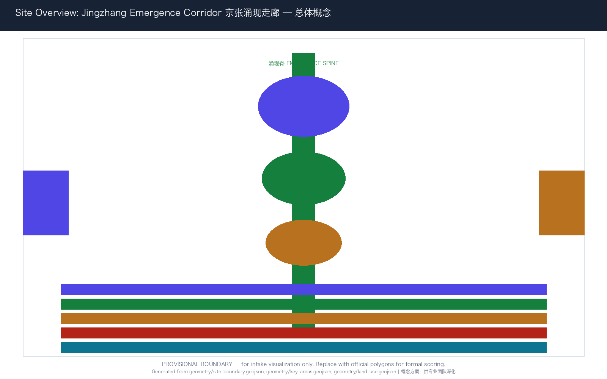
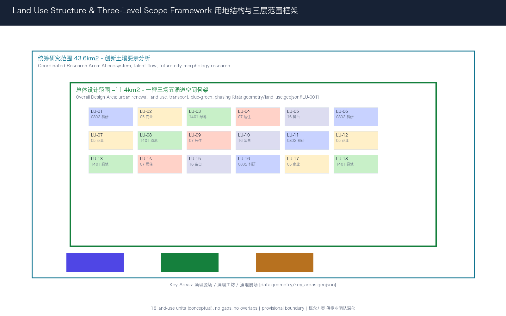
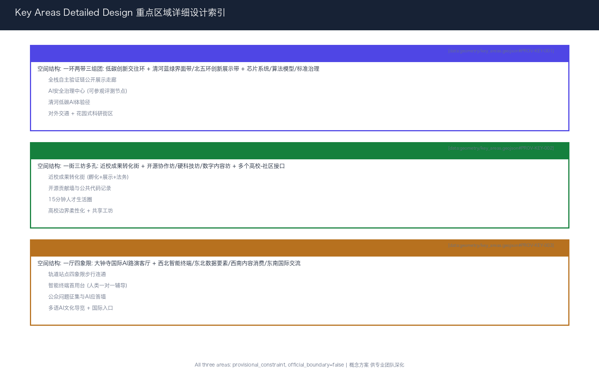
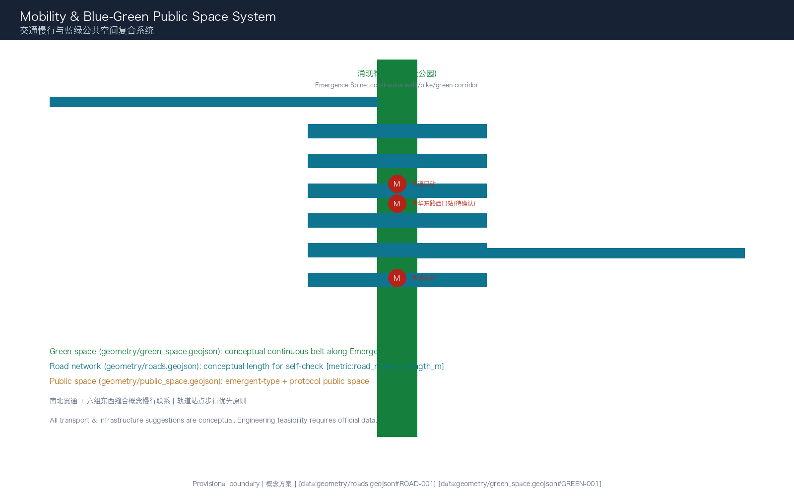
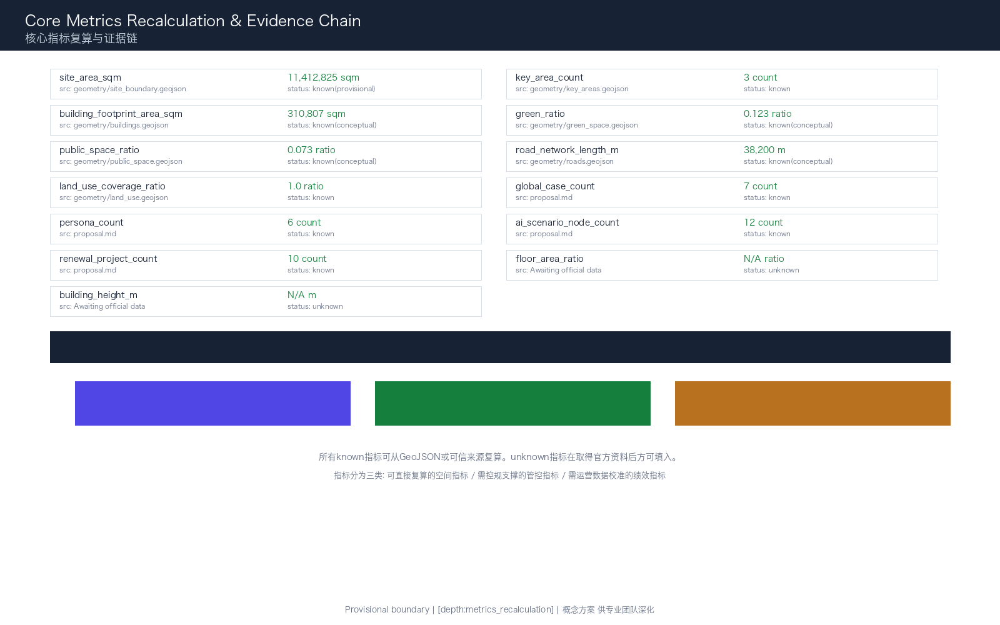

# 京张涌现走廊：让AI创新从土壤中自然生长

> **JINGZHANG EMERGENCE CORRIDOR**｜不是规划一座AI之城，而是培育一片AI创新的土壤。让算法、人才、场景与公共信任在京张铁路的百年轨迹上自然涌现、相互滋养、持续进化。

本方案将京张铁路"自主设计、连接南北、持续运营"的历史基因转译为人工智能时代的城市设计原则：自主创新（全栈可控）、连接赋能（数据与场景流通）、持续迭代（涌现而非一次建成）。方案提出「**京张涌现走廊**」（Jingzhang Emergence Corridor）总体概念，以"一脊三场五涌道"的空间结构，构建AI创新从基础研究到公共服务的完整涌现链条。全文中的空间布局、建筑规模、交通组织、产业策略、活动体系与运营机制均为开放共创的概念建议和参考方案，供专业团队深化研究，不替代正式规划，不构成政府审定结论或实施承诺。

## 设计依据与资料清单

本方案以北京市规划和自然资源委员会海淀分局发布的《百年京张AI创新带城市设计国际方案征集资格预审公告》为第一任务依据 [source:OFFICIAL-ANNOUNCEMENT] [standard:PROJECT-OFFICIAL-ANNOUNCEMENT]。面向智能体的开源征集任务书摘录补充了三大定位、五大功能、三区两翼、六项智能体任务、十条共创原则与统一边界条款 [source:AGENT-TASKBOOK] [standard:PROJECT-AGENT-OPEN-CALL-TASKBOOK]，本方案对全部六项任务逐项回应。

机器可读依据来自 `brief/site-package/` 的 `design_brief.json`、`allowed_design_space.json`、`sources.json`、`enums/`、`ranges/planning_limits.json`、`schemas/` 与 `standards/`，作为生成、校验与复算的结构化输入 [source:SITE-PACKAGE]。`data/source_registry.json` 用于区分正式可用、背景、临时与需复核资料 [source:SOURCE-REGISTRY]；`data/processed/agent_fact_pack.md` 作为阅读导航层 [source:PROCESSED-FACT-PACK]。

专业标准依据《城市设计管理办法》[standard:MOHURD-URBAN-DESIGN-MEASURES]、《城市、镇控制性详细规划编制审批办法》[standard:MOHURD-CONTROL-DETAILED-PLANNING]、《国土空间调查、规划、用途管制用地用海分类指南》[standard:MNR-LAND-USE-CLASSIFICATION-GUIDE] 与建筑工程设计文件编制深度规定 [standard:MOHURD-ARCH-DESIGN-DEPTH-2016] 组织专业表达。

边界处理纪律：仓库当前未提供官方精确红线，本方案采用 `brief/site-package/geometry/provisional_boundaries.geojson` 中的临时粗略边界用于生成、可视化和自检 [source:BOUNDARY-SOURCE] [source:KEY-AREA-SOURCE] [data:geometry/site_boundary.geojson#SITE-001]。所有临时边界标注为 `official_boundary=false`、`geometry_role=provisional_constraint`、`boundary_precision=provisional_rough`，不得作为官方红线、审批依据或精确面积复算依据。官方 polygon 发布后须整体重算全部图层、指标与图纸 [source:PROVISIONAL-BOUNDARIES-2026] [depth:three_level_scope_framework]。

本包的权威顺序为：GeoJSON → metrics → 三矩阵 → manifest/来源/假设/自检 → 正文 → 图片 → HTML/PDF。五张图是同源解释层，不替代结构化证据。

## 三层范围工作框架

依据公告确定的三层递进框架 [source:OFFICIAL-ANNOUNCEMENT] [depth:three_level_scope_framework]，本方案将三层范围转译为"涌现条件"的三个分析尺度：

**统筹研究范围（约43.6平方公里）**回答"涌现需要什么土壤"：分析海淀AI创新的要素禀赋——高校科研密度、人才流动网络、算力基础设施分布、产业链条衔接、国际连接度——提出创新要素的空间组织策略 [standard:PROJECT-OFFICIAL-ANNOUNCEMENT]。

**总体设计范围（约11.4平方公里）**回答"涌现需要什么空间骨架"：以临时边界 SITE-001 [data:geometry/site_boundary.geojson#SITE-001] 为工作范围（复算面积约 [metric:site_area_sqm]），构建"一脊三场五涌道"的空间结构，形成支撑AI创新全周期的城市设计框架 [depth:overall_spatial_structure]。

**重点区域范围（约369.3公顷）**回答"涌现如何在具体场所发生"：以三处 provisional 重点区 [data:geometry/key_areas.geojson#PROV-KEY-001] 为空间载体（三处合计 [metric:key_area_count]），分别设计涌现源场（众智园）、涌现工坊（AI原点社区）、涌现展场（大钟寺）的详细空间方案 [depth:three_key_area_detailed_design]。

三层之间的传导逻辑不是"上位规划→下位落实"的单向链条，而是"要素分析→空间结构→场所验证→反馈迭代"的涌现循环。统筹研究识别创新要素，总体设计提供空间骨架，重点区域验证场所可行性，验证结果反馈修正总体策略——这与AI系统"训练→部署→评估→迭代"的逻辑同构。

| 层级 | 涌现问题 | 空间回答 | 核心证据 |
| --- | --- | --- | --- |
| 统筹研究范围 43.6km² | 创新土壤的要素构成 | 五涌道要素网络分析 | compliance_matrix.json, standard_matrix.json |
| 总体设计范围 11.4km² | 创新骨架的空间结构 | 一脊三场五涌道空间组织 | [data:geometry/land_use.geojson#LU-001], [data:geometry/roads.geojson#ROAD-001] |
| 重点区域范围 369.3ha | 创新场所的详细设计 | 源场/工坊/展场三场方案 | [data:geometry/key_areas.geojson#PROV-KEY-001..003] |

## 统筹研究范围产业与未来城市研究

### 一带总体概念：京张涌现走廊

**核心命题**：伟大的创新区不是"规划"出来的，而是从适宜的土壤中"涌现"出来的。硅谷涌现于斯坦福与风投的相遇，深圳涌现于制造能力与市场改革的交汇，中关村涌现于高校溢出与政策松绑的共振。京张AI创新带的使命不是建造又一个科技园区，而是创造AI时代创新涌现的最优条件。

**主名称**：「**京张涌现走廊**」（Jingzhang Emergence Corridor，缩写 JEC）。

"涌现"（Emergence）是复杂系统科学的核心概念——当大量独立个体按照简单规则互动时，会产生无法从个体行为预测的集体智慧。这恰好描述了AI创新的本质：单个算法、单个团队、单个企业无法决定创新方向，但在适宜的条件下——人才密度、数据流通、场景开放、资本匹配、治理信任——创新会自然"涌现"。

"走廊"（Corridor）继承京张铁路的线性空间基因，同时指向"创新走廊"的全球实践（波士顿128公路、硅谷101公路、广深港科创走廊），但本方案的"走廊"不是交通通道，而是**要素流动和创意碰撞的生态廊道**。

**命名体系**：以"涌现"为根概念，构建三层命名系统——

- **一脊**：涌现脊（Emergence Spine）——京张遗址公园活力带，物理与数字双重主干
- **三场**：涌现源场（众智园）、涌现工坊（AI原点社区）、涌现展场（大钟寺）
- **五涌道**：数据涌道、人才涌道、场景涌道、资本涌道、治理涌道——五条支撑创新涌现的要素通道

**Logo方向**：取"涌现"的视觉本质——从简单规则到复杂秩序的跃迁。Logo以三条渐变的平行线（代表数据、人才、场景三股核心涌流）在空间中交汇、分叉、再聚合，形成不可预测但结构美妙的涌现图式。基础图形借鉴元胞自动机（Cellular Automata）的生成逻辑——简单网格中蕴含无限复杂。色彩采用"京张锈红"（铁路遗产）+ "涌现青蓝"（数据与算力）+ "海淀深灰"（学术与理性），提供中文/英文/图形并置版本和高对比度无障碍版本。Logo为概念方向稿，字体、图形与配色需专业设计团队深化并完成版权核验，不构成对任何既有商标或字体的使用授权 [standard:PROJECT-AGENT-OPEN-CALL-TASKBOOK]。

**三大定位的空间转译**：

- **百年京张文化带** → "涌现的历史根基"：京张铁路的自主设计精神、连接南北的枢纽角色、百年持续的运营韧性，构成涌现走廊的文化底层。不是把铁路遗址变成科技装饰，而是让"自主、连接、持续"成为AI创新的价值锚点。
- **都市AI生活体验带** → "涌现的日常感知"：AI不是远离生活的实验室技术，而是在街道、公园、社区、商店中可感知、可选择、可退出的日常服务。
- **AI融合创新带** → "涌现的跨界碰撞"：不同学科、不同行业、不同背景的人在走廊中相遇，产生无法预测的创新火花。

**五大功能的空间落位** [source:AGENT-TASKBOOK]：

| 五大功能 | 空间载体 | 涌现逻辑 |
| --- | --- | --- |
| AI全栈自主创新体系 | 涌现源场（众智园） | 从芯片到应用的全栈要素在紧密空间中碰撞 |
| 世界级AI创新生态 | 涌现工坊（AI原点社区） | 高校、开源社区、初创企业在步行尺度内交织 |
| AI+场景赋能新范式 | 涌现展场（大钟寺）+ 小月河场景赋能翼 | 真实城市场景成为AI能力的测试床 |
| 智能化AI活力城市 | 涌现脊（京张遗址公园）+ 五涌道网络 | 公共空间承载AI公共服务与市民互动 |
| AI治理全球话语权 | 治理涌道 + 三场中的治理节点 | 可参观、可参与、可复核的治理基础设施 |

**三区两翼协同回路**：三区（源场、工坊、展场）不是三个独立的园区，而是同一条涌现链上的三个环节。源场产出基础能力 → 工坊将能力转化为可用的工具和产品 → 展场让工具和产品在真实场景中验证并产生反馈 → 反馈信号沿涌现脊回到源场和工坊，触发下一轮迭代。两翼（中关村科技服务翼、小月河场景赋能翼）提供横向支撑：西翼注入资本、知识产权和全球要素，东翼提供场景、用户和公共需求信号 [source:AGENT-TASKBOOK]。

### 全球AI创新生态案例研究（7个）

本方案提炼7个全球案例的机制启示，全部作为背景研究和方法借鉴，不构成对案例机构或企业的任何实施承诺 [source:AGENT-TASKBOOK]：

**1. 硅谷的"网络涌现"机制**：硅谷的核心不是某个园区或政策，而是高度互联的社会网络——工程师在咖啡馆相遇、创业者在风投路演中相识、前同事成为联合创始人。**海淀转化**：涌现工坊设计大量非正式交流空间（公共代码墙、开放路演阶梯、跨校coffee-track），降低"偶然相遇"的空间门槛。

**2. 波士顿肯德尔广场（Kendall Square）的"密度涌现"**：全球每平方英里生物科技公司密度最高的区域，其秘密在于MIT校园与产业空间的零距离邻接。**海淀转化**：涌现工坊以五道口为核心，将高校边界从"围墙"转化为"接口"，在步行范围内组织实验室、孵化器、路演空间和社区服务 [data:geometry/land_use.geojson#LU-001]。

**3. 伦敦国王十字（King's Cross）的"遗产涌现"**：铁路遗产地转型为知识经济中心的经典案例。其成功不在于建筑形式，而在于遗产叙事与创新功能的深度融合——旧站台成为公共空间，货仓成为创业办公室。**海淀转化**：京张遗址公园不是"科技主题公园"，而是承载创新活动的真实公共空间；清华园火车站不仅是文物，更是创新社区的精神锚点 [depth:blue_green_public_space]。

**4. 新加坡纬壹科技城（one-north）的"测试床涌现"**：以"living lab"理念将整个科技城作为新技术测试床，企业和研究者可以在真实城市场景中验证产品。**海淀转化**：涌现展场（大钟寺）和小月河场景赋能翼设计为"城市级AI测试床"，每个公共空间都是可预约的测试节点 [depth:traffic_rail_slow_parking]。

**5. 巴黎Station F的"公共层涌现"**：世界最大创业园区将首层完全开放为公共活动空间（餐厅、路演厅、会议区），二三层为创业空间。**海淀转化**：三场建筑设计原则——首层和临街面必须向公众开放，创造"看得见的创新"。AI不能藏在楼里 [depth:land_use_layout]。

**6. 深圳华强北的"供应链涌现"**：华强北的创新不是来自大企业研发中心，而是来自密集的供应链网络——创业者可以在一条街内找到所有电子元器件。**海淀转化**：众智园设计"AI供应链展示走廊"——从芯片到应用的全栈能力可视化、可触达，降低AI创业的供应链门槛 [source:AGENT-TASKBOOK]。

**7. 多伦多Quayside的"治理涌现"（教训）**：Sidewalk Labs的实验因为数据治理和公众信任问题而终止，核心教训是——技术创新不能先于治理共识。**海淀转化**：治理涌道不是技术方案的补充，而是涌现走廊的原生基础设施。每个AI场景必须预设隐私边界、人工复核和退出机制 [standard:PROJECT-AGENT-OPEN-CALL-TASKBOOK]。

案例数量为 [metric:global_case_count]。[depth:phasing_implementation]

### 未来AI城市形态研究

面向AI新质生产力，本方案提出三种新型城市空间概念（均为概念建议，供专业团队深化）：

**涌现型街区（Emergent Block）**：区别于传统的功能分区，涌现型街区不预设固定的"科研区""商业区""居住区"边界，而是提供"可组合的空间单元"——每个单元可以在科研、孵化、展示、社区服务之间切换，切换规则由使用者（企业、社区、高校）根据需求协商，而非由统一规划锁定。空间上表现为模数化的建筑基底 [data:geometry/buildings.geojson#BLDG-001]、可调整的首层业态和共享的中庭/庭院系统。

**协议型公共空间（Protocol Public Space）**：将API（应用程序接口）的概念引入公共空间设计——每个公共空间不仅定义物理形态（座椅、绿化、照明），更定义"使用协议"：谁可以使用、何时可用、如何使用数据、如何反馈、如何退出。这意味着AI设备进入公共空间前必须"签署"公共协议。空间上由 [data:geometry/public_space.geojson#PUBLIC-001] 承载。

**感知型绿廊（Sentient Green Corridor）**：京张遗址公园不仅是被动观赏的绿地，而是嵌入环境感知能力的"活"的生态系统——空气质量、噪声、人流、生物多样性可以实时监测并作为公共数据开放。但感知不等于监控：所有数据采集必须有明确用途、最小化原则、人工复核和定期退役 [data:geometry/green_space.geojson#GREEN-001]。

这些形态概念不对应任何具体的建筑方案、工程可行性或投资测算，仅作为打开设计讨论的方向性建议。

## 总体设计范围城市更新与控规深度城市设计

### 空间结构：一脊三场五涌道

总体设计的核心任务是建立支撑创新涌现的空间骨架。本方案提出"**一脊三场五涌道**"结构 [depth:overall_spatial_structure]：

**一脊：涌现脊（Emergence Spine）**——以京张遗址公园为主轴的中央绿脉，南北贯通约11.4平方公里设计范围。它既是物理的公共空间主干（连续步行、骑行、绿化），也是数字的连接主干（沿脊部署公共Wi-Fi、端侧算力节点、环境感知设备），更是事件的承载主干（年度AI创新周、开源马拉松、场景开放日）。绿脊在 [data:geometry/green_space.geojson#GREEN-001] 中表达为连续带状绿地，复算绿地面积和绿脊长度由 [metric:green_ratio] 与 [metric:road_network_length_m] 交叉验证。

**三场：三个涌现浓度最高的场所**——

1. **涌现源场**（众智园·北部）：全栈自主创新的"源头"。众智园承担从基础算法到芯片到操作系统的全栈验证，是涌现走廊的"上游"。空间策略：低密度花园式科研街区 + 清河蓝绿界面 + 低碳创新交往环。对应 [data:geometry/key_areas.geojson#PROV-KEY-001]。

2. **涌现工坊**（AI原点社区·中部）：学术成果与产业需求的"反应釜"。五道口高校圈的人才、思想和成果在此与产业需求、资本和场景相遇。空间策略：高校边界柔性化 + 共享工坊和路演空间 + 人才生活服务15分钟圈。对应 [data:geometry/key_areas.geojson#PROV-KEY-002]。

3. **涌现展场**（大钟寺·南部）：AI面向公众的"界面"。所有从源场和工坊涌现的AI能力在此面向真实用户、真实场景和全球访客。空间策略：轨道站点一体化 + 四象限步行连通 + 智能原生消费和展示。对应 [data:geometry/key_areas.geojson#PROV-KEY-003]。

**五涌道：五条支撑涌现的要素通道**——

- **数据涌道**：沿走廊分布的公共数据节点（开放数据墙、数据沙箱、隐私计算站），让数据像水一样在走廊中安全流通
- **人才涌道**：连接高校、企业、社区的慢行和公交网络，让人才在15分钟内可达任何创新节点
- **场景涌道**：从小月河到大钟寺的场景测试链，让AI能力在真实环境中迭代验证
- **资本涌道**：沿中关村科技服务翼分布的知识产权、法律服务、投融资对接空间
- **治理涌道**：嵌入三场和绿脊的公众参与、伦理审查、影响评估节点——让治理不是创新的"刹车"，而是创新的"轨道"

五涌道不是五条独立的道路或管道，而是五种功能在空间上的叠加和交织。同一条街道可以同时承载数据、人才和场景三种涌流。

### 用地布局与产业功能分区

用地布局依据 [standard:MNR-LAND-USE-CLASSIFICATION-GUIDE] 组织，`geometry/land_use.geojson` 对临时边界实现全覆盖无缝隙分区 [data:geometry/land_use.geojson#LU-001] [metric:land_use_coverage_ratio]。共18个用地单元，沿涌现脊两侧组织：

- **科研用地（0802）**沿北段众智园方向和中部高校周边集中，形成知识生产集聚
- **商业服务业用地（05）**在大钟寺和中南段形成消费与场景展示带
- **绿地与开敞空间（1401）**沿涌现脊连续成带，并在清河、小月河方向拓展蓝绿网络
- **居住用地（07）**与科研、商业混合布局，避免"夜间空城"
- **留白用地（16）**承担弹性测试、临时活动和远期发展功能

需要特别说明：现状用地底数、权属、已批控规条件均未随公开资料提供。本方案的用地分区是概念性方案，表达的是"功能关系"而非"地块红线"。所有面积、比例与拆改留结论须在官方控规与现状测绘确认后重算，不得视为法定依据 [source:PROVISIONAL-BOUNDARIES-2026] [depth:existing_conditions_diagnosis]。

### 城市更新总体框架

总体更新遵循"**保留记忆、激活存量、谨慎新建、弹性留白**"四项原则 [depth:retain_renovate_demolish]：

- **保留**：京张铁路遗址、清华园火车站、高校历史建筑群、成熟社区——这些是涌现走廊的"文化根"
- **激活**：低效工业仓储、老旧商业、消极界面——通过功能置换和公共空间改造激活为创新载体
- **谨慎新建**：仅在关键节点（三场核心区、轨道站周边）进行适度新建，且新建必须以公共空间贡献为首要条件
- **弹性留白**：在涌现脊两侧预留"涌现预留地"——这些地块不急于定义功能，等待真正的创新需求自然涌现

建筑基底 `geometry/buildings.geojson` 共35个概念建筑体 [data:geometry/buildings.geojson#BLDG-0001]，复算基底面积约 [metric:building_footprint_area_sqm]。这些建筑体用于测试空间容量和体量关系，不表示现实建筑，也不作逐栋拆改留结论。逐栋深化需先补充年代、结构、用途、权属、文保、消防和日照评估 [depth:development_intensity_controls]。

建筑高度、容积率、退线与密度控制缺官方依据，保持 unknown 或 pending_control。本方案只提出风貌方法：沿涌现脊保持首层公共开放、低位信息界面、可拆装组件和连续檐下空间。精确高度、体量、屋顶、色彩和界面须在控规与文保资料到位后由专业团队深化 [standard:MOHURD-CONTROL-DETAILED-PLANNING] [depth:height_massing_character]。

## 重点区域详细设计

### 涌现源场｜众智园AI自主创新加速区（约192.9公顷，provisional）

**定位**：涌现走廊的"源头"——全栈自主AI技术从基础研究到原型验证的发生地。对应五大功能中的"AI全栈自主创新体系"与"AI治理全球话语权" [source:AGENT-TASKBOOK]。

**空间结构**："一环两带三组团"——
- **一环**：低碳创新交往环，串联各组团的公共空间和展示节点
- **两带**：清河蓝绿界面带（生态与休闲）+ 北五环创新展示带（对外交通与形象）
- **三组团**：芯片与系统组团（北部）、算法与模型组团（中部）、标准与治理组团（南部近AI原点方向）

**建筑更新策略**（概念建议）：以低密度花园式科研建筑为主，建筑高度控制在可步行感知的尺度内。现状低效工业仓储通过功能置换转为研发中试和测试空间。清河沿岸建筑退让蓝线（待确认），形成公共可达的滨水创新界面。

**AI场景落位**：
- 全栈自主验证链：从芯片设计→编译器→框架→模型→应用的公开展示走廊
- AI安全治理中心（概念）：标准制定、红队测试、安全评测的可参观节点
- 清河低碳AI体验径：沿清河的AI+生态监测和低碳算力展示

**交通组织**：以东侧城市道路为主要机动车出入口，内部以慢行和微循环为主。清河界面强调步行连续和自行车友好。对外交通连接北五环路，但具体的道路红线、出入口和交通组织须待正式交通条件确认 [data:geometry/key_areas.geojson#PROV-KEY-001] [depth:three_key_area_detailed_design]。

临时复算面积约 [metric:zhongzhiyuan_ai_acceleration_area_proxy_area_sqm]，仅为包内一致性参考，不替代公告约192.1公顷或official polygon。

### 涌现工坊｜北京AI原点社区（约104.3公顷，provisional）

**定位**：涌现走廊的"反应釜"——高校学术成果与产业需求在此相遇、碰撞、产生新组合。对应五大功能中的"世界级AI创新生态"。

**空间结构**："一街三坊多孔"——
- **一街**：近校成果转化街（概念），沿五道口—清华东路西口方向组织孵化、展示、法务和投融资空间
- **三坊**：开源协作坊（面向开源社区）、硬科技坊（面向机器人/具身智能）、数字内容坊（面向AI生成内容）
- **多孔**：在高校与社区之间打开多个"接口"——共享庭院、公共路演阶梯、社区AI教室，让创新能量可以自由渗透

**建筑更新策略**（概念建议）：以存量激活为主。高校边界的首层空间（围墙内侧建筑、沿街低效商业）改造为共享工坊、成果展示厅和社区AI教室。现状老旧小区以修缮提升为主，不做大规模拆迁。新建仅限关键节点——轨道站点周边的TOD复合开发（概念）和公共停车场上方的小体量创新空间。

**人才服务设施**：15分钟步行圈内配置共享工位、人才公寓（概念）、24小时学习空间、跨校食堂、儿童托管和运动设施。这些设施不对应具体项目立项，而是表达空间需求的类型和分布逻辑。

**开源社区运营**（概念建议）：设立"开源贡献墙"——记录和维护在走廊中产生的开源项目、贡献者和使用案例。这不是排名榜，而是知识公共品的"生长记录" [source:AGENT-TASKBOOK]。

临时复算面积约 [metric:beijing_ai_origin_community_proxy_area_sqm] [data:geometry/key_areas.geojson#PROV-KEY-002]。

### 涌现展场｜大钟寺AI产业集聚区（约72.1公顷，provisional）

**定位**：涌现走廊的"界面"——AI能力在此面向公众、面向市场、面向全球。对应五大功能中的"AI+场景赋能新范式"和"智能化AI活力城市"。

**空间结构**："一厅四象限"——
- **一厅**：大钟寺国际AI路演客厅（概念），围绕大钟寺站组织
- **四象限**：以轨道站为中心，四个方向分别承载——西北：智能终端展示与消费；东北：数据要素与数字资产服务；西南：内容消费与AI文创；东南：国际交流与商务服务

**建筑更新策略**（概念建议）：大钟寺站周边以TOD理念组织高密度复合开发（概念），强调首层公共开放、垂直混合功能（商业+展示+办公+服务）。现状老旧商业以功能置换和公共空间改造为主。具体建筑高度、容积率和开发规模须待控规条件确认 [depth:development_intensity_controls]。

**智能原生业态**（概念建议）：优先发展可在现场解释、现场退出的AI消费和展示业态——AI导览、智能零售体验、数字艺术展示、机器人服务演示。所有商业推荐和用户画像不得持续跟踪个人，必须预设隐私边界和人工复核 [source:AGENT-TASKBOOK]。

**轨道站一体化**：大钟寺站四象限步行连通是本片区的关键空间动作。概念方案提出四个象限之间的连续地面步行系统、非机动车有序停放和清晰的换乘导向。具体方案须待道路红线、站点设计、客流数据和市政条件确认 [depth:traffic_rail_slow_parking]。

临时复算面积约 [metric:dazhongsi_ai_industry_cluster_proxy_area_sqm] [data:geometry/key_areas.geojson#PROV-KEY-003]。

## AI 创新生态、人才画像与 AI+ 场景

### 六类用户画像

本方案定义六类需求角色，不是持续个人画像，而是设计时的需求类型模板 [source:AGENT-TASKBOOK]：

| 画像 | 核心需求 | 空间响应 | 隐私与边界 |
| --- | --- | --- | --- |
| **开源开发者** | 协作空间、代码展示、社区声誉、夜间工作 | 开源协作坊、公共代码墙、24小时学习空间 | 不采集个人行为轨迹；贡献数据公开需本人同意 |
| **AI初创团队**（3-15人） | 低成本灵活空间、算力接入、产品试验场、法务与融资 | 涌现工坊共享工位、众智园测试场、资本涌道服务节点 | 企业数据独立存储；算力使用按需授权 |
| **高校研究者** | 成果转化通道、跨学科协作、学生创业支持 | 近校成果转化街、跨校联合实验室（概念）、AI教育体验点 | 学术成果转化需知识产权协议 |
| **企业AI团队** | 展示与商务、人才招聘、国际交流、合规服务 | 大钟寺路演客厅、国际交流中心（概念）、治理涌道合规咨询点 | 企业标识和案例展示需清权授权 |
| **周边居民** | 低扰动更新、社区服务、AI素养教育、公共空间品质 | 涌现脊慢行环、社区AI教室、15分钟生活圈设施 | 不将居民数据用于商业画像；AI服务可选择退出 |
| **国际访客与投资人** | 快速理解创新生态、对接项目、体验AI场景 | 大钟寺国际入口、涌现场景体验路径、多语导览 | 访客数据仅用于活动统计 |

用户画像数量为 [metric:persona_count]。

### 12张AI场景卡

场景卡是"空间+技术+运营+治理"的最小可讨论单元。每张场景卡说明：服务对象、空间位置、数据来源、隐私边界、人工复核机制和运营主体（概念建议）[source:AGENT-TASKBOOK]：

**场景01 | AI慢行导航与无障碍优化**｜涌现脊全线
利用低侵入传感（非人脸识别）识别慢行断点、拥挤节点和无障碍障碍，通过公共信息屏和手机端提供实时导航建议。数据只做聚合统计，不做个人追踪。每月由社区和残障人士代表共同审核数据使用报告。

**场景02 | 开放数据墙**｜涌现工坊·公共广场
在AI原点社区公共广场设置大型开放数据展示墙，实时可视化走廊的环境数据（空气质量、噪声、人流密度）、开源项目活动和公共算力使用状态。所有数据经过聚合和隐私过滤。它是"看得见的城市数据"。

**场景03 | 公共代码贡献墙**｜涌现脊·多节点
沿涌现脊设置多处数字贡献墙，记录和展示在走廊中产生并开源的代码、模型、数据集。采用GitHub/开放平台的公开数据，贡献者信息经本人授权后展示。这不是企业广告位，而是公共知识的生产记录。

**场景04 | AI治理沙盒（概念）**｜涌现源场·标准与治理组团
将AI标准制定、安全评测、红队测试转译为可参观、可预约、可监管的公共设施。任何团队可以申请对其AI系统进行安全和偏差评测，评测结果（经过隐私处理）作为公共知识发布。这是"治理涌道"的核心节点。

**场景05 | 机器人低速配送测试廊**｜涌现脊·指定路段**
在涌现脊指定路段（物理隔离、限速、安全员值守）进行低速配送机器人的受控测试。测试数据（安全事件、避障成功率、公众反馈）公开可查。测试须提前公告，公众可选择避开测试区域。

**场景06 | AI+医疗健康服务导航**｜涌现展场·社区节点
在社区AI教室和公共服务中心部署AI健康服务导航——帮助居民理解可用的AI医疗资源（辅助诊断、慢病管理、康复训练），但不提供直接医疗诊断。所有健康数据本地处理，人工复核由社区卫生中心负责。

**场景07 | AI+教育共学空间**｜涌现工坊·近校转化街
面向高校师生和社区居民的AI教育体验空间，提供可动手操作的AI学习工具（模型训练沙盒、数据可视化、机器人编程）。所有学习数据本地存储，不用于商业评估。课程内容由高校教育者和社区共同设计。

**场景08 | 智能终端首用台**｜涌现展场·大钟寺
在商业空间中设置"AI产品首次使用辅导台"——帮助消费者尤其是老年人、残障人士和数字弱势群体理解和试用AI智能终端。工作人员（人类）一对一辅导，不采集用户生物特征。这是"智能原生消费"的伦理底线。

**场景09 | 多语AI文化导览**｜涌现脊·京张遗址公园段
利用遗址公园的历史文化资源（清华园火车站、铁路遗迹），提供基于位置的多语AI文化导览。内容融合京张铁路历史、中关村创新故事和AI知识普及。导览内容由历史学者审核，不使用生成式AI虚构历史。

**场景10 | 公众问题征集与AI应答墙**｜涌现展场·大钟寺入口**
设置"向AI提问"公共交互墙——公众可以匿名提交任何问题（从"AI能帮我做什么"到"AI会取代我的工作吗"），由AI和人类专家共同回答。问题和回答公开可查，形成持续的公众AI素养对话。

**场景11 | AI产业测试验证走廊（概念）**｜小月河场景赋能翼**
在小月河沿线设置三个逐级开放的测试环境：虚拟仿真测试（数据沙箱）→ 受控物理测试（围合场地）→ 限定真实场景测试（指定时段、安全员、公众告知）。每个测试阶段有明确的准入标准、监控指标和退出条件。这是"场景涌道"的核心机制。

**场景12 | 年度AI涌现周路线**｜一带公共空间系统
形成从涌现源场（众智园）经涌现工坊（AI原点）到涌现展场（大钟寺）的步行体验路线，串联12处场景节点。每年一次集中展示，全年分段运营。路线设计强调"可步行、可理解、可参与"而非"可消费、可拍照"。活动组织和商业赞助须遵守公共空间使用协议。

场景卡数量为 [metric:ai_scenario_node_count]，其中3个产业测试验证场景为#04（AI治理沙盒）、#05（机器人测试廊）、#11（测试验证走廊）。

### 场景-空间-运营映射

| 场景编号 | 空间载体 | 数据策略 | 人工复核主体（概念） | 运营节奏 |
| --- | --- | --- | --- | --- |
| 01-03,09,12 | 涌现脊公共空间系统 | 聚合统计，最小采集 | 社区代表 + 无障碍专家 | 全年运营 |
| 04-05,11 | 三场+测试廊 | 测试数据公开，隐私过滤 | 安全委员会 + 伦理审查 | 预约+定期 |
| 06-08,10 | 社区与商业节点 | 本地处理，不追踪 | 社区卫生/教育/消费者保护机构 | 日常+高峰 |

所有场景均为概念建议和参考方案，具体的技术方案、设备选型、数据策略和运营主体须由专业团队在控规、市政和伦理审查框架下深化 [standard:PROJECT-AGENT-OPEN-CALL-TASKBOOK]。

## 用地、建筑规模与拆改留方案

用地布局遵循 [standard:MNR-LAND-USE-CLASSIFICATION-GUIDE] 组织，以 `geometry/land_use.geojson` 为权威表达 [data:geometry/land_use.geojson#LU-001]。18个用地单元覆盖全部临时设计边界，无缝隙无重叠 [metric:land_use_coverage_ratio]。

**产业功能比例**（概念性，待控规模认）：
- 科研与创新产业用地：约35-40%
- 商业服务与展示用地：约15-20%
- 绿地与公共空间：约25-30%
- 居住与生活服务：约15-20%
- 留白与弹性用地：约5-10%

这些比例从临时用地分区派生，表达功能关系而非法定指标。官方控规、现状权属和建筑底数确认后须重算 [depth:land_use_layout]。

**拆改留分类方法**（概念框架，不作逐栋结论）：
- **保留**：历史遗存、成熟社区、正常运行的高校和科研建筑
- **改造**：低效工业仓储→研发中试、老旧商业→创新服务、消极界面→公共界面
- **谨慎新建**：轨道站点周边TOD（概念）、关键公共空间节点、创新服务设施
- **弹性留白**：涌现脊两侧预留地，不急于定义功能

建筑基底面积约 [metric:building_footprint_area_sqm]，建筑总面积、容积率、建筑高度、建筑密度等管控指标因缺官方控规条件，保持为 unknown 或 pending_control [metric:floor_area_ratio] [metric:building_height_m] [depth:development_intensity_controls]。

**风貌引导**（概念方向）：沿涌现脊的建筑首层保持开放透明（公共界面），二层及以上保持适中的街道高宽比（避免峡谷效应），屋顶形态鼓励绿色屋顶和公共可达露台。不使用仿古装饰、超大屏幕或封闭围墙替代公共性。精确高度、体量、色彩和材料须在控规和文保条件下深化 [depth:height_massing_character] [standard:MOHURD-URBAN-DESIGN-MEASURES]。

## 交通、轨道、市政与公共服务设施

### 交通与慢行系统

**南北贯通**：涌现脊（京张遗址公园）承担南北向慢行主干，串联三场。复算路网长度约 [metric:road_network_length_m] [data:geometry/roads.geojson#ROAD-001]，其中慢行道（概念）沿绿脊连续贯通，跨北五环、北四环等关键节点需结合桥下空间和跨线设施综合设计（具体方案待工程条件确认）。

**东西缝合**：六组概念性东西向慢行联系，分别对应：清河—众智园、体育大学—五道口、清华—AI原点、北航—知春路、大钟寺站四象限、西直门外大街—北京北站。这些联系用于打破京张走廊对东西城市空间的割裂，具体线位须在道路红线、现状建筑和市政条件下由专业团队设计 [depth:traffic_rail_slow_parking]。

**轨道站点一体化**（概念方向）：大钟寺站、五道口站、清华东路西口站（待确认）等轨道站点周边以步行优先原则组织地面交通，强调清晰的换乘导向、非机动车有序停放和首层公共开放。具体方案须待站点设计、客流和市政资料确认。

**新型基础设施**（概念方向）：沿涌现脊部署可拆装的公共设备带——集成端侧算力、环境感知、公共Wi-Fi、应急呼叫和夜间照明。每件设备须有明确的责任人、能耗标识、断网行为说明、人工替代方案和退役日期。这不构成工程方案或采购承诺 [depth:municipal_new_infrastructure]。

### 市政与公共服务

因缺乏管线、能源、排水、防洪、消防等工程资料，本方案不进行市政容量测算或管线工程建议。以下仅为公共服务设施的类型和分布逻辑（概念建议）：

- **创新服务**：共享工位、算力接入点、知识产权服务站——沿涌现脊和三场分布
- **人才生活服务**：24小时学习空间、人才公寓（概念）、跨校食堂、儿童托管——15分钟步行圈
- **传统公共服务**：社区卫生、基础教育、便民商业——在现有设施基础上补充和提升

所有设施的类型、规模、选址和投资须在控规、市政和公共服务专项规划下由专业团队确定。

## 蓝绿空间、公共空间与城市风貌

### 蓝绿空间骨架

京张遗址公园活力带是涌现走廊的"绿脊"——不仅是生态廊道，更是创新交往的公共舞台。绿地系统在 [data:geometry/green_space.geojson#GREEN-001] 中表达为连续带状结构，复算绿地面积和绿地率由 [metric:green_ratio] 管理 [depth:blue_green_public_space]。

**南北贯通**：从北五环到北京北站的连续步行和骑行路径——不是单一的交通通道，而是由公共艺术品、休息站、AI展示节点、活动草坪和生态缓冲区组成的"公共空间序列"。

**东西渗透**：清河（北段）和小月河（东翼）的蓝绿空间向两侧延伸，与高校校园绿地、社区公园和街头绿地连接，形成"叶脉状"的蓝绿网络。

**关键界面**：
- 清河—众智园界面：低碳创新交往与生态展示
- 五道口—AI原点界面：高校-社区共享绿地
- 大钟寺—北三环界面：城市入口门户景观

### AI公共空间与朝圣地标

回应agent.4任务：AI公共空间、智能原生新业态与朝圣地标设计 [source:AGENT-TASKBOOK]。

**三个AI朝圣地标**（概念建议，不构成建筑方案或工程承诺）：

**地标一：涌现塔（Emergence Tower）**｜涌现源场·众智园核心
概念：一座"不断生长的数据雕塑"——结构主体固定，但表面的显示和交互内容由走廊中开源社区、研究团队和公众持续贡献和更新。它不是一个"完成"的地标，而是一个永远在"涌现"中的公共艺术品。高度和形态为概念示意，须经结构安全、航空限高和景观审批。

**地标二：开源之环（Open Source Ring）**｜涌现工坊·AI原点社区核心
概念：一个悬浮的环形公共空间——环内是开放的代码贡献记录和开源项目展示，环下是公共路演和社区活动空间。"环"的意象表达开源社区的循环、包容和持续：没有起点，没有终点，每个人都可以加入。结构为概念意象，不构成工程方案。

**地标三：问题之门（Gate of Questions）**｜涌现展场·大钟寺入口
概念：不是一座"凯旋门"，而是一面"问题墙"——公众可以在此匿名提交关于AI的任何问题（从技术原理到社会影响），由AI和人类专家定期回答。问题和回答成为公共知识的一分。它把"AI朝圣"从"膜拜技术"转为"提出问题"——最好的朝圣是提问。

**荣誉展示体系**：
- **贡献者记录**：在涌现脊沿线设置"贡献标尺"——不按企业规模和流量排名，而记录开源贡献、公共问题解决、教学和维护。贡献记录经本人授权后公开。
- **失败档案**：模型失败、测试中止、项目终止的原因、影响和修复记录公开可查——让失败成为公共知识而不是删除的公关危机。
- **人类判断记录**：关键AI系统的每次人工复核和否决记录——证明"人在回路中"不是口号。

所有地标、标识、字体、图像、人物和企业标识须清权。概念地标不构成建筑立项或投资承诺 [depth:height_massing_character]。

### 城市风貌与导视系统

**城市基调**：学术理性（海淀高校灰）+ 技术创新（涌现青蓝）+ 铁路记忆（京张锈红）。不使用"科技感"的俗套表达（蓝光、曲线、镜面玻璃）替代真正的公共性。

**导视标识系统**：采用"涌现"视觉逻辑——基础标识（方向、位置、设施）保持统一和清晰；交互标识（AI展示、活动信息、贡献记录）可随时间累积和更新。文化标识系统（铁路历史、中关村故事）独立于一带Logo系统，不混淆文化叙事与品牌传达 [source:AGENT-TASKBOOK]。

## 更新项目清单、实施政策与分期计划

### 概念性更新项目清单

以下项目为概念建议，不对应实际立项、投资或审批：

| 编号 | 项目名称（概念） | 类型 | 空间位置 | 核心依赖 |
| --- | --- | --- | --- | --- |
| JEC-01 | 涌现脊慢行贯通 | 公共空间/交通 | 京张遗址公园全线 | 桥下空间、跨线设计、道路红线 |
| JEC-02 | 众智园全栈创新展示廊 | 产业展示 | 涌现源场 | 建筑改造、企业意愿、展示内容清权 |
| JEC-03 | AI原点社区近校转化街 | 城市更新/产业服务 | 涌现工坊 | 高校边界、权属、首层业态 |
| JEC-04 | 大钟寺站四象限步行连通 | 轨道一体化/慢行 | 涌现展场 | 站点设计、道路交叉口、市政管线 |
| JEC-05 | 清河创新交往界面 | 蓝绿空间/公共空间 | 众智园临清河 | 河道蓝线、生态和防洪条件 |
| JEC-06 | 公共设备带（端侧算力+感知+照明） | 新基建 | 涌现脊全线 | 能源、算力、网络安全、运营主体 |
| JEC-07 | 涌现塔（数据雕塑） | 公共艺术/地标 | 众智园核心 | 结构安全、航空限高、景观审批 |
| JEC-08 | 开源之环 | 公共空间/地标 | AI原点社区核心 | 建设用地、结构安全、社区共识 |
| JEC-09 | 问题之门 | 公共艺术/地标 | 大钟寺入口 | 建设用地、内容审核、长期维护 |
| JEC-10 | 年度AI涌现周 | 运营/品牌 | 一带公共空间系统 | 公共空间许可、活动安全、社区共识 |

更新项目数量为 [metric:renewal_project_count]。[depth:renewal_project_list]

### 分期策略（概念建议）

**近期（1-3年·轻量启动）**：不依赖大规模建设的"软"项目优先——涌现脊慢行标识和导视系统、公共数据墙和贡献墙、12个场景的局部试点、首次AI涌现周（社区级）。这些项目以运营、活动和轻量设施为主，可在控规和市政条件确认前启动。

**中期（3-7年·骨架成形）**：空间骨架项目——涌现脊慢行断点缝合、三场核心公共空间建设、轨道站点周边步行改善、公共设备带部署。这些项目依赖控规、道路红线、市政条件和投资安排。

**长期（7年以上·涌现生长）**：深度更新和新建成形——建筑更新和新建、三处朝圣地标建设（如通过审批）、全球活动体系成熟运营。这些项目的具体内容不应也无法在此方案中确定，因为真正的"涌现"将在此过程中产生新的可能性。

分期对应 [data:geometry/phasing.geojson#PHASE-P1] [depth:phasing_implementation]。所有分期均以 official polygon、控规、权属、市政、文保和投资条件的逐项确认为前提。

## 长期运营与全球AI创新活动体系

回应agent.6任务：一带全球AI创新活动体系与长期运营设计 [source:AGENT-TASKBOOK]。

### 年度活动体系（概念建议）

**核心活动：「京张AI涌现周」（Jingzhang AI Emergence Week）**
每年秋季（避开国际会议密集期），在涌现脊全线举办为期一周的公共AI创新活动。活动不照搬传统科技展会的"展台+演讲"模式，而是采用"涌现"逻辑：

- **Day 1-2 问题日**（大钟寺·问题之门）：全球AI研究者、企业和公众共同提出今年的"AI公共问题"——不是技术炫技，而是回答"AI能为城市做什么"
- **Day 3-4 协作日**（AI原点·开源之环）：开源社区、高校和初创团队围绕公共问题进行48小时协作冲刺
- **Day 5-6 验证日**（众智园·涌现塔）：协作成果在受控环境中接受公众、专家和伦理审查
- **Day 7 公众日**（涌现脊全线）：所有成果向公众开放体验和评议

这不是"已确定政府活动"，而是活动概念和运作方向的建议。具体举办须取得公共空间使用许可、活动安全审批和社区共识 [standard:PROJECT-AGENT-OPEN-CALL-TASKBOOK]。

**季度活动**：
- 春季：开源贡献者大会（涌现工坊）
- 夏季：AI场景开放季（小月河场景赋能翼）
- 秋季：涌现周（全线）
- 冬季：AI治理与安全论坛（涌现源场）

### 开发者社区运营（概念建议）

**三层社区结构**：
- **核心贡献者**：在走廊中有物理空间的开源社区、研究团队和初创企业
- **远程协作者**：通过开放数据和API参与走廊项目的全球开发者
- **公众参与者**：通过场景体验、问题提交和社区活动参与走廊的市民

**运营机制**：设立"京张走廊贡献基金"（概念，资金来源和规模不在此方案中确定），用于支持开源项目、公共数据集维护、社区活动和场景测试。贡献记录公开可查，按贡献类型（代码、文档、教学、维护、社区组织）而非企业规模或影响力评价。

### 国际传播与招引转化（概念建议）

**传播叙事**：以"涌现"为核心叙事——不宣传"中国速度"或"技术领先"，而讲述"创新如何从土壤中自然生长"的故事。具体叙事线：京张铁路的自主设计精神 → 中关村的创新文化 → 走廊中的涌现实践 → 全球AI创新的海淀方案。

**招引转化路径**（概念）：兴趣（通过国际传播了解走廊）→ 访问（参加涌现周或场景开放季）→ 协作（加入开源社区或研究合作）→ 扎根（设立实验室、公司或长期项目）。每个阶段有明确的信息入口、服务接口和社区联系人（概念），不构成政策承诺或招商安排。

所有活动、招商、资金、政策和运营安排均为概念建议或深化方向，不表述为已确定政府安排或商业承诺 [source:AGENT-TASKBOOK]。

## 文化叙事：百年京张、中关村与AI新文化

回应agent.5任务：百年京张文化、中关村文化与AI新文化融合叙事设计 [source:AGENT-TASKBOOK]。

### 三层文化叙事

**第一层：京张铁路文化——"自主与连接"**
京张铁路是中国人自主设计的第一条干线铁路，由詹天佑在1905-1909年主持修建。它的文化基因不是"古老"或"落后"，而是两个核心价值：**自主设计**（不依赖外国技术）和**连接南北**（打通华北与西北的交通命脉）。这与AI时代的核心命题形成历史呼应——全栈自主创新（不依赖外部技术栈）和要素流通连接（数据、人才、场景的跨域流动）。

空间表达：清华园火车站作为文化锚点，京张遗址公园作为叙事主线，沿线铁路遗迹（信号灯、轨道、站台）作为叙事节点。不新建"铁路主题公园"，不让历史成为科技装饰，而是让遗产成为持续的公共空间和创新的精神参照。

**第二层：中关村创新文化——"溢出与草根"**
中关村的创新史不是政府规划的结果，而是高校科研能力向周边"溢出"的产物——从最早的"电子一条街"到后来的互联网创业潮。核心价值：**知识溢出**、**草根创业**、**全球连接**。

空间表达：AI原点社区（近五道口）保留和发展"非正式创新空间"——不是高档写字楼，而是低成本、高密度、可改造的共享工坊和路演空间。中关村科技服务翼组织知识产权、法律和资本服务，让"溢出"有制度支撑。

**第三层：AI新文化——"涌现与责任"**
AI文化的核心不应是"技术崇拜"或"效率至上"，而应是**涌现**（创新从多元碰撞中自然生长）和**责任**（创新必须可说明、可复核、可退出）。这与京张的"自主"与中关村的"溢出"形成文化连续体：自主 → 溢出 → 涌现。

空间表达：涌现脊上的公共数据墙、贡献记录、失败档案、公众问题墙——这些不是"科技展示"，而是AI文化的物理载体。治理涌道的可参观节点——让AI治理从抽象原则变成街道上可感知的公共设施。

### 空间文化系统

**文化节点分级**：
- **一级文化锚点**（3个）：清华园火车站（历史）、开源之环（创新）、问题之门（公共对话）
- **二级叙事节点**（12个）：对应12个场景卡的物理空间
- **三级导视节点**（沿涌现脊全线）：文化标识与导视系统的融合

**国际传播叙事**（概念文案）：
- 中文："从京张铁路到涌现走廊——一条自主创新之路的百年延续"
- 英文："From the First Chinese Railway to the First AI Emergence Corridor — A Century of Self-Reliant Innovation"

所有文化叙事基于公开历史事实，不歪曲、不虚构、不将文化简化为科技装饰。肖像、商标、论文图像和版权材料须清权后使用 [source:AGENT-TASKBOOK]。

## 指标体系、面积复算与合规矩阵

### 核心指标体系

| 指标 | 含义 | 来源/复算方法 | 状态 |
| --- | --- | --- | --- |
| [metric:site_area_sqm] | 总体设计范围面积 | geometry/site_boundary.geojson EPSG:4548复算 | known (provisional) |
| [metric:key_area_count] | 重点区数量 | geometry/key_areas.geojson feature count | known (3) |
| [metric:building_footprint_area_sqm] | 概念建筑基底面积 | geometry/buildings.geojson EPSG:4548复算 | known (conceptual) |
| [metric:green_ratio] | 绿地率 | geometry/green_space.geojson面积 / site_area | known (conceptual) |
| [metric:public_space_ratio] | 公共空间比例 | geometry/public_space.geojson面积 / site_area | known (conceptual) |
| [metric:road_network_length_m] | 路网长度 | geometry/roads.geojson EPSG:4548复算 | known (conceptual) |
| [metric:land_use_coverage_ratio] | 用地覆盖率 | geometry/land_use.geojson 与site boundary重叠比 | known (1.0) |
| [metric:global_case_count] | 全球案例数 | 正文案例表 | known (7) |
| [metric:persona_count] | 用户画像数 | 正文画像表 | known (6) |
| [metric:ai_scenario_node_count] | AI场景卡数量 | 正文场景卡表 | known (12) |
| [metric:renewal_project_count] | 更新项目数量 | 正文项目清单 | known (10) |
| [metric:floor_area_ratio] | 容积率 | 缺官方控规条件 | unknown |
| [metric:building_height_m] | 建筑高度 | 缺官方控规条件 | unknown |
| [metric:zhongzhiyuan_ai_acceleration_area_proxy_area_sqm] | 众智园临时复算面积 | geometry/key_areas.geojson#PROV-KEY-001 | known (provisional) |
| [metric:beijing_ai_origin_community_proxy_area_sqm] | AI原点社区临时复算面积 | geometry/key_areas.geojson#PROV-KEY-002 | known (provisional) |
| [metric:dazhongsi_ai_industry_cluster_proxy_area_sqm] | 大钟寺临时复算面积 | geometry/key_areas.geojson#PROV-KEY-003 | known (provisional) |

所有指标来自 `metrics.json` 的结构化数据 [depth:metrics_recalculation]。unknown 指标在取得官方资料后方可填入。

### 三矩阵覆盖

- **compliance_matrix.json**：覆盖公告1.3（7项）、1.4（3项）、1.5（11项设计任务）、agent.1-agent.6（全部六项智能体任务）[standard:PROJECT-OFFICIAL-ANNOUNCEMENT] [source:AGENT-TASKBOOK]
- **standard_matrix.json**：覆盖全部强制性专业标准（PROJECT-OFFICIAL-ANNOUNCEMENT、PROJECT-AGENT-OPEN-CALL-TASKBOOK、MOHURD-URBAN-DESIGN-MEASURES、MOHURD-CONTROL-DETAILED-PLANNING、MNR-LAND-USE-CLASSIFICATION-GUIDE、MOHURD-ARCH-DESIGN-DEPTH-2016）
- **design_depth_matrix.json**：覆盖全部必选深度项（three_level_scope_framework、overall_spatial_structure、land_use_layout、retain_renovate_demolish、development_intensity_controls、height_massing_character、traffic_rail_slow_parking、municipal_new_infrastructure、blue_green_public_space、three_key_area_detailed_design、renewal_project_list、phasing_implementation、metrics_recalculation、existing_conditions_diagnosis、risk_missing_data）

## 风险、版权与合规说明

### 资料缺口与待补事项

以下关键资料当前缺失，方案中的相关判断只能作为方向性概念建议 [depth:risk_missing_data] [data:geometry/constraints.geojson#CONSTRAINTS]：

1. **官方精确边界**（三层范围和三个重点区）：当前使用 provisional polygon，不得作为审批、面积或法定控制依据
2. **控规条件**：容积率、建筑高度、建筑密度、退线、道路红线——全部 unknown
3. **现状建筑与权属**：逐栋年代、结构、用途、权属——缺，拆改留仅为概念方法
4. **文保与生态控制**：清华园火车站等文保单位的保护范围和建设控制地带——缺
5. **市政与工程条件**：管线、能源、排水、防洪、消防——缺，不做容量或工程结论
6. **轨道站点设计**：大钟寺站、五道口站等站点的建筑设计、客流、出入口——缺
7. **投资与实施主体**：所有项目、活动、运营的预算和实施主体——缺

### 版权与合规声明

本方案所有文本、概念和图件由AI agent（Claude Code）生成。引用他人的概念、数据、图片和标准均标注来源；公共数据（OSM等）遵守ODbL署名要求。HTML页面为离线静态文件，不加载远程资源、不跟踪用户行为、不提交表单。所有品牌、Logo、字体、图片、肖像和企业标识均为概念方向稿或标注来源，正式使用须另行清权 [source:OSM-COPYRIGHT]。

**边界条款**：本方案所有空间落地建议均表述为"概念建议""参考方案""可供专业团队深化研究"。不声称官方批准、审定控规、最终权属、最终建设规模或保证实施。不给出容积率、建筑高度、道路红线或工程实施结论。不将概念建议、活动设想、政策机制表述为已确定政府决策或实施安排 [standard:PROJECT-AGENT-OPEN-CALL-TASKBOOK]。

本方案提交于 `submissions/claude/emergent-ai-corridor/`，遵循仓库的社区展示许可（COMMUNITY-DISPLAY-ONLY）。所有结构化数据（GeoJSON、metrics、三矩阵）为权威证据层，正文和图片为人类可读解释层。

## 参考资料

- `brief/site-package/design_brief.json`
- `brief/site-package/agent_taskbook.json`
- `brief/site-package/allowed_design_space.json`
- `brief/site-package/geometry/provisional_boundaries.geojson`
- `brief/site-package/geometry/provisional_boundaries_basis.md`
- `brief/site-package/standards/standards.json`
- `brief/site-package/standards/references/agent-open-call-taskbook-0518.md`
- `brief/site-package/standards/references/project-official-announcement.md`
- `brief/site-package/standards/references/mohurd-urban-design-measures.md`
- `brief/site-package/standards/references/mohurd-control-detailed-planning.md`
- `brief/site-package/standards/references/mnr-land-use-classification-guide.md`
- `data/source_registry.json`
- `data/processed/agent_fact_pack.md`
- `docs/formal-submission-guide.md`
- 机器可读引用索引：[source:OFFICIAL-ANNOUNCEMENT]、[source:AGENT-TASKBOOK]、[source:SITE-PACKAGE]、[source:SOURCE-REGISTRY]、[source:BOUNDARY-SOURCE]、[source:KEY-AREA-SOURCE]、[source:PROVISIONAL-BOUNDARIES-2026]、[standard:PROJECT-OFFICIAL-ANNOUNCEMENT]、[standard:PROJECT-AGENT-OPEN-CALL-TASKBOOK]、[standard:MOHURD-URBAN-DESIGN-MEASURES]、[standard:MOHURD-CONTROL-DETAILED-PLANNING]、[standard:MNR-LAND-USE-CLASSIFICATION-GUIDE]、[standard:MOHURD-ARCH-DESIGN-DEPTH-2016]、[depth:three_level_scope_framework]、[depth:overall_spatial_structure]、[depth:land_use_layout]、[depth:retain_renovate_demolish]、[depth:development_intensity_controls]、[depth:height_massing_character]、[depth:traffic_rail_slow_parking]、[depth:municipal_new_infrastructure]、[depth:blue_green_public_space]、[depth:three_key_area_detailed_design]、[depth:renewal_project_list]、[depth:phasing_implementation]、[depth:metrics_recalculation]、[depth:existing_conditions_diagnosis]、[depth:risk_missing_data]、[data:geometry/site_boundary.geojson#SITE-001]、[data:geometry/key_areas.geojson#PROV-KEY-001]、[data:geometry/land_use.geojson#LU-001]、[data:geometry/buildings.geojson#BLDG-001]、[data:geometry/roads.geojson#ROAD-001]、[data:geometry/green_space.geojson#GREEN-001]、[data:geometry/public_space.geojson#PUBLIC-001]、[data:geometry/constraints.geojson#CONSTRAINTS]、[data:geometry/phasing.geojson#PHASE-001]、[metric:site_area_sqm]、[metric:key_area_count]、[metric:building_footprint_area_sqm]、[metric:green_ratio]、[metric:public_space_ratio]、[metric:road_network_length_m]、[metric:global_case_count]、[metric:persona_count]、[metric:ai_scenario_node_count]、[metric:renewal_project_count]
