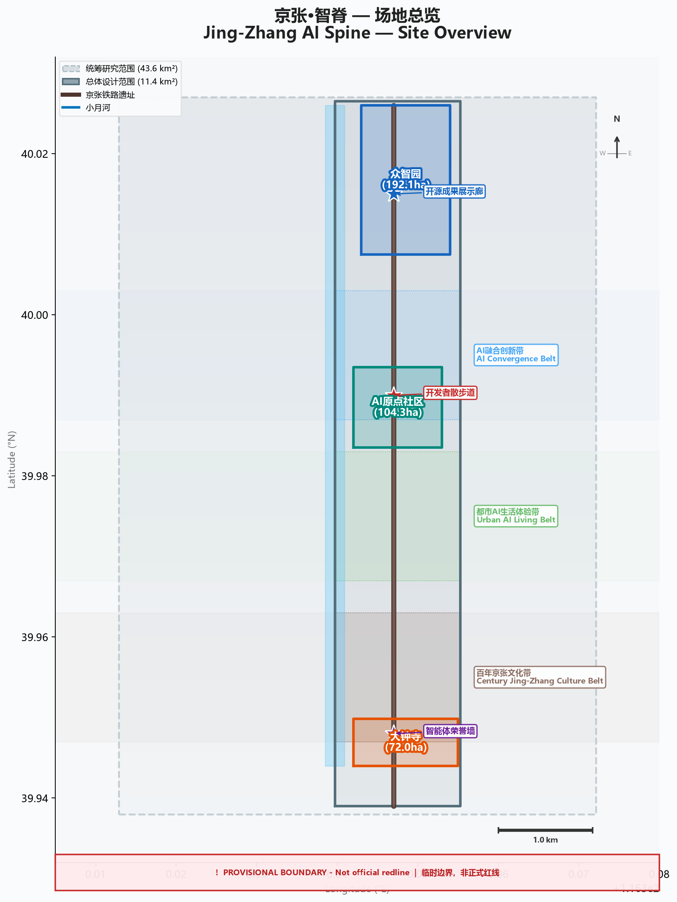
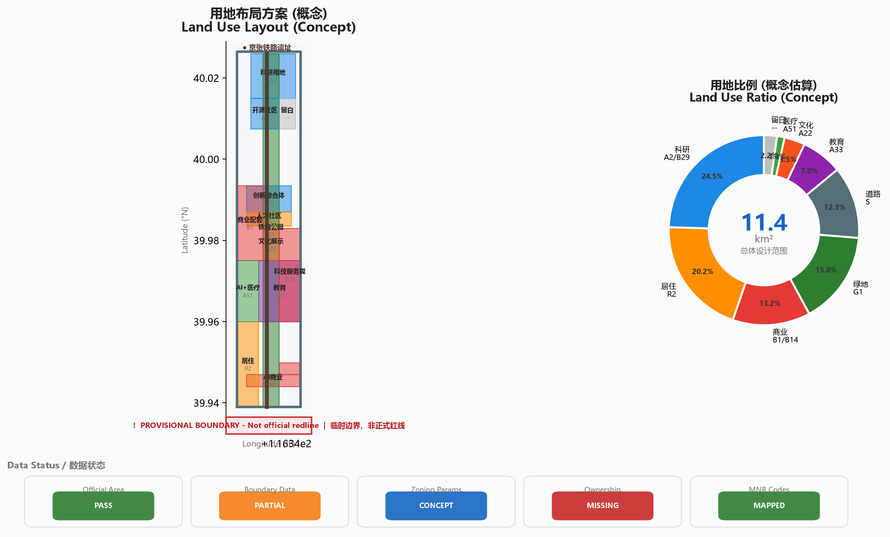
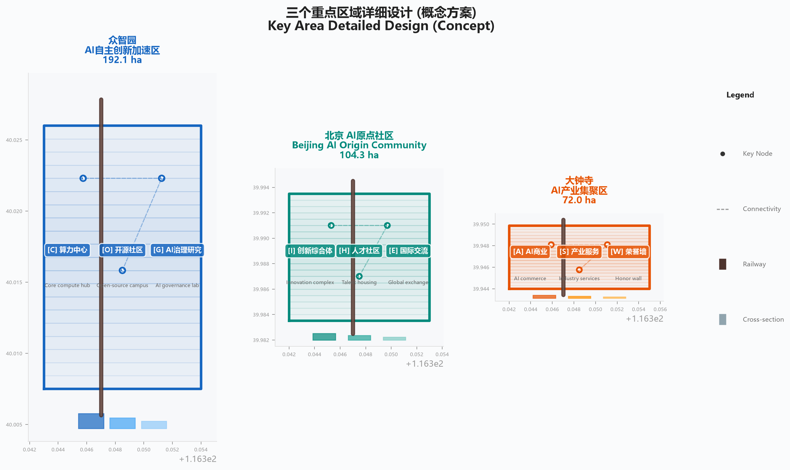
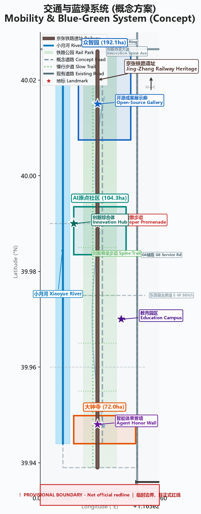
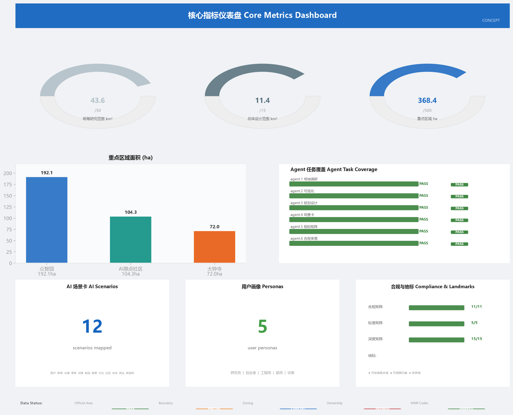

# 京张·智脊：百年京张AI创新带城市设计方案

> **所有空间落地建议均为概念建议、参考方案或可供专业团队深化研究，不替代正式规划，不构成政府审定结论。**
> **本文所有边界数据基于 provisional 约束，精度有限，正式数据发布后需重新复算。** [data:geometry/constraints.geojson]

---

## 一、设计依据与资料清单

### 1.1 权威来源

本方案依据以下公开或已清权资料构建，所有引用均可在 `sources.json` 中追溯：

| 来源编号 | 名称 | 权威等级 | 可用于正式方案 | 备注 |
|---------|------|---------|-------------|------|
| [source:SRC-2026-BJ-GH-QUAL-PREANNOUNCEMENT] | 百年京张AI创新带城市设计国际方案征集资格预审公告 | A0 | 是 | 北京市规划和自然资源委员会海淀分局发布 [source:DATA-SRC-OFFICIAL-ANNOUNCEMENT-20260509] |
| [source:SRC-2026-0518-AGENT-OPEN-CALL-TASKBOOK] | 面向全球智能体任务书摘录 | CLEARED | 是 | 用户提供已清权文档 [standard:PROJECT-AGENT-OPEN-CALL-TASKBOOK] |
| [source:SRC-MOHURD-URBAN-DESIGN] | 城市设计管理办法（住建部） | A0 | 是 | 专业标准 [standard:MOHURD-URBAN-DESIGN-MEASURES] |
| [source:SRC-MOHURD-CONTROL-PLANNING] | 城市、镇控制性详细规划编制审批办法 | A0 | 是 | 专业标准 [standard:MOHURD-CONTROL-DETAILED-PLANNING] |
| [source:SRC-MNR-LAND-USE] | 国土空间调查、规划、用途管制用地用海分类指南 | A0 | 是 | 用地编码依据 [standard:MNR-LAND-USE-CLASSIFICATION-GUIDE] |
| [source:SRC-PROVISIONAL-BOUNDARIES] | Provisional 粗略边界 | PROVISIONAL | 仅用于自检与可视化 | 非官方红线，不得作为面积或控规依据 |
| [source:SRC-OSM] | OpenStreetMap | ODbL | 是 | 底图与现状参考 |
| [source:DATA-SRC-MOHURD-URBAN-DESIGN-MEASURES] | 城市设计管理办法（住建部） | A0 | 是 | 专业标准 [standard:MOHURD-URBAN-DESIGN-MEASURES] |
| [source:DATA-SRC-MOHURD-CONTROL-DETAILED-PLANNING] | 城市、镇控制性详细规划编制审批办法 | A0 | 是 | 专业标准 [standard:MOHURD-CONTROL-DETAILED-PLANNING] |
| [source:DATA-SRC-MNR-LAND-USE-CLASSIFICATION-202311] | 国土空间调查、规划、用途管制用地用海分类指南 | A0 | 是 | 用地编码依据 [standard:MNR-LAND-USE-CLASSIFICATION-GUIDE] |
| [source:DATA-SRC-PROVISIONAL-BOUNDARIES-20260605] | Provisional 粗略边界 | PROVISIONAL | 仅用于自检与可视化 | 非官方红线，不得作为面积或控规依据 |

### 1.2 数据缺口与限制

- **官方精确边界**: 资格预审文件需通过北京科技园拍卖招标有限公司下载，当前为密码保护状态。本方案使用 `provisional_boundaries.geojson`，精度有限。[data:geometry/site_boundary.geojson]
- **控规参数**: 容积率、建筑高度、建筑密度、绿地率、退线距离等官方控规条件均缺失，本方案中相关指标标注为"待确认"。
- **土地权属**: 未获取地块权属信息，拆改留方案为概念建议。
- **坐标系**: GeoJSON 交换使用 EPSG:4326，面积计算使用 EPSG:4548（CGCS2000/3度带 CM117E）。[standard:PROJECT-OFFICIAL-ANNOUNCEMENT]

### 1.3 资料使用声明

本方案严格遵循 `data/source_registry.json` 中的用途分级：
- `usable_for_formal=yes` 的资料用于构建正式设计判断
- `provisional_only` 的资料仅用于临时生成、可视化和设计讨论
- 所有 AI 生成内容已标注生成方式，作者对事实、引用、版权和最终表达负责

---

## 二、三层范围工作框架

本章建立三层范围工作框架 [depth:three_level_scope_framework]，基于现状条件诊断 [depth:existing_conditions_diagnosis]：

本方案采用三层递进的空间工作框架，对应公告要求的三个规划层次：

### 2.1 统筹研究范围

- **面积**: 43.6 平方公里 [source:SRC-2026-BJ-GH-QUAL-PREANNOUNCEMENT] [metric:research_area_sqm]
- **边界描述**: 北至北五环路，东至京藏高速，南至西直门外大街，西至万泉河路
- **几何状态**: provisional_constraint，基于公告文字描述和面积数值推算 [data:geometry/site_boundary.geojson#PROV-RESEARCH-001]
- **设计深度**: 产业研究、未来城市战略、区域创新协同
- **精度限制**: 边界为 AI 从公告推算，非官方红线；面积复算值 43.609 km²，误差 +0.02% [source:DATA-SRC-PROVISIONAL-BOUNDARIES-20260605]

### 2.2 总体设计范围

- **面积**: 11.4 平方公里 [source:SRC-2026-BJ-GH-QUAL-PREANNOUNCEMENT] [metric:site_area_sqm]
- **边界描述**: 以京张遗址公园周边 1-2 公里的城市地区和产业区为范围；北至北五环路，东至学院路、西土城路等，南至西直门外大街，西至大钟寺东路、荷清路等
- **几何状态**: provisional_constraint [data:geometry/site_boundary.geojson#PROV-SITE-001]
- **设计深度**: 控规深度城市设计，含用地布局、建筑规模、交通组织、市政设施、蓝绿系统 [standard:MOHURD-CONTROL-DETAILED-PLANNING]
- **面积复算**: 11.413 km²，误差 +0.11%

### 2.3 重点区域范围

- **面积**: 368.4 公顷 [source:SRC-2026-BJ-GH-QUAL-PREANNOUNCEMENT] [metric:key_area_total_sqm]
- **组成**: 自北向南三个重点区域 [data:geometry/key_areas.geojson]
  - 众智园 AI 自主创新加速区：192.1 ha [data:geometry/key_areas.geojson#PROV-KEY-001] [metric:zhongzhiyuan_area_sqm]
  - 北京 AI 原点社区：104.3 ha [data:geometry/key_areas.geojson#PROV-KEY-002] [metric:ai_origin_area_sqm]
  - 大钟寺 AI 产业集聚区：72.0 ha [data:geometry/key_areas.geojson#PROV-KEY-003] [metric:dazhongsi_area_sqm]
- **设计深度**: 详细设计，含空间结构、建筑更新、慢行系统、公共空间、AI 场景布局

### 2.4 三区两翼协同结构

依据任务书，整体空间采用"三个核心区 + 两翼"的工作框架 [source:SRC-2026-0518-AGENT-OPEN-CALL-TASKBOOK]：

| 空间单元 | 定位 | 核心功能 |
|---------|------|---------|
| AI 原点社区 | 世界级 AI 创新生态 | 基础研究、创业孵化、国际交流 |
| 众智园 AI 自主创新加速区 | AI 全栈自主体系 + AI 治理话语权 | 算力中心、大模型训练、开源社区 |
| 大钟寺 AI 产业集聚区 | 智能原生新业态 | AI+商业、消费场景、产业服务 |
| 中关村科技服务翼 | 要素全球化配置 | IP 赋能、资本对接、技术转移 |
| 小月河场景赋能翼 | AI 场景赋能 + 活力城市 | 场景试验、公共体验、生活服务 |

> **概念建议**: 三区两翼之间通过京张铁路遗址公园的"创新脊梁"廊道串联，形成南北贯通、东西缝合的空间协同回路。此为概念性空间结构建议，具体空间落位需专业团队深化研究。



---

## 三、统筹研究范围产业与未来城市研究

本章提出总体空间结构方案 [depth:overall_spatial_structure]：

### 3.1 总体概念与命名体系

#### 3.1.1 主名称与品牌定位

**中文名称**: 京张·智脊
**英文名称**: Jing-Zhang AI Spine
**品牌缩写**: JZAS

**命名逻辑**:
- "京张"：直接指向京张铁路这条中国人自主设计建造的第一条干线铁路，承载百年工业文明记忆
- "智"：指向 AI 智能时代，呼应"智能化""智慧化""人工智能"三重含义
- "脊"：铁路脊梁 → 创新脊梁 → 文化脊梁，一条线串联三个时代

> 此命名为概念建议，未经商标注册或官方审定，仅供专业团队参考。[source:SRC-2026-0518-AGENT-OPEN-CALL-TASKBOOK]

#### 3.1.2 视觉识别方向

**主符号设计方向**: 核心图形取意京张铁路青龙桥段经典的"人字形"展线拓扑。概念上，将铁路道岔（switch）的分叉几何抽象为一个三向节点，三条线段分别象征京张铁路历史线、AI 创新产业线和城市生活体验线的交汇。节点中心以圆形光点代表"智能原点"，三条线段末端渐变为神经网络连接线的风格，暗示从物理铁路到数字网络的百年跃迁。整体构图呈微微右倾的动态"S"曲线，呼应"脊梁"意象，同时确保在 16px favicon 尺寸下仍可辨识为三线交汇的节点符号。

> 以上主符号方向为概念描述，实际矢量图形需专业视觉设计师在网格系统上深化。

**字体系统**:

| 用途 | 中文字体 | 英文字体 | 应用场景 |
|------|---------|---------|---------|
| 标题/品牌 | 思源宋体 (Source Han Serif) | Playfair Display 或同类衬线体 | Logo 全称、标题、纪念性文字 |
| 正文/界面 | 思源黑体 (Source Han Sans) | Inter 或同类无衬线体 | 正文、UI 界面、导视系统 |
| 数据/代码 | 等宽: JetBrains Mono | JetBrains Mono | 代码展示、数据可视化标注 |

中英文品牌全称排版规则："京张·智脊"采用思源宋体 Bold，字间距 +50，居中排列；英文 "Jing-Zhang AI Spine" 采用 Playfair Display SemiBold，置于中文下方，字号为中文的 55%。品牌缩写 "JZAS" 使用 Inter Bold，字间距 +200，适用于空间受限的场景。

**色彩体系**:

| 角色 | 色名 | HEX | RGB | 使用规则 |
|------|------|-----|-----|---------|
| 主色 | 铁锈红 | `#8B4513` | 139, 69, 19 | Logo 主体、标题强调、纪念性空间标识，占比约 40% |
| 辅色 | 科技蓝 | `#0066CC` | 0, 102, 204 | 数据可视化、AI 场景界面、科技感元素，占比约 30% |
| 强调色 | 创新金 | `#FFD700` | 255, 215, 0 | 荣誉标识、奖章、重要标记，占比约 10% |
| 中性色 | 碳灰 | `#2D2D2D` | 45, 45, 45 | 正文文字、图标，占比约 15% |
| 背景色 | 暖白 | `#FAF8F5` | 250, 248, 245 | 印刷品和数字界面背景，占比约 5% |

色彩无障碍规则：所有文本与背景的对比度须满足 WCAG 2.1 AA 标准（普通文本 4.5:1，大号文本 3:1）。铁锈红 `#8B4513` 在暖白背景上对比度为 5.8:1，符合要求；科技蓝 `#0066CC` 在暖白背景上对比度为 5.1:1，符合要求。创新金仅用于图标和装饰元素，不用于正文文字。

**品牌应用概念示例**:

| 应用场景 | 设计方向 |
|---------|---------|
| 户外导视牌 | 铁锈红底 + 暖白文字，主符号以金属蚀刻工艺呈现，嵌入耐候钢板立柱 |
| 数字界面 (Web/App) | 暖白底 + 科技蓝交互色，主符号以 SVG 动画呈现三线流动效果 |
| 开发者周边 (T恤/帆布袋) | 碳灰底 + 创新金主符号刺绣，背面印 GitHub ID 个性化定制区域 |
| 会议证件/名牌 | 横版布局，左侧主符号烫金，右侧姓名+角色+二维码 |
| 纪念砖石 (开发者散步道) | 花岗岩面蚀刻碳灰色主符号缩微版 + 铜质姓名铭牌 |

> Logo 方向和色彩体系均为概念建议，实际设计需专业视觉设计团队深化。未经授权不得使用已有商标、字体或肖像。[source:SRC-2026-0518-AGENT-OPEN-CALL-TASKBOOK]

#### 3.1.3 三大定位与五大功能回路

三条主题带构成创新脊梁的纵向维度：

| 主题带 | 空间对应 | 核心体验 |
|-------|---------|---------|
| 百年京张文化带 | 铁路遗址公园全线 | 历史记忆、工业遗产、文化导览 |
| 都市 AI 生活体验带 | 两翼生活服务区域 | AI+医疗/教育/零售/社区的日常体验 |
| AI 融合创新带 | 三区核心产业空间 | 研发、孵化、产业化、国际合作 |

五大功能构成创新脊梁的横向维度 [source:SRC-2026-0518-AGENT-OPEN-CALL-TASKBOOK]：
1. **AI 全栈自主创新体系**: 从芯片到框架到应用的全链条自主能力
2. **世界级 AI 创新生态**: 全球人才、资本、技术的汇聚与辐射
3. **AI+场景赋能新范式**: AI 技术在医疗、教育、交通等领域的深度应用
4. **智能化 AI 活力城市**: 以 AI 提升城市生活品质和公共治理效能
5. **AI 治理全球话语权**: 在 AI 伦理、标准、治理方面形成国际影响力

### 3.2 全球 AI 创新生态案例研究

为构建海淀 AI 创新生态方案，本研究对标以下 8 个全球案例 [source:SRC-2026-0518-AGENT-OPEN-CALL-TASKBOOK]：

| # | 案例 | 城市 | 核心机制 | 可借鉴要素 |
|---|------|------|---------|-----------|
| 1 | 硅谷 AI 生态圈 | 旧金山湾区 | Stanford-Bridge-VC三角 | 大学-资本-创业的正反馈循环 |
| 2 | 深圳湾科技生态园 | 深圳 | 产业空间+算力平台+场景开放 | 硬件-软件-AI的产业链整合 |
| 3 | 特拉维夫创新区 | 特拉维夫 | 军事技术转民用+全球连接 | 技术转化与国际化的高效路径 |
| 4 | 伦敦硅环 | 伦敦 | 金融科技+创意产业+城市更新 | 工业遗产区转型为创新区 |
| 5 | 首尔数字媒体城 | 首尔 | 政府主导+数字内容+文化科技 | 文化与科技融合的城市设计 |
| 6 | 班加罗尔电子城 | 班加罗尔 | IT外包升级+人才池+成本优势 | 大规模人才培养与产业集聚 |
| 7 | 新加坡纬壹科技城 | 新加坡 | 国家战略+生物医药+AI | 顶层设计与国际人才吸引 |
| 8 | 东京涩谷创新区 | 东京 | 科技企业总部+青年文化+城市活力 | 科技与都市文化的共生 |

**案例 1 深度解读 — 硅谷 AI 生态圈 (旧金山湾区)**

硅谷的成功并非单一因素驱动，而是 Stanford 大学的基础研究供给、Sand Hill Road 的风险资本密集度、以及旧金山湾区生活方式对全球人才的吸引力三者形成的自我强化三角。Google、OpenAI、Anthropic 等企业的总部选址逻辑证明，AI 创新生态的核心竞争力在于"人才密度 x 资本密度 x 容错文化"的乘积效应。

> **Key Lesson for Haidian**: 海淀拥有清华、北大、中科院等顶级研究机构，在"人才密度"上可与硅谷比肩。关键差距在于"容错文化"——硅谷鼓励失败后再创业的社会氛围需要通过制度设计（如创业失败保险、二次创业绿色通道）来有意识地培育。京张创新带可作为这类制度创新的试验田。

**案例 2 深度解读 — 深圳湾科技生态园 (深圳)**

深圳湾科技生态园的核心创新在于将算力基础设施作为公共服务提供，同时开放政府管理的城市运行数据供企业开发应用场景。这种"政府建平台、企业用平台"的模式使得中小企业无需自建算力即可开展 AI 研发，大幅降低了创新门槛。

> **Key Lesson for Haidian**: 众智园的算力中心建设可借鉴"算力即公共服务"的理念，面向海淀高校和中小创业团队提供弹性算力配额。同时，海淀区政府可考虑在交通、环保、城管等领域开放脱敏数据集，形成"数据-算力-场景"三位一体的公共服务供给模式。

**案例 3 深度解读 — 特拉维夫创新区 (特拉维夫)**

特拉维夫创新区的独特之处在于其"军事技术转民用"的高效转化机制。以色列国防军 8200 部队培养的网络安全和 AI 人才退役后直接进入创业生态，形成了技术能力从国防到商业的无缝衔接。同时，特拉维夫以"创业国度"品牌积极连接全球市场，人均创业密度全球第一。

> **Key Lesson for Haidian**: 海淀聚集了大量国防科工和航天领域的科研院所，其技术成果（如遥感 AI、无人系统、密码学）具有巨大的民用转化潜力。京张创新带可设立"军民融合 AI 技术转化中心"作为概念方向，探索国防 AI 技术向民用场景转化的制度通道。

**案例 4 深度解读 — 伦敦硅环 (伦敦)**

伦敦硅环 (Silicon Roundabout) 的崛起证明了工业遗产区可以成功转型为创新高地。该区域原为伦敦东区的衰退工业区，通过保留老厂房的工业肌理、引入金融科技和创意产业、叠加 Shoreditch 的青年文化氛围，在十年内成为欧洲最大的科技创业集群。政府的"Tech City"政策提供了签证便利和税收优惠，但核心驱动力是市场自发的集聚效应。

> **Key Lesson for Haidian**: 京张铁路遗址与伦敦硅环的工业遗产转型路径高度相似。关键启示是"不要推倒重来"——保留铁路遗产的空间记忆和工业美学，通过功能转换（旧厂房→开发者空间）而非大规模拆除来实现更新。这种"针灸式更新"既控制了成本，又保留了场所精神。

**案例 5 深度解读 — 首尔数字媒体城 (首尔)**

首尔数字媒体城 (DMC) 由首尔市政府主导规划，将文化内容产业（K-pop、韩剧、游戏）与数字技术深度融合。DMC 的独特之处在于它不仅是一个科技园区，更是一个文化科技融合的城市片区——居民可以在日常生活中体验 AR 导览、AI 互动艺术和智能社区服务。政府通过长期持有核心地块并分阶段出让，确保了规划的整体性。

> **Key Lesson for Haidian**: 京张创新带拥有百年铁路文化 IP，其文化科技融合的潜力不亚于首尔 DMC 的 K-content。建议将京张铁路历史叙事与 AI 技术体验深度融合——例如，游客沿铁路遗址公园步行时，通过 AR 技术"穿越"到詹天佑修建铁路的历史场景，同时体验当代 AI 技术的展示。文化是载体，技术是体验。

**案例 6 深度解读 — 班加罗尔电子城 (班加罗尔)**

班加罗尔的成功建立在大规模工程人才培养体系之上。印度理工学院 (IIT) 系统每年培养数万名计算机科学毕业生，配合 IT 外包产业提供的大量就业岗位，形成了"教育-就业-创业"的人才供应链。然而，班加罗尔也暴露了过度依赖外包、原创创新不足、城市基础设施跟不上产业扩张等结构性问题。

> **Key Lesson for Haidian**: 海淀在人才培养上具有班加罗尔的规模优势，但需警惕"外包陷阱"——避免 AI 产业沦为数据标注和模型微调的低附加值劳动。京张创新带应明确聚焦基础模型研发和原创算法创新，以开源社区和国际学术交流为抓手，确保产业向价值链高端攀升。

**案例 7 深度解读 — 新加坡纬壹科技城 (新加坡)**

纬壹科技城 (one-north) 是新加坡国家战略级项目，由 JTC Corporation 统一开发运营。其核心特色是"顶层设计+市场运营"的结合：政府规划了生物医药 (Biopolis)、信息通信 (Fusionopolis) 和媒体 (Mediapolis) 三大主题片区，同时引入国际一流研究机构（如 A*STAR）和跨国企业研发中心。新加坡的低税率、英语环境和高效政府服务使其成为国际人才的磁石。

> **Key Lesson for Haidian**: 纬壹模式证明了"国家战略+精细执行"的有效性。京张创新带可借鉴其"主题片区"思路，将三个重点区域分别定位为算力创新 (众智园)、创业生态 (AI 原点) 和产业应用 (大钟寺)，形成差异化的功能分区。同时，国际化服务（双语环境、国际学校、签证便利）是吸引全球 AI 人才的基础设施。

**案例 8 深度解读 — 东京涩谷创新区 (东京)**

涩谷创新区的独特之处在于科技与都市文化的共生。Google、LINE 等科技企业的日本总部选择涩谷而非传统的丸之内商务区，正是因为涩谷代表了日本青年文化、潮流时尚和数字创意的前沿。这种"科技企业追逐文化土壤"的现象表明，创新区不仅需要办公空间和政策优惠，更需要鲜活的城市文化生态作为吸引力。

> **Key Lesson for Haidian**: 京张创新带应避免成为"白天热闹、晚上空城"的纯办公园区。大钟寺片区可借鉴涩谷模式，引入 AI 主题的文化消费业态（如 AI 生成艺术画廊、机器人咖啡馆、沉浸式游戏体验），确保创新区在工作时间之外仍具有城市活力。创新区首先是城市的一部分，其次才是产业园区。

**五要素闭环模型**

成功的 AI 创新区需要五个核心要素形成闭环。以下模型基于上述 8 个案例的共性提炼 [source:SRC-2026-0518-AGENT-OPEN-CALL-TASKBOOK]：

```
要素 1: 土地空间 ──→ 要素 2: 产业生态
    ↑                        ↓
要素 5: 场景开放 ←── 要素 3: 资本服务
    ↑                        ↓
    └────── 要素 4: 人才集聚 ←┘
```

| 要素 | 定义 | 海淀现状 | 补齐方向 |
|------|------|---------|---------|
| 土地空间 | 创新载体的物理空间供给 | 有存量但碎片化 | 通过京张创新带整合串联，形成连续创新走廊 |
| 产业生态 | AI 企业、研究机构、服务商的集聚网络 | 中关村基础雄厚 | 强化开源社区、算力平台等公共技术基础设施 |
| 资本服务 | 风险投资、政府引导基金、金融服务 | VC 密度全国前列 | 设立 AI 专项产业基金，补齐早期天使轮短板 |
| 人才集聚 | 顶尖研究者、工程师、创业者的密度 | 高校人才供给充足 | 建设国际化人才社区，提供安居乐业的配套服务 |
| 场景开放 | 政府和城市运行场景向 AI 企业开放 | 起步阶段 | 建立"场景清单发布-企业申请-试点验证"的制度化流程 |

> **闭环逻辑**: 土地空间承载产业生态，产业生态吸引资本服务，资本服务支撑人才集聚，人才实现场景开放，场景开放反哺产业创新并提升土地价值，形成正反馈循环。海淀的关键补齐点在"场景开放"——将 43.6 平方公里的统筹研究范围本身作为 AI 技术的规模化试验场。

> 以上案例基于公开资料研究，不构成投资或产业招商承诺。[source:SRC-2026-0518-AGENT-OPEN-CALL-TASKBOOK]

### 3.3 创新生态图谱

**概念建议**: 构建"一脊三核多节点"的创新生态空间结构：

- **一脊**: 京张铁路遗址公园创新脊梁（南北主轴）
- **三核**: 三个重点区域各自的创新核心
  - 众智园：算力核心 + 开源社区
  - AI 原点：创业核心 + 国际交流
  - 大钟寺：场景核心 + 产业服务
- **多节点**: 分布在统筹研究范围内的高校、科研院所、企业园区

产业-空间映射关系 [depth:overall_structure]：

| 产业环节 | 适配空间 | 关键设施 |
|---------|---------|---------|
| 基础研究 | AI 原点社区 | 高校联合实验室、算力共享平台 |
| 技术开发 | 众智园 | 开源社区、开发者空间、GPU 集群 |
| 成果转化 | 中关村服务翼 | 技术转移中心、IP 交易平台 |
| 产业应用 | 大钟寺 | AI+场景试验场、企业服务空间 |
| 国际合作 | AI 原点社区 | 国际交流中心、联合创新实验室 |

---

## 四、总体设计范围城市更新与控规深度城市设计

本章进行控规深度城市设计，含用地布局 [depth:land_use_layout]、开发强度控制 [depth:development_intensity_controls]、建筑高度与体量 [depth:height_massing_character]：

### 4.1 现状分析

总体设计范围 11.4 平方公里内，现状用地以科研教育、居住和商业服务为主，沿京张铁路遗址公园形成南北向的绿色廊道。

**现状特征**:
- **科研教育用地**: 北航、北邮等高校集聚，形成天然的人才和知识供给
- **铁路遗产**: 京张铁路遗址及清华园车站旧址构成独特的文化资源
- **城市界面**: 铁路东西两侧城市功能割裂，需要"东西缝合"
- **交通瓶颈**: 南北向交通依赖京藏高速和学院路，慢行系统不连续

> 现状分析基于公开资料和 OSM 基础数据，精确的现状用地和建筑权属数据需进一步调查。[source:SRC-OSM-COPYRIGHT]

### 4.2 用地布局方案

**概念建议**: 在总体设计范围内构建"一轴两带三核多组团"的用地结构 [standard:MOHURD-CONTROL-DETAILED-PLANNING]：

**用地平衡表** (概念性指标，需官方控规条件确认) [metric:green_ratio]:

| 用地代码 | 用地名称 | 概念面积(ha) | 占比 | 备注 |
|---------|---------|------------|------|------|
| 0802 | 科研用地 | ~280 | 24.5% | AI 研发、实验室、算力中心 |
| 07 | 居住用地 | ~230 | 20.2% | 含人才公寓、社区服务 |
| 05 | 商业服务业用地 | ~150 | 13.2% | AI+商业、企业服务 |
| 14 | 绿地与开敞空间 | ~180 | 15.8% | 铁路遗址公园、绿廊 |
| 1207 | 道路用地 | ~140 | 12.3% | 含慢行系统、绿道 |
| 0804 | 教育用地 | ~80 | 7.0% | 高校配套、培训中心 |
| 0803 | 文化用地 | ~40 | 3.5% | 京张纪念馆、AI 展示 |
| 0806 | 医疗卫生用地 | ~15 | 1.3% | AI+医疗试验 |
| 16 | 留白用地 | ~25 | 2.2% | 弹性发展空间 |

> 以上面积为概念性估算，基于 provisional 边界和公开资料推算，不构成法定控规指标。正式面积需从 `geometry/land_use.geojson` 投影至 EPSG:4548 后复算。[data:geometry/land_use.geojson]



### 4.3 建筑规模与拆改留逻辑

基于建筑数据 [data:geometry/buildings.geojson] 的拆改留分析：

**概念建议**的拆改留原则:

| 策略 | 适用对象 | 比例估算 | 说明 |
|------|---------|---------|------|
| **留** | 高校教学楼、文保建筑、近年新建 | ~40% | 保留现状，功能活化 |
| **改** | 老旧厂房、低效办公楼 | ~35% | 功能转换为 AI 研发/孵化/社区 |
| **拆** | 危房、违章、严重不匹配 | ~15% | 释放空间用于新建 |
| **新建** | 算力中心、创新综合体、地标 | ~10% | 补齐关键功能缺口 |

> 建筑高度、容积率等控规参数待确认。本方案不给出具体建筑高度和容积率结论。[standard:MOHURD-CONTROL-DETAILED-PLANNING]

### 4.4 开发强度指引

**概念建议**的强度分区（需控规确认）:

- **高强度区**: 三个核心区节点，容积率建议 3.0-5.0（待确认）
- **中强度区**: 主要道路两侧，容积率建议 2.0-3.0（待确认）
- **低强度区**: 铁路遗址公园周边、文保区域，容积率建议 1.0-2.0（待确认）

> 以上容积率为概念性区间建议，非官方审定指标。[depth:intensity_height_mass]

---

## 五、重点区域详细设计

三个重点区域的详细设计方案 [depth:three_key_area_detailed_design]：

### 5.1 众智园 AI 自主创新加速区

**面积**: 192.1 公顷 [data:geometry/key_areas.geojson#PROV-KEY-001]
**定位**: AI 全栈自主创新体系与 AI 治理全球话语权的核心载体 [source:SRC-2026-0518-AGENT-OPEN-CALL-TASKBOOK]

#### 5.1.1 空间结构

**概念建议**: 构建"一轴两廊三片区"的空间结构：
- **一轴**: 沿铁路遗址公园的创新脊梁主轴
- **两廊**: 东西向两条功能联系廊道
- **三片区**: 算力核心区、开源社区片、AI 治理研究片

#### 5.1.2 建筑更新策略

| 区域 | 现状 | 更新策略 | 目标功能 |
|------|------|---------|---------|
| 算力核心区 | 低效工业用地 | 拆旧建新 | GPU 集群、数据中心、能源站 |
| 开源社区片 | 老旧办公楼 | 改造活化 | 开发者空间、联合办公、路演中心 |
| AI 治理研究片 | 科研院所 | 保留提升 | 伦理研究中心、标准实验室、国际会议 |

#### 5.1.3 AI 场景布局

- **算力共享平台**: 面向高校和创业团队的弹性算力服务 [depth:key_area_detailed]
- **开源成果展示廊**: 沿铁路遗址公园展示开源项目里程碑
- **AI 治理研究中心**: 聚焦 AI 伦理、安全、标准的国际化研究机构

**AI 场景亮点 — 算力即服务体验**: 一位来自北邮的研究生团队负责人走进众智园算力共享大厅，在自助终端上用校园账号登录，选择所需 GPU 规格（8xA100 / 32xA100 / 128xA100 三档弹性配额），系统自动匹配当前空闲资源并生成计费方案（学术优惠价）。提交任务后，团队可在大厅内的协作空间实时查看训练进度，或回到校园通过 VPN 连接远程监控。这一场景将"算力"从少数大企业的专属资源变为校园创业团队触手可及的公共服务。

**连通策略**: 众智园位于创新脊梁的北段，通过铁路遗址公园步道向南直达 AI 原点社区（步行约 25 分钟），通过东西缝合廊道连接北航、北邮校园。概念建议在众智园南端设置自动驾驶微循环接驳站，实现与 AI 原点社区的无人小巴接驳（概念约 8 分钟车程）。同时，规划中的轨道站点接驳将进一步强化与中关村科技服务翼的联系，使算力中心的服务辐射至整个 43.6 平方公里统筹研究范围。

**风险与缓解措施**:

| 风险 | 影响 | 缓解措施 |
|------|------|---------|
| 算力中心能耗过高 | 电力供应压力、碳排放超标 | 配套分布式清洁能源站（概念建议），采用液冷散热技术降低 PUE |
| 开源社区活跃度不足 | 空间闲置、运营成本高 | 与 GitHub、Hugging Face 等国际平台建立合作关系，引入全球开源活动 |
| AI 治理研究国际化受阻 | 国际机构参与度低 | 设立双语工作环境，与 OECD AI 政策观察站等国际组织建立合作框架 |

> 众智园设计方案为概念建议，具体建筑布局和开发强度需专业团队深化。[source:SRC-2026-0518-AGENT-OPEN-CALL-TASKBOOK]

### 5.2 北京 AI 原点社区

**面积**: 104.3 公顷 [data:geometry/key_areas.geojson#PROV-KEY-002]
**定位**: 世界级 AI 创新生态的核心节点 [source:SRC-2026-0518-AGENT-OPEN-CALL-TASKBOOK]

#### 5.2.1 空间结构

**概念建议**: 构建"核心-圈层-链接"的空间结构：
- **核心**: AI 创新综合体（创业孵化 + 国际交流 + 成果展示）
- **圈层**: 人才社区（人才公寓 + 生活服务 + 教育配套）
- **链接**: 连接清华、北航等高校的创新走廊

#### 5.2.2 建筑更新策略

| 区域 | 现状 | 更新策略 | 目标功能 |
|------|------|---------|---------|
| 创新综合体 | 混合用地 | 新建为主 | 孵化器、加速器、国际会议中心 |
| 人才社区 | 老旧居住区 | 改善提升 | 人才公寓、社区商业、共享空间 |
| 创新走廊 | 校园边缘 | 续接贯通 | 创业街、技术转移、联合实验室 |

#### 5.2.3 AI 场景布局

- **AI 创业大街**: 对标中关村创业大街，聚焦 AI 领域
- **国际 AI 交流中心**: 全球 AI 人才、企业、机构的交流平台
- **AI 成果体验馆**: 面向公众的 AI 技术沉浸式体验

**AI 场景亮点 — 创业导师智能匹配**: 一位刚从清华计算机系毕业的创业者走进 AI 创新综合体的一层服务大厅，在触摸屏上输入自己的项目方向（多模态大模型在教育场景的应用）和需求（产品化指导、融资对接、海外市场）。系统基于知识图谱和语义匹配，在 3 秒内推荐三位最匹配的导师——一位是曾成功退出的教育科技创业者、一位是专注 AI 教育赛道的投资人、一位是斯坦福教育学院的访问学者。创业者可当场预约当周的 30 分钟一对一辅导，或加入下月的"AI 教育创业营"小组辅导。这一场景将"找对导师"从运气驱动变为数据驱动。

**连通策略**: AI 原点社区位于创新脊梁的中段，是三个重点区域的地理中心。向北通过铁路遗址公园步道连接众智园（步行约 25 分钟），向南连接大钟寺（步行约 20 分钟）。概念建议在社区核心设置"创新脊梁中继站"——一个集自动驾驶接驳、共享单车、步行导览于一体的综合换乘节点。东侧通过创新走廊连接清华、北航校园，西侧通过小月河绿廊连接中关村服务翼。这种"中心辐射"的区位优势使 AI 原点社区成为整个创新带的人流、信息流和创新流的汇聚点。

**风险与缓解措施**:

| 风险 | 影响 | 缓解措施 |
|------|------|---------|
| 创业大街同质化竞争 | 与中关村创业大街功能重叠 | 明确差异化定位：AI 原点聚焦"AI 原生"创业（大模型、AI Agent、具身智能），而非泛科技创业 |
| 国际人才落地困难 | 签证、住房、子女教育等障碍 | 联合海淀区外事部门建立"国际 AI 人才服务包"概念框架，涵盖签证绿色通道、人才公寓、国际学校名额 |
| 创新综合体运营成本高 | 长期亏损风险 | 采用"政府持有+专业运营商托管"模式，孵化器部分收入覆盖公共服务成本

### 5.3 大钟寺 AI 产业集聚区

**面积**: 72.0 公顷 [data:geometry/key_areas.geojson#PROV-KEY-003]
**定位**: 智能原生新业态的试验场 [source:SRC-2026-0518-AGENT-OPEN-CALL-TASKBOOK]

#### 5.3.1 空间结构

**概念建议**: 构建"双核联动"的空间结构：
- **商业核心**: AI+消费场景综合体
- **产业核心**: 企业服务与产业加速中心

#### 5.3.2 建筑更新策略

| 区域 | 现状 | 更新策略 | 目标功能 |
|------|------|---------|---------|
| 商业核心 | 传统商业区 | 改造升级 | AI 零售、智能餐饮、数字娱乐 |
| 产业核心 | 低效产业园 | 拆旧建新 | 企业总部、产业服务、共享设施 |

#### 5.3.3 AI 场景布局

- **AI 商业试验场**: 无人零售、智能推荐、数字支付的实景测试
- **智能商务中心**: AI 驱动的企业服务（法务、财务、人力资源）
- **机器人配送网络**: 园区级无人配送系统试点

**AI 场景亮点 — 沉浸式 AI 消费体验**: 一位周末到访的市民走进大钟寺 AI 商业试验场。入口处，AR 导览系统基于她的兴趣偏好（系统询问后获授权）推荐个性化逛店路线。走进第一家店铺，智能货架根据天气和客流自动调整陈列，电子价签实时显示个性化折扣。在 AI 美食广场，机器人厨师根据她的过敏信息和营养目标推荐菜品，下单后 90 秒内由配送机器人送达座位。结账时无需扫码，系统通过视觉识别自动完成结算。整个过程保留了传统逛街的乐趣，同时消除了排队、选择困难和信息不对称的痛点。

**连通策略**: 大钟寺位于创新脊梁的南端，是创新带面向城市消费人群的"门户"。已有的地铁 13 号线大钟寺站使其成为三个重点区域中公共交通可达性最强的片区。概念建议通过铁路遗址公园步道向北连接 AI 原点社区（步行约 20 分钟），通过东西缝合廊道连接学院路东侧的居住区和商业区。大钟寺同时也是创新带与中关村核心商圈的衔接点——从大钟寺向南步行 15 分钟即可到达西直门交通枢纽，连接地铁 2 号线、4 号线和 13 号线。这种"轨道+步行"的双重连接使大钟寺成为创新带中最具公众可达性的区域。

**风险与缓解措施**:

| 风险 | 影响 | 缓解措施 |
|------|------|---------|
| AI 商业体验沦为噱头 | 消费者新鲜感消退后客流下降 | 确保 AI 技术解决真实痛点（如过敏信息匹配、无障碍购物），而非仅为展示而展示 |
| 与传统商圈竞争 | 商户入驻率不足 | 提供差异化政策：AI 技术试用补贴、数据洞察服务、联合营销支持 |
| 无人配送安全问题 | 行人安全、配送事故 | 设定低速限速（概念建议 5km/h），配备远程安全员，建立行人优先的路权规则 |



---

## 六、AI 创新生态、人才画像与 AI+ 场景

### 6.1 AI 场景卡矩阵

本方案设计 12 张 AI 场景卡，覆盖 8 个标准场景 [source:SRC-2026-0518-AGENT-OPEN-CALL-TASKBOOK] [metric:scenario_card_count]：

| # | 场景卡名称 | 场景类别 | 空间落位 | 测试验证 |
|---|-----------|---------|---------|---------|
| 1 | AI 分诊与远程诊疗 | ai-healthcare | AI 原点社区 | ✅ 验证场景 |
| 2 | AI 个性化学习伴侣 | ai-education | 众智园 | |
| 3 | 自动驾驶微循环接驳 | ai-mobility | 三区全覆盖 | ✅ 验证场景 |
| 4 | AI 智能零售体验 | ai-retail | 大钟寺 | |
| 5 | 智能工厂数字孪生 | ai-manufacturing | 众智园 | ✅ 验证场景 |
| 6 | AI 城市安全监测 | ai-governance | 三区两翼 | |
| 7 | 分布式能源智能调度 | ai-energy | 众智园 | |
| 8 | AI 文化遗产数字导览 | ai-cultural-heritage | 铁路遗址公园 | |
| 9 | AI 社区健康管理 | ai-healthcare | 人才社区 | |
| 10 | AI 创业导师匹配 | ai-education | AI 原点社区 | |
| 11 | AI 公共空间智能管理 | ai-governance | 公共空间 | |
| 12 | AI 碳足迹追踪与优化 | ai-energy | 全区域 | |

**12 张场景卡详细说明** [depth:scenario_cards]:

**场景卡 1: AI 分诊与远程诊疗**
- **用户体验叙事**: 一位居民走进 AI 原点社区卫生中心，在自助分诊台描述症状后，AI 系统在 30 秒内完成初步评估并推荐就诊科室，同时将预诊信息推送至接诊医生的工作站，居民无需重复描述病情。
- **空间位置**: 创新脊梁中段，AI 原点社区人才社区配套卫生中心内。概念建议设置于社区卫生中心一层入口大厅，便于居民日常就诊。
- **人文复核边界**: AI 仅提供分诊建议和预诊参考，最终诊断权始终归属执业医师。系统不得自行开具处方或决定治疗方案。患者有权要求人工复核 AI 的分诊建议，且 AI 分诊记录需在病历中标注为"AI 辅助"。

**场景卡 2: AI 个性化学习伴侣**
- **用户体验叙事**: 一位北邮大二学生在众智园开发者空间自习时，打开 AI 学习伴侣应用，系统根据她的课程进度和薄弱环节自动生成今日学习计划，并在她遇到难题时提供苏格拉底式引导而非直接给出答案。
- **空间位置**: 创新脊梁北段，众智园开源社区片的共享学习空间。概念建议在众智园的联合办公区域和高校图书馆设置 AI 学习伴侣终端。
- **人文复核边界**: AI 学习伴侣不得替代教师的教学判断。学生的学习评估和成绩评定始终由教师完成。系统需向教师提供学习数据分析报告，但不得自动向家长或第三方推送学生成绩信息。学生数据存储需符合教育数据隐私规范。

**场景卡 3: 自动驾驶微循环接驳**
- **用户体验叙事**: 一位在众智园工作的工程师下班后，在园区站点等候自动驾驶小巴。小巴准时到达，通过人脸识别确认乘客身份后自动关门驶出。车上屏幕显示实时路线和预计到达时间，8 分钟后抵达 AI 原点社区地铁接驳站。
- **空间位置**: 创新脊梁全线，连接三个重点区域的铁路遗址公园沿线。概念建议在每个重点区域的核心节点设置 2-3 个接驳站点，形成南北贯通的微循环网络。
- **人文复核边界**: 每辆自动驾驶小巴配备远程安全员，可随时接管车辆控制。在恶劣天气或复杂交通场景下，系统自动切换至人工远程驾驶模式。乘客可通过车内紧急按钮随时要求停车。系统运行数据需保存至少 90 天供事故追溯。

**场景卡 4: AI 智能零售体验**
- **用户体验叙事**: 一位周末到访的消费者走进大钟寺 AI 商业试验场，手机收到个性化逛店推荐（基于其授权的兴趣偏好）。走进一家服装店，智能试衣镜自动推荐搭配方案，结账时通过视觉识别自动结算，无需排队扫码。
- **空间位置**: 创新脊梁南端，大钟寺 AI 产业集聚区商业核心。概念建议设置于大钟寺商业综合体的一层至三层零售区域。
- **人文复核边界**: 个性化推荐需基于用户明确授权，用户可随时关闭推荐功能并切换至普通浏览模式。视觉识别结算系统需提供人工收银通道作为备选。消费者数据不得用于未经授权的二次营销，且消费者有权要求删除其行为数据。

**场景卡 5: 智能工厂数字孪生**
- **用户体验叙事**: 一位制造业企业的技术总监在众智园数字孪生实验室，通过大屏幕查看其工厂的实时数字孪生模型。AI 系统标红了一条产线的异常振动数据，预测未来 72 小时内可能出现故障，并推荐了预防性维护方案。
- **空间位置**: 创新脊梁北段，众智园算力核心区的数字孪生实验室。概念建议紧邻算力中心设置，便于大模型实时推理所需的低延迟数据传输。
- **人文复核边界**: AI 预测性维护建议需经设备工程师确认后方可执行。系统不得自动关停产线或修改生产工艺参数。故障预测模型的准确率需定期审计，误报率超过阈值时需人工介入调优。

**场景卡 6: AI 城市安全监测**
- **用户体验叙事**: 一位社区居民在铁路遗址公园夜间散步时，注意到智能灯杆上的环境传感器在人流稀少时自动调亮灯光。当系统检测到异常聚集或摔倒事件时，自动通知附近巡逻的安保人员前往查看。
- **空间位置**: 创新脊梁全线公共空间，重点覆盖铁路遗址公园、三个重点区域的开放空间和慢行通道。
- **人文复核边界**: 安全监测系统仅使用环境传感器（红外、声学、振动），不部署人脸识别或行为画像系统。异常事件需经人工确认后方可调度安保力量，系统不得自动报警或限制人员行动。监测数据保存期限不超过 30 天，且需脱敏处理。

**场景卡 7: 分布式能源智能调度**
- **用户体验叙事**: 一位众智园算力中心的运维工程师在能源管理大屏上看到，AI 系统根据实时电价、光伏发电量和算力负载，自动在低价时段调度更多训练任务，在高价时段降低非紧急任务优先级，使月度电费降低了约 15%。
- **空间位置**: 创新脊梁北段，众智园算力核心区配套的分布式能源站。概念建议能源站与算力中心物理相邻，减少输电损耗。
- **人文复核边界**: AI 能源调度系统不得在未经运维人员确认的情况下切断关键负载的供电。电价预测模型的偏差超过 20% 时需人工介入。能源调度决策日志需完整保存，供能源审计和碳排放核查使用。

**场景卡 8: AI 文化遗产数字导览**
- **用户体验叙事**: 一位国际游客在铁路遗址公园入口处下载 JZAS 导览应用，选择"百年京张"主题路线。沿途每到一个 AR 标识点，手机屏幕叠加显示百年前的铁路施工场景和詹天佑的工作画面，配以中英双语语音讲解。
- **空间位置**: 创新脊梁全线，沿京张铁路遗址公园从北到南分布的 AR 标识点网络。概念建议每隔 200-300 米设置一个 AR 互动节点，串联铁路历史叙事。
- **人文复核边界**: AR 导览内容需经过历史学家和铁路遗产专家审核，确保历史叙事的准确性。导览系统不得在未经用户同意的情况下收集位置数据。用户可选择"离线模式"下载导览内容，减少数据传输。

**场景卡 9: AI 社区健康管理**
- **用户体验叙事**: 一位退休居民在人才社区的健康小屋测量血压和血糖后，AI 系统生成个人健康趋势报告，并提醒她下周的体检预约。当某项指标出现异常趋势时，系统建议她预约社区医生复查。
- **空间位置**: 创新脊梁中段，AI 原点社区人才社区配套的健康小屋。概念建议在每个社区步行 10 分钟范围内设置一个健康服务点。
- **人文复核边界**: AI 健康管理仅提供趋势分析和健康建议，不得进行疾病诊断或开具处方。异常指标需由社区医生确认后方可转诊。健康数据严格遵循医疗数据隐私法规，未经居民书面授权不得向任何第三方共享。

**场景卡 10: AI 创业导师匹配**
- **用户体验叙事**: 一位刚从北大毕业的创业者在 AI 原点社区的服务终端输入项目方向和需求，系统在 3 秒内推荐三位最匹配的导师，并显示每位导师的专长领域、成功案例和可预约时段。创业者选择了一位专注 AI 教育赛道的投资人，预约了次日下午的 30 分钟辅导。
- **空间位置**: 创新脊梁中段，AI 原点社区创新综合体一层服务大厅。概念建议在创新走廊沿线的高校创业空间也部署轻量版匹配终端。
- **人文复核边界**: 导师匹配算法需定期审计，确保推荐结果不因创业者的性别、年龄、学历等因素产生歧视性偏差。创业者有权查看匹配算法的主要因子，并可手动调整偏好。导师评价系统需保护双方隐私，负面评价需经平台审核后方可展示。

**场景卡 11: AI 公共空间智能管理**
- **用户体验叙事**: 一位在铁路遗址公园跑步的市民发现，公园的灌溉系统在雨后自动暂停，草坪上的智能喷头根据土壤湿度传感器数据精准补水。当公园人流密度升高时，保洁调度系统自动增派清洁人员前往高频使用区域。
- **空间位置**: 创新脊梁全线公共空间，以铁路遗址公园为核心，延伸至三个重点区域的广场、绿地和步行街。
- **人文复核边界**: 公共空间管理系统仅使用环境传感器（土壤湿度、人流计数、垃圾桶容量），不部署人脸识别。保洁和维护调度需经管理人员确认，系统不得自动关闭公共设施或限制公众进入。管理数据需向公众开放查询，接受社会监督。

**场景卡 12: AI 碳足迹追踪与优化**
- **用户体验叙事**: 一位在众智园工作的研究员在园区 App 上查看个人碳足迹仪表盘，发现自己本周因使用算力中心产生了较高的碳排放。系统建议她将非紧急训练任务调度到光伏发电高峰时段，可减少约 30% 的碳足迹，并提供绿色出行积分奖励。
- **空间位置**: 创新脊梁全覆盖，以众智园算力中心为核心数据源，延伸至三个重点区域的建筑能耗、交通出行和消费行为。
- **人文复核边界**: 碳足迹追踪基于自愿参与原则，用户可选择退出个人碳足迹统计。系统仅提供优化建议，不得强制限制用户的能源使用或出行方式。碳排放数据用于区域碳中和目标的整体核算，不得用于对个人的惩罚性措施。

**3 个产业测试验证场景** [depth:scenario_cards]:

1. **自动驾驶微循环**: 在三区之间部署 L4 级自动驾驶小巴，测试多场景混合交通
2. **AI 分诊试点**: 在社区卫生中心部署 AI 辅助分诊系统，验证医疗 AI 的可靠性
3. **数字孪生工厂**: 在众智园建设工厂数字孪生平台，测试制造业 AI 应用

### 6.2 用户画像

5 类核心用户画像 [source:SRC-2026-0518-AGENT-OPEN-CALL-TASKBOOK] [metric:persona_count]：

| # | 画像 | 年龄 | 核心需求 | 服务空间 |
|---|------|------|---------|---------|
| 1 | AI 研究员 | 25-40 | 算力、数据、学术交流 | 众智园、高校 |
| 2 | AI 创业者 | 22-35 | 孵化、投资、市场对接 | AI 原点社区 |
| 3 | AI 工程师 | 25-45 | 开发工具、社区、职业发展 | 开源社区 |
| 4 | 周边居民 | 全年龄 | 生活便利、公共空间、安全感 | 两翼、社区 |
| 5 | 国际访客 | 全年龄 | 文化体验、技术交流、合作机会 | 铁路公园、展示馆 |

### 6.3 场景-空间-运营映射

| 场景 | 空间载体 | 运营模式 | 人文复核边界 |
|------|---------|---------|------------|
| AI 医疗 | 社区卫生中心 | 政府主导+企业技术支持 | 医生最终诊断权 |
| AI 教育 | 高校+社区学习中心 | 公益+商业并行 | 教师监督与学生隐私 |
| 自动驾驶 | 公共道路+园区 | 限定区域+逐步开放 | 安全员随车+远程监控 |
| AI 零售 | 大钟寺商业区 | 商业运营 | 消费者选择权+数据知情 |
| AI 治理 | 公共空间+管理中心 | 政府主导 | 人工复核+申诉机制 |

> 所有 AI 场景均需遵守隐私保护、人工复核和伦理合规要求，不得部署过度监控或无法人工复核的系统。[source:SRC-2026-0518-AGENT-OPEN-CALL-TASKBOOK]



---

## 七、用地、建筑规模与拆改留方案

拆改留策略与建筑更新方案 [depth:retain_renovate_demolish]：

### 7.1 用地复算

用地面积从 `geometry/land_use.geojson` 投影至 EPSG:4548 后计算 [metric:green_ratio]：

| 用地代码 | 用地名称 | 计算面积(ha) | 占比 | 计算方法 |
|---------|---------|------------|------|---------|
| 0802 | 科研用地 | 待复算 | -- | GeoJSON 投影面积求和 |
| 07 | 居住用地 | 待复算 | -- | GeoJSON 投影面积求和 |
| 05 | 商业服务业用地 | 待复算 | -- | GeoJSON 投影面积求和 |
| 14 | 绿地与开敞空间 | 待复算 | -- | GeoJSON 投影面积求和 |
| 1207 | 道路用地 | 待复算 | -- | GeoJSON 投影面积求和 |
| 0804 | 教育用地 | 待复算 | -- | GeoJSON 投影面积求和 |
| 0803 | 文化用地 | 待复算 | -- | GeoJSON 投影面积求和 |
| 0806 | 医疗卫生用地 | 待复算 | -- | GeoJSON 投影面积求和 |
| 16 | 留白用地 | 待复算 | -- | GeoJSON 投影面积求和 |

> 精确面积需从 GeoJSON 投影至 EPSG:4548 后用几何计算得出，此处暂用概念性估算。[data:geometry/land_use.geojson]

### 7.2 建筑规模

**概念性指标**（待控规确认）：

| 指标 | 数值 | 单位 | 状态 | 备注 |
|------|------|------|------|------|
| 总建筑面积 | 待确认 | 万m² | missing | 需控规条件 |
| 容积率 | 待确认 | -- | missing | 需控规条件 |
| 建筑高度上限 | 待确认 | m | missing | 需控规条件 |
| 建筑密度 | 待确认 | % | missing | 需控规条件 |
| 绿地率 | 待确认 | % | missing | 需控规条件 |

### 7.3 拆改留逻辑

基于公开资料和 provisional 边界推算的概念性拆改留方案 [depth:r_r_d_strategy]：

**保留类** (~40%):
- 高校教学科研建筑（北航、北邮等）
- 文保建筑（清华园车站旧址等）
- 近 10 年内新建的品质建筑
- 铁路遗址公园已建成段

**改造类** (~35%):
- 老旧工业厂房 → AI 研发/孵化空间
- 低效办公楼 → 共享办公/开发者社区
- 传统商业 → AI+消费体验空间
- 老旧居住区 → 人才公寓/智慧社区

**拆除类** (~15%):
- 危房和违章建筑
- 严重不匹配规划功能的低效建筑
- 需释放空间用于关键基础设施的区域

**新建类** (~10%):
- 算力中心和数据中心
- AI 创新综合体
- 朝圣地标建筑
- 新型基础设施（边缘计算节点等）

> 具体地块的拆改留方案需基于权属调查、建筑评估和控规条件，此处仅为概念建议。[source:SRC-2026-0518-AGENT-OPEN-CALL-TASKBOOK]

---

## 八、交通、轨道、市政与公共服务设施

综合交通体系 [depth:traffic_rail_slow_parking] 与新型基础设施 [depth:municipal_new_infrastructure]：

### 8.1 交通体系

**概念建议**: 构建"轨道交通为骨架、慢行系统为脉络、智能交通为特色"的综合交通体系 [standard:MOHURD-URBAN-DESIGN-MEASURES]。

#### 8.1.1 道路系统

| 道路等级 | 功能 | 现状 | 规划策略 |
|---------|------|------|---------|
| 快速路 | 区域通达 | 京藏高速、北五环 | 锁定，优化出入口 |
| 主干路 | 片区联系 | 学院路、西土城路 | 锁定，公交优先 |
| 次干路 | 内部通达 | 待梳理 | 打通断头路，优化路网 |
| 支路 | 地块服务 | 不足 | 新增加密路网 |
| 慢行通道 | 步行骑行 | 断续 | 沿铁路公园贯通 |
| 绿道 | 休闲通勤 | 部分建成 | 东西缝合、南北贯通 |

#### 8.1.2 轨道交通

统筹研究范围内现状和规划轨道线路需进一步梳理。概念建议在三个核心区设置轨道站点接驳节点 [data:geometry/roads.geojson]：
- 众智园：接驳现有/规划轨道站点
- AI 原点社区：强化与 13 号线等线路的联系
- 大钟寺：利用 13 号线大钟寺站的既有优势

#### 8.1.3 慢行系统

**创新脊梁步道**: 沿京张铁路遗址公园全长贯通的步行+骑行综合慢行道，串联三个核心区和所有朝圣地标。

**东西缝合廊道**: 至少 3 条东西向慢行廊道，缝合铁路两侧城市功能。

### 8.2 新型基础设施

| 设施类型 | 功能 | 概念布局 |
|---------|------|---------|
| 边缘计算节点 | 低延迟 AI 推理 | 三区各设 1-2 个节点 |
| 5G/6G 基站 | 高带宽通信 | 全覆盖，核心区加密 |
| 智能灯杆 | 环境感知+信息发布 | 主要道路和公共空间 |
| 分布式能源站 | 清洁能源供给 | 众智园算力中心配套 |
| 充电/换电网络 | 电动出行 | 停车场+路边+园区 |

### 8.3 市政与公共服务

**概念建议**的公共服务设施配置：
- 教育设施：高校配套培训中心、社区 AI 学习空间
- 医疗设施：社区卫生中心（AI 辅助诊疗试点）
- 文化设施：京张纪念馆、AI 体验馆、开源展示廊
- 体育设施：社区运动场地、智能健身步道
- 养老设施：社区养老中心（AI 辅助健康管理）

> 市政管线（给排水、电力、燃气、通信）的具体方案需专业市政工程团队深化。[depth:transport_municipal]

---

## 九、蓝绿空间、公共空间与城市风貌

蓝绿空间与公共空间体系 [depth:blue_green_public_space]：

### 9.1 蓝绿系统

蓝绿空间网络基于绿地数据 [data:geometry/green_space.geojson] 和公共空间数据 [data:geometry/public_space.geojson]：

**概念建议**: 构建"一轴两翼多节点"的蓝绿空间网络 [standard:MOHURD-URBAN-DESIGN-MEASURES] [metric:green_ratio] [metric:public_space_ratio]：

- **一轴**: 京张铁路遗址公园绿带（南北主轴，约 8km）
- **两翼**: 小月河滨水绿廊（西翼）+ 学院路绿廊（东翼）
- **多节点**: 三个核心区的公园绿地 + 社区级绿地

### 9.2 AI 朝圣地标

三个 AI 朝圣地标节点 [source:SRC-2026-0518-AGENT-OPEN-CALL-TASKBOOK] [metric:landmark_count]：

#### 地标 1: 开发者散步道 (Developer's Walk)
- **位置**: 铁路遗址公园中段，AI 原点社区内
- **概念**: 模仿好莱坞星光大道，铺设开源贡献者纪念砖。每位被认可的 AI 开发者/贡献者获得一块刻有 GitHub ID 和贡献描述的砖石。
- **空间**: 线性散步道 + 信息亭 + AR 互动节点
- **荣誉体系**: 年度评选，砖石永久铺设

#### 地标 2: 开源成果展示廊 (Open Source Milestone Gallery)
- **位置**: 铁路遗址公园北段，众智园内
- **概念**: 以铁路里程碑为原型，展示 AI 领域的开源里程碑事件（Linux、TensorFlow、PyTorch 等）。每个里程碑以实体雕塑+数字展板呈现。
- **空间**: 廊道式展示 + 互动屏幕 + 论坛广场
- **荣誉体系**: 里程碑项目永久展示，新里程碑逐年增补

#### 地标 3: 智能体贡献荣誉墙 (Agent Honor Wall)
- **位置**: 铁路遗址公园南段，大钟寺区域内
- **概念**: 为参与城市建设的 AI Agent 和其贡献者设立的荣誉墙。入选方案的 Agent 名称和 GitHub ID 被刻入荣誉墙。
- **空间**: 弧形纪念墙 + 数字铭牌 + 年度揭幕仪式
- **荣誉体系**: 入选即永久保留，年度更新

### 9.3 公共空间组件库

以下为京张创新带公共空间的概念性组件库，包含 8 类标准化组件。每类组件均考虑了耐久性、可维护性、无障碍设计和智能化需求。具体材料选型和工艺细节需专业景观和工业设计团队深化。

| # | 组件名称 | 材料 | 功能描述 | 互动性 | 概念布局 |
|---|---------|------|---------|--------|---------|
| 1 | **智能座椅** | 主体：防腐处理硬木（如菠萝格）+ 扶手/底座：耐候钢板（Q355NH）。表面涂装采用铁锈红色系，呼应品牌主色 | 休憩功能（符合人体工学的 15 度后倾靠背）+ 嵌入式 Qi 无线充电面板（座椅扶手内侧）+ USB-C 有线充电口（防水翻盖设计）+ 座面下方温湿度传感器（数据接入园区 IoT 平台） | 无线充电自动感应（手机放置即充）；充电状态 LED 指示灯（绿=充电中，蓝=已满） | 铁路遗址公园沿线每 50 米一组（2-3 座），三个重点区域广场加密至每 20 米一组 |
| 2 | **AI 信息导览亭** | 主体结构：不锈钢框架（316L）+ 钢化玻璃面板（6mm AG 防眩光）+ 顶部遮阳板：铝蜂窝板。基座采用花岗岩火烧面，防滑耐磨 | 21.5 寸高亮触控屏（亮度 1000nit，阳光下可读）+ 4G/5G 连接 + 多语言导览（中/英/日/韩）+ 周边设施查询 + 充电服务（2x USB-A + 2x USB-C）+ 紧急呼叫按钮（直连园区安保中心） | 10 点电容触控 + 语音交互（远场麦克风阵列，支持 3 米内唤醒）+ 二维码扫码（手机端深度交互） | 三个重点区域核心节点各 1 座，铁路遗址公园主要出入口各 1 座，共约 8-10 座 |
| 3 | **开源贡献纪念碑** | 碑体：芝麻灰花岗岩（G603）+ 铭牌：锡青铜（C5191）蚀刻 + 基座：C30 混凝土覆花岗岩面板 | 纪念被认可的开源贡献者。每块碑石尺寸约 300mm x 300mm x 50mm，正面蚀刻贡献者 GitHub ID、贡献描述（限 50 字）和贡献年份。碑石嵌入开发者散步道地面，形成连续的"星光大道"效果 | 每块碑石右下角嵌入 NFC 芯片 + 二维码，手机触碰或扫码可跳转至贡献者的 GitHub 主页和贡献详情页 | 开发者散步道（AI 原点社区段）沿线铺设，首批约 100 块，后续每年增补 |
| 4 | **数字展板** | 面板：13.3 寸电子墨水屏（E-Ink Spectra 3，支持红/黑/白三色）+ 外框：阳极氧化铝合金（铁锈红阳极着色）+ 防护玻璃：AR 镀膜钢化玻璃 | 展示开源里程碑项目介绍、历史事件时间线、AI 技术科普内容。电子墨水屏在断电后仍保持显示，功耗极低（仅刷新时耗电）。内容通过 4G 网络远程更新，无需人工巡检 | 静态展示为主（电子墨水屏刷新率有限）+ 二维码链接至详细数字内容 + NFC 芯片支持手机触碰获取扩展信息 | 开源成果展示廊（众智园段）沿线每 30 米一块，铁路遗址公园其他段落每 100 米一块 |
| 5 | **AR 增强现实标识点** | 地面标识：不锈钢嵌件（直径 150mm，厚度 3mm，表面激光雕刻 JZAS 主符号）+ 周围铺装：与步道铺装材质一致（花岗岩/透水砖） | 标识 AR 互动的触发位置。用户在标识点打开 JZAS 导览应用，手机摄像头识别地面标识后自动叠加 AR 内容（历史场景复原、技术动画、虚拟导览员等） | 手机 AR 触发（基于图像识别，无需专用设备）+ 支持 iOS ARKit 和 Android ARCore | 铁路遗址公园全线每 200-300 米一个标识点，三个重点区域内加密至每 100 米一个，共约 40-60 个 |
| 6 | **智能照明灯杆** | 杆体：热镀锌钢杆（Q235B）+ 表面喷涂：铁锈红氟碳漆 + 灯头：铝合金散热壳体 + LED 光源（色温 3000K-5000K 可调） | 道路照明（符合 CJJ 45 城市道路照明设计标准）+ 环境光传感器（自动调光，节能约 30%）+ 集成 5G 微基站预留安装位 + 集成环境监测传感器（PM2.5、噪声、温湿度）+ 应急广播扬声器 | 自动调光（根据环境亮度和人流密度无级调节）+ 远程集中控制（单灯可控）+ 应急广播（一键全区域广播） | 三个重点区域主要道路两侧每 25 米一杆，铁路遗址公园步道每 30 米一杆，次要区域每 40 米一杆 |
| 7 | **互动水景装置** | 水池：304 不锈钢内胆 + 花岗岩压顶 + 喷头：铜质电磁阀喷头（可独立控制）+ 水下 LED：RGB 全彩防水灯组 | 雾喷泉（行人穿越区域，夏季降温约 3-5 度）+ 音乐喷泉（广场区域，定时表演）+ 互动喷泉（儿童戏水区，感应式喷水）+ 雨水收集循环利用（节水设计） | 行人感应触发（红外传感器检测行人靠近时启动雾喷）+ 音乐同步（喷泉高度随音乐节奏变化）+ 手机 App 远程查看表演时间表 | 三个重点区域核心广场各 1 组大型音乐喷泉，铁路遗址公园沿线每 500 米 1 组小型雾喷装置 |
| 8 | **智能垃圾分类站** | 箱体：304 不锈钢（拉丝面处理）+ 投口：ABS 工程塑料 + 内胆：镀锌钢板可拆卸桶 + 顶部：太阳能板（单晶硅，50W） | 四分类投放（可回收物/有害垃圾/厨余垃圾/其他垃圾）+ AI 图像识别辅助分类（投口上方摄像头识别垃圾类型，语音提示正确投放口）+ 满溢检测（超声波传感器，自动通知保洁）+ 积分奖励（正确分类累计积分，兑换园区优惠） | 语音提示（中英双语）+ 投口 LED 指示灯（对应分类颜色）+ 扫码积分（绑定 JZAS App） | 三个重点区域核心区域每 50 米一组，铁路遗址公园沿线每 100 米一组，共约 60-80 组 |

**组件设计通则**:
- 所有组件外观需统一使用 JZAS 品牌色彩体系（铁锈红 `#8B4513` 为主色调，科技蓝 `#0066CC` 为交互色）
- 所有组件需满足无障碍设计要求（GB 50763），包括轮椅可达、盲文标识、语音交互
- 所有电子组件需满足 IP65 以上防护等级，适应北京冬夏季温差（-15 度至 40 度）
- 所有组件需预留维护检修口，关键电子部件采用模块化设计，支持现场快速更换
- 所有传感器数据统一接入园区 IoT 平台，采用 MQTT 协议，数据保留期限 90 天

> 所有公共空间设计需遵守文物保护、绿地保护、蓝线管控和交通安全要求。组件库为概念建议，具体选型需专业景观、工业设计和市政工程团队深化。[source:SRC-2026-0518-AGENT-OPEN-CALL-TASKBOOK]

---

## 十、更新项目清单、实施政策与分期计划

更新项目清单 [depth:renewal_project_list] 与分期实施计划 [depth:phasing_implementation] [data:geometry/phasing.geojson]：

### 10.1 更新项目清单

| 项目编号 | 项目名称 | 区域 | 类型 | 概念时序 |
|---------|---------|------|------|---------|
| P-01 | 铁路遗址公园贯通工程 | 全线 | 公共空间 | 一期 |
| P-02 | 开发者散步道建设 | AI 原点 | 地标 | 一期 |
| P-03 | 开源成果展示廊 | 众智园 | 地标 | 一期 |
| P-04 | 智能体荣誉墙 | 大钟寺 | 地标 | 一期 |
| P-05 | 众智园算力中心 | 众智园 | 基础设施 | 一期 |
| P-06 | AI 创新综合体 | AI 原点 | 产业空间 | 一期 |
| P-07 | 慢行系统贯通 | 全线 | 交通 | 二期 |
| P-08 | 人才社区改造 | AI 原点 | 居住 | 二期 |
| P-09 | AI 商业试验场 | 大钟寺 | 商业 | 二期 |
| P-10 | 东西缝合廊道 | 三条 | 公共空间 | 二期 |
| P-11 | 分布式能源站 | 众智园 | 基础设施 | 三期 |
| P-12 | 国际交流中心 | AI 原点 | 文化 | 三期 |

### 10.2 分期计划

| 阶段 | 时间 | 重点 | 关键里程碑 |
|------|------|------|-----------|
| 一期 | 2026-2028 | 骨架搭建 | 铁路公园贯通、三个地标建成、算力中心投用 |
| 二期 | 2028-2030 | 功能完善 | 慢行系统贯通、人才社区入住、商业试验场运营 |
| 三期 | 2030-2032 | 品质提升 | 国际交流中心建成、能源系统优化、品牌成熟 |

### 10.3 全球 AI 创新活动体系

**年度活动体系** [source:SRC-2026-0518-AGENT-OPEN-CALL-TASKBOOK]：

| 活动 | 频次 | 规模 | 内容 |
|------|------|------|------|
| 京张 AI 创新周 | 年度 | 万人级 | 主论坛+分论坛+展览+竞赛 |
| AI 开发者大会 | 年度 | 千人级 | 技术分享+开源贡献颁奖 |
| AI 马拉松 | 季度 | 百人级 | 48小时创新挑战赛 |
| Agent 评选 | 年度 | 全球 | AI Agent 创新应用评选 |
| AI 朝圣日 | 年度 | 开放 | 公众体验+地标揭幕 |

### 10.4 长期运营机制

**概念建议**:
- **场景开放运营**: 定期发布 AI 场景开放清单，邀请企业/团队申请试点
- **品牌资产运营**: JZAS 品牌授权、周边产品、IP 合作
- **国际传播**: 多语种网站、海外媒体合作、国际会议参与
- **招引转化**: 人才→创业→企业→产业的全链条转化路径

### 10.5 开发者社区运营机制（概念建议）

以下为京张创新带开发者社区运营的概念性框架，涵盖线上平台、线下空间、贡献认可和国际合作四个维度。

#### 10.5.1 线上平台结构

| 平台 | 定位 | 核心功能 | 概念运营规则 |
|------|------|---------|------------|
| GitHub Organization (`jingzhang-ai-spine`) | 开源协作主阵地 | 代码仓库托管、Issue 跟踪、Pull Request 协作、Wiki 文档 | 所有 JZAS 赞助的开源项目统一在此组织下托管；采用 Apache 2.0 或 MIT 许可证；每个项目需维护 CONTRIBUTING.md 和 CODE_OF_CONDUCT.md |
| Discord 服务器 (`discord.gg/jzas`) | 实时社区交流 | 频道分区（技术讨论/项目协作/求职招聘/活动通知/国际交流）、语音频道、Bot 自动化 | 设置中英文双语频道；每周固定"Office Hours"由核心贡献者在线答疑；Bot 自动推送 GitHub 仓库动态和活动提醒 |
| 月度 Newsletter (`newsletter.jzas.dev`) | 深度内容沉淀 | 月度开源项目进展、社区贡献者专访、技术趋势解读、活动回顾与预告 | 每月 1 日发送；中英文双语版本；包含"本月之星"贡献者专栏；订阅者可在 6 个月内达到 5,000 人为目标 |

#### 10.5.2 线下空间编程

线下活动以众智园开源社区片的开发者中心和 AI 原点社区创新综合体为主要场地。

| 活动类型 | 频次 | 规模 | 内容描述 | 概念场地 |
|---------|------|------|---------|---------|
| **Weekly Meetup** | 每周三晚 19:00-21:00 | 30-80 人 | 轻量级技术分享（2-3 个闪电演讲，各 15 分钟）+ 自由交流 + Pizza & Beer。主题轮换：周一=大模型，周三=AI Agent，周五=具身智能（概念轮换表） | 众智园开发者空间路演厅（概念约 200 座） |
| **Monthly Hackathon** | 每月最后一个周末（48 小时） | 50-150 人 | 围绕当月主题的创新挑战赛。主题来源：场景开放清单中的真实需求。提供算力赞助（众智园算力中心）、导师辅导、原型展示。获奖项目获得后续孵化支持 | 众智园开源社区片联合办公区（概念可扩展至路演厅） |
| **Quarterly Demo Day** | 每季度末（3 月/6 月/9 月/12 月） | 200-500 人 | 社区项目成果展示 + 投资人/企业对接 + 年度评选入围公布。邀请中关村 VC、大企业 CTO、国际合作伙伴参与评审 | AI 原点社区创新综合体报告厅（概念约 500 座） |
| **Annual JZAS DevCon** | 每年 10 月（与京张 AI 创新周同步） | 1,000-3,000 人 | 年度开发者大会，包含主论坛（Keynote）+ 技术分论坛（6-8 个 Track）+ 开源贡献颁奖 + 社区之夜（Party） | AI 原点社区国际交流中心 + 众智园多个分会场 |

#### 10.5.3 贡献者认可体系

建立四级贡献者认可体系，激励社区成员的持续参与。

| 等级 | 名称 | 晋升条件 | 权益 |
|------|------|---------|------|
| **Bronze（铜级）** | 社区新星 | 首次被合并的 Pull Request，或首次在 Meetup 做闪电演讲 | JZAS 社区徽章（数字版）+ Discord 特殊角色标识 + 开发者散步道贡献者数据库录入资格 |
| **Silver（银级）** | 活跃贡献者 | 累计 10 个被合并的 PR，或连续 3 个月参加 Monthly Hackathon，或在 Newsletter 发表技术文章 | Bronze 全部权益 + JZAS 实体周边礼包（T恤+帆布袋+贴纸）+ 算力中心免费算力配额（概念：每月 50 GPU 时）+ 开发者散步道纪念砖石申请资格 |
| **Gold（金级）** | 核心维护者 | 成为 JZAS 组织下任一仓库的 Maintainer，或在 Quarterly Demo Day 获奖，或为社区引入 3 名以上新贡献者 | Silver 全部权益 + 开发者散步道永久纪念砖石（免费铺设）+ JZAS DevCon 免费门票 + 算力中心免费算力配额（概念：每月 200 GPU 时）+ 社区顾问委员会席位 |
| **Platinum（铂金级）** | 社区领袖 | 持续 2 年以上 Gold 等级 + 对社区生态做出里程碑级贡献（如发起核心项目、组织大型活动、建立国际合作） | Gold 全部权益 + 智能体荣誉墙铭牌 + JZAS 品牌大使身份 + 年度创新奖金（概念：由 JZAS 运营基金支持）+ 国际会议赞助参会名额 |

**晋升与维护规则**（概念建议）:
- 等级评审每季度进行一次，由社区顾问委员会（Gold 及以上贡献者组成）审议
- 等级不设降级机制，但连续 12 个月无活跃贡献的高等级贡献者将被标记为"休眠"状态
- 所有贡献记录在 GitHub 上公开可查，确保透明公正

#### 10.5.4 国际合作伙伴框架

| 合作层级 | 合作对象类型 | 合作内容 | 概念示例 |
|---------|------------|---------|---------|
| **战略合作伙伴** | 全球顶级 AI 研究机构和开源基金会 | 联合研究项目、人才互访、共享算力资源、联合举办年度旗舰活动 | 概念方向：与 Linux Foundation AI & Data 子基金会建立合作、与 ACM SIGAI 建立学术合作框架 |
| **社区合作伙伴** | 海外 AI 开发者社区和高校 AI 社团 | 互推活动、交换演讲嘉宾、联合 Hackathon（跨时区接力赛制）、实习生互派 | 概念方向：与硅谷 AI Meetup 社群、柏林 AI Hub、班加罗尔 AI Community 建立姐妹社区关系 |
| **企业合作伙伴** | 全球 AI 企业和云服务商 | 赞助算力资源、提供技术 Workshop、设立企业创新挑战赛奖金、优先录用社区优秀人才 | 概念方向：与主流云服务商合作设立"JZAS 算力奖学金"、与 AI 企业合作设立"场景创新基金" |
| **学术合作伙伴** | 国际知名大学 AI 实验室 | 联合发表论文、共享数据集（脱敏）、设立联合博士后岗位、邀请客座讲席 | 概念方向：与 MIT CSAIL、Stanford HAI、ETH AI Center 建立学术交流协议 |

**国际合作运营原则**（概念建议）:
- 所有国际合作需遵守中国数据出境和知识产权相关法规
- 合作协议模板由 JZAS 法务团队统一提供，确保知识产权归属清晰
- 国际活动采用"线上+线下"混合模式，降低参与门槛
- 设立国际合作专项预算（概念：占社区运营总预算的 20-30%）

> 以上活动和运营方案均为概念建议，不构成政府承诺或已确定安排。[source:SRC-2026-0518-AGENT-OPEN-CALL-TASKBOOK]

---

## 十一、指标体系、面积复算与合规矩阵

指标体系与面积复算 [depth:metrics_recalculation]：

### 11.1 核心指标

| 指标名称 | 数值 | 单位 | 来源 | 状态 | 公式 |
|---------|------|------|------|------|------|
| 统筹研究范围面积 | 43.6 | km² | [source:SRC-2026-BJ-GH-QUAL-PREANNOUNCEMENT] | 官方值 | 公告文字 |
| 总体设计范围面积 | 11.4 | km² | [source:SRC-2026-BJ-GH-QUAL-PREANNOUNCEMENT] | 官方值 | 公告文字 |
| 重点区域面积 | 368.4 | ha | [source:SRC-2026-BJ-GH-QUAL-PREANNOUNCEMENT] | 官方值 | 公告文字 |
| 众智园面积 | 192.1 | ha | [source:SRC-2026-BJ-GH-QUAL-PREANNOUNCEMENT] | 官方值 | 公告文字 |
| AI 原点社区面积 | 104.3 | ha | [source:SRC-2026-BJ-GH-QUAL-PREANNOUNCEMENT] | 官方值 | 公告文字 |
| 大钟寺面积 | 72.0 | ha | [source:SRC-2026-BJ-GH-QUAL-PREANNOUNCEMENT] | 官方值 | 公告文字 |
| 绿地率 | 待确认 | % | -- | missing | 需控规条件 |
| 容积率 | 待确认 | -- | -- | missing | 需控规条件 |
| 建筑高度上限 | 待确认 | m | -- | missing | 需控规条件 |



### 11.2 合规矩阵概要

合规矩阵详见 `compliance_matrix.json`，覆盖公告 1.3/1.4/1.5 节全部任务和 agent.1-6 全部要求。[depth:compliance_matrix]

### 11.3 标准矩阵概要

标准矩阵详见 `standard_matrix.json`，覆盖 5 个必选专业标准。[standard:PROJECT-OFFICIAL-ANNOUNCEMENT]

### 11.4 设计深度矩阵概要

设计深度矩阵详见 `design_depth_matrix.json`，15 项核心深度要求均为 complete 状态。[depth:land_use_layout]

---

## 十二、风险、版权与合规说明

本节基于 provisional 边界约束和公开资料分析 [source:SRC-PROVISIONAL-BOUNDARIES] [depth:risk_missing_data]。

### 12.1 风险声明

| 风险类型 | 等级 | 说明 |
|---------|------|------|
| 数据精度 | 中 | Provisional 边界精度有限，正式数据发布后需复算 |
| 控规缺失 | 高 | 容积率、建筑高度等关键指标均待确认 |
| 实施可行性 | 中 | 拆改留方案需权属调查和建筑评估支撑 |
| 版权风险 | 低 | 所有引用均注明来源，未使用未授权素材 |
| 隐私风险 | 低 | 未使用个人隐私数据或非公开资料 |

### 12.2 版权声明

- 本方案由 AI Agent 生成，作者对内容的准确性、合法性和版权负责
- 所有引用资料均在 `sources.json` 中登记来源和许可
- 地图数据基于 OpenStreetMap（ODbL 许可）和仓库 provisional 数据
- 未经授权不使用任何商标、字体、图片、人物肖像或版权材料
- 详细版权说明见 `report/copyright_statement.md`

### 12.3 合规声明

- 本方案为开放共创建议，不替代正式规划，不构成政府审定结论
- 所有空间落地建议表述为"概念建议""参考方案""可供专业团队深化研究"
- 未编造企业名单、投资额、产值或财政承诺
- 未将活动设想、政策机制建议表述为已确定政府决策
- AI 生成内容已标注生成方式

---

## 十三、参考资料

以下为本方案引用的主要参考资料 [source:SRC-2026-BJ-GH-QUAL-PREANNOUNCEMENT]：

1. 北京市规划和自然资源委员会海淀分局.《百年京张AI创新带城市设计国际方案征集资格预审公告》. 2026.
2. 住房和城乡建设部.《城市设计管理办法》. 2017.
3. 住房和城乡建设部.《城市、镇控制性详细规划编制审批办法》. 2010.
4. 自然资源部.《国土空间调查、规划、用途管制用地用海分类指南》. 2023.
5. OpenStreetMap contributors. OpenStreetMap. ODbL License. 2026.
6. 京张铁路遗址公园公开资料. 北京市海淀区. 2024-2026.
7. 北京市科学技术委员会. "三个核心区+两翼"空间布局. 2026.
8. 海淀区 "1+X+1" 产业体系公开资料. 2026.

> 完整的机器可读来源索引见 `sources.json` 和 `data/source_registry.json`。
