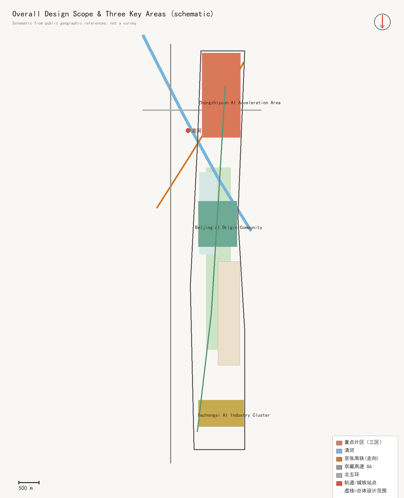
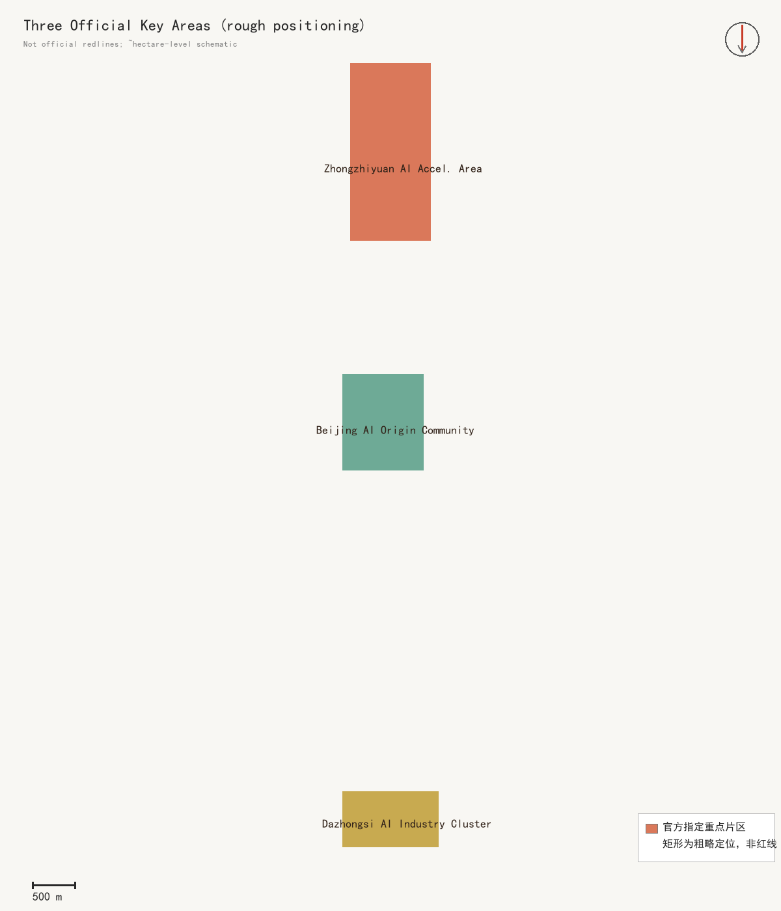
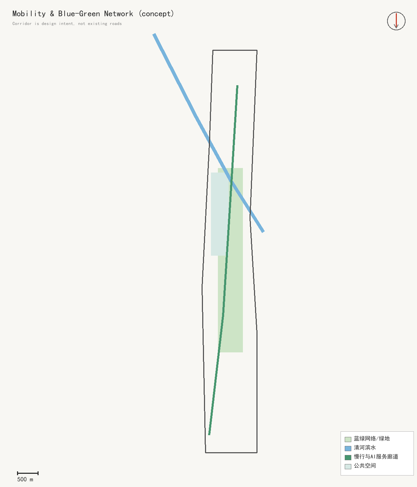

# 京张一毫米 / JING-ZHANG ONE MILLIMETER

> Boundary notice: site and key-area geometries are provisional rough extents, not statutory redlines; “one millimeter” is a narrative scale, not a stormwater-capacity claim.

## Design Basis and Source List

This proposal is grounded in the official open-call announcement, the agent taskbook, the repository site package, its standards index, and the source registry. The announced figures—43.6 km² for coordinated research, about 11.4 km² for overall design, and about 368.4 ha across three key areas—are treated as textual official conditions. The GeoJSON polygons currently supplied by the repository are provisional rough geometries for AI work. Official facts, design propositions, and unresolved matters are therefore kept separate. No parcel boundary, road redline, FAR, height, stormwater capacity, or implementation commitment is inferred by the agent. [source:OFFICIAL-ANNOUNCEMENT] [source:SITE-PACKAGE]

The evidence set has four groups: project requirements; planning, land-use, accessibility, and AI-governance standards; repository schemas and data gaps; and seven international mechanism precedents. External cases are used only to compare how testbeds, collaboration, oversight, and public space are organised. Missing inputs include official polygons, detailed surveys, roads and utilities, catchments, elevations, infiltration tests, ownership, building audits, heritage controls, and operating budgets. Without them, this remains a reversible urban-design concept rather than engineering documentation. [assumption:A-HYDROLOGY-003]

“One Millimeter” is not a claim that flooding has been observed or that a stated storm can be managed. It is a civic design grammar: each millimeter of rain should become visible, explainable, learnable, and subject to human review before it informs maintenance or spatial change. [depth:existing_conditions_diagnosis]

## Three-Level Scope Framework

The three scales answer one question: how can an AI innovation ecosystem and a century-old railway heritage corridor create public value that people can enter, test, and review? At the coordinated-research scale, the proposal establishes a four-party open-test protocol connecting academia, companies, district operators, and the public. At the overall-design scale, it creates one porous heritage spine, three water-learning courts, two mixed innovation wings, and twelve rain stations. At the key-area scale, the protocol becomes ground-floor interfaces, walking links, reversible rain gardens, and human-review points. [depth:three_level_scope_framework]

The spine follows the Jing-Zhang heritage park and adjacent public realm. The three courts serve Zhongzhiyuan, the Beijing AI Origin Community, and Dazhongsi. The two wings combine research testing with talent-oriented daily life. Twelve modular stations observe rainfall, water level, temperature, humidity, and facility condition. They publish only spatially and temporally aggregated environmental data; no faces, device identifiers, or personal movement traces are proposed. Every algorithmic suggestion must show inputs, confidence, and the human disposition. [data:geometry/roads.geojson#ROAD-001] [metric:rain_station_count]

Once official boundaries, surveys, and controls are available, every alignment and metric must be recalculated. Reversibility is a governance feature: a pilot can move or stop when heritage, utilities, mobility, ecology, or public acceptance requires it. [assumption:A-BOUNDARY-002]

## Coordinated Research Area: Industry and Future City Research

The industry strategy treats the belt as open urban-test infrastructure, not simply as additional office supply. Universities frame testable questions; companies contribute tools and operating capacity; district operators manage space and risk; residents and visitors inspect legible results and provide feedback. An “Open Test Credential” records the objective, minimum data, accountable operator, safety boundary, evaluation period, exit condition, and replication status for every pilot. This turns technology display into evidence-based urban service. [standard:PROJECT-AGENT-OPEN-CALL-TASKBOOK]

Seven mechanisms inform the approach. Punggol Digital District combines a university, firms, and a district operating platform. Kalasatama uses living-lab methods in neighbourhood settings. MIT Senseable City Lab links interdisciplinary research, public agencies, industry, and communities. Paris-Saclay integrates research, economic development, transport, and quality of life. Barcelona 22@ demonstrates long-term mixed-use innovation-district implementation. Waterfront Toronto shows the value of independent digital review, privacy, and democratic accountability. Rotterdam demonstrates that stormwater space can remain everyday civic space. The proposal imports no foreign targets—only openness, auditability, exit rules, and everyday usefulness. [source:CASE-PUNGGOL] [source:CASE-WATERFRONT-TORONTO]

Future-city performance is judged by the time from problem definition to public test, the number of reusable cross-institution components, the quality of public space in dry and wet states, and the share of maintenance issues closed after human review. Approval and public safety remain with authorised institutions. [source:CASE-KALASATAMA]

## Overall Design Area: Urban Renewal and Regulatory-Plan-Level Urban Design

The overall structure is “one spine, three courts, two wings, twelve stations.” The porous heritage spine combines slow mobility, cultural interpretation, and visible rainwater pathways. Three courts connect the distinct industrial missions of the key areas to water learning. Two wings provide mixed ground-floor services, talent life, and research testing. Twelve stations offer minimum environmental observation. Land use is a complete, non-overlapping conceptual partition, while green space, public space, buildings, roads, and phasing remain separately reviewable GeoJSON layers. [data:geometry/land_use.geojson#LU-001] [depth:overall_spatial_structure]

Renewal proceeds from interface to courtyard to building. The first moves repair crossings, accessibility, shade, and reversible rain gardens. The second establishes three courtyards for testing materials, drainage behaviour, and operations. Building change follows only after a professional survey. A continuous public base and a segmented skyline are design intentions, not regulatory controls. FAR, height, density, green ratio, and setbacks are not supplied by the official package and remain unknown. [metric:floor_area_ratio] [metric:building_height_m]

Regulatory-plan-level content is organised as known conditions, design recommendations, and matters pending verification. AI cannot issue an approval conclusion and every conflict is resolved through official data and professional review. [standard:MOHURD-CONTROL-DETAILED-PLANNING]

## Detailed Design of Key Areas

Zhongzhiyuan becomes the Qinghe Water-Learning Court: a porous-materials open lab, model-safety workshop, and low-carbon social garden. Small plots compare paving, soil media, and low-power sensing under declared test conditions. The proposal suggests a walking and ecological-learning relationship with Qinghe but makes no inference about official river blue lines or flood controls. [data:geometry/key_areas.geojson#PROV-KEY-001]

The Beijing AI Origin Community becomes the Open-Source Water Court, embedding university result releases, community problem intake, talent services, and rain literacy in public ground floors. Removable rain chains, shallow channels, tree pits, and material samples allow people to compare dry-day comfort and post-rain recovery. Dazhongsi becomes a Porous Civic Room: station-city connections, quadrant walking links, content consumption, and international demonstrations surround a stage that hosts everyday events when dry and reveals runoff paths when wet. [data:geometry/key_areas.geojson#PROV-KEY-002] [data:geometry/key_areas.geojson#PROV-KEY-003]

All three areas implement five actions: open ground floors, repair walking links, create rain gardens, install rain stations, and display maintenance responsibility. Retain-renovate-demolish decisions remain pending a building audit. The polygons are rough locators only; announced approximate areas are textual facts, while parcels and quantities await official attachments. [depth:three_key_area_detailed_design]

## AI Innovation Ecosystem, Personas, and AI+ Scenarios

Six personas shape the programme. Researchers need reproducible experiments and cross-institution data contracts. Start-ups need low-cost, short-cycle testbeds. Established firms need compliant validation and scaling interfaces. Residents need accessible, quiet, understandable services. Maintenance crews need clear work orders rather than black-box alerts. Domestic and international visitors need bilingual narratives and low-barrier participation. Every persona can decline digital interaction and receive an equivalent human or physical service. [assumption:A-AI-004]

The twelve scenario cards are: public rain-station bulletin; post-rain maintenance work order; porous-material A/B test; tree-pit moisture advice; accessible puddle reporting; comfort-based slow route; heritage rain-sound guide; robot wet-weather stop decision; event weather-risk prompt; enterprise Open Test Credential; community review of a water court; and an annual One Millimeter open-source festival. Three are explicit industry validations—material performance, edge-sensing reliability, and facility-maintenance agents. Each specifies minimum data, human review, stop conditions, and public results. [source:AGENT-TASKBOOK]

Operations use “one library, one credential, one public-value ledger.” The library stores non-sensitive specifications for sensing, signage, and rain-garden components. The credential records responsibility and evidence. The ledger publishes only aggregated comfort, recovery, maintenance, and participation outcomes. Four pilgrimage landmarks are the Centennial Gauge Gate, Qinghe Water Algorithm Court, Origin Open-Source Water Court, and Dazhongsi One Millimeter Stage. [depth:municipal_new_infrastructure]

## Land Use, Building Scale, and Retain-Renovate-Demolish Strategy

The conceptual land-use partition contains research testbeds, parkland, industry services, community services, and heritage civic space. It completely covers the provisional overall boundary without overlap. The purpose is not to replace statutory zoning but to test whether the spatial structure has capacity: R&D is near test nodes, public space follows the spine, community services support daily talent life, and commercial demonstration concentrates near station-accessible areas. Codes use the repository subset of the national land-use classification, and areas are recalculated in EPSG:4548. [data:geometry/land_use.geojson#LU-001] [standard:MNR-LAND-USE-CLASSIFICATION-GUIDE]

Buildings follow four categories—retain, adapt, infill, and remove—but the current package labels only conceptual nodes as “adapt or infill pending survey.” Retention depends on structural safety, legal status, adaptability, heritage value, and carbon benefit. Adaptation prioritises public ground floors, canopies, roof drainage, and accessibility. Infill supplies missing test or community functions. Removal requires professional assessment, planning approval, and public communication. Six footprints are functional placeholders, not claims about existing buildings or construction quantities. [data:geometry/buildings.geojson#BLDG-001]

Because no authoritative building map, storey count, structure, tenure, or development controls are available, the footprint metric has only low-confidence comparative value. FAR and height remain unknown until a parcel-by-parcel audit is complete. [metric:building_footprint_area_sqm]

## Transport, Rail, Municipal Infrastructure, and Public Services

Mobility follows a clear priority: walking, cycling, rail access, and then motor-vehicle organisation. The One Millimeter slow spine provides continuous accessible movement and heritage interpretation. Three transverse links connect the eastern and western wings; a northern rain arcade supports innovation commuting; a southern porous link connects the Dazhongsi station area. All lines are conceptual centre lines, not road redlines. Detailed work must verify existing streets, crossings, rail entrances, fire access, parking, buses, freight, and property. [data:geometry/roads.geojson#ROAD-001] [depth:traffic_rail_slow_parking]

Wet-weather operation uses graded conditions. Normal routes remain available; a potential puddle or icing issue triggers field review before local diversion; severe weather follows government alerts and venue emergency plans. Robots are tested only at low speed, within a defined area, under supervision, and with an immediate stop. Accessibility includes physical wayfinding, tactile cues, and human assistance so that a digital tool is never the only service channel. [standard:PROJECT-OFFICIAL-ANNOUNCEMENT]

Rainwater, planting, lighting, power, and edge computing are treated as maintainable public infrastructure, but no pipe diameter, load, or treatment capacity is invented. Twelve stations are modular, low-power, and local-first. Interfaces cannot connect to real control systems until agency approval, cybersecurity review, and an operating budget exist. [assumption:A-CONTROLS-001]

## Blue-Green Network, Public Space, and Urban Character

The blue-green strategy does not invent a new watercourse. It gives public space three states: useful when dry, legible during rain, and recoverable after rain. The spine, Qinghe Water-Learning Court, Origin Open-Source Water Court, and Dazhongsi Porous Civic Room use shallow channels, tree pits, removable paving, rain chains, and visible overflow paths to explain water cycles. Depressions, storage, outlets, and materials require survey, soil, utility, and drainage evidence plus joint landscape, water, and safety design. [data:geometry/green_space.geojson#GREEN-001] [metric:stormwater_capture_capacity_sqm_mm]

Urban character translates railway “gauge, rivet, and sequence” into an identity system. Deep ink recalls industrial heritage; cyan marks water paths; warm yellow identifies human review and participation; green indicates accessible ecological space. The mark is a paired rail line gently lifted by a one-millimeter tick, paired with the bilingual name. It uses no government emblem or unauthorised corporate identity. [standard:MOHURD-URBAN-DESIGN-MEASURES]

Night design is low-luminance, zoned, and reviewed for safety. Rain and railway memory are optional sound layers, not continuous noise. Every digital device has a non-digital explanation and feedback channel. Concept green and public-space ratios compare options but are not statutory standards. [metric:green_ratio] [metric:public_space_ratio]

## Renewal Projects, Implementation Policy, and Phasing

Phase 1 delivers twelve rain stations, three reversible rain-garden pilots, four accessible-link repairs, the Open Test Credential, and public data notices. It tests material, data, and maintenance arrangements with limited capital exposure. Phase 2 builds the three water-learning courts, connected public ground floors, transverse walking links, and four landmarks. A district operating agreement links universities, companies, communities, and site managers. Phase 3 may expand the open test belt and renew buildings or municipal systems only after formal planning and professional assessment. [data:geometry/phasing.geojson#PHASE-001]

Every project passes six gates: evidence completeness; property and approval; public benefit; technical safety and privacy; life-cycle cost; and exit or restoration. Policy tools include temporary site licences, reversible-facility guidance, public-test insurance, open-source archiving, third-party safety review, and an annual public retrospective. AI may organise evidence, simulate scenarios, and draft explainable work orders, but an accountable project lead signs each decision. [depth:phasing_implementation]

Implementation triggers are explicit. No official boundary means no construction quantity. No elevation and network data means no stormwater performance promise. No building audit means no retain-or-remove decision. No privacy and cybersecurity assessment means no live data service. Quarterly reviews track use, maintenance, complaints, and equity; an annual continue-correct-stop list protects public space through reversibility. [assumption:A-HYDROLOGY-003]

## Metrics, Area Recalculation, and Compliance Matrix

Metrics have three classes. Fact metrics record announced approximate scope areas. Geometry metrics are recalculated from provisional boundaries and conceptual layers for topology and ratio checks. Performance metrics can be observed only after implementation: post-rain recovery time, effective maintenance closure, accessible-route availability, public understanding, and reuse of open components. Facts and geometry are never conflated, and simulated performance is never reported as measurement. [metric:announced_overall_design_area_sqm] [metric:site_area_sqm]

Currently recalculable items are provisional site area, conceptual building footprints, conceptual green and public-space ratios, three key areas, and twelve rain stations. FAR, height, statutory green ratio, road standards, and stormwater capacity remain unknown. All area computations use EPSG:4548 and the land-use layer is a complete partition. The compliance matrix maps all mandatory announcement and taskbook items to narrative, GeoJSON, metrics, drawings, the offline viewer, sources, and checks. [depth:metrics_recalculation]

Quality means reproducibility, not attractive numbers. When official polygons arrive, the team must replace site and key-area boundaries, clip every design layer again, recalculate metrics, regenerate figures and four PDFs, and rerun finalisation, self-check, and participant preflight. Any subsequent file edit requires a refreshed manifest and full revalidation. [data:geometry/site_boundary.geojson#SITE-001]

## Risk, Copyright, and Compliance

Primary risks are misreading provisional geometry as a redline, misreading “one millimeter” as engineering capacity, expanding environmental sensing into surveillance, creating trip or ponding hazards, underfunding maintenance, displacing everyday community use with events, and mistaking generated imagery for existing conditions or public commitments. Mitigations are repeated labels, data minimisation, human review, field safety assessment, reversible construction, named maintenance responsibility, and an annual exit list. [assumption:A-AI-004]

Text, diagrams, GeoJSON, and layouts are generated for this submission or reorganised from repository-cleared materials. The concept cover is produced with the built-in image generator as a non-photorealistic mood image and is labelled accordingly. System fonts are used only for local rendering and are not redistributed. External cases are linked to official pages and used as short mechanism summaries. The package follows the repository’s COMMUNITY-DISPLAY-ONLY licence and includes no unauthorised corporate mark, photograph, or restricted basemap. [source:SOURCE-REGISTRY]

Any future sensing deployment requires purpose limitation, a data-protection impact review, cybersecurity, accessibility, and public notice. Raw data should have the shortest useful retention; public data must be aggregated; people can opt out and receive equivalent service. The proposal does not replace the judgement of licensed planning, architecture, landscape, transport, water, structural, fire, heritage, and legal professionals. [standard:PROJECT-AGENT-OPEN-CALL-TASKBOOK]

## References

Direct project references are the official announcement, agent taskbook, site package, source registry, standards index, and professional-depth requirements. Public mechanism precedents are official pages from JTC for Punggol Digital District, Forum Virium Helsinki for Kalasatama, MIT Senseable City Lab, the Paris-Saclay public development authority, Barcelona’s municipal 22@ repository, Waterfront Toronto’s digital-review record, and Rotterdam’s public guidance on water-retaining civic spaces. Complete URLs, source types, and usage limits are stored in sources.json. [source:AGENT-TASKBOOK] [source:CASE-ROTTERDAM-WATER]

The proposal distinguishes precedent mechanism from local evidence. A case shows that an organisational approach has been publicly practised; it does not prove suitability for Jing-Zhang. Local value must be demonstrated through small prototypes, professional assessment, and public deliberation. Geometry, metrics, and drawings are traceable through the manifest and self-check, and every display repeats the provisional-data warning. [source:CASE-SENSEABLE]

Review should follow three questions: does the concept turn AI innovation and public space into executable public problems; does one spine, three courts, two wings, and twelve stations form a coherent spatial and operating structure; and do all numbers, layers, and images distinguish official, provisional, proposed, and unknown information? If an answer is absent from the narrative, layers, or matrices, it remains unresolved rather than assumed. [depth:risk_missing_data]
