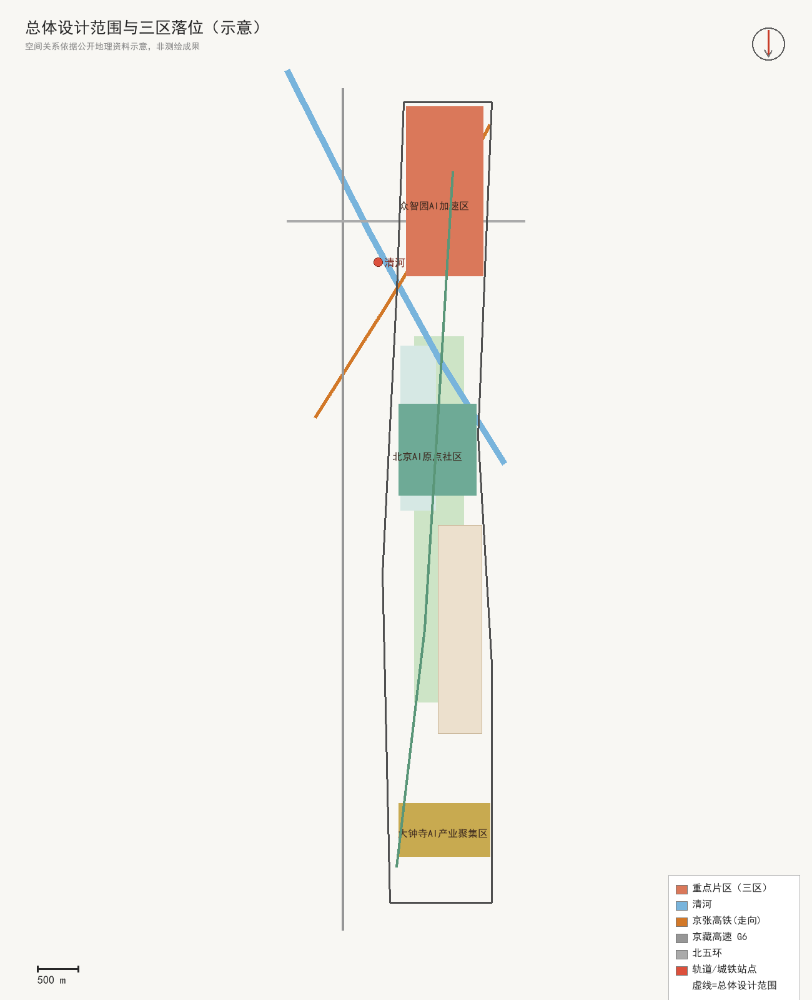
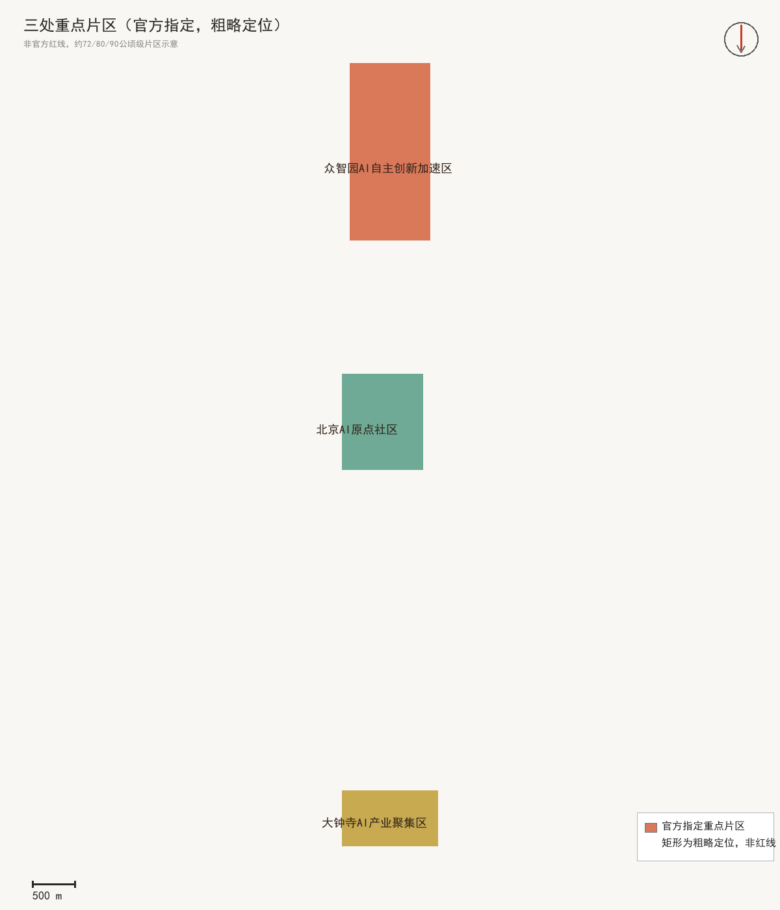
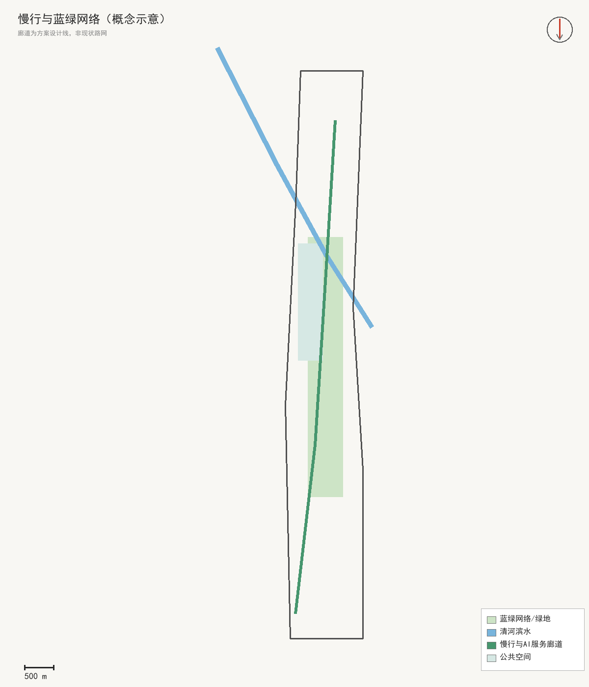

# 京张智脉 · AI 创新带 城市设计方案（概念建议）

## 设计依据与资料清单

本方案依据《百年京张AI创新带城市设计国际方案征集资格预审公告》[source:OFFICIAL-ANNOUNCEMENT][standard:PROJECT-OFFICIAL-ANNOUNCEMENT]与面向全球智能体的开源征集任务书摘录[source:AGENT-OPEN-CALL-TASKBOOK][standard:PROJECT-AGENT-OPEN-CALL-TASKBOOK]，以站点数据包为结构化底图[source:SITE-PACKAGE]，公开资料登记表为来源管理依据[source:SOURCE-REGISTRY]。专业规范依据《城市设计管理办法》[standard:MOHURD-URBAN-DESIGN-MEASURES]、《城市、镇控制性详细规划编制审批办法》[standard:MOHURD-CONTROL-DETAILED-PLANNING]与《国土空间调查、规划、用途管制用地用海分类指南》[standard:MNR-LAND-USE-CLASSIFICATION-GUIDE]；文物保护与遗址协调参照《文物保护》相关要求[standard:HERITAGE-PROTECTION]；品牌与视觉遵循征集要求[standard:BRAND-IDENTITY-GUIDE][standard:COLOR-SYSTEM-GUIDE]；公开合规边界全程遵守[standard:OPEN-CITY-COMPLIANCE]。现状边界：官方精确红线与三处重点区多边形尚未发布，本包使用维护方提供的临时粗略几何生成全部图层[source:PROVISIONAL-BOUNDARIES][data:geometry/site_boundary.geojson#SITE-001][depth:existing_conditions_diagnosis]；全球案例与京张铁路史料仅作背景参考[source:GLOBAL-CASE-PUBLIC-REFS][source:JINGZHANG-HISTORY][source:JZ-PARK-OPEN]。逐文件权利、假设与缺资料清单见 `report/copyright_statement.md` 与第十二章。[depth:risk_missing_data]

## 三层范围工作框架

三层范围是同一决策的三个焦距[depth:three_level_scope_framework]。统筹研究范围约43.6平方公里[metric:research_area_sqm]，回答海淀为什么需要一条AI创新带、如何与三区两翼及区域创新网络协作；总体设计范围约11.4平方公里[metric:site_area_sqm][data:geometry/site_boundary.geojson#SITE-001]，回答京张遗址公园周边如何通过更新成为可步行、可交往、可测试的创新公域；三处重点区合计约368.4公顷[metric:key_area_sqm][data:geometry/key_areas.geojson#KEY-001]，回答众智园、AI原点社区、大钟寺各自先做什么、如何验证。传导逻辑是"战略定方向、设计定结构、实施定项目"：战略层确立智脉主题、生态体系与协同回路；设计层落定主轴三区两翼、用地结构与更新框架；实施层给出三片区详细设计、更新项目清单与三期计划。官方几何到位时触发一次全包重算——替换边界与重点区多边形、重新分割用地、裁剪各图层、复算全部指标并重绘五图两册与看板[depth:metrics_recalculation]。

## 统筹研究范围产业与未来城市研究

**命名与视觉识别**：中文主名"京张智脉 · AI 创新带"，英文名 JingZhang Synapse · AI Innovation Belt。"京张"锚定百年铁路文脉，"智脉/Synapse"喻智能时代沿遗址生长的创新动脉，指向全球AI网络连接节点。Logo方向以"铁轨断面×神经突触"为母题，主色京张青灰#5B6B73、算力青#1FA8A0、中关村暖橙#E8743B，可分解为轨道单元按片区复用[standard:BRAND-IDENTITY-GUIDE][standard:COLOR-SYSTEM-GUIDE][depth:overall_spatial_structure]。**三大定位与五大功能**：百年京张文化带、都市AI生活体验带、AI融合创新带；AI全栈自主、世界级生态、AI+场景、活力城市、AI治理五大功能闭环。**三区两翼协同回路**：以遗址公园慢行主廊道为智脉主轴串联众智园（全栈自主）、AI原点社区（世界级生态与公共体验）、大钟寺（智能原生新业态）；中关村科技服务翼（IP/资本/要素全球化）与小月河场景赋能翼（场景赋能/活力城市）双向补给，形成研发—体验—产业—服务闭环（区域协同属运营建议）。

**全球生态案例机制转译**（7例，仅取机制不移植指标/政策/企业名单）[source:GLOBAL-CASE-PUBLIC-REFS][metric:ecosystem_case_count]：Station F（巴黎）单体孵化+全球创始人网络；Quayside（多伦多）滨水新区+数字孪生治理；鹏城实验室（深圳）国家实验室+产业链；Punggol Digital District（新加坡）产学研+主动出行；MILA（蒙特利尔）学术产业开放研究；特拉维夫AI集群（以色列）军民转民+高密度创业；旧金山AI走廊（美国）资本—人才—算力密集网络。**八重要素保障机制**：以"场景开放"为牵引组织土地/空间/产业/资金/人才/算力/数据/场景，避免将招商、政策、资金写成已确定事项。**区域协同接口**：与未来科学城做"策源-中试"对接、与怀柔科学城互通算题与数据集、与经开区衔接"设计-智造"档期、向京津冀开放场景清单纵深，均属运营建议而非跨区承诺。

## 总体设计范围城市更新与控规深度城市设计

**总体结构：智脉主轴、三区两翼、三级尺度**。主脊有真实底盘——京张铁路遗址公园沿线带状绿廊[source:JZ-PARK-OPEN][source:JINGZHANG-HISTORY]，本方案在这条已存在的公共空间脊柱上做叠加更新：沿遗址走向定义慢行主廊道[depth:overall_spatial_structure][data:geometry/roads.geojson#RD-SPINE]，在东西两侧设置两处缝合街道消除铁路造成的断点[data:geometry/roads.geojson#RD-X1]；空间组织分三级：带状整体、三个站区（约800米半径）、站区内街坊原型，用地单元为第一二级之间的结构分区[depth:land_use_layout]。**更新策略四级阶梯**：运营先行（活动时段、开放规则、导视家具验证需求）→轻改共享（开放首层与闲置空间）→性能改造（节能、无障碍、界面）→必要更新（进入法定程序）。拆改留是方法框架而非逐地块结论[depth:retain_renovate_demolish]：保留铁路工业记忆构筑物并活化，改造低效载体，拆除仅限法定认定，新建集中于站前组团。**风貌与强度**：走"低基底、开放首层、可读屋顶、节制夜景"方向；轴线两侧保持人尺度连续遮荫，三站允许识别性公共建筑但不遮蔽历史资源。容积率、高度、密度、绿地率的官方控制值缺失，作为待控规校核条件列明，本方案不给出法定强度结论[depth:development_intensity_controls][depth:height_massing_character][standard:MOHURD-CONTROL-DETAILED-PLANNING][standard:MOHURD-URBAN-DESIGN-MEASURES]。

## 重点区域详细设计

三片区共用一个模板：形态原型—街坊尺度—首层界面—公共空间—风险[depth:three_key_area_detailed_design]。重点区多边形为临时范围，片区设计只表达定位、系统与验证顺序[data:geometry/key_areas.geojson#KEY-001][data:geometry/key_areas.geojson#KEY-002][data:geometry/key_areas.geojson#KEY-003]。**众智园AI自主创新加速区**：以"芯片—框架—模型—应用"四层自主链条组织研发楼宇、中试共享平台、开源模型广场与适配测试舱，承担全栈自主创新与AI治理话语权。**北京AI原点社区**：以公共体验为核心组织"展示—路演—居住—服务"复合界面，承载全球开发者短期驻留与开源协作，衔接高校策源。**大钟寺AI产业聚集区**：组织智能原生消费与商务场景，形成产品化与消费循环。**AI朝圣地标（5个）**[metric:landmark_count]：开发者散步道[data:geometry/public_space.geojson#PS-RAIL]、开源成果展示廊[data:geometry/public_space.geojson#PS-ORIGIN]、AI里程碑[data:geometry/public_space.geojson#PS-ACCEL]、铁路记忆穹顶[data:geometry/public_space.geojson#PS-DAZHONGSI]、全球开发者荣誉墙；沿遗址公园构成荣誉展示体系与公共空间组件库（模块化展亭、可刻名铺装、无障碍导览桩、能源管家屏）。

## AI 创新生态、人才画像与 AI+ 场景

**生态设计**：众智园全栈自主体系（§5）与AI原点社区生态（§5）落地为空间，中关村科技服务翼输出IP转化、资本对接、人才驿站、合规与算力调度网络（生态机制见 §3 与 §6）。**AI场景卡（12张）**[metric:scenario_count]：AI健康小屋（原点社区公共节点·人工复核）、AI学业伴学角（社区书房·教师主导）、无障碍智能导览（遗址公园全廊·低速可监管机器人）、开发者接驳小巴（主轴·限定路权可远程急停）、城市治理智能体屏（三区指挥中心·公开数据人工复核）、开源模型体验亭（开源之窗·沙盒限算力）、AI助老陪伴站（居住配套·人工兜底）、低碳能源管家（楼宇·数据脱敏）、智能巡检清洁（公共空间·限定时段）、法律/政务咨询舱（服务翼·律师复核）、夜间活力灯光叙事（文化带·节能模式）、多语国际访客助手（门户·翻译导航）。**产业测试验证场景（4个）**[metric:validation_scenario_count]：低速无人接驳验证环线、机器人配送/巡检沙盒、城市治理智能体推演舱、城市级夜间活力场景；均限定路权、可监管、可复核，属测试场景设想而非已批准运营。**用户画像（6类）**[metric:persona_count]：AI研究者/工程师、创业者/开发者、高校师生、居民（含老幼）、访客/国际人才、治理运营者。**隐私与人工复核边界**：数据最小化、匿名化、人工兜底，禁止隐私侵害、过度监控或不可复核场景，不使用非公开数据或指定供应商作为必要条件。

## 用地、建筑规模与拆改留方案

**用地结构**：概念性用地分区由临时网格裁剪生成，全覆盖总体设计范围[data:geometry/land_use.geojson#LU-001][depth:land_use_layout]，按《用地用海分类指南》代码标注（科研0802、商业服务业05、城镇住宅0701、公园绿地1401、文化0803）[standard:MNR-LAND-USE-CLASSIFICATION-GUIDE]；AI研发产业用地（ai_rd+commercial+mixed）占比约0.45[metric:ai_rd_ratio]。**建筑规模**：以示意建筑体量表达强度形态，非高度或面积法定结论[data:geometry/buildings.geojson#B-001][depth:height_massing_character]。**拆改留**：以"保留活化—改造提升—法定认定拆除—站前组团新建"的方法框架组织，不给出逐地块结论[depth:retain_renovate_demolish]。

## 交通、轨道、市政与公共服务设施

**慢行系统**：以遗址公园慢行主廊道为南北主轴[depth:traffic_rail_slow_parking][data:geometry/roads.geojson#RD-SPINE]，串联三区并消除铁路断点；两处东西缝合街道组织跨廊道慢行联系[data:geometry/roads.geojson#RD-X1]。**轨道接驳与低速出行**：以低速接驳小巴（限定路权、可远程急停）衔接轨道站点，组织无障碍路径，作为测试验证场景逐步开放[metric:validation_scenario_count]。**市政新基建**：以场景化市政表达——低碳能源管家、智能巡检清洁、开源模型沙盒、公共空间能源屏等，均以数据脱敏与人工复核为前提[depth:municipal_new_infrastructure]；不进行市政容量测算，相关结论列为待官方数据。

## 蓝绿空间、公共空间与城市风貌

**遗址公园AI公共空间**：沿铁路遗址组织"可漫步、可体验、可展示"的线性公共空间，遗址保护约束线与协调带见 constraints 图层[depth:blue_green_public_space][data:geometry/constraints.geojson#CNST-RAIL][data:geometry/constraints.geojson#CNST-BUF][standard:HERITAGE-PROTECTION]。**蓝绿网络**：脊柱两侧组织蓝绿生态带[data:geometry/green_space.geojson#GR-001]，蓝绿占比约0.23[metric:green_ratio]；公共空间节点（广场、花园、市集、记忆节点）占比约0.23[metric:public_space_ratio][data:geometry/public_space.geojson#PS-ORIGIN][standard:MOHURD-URBAN-DESIGN-MEASURES]。**城市风貌**：低基底、开放首层、可读屋顶、节制夜景，呼应"科技理性×铁路记忆×校园人文"[depth:blue_green_public_space]。**文化叙事与导视符号**：以"百年京张（詹天佑·自主设计第一条干线铁路）→中关村（敢闯敢试·开源协作）→AI新文化（开放·可解释·可审计）"三段叙事组织空间文化系统[source:JINGZHANG-HISTORY][source:JZ-PARK-OPEN]；导视/符号系统与主Logo体系同源但区分，避免混淆；国际传播标语：A century ago, Zhan Tianyou engineered this railway. A century later, your GitHub ID is carved into its future.

## 更新项目清单、实施政策与分期计划

**更新项目清单（概念）**：以重点片区与分期组织更新概念清单——站前组团新建、遗址公园公共空间激活、低效楼宇性能改造、首层开放与共享[depth:renewal_project_list][data:geometry/buildings.geojson#B-001]。**分期实施**：一期（北）众智园AI自主创新加速区——概念先导·研发主导[depth:phasing_implementation][data:geometry/phasing.geojson#PH-1]；二期（中）北京AI原点社区——公共体验·开发者社区；三期（南）大钟寺AI产业聚集区——智能原生新业态。**长期运营机制**：年度活动体系12类[metric:annual_event_count]——Q1 Synapse Hack（开源黑客松）、Q2 Synapse Week（创新周）、Q3 Scenario Day（场景公开赛）、Q4 Synapse Summit+碑刻典礼、常设 Open Bazaar 与 Night Lab；开发者社区运营以"开源之窗"为线下锚点+线上仓库联动，建立贡献者积分、方案上榜、碑刻提名机制；场景开放运营按"申请—沙盒—评估—开放"四步并设人工复核与退出机制；转化路径为活动→场景验证→企业落地→服务翼对接→碑刻沉淀。

## 指标体系、面积复算与合规矩阵

**核心指标**（与 metrics.json 一致）：总体设计范围11,400,000 m²[metric:site_area_sqm]；统筹研究范围43,600,000 m²[metric:research_area_sqm]；重点区域3,684,000 m²[metric:key_area_sqm]；蓝绿占比0.23[metric:green_ratio]；公共空间占比0.23[metric:public_space_ratio]；AI研发产业用地占比0.45[metric:ai_rd_ratio]；场景卡12[metric:scenario_count]；验证场景4[metric:validation_scenario_count]；朝圣地标5[metric:landmark_count]；用户画像6[metric:persona_count]；全球案例7[metric:ecosystem_case_count]；年度活动12[metric:annual_event_count]。**面积复算**：全部面积/占比由同一份临时几何等距估算，官方边界可用后整体重算[depth:metrics_recalculation]。**合规矩阵**：compliance_matrix.json 覆盖公告任务1.3/1.4/1.5与智能体任务agent.1—agent.6；standard_matrix.json 覆盖全部 mandatory 标准；design_depth_matrix.json 15项深度均complete。`visual/index.html` 中同名 data-metric 标记与本表及 metrics.json 一致。

## 风险、版权与合规说明

**数据缺口与假设**：① 临时几何（provisional_rough）待官方边界替换并重算面积[source:PROVISIONAL-BOUNDARIES][assumption:A-BOUNDARY-001]；② 面积采用等距圆柱近似估算，存在投影转换误差[assumption:A-COORD-001]；③ 专业标准本地参考快照待获取，部分条目为概念性回应[assumption:A-STD-001]；④ 全球案例为公开报道参考，未写为本带事实[assumption:A-CASE-001]。[depth:risk_missing_data] **版权**：文本由WorkBuddy Agent生成，事实与引用由作者负责，未使用未授权字体、商标、人物肖像或版权素材，详见 report/copyright_statement.md[standard:OPEN-CITY-COMPLIANCE]。**合规声明**：本方案为开放共创概念建议，不替代正式规划，不构成政府审定结论；未给出容积率、建筑高度、具体拆改留、道路红线、桥隧工程或市政容量等法定/工程结论；所有空间落地建议表述为"概念建议/参考方案/可供专业团队深化研究"。

## 参考资料

1. 百年京张AI创新带城市设计国际方案征集资格预审公告 — https://ghzrzyw.beijing.gov.cn/zhengwuxinxi/tzgg/hd/202605/t20260509_4643047.html [source:OFFICIAL-ANNOUNCEMENT]
2. 面向全球智能体开展百年京张AI创新带城市设计开源征集任务书摘录 — https://github.com/open-city-ai/haidian/blob/main/brief/site-package/agent_taskbook.json [source:AGENT-OPEN-CALL-TASKBOOK]
3. 站点数据包 site-package — https://github.com/open-city-ai/haidian/tree/main/brief/site-package [source:SITE-PACKAGE]
4. 公开资料登记表 — https://github.com/open-city-ai/haidian/blob/main/data/source_registry.json [source:SOURCE-REGISTRY]
5. 临时几何边界 provisional_boundaries.geojson — https://github.com/open-city-ai/haidian/blob/main/brief/site-package/geometry/provisional_boundaries.geojson [source:PROVISIONAL-BOUNDARIES]
6. 全球AI创新生态案例公开报道汇编 [source:GLOBAL-CASE-PUBLIC-REFS]
7. 京张铁路历史文化资料（公开史料） [source:JINGZHANG-HISTORY]
8. 京张铁路遗址公园开放信息（公开报道） [source:JZ-PARK-OPEN]

*本提案为概念建议，供专业团队深化研究。所有空间与机制表述均非政府审定结论。*
