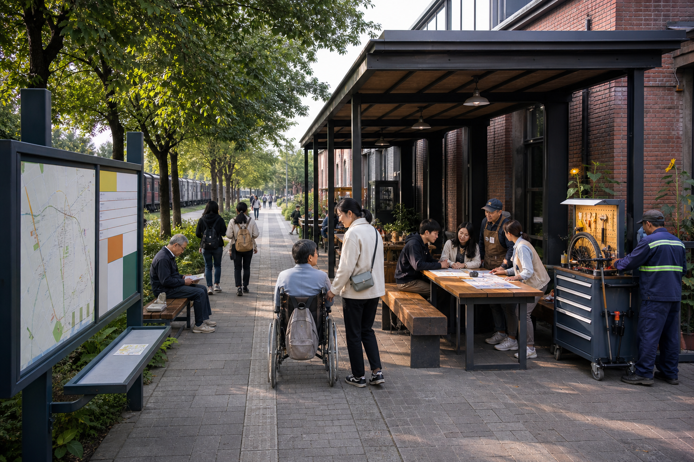
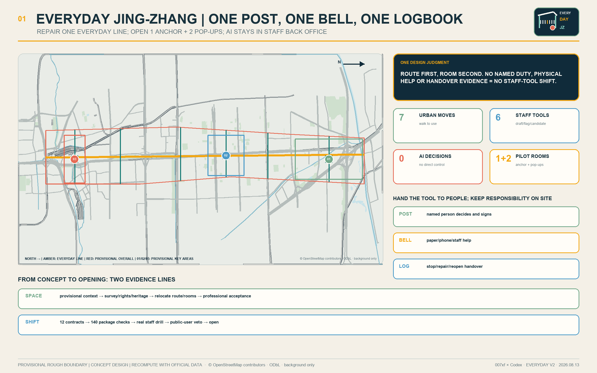
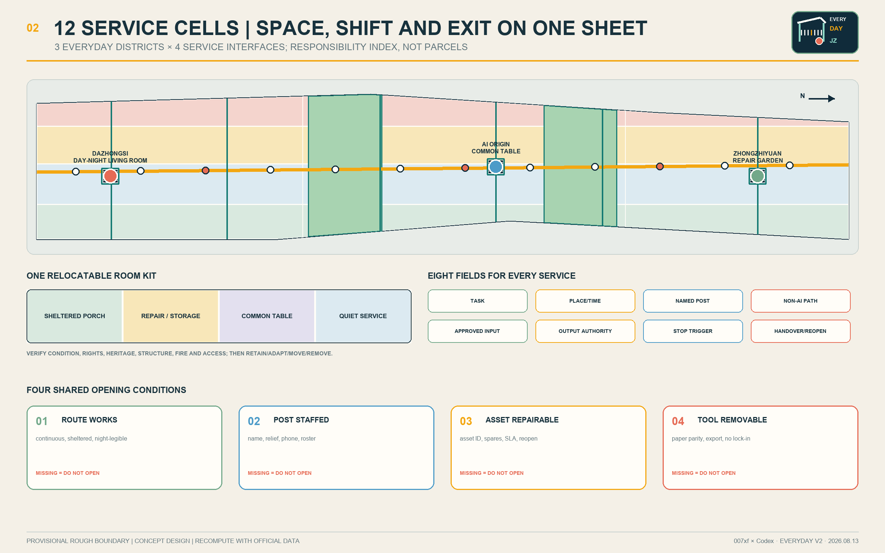
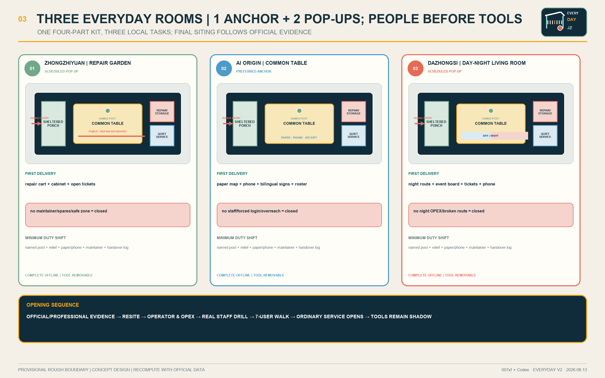
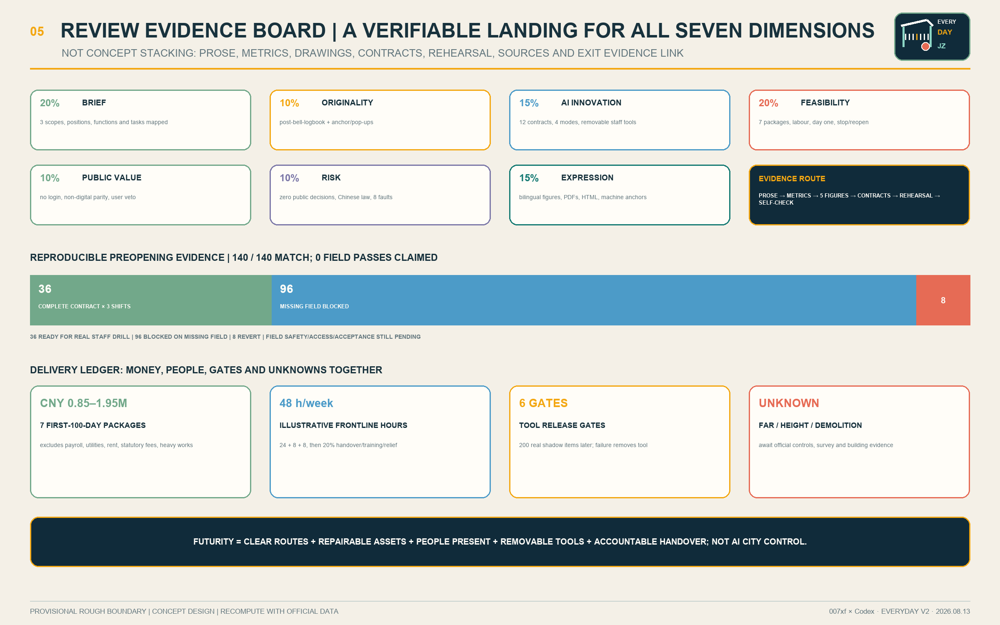
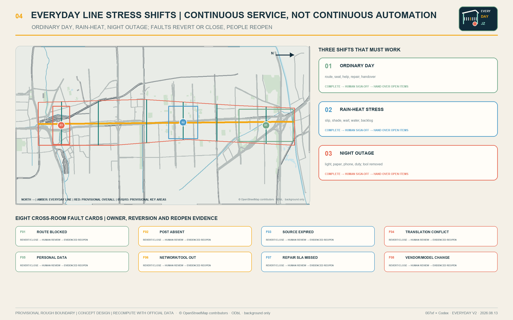

# EVERYDAY JING-ZHANG

> Make the city work first. Add AI only when useful.
>
> One post, one bell, one logbook; seven ordinary urban moves + six staff tools + zero automated public decisions.

EVERYDAY JING-ZHANG is not a city controlled by AI. It does not equate the future with driverless spectacle, robots, holographic screens or unaffordable megastructures. It first resolves seven things people can feel every day: **walk continuously, find shelter, sit when tired, read the signs, ask a person, repair what breaks, and use the place by day and night**. Only after space and staffed service work may six currently mature capabilities—search, translation, summarisation, classification, comparison and consistency checking—enter a staff-only shadow test. They produce drafts, flags or candidates; they make no public decision, control no device, and can be removed.

The spatial framework is one Everyday Line, three staffed rooms, twelve service cells, ten public-service links and twelve scenario points. A continuous slow-mobility and service line connects the Zhongzhiyuan Repair Garden, the AI Origin Common Table and the Dazhongsi Day-Night Living Room. The pilot does not pretend that three full-time teams appear at once: it begins with **one anchor room plus two scheduled pop-up rooms**. Every public task remains complete through physical space, paper, telephone and staff. Small renewal works, duty hours, maintenance tickets, procurement boundaries, conceptual CNY bands, acceptance thresholds and stop/reopen ownership form one spatial and shift contract.[metric:everyday_urban_move_count] [metric:mature_staff_tool_capability_count] [metric:automated_public_decision_count]

| Review dimension | Direct response | Verifiable evidence |
| --- | --- | --- |
| Brief alignment | The three scopes, three positions, five functions, three zones/two wings and six agent tasks are cross-mapped | Compliance and design-depth matrices |
| Urban design | 12 exact-cover cells, 12 reuse-first room parts, 10 links and 3 key areas | GeoJSON, A3/A0 and offline HTML |
| Innovation ecosystem | Eight factors produce handover objects; five gates convert real problems into retained or removed services | Risk and readiness contract |
| Feasibility | Seven independent packages; CNY 0.85–1.95 million first-100-day concept range; ordinary service before tools | Leads, procurement, acceptance, stop and handover |
| Maturity | Six mature staff capabilities only; no robots, open-road autonomy or city control | Four-mode tool contract and eight prohibited decisions |
| Acceptance | No-login and non-digital parity, seven user groups and three stress journeys | 8–12 week human baseline |
| Professional evidence | Known, assumed, pending and prohibited inference are separated; bilingual numbers, sources, rights and drawings are audited | Metrics, sources and self-check |

### One-page review index: one executable design judgment

**First repair one route that works every day; then open one anchor room and two pop-up rooms. Only when every service has a named post, a physical help bell and a handover logbook may a removable AI staff tool enter the back office.**

“One Post, One Bell, One Logbook” is the original operating construct of this revision. It translates the railway disciplines of shifts, communication and handover into everyday public service without copying railway hardware or style:

- **One Post:** each service has one accountable named duty role; a person decides, signs and authorises reopening.
- **One Bell:** each service has a physical bell, telephone or staffed counter, so help never requires an app, login, face or AI.
- **One Logbook:** every opening, stop, repair, handover and reopening leaves a paper and exportable record; responsibility cannot disappear into a black box.

A machine-readable reviewer evidence index routes each of the seven published scoring dimensions to proposal sections, metrics and evidence. It is navigation only and does not replace this proposal.[source:PACKAGE-REVIEWER-EVIDENCE-INDEX] [metric:duty_shift_contract_count] [metric:duty_shift_contract_field_count]

This image describes a public-space experience achievable in 2026 with ordinary materials, reused space and existing service capacity. It is not a verified reconstruction and is not evidence for a boundary, building, heritage control or engineering condition.

## Design Basis and Source List

The controlling evidence is, in order: the repository’s official prequalification announcement, the agent taskbook, site package, source registry, processed fact package and professional-standard matrix. The announcement defines the three scopes and formal deliverable depth; the taskbook defines the three positions, five functions, three zones/two wings, six agent tasks and open collaboration principles. A low-tech-first, staff-tool-later interpretation makes the AI ambition implementable rather than reducing it.[source:OFFICIAL-ANNOUNCEMENT] [source:AGENT-TASKBOOK] [standard:PROJECT-OFFICIAL-ANNOUNCEMENT]

No official overall or key-area polygons are available in the repository. The submitted shapes are public, traceable provisional rough constraints marked official_boundary=false and geometry_role=provisional_constraint. They support content design, machine checks and replacement-based recalculation only. They must not be read as statutory redlines, ownership, planning approval or engineering location.[source:SITE-PACKAGE] [source:BOUNDARY-SOURCE] [data:geometry/site_boundary.geojson#SITE-001] [depth:existing_conditions_diagnosis]

Community Issue #846 records a conflict between the provisional overall polygon and the location of a heritage park on public mapping; public mapping is not a statutory boundary either. The proposal judges neither source to be correct and locates no irreversible work in the disputed area. The Everyday Line, three rooms and twelve cells are intentionally relocatable.[source:ISSUE-BOUNDARY-846] [source:SOURCE-REGISTRY]

Package intake, content review under provisional geometry and professional development after official evidence are separate states. FAR, height and demolition remain unknown. Organizer data gaps do not block content review, but the proposal does not manufacture precision.[source:ISSUE-STATUS-1368] [source:PROCESSED-FACT-PACK] [depth:risk_missing_data]

### Beijing evidence and limits on inference

The Beijing Urban Renewal Regulation supports existing-space renewal that improves public service, public space and slow mobility. The official Jing-Zhang Railway Heritage Park Phase I account supports heritage protection, green public access and stitching the two urban sides. The official Qinghuayuan Station page supplies textual heritage context, while the Xueyuan Road public-space practice shows a locally relevant walking, cycling and east-west connection method.[source:BEIJING-URBAN-RENEWAL] [source:JZ-PARK-PHASE1] [source:QINGHUAYUAN-HERITAGE]

These sources support four principles—reuse first, heritage first, public passage first and east-west coordination—but do not establish the call’s official boundary, ownership, heritage control lines, overlap or construction conditions. Any action affecting heritage fabric, below-ground work or road interfaces must be relocated and redesigned after survey and statutory review.[source:XUEYUAN-PUBLIC-SPACE-2026] [depth:development_intensity_controls]

## Three-Level Scope Framework

One problem–space–operation–evidence–exit chain connects all three scopes. The coordinated research area asks how industry, talent, regional cooperation and events produce handover objects. The overall design area locates those objects in public routes, blue-green space, reused rooms and maintenance interfaces. Each key area assigns people, opening hours, acceptance and stop rules to tasks. This prevents ecosystem, masterplan and node design from becoming unrelated narratives.[standard:PROJECT-AGENT-OPEN-CALL-TASKBOOK] [depth:three_level_scope_framework]

| Scale | Core question | EVERYDAY JING-ZHANG response | Main output |
| --- | --- | --- | --- |
| Coordinated research | How can innovation resources become public value? | Eight-factor handover, five conversion gates, five regional interfaces and four annual programmes | Ecosystem interfaces and long-term operation |
| Overall design | How can the existing city work better first? | One Everyday Line, three rooms, twelve cells and ten links | Land use, buildings, roads, blue-green/public space and phasing |
| Key areas | How do three places deliver different roles? | Repair and proof at Zhongzhiyuan, learning/service at AI Origin, day-night operation at Dazhongsi | Three small prototypes and twelve scenarios |

The provisional overall polygon recalculates to about 11.41 million square metres; the three key-area shapes are also rough constraints derived from task clues and are not official planning areas.[metric:site_area_sqm] [metric:key_area_count] [data:geometry/key_areas.geojson#PROV-KEY-001]

## Coordinated Research Area: Industry and Future City Research

### Three positions and five functions

The three positions are an AI innovation belt usable every day, an open repair-and-proof community, and a public-memory interface for the century-old Jing-Zhang line. The five functions are to find daily problems, improve public space, validate small tools, form repairable products, and publish results and exit decisions. Real problems pull the ecosystem; technology nouns and company lists do not lead it.[source:AGENT-TASKBOOK]

The “three zones and two wings” become three key areas and two collaboration networks. The university/research wing supplies cleared knowledge, courses and evaluation methods. The community-life wing supplies real problems, non-digital service and representative-user evidence. These wings are relationships, not invented construction boundaries.

### Name, logo and identity

EVERYDAY JING-ZHANG states the value test directly: innovation must survive daily use. The original mark combines a railway-like shelter, seven short ticks and one warm-orange service dot. The shelter represents shade and access, the ticks the seven ordinary moves, and the dot a person available to help. Ink navy, warm brick, leaf green and sunflower yellow are applied to durable enamel, coated steel, tactile timber and high-contrast accessible signs. A dynamic screen is never required.

### Six global cases: transfer mechanisms, not scale

| Case | Transferable mechanism | Jing-Zhang translation | Explicitly not transferred |
| --- | --- | --- | --- |
| Punggol Digital District | Research linked to a real environment | Approved staff tools enter bounded shadow validation | Central control scope, budgets and performance |
| Smart Kalasatama | Time-limited small trials with residents | Every tool expires into retain/modify/remove review | Compulsory resident testing |
| Seoul AI Hub | Layered education, incubation, research and open innovation | Three rooms form a learn–prove–serve sequence | Funding scale and policy commitments |
| Cambridge The Foundry | A public community interface within innovation space | A no-gate common table at every room | Fixed areas and architectural image |
| Quayside | Streets and public space before technology | Seven ordinary moves open before a tool | Project governance controversy and branding |
| STATION F | Project services combined with everyday support | Maintenance, training and review replace one-off showcase | Campus scale and operating model |

The cases support mechanism comparison only, not local statutory space, cost or outcomes.[source:CASE-PUNGGOL] [source:CASE-KALASATAMA] [source:CASE-SEOUL-AI-HUB]

Additional institutional sources cover community interface, public-space-first decision making and daily operation.[source:CASE-FOUNDRY] [source:CASE-QUAYSIDE] [source:CASE-STATION-F] [metric:global_case_count]

### Chinese city experience: method, not imagery

Shenzhen suggests a scenario list with accountable units and legible modular public interfaces connected to real demand. Chongqing suggests starting from a small problem and closing a verify–classify–coordinate–resolve loop while linking transit, walking, service and cultural destinations into a continuous experience.[source:CASE-SHENZHEN-AI-SCENARIOS] [source:CASE-SHENZHEN-URBAN-DESIGN]

The proposal imports neither Shenzhen’s skyline, density and citywide platform nor Chongqing’s mountain form, vertical-city image and viral-scenery logic. “Future” means clear routes, repairable facilities, people available, removable tools and a place that still works at night.[source:CASE-CHONGQING-SMALL-CUT] [source:CASE-CHONGQING-TRAILS]

### AI ecosystem: eight factors, five gates and five regional interfaces

Land, space, industry, funding, talent, compute, data and scenario must each produce a handover object. Land supplies verified use conditions; space supplies a reuse adaptation and asset register; industry supplies a repairable component; funding supplies lifecycle ownership; talent supplies competency evidence; compute supplies a documented small workload and exit; data supplies source/access/deletion proof; and a scenario supplies a retain/modify/remove record.[metric:ecosystem_factor_count]

The conversion gates are G1 an ordinary problem and human baseline; G2 source, rights, privacy and non-AI route clearance; G3 at least 200 fully reviewed shadow items; G4 a time-limited staff-only contract; and G5 annual retain, modify or remove review. Failure at any gate stops the tool.[metric:innovation_conversion_gate_count]

| Interface | Exchange object | Jing-Zhang landing | Clearance | Return/exit |
| --- | --- | --- | --- | --- |
| Beiwei Community | Resident questions and inclusive-service methods | AI Origin Common Table | Consent, aggregation and de-identification | Plain-language response record |
| Future Science City | Cleared research material and staff tools | Zhongzhiyuan proof room | Source, security and IP | Shadow test or rejection |
| Huairou Science City | Instrument maintenance and public explanation | Repair Garden | Professional and rights review | Reproducible method or no transfer |
| BDA | Repairable components and maintenance supply | Dazhongsi repair interface | Product safety, spares and procurement | Maintainable product or no purchase |
| Beijing–Tianjin–Hebei | Wayfinding, service and open-ticket templates | Dazhongsi regional interface | Jurisdiction and service owner | Open template with local reauthorisation |

Cooperation exchanges issue briefs, templates, maintenance protocols and verified results—not unapproved personal data. Contract count and visit volume are not treated as public value.[metric:regional_exchange_interface_count]

## Overall Design Area: Urban Renewal and Regulatory-Plan-Level Urban Design

### One Everyday Line, three staffed rooms, twelve cells, ten links and twelve points

The Everyday Line is a relocatable public-service and slow-mobility structure, not a road redline. It links six east-west service seams and three accessible loops, giving ten conceptual links. Each segment follows a practical order: close continuity gaps, add shade and seats, update wayfinding, then publish where a person can help.[data:geometry/roads.geojson#ROAD-001] [metric:public_service_link_count] [depth:overall_spatial_structure]

South Dazhongsi, central AI Origin and north Zhongzhiyuan are crossed with four interfaces: walking/rest/staffed service; learning/work/small tools; repair/logistics/small business; and heritage/green/everyday public realm. The result is twelve exact-cover service cells. They are responsibility indices, not cadastral parcels or land-allocation proposals.[data:geometry/land_use.geojson#LU-S01] [metric:service_cell_count] [metric:land_use_zone_count]

Each public room has a sheltered porch, repair/storage room, common-table room and quiet service room, giving twelve conceptual envelopes. The first choice is reuse or reversible fit-out. Existing-condition, ownership, heritage, structure, fire and accessibility evidence determines whether each envelope is retained, adapted, moved or removed.[data:geometry/buildings.geojson#BLDG-ZW] [metric:reuse_room_part_count] [metric:building_unit_count]

Regulatory-plan-level content is expressed as a complete chain of problem, spatial object, metric, missing evidence and recalculation path. Geometry-derived facts remain auditable; statutory intensity and engineering decisions remain pending.[standard:MOHURD-CONTROL-DETAILED-PLANNING] [standard:MNR-LAND-USE-CLASSIFICATION-GUIDE]

## Detailed Design of Key Areas

### Zhongzhiyuan Repair Garden

The rule is “repair ordinary things before testing a tool.” A public repair, learning and sample-review court is surrounded by a weather-protected porch, tool and spare storage, a common table for engineers, students and maintenance staff, and a quiet room for cleared-document search and shadow review. The first product is a repair cart, open-ticket board, spare-parts list and representative-user walk—not a robot.[data:geometry/key_areas.geojson#PROV-KEY-001] [depth:three_key_area_detailed_design]

### AI Origin Common Table

This is learning and public-service help without an app. One accessible street entrance reaches a staff desk, paper map, telephone, bilingual large-text wayfinding and quiet consultation. Staff may use search and translation drafts from approved material in the back of house; authorised people retain all eligibility, rights, legal, medical and administrative judgment. The room remains complete when disconnected.[data:geometry/key_areas.geojson#PROV-KEY-002]

### Dazhongsi Day-Night Living Room

This is an arrival, rest, small-business and maintenance interface. Daytime uses include a small market, railway stories and public business-material reading. At night the lighting, seats, paper map, telephone and named help point remain. A physical operating wall shows the necessary public subset of maintenance tickets, events, content rights and versions.[data:geometry/key_areas.geojson#PROV-KEY-003]

| Prototype | Plan relationship | Section test | First delivery | Stop |
| --- | --- | --- | --- | --- |
| Repair Garden | Porch–table–repair room–quiet review around a small court | Public walking separated from repair work; continuous weather cover | Cart, cabinet and open tickets | No maintenance owner, spare parts or safe operating zone |
| Common Table | Street–accessible foyer–staff desk–staff back room | No gate; quiet and group seating both accessible | Paper map, phone, bilingual signs and roster | No staff, compulsory login or tool overreach |
| Day-Night Living Room | Arrival–shade/seats–event board–maintenance edge | Direction and help remain clear when screens are off | Night route, calendar, tickets and phone | No night OPEX or discontinuous route |

All three are low-rise in principle, reuse-first, durable, repairable and low-glare. Height, floors, facade, structure and fire design await proper evidence.[depth:height_massing_character]

### One anchor and two pop-ups: do not invent three full-time teams

The three rooms are a long-term spatial network, not three venues that must all operate full-time on day one. The pilot begins with the AI Origin Common Table as one anchor and opens Zhongzhiyuan and Dazhongsi on a published pop-up schedule only when site, staff, safety and maintenance are confirmed. If the operator, ownership or official geometry does not support that anchor, all three are re-ranked through the same selection sheet; a conceptual point is never presented as an approval fact.

| Opening screen | Evidence required before opening | Action when missing |
| --- | --- | --- |
| Reachable | Continuous accessible route, rain-heat shelter and night identification | Do not open, or use a staffed mobile service |
| Staffable | Named post, relief person, published window and telephone | Do not open staff-assisted service |
| Maintainable | Asset ID, spares owner, SLA, isolation and reopen process | Close hazard; safe ordinary service may continue |
| Removable | Paper/phone equivalent and open export | Return tool to SHADOW or REMOVED |
| Vetoable by the public | Seven-group walk and unresolved-exclusion list | Do not promote staff rehearsal to public opening |

## AI Innovation Ecosystem, Personas, and AI+ Scenarios

### Seven user groups and co-testing

The seven groups are service differences, not inferred population profiles: older/non-digital people; wheelchair or mobility users; sensory-disability users; caregivers and children; students/researchers; night/maintenance workers; and visitors or small businesses without a local app. Each may refuse a tool, choose ordinary service and receive fair participation support where permitted.[metric:persona_count] [standard:BARRIER-FREE-ENVIRONMENT-LAW]

Before opening, sunny ordinary use, rain/heat stress, and night or network-outage journeys are tested. An 8–12 week human-only baseline records completion, time/steps, wrong information, complaints/appeal, no-phone parity, staff minutes and maintenance cost.[metric:public_evidence_journey_count] [standard:ELDERLY-SMART-TECH-PLAN-2020-45]

### Twelve scenario cards

| ID | Ordinary service first | Optional staff tool | Human reviewer | Immediate removal condition |
| --- | --- | --- | --- | --- |
| S01 | Physical continuous route, field walk and staffed gap register | Candidate themes from de-identified comments | Mobility/accessibility professional | Source, place or severity cannot be verified |
| S02 | Shade, seating, water information and rain-heat inspection | Organise notes and candidate repairs | Public-space maintenance lead | Tool replaces thermal or engineering judgment |
| S03 TEST | Curator-reviewed leaflet, signs and human guide | Source-linked draft from approved corpus | Curator and rights owner | Missing source, factual conflict or unclear rights |
| S04 | Fixed bilingual signs and staffed directions | Translation draft | Bilingual editor and accessibility reviewer | No line-by-line release or unreadable layout |
| S05 | Staff, paper checklist, phone and receipt | Internal checklist draft from public material | Public-service officer | Eligibility decision, login or skipped confirmation |
| S06 | Staffed first visit, public directory and relay | User-provided question-list draft | Talent/community liaison | Sensitive inference, ranking or unequal service |
| S07 TEST | Phone, on-site registration and human dispatch | Ticket class, de-duplication and crew candidate | Maintenance supervisor | Emergency downgraded or personal data exposed |
| S08 | Enterprise staff and public policy directory | Linked reading-order candidates | Enterprise/legal duty | Legal, permit, funding or investment conclusion |
| S09 | Physical calendar, paper programme and desk | Bilingual public-schedule summary | Event operator and editor | Unverified time, rights or accessibility |
| S10 TEST | Human inspection, existing meter and maintenance log | Equipment-log anomaly flag | MEP operator | Direct control or no field verification |
| S11 | Paper, phone and in-person comment response | De-identified candidate themes | Facilitator and recorder | Minority hidden or personal profiling |
| S12 | Author, professional and public sampling | Number, unit, source and language flags | Editor and independent reviewer | Automatic rewrite of approved content |

All twelve nodes are machine-readable. S03, S07 and S10 are industry validations; the others are ordinary services with optional staff assistance. Each records the ordinary route, role, source boundary, output authority and removal condition.[data:geometry/public_space.geojson#S01] [metric:scenario_node_count] [metric:industry_test_scenario_count]

### Six mature tools, four modes and zero public control

The six capabilities are bounded search, translation drafting, summary drafting, candidate classification, document/option comparison and consistency checking. The only modes are BASE_SERVICE, SHADOW, STAFF_ASSISTED and REMOVED. There is no ACTIVE or autonomous mode.[metric:staff_tool_mode_count]

Eight decision classes are prohibited: planning approval/redline/land right; enforcement or surveillance action; eligibility/benefit/admission/service priority; access control; medical/legal/emergency judgment; traffic signal/vehicle dispatch/route control; safety certification/emergency dispatch; and price/investment/displacement/property decision.[metric:prohibited_automated_decision_count]

Six release gates must all pass: ordinary completion without a tool; 100% approved sources and no unnecessary sensitive data; at least 200 shadow items with 100% human review; 100% traceability for released output; zero automated public decisions and direct control; and at least 20% staff-time saving with no worse sampled error than the human baseline. The final value test is a design threshold, not a claimed result. Failure removes the tool.[metric:human_signoff_coverage_ratio] [metric:non_ai_alternative_coverage_ratio]

### One Post, One Bell, One Logbook: twelve duty-shift contracts

Each scenario card becomes an eight-field contract: **task; service place/time; named duty role; ordinary non-AI path; approved input; tool-output authority; immediate stop trigger; handover and reopen evidence**. If any field is absent, staff-assisted service cannot open. Ordinary space and safe human service may continue only within their separately approved scope.[source:PACKAGE-DUTY-SHIFT-CONTRACT] [metric:duty_shift_contract_count] [metric:duty_shift_contract_field_count]

The innovation is not more automated decisions. It is making sure a person can catch every technical output: there is a duty, a non-digital channel, a stop key, a reopening gate and a handover record. “Human in the loop” becomes a unit executable by space, roster, procurement and ticket—not a slogan.

### 140-case synthetic preopening shift rehearsal

Without official geometry, a real roster and site authorisation, the proposal does not invent a “field pass.” It first runs a reproducible package-level rehearsal:

| Test group | Formula | Expected behaviour | Result |
| --- | ---: | --- | ---: |
| Complete contract across three shifts | 12 × 3 | Label only as ready for on-site staff rehearsal | 36/36 matched |
| Deliberately remove one required field | 12 × 8 | Block staff-assisted opening | 96/96 matched |
| Inject cross-room fault | 8 | Revert to ordinary service or safe closure | 8/8 matched |
| **Total** | **140** | **Claim no field acceptance** | **140/140 matched** |

The shifts are ordinary day, rain-heat stress and night outage. The fault cards are route blockage, absent duty role, expired source, translation conflict, personal data, network/tool outage, missed repair SLA and vendor/model change. The result is reproducible using the package script, but proves only contract consistency. Field safety, accessibility, staff competence and public acceptance still require physical rehearsal.[source:PACKAGE-PREOPENING-SHIFT-REHEARSAL] [metric:preopening_synthetic_case_count] [metric:preopening_expected_match_count] [metric:preopening_field_pass_claim_count]

### How AI assists planning without replacing public decisions

AI may support approved-document search, bilingual drafts, meeting-note summaries, de-identified issue classification, option/document comparison and bilingual metric/source consistency checks. Planners, curators, editors, facilitators, frontline staff and independent reviewers retain judgment. AI does not generate statutory redlines, permission, heritage opinion, displacement, investment or safety certification.[source:STANDARD-GENERATIVE-AI] [source:NIST-AI-RMF]

Structured owner, source, deployment context, human review, update and removal records are informed by public governance methods, but Chinese law, Beijing conditions and repository rules always control.[source:UK-ALGORITHMIC-TRANSPARENCY] [standard:GENERATIVE-AI-INTERIM-MEASURES]

## Land Use, Building Scale, and Retain-Renovate-Demolish Strategy

Land-use codes follow the repository’s accepted classification and cover the provisional overall geometry. The twelve cells are a service-responsibility matrix, not a change of statutory use. The same algorithm can be rerun when official planning geometry arrives.[data:geometry/land_use.geojson#LU-N04] [depth:land_use_layout]

The twelve building envelopes total about 30,957.656 square metres. They are interchangeable programme parts in three prototypes, not confirmed footprints or gross floor area.[metric:building_footprint_area_sqm] [data:geometry/buildings.geojson#BLDG-DS]

Retain/adapt/remove follows four steps: verify conditions and rights; retain when safety, heritage and function allow; lightly adapt for accessibility, fire, energy and service interfaces; move or remove a conceptual part when unsafe or conflicting. Without survey, no demolition number is offered. FAR, height and demolition remain unknown.[depth:retain_renovate_demolish] [standard:MOHURD-ARCH-DESIGN-DEPTH-2016]

Urban character does not pursue an “AI form.” It retains a modest railway and Zhongguancun industrial scale, sheltered edges, low-glare night conditions, replaceable components and obvious public entrances. Official height, setbacks, density and fire controls belong to professional development.[standard:MOHURD-URBAN-DESIGN-MEASURES]

## Transport, Rail, Municipal Infrastructure, and Public Services

The conceptual slow-mobility network is 18,836.033 metres: one north-south Everyday Line, six east-west service seams and three accessible loops. This is derived from provisional geometry, not an engineering quantity. Rights of way, sections, junctions, rail interchange and parking require field and authority confirmation.[metric:road_network_length_m] [data:geometry/roads.geojson#ROAD-002] [depth:traffic_rail_slow_parking]

Each segment is developed in a practical order: verify clear continuous width and gradient; provide shade/rain protection; provide seats and water information; add large-text, tactile and audible bilingual wayfinding; provide low-glare night lighting; publish a human-help entry. Motor traffic does not depend on AI. The proposal contains no automated signal, driverless shuttle or open-road autonomy.

Municipal/public service uses seven small offline components: numbered accessible route; shade, weather protection and rest; multimodal bilingual sign; paper map and physical calendar; staffed table, telephone and receipt; repair cart and open tickets; movable planting, ground marking and small-event kit. Each requires an asset ID, maintainer, inspection frequency, spares and stop condition.[metric:public_component_count] [depth:municipal_new_infrastructure]

## Blue-Green Network, Public Space, and Urban Character

Two conceptual greenways and three public rooms support the sequence walk–shelter–sit–read–ask–repair–use. The conceptual green ratio is 0.179931 and the three public rooms occupy 0.002178 of the provisional overall area. Both depend on provisional geometry and are not approved controls.[metric:green_ratio] [metric:public_space_ratio] [data:geometry/green_space.geojson#GREEN-001]

Public-space priorities are trees, rain cover, seating, water information, night-legible signs, repaired walking gaps and maintenance access. A sensor is never an opening condition. Shade, rest and directions remain complete without a network or AI.[data:geometry/public_space.geojson#PUBLIC-001] [depth:blue_green_public_space]

Five story stops connect century-old Jing-Zhang history, Zhongguancun culture and daily innovation: walk the railway line, rest in shared shade, read a verified story, repair a public object and meet at the common table. They are replaceable content points, not AI monuments.[metric:culture_story_stop_count] [metric:ai_landmark_count]

The design learns interface clarity from Shenzhen and continuous experience from Chongqing, but its character is grounded in north Beijing’s flatter terrain, railway heritage, university neighbourhoods and repairable public equipment. Futurity is order, precision and reliable daily use—not a science-fiction skin.

## Renewal Projects, Implementation Policy, and Phasing

### Seven concept packages and CNY bands

| Package | Scope and lead | First-100-day concept band | Acceptance | Stop and handover |
| --- | --- | ---: | --- | --- |
| E1 | Baseline walk and ordinary-service inventory; street/community | CNY 80k–150k | Rights inventory and seven-group walk | Stop if site/service owner unclear; hand over baseline, rights and issues |
| E2 | Continuous route, shade, seats and signs; design/engineering | CNY 300k–750k | Accessible and rain-heat route pass | Stop for heritage, fire or right-of-way conflict; hand over asset/maintenance register |
| E3 | One anchor plus two scheduled pop-up rooms; operator | CNY 150k–300k | Published hours and complete paper/phone/staff route | No staff or OPEX means no opening; hand over room, roster and service manual |
| E4 | Repair and open tickets; maintenance team | CNY 70k–150k | Urgent route and sample tickets close | Stop without SLA or spares owner; hand over asset, spares and ticket export |
| E5 | Cleared heritage and everyday programme; community/curation | CNY 60k–150k | Source, rights, bilingual and accessibility audit | Do not publish while rights/heritage pending; hand over content/event register |
| E6 | Staff-tool shadow sandbox; data-security owner | CNY 120k–300k | All six gates pass; zero public decisions | Delete on privacy, source, value or error failure; hand over export and deletion proof |
| E7 | Independent user test and annual review; evaluator | CNY 70k–150k | Public retain/modify/remove decision | Stop without baseline or with conflict; hand over scorecard, response and deadline |

The seven packages total CNY 0.85–1.95 million. This is a pre-feasibility concept range excluding land, heavy civil works, unknown utility diversion, statutory fees and long-term OPEX—not a quotation, investment promise or government budget. Quantities, tax, market quotes, staff cost and lifecycle maintenance must precede procurement.[metric:delivery_package_count] [metric:first_100_day_budget_min_cny] [metric:first_100_day_budget_max_cny]

The staff-tool sandbox is only CNY 0.12–0.30 million. If E6 is cancelled completely, E1–E5 and E7 still form a complete urban-renewal and operating-evidence chain.[metric:staff_tool_sandbox_budget_min_cny] [metric:staff_tool_sandbox_budget_max_cny]

### Eight roles, RACI and veto

The district coordinator owns cross-department scope; street/community owns daily needs and the non-digital entry; the operator owns roster, hours, assets and OPEX; design/engineering owns survey, heritage, accessibility, fire, transport and utilities; maintenance owns inspection, spares and closure; the data-security owner owns sources, access, retention and removal; representative users can veto opening with unresolved exclusion; and the independent evaluator can veto unsupported scale-up.[metric:stakeholder_role_count]

Public routes, maintenance and staffed help cannot depend on tool sponsorship, profiling, data exchange or paid priority. Every procurement package needs open export, an asset/spares register, training, a named owner and exit proof.

### First 100 days, operating labour and opening day

Days 0–10 confirm site, rights, operator, heritage and user panel. Days 11–30 deliver walks, inventory, design freeze and small procurement. Days 31–60 install reversible components, open staffed rooms and begin the human baseline. Days 61–100 continue the 8–12 week baseline where timing allows, repair defects and publish evidence; staff tools remain SHADOW.[data:geometry/phasing.geojson#PHASE-001] [metric:phase_count] [depth:phasing_implementation]

Labour is not hidden behind a fictional assumption of two people in each of three rooms. It uses a reviewable formula: **weekly frontline hours = Σ(room published hours × simultaneous duty posts) + 20% handover/training/leave-relief allowance**. A scale test assumes a 24-hour/week anchor and two 8-hour/week pop-ups, producing 48 frontline hours/week. Because handover, leave and some two-person safety tasks require resilience, the roster needs at least two interchangeable people. This is a sizing assumption, not an approved roster, wage or OPEX; the operator and district coordinator must confirm it.[metric:illustrative_frontline_hours_per_week] [metric:pilot_anchor_room_count] [metric:pilot_pop_up_room_count]

The CNY 0.85–1.95 million concept range excludes permanent payroll, utilities, rent or asset transfer, statutory professional fees and heavy works. These must be separate OPEX and professional workstreams before procurement; a low concept band cannot conceal them.

Opening day operates as a shift, not a launch event: 08:30 named roster, route and asset check; 09:00 paper, telephone and staffed service opens first; 12:00 hand over unresolved tickets, hazards, sources and tool state; 15:00 witness one representative-user task and one repair ticket; 18:00 close or hand over, publishing unresolved items, owners and deadlines. One fault card may be injected only where no real public right is affected. A tool can never close a ticket or sign a reopening.

### Four event brands and long-term operation

The annual programme has only four items: Everyday Walk Day, Open Repair Table, Railway Story Evening and Staff Tool Open Review. Each must close route defects, create repair evidence, publish rights-cleared content or make a retain/remove decision. Attendance volume does not replace an operating result.[metric:event_brand_count] [metric:annual_program_count]

## Metrics, Area Recalculation, and Compliance Matrix

Values are separated into known quantities recomputable from geometry/structured contracts; unknown controls needing official plans or survey; and operating thresholds that follow a baseline. Areas use EPSG:4548. Source file, formula, confidence and assumptions are recorded in metrics.json.[depth:metrics_recalculation]

| Metric group | Current value and meaning | Machine anchor |
| --- | --- | --- |
| Provisional overall area | 11,412,825.386 sqm; not an official redline | [metric:site_area_sqm] |
| Concept building envelopes | 30,957.656 sqm; not confirmed scale | [metric:building_footprint_area_sqm] |
| Blue-green/public | green ratio 0.179931; public-space ratio 0.002178 | [metric:green_ratio] [metric:public_space_ratio] |
| Slow-mobility network | 18,836.033 m conceptual centrelines | [metric:road_network_length_m] |
| Key areas | 3 provisional key areas | [metric:key_area_count] |
| Land/building objects | 12 land cells; 12 building parts | [metric:land_use_zone_count] [metric:building_unit_count] |
| Scenarios | 12 nodes, including 3 industry validations | [metric:scenario_node_count] [metric:industry_test_scenario_count] |
| Research evidence | 7 user groups and 6 global cases | [metric:persona_count] [metric:global_case_count] |
| Story/programme | 5 everyday story stops and 4 annual programmes | [metric:ai_landmark_count] [metric:annual_program_count] |
| Phasing | 3 phases | [metric:phase_count] |
| Core formula | 7 moves, 6 staff capabilities, 0 automated public decisions | [metric:everyday_urban_move_count] [metric:mature_staff_tool_capability_count] [metric:automated_public_decision_count] |
| Prohibited decisions | 8 public decision classes excluded | [metric:prohibited_automated_decision_count] |
| Spatial contract | 12 cells, 12 room parts and 10 links | [metric:service_cell_count] [metric:reuse_room_part_count] [metric:public_service_link_count] |
| Tool contract | 4 modes | [metric:staff_tool_mode_count] |
| Delivery/governance | 7 packages, 8 roles and 5 regional interfaces | [metric:delivery_package_count] [metric:stakeholder_role_count] [metric:regional_exchange_interface_count] |
| Ecosystem/experience | 8 factors, 7 components and 5 story stops | [metric:ecosystem_factor_count] [metric:public_component_count] [metric:culture_story_stop_count] |
| Conversion/evidence | 5 gates, 4 events and 3 stress journeys | [metric:innovation_conversion_gate_count] [metric:event_brand_count] [metric:public_evidence_journey_count] |
| Completeness | human sign-off 1.0; non-AI alternative 1.0 | [metric:human_signoff_coverage_ratio] [metric:non_ai_alternative_coverage_ratio] |
| Duty contracts | 12 contracts, 8 mandatory fields and 3 stress shifts | [metric:duty_shift_contract_count] [metric:duty_shift_contract_field_count] [metric:service_shift_state_count] |
| Preopening rehearsal | 140 synthetic package checks, 140 expected matches and 0 field passes claimed | [metric:preopening_synthetic_case_count] [metric:preopening_expected_match_count] [metric:preopening_field_pass_claim_count] |
| Pilot resource | 1 anchor + 2 scheduled pop-ups; illustrative 48 frontline hours/week | [metric:pilot_anchor_room_count] [metric:pilot_pop_up_room_count] [metric:illustrative_frontline_hours_per_week] |

FAR, height and demolition area remain unknown until official boundaries, controls and surveys arrive. The compliance matrix links the announcement, taskbook, prose, drawings, geometry, metrics, sources, assumptions and self-check. A high number of claims never substitutes for evidence quality.[standard:MOHURD-CONTROL-DETAILED-PLANNING]

## Risk, Copyright, and Compliance

The leading risks are not insufficient technological novelty. They are misreading provisional geometry, underfunding maintenance, opening staffed service without labour, publishing uncleared content, or allowing a draft tool to drift into public decision making. The response is relocatable spatial structure, independently stoppable packages, OPEX before opening, source/rights registers, zero automated public decisions and verifiable deletion.[data:geometry/constraints.geojson#CONSTRAINTS-DATA-GAP]

Generative tools operate only in staff back-of-house on public or approved material. Facial recognition, profiling, compulsory apps and compulsory login are excluded by default. Complaints, human review, information protection and removal must be in place before any trial.[standard:GENERATIVE-AI-INTERIM-MEASURES]

Chinese law controls the floor for personal information and data handling. No unnecessary personal information enters a tool; purpose, source, access and retention are approved before shadow use. An incident triggers isolation and documented handling/deletion before any restart decision. A vendor, model or material configuration change automatically returns the tool to SHADOW or REMOVED. These are design controls, not legal approval; professional review remains mandatory.[source:PIPL-2021] [source:DATA-SECURITY-LAW-2021]

Accessibility is an opening condition, not an add-on. Continuous routes, multimodal information, traditional service and representative-user tests preserve service for older people, disabled people, caregivers and temporary visitors.[source:STANDARD-BARRIER-FREE] [source:STANDARD-ELDERLY-TECH]

The submission’s writing, diagrams, drawings, layout, logo and machine structures are original human–AI collaborative work. Referenced web pages support facts or methods; protected images, logos, plans and substantial text are not copied. The atmosphere image is AI-generated and registered in the copyright statement. Site-overview and mobility-bluegreen use prominently attributed OpenStreetMap vector context solely for reviewer orientation; no official redline, parcel, ownership, heritage, planning or engineering fact is derived from it, and no raw map extract enters the package. Rights are recorded in source, provenance and asset-rights ledgers.[source:OSM-BACKGROUND-CONTEXT-20260813] [source:PACKAGE-ASSET-RIGHTS-LEDGER]

The package gives layered responses to land-use classification, urban design, regulatory-plan depth, architectural evidence gaps, accessibility, older-user service and generative-AI boundaries. It is not government endorsement, implementation approval, a statutory plan, construction drawing, investment commitment or safety certification.[standard:MNR-LAND-USE-CLASSIFICATION-GUIDE] [standard:MOHURD-ARCH-DESIGN-DEPTH-2016]

## References

This is the readable index of machine-registered evidence. URLs, publishers, retrieval dates, use and rights are controlled by sources.json.

| Category | Source and use |
| --- | --- |
| Site | Repository site package and version [source:SITE-PACKAGE] |
| Registry | Public source registry [source:SOURCE-REGISTRY] |
| Facts | Processed site fact package [source:PROCESSED-FACT-PACK] |
| Boundary | Provisional overall boundary source [source:BOUNDARY-SOURCE] |
| Key areas | Provisional key-area source [source:KEY-AREA-SOURCE] |
| Announcement | Official prequalification announcement [source:OFFICIAL-ANNOUNCEMENT] |
| Taskbook | Agent taskbook [source:AGENT-TASKBOOK] |
| Discussion | Boundary conflict issue [source:ISSUE-BOUNDARY-846] |
| Discussion | Content-review/data-gap status [source:ISSUE-STATUS-1368] |
| China rule | Generative AI service governance [source:STANDARD-GENERATIVE-AI] |
| China rule | Barrier-free environment [source:STANDARD-BARRIER-FREE] |
| China rule | Traditional service for older users [source:STANDARD-ELDERLY-TECH] |
| Global case | Punggol Digital District [source:CASE-PUNGGOL] |
| Global case | Smart Kalasatama [source:CASE-KALASATAMA] |
| Global case | Seoul AI Hub [source:CASE-SEOUL-AI-HUB] |
| Global case | Cambridge The Foundry [source:CASE-FOUNDRY] |
| Global case | Waterfront Toronto Quayside [source:CASE-QUAYSIDE] |
| Global case | Paris STATION F [source:CASE-STATION-F] |
| China case | Shenzhen AI scenario method [source:CASE-SHENZHEN-AI-SCENARIOS] |
| China case | Shenzhen urban-design method [source:CASE-SHENZHEN-URBAN-DESIGN] |
| China case | Chongqing small-cut loop [source:CASE-CHONGQING-SMALL-CUT] |
| China case | Chongqing continuous-trail experience [source:CASE-CHONGQING-TRAILS] |
| Beijing rule | Beijing Urban Renewal Regulation [source:BEIJING-URBAN-RENEWAL] |
| Beijing project | Jing-Zhang Railway Heritage Park Phase I [source:JZ-PARK-PHASE1] |
| Beijing heritage | Qinghuayuan Station [source:QINGHUAYUAN-HERITAGE] |
| Beijing practice | Xueyuan Road public space [source:XUEYUAN-PUBLIC-SPACE-2026] |
| Governance background | NIST AI RMF [source:NIST-AI-RMF] |
| Governance background | UK algorithmic transparency record [source:UK-ALGORITHMIC-TRANSPARENCY] |
| Chinese law | Personal Information Protection Law [source:PIPL-2021] |
| Chinese law | Data Security Law [source:DATA-SECURITY-LAW-2021] |
| Map context | OpenStreetMap contributors, ODbL, attributed orientation background only [source:OSM-BACKGROUND-CONTEXT-20260813] |
| Package evidence | Duty-shift contracts and fault cards [source:PACKAGE-DUTY-SHIFT-CONTRACT] |
| Package evidence | 140-case synthetic preopening rehearsal [source:PACKAGE-PREOPENING-SHIFT-REHEARSAL] |

The complete machine index is in sources.json, metrics.json, compliance_matrix.json, standard_matrix.json, design_depth_matrix.json and self_check.json. Professional development requires official boundaries, ownership, terrain, building and utility surveys, heritage controls, regulatory planning, transport evidence and operating budgets.
