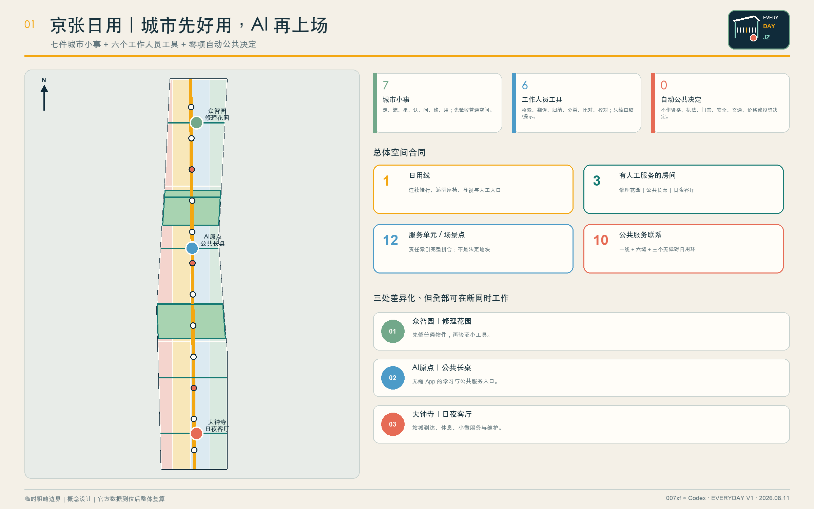
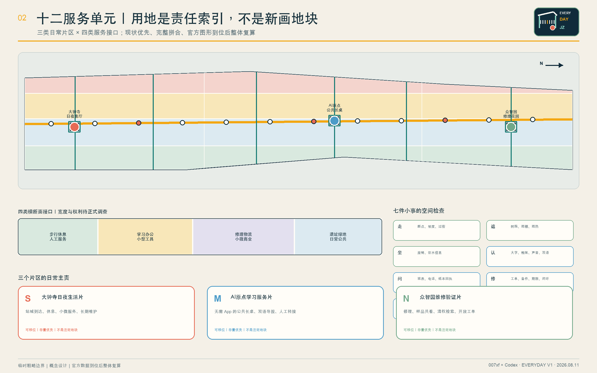
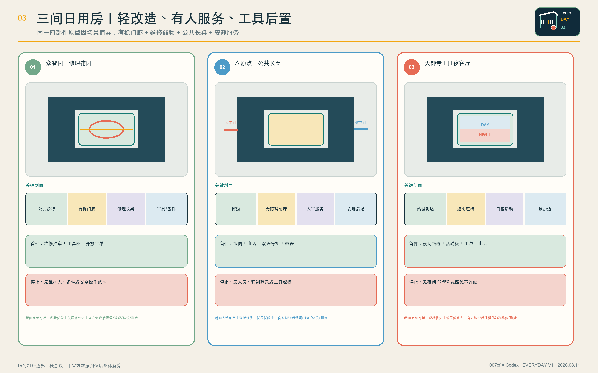
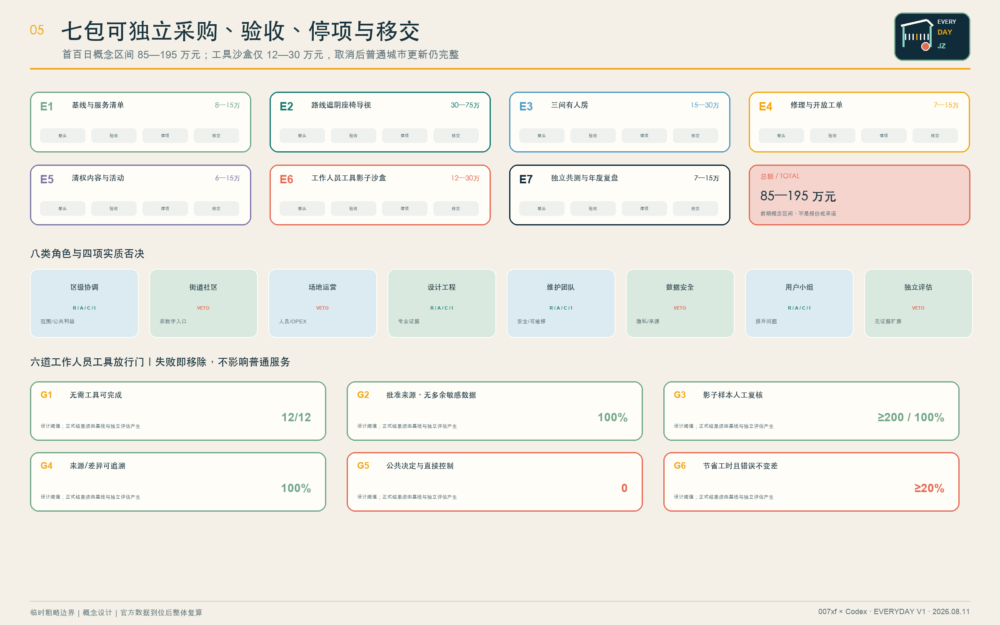
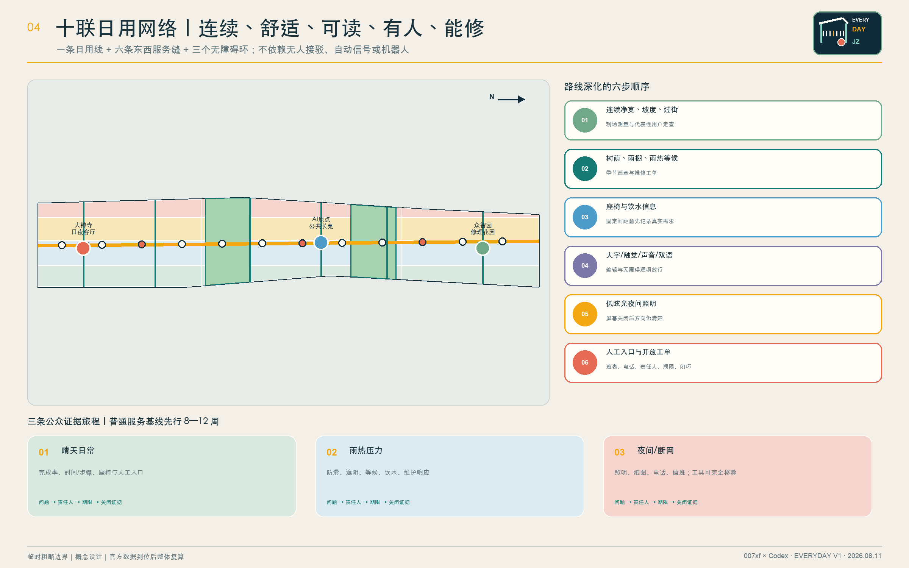

# 京张日用 / EVERYDAY JING-ZHANG

> 城市先好用，AI 再上场。
>
> 七件城市小事 + 六个工作人员工具 + 零项自动公共决定。

“京张日用”不是一座由 AI 控制的城市，也不是把未来感等同于无人化、机器人、全息屏或超高成本巨构。它先解决居民每天能够感知的七件小事：**走得连续、晒雨有遮、累了能坐、标识看懂、有人可问、坏了能修、昼夜可用**。空间和人工服务完成之后，六类现阶段成熟的工具——检索、翻译、归纳、分类、比对、一致性检查——才可在工作人员后场进入影子测试；它们只生成草稿、提示或候选，不作公共决定，不直接控制设备，随时可以移除。

总体结构为“一条日用线、三个有人工服务的房间、十二个服务单元、十条公共联系、十二个场景点”。一条连续慢行与服务路径串联众智园“修理花园”、北京 AI 原点“公共长桌”和大钟寺“日夜客厅”；所有公共任务均可通过实体空间、纸本、电话和工作人员完成。设计的核心不是押注某项技术，而是把**小尺度更新、人员编制、维护工单、采购边界、人民币概念区间、验收阈值和退出责任**写进同一套空间合同。[metric:everyday_urban_move_count] [metric:mature_staff_tool_capability_count] [metric:automated_public_decision_count]

| 评审维度 | 本方案的直接回答 | 可核验证据 |
| --- | --- | --- |
| 任务契合 | 三层范围、三大定位、五大功能、三区两翼和六项智能体任务逐条映射 | 合规矩阵、设计深度矩阵 |
| 城市设计 | 12 个完整拼合单元、12 个存量优先房间部件、10 条联系、3 处重点区 | GeoJSON、A3/A0、离线 HTML |
| 创新生态 | 八要素必须产出可移交对象，五门把真实问题转成可保留或移除的服务 | 风险与实施合同 |
| 可行性 | 七个独立实施包，首百日 85 万—195 万元概念区间，先普通服务后工具 | 负责人、采购、验收、停项、移交 |
| 技术成熟 | 只用六类成熟工作人员工具；不含机器人、开放道路自动驾驶和城市自动控制 | 四模式工具合同、八类禁止决定 |
| 公众接受 | 免登录、非数字等价路径、七类用户共测、三条压力旅程 | 8—12 周人工基线 |
| 专业证据 | 已知、假设、待补和禁止外推分层；双语数字、来源、版权与图纸逐项复核 | 指标表、来源表、自检结果 |

氛围图表达的是可在 2026 年以普通材料、存量空间和现有服务能力实现的场景，不是已核实场地的写实重建，也不作为边界、建筑、文保或工程证据。

## 设计依据与资料清单

主控依据依次为：仓库资格预审公告、面向智能体任务书、场地包、来源登记表、处理后的事实包和专业标准矩阵。公告确定三层工作范围和正式成果深度；任务书确定三大定位、五大功能、三区两翼、六项智能体任务与开源协作原则。本方案的“低技术起步、工作人员工具后置”是对任务目标的可实施解释，并不削弱 AI 创新要求。[source:OFFICIAL-ANNOUNCEMENT] [source:AGENT-TASKBOOK] [standard:PROJECT-OFFICIAL-ANNOUNCEMENT]

当前仓库没有官方总体边界和三处重点区 polygon。提交中的总体范围与重点区均为公开可追溯的临时粗略约束，标记为 official_boundary=false 和 geometry_role=provisional_constraint，只用于内容设计、机器校验和官方图形到位后的替换复算；不得解释为法定红线、权属、规划许可或工程定位。[source:SITE-PACKAGE] [source:BOUNDARY-SOURCE] [data:geometry/site_boundary.geojson#SITE-001]

对应的现状诊断、精度限制和官方图形替换要求收录于设计深度矩阵。[depth:existing_conditions_diagnosis]

社区 Issue #846 记录了临时总体范围与公开地图所示遗址公园之间的位置冲突；公开地图同样不是法定边界。因此方案不判断哪一方正确，不在争议位置布置不可逆工程，只把“日用线、三个房间、十二单元”作为可整体移位的结构。[source:ISSUE-BOUNDARY-846] [source:SOURCE-REGISTRY]

评审状态分为三层：文件准入、临时边界下的内容评审、正式资料齐备后的专业深化。容积率、建筑高度和拆除量继续保持 unknown；官方数据缺口不妨碍评审设计内容，但禁止制造精确感。[source:ISSUE-STATUS-1368] [source:PROCESSED-FACT-PACK] [depth:risk_missing_data]

### 北京在地证据与不外推边界

北京市城市更新条例支持以存量空间改善公共服务、公共空间和慢行联系；京张铁路遗址公园一期官方介绍确认遗产保护、绿色开放与缝合城市两侧的方向；清华园车站官方文保页面提供文字性保护背景；学院路公共空间项目说明海淀已有以步行骑行和东西联系改善公共空间的实践。[source:BEIJING-URBAN-RENEWAL] [source:JZ-PARK-PHASE1] [source:QINGHUAYUAN-HERITAGE]

这些官方资料支持“存量优先、遗产优先、公共通行优先、东西协同”四条方法，但不能证明本征集官方边界、地块权属、文保控制线、项目重叠或建设条件。任何涉及遗址本体、地下工程或道路接口的动作，必须在正式测绘、文保、权属和市政审查后重新定位。[source:XUEYUAN-PUBLIC-SPACE-2026] [depth:development_intensity_controls]

## 三层范围工作框架

三层范围通过一条“问题—空间—运营—证据—退出”责任链贯通。统筹研究范围判断产业、人才、区域协作和活动如何产生可交付物；总体设计范围将交付物落实到公共路线、蓝绿空间、存量房间和维护接口；重点区域把每个任务落实到人员、开放时间、验收和停项条件。这样避免宏观生态、总图和节点设计各说各话。[standard:PROJECT-AGENT-OPEN-CALL-TASKBOOK] [depth:three_level_scope_framework]

| 层级 | 核心问题 | 京张日用的回答 | 主要成果 |
| --- | --- | --- | --- |
| 统筹研究范围 | 创新资源如何成为真实公共价值 | 八要素交班、五道转化门、五个区域接口、四个年度活动 | 生态接口与长期运营 |
| 总体设计范围 | 存量城市如何先变得好用 | 一条日用线、三间房、十二单元、十条联系 | 用地、建筑、道路、蓝绿、公共空间与分期 |
| 重点区域范围 | 三处片区如何差异化落地 | 众智园修理与验证、AI 原点学习服务、大钟寺日夜运营 | 三个小尺度原型与十二场景 |

临时总体 polygon 复算面积约 1,141.28 万平方米，只描述替代几何；三处重点区也是公告线索下的粗略范围，不构成正式规划面积。[metric:site_area_sqm] [metric:key_area_count] [data:geometry/key_areas.geojson#PROV-KEY-001]

## 统筹研究范围产业与未来城市研究

### 三大定位与五大功能

三项定位是：**可日用的 AI 创新带、开放维修与验证共同体、百年京张公共记忆接口**。五项功能是：发现日常问题、改善公共空间、验证小型工具、形成可维修产品、公开结果与退出决定。创新生态由实际问题拉动，而不是先列企业或技术名词再寻找使用场景。[source:AGENT-TASKBOOK]

“三区两翼”解释为三处重点片区与两类协作网络：高校科研翼提供清权知识、人才课程与评价方法；社区生活翼提供真实问题、非数字服务和代表性用户证据。两翼是合作关系，不是新增空间边界或建设规模。

### 名称、Logo 与识别系统

中文名“京张日用”强调创新必须经得起每天使用；英文名 EVERYDAY JING-ZHANG 便于国际交流。原创 Logo 由“一段铁路檐棚、七个短刻度和一个暖橙服务点”构成：檐棚代表遮阴与可达，七刻度代表七件小事，橙点代表有人可问。主色采用深墨蓝、暖砖红、叶绿与向日葵黄，材料优先耐久搪瓷、喷涂钢、木质触点和高对比无障碍标识；不以动态屏幕为必要媒介。

### 六个全球案例：只借机制，不搬尺度

| 案例 | 可借机制 | 京张转译 | 不照搬 |
| --- | --- | --- | --- |
| Punggol Digital District | 真实环境与研发协同 | 经批准的工作人员工具进入小范围影子验证 | 集中化控制范围、预算和绩效 |
| Smart Kalasatama | 限时小试与居民参与 | 每个工具自动到期并做保留/修改/移除 | 强制居民成为测试者 |
| Seoul AI Hub | 教育、孵化、研究、开放创新分层 | 三房形成学习—验证—服务阶梯 | 资金规模与政策承诺 |
| Cambridge The Foundry | 创新区保留社区公共界面 | 三处都设置免门禁公共长桌 | 固定面积与建筑形象 |
| Quayside | 先街道公共空间、后技术 | 七件城市小事先开放，工具后置 | 争议治理和项目品牌 |
| STATION F | 项目服务与日常配套结合 | 用维护、培训和公开复盘替代一次性展会 | 园区体量与运营复制 |

六案只支撑机制比较，不支撑本地法定空间、预算或成效。[source:CASE-PUNGGOL] [source:CASE-KALASATAMA] [source:CASE-SEOUL-AI-HUB]

社区接口、公共空间优先和日常运营的补充证据分别来自其机构公开资料。[source:CASE-FOUNDRY] [source:CASE-QUAYSIDE] [source:CASE-STATION-F]

本次共纳入六个全球案例，计数口径与详表由结构化指标保存。[metric:global_case_count]

### 中国城市经验：借方法，不搬形象

深圳提供的启发是把创新拆成有责任单位的场景清单，并用清晰、模块化、人性化的公共界面连接真实需求；重庆提供的启发是从“小切口”形成核实—分类—协同—闭环，并把站城、步行、服务和文化目的地组织成连续体验。[source:CASE-SHENZHEN-AI-SCENARIOS] [source:CASE-SHENZHEN-URBAN-DESIGN]

京张不复制深圳天际线、开发强度和全城平台，也不虚构重庆山地、立体城市或网红场景。所谓未来感落在“路径清楚、设施耐修、服务有人、工具可撤、夜间可用”上。[source:CASE-CHONGQING-SMALL-CUT] [source:CASE-CHONGQING-TRAILS]

### AI创新生态：八要素、五道转化门和五个区域接口

土地、空间、产业、资金、人才、算力、数据、场景八要素只有形成可交付物才进入下一环：土地交付核实后的使用条件，空间交付存量适配和资产表，产业交付可维修部件，资金交付全生命周期预算，人才交付能力记录，算力交付小型工作负载和退出记录，数据交付来源/权限/删除证明，场景交付保留/修改/移除决定。[metric:ecosystem_factor_count]

五道转化门为：G1 真实问题与普通服务基线；G2 来源、权利、隐私和非 AI 路径清理；G3 至少 200 条影子样本复核；G4 限时工作人员辅助合同；G5 年度保留、修改或移除。任何一门失败，工具不进入下一环。[metric:innovation_conversion_gate_count]

| 区域接口 | 交换对象 | 京张落点 | 清理门槛 | 回传/退出 |
| --- | --- | --- | --- | --- |
| 北纬社区 | 居民问题与包容服务方法 | AI 原点公共长桌 | 同意、聚合、去标识 | 通俗回应记录 |
| 未来科学城 | 清权科研材料与工作人员工具 | 众智园修理验证间 | 来源、安全、知识产权 | 影子测试或否决 |
| 怀柔科学城 | 科学仪器维护与公众解释方法 | 修理花园 | 专业和权利复核 | 可复现方法或不转移 |
| 经开区 | 可维修部件和维护供应 | 大钟寺维修接口 | 产品安全、备件、采购 | 可维护产品或不购买 |
| 京津冀 | 导视、服务和开放工单模板 | 大钟寺区域接口 | 法域和运营责任复核 | 开放模板、本地重授权 |

区域协作交换的是问题单、模板、维护协议和验证结果，不交换未经许可的个人数据，也不以签约数和参观数代替公共价值。[metric:regional_exchange_interface_count]

## 总体设计范围城市更新与控规深度城市设计

### 总体结构：一条日用线、三个有人工服务的房间、十二单元、十联十二点

“日用线”不是新画的道路红线，而是一条可在官方边界到位后重定位的连续慢行与服务结构。它串联六条东西向服务缝合线和三处无障碍日用环，共十条概念联系；沿线每一段优先修补断点、增加遮阴与座椅、更新导视并公布人工服务入口。[data:geometry/roads.geojson#ROAD-001] [metric:public_service_link_count] [depth:overall_spatial_structure]

总体范围按南部大钟寺、中部 AI 原点、北部众智园三类日常片区，与“步行休息与人工服务、学习办公与小型工具、修理物流与小微商业、遗址绿地与日常公共”四类横断面相乘，形成 12 个完整拼合的服务单元。它们是责任索引，不是地块和供地建议。[data:geometry/land_use.geojson#LU-S01] [metric:service_cell_count] [metric:land_use_zone_count]

三个公共房间各由有檐门廊、维修储物间、公共长桌间、安静服务间四个小部件组成，共 12 个概念包络。优先嵌入可保留建筑或采用可逆轻改造；待现状、权属、文保、结构、消防与无障碍调查后，逐个选择保留、适配、移位或删除。[data:geometry/buildings.geojson#BLDG-ZW] [metric:reuse_room_part_count] [metric:building_unit_count]

控规深度以“问题—空间对象—指标—资料缺口—复算路径”表达。已知几何可复算，法定强度和工程结论保持待确认；不以概念方案替代控规审批。[standard:MOHURD-CONTROL-DETAILED-PLANNING] [standard:MNR-LAND-USE-CLASSIFICATION-GUIDE]

## 重点区域详细设计：三种现状优先的日用房间

### 众智园：修理花园

定位为“先修好普通物件，再验证小工具”。中央庭是公众可进入的维修、学习和样品共看空间；有檐门廊承接雨热天气，维修储物间保存工具与备件，公共长桌用于工程师、学生和维护人员共同检查问题，安静间承担清权资料检索与影子样本复核。首个交付物不是机器人，而是一辆维修推车、开放工单板、备件表和一轮代表性用户走查。[data:geometry/key_areas.geojson#PROV-KEY-001] [depth:three_key_area_detailed_design]

### AI 原点：公共长桌

定位为“无需 App 也能获得学习与公共服务帮助”。沿街设置同一入口的人工台、纸图、电话、双语大字导视与安静咨询位；工作人员可在后场使用已批准材料的检索和翻译草稿，但所有资格、权利、法律、医疗和行政判断均由具备职责的人员完成。空间即使断网、工具移除也可完整运行。[data:geometry/key_areas.geojson#PROV-KEY-002]

### 大钟寺：日夜客厅

定位为“站城到达、休息、小微服务和长期维护接口”。白天可布置小型市场、铁路故事和企业公开材料阅读；夜间保留照明、座椅、纸图、电话与具名服务点。维修工单、活动日历、内容权利和版本记录在同一面实体运营墙上公开必要部分。[data:geometry/key_areas.geojson#PROV-KEY-003]

| 原型 | 平面关系 | 必须验证的剖面 | 首个交付 | 停项条件 |
| --- | --- | --- | --- | --- |
| 修理花园 | 门廊—长桌—维修间—安静复核间围合小庭 | 公共步行与维修操作分开，雨棚连续 | 推车、工具柜、开放工单 | 无维护负责人、备件或安全操作范围 |
| 公共长桌 | 街道—无障碍前厅—人工台—工作人员后场 | 不需门禁，安静位和多人长桌同时可达 | 纸图、电话、双语导视、服务班表 | 无人员、强制登录或工具越权 |
| 日夜客厅 | 站城到达—遮阴座椅—活动板—维护边 | 屏幕关闭后照明、方向和服务仍清楚 | 夜间路线、日历、工单与电话 | 无夜间运维经费或路线不连续 |

三处都采用低层、存量优先、耐久可修和低眩光原则；建筑高度、层数、立面、消防和结构不作无依据数值承诺。[depth:height_massing_character]

## AI 创新生态、人才画像与 AI+ 场景

### 七类用户与共测

七类不是人口画像推断，而是必须进入测试的服务差异：老年/非数字用户、轮椅或行动障碍者、感官障碍者、照护者与儿童、学生/科研人员、夜班/维护人员、无本地 App 的访客或小微企业。每类都可拒绝工具、选择普通服务，并在制度允许时获得合理参与支持。[metric:persona_count] [standard:BARRIER-FREE-ENVIRONMENT-LAW]

开放前使用晴天日常、雨热压力、夜间或断网三条旅程，先运行 8—12 周人工基线，记录完成率、时间/步骤、错误信息、投诉申诉、无手机等价性、工作人员分钟数和维护成本。[metric:public_evidence_journey_count] [standard:ELDERLY-SMART-TECH-PLAN-2020-45]

### 十二张场景卡

| 编号 | 普通服务先行 | 可选工作人员工具 | 具名复核角色 | 立即移除条件 |
| --- | --- | --- | --- | --- |
| S01 | 实体连续路线、现场走查、人工断点台账 | 去标识意见主题候选 | 交通与无障碍专业人员 | 来源、位置或严重度无法现场核实 |
| S02 | 遮阴座椅、饮水信息、雨热巡查 | 整理巡查说明与维修候选 | 公共空间维护负责人 | 替代热环境或工程判断 |
| S03 TEST | 策展人审校折页、实物标识、人工讲解 | 批准语料内带出处检索草稿 | 策展人与权利负责人 | 无出处、史实冲突、权利不清 |
| S04 | 固定双语导视和人工问路 | 新公告翻译草稿 | 双语编辑与无障碍审核员 | 未逐字放行或版面不可读 |
| S05 | 工作人员、纸清单、电话、纸本回执 | 公开办事材料内部核对草稿 | 公共服务专员 | 判断资格、要求登录或略过确认 |
| S06 | 人工初访、公开目录、预约转接 | 用户主动问题的清单草稿 | 人才服务与社区联络员 | 推断敏感属性、排序或差别服务 |
| S07 TEST | 电话、现场登记、人工派单 | 报修分类、去重和班组候选 | 设施维修班组长 | 紧急项降级或出现个人数据 |
| S08 | 企业服务人员与公开政策目录 | 带链接的公开材料阅读顺序 | 企业服务与法务轮值 | 给出法律、许可、融资或投资结论 |
| S09 | 实体日历、纸节目单、现场总台 | 公开日程中英摘要草稿 | 活动运营与双语编辑 | 时间地点、权利或无障碍信息未核实 |
| S10 TEST | 人工巡检、既有仪表、维修台账 | 既有设备日志异常候选 | 机电运维人员 | 直接控制设备或无现场复核 |
| S11 | 纸面、电话、现场意见逐条回应 | 去标识主题候选 | 社区主持人与记录员 | 隐藏少数意见或生成个人画像 |
| S12 | 作者、专业人员和公众代表抽样复核 | 数字、单位、来源与中英差异提示 | 编辑与独立复核员 | 自动改写已批准内容 |

十二个场景点全部写入 GeoJSON；其中 S03、S07、S10 是三项产业验证，其余是普通公共服务的工作人员辅助。每个节点都记录普通服务、人员、来源、输出权限和移除条件。[data:geometry/public_space.geojson#S01] [metric:scenario_node_count] [metric:industry_test_scenario_count]

### 六类成熟工具、四种模式、零公共控制

六类工具仅为有边界检索、翻译草稿、摘要草稿、候选分类、文件/方案比对和一致性检查。四种模式只有 BASE_SERVICE、SHADOW、STAFF_ASSISTED、REMOVED；**没有 ACTIVE 或无人自治模式**。[metric:staff_tool_mode_count]

禁止工具自动作出八类决定：规划审批/红线/土地权利，执法处罚或监控行动，资格/福利/录取/服务优先级，物理或数字门禁，医疗/法律/应急判断，交通信号/车辆调度/路线控制，安全认证或应急派遣，价格/投资/腾退/产权决定。[metric:prohibited_automated_decision_count]

工具进入工作人员辅助前必须同时通过六门：普通任务无需工具也能完成；输入 100% 来自批准来源且不含不必要敏感数据；至少 200 条影子样本 100% 人工复核；发布输出 100% 可追溯来源或差异；自动公共决定和直接控制为零；相对人工基线至少节省 20% 工作人员时间且抽样错误不变差。最后一项是设计阈值，不是已取得绩效；失败即移除工具。[metric:human_signoff_coverage_ratio] [metric:non_ai_alternative_coverage_ratio]

### AI如何参与规划：六项工作人员辅助，不代替任何公共决定

AI 可协助经批准文档检索、中英草稿、会议纪要归纳、去标识问题分类、方案/文件比对、双语指标来源一致性检查。规划师、策展人、双语编辑、社区主持人、前线人员和独立评审始终保留判断权；AI 不生成法定红线、规划许可、文保意见、拆迁结论、投资决定或安全认证。[source:STANDARD-GENERATIVE-AI] [source:NIST-AI-RMF]

结构化的所有者、来源、部署语境、人工复核、更新和移除记录参考公开治理方法，但中国法律、北京条件和仓库规则始终具有最高优先级。[source:UK-ALGORITHMIC-TRANSPARENCY] [standard:GENERATIVE-AI-INTERIM-MEASURES]

## 用地、建筑规模与拆改留方案

用地表达采用仓库允许的分类代码并完整覆盖临时总体范围。十二单元是跨区服务责任结构，不改变法定用地性质；官方控规到位后以同一算法重切和复算。[data:geometry/land_use.geojson#LU-N04] [depth:land_use_layout]

12 个建筑包络合计约 30,957.656 平方米，只表示三处原型中四类可置换的功能部件，不是确认建筑基底或总建筑规模。[metric:building_footprint_area_sqm] [data:geometry/buildings.geojson#BLDG-DS]

拆改留执行四步：先核实现状和权利；满足安全、文保与功能时保留；需要无障碍、消防、节能和服务界面时轻改；不满足安全或冲突时移位/删除概念部件。没有调查就不提出拆除面积，容积率、高度和拆除量保持 unknown。[depth:retain_renovate_demolish] [standard:MOHURD-ARCH-DESIGN-DEPTH-2016]

建筑风貌不以“AI 造型”为目标。控制原则为保留铁路与中关村的朴素工业尺度、连续檐下空间、低眩光夜景、耐久易换部件和清晰公共入口；正式高度、退线、密度和消防由后续专业设计确定。[standard:MOHURD-URBAN-DESIGN-MEASURES]

## 交通、轨道、市政与公共服务设施

概念慢行网络长度约 18,836.033 米，包括一条南北日用线、六条东西服务缝合线和三处无障碍环。长度来自临时几何，不是道路工程量；正式路权、断面、交叉口、轨道接驳和停车须现场与主管部门核对。[metric:road_network_length_m] [data:geometry/roads.geojson#ROAD-002] [depth:traffic_rail_slow_parking]

每段路线按“连续净宽与坡度核实—遮阴/避雨—座椅与饮水信息—大字/触觉/声音导视—夜间照明—人工求助入口”顺序深化。机动车组织不依赖 AI；本方案不提出自动信号、无人接驳或开放道路自动驾驶。

市政与公共服务采用小而可换的离线组件：编号无障碍路线，遮阴避雨与休息，双语多模态标识，纸图和实体活动板，工作人员长桌/电话/回执，维修推车与开放工单，可移动花箱和小型活动套件。设施必须有资产编号、维护人、巡检频率、备件和停止使用条件。[metric:public_component_count] [depth:municipal_new_infrastructure]

## 蓝绿空间、公共空间与城市风貌

两条概念绿廊与三处公共房间形成“走—遮—坐—读—问—修—用”的连续体验。当前概念绿地率约 17.9931%，三处公共房间占临时总体面积约 0.2178%；两项均依赖临时边界和概念几何，不是审定指标。[metric:green_ratio] [metric:public_space_ratio] [data:geometry/green_space.geojson#GREEN-001]

公共空间优先做树荫、雨棚、座椅、饮水信息、夜间可读标识、慢行断点修补和维护接口。传感器不是开放条件；没有网络或 AI 时，遮阴、休息和指路仍完整可用。[data:geometry/public_space.geojson#PUBLIC-001] [depth:blue_green_public_space]

百年京张文化、中关村文化与日常创新通过五站叙事表达：沿铁路行走、共享树荫休息、阅读经核实的故事、修理一件公共物件、在公共长桌相遇。它们是可替换内容节点，不是五座 AI 纪念碑。[metric:culture_story_stop_count] [metric:ai_landmark_count]

城市风貌借鉴深圳的界面清晰和重庆的连续体验，但以北京北部平缓地形、铁路遗产、学院社区和可维修公共设施为主。未来感来自秩序、精度和可靠日常，不来自霓虹科幻表皮。

## 更新项目清单、实施政策与分期计划

### 七个概念实施包与人民币区间

| 包 | 内容与牵头 | 首百日概念区间 | 验收 | 停项与移交 |
| --- | --- | ---: | --- | --- |
| E1 | 基线走查与普通服务清单；街道/社区 | 8—15 万元 | 权限清单与七类用户走查 | 场地或服务责任不明则停；交基线/权利/问题台账 |
| E2 | 连续路线、遮阴座椅与导视；设计工程团队 | 30—75 万元 | 无障碍与雨热路线通过 | 文保、消防、路权冲突则停；交竣工资产和维护表 |
| E3 | 三个有人工服务的房间；运营方 | 15—30 万元 | 公布时段，纸本/电话/人工可完成 | 无编制或 OPEX 则不开；交房间、班表、服务手册 |
| E4 | 修理与开放工单；维护团队 | 7—15 万元 | 紧急路线和样本工单闭环 | 无 SLA 或备件人则停；交资产、备件、工单导出 |
| E5 | 清权遗产与日常活动；社区/策展 | 6—15 万元 | 来源、权利、双语、无障碍审计 | 权利或文保待审则不发布；交内容和活动台账 |
| E6 | 工作人员工具影子沙盒；数据安全负责人 | 12—30 万元 | 六道工具门全部通过，公共决定为零 | 隐私、来源、价值或错误门失败即删；交开放导出和删除证明 |
| E7 | 独立用户测试与年度复盘；独立评估方 | 7—15 万元 | 公开保留/修改/移除决定 | 无基线或利益冲突则停；交评分表、回应和期限 |

七包合计 85 万—195 万元，是不含土地、重型土建、未知管线迁改、法定费用和长期 OPEX 的**前期概念区间**，不是报价、投资承诺或政府预算。进入采购前必须补工程量、税费、市场询价、人员成本和全生命周期维护。[metric:delivery_package_count] [metric:first_100_day_budget_min_cny] [metric:first_100_day_budget_max_cny]

工具沙盒只占 12 万—30 万元；即便 E6 完全取消，E1—E5 和 E7 仍构成完整的城市更新与运营证据链。[metric:staff_tool_sandbox_budget_min_cny] [metric:staff_tool_sandbox_budget_max_cny]

### 八类角色、RACI 与否决权

区级协调者对跨部门范围负责；街道/社区对日常需求和非数字入口负责；运营方对班表、开放时间、资产和 OPEX 负责；设计工程团队对测绘、文保、无障碍、消防、交通和市政负责；维护团队对巡检、备件与闭环负责；数据安全负责人对来源、权限、保存和移除负责；代表性用户组对排斥问题有开放前否决权；独立评估方对无基线扩展有否决权。[metric:stakeholder_role_count]

公共路线、维护和有人帮助不能依赖工具赞助、用户画像、数据交换或付费优先。每个采购包须有开放导出、资产/备件、培训、责任人和退出证明，避免供应商锁定。

### 首100日与运营人力

0—10 日确认场地、权利、运营者、文保和用户组；11—30 日走查、资产清单、方案冻结和小额采购；31—60 日安装可逆部件、开放有人房间并启动人工基线；61—100 日继续 8—12 周基线（时间不足则顺延）、修补缺陷并公开证据，工作人员工具仍只处于 SHADOW。[data:geometry/phasing.geojson#PHASE-001] [metric:phase_count] [depth:phasing_implementation]

有人房间开放时原则上安排不少于两名受训人员，具体须服从未来运营单位用工制度；公布服务时段、维护值班、紧急路线和工单时限。培训至少包括无障碍、文保/版权、隐私安全、投诉升级和工具移除。没有年度人员与维护预算，不开放相应房间。

### 四个活动品牌与长期运营

年度活动仅四项：日用走查日、开放修理长桌、铁路故事夜、工作人员工具公开复盘。每项都必须产生路线缺陷闭环、维修记录、清权内容或工具保留/移除决定，不以热闹程度替代运营结果。[metric:event_brand_count] [metric:annual_program_count]

## 指标体系、面积复算与合规矩阵

所有数值分三类：可从提交几何或结构化合同复算的 known；需官方控规、测绘或建筑调查的 unknown；需运营基线后设定的绩效阈值。面积采用 EPSG:4548 复算，来源文件、公式、置信度和假设保存在 metrics.json。[depth:metrics_recalculation]

| 指标组 | 当前值与解释 | 机器锚点 |
| --- | --- | --- |
| 临时总体面积 | 11,412,825.386 平方米；非官方红线 | [metric:site_area_sqm] |
| 概念建筑包络 | 30,957.656 平方米；非确认建筑规模 | [metric:building_footprint_area_sqm] |
| 蓝绿与公共空间 | 绿地率 0.179931，公共空间率 0.002178 | [metric:green_ratio] [metric:public_space_ratio] |
| 慢行网络 | 18,836.033 米概念中心线 | [metric:road_network_length_m] |
| 三处重点区 | 3 个临时重点范围 | [metric:key_area_count] |
| 用地/建筑对象 | 12 个用地单元，12 个建筑部件 | [metric:land_use_zone_count] [metric:building_unit_count] |
| 场景 | 12 个节点，其中 3 个产业验证 | [metric:scenario_node_count] [metric:industry_test_scenario_count] |
| 研究证据 | 7 类用户，6 个全球案例 | [metric:persona_count] [metric:global_case_count] |
| 叙事与活动 | 5 个日常叙事站，4 个年度活动 | [metric:ai_landmark_count] [metric:annual_program_count] |
| 分期 | 3 期 | [metric:phase_count] |
| 核心公式 | 7 件城市小事、6 类工作人员工具、0 项自动公共决定 | [metric:everyday_urban_move_count] [metric:mature_staff_tool_capability_count] [metric:automated_public_decision_count] |
| 禁止决定 | 8 类公共决定明确排除 | [metric:prohibited_automated_decision_count] |
| 空间合同 | 12 服务单元、12 房间部件、10 联系 | [metric:service_cell_count] [metric:reuse_room_part_count] [metric:public_service_link_count] |
| 工具合同 | 4 种模式 | [metric:staff_tool_mode_count] |
| 交付治理 | 7 个包、8 类角色、5 个区域接口 | [metric:delivery_package_count] [metric:stakeholder_role_count] [metric:regional_exchange_interface_count] |
| 生态与体验 | 8 要素、7 组件、5 叙事站 | [metric:ecosystem_factor_count] [metric:public_component_count] [metric:culture_story_stop_count] |
| 转化与验证 | 5 门、4 活动、3 压力旅程 | [metric:innovation_conversion_gate_count] [metric:event_brand_count] [metric:public_evidence_journey_count] |
| 完整性 | 人工签字覆盖率 1.0，非 AI 等价覆盖率 1.0 | [metric:human_signoff_coverage_ratio] [metric:non_ai_alternative_coverage_ratio] |

容积率、建筑高度、拆除面积均为 unknown，等待官方边界、控规和调查后复算。合规矩阵逐条连接公告、任务书、正文、图纸、GeoJSON、指标、来源、假设和自检；不以数字多代替证据质量。[standard:MOHURD-CONTROL-DETAILED-PLANNING]

## 风险、版权与合规说明

最大风险不是工具“不够先进”，而是临时边界被误读、普通维护缺钱、有人服务无编制、权利不清内容被发布，或工具从草稿辅助漂移为公共决定。对应措施是：空间可移位、七包可独立停项、年度 OPEX 先锁定、来源/权利台账、零自动公共决定和可验证删除。[data:geometry/constraints.geojson#CONSTRAINTS-DATA-GAP]

生成式工具只在工作人员后场处理公开或经批准材料，默认不做人脸识别、个人画像、强制 App 和强制登录；投诉、人工复核、信息保护和停止使用必须在试点前落实。[standard:GENERATIVE-AI-INTERIM-MEASURES]

无障碍不是附加模块。连续路线、多模态导视、传统服务方式和代表性用户共测是开门条件；工具不得降低老年人、残障人士、儿童照护者和临时访客的服务等级。[source:STANDARD-BARRIER-FREE] [source:STANDARD-ELDERLY-TECH]

本提交的文字、图表、图形、图纸排版、Logo 和机器结构由提交者与 AI 协作原创；来源网页仅作事实与方法引用，不复制受版权保护的图片、Logo、平面或大段文本。概念氛围图为 AI 生成并在版权说明中登记；场地边界来自仓库公开/许可资料，第三方内容的权利状态逐项保存在来源与版权文件中。

完整包满足用地分类、城市设计、控规深度提醒、建筑深化缺口、无障碍、适老和生成式 AI 边界的分层响应；但不构成政府背书、实施批准、法定规划、施工图、投资承诺或安全认证。[standard:MNR-LAND-USE-CLASSIFICATION-GUIDE] [standard:MOHURD-ARCH-DESIGN-DEPTH-2016]

## 参考资料

以下为机器登记来源的可读索引；网址、发布者、获取日期、用途和权利说明以 sources.json 为准。

| 类别 | 来源与用途 |
| --- | --- |
| 场地 | 仓库场地包与版本信息 [source:SITE-PACKAGE] |
| 登记 | 公开资料登记表 [source:SOURCE-REGISTRY] |
| 事实 | 处理后的场地事实包 [source:PROCESSED-FACT-PACK] |
| 边界 | 临时总体边界来源 [source:BOUNDARY-SOURCE] |
| 重点区 | 三处临时重点区来源 [source:KEY-AREA-SOURCE] |
| 公告 | 资格预审公告 [source:OFFICIAL-ANNOUNCEMENT] |
| 任务书 | 面向智能体任务书 [source:AGENT-TASKBOOK] |
| 讨论 | 边界冲突 Issue [source:ISSUE-BOUNDARY-846] |
| 讨论 | 内容评审与资料缺口状态 [source:ISSUE-STATUS-1368] |
| 中国规范 | 生成式 AI 服务治理 [source:STANDARD-GENERATIVE-AI] |
| 中国规范 | 无障碍环境 [source:STANDARD-BARRIER-FREE] |
| 中国规范 | 老年人传统服务方式 [source:STANDARD-ELDERLY-TECH] |
| 国际案例 | Punggol Digital District [source:CASE-PUNGGOL] |
| 国际案例 | Smart Kalasatama [source:CASE-KALASATAMA] |
| 国际案例 | Seoul AI Hub [source:CASE-SEOUL-AI-HUB] |
| 国际案例 | Cambridge The Foundry [source:CASE-FOUNDRY] |
| 国际案例 | Waterfront Toronto Quayside [source:CASE-QUAYSIDE] |
| 国际案例 | Paris STATION F [source:CASE-STATION-F] |
| 国内案例 | 深圳 AI 场景方法 [source:CASE-SHENZHEN-AI-SCENARIOS] |
| 国内案例 | 深圳城市设计方法 [source:CASE-SHENZHEN-URBAN-DESIGN] |
| 国内案例 | 重庆“小切口”闭环 [source:CASE-CHONGQING-SMALL-CUT] |
| 国内案例 | 重庆连续步道体验 [source:CASE-CHONGQING-TRAILS] |
| 北京法规 | 北京市城市更新条例 [source:BEIJING-URBAN-RENEWAL] |
| 北京项目 | 京张铁路遗址公园一期 [source:JZ-PARK-PHASE1] |
| 北京文保 | 清华园车站 [source:QINGHUAYUAN-HERITAGE] |
| 北京实践 | 学院路公共空间 [source:XUEYUAN-PUBLIC-SPACE-2026] |
| 治理参考 | NIST AI 风险管理框架，仅作背景 [source:NIST-AI-RMF] |
| 治理参考 | 英国算法透明记录标准，仅作背景 [source:UK-ALGORITHMIC-TRANSPARENCY] |

完整机器索引见 sources.json、metrics.json、compliance_matrix.json、standard_matrix.json、design_depth_matrix.json 和 self_check.json。正式深化前必须补官方边界、权属、地形、建筑与管线调查、文保控制、控规、交通和运营预算。
