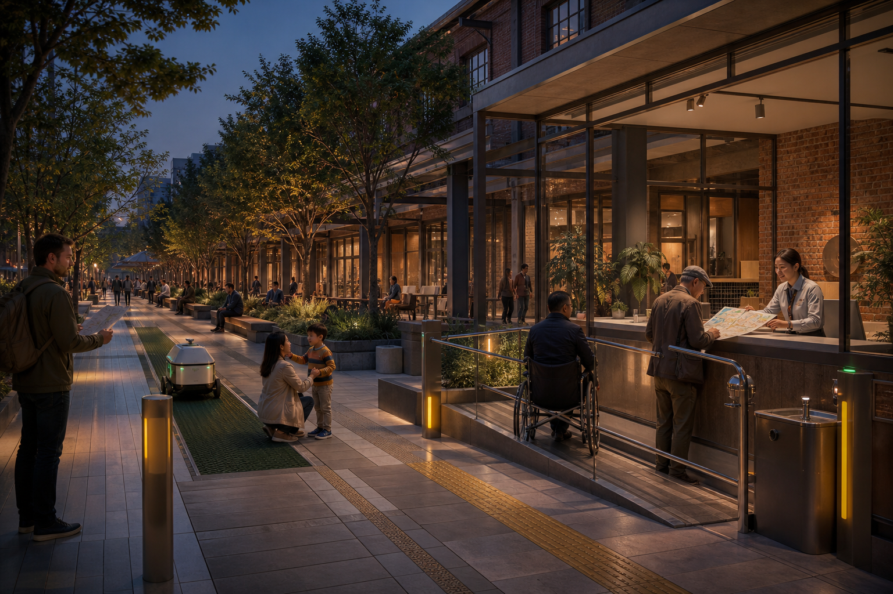
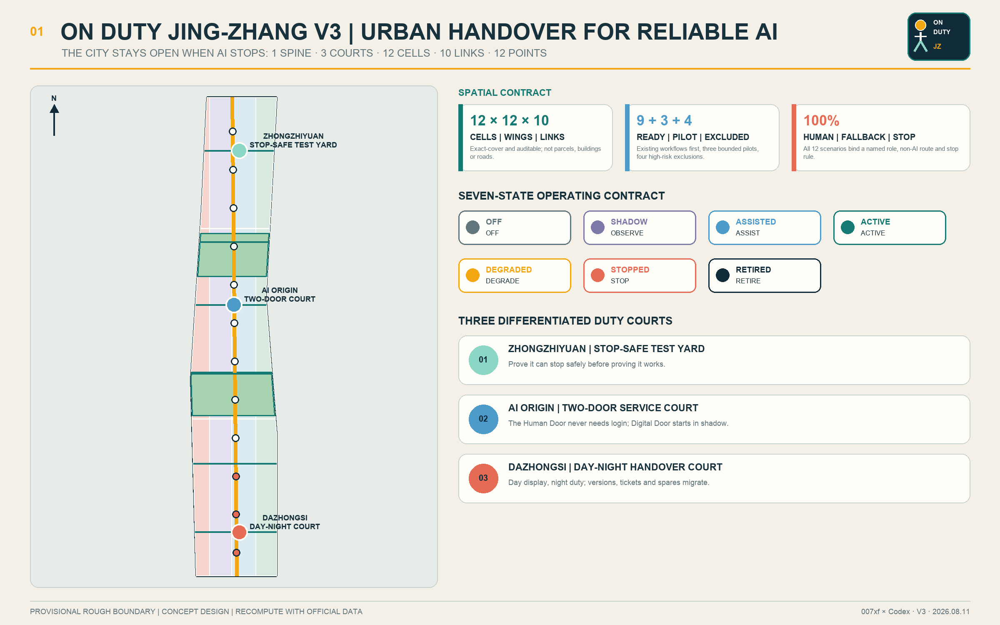
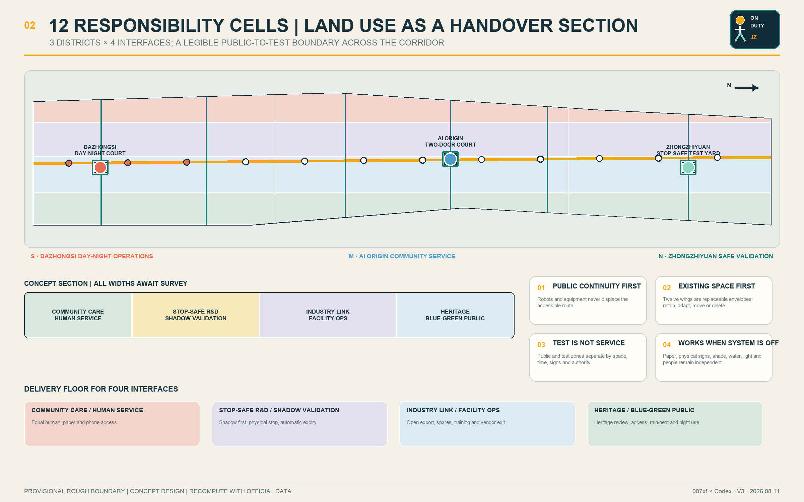
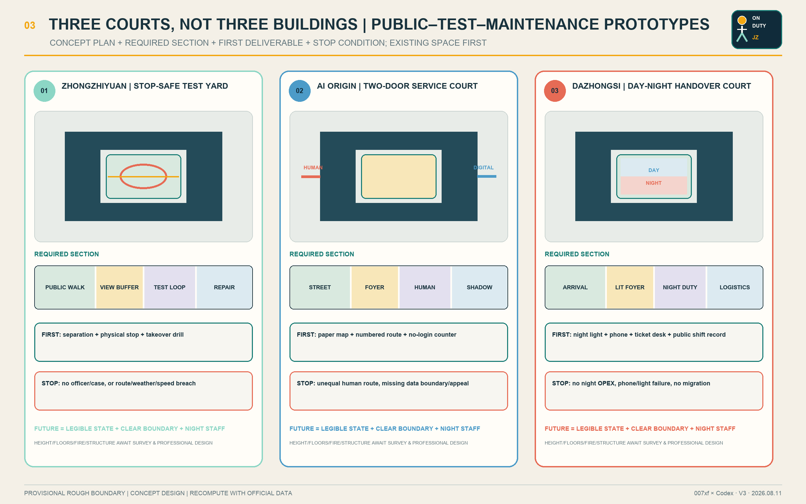
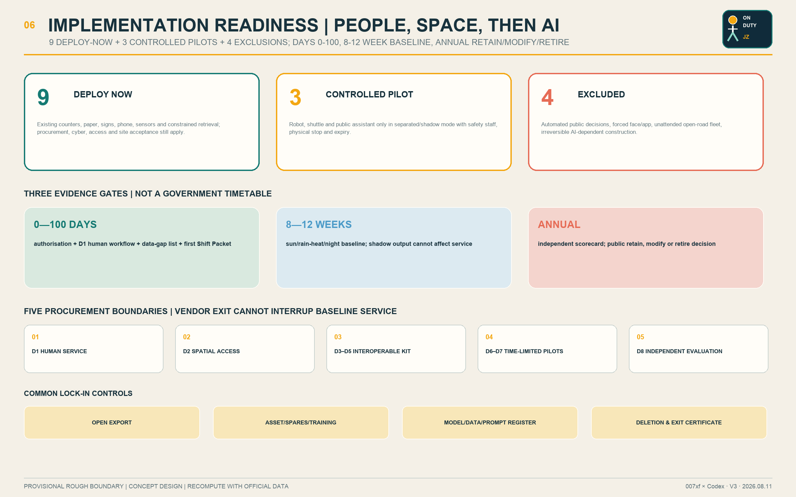
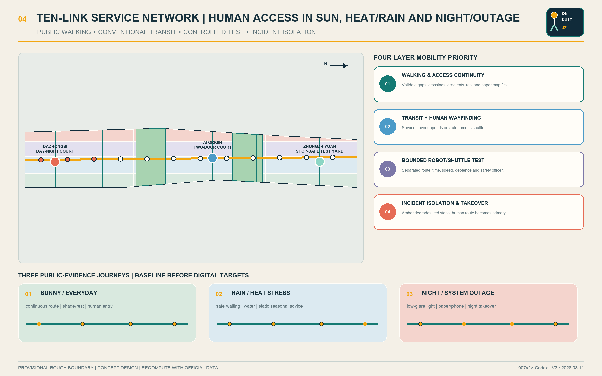
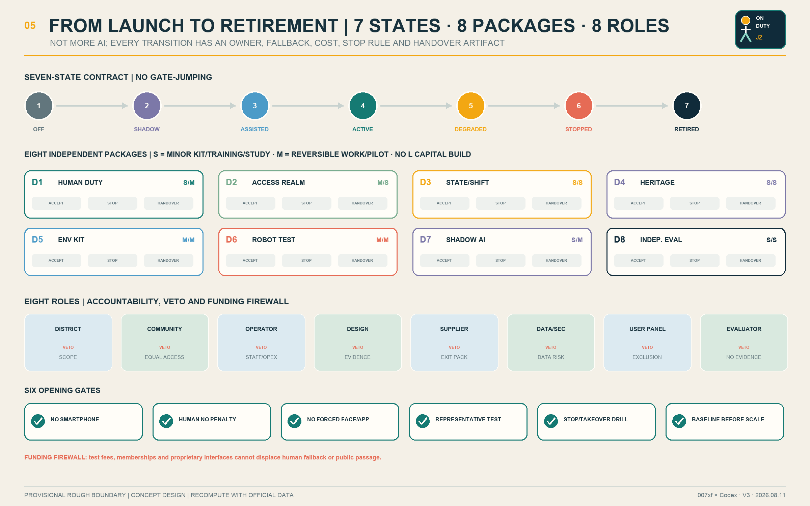

# ON DUTY JING-ZHANG V3

> The city stays open when AI stops. Reliable AI becomes visible, handover-ready and exit-ready urban space.

ON DUTY JING-ZHANG does not treat AI as a collection of novelty devices awaiting display. It treats AI as urban infrastructure that must have an accountable operator, allow every person to opt out, degrade safely, recover visibly and remain maintainable. V3 is organised as “one Duty Spine, three Duty Courts, two support wings and twelve Duty Points.” The heritage-park corridor and surrounding public realm form a continuous human-fallback and slow-mobility line. Zhongzhiyuan, Beijing AI Origin Community and Dazhongsi assume safe-validation, community-service and day-night-operations duties. University and community wings contribute talent, ethics, maintenance and everyday feedback. Twelve nodes test the proposition through specific user journeys.

Every scenario completes a six-part duty roster: service window, data boundary, human in charge, non-digital option, stop threshold, and restore-and-maintain record. The primary question is not “how much AI is deployed,” but “who takes over when it fails, whether a person without a smartphone can complete the same task, and when the system must stop.”

V3 adds no unsupported mega-concept to the repository-accepted previous version. It instead adds four reviewable evidence layers. **Spatial evidence** now comprises 12 exact-cover responsibility cells, 12 courtyard prototype wings and 10 service links. **Operating evidence** places every scenario inside an `OFF—SHADOW—ASSISTED—ACTIVE—DEGRADED—STOPPED—RETIRED` seven-state contract. **Delivery evidence** divides the proposal into eight packages with a lead role, cost band, acceptance rule, stop rule and handover artifact. **Public evidence** uses sunny, rain/heat and night/outage journeys during an 8-12 week human-service baseline window.[metric:land_use_responsibility_cell_count] [metric:duty_state_count] [metric:delivery_package_count]

| Design decision | Spatial answer | Operating answer | Response to failure |
| --- | --- | --- | --- |
| Name the people first | Human counter, paper map, telephone and continuous accessible route open first | Every shift has a named role and next owner | No named duty means no AI opening |
| Define the space second | Each court has public foyer, shadow validation, maintenance/logistics and public review wings | Public and test areas are separated by space, time and signs | Boundary breach triggers degradation or stop |
| Connect AI last | Devices enter a working service as replaceable components | Version, incident, open ticket and fallback status enter the shift packet | Vendor exit cannot interrupt baseline service |

The image communicates service priority and spatial experience only. The human counter is most visible; a paper map and continuous accessible route work without the system; and the low-speed robot remains inside a separated test lane. It is not a realistic reconstruction of a verified site and provides no boundary, building or engineering evidence.

## Design Basis and Source List

The proposal is based on the official prequalification announcement, the agent taskbook, the site package, the public source registry and the local snapshots of professional standards. Spatial generation uses only the registered provisional rough geometry in the repository. The announcement defines the three scopes and deliverable depth; the taskbook adds three positionings, five functions, three areas and two wings, and six agent tasks.[source:OFFICIAL-ANNOUNCEMENT] [source:AGENT-TASKBOOK] [standard:PROJECT-OFFICIAL-ANNOUNCEMENT]

Official `SITE_BOUNDARY` and three `KEY_AREA` polygons are not available. The locked overall and key-area geometries in this package are marked `official_boundary=false`, `geometry_role=provisional_constraint`, and `boundary_precision=provisional_rough`. They support concept generation, content review and later recomputation only; they cannot support redlines, ownership, regulatory controls or engineering decisions.[source:BOUNDARY-SOURCE] [data:geometry/site_boundary.geojson#SITE-001] [depth:existing_conditions_diagnosis]

Community issue #846 records a spatial conflict between the provisional overall polygon and an OSM-mapped Jing-Zhang railway heritage park. OSM is not a statutory boundary either, so neither source resolves the conflict. This proposal therefore makes no parcel-level or exact heritage-location claim. The Duty Spine is a replaceable service structure to be relocated when official data arrives.[source:ISSUE-BOUNDARY-846] [source:SOURCE-REGISTRY]

Review status is divided into three states: package completeness, content-review eligibility under provisional geometry, and professional-scoring eligibility after official data and surveys are available. The proposal targets the first two states. FAR, height, retain-renovate-demolish quantities and statutory conclusions remain pending.[source:ISSUE-STATUS-1368] [depth:risk_missing_data]

### Beijing-grounded evidence: four things it supports, four things it cannot prove

The Beijing Urban Renewal Regulation supports adapting existing space to improve public services, slow mobility and public realm [source:BEIJING-URBAN-RENEWAL]. The official Jing-Zhang Railway Heritage Park phase-I description establishes heritage protection, green public space and reconnection across the corridor as directions [source:JZ-PARK-PHASE1]. The Qinghuayuan Station heritage page provides textual protection/control context [source:QINGHUAYUAN-HERITAGE]. The Xueyuan Road public-space project supports an east-west public-realm connection as a method reference [source:XUEYUAN-PUBLIC-SPACE-2026].

These sources support four principles—existing space first, heritage first, public access first and east-west collaboration—but cannot establish the open call's official boundary, parcel ownership, digitised heritage controls, project overlap or construction conditions. V3 therefore implements them only as movable, replaceable interfaces. Any ground work affecting heritage fabric requires formal survey, heritage review and ownership verification first. [source:BEIJING-URBAN-RENEWAL] [source:JZ-PARK-PHASE1] [source:QINGHUAYUAN-HERITAGE]

## Three-Level Scope Framework

One accountability chain connects the three scopes instead of producing three unrelated drawing sets. The Coordinated Research Area asks how the innovation ecosystem remains on duty. The Overall Design Area asks how a public-service network takes spatial form. The three Key-Area Detailed Design Areas ask who is responsible for each scenario and how it stops and recovers.[source:PROCESSED-FACT-PACK] [depth:three_level_scope_framework]

| Scope | Core question | ON DUTY response | Reviewable output |
| --- | --- | --- | --- |
| Coordinated Research Area | How do industry, talent and public services become a long-term ecosystem? | A loop of public challenge, controlled test, duty audit, live service and maintenance ledger | Operating mechanism, six precedents and annual programme |
| Overall Design Area | How can renewal space support the loop? | A Duty Spine connects three halls, two wings and twelve points within a walkable human-backup network | Land use, roads, green space, public space and phasing GeoJSON |
| Key-Area Detailed Design Areas | How do the three areas divide responsibility? | Validation at Zhongzhiyuan, service at AI Origin, operations at Dazhongsi | Three conceptual duty halls and associated scenarios |

Four complete functional partitions demonstrate that the machine-recomputable layer and functional structure agree; they do not turn the provisional boundary into statutory parcels. The temporary overall polygon recalculates to approximately 11.413 million square metres. This is the geometry of the current substitute polygon, not an official design area.[data:geometry/land_use.geojson#LU-001] [metric:site_area_sqm]

## Coordinated Research Area: Industry and Future City Research

### Three positionings and five functions

The three positionings are “trusted public-service demonstration belt,” “open validation community,” and “Centennial Jing-Zhang urban-memory interface.” The five functions are continuous actions rather than five park labels: define a public challenge, organise an open test, complete a duty audit, provide an everyday service, and retain maintenance knowledge. The positionings support identity and global communication; the functions keep AI accountable as it moves from R&D into urban life.[source:AGENT-TASKBOOK] [standard:PROJECT-AGENT-OPEN-CALL-TASKBOOK]

“Three areas and two wings” is interpreted as three duty halls plus two support networks. The university R&D wing contributes model evaluation, ethics and training. The community-life wing contributes real needs, human counters, accessibility validation and continuous feedback. The wings are collaboration roles across all three scopes, not new redlines.

### Name, logo and identity

The Chinese name translates railway-duty discipline into AI public-service accountability. The English name `ON DUTY JING-ZHANG` states that someone is on shift. The original logo combines a signal lamp with the negative space of the Chinese character “值”: an amber status point above two railway traces. Deep navy represents auditable infrastructure, amber represents an active duty state, mint means safely available, and coral means take over or stop. A facility may carry the ON DUTY mark only when its status, accountable role and alternative route are visible.

### Originality boundary: the combination and its spatial translation are original, not the public principles

The original contribution is the translation of Jing-Zhang railway discipline—timetable, dispatch, repair and handover—into a seven-state public-AI contract; three differentiated courts and one human-fallback spine turn that contract into space that can be walked, read and stopped; every scenario is then bound to a Shift Packet, stop drill and vendor-exit artifact. The proposal does not claim to invent human oversight, algorithmic transparency, accessibility or railway culture, and it does not present uncollected local performance as innovation.[source:NIST-AI-RMF] [source:UK-ALGORITHMIC-TRANSPARENCY]

Precedents may influence how the problem is organised; they may not dictate what Jing-Zhang looks like. No external image, logo, branded building, scale, budget, institutional authority or performance result enters the design. Beijing-grounded evidence and the repository brief have higher decision priority.

### Six global precedents: mechanisms, not imported scale

| Precedent | Mechanism | Jing-Zhang translation | Not imported |
| --- | --- | --- | --- |
| Punggol Digital District, Singapore | Digital platform linked to real-world testing | Establish an auditable test ledger before public-realm trials | Centralised monitoring architecture or untested data scope |
| Smart Kalasatama, Helsinki | Small, time-limited agile pilots with real users | Give every pilot an expiry review and exit decision | Default or compulsory resident participation |
| Seoul AI Hub | Staged education, incubation, research and open innovation | Let the three halls provide validation, service and operating ladders | Funding scale or policy commitment |
| The Foundry, Cambridge | Community-facing space within an innovation district | Give every duty hall a public foyer without access control | A fixed area target |
| Quayside, Toronto | Discuss streets and public space before final technology | Design the public route and non-digital option before procurement | A disputed governance model or brand narrative |
| STATION F, Paris | Programme-led startup support with daily services | Use duty schedules rather than one-off exhibitions | Campus size, brand or operating model |

These sources are institutional or project pages used for mechanism comparison only. They support no local statutory space or performance commitment.[source:CASE-PUNGGOL] [source:CASE-KALASATAMA] [source:CASE-SEOUL-AI-HUB]

The remaining precedents add community interface, public engagement and everyday operations.[source:CASE-FOUNDRY] [source:CASE-QUAYSIDE] [source:CASE-STATION-F]

### Regional collaboration: exchange validated objects, not slogans

| Partner area | Two-way exchange object | Jing-Zhang landing space | Entry gate | Exit/return |
| --- | --- | --- | --- | --- |
| Beiwei Community | Resident questions and inclusive-service tests | AI Origin Two-Door Service Court | Consent, de-identification and aggregation | Plain-language accepted/rejected record |
| Future Science City | Research tools, talent modules and validation methods | Zhongzhiyuan Shadow-Validation Wing | Safety, data and IP review | Time-limited sandbox or explicit rejection |
| Huairou Science City | Scientific-facility/instrument service scenarios | Zhongzhiyuan Public-Review Wing | Professional and security review | Reproducible validation protocol |
| Beijing E-Town | Manufacturing, robotics and repair chain | Dazhongsi Maintenance/Logistics Wing | Product safety, procurement and vendor exit | Repairable component or no deployment |
| Beijing-Tianjin-Hebei | Portable public-service and interoperability protocol | Dazhongsi Regional/International Interface | Jurisdiction, data and service-owner check | Open protocol with local reauthorisation |

Collaboration must produce deliverable objects such as issue briefs, validation protocols, training modules, interoperability formats or retirement records. Agreement count, visitor count and cross-region data aggregation are not outcome evidence. Every regional landing rechecks applicable law, data boundary, operator and public access.[metric:regional_exchange_interface_count] [source:AGENT-TASKBOOK]

### Chinese city experience: transfer methods, not imagery

Shenzhen and Chongqing are domestic implementation references, not a catalogue of future-city forms. Shenzhen demonstrates how AI can be broken into responsibility-led scenario lists, linking innovation supply to actual public demand through clear, modular service interfaces.[source:CASE-SHENZHEN-AI-SCENARIOS] [source:CASE-SHENZHEN-URBAN-DESIGN]

Chongqing demonstrates small-entry governance loops and continuous journeys connecting walking, transit, services and cultural destinations. Jing-Zhang remains governed by the repository brief, Beijing service processes, railway heritage and Haidian communities. It does not copy Shenzhen's skyline or development intensity, and it does not invent Chongqing's mountain terrain, vertical layers or influencer-oriented scenes.[source:CASE-CHONGQING-SMALL-CUT] [source:CASE-CHONGQING-TRAILS]

| Domestic reference | Method transferred to Jing-Zhang | Explicitly not transferred |
| --- | --- | --- |
| Shenzhen | Scenario lists, named responsibility units, modular digital-service interfaces, innovation-demand matching, human and ecological public space | Skyline, density, citywide platform scope, branded form or unverified performance numbers |
| Chongqing | Small-entry pilots, verify-warn-classify-coordinate loop, station-city service, continuous routes and facilities | Mountain form, vertical-city imagery, local project scale or influencer-oriented landscape language |
| Original Jing-Zhang translation | Railway rosters and duty discipline, heritage-first renewal, community human service and stoppable AI | Major demolition or technology-led public space justified by “the future” |

Future character therefore means legible service states, precise night routes, low-disturbance equipment and continued usability during failure. It does not mean ubiquitous screens, automation theatre or megastructures beyond operating capacity. All domestic references remain subordinate to the repository site package, formal standards and later professional surveys.[source:SOURCE-REGISTRY] [source:AGENT-TASKBOOK]

## Overall Design Area: Urban Renewal and Regulatory-Plan-Level Urban Design

### Overall structure: one spine, three courts, twelve cells, ten links and twelve points

The Duty Spine is a public-service and slow-mobility structure, not a new road redline. It connects the twelve scenario nodes as one journey. Six east-west service seams respond to station-city, community, heritage-park and Xueyuan Road directions; three accessible court loops implement the key areas, making ten conceptual links in total. The provisional overall area is divided into south Dazhongsi, central AI Origin and north Zhongzhiyuan responsibility districts, crossed with four section interfaces—human service, shadow validation, industry/operations and blue-green heritage—to form 12 exact-cover responsibility cells.[data:geometry/roads.geojson#ROAD-001] [data:geometry/land_use.geojson#LU-N01] [metric:mobility_service_link_count]

The three Duty Courts are not three confirmed new buildings. Each is a prototype comprising a central public court plus human-service, maintenance/logistics, public-review and shadow-validation wings. GeoJSON records only twelve replaceable programme envelopes with an existing-building-first preference. Official polygons, building condition, ownership, heritage and structural surveys must decide whether each envelope is retained, adapted, moved or deleted.[data:geometry/buildings.geojson#BLDG-ZW] [metric:building_prototype_part_count] [depth:overall_spatial_structure]

### Six-part duty roster

1. **Service window:** publish when the service operates and who can use it; test and public-service periods remain separate.
2. **Data boundary:** declare minimum data, retention period, access roles and deletion route; facial recognition is not a default condition for public service.
3. **Human in charge:** name the duty role, takeover entry, escalation contact and response time.
4. **Non-digital option:** preserve a paper, counter, telephone, physical-signage or no-login route to the same service.
5. **Stop threshold:** when accuracy drops, context exceeds the operating envelope, complaints signal harm, equipment fails or a privacy incident occurs, degrade, isolate or shut down.
6. **Restore and maintain:** record the ticket, version, cause, human review and notification before recovery; every expiring pilot receives a keep, modify or exit decision.

### Seven-state Duty Contract and seven-field Shift Packet

The six-part roster states what every scenario must contain; the seven-state contract states what it may do now. Every transition must appear in both the public status board and the operator log. A `SHADOW` or `STOPPED` service may never jump directly to `ACTIVE` without passing the gates again.[metric:duty_state_count] [source:NIST-AI-RMF]

| State | Public meaning | Permitted spatial behaviour | Transition authority |
| --- | --- | --- | --- |
| `OFF` | Service is unavailable; human/paper access opens first | Displays off and test area closed | Named operator |
| `SHADOW` | Observes but does not affect service | AI output compared only in the back-of-house area | Operator + data/security owner |
| `ASSISTED` | AI advises and a worker decides | Counter staff see advice and source | Trained duty role |
| `ACTIVE` | Works only inside the published operating envelope | Board shows version, responsibility and fallback | Operator after all six gates pass |
| `DEGRADED` | Capability is limited; human access becomes primary | Amber state, reduced functions, no new request | Automatic threshold or duty role |
| `STOPPED` | Isolated after an incident or boundary breach | Red state, physical stop and visible takeover entry | Any authorised duty role |
| `RETIRED` | Service, device and data have exited | Remove equipment and publish the retain/retire reason | Accountable owner after public review |

Every handover delivers a seven-field Shift Packet: current state, named duty role, last incident, data/model version, unresolved ticket, fallback/accessibility status, and next-shift owner. The public sees only the necessary subset; the full record remains under operator-controlled role access and retention. Transparency therefore does not mean exposing source code. It means a person can tell whether the service works, who owns it, how to avoid AI and when the record changed.[metric:shift_packet_field_count] [source:UK-ALGORITHMIC-TRANSPARENCY]

At this stage, regulatory-plan-level depth means a complete chain from issue to spatial object, metric and gap, not fabricated precise controls. Twelve responsibility cells cover the provisional polygon. Twelve courtyard prototype wings, ten concept links, two green bands, three public Duty Courts and three phasing areas are reviewable in GeoJSON. FAR, height, parking, road class, municipal capacity and demolition quantity remain pending official evidence.[standard:MOHURD-CONTROL-DETAILED-PLANNING] [depth:development_intensity_controls]

## Detailed Design of Key Areas: Three Deliverable Duty-Court Prototypes

### 1. Zhongzhiyuan: Stop-Safe Test Yard

This is a controlled validation setting governed by “prove it can stop safely before proving it works.” The public foyer shows test rules and current state. A risk-review room keeps the safety case, operating envelope, version and stop records. A small outdoor test loop supports low-speed delivery robots and mixed-traffic autonomous-shuttle trials. The public may observe results but is not enrolled by default. A test pauses whenever time, speed, weather, route or human-supervision conditions are exceeded.[data:geometry/key_areas.geojson#PROV-KEY-001] [depth:three_key_area_detailed_design]

### 2. Beijing AI Origin Community: Two-Door Service Court

This is a community interface where services remain possible without an app. A no-login human counter, paper route map, multilingual and accessible concierge, and resident feedback studio occupy the entry zone. It prioritises service navigation, elder access, child-safe walking prompts and accessibility assistance. It does not automate medical, legal or administrative decisions; it only provides information navigation, document prompts and human transfer.[data:geometry/key_areas.geojson#PROV-KEY-002]

### 3. Dazhongsi: Day-Night Handover Court

This is the station-city interface and long-term maintenance hub. It includes an urban-service duty room, facility ticket desk, vendor and version ledger, international visitor interface and night-time takeover point. The design does not pursue the largest display. It makes status, responsibility, last maintenance and the non-digital route immediately visible.[data:geometry/key_areas.geojson#PROV-KEY-003]

| Prototype | Concept plan | Required section relationship | First deliverable | Stop if |
| --- | --- | --- | --- | --- |
| Zhongzhiyuan Stop-Safe Test Yard | Public observation walk surrounds the court; the test loop avoids the continuous walking line; the safety officer sees their crossing | `public walk—view buffer—separated test loop—repair wing`, with no band displaced | Temporary separation, physical stop, operating-envelope board and one takeover drill | No safety officer/case, or route/weather/speed boundary breached |
| AI Origin Two-Door Service Court | A no-login Human Door faces the street; a Digital Door leads only to shadow mode and co-design; both meet at one counter | `street—accessible foyer—human counter—shadow back-of-house`; the public never crosses testing | Paper map, numbered route, no-login counter and representative-user test | Equal human completion fails, data boundary is unset, or appeal entry missing |
| Dazhongsi Day-Night Handover Court | Day market/display and night service share a forecourt; ticket, spare, version and incident review occupy the logistics edge | `station-city arrival—lit foyer—night duty—maintenance/logistics`; routes work after displays switch off | Night lighting, phone, paper map, ticket desk and first public shift record | Night OPEX missing, lighting/phone fails, or version/tickets cannot migrate |

All three prototypes use durable, repairable, low-glare and replaceable components. Curved megastructures, holographic screens and staffless operation are not the source of future character. Future character comes from instantly legible state, continuous walking and accessibility, clear public-test boundaries and staffed night takeover. Height, floors, façade material, fire and structure remain principles without unsupported numbers.[depth:three_key_area_detailed_design] [depth:height_massing_character]

The courts share one duty log and incident-review format while distributing human service points. No single platform or vendor becomes the only route to essential public service. All three provisional rectangles await official replacement and support no parcel, setback or displacement decision.

## AI Innovation Ecosystem, Personas, and AI+ Scenarios

### Six primary personas

| Persona | Main barrier | Required service condition |
| --- | --- | --- |
| Elder or non-digital resident | No smartphone, difficult verification, distrust of automated judgement | No login, human counter, paper receipt |
| Child and caregiver | Route safety and different information literacy | No facial-recognition prerequisite, plain language, caregiver confirmation |
| Person with visual, hearing or mobility disability | Visual-only interface, steps and route discontinuity | Tactile, audible and large-text guidance; multimodal human help; continuous accessible route |
| Frontline public-service worker | Opaque automated advice and unclear takeover responsibility | Explicit human authority, training, incident ticket and appeal route |
| Developer or innovation company | Lack of real test environment and compliance path | Controlled sandbox, version record, stop condition and expiry review |
| Commuter or international visitor | Time pressure, language difference and night uncertainty | Multilingual no-registration directions and night human takeover |

These are the minimum differences required for service design, not inferred demographic statistics.[metric:persona_count] [source:AGENT-TASKBOOK]

### Twelve scenario cards

| ID | Scenario and primary place | Duty arrangement | Data boundary and non-digital option | Stop threshold |
| --- | --- | --- | --- | --- |
| S01 TEST | Low-speed delivery robot validation at Zhongzhiyuan | On-site safety officer + remote operator | Device and route events only; human delivery remains available | Stop on speeding, disconnect or pedestrian conflict |
| S02 TEST | Autonomous shuttle mixed-traffic validation at Zhongzhiyuan | On-board safety officer + intersection duty | No passenger facial recognition; walking and conventional connection remain | Stop outside route, visibility or braking envelope |
| S03 TEST | AI public-service assistant validation at AI Origin | Counter officer can take over immediately | Minimum document prompts, no administrative decision; paper list available | Shut down on wrong advice, privacy event or repeated complaints |
| S04 | Multilingual accessible navigation | Roving concierge | Temporary session and no identity retention by default; paper map and route number | Degrade on localisation drift or broken accessible route |
| S05 | No-login elder service | Fixed human counter | Equal consultation without account; paper receipt | Transfer to human on uncertainty or request |
| S06 | Child-safe walking prompts | School/community time duty | No facial data; ground marking and crossing guard remain | Use static route only when model and street disagree |
| S07 | On-site accessibility concierge | Trained service staff | User volunteers only needed information; tactile and audible guidance | Human accompaniment when lift, ramp or navigation data fails |
| S08 | Enterprise compliance duty desk | Legal/data-governance rotation | Process navigation only, not legal advice; human appointment available | Stop answering when source is stale or question exceeds scope |
| S09 | Centennial Jing-Zhang cultural guide | Cultural volunteer/curator | No visitor profiling; paper leaflet and physical sign | Mark unknown where facts or heritage boundaries are uncertain |
| S10 | Facility-maintenance ticket triage | Maintenance shift | Minimum device state; telephone reporting remains | Bypass AI triage for major safety event |
| S11 | Thermal comfort and shade advice | Public-space duty staff | Environmental sensing only; fixed shade and water remain open | Revert to seasonal static guidance when sensors fail |
| S12 | Night-return human takeover | Dazhongsi night shift | No compulsory registration; lighting, paper map and phone remain | Transfer to human/emergency process on outage or escalating risk |

All twelve scenario nodes are stored in the public-space GeoJSON and declare human duty, a non-AI alternative and a stop threshold. The first three are explicit industry test/validation scenarios.[data:geometry/public_space.geojson#S01] [metric:scenario_node_count] [metric:industry_test_scenario_count]

The ecosystem uses the gate sequence “challenge list - sandbox - duty audit - public service - maintenance ledger.” A system without impact review and takeover rehearsal remains in validation. A successful demonstration does not grant permanent operating status. The six repository scenario registry items align public service, robotics, enterprise service, public safety, culture and walkability; the twelve nodes give them a more detailed spatial and operating form.[standard:MOHURD-URBAN-DESIGN-MEASURES]

### Eight-factor ecosystem handover: resources advance only as deliverables

| Ecosystem factor | Entry gate | Jing-Zhang spatial interface | Required handover / exit |
| --- | --- | --- | --- |
| Land | Official boundary, ownership and permitted-use verification | Twelve cells are task indexes only | Verified conditions; relocate on conflict, with no land-allocation promise |
| Space | Existing-condition, heritage, structure, fire and accessibility survey | Twelve wings across three courts prioritise retained space | Adaptation and asset record; delete a wing if safety fails |
| Industry | Start from a real issue, never substitute a company list for demand | Zhongzhiyuan validation + Dazhongsi repair/supply interface | Safety case, repairable component or explicit no-deploy decision |
| Funding | Secure D1 human baseline, D8 independence and OPEX first | Financial separation of public access and testing | Lifecycle cost and funding owner; no OPEX means no launch |
| Talent | Competency, ethics, safety and takeover training | Research wing + Open Maintenance School + court rotations | Competency record and shift handover; no fabricated talent target |
| Compute | Review workload, cybersecurity, energy and offline plan | Shadow back-of-house; prefer compliant shared services | Workload/version/stop record; no data-centre construction claim |
| Data | Lawful source, minimisation, retention, access and deletion | Data/security owner + seven-field Shift Packet | Source/version/access/deletion proof; boundary breach means `STOPPED` |
| Scenarios | Pass persona, fallback, stop and public-evidence gates first | Twelve nodes follow the `9 + 3 + 4` lanes | Retain, modify or retire record; a demo never grants scale-up |

The eight factors form an accountable chain—issue brief, validation protocol, duty record, public service, maintenance or retirement—not an investment-promotion inventory. No factor transfers value to the next without a named owner, verifiable evidence and exit material. Land, space, industry, funding, talent, compute, data and scenarios therefore become auditable interfaces rather than slogans. [metric:ecosystem_factor_count] [metric:innovation_conversion_gate_count]

### How AI assists planning: seven supporting tasks, never seven delegated decisions

| AI-assisted task | Permitted output only | Required human decision |
| --- | --- | --- |
| Authorised base-map gap detection | Suspected discontinuity list | Planner verifies survey and right-of-way |
| Aggregated issue clustering | Candidate public questions | Community representatives accept, modify or reject |
| Shade and heat scenario comparison | Relative differences between options | Landscape/municipal professionals select with field data |
| Accessible-route QA | Suspected barrier points | Representative users and accessibility professional test on site |
| Pilot incident pattern review | Anomaly candidates | Operator investigates, classifies and closes |
| Bilingual evidence consistency | Missing/conflicting anchors | Author and professional reviewer correct |
| Procurement interoperability review | Lock-in and exit-risk flags | Owner and procurement/legal staff write contract clauses |

AI does not automatically generate statutory redlines, planning permissions, heritage opinions, displacement decisions, investment decisions, safety certification or consequential public decisions about individuals. Every input must be public/cleared or authorised; every output records source, version, confidence and human disposition.[metric:planning_ai_workbench_task_count] [source:NIST-AI-RMF]

### Public evidence: run a human baseline before setting digital targets

After the site, operator and participation process are authorised, an 8-12 week concept evidence window runs first; this is not a government timetable. Sunny everyday, rain/heat-stress, and night/system-outage journeys involve six groups: older/non-digital users, wheelchair or mobility users, sensory-disabled users, caregivers and children, night workers, and visitors without a local app. The test is whether the same task can be completed on equal terms.[metric:public_evidence_journey_count] [source:STANDARD-BARRIER-FREE]

The baseline records completion, time to human takeover, wrong/unusable guidance, complaint/appeal, service parity without a smartphone, staff minutes and maintenance cost. Every finding receives `issue—accept/modify/reject—reason—owner—due date—closure evidence`. Where policy permits, participants are compensated for time; using a public service never enrols a person into a trial by default. Only after the baseline exists may the operator pre-publish scale-up thresholds.[source:STANDARD-ELDERLY-TECH] [metric:stakeholder_role_count]

### Technology readiness and public acceptance: `9 + 3 + 4`

The proposal does not equate “technically demonstrable” with “urban-operational.” The twelve scenarios enter two deployment lanes, while four high-risk capabilities are excluded from the base scheme. The classification is machine-readable through `technology_readiness`, `deployment_mode`, `entry_phase` and `scale_gate` in `geometry/public_space.geojson`, with a separate `implementation_readiness` audit inside `risk.json`.[metric:deploy_now_scenario_count] [metric:controlled_pilot_scenario_count]

| Technology lane | Quantity and content | Why it can start now | Operating boundary |
| --- | --- | --- | --- |
| Deploy now | Nine: multilingual/accessibility navigation, no-login service, child-safe walking prompts, on-site concierge, enterprise process navigation, cultural guide, ticket triage, environmental advice and night human takeover | Uses available categories of signs, counters, telephone, environmental sensing, ticketing and constrained retrieval integrated into existing roles | Still requires procurement acceptance, cybersecurity, accessibility and site testing; AI assists information and triage only |
| Controlled pilot | Three: low-speed delivery robot, autonomous shuttle and public-service assistant | Current technology can operate inside a limited domain | Requires geofence or separated route, named safety staff, shadow mode, physical stop and automatic expiry; no open-road deployment or automated administrative decision |
| Excluded from base scheme | Four: fully automated administrative/legal decisions, mandatory face/app access, unattended open-road fleets, and irreversible construction dependent on AI | None is necessary for basic site operation | None may drive spatial investment; reconsideration requires new legal, technical, safety and public-authorisation evidence |

Public acceptance is defined by six opening gates rather than promotional satisfaction: the same task can be completed without a smartphone; choosing a person brings no penalty; the base scheme has zero mandatory biometrics or compulsory app access; elders, disabled users, caregivers and frontline workers test usability before opening; every scenario passes stop-and-takeover drills; and operators publish baseline-based completion, error, takeover and complaint thresholds before scaling. Failure at any gate keeps the human service, triggers modification or retires the scenario; sunk investment is not a reason to force adoption.[source:STANDARD-GENERATIVE-AI] [source:STANDARD-BARRIER-FREE] [source:STANDARD-ELDERLY-TECH]

The machine-readable risk and implementation matrix lists all six gates individually.[metric:acceptance_gate_count]

## Land Use, Building Scale, and Retain-Renovate-Demolish Strategy

The twelve responsibility cells comprise three north-south responsibility districts crossed by four section interfaces. From west to east, the interfaces express community care and human service, stop-safe R&D/shadow validation, industry collaboration and facility operations, and heritage narrative with blue-green public realm; each differs across south, central and north districts. The twelve polygons share boundaries and cover the provisional overall polygon without gaps, so they can be recomputed after replacement. National land-use codes provide machine compatibility only and do not assign regulatory land use.[data:geometry/land_use.geojson#LU-M02] [metric:land_use_responsibility_cell_count] [standard:MNR-LAND-USE-CLASSIFICATION-GUIDE]

The twelve building geometries are the four-wing conceptual programme envelopes of three Duty Courts. They recalculate to about 30,958 square metres in total and compare compact courtyard capacity only; they are not confirmed footprints or new-build quantities. Every geometry carries `reuse_preference=existing_retained_or_reversible_fitout_first` plus a survey-dependent retain/adapt/move/delete rule.[data:geometry/buildings.geojson#BLDG-ON] [metric:building_footprint_area_sqm]

Retain-renovate-demolish follows “survey first, classify second.” Buildings with cultural value or reusable structure are retained first. Safe, adaptable buildings receive light renovation first. Demolition or new construction can only be discussed after official ownership, structural safety, heritage, embodied-carbon and public-interest assessment. Building age, structure, ownership, occupancy, heritage and carbon data are unavailable; therefore FAR, height and demolition area remain pending instead of being inferred from the envelopes.[depth:retain_renovate_demolish] [standard:MOHURD-ARCH-DESIGN-DEPTH-2016]

## Transport, Rail, Municipal Infrastructure, and Public Services

The Duty Spine, six service seams and three accessible court loops are slow-mobility/public-service intent lines, not road centrelines or a rail proposal. The ten links recalculate to approximately 18.84 kilometres inside the provisional boundary. They test whether one continuous service route can link twelve points and form an inspectable accessible loop at each court; they define no road class, redline or engineering quantity.[data:geometry/roads.geojson#ROAD-005] [metric:road_network_length_m] [depth:traffic_rail_slow_parking]

The transport strategy has four layers. Walking and universal access come first. Conventional transit, rail-station interface and human wayfinding come second. Controlled low-speed robot and autonomous-shuttle validation comes third. Safe stopping, human takeover and route isolation during abnormal conditions come fourth. Robots may not occupy the continuous accessible path in the name of efficiency. Every test publishes time, speed, geofence and on-site duty conditions.

Municipal and public-service components remain small and replaceable: a named human counter, paper map and route number, tactile/audible/large-text signage, seating-water-charging, visible status light, emergency stop and safe waiting area. Data rooms, energy, communications, fire, drainage and maintenance capacity require professional development using official utility and load data.[depth:municipal_new_infrastructure]

## Blue-Green Network, Public Space, and Urban Character

Two Climate-Responsive Duty Greenways treat shade, rainwater, rest, drinking water and night visibility as public services. Their temporary area ratio is about 17.99%. The three central public Duty Courts total about 0.22%, prioritising access to human help, visible testing boundaries and actual handover rather than a large plaza. Both are ratios of conceptual layers to the provisional overall polygon and are not existing or statutory indicators.[data:geometry/green_space.geojson#GREEN-001] [metric:green_ratio] [metric:public_space_ratio]

Urban character draws from the restraint and legibility of railway infrastructure: fine traces, status lamps, timetables, riveted metal and durable materials. Giant screens do not turn heritage or communities into a technology backdrop. Night lighting prioritises entries, route numbers, human duty and stop states. When displays are off, paper maps, tactile paving and physical signs continue to work.[depth:blue_green_public_space]

Three conceptual AI pilgrimage landmarks are the Duty Lantern at Zhongzhiyuan, which displays running, paused and review states; Duty Hall Zero at AI Origin, which makes the human and non-digital entry visible; and the Bell Maintenance Deck at Dazhongsi, which displays versions, incidents and maintenance timelines. These landmarks do not celebrate technology heroes; they make responsibility and maintenance public culture.[metric:ai_landmark_count]

The cultural narrative is “from railway timetable to AI duty roster.” The Centennial Jing-Zhang legacy shows that public technology depends on long-term operations rather than a one-time build. The AI Innovation Belt likewise includes dispatchers, maintainers, service workers and users in its story. Any display about heritage fabric, protection boundary or historical detail requires official evidence and professional curatorial review.

### Perceptible toolkit: eight offline components, five story stops and accountability honours

| Code | Public-realm component | What remains during outage/stop | Maintenance and placement rule |
| --- | --- | --- | --- |
| C01 | Named human-duty counter | Equal human completion and takeover | Always before the digital entry; operator staffs each shift |
| C02 | Paper-map and route-number cabinet | Wayfinding without a phone or network | Community checks content; version date stays visible |
| C03 | Tactile, audible and large-text signs | Multimodal direction without colour or screen dependence | Accessibility professional and representative users review |
| C04 | State lamp plus text/symbol board | Clear `OFF/STOPPED` state and human entry | Never encode state in colour alone; D3 reconciles daily |
| C05 | Physical stop and safe waiting bay | Stop equipment locally and separate people | Authorised role only; publish a summary of drills |
| C06 | Movable shade, seat, water/charging kit | Thermal comfort and rest when AI is off | D5 names asset, spare and inspection owners |
| C07 | Shift wall and public issue desk | View state, open issues and response deadline | Show the necessary public subset only; protect personal data |
| C08 | Removable test edge and ground marking | Physically separate robot/shuttle from the accessible line | Remove at pilot expiry; never harden into a road redline |

The cultural route has five stops—Start Shift, Dispatch, Maintain, Handover and Review. Verified curatorial evidence governs railway facts, while today’s staff, users and retired systems also enter public memory. [metric:public_component_count] [metric:culture_story_stop_count]

Honour display avoids a corporate advertising wall. It recognises three forms of accountable work: a **Gap-Closed Record** for an accessibility repair, a **Good Stop Record** for stopping before harm, and a **Closed-Loop Record** for publicly resolving a user finding. Every entry carries evidence, shared contributors, date and maintenance follow-up; failure is not hidden. The fixed international proposition is **The city stays open when AI stops**, supported by **Reliable AI is visible, handover-ready and exit-ready**. Chinese, English, graphic, tactile and audible expressions work together without an unauthorised city or corporate brand. [source:AGENT-TASKBOOK]

## Renewal Projects, Implementation Policy, and Phasing

### Eight conceptual project packages

1. **D1 Human Duty Service:** roster, paper map, phone, route numbers and issue log open first.
2. **D2 Continuous Accessible Public Realm:** close gaps and add rest, crossing, shade and physical guidance.
3. **D3 Visible State and Shift Register:** status board, seven-field packet, public subset and open export.
4. **D4 Heritage-First Interpretation:** curator-checked physical/paper route without unverified controls.
5. **D5 Reversible Environmental Components:** light, water, shade, low-voltage sensing and repairable asset log.
6. **D6 Stop-Safe Robot Test Yard:** separated loop, physical stop, safety case and on-site safety officer.
7. **D7 Shadow-Mode Public-Service Assistant:** staff-only retrieval comparison with no direct decision.
8. **D8 Independent Evidence and Annual Review:** public scorecard, conflict disclosure and retain/modify/retire hearing.

| Package | Lead role | Relative CAPEX / OPEX | First product | Acceptance | Stop/do not start | Handover artifact |
| --- | --- | --- | --- | --- | --- | --- |
| D1 | Site operator | S / M | Human counter + roster | Same task without smartphone | No named shift or unfunded OPEX | Human baseline register |
| D2 | Professional design team | M / S | Numbered accessible route | Representative users complete route | Survey/right-of-way conflict unresolved | As-built accessibility asset register |
| D3 | Site operator | S / S | Status board + Shift Packet | Public state matches log | State cannot be verified | Open machine export |
| D4 | Design/curatorial team | S / S | Checked physical route | Zero unverified heritage claim | Heritage review incomplete | Source/content register |
| D5 | Site operator | M / M | Reversible environment kit | Works with network/AI off | No maintenance owner or safe power | Asset, spare and training register |
| D6 | Site operator | M / M | Separated test loop | Stop/takeover drill passes | Operating or supervision boundary breached | Incident/retirement record |
| D7 | Data/security owner | S / M | Staff shadow assistant | No automated public decision and error baseline complete | Privacy, source freshness or accuracy breached | Model/data/prompt and exit package |
| D8 | Independent evaluator | S / S | Public scorecard | Findings have response, owner and closure evidence | Conflict of interest or baseline missing | Annual public decision record |

`S` means minor equipment, furniture, training or study; `M` means reversible site works or a controlled pilot. No `L` capital construction enters this stage because official controls, quantities and a business case are absent. Relative bands are not an investment estimate. Procurement requires local quantities, market testing, lifecycle cost and funded OPEX. [metric:delivery_package_count]

Procurement separates D1 human service, D2 spatial accessibility, D3-D5 interoperable components, D6-D7 time-limited pilots and D8 independent evaluation. All contracts require open export, asset/spare/training records, model/data/prompt registers, deletion evidence and an exit certificate. No proprietary interface may capture the human service or public realm.[source:BEIJING-URBAN-RENEWAL] [depth:renewal_project_list]

Implementation follows “existing space first, reversible component first, human workflow first, new building last.” Before official boundaries, ownership and building surveys exist, the twelve prototype wings totalling about 30,958 square metres are not read as required construction. The first choice is fit-out of retainable buildings; the second is a movable/temporary component; only failure of existing space to meet safety, accessibility and operating needs opens a new-build study.[depth:retain_renovate_demolish]

Phasing is an evidence gate rather than a government timetable. After site/operator authorisation, `days 0-100` deliver D1 human workflow, the base-map/ownership verification list, a first Shift Packet and three public-journey scripts; an 8-12 week human/shadow evidence window follows. Only after baseline, representative-user testing, funded OPEX and pre-agreed thresholds may stage two adapt the three courts and start controlled tests. Stage three follows a complete operating cycle and independent review to retain, modify or retire; AI performance alone never justifies irreversible construction.[data:geometry/phasing.geojson#PHASE-001] [depth:phasing_implementation]

Policy recommendations require exit and data-migration clauses in public AI procurement; small, time-limited and reversible testing before high-risk service; accessibility, privacy, safety and human-takeover drills before launch; parallel disclosure of maintenance and capital budgets; and continuity of essential service during vendor replacement.

### Eight roles, four vetoes and a funding firewall

| Role | Core accountability | Veto |
| --- | --- | --- |
| District coordinator | Cross-department scope and public-interest floor | Scope drift |
| Street/community | Daily needs and no-login route | Removal of equal human access |
| Site operator | Roster, SLO, incidents, maintenance and handover | Launch without staff or OPEX |
| Professional design team | Survey, heritage, access, fire, traffic and utilities | Unverified engineering conclusion |
| System supplier | System boundary, version, cybersecurity and exit package | None over the public owner |
| Data/security owner | Lawful data, retention, access and incident response | Unacceptable data/security risk |
| Representative-user panel | Compensated usability evidence and exclusion findings | Unresolved exclusion before opening |
| Independent evaluator | Baseline, gate audit and retain/modify/retire advice | Unsupported scale-up |

Baseline public access, human fallback and continuous passage are public-interest obligations. Test fees, events or enterprise services may support maintenance where lawful, but cannot buy public-service priority, additional personal data or displacement of public realm. The D8 evaluator is contracted separately from D6/D7 suppliers and discloses conflicts.[metric:stakeholder_role_count] [source:STANDARD-GENERATIVE-AI]

Long-term operations follow eight annual rhythms: quarterly Duty Open Days, semiannual night-takeover drills, annual three-journey accessibility retest, International Civic AI Duty Week, Beijing-Tianjin-Hebei interoperability tabletop, Open Maintenance School, heritage-and-technology fact-check workshop, and annual maintenance/retirement report. Every programme produces an issue brief, drill record, revised asset register or public decision. These are concept recommendations for organisers, professional teams and future operators to develop, not confirmed events.[metric:annual_program_count] [source:AGENT-TASKBOOK]

### Four event brands and a five-gate developer conversion pathway

| Gate | Event / mechanism | Developer or team submits | Human decision and exit |
| --- | --- | --- | --- |
| G1 `ASK` | **ON DUTY OPEN DAY** | Public issue brief, beneficiaries and non-AI baseline | Community and frontline staff accept, merge or reject the issue |
| G2 `SHADOW` | **OPEN MAINTENANCE SCHOOL** | Data/model card, shadow result, maintenance and exit draft | Professional, data/security and operating roles decide on field entry |
| G3 `PROVE` | **NIGHT HANDOVER DRILL** | Separated test, safety case, takeover and accessibility evidence | Representative users and operator may pause; failed gate retires the test |
| G4 `HANDOVER` | **CIVIC AI DUTY WEEK** | Seven-field packet, open export, training and OPEX | D8 review precedes any time-limited procurement or further trial advice |
| G5 `RETAIN / MODIFY / RETIRE` | Annual public review | Incidents, complaints, cost, parity and deletion proof | Publish reason and next owner for retain, modify or retire |

“Conversion” here is not the number of investment deals. It turns a reproducible issue into a sourced validation protocol and then a maintainable, exit-ready public service. Developers receive a clear problem, test boundary and feedback; the public retains veto, human access and appeal; operators receive assets, training, versions and exit material. Procurement, funding and event delivery remain contingent on future authorisation and budget. [metric:event_brand_count] [metric:innovation_conversion_gate_count]

## Metrics, Area Recalculation, and Compliance Matrix

Metrics have three layers. Geometry recomputation covers the provisional overall area, conceptual envelopes, green/public-space ratios and intent-line length. Content completeness covers key areas, personas, scenarios, industry validations and landmarks. Accountability coverage audits human duty, non-AI alternatives and stop thresholds. The first layer is constrained by provisional geometry; the second and third are directly auditable from the package.[depth:metrics_recalculation]

| Metric | Current value | Meaning and limitation |
| --- | ---: | --- |
| Provisional overall area | 11,412,825.386 sqm | EPSG:4548 calculation of the provisional rough polygon only [metric:site_area_sqm] |
| Conceptual programme-envelope area | 30,957.656 sqm | Twelve wings across three courts, not confirmed footprints [metric:building_footprint_area_sqm] |
| Conceptual green-band ratio | 17.9931% | Not an existing or statutory green ratio [metric:green_ratio] |
| Conceptual public-Duty-Court ratio | 0.2178% | Not a statutory public-space ratio [metric:public_space_ratio] |
| Conceptual service-alignment length | 18,836.033 m | Not a road redline or engineering centreline [metric:road_network_length_m] |
| Responsibility cells / prototype wings / service links | 12 / 12 / 10 | Auditable spatial structure inside the provisional boundary [metric:land_use_responsibility_cell_count] [metric:building_prototype_part_count] [metric:mobility_service_link_count] |
| Provisional key areas | 3 | All three polygons await official replacement [metric:key_area_count] |
| Scenario nodes | 12 | Every node completes the six-part roster [metric:scenario_node_count] |
| Industry test/validation scenarios | 3 | Robot, shuttle and public-service assistant [metric:industry_test_scenario_count] |
| Primary personas | 6 | Service-design personas, not demographic statistics [metric:persona_count] |
| AI pilgrimage landmarks | 3 | Conceptual nodes for a culture of responsibility [metric:ai_landmark_count] |
| Human-on-duty coverage | 100% | Audits scenario fields, not real-world performance [metric:human_on_duty_coverage_ratio] |
| Non-AI alternative coverage | 100% | Audits scenario fields, not completed facilities [metric:non_ai_alternative_coverage_ratio] |
| Stop-threshold coverage | 100% | Audits scenario fields, not safety certification [metric:stop_threshold_coverage_ratio] |
| Deploy-now scenarios | 9 | Available product categories and existing service workflows, still subject to procurement and site acceptance [metric:deploy_now_scenario_count] |
| Controlled-pilot scenarios | 3 | Validation only inside a limited operating envelope [metric:controlled_pilot_scenario_count] |
| Capabilities excluded from base scheme | 4 | High-risk and unnecessary for basic site operation [metric:excluded_high_risk_capability_count] |
| Public-acceptance gates | 6 | Binary safeguards plus operator thresholds set from a baseline [metric:acceptance_gate_count] |
| Duty states / Shift Packet fields | 7 / 7 | Operating-state and handover evidence [metric:duty_state_count] [metric:shift_packet_field_count] |
| Delivery packages / governance roles | 8 / 8 | Independent procurement/exit and accountable vetoes [metric:delivery_package_count] [metric:stakeholder_role_count] |
| Regional interfaces / AI planning-support tasks | 5 / 7 | Exchange validated objects; AI never substitutes professional decisions [metric:regional_exchange_interface_count] [metric:planning_ai_workbench_task_count] |

FAR, building height and demolition area remain pending official data and are not inferred from conceptual envelopes. `compliance_matrix.json` covers announcement tasks 1.3, 1.4 and 1.5 plus agent.1-agent.6. `standard_matrix.json` covers all mandatory standards. `design_depth_matrix.json` maps fifteen depth items to narrative, drawings, geometry, metrics and checks. Content completeness is not statutory usability, and a passed machine check is not professional approval.[standard:MOHURD-CONTROL-DETAILED-PLANNING]

## Risk, Copyright, and Compliance

| Risk | Trigger | Prevention and response |
| --- | --- | --- |
| Misuse of provisional geometry | A drawing is treated as a redline or exact parcel | Mark every figure provisional; recompute the entire package when official polygons arrive |
| Privacy and function creep | Collection expands beyond service need | Data minimisation, deletion period, independent impact review and human appeal |
| Automation bias | A group is repeatedly transferred or receives wrong advice | Persona-based tests; no automated medical, legal or administrative decisions |
| Robot safety | Speeding, route drift, pedestrian conflict or disconnection | Geofence, on-site safety officer, physical stop and safe zone |
| Digital exclusion | A person without a smartphone cannot finish the service | Equivalent human, paper, phone and no-login routes |
| Vendor lock-in | Versions, data or tickets cannot migrate | Open log format, exit clause and backup operating plan |
| Maintenance debt | Broken equipment still appears online | Status light, inspection roster, maintenance budget and automatic offline rule |
| Future character becomes technology theatre | Equipment is built before a real need or operating role exists | Run P0 first; P1/P2 start only after need, responsibility and acceptance gates are explicit |
| Public refusal or coerced use | Opting out prevents task completion or creates unequal treatment | Equivalent human, paper and phone route; representative user testing; no scaling before gates pass |
| Handover mismatch | Public state, version and open tickets diverge from real operation | Seven fields every shift; D3 reconciliation; unverifiable state means `STOPPED` |
| OPEX failure | Construction is funded but rosters, spares or night duty are not | Confirm OPEX first; keep D1 independent; no launch without OPEX |
| False precision/overbuilding | Provisional geometry becomes area, investment or demolition commitment | Relative cost bands; survey-dependent retain/adapt/move/delete; no `L` capital package yet |
| Evaluation conflict | Supplier proves its own scale-up gate | Procure D8 separately, disclose conflicts and publish a response to every finding |

Professional boundaries are explicit. This proposal is not a planning approval, regulatory plan, ownership or displacement decision, engineering-feasibility statement, safety certification, procurement or investment commitment. Architecture, roads, utilities, heritage, ecology, transport, privacy and accessibility require review by qualified professional teams.[source:SITE-PACKAGE] [depth:risk_missing_data]

The text, infographics, GeoJSON, offline HTML and PDFs were originally generated by 007xf and Codex from public or cleared sources. External precedents are cited mechanism summaries only; no external image, logo, map or protected layout is copied. The package declares `COMMUNITY-DISPLAY-ONLY`; reuse beyond open-call display and review must check repository and source permissions.

The Chinese primary proposal and English counterpart align chapters, claims, metrics, evidence anchors and figure positions. All six text-bearing figures, HTML, A3 and A0 files have English counterparts. Machine validation cannot prove full semantic equivalence; human sampling remains required.

## References

1. Haidian Branch of the Beijing Municipal Commission of Planning and Natural Resources, official prequalification announcement.[source:OFFICIAL-ANNOUNCEMENT]
2. Repository agent taskbook, site package, public source registry and local professional-standard snapshots.[source:AGENT-TASKBOOK] [source:SOURCE-REGISTRY]
3. Repository provisional rough overall and key-area geometry, for generation, display and content review only.[source:BOUNDARY-SOURCE] [source:KEY-AREA-SOURCE]
4. Public repository discussions on the location conflict and review-status semantics.[source:ISSUE-BOUNDARY-846] [source:ISSUE-STATUS-1368]
5. Official/institutional pages for JTC Punggol Digital District, Forum Virium Smart Kalasatama and Seoul AI Hub.[source:CASE-PUNGGOL] [source:CASE-KALASATAMA] [source:CASE-SEOUL-AI-HUB]
6. Public pages for City of Cambridge The Foundry, Waterfront Toronto Quayside and STATION F.[source:CASE-FOUNDRY] [source:CASE-QUAYSIDE] [source:CASE-STATION-F]
7. Official Shenzhen public-AI scenario and urban-design materials, used only for scenario implementation, service-interface and public-realm principles.[source:CASE-SHENZHEN-AI-SCENARIOS] [source:CASE-SHENZHEN-URBAN-DESIGN]
8. Official Chongqing materials on small-entry AI governance and mountain walking routes, used only for closed-loop operations and continuous-route methods.[source:CASE-CHONGQING-SMALL-CUT] [source:CASE-CHONGQING-TRAILS]
9. Repository-cleared national snapshots on generative AI, accessibility and elder access to smart services.[source:STANDARD-GENERATIVE-AI] [source:STANDARD-BARRIER-FREE] [source:STANDARD-ELDERLY-TECH]
10. Official Beijing pages for the Urban Renewal Regulation [source:BEIJING-URBAN-RENEWAL], Jing-Zhang Railway Heritage Park phase I [source:JZ-PARK-PHASE1], Qinghuayuan Station heritage context [source:QINGHUAYUAN-HERITAGE] and Xueyuan Road public space [source:XUEYUAN-PUBLIC-SPACE-2026]; used for local principles, never to infer project redlines.
11. NIST AI Risk Management Framework and the UK Algorithmic Transparency Recording Standard; background references for lifecycle risk, accountable records and exit only, subordinate to Chinese law and local requirements.[source:NIST-AI-RMF] [source:UK-ALGORITHMIC-TRANSPARENCY]

Complete source metadata, usage limits and retrieval dates are in `sources.json`; calculations are in `metrics.json`; layers are under `geometry/`; task, standard and depth coverage are in the three matrix files.
