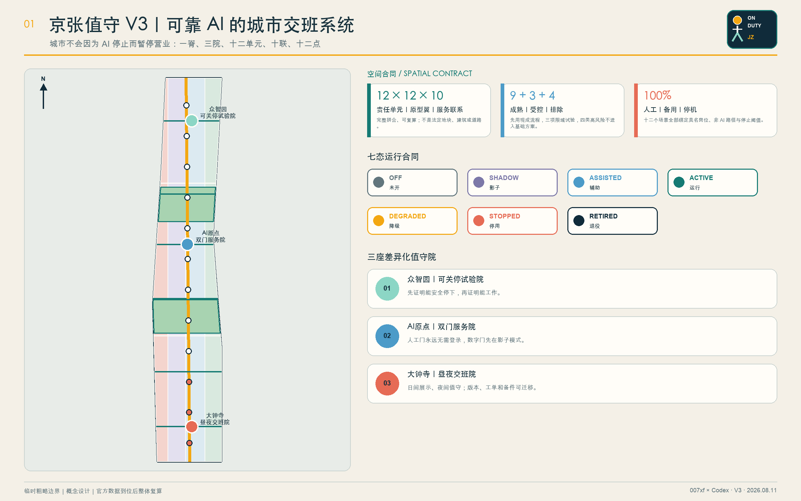
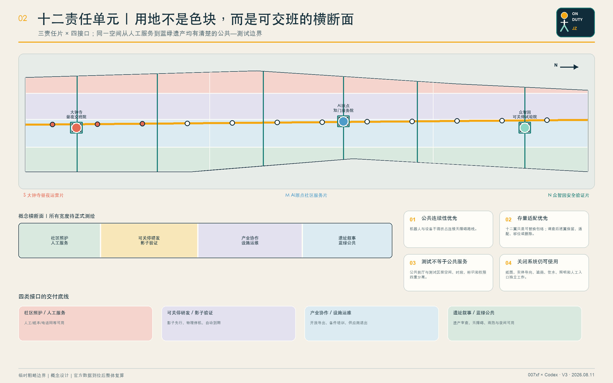
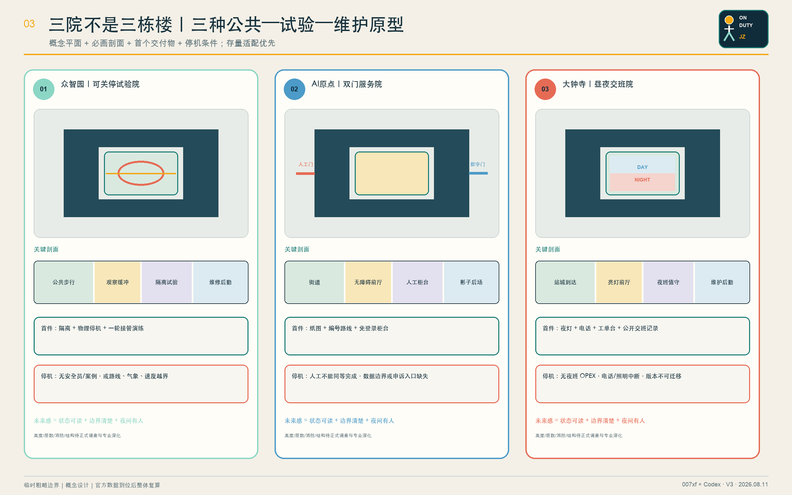
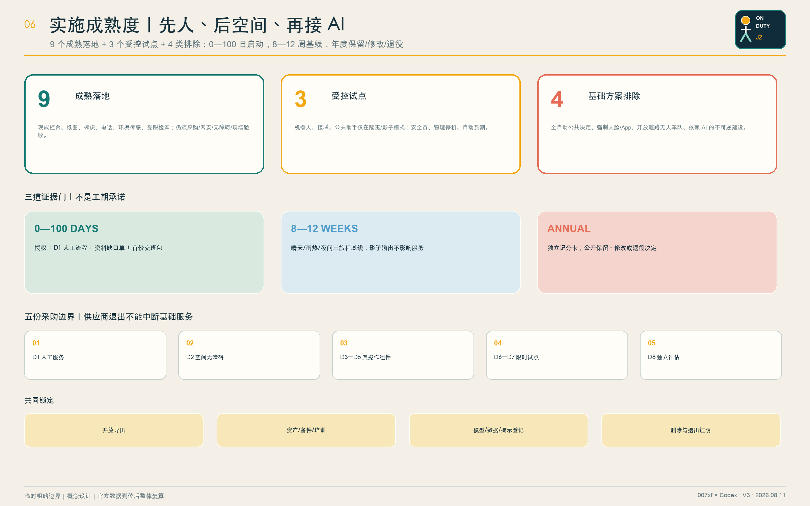
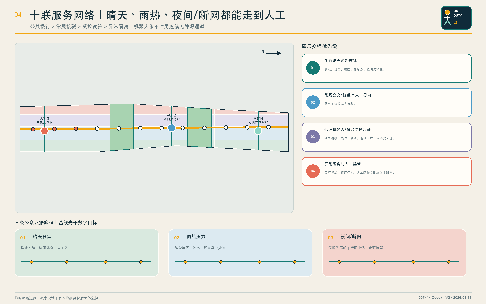
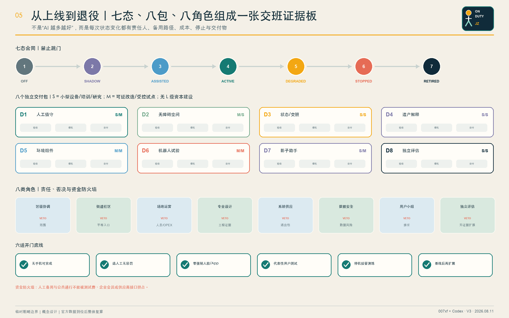

# 京张值守 V3 / ON DUTY JING-ZHANG

> 城市不会因为 AI 停止而暂停营业。让可靠 AI 成为一套可看见、可接手、可退出的城市空间。

“京张值守”不把 AI 当成一组等待展示的新奇设备，而把它视为一种必须有人负责、人人可退出、故障可降级、服务可恢复的城市基础设施。V3 的总体概念是“一条值守脊、三座值守院、两翼保障、十二个值守点”：遗址公园及其周边公共空间形成连续的人工备用与慢行体验线；众智园、北京 AI 原点社区和大钟寺分别承担安全验证、社区服务和昼夜运营；高校研发翼与社区生活翼共同提供人才、伦理、维修和日常反馈；十二个节点让技术在具体用户旅程中接受检查。

每个场景都必须填写“六项值守表”：服务时段、数据边界、责任到人、非数字替代、停用阈值、恢复维护。设计的核心指标不是“用了多少 AI”，而是“出错时谁能接手、没有手机的人能否完成同一件事、系统何时必须停下来”。

V3 在上一版通过仓库准入的基础上，不再增加未经证实的“大概念”，而是补齐四类可审查证据：**空间**上形成 12 个完整拼合的责任单元、12 个院落原型翼和 10 条服务联系；**运行**上把每个场景纳入 `OFF—SHADOW—ASSISTED—ACTIVE—DEGRADED—STOPPED—RETIRED` 七态合同；**实施**上拆成 8 个有牵头角色、成本等级、验收、停机与交付物的项目包；**公众**上以晴天、雨热、夜间/断网三种旅程做 8—12 周人工基线验证。[metric:land_use_responsibility_cell_count] [metric:duty_state_count] [metric:delivery_package_count]

| 设计决定 | 空间回答 | 运营回答 | 失败时怎么办 |
| --- | --- | --- | --- |
| 先定人 | 人工柜台、纸图、电话和连续无障碍路线先落位 | 每班有具名岗位和下一班接手人 | 无人值守即不开 AI |
| 再定空间 | 三院均有公开前厅、影子验证、维护后勤和公众评议四翼 | 公共区与测试区物理、时段和标识分离 | 越界即降级或停用 |
| 最后接 AI | 设备只作为可替换组件进入已工作的服务流程 | 版本、事件、待办、备用状态写入交班包 | 供应商退出不影响基础服务 |

上图只表达空间体验和服务优先级：人工柜台位于最显眼位置，纸本地图与连续无障碍路径不依赖系统在线，低速机器人被限制在独立测试道。它不是已核实场地的写实重建，也不作为边界、建筑或工程证据。

## 设计依据与资料清单

本方案以资格预审公告、面向智能体任务书、场地包、公开资料登记表和本地专业标准快照为主依据；空间生成只使用仓库内已登记的临时粗略范围。公告定义三层工作范围与成果深度，任务书补充三大定位、五大功能、三区两翼和六项智能体任务。[source:OFFICIAL-ANNOUNCEMENT] [source:AGENT-TASKBOOK] [standard:PROJECT-OFFICIAL-ANNOUNCEMENT]

当前未获得官方 `SITE_BOUNDARY` 和三处 `KEY_AREA` polygon。提交包锁定的总体范围与重点区均标记为 `official_boundary=false`、`geometry_role=provisional_constraint`、`boundary_precision=provisional_rough`，只能支持概念生成、内容评审和替换后的复算，不能作为红线、权属、控规或工程依据。[source:BOUNDARY-SOURCE] [data:geometry/site_boundary.geojson#SITE-001] [depth:existing_conditions_diagnosis]

社区 Issue #846 还记录了临时总体范围与 OSM 所示京张铁路遗址公园之间的空间冲突。OSM 也不是法定边界，二者都不足以判断谁正确；因此本方案不作精确地块或文保位置断言，只把“值守脊”作为可在官方数据到位后重新落位的服务结构。[source:ISSUE-BOUNDARY-846] [source:SOURCE-REGISTRY]

评审状态采用三分法：提交包完整性、临时边界下的内容评审资格、官方数据和专业调查齐备后的专业评分资格彼此独立。本方案以通过前两层为目标；容积率、高度、拆改留数量和任何法定结论继续列为待补项。[source:ISSUE-STATUS-1368] [depth:risk_missing_data]

### 北京在地证据：四条“可以做”，四条“不据此推断”

北京市城市更新条例支持以存量空间改善公共服务、慢行和公共空间 [source:BEIJING-URBAN-RENEWAL]；京张铁路遗址公园一期官方介绍明确了遗产保护、绿地开放和缝合城市两侧的方向 [source:JZ-PARK-PHASE1]；清华园车站文保页面提供了保护与建设控制的文字背景 [source:QINGHUAYUAN-HERITAGE]；学院路公共空间项目则支持以东西向公共空间联系作为方法参照 [source:XUEYUAN-PUBLIC-SPACE-2026]。

这些资料让本方案可以确定“存量优先、遗产优先、公共通行优先、东西协同”四项原则，但**不能**据此推断本次征集的官方边界、地块权属、文保控制线、项目重叠或建设条件。V3 因此只把它们落实为可移动、可替换的空间接口；任何涉及遗址本体的地面工程仍须先做正式测绘、文保审查和权属核验。[source:BEIJING-URBAN-RENEWAL] [source:JZ-PARK-PHASE1] [source:QINGHUAYUAN-HERITAGE]

## 三层范围工作框架

三层范围以同一条责任链贯通，而不是制作三套互不相干的图。统筹研究范围回答“创新生态如何持续值守”，总体设计范围回答“公共服务网络如何成形”，三个重点区域回答“具体场景由谁负责、如何停用与恢复”。[source:PROCESSED-FACT-PACK] [depth:three_level_scope_framework]

| 层级 | 核心问题 | “京张值守”的回答 | 可核验成果 |
| --- | --- | --- | --- |
| 统筹研究范围 | 产业、人才、公共服务如何形成长期生态 | 建立“公共议题—受控试验—值守审计—上线服务—维护台账”闭环 | 运营机制、六个案例、年度活动 |
| 总体设计范围 | 更新空间如何承载闭环 | 以值守脊连接三厅、两翼、十二点，形成步行可达的人工备用网络 | 用地、道路、绿地、公共空间与分期 GeoJSON |
| 重点区域范围 | 三处片区如何分工 | 众智园验证、AI 原点服务、大钟寺运营 | 三个概念值守厅与对应场景 |

用地意向采用四个完整拼合分区，目的是证明机器可复算与功能结构一致，并非把临时边界切成法定地块。总体边界临时复算约 1,141.28 万平方米；这一数字仅描述当前替代 polygon 的几何，不是官方设计面积。[data:geometry/land_use.geojson#LU-001] [metric:site_area_sqm]

## 统筹研究范围产业与未来城市研究

### 三大定位与五大功能

方案以“公共服务可信示范带、开放验证共同体、百年京张城市记忆接口”为三项定位。五项功能不是五个园区标签，而是五个连续动作：提出公共议题、组织开放试验、完成责任审计、提供日常服务、沉淀维护知识。三项定位回应品牌与全球表达，五项功能保证 AI 从研发走到城市日常时仍可追责。[source:AGENT-TASKBOOK] [standard:PROJECT-AGENT-OPEN-CALL-TASKBOOK]

“三区两翼”在本方案中解释为三座值守厅加两类支撑网络：高校研发翼提供模型评测、伦理和人才训练；社区生活翼提供真实需求、人工柜台、无障碍验证与持续反馈。两翼不是新增空间红线，而是跨越三层范围的合作角色。

### 名称、Logo 与识别系统

中文名“京张值守”把铁路运行中的值班纪律转译为 AI 公共服务责任；英文名 `ON DUTY JING-ZHANG` 直接说明“有人当班”。Logo 是原创的“信号灯 + 值字负形”：上部琥珀色圆点表示服务状态灯，下部两条轨迹形成“值”的人字与京张线；深海军蓝代表可审计基础设施，琥珀色代表当班状态，薄荷绿代表安全可用，珊瑚红代表必须接管或停用。任何设施只在状态、责任人与替代路径可见时才可使用“ON DUTY”标记。

### 原创性边界：原创的是组合与空间化，不抢占公共治理原则

本方案原创的是：把京张铁路的“班表—调度—检修—交班”纪律转译成七态公共 AI 合同；用三座职责不同的院落与一条人工备用脊把合同变成可走、可看、可停机的空间；再把每个场景绑定交班包、停机演练和供应商退出交付物。方案不声称发明人工监督、算法透明、无障碍服务或铁路文化，也不把尚未采集的本地绩效写成创新成果。[source:NIST-AI-RMF] [source:UK-ALGORITHMIC-TRANSPARENCY]

案例只允许影响“如何组织问题”，不允许直接决定“京张长什么样”。外部案例的图像、Logo、品牌建筑、尺度、预算、制度权限和成效数字均不进入本设计；北京在地资料和仓库任务对空间决策有更高优先级。

### 六个全球案例：只借机制，不搬规模

| 案例 | 可借鉴机制 | 京张转译 | 明确不照搬 |
| --- | --- | --- | --- |
| 新加坡 Punggol Digital District | 数字平台与真实环境试验联动 | 先建立可审计的试验台账，再开放公共空间验证 | 集中化监控架构和未经本地论证的数据范围 |
| Helsinki Smart Kalasatama | 小规模、限时、真实用户参与的敏捷试点 | 每个试点设置到期复盘与退出决定 | 把居民参与设为默认或强制 |
| Seoul AI Hub | 教育、孵化、研究、开放创新的阶段服务 | 三厅分别提供验证、服务和运营阶梯 | 资金规模和政策承诺 |
| Cambridge The Foundry | 创新区内部保留社区公共界面 | 每座值守厅设置不需门禁的公共前厅 | 固定面积指标 |
| Waterfront Toronto Quayside | 先讨论街道与公共空间，再定技术 | 先做公众路线和非数字替代，再采购系统 | 争议治理模式或品牌叙事 |
| Paris STATION F | 以项目和日常配套组织创业服务 | 用值守班表代替一次性展会 | 园区体量、品牌或运营模式的复制 |

这些案例均来自机构或项目公开页面，仅用于机制比较，不支撑本地法定空间或成效承诺。[source:CASE-PUNGGOL] [source:CASE-KALASATAMA] [source:CASE-SEOUL-AI-HUB]

其余案例补足社区接口、公共参与和日常运营三个维度。[source:CASE-FOUNDRY] [source:CASE-QUAYSIDE] [source:CASE-STATION-F]

### 区域协作：交换“经过验证的对象”，不交换口号

| 协作地区 | 双向交换对象 | 京张落点 | 进入门槛 | 退出/回传 |
| --- | --- | --- | --- | --- |
| 北纬社区 | 居民问题与包容性服务测试 | AI 原点双门服务院 | 同意、去标识与聚合 | 返回通俗的采纳/不采纳记录 |
| 未来科学城 | 研究工具、人才课程与验证方法 | 众智园影子验证翼 | 安全、数据和知识产权审查 | 限时沙盒或明确否决 |
| 怀柔科学城 | 科学设施/仪器服务场景 | 众智园公众评议翼 | 专业与安全审查 | 形成可复现验证协议 |
| 经开区 | 制造、机器人与维修供应链 | 大钟寺维护后勤翼 | 产品安全、采购和供应商退出 | 可维修组件或不部署 |
| 京津冀 | 可移植公共服务与互操作协议 | 大钟寺区域/国际接口 | 法域、数据和服务责任人核查 | 开放协议并在本地重新授权 |

协作成果必须是问题单、验证协议、培训模块、互操作格式或退役记录等可交付对象；不把签约数量、参观人数或跨区数据汇聚当作成效。任何跨区域落地均须重新确认适用法律、数据边界、运营者和公众入口。[metric:regional_exchange_interface_count] [source:AGENT-TASKBOOK]

### 中国城市经验：借方法，不搬形象

深圳与重庆被作为国内实施方法参照，而不是未来城市造型库。深圳的启发是把 AI 拆成由责任单位推进的具体场景清单，让创新生态与真实公共需求对接，并用清晰、模块化的服务界面形成未来感。[source:CASE-SHENZHEN-AI-SCENARIOS] [source:CASE-SHENZHEN-URBAN-DESIGN]

重庆的启发是从“小切口”进入治理闭环，把步行路径、公共交通、服务设施和文化目的地组织成连续体验。京张的转译仍以仓库任务、北京治理流程、铁路遗产和海淀社区为主，不复制深圳天际线与开发强度，也不虚构重庆山地、立体层级或网红场景。[source:CASE-CHONGQING-SMALL-CUT] [source:CASE-CHONGQING-TRAILS]

| 国内参照 | 借入京张的方法 | 明确不借入 |
| --- | --- | --- |
| 深圳 | 场景清单、责任单位、模块化数字服务界面、创新供需对接、人性化生态公共空间 | 天际线、密度、全城平台规模、品牌造型、未经核验的成效数字 |
| 重庆 | 小切口试点、核实—预警—分类—协同闭环、站城服务、连续路径与沿线设施 | 山地形态、立体城市造型、地方项目规模、网红化景观语言 |
| 京张原创转译 | 铁路班表和值班纪律、遗产优先更新、社区人工服务、可停止的 AI | 以“未来”为由进行大拆大建或让技术决定公共空间 |

未来感因此被定义为“服务状态清楚、夜间路径精确、设施低打扰、系统出错仍可用”，而不是满城屏幕、无人化表演或脱离运维能力的巨构。所有国内案例继续服从仓库场地包、正式标准和后续专业调查。[source:SOURCE-REGISTRY] [source:AGENT-TASKBOOK]

## 总体设计范围城市更新与控规深度城市设计

### 总体结构：一脊三院、十二单元、十联十二点

“值守脊”是一条公共服务与慢行体验结构，不是新画的道路红线。它把十二个场景点串为连续行程；六条东西服务缝合线回应站城、社区、遗址公园与学院路方向，三条院落无障碍巡视环落实三处重点区，总计十条概念联系。临时总体范围再按南部大钟寺、中部 AI 原点、北部众智园三类责任片区，与“人工服务—影子验证—产业运维—蓝绿遗产”四类横断面接口相乘，形成 12 个无缝拼合的责任单元。[data:geometry/roads.geojson#ROAD-001] [data:geometry/land_use.geojson#LU-N01] [metric:mobility_service_link_count]

三座值守院不是三栋已确认新建筑，而是“中央公共庭 + 人工服务翼 + 维护后勤翼 + 公众评议翼 + 影子验证翼”的原型。GeoJSON 只记录 12 个可替换的功能包络，优先嵌入可保留建筑；待官方 polygon、现状建筑、权属、文保与结构调查后逐个选择保留、适配、移位或删除。[data:geometry/buildings.geojson#BLDG-ZW] [metric:building_prototype_part_count] [depth:overall_spatial_structure]

### 六项值守表

1. **服务时段**：公开每天/每周何时提供服务，测试时段与公共时段必须分离。
2. **数据边界**：声明最少数据、保留时间、访问角色与删除路径；默认不以人脸识别作为进入公共服务的前提。
3. **责任到人**：标出当班岗位、人工接管入口、升级联系人和处置时限。
4. **非数字替代**：同一服务保留纸本、柜台、电话、清晰标识或无需登录的路径。
5. **停用阈值**：精度下降、环境越界、异常投诉、设备故障或隐私事件达到阈值时，自动降级、隔离或下线。
6. **恢复维护**：恢复前完成工单、版本、原因、人工复核和通知记录；试点到期必须做保留、修改或退出决定。

### 七态值守合同与七字段交班包

六项值守表说明“每个场景必须有什么”，七态合同说明“它此刻能做什么”。任何状态改变都必须在公共状态牌与运营日志中同步；禁止 `SHADOW` 或 `STOPPED` 在未重新过门的情况下直接进入 `ACTIVE`。[metric:duty_state_count] [source:NIST-AI-RMF]

| 状态 | 对公众的含义 | 允许的空间行为 | 转换权限 |
| --- | --- | --- | --- |
| `OFF` | 服务未启用，人工/纸本先开放 | 设备熄屏、测试区关闭 | 具名运营者 |
| `SHADOW` | 只观察，不影响服务 | AI 输出仅在后场比对 | 运营者 + 数据安全负责人 |
| `ASSISTED` | AI 给建议，工作人员决定 | 柜台人员看得到建议与来源 | 受训当班岗位 |
| `ACTIVE` | 只在公布的运行边界内工作 | 状态牌显示版本、职责与备用入口 | 六门通过后的运营者 |
| `DEGRADED` | 能力受限，人工路径变为主路径 | 黄灯、缩小功能、暂停新请求 | 阈值自动触发或当班岗位 |
| `STOPPED` | 因事件或越界被隔离 | 红灯、物理停机、公开接管入口 | 任一授权值守岗位 |
| `RETIRED` | 服务、设备与数据完成退出 | 拆除设备并公开保留/退役理由 | 责任主体经公开复盘决定 |

每次换班必须交付七字段“交班包”：当前状态、当班岗位、最近事件、数据与模型版本、未结工单、备用/无障碍状态、下一班责任人。公众只看必要子集，完整记录由运营方按角色权限和保存期限管理。这样，“透明”不是展示算法源代码，而是让使用者知道现在能不能用、谁负责、怎样不用 AI、何时更新。[metric:shift_packet_field_count] [source:UK-ALGORITHMIC-TRANSPARENCY]

控规深度在本阶段表现为“问题—空间对象—指标—缺口”的完整链，而不是虚构精确控制。十二个责任单元完整覆盖临时总体 polygon；十二个院落原型翼、十条概念联系、两条绿带、三处公共值守庭和三期范围均可从 GeoJSON 复核。容积率、高度、停车、道路等级、市政容量与拆除量保持待正式资料补齐。[standard:MOHURD-CONTROL-DETAILED-PLANNING] [depth:development_intensity_controls]

## 重点区域详细设计：三种可落地的值守院原型

### 1. 众智园：可关停试验院

定位为“先证明能安全停下，再证明能工作”的受控验证场。公共前厅展示测试规则和实时状态；风险评审室保存安全说明、环境条件、版本与停用记录；室外小尺度试验环用于低速配送机器人和自主接驳的人机混行验证。公众可观看结果，但不被默认纳入测试。任何测试越出时间、速度、气象、路线或人工监管条件即暂停。[data:geometry/key_areas.geojson#PROV-KEY-001] [depth:three_key_area_detailed_design]

### 2. 北京 AI 原点社区：双门服务院

定位为“没有 App 也能完成服务”的社区公共接口。入口同时设置免登录人工台、纸本路线图、多语与无障碍礼宾；居民反馈工作室把问题转成可测试的服务议题。这里优先承载办事导航、适老服务、儿童慢行提醒和无障碍协助，不进行医疗、法律或行政决定自动化，只做信息导航、材料提示与人工转接。[data:geometry/key_areas.geojson#PROV-KEY-002]

### 3. 大钟寺：昼夜交班院

定位为“站城接口与长期维护中枢”。空间包括站城服务值守室、设施工单台、供应商与版本台账墙、国际访客界面和夜间安全接管点。它不追求最大屏幕，而是让服务状态、负责人、上次维护和非数字路径一目了然。[data:geometry/key_areas.geojson#PROV-KEY-003]

| 原型 | 概念平面 | 必须画出的剖面关系 | 首个可交付物 | 不满足即停止 |
| --- | --- | --- | --- | --- |
| 众智园可关停试验院 | 公共观察廊围绕中央庭，测试环与连续步行线错开，安全员位于可视交点 | `公共步行—观察缓冲—隔离试验环—维修翼`，四带互不挤占 | 临时隔离、物理停机、运行边界牌与一轮接管演练 | 无安全员、无安全案例、路线/气象/速度越界 |
| AI 原点双门服务院 | 沿街“人工门”无需登录；“数字门”只进入影子模式与共创室，两门在同一柜台汇合 | `街道—无障碍前厅—人工柜台—影子验证后场`，公众不穿越测试区 | 纸图、编号路线、免登录柜台和代表性用户测试 | 不能同等完成人工事项、数据边界未定、无申诉入口 |
| 大钟寺昼夜交班院 | 日间市集/展示与夜班服务共享前庭，工单、备件、版本与事故复盘环绕后勤边 | `站城到达—亮灯前厅—夜班值守—维护后勤`，关闭屏幕后路线仍工作 | 夜间照明、电话、纸图、工单台和首份公开交班记录 | 无夜班经费、照明/电话中断、版本与工单无法迁移 |

三个原型都使用耐久、易维修、低眩光、可替换组件；不以曲面巨构、全息屏或无人化作为未来感。未来感来自状态一眼可读、步行与无障碍连续、公共和测试边界清楚、夜间仍有人接手。建筑高度、层数、立面材料、消防和结构只给出原则，不给无依据的数值。[depth:three_key_area_detailed_design] [depth:height_massing_character]

三院共用一套值守日志和事故复盘格式，但分散设置人工服务，不把所有功能依赖于单一平台或单一供应商。三个临时矩形的具体位置与形状均待官方重点区边界替换，不得据此形成地块、建筑退线或拆迁判断。

## AI 创新生态、人才画像与 AI+ 场景

### 六类主要用户画像

| 画像 | 关键障碍 | 必须保留的服务条件 |
| --- | --- | --- |
| 银龄/非数字居民 | 无智能手机、验证码困难、对自动判断不信任 | 免登录、人工柜台、纸本回执 |
| 儿童与照护者 | 路线安全与信息理解能力差异 | 不以人脸为前提、简单语言、照护者确认 |
| 视听或行动障碍者 | 单一视觉界面、台阶、路径中断 | 触觉/声音/大字、多模态人工协助、连续无障碍路径 |
| 公共服务一线人员 | 自动化建议难以解释、接管责任不清 | 清楚的人工权限、培训、事件工单与申诉通道 |
| 开发者与创新企业 | 缺真实测试环境和合规路径 | 受控沙盒、版本记录、停止条件、到期评审 |
| 通勤者与国际访客 | 时间紧、语言不同、夜间不确定 | 多语、无需注册的方向信息、夜间人工接管点 |

六类画像不是人口统计推断，而是服务设计所需的最小差异集。[metric:persona_count] [source:AGENT-TASKBOOK]

### 十二张场景卡

| 编号 | 场景与主要地点 | 值守安排 | 数据边界与非数字替代 | 停用阈值 |
| --- | --- | --- | --- | --- |
| S01 TEST | 众智园低速配送机器人验证 | 现场安全员 + 远程操作员 | 只记录设备/路线事件；人工配送可替代 | 超速、离线、行人冲突即停 |
| S02 TEST | 众智园自主接驳人机混行验证 | 车内安全员 + 路口值守 | 不以人脸识别乘客；步行/常规接驳保留 | 超出路线、能见度或制动阈值即停 |
| S03 TEST | AI 原点公共服务助手验证 | 柜台公务支持人员可一键接管 | 最少材料提示，不作行政决定；纸本清单可用 | 错误建议、隐私事件或连续投诉即下线 |
| S04 | 多语无障碍导航 | 礼宾员巡回值守 | 临时会话、默认不保存身份；纸图与编号路线 | 定位漂移或无障碍路线中断即降级 |
| S05 | 银龄免登录办事 | 固定人工台 | 无账号也可完成同等咨询；纸本回执 | 识别不确定或用户要求即转人工 |
| S06 | 儿童安全慢行提示 | 学校/社区时段值守 | 不采集人脸；地面标识与护学岗保留 | 路况与模型不一致即只显示静态路线 |
| S07 | 无障碍现场礼宾 | 受训服务员 | 用户主动提供所需信息；触觉/声音导向 | 电梯、坡道或导航数据失效即人工陪同 |
| S08 | 企业合规值守台 | 法务/数据治理轮值 | 仅提供流程导航，不替代法律意见；预约人工咨询 | 来源过期或问题超范围即停止回答 |
| S09 | 百年京张文化导览 | 文化志愿者/策展人员 | 不做游客画像；纸本折页与实物标识 | 史实不确定、文保范围不明即标注未知 |
| S10 | 设施维护工单分诊 | 运维班组 | 设备状态最小化；电话报修可用 | 重大安全事件直接跳过 AI 分诊 |
| S11 | 热舒适与遮荫建议 | 公共空间值守员 | 只用环境传感；固定遮荫与饮水点始终开放 | 传感异常时回退季节性静态建议 |
| S12 | 夜间归途人工接管 | 大钟寺夜班值守 | 不强制注册；照明、纸图、电话同步可用 | 服务中断或风险升级即转人工/应急流程 |

十二个场景节点全部写入公共空间 GeoJSON，并逐项声明人工值守、非 AI 替代和停用阈值；其中前三项是明确的产业测试/验证场景。[data:geometry/public_space.geojson#S01] [metric:scenario_node_count] [metric:industry_test_scenario_count]

AI 生态以“挑战清单—沙盒—值守审计—公共服务—维护台账”为门槛。未经影响评估和人工接管演练的系统只能停留在验证状态；通过一次演示不等于获得永久上线资格。六个仓库场景注册项用于对齐公共服务、机器人、企业服务、公共安全、文化和慢行方向，但本方案的十二点是更细的空间与运营拆解。[standard:MOHURD-URBAN-DESIGN-MEASURES]

### 八要素生态交班图：资源只有形成交付物才进入下一环

| 生态要素 | 进入门槛 | 京张空间接口 | 必须交付给下一环 / 退出 |
| --- | --- | --- | --- |
| 土地 | 官方边界、权属与允许用途核验 | 12 个责任单元仅作任务索引 | 核验后的使用条件；冲突即移位，不作供地承诺 |
| 空间 | 现状、文保、结构、消防与无障碍调查 | 三院十二翼优先嵌入存量空间 | 适配方案与资产表；不满足安全即删除原型翼 |
| 产业 | 从真实问题单出发，不以企业名单代替需求 | 众智园验证 + 大钟寺维修/供应链接口 | 安全案例、可维修部件或明确不部署 |
| 资金 | D1 人工底座、D8 独立评估与 OPEX 先锁定 | 公共入口与试验空间财务隔离 | 全生命周期成本与资金责任；无 OPEX 不上线 |
| 人才 | 岗位能力、伦理、安全和接管培训 | 高校研发翼 + 开放维护学校 + 三院轮值 | 能力记录与下一班交接；不以虚构人才数量作绩效 |
| 算力 | 工作负载、网络安全、能耗和离线方案审查 | 影子验证后场；优先合规共享服务 | 工作负载/版本/停用记录；不据此新建数据中心 |
| 数据 | 合法来源、最少必要、保存期、权限和删除路径 | 数据安全负责人 + 七字段交班包 | 来源/版本/访问/删除证明；越界即 `STOPPED` |
| 场景 | 先通过画像、人工替代、停机和公众证据门 | 12 节点按 `9 + 3 + 4` 分层 | 保留、修改或退役记录；演示成功不等于扩展 |

八要素不是招商资源清单，而是一条“问题单—验证协议—值守记录—公共服务—维护/退役”的交付链。任何一环缺少具名责任、可核验证据或退出材料，都不得把价值转嫁给下一环；由此把土地、空间、产业、资金、人才、算力、数据和场景从口号转成可审计接口。[metric:ecosystem_factor_count] [metric:innovation_conversion_gate_count]

### AI 如何参与规划：七项辅助任务，不代替七类决定

| AI 辅助任务 | 只允许输出 | 必须由谁决定 |
| --- | --- | --- |
| 已授权底图断点检测 | 疑似断点清单 | 规划师结合测绘、路权核实 |
| 聚合诉求聚类 | 候选公共议题 | 社区代表接受、修改或否决 |
| 遮荫与热环境情景比较 | 方案间相对差异 | 景观/市政专业人员结合实测选择 |
| 无障碍路线 QA | 疑似障碍点 | 代表性用户与无障碍专业人员现场测试 |
| 试点事件模式复盘 | 异常候选 | 运营者调查、定级并闭环 |
| 中英文证据一致性 | 缺失或冲突锚点 | 作者与专业评审修正 |
| 采购互操作审查 | 锁定与退出风险提示 | 业主和采购/法律人员写入合同 |

AI 不自动生成法定红线、规划许可、文保意见、拆迁结论、投资决策、安全认证或对个人有实质影响的公共决定。每项输入必须来自公开/清权或经授权的数据，输出必须带来源、版本、置信度和人工处置记录。[metric:planning_ai_workbench_task_count] [source:NIST-AI-RMF]

### 公众证据：先跑人工基线，再设数字目标

在场地、运营者和参与流程获授权后，先进行 8—12 周概念性证据窗；这不是政府工期承诺。用晴天日常、雨/热压力、夜间或系统断网三条旅程，邀请银龄/非数字、轮椅或行动障碍、感官障碍、照护者与儿童、夜班人员、无本地 App 访客六组使用者，检查同一事项能否平等完成。[metric:public_evidence_journey_count] [source:STANDARD-BARRIER-FREE]

基线记录完成率、转人工时间、错误/不可用建议、投诉申诉、无手机服务等价性、工作人员分钟数和维护成本。每条发现形成“问题—接受/修改/否决—理由—责任人—期限—关闭证据”；参与者在制度允许时获得时间补偿，不因使用公共服务而被默认为试验对象。只有基线建立后，运营者才可预先公开扩展阈值。[source:STANDARD-ELDERLY-TECH] [metric:stakeholder_role_count]

### 技术成熟度与公众接受度：`9 + 3 + 4`

方案不把“技术可演示”等同于“城市可运行”。十二个场景按部署条件分为两条通道，并把四类高风险能力排除在基础方案之外；分类已写入 `geometry/public_space.geojson` 的 `technology_readiness`、`deployment_mode`、`entry_phase` 和 `scale_gate` 字段，同时由 `risk.json` 中的 `implementation_readiness` 单独审计。[metric:deploy_now_scenario_count] [metric:controlled_pilot_scenario_count]

| 技术通道 | 数量与内容 | 为什么现在能做 | 上线边界 |
| --- | --- | --- | --- |
| 成熟落地 | 9 个：多语/无障碍导航、免登录服务、儿童慢行提示、现场礼宾、企业流程导航、文化导览、工单分诊、环境建议、夜间人工接管 | 采用现成标识、柜台、电话、环境传感、工单和受限知识检索等产品类别，并嵌入既有岗位 | 仍须采购验收、网络安全、无障碍和现场测试；AI 只辅助信息与分诊 |
| 受控试点 | 3 个：低速配送机器人、自主接驳、公共服务助手 | 当前技术可在限定场景运行 | 必须地理围栏/隔离路线、具名安全员、影子模式、物理停用和自动到期；不得直接进入开放道路或自动作行政决定 |
| 基础方案排除 | 4 类：全自动行政/法律决定、公共服务强制人脸或 App、开放道路无人车队、依赖 AI 运行的不可逆大建设 | 它们不是场地基本运行的必要条件 | 不进入空间投资前提；未来只有在法律、技术、安全和公众授权全部变化后才能重新立项 |

公众接受不是宣传满意度，而是六道开门条件：同一事项可不用智能手机完成；选择人工不受惩罚；基础方案零强制生物识别/强制 App；开放前由银龄、残障、照护者和一线人员参与可用性测试；每个场景完成停用与接管演练；扩展前由运营方基于基线预先写明完成率、错误、接管和投诉阈值。未通过任一道即保持人工服务、修改或退出，不以“已投资”为由强推。[source:STANDARD-GENERATIVE-AI] [source:STANDARD-BARRIER-FREE] [source:STANDARD-ELDERLY-TECH]

六道门槛在机器可读风险与实施矩阵中逐项列出。[metric:acceptance_gate_count]

## 用地、建筑规模与拆改留方案

十二个责任单元由“三个南北责任片 × 四类横断面接口”组成。横断面从西向东依次表达社区照护与人工服务、可关停研发/影子验证、产业协作与设施运维、遗址叙事与蓝绿公共界面；每类在南、中、北承担不同重点。12 个 polygon 共享边界、无缝拼合并覆盖临时总体范围，以便官方 polygon 到位后整体复算；代码引用国家用地分类仅作机器兼容，不构成控规赋值。[data:geometry/land_use.geojson#LU-M02] [metric:land_use_responsibility_cell_count] [standard:MNR-LAND-USE-CLASSIFICATION-GUIDE]

十二个建筑图形是三座值守院各四翼的“概念项目包络”，合计临时复算约 3.10 万平方米，仅用于比较紧凑、院落式空间承载，不是确认建筑基底或新建规模。每个图形自带 `reuse_preference=existing_retained_or_reversible_fitout_first` 和调查后的保留/适配/移位/删除规则。[data:geometry/buildings.geojson#BLDG-ON] [metric:building_footprint_area_sqm]

拆改留采用“先调查、再分级”的决策树：有历史文化价值或结构可用的建筑优先保留；满足安全与适配条件的建筑优先轻改造；只有在官方权属、结构安全、文保、碳排和公共利益评估完成后，才讨论拆除与新建。当前缺少建筑年代、结构、权属、使用率、文保和碳数据，因此容积率、建筑高度、拆除面积保持待正式数据补齐，不作伪精确结论。[depth:retain_renovate_demolish] [standard:MOHURD-ARCH-DESIGN-DEPTH-2016]

## 交通、轨道、市政与公共服务设施

值守脊、六条服务缝合线和三条院落巡视环是慢行/公共服务意向线，不是道路中心线或轨道方案。十条联系在临时边界内复算总长约 18.84 千米，用于检查“十二点能否被连续服务路线串联，并在三院形成可巡视的无障碍闭环”，不能推导道路等级、红线或工程量。[data:geometry/roads.geojson#ROAD-005] [metric:road_network_length_m] [depth:traffic_rail_slow_parking]

交通策略分四层：第一层是步行和无障碍连续性；第二层是常规公交、轨道站点与人工导向；第三层才是低速机器人和自主接驳的受控验证；第四层是异常时的安全停车、人工接管和路线隔离。机器人不得以“效率”为理由占用连续无障碍通道，测试区必须有清晰时间、速度、地理围栏和现场值守。

市政与公共服务采用“小而可替换”的组件：具名人工值守台、纸本地图和路线编号、触觉/声音/大字标识、座椅饮水充电、可见服务状态灯、紧急停用按钮与安全等候区。数据机房、能源、通信、消防、排水和设备维护容量仍需专业团队依据官方管线与负荷数据深化。[depth:municipal_new_infrastructure]

## 蓝绿空间、公共空间与城市风貌

两条“气候值守带”把遮荫、雨水、休息、饮水和夜间可见性作为公共服务的一部分；其临时面积比例约 17.99%。三处中央公共值守庭合计比例约 0.22%，强调“走得到人工帮助、看得见试验边界、可以完成交班”，而非追求大尺度广场。这两个比例都是概念图层相对临时总体 polygon 的复算值，不能与现状绿地率或法定公共空间指标等同。[data:geometry/green_space.geojson#GREEN-001] [metric:green_ratio] [metric:public_space_ratio]

风貌语言来自铁路基础设施的克制与可读性：细线轨迹、状态灯、班表、铆接金属和耐久材料；避免用巨型屏幕把遗址和社区降为技术背景。夜间照明只强化入口、路线编号、人工值守和停用状态，屏幕熄灭后，纸图、触觉铺装和实体标识仍能独立工作。[depth:blue_green_public_space]

三处概念性 AI 朝圣地标分别是：众智园“值守灯”，公开展示正在运行/暂停/复盘的测试状态；AI 原点“零号值守厅”，展示公共服务的人工与非数字入口；大钟寺“鸣钟维护台”，展示版本、事故和维护时间线。它们不是纪念技术英雄，而是把责任和维护变成可见的公共文化。[metric:ai_landmark_count]

文化叙事以“从铁路班表到 AI 值守表”为主线：百年京张代表公共技术必须依靠长期运营而非一次性建成；新的 AI 创新带应同样把司机、调度、维修、服务员和使用者纳入故事。所有涉及遗址本体、文保范围和历史细节的展示须由官方资料与专业策展复核。

### 可感知工具包：八件离线组件、五站叙事与责任荣誉

| 编码 | 公共空间组件 | 离线/停机时仍提供什么 | 维护与布置原则 |
| --- | --- | --- | --- |
| C01 | 具名人工值守台 | 同一事项人工办理与接管 | 永远位于数字入口之前；场地运营者排班 |
| C02 | 纸图/路线编号柜 | 无手机、断网仍可找路 | 街道/社区校对，版本日期可见 |
| C03 | 触觉、声音与大字标识 | 不依赖颜色或屏幕的多模态方向 | 无障碍专业人员与代表性用户复核 |
| C04 | 状态灯 + 文字/符号牌 | 明确 `OFF/STOPPED` 与人工入口 | 不以单一颜色传递状态；D3 日常对账 |
| C05 | 物理停用器与安全等候位 | 现场停止设备并隔离人员 | 只由授权岗位操作，演练记录公开摘要 |
| C06 | 可移动遮荫、座椅、饮水/充电 | AI 不运行时仍改善热舒适和停留 | D5 资产、备件和巡检责任到人 |
| C07 | 交班墙与公开问题台 | 查看状态、未结问题和回应期限 | 只展示必要公共子集，保护个人信息 |
| C08 | 可拆试验边界与地面标线 | 将机器人/接驳与连续无障碍线物理分开 | 试点到期即可撤除，不固化为道路红线 |

文化路线设置“起班—调度—检修—交班—复盘”五个叙事站：只在策展核实后讲述京张史实，把当代工作人员、使用者和被退役的系统也纳入公共记忆。[metric:public_component_count] [metric:culture_story_stop_count]

荣誉展示不做企业广告墙，而采用三类“责任荣誉”：完成无障碍修复的**补缺记录**、主动停机避免伤害的**正确停止记录**、公开回应用户发现的**闭环记录**。每条都列证据、共同贡献者、日期和后续维护，不把失败隐藏起来。国际传播固定一句主张：**The city stays open when AI stops.** 配套短句为 **Reliable AI is visible, handover-ready and exit-ready**；中文、英文、图形、触觉与声音共同表达，不依赖未经授权的城市或企业品牌。[source:AGENT-TASKBOOK]

## 更新项目清单、实施政策与分期计划

### 八个概念项目包

1. **D1 人工值守服务**：排班、纸图、电话、路线编号与问题台账先开。
2. **D2 连续无障碍公共空间**：补断点、休息点、过街、遮荫和实体导向。
3. **D3 可见状态与交班台账**：状态牌、七字段交班包、公开子集与开放导出。
4. **D4 遗产优先解释系统**：策展审校的实体/纸本路线，不绘制未核实文保线。
5. **D5 可逆环境组件**：照明、饮水、遮荫、低压传感与可维修资产表。
6. **D6 可关停机器人试验院**：隔离环、物理停机、安全案例和现场安全员。
7. **D7 影子模式公共服务助手**：仅供工作人员比对的检索助手，不直接决定。
8. **D8 独立证据与年度复盘**：公开记分卡、利益冲突披露、保留/修改/退役听证。

| 包 | 牵头角色 | CAPEX / OPEX 相对档 | 第一个产品 | 验收 | 停机/不启动 | 交付给下一阶段 |
| --- | --- | --- | --- | --- | --- | --- |
| D1 | 场地运营者 | S / M | 人工柜台 + 值守表 | 同一事项无手机可完成 | 无具名班次或无运维经费 | 人工基线登记 |
| D2 | 专业设计团队 | M / S | 编号无障碍路线 | 代表性用户走完全程 | 测绘/路权冲突未解 | 竣工无障碍资产表 |
| D3 | 场地运营者 | S / S | 状态牌 + 交班包 | 公示状态与日志一致 | 状态无法核验 | 开放机器导出 |
| D4 | 专业设计/策展 | S / S | 审校实体路线 | 零未核实遗址断言 | 文保审查未完成 | 来源与内容台账 |
| D5 | 场地运营者 | M / M | 可逆环境组件包 | 网络/AI 关闭仍能用 | 无维修责任或安全供电 | 资产、备件与培训表 |
| D6 | 场地运营者 | M / M | 隔离试验环 | 停机与接管演练通过 | 运行边界或监管越界 | 事件与退役记录 |
| D7 | 数据安全负责人 | S / M | 工作人员影子助手 | 无自动公共决定且错误基线完成 | 隐私、来源时效或准确性越界 | 模型/数据/提示与退出包 |
| D8 | 独立评估者 | S / S | 公开记分卡 | 发现有回应、责任人与关闭证据 | 利益冲突或缺基线 | 年度公开决定记录 |

`S` 只表示小型设备、家具、培训或研究，`M` 表示可逆场地改造或受控试点；本阶段不设 `L` 级资本建设，因为没有官方控制、工程量与商业论证。相对档不能代替投资估算，采购前必须做本地工程量、市场询价、全生命周期成本和运维预算确认。[metric:delivery_package_count]

采购拆成 D1 人工服务、D2 空间无障碍、D3—D5 互操作组件、D6—D7 限时试点、D8 独立评估五份合同边界。共同锁定开放导出、资产/备件/培训、模型/数据/提示登记、删除证明和退出证书；任何供应商不得以专有接口绑架人工服务或公共空间。[source:BEIJING-URBAN-RENEWAL] [depth:renewal_project_list]

实施顺序采用“存量空间优先、可逆设施优先、人工流程先跑通、新建建筑最后论证”。在官方边界、权属和建筑调查到位前，不把 12 个总计约 3.10 万平方米的原型翼理解为必须新建；第一选择是在可保留建筑中适配，第二选择是可移动/临时组件，只有存量无法满足安全、无障碍和运营需求时才进入新建论证。[depth:retain_renovate_demolish]

分期不是政府工期承诺，而是减少不可逆风险的决策门。`0—100 日`在获得场地与运营授权后，完成 D1 人工流程、底图/权属核验清单、第一份交班包和三种公众旅程脚本；随后 8—12 周只跑人工/影子证据窗。只有基线、代表性用户测试、运维责任和预先阈值齐备，第二阶段才适配三院并启动受控试验；第三阶段在完整运营周期和独立复盘后做保留、修改或退役，仍不以 AI 表现为不可逆建设的唯一理由。[data:geometry/phasing.geojson#PHASE-001] [depth:phasing_implementation]

政策建议包括：公共 AI 服务采购必须包含退出和数据迁移条款；高风险服务先通过小规模、限时、可逆试验；上线前完成无障碍、隐私、安全和人工接管演练；运维预算与建设预算同步披露；供应商更换不得导致基本公共服务中断。

### 八类角色、四项否决权与资金防火墙

| 角色 | 核心责任 | 可否决事项 |
| --- | --- | --- |
| 区级协调角色 | 跨部门边界与公共利益底线 | 范围漂移 |
| 街道/社区 | 日常需求与免登录路径 | 取消平等人工入口 |
| 场地运营者 | 排班、SLO、事件、维护与交班 | 无人员或无 OPEX 上线 |
| 专业设计团队 | 测绘、文保、无障碍、消防、交通、市政 | 未经核实的工程结论 |
| 系统供应商 | 系统边界、版本、网络安全与退出包 | 对公共责任主体无否决权 |
| 数据安全负责人 | 数据合法性、保存、访问与事件响应 | 不可接受的数据/安全风险 |
| 代表性用户小组 | 有偿可用性证据与排斥发现 | 开放前仍有未解决的排斥 |
| 独立评估者 | 基线、门槛审计与保留/修改/退役建议 | 无证据扩展 |

基础公共入口、人工备用和连续通行是公共利益义务；测试费、活动收入或企业服务可在合规前提下支持维护，但不得购买公共服务优先权、额外个人数据或挤占公共空间。D8 评估合同与 D6/D7 供应商分离，并披露利益冲突。[metric:stakeholder_role_count] [source:STANDARD-GENERATIVE-AI]

长期运营形成八项年度节律：每季“值守开放日”、每半年夜间接管演练、每年无障碍三旅程复测、年度国际 Civic AI 值守周、京津冀互操作桌面演练、开放维护学校、遗产与技术事实核查工作坊、年度维护/退役报告。每项活动都必须输出问题单、演练记录、修订版资产表或公开决定；活动是概念建议，需由组织方、专业团队和场地运营者共同深化，不构成已确定安排。[metric:annual_program_count] [source:AGENT-TASKBOOK]

### 四个活动品牌与五门开发者转化路径

| 门 | 活动/机制 | 开发者或团队提交 | 人类决定与退出条件 |
| --- | --- | --- | --- |
| G1 `ASK` | **ON DUTY OPEN DAY / 值守开放日** | 公开问题单、受益者和非 AI 现状 | 社区与一线人员接受、合并或否决问题 |
| G2 `SHADOW` | **OPEN MAINTENANCE SCHOOL / 开放维护学校** | 数据/模型卡、影子结果、维护与退出草案 | 专业、数据安全与运营角色决定是否进入现场 |
| G3 `PROVE` | **NIGHT HANDOVER DRILL / 夜间接管演练** | 隔离测试、安全案例、接管和无障碍证据 | 代表性用户与运营者可随时暂停；未过门即退役 |
| G4 `HANDOVER` | **CIVIC AI DUTY WEEK / 公共 AI 值守周** | 七字段交班包、开放导出、培训与 OPEX | D8 独立评估后才建议限时采购或继续试验 |
| G5 `RETAIN / MODIFY / RETIRE` | 年度公开复盘 | 事件、投诉、成本、服务等价与删除证明 | 公开保留、修改或退役理由及下一责任人 |

五门路径的“转化”不是招商签约数量，而是把可复现问题变为有来源的验证协议，再变为可维护、可退出的公共服务。开发者可获得清晰问题、测试边界和反馈；公众保留否决、人工入口与申诉；运营者获得资产、培训、版本和退出包。任何采购、资金或活动举办仍以届时授权和预算为前提。[metric:event_brand_count] [metric:innovation_conversion_gate_count]

## 指标体系、面积复算与合规矩阵

指标分成三层。第一层是几何复算：临时总体面积、概念包络、绿地/公共空间比例和意向线路长度；第二层是内容完整性：重点区、画像、场景、产业验证和地标数量；第三层是责任覆盖：人工值守、非 AI 替代和停用阈值。第一层受临时边界限制，第二、三层可直接由提交包审计。[depth:metrics_recalculation]

| 指标 | 当前值 | 含义与限制 |
| --- | ---: | --- |
| 临时总体范围面积 | 11,412,825.386 ㎡ | 仅为临时粗略 polygon 的 EPSG:4548 复算 [metric:site_area_sqm] |
| 概念项目包络面积 | 30,957.656 ㎡ | 三院十二翼，不是确认建筑基底 [metric:building_footprint_area_sqm] |
| 概念绿带比例 | 17.9931% | 不等于现状或法定绿地率 [metric:green_ratio] |
| 概念公共值守庭比例 | 0.2178% | 不等于法定公共空间率 [metric:public_space_ratio] |
| 概念服务线路长度 | 18,836.033 m | 非道路红线/工程中心线 [metric:road_network_length_m] |
| 责任单元 / 原型翼 / 服务联系 | 12 / 12 / 10 | 临时边界内可复核的空间结构 [metric:land_use_responsibility_cell_count] [metric:building_prototype_part_count] [metric:mobility_service_link_count] |
| 临时重点区 | 3 | 三个 polygon 均待官方替换 [metric:key_area_count] |
| 场景节点 | 12 | 每个节点有完整六项值守表 [metric:scenario_node_count] |
| 产业测试/验证场景 | 3 | 机器人、接驳、公共服务助手 [metric:industry_test_scenario_count] |
| 主要用户画像 | 6 | 服务设计画像，不是人口统计 [metric:persona_count] |
| AI 朝圣地标 | 3 | 均为责任文化的概念节点 [metric:ai_landmark_count] |
| 人工值守覆盖 | 100% | 审计场景卡字段，不代表现实绩效 [metric:human_on_duty_coverage_ratio] |
| 非 AI 替代覆盖 | 100% | 审计场景卡字段，不代表设施已建成 [metric:non_ai_alternative_coverage_ratio] |
| 停用阈值覆盖 | 100% | 审计场景卡字段，不代表安全认证 [metric:stop_threshold_coverage_ratio] |
| 成熟落地场景 | 9 | 使用现成产品类别与既有服务流程，仍须采购和现场验收 [metric:deploy_now_scenario_count] |
| 受控试点场景 | 3 | 只能在限定运行条件下验证 [metric:controlled_pilot_scenario_count] |
| 基础方案排除能力 | 4 | 高风险且并非场地基本运行所必需 [metric:excluded_high_risk_capability_count] |
| 公众接受门槛 | 6 | 二元底线与运营方基于基线设定的扩展阈值 [metric:acceptance_gate_count] |
| 七态合同 / 交班字段 | 7 / 7 | 运行状态与换班责任证据 [metric:duty_state_count] [metric:shift_packet_field_count] |
| 交付包 / 治理角色 | 8 / 8 | 独立采购退出与责任否决 [metric:delivery_package_count] [metric:stakeholder_role_count] |
| 区域接口 / AI 规划辅助任务 | 5 / 7 | 只交换验证对象，AI 不代替专业决定 [metric:regional_exchange_interface_count] [metric:planning_ai_workbench_task_count] |

容积率、建筑高度和拆除面积保持“待正式数据补齐”；它们不会被概念包络反推。`compliance_matrix.json` 完整覆盖公告 1.3、1.4、1.5 与 agent.1-agent.6，`standard_matrix.json` 覆盖全部强制标准，`design_depth_matrix.json` 把十五项成果深度映射到正文、图纸、图层、指标与自检。内容完整不等于法定可用，自动检查通过也不等于专业团队批准。[standard:MOHURD-CONTROL-DETAILED-PLANNING]

## 风险、版权与合规说明

| 风险 | 触发信号 | 预防与响应 |
| --- | --- | --- |
| 临时边界误用 | 图件被当作红线或精确地块 | 所有图件脚注标注 provisional；官方 polygon 到位后全包复算 |
| 隐私与功能漂移 | 开始收集与服务无关的身份/行为数据 | 最少数据、限期删除、独立影响评估、人工申诉 |
| 自动化偏差 | 特定人群频繁转人工或获得错误建议 | 按画像测试；不自动作医疗、法律、行政决定 |
| 机器人安全 | 超速、路线漂移、行人冲突、通信中断 | 地理围栏、现场安全员、物理停用与安全区 |
| 数字排斥 | 无手机/不会登录者无法完成服务 | 同等人工、纸本、电话和无需登录通道 |
| 供应商锁定 | 版本、数据、工单无法迁移 | 开放日志格式、退出条款、备用运营方案 |
| 维护债务 | 屏幕和设备损坏但仍显示“在线” | 状态灯、巡检班表、维护预算、自动下线规则 |
| 未来感变成技术表演 | 设备先建、真实需求和运营岗位缺席 | 先运行 P0 人工包；P1/P2 只能在需求、责任人和验收门槛明确后启动 |
| 公众拒绝或被迫使用 | 退出 AI 后无法完成事项或受到差别待遇 | 同一事项保留人工/纸本/电话；代表性用户测试；未过门槛不扩展 |
| 交班失真 | 公示状态、版本、未结工单与真实运营不一致 | 每班七字段交班；D3 自动/人工对账；无法核验即 `STOPPED` |
| 运维资金断裂 | 建设有预算而排班、备件、夜班无长期经费 | OPEX 先确认；D1 独立持续；无运维经费不得上线 |
| 伪精确与过度建设 | 临时几何被转成面积、投资或拆建承诺 | 相对成本档；调查后逐翼保留/适配/移位/删除；`L` 级建设暂不进入 |
| 评估利益冲突 | 供应商同时证明自己达到扩展门槛 | D8 独立采购、披露冲突、公开回应每条发现 |

专业边界包括：本方案不构成规划审批、控规、用地权属、拆迁决定、工程可行性、安全认证、采购或投资承诺；建筑、道路、市政、文保、生态、交通、隐私和无障碍均须由具备资质的专业团队复核。[source:SITE-PACKAGE] [depth:risk_missing_data]

本方案文字、信息图、GeoJSON、离线 HTML 和 PDF 由 007xf 与 Codex 基于公开/清权资料原创生成。外部案例只使用有出处的机制摘要，未复制其图像、Logo、地图或受保护版式。提交采用 `COMMUNITY-DISPLAY-ONLY` 声明；任何超出征集展示与评审的复用须核对仓库与来源许可。

中文主稿与英文译稿保持同样的章节、主张、指标、证据锚点和图件位置；所有含文字的六张图、HTML、A3 和 A0 均提供英文副本。机器检查不能证明翻译语义完全等价，仍需人工抽查。

## 参考资料

1. 北京市规划和自然资源委员会海淀分局，百年京张 AI 创新带城市设计国际方案征集资格预审公告。[source:OFFICIAL-ANNOUNCEMENT]
2. 项目仓库面向智能体任务书、场地包、公开资料登记表与专业标准本地快照。[source:AGENT-TASKBOOK] [source:SOURCE-REGISTRY]
3. 项目仓库临时粗略总体与重点区边界；仅限生成、展示和内容评审。[source:BOUNDARY-SOURCE] [source:KEY-AREA-SOURCE]
4. 社区关于边界位置冲突与评审状态语义的公开讨论。[source:ISSUE-BOUNDARY-846] [source:ISSUE-STATUS-1368]
5. JTC Punggol Digital District、Forum Virium Smart Kalasatama、Seoul AI Hub 官方/机构公开页面。[source:CASE-PUNGGOL] [source:CASE-KALASATAMA] [source:CASE-SEOUL-AI-HUB]
6. City of Cambridge The Foundry、Waterfront Toronto Quayside、STATION F 公开页面。[source:CASE-FOUNDRY] [source:CASE-QUAYSIDE] [source:CASE-STATION-F]
7. 深圳市政务 AI 场景清单与城市设计官方资料，仅用于场景化实施、服务界面和公共空间原则。[source:CASE-SHENZHEN-AI-SCENARIOS] [source:CASE-SHENZHEN-URBAN-DESIGN]
8. 重庆市“小切口”AI 治理和山城步道官方资料，仅用于闭环运营与连续路径方法。[source:CASE-CHONGQING-SMALL-CUT] [source:CASE-CHONGQING-TRAILS]
9. 仓库已清权的生成式 AI、无障碍与适老服务国家资料快照。[source:STANDARD-GENERATIVE-AI] [source:STANDARD-BARRIER-FREE] [source:STANDARD-ELDERLY-TECH]
10. 北京市城市更新条例 [source:BEIJING-URBAN-RENEWAL]、京张铁路遗址公园一期 [source:JZ-PARK-PHASE1]、清华园车站文保 [source:QINGHUAYUAN-HERITAGE] 与学院路公共空间官方页面 [source:XUEYUAN-PUBLIC-SPACE-2026]；用于在地原则，不用于推断本项目红线。
11. NIST AI 风险管理框架与英国算法透明记录标准；仅作生命周期风险、责任记录与退出结构的背景参照，中国法律和本地要求优先。[source:NIST-AI-RMF] [source:UK-ALGORITHMIC-TRANSPARENCY]

完整来源元数据、用途限制和访问日期见 `sources.json`；完整指标计算见 `metrics.json`；图层见 `geometry/`；合规、标准和深度覆盖分别见三个矩阵文件。
