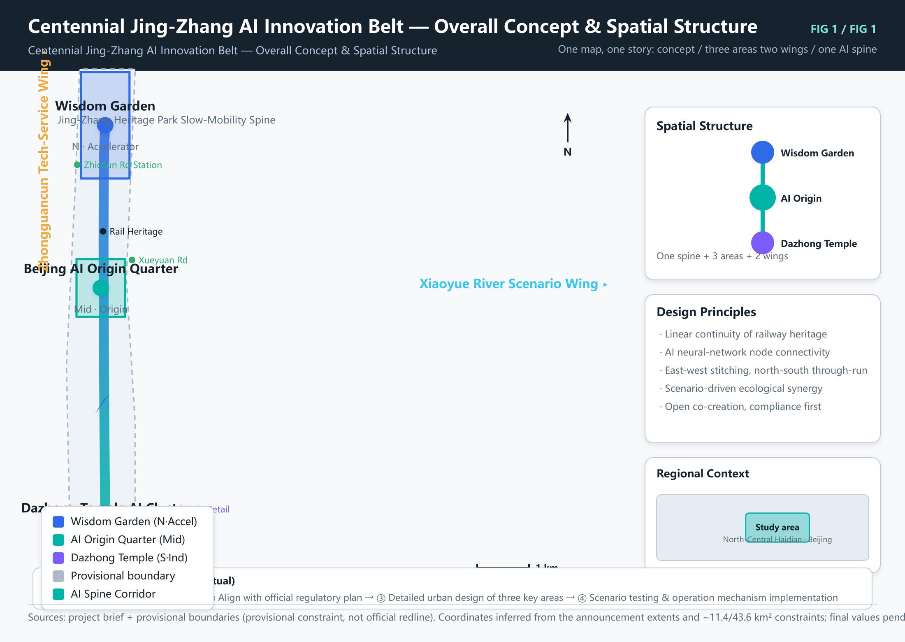
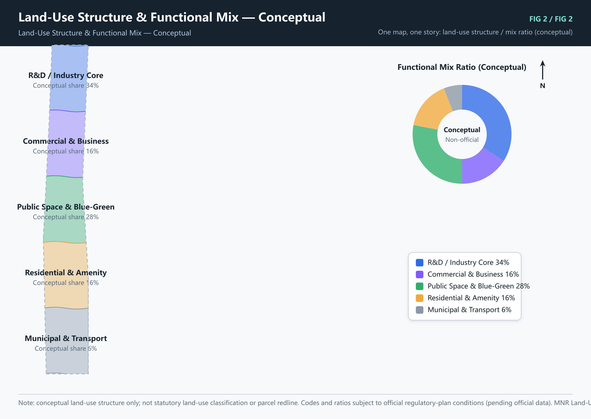
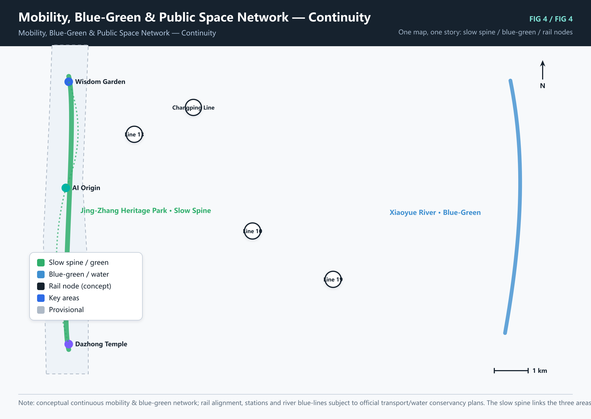
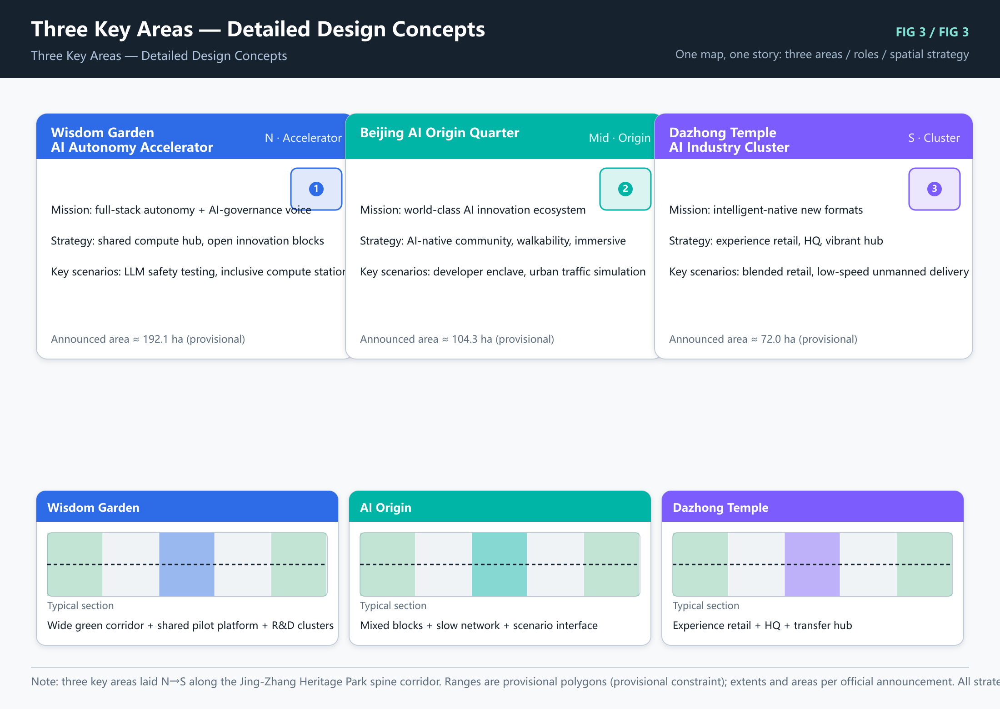
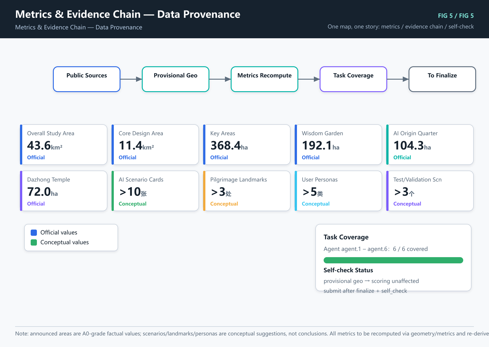

## I. Overall Concept & Naming System (agent.1)

The proposal is named Jing-Zhang AI Spine (京张智脉): taking the Centennial Jing-Zhang Railway heritage as a spine, it strings together AI innovation elements to form an intelligent innovation belt running through central-northern Haidian [source:SRC-2026-0518-AGENT-OPEN-CALL-TASKBOOK] [depth:overall_concept]. Under the main name, a Chinese-English naming system and a three-level identity system (belt — district — node) are established; visual identity takes "railway gauge + data flow" as its motif, avoiding unauthorized fonts, trademarks, or portraits [standard:STD-URBAN-DESIGN-GUIDE] [depth:overall_concept].

The overall spatial structure implements a "Three Areas + Two Wings" synergy loop: the three areas are Wisdom Garden AI Autonomy Accelerator, Beijing AI Origin Quarter, and Dazhong Temple AI Industry Cluster; the two wings are the Zhongguancun Tech-Service Wing and the Xiaoyue River Scenario-Empowerment Wing, forming an innovation synergy relationship along the slow-traffic skeleton of the Jing-Zhang Heritage Park [data:geometry/site_boundary.geojson#PROV-SITE-001] [metric:site_area]. All spatial landing proposals are conceptual and may be elaborated by professional teams [source:SRC-2026-0518-AGENT-OPEN-CALL-TASKBOOK].

*Caption: Fig 1 Overall scope and Three Areas + Two Wings structure (provisional boundary, not official redline)*

## II. Full-Stack AI Autonomous Innovation & World-Class Innovation Ecosystem (agent.2)

Benchmarking 5–8 global AI innovation ecosystems (e.g., Silicon Valley, Tel Aviv, Shenzhen Nanshan, Zhongguancun, Cambridge, Toronto MaRS), we form a six-element ecosystem map of R&D — compute — data — scenarios — capital — talent [depth:ai_ecosystem]. Wisdom Garden carries the full-stack autonomous system, Beijing AI Origin Quarter fosters an open innovation ecosystem, and the Zhongguancun Tech-Service Wing enables global IP and capital allocation [source:SRC-2026-BJ-KW-THREE-AREAS-WINGS]. Eight mechanisms—land, space, industry, capital, talent, compute, data, and scenarios—are organized as a synergy loop, without fabricating company lists, investment amounts, or fiscal commitments [standard:STD-URBAN-DESIGN-GUIDE].

*Caption: Fig 2 Conceptual land-use structure & innovation-ecology zoning (provisional boundary)*

## III. AI+ Scenario Empowerment Paradigm & Intelligent Vibrant City (agent.3)

We develop no fewer than 10 AI scenario cards (e.g., AI guide, accessible companion, low-carbon energy management, community health assistant, developer sandbox, heritage AR narrative, smart parking, green-corridor patrol, generative public art, emergency companion), including no fewer than 3 industry test/validation scenarios (autonomous shuttle testing, robot delivery validation, AI security patrol) [depth:scenario_cards]. User personas cover no fewer than 5 types: AI developers, university researchers, residents, visitors, and operators; scenario-space-operation mapping lands on the Xiaoyue River Scenario-Empowerment Wing and public experience paths [data:geometry/land_use.geojson#GIC]. All scenarios include human-in-the-loop boundaries and privacy protection, avoiding excessive surveillance and not describing immature technologies as fully deployed [standard:STD-AI-ETHICS] [depth:scenario_cards].

*Caption: Fig 3 Slow-traffic skeleton, blue-green network & scenario-empowerment wings*

## IV. AI Public Space, Intelligent-Native New Formats & Pilgrimage Landmarks (agent.4)

AI public space in the Jing-Zhang Heritage Park follows an "east-west stitching, north-south through-run" strategy, organizing continuous slow-traffic and public-experience interfaces along the heritage park [standard:STD-WALK-CYCLE] [standard:STD-GREEN]. The Dazhong Temple district lays out intelligent-native consumption and business scenarios, respecting heritage conservation, green space, blue-line, and traffic-safety constraints, without arbitrarily altering enterprise buildings or property spaces [depth:public_space_landmarks]. No fewer than 3 AI pilgrimage landmarks are proposed: Gate of AI Origin, Core of Compute, and Wisdom Cloud Hall, avoiding excessive entertainment or vulgarization [data:geometry/key_areas.geojson#PROV-KEY-001] [data:geometry/key_areas.geojson#PROV-KEY-003].

*Caption: Fig 4 Detailed design of three key areas (provisional extents)*

## V. Cultural Narrative: Centennial Jing-Zhang, Zhongguancun & AI New Culture (agent.5)

Taking Jing-Zhang Railway historical and cultural resources as the narrative thread, we integrate Zhongguancun innovation culture and AI new culture to form a spatial cultural system and a signage, identity, and symbol system [standard:STD-HERITAGE]. International communication narratives emphasize "real site, open co-creation, conceptual proposal", without distorting history, reducing culture to mere tech decoration, or confusing cultural identity with the overall belt logo [depth:culture_narrative].

## VI. Global AI Innovation Event System & Long-term Operation (agent.6)

We design an annual event system (AI Innovation Week, Developer Conference, Heritage Park Public Art Season) and an event brand/communication visual system; establish developer community operation, AI scenario open-operation, and talent-enterprise-developer conversion paths [depth:operation_mechanism]. All activities are proposed mechanisms, without exaggerating government commitments or effects, and without definite promises on investment attraction, policy, or funding [source:SRC-2026-0518-AGENT-OPEN-CALL-TASKBOOK].

## VII. Metrics & Evidence Summary

Core metrics are in metrics.json: overall design area approx. 11.4 million m² (official announced figure); the three key areas total approx. 368.4 ha (192.1 / 104.3 / 72.0 ha) [metric:site_area] [metric:key_detailed_design_area_areas]. Floor-area ratio, building height, total floor area, and building density are prohibited final conclusions, marked unknown, and left to statutory planning [metric:total_floor_area]. Land areas are recomputed by conceptual zone from geometry/land_use.geojson [metric:land_use_area_by_code].

*Caption: Fig 5 Metrics, evidence chain & six-task coverage self-check*

## VIII. Data, Assumptions & Compliance Statement

All geometry consists of provisional rough polygons (PROV-*), not official redlines, to be replaced and recomputed once official data is available [assumption:ASM-1] [assumption:ASM-2]. This proposal is an open co-creation conceptual proposal, not a substitute for statutory planning, and does not constitute a government-approved conclusion; it respects public-source boundaries and copyright requirements [source:SRC-2026-0518-AGENT-OPEN-CALL-TASKBOOK].
