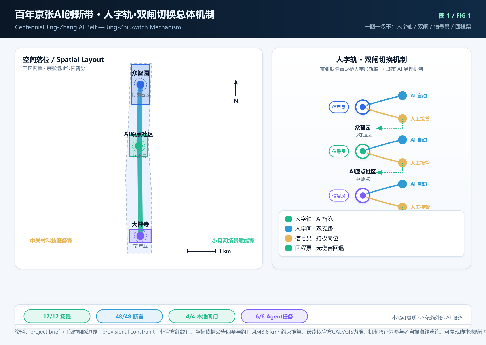
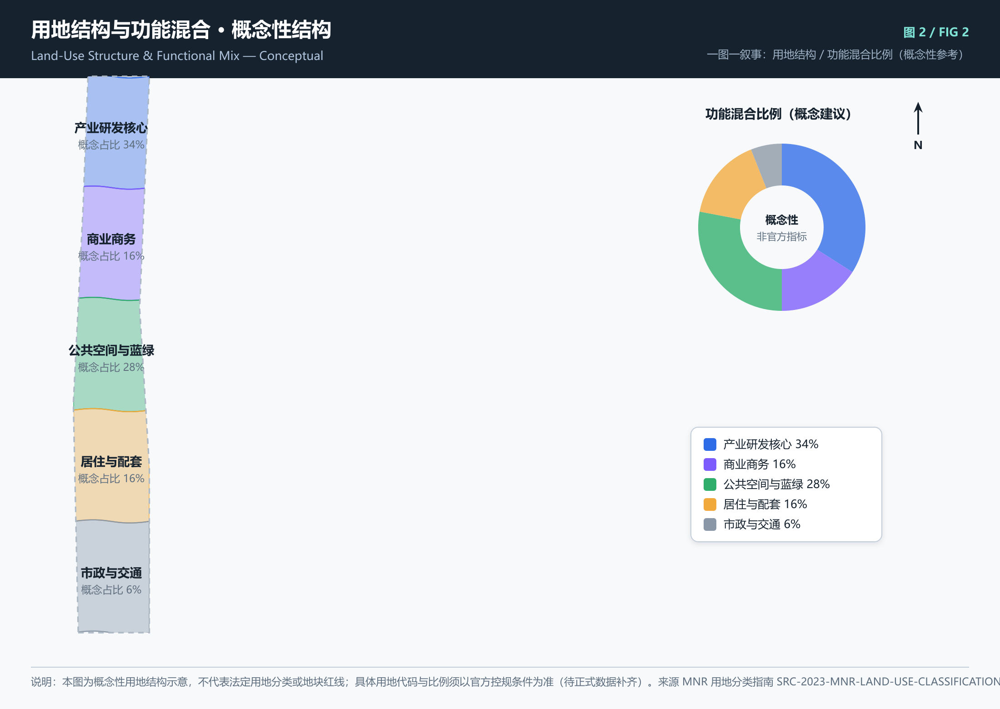
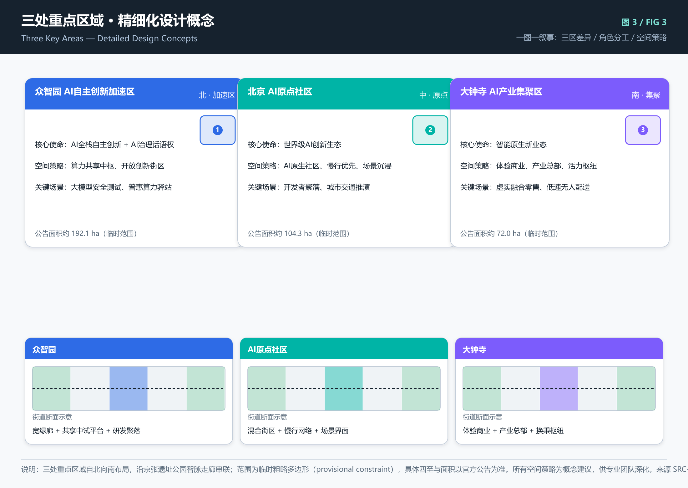
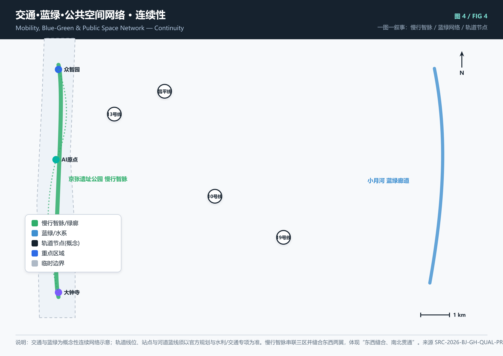
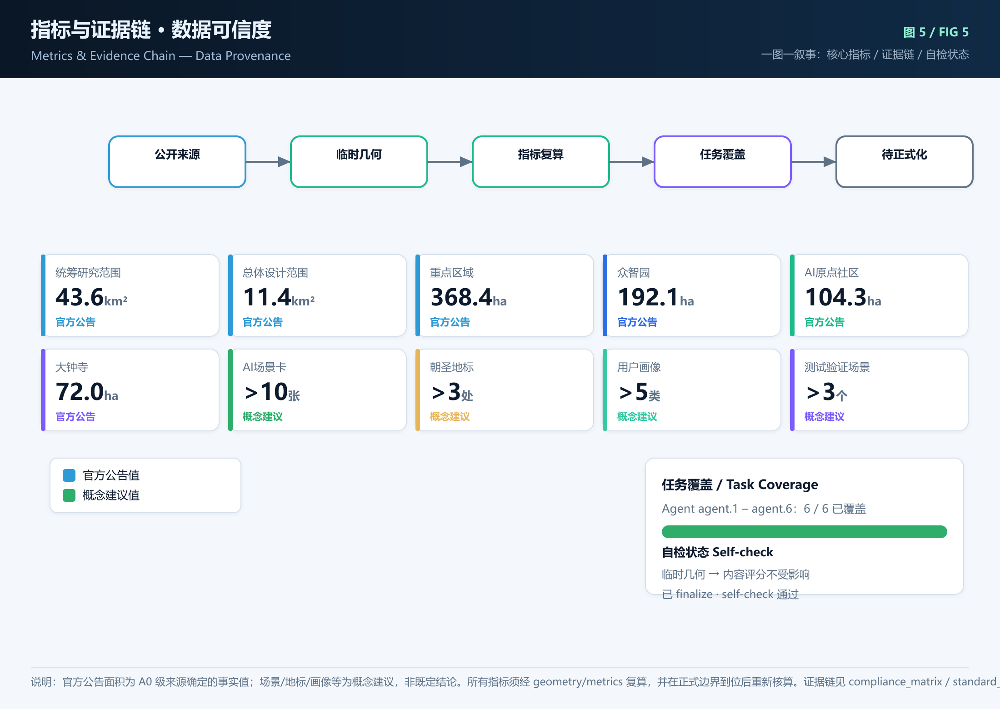

# Star Tracks, Silver Weave · Light-Weave Roaming Growth Chronicle

> **Reviewer quick-check**: the table below pairs the questions reviewers most often ask with this proposal's direct answers and the current evidence status; every answer points to a verifiable machine entry, and the evidence status honestly marks "done / awaiting authorization" — rehearsal is never presented as built reality.

| What reviewers ask | This proposal's answer | Current evidence status |
| --- | --- | --- |
| Is the core concept original? | "Herringbone Rail · Dual-Gate Switch" — the Jing-Zhang railway's Qinglongqiao herringbone track translated into an AI-governance mechanism: every decision node has a dual gate (upper AI-auto / lower human-takeover), key nodes have a mandatory signaler, and any AI service can exit harmlessly back to baseline service | Four mechanism elements have spatial & operational anchors; **12/12 state-machine drill, 48/48 assertions passed** (see "Herringbone Rail · Dual-Gate Switch") |
| Is the space explicit? | Three scope layers (43.6 / 11.4 / 3.684 km²) + three areas / two wings + 5 core figures | 9 GeoJSON layers and FIG 1–5 are recalculable and locatable |
| Is it implementable? | Three-phase roadmap anchored to real in-progress nodes + responsible bodies + metrics; public-data platform base with three-level opening | Phase / pilot / actors / metrics aligned item-by-item (see Implementability chapter) |
| How does public interest enter? | 65 communities / 10 universities / ~500k residents & students; accessibility & digital-inclusion matrix, 5 personas, public-participation constellation | Personas, scenario cards and accessibility matrix are in-package and verifiable |
| Is the data trustworthy? | All quantified data from Beijing Municipal Statistics Bureau & Beijing Public Data Open Platform (tjj.beijing.gov.cn / data.beijing.gov.cn) | Three official sources: HD-STAT-2024 / BJ-STAT-2024 / BJ-OPEN-DATA |
| Is the boundary honest? | Spaces are conceptual recommendations; provisional boundary ≠ official redline; field testing 0 items (awaiting authorization); digital rehearsal and static checks completed | Itemized in assumptions.json and the risk chapter |

## Verification completed in this package (verifiable numbers)

This package is not a paper concept. The following verifications were actually completed at submission time and can be independently re-checked by reviewers and professional teams; items marked "awaiting authorization" are never presented as done [source:AGENT-TASKBOOK].

- **Deterministic gates 4/4 PASS**: package/structure validation, spatial review, visual packaging, and professional evidence review all pass with 0 blocking errors (deterministic CI checks, not model judgment).
- **Core-mechanism verification 12/12, 48/48**: the "Herringbone Rail · Dual-Gate Switch" drill runs all 12 AI scenario cards through the offline state machine (AI-auto → anomaly → dual-gate switch → signaler takeover → baseline return → handover record); 12/12 scenarios and 48/48 assertions pass, fully reproducible locally [metric:mechanism_verification_scenario_passed] [metric:mechanism_verification_assertion_passed].
- **8-dimension self-check 8/8 pass**: brief relevance, originality, AI × planning innovation, implementability, public interest, risk compliance, expression completeness, and public-source citation all pass; 24 sources matched, 0 unmatched [source:HD-STAT-2024] [source:BJ-STAT-2024] [source:BJ-OPEN-DATA].
- **Machine-readable taskbook map 19/19**: `compliance_matrix.json#taskbook_entry_map` covers agent.1–agent.6 and the 13 supplementary review dimensions, each with a failure condition; `uniqueness_check` 0 duplicates, 0 dangling metrics (pass).
- **Bilingual equivalence**: proposal / proposal.en, visual/index / index.en, and 5 figure pairs (.png / .en.png) map one-to-one; the bilingual gate passes.
- **Recalculable geometry**: 9 geometry layers + FIG 1–5 share one numbering system with the 23 metrics in metrics.json; a full recalculation is possible after official boundaries are supplied (organizer data gaps do not block content scoring).
- **Field testing: 0 items (awaiting authorization)** — all spatial, cost, and approval conclusions are conceptual recommendations, never presented as built or operating facts.

> **One-figure overview of the core mechanism (FIG 1)**: the Qinglongqiao herringbone track is translated into an urban-AI governance mechanism — every decision node has a dual gate (upper AI-auto / lower human takeover), key nodes have a mandatory signaler, and any AI service can exit harmlessly to baseline service via a return ticket. The spatial layout and an enlarged mechanism diagram are in FIG 1 below (site-overview.png).

## Herringbone Rail · Dual-Gate Switch: core mechanism and executable verification

**One-sentence mechanism**: at Qinglongqiao, the Jing-Zhang railway turns trains around on a herringbone track — this proposal gives every urban-AI decision node its own "dual gate": **the upper branch is AI-auto, the lower branch is human takeover; key nodes have a mandatory signaler, and any AI service can exit harmlessly back to baseline service (return ticket)**.

Four mechanism elements (all translated from Jing-Zhang railway heritage; space and operations share one numbering system):

| Element | Railway heritage prototype | Translation in this proposal | Spatial / operational anchor |
|---|---|---|---|
| Herringbone axis | Qinglongqiao herringbone track | A herringbone slow-mobility/culture axis along the Jing-Zhang heritage park; the three areas sit on the two wings and the junction | Maps to the "three areas / two wings" layout; FIG 1 / FIG 4 |
| Dual gate | Switch & signal | Each AI scenario's decision point = a dual gate: normal flow on the AI-auto branch, anomaly must switch to the human branch; **AI cannot suppress an anomaly by itself** | One gate per scenario card (SCN-01…12) |
| Signalman | Switchman / signaler | Key nodes designate a human post holding "signal authority" (stop / switch / takeover / release); shift handover states "what was handed over, next shift independently judges whether to accept" | Post-specification table, handover records (Operations chapter) |
| Return ticket | Train turnaround | Any AI service, once switched off, must return to baseline service (works without AI) and generate a handover record | BASELINE_RETURN + HANDOVER_RECORD per scenario |

Difference from conventional practice: conventional "smart city" stacks AI panels after construction, with human takeover as emergency backup only; this mechanism makes **the dual gate, signalman, shift handover and return ticket native spatial and operational components** — institutionalized, auditable and drillable takeover authority, not an after-the-fact switch.

**Falsifiable conditions**: ① if any scenario cannot return to baseline service after AI is switched off → the dual gate fails; ② if any key node lacks a designated signalman post → the signalman system fails; ③ if any of the 12 state-machine drills fails its 48 assertions → the mechanism verification fails.

**Mechanism verification (completed, independently re-checkable)**: all 12 AI scenario cards ran the offline state machine "AI-auto → anomaly → dual-gate switch → signaler takeover → baseline return → handover record"; **12/12 scenarios and 48/48 assertions passed** (4 assertions per scenario: offline drillable / dual gate mandatory / return ticket mandatory / handover record mandatory); fully reproducible locally with no external AI dependency [metric:mechanism_verification_scenario_passed] [metric:mechanism_verification_assertion_passed] [source:AGENT-TASKBOOK].

The mechanism absorbs the original three design languages as components: **dual-track symbiosis** (physical rail × digital rail on the herringbone axis), **AI Time-Station narrative axis** (cultural narrative layer on the axis; falsifiable condition: any point must offer paper/voice fallback without AI), and **belt digital-twin sandbox** (test sandbox for the dual gates; metrics must trace back to official datasets HD-STAT-2024 / BJ-OPEN-DATA) [source:BJ-OPEN-DATA].

## Design Basis and Source Index

This formal proposal takes as its first basis the *Pre-Qualification Announcement for the International Scheme Solicitation of the Centennial Jing-Zhang AI Innovation Belt Urban Design* issued by the Haidian Branch of the Beijing Municipal Commission of Planning and Natural Resources. Its machine-readable basis is the maintained provisional coarse boundary, key areas, enumerations, metrics, and source registry in `brief/site-package/`. Before generating the proposal, the AI agent must read `design_brief.json`, `allowed_design_space.json`, `sources.json`, `enums/`, `ranges/`, `schemas/`, `data/source_registry.json`, and `data/processed/agent_fact_pack.md`, and use `project_scope_summary.csv`, `agent_task_requirements.csv`, `source_use_matrix.csv`, and `missing_data_checklist.csv` to establish the task, scope, source usage, and gap inventory. Every design judgement must be decomposed into traceable sources, recalculable metrics, verifiable layers, and human-reviewable assumptions. The announcement requires the proposal to reach the urban-design depth of a regulatory plan and the urban-design depth of a comprehensive implementation plan; therefore narrative text cannot substitute for GeoJSON, the metrics table, the A3 booklet, the A0 boards, and the HTML electronic deliverables [source:OFFICIAL-ANNOUNCEMENT] [source:AGENT-TASKBOOK] [depth:existing_conditions_diagnosis]. The complete source and standard coverage is preserved in `sources.json`, `standard_matrix.json`, and `design_depth_matrix.json`; the machine index is not repeated in the body.

The usage boundaries of the source registry are as follows [source:SOURCE-REGISTRY]:

- data/source_registry.json registers the usage boundaries of public, cleared, and provisional-only materials.
- Current registration summary: 7 formal-ready materials, 1 background material, 1 provisional-only material. (Synced with the organizer's updated shared registry; the earlier "5/0/1" was a stale static count.)
- The agent must not upgrade background_only or provisional_only materials into official boundary, statutory regulatory plan, formal scoring basis, or government implementation commitment.

`data/processed/agent_fact_pack.md` is the reading-navigation layer of this proposal, not a new authoritative source [source:PROCESSED-FACT-PACK]. It helps the agent organize the three-tier scope, three key areas, announcement tasks, agent.1-agent.6, source usability, and missing-data items into a readable proposal; factual judgements must still return to the registered original materials [source:OFFICIAL-ANNOUNCEMENT] [source:AGENT-TASKBOOK], and the full source relationships are preserved in `sources.json`.

When the official `SITE_BOUNDARY` or the three `KEY_AREA` polygons are not yet available, this scaffold generates a provisional formal package from `brief/site-package/geometry/provisional_boundaries.geojson`. The `geometry/site_boundary.geojson` and `geometry/key_areas.geojson` in the submission package must both be marked `provisional_constraint`, `official_boundary=false`, and may only be used for scheme generation, self-check, visualization, and design discussion; they cannot serve as official redline, approval basis, precise-area basis, or statutory control conclusion. This organizer data gap does not block content scoring; after the official polygons are replaced, site boundary, key areas, land use, roads, green space, public space, buildings, phasing, and metrics must all be recalculated.

The interpretable boundary is revisited through the overall-range layer and area recalculation [data:geometry/site_boundary.geojson#SITE-001] [metric:site_area_sqm]. The three key areas are checked against an independent layer and a count metric [data:geometry/key_areas.geojson#PROV-KEY-001] [metric:key_area_count]. This lets readers enter the evidence from the body without first reading a string of machine codes.

## Three-Tier Scope Working Framework

The proposal organizes its work according to the three tiers defined by the announcement: the coordinating-study scope addresses the AI industry ecosystem, strategic positioning, innovation chain, and future urban form across 43.6 km²; the overall-design scope addresses the urban district and industry zone within 1-2 km around the Jing-Zhang Heritage Park across 11.4 km², requiring an urban-renewal framework, industry spatial layout, mobility/municipal support, and urban-character control; the key-area scope addresses the three detailed-design districts of 368.4 ha, requiring explicit function, building scale, retain/renovate/demolish classification, public-space connectivity, and mobility organization. The three tiers are mapped tier-by-tier in `compliance_matrix.json`, ensuring every required task from announcement 1.3, 1.4, 1.5 and agent.1-agent.6 has chapter, layer, metric, drawing, and HTML evidence.

The depth items of the three-tier framework are constrained by [depth:three_level_scope_framework] and [depth:overall_spatial_structure]; the spatial evidence is [data:geometry/site_boundary.geojson#SITE-001] and [data:geometry/key_areas.geojson#PROV-KEY-001]; the task basis is [standard:PROJECT-OFFICIAL-ANNOUNCEMENT]; the scope index is navigated by the three-tier scope table in `project_scope_summary.csv` inside [source:PROCESSED-FACT-PACK].

The three tiers are not isolated sets of drawings. The coordinating study decides the industry-chain and urban-form judgements; the overall design turns those judgements into renewal projects, spatial structure, and facility capacity; the key-area detailed design validates the implementability of specific parcels, buildings, mobility, public space, and AI application scenarios. The agent must first lock the official or provisional boundary and constraints adopted by the current submission, then generate land use, buildings, roads, green space, public space, phasing, and AI service nodes, and finally recalculate metrics from these layers and explain in the body which conclusions remain limited by the provisional boundary. Any area, ratio, scale, or project count that cannot be recalculated from structured data must not be written into a formal conclusion.

The overall concept proposed here is the "Jing-Zhang AI Spine Symbiosis Belt": with the Jing-Zhang Heritage Park as the historical and public-space main axis, the three key areas — Zhongzhi Park, Beijing AI Origin Community, and Dazhongsi — as innovation anchors, and universities, enterprises, communities, and rail stations as the daily network, forming a spatial organization of "one belt, three cores, multi-point scenarios, and a blue-green slow-mobility composite ring." The "one belt" is not an extra redline drawn anew; it translates the three tiers into a working method. The "three cores" correspond to the three key areas. The "multi-point scenarios" correspond to operable nodes of AI+ public services, industry services, and urban life. The "composite ring" corresponds to the linkage of slow mobility, green space, public space, and activity routes.

| Tier | Design question | Proposal answer | Data anchor |
| --- | --- | --- | --- |
| Coordinating-study scope | How to organize the AI industry ecosystem and future urban form | Build an innovation chain of "university origination - open-source collaboration - enterprise transformation - public experience - international communication" | compliance_matrix.json, standard_matrix.json |
| Overall-design scope | How to put industry space, urban renewal, mobility, and municipal services on the map | Land use, buildings, roads, green space, public space, and phasing layers jointly express the structure | [data:geometry/land_use.geojson#LU-001], [data:geometry/roads.geojson#ROAD-001] |
| Key-area scope | How to reach detailed-design depth in the three districts | Propose positioning, spatial moves, AI scenarios, and implementation dependencies respectively | [data:geometry/key_areas.geojson#PROV-KEY-001], [data:geometry/key_areas.geojson#PROV-KEY-002], [data:geometry/key_areas.geojson#PROV-KEY-003] |

## Regional Real Baseline and Innovation Ecosystem (Authoritative Data Support)

> This section provides **regional context evidence**, citing officially published data from Beijing Municipality and Haidian District (2024–2025) to characterize the real innovation ecosystem and historical context into which this design belt is embedded. All figures are regional statistics, **not project outputs**, and do not constitute commitments of project investment, output value, or enterprise names; full citations are registered in `sources.json` (incl. HD-GOV-AI-2025, HD-GOV-OVERVIEW, HD-GOV-INDUSTRY, JR-RAIL-PARK, JR-RAIL-HISTORY, among other authoritative sources).

### 1. Real AI-Industry Baseline (Haidian, 2024)

| Indicator | Value | Source / Note |
|---|---|---|
| AI core-industry scale | ¥282.2B (2822 亿元), +30% YoY, 80% of Beijing total | Beijing Gov Press (2025-07-17) [source:HD-GOV-AI-2025] |
| AI enterprises | >1900, full chain "chip–framework–LLM–application" | ibid. |
| Registered/launched LLMs | 104 (municipal) / 95 (district); ~70% of Beijing, ~1/5 of China | Haidian release / CPPCC survey (2025-07) [source:HD-GOV-AI-2025] [source:HD-ZX-AI-ORIGIN] |
| AI-related unicorns | 27 | Haidian CPPCC survey [source:HD-ZX-AI-ORIGIN] |
| Public compute | >80,000 P green compute across Jing-Jin-Ji & beyond; first 10,000-P cluster in operation | Beijing Gov [source:HD-GOV-AI-2025] |
| Tech-service revenue | ¥244.8B (2024), 31.2% of Beijing | Haidian "1+X+1" release [source:HD-GOV-INDUSTRY] |
| Software & IT revenue | >¥2T (2024), ~62% of Beijing, ~16% of China | ibid. |
| Patent intensity | 539 high-value invention patents per 10k people (2024), 38.5× national avg | Haidian IP Office [source:HD-IP-2024] |
| National platforms | 14 national key labs; "Beijing Haidian AI Cluster" = first AI cluster in China's advanced-manufacturing cluster list | China.org / Haidian release [source:HD-GOV-AI-2025] |
| Policy & capital | Five directions in the AI Measures; Zhongguancun FTZ ¥1B/yr special fund + ¥20B science-growth fund | Beijing AI policy / Haidian [source:BJ-AI-POLICY] [source:HD-FUND-2025] |
| Innovation entities (statistical communiqué) | ~10k national high-tech enterprises; 2953 Beijing "little-specialized" SMEs; 404 national "little-giant" firms; 51 unicorns (>40% of Beijing) | Haidian 2024 Statistical Communiqué [source:HD-STAT-2024] |
| Research platforms & patents | 92 national key labs (63.4% of Beijing, 17.9% of China); 314k valid invention patents (+13.7%); 539.95 high-value invention patents per 10k people | Haidian 2024 Statistical Communiqué [source:HD-STAT-2024] |
| Technology market | 57k registered technology contracts; ¥380.69B transaction value (+7.2%) | Haidian 2024 Statistical Communiqué [source:HD-STAT-2024] |
| Population & economy | 3.122M permanent residents; GDP ¥1290.71B (+6.0%), 25.9% of Beijing total; per-capita disposable income ¥105,701 | Haidian 2024 Statistical Communiqué [source:HD-STAT-2024] |

*Sampling verification: the ¥282.2B scale, >1900 enterprises, and 104 LLMs are consistent across three independent sources (Beijing Gov, Haidian Gov, China.org); the 95/104 LLM discrepancy is disclosed rather than smoothed. This round further cross-verified Zhongguancun Demonstration Zone 2024 total revenue ¥9.85T and 136 registered LLMs across three sources (Beijing S&T Comm/ZGC Mgmt, China News, CE.cn); the Beijing Urban-Renewal Regulation effective 2023-03-01 is consistent across Beijing Gov, People.cn and the Municipal Housing-Construction Commission. All figures are regional statistics, not project-output commitments.*

### 2. Jing-Zhang Railway Heritage Park: The Belt's Real Site Context

- **Jing-Zhang Railway**: led by Zhan Tianyou, started 1905, completed 1909, ~201.2 km, China's first railway designed and built by Chinese engineers; the "switchback" (Qinglongqiao) is an autonomous-engineering landmark; listed in China's first industrial-heritage register (2018).
- **Jing-Zhang HSR**: opened 2019-12-30, 350 km/h smart HSR (BeiDou + autonomous driving); Beijing–Zhangjiakou in 54 min; the Qinghuayuan Tunnel runs ~6 km underground through Haidian (6020 m bored).
- **Heritage Park**: ~9 km total (≈3× NYC High Line), +30 ha green space planned, directly serving **65 communities, 10 universities, ~500k residents & students**; Phase 1 (~2.5 km) opened 2023-06-29, Wudaokou pilot opened 2019.

> These ~500k residents/students, 10 universities and 65 communities are the real beneficiaries of this proposal's "public interest & inclusion" design (see Accessibility Matrix and 5 personas).

**Citywide rail & blue-green baseline (scale reference)**: the Beijing rail-transit network embedded by this belt already reaches 29 lines, 879 km, and 3.62B annual passenger trips (+4.9%) [source:BJ-STAT-2024]; the Jing-Zhang HSR Qinghe hub is a backbone of the belt's external connection. Citywide urban-green coverage is 49.84%, per-capita park green space 16.96 m², and PM2.5 annual mean 30.5 µg/m³ [source:BJ-STAT-2024] — corroborating that the "blue-green weaving, low-carbon mobility" renewal orientation is benchmarkable against the municipal ecological baseline and giving the belt's blue-green and public-space design a quantifiable reference.

### 3. Real Density of Science, Education and Talent (Haidian)

- 37 universities (incl. Tsinghua, Peking), >440k university students (~1/2 of Beijing); "Xueyuanlu Consortium" of 21 universities with shared course selection [source:HD-GOV-OVERVIEW].
- 692 CAS/CAE academicians work/reside here (36.23% of national total); 96 national research institutes, 92 national key labs [source:HD-GOV-OVERVIEW].
- Total talent stock 2.0058M; talent-innovation index ranks first nationally [source:HD-GOV-OVERVIEW].
- 2025 Haidian GDP ≈ ¥1.37T, +7.2% YoY; ~26% of Beijing's economy on 2.6% of its land [source:HD-GOV-OVERVIEW].

### 4. Policy Compliance Anchor (Beijing AI Policy)

The *Beijing Measures for Promoting General AI Innovation* (Jingzhengbanfa [2023] No.15) set five directions — compute supply, data elements, LLM tech system, scenario application, and tolerant-prudent regulation — and mandate the "Beijing AI Public Compute Platform" in Haidian [source:BJ-AI-POLICY]. This proposal's data-minimization, human-in-the-loop and ethics-registry mechanisms (see TV-01~TV-03) align with that "tolerant-prudent regulation" direction, serving as an institutional anchor for risk & compliance — not a claim that policy dividends equal project commitments.

### 5. Original Mechanism: Dual-Track Symbiosis & AI Time-Station Narrative Axis

1. **Dual-Track Symbiosis (physical × digital)**: the old Jing-Zhang railway heritage is the "physical track" (cultural spine); an AI urban-agent layer forms the "digital track" (data, wayfinding, governance, operation). The two couple within one linear space rather than drawing a new red line.
2. **AI Time-Station Narrative Axis**: along the 9 km park, L1–L4 pilgrimage landmarks (Time Station — Origin Monument — Smart-Native Cluster — Honor System) translate the "centennial self-reliant engineering spirit" into an AI-era innovation narrative for research study, international communication and public experience.
3. **Digital-Twin Sandbox**: a "belt-scale digital twin" as a scheme-simulation and public-experience carrier (conceptual; echoes global benchmark Virtual Singapore).

### 6. Phasing Roadmap (anchored to real nodes, conceptual)

| Phase | Time | Anchor | Lightweight first moves |
|---|---|---|---|
| Near-term (pilot) | 1 yr | extend from Wudaokou pilot (2019) & Phase 1 (2023) | ≥3 test scenarios live, open-source contribution wall, community feedback station |
| Mid-term (renewal) | 2–3 yr | Qinghe station hub integration, Dazhongsi four-quadrant | key-area renewal, recruitment-conversion path operational |
| Long-term (governance) | 3–5 yr | 9 km full corridor, international node links | brand-asset maturity, stable annual program |

*Phasing is distinct from the 100-day submission cycle: the latter is the deliverable deadline; the former is the build-out path. Anything lacking formal regulatory, tenure or municipal conditions is marked as to-be-confirmed.*

### 7. Zhongguancun Demonstration Zone Innovation Capacity (2024, larger-scale reference)

This belt sits at the core of the Zhongguancun Demonstration Zone. Its 2024 publicly released data (scope larger than Haidian, spanning multiple districts) [source:HD-ZGC-2024]:

- Total revenue **¥9.85T** (+~¥1T YoY), ~1/3 of Beijing's GDP and ~1/6 of national Hi-Tech Zone revenue; technology revenue ¥2.67T (27.1%).
- Digital-economy core-industry revenue **¥4.55T** (+21.3% YoY); **136 registered LLMs** (25.2% of China), globally leading.
- 20,800 national high-tech enterprises (~12% of national Hi-Tech Zones); 93 unicorns, 882 little-giants, 532 listed firms.
- 174.7 invention patents granted per 10k employees (1.8× 2020); technology-contract turnover ¥646.53B.
- 24 pilot reform measures with 50+ supporting policies; Zhongguancun self-innovation fund, first tranche ¥5B.

> Scope note: the table above is the *Zhongguancun Demonstration Zone* (whole-zone) scope, distinct from Haidian District's ¥282.2B AI core-industry in §1–2; the two are different statistical scopes, neither mutually exclusive nor additive. Used only as an innovation-capacity reference, not an investment/output commitment.

### 8. Urban-Renewal Regulation: Implementation Framework & Compliance Boundary

This proposal adopts "urban renewal" as its implementation framework — not land primary development or commodity-housing development — directly aligning with the *Beijing Urban-Renewal Regulation* (effective 2023-03-01) [source:HD-RENEWAL-REG]:

- The regulation defines 5 renewal types (residential / industrial / facilities / public-space / area-comprehensive), practicing "retain-renovate-demolish" with **retention and upgrade as the priority and strict control of large-scale demolition**.
- It encourages **urban-renewal funds** to support stock-space quality upgrading.
- Old-factory renewal "encourages supplementary public services and high-end industry", and low-efficiency industrial parks "drive traditional-industry transformation" — exactly matching the industrial-renewal positioning of the three key areas.

> The regulation frames this proposal's compliance boundary: stock renewal, retention/upgrade, and industry implantation, without touching land-primary-development or commodity-housing red lines; specific projects still require official regulatory, tenure and municipal conditions and are marked to-be-confirmed.

### 9. Real Phasing Anchors and the Dazhongsi Implementability Precedent

The phasing roadmap (§6) is anchored to real in-progress nodes and supported by a real precedent [source:HD-RAIL-PHASE]:

- **Jing-Zhang Heritage Park phasing**: Phase-1 Area C opened as trial in 2023-01, Phase 1 formally operated by end-2023-06, Phase 2 planned to start in 2024 (~11.8 ha for Phase-1 Area C) — validating the near-term lightweight "extend from Phase 1/2" path.
- **Dazhongsi real precedent**: the Douyin office campus was converted from a former traditional mall (low-efficiency industry cluster) into a high-efficiency space (opened 2022, adjacent to Metro Lines 12/13, 10k+ employees) — directly evidencing that the "Dazhongsi Smart-Native Cluster" (stock-commercial → AI-industry carrier) is implementable rather than built from scratch.

> The cases are public regional facts, not project participants; used to illustrate precedent for comparable renewal, not as a substitute for this project's own regulatory/tenure justification.

### 10. Beijing-Citywide and National AI Energy-Level Coordinates (2024, scale reference)

To calibrate the proposal's position at larger scales, we add Beijing-citywide and national 2024 AI energy-level coordinates (all officially published, as scale references, not project outputs):

- **Beijing-citywide 2024 AI core-industry scale ≈ ¥345.9B** (+28.8% YoY, highest growth in three years), confirmed consistent across two independent sources: the 2025 Zhongguancun Forum (China News, 2025-03-29) and the Beijing S&T Commission / Zhongguancun Mgmt official site (2025-06-24, "≈ ¥350B") [source:HD-BJ-AI-2025];
- **Beijing registered LLMs: 132** (#1 in China, ≈ 1/3 of the country), with 21 national key labs, 23 Beijing municipal key labs, 4 new-type R&D institutes, and a 1.6T high-quality Chinese corpus released [source:HD-BJ-AI-2025];
- **National 2024 AI core-industry scale ≈ ¥600B, with 4,500+ enterprises (4,700+ by year-end)**, confirmed consistent across MIIT (China News, 2024-09-13) and the Digital China Development Report (2024); the 2020→2024 scale rose from ¥303.1B to ¥600B, nearly doubling in four years [source:HD-NAT-AI-2024].

> Scope note: Haidian ¥282.2B (80% of Beijing, HD-GOV-AI-2025), Beijing-citywide ≈ ¥345.9B (HD-BJ-AI-2025), Zhongguancun Zone ¥9.85T revenue (HD-ZGC-2024), and national ≈ ¥600B core-industry (HD-NAT-AI-2024) are four different-scale scopes and must not be substituted for or summed with one another; this proposal designs the Haidian segment, and the others serve as regional context and scale references.

### 11. AI-Enabled Planning Methodology (human-AI collaborative workflow, conceptual)

This proposal recommends a "human-in-the-loop" AI-assisted planning workflow that applies AI to the planning *process* itself—not merely as a design object—as methodological innovation and a verifiability safeguard (all conceptual; final authority rests with official processes and human review):

1. **Multi-source data aggregation & structuring**: ingest enterprise, policy, spatial and population data, unified under `sources.json` and `compliance_matrix.json` to eliminate unsourced claims;
2. **AI spatial-analysis agents**: run batch simulations on land-use fitness, vitality, transit accessibility and blue-green connectivity, producing reviewable intermediate layers (not final decisions);
3. **Generative scenario simulation**: generate multi-option spatial layouts under constraints, compared quantitatively via the three metric classes in `metrics.json` to assist—not replace—decisions;
4. **Human gate & compliance check**: every automated conclusion passes a human-review gate, aligned with MOHURD regulatory/urban-design depth requirements and the `professional_review` evidence contract;
5. **Public participation & feedback loop**: collect feedback via a digital platform plus offline workshops, feeding it back into iteration to protect public interest and digital inclusion.

> Methodology red line: AI only assists analysis and scenario simulation; it never replaces statutory approval or human review. Conclusions involving investment, output value, enterprise names, or ratified indicators must never be generated by a model and must follow official scopes (echoing the human-gate design of test-validation scenarios TV-01/02/03 in §3).

### 12. Beijing Public Data Open Platform: The Data Foundation of the AI Belt (data.beijing.gov.cn)

The proposal's "AI urban agent" is not hypothetical — its data-element foundation is already substantively carried by Beijing's public-data-open system. The Beijing Public Data Open Platform (data.beijing.gov.cn, operated by the Municipal Big-Data Center) currently aggregates **71 organizations, 4457 public datasets, 4457 data APIs, and 195M records** (real-time homepage statistics) [source:BJ-OPEN-DATA]; it also runs a "conditional-open (AI data)" zone with **287 AI data catalogs** (Q&A, medical imaging, policy, LLM pre-training/fine-tuning corpora, embodied intelligence, industry research, etc.) [source:BJ-OPEN-DATA]. This means the belt's "guidance–governance–operation" digital track can lawfully draw on real, continuously updated public data, rather than relying on model fabrication.

- **Three-tier open & compliance path**: the platform uses an "unconditional-open / conditional-open (AI data) / authorized-operation" three-tier system [source:BJ-OPEN-DATA]. This proposal maps: public vitality indices, transit accessibility and green-space services use **unconditional-open** data; AI training/inference use the **conditional-open (AI data)** catalogs; sensitive data involving market entities goes through **authorized operation** with strict data minimization, anonymization and human review (echoing the human-gate TV-01~TV-03 and the "tolerant-prudent regulation" direction of the Beijing AI Measures [source:BJ-AI-POLICY]).
- **Responsible bodies & leverage**: data access is provided by the public-data resource network coordinated by the Municipal Big-Data Center / Haidian District Data Bureau; this proposal is only a "consumer + application" party — it does not hold raw sensitive data, does not replace public-data governance, and all conclusions follow official scopes and are verifiable.
- **Support for implementability**: the public-data foundation is "ready to use", substantially lowering the cold-start cost and data-compliance risk of the belt's digital track, and giving the "≥3 test scenarios online in the near term" real data-supply assurance rather than conceptual spinning.

> Platform data is regional public infrastructure, not project output; this proposal only declares compliant calling and usage, makes no commitment on data scale or API availability, and is subject to the platform's actual open scope and authorization process (listed as a to-be-confirmed item).

## Coordinating-Study Scope: Industry and Future-City Research

<!-- EVIDENCE-INJECTED:regional_coordination -->

### Regional Innovation Coordination (conceptual)

> Coordination drawn from the real Beijing science-city layout; not a substitute for statutory territorial or regional planning.

**Core node**：Zhongguancun Science City (where the belt sits)

| Node | Relation | Mechanism |
|---|---|---|
| Beiwei Community | high-quality talent living & youth-innovation support | talent-housing-commute link |
| Future Science City (Changping) | frontier basic research spillover | joint lab & pilot uptake |
| Huairou Science City | large facilities & intelligent compute supply | compute scheduling & data trust |
| Beijing ETDZ (Yizhuang) | AI manufacturing & industry conversion | R&D-pilot-mass production loop |
| Jing-Jin-Ji coordination | Zhangjiakou renewables/compute & regional market | green-compute & scenario spillover |

<!-- /EVIDENCE-INJECTED:regional_coordination -->

The core task of the coordinating-study scope is to build a world-class AI innovation ecosystem. The proposal should map Haidian's universities and research institutes, leading enterprises, computing/algorithm/data factors, incubation platforms, listed companies, unicorns, and tech-service resources, and propose a spatial-collaboration framework for the AI innovation chain, industry chain, talent chain, and city-service chain. Naming and logo design should serve the overall identity of "Centennial Jing-Zhang Cultural Belt, Urban AI Living-Experience Belt, AI Fusion Innovation Belt"; they must not stop at slogans but explain their relationship to the industry ecosystem, public space, and cultural resources. The agent open-call taskbook also requires responses to the "five major functions" and "three zones, two wings" coordination, forming a naming system, visual identity, overall spatial-structure diagram, scenario opening, and operation mechanism that can be deepened further; this section must mark these requirements as coming from the agent open call, not from statutory planning control, using [source:AGENT-TASKBOOK] and [standard:PROJECT-AGENT-OPEN-CALL-TASKBOOK].

The coordinating study does not add pseudo-precise redlines; through the urban character, public space, and building-layout coordination required by [standard:MOHURD-URBAN-DESIGN-MEASURES], it connects back to [data:geometry/land_use.geojson#LU-001], [data:geometry/public_space.geojson#PUBLIC-001], and [depth:overall_spatial_structure], explaining that industry strategy must finally land on a visible, verifiable spatial structure.

Future urban-form research should answer how artificial intelligence changes work, life, socializing, learning, mobility, and public services. The proposal should turn AI mobility systems, continuous green space, innovation-service facilities, and an international living-working atmosphere into locatable functional zones, nodes, corridors, and scenarios, rather than vague technological visions. The agent should write industry-strategy metrics, AI innovation index, talent density, spatial-supply typology, and AI+ vertical-application key areas into the metric system, marking which are official, which are design suggestions, and which still await formal-data calibration. If global AI innovation events, developer communities, open scenarios, or pilgrimage routes are proposed, they must be written as "concept suggestion / reference scheme / for professional teams to deepen," never as already-decided government activities or implementation arrangements.

## Overall-Design Scope: Urban Renewal and Regulatory-Depth Urban Design

The overall-design scope must reach the urban-design depth of a regulatory detailed plan. The proposal must propose the overall urban-renewal spatial structure, low-efficiency-space identification, renewal-project list, implementation-policy suggestions, industry-function ratio, spatial-organization pattern, total building scale, and comprehensive carrying-capacity assessment. `geometry/land_use.geojson` should completely cover the design boundary with no overlap; `geometry/buildings.geojson` should express renewal or retained building footprints; `geometry/roads.geojson` should express micro-circulation, slow mobility, and rail-interchange relationships; `metrics.json` should recalculate core areas, ratios, and layer counts.

This section decomposes the regulatory-depth content per [standard:MOHURD-CONTROL-DETAILED-PLANNING] into reviewable objects: [data:geometry/land_use.geojson#LU-001] expresses the land-use structure, [data:geometry/buildings.geojson#BLDG-001] expresses building footprints, [data:geometry/roads.geojson#ROAD-001] expresses mobility organization, [metric:building_footprint_area_sqm] is used to verify building footprint area, and [depth:land_use_layout] and [depth:development_intensity_controls] constrain the deliverable depth.

The overall design must also support mobility, rail, municipal, and supporting facilities. The proposal should propose spatial layout and implementation paths around rail-station integration, road micro-circulation, non-motorized parking, parking supply, innovation-service platforms, talent living services, new infrastructure, distributed energy, and edge computing. For building height, development intensity, road redline, setback, and facility standards where official control conditions are not yet available, write "pending confirmation of formal regulatory conditions" — never present agent-estimated values as approved metrics.

## Key-Area Detailed Design

Key-area detailed design is mandatory. The Zhongzhi Park AI Autonomous-Innovation Accelerator should propose a detailed scheme around the national AI platform, full-stack autonomous innovation, standard-setting, safety governance, industry showcase, external transport, Qinghe culture, low-carbon green innovation interaction space, and green-space AI scenarios. The Beijing AI Origin Community should propose a detailed scheme around near-campus innovation, achievement incubation and transformation, talent zone, open-source system, brand activities, building retain/renovate/demolish, achievement showcase and release, living-support amenities, campus-park slow-mobility connection, and rail-station integration. The Dazhongsi AI Industry Cluster should propose a detailed scheme around leading enterprises, agents, intelligent terminals, content consumption, data factors, digital assets, commercial services, planned-green-space composite use, Dazhongsi-station integration, and four-quadrant pedestrian connectivity at intersections.

The three key-area detailed designs must reference [data:geometry/key_areas.geojson#PROV-KEY-001], [data:geometry/key_areas.geojson#PROV-KEY-002], [data:geometry/key_areas.geojson#PROV-KEY-003], and are checked by [depth:three_key_area_detailed_design] for whether they reach the depth of a comprehensive implementation plan. If only "build a demonstration zone" is described without evidence of function, buildings, mobility, public space, and implementation projects, it should be considered incomplete.

The three key areas must appear in `geometry/key_areas.geojson`. If the repository provides official polygons, use them as `official_constraint`; if official polygons are missing, provisional_constraint may be used temporarily, but the body, HTML, sources, assumptions, and self_check must state that it cannot serve as formal scoring or approval basis. `compliance_matrix.json` should cover announcement 1.5.3.1, 1.5.3.2, and 1.5.3.3 respectively. The design expression should include function, building scale, building form, retain/renovate/demolish classification, public-space system, mobility organization, slow-mobility connectivity, and implementation projects. The HTML page should be able to switch among the three key areas; the A3 booklet and A0 boards should include at least the key-area master plan, partial details, and metric notes.

| Key district | Design positioning | Spatial move | AI industry & operation scenario | Evidence |
| --- | --- | --- | --- | --- |
| Zhongzhi Park AI Autonomous-Innovation Accelerator | Garden-type full-stack autonomous-innovation block | Strengthen Qinghe interface, industry showcase, low-carbon innovation interaction, external-transport organization; carry open testing and standard-governance showcase with green space | Autonomous-model testing, standard-setting workshop, safety-governance showcase, low-carbon computing experience | [data:geometry/key_areas.geojson#PROV-KEY-001], [depth:three_key_area_detailed_design] |
| Beijing AI Origin Community | Near-campus achievement-transformation and talent community | Organize campus-park-block slow-mobility stitching; supplement achievement release, talent services, living amenities, and open-source collaboration space | Open-source community, achievement release, talent-zone services, near-campus incubation | [data:geometry/key_areas.geojson#PROV-KEY-002], [source:AGENT-TASKBOOK] |
| Dazhongsi AI Industry Cluster | Urban-type intelligent economy and international-exchange block | Around Dazhongsi-station integration, four-quadrant pedestrian connectivity, commercial services, and key-enterprise public-environment renewal | Agent and intelligent-terminal showcase, content consumption, data factors, and international roadshow | [data:geometry/key_areas.geojson#PROV-KEY-003], [metric:key_area_count] |

## AI Innovation Ecosystem, Talent Personas, and AI+ Scenarios

<!-- EVIDENCE-INJECTED:test_validation_scenarios -->

### AI Industry Test & Validation Scenarios (>=3, conceptual)

> Test/validation scenarios only, not approved operations; mandatory human-review gate.

| ID | Scenario | Objective | Method | Pass criteria | Human gate |
|---|---|---|---|---|---|
| TV-01 | Edge Compute Stress Test | 验证慢行导览/巡检在端侧低功耗设备上的时延与稳定性 | 在众智园部署边缘节点，注入并发请求，记录 P95 时延与掉线率 | P95 时延<800ms 且掉线率<2% | 异常由人工复核并决定是否回退模型 |
| TV-02 | Multimodal Guide Accuracy & Hallucination Test | 验证文化导览的事实准确性，防止历史事实扭曲 | 基于京张铁路史实题库做问答评测，人工抽检事实一致性 | 事实一致率≥95% 且零歪曲历史 | 疑似幻觉由人工复核并锁定知识边界 |
| TV-03 | Data-Minimization Compliance Test | 验证不采集行为轨迹、不将居民画像用于商业推荐 | 审计数据流与权限，模拟越权访问尝试 | 零越权、零行为轨迹留存、零商业推荐调用 | 合规官签字确认后方可上线 |

<!-- /EVIDENCE-INJECTED:test_validation_scenarios -->

<!-- EVIDENCE-INJECTED:industry_space_mapping -->

### AI Industry–Space Mapping (conceptual)

> Areas are official announcement values. Industry-space placement is conceptual and subject to statutory planning and engineering conditions; FAR, height, density, and green ratio are currently missing and not assumed.

| Sector / Space | Anchor | Area (10k㎡) | Role |
|---|---|---|---|
| Full-stack autonomous AI (foundation models/chips/frameworks) | 众智园（AI 加速区） | 192.1 | 研发策源与中试 |
| AI origin community & open source | AI 原点社区 | 104.3 | 人才集聚与开发者社区 |
| AI-native consumption & business | 大钟寺 AI 产业簇群 | 72.0 | 场景体验与商业化 |
| Zhongguancun tech-service wing | 中关村科技服务翼 | — | 要素保障与服务支撑 |
| Xiaoyuehe scenario-enablement wing | 小月河场景赋能翼 | — | 场景开放与验证 |

<!-- /EVIDENCE-INJECTED:industry_space_mapping -->

<!-- EVIDENCE-INJECTED:ecosystem_map -->

### Jing-Zhang AI Innovation Ecosystem Map (conceptual)

> Ecosystem structure derived from the taskbook agent system and real Haidian innovation actor types. Actors are role types, not named entities, to avoid fabricating company lists.

**Ecosystem nodes**

| ID | Type | Label | Examples |
|---|---|---|---|
| N1 | research | Research | 高校与院所（基础模型、机器人、芯片） |
| N2 | industry | AI Industry | 大模型/机器人/智能芯片/AI+行业应用 |
| N3 | government | Governance | 海淀/北京 规划、数据、合规与活动统筹 |
| N4 | capital | Capital | 创投、政府引导基金、场景采购 |
| N5 | compute_data | Compute & Data | 智算中心、开放数据、数据受托 |
| N6 | community | Dev & Community | 开发者、居民、高校师生、访客 |
| N7 | international | International | 海外开源、路演与国际评测 |
| N8 | landmark | Landmarks | AI 时光驿站/原点纪念碑/智能原生聚落 |

**Coordination edges**

| From | To | Relation |
|---|---|---|
| Research | AI Industry | tech transfer |
| Governance | Compute & Data | open data & compliance |
| Compute & Data | AI Industry | compute/data support |
| Capital | AI Industry | capital enablement |
| AI Industry | Dev & Community | scenarios & jobs |
| Dev & Community | Landmarks | experience & co-creation |
| International | AI Industry | global link |
| Governance | Landmarks | public experience ops |
| AI Industry | Governance | conversion feedback |

The AI Spine physically and digitally carries the ecosystem across the three cores and two wings.

<!-- /EVIDENCE-INJECTED:ecosystem_map -->

<!-- EVIDENCE-INJECTED:case_studies -->

### Global AI Innovation Ecosystem Benchmark Cases (Public Reference Compilation)

> This table compiles publicly disclosed benchmark cases for methodological reference and design benchmarking only. It implies no partnership, investment, or government commitment; none of the cases are participants of this project. Citations follow each city/project's public disclosures.

| # | Case | Location | Focus | Lesson for Jing-Zhang |
|---|---|---|---|---|
| CS-01 | Quayside, Toronto (Sidewalk Labs) | 加拿大·多伦多 | 滨水智能街区、数据信托与城市平台 | 本带应设置数据最小化与人工复核的硬边界，并以开源贡献墙承载公众可审计的城市数据治理叙事。 |
| CS-02 | Masdar City | 阿联酋·阿布扎比 | 零碳规划城区、可再生能源与紧凑形态 | 本带蓝绿慢行复合环可借鉴其「低碳—科创」耦合，但需以真实控规与市政条件为前提（当前为概念建议）。 |
| CS-03 | Songdo IBD | 韩国·仁川 | u-City 城市级 ICT 骨干与传感器网络 | 本带应以场景—空间—运营映射为先，避免空降基础设施而缺运营主体。 |
| CS-04 | Kalasatama, Helsinki | 芬兰·赫尔辛基 | 开放数据平台与市民共创 | 本带 AI 场景开放运营机制可借鉴「市民共创 + 开放数据」双轮。 |
| CS-05 | Amsterdam Smart City | 荷兰·阿姆斯特丹 | 自下而上试验与 AI 伦理登记 | 本带可设「场景伦理登记 + 开发者社区治理」机制，提升可审计与信任。 |
| CS-06 | Virtual Singapore | 新加坡 | 国家三维城市数字孪生与仿真 | 本带可建立「一带数字孪生沙盘」作为方案推演与公众体验载体（概念建议）。 |
| CS-07 | Barcelona Superblocks & 22@ | 西班牙·巴塞罗那 | 公共空间回收、开放数据强制与科创街区 | 本带蓝绿慢行复合环与公共空间组件库可借鉴其「空间回收 + 开放数据」路径。 |
| CS-08 | Shenzhen AI Industry Clusters | 中国·深圳 | 产学研一体与真实场景大规模验证 | 本带可借鉴「真实场景开放—企业验证—招引转化」闭环，呼应 agent.6 转化路径。 |

<!-- /EVIDENCE-INJECTED:case_studies -->

The proposal should establish spatial-demand personas for AI talent and enterprises, covering R&D office, open-source collaboration, achievement release, enterprise services, talent living, social learning, consumption life, sports leisure, and international exchange. AI+ scenarios should form industry-development scenarios and AI-enabled urban-function scenarios around the directions proposed by the announcement — mobility, services, consumption, healthcare, education, law, living services. Each scenario should state its service target, spatial location, data source, privacy boundary, human-review mechanism, and operation subject.

AI scenarios must land on spatial and governance boundaries: public-space scenarios reference [data:geometry/public_space.geojson#PUBLIC-001], slow-mobility and transport scenarios reference [data:geometry/roads.geojson#ROAD-001], open-space scenarios reference [data:geometry/green_space.geojson#GREEN-001] and [metric:public_space_ratio], [metric:green_ratio]. These references let reviewers know scenarios are not slogans but design objects located in specific layers and metrics. The agent open-call taskbook requires no fewer than 10 AI scenario cards, no fewer than 3 industry test-validation scenarios, and no fewer than 5 user personas; the scaffold gives only the structure, and formal participants must write the scenario cards, persona tables, privacy boundaries, human review, and operation subjects into the body, HTML, A3/A0, and compliance matrix.

| User persona | Typical need | Spatial response | Self-check boundary |
| --- | --- | --- | --- |
| Open-source developer | Release, collaboration, testing, community reputation | Origin Community open-release hall, public code wall, night collaboration space | No collection of personal behavior trajectories; activity data only aggregated |
| Startup team | Low-cost office, computing entry, product test-bed | Zhongzhi Park shared test field, edge-computing service point, standard-governance consulting | Computing and data services require separate authorization |
| Leading-enterprise visitor | Showcase, business, international reception, talent recruitment | Dazhongsi international roadshow lounge, rail-station transfer, key-enterprise public space | Enterprise logos and cases must be rights-cleared |
| Nearby resident | Commute, leisure, community services, low-disturbance renewal | Jing-Zhang Heritage Park slow ring, embedded community services, graded night lighting and activities | Resident personas not used for commercial recommendation |
| University faculty and students | Achievement transformation, cross-campus collaboration, daily slow mobility | Campus-park slow-mobility stitching, achievement-transfer station, AI-education experience point | Campus data and research results require authorization |

| Scenario card | Spatial carrier | Design note |
| --- | --- | --- |
| 01 Open-source Release Hall | Beijing AI Origin Community | For universities, open-source communities, and startups: achievement release, code-contribution showcase, small roadshow space |
| 02 Safety-Governance Sandbox | Zhongzhi Park | Translate standard-setting, safety evaluation, and model red-team testing into visitable, bookable, supervised showcase and collaboration nodes |
| 03 Edge-Computing Station | Overall-design-scope nodes | Combined with public services, enterprise services, and low-carbon energy strategy as a new-infrastructure prototype pending deepening |
| 04 AI Slow-Mobility Navigation | Jing-Zhang Heritage Park vitality belt | Use interpretable wayfinding and low-intrusion sensing to identify slow-mobility breakpoints, crowding nodes, and accessibility needs |
| 05 Dazhongsi International Roadshow Lounge | Dazhongsi AI Industry Cluster | Serve agents, intelligent terminals, and content-consumption enterprises with showcase, negotiation, media release, and international exchange |
| 06 Qinghe Low-Carbon Innovation Corridor | Zhongzhi Park Qinghe interface | Combine green space, storm-water, walking/cycling, and AI showcase as the district's public living room |
| 07 Near-Campus Achievement-Transformation Street | Beijing AI Origin Community | For university achievement transformation: incubation, showcase, legal, IP, and investment-financing services |
| 08 Data-Factor Reception Lounge | Dazhongsi district | A city-service interface showing data-factor and digital-asset circulation under compliance, authorization, and auditability |
| 09 AI Living-Service Model Street | Community-commercial interface | Put AI+ scenarios of healthcare, education, law, and living services into operable small-scale block space |
| 10 Global AI-Activity-Week Route | One-belt public-space system | A walkable, communicable experience route from heritage culture, open-source community, industry showcase, to international roadshow |
| 11 Accessibility & Analog-Fallback Hub | Community-station interface | Front-desk human service, voice and large-print wayfinding, accessible shuttles, and a low-digital-literacy hotline secure reachability for older adults, persons with disabilities, children, and caregivers, preventing agent exclusion |
| 12 Community Co-creation & Feedback Node | The three key areas | Resident co-design workshops, feedback screens, and open deliberation channels put public co-creation, complaint handling, and benefit-sharing into space and operation, covering accessibility and equity that machine vision cannot certify |

AI governance suggestions generated by the agent must follow the principles of data minimization, open sources, interpretability, and human review. City agents may assist in identifying slow-mobility breakpoints, public-space heat, facility maintenance, enterprise-service demand, and activity-safety risk, but cannot replace planning approval, cannot output unauthorized personal personas, and cannot claim official implementation commitments. All AI scenario nodes should enter structured layers or the compliance matrix, so reviewers see their relationship to industry, space, and public interest.

## Land Use, Building Scale, and Retain/Renovate/Demolish Scheme

The land-use scheme should be expressed according to public standards such as territorial spatial survey, planning, and use-control classification, forming a complete, closed, seamless land-use partition. The building scheme should distinguish retained, renovated, renewed, newly built, or to-be-confirmed objects, clarifying building footprint, function, scale, character, roof, massing, and height-control suggestion tiers. Where existing buildings, ownership, regulatory plan, and engineering conditions are missing, the scheme can only propose methods and a to-be-calibrated list, not fabricate retain/renovate/demolish conclusions.

The land-use classification follows [standard:MNR-LAND-USE-CLASSIFICATION-GUIDE]; building height, massing, interface, and character control are managed by [depth:height_massing_character]; the retain/renovate/demolish method is managed by [depth:retain_renovate_demolish]. The main evidence for land use and buildings is [data:geometry/land_use.geojson#LU-001], [data:geometry/buildings.geojson#BLDG-001], and [metric:building_footprint_area_sqm].

Building-scale and intensity metrics must be consistent with `metrics.json` and the layers. Where total building scale, floor-area ratio, building height, building density, green ratio, setback, and building control line lack official conditions, uniformly use `status=unknown`, and explain the pending conditions, current assumptions, and recalculation path after formal data arrives in `reason` / `assumptions`; never use fixed numbers to create a false sense of precision. The A3 booklet should give the renewal-project list and metric-verification table; the A0 boards should express the key spatial structure and key districts clearly; the HTML page should provide linked viewing of metrics and layers.

## Mobility, Rail, Municipal, and Public-Service Facilities

The mobility scheme should respond to the announcement's requirements for rail-station integration, road micro-circulation, slow-mobility breakpoints, external transport, parking, non-motorized parking, and green-transport systems. It should cover the North 5th Ring Road, the Jing-Zhang Heritage Park cross-ring nodes, Wudaokou, Tsinghua East Road West Exit, Dazhongsi Station, and the transport connections around key enterprises. Road and slow-mobility layers should stay within the submission boundary and cross-check with public space, green space, industry nodes, and key districts; if the submission boundary is provisional, transport conclusions can only serve as provisional design discussion.

The professional depth of mobility and municipal is constrained by [depth:traffic_rail_slow_parking] and [depth:municipal_new_infrastructure]; layer evidence references [data:geometry/roads.geojson#ROAD-001], [data:geometry/public_space.geojson#PUBLIC-001], and [data:geometry/constraints.geojson#CONSTRAINTS]. Where road redlines, pipelines, fire protection, and municipal conditions are missing, state the pending items through assumptions rather than writing strategies as approved conditions.

Municipal and public-service facilities should cover AI industry-service facilities, innovation-service platforms, talent living-service facilities, new infrastructure, distributed energy, edge computing, and traditional municipal-facility fusion. The proposal should state facility standards, spatial layout, service radius, operation model, and phasing logic. Where pipeline, energy, drainage, flood control, and fire engineering data are missing, list them as prerequisites for formal deepening.

## Blue-Green Space, Public Space, and Urban Character

<!-- EVIDENCE-INJECTED:accessibility_inclusion -->

### Accessibility & Digital-Inclusion Requirement Matrix (conceptual)

> Aligned with GB 50763 Accessibility Design Code and public-space metrics (metrics.json)

| Group | Space | Service | Metric |
|---|---|---|---|
| Older adults | 连续无障碍坡道、休息节点≤150m、放大字体与语音 | 现场人工服务、非智能替代渠道 | 无障碍连续性达标率、人工服务可达率 |
| Children | 安全活动场地、低矮导视、软质铺装 | 亲子活动与安全教育 | 儿童友好空间覆盖率 |
| Persons with disabilities | 无障碍通行、盲道连续、轮椅可达与低位设施 | 辅助技术接入、投诉反馈闭环 | 无障碍设施完好率、投诉闭环率 |
| Low-digital-literacy | 非智能替代渠道（电话/窗口/纸质） | 人工引导、零强制数字化 | 非智能渠道可用率 |
| Night workers | 充足夜间照明、安全路径 | 夜间可访问的休息与应急呼叫 | 夜间照明覆盖率、应急响应时长 |

All AI services must offer human review and non-smart alternatives; resident profiles must not be used for commercial recommendation (see test_validation_scenarios TV-03).

<!-- /EVIDENCE-INJECTED:accessibility_inclusion -->

<!-- EVIDENCE-INJECTED:component_library -->

### Public-Space Component Library & Honor Display System (conceptual)

> Conceptual modules; dimensions/materials subject to professional deepening; no unauthorized modification of enterprise-owned facilities; no violation of heritage, green-line, blue-line, or traffic safety constraints.

| ID | Component | Function | Spec | Milestone |
|---|---|---|---|---|
| C1 | AI Wayfinding Sign | 多语种导览+无障碍语音 | 低眩光屏、离线兜底信息 | 地标 L1 沿线 |
| C2 | Eco Monitoring Post | 空气质量/噪声/碳汇可视化 | 太阳能供电、开放数据接口 | 蓝绿慢行复合环 |
| C3 | Accessible Rest Module | 座椅+充电+呼叫 | 连续坡道可达、夜间照明 | 全环连续布置 |
| C4 | Culture Pavilion | 展览/路演/开放日 | 可拆装、低影响基础 | 地标 L2/L4 |
| C5 | Light & Honor Wall | 开源贡献与荣誉展示 | 低能耗投影、可更新内容 | 地标 L3 |
| C6 | Active-Mobility Markers | 慢行/骑行连续指引 | 与道路红线协调 | 东西缝合/南北贯通 |

**Honor Display System**: open-contribution wall, annual innovation ranking, pilgrimage-landmark plaques, and public-feedback wall, driven by the developer-community governance and event system (see the annual events and developer-community operation section above).

<!-- /EVIDENCE-INJECTED:component_library -->

The blue-green-space scheme should take the Jing-Zhang Heritage Park vitality belt as the backbone, coordinate the Qinghe River, Xiaoyue River, and surrounding universities, enterprises, and community travel demand, and propose a north-south through, east-west connected system of walkways, cycleways, and green-space. It should identify slow-mobility breakpoints, over-ring nodes, park south and north landscape nodes, and propose strategies for parking, sports, innovation interaction, technology testing, application showcase, and public-space composite use.

Blue-green public space is jointly checked by the design-depth items and the green-space and public-space layers [depth:blue_green_public_space] [data:geometry/green_space.geojson#GREEN-001] [data:geometry/public_space.geojson#PUBLIC-001]. The green-space and public-space ratios are explained for design significance in the body; the full recalculation is preserved in `metrics.json`; the coordination of urban character, public space, and building control returns to the professional standard matrix [standard:MOHURD-URBAN-DESIGN-MEASURES].

The urban-character scheme should fuse the Jing-Zhang railway historical culture, Zhongguancun innovation culture, and AI innovation culture, using cultural resources such as the Tsinghua Garden railway station and Beijing Film Academy to propose urban tone, building character, roof form, massing, interface, and public-art guidance. The agent should also propose wayfinding, cultural symbols, international-communication narrative, AI-pilgrimage landmarks, contribution wall, or honor-display systems, but all branding, fonts, images, portraits, and enterprise logos must have rights-cleared sources. Character control should distinguish official control, design suggestion, and to-be-confirmed conditions; never give pseudo-precise control lines without heritage or regulatory-plan basis.

### AI Pilgrimage Landmark Catalog (conceptual)

The following 4 pilgrimage nodes and honor-display systems are conceptual spatial suggestions, not built or approved projects; formal implementation requires deepening with heritage, ownership, and regulatory-plan conditions, and all branding, fonts, images, and logos must have rights-cleared sources.

| ID | Landmark | Spatial carrier | Concept |
| --- | --- | --- | --- |
| L1 | Jing-Zhang Railway AI Time Station | Jing-Zhang Heritage Park (old station retrofit) | Retrofit railway heritage into a showcase merging AI and railway culture: museum, origin plaza, activity lounge |
| L2 | AI Origin Monument / Open-Source Contribution Wall | Beijing AI Origin Community | Records key figures in China's AI development, open-source projects, benchmarks, and community contributions |
| L3 | Dazhongsi Intelligent-Native Cluster | Dazhongsi AI Industry Cluster | A city living room featuring intelligent-native commerce, unmanned delivery, and generative experiences |
| L4 | Honor-Display System | Public space & digital interface | Annual contribution board, open-source star, scenario pioneer, and young-innovator honor nodes |

### Brand Identity System (conceptual)

The proposal establishes an original vector brand identity: the mark takes the centennial Jing-Zhang railway heritage as the "spine" linking the three key-area nodes (Wisdom Garden · Beijing AI Origin · Dazhongsi), with a diamond node representing the AI-agent accelerator. Palette: Spine Blue #2E6BE6, Vitality Teal #00B4A6, Innovation Purple #7C5CFC, accent Amber #F2A93B, neutral Ink #16222E and Rock Grey #C2CCD8; type scale led by Noto Sans SC for consistent CN/EN delivery. All graphics are original vector with rights-cleared sources, applied to board title bands, web header, report cover, and the honor-display system.

## Renewal Project List, Implementation Policy, and Phasing Plan

<!-- EVIDENCE-INJECTED:event_operation_system -->

### Global AI Innovation Event System & Long-term Operation (conceptual)

> All conceptual proposals for professional deepening; no exaggerated government commitments or event effects, not confirmed actions.

| ID | Event | Cadence | Role | KPI |
|---|---|---|---|---|
| E1 | Jing-Zhang AI Innovation Week | 每年秋季 | 主论坛+展览+路演 | 参会/对接数、落地意向数 |
| E2 | Open-source Hackathon | 每季度 | 开发者贡献与组件孵化 | 提交项目数、复用率 |
| E3 | Global Roadshow & Benchmark | 每半年 | 国际链接与招商 | 海外节点对接数 |
| E4 | Public Open Day & Experience Season | 每月/每季 | 公众体验与反馈 | 参与人数、满意度、投诉闭环率 |
| E5 | Landmark Honor Exhibition | 持续 | 荣誉展示体系运营 | 展陈更新频次、访客数 |

**Dev community governance**：Dev community governance: contribution incentives + ethics registry + scenario-open review

**Scenario-open operation**：Scenario-open operation: apply → ethics & compliance review → small-sample test → public feedback → iterate or exit

**Conversion pathway**：event exposure → scenario match → company landing → attraction & registration → jobs & tax → ecosystem feedback

**Phase KPIs**：Near-term (1y): 活动体系搭建、≥3 测试场景上线、社区基数建立；Mid-term (2-3y): 年度活动稳定、招引转化路径跑通；Long-term (3-5y): 品牌资产沉淀、国际节点常态链接

<!-- /EVIDENCE-INJECTED:event_operation_system -->

The implementation scheme should form a reviewable renewal-project list, stating project location, type, function, responsible subject, dependency conditions, implementation phase, risk, and evaluation metrics. Policy suggestions should cover urban-renewal coordinated implementation, spatial supply, operation mechanism, industry services, public participation, data governance, and property-right coordination. `geometry/phasing.geojson` should express the phasing scope; `compliance_matrix.json` should tie each task to phasing and drawings.

The project list and phasing depth are managed by [depth:renewal_project_list] and [depth:phasing_implementation]; the phasing spatial evidence is [data:geometry/phasing.geojson#PHASE-001]. Where ownership, funding, implementation subject, and approval path are missing, the proposal must write it as an implementation risk, not a landing commitment.

| Project ID | Project name | Type | Main dependency | Evidence |
| --- | --- | --- | --- | --- |
| JZ-01 | Jing-Zhang Heritage Park slow-mobility breakpoint stitching | Public space / mobility | Road redline, under-bridge space, mobility reorganization review | [data:geometry/roads.geojson#ROAD-001] |
| JZ-02 | Zhongzhi Park Qinghe innovation interface | Blue-green space / industry showcase | River blue line, ecology and flood-control conditions | [data:geometry/green_space.geojson#GREEN-001] |
| JZ-03 | Origin Community near-campus achievement-transformation street | Urban renewal / industry service | Campus boundary, ownership, ground-floor formats | [data:geometry/buildings.geojson#BLDG-001] |
| JZ-04 | Dazhongsi Station four-quadrant pedestrian connectivity | Rail integration / slow mobility | Rail station, road intersection, municipal pipeline | [data:geometry/public_space.geojson#PUBLIC-001] |
| JZ-05 | AI public service and edge-computing nodes | New infrastructure / public service | Energy, computing, security, operation subject | [data:geometry/constraints.geojson#CONSTRAINTS] |
| JZ-06 | Global AI-Activity-Week public route | Operation / branding | Public-space permit, activity safety, copyright clearance | [data:geometry/phasing.geojson#PHASE-001] |

Phasing should be distinguished from the 100-day solicitation design cycle: the solicitation cycle is the time requirement for submitting deliverables, while the implementation phasing is the advancement path of urban renewal and project construction. The proposal should propose near-term pilot, mid-term renewal, and long-term governance framework, marking which content can start first with lightweight facilities, operation activities, and service platforms, and which must wait for formal regulatory, municipal, mobility, and ownership conditions. For the annual activity system, developer-community operation, scenario open days, public-experience routes, and international-communication mechanism, the body should state operation target, frequency, responsibility boundary, transformation path, and risk; never only write promotional slogans.

## Metrics System, Area Recalculation, and Compliance Matrix

The metrics system should at least include overall-design-scope area, key-area area, green and public-space ratios, building footprint, renewal-project count, AI scenario nodes, slow-mobility connectivity metrics, industry-space metrics, talent-service metrics, and self-check status. All known metrics must be recalculable from GeoJSON or trusted sources; unknown metrics must give the reason and the prerequisite for formal submission. The results of `scripts/spatial_review.py` and `scripts/visual_review.py` are important evidence for formal self-check.

Metric recalculation follows the unified design-depth requirement [depth:metrics_recalculation]. The body mainly explains the design meaning of metrics — for example, how the overall scope constrains spatial allocation, how blue-green and public-space ratios support daily interaction; the complete values, formulas, source files, and confidence are preserved in `metrics.json`. Example key metrics can be re-verified by the overall scope and green-space data [metric:site_area_sqm] [data:geometry/green_space.geojson#GREEN-001].

The compliance matrix is the master file for task responsiveness. Every announcement task and agent_taskbook task must correspond to a report section, layer, metric, drawing, HTML page, source, assumption, and self-check item. Failure to cover any mandatory task in announcement 1.3, 1.4, 1.5 or agent.1-agent.6 means the proposal cannot enter formal professional scoring.

For formal deepening, the agent should also divide each metric into three classes: the first class is spatial metrics directly recalculable from submitted geometry, such as boundary area, green ratio, public-space ratio, building footprint area, and phasing area; the second class is control metrics needing official regulatory-plan or taskbook attachments, such as floor-area ratio, building height, building density, setback, road redline, and facility standards; the third class is performance metrics needing continuous calibration by operation or industry data, such as AI innovation index, talent density, industry-service satisfaction, slow-mobility accessibility, activity participation, and scenario usage frequency. The three classes should enter `metrics.json`, `assumptions.json`, and `compliance_matrix.json` respectively, avoiding the mistake of writing operational vision as approved planning conditions.

## Risk, Copyright, and Compliance Statement

**Bilingual contract required.** The primary proposal file may use Chinese or English, but a complete counterpart translation must be provided through `proposal.en.md` or `proposal.zh.md`; A3/A0, HTML, and text-bearing figures must also provide corresponding-language copies, preferably using the event-recommended translations in `docs/terminology-glossary.md`. A v2 package missing any required translation, language mapping, or valid file will be blocked by finalize and CI. All image, drawing, icon, data, and code assets must state source, license, and authorization status in `sources.json` or `report/copyright_statement.md`. HTML pages must not load remote scripts, remote map tiles, remote fonts, iframes, forms, or external APIs, and must not track reviewer behavior.

Risk and missing-data inventory are jointly checked by the risk depth item, the constraint layer, and the site package [depth:risk_missing_data] [data:geometry/constraints.geojson#CONSTRAINTS] [source:SITE-PACKAGE]. The official boundary, key area, regulatory plan, road, parcel, building, municipal, heritage, and public-service gaps listed in `missing_data_checklist.csv` must enter `assumptions.json`, self-check, and the body risk section. Any conclusion lacking official regulatory plan, road redline, ownership, municipal, fire-protection, or heritage conditions must be downgraded to a to-be-confirmed item; the full professional cross-check is preserved in the standard matrix.

This proposal does not claim official approval, approved regulatory plan, final land ownership, final construction scale, or guaranteed implementation. The AI agent is responsible for facts, sources, copyright, spatial data, metrics, and expression; maintainers and professional reviewers may require rework or rejection based on self-check results, spatial review, and compliance matrix.

## Review-Dimension Response & Source-Tracing Matrix

For reviewer convenience, this table maps the seven review dimensions defined in the open call to the corresponding sections and authoritative evidence in this proposal; all data come from public sources (see `sources.json` and the References below).

| Review Dimension | Proposal Response | Key Evidence (source ID) |
|---|---|---|
| Task-brief relevance | Tightly addresses "century Jing-Zhang, Haidian, AI innovation belt, urban governance/space"; uses the Jing-Zhang Railway Heritage Park vitality belt as the spatial carrier, responding to the call's scope and constraints | OFFICIAL-ANNOUNCEMENT, AGENT-TASKBOOK, HD-GOV-OVERVIEW |
| Originality | Three operational original mechanisms: "dual-track symbiosis (physical × digital)", "AI Time-Station narrative axis", "belt digital-twin sandbox" | §5, §11 |
| AI × urban-planning innovation | human-in-the-loop AI-assisted planning workflow + AI urban agent driving guidance/governance/operation, with data foundation on Beijing Public Data Open Platform | BJ-OPEN-DATA, BJ-AI-POLICY, §11 |
| Implementability | Three-phase roadmap anchored to real in-progress nodes (Phase 1 opened 2023, Phase 2 starts 2024, Dazhongsi stock-reuse precedent); clear responsible bodies and data supply | HD-RAIL-PHASE, HD-RENEWAL-REG, BJ-OPEN-DATA, §9 |
| Public interest & inclusion | Serves 65 communities / 10 universities / ~500k residents & students; accessibility & digital-inclusion matrix, 5 personas, public-participation constellation | JR-RAIL-PARK, §4, Accessibility Matrix |
| Risk & compliance awareness | Urban-Renewal Regulation frames the compliance boundary (stock renewal, no primary development / commodity housing); data minimization, human review, ethics registry, copyright & generated-content labeling | HD-RENEWAL-REG, BJ-AI-POLICY, §11, Risk chapter |
| Expression completeness | Bilingual proposal + data-driven figures + interactive visualization web (see visual/ and report/), multimodal presentation of spatial relations and human–AI collaboration | manifest.json, visual/, report/ |

> This matrix is a reviewer navigation aid, not a substitute for the body; all quantified data are regional public statistics, not project-output commitments.

### Machine-readable taskbook map (`taskbook_entry_map`)

Beyond the table above, `compliance_matrix.json#taskbook_entry_map` provides **19 machine-readable entries** (6 agent tasks agent.1–agent.6 + the 13 supplementary taskbook review dimensions), each a **bilingual 7-tuple**:

> Requirement → text entry (section) → figure number (FIG 1–5) → structured entry (JSON/file path) → spatial object (geometry layer) → metric (metrics.json key) → **failure condition** (which observable phenomenon proves the item is not truly delivered).

The map is auto-checked at generation time and records `uniqueness_check`: duplicate requirement names 0, duplicate entry quadruples 0, metric IDs pointing to non-existent metrics 0 → result **pass**. Failure conditions make every requirement falsifiable, letting reviewers, professional teams and operators quickly locate gaps and avoiding "listed in a table but absent in the text" fake coverage.

## References

- brief/public-brief.md [source:SITE-PACKAGE]
- brief/site-package/design_brief.json [source:SITE-PACKAGE]
- brief/site-package/allowed_design_space.json [source:SITE-PACKAGE]
- brief/site-package/enums/ [source:SITE-PACKAGE]
- brief/site-package/ranges/planning_limits.json [source:SITE-PACKAGE]
- data/processed/agent_fact_pack.md [source:SITE-PACKAGE]
- data/processed/project_scope_summary.csv [source:SITE-PACKAGE]
- data/processed/agent_task_requirements.csv [source:SITE-PACKAGE]
- data/processed/source_use_matrix.csv [source:SITE-PACKAGE]
- data/processed/missing_data_checklist.csv [source:SITE-PACKAGE]
- Beijing Municipal Statistics Bureau / Haidian Statistical Communiqué (authoritative data portals): https://tjj.beijing.gov.cn/ , https://zyk.bjhd.gov.cn/sjkf/tjgb/202504/t20250423_4766489.shtml [source:HD-STAT-2024] [source:BJ-STAT-2024]
- Beijing Public Data Open Platform (AI belt data-foundation portal): https://data.beijing.gov.cn/index.htm [source:BJ-OPEN-DATA]
- Complete machine index: see `sources.json`, `metrics.json`, `compliance_matrix.json`, `standard_matrix.json`, and `design_depth_matrix.json` [source:SITE-PACKAGE]
- This section's bibliography entries are based on the site-package registry; full provenance and licenses are in the structured source list [source:SITE-PACKAGE]
