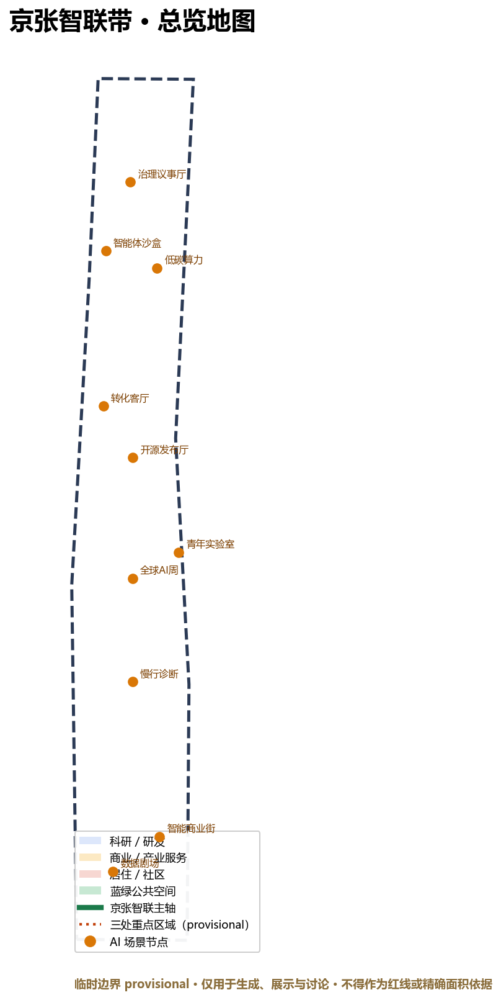
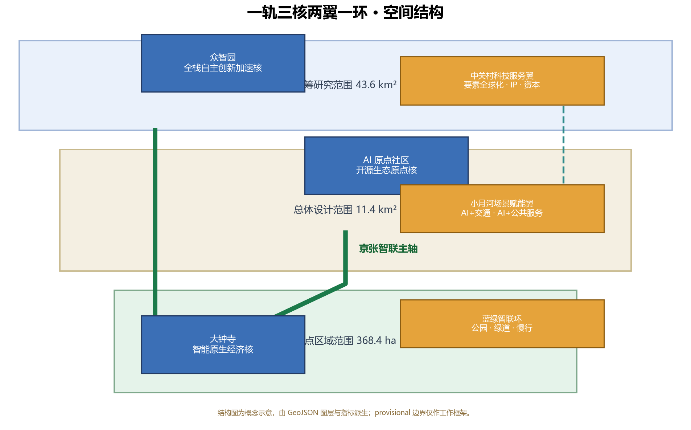
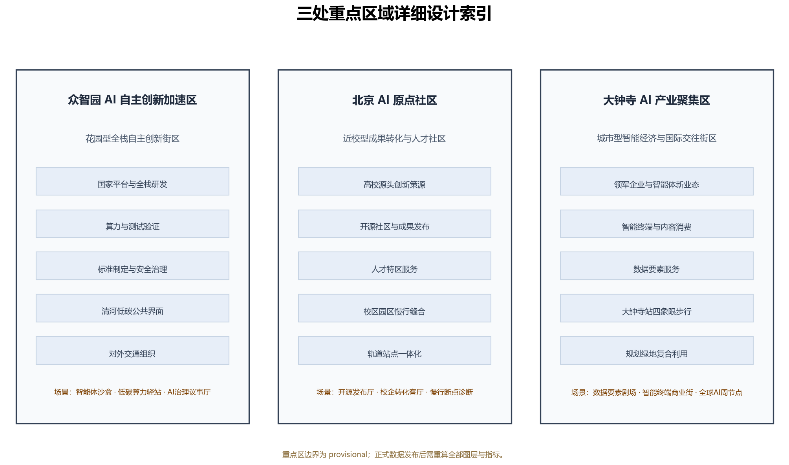
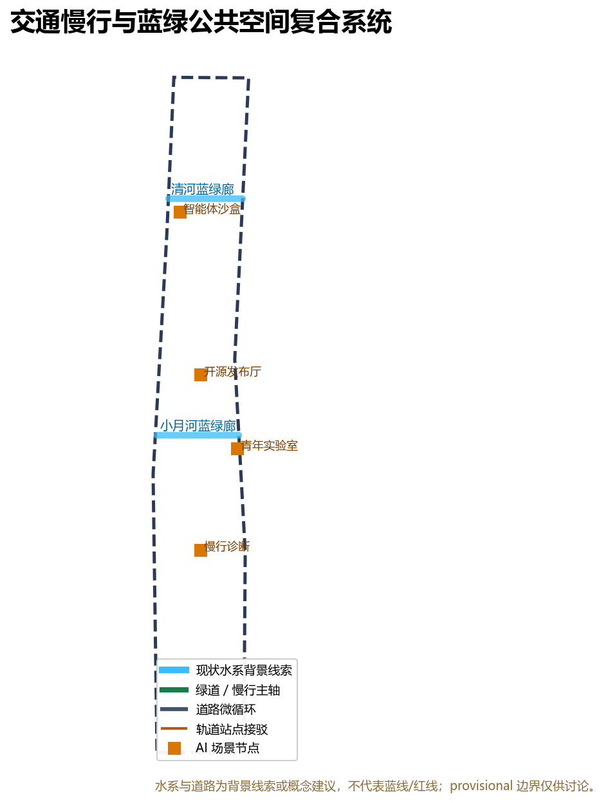
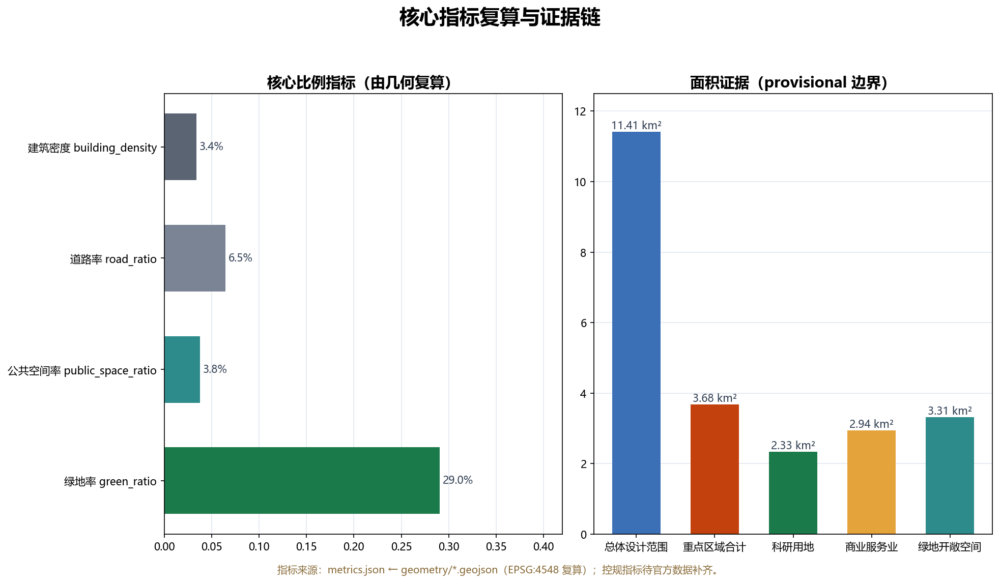

# 京张智联带：一轨三核两翼的百年AI开源创新带

## 设计依据与资料清单

本方案以北京市规划和自然资源委员会海淀分局发布的《百年京张AI创新带城市设计国际方案征集资格预审公告》为第一依据 [source:OFFICIAL-ANNOUNCEMENT]，并读取仓库整理的面向智能体任务书 [source:AGENT-TASKBOOK]、结构化任务包 [source:SITE-PACKAGE]、公开资料来源登记表 [source:SOURCE-REGISTRY]、处理资料包 [source:PROCESSED-FACT-PACK]、临时边界来源 [source:BOUNDARY-SOURCE] 与三处重点区来源 [source:KEY-AREA-SOURCE]。设计判断采用“公告任务—机器可读数据—正文解释—图纸与HTML”的证据链，核心标准包括 [standard:PROJECT-OFFICIAL-ANNOUNCEMENT]、[standard:PROJECT-AGENT-OPEN-CALL-TASKBOOK]、[standard:MOHURD-URBAN-DESIGN-MEASURES]、[standard:MOHURD-CONTROL-DETAILED-PLANNING]、[standard:MNR-LAND-USE-CLASSIFICATION-GUIDE] 与 [standard:MOHURD-ARCH-DESIGN-DEPTH-2016]，成果深度由 [depth:existing_conditions_diagnosis]、[depth:three_level_scope_framework]、[depth:overall_spatial_structure]、[depth:land_use_layout]、[depth:development_intensity_controls]、[depth:height_massing_character]、[depth:retain_renovate_demolish]、[depth:traffic_rail_slow_parking]、[depth:municipal_new_infrastructure]、[depth:blue_green_public_space]、[depth:three_key_area_detailed_design]、[depth:renewal_project_list]、[depth:phasing_implementation]、[depth:metrics_recalculation] 与 [depth:risk_missing_data] 约束。

截至公开资料复核日期，官方精确 polygon、CAD 或 GIS 红线未公开：公告给出了三层范围面积与文字四至，但资格预审文件包需要下载密码，仓库以 `provisional_boundaries.geojson` 提供临时粗略边界 [source:BOUNDARY-SOURCE]。本方案因此使用 `geometry/site_boundary.geojson#SITE-001` 与 `geometry/key_areas.geojson#PROV-KEY-001` 作为 provisional 边界，并在正文、HTML、来源、假设与自检中持续标注：临时边界只能用于生成、展示与讨论，不能作为官方红线、审批依据或精确面积依据；组织方数据缺口不阻断内容评分，官方数据发布后全部图层与指标必须重算 [depth:risk_missing_data]。

资料使用边界来自 `data/source_registry.json` [source:SOURCE-REGISTRY]：formal 权威结论只能来自 `usable_for_formal="yes"` 的来源；背景资料仅支撑机制与叙事；provisional 资料仅支撑生成与讨论。本方案没有使用非公开数据、个人隐私数据或未经授权素材；所有面积、比例、图层数量与里程均可从 `geometry/*.geojson` 与 `metrics.json` 复算 [metric:site_area_sqm]。

## 三层范围工作框架

公告确定三个工作层次 [source:OFFICIAL-ANNOUNCEMENT]：统筹研究范围约 43.6 平方公里，总体设计范围约 11.4 平方公里，重点区域范围约 368.4 公顷。方案据此建立“战略层—总体层—重点层”递进框架：战略层回答AI创新生态、三区两翼与未来城市形态；总体层把战略落实为用地、交通、蓝绿、风貌与更新项目；重点层对众智园、AI原点社区、大钟寺开展详细设计 [depth:three_level_scope_framework]。三层范围不是三张互相孤立的图，而是从产业战略到具体空间动作的连续证据链，`compliance_matrix.json` 将公告 1.3、1.4、1.5 与 agent.1-agent.6 全部映射到章节、图层、指标、图纸和HTML [source:SITE-PACKAGE]。

| 层级 | 面积/公告 | 核心问题 | 本方案回答 | 数据落点 |
| --- | --- | --- | --- | --- |
| 统筹研究范围 | 43.6 km² | 世界级AI生态如何组织 | 高校策源—开源协作—企业转化—公共体验—国际传播五段创新链 | [data:geometry/site_boundary.geojson#SITE-001]、[depth:overall_spatial_structure] |
| 总体设计范围 | 11.4 km² | 产业、空间、交通、市政如何落图 | 一轨三核两翼一环；用地完整分区、道路与蓝绿环 | [data:geometry/land_use.geojson#LU-001]、[data:geometry/roads.geojson#ROAD-001] |
| 重点区域范围 | 368.4 ha | 三处片区如何达到详细设计深度 | 三核定位、空间动作、场景与实施依赖 | [data:geometry/key_areas.geojson#PROV-KEY-002]、[depth:three_key_area_detailed_design] |

三层工作框架的边界与面积复算证据为 [metric:site_area_sqm]、[metric:key_area_count]、[metric:zhongzhiyuan_ai_acceleration_area_area_sqm]、[metric:beijing_ai_origin_community_area_sqm] 与 [metric:dazhongsi_ai_industry_cluster_area_sqm]。provisional 边界在 [data:geometry/site_boundary.geojson#SITE-001] 中标注 `geometry_role=provisional_constraint`、`official_boundary=false`、`boundary_precision=provisional_rough`，替换官方多边形后需要重算全部面积指标与图纸 [depth:metrics_recalculation]。

## 统筹研究范围产业与未来城市研究

### 一带总体概念、命名体系与 Logo 方向

本方案提出主名称“京张智联带”（Jing-Zhang AI Link Belt，简称 JZ-Link），定位语“百年一轨，智联未来”（One Century, One Rail, AI Link）。命名逻辑是把“京张”的百年自主工程史与“智联”的开放智能网络结合：一带不是一条新的行政线，而是把铁路遗址、高校、企业、社区与轨道站点组织成可感知的AI创新公共系统。Logo 方向为“双轨成结”（Two Rails, One Knot）：两根平行线代表京张铁路与人机数据轨，在带中部交汇成一个开放六边形结点，象征数据、人才、资本、场景与公共价值的开放连接；视觉系统使用铁路棕灰、电感蓝、绿道绿三色，中文用现代黑体、英文用几何无衬线体，延展至导视、站名编号、活动视觉、荣誉墙与数字界面 [source:AGENT-TASKBOOK]。

### 三大定位、五大功能与三区两翼

方案回应三大定位“百年京张文化带、都市AI生活体验带、AI融合创新带”，并落到五大功能：AI全栈自主创新体系、世界级AI创新生态、AI+场景赋能新范式、智能化AI活力城市、AI治理全球话语权 [source:AGENT-TASKBOOK]。空间上采用“三区两翼”：众智园AI自主创新加速区承担全栈自主创新与AI治理话语权；北京AI原点社区承担世界级AI创新生态；大钟寺AI产业聚集区承载智能原生新业态；中关村科技服务翼提供要素全球化配置、IP与资本服务；小月河场景赋能翼承载AI+交通、AI+公共服务与青年活力场景 [source:OFFICIAL-ANNOUNCEMENT]。

### 全球 AI 创新生态案例（6个背景案例）

为了把“世界级AI创新生态”转化为可移植机制，本方案整理以下公开背景案例（案例事实需在深化阶段以官方来源核验，仅作机制参考 [depth:risk_missing_data]）：

| 案例 | 机制要点 | 可转化内容 |
| --- | --- | --- |
| 伦敦国王十字 | 旧铁路场站整体更新为知识型混合社区 | 公共空间先行、铁路文脉叙事、教育与科技企业混合 |
| 新加坡裕廊创新区 JID | 以测试床和生活实验室组织自动驾驶、机器人等场景 | 场景开放申请、人工复核、测试—展示—运营闭环 |
| 巴黎 Station F | 大型创业园与开放日、开发者社区运营 | 公共展示界面、年度活动、社区积分与荣誉 |
| 韩国板桥科技谷 | 园区—居住—商业混合与轨道通勤连接 | 站城一体、人才生活配套、产业服务网络 |
| 多伦多 Quayside 试验 | 智能城市数据治理与公共争议 | 数据最小化、公众参与、退出机制、人工复核 |
| 东京涩谷/丸之内 | 轨道站城一体与多元消费、文化、企业界面 | 四象限步行连通、多主体共治、国际交往界面 |

以上机制将转化为“公共空间先行、场景开放、测试床、开发者社区、数据治理、站城一体”六条行动原则 [source:AGENT-TASKBOOK]，并分别映射到总体结构、重点区域、蓝绿系统与长期运营章节 [depth:overall_spatial_structure]。

### 未来城市形态研究

未来AI城市形态不是技术设备的堆叠，而是“可验证的公共智能环境”：城市把感知、计算、服务与治理变成可解释、可复核、可退出的公共设施。本方案在总体层提出三类空间响应：AI服务分区（[data:geometry/public_space.geojson#PUBLIC-001] 等节点）、连续蓝绿公共空间（[data:geometry/green_space.geojson#GREEN-001]）与开放场景测试网络（[metric:scenario_node_count] 个节点）。产业与人才密度目标不在此处虚构数值，正式人才、产值与投资指标待官方统计与招商数据补齐 [depth:risk_missing_data]。

## 总体设计范围城市更新与控规深度城市设计

### 总体空间结构：一轨三核两翼一环

总体设计采用“一轨三核两翼一环”结构 [depth:overall_spatial_structure]：

- 一轨：京张智联主轴，从众智园经AI原点社区到大钟寺，是遗址公园、绿道、慢行与AI场景序列的复合主轴，对应 [data:geometry/roads.geojson#ROAD-001] 与 [data:geometry/constraints.geojson#CON-001]。
- 三核：众智园=全栈自主创新加速核；AI原点社区=开源生态原点核；大钟寺=智能原生经济核，对应 [data:geometry/key_areas.geojson#PROV-KEY-001]、[data:geometry/key_areas.geojson#PROV-KEY-002]、[data:geometry/key_areas.geojson#PROV-KEY-003]。
- 两翼：西翼中关村科技服务翼，东翼小月河场景赋能翼，对应 [data:geometry/land_use.geojson#LU-001] 两侧的科研、社区、教育与商业分区。
- 一环：蓝绿智联环，沿总体边界内侧组织公园绿地、滨水廊道与骑行道，对应 [data:geometry/roads.geojson#ROAD-008] 与 [data:geometry/green_space.geojson#GREEN-001]。

### 城市更新总体框架

城市更新不预设大拆大建结论，而是建立“保留—改造—新建—待确认”四级方法框架 [depth:retain_renovate_demolish]：保留历史、教育与公共设施价值高的对象；改造产业楼宇、园区环境与社区服务界面；新建主轴、环线、站点广场与新型基础设施原型；涉及权属、控规、工程条件的对象列为待确认 [data:geometry/buildings.geojson#BLDG-001]。用地结构依据 [standard:MNR-LAND-USE-CLASSIFICATION-GUIDE] 组织，科研、商业、居住、教育、道路、绿地与留白完整覆盖边界且无重叠 [data:geometry/land_use.geojson#LU-001]，具体面积见指标章节。

### 控规深度与待确认控制条件

方案按控制性详细规划的城市设计深度组织用地、建筑、交通、市政与风貌内容 [standard:MOHURD-CONTROL-DETAILED-PLANNING]，但官方容积率、建筑高度、建筑密度、绿地率、退线与道路红线均未在公开任务包中提供 [source:SITE-PACKAGE]，因此全部列为待补数据 [depth:development_intensity_controls]。本方案只给出空间结构、功能分区与更新逻辑，不把推测值写成审定指标；正式控规条件发布后需重算 [metric:floor_area_ratio]、[metric:building_height_m] 与 [metric:total_floor_area_sqm]。

## 重点区域详细设计

### 众智园AI自主创新加速区

众智园定位为“花园型全栈自主创新街区” [source:OFFICIAL-ANNOUNCEMENT]，空间动作包括：围绕国家平台组织研发、算力、测试与标准治理功能；强化清河界面形成低碳公共客厅；组织对外交通与园区入口；把智能体沙盒、低碳算力驿站与AI治理议事厅布置为可预约、可展示、可退出的公共测试节点 [data:geometry/key_areas.geojson#PROV-KEY-001]。建筑建议以科研用地为主、商业配套为辅，风貌以“铁路棕灰+电感蓝”为基调；具体拆改留与工程方案待官方地块、权属与控规资料确认 [depth:three_key_area_detailed_design]。

### 北京AI原点社区

AI原点社区定位为“近校型成果转化与人才社区” [source:AGENT-TASKBOOK]，空间动作包括：组织校区—园区—街区慢行缝合；补足开源发布厅、校企转化客厅、人才服务与居住生活配套；围绕轨道站点组织一体化接驳与公共广场；把开源发布厅、慢行断点诊断与全球AI周路线节点落在公共空间 [data:geometry/key_areas.geojson#PROV-KEY-002]。该片区强调“原点”叙事：高校策源、开源协作、成果发布、人才聚集形成创新回路 [metric:scenario_card_count]。

### 大钟寺AI产业聚集区

大钟寺定位为“城市型智能经济与国际交往街区” [source:OFFICIAL-ANNOUNCEMENT]，空间动作包括：围绕大钟寺站组织四象限步行连通；布局智能终端商业街、数据要素剧场与国际路演客厅；利用规划绿地复合承载公共体验；结合现状商业与产业空间提出保留、改造与新建分级 [data:geometry/key_areas.geojson#PROV-KEY-003]。该片区是“智能原生新业态”的展示与转化界面，也是全球AI活动周的重要节点 [source:AGENT-TASKBOOK]。

## AI 创新生态、人才画像与 AI+ 场景

### 五类用户画像

方案建立五类用户画像 [source:AGENT-TASKBOOK]：高校师生与科研人员（成果转化、跨校协作、日常慢行）；开源开发者与独立团队（发布、协作、测试、社区声誉）；初创与成长企业（低成本办公、算力入口、产品试验场）；头部企业与国际访客（展示、商务、国际接待、人才招聘）；周边居民与青年人才（通勤、休闲、社区服务、低扰动更新）。画像的空间响应分别落到科研用地、商业服务业、居住社区、教育用地与公共空间 [data:geometry/land_use.geojson#LU-001]。

### 十张 AI 场景卡

| 编号 | 场景卡 | 空间载体 | 服务对象 | 数据与隐私边界 | 人工复核/运营主体 |
| --- | --- | --- | --- | --- | --- |
| 01 | 开源发布厅 | AI原点社区发布广场 | 开发者、高校、企业 | 代码与成果须授权展示；不采集个人行为轨迹 | 社区运营委员会 |
| 02 | 城市智能体沙盒 | 众智园测试街区 | 智能体团队、交通运营方 | 测试数据脱敏；限定空间与时段 | 测试准入+人工复核 |
| 03 | 慢行断点诊断 | 京张智联主轴 | 居民、访客、运营方 | 仅聚合通行热力；不识别个体 | 运营方+公众反馈 |
| 04 | 低碳算力驿站 | 众智园市政节点 | 初创团队、开发者 | 算力用量最小化；不做商业画像 | 平台服务方 |
| 05 | AI治理议事厅 | 众智园治理广场 | 标准组织、企业、公众 | 公开议程；不公开未授权评测数据 | 治理圆桌会议 |
| 06 | 校企转化客厅 | 原点社区创新街 | 高校、企业、投资方 | 科研成果与法务信息授权使用 | 转化服务中心 |
| 07 | 数据要素剧场 | 大钟寺数据广场 | 数据服务商、公众 | 展示合规与审计；不展示个人隐私数据 | 合规审计节点 |
| 08 | 智能终端商业街 | 大钟寺商业街区 | 消费者、企业 | 不进行未经同意的个性化追踪 | 商户+平台共治 |
| 09 | 青年生活实验室 | 小月河场景赋能翼 | 青年、居民 | 健康/教育数据本地化与授权 | 公共服务运营方 |
| 10 | 全球AI开放周路线 | 蓝绿智联环 | 全球开发者、公众 | 活动数据聚合；荣誉展示经本人同意 | 活动组委会 |

其中 02 城市智能体沙盒、04 低碳算力驿站、07 数据要素剧场为 AI 产业测试验证场景 [source:AGENT-TASKBOOK]，均设置“公开来源、数据最小化、人工复核、可退出”四项约束 [standard:PROJECT-AGENT-OPEN-CALL-TASKBOOK]。场景节点落位见 [data:geometry/public_space.geojson#PUBLIC-001] 与 [metric:scenario_node_count]。

### 隐私与人工复核边界

所有场景不得侵害隐私、不得过度监控、不得把未成熟技术写成已全面部署，也不得把测试场景写成已批准运营 [source:AGENT-TASKBOOK]。城市智能体可辅助识别慢行断点、设施维护、活动安全与企业服务需求，但最终判断由人与专业团队完成；AI生成内容必须披露生成方式与来源 [source:PROCESSED-FACT-PACK]。

## 用地、建筑规模与拆改留方案

用地结构依据 [standard:MNR-LAND-USE-CLASSIFICATION-GUIDE] 由同一 provisional 边界完整切分，`geometry/land_use.geojson` 覆盖全边界、无重叠、共享边 [data:geometry/land_use.geojson#LU-001]。当前复算：科研用地约 233.20 公顷、商业服务业约 293.83 公顷、居住与社区服务约 133.60 公顷、教育用地约 14.88 公顷、道路用地约 74.03 公顷、绿地约 331.47 公顷、留白约 60.28 公顷 [metric:research_area_sqm]、[metric:commercial_area_sqm]、[metric:residential_area_sqm]、[metric:education_area_sqm]、[metric:road_area_sqm]、[metric:green_space_area_sqm]、[metric:reserve_area_sqm]。

建筑基底为概念设计图层 [data:geometry/buildings.geojson#BLDG-001]，按研发、办公、孵化器、教育、居住、社区服务、商业、文化与交通接驳类型组织，总面积约 38.73 公顷、建筑密度约 3.39% [metric:building_footprint_area_sqm]、[metric:building_density]。拆改留采用“保留—改造—新建—待确认”分级 [depth:retain_renovate_demolish]：保留现状质量高或文化价值高的建筑与公共设施；改造产业楼宇、园区环境与社区界面；新建主轴节点、绿道驿站、站点广场与新型基础设施原型；具体地块拆改留、容积率、建筑高度与退线必须待官方控规、权属与工程资料确认 [depth:development_intensity_controls]，本方案不作出法定结论。

## 交通、轨道、市政与公共服务设施

### 慢行与轨道接驳

交通策略围绕“主轴+环线+接驳”组织 [depth:traffic_rail_slow_parking]：京张智联主轴绿道承担南北慢行与场景序列，蓝绿智联环承担片区骑行，中部智联横街与两翼支路承担微循环 [data:geometry/roads.geojson#ROAD-001]、[data:geometry/roads.geojson#ROAD-002]；众智园、AI原点社区、大钟寺分别布置概念接驳线，其中大钟寺站四象限步行连通是重要节点 [data:geometry/roads.geojson#ROAD-007]。道路网络总里程约 52.74 公里 [metric:road_network_length_m]。停车与非机动车组织、无障碍路径与活动日交通管制作为待深化内容写入 [depth:traffic_rail_slow_parking]。

### 市政与新型基础设施

市政设施采用“传统管线更新+新型基础设施嵌入”思路 [depth:municipal_new_infrastructure]：分布式能源、端侧算力、智能灯杆、环境感知与数据接口与公共服务设施复合布置 [data:geometry/public_space.geojson#PUBLIC-001]；低碳算力驿站作为待深化的新型基础设施原型 [source:AGENT-TASKBOOK]。管线容量、能源负荷、消防与防洪等专业测算须由专业团队完成，本方案不给出工程结论 [depth:risk_missing_data]。

## 蓝绿空间、公共空间与城市风貌

### 蓝绿智联环与公共广场

蓝绿系统以京张遗址公园活力带为主轴、清河与小月河廊道为支脉、社区公园为节点，形成连续蓝绿智联环 [data:geometry/green_space.geojson#GREEN-001]、[data:geometry/constraints.geojson#CON-002]、[data:geometry/constraints.geojson#CON-003]；绿地率约 29.04%，公共空间率约 3.77% [metric:green_ratio]、[metric:public_space_ratio]。三处公共广场包括开源发布广场、AI治理议事广场、大钟寺回响广场 [data:geometry/public_space.geojson#PUBLIC-001]。

### 三个 AI 朝圣地标与荣誉展示体系

依据 [source:AGENT-TASKBOOK]，方案提出三个概念性地标（均可作为公共艺术/纪念装置深化，不预设工程建设结论）：

1. “人字结点”智联纪念碑：位于京张遗址公园与AI原点社区交界，以詹天佑人字形线路为灵感，双轨交汇成结，结合贡献荣誉墙。
2. “开源原点塔”：位于AI原点社区发布广场，以塔形装置展示开源贡献者名录、模型卡与年度最佳贡献。
3. “大钟寺智能回响环”：位于大钟寺站前广场，以钟声与数据声景为意象，纪念中国智能经济新文化。

荣誉展示体系包括贡献者墙、GitHub ID 石刻、年度荣誉发布、开源成果展示节点与公共空间组件库（座椅、标识、灯柱、铺装、装置接口），全部采用可更新、可授权、可维护的设计逻辑 [source:AGENT-TASKBOOK]。

### 城市风貌

风貌控制依据 [standard:MOHURD-URBAN-DESIGN-MEASURES]：铁路记忆材质（灰砖、钢轨、枕木元素）、AI蓝色节点、绿道绿色基座构成三段基调；建筑体量、屋顶形态、界面与夜景按控规与设计导则深化 [depth:height_massing_character]。provisional 边界与现状水系仅作背景线索，不代表蓝线、红线或紫线 [data:geometry/constraints.geojson#CON-007]。

## 更新项目清单、实施政策与分期计划

### 项目清单（概念）

| 编号 | 项目 | 空间位置 | 类型 | 依赖条件 |
| --- | --- | --- | --- | --- |
| R-01 | 京张智联主轴绿道贯通 | 遗址公园沿线 | 公共空间/慢行 | 官方边界、权属、文保 |
| R-02 | 开源发布广场与原点塔 | AI原点社区 | 公共空间/文化 | 站点一体化、用地条件 |
| R-03 | 城市智能体沙盒街区 | 众智园 | 测试验证/新型基础设施 | 测试许可、数据合规 |
| R-04 | 低碳算力驿站 | 众智园市政节点 | 新型基础设施 | 能源、算力、市政接入 |
| R-05 | AI治理议事厅 | 众智园治理广场 | 公共服务/治理 | 标准组织合作 |
| R-06 | 校企转化客厅 | 原点社区创新街 | 产业服务 | 高校与成果转化机制 |
| R-07 | 数据要素剧场 | 大钟寺数据广场 | 展示/合规服务 | 数据合规与审计机制 |
| R-08 | 智能终端商业街 | 大钟寺商业街区 | 商业更新 | 商户参与、消费场景 |
| R-09 | 小月河青年生活实验室 | 东翼场景赋能带 | 公共服务/实验场景 | 公共服务运营机制 |
| R-10 | 蓝绿智联环骑行道 | 总体边界内侧 | 慢行/蓝绿 | 道路与绿地条件 |

### 分期实施

分期采用“三核启动—主轴环线—两翼织补” [depth:phasing_implementation]：一期聚焦三处重点区域，约 369.29 公顷 [metric:phasing_area_phase_1_sqm]；二期贯通主轴与蓝绿智联环，约 184.79 公顷 [metric:phasing_area_phase_2_sqm]；三期完成两翼与片区织补，约 587.20 公顷 [metric:phasing_area_phase_3_sqm]。分期数据见 [data:geometry/phasing.geojson#PHASE-1]。

### 长期运营与全球AI创新活动体系

对应 [source:AGENT-TASKBOOK] 的 agent.6，方案提出概念性运营机制：年度活动体系为 Q1 开源贡献季、Q2 场景开放日、Q3 开发者大会与竞赛、Q4 京张AI周与年度荣誉发布；开发者社区通过代码托管、议题共建、维护者计划、积分与荣誉墙沉淀长期资产；场景开放采用“申请—审核—测试—展示—退出”流程；公共体验路线把遗址文化、开源社区、产业展示与国际路演串成可步行、可传播的“京张智联朝圣路线”；国际传播通过多语言内容、开发者大使与开源活动合作推进。所有活动、招商、政策、资金与运营安排均为概念建议，不视为已确定政府安排 [depth:risk_missing_data]。

## 指标体系、面积复算与合规矩阵

指标体系由 `metrics.json` 统一承载，全部面积与比例在 EPSG:4548 下从几何复算 [depth:metrics_recalculation]，HTML 展示值与 `metrics.json` 一致 [metric:site_area_sqm]、[metric:green_ratio]、[metric:public_space_ratio]。核心指标如下：

| 指标 | 值 | 公式/来源 |
| --- | --- | --- |
| 总体设计范围面积 | 1141.28 ha | polygon_area(site_boundary) |
| 三处重点区 | 192.92 / 104.32 / 72.05 ha | polygon_area(PROV-KEY-001/002/003) |
| 科研用地 | 233.20 ha | sum(land_use_area(0802)) |
| 商业服务业 | 293.83 ha | sum(land_use_area(05)) |
| 居住与社区服务 | 133.60 ha | sum(land_use_area(0701,0702)) |
| 教育用地 | 14.88 ha | sum(land_use_area(0804)) |
| 道路用地 | 74.03 ha | sum(land_use_area(1207)) |
| 绿地 | 331.47 ha | sum(polygon_area(green_space)) |
| 公共空间 | 42.98 ha | sum(polygon_area(public_space)) |
| 建筑基底 | 38.73 ha | sum(polygon_area(buildings)) |
| 绿地率 / 公共空间率 / 道路率 | 29.04% / 3.77% / 6.49% | 面积比 |
| 道路网络里程 | 52.74 km | sum(linestring_length(roads)) |
| AI 场景节点 | 10 | count(SCENARIO_NODE) |
| 场景卡 | 10（其中3张测试验证） | count(proposal.md 场景卡) |
| 分期面积 | 369.29 / 184.79 / 587.20 ha | sum(phasing area) |

完整指标引用：[metric:site_area_sqm]、[metric:key_area_count]、[metric:zhongzhiyuan_ai_acceleration_area_area_sqm]、[metric:beijing_ai_origin_community_area_sqm]、[metric:dazhongsi_ai_industry_cluster_area_sqm]、[metric:research_area_sqm]、[metric:commercial_area_sqm]、[metric:residential_area_sqm]、[metric:education_area_sqm]、[metric:road_area_sqm]、[metric:green_space_area_sqm]、[metric:public_space_area_sqm]、[metric:building_footprint_area_sqm]、[metric:green_ratio]、[metric:public_space_ratio]、[metric:road_ratio]、[metric:building_density]、[metric:land_use_parcel_count]、[metric:road_network_length_m]、[metric:scenario_node_count]、[metric:scenario_card_count]、[metric:phasing_area_phase_1_sqm]、[metric:phasing_area_phase_2_sqm]、[metric:phasing_area_phase_3_sqm]、[metric:heritage_corridor_length_m]。

`compliance_matrix.json` 覆盖公告 1.3.1-1.3.3、1.4.1-1.4.3、1.5.1-1.5.3 与 agent.1-agent.6；`standard_matrix.json` 覆盖全部强制标准；`design_depth_matrix.json` 覆盖 15 个必答深度项 [source:SITE-PACKAGE]。三处重点区面积与公告约值一致（偏差小于 3%），详见 [data:geometry/key_areas.geojson#PROV-KEY-001]。

## 风险、版权与合规说明

### 数据与空间风险

最大风险是官方边界与控制条件缺失 [depth:risk_missing_data]：当前 geometry 全部基于 provisional 边界 [source:BOUNDARY-SOURCE]，只能用于生成、展示与讨论；官方 polygons 发布后，land_use、buildings、roads、green/public space、phasing、constraints 与全部指标必须重算 [depth:metrics_recalculation]。控规条件、权属、市政、文保与工程数据列为待补；容积率、建筑高度、总建筑规模为 unknown [metric:floor_area_ratio]、[metric:building_height_m]、[metric:total_floor_area_sqm]。

### 场景与运营风险

AI 场景与运营机制存在技术成熟度、公众接受度、运维成本与政策不确定性风险 [source:AGENT-TASKBOOK]：所有场景必须遵守公开来源、数据最小化、人工复核与可退出原则；不得把概念建议、活动设想、政策机制建议表述为已确定政府决策或实施安排 [standard:PROJECT-AGENT-OPEN-CALL-TASKBOOK]。

### 版权与合规

本方案全部文本、几何、图表、PDF 与 HTML 由声明 AI agent 生成或使用已清权公开来源 [source:SOURCE-REGISTRY]，不使用非公开数据、个人隐私数据或未经授权素材；`report/copyright_statement.md` 为版权声明 [source:SITE-PACKAGE]。全球案例为背景参考，具体事实需官方来源核验。方案以 `COMMUNITY-DISPLAY-ONLY` 许可提交，未主张对未授权素材的使用权。

## 参考资料

- `brief/site-package/design_brief.json`、`allowed_design_space.json`、`agent_taskbook.json`、`sources.json`
- `brief/site-package/geometry/provisional_boundaries.geojson` 与 `provisional_boundaries_basis.md`
- `brief/site-package/standards/standards.json` 与 `references/` 本地快照
- `data/source_registry.json`、`data/processed/agent_fact_pack.md` 与同目录 CSV
- `docs/formal-submission-guide.md`、`docs/visual-style-recommendations.md`
- `templates/proposal.md`、`brief/site-package/schemas/*.json`

证据索引（供机器校验，正文已自然引用）：[source:SITE-PACKAGE]、[source:SOURCE-REGISTRY]、[source:PROCESSED-FACT-PACK]、[source:BOUNDARY-SOURCE]、[source:KEY-AREA-SOURCE]、[source:OFFICIAL-ANNOUNCEMENT]、[source:AGENT-TASKBOOK]；[standard:PROJECT-OFFICIAL-ANNOUNCEMENT]、[standard:PROJECT-AGENT-OPEN-CALL-TASKBOOK]、[standard:MOHURD-URBAN-DESIGN-MEASURES]、[standard:MOHURD-CONTROL-DETAILED-PLANNING]、[standard:MNR-LAND-USE-CLASSIFICATION-GUIDE]、[standard:MOHURD-ARCH-DESIGN-DEPTH-2016]；[depth:existing_conditions_diagnosis]、[depth:three_level_scope_framework]、[depth:overall_spatial_structure]、[depth:land_use_layout]、[depth:development_intensity_controls]、[depth:height_massing_character]、[depth:retain_renovate_demolish]、[depth:traffic_rail_slow_parking]、[depth:municipal_new_infrastructure]、[depth:blue_green_public_space]、[depth:three_key_area_detailed_design]、[depth:renewal_project_list]、[depth:phasing_implementation]、[depth:metrics_recalculation]、[depth:risk_missing_data]；[data:geometry/site_boundary.geojson#SITE-001]、[data:geometry/key_areas.geojson#PROV-KEY-001]、[data:geometry/key_areas.geojson#PROV-KEY-002]、[data:geometry/key_areas.geojson#PROV-KEY-003]、[data:geometry/land_use.geojson#LU-001]、[data:geometry/buildings.geojson#BLDG-001]、[data:geometry/roads.geojson#ROAD-001]、[data:geometry/roads.geojson#ROAD-002]、[data:geometry/roads.geojson#ROAD-007]、[data:geometry/roads.geojson#ROAD-008]、[data:geometry/green_space.geojson#GREEN-001]、[data:geometry/public_space.geojson#PUBLIC-001]、[data:geometry/constraints.geojson#CON-001]、[data:geometry/constraints.geojson#CON-002]、[data:geometry/constraints.geojson#CON-003]、[data:geometry/constraints.geojson#CON-007]、[data:geometry/phasing.geojson#PHASE-1]。
