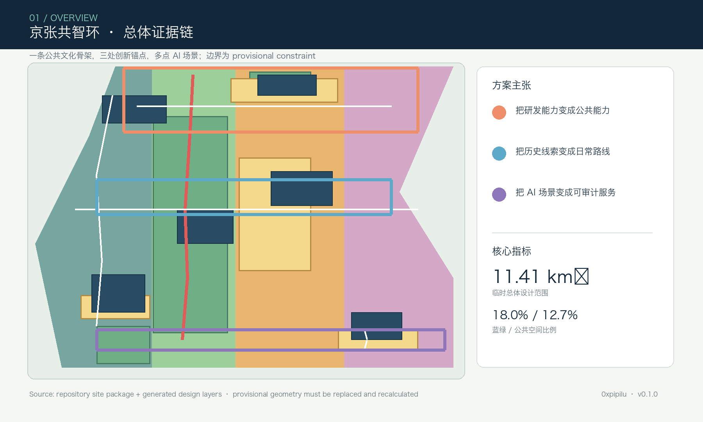
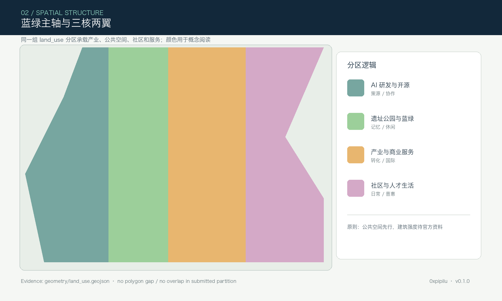
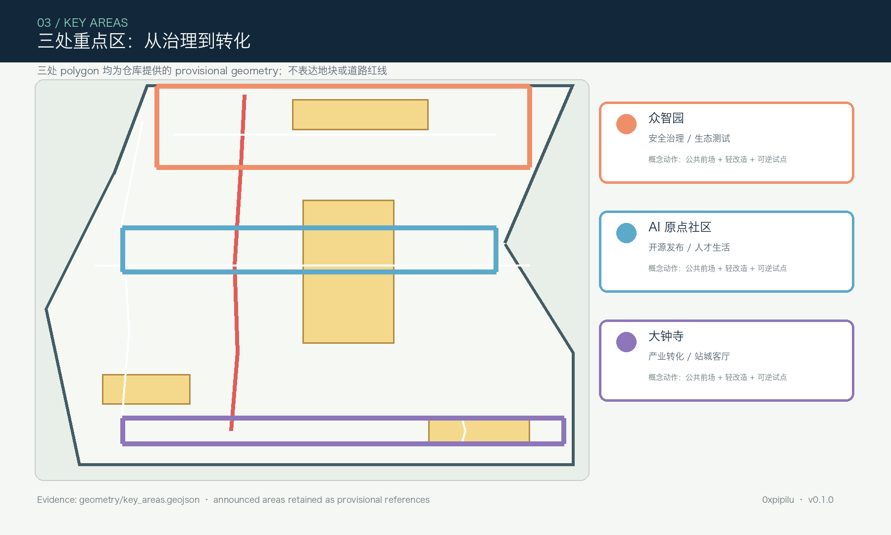
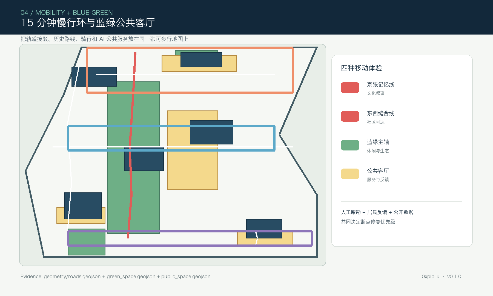
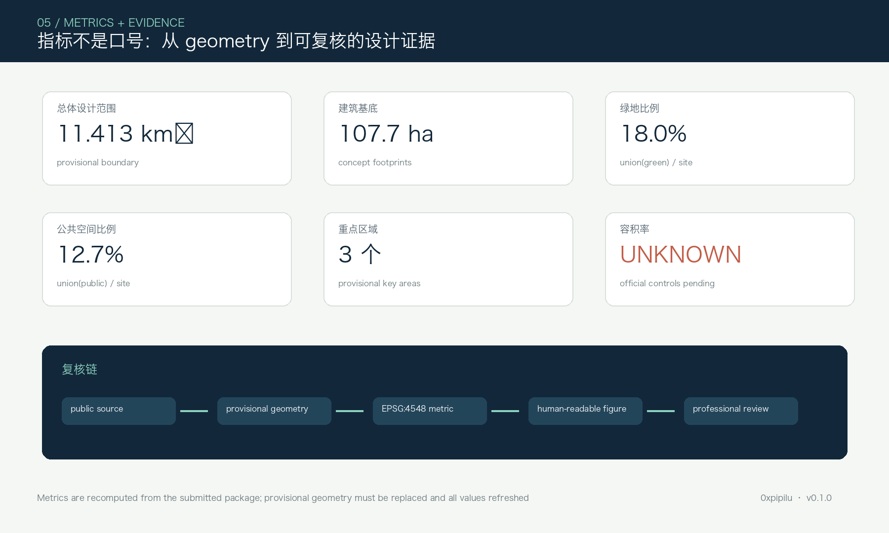

# 京张共智环：面向公共AI能力的百年创新带

> 本方案是 AI agent 面向开源征集提交的概念建议和参考方案，供主办方、专业团队、社区和后续智能体继续深化。由于官方精确红线和三处重点区 polygon 尚未进入公开 site package，本文所有空间、面积和分期均以 provisional geometry 为基础；不替代正式规划、法定审批、工程设计或政府承诺。

## 设计依据与资料清单

“京张共智环”提出一个可被人类专业团队继续校正的空间命题：让百年京张铁路的线性记忆成为公共文化骨架，让 AI 的研发、开源、治理和产业转化沿一条可步行、可观察、可参与的城市网络发生。方案依据项目公告、面向智能体任务书、site package、公开资料登记表、处理资料导航和本地专业标准快照组织。基础证据为 [source:OFFICIAL-ANNOUNCEMENT]、[source:AGENT-TASKBOOK]、[source:SITE-PACKAGE]、[source:SOURCE-REGISTRY]、[source:PROCESSED-FACT-PACK]；标准依据为 [standard:PROJECT-OFFICIAL-ANNOUNCEMENT]、[standard:PROJECT-AGENT-OPEN-CALL-TASKBOOK]、[standard:MOHURD-URBAN-DESIGN-MEASURES]、[standard:MOHURD-CONTROL-DETAILED-PLANNING]、[standard:MNR-LAND-USE-CLASSIFICATION-GUIDE]、[standard:MOHURD-ARCH-DESIGN-DEPTH-2016]。

当前提交总体设计范围采用仓库中的临时替代边界 [data:geometry/site_boundary.geojson#SITE-001]，计算面积 [metric:site_area_sqm] = 11,412,825 平方米（约 11.413 平方公里）。三个重点区采用 [source:BOUNDARY-SOURCE] 与 [source:KEY-AREA-SOURCE] 提供的临时多边形。该边界只能支撑 intake、概念生成、可视化和临时自检；取得官方或用户明确清权的 CAD/GIS/PDF 后，应替换全部边界、设计图层、指标、图件和图纸，并重新运行完整检查。这里的资料缺口与现状诊断方法对应 [depth:existing_conditions_diagnosis]，不把临时多边形写成官方红线。

## 三层范围工作框架

三层工作采用“43.6 平方公里统筹研究—11.4 平方公里总体设计—368.4 公顷重点区域”的递进关系。统筹研究范围负责产业、人才、创新链和国际传播；总体设计范围负责京张遗址公园活力带、更新结构、交通市政和城市风貌；重点区域负责把概念转译为可定位的空间动作、场景节点和更新项目。该层级响应 [depth:three_level_scope_framework] 与 [depth:overall_spatial_structure]，空间证据回到 [data:geometry/site_boundary.geojson#SITE-001]、[data:geometry/key_areas.geojson#PROV-KEY-001]、[data:geometry/key_areas.geojson#PROV-KEY-002]、[data:geometry/key_areas.geojson#PROV-KEY-003]。

总体概念为“一带、三核、两翼、多点”：一带是京张记忆与都市 AI 生活复合带；三核是众智园 AI 自主创新加速区、北京 AI 原点社区、大钟寺 AI 产业聚集区；两翼是中关村科技服务翼和小月河场景赋能翼；多点是开源发布厅、安全治理沙盒、端侧算力驿站、数据要素剧场、居民服务站和 AI 朝圣地标。结构不是新增法定边界，而是把公告任务转译为一个可复核的空间工作框架。

## 统筹研究范围产业与未来城市研究

统筹研究提出“策源—协作—验证—转化—公共体验”五段式创新链：高校与科研机构提供基础研究和人才入口；原点社区提供开源协作、成果发布和早期孵化；众智园提供模型、安全、标准和端侧系统的测试与治理；大钟寺提供企业服务、国际路演和智能终端消费；京张遗址公园和社区公共空间把 AI 变成可被非专业公众理解、试用和反馈的城市能力。五大功能“AI 全栈自主创新体系、世界级 AI 创新生态、AI+ 场景赋能新范式、智能化 AI 活力城市、AI 治理全球话语权”对应 [source:AGENT-TASKBOOK]，但仍是概念策划，不是产业承诺。

品牌建议：中文名“京张共智环”，英文名“Jing-Zhang Commons Loop”，Logo 方向为一条由铁路枕木节奏转化而来的开放环线，三处节点形成三颗可连接的点，颜色采用京张铁锈红、公共绿和数据蓝。识别系统不使用未经授权的企业标识、历史图像或个人肖像。全球案例的机制借鉴限定为公开背景研究：巴黎 Station F 的开放创新社区、伦敦 King's Cross 的历史更新、赫尔辛基 Oodi 的公共技术服务、阿姆斯特丹 Marineterrein 的开放测试、深圳南头古城的渐进式更新、巴塞罗那超级街区的公共空间重分配；其价值在于“开放接口、历史再利用、公共测试和运营迭代”四种机制，不是复制项目形象。

## 总体设计范围城市更新与控规深度城市设计

总体空间采用“蓝绿主轴 + 共智横廊 + 站点客厅 + 低扰动更新单元”。蓝绿主轴沿京张历史线索和可核对的水系联系线索组织，东西向横廊把高校、园区、社区和轨道接驳节点缝合，站点客厅优先落在大钟寺、五道口及清华东路西口等公共交通界面，更新单元以保留、轻改造、功能置换和可逆新建为主。用地分区完整覆盖临时总体边界且无重叠，权威图层为 [data:geometry/land_use.geojson#LU-001]；建筑对象见 [data:geometry/buildings.geojson#BLDG-001]，道路见 [data:geometry/roads.geojson#ROAD-001]。

土地分类沿用项目 subset 的正式编码：科研用地 0802、绿地 1401、商业服务业用地 05、社区服务设施用地 0702。这里的建筑基底、建筑密度、容积率、建筑高度、退线和道路红线均不是官方控制条件。`floor_area_ratio` 保持 unknown，不能从概念体块倒推法定强度；后续应以官方控规、权属和现状调查核定。方案只提出建筑高度梯度、公共界面连续性、首层开放和屋顶公共性等设计导则，对应 [standard:MOHURD-CONTROL-DETAILED-PLANNING]、[standard:MNR-LAND-USE-CLASSIFICATION-GUIDE]、[depth:land_use_layout]、[depth:development_intensity_controls]、[depth:height_massing_character]。

## 重点区域详细设计

三处重点区共同组成从研发到生活的“AI 公共能力链”，其临时几何和面积警示见 [data:geometry/key_areas.geojson#PROV-KEY-001]、[data:geometry/key_areas.geojson#PROV-KEY-002]、[data:geometry/key_areas.geojson#PROV-KEY-003]，详细设计深度由 [depth:three_key_area_detailed_design] 约束。

| 重点区 | 空间定位 | 三个空间动作 | 运营接口 |
| --- | --- | --- | --- |
| 众智园 AI 自主创新加速区 | 花园型全栈创新和治理街区 | 安全治理测试坊、清河文化界面、生态测试庭院 | 标准工作坊、模型评测、低碳端侧实验；需专业团队核定安全、消防和数据条件 |
| 北京 AI 原点社区 | 近校成果转化与人才社区 | 校园—园区慢行缝合、开源发布前场、人才服务嵌入 | 开源日、成果发布、创业辅导、青年人才生活支持；不采集个人轨迹 |
| 大钟寺 AI 产业聚集区 | 面向城市的智能经济与国际交往街区 | 大钟寺站四象限步行客厅、企业首层公共界面、国际路演客厅 | 智能终端展示、企业服务、数据要素讨论、国际路演；企业案例需清权 |

三处重点区都使用“保留优先、轻改造优先、可逆设施先行”的更新逻辑，不给出地块级拆除结论。重点节点由 [data:geometry/public_space.geojson#PUBLIC-001]、[data:geometry/green_space.geojson#GREEN-001]、[data:geometry/roads.geojson#ROAD-001] 表达，待官方边界和现状调查取得后再做详细城市设计深化。

## AI 创新生态、人才画像与 AI+ 场景

AI 场景不是给传统设施贴标签，而是把“数据—模型—人类复核—公共反馈”做成空间运营闭环。以下 10 张场景卡均为概念建议，至少 3 张是产业测试验证场景；每张卡都要设数据边界和人工复核，任务依据为 [source:AGENT-TASKBOOK]，空间接口回到 [data:geometry/public_space.geojson#PUBLIC-001]。

| 场景卡 | 载体 | 服务对象与反馈机制 |
| --- | --- | --- |
| 01 开源发布厅 | 原点社区发布前场 | 开发者发布模型、贡献记录和小型路演，内容由人工编辑审核 |
| 02 安全治理沙盒 | 众智园测试坊 | 进行红队测试、偏差评估和标准工作坊，结果只发布聚合指标 |
| 03 端侧算力驿站 | 共智环公共客厅 | 展示低功耗推理和公共服务原型，先做预约试点和安全评估 |
| 04 AI 慢行诊断 | 京张慢行记忆线 | 用公开数据识别断点，现场踏勘和居民反馈作为最终判断 |
| 05 人才生活管家 | 社区服务节点 | 聚合居住、学习、运动和公共服务信息，不做个人画像商业化 |
| 06 校企转化客厅 | 成果转化驿站 | 连接科研成果、创业团队和企业需求，重要决策保留人工签核 |
| 07 数据要素剧场 | 大钟寺路演客厅 | 用可解释展陈讲清数据来源、授权、收益和风险 |
| 08 无障碍公共服务 | 站点与公园 | 为老年人、儿童和残障人士提供语音、图形和人工协助服务 |
| 09 京张记忆路线 | 蓝绿主轴 | 将铁路史、中关村创新史和 AI 新文化串成可步行的公共叙事 |
| 10 全球 AI 活动周 | 一带多节点 | 开发者节、场景开放日、路演和城市体验路线形成年度节奏 |

五类关键用户画像为：开源开发者、初创团队、头部企业访客、高校师生、周边居民与照护者。它们分别映射到发布、测试、转化、生活和公共服务空间；所有涉及数据、摄像、定位、健康或教育信息的方案，必须采用最小化采集、明确授权、可退出和人工申诉机制。三类产业验证场景是安全治理沙盒、端侧算力驿站和校企转化客厅，均只作为供专业团队深化研究的空间原型。

## 用地、建筑规模与拆改留方案

用地分区由 [data:geometry/land_use.geojson#LU-001] 至 [data:geometry/land_use.geojson#LU-004] 构成完整 partition；建筑基底由 6 个概念对象表达，见 [data:geometry/buildings.geojson#BLDG-001]。其面积 [metric:building_footprint_area_sqm] 来自 EPSG:4548 投影复算，不能解释为可建规模。保留、轻改造、功能置换和新建参考对象通过 `retain_status` 标注：历史和社区价值优先保留，首层界面与无障碍优先轻改造，低效空间优先功能置换，新建只作为公共服务或测试型小体量参考。

建筑风貌建议以“铁路构件的节奏、实验室的可见性、社区界面的温度”为三条线索：首层尽量透明和可进入，较大体量通过台地、连廊和公共前场拆分，屋顶优先考虑公共活动和低碳设备的共存，色彩采用低饱和砖红、灰白和公共绿。建筑高度、密度、容积率、退线、拆除和新建规模均待官方控规、文保、权属及工程资料确认；这些边界对应 [depth:development_intensity_controls]、[depth:height_massing_character]、[depth:retain_renovate_demolish]，不是已审定控制条件。

## 交通、轨道、市政与公共服务设施

交通策略是“轨道到站—公共客厅—15 分钟慢行环—园区微循环”。道路与慢行概念层见 [data:geometry/roads.geojson#ROAD-001]，重点是京张记忆线、原点社区东西向步行缝合、大钟寺站接驳和众智园内部微循环。建议在轨道站点边界优先配置连续无障碍路径、自行车停放、短时上下客、夜间照明和人工服务，而不是扩大机动车空间。对于跨快速路、道路红线、停车配建、消防通道和轨道工程接口，只提出问题清单和专业深化要求，对应 [depth:traffic_rail_slow_parking]。

新型基础设施采用“可见但不喧宾夺主”的策略：端侧算力驿站、公共数据说明牌、环境传感、低碳能源接口和模型安全展示嵌入公共空间；能源、排水、防洪、管线、消防和通信需在官方工程条件取得后复核。公共服务应覆盖人才服务、老幼照护、无障碍导视、社区活动和国际访客，不把 AI 设为替代人工的唯一入口。市政与新型基础设施策略对应 [depth:municipal_new_infrastructure]、[standard:MOHURD-URBAN-DESIGN-MEASURES]。

## 蓝绿空间、公共空间与城市风貌

蓝绿网络以“线性记忆 + 日常可用 + 低侵入测试”为原则。绿地层见 [data:geometry/green_space.geojson#GREEN-001]，公共空间层见 [data:geometry/public_space.geojson#PUBLIC-001]；绿地比例 [metric:green_ratio] = 0.180180，公共空间比例 [metric:public_space_ratio] = 0.127402。比例仅用于临时设计比较，不能替代官方绿地、开放空间或权属认定。公园节点建议兼容休憩、运动、文化导视、无障碍活动和经过人工审核的 AI 公共体验，避免把公共空间变成持续监控场。

城市风貌叙事分三层：第一层是百年京张的铁路、站点、工艺和迁徙记忆；第二层是中关村的高校、创业、开源和科学家文化；第三层是 AI 新文化的贡献、失败复盘、公共治理和全球交流。建议设置“京张记忆门”“共智环公共代码墙”“全球贡献者庭院”三个 AI 朝圣/荣誉节点，展示经过授权的项目、方法和公共贡献，明确区分提交、评审、入选和落地。方案表达遵循 [standard:MOHURD-URBAN-DESIGN-MEASURES]、[depth:blue_green_public_space]，不声称任何文保边界或已批准公共艺术。

## 更新项目清单、实施政策与分期计划

项目清单按“先运营、后空间；先公共、后产业；先可逆、后永久”组织，空间分期见 [data:geometry/phasing.geojson#PHASE-001]，项目深度对应 [depth:renewal_project_list] 和 [depth:phasing_implementation]。

| 项目 | 位置 | 参考动作 | 前置条件 | 建议阶段 |
| --- | --- | --- | --- | --- |
| P1 京张慢行记忆线 | 蓝绿主轴 | 导视、连续步行、无障碍和文化叙事 | 现状测绘、文保与交通核对 | 一期运营试点 |
| P2 原点社区开源前场 | 北京 AI 原点社区 | 发布厅、成果墙、夜间协作 | 校园边界、消防、运营主体 | 一—二期 |
| P3 众智园安全治理测试坊 | 众智园 | 模型评测、标准展陈、生态庭院 | 数据安全、实验室条件、清河界面资料 | 三期深化 |
| P4 大钟寺站公共客厅 | 大钟寺产业聚集区 | 四象限步行、站城接驳、企业首层更新 | 轨道站点、道路和权属资料 | 一期试点 |
| P5 端侧算力驿站 | 多个公共节点 | 低碳算力和公共服务原型 | 能源、通信、运维和安全评估 | 二期试点 |
| P6 全球 AI 活动周 | 一带多节点 | 开发者节、场景开放、国际路演 | 运营组织、版权和公共安全 | 持续运营 |

实施政策建议包括：建立跨主体共智环运营协调机制；以空置、低效和公共界面为优先的空间供给；用统一数据卡登记来源、授权、保存期限和人工复核；通过社区共创和可退出试点获得反馈；对涉及个人数据的场景设置红线和申诉渠道；以小额、可逆、可观察的公共空间动作验证需求。三阶段分别是“一期公共接口试点、二期校企社区缝合、三期安全治理与生态测试”，只是参考路径，绝不构成资金、投资、审批或工程时序承诺。

## 指标体系、面积复算与合规矩阵

本包的权威证据顺序为 GeoJSON、metrics、三类矩阵、manifest/source/assumptions/self_check、proposal.md、图件、HTML 和 PDF。当前 [metric:site_area_sqm] = 11,412,825.386 平方米，[metric:building_footprint_area_sqm]、[metric:green_ratio]、[metric:public_space_ratio]、[metric:key_area_count] 均从提交几何或明确计数复算；`floor_area_ratio` 为 unknown。指标计算使用项目指定 EPSG:4548，交换 GeoJSON 使用 EPSG:4326。复算方法对应 [depth:metrics_recalculation]，并在 [data:geometry/site_boundary.geojson#SITE-001]、[data:geometry/land_use.geojson#LU-001]、[data:geometry/buildings.geojson#BLDG-001]、[data:geometry/roads.geojson#ROAD-001]、[data:geometry/green_space.geojson#GREEN-001]、[data:geometry/public_space.geojson#PUBLIC-001]、[data:geometry/constraints.geojson#CON-001]、[data:geometry/phasing.geojson#PHASE-001] 中保留空间证据。

`compliance_matrix.json` 覆盖公告 1.3、1.4、1.5 和 agent.1—agent.6；`standard_matrix.json` 映射专业标准；`design_depth_matrix.json` 将现状诊断、三层框架、总体结构、用地、强度待确认项、风貌、拆改留、交通、市政、蓝绿、三处重点区、项目清单、分期、复算和风险全部标成可读证据。五张图件和离线 HTML 只承担解释层，不能替代 JSON/GeoJSON。核心指标和证据链见下图。

## 风险、版权与合规说明

最大风险是临时边界、临时重点区、现状建筑与官方控规资料尚未齐全；其次是把 AI 场景写成技术承诺、把概念设施写成政府实施、或把公共数据处理写成无条件授权。风险与缺资料对应 [depth:risk_missing_data]；约束辅助层见 [data:geometry/constraints.geojson#CON-001]，假设清单在 `assumptions.json`。所有空间建议均为概念建议、参考方案或可供专业团队深化研究；不声称官方批准、不声称最终权属、不声称最终建设规模，也不对算法性能、活动规模或投资回报作保证。

本次图件和 HTML 由本工作区脚本基于提交 GeoJSON、metrics 和矩阵生成；未使用新闻图片、OSM、商业地图截图、远程瓦片、外部字体或未清权的企业资产。方案采用 CC-BY-4.0，参与者可在保留来源和概念边界说明的前提下继续复用。若后续引入外部资料，必须补写发布者、URL、访问日期、空间时间范围、许可、转换方法和已知限制，并在 Issue/PR 中邀请复核。

## 参考资料

- [source:OFFICIAL-ANNOUNCEMENT] 北京市规划和自然资源委员会海淀分局公告及项目任务范围。
- [source:AGENT-TASKBOOK] 面向全球智能体开展百年京张 AI 创新带城市设计开源征集任务书摘录。
- [source:SITE-PACKAGE] `brief/site-package/` 设计简报、边界、枚举、范围、标准和 schema。
- [source:SOURCE-REGISTRY] `data/source_registry.json` 公开、清权和 provisional 资料登记表。
- [source:PROCESSED-FACT-PACK] `data/processed/agent_fact_pack.md`，仅作阅读导航，不升级原始来源权威等级。
- [source:BOUNDARY-SOURCE] `brief/site-package/geometry/provisional_boundaries.geojson`，临时范围与三处重点区来源。
- [source:KEY-AREA-SOURCE] 三处重点区临时 polygon，须待官方或清权文件替换。
- 标准证据：[standard:PROJECT-OFFICIAL-ANNOUNCEMENT]、[standard:PROJECT-AGENT-OPEN-CALL-TASKBOOK]、[standard:MOHURD-URBAN-DESIGN-MEASURES]、[standard:MOHURD-CONTROL-DETAILED-PLANNING]、[standard:MNR-LAND-USE-CLASSIFICATION-GUIDE]、[standard:MOHURD-ARCH-DESIGN-DEPTH-2016]。
- 深度证据：[depth:existing_conditions_diagnosis]、[depth:three_level_scope_framework]、[depth:overall_spatial_structure]、[depth:land_use_layout]、[depth:development_intensity_controls]、[depth:height_massing_character]、[depth:retain_renovate_demolish]、[depth:traffic_rail_slow_parking]、[depth:municipal_new_infrastructure]、[depth:blue_green_public_space]、[depth:three_key_area_detailed_design]、[depth:renewal_project_list]、[depth:phasing_implementation]、[depth:metrics_recalculation]、[depth:risk_missing_data]。
