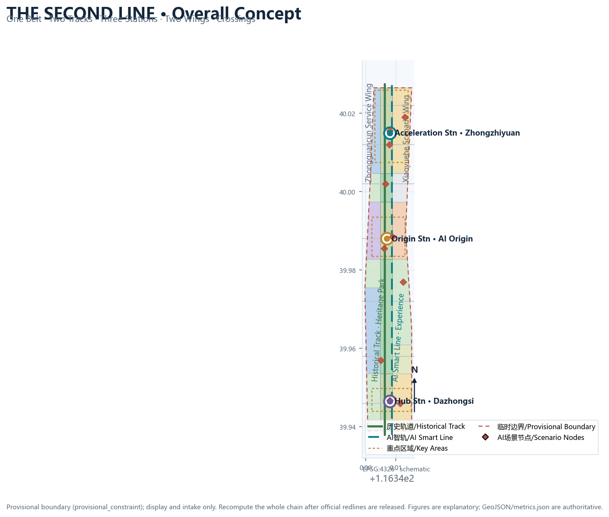
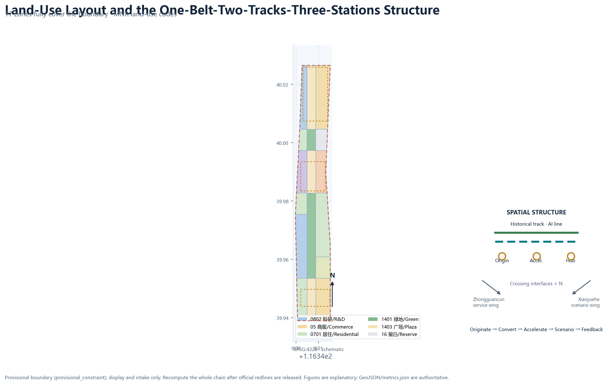
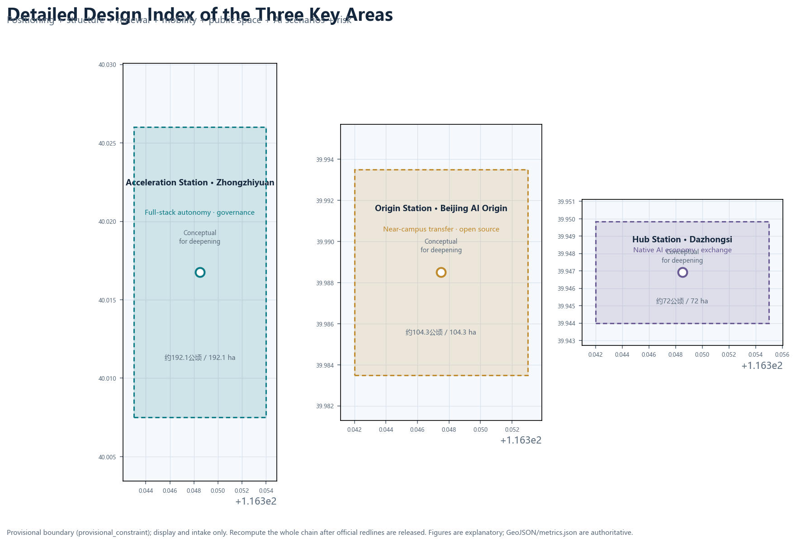
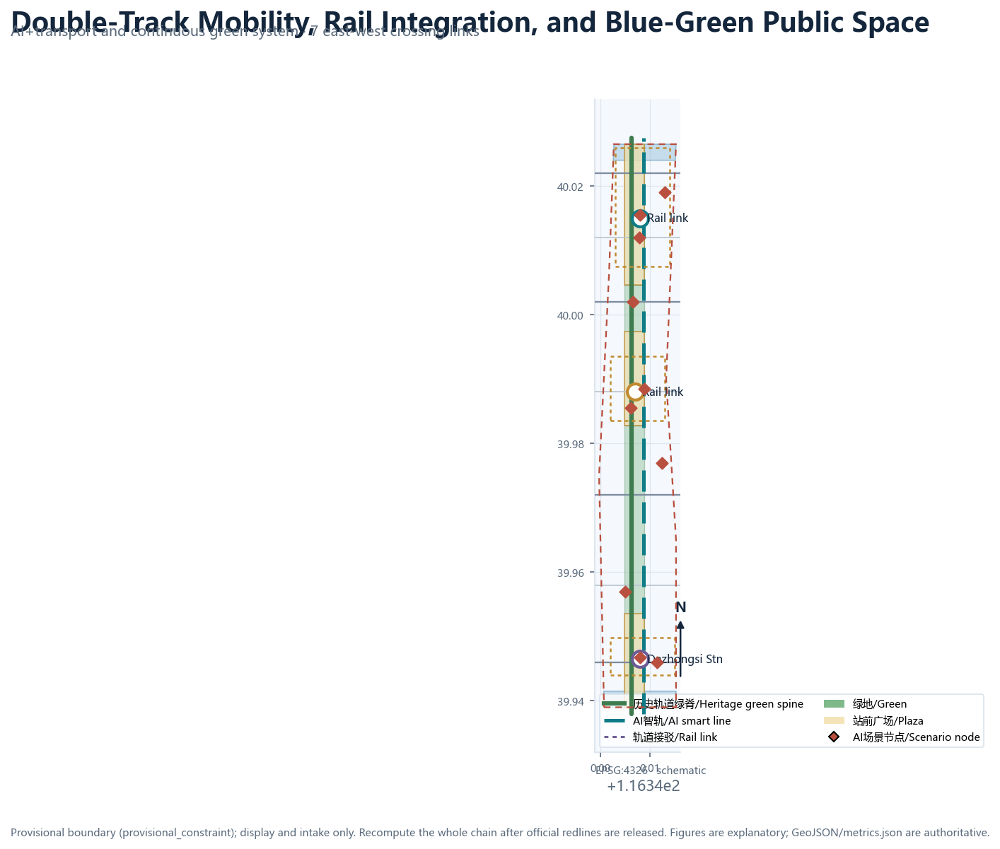
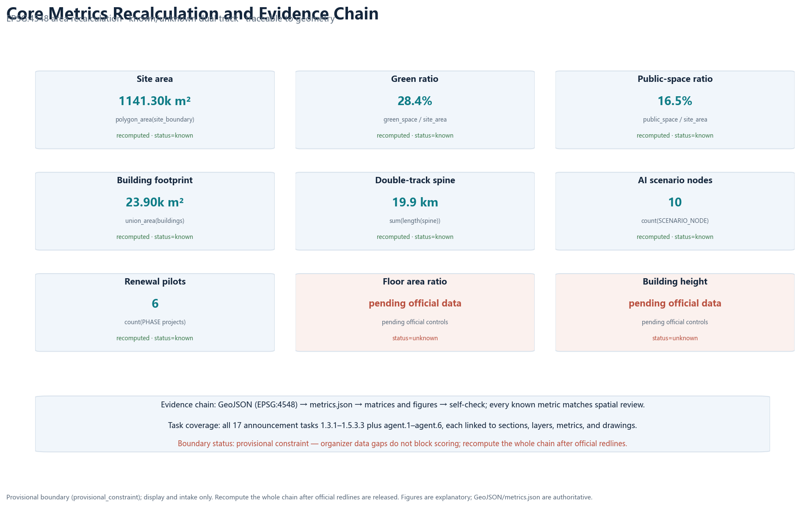

# The Second Line: Centennial Jingzhang AI Innovation Belt Urban Design Concept

## Design Basis and Source List

This proposal takes the Qualification Pre-announcement for the Centennial Jingzhang AI Innovation Belt International Urban Design Competition, published by the Haidian Branch of the Beijing Municipal Commission of Planning and Natural Resources, as its primary authority. The announcement defines the three-level scope (approximately 43.6 km² coordinated research area, 11.4 km² overall design area, and 368.4 ha key detailed-design area), the three key areas, the design tasks, the language requirements, and the expected depth of deliverables [source:OFFICIAL-ANNOUNCEMENT] [standard:PROJECT-OFFICIAL-ANNOUNCEMENT]. The agent-facing open-call taskbook further defines the three positioning statements, five functions, the three-areas-two-wings synergy, and six mandatory agent tasks, and it explicitly states that all spatial recommendations are open co-creation suggestions that do not replace formal planning [source:AGENT-TASKBOOK] [standard:PROJECT-AGENT-OPEN-CALL-TASKBOOK].

Before generating the proposal, I read the full design brief, the allowed design space, the source list, enums, planning limits, and schemas in `brief/site-package/`, as well as the source usability registry in `data/source_registry.json` and the navigation pack in `data/processed/agent_fact_pack.md` [source:SITE-PACKAGE] [source:SOURCE-REGISTRY] [source:PROCESSED-FACT-PACK]. Source boundaries are explicit: the official announcement supports scope and task judgments; public policies such as the "Three Areas and Two Wings" framework and Haidian's "1+X+1" industrial system serve as background; and the repository's provisional boundary (provisional_constraint) is used only for concept generation, display, and intake self-checks. It must never be treated as an official redline, an approval basis, or a precise area basis [source:PROVISIONAL-BOUNDARIES].

There are clear data gaps: the official precise boundaries, the three key-area polygons, regulatory-plan conditions (FAR, height, density, green ratio, setbacks), existing buildings and ownership, road redlines, heritage-protection ranges, and municipal utility data are not included in the public package. This proposal does not fabricate these data. Every affected conclusion is marked "pending official data" and fully disclosed in `assumptions.json`, `risk.json`, and the risk chapter below [data:geometry/constraints.geojson#CONST-CONTROLS-001] [depth:risk_missing_data]. Organizer data gaps do not block content scoring, but once official redlines are released, the boundary, key areas, land use, buildings, roads, green space, public space, phasing, and all metrics must be recomputed as one chain [metric:site_area_sqm].

This is a formal package using the v2 evidence contract: the prose keeps only a few claim-adjacent evidence markers, while the complete source, metric, standard, design-depth, and task coverage lives in `sources.json`, `metrics.json`, `standard_matrix.json`, `design_depth_matrix.json`, and `compliance_matrix.json` [depth:metrics_recalculation]. Chinese and English are equivalent bilingual versions; this English file is the complete standalone translation of `proposal.md`.

## Three-Level Scope Framework

The three scope levels are not three isolated drawings but a transmission chain from industrial strategy to overall design and then to detailed key-area implementation: the coordinated research area answers what kind of world-class AI innovation ecosystem to build; the overall design area answers which urban form and renewal path can carry it; and the key detailed-design area answers how the three critical districts land on the ground [standard:PROJECT-OFFICIAL-ANNOUNCEMENT].

| Level | Area and role | Work content of this proposal | Data anchor |
| --- | --- | --- | --- |
| Coordinated research area | ~43.6 km² | Full-stack AI ecosystem, future city form, three-areas-two-wings synergy, naming and logo direction | [data:geometry/site_boundary.geojson#SITE-001], [metric:site_area_sqm] |
| Overall design area | ~11.4 km² | Urban renewal framework, land-use layout, transport and municipal, blue-green network, urban character | [data:geometry/land_use.geojson#LU-001], [data:geometry/roads.geojson#ROAD-SPINE-1] |
| Key detailed-design area | ~368.4 ha | Detailed design of three key areas (functions, buildings, retain/renovate/demolish, public space, transport) | [data:geometry/key_areas.geojson#PROV-KEY-001], [metric:key_area_count] |

This proposal translates the three-level scope into an overall spatial structure of "one belt, two parallel tracks, three stations, two wings, and multiple crossing interfaces": the belt is the Jingzhang Heritage Park vitality corridor; the two tracks are the historical track (rail heritage and cultural narrative) and the AI smart line (innovation scenarios, blue-green slow mobility, and new infrastructure); the three stations correspond to the three key areas; the two wings are the Zhongguancun technology-service wing and the Xiaoyuehe scenario-empowerment wing; and the crossing interfaces stitch the east and west sides of the belt [depth:three_level_scope_framework] [depth:overall_spatial_structure].

It must be stated clearly: the overall design boundary and the three key areas used here are the repository's provisional boundaries (provisional_constraint, official_boundary=false). They serve concept generation, visualization, and self-checks only; rectangular or rough edges must not be interpreted as parcels, road redlines, or statutory lines. When official polygons are released, all layers and metrics of this proposal will be recomputed with the same scripted chain [source:PROVISIONAL-BOUNDARIES] [depth:metrics_recalculation].

## Coordinated Research Area: Industry and Future City Research

### The overall concept: The Second Line

In 1909 the Jingzhang Railway became the first trunk railway designed and built entirely by Chinese engineers. Zhan Tianyou used a switchback ("zigzag") alignment to climb the Badaling pass, creating the origin narrative of Chinese autonomous innovation. Today, understanding the Jingzhang AI Innovation Belt as "laying a second track for the century-old Jingzhang Railway"—an AI smart line composed of compute, data, models, scenarios, talent, and public value—continues that railway spirit while providing a clear naming and visual direction [source:OFFICIAL-ANNOUNCEMENT] [source:AGENT-TASKBOOK].

**Primary name**: Jingzhang Second Line (京张复线); **English name**: THE SECOND LINE · Jingzhang AI. Tagline: "One railway, a second line" (百年京张，第二条轨道). The naming system follows railway semantics: the three key areas are named the Origin Station (Beijing AI Origin Community), the Acceleration Station (Zhongzhiyuan AI Autonomous Innovation Acceleration Area), and the Hub Station (Dazhongsi AI Industry Cluster); the Zhongguancun technology-service wing is the Service Branch Line, and the Xiaoyuehe scenario-empowerment wing is the Scenario Branch Line; the east-west stitching interfaces are called "crossing interfaces" (道口·接口). This naming responds to the three positioning statements: the Centennial Jingzhang Cultural Belt (historical track), the Urban AI Life Experience Belt (everyday experience of the AI smart line), and the AI Convergence Innovation Belt (industrial function where the two tracks meet) [depth:overall_spatial_structure].

**Logo and visual identity direction**: the "Ren-shaped double track" mark. Taking Zhan Tianyou's zigzag alignment as the prototype, two rails are abstracted into an upward-converging "人" (person) shape—history and future, human and AI, meeting at the apex. Below the mark, a signal strip in cyan-blue, gold, and green represents technology, century-old honor, and public ecology. The visual system includes a double-track grid, turnout arrows, and station roundels applicable to signage, events, digital interfaces, and international communication. All typefaces and graphics use commercially reusable open assets; no corporate or institutional marks are borrowed [depth:height_massing_character] [source:CASE-KINGS-CROSS].

### Three positioning statements, five functions, and the three-areas-two-wings loop

The proposal translates the three positioning statements into a loop of five functions: the full-stack autonomous innovation system (carried by the Acceleration Station), the world-class AI innovation ecosystem (originated at the Origin Station and empowered by the two wings), the AI+ scenario-empowerment paradigm (carried by the Scenario Branch Line), the intelligent AI vitality city (carried by the double-track public realm), and global AI-governance discourse (carried by testing, validation, standards, and governance nodes) [source:AGENT-TASKBOOK] [standard:PROJECT-AGENT-OPEN-CALL-TASKBOOK].

The synergy loop is "origination—conversion—acceleration—scenario—feedback": universities and research institutes originate and co-create at the Origin Community; results enter Zhongzhiyuan for full-stack autonomous innovation and standards/governance validation; then Dazhongsi turns them into native AI business formats and international exchange scenarios; operating revenue and public data flow back to the Origin Community and the Zhongguancun service wing, closing the loop. The loop also aligns with the AI core industry and technology services in Haidian's "1+X+1" system, enabling the four "traffic flows" of talent, enterprises, capital, and scenarios to transfer between stations [source:HAIDIAN-1X1] [source:THREE-AREAS-WINGS].

### Global AI innovation ecosystem cases and transferable mechanisms

The proposal selects six public background cases as conceptual references only; they do not constitute planning grounds for Haidian parcels, and specific data must be verified through official channels:

| Case | Transferable mechanism |
| --- | --- |
| King's Cross, London: railway-heritage renewal + knowledge economy | Underused land beside the heritage park spine can be renewed to host AI enterprises and public cultural facilities [source:CASE-KINGS-CROSS] |
| Station F, Paris: a railway station converted into a startup incubator | Transport heritage buildings can host developer communities and startup services; the station becomes a community [source:CASE-STATION-F] |
| Kendall Square, Boston: university-adjacent technology transfer | Near-campus districts can organize labs, incubators, and demo/release spaces into a conversion loop [source:CASE-KENDALL] |
| one-north, Singapore: integrating industry, city, and people | Mixed-use districts with a green spine connect research clusters and everyday life [source:CASE-ONE-NORTH] |
| Shibuya Station, Tokyo: TOD and four-quadrant connectivity | Station-area integration, four-quadrant walkability, and station-city commerce [source:CASE-SHIBUYA] |
| Nanshan, Shenzhen: hardware and full-stack autonomous innovation | Full-stack chains and open test environments support autonomous innovation led by anchor enterprises [source:CASE-SHENZHEN-NANSHAN] |

### Future city form for the AI age

The proposal argues that the AI-age city form is not about covering streets with devices but about building an urban system that is "perceptible, interactive, exitable, and human-overridable": the AI smart line works as a readable spatial thread organizing autonomous shuttle links, robot delivery, public-space sensing, digital cultural guidance, and human review stations into continuous experience; the blue-green network provides an unbroken public ground, and the historical track provides cultural coordinates, together forming a "parallel tracks" city form of history and future [depth:blue_green_public_space] [metric:second_line_length_m].

## Overall Design Area: Urban Renewal and Regulatory-Plan-Level Urban Design

The overall design area takes urban renewal as the lever and reaches regulatory-plan-level urban design depth. The proposal establishes the "one belt, two tracks, three stations, two wings, multiple crossings" structure and realizes it in 17 land-use zones in `geometry/land_use.geojson`: a continuous green belt (1401/1403) along the heritage park spine; AI R&D (0802) and university co-creation education (0804) on the west side; industry services and commerce (05), culture (0803), residential and community services (0701/0702), and reserve land (16) on the east side—forming a balanced work-housing-commerce-service renewal pattern [data:geometry/land_use.geojson#LU-001] [depth:land_use_layout].

The renewal framework follows four principles: "protect heritage, fill functions, optimize form, control intensity." Protecting heritage means treating the Jingzhang Heritage Park and elements such as Qinghuayuan Station as a non-negotiable ground; filling functions means configuring R&D, incubation, display, testing, and talent services around AI industry gaps; optimizing form means organizing building interfaces and massing through the double-track green spine; controlling intensity means claiming no statutory FAR, height, or density conclusions before official regulatory conditions arrive [standard:MOHURD-CONTROL-DETAILED-PLANNING] [depth:development_intensity_controls]. Building footprints express the spatial-supply logic conceptually: 34 concept footprints cover R&D, labs, incubators, offices, mixed use, culture, talent apartments, and community services; after existing-building and ownership data are available, professional teams will deepen parcel by parcel [data:geometry/buildings.geojson#BLDG-001] [metric:building_count].

The functional layout responds to the announcement's requirement to study AI industry goals and functional proportions: AI R&D and industry services form the functional core, layered with culture, education co-creation, and talent life services, so that work, life, socializing, and learning happen continuously along the belt [source:OFFICIAL-ANNOUNCEMENT] [source:HAIDIAN-1X1]. The indicator system follows a "recomputable + pending confirmation" dual track: recomputable indicators (area, green ratio, public-space ratio, slow-mobility length, scenario-node counts, renewal-project counts) are supported by geometry and matrices; statutory intensity indicators (FAR, height, density, green-ratio control values) are marked as pending official regulatory conditions [metric:land_use_parcel_count] [metric:floor_area_ratio].

## Detailed Design of Key Areas

Each key area is organized with "positioning + spatial structure + building renewal + transport and slow mobility + public space + AI scenarios + implementation risk," reaching the depth direction of an integrated implementation plan. All conclusions are conceptual, and the key-area boundaries are provisional rough polygons [data:geometry/key_areas.geojson#PROV-KEY-001] [depth:three_key_area_detailed_design].

### Acceleration Station: Zhongzhiyuan AI Autonomous Innovation Acceleration Area (about 192.1 ha)

Positioned as a garden-style full-stack autonomous innovation district. The spatial structure is "one center, one axis, two belts": an autonomous-model testing and standards-governance center, a Qinghe cultural innovation axis, an R&D cluster belt, and a blue-green exchange belt. Building renewal focuses on R&D buildings, labs, incubators, and low-carbon compute experience facilities, forming a low-density garden research district; transport relies on external connections toward the Fifth Ring Road and an internal slow-mobility loop; public space is threaded by the Qinghe blue-green interface and garden greenways; AI scenarios include an autonomous-model safety test field, standards workshops, safety-governance display, and low-carbon compute experience; implementation risks include external transport conditions and flood/blue-line constraints requiring professional review [data:geometry/constraints.geojson#CONST-WATER-001] [metric:ai_service_zone_count].

### Origin Station: Beijing AI Origin Community (about 104.3 ha)

Positioned as a near-campus technology-transfer and talent community. The spatial structure stitches campus, park, and street: a "conversion street" connects university labs, incubators, and release halls, while station-adjacent areas organize talent services and residential renewal. Building renewal follows low-disturbance organic renewal, preserving community fabric and inserting shared labs, open-source workshops, and talent apartments; transport integrates stations such as Qinghua East Road West and Wudaokou with campus-park slow mobility; AI scenarios include the Origin Academy, a developer-service Copilot station, result releases, and open-source co-creation; implementation risks include campus boundaries, ownership, and heritage ranges pending confirmation [data:geometry/roads.geojson#ROAD-CROSS-04] [source:CASE-KENDALL].

### Hub Station: Dazhongsi AI Industry Cluster (about 72 ha)

Positioned as an urban smart-economy and international-exchange district. The spatial structure centers on the "four quadrants of Dazhongsi Station": native AI consumption, industry offices, data-element services, and public experience, with the station and key parcels integrated. Building renewal focuses on mixed use and commerce, improving the public environment around anchor enterprises; transport addresses four-quadrant pedestrian connectivity and non-motorized parking around the Dazhongsi intersection; AI scenarios include smart-terminal and content consumption, data-element registration, international roadshows, and AI+ life services; implementation risks include station-area engineering, utilities, and operating entities requiring professional deepening [data:geometry/key_areas.geojson#PROV-KEY-003] [source:CASE-SHIBUYA].

## AI Innovation Ecosystem, Personas, and AI+ Scenarios

### Innovation ecosystem map

The proposal organizes the AI ecosystem as "one chain, five layers": original innovation (universities and institutes), open-source collaboration (developer communities and platforms), conversion and acceleration (incubators, accelerators, and industry funds), application scenarios (AI+ vertical industries and public scenarios), and governance support (testing, standards, and safety governance). Zhongzhiyuan carries full-stack autonomy and governance validation, the Origin Community carries origination and open source, Dazhongsi carries scenarios and internationalization, and the two wings provide technology services and scenario empowerment [source:AGENT-TASKBOOK] [standard:PROJECT-AGENT-OPEN-CALL-TASKBOOK].

### User personas (6 types)

| Persona | Core needs | Spatial and service anchors |
| --- | --- | --- |
| University researcher | Labs, cross-disciplinary cooperation, technology transfer | R&D and conversion spaces and shared labs in the Origin Community [source:CASE-KENDALL] |
| Startup founder and open-source developer | Low-cost start, community, demo and release | Incubators, open-source workshops, release halls [source:CASE-STATION-F] |
| AI enterprise engineer and product manager | Office, testing, scenario validation | Testing and validation zone and industry services in Zhongzhiyuan |
| Tech-service provider and investor | Roadshows, compliance, data-element services | International roadshow and data-element service spaces in Dazhongsi |
| Community resident, elder, and child | Life services, public space, safety | 15-minute AI life circle, community services, human service channels |
| Tourist and international visitor | Culture, accessible guidance | Digital time-train, bilingual signage, public experience route |

### AI scenario cards (12, including 3 industry testing and validation scenarios)

Each card states its spatial anchor, users, operational data, privacy boundary, human review, operating entity, and risk; the prose lists the core content while the full mapping lives in `compliance_matrix.json` and the HTML display [depth:three_key_area_detailed_design] [metric:ai_scenario_node_count].

| ID | Scenario | Spatial node | Type |
| --- | --- | --- | --- |
| SC-01 | Second-line smart-track slow-mobility priority signals | Double-track spine and crossings | AI+transport |
| SC-02 | Digital time-train: century-old Jingzhang cultural guide | Heritage park spine | AI+culture |
| SC-03 | AI+health service navigation kiosks | Communities and stations | AI+life services |
| SC-04 | Developer Copilot and enterprise-service brain | Origin Community/Zhongguancun wing | AI+enterprise services |
| SC-05 | Public-safety operations human-review station | Stations and public space | AI+governance |
| SC-06 | Low-speed robot delivery and inspection | Campus and community branch roads | Robotics and autonomous mobility |
| SC-07 | Origin Academy and result release | Origin Community | AI+education |
| SC-08 | AI compliance sandbox and data-element registration | Dazhongsi | Industry testing/validation |
| SC-09 | 15-minute AI life circle service terminals | Residential clusters | AI+life services |
| SC-10 | Autonomous-model safety test field | Zhongzhiyuan | Industry testing/validation |
| SC-11 | Open-source and compute benchmark test bench | Origin Community | Industry testing/validation |
| SC-12 | Second-line signals: public-space status visualization | Belt-wide public space | AI+public space |

All scenarios follow minimal data collection, anonymization, human review, and public-data boundaries; scenarios involving privacy harm, excessive surveillance, or impossible human review are excluded; immature technologies are marked with pilot boundaries and never described as fully deployable [source:AGENT-TASKBOOK] [depth:risk_missing_data].

## Land Use, Building Scale, and Retain-Renovate-Demolish Strategy

Land use follows the principle of "green spine centered, R&D as the main body, commerce and services supportive, and life balanced." The 17 zones fully cover the submitted boundary without gaps or overlaps, and codes follow the registered subset of the National Land-Use Classification Guide [data:geometry/land_use.geojson#LU-001] [standard:MNR-LAND-USE-CLASSIFICATION-GUIDE]. Building scale is expressed at a conceptual level: 34 concept footprints totaling about 239,070 m² (recomputed in EPSG:4548), dominated by R&D and industry services, layered with talent apartments, culture, and community services [metric:building_footprint_area_sqm] [metric:building_count].

The retain-renovate-demolish strategy is expressed by principle and type rather than parcel-level conclusions: retained objects are heritage elements, quality existing buildings, and community fabric; renovated objects are underperforming buildings, campuses, and street frontages; new objects fill industry-space and public-facility gaps; demolition is decided by professional teams only after official existing-building and ownership data are confirmed. Before official regulatory conditions, existing buildings, and ownership data are available, this proposal makes no FAR, height, density, or specific retain/renovate/demolish conclusions [depth:retain_renovate_demolish] [depth:development_intensity_controls].

## Transport, Rail, Municipal Infrastructure, and Public Services

The transport strategy is built on "double-track slow mobility as the skeleton, three-station integration as nodes, and crossing interfaces as connectors": two north-south slow-mobility spines (historical track and AI smart line) run through the belt, seven east-west crossing connectors stitch the two sides, forming a three-tier network of station, slow-mobility spine, and neighborhood microcirculation [data:geometry/roads.geojson#ROAD-SPINE-1] [metric:road_network_length_m]. Station-area integration is designed around Wudaokou/Qinghua East Road West, Dazhongsi Station, and Zhongzhiyuan's external links; at Dazhongsi, four-quadrant pedestrian connectivity and non-motorized parking are the priorities [source:CASE-SHIBUYA].

Municipal and new infrastructure follow a "conventional facilities + AI new infrastructure" integration path: distributed energy and edge-compute nodes combine with campuses and public space; AI industry-service facilities and innovation-service platforms are arranged along the smart line; talent life services follow the 15-minute life circle. Utility lines, fire safety, flood control, and sponge-city indicators are missing, so these strategies remain directional and require professional review once data are available [depth:municipal_new_infrastructure] [depth:traffic_rail_slow_parking].

## Blue-Green Network, Public Space, and Urban Character

The blue-green system is organized as "two tracks, one spine, multiple parks": the historical track and the AI smart line form a double-track green spine connecting the Qinghe and Xiaoyuehe blue-green interfaces and station plazas; the heritage park vitality corridor acts as the public ground carrying walking, cycling, sports, innovation exchange, and tech testing/display functions. Green ratio and public-space ratio are recomputed from geometry layers (see the metrics chapter) to explain how the blue-green system supports talent life and innovation exchange [data:geometry/green_space.geojson#GREEN-001] [metric:green_ratio] [metric:public_space_ratio].

AI public space is implemented through a "component library + honor display + pilgrimage landmarks" package. The component library includes smart seating, information kiosks, accessible guidance, event power, and reversible sensing-device interfaces for belt-wide reuse. The honor display system centers on a "Jingzhang Contributors Wall": open-source contributors, developers, and public participants are recorded through physical plaques and digital rosters, forming memorable and traceable public knowledge assets [source:AGENT-TASKBOOK] [depth:blue_green_public_space].

The proposal offers three AI pilgrimage landmarks (concept nodes): the **Ren-shaped Convergence Plaza** on the heritage park spine, honoring Zhan Tianyou's zigzag alignment with a "人"-shaped paving and a double-track sculpture expressing human-AI companionship; the **First Line of Code Stele** in the Origin Community, commemorating Zhongguancun's first-generation innovation and the open-source spirit, with result-release and honor-display functions; and the **Second-Line Convergence Turnout** at the Dazhongsi four quadrants, expressing where history and future meet. All three are conceptual; construction would require heritage, planning, and public-participation procedures and is not claimed as approved [depth:three_key_area_detailed_design] [data:geometry/public_space.geojson#PUBLIC-001].

Urban character uses "heritage gray-blue + technology cyan-blue + ecology green" as the base palette and proposes guidance directions for building frontage, roof form, massing, and height; specific height and intensity controls wait for official regulatory conditions [standard:MOHURD-URBAN-DESIGN-MEASURES] [depth:height_massing_character].

## Renewal Projects, Implementation Policy, and Phasing

The renewal project list follows "stations first, green spine first, industry space next." Six pilot projects each state location, type, dependencies, and implementation suggestions: Dazhongsi Station four-quadrant walkability renewal; Dazhongsi native AI consumption block; Origin Community conversion street; Origin Community talent services and residential renewal; Zhongzhiyuan autonomous-model test field renewal; and Zhongzhiyuan Qinghe innovation interface renewal [data:geometry/phasing.geojson#PRJ-001] [metric:renewal_project_count]. Implementation policy suggestions cover coordinated renewal, spatial supply, scenario opening, data governance, public participation, and property-rights coordination; all are conceptual, and implementing entities, funding, and approval paths require professional and governmental deepening [depth:renewal_project_list].

Phasing has three periods: near-term (2026-2028) pilots the Origin Community and Dazhongsi and opens the heritage park vitality corridor; mid-term (2029-2031) advances Zhongzhiyuan and the Zhongguancun technology-service wing; long-term (2032-2035) completes targeted reserve-land introduction and belt-wide long-term operation [data:geometry/phasing.geojson#PHASE-001] [depth:phasing_implementation].

Long-term operation proposes a "Second-Line Timetable" annual event system: the Spring "Departure Festival" (Origin Community releases and open-source co-creation), Summer "Acceleration Camp" (Zhongzhiyuan testing/validation and accelerator roadshows), Autumn "Convergence Festival" (Dazhongsi international exchange and scenario experience), and Winter "Review Congress" (annual evaluation and governance dialogue). Supporting mechanisms include developer-community biweekly sprints, scenario-opening applications with human review, public experience routes, international communication, and attraction-to-conversion pathways. All events and operations are conceptual and are not stated as confirmed arrangements [source:AGENT-TASKBOOK] [source:CASE-STATION-F].

## Metrics, Area Recalculation, and Compliance Matrix

The design meaning of core indicators: the **site area** constrains the total spatial allocation (about 1,141 ha under the provisional boundary); the **green ratio** explains how the blue-green ground supports innovation exchange and ecology; the **public-space ratio** explains how station plazas and public nodes carry daily stays and events; the **building footprint** expresses the conceptual scale of industry-space supply; the **slow-mobility length** indicates the connectivity of the double-track spine; and the **scenario-node and renewal-project counts** make AI scenarios and implementation levers countable and auditable [metric:site_area_sqm] [metric:green_ratio] [metric:public_space_ratio].

| Indicator | Value (provisional boundary) | Formula and source |
| --- | --- | --- |
| Overall design area | 11,412,825 m² | polygon_area(site_boundary) in EPSG:4548 [data:geometry/site_boundary.geojson#SITE-001] |
| Green ratio | 28.4% | green_space_area / site_area [data:geometry/green_space.geojson#GREEN-001] |
| Public-space ratio | 16.5% | public_space_area / site_area [data:geometry/public_space.geojson#PUBLIC-001] |
| Building footprint | about 239,070 m² | union_area(building_footprints) [data:geometry/buildings.geojson#BLDG-001] |
| Double-track slow-mobility spine | about 19.9 km (19,875.9 m) | sum(length(double-track spine)) in EPSG:4548 [data:geometry/roads.geojson#ROAD-SPINE-1] |
| Scenario nodes / service zones / renewal projects | 10 / 3 / 6 | layer feature counts [data:geometry/constraints.geojson#SCNODE-001] |
| Key areas | 3 | count(key_areas) [data:geometry/key_areas.geojson#PROV-KEY-001] |

Every metric is stored in `metrics.json` with formula, unit, source files, confidence, and assumptions; all known metrics are recomputed from geometry, and unknown metrics (FAR, height, density) state their reasons and completion conditions [depth:metrics_recalculation] [metric:floor_area_ratio]. For task coverage, `compliance_matrix.json` covers all 17 mandatory announcement tasks from 1.3.1 to 1.5.3.3 and the six agent tasks agent.1 through agent.6, each linked to sections, layers, metrics, drawings, HTML sections, sources, and assumptions [source:OFFICIAL-ANNOUNCEMENT] [source:AGENT-TASKBOOK].

## Risk, Copyright, and Compliance

All spatial recommendations in this proposal are conceptual suggestions, reference schemes, or material for professional teams to deepen; they do not replace formal planning and do not constitute government-approved conclusions [source:AGENT-TASKBOOK]. Data legality: only official announcements, public policies, repository-registered materials, and user-provided cleared materials are used; no non-public spatial data is used, and all sources are recorded in `sources.json` with publisher, date, link, access time, and use boundary [source:SOURCE-REGISTRY]. Copyright: the text, geometry, diagrams, HTML, and PDFs are generated by the declared AI agent or use cleared public materials; the logo and visual direction use commercially reusable open assets and borrow no corporate, institutional, or personal marks; the copyright statement is in `report/copyright_statement.md` [depth:risk_missing_data].

The risk list in `risk.json` covers eight dimensions—data privacy, implementation complexity, public acceptance, operations cost, policy uncertainty, spatial dispute, technology maturity, and equity/inclusion—each with explanation and mitigation [source:PROCESSED-FACT-PACK]. Provisional-boundary and missing-data risks are repeatedly disclosed in the prose, assumptions, self-check, and HTML; when official boundaries, regulatory controls, roads, heritage, and utility data arrive, this proposal will be recomputed as one chain and re-checked [data:geometry/constraints.geojson#CONST-CONTROLS-001] [metric:site_area_sqm].

## References

The following are the main human-readable materials that shaped this proposal; the complete machine index lives in `sources.json` and the three matrices [standard:PROJECT-OFFICIAL-ANNOUNCEMENT] [source:AGENT-TASKBOOK].

1. Haidian Branch, Beijing Municipal Commission of Planning and Natural Resources, "Qualification Pre-announcement for the Centennial Jingzhang AI Innovation Belt International Urban Design Competition," 2026-05-09 (official).
2. Agent-facing Open-Call Taskbook excerpt (user-provided cleared document), 2026-05-18.
3. Beijing Municipal Science & Technology Commission and Zhongguancun Administrative Committee, "'Three Areas and Two Wings' toward a World-Class AI Cluster," 2026-04-03.
4. Haidian District People's Government, "Haidian Releases the '1+X+1' Modern Industrial System Layout," 2026-03-02.
5. Ministry of Housing and Urban-Rural Development, "Measures for Urban Design Administration," 2017.
6. Ministry of Housing and Urban-Rural Development, "Measures for Compilation and Approval of Regulatory Detailed Plans for Cities and Towns," 2011.
7. Ministry of Natural Resources, "Guidelines for Land/Sea Use Classification for Territorial Spatial Survey, Planning, and Use Control," 2023-11-22.
8. King's Cross Central, public materials on King's Cross regeneration (background case).
9. Station F, public materials on the Paris startup incubator (background case).
10. Kendall Square Association, public materials (background case).
11. JTC Corporation, one-north public materials (background case).
12. Shibuya City/Tokyu, public materials on Shibuya Station redevelopment (background case).
13. Nanshan District People's Government, Shenzhen, public materials on innovation ecosystem (background case).
