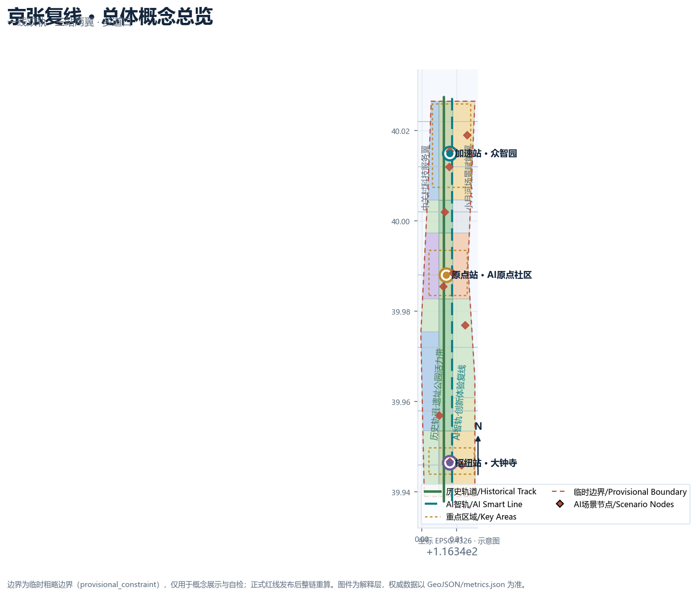
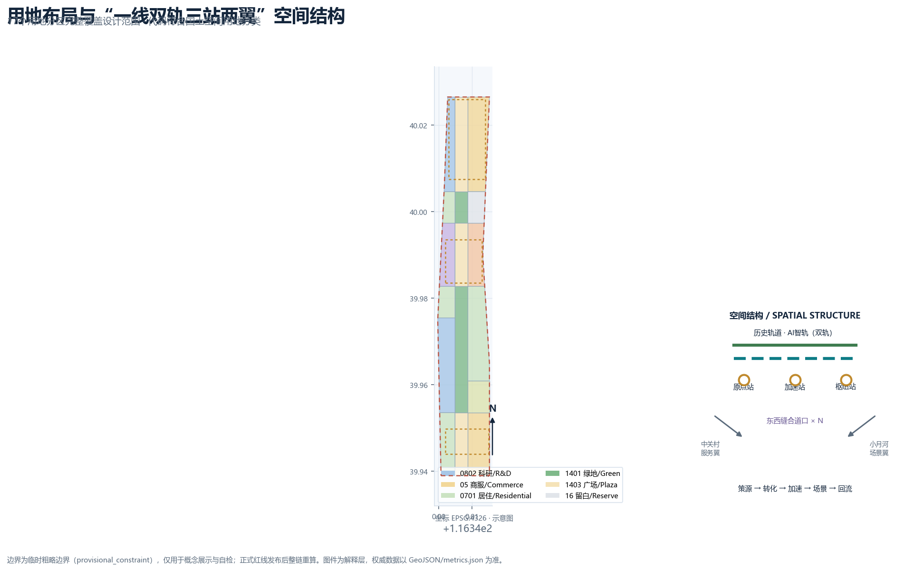
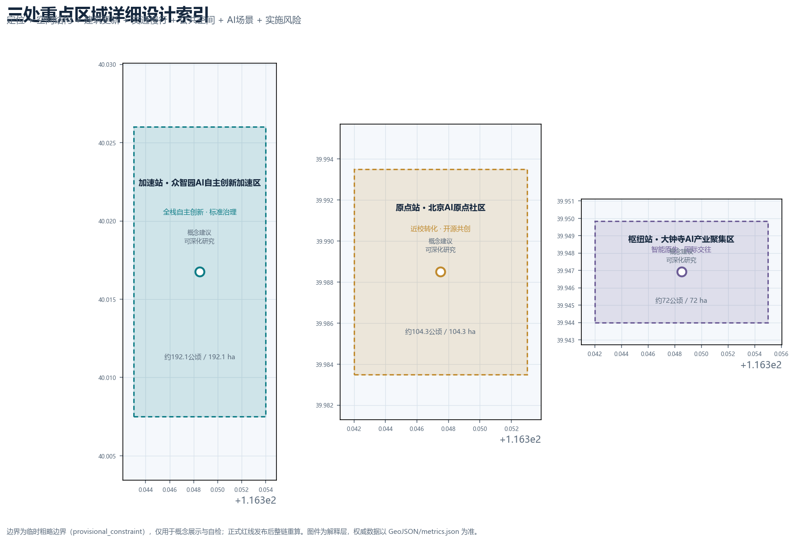
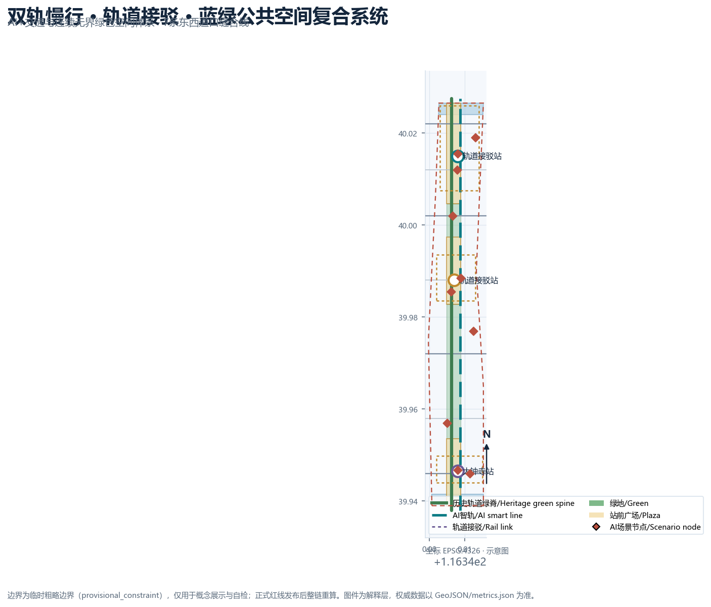
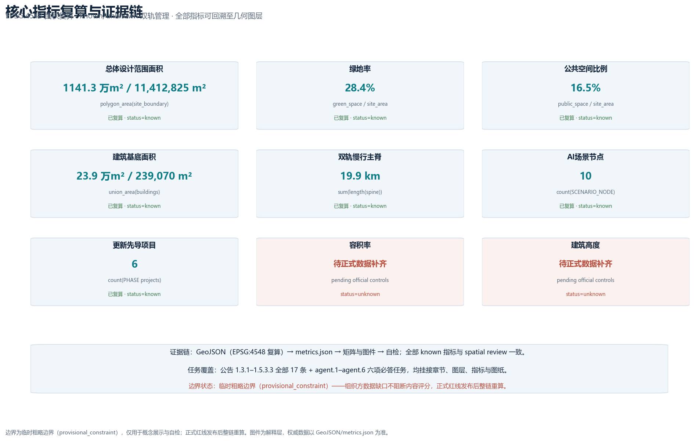

# 京张复线 · The Second Line：百年京张AI创新带城市设计概念方案

## 设计依据与资料清单

本方案以北京市规划和自然资源委员会海淀分局发布的《百年京张AI创新带城市设计国际方案征集资格预审公告》为第一依据，公告界定了统筹研究范围（约43.6平方公里）、总体设计范围（约11.4平方公里）与重点区域范围（约368.4公顷）三层结构，以及三处重点区域、设计任务、语言与成果深度要求 [source:OFFICIAL-ANNOUNCEMENT] [standard:PROJECT-OFFICIAL-ANNOUNCEMENT]。面向智能体的开源征集任务书进一步规定了三大定位、五大功能、三区两翼协同与 agent.1 至 agent.6 六项必答任务，并明确所有空间建议均为开放共创建议、不替代正式规划 [source:AGENT-TASKBOOK] [standard:PROJECT-AGENT-OPEN-CALL-TASKBOOK]。

方案生成前，我完整读取了 `brief/site-package/` 中的设计任务书、允许设计空间、来源清单、枚举、规划限值与模式文件，以及 `data/source_registry.json` 的用途登记和 `data/processed/agent_fact_pack.md` 的阅读导航 [source:SITE-PACKAGE] [source:SOURCE-REGISTRY] [source:PROCESSED-FACT-PACK]。资料来源边界明确：官方公告可用于范围与任务判断；三区两翼、海淀“1+X+1”产业体系等公开政策作为背景资料；仓库提供的临时粗略边界（provisional_constraint）仅用于方案生成、展示与入口自检，不得作为官方红线、审批依据或精确面积依据 [source:PROVISIONAL-BOUNDARIES]。

场地资料存在明确缺口：官方精确边界、三处重点区域 polygon、控规条件（容积率、高度、密度、绿地率、退线）、现状建筑与权属、道路红线、文保范围、市政管线均未纳入公开资料包。本方案不编造这些数据，所有受影响结论均标注为“待正式数据补齐”，并在 `assumptions.json`、`risk.json` 与正文风险章节完整披露 [data:geometry/constraints.geojson#CONST-CONTROLS-001] [depth:risk_missing_data]。组织方资料缺口不阻断内容评分，但正式红线发布后，边界、重点区、用地、建筑、道路、绿地、公共空间、分期与全部指标必须整链重算 [metric:site_area_sqm]。

本方案为正式参赛包，采用 v2 证据契约：正文只保留与判断直接相关的少量证据标记，完整来源、指标、标准、设计深度与任务覆盖分别保存在 `sources.json`、`metrics.json`、`standard_matrix.json`、`design_depth_matrix.json` 与 `compliance_matrix.json` 中 [depth:metrics_recalculation]。中英文为等义双语版本，`proposal.en.md` 为完整独立译文。

## 三层范围工作框架

三层范围不是三张孤立的图，而是从产业战略到总体设计再到重点片区实施的传导链条：统筹研究范围回答“建什么样的世界级AI创新生态”，总体设计范围回答“用什么城市形态和更新路径承接”，重点区域范围回答“三个关键片区如何落地” [standard:PROJECT-OFFICIAL-ANNOUNCEMENT]。

| 层级 | 面积与定位 | 本方案的工作内容 | 数据落点 |
| --- | --- | --- | --- |
| 统筹研究范围 | 约43.6平方公里 | AI全栈创新生态、未来城市形态、三区两翼协同、命名与Logo方向 | [data:geometry/site_boundary.geojson#SITE-001]、[metric:site_area_sqm] |
| 总体设计范围 | 约11.4平方公里 | 城市更新总体框架、用地布局、交通市政、蓝绿系统、风貌控制 | [data:geometry/land_use.geojson#LU-001]、[data:geometry/roads.geojson#ROAD-SPINE-1] |
| 重点区域范围 | 约368.4公顷 | 三处重点片区详细设计（功能、建筑、拆改留、公共空间、交通） | [data:geometry/key_areas.geojson#PROV-KEY-001]、[metric:key_area_count] |

本方案把三层范围落实为“一线双轨、三站两翼、多道口”的总体空间结构：一线指京张遗址公园活力带；双轨指历史轨道（京张铁路遗产与文化叙事）与AI智轨（创新场景、蓝绿慢行与新型基础设施）两条平行主线；三站对应三处重点区域；两翼对应中关村科技服务翼与小月河场景赋能翼；多道口指东西缝合的步行与场景接口 [depth:three_level_scope_framework] [depth:overall_spatial_structure]。

必须说明：本方案使用的总体设计边界与三处重点区均为仓库提供的临时粗略边界（provisional_constraint、official_boundary=false）。它们只用于概念生成、可视化与自检，矩形或粗略边不得解释为地块、道路红线或法定界线；官方polygon发布后，本方案全部图层与指标将按同一套脚本整链重算 [source:PROVISIONAL-BOUNDARIES] [depth:metrics_recalculation]。

## 统筹研究范围产业与未来城市研究

### 总体概念：京张复线

1909年，京张铁路是第一条完全由中国人自主设计建造的干线铁路。詹天佑用“人字形”线路翻越八达岭，是中国自主创新的原点叙事。今天，把京张AI创新带理解为“为百年京张铺设第二条轨道”——一条由算力、数据、模型、场景、人才与公共价值构成的AI智轨——既延续了铁路精神，也给出清晰的命名与视觉方向 [source:OFFICIAL-ANNOUNCEMENT] [source:AGENT-TASKBOOK]。

**主名称**：京张复线；**英文名**：THE SECOND LINE · Jingzhang AI。副标题：“百年京张，第二条轨道”（One railway, a second line）。命名体系沿铁路语义展开：三处重点区域分别命名为“原点站”（北京AI原点社区）、“加速站”（众智园AI自主创新加速区）与“枢纽站”（大钟寺AI产业聚集区）；中关村科技服务翼为“服务支线”，小月河场景赋能翼为“场景支线”；东西缝合接口称为“道口·接口”。该命名体系同时回应三大定位：百年京张文化带（历史轨道）、都市AI生活体验带（AI智轨的日常体验）、AI融合创新带（双轨交汇的产业功能）[depth:overall_spatial_structure]。

**Logo与视觉识别方向**：“人字双轨”标识。以詹天佑人字形线路为原型，把两条钢轨抽象为向上交汇的“人”字双臂——历史与未来、人与AI在顶点相遇；图形下方延伸出复线信号条（青蓝-金色-绿色），分别代表科技、百年荣誉与公共生态。视觉系统包含双轨网格、道岔箭头与站点圆标，适用于导视、活动、数字界面与国际传播，全部字体与图形采用可商用开源素材，不挪用任何企业或机构标识 [depth:height_massing_character] [source:CASE-KINGS-CROSS]。

### 三大定位、五大功能与三区两翼协同回路

方案把三大定位（百年京张文化带、都市AI生活体验带、AI融合创新带）转译为五大功能的复线回路：AI全栈自主创新体系（加速站承担）、世界级AI创新生态（原点站策源、两翼赋能）、AI+场景赋能新范式（场景支线承担）、智能化AI活力城市（双轨公共空间承担）、AI治理全球话语权（测试验证与标准治理节点承担）[source:AGENT-TASKBOOK] [standard:PROJECT-AGENT-OPEN-CALL-TASKBOOK]。

协同回路为“策源—转化—加速—场景—回流”：高校与科研机构在原点社区完成策源与开源协作，成果进入众智园完成全栈自主创新与标准治理验证，再到大钟寺形成智能原生业态与国际交往场景，运营收益与公共数据回流反哺原点社区与中关村科技服务翼，形成闭环。该回路同时对接海淀“1+X+1”产业体系中的AI核心产业与科技服务业，服务人才、企业、资本与场景四股“车流”在站点间换乘 [source:HAIDIAN-1X1] [source:THREE-AREAS-WINGS]。

### 全球AI创新生态案例与可转化机制

方案选取6个公开背景案例，只作为概念参照，不构成对海淀地块的规划依据，具体数据需经官方渠道复核：

| 案例 | 可转化机制 |
| --- | --- |
| 伦敦国王十字：铁路遗产更新+知识经济 | 遗址公园主轴两侧低效空间以更新方式引入AI企业与公共文化设施 [source:CASE-KINGS-CROSS] |
| 巴黎Station F：火车站改造为创业孵化器 | 利用交通遗产建筑承载开发者社区与创业服务，站点即社区 [source:CASE-STATION-F] |
| 波士顿肯德尔广场：高校周边成果转化 | 近校街区组织实验室、孵化器与成果发布空间，形成转化闭环 [source:CASE-KENDALL] |
| 新加坡纬壹科技城：产城人融合 | 工作-生活-学习-社交一体化混合街区，绿脊串联研发组团 [source:CASE-ONE-NORTH] |
| 东京涩谷站：TOD与四象限连通 | 轨道站点一体化、四象限步行连通与站城商业协同 [source:CASE-SHIBUYA] |
| 深圳南山：硬件与全栈自主创新 | 全栈链条与开放测试环境支撑自主创新，龙头企业牵引生态 [source:CASE-SHENZHEN-NANSHAN] |

### 面向AI的未来城市形态

方案认为AI时代的城市形态不是把技术设备铺满街道，而是建立“可感知、可交互、可退出、可人工接管”的城市系统：AI智轨作为一条可读的空间线索，把无人驾驶接驳、机器人配送、公共空间感知、数字文化导览与人工复核席组织成连续体验；蓝绿空间提供无界连续的公共底盘，历史轨道提供文化坐标，两者共同构成“历史与未来并行”的复线城市形态 [depth:blue_green_public_space] [metric:second_line_length_m]。

## 总体设计范围城市更新与控规深度城市设计

总体设计范围以城市更新为抓手，达到控制性详细规划的城市设计深度。本方案提出“一线双轨、三站两翼、多道口”的空间结构，并在 `geometry/land_use.geojson` 中落实为17个用地分区：沿遗址公园主轴设置连续绿带（1401/1403），西侧组织AI研发科研用地（0802）与高校协同教育用地（0804），东侧组织产业服务与商业用地（05）、文化展示用地（0803）、居住与社区服务用地（0701/0702）及留白用地（16），形成职住商服均衡的更新格局 [data:geometry/land_use.geojson#LU-001] [depth:land_use_layout]。

更新总体框架遵循“保文脉、补功能、优形态、控强度”四条原则：保文脉指以京张遗址公园与清华园车站等遗产要素为不可动底盘；补功能指围绕AI产业缺口配置研发、孵化、展示、测试与人才服务空间；优形态指以双轨绿脊组织建筑界面与高度体量关系；控强度指在官方控规条件补齐前，不主张任何法定容积率、高度或密度结论 [standard:MOHURD-CONTROL-DETAILED-PLANNING] [depth:development_intensity_controls]。建筑基底以概念示意表达空间供给逻辑，34处建筑示意覆盖研发、实验室、孵化器、办公、混合功能、文化、人才公寓与社区服务等类型，现状建筑与权属资料补齐后由专业团队逐地块深化 [data:geometry/buildings.geojson#BLDG-001] [metric:building_count]。

功能布局回应公告对AI产业目标与功能比例的研判要求：以AI研发与产业服务为功能主体，叠加文化展示、教育协同与人才生活服务，使“工作-生活-社交-学习”在一带内连续发生 [source:OFFICIAL-ANNOUNCEMENT] [source:HAIDIAN-1X1]。规划指标体系采用“可复算+待确认”双轨制：可复算指标（范围面积、绿地率、公共空间比例、慢行长度、场景节点数、更新项目数）由几何与矩阵支撑；法定强度指标（容积率、高度、密度、绿地率控制值）标注为待正式控规条件补齐 [metric:land_use_parcel_count] [metric:floor_area_ratio]。

## 重点区域详细设计

三处重点区域均以“定位+空间结构+建筑更新+交通慢行+公共空间+AI场景+实施风险”组织详细设计，达到规划综合实施方案方向的设计深度，全部结论为概念建议，重点区边界为临时粗略polygon [data:geometry/key_areas.geojson#PROV-KEY-001] [depth:three_key_area_detailed_design]。

### 加速站：众智园AI自主创新加速区（约192.1公顷）

定位为花园型全栈自主创新街区。空间结构为“一心一轴两带”：自主模型测试与标准治理中心、清河文化创新轴、研发组团带与蓝绿交往带。建筑更新以研发楼、实验室、孵化器与低碳算力体验设施为主，形成低密度花园式科研街区；交通组织依托五环路方向对外联系与园区内部慢行环路；公共空间以清河蓝绿界面和花园绿带串联；AI场景包括自主模型安全测试场、标准制定工作坊、安全治理展示与低碳算力体验；实施风险为对外交通条件、防洪与蓝线约束待专业复核 [data:geometry/constraints.geojson#CONST-WATER-001] [metric:ai_service_zone_count]。

### 原点站：北京AI原点社区（约104.3公顷）

定位为近校型成果转化与人才社区。空间结构为“校-园-街缝合”：“成果转化街”串联高校实验室、孵化器与成果发布厅，站点周边组织人才服务与居住更新。建筑更新以低扰动、有机更新为主，保留社区肌理，植入共享实验室、开源工坊与人才公寓；交通组织围绕清华东路西口、五道口等轨道站点开展一体化设计，优化校区-园区慢行联系；AI场景包括原点学堂、开发者服务Copilot站、成果发布与开源共创；实施风险为校区边界、权属与文保范围待确认 [data:geometry/roads.geojson#ROAD-CROSS-04] [source:CASE-KENDALL]。

### 枢纽站：大钟寺AI产业聚集区（约72公顷）

定位为城市型智能经济与国际交往街区。空间结构以“大钟寺站四象限”为核心：四个象限分别承担智能原生消费、产业办公、数据要素服务与公共体验，轨道站点与重点地块一体化连通。建筑更新以混合功能与商业服务为主，提升重点企业周边公共环境；交通组织重点解决大钟寺站所在路口四象限步行连通与非机动车停放；AI场景包括智能终端与内容消费体验、数据要素登记、国际路演与AI+生活服务；实施风险为站域工程、管线与运营主体待专业深化 [data:geometry/key_areas.geojson#PROV-KEY-003] [source:CASE-SHIBUYA]。

## AI 创新生态、人才画像与 AI+ 场景

### 创新生态图谱

方案把AI创新生态组织为“一链五层”：原始创新层（高校院所）、开源协作层（开发者社区与开源平台）、转化加速层（孵化器、加速器与产业基金）、应用场景层（AI+垂直行业与公共场景）、治理支撑层（测试验证、标准与安全治理）。众智园承担全栈自主与治理验证，原点社区承担策源与开源，大钟寺承担场景与国际化，两翼提供科技服务与场景赋能 [source:AGENT-TASKBOOK] [standard:PROJECT-AGENT-OPEN-CALL-TASKBOOK]。

### 用户画像（6类）

| 画像 | 核心诉求 | 空间与服务落点 |
| --- | --- | --- |
| 高校科研人员 | 实验室、交叉合作、成果转化 | 原点社区科研与转化空间、共享实验室 [source:CASE-KENDALL] |
| 创业者与开源开发者 | 低成本启动、社区、展示发布 | 孵化器、开源工坊、成果发布厅 [source:CASE-STATION-F] |
| AI企业工程师与产品经理 | 办公、测试、场景验证 | 众智园测试验证区、产业服务设施 |
| 科技服务与投资人 | 路演、合规、数据要素服务 | 大钟寺国际路演与数据要素服务空间 |
| 社区居民与老人儿童 | 生活服务、公共空间、安全 | 一刻钟AI生活圈、社区服务设施、人工服务通道 |
| 游客与国际访客 | 文化体验、无障碍导览 | 数字时光列车、双语导视、公共体验路线 |

### AI场景卡（12张，含3张产业测试验证场景）

每张场景卡均给出空间位置、服务对象、运行数据、隐私边界、人工复核、运营主体与风险；正文只列核心内容，完整映射见 `compliance_matrix.json` 与 HTML 展示 [depth:three_key_area_detailed_design] [metric:ai_scenario_node_count]。

| 编号 | 场景 | 空间节点 | 类型 |
| --- | --- | --- | --- |
| SC-01 | 复线智轨慢行优先信号 | 双轨主脊与道口 | AI+交通 |
| SC-02 | 数字时光列车：百年京张文化导览 | 遗址公园主轴 | AI+文化 |
| SC-03 | AI+健康服务导航亭 | 社区与站点 | AI+生活服务 |
| SC-04 | 开发者服务Copilot与企业服务大脑 | 原点社区/中关村翼 | AI+企业服务 |
| SC-05 | 公共安全运营人工复核席 | 站点与公共空间 | AI+安全治理 |
| SC-06 | 低速机器人配送与巡检 | 园区与社区支路 | 机器人与自动驾驶 |
| SC-07 | 原点学堂与成果发布 | 原点社区 | AI+教育 |
| SC-08 | AI合规沙盒与数据要素登记 | 大钟寺 | 产业测试验证 |
| SC-09 | 一刻钟AI生活圈服务终端 | 居住组团 | AI+生活服务 |
| SC-10 | 自主模型安全测试场 | 众智园 | 产业测试验证 |
| SC-11 | 开源代码与算力基准测试台 | 原点社区 | 产业测试验证 |
| SC-12 | 复线信号：公共空间状态可视化 | 全带公共空间 | AI+公共空间 |

所有场景坚持最小化数据采集、匿名化、人工复核与公开数据边界；任何涉及隐私侵害、过度监控或无法人工复核的场景不进入清单；未成熟技术标注试点边界，不表述为已可全面部署 [source:AGENT-TASKBOOK] [depth:risk_missing_data]。

## 用地、建筑规模与拆改留方案

用地布局以“绿脊居中、研发为主、商服配套、生活均衡”为原则，17个用地分区完整覆盖提交边界且无缝隙、无重叠，代码符合《国土空间用地用海分类指南》登记子集 [data:geometry/land_use.geojson#LU-001] [standard:MNR-LAND-USE-CLASSIFICATION-GUIDE]。建筑总规模以概念口径表达空间供给逻辑：34处建筑基底合计约23.9公顷（以EPSG:4548复算），以研发与产业服务为主体，叠加人才公寓、文化展示与社区服务 [metric:building_footprint_area_sqm] [metric:building_count]。

拆改留方案按原则与类型表达，不主张地块级结论：保留对象为遗产要素、优质现状建筑与社区肌理；改造对象为低效楼宇、园区与街区界面；新建对象为产业空间与公共设施缺口；拆除仅在官方现状建筑与权属资料确认后由专业团队判断。官方控规条件、现状建筑与权属补齐前，本方案不给出容积率、高度、密度或具体拆改留结论 [depth:retain_renovate_demolish] [depth:development_intensity_controls]。

## 交通、轨道、市政与公共服务设施

交通策略围绕“双轨慢行为骨架、三站一体化为节点、道口缝合为接口”展开：历史轨道与AI智轨两条南北慢行主线贯通全带，7条东西道口连接线缝合两侧街区，形成“轨道站点-慢行主脊-街区微循环”三级网络 [data:geometry/roads.geojson#ROAD-SPINE-1] [metric:road_network_length_m]。三处重点区域分别围绕五道口/清华东路西口、大钟寺站及众智园对外联系开展轨道站点一体化设计，其中大钟寺站重点解决四象限步行连通与非机动车停放 [source:CASE-SHIBUYA]。

市政与新型基础设施采用“传统设施+AI新基建”融合路径：分布式能源与端侧算力节点结合园区与公共空间布局，AI产业服务设施与创新服务平台沿智轨布置，人才生活服务设施按一刻钟生活圈配置。管线、消防、防洪排涝与海绵指标等专业条件缺失，相关策略仅为方向性建议，需专业团队在资料补齐后复核 [depth:municipal_new_infrastructure] [depth:traffic_rail_slow_parking]。

## 蓝绿空间、公共空间与城市风貌

蓝绿系统以“两轨一脊多园”组织：历史轨道与AI智轨构成双轨绿脊，串联清河、小月河蓝绿界面与站前广场；遗址公园活力带作为公共底盘，承载步道、骑行道、体育、创新交往与科技测试展示功能。绿地率与公共空间比例由几何图层复算（详见指标体系章节），用于说明蓝绿系统如何支撑人才生活与创新交往 [data:geometry/green_space.geojson#GREEN-001] [metric:green_ratio] [metric:public_space_ratio]。

AI公共空间以“组件库+荣誉展示+朝圣地标”落位。公共空间组件库包括智能座椅、信息亭、无障碍导览、活动电源与可回退的感知设备接口，供全带复用。荣誉展示体系以“京张贡献者墙”为核心：开源贡献者、开发者与公共参与者以实体铭牌与数字名册双重记录，形成可记忆、可追溯的公共知识资产 [source:AGENT-TASKBOOK] [depth:blue_green_public_space]。

本方案提出3处AI朝圣地标（概念节点）：**人字交汇广场**——在遗址公园主轴纪念詹天佑人字形线路，以“人”字铺装与双轨雕塑表达人与AI同行；**第一行代码碑**——在原点社区纪念中关村第一代创新与开源精神，设成果发布与荣誉展示功能；**复线交汇道岔**——在大钟寺站四象限以道岔雕塑表达历史与未来的交汇。三处地标均为概念建议，建设须经文保、规划与公众参与程序确认，不主张已批准建设 [depth:three_key_area_detailed_design] [data:geometry/public_space.geojson#PUBLIC-001]。

城市风貌以“历史灰蓝+科技青蓝+生态绿”为基调，提出建筑界面、屋顶形态、体量与高度的引导方向；具体高度与强度控制待官方控规条件补齐后落实 [standard:MOHURD-URBAN-DESIGN-MEASURES] [depth:height_massing_character]。

## 更新项目清单、实施政策与分期计划

更新项目清单聚焦“站点先导、绿脊先行、产业空间跟进”，6个先导项目均给出位置、类型、依赖条件与实施建议：大钟寺站四象限步行连通更新、大钟寺智能原生消费街坊、原点社区成果转化街、原点社区人才服务与居住更新、众智园自主模型测试场更新、众智园清河创新界面更新 [data:geometry/phasing.geojson#PRJ-001] [metric:renewal_project_count]。实施政策建议覆盖统筹更新、空间供给、场景开放、数据治理、公众参与与产权协同，均为概念建议，实施主体、资金与审批路径待专业团队与主管部门深化 [depth:renewal_project_list]。

分期计划分为三期：近期（2026-2028）以原点社区与大钟寺为先导，贯通遗址公园活力带；中期（2029-2031）推进众智园自主创新加速区与中关村科技服务翼；远期（2032-2035）完善留白用地定向导入与全域长期运营 [data:geometry/phasing.geojson#PHASE-001] [depth:phasing_implementation]。

长期运营提出“复线时刻表”年度活动体系：春季“启程节”（原点社区成果发布与开源共创）、夏季“加速营”（众智园测试验证与加速器路演）、秋季“交汇节”（大钟寺国际交往与场景体验）、冬季“复盘大会”（年度评估与治理对话）。配套开发者社区双周Sprint、场景开放申请与人工复核流程、公共体验路线、国际传播与招引转化机制；所有活动与运营安排均为概念建议，不表述为已确定安排 [source:AGENT-TASKBOOK] [source:CASE-STATION-F]。

## 指标体系、面积复算与合规矩阵

核心指标的设计含义：**范围面积**约束空间分配的总盘（约1141公顷，临时边界口径）；**绿地率**说明蓝绿底盘如何支撑创新交往与生态体验；**公共空间比例**说明站前广场与公共节点如何承载日常停留与活动；**建筑基底**说明产业空间供给的概念规模；**慢行长度**说明双轨主脊的贯通程度；**场景节点与更新项目数量**说明AI场景与实施抓手可数、可查 [metric:site_area_sqm] [metric:green_ratio] [metric:public_space_ratio]。

| 指标 | 数值（临时边界口径） | 公式与来源 |
| --- | --- | --- |
| 总体设计范围面积 | 11,412,825 m² | polygon_area(site_boundary)，EPSG:4548 [data:geometry/site_boundary.geojson#SITE-001] |
| 绿地率 | 28.4% | green_space_area / site_area [data:geometry/green_space.geojson#GREEN-001] |
| 公共空间比例 | 16.5% | public_space_area / site_area [data:geometry/public_space.geojson#PUBLIC-001] |
| 建筑基底面积 | 约239,070 m² | union_area(building_footprints) [data:geometry/buildings.geojson#BLDG-001] |
| 双轨慢行主脊长度 | 约19.9 km（19,875.9 m） | sum(length(双轨主脊线))，EPSG:4548 [data:geometry/roads.geojson#ROAD-SPINE-1] |
| 场景节点/服务区/更新项目 | 10 / 3 / 6 | 各图层计数 [data:geometry/constraints.geojson#SCNODE-001] |
| 重点区域数量 | 3 | count(key_areas) [data:geometry/key_areas.geojson#PROV-KEY-001] |

指标在 `metrics.json` 中逐项保存公式、单位、来源文件、置信度与假设；所有known指标由几何图层复算，unknown指标（容积率、高度、密度）标注原因与补齐条件 [depth:metrics_recalculation] [metric:floor_area_ratio]。任务覆盖方面，`compliance_matrix.json` 覆盖公告1.3.1至1.5.3.3全部17条必答任务与agent.1至agent.6六项智能体任务，每条任务均挂接章节、图层、指标、图纸、HTML栏目、来源与假设 [source:OFFICIAL-ANNOUNCEMENT] [source:AGENT-TASKBOOK]。

## 风险、版权与合规说明

本方案全部空间建议为概念建议、参考方案或可供专业团队深化研究，不替代正式规划，不构成政府审定结论 [source:AGENT-TASKBOOK]。资料合法性：仅使用官方公告、公开政策、仓库登记资料与用户提供清权资料，不使用任何未经公开或清权的空间资料；所有来源在 `sources.json` 中记录发布者、日期、链接、获取时间与用途边界 [source:SOURCE-REGISTRY]。版权：文本、几何、图件、HTML与PDF均由声明的AI智能体生成或使用清权公开资料，Logo与视觉方向采用可商用开源素材，不挪用企业、机构或人物标识；版权声明见 `report/copyright_statement.md` [depth:risk_missing_data]。

风险清单在 `risk.json` 中按数据隐私、实施复杂度、公众接受度、运维成本、政策不确定性、空间争议、技术成熟度、公平与包容性8个维度逐项说明与缓解措施 [source:PROCESSED-FACT-PACK]。临时边界与待补资料风险已在正文、假设、自检与HTML中反复披露；官方边界、控规、道路、文保与市政资料补齐后，本方案将按同一套方法整链重算并重新自检 [data:geometry/constraints.geojson#CONST-CONTROLS-001] [metric:site_area_sqm]。

## 参考资料

以下为影响方案判断的主要人类可读资料，完整机器索引以 `sources.json` 与三个矩阵文件为准 [standard:PROJECT-OFFICIAL-ANNOUNCEMENT] [source:AGENT-TASKBOOK]。

1. 北京市规划和自然资源委员会海淀分局，《百年京张AI创新带城市设计国际方案征集资格预审公告》，2026-05-09，官方公告。
2. 面向全球智能体开源征集任务书摘录（用户提供清权文档），2026-05-18。
3. 北京市科委、中关村管委会，《“三区两翼”打造世界级AI集聚地》，2026-04-03。
4. 北京市海淀区人民政府，《海淀区发布“1+X+1”现代化产业体系建设布局》，2026-03-02。
5. 住房和城乡建设部，《城市设计管理办法》，2017。
6. 住房和城乡建设部，《城市、镇控制性详细规划编制审批办法》，2011。
7. 自然资源部，《国土空间调查、规划、用途管制用地用海分类指南》，2023-11-22。
8. King's Cross Central，国王十字更新公开资料（背景案例）。
9. Station F，巴黎创业孵化器公开资料（背景案例）。
10. Kendall Square Association，肯德尔广场公开资料（背景案例）。
11. JTC Corporation，one-north 公开资料（背景案例）。
12. 涩谷区/东急，涩谷站周边再开发公开资料（背景案例）。
13. 深圳市南山区人民政府，南山区创新生态公开资料（背景案例）。
