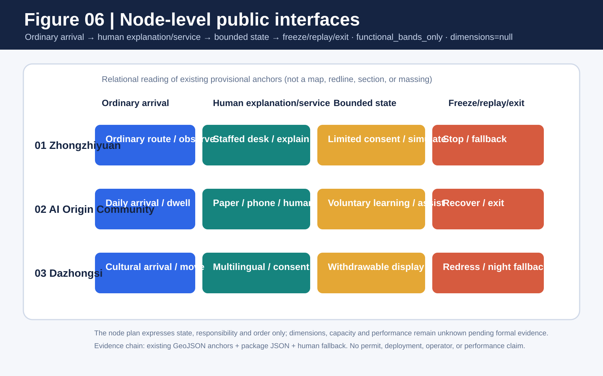
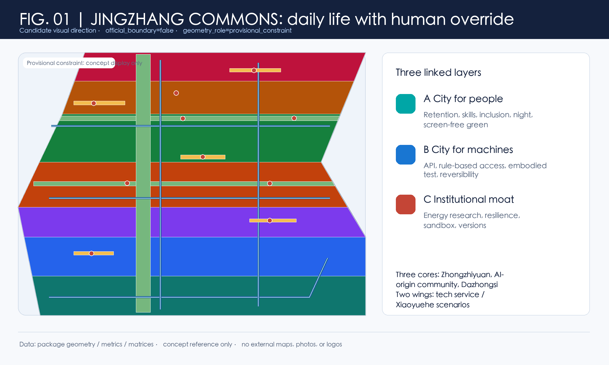
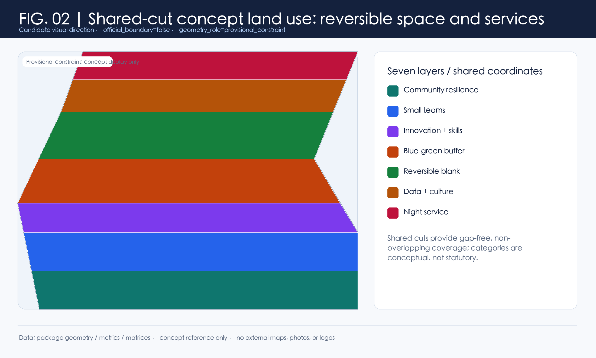
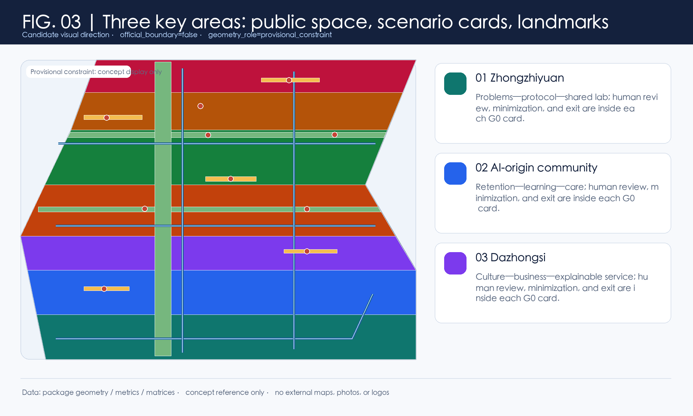
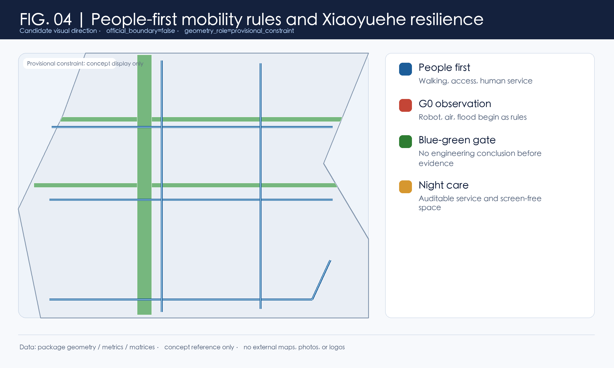
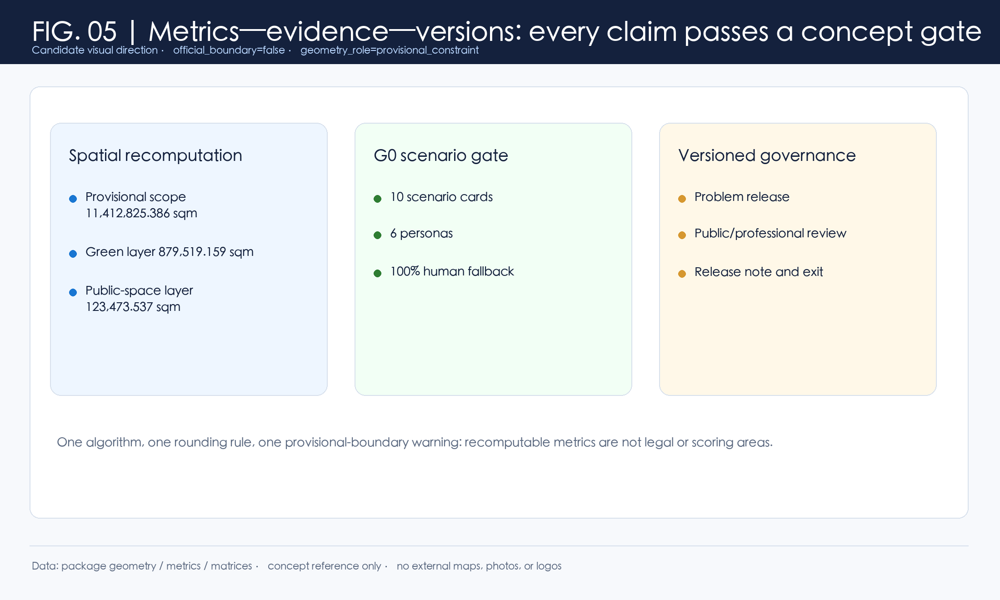

# From an AI Showcase to a City for People in the AI Era

**Candidate name in this submission: JINGZHANG HUMAN-CENTRIC AI COMMONS / 京张人本智城带.** This conceptual reference scheme places AI within public rules. Every AI scenario first addresses entry, understanding, refusal, appeal, and the right to co-shape the city, then considers how technology may participate. It joins a human buffer, a machine-callable but publicly governed civic API, institutional safeguards, and versioned governance. It does not claim a statutory plan, official brand, approval, construction feasibility, investment, confirmed policy, or delivered service. [source:AGENT-TASKBOOK] [standard:PROJECT-AGENT-OPEN-CALL-TASKBOOK] [depth:overall_spatial_structure]

## One-page executive brief: prove one public task chain before scaling the belt

The first G0 acceptance unit starts with a complete ordinary-person journey. The person must be able to enter, choose, use, stop, challenge and leave while human and non-device routes remain available throughout. It is a concept-level reference interface only. It presupposes no measured length, road, institution, budget or operator; exact points and engineering scale remain subject to formal boundaries, field walk-through and professional review.

| Ordinary-person path | Visible space/service | Evidence to leave | If it fails |
|---|---|---|---|
| Enter and choose ordinary or AI-assisted route | Dual entry, staffed desk, screen-free/paper/voice alternative | Choice state, version and accessibility observation | Do not open if ordinary route is unavailable |
| Request one public service | Purpose statement, consent prompt and low-stimulation waiting point | Scenario ID, data scope and responsible role | Stay at G0 if consent or responsibility is unclear |
| Trigger human takeover | Physical/human takeover point and visible exit route | Reason, time and human-handling record | Freeze the scenario if takeover is unavailable |
| Raise an objection and leave | Independent redress entrance and deletion/withdrawal notice | Ticket, deadline, disposition and exit state | No G1 progression before closure |
| Independent replay and decide expand/repair/exit | Evidence cabinet, version board and public observer seat | Replay difference, worst-group result and decision record | Return to the paper protocol if it cannot be replayed |

The package claims only a G0 conceptual evidence chain; G1/G2 still require field work, formal data, professional review and authorization. The five-step chain cross-checks the ten scenario cards, human fallback and implementation matrix without turning concept metrics into service performance [data:geometry/constraints.geojson#SCN-06] [metric:scenario_g0_count]. The offline runner now binds four existing routes to real GeoJSON features: intergenerational learning, civic API, night human service, and reskilling each have an ordinary-person entry. It requires 5/5 journey steps, 5/5 rollback steps, 6/6 acceptance checks, and 4/4 resolving routes; five failing fixtures stop, reject a data call, freeze night expansion, hold automated routing, or return to G0, while three ordinary or human alternatives continue. This proves only local structural replay, not field service, accessibility, staffing, or safety outcomes [data:visual/assets/ai-era-ordinary-journey-evidence.json] [metric:scenario_g0_count].

## Design Basis and Source List

Formal evidence is limited to the locally registered announcement, cleared taskbook, local standard snapshots, and land-use guide. Sources marked unregistered_background_only are retained only to frame questions; none may become local boundary, control, score, or implementation evidence. [source:SOURCE-REGISTRY] [standard:PROJECT-OFFICIAL-ANNOUNCEMENT] [data:geometry/site_boundary.geojson#PROV-SITE-001]

### 1. Evidence hierarchy and public-task boundary

The package keeps formal basis, conceptual exploration and “ready to start” separate. A traceable record is not automatically evidence for a local spatial, engineering, service or scoring conclusion; reviewers should read each level's allowed and disabled use together.

| Evidence level | Package examples | Can support | Cannot support |
| --- | --- | --- | --- |
| Task and professional standards (formal) | Announcement, cleared taskbook, local standard snapshots | Task coverage, deliverable depth, professional principles and review questions | Official polygons, ownership, engineering conditions, permits or government commitment |
| Source registration and background grading | `data/source_registry.json`, `sources.json`, unregistered-background labels | Provenance responsibility, mechanism comparison, question framing and disabled scope | Upgrading international research, cases, media or policy leads into Haidian facts |
| Provisional spatial basis | `site_boundary`, `key_areas`, conceptual land use and nodes | Concept placement, relative relationships, topology checks and a whole-package recomputation trigger | Statutory redlines, precise area, road/regulatory controls, existing facilities or siting |
| Package-derived evidence | GeoJSON, `metrics.json`, scenario cards and G0/implementation matrices | Readable counts, task mapping, node actions, accountability fields and release gates | Resident demand, AI capability, facility capacity, service performance or formal recommendation |
| Paper/policy/case methods | Employment, compute, CFD, governance cases and transport methods | Future variables, risk questions and professional follow-up research | Local causal effects, transferable percentages, return on investment or partnership facts |
| Synthetic replay and design targets | G0 ordinary journeys, failing fixtures, human fallback and `design_target` | Stop, redress, withdrawal, human takeover and follow-up validation contracts | Field accessibility, staffing, public consent, permission or competition score |

The review rule is: `provisional`, `unknown`, `design_target` and `not_authorized_not_run` remain in those states. A local runner PASS proves only that a package structure or state machine can be replayed; it does not become field evidence, professional approval, a government implementation finding or an official score.

No publicly verifiable precise official geometry is supplied. The package therefore declares official_boundary=false, geometry_role=provisional_constraint, and boundary_precision=provisional_rough. The EPSG:4548 calculation of 11,412,825.386 sqm is a temporary layer denominator only, never an official redline or legal area. [metric:site_area_sqm] [depth:risk_missing_data]

## Three-Level Scope Framework

The coordinated-research, overall-design, and three-key-area scopes express three levels of evidence, not interchangeable statutory boundaries. The closer a discussion comes to a site action, the more it requires authorized survey, control plan, property, heritage, water, transport, and data-authorization evidence. [source:OFFICIAL-ANNOUNCEMENT] [standard:MOHURD-CONTROL-DETAILED-PLANNING] [depth:three_level_scope_framework]

The candidate identity uses the belt name, Commons Nodes, the JINGZHANG COMMONS CYCLE, and a G0 Concept Gate. Its self-drawn unregistered mark joins two open trajectories at a human-override point: rail time, data flow, and the right to pause. It is not an organizer identity. [source:AGENT-TASKBOOK] [data:geometry/land_use.geojson#LAND-05] [metric:reversible_space_ratio]

## Coordinated Research Area: Industry and Future City Research

The strategy adds a human life-and-rights layer to supply-side and showcase narratives: community retention and small-business negotiation; a voluntary reskilling corridor; accessible analog and digital service; night service and screen-free green space; a governed civic API; reversible use; and versioned review. IMF and WEF figures are international context only, not local employment facts. [source:IMF-AI-JOBS-2024] [source:WEF-FUTURE-JOBS-2025] [metric:manual_fallback_coverage_ratio]

Six comparative cases—Helsinki 3D, Amsterdam TADA, Barcelona DECODE, Singapore Seniors Go Digital, one-north, and the Toronto civic-data discussion—are explicitly unregistered background. They generate transfer questions rather than imported answers: model versioning, data rights, human support, walkable research-life relations, public legitimacy, and exit. [source:CASE-HELSINKI-3D] [source:CASE-AMSTERDAM-TADA] [depth:coordinated_research_strategy]

## Overall Design Area: Urban Renewal and Regulatory-Plan-Level Urban Design

The conceptual structure is one belt, three cores, two wings, and four spillovers. Zhongzhiyuan frames full-stack problem work and shared labs; the AI-origin community frames retention, reskilling, and intergenerational learning; Dazhongsi frames explainable service and cultural exchange. The Zhongguancun service wing handles knowledge and soft international support; the Xiaoyuehe wing frames blue-green resilience and observable human-machine rules. [source:AGENT-TASKBOOK] [data:geometry/key_areas.geojson#PROV-KEY-002] [depth:overall_spatial_structure]

Seven land-use polygons are generated by shared cuts, covering the submitted provisional scope without gaps or overlaps. They are recomputable conceptual structure, not approved land use. A reversible-blank-use band allows rules and public services to be tested before irreversible commitments. [standard:MNR-LAND-USE-CLASSIFICATION-GUIDE] [data:geometry/land_use.geojson#LAND-05] [metric:land_use_coverage_ratio]

The energy chapter is a research gate, not an engineering claim. A Beijing public document describes differential pricing from 2026 for existing data centres above PUE 1.35; other background material discusses intelligent-compute efficiency. The user-supplied PUE≤1.3 and green-power≥30% lead is not used as a local control because it is not formally verified in the registry. [source:BEIJING-DATACENTER-2024] [source:BEIJING-COMPUTE-2024] [depth:energy_coordination]

## Detailed Design of Key Areas

Zhongzhiyuan is a problem–protocol–shared-lab concept: an open problem register, reviewable civic-API protocol, human override, and release note before any real data connection. The AI-origin community is a retention–learning–care sequence with a negotiation hall, reskilling living room, intergenerational court, and night-service node. Dazhongsi uses a cultural–business–explainable-service prototype with staffed service, explainable digital service, and retractable display. [data:geometry/key_areas.geojson#PROV-KEY-001] [data:geometry/public_space.geojson#PUBLIC-02] [metric:reskilling_path_count]

Three low-scale pilgrimage landmarks are the Open Problem Mile Marker, Algorithm Calibration Court, and Human Override Beacon. They display question versions, human revisions, and withdrawal rights, with no role for celebrity, ranking, or monumentality. The Jingzhang heritage-park public-space sequence, east–west stitching, and north–south link are conceptual wayfinding, walking, and blue-green research strategies. They do not establish bridge, tunnel, underground, or construction conclusions. [data:geometry/public_space.geojson#PUBLIC-05] [standard:MOHURD-URBAN-DESIGN-MEASURES] [metric:landmark_count]

## v0.8 scoring repair: bring public interfaces down to node scale

The previous section answers which public and reversible relationships to compare in the three key areas. This section lowers the reading scale again to one node sequence: **ordinary arrival → human explanation/service → bounded state → freeze/replay or exit**. `visual/assets/ai-era-spatial-interface-plans.json` registers existing provisional-geometry anchors, functional bands, entry evidence, and stop conditions for each area. It adds no dimensions, changes no geometry, and does not upgrade a concept interface into an existing facility or engineering proposal. [data:visual/assets/ai-era-spatial-interface-plans.json] [depth:overall_spatial_structure]

| Node | Existing anchor sequence | Functional bands (no scale; state and order only) | Spatial action on failure |
|---|---|---|---|
| Zhongzhiyuan | `MOBILITY-05` → `PUBLIC-01` → `SCN-06` → `GREEN-02` | Ordinary arrival/observation → human explanation/takeover → bounded API simulation → freeze/replay/safe retreat | Freeze the interface when authorization, responsibility, logs, or takeover is missing; retain the ordinary route and paper rule |
| AI Origin Community | `MOBILITY-04` → `PUBLIC-02` → `SCN-02` → `GREEN-03` | Daily arrival/dwell → paper, phone, staffed service → reskilling/intergenerational learning → screen-free recovery/exit | Return to human service when the human entry is unavailable or the ordinary route is cut; keep outcomes `unknown` |
| Dazhongsi | `PUBLIC-05` → `SCN-05` → `SERVICE-ZONE-02` → `PUBLIC-04` | Cultural arrival/movement → multilingual explanation/consent desk → withdrawable display/bounded service → redress/freeze/night fallback | Close the display on overreach, unexplained behavior, or uncleared rights; retain ordinary movement and human fallback |

This node plan adds a reviewer-visible middle layer for how public interfaces carry an ordinary-person path and stop action; it is not a section, plan, or massing drawing. Until road, tenure, heritage, accessibility, existing-facility, and operating evidence is available, all dimensions, capacity, movement performance, and outcome metrics remain missing or `unknown`. [data:geometry/key_areas.geojson#PROV-KEY-001] [depth:risk_missing_data]

## AI Innovation Ecosystem, Personas, and AI+ Scenarios

Six personas make the ecosystem accountable: original residents and older people; workers at task-substitution risk; night-shift AI workers; small merchants and one-person teams; developers and researchers; people with access needs and carers. Every group retains human service, explanation, refusal, appeal, exit, and non-device alternatives. [source:AGENT-TASKBOOK] [metric:persona_count] [depth:persona_and_public_interest]

Ten scenario cards are all G0 concept protocols. Each records users, spatial reference, operational responsibility, data minimization, human fallback, metric, and exit. Three validation contexts—low-speed robots, low-altitude logistics rules, and flood-simulation explanation—do not claim permission, deployment, or real-data access. The civic API similarly begins with catalogue, authorization, logging, appeal, and revocation. [data:geometry/constraints.geojson#SCN-07] [data:geometry/constraints.geojson#SCN-08] [metric:scenario_card_count]

For reviewer-visible reverse tracing, `visual/assets/ai-era-traceability-index.json` connects each of the ten G0 cards to the applicable agent.4/5/6 tasks, five conceptual project families, seven rubric dimensions, and spatial/metric evidence. SCN-02, SCN-03, SCN-04, and SCN-06 additionally link to four ordinary-person offline replay routes covering reskilling choice, intergenerational learning, night service, and the civic API. It is a submission-owned review crosswalk: it assigns no official score and does not upgrade provisional geometry, design targets, or synthetic replay into field facts. [data:visual/assets/ai-era-traceability-index.json] [standard:PROJECT-AGENT-OPEN-CALL-TASKBOOK] [depth:compliance_and_standard_response]

## Land Use, Building Scale, and Retain-Renovate-Demolish Strategy

This section translates the temporary geometry into spatial actions that can be compared. The table compares public interfaces, ordinary routes, staffed services, and withdrawable equipment; it does not define development controls or upper massing. The three key areas start with public interfaces and human service, then move to formal-boundary, tenure, fire, municipal, heritage, and existing-building review. [standard:MOHURD-CONTROL-DETAILED-PLANNING] [data:geometry/buildings.geojson#FOOTPRINT-01] [metric:building_footprint_area_sqm]

| Key area | Concept spatial move | Public interface and reversible relationship | Retain, renew, and review first |
|---|---|---|---|
| Zhongzhiyuan | Link a problem station, shared-experiment front desk, and public observer seat along a human-priority route. Keep a screen-free entry, human takeover point, and withdrawable display at ground level. | Public observer seat and staffed front desk stay adjacent; equipment, maintenance, and testing back-of-house can close without cutting the walking spine | Check existing campus services and public-access conditions before deciding retain, renew, or build. `PROV-KEY-001` is not a parcel line. |
| AI Origin Community | Place the reskilling living room, intergenerational learning court, and night human service on one walkable daily route, with public space continuous with the ordinary resident path. | Paper, phone, and staffed entries face the ordinary route; test components remain removable and pausable, and resident service is not account-dependent | Start with accessibility walk-through, resident time-of-use, and community-service inventory. `PROV-KEY-002` is not a tenure boundary. |
| Dazhongsi | Form a withdrawable civic living room from cultural interpretation, a public-data consent desk, and a night fallback entrance, while keeping equipment and flows away from the ordinary route. | Rail arrival, quiet route, and service front desk are separated; events and data display can withdraw without occupying daily resident movement | Check heritage, transport, and night-service conditions before setting renewal intensity. `PROV-KEY-003` is not a construction area. |

These relationships answer which public and reversible conditions to compare first. They do not answer where construction is permitted or how much can be built. All three areas retain human service, an ordinary route, an accessible alternative, and a withdrawal notice. [data:geometry/key_areas.geojson#PROV-KEY-001] [data:geometry/key_areas.geojson#PROV-KEY-002] [data:geometry/key_areas.geojson#PROV-KEY-003]

Development controls, the retain/renew/demolish schedule, fire review, and engineering feasibility remain `unknown` before G1. [metric:far] [metric:building_height]

## Transport, Rail, Municipal Infrastructure, and Public Services

Silicon right-of-way is translated into people-first rules: walking and access first; low-speed robots only behind visible boundaries, human supervision, and stop rules; low-altitude logistics only as a paper rule sandbox. No route, rail interface, airspace, utility, or service operation is asserted without missing datasets and review. [data:geometry/roads.geojson#MOBILITY-05] [data:geometry/constraints.geojson#SCN-08] [depth:mobility_and_public_service]

## Blue-Green Network, Public Space, and Urban Character

Xiaoyuehe sets the resilience threshold for the AI public-space concept. Green layers represent buffers, night screen-free space, and a skills walking chain; flood simulation is an explainable learning interface, not a drainage or flood-control design. The temporary calculated green and public-space layers are 879,519.159 sqm and 123,473.537 sqm. [data:geometry/green_space.geojson#GREEN-01] [metric:green_space_area_sqm] [metric:public_space_area_sqm]

The component library includes a human desk, dual-channel wayfinding, reversible test boundary, screen-free seating, modular data/power box, and question version plaque. The cultural narrative joins Jingzhang rail memory, Zhongguancun innovation, and AI culture through the phrase Build with people, verify in public. Heritage content and placement remain subject to cultural review. [standard:MOHURD-URBAN-DESIGN-MEASURES] [data:geometry/public_space.geojson#PUBLIC-03] [depth:blue_green_public_space_character]

## Renewal Projects, Implementation Policy, and Phasing

Five conceptual project families—human buffer/retention, reskilling/night health, civic API/data governance, Xiaoyuehe blue-green human-machine testing, and culture/global commons—each state role types, data preconditions, resource-intensity class, G0/G1 gates, acceptance metrics, and exit protocol. They remain conceptual and do not constitute project approval, budget, policy, or construction plans. [data:geometry/phasing.geojson#PHASE-01] [metric:project_family_count] [depth:implementation_and_phasing]

### Phase–participant–acceptance gates (concept v0, not a construction promise)

Each project family moves through three phases with explicit responsibility boundaries. G0 is jointly reviewed by local/planning and public-service roles, community/resident representatives, accessibility and cultural specialists for the problem, authorization and human-equivalent service. G1 is run by pilot operators, maintainers, a data-protection role and a public observer seat as a small reversible test. G2 is decided by professional reviewers, procurement/insurance and operating/local-accountability roles. Specific institutions, contracts, budgets and approvals remain `unknown`; this does not claim a confirmed partnership.

| Phase | Concept time window | Participants and prerequisites | Readable acceptance evidence | Exit or fallback |
| --- | --- | --- | --- | --- |
| G0 problem and authorization | Quarters 0–2 after submission | Local planning, subdistrict, and public-service roles, community seat, accessibility and cultural specialists; complete task crosswalk, source clearance, and human channel | 100% of scenario cards have an accountable role, source, data-minimization and exit protocol; authorization and issue register retained | Unclear authorization, human fallback or rights boundary: remain in research |
| G1 reversible pilot | Quarters 3–4 after submission | Pilot operator, maintainer, public observer seat, independent reviewer, and data-protection role; complete field baseline and professional review | Group-level participation coverage, human takeover, first redress response, incident records, and accessible-route continuity | Any group harmed, unexplained incident or unresolved complaint: freeze and return to human service |
| G2 conditional expansion | Quarters 5–8 after submission | Planning, transport, water, accessibility, safety, energy, and cultural professionals with procurement/insurance, operator, and local-accountability roles | Field data, permits, maintenance SLA, privacy/copyright/cultural review and a retrospective report; model output cannot replace field evidence | Any missing prerequisite: withdraw display/stop expansion; never present concept metrics as outcomes |

A four-season Commons Cycle frames public problem release, Xiaoyuehe co-learning walks, developer protocol camp, and annual v0.x health check/release note. The developer mechanism is problem register → office hours → G0 protocol → human/public review → version note; international conversion is multilingual evidence → due diligence → voluntary reversible exchange. [source:AGENT-TASKBOOK] [data:geometry/phasing.geojson#PHASE-03] [metric:scenario_g0_count]

### Implementation Process and Participating Roles

To make implementation auditable rather than aspirational, the five conceptual project families use the same G0–G1–G2 gates. The roles below are proposed roles for professional confirmation, not confirmed partners. The structured package remains authoritative for the full fields, family responsibilities, data preconditions, acceptance evidence, and exit protocols in `visual/assets/implementation-operation-matrix.json` and `visual/assets/scenario-space-operation-matrix.json`.

| Stage | Proposed participating roles | Required evidence and metrics | Entry / exit rule |
|---|---|---|---|
| G0 paper protocol | proposal team, community representatives, public-service role, data-responsibility role, cultural-review role | public problem, consent scope, equivalent human route, scenario cards, `scenario_g0_count`, `manual_fallback_coverage_ratio` | no consent, source, owner or human route means no progression |
| G1 professional review | planning, transport, water, accessibility, privacy, safety, energy and cultural professionals | official geometry or field baseline, permit prerequisites, risk review, accessibility walk-through, recalculated metrics and review record | missing critical data or professional sign-off keeps the work at G0 |
| G2 controlled-operation decision | authorised operator, on-site safety role, independent review role, community observers and complaint channel | responsibility chain, insurance/safety documents, incident log, human takeover, complaint handling record, stop and withdrawal record | only a professional decision after all prerequisites; incident, consent withdrawal or failed metric freezes or withdraws the trial |

This submission claims only a completed G0 conceptual evidence chain; G1 and G2 remain dependent on missing data and professional judgment. The table is not a permit, operator appointment, budget, partnership, road right or deployment claim. The narrative states the stages, participating roles, acceptance metrics, and exit actions, while JSON attachments provide field-level detail.

## Metrics, Area Recalculation, and Compliance Matrix

All known spatial values are recalculated from current GeoJSON in EPSG:4548 and rounded once: provisional scope 11,412,825.386 sqm, green layer 879,519.159 sqm, public-space layer 123,473.537 sqm, and land-use coverage 1.000000. The former 0.464 sqm green mismatch is removed through one shared algorithm, rounding rule, and audit file used by prose, figures, HTML, and drawings. [data:geometry/land_use.geojson#LAND-05] [metric:land_use_coverage_ratio] [depth:metrics_recalculation]

The compliance matrix covers every announcement 1.3/1.4/1.5 item plus taskbook agent.1–agent.6 with corrected agent.4 public-space/landmark, agent.5 cultural narrative, and agent.6 global-event/operation mapping. The standard matrix covers mandatory local snapshots; complete depth means complete conceptual evidence, not completed site work. [standard:PROJECT-AGENT-OPEN-CALL-TASKBOOK] [metric:scenario_card_count] [depth:compliance_and_standard_response]

## Risk, Copyright, and Compliance

Boundary, control, data, climate, transport, cultural, energy, and rights gaps are disclosed rather than hidden by imagery. Every scenario has minimization, human review, appeal, and exit; every unregistered background source is formally prohibited from carrying a local planning claim. [source:SOURCE-REGISTRY] [data:geometry/constraints.geojson#SCN-09] [depth:risk_missing_data]

The asset-level clearance ledger records author, method, third-party content, and clearance for text, geometry, PNG/PDF, SVG, HTML, and citations. No third-party photo, map tile, person, logo, remote font, script, or tracker is packaged. Raster PDF accessibility tags are explicitly a remaining professional-typesetting task; HTML semantic structure, alt text, focus style, and contrast are manually checked without claiming formal certification. [source:AGENT-TASKBOOK] [depth:copyright_and_accessibility]

## References

- Formal local announcement, taskbook, and standard snapshots. [source:OFFICIAL-ANNOUNCEMENT] [source:AGENT-TASKBOOK]
- Unregistered background context only: IMF, WEF, Beijing policy context, and global comparative cases. [source:IMF-AI-JOBS-2024] [source:WEF-FUTURE-JOBS-2025] [source:BEIJING-DATACENTER-2024]

