# 从 AI 的展台，到 AI 时代人的城

**方案内候选名为京张人本智城带 / JINGZHANG HUMAN-CENTRIC AI COMMONS。** 本方案把 AI 放在公共规则之内讨论。每个技术场景都先回答人能否进入、理解、拒绝、申诉并共同塑造城市，再讨论技术如何参与。它将人本缓冲层、机器可调用但受公共规则约束的城市 API 层、制度护城河与城市版本化治理联成一条概念建议/参考方案，可供专业团队深化研究的证据链。它不构成法定规划、官方品牌、项目批准、工程结论、投资承诺或已确定政策。[source:AGENT-TASKBOOK] [standard:PROJECT-AGENT-OPEN-CALL-TASKBOOK] [depth:overall_spatial_structure]

## 一页执行摘要，先验收一个公共任务链，再谈全带扩展

首个 G0 验收单元先从一个普通人的完整使用过程开始。这个人应当能够进入、选择、使用、叫停、申诉并离开，人工和非设备路径全程保留。它是概念级参考界面，不预设长度、道路、机构、预算或运营主体；点位和工程尺度待正式边界、现场走测与专业核查后确定。

| 普通人路径 | 必须看见的空间/服务 | 必须留下的证据 | 不通过时 |
|---|---|---|---|
| 进入并选择普通或 AI 辅助路径 | 双入口、人工台、无屏/纸本/语音替代 | 选择状态、版本和无障碍观察记录 | 普通路径不可用则不开放 |
| 请求一次公共服务 | 目的说明、授权提示、低刺激等候点 | 场景 ID、数据范围、责任角色 | 授权或责任不清则停留在 G0 |
| 主动触发人工接管 | 物理/人工接管点、可见退出路线 | 接管原因、时间、人工处理记录 | 无法接管则冻结场景 |
| 提出异议并离开 | 独立申诉入口、删除/撤回说明 | 工单、期限、处置和退出状态 | 未完成处理不得进入 G1 |
| 第三方复演并决定扩展/返修/退出 | 证据柜、版本牌、公众观察席 | 复演差异、最差组结果、决定记录 | 不能复演则回到纸面协议 |

当前包只声明 G0 概念证据链；G1/G2 仍需要现场、正式数据、专业复核与授权。五步链与现有 10 张场景卡、人工兜底和 implementation matrix 相互对照，不把概念指标写成服务绩效 [data:geometry/constraints.geojson#SCN-06] [metric:scenario_g0_count]。新增的离线 runner 将四条既有路线绑定到真实 GeoJSON 要素：代际共学、城市 API、夜间人工服务和技能再造各有一条普通人入口；要求 5/5 步骤、5/5 回退、6/6 验收检查和 4/4 路线可解析。五个失败夹具会停止、拒绝数据调用、冻结夜间扩展、暂停自动分流或退回 G0；三个普通/人工替代夹具继续。它只证明本地结构可回放，不证明现场服务、无障碍、人员值守或安全结果 [data:visual/assets/ai-era-ordinary-journey-evidence.json] [metric:scenario_g0_count]。

## 设计依据与资料清单

正式依据只来自 data/source_registry.json 中可用于 formal 的公告、任务书、标准本地快照和用地分类资料；标准判断以 standards/references 的本地快照为准，而非仅凭网页地址。[source:OFFICIAL-ANNOUNCEMENT] [standard:PROJECT-OFFICIAL-ANNOUNCEMENT] 国际就业研究、北京算力政策、全球案例、媒体线索被逐条标为 unregistered_background_only，它们不在当前注册表内，因此只能提示问题，不得升级为本地边界、控制、评分或实施依据。[source:SOURCE-REGISTRY] [data:geometry/site_boundary.geojson#PROV-SITE-001]

### 1. 证据等级与公共任务边界

本包把“正式依据、概念推演和可以开始”分开。资料能回到登记记录，不代表它能支撑本地空间、工程、服务或评分结论；评审应同时阅读每层的允许与禁用用途。

| 证据层级 | 本包实例 | 可以支持 | 不能支持 |
| --- | --- | --- | --- |
| 任务与专业标准（formal） | 公告、清权任务书、标准本地快照 | 任务覆盖、成果深度、专业原则和审阅问题 | official polygon、权属、工程条件、许可或政府承诺 |
| 来源登记与背景分级 | `data/source_registry.json`、`sources.json`、未登记背景标签 | 来源责任、机制对照、问题提示和禁用范围 | 把国际研究、案例、媒体或政策线索升级为海淀事实 |
| 临时空间依据（provisional） | `site_boundary`、`key_areas`、概念用地和节点 | 概念落位、相对关系、拓扑自检和全包复算触发器 | 法定红线、精确面积、道路/控规、现状设施或选址 |
| 包内派生证据 | GeoJSON、`metrics.json`、场景卡、G0/implementation matrix | 可回读数量、任务映射、节点动作、责任字段和发布门 | 居民需求、AI 能力、设施容量、服务绩效或正式推荐 |
| 论文/政策/案例方法 | 就业、算力、CFD、治理案例和交通方法 | 定义待测变量、风险问题和专业团队的后续研究入口 | 本地因果效果、可迁移百分比、投资回报或合作事实 |
| 合成回放与设计目标 | G0 普通人旅程、失败夹具、人工回退和 `design_target` | 停止、申诉、撤回、人工接管和后续验证合同 | 现场无障碍、人员值守、公众同意、许可或竞赛分数 |

审阅规则是：`provisional`、`unknown`、`design_target` 和 `not_authorized_not_run` 保持原状态；本地 runner PASS 只证明包内结构或状态机可回放，不升级为现场证据、专业批准、政府实施结论或官方评分。

仓库目前没有可公开核验的精确官方 geometry；本投稿因此明确 official_boundary=false、geometry_role=provisional_constraint、boundary_precision=provisional_rough。EPSG:4548 下的 11,412,825.386 平方米只是一组临时图层运算分母，不能作为官方红线、权属、许可、交易或精确面积判断。sources.json、assumptions.json、GeoJSON 和离线可视化均重复披露这一限制。[metric:site_area_sqm] [depth:risk_missing_data] [data:geometry/key_areas.geojson#PROV-KEY-001]

## 三层范围工作框架

三层分别对应三种证据精度，不承担可互换的法定界线功能。统筹研究层讨论研发、制造、人才、标准、公共文化和国际交流如何产生十五分钟碰撞圈；总体设计层用临时范围组织概念性用地、慢行、蓝绿与公共服务；三处重点区层才进入众智园、AI 原点社区和大钟寺的场景、空间、运营关系。越靠近现场，越需要测绘、控规、权属、文保、水文、交通和数据授权；缺一项，就停留在概念门内。[source:OFFICIAL-ANNOUNCEMENT] [standard:MOHURD-CONTROL-DETAILED-PLANNING] [depth:three_level_scope_framework]

一带以候选名京张人本智城带组织，英文名为 JINGZHANG HUMAN-CENTRIC AI COMMONS；命名体系包括共创节点、京张共创季与 G0 概念门。Logo 方向是两条不闭合轨迹线交会于人工接管点，分别意指铁路时间、数据流与人的暂停权；它是投稿自绘的未注册概念标记，绝不冒充主办方或既有机构标识。三大定位为人本 AI 治理实验场、全栈问题协作走廊、可复盘的国际公共客厅；五大功能为共创、学习、测试、照护、传播。[source:AGENT-TASKBOOK] [data:geometry/land_use.geojson#LAND-05] [metric:reversible_space_ratio]

区域创新协同以可讨论接口而非确认合作来表达，北纬社区可交换社区协商方法，未来科学城可交换研究问题与测试规范，怀柔科学城可交换科学解释方法，北京经开区可讨论研发标准至制造应用的责任链。每一行都要求公开授权、共同意愿和专业责任人，不能被读成合作机构、企业名单或已定项目。[source:AGENT-TASKBOOK] [depth:regional_collaboration]

## 统筹研究范围产业与未来城市研究

统筹层以供给端和展示端之外的第三个端口，人的生活与权利端，补全 AI 城市。社区保留率协商台与小商户协商机制是反士绅化的概念工具箱；技能再造走廊把可能受任务替代影响的人连接到再培训、机器人运维、数据标注和场景运营的可选择路径；人工通道、代际共学与无屏绿地为老人、照护者和夜班人员保留不依赖屏幕的公共性。[data:geometry/public_space.geojson#PUBLIC-01] [data:geometry/public_space.geojson#PUBLIC-03] [metric:manual_fallback_coverage_ratio]

国际背景只用来说明为何需要缓冲而非预言本地结果，IMF 2024 文章称约四成全球岗位、约六成发达经济体岗位可能受 AI 影响；WEF 2025 报告新闻稿称 41% 受访雇主计划因 AI 自动化某些任务而缩减劳动力，同时 77% 计划再培训。这些不是海淀裁员、岗位数量或政策事实，故被锁定在背景栏。媒体中 9.5 万 AI 从业者也仅为未核验线索，不能用于服务规模测算。[source:IMF-AI-JOBS-2024] [source:WEF-FUTURE-JOBS-2025] [source:WORKFORCE-95000-MEDIA]

给机器用的城市，不是给传统方案贴 AI 标签。城市 API 层先要求目录、目的、授权、最小必要、审计日志与人工接管；小月河翼把低速机器人、人机混行、低空物流规则和具身智能公共测试放在 G0 纸面协议和可观察边界内；可逆留白和 meanwhile use 则让三个月的算法迭代不迫使城市作十年不可逆承诺。技术、标准、知识与生态毛细血管四种外溢均是可复盘机制，而非结果保证。[data:geometry/constraints.geojson#SCN-06] [data:geometry/constraints.geojson#SCN-07] [metric:scenario_g0_count]

| 全球案例（均为未登记背景） | 可借鉴的问题 | 本地不可直接照搬的限制 |
|---|---|---|
| 赫尔辛基 3D 城市模型 | 模型、版本与用途边界如何可审计 | 本地未提供等价模型 |
| 阿姆斯特丹 TADA | 数据透明、可控、以人为本 | 不是本地制度文本 |
| 巴塞罗那 DECODE | 授权与公共审议如何前置 | 不代表本地数据授权 |
| 新加坡 Seniors Go Digital | 数字学习如何嵌入人工支持 | 不表示本地服务已设 |
| 新加坡 one-north | 研究、企业与日常服务如何可步行共处 | 不转译为招商清单 |
| 多伦多滨水数字城市讨论 | 正当性、数据权利与退出为何不可缺席 | 仅作治理反例提示 |

案例图谱把众智园定位为全栈问题拆解与共享实验的概念节点，把 AI 原点社区定位为协商、技能与共学节点，把中关村科技服务翼定位为知识、专业服务、国际软配套的转换接口，把小月河翼定位为蓝绿韧性和人机测试规则接口。土地、空间、产业、人才、算力、数据和场景之间的连接均需以后续授权资料校验；本稿没有列出企业、资金或招引目标。[source:CASE-HELSINKI-3D] [source:CASE-AMSTERDAM-TADA] [depth:coordinated_research_strategy]

## 总体设计范围城市更新与控规深度城市设计

总体结构是一带、三核、两翼、四种外溢。众智园概念上承接全栈自主问题、共享实验与算电治理讨论；AI 原点社区承接社区协商、技能再造与代际共学；大钟寺承接可解释的消费/商务服务与文化会客。中关村科技服务翼组织知识与国际软配套，小月河场景翼安排蓝绿韧性、无屏绿地、具身智能观察和人机规则。上述都是空间动作理由，不代表任何地块的确定用途或工程方案。[source:AGENT-TASKBOOK] [data:geometry/key_areas.geojson#PROV-KEY-002] [depth:overall_spatial_structure]

七个概念用地多边形采用共享切线生成，完整覆盖提交临时范围且无缝隙、无重叠；其分类用于让结构可重算，不替代法定用地性质。可逆留白带为 G0 规则、阶段性共创和临时公共服务提供先规则、后设施的讨论空间。因为没有授权的控制与现状资料，所有尺度、现状判断和空间调整均需专业团队深化研究。[standard:MNR-LAND-USE-CLASSIFICATION-GUIDE] [data:geometry/land_use.geojson#LAND-05] [metric:land_use_coverage_ratio]

算电协同被放入专章式研究门，北京公开文件可见自 2026 年起对存量 PUE 高于 1.35 的数据中心征收差别电价；另有公开背景谈及新建/改扩建智算中心的 PUE。用户给出的 PUE≤1.3、绿电≥30%线索未在本地注册表中得到本包可用的正式核验，因此不被写入本场地控制、指标或承诺。余热进入公共供热也只是一项可否成为社区能源资产的专业问题，必须先取得负荷、热网、碳与选址资料。[source:BEIJING-DATACENTER-2024] [source:BEIJING-COMPUTE-2024] [depth:energy_coordination]

## 重点区域详细设计

**众智园，问题、协议与共享实验。** 概念上，以开源问题库、共享实验时段与可理解的城市 API 协议替代单向成果展台；空间上对应全栈自主创新带和公共问题站；运营上以数据责任角色、公众观察席、人工接管和版本说明为先。它不认定机构、实验室或现有空间，并要求在任何真实数据接入前完成授权与安全审查。[data:geometry/key_areas.geojson#PROV-KEY-001] [data:geometry/constraints.geojson#SCN-06] [metric:api_governance_gate_count]

**AI 原点社区，保留、学习与照护。** 社区回迁协商厅、技能再造客厅、代际共学庭与夜班服务站构成连续的人本缓冲层。每一处都含人工服务、纸本/语音替代、无障碍走读与退出路径；社区保留率只是一项可由居民共同定义的概念性过程指标，绝不是人口统计、补偿决定或现状结论。[data:geometry/key_areas.geojson#PROV-KEY-002] [data:geometry/public_space.geojson#PUBLIC-02] [metric:reskilling_path_count]

**大钟寺，文化、商务与可解释服务。** 这里的智能原生消费和商务场景按人工服务前台、可解释数字服务和可撤回展示来表达，形成参考原型。三处低尺度朝圣地标，开源里程标、算法校准庭、人工接管灯塔，分别落在概念公共空间节点；它们展示问题版本、人工改写和退出权，也不用于制造流量、个人排名或纪念性建筑。[data:geometry/key_areas.geojson#PROV-KEY-003] [data:geometry/public_space.geojson#PUBLIC-05] [metric:landmark_count]

京张遗址公园 AI 公共空间被表达为问题站、静养无屏带、人工服务、可撤回展示的序列。东西缝合是连续导视、可步行问题站与无障碍替代路径的概念策略；南北贯通是技能慢行绿链、公共服务节点和小月河生态缓冲的研究框架；两者都不是桥隧、道路、地下空间或工程可行性结论。[standard:MOHURD-URBAN-DESIGN-MEASURES] [data:geometry/roads.geojson#MOBILITY-03] [depth:key_area_detailed_design]

## v1.3 空间关系读数｜让节点级接口可复核但不冒充路线

上一节回答三处重点区要比较哪些公共性与可逆关系；本节继续压低表达尺度，只读成一条节点序列：**普通到达 → 人工解释/服务 → 受控状态 → 冻结复盘或退出**。`visual/assets/ai-era-spatial-interface-plans.json` 为每处重点区登记现有 provisional geometry 锚点、功能带、进入前证据和停止条件；它不填写尺寸，不改变 geometry，也不把概念界面升级为现状设施或工程方案。[data:visual/assets/ai-era-spatial-interface-plans.json] [depth:overall_spatial_structure]

| 节点 | 现有锚点序列 | 功能带（无尺度，仅表达状态与先后） | 失效时的空间动作 |
|---|---|---|---|
| 众智园 | `MOBILITY-05` → `PUBLIC-01` → `SCN-06` → `GREEN-02` | 普通到达/观察 → 人工解释/接管 → 受限 API 模拟 → 冻结复盘/安全退避 | 缺少授权、责任、日志或接管时冻结接口，保留普通路径和纸面规则 |
| AI 原点社区 | `MOBILITY-04` → `PUBLIC-02` → `SCN-02` → `GREEN-03` | 日常到达/停留 → 纸面电话人工服务 → 技能再造/代际共学 → 无屏恢复/退出 | 人工入口不可用或普通路径被切断时改回人工服务；结果保持 `unknown` |
| 大钟寺 | `PUBLIC-05` → `SCN-05` → `SERVICE-ZONE-02` → `PUBLIC-04` | 文化到达/通行 → 多语解释/授权前台 → 可撤回展示/受控服务 → 申诉冻结/夜间回退 | 越权、不可解释或未清权时关闭展示，保留普通通行和人工回退 |

为避免“有锚点”仍停留在口号，本轮增加一份从同一组 GeoJSON 复算的临时关系读数。它取相邻锚点要素顶点之间的最小地理间距，四舍五入到 10 m，供评审复核顺序、近邻和明显断裂；它不是路线长度、服务半径、无障碍结论或工程尺寸，三段数值也不能相加为通行距离。正式边界、道路和现场走测到位后，读数、图件、指标、HTML、PDF 与自检必须一起重算。[data:visual/assets/ai-era-provisional-spatial-readout.json] [metric:provisional_spatial_readout_segment_count]

| 重点区 | 相邻锚点最小顶点间距（km，顺序同上） | 读数的设计用途 |
|---|---:|---|
| 众智园 | 1.97 / 2.54 / 2.33 | 检查普通到达—人工接管—受控模拟—安全退避是否存在可追问的空间关系 |
| AI 原点社区 | 3.24 / 0.09 / 3.42 | 把日常入口、人工服务、技能再造节点和无屏恢复分开核问，不把相邻节点写成已连通设施 |
| 大钟寺 | 0.12 / 1.62 / 0.33 | 检查文化通行、授权前台、受控展示和夜间回退的关系是否需要现场复核 |

这组节点计划补的是“公共界面如何承接普通人路径和停止动作”的可见中间层，而不是横断面、平面或体量。道路、权属、文保、无障碍、现状设施和运营资料到位前，所有尺寸、容量、通行能力与结果指标仍为待补资料或 `unknown`。[data:geometry/key_areas.geojson#PROV-KEY-001] [depth:risk_missing_data]

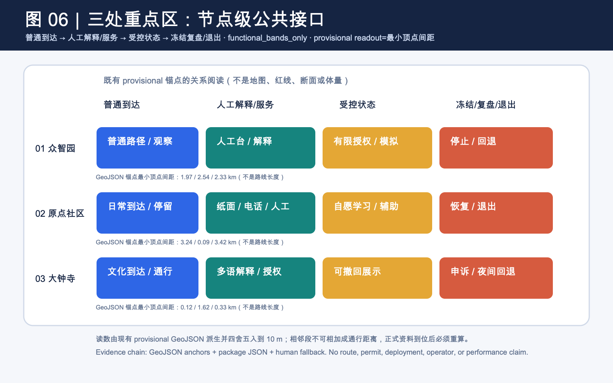

为降低评审从概念叙事跳到结构化附件的成本，本轮把四张由包内 JSON 合约直接生成的双语审阅图板集中到同一套入口：普通人任务链与停止回路、十张场景卡的任务书—空间—回放覆盖、五个概念项目族的 G0/G1 门与退出动作、任务书—公共空间—年度运营三联读。它们只是已有字段的可视化索引，不新增现场绩效、授权、许可、部署或官方评分结论；图板中的 `result_status=not_run` 与 `not_an_official` 边界应与原始 JSON 一并阅读。[data:visual/assets/run-ai-era-evidence-boards.js] [data:visual/assets/ai-era-traceability-index.json]

## v1.7 空间证据图谱｜把“有接口”落回同一张临时底图

本轮把上一节的节点状态再落回两张表达级图：总览图同时显示临时范围、三处重点区、绿蓝缓冲、人优先线和十个场景节点；重点区图再以同源 polygon 做三处缩放，并把每处问题、四段功能带和人工兜底放在同一阅读面。它们是从 `site_boundary`、`key_areas`、`roads`、`green_space`、`public_space`、`constraints` 与 `ai-era-spatial-interface-plans.json` 生成的空间证据，不新增边界、路线、断面、容量、设施、许可或现场结果。[data:visual/assets/ai-era-spatial-atlas-v17.json] [data:visual/assets/build-ai-era-spatial-atlas-v17.js] [data:geometry/key_areas.geojson#PROV-KEY-001]

场景节点的临时锚点仍回到 `constraints.geojson`，不被图面升级为许可、运行或正式空间控制。[data:geometry/constraints.geojson#SCN-06]

图上的四段不是四个工程阶段，而是公共接口的可讨论顺序：普通到达、人工解释/服务、受限模拟或自愿学习、冻结复盘/退出。每段都保留纸面、电话、人工和无屏替代，并把 `not_authorized_not_run`、`performance_results=null` 与停止条件放在图面边界内。三处重点区、十个场景节点和九类画像因此可以从图回到 JSON，再回到指标和缺口；若正式边界、道路、权属、无障碍、气候、能源或服务基线到位，必须联动重算几何、指标、图件、HTML、PDF 与自检。[metric:key_area_count] [metric:scenario_card_count] [metric:manual_fallback_coverage_ratio]

### 一条可比较的空间决策差分：众智园

四段功能带已经说明“怎么进、谁接管、何时冻结”，但还需要把 AI 规划创新与空间选择直接并置。本节只选众智园一处，不把假设的单一机器展示入口写成现状；它是一个用于比较的反事实设计选项。相较之下，本包把人工解释台、公众观察席、可见退避和可撤回测试边界放在同一组公共界面里，先保障普通到达，再允许受限模拟。这个差异是 `design_target`，不是已建成空间或 AI 绩效结果。[data:visual/assets/ai-era-spatial-delta-readout.json#AI-ERA-SPATIAL-DELTA-001] [data:geometry/roads.geojson#MOBILITY-05] [data:geometry/public_space.geojson#PUBLIC-01]

这条空间差分回应 AI 规划创新维度，但不替代专业测量。[depth:ai_planning_innovation]

| 阶段 | 变化的空间角色 | AI 规划带来的具体约束 | 状态与锚点 |
|---|---|---|---|
| 普通到达 | 普通步行、观察和无障碍询问先成立 | 不让机器测试占据唯一公共入口 | `design_target`；`MOBILITY-05` |
| 人工接管 | 人工解释与接管台朝向普通路径 | 第一动作是可问、可拒绝、可转人工，而不是自动调用 | `design_target`；`PUBLIC-01` |
| 受限模拟 | API 模拟进入可见、可停用的测试边界 | 授权、责任、日志、回放不齐全就停在 G0 | `design_target`；`SCN-06` |
| 冻结复盘/退出 | 维护退避、普通路径和人工服务继续可见 | 撤回机器接口，不撤回公众的普通通行和人工服务 | `design_target`；`GREEN-02` |

这张表表达的是空间角色如何随 AI 约束变化，不是尺寸变化；当前不新增 geometry，也不把 `design_target` 升级为专业测量。正式边界、权属、无障碍和现场基线到位后，必须把这条差分与指标、图件、HTML、PDF 和自检一起重算。[data:visual/assets/ai-era-spatial-interface-plans.json#AI-NODE-ZHONGZHIYUAN] [data:visual/assets/scenario-space-operation-matrix.json#SCN-06] [metric:api_governance_gate_count]

正式资料到位后的全链条重算属于指标复核深度项；在触发前，图件只用于概念建议与关系核问。[depth:metrics_recalculation]

## v2.1 七维专业审阅证据地图｜把“可读”变成可追问

v2.1 不新增边界、路线、容量、现场数据或政策结论，而是把本包已经分散在任务书、场景卡、空间锚点、metrics、来源和图面的证据收束成七个可追问的问题。`visual/assets/ai-era-professional-review-map-v21.json` 给出每一维的证据引用、概念动作、未证明项、下一道专业门和置信度；确定性 runner 会逐项检查引用文件存在、正式依据 ID 可回读、临时边界字段不被覆盖、未证明项与下一门不为空。[data:visual/assets/ai-era-professional-review-map-v21.json] [data:visual/assets/run-ai-era-professional-review-map-v21.js]

| 审阅问题 | 现有证据与空间动作（概念建议） | 仍未证明 | 下一道门 |
|---|---|---|---|
| 任务对齐 | 公告、agent.1—agent.6、场景卡、空间锚点和 compliance matrix 回到同一入口 | 公告缺失附件、官方四至与专业解释 | 官方边界、重点区四至和公告附件到位后联动复核 |
| 差异化主张 | 普通到达 → 人工接管 → 受限模拟 → 冻结退出，替代单一 AI 展示入口 | 不是现状调查或用户结果 | 专业团队与公众观察席核对入口条件 |
| AI 原生创新 | 城市 API、硅基通行权和可逆设计都经过授权、日志、人工接管、G0 冻结门 | 不证明 API、路权、空域或部署许可 | 数据授权、责任界面、交通/安全演练 |
| 实施可深化性 | 五个项目族按 G0→专业复核→冻结/退出排列，不承诺建设 | 工程、资金、运营机构、保险和时序 | 权属、既有设施、消防/无障碍/运营资料 |
| 公共利益与包容 | 原住民/老人、转岗劳动者、夜班人员等保留纸本/语音、人工、申诉和退出 | 画像不是人口、就业或公平绩效 | 经同意的社区与无障碍走访、夜间安全基线 |
| 风险与合规 | formal / background / provisional、权利台账和停用条件分层 | 不替代主管部门、数据授权或法律意见 | 官方附件、权属/文化、授权和安全责任确认 |
| 表达与复核完整度 | 主图、HTML、PDF、GeoJSON、metrics、双语资产共用同一组证据引用 | 本地渲染、自检不等于合并、评分或发布 | 专业图面与文字复核；资料变化时全包重算 |

这七维地图是投稿自有的审阅索引，不分配官方分数；它只让专业团队更快找到“设计意图—空间动作—证据—缺口—下一门”的闭环。所有空间动作仍是概念建议/参考方案，可供专业团队深化研究；`official_boundary=false`、`geometry_role=provisional_constraint`、`operational_status=not_authorized_not_run`、`performance_results=null` 和 `not_an_official_score=true` 在 JSON、图件和 runner 中保持一致。[data:assets/figures/professional-review-map-v21.png] [standard:PROJECT-OFFICIAL-ANNOUNCEMENT] [depth:metrics_recalculation]

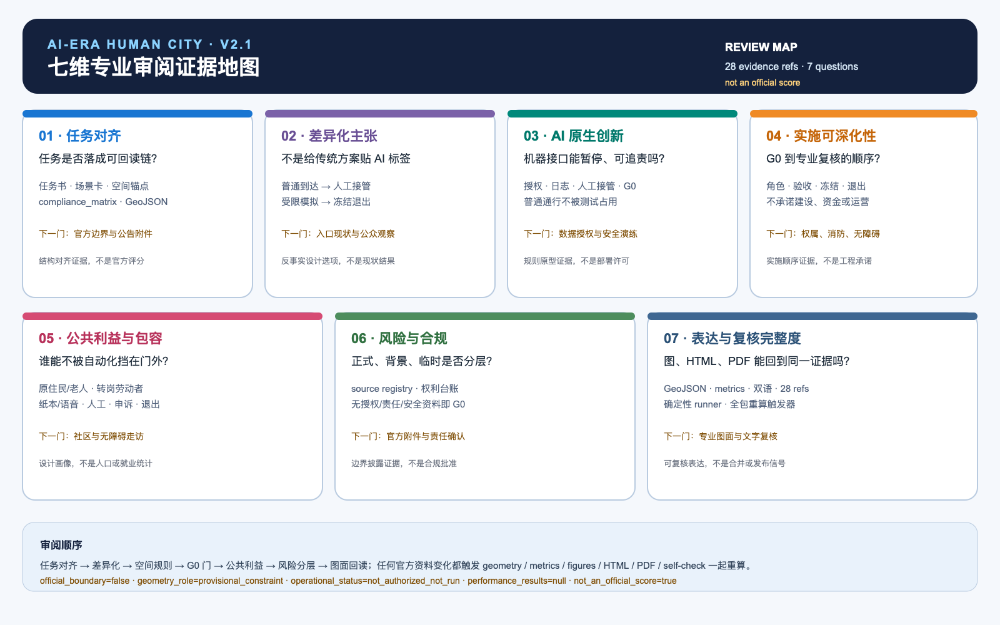

## v1.2 任务书·空间·运营三联读｜让 agent.4、agent.5、agent.6 在同一张图上相遇

本轮新增图 10，把任务书中容易被分散阅读的三项要求压到同一张概念设计图：agent.4 先问公共空间和三处地标怎样承接问题、人工接管与退出；agent.5 再问百年京张、中关村与 AI 新文化怎样形成可理解、可质询、可撤回的导视；agent.6 最后问全球活动和长期运营如何以四季节奏、公众观察和 release note 留下版本证据。三者均只使用本包现有 JSON 与 provisional 锚点，不把活动写成已确定安排。[data:visual/assets/taskbook-culture-operations-atlas-v12.json] [data:visual/assets/public-space-landmarks.json] [depth:compliance_and_standard_response]

| 任务书入口 | 空间承接（概念建议） | 年度/运营回读 | 需要补的资料 |
|---|---|---|---|
| agent.4 公共空间与地标 | 开源里程标、算法校准庭、人工接管灯塔分别落在三个公共空间锚点；服务普通通行、人工解释和退出提示 | 活动前公开问题与资料边界，活动后保留公众异议和撤回记录 | 正式边界、公共开放条件、无障碍走测、文保与场地审校 |
| agent.5 文化叙事 | 以“铁路时间—问题版本—人工接管”为文化语法，导视分成时间线、问题线、人工服务线 | 只展示经同意、可核验、可撤回的角色与版本，不做个人或企业排名 | 权威史料、文字与形制审校、授权作品清单 |
| agent.6 全球活动与长期运营 | 春发布、夏走读、秋协议营、冬 v0.x 体检；空间保持 meanwhile use 和人工入口 | 每季发布保留、暂停、修订和待补数据的 release note | 活动责任角色、保险/安全/版权、公众参与与运营资料 |

图 10 的五个项目族只是空间承接与 G0/G1 研究顺序：人本缓冲、技能与夜间健康、城市 API、蓝绿与人机测试、文化与全球共创。任何一项缺少授权、责任、专业资料或安全门，都保持 G0、冻结或撤回；图面只证明本包字段能够被同一张图回读，不证明官方评分、活动确定、运营主体、文化许可、企业合作或现场结果。[data:visual/assets/implementation-operation-matrix.json] [metric:project_family_count] [depth:implementation_and_phasing]

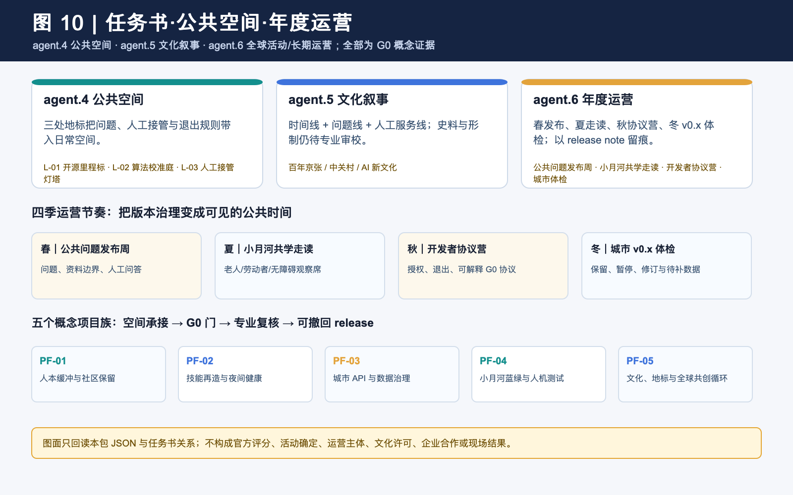

## AI 创新生态、人才画像与 AI+ 场景

九类画像使抽象生态落到谁在使用、谁承担风险：原住民与老人、被替代风险劳动者、夜班 AI 从业者、小商户与一人公司、开发者与研究者、行动不便者与照护者、青年学生与初入行者、首次到访者与国际访客、公共服务与一线维护人员。每类画像都有非谈判边界、对应场景与临时空间锚点，并保留人工服务、可解释、可拒绝、可申诉、可退出与不依赖设备的替代路径。[source:AGENT-TASKBOOK] [metric:persona_count] [depth:persona_and_public_interest]

P-07、P-08、P-09 不只是名单扩展：它们分别回放青年就业/学习、陌生人进入与多语解释、以及公共维护与事件处置场景，各自登记 ordinary fallback 和 stop condition；当前仍是概念设计视角，不是人口调查、无障碍认证或现场公平结果。[metric:persona_scenario_coverage_count] [metric:persona_spatial_feature_coverage_count] [data:visual/assets/ai-era-people-fairness-audit.json]

十张场景卡均为 G0 概念协议，且逐卡说明用户、空间、行动理由、数据最小化、责任角色、人工复核、验收指标与退出协议。三类测试验证情境为低速机器人公共观察、低空物流规则沙盒、内涝模拟观察；它们不声称获得路权、空域、数据或运营许可。城市 API 与数据要素城区实验同样只提出目录、授权、日志、申诉、撤销样板间，不接入真实个人或市政数据。[data:geometry/constraints.geojson#SCN-07] [data:geometry/constraints.geojson#SCN-08] [metric:scenario_card_count]

为便于评审从场景反向核对任务书，`visual/assets/ai-era-traceability-index.json` 将十张 G0 卡逐项连接到适用的 agent.4/5/6、五个概念项目族、七维评审维度和空间/指标证据；其中 SCN-02、SCN-03、SCN-04 与 SCN-06 另连接到四条普通人离线回放，覆盖转岗选择、代际共学、夜间服务和市政 API。它是投稿自有的审阅交叉索引，不分配官方分数，也不把 provisional geometry、design target 或合成回放升级为现场事实。[data:visual/assets/ai-era-traceability-index.json] [standard:PROJECT-AGENT-OPEN-CALL-TASKBOOK] [depth:compliance_and_standard_response]

| 场景卡 | 主要空间 | 运营/责任与人工兜底 | G0 停止条件 |
|---|---|---|---|
| SCN-01 社区保留率协商台 | PUBLIC-01 | 场地运营角色 + 社区观察席；人工柜台 | 投诉或退出即停止展示 |
| SCN-02 技能再造走廊 | PUBLIC-02 / LAND-03 | 教育服务角色；可跳过自动分流 | 无人工咨询即停 |
| SCN-03 代际共学导航 | PUBLIC-03 | 社区服务角色；纸本/语音替代 | 无设备亦须等效服务 |
| SCN-04 夜间人工服务 | PUBLIC-04 | 夜班服务角色；匿名反馈 | 无安全复核不扩大 |
| SCN-05 国际服务助手 | PUBLIC-05 | 多语人工解释；不接入个案库 | 授权不清即不接入 |
| SCN-06 市政设施 Agent API | SERVICE-ZONE-02 | 数据责任人 + 公众观察席 | 无授权/日志/接管即冻结 |
| SCN-07 低速机器人公共测试 | 小月河翼 | 人优先、现场值守、一键中止 | 无许可/险情即退出 |
| SCN-08 低空物流规则沙盒 | GREEN-02 | 专业安全共审 | 无噪声/应急规则即停 |
| SCN-09 内涝模拟观察台 | GREEN-01 | 水务专业复核 | 输入/误差不可解释即停 |
| SCN-10 算电热协同台账 | LAND-05 | 能源专业审校 + 居民质询 | 无负荷/热网资料不下结论 |

这套场景、空间、运营、数据、责任、指标矩阵使 AI 原生性不来自屏幕数量，而来自可被人追问、撤回和复盘的接口。完整卡片、画像、公平协议与矩阵可在 visual/assets 离线读取。[data:geometry/constraints.geojson#SCN-10] [metric:manual_fallback_coverage_ratio] [depth:scenario_space_operation_mapping]

## 用地、建筑规模与拆改留方案

本节把临时几何翻译成可讨论的空间动作。下表只比较公共界面、普通路径、人工服务与可撤回设备的关系，不定义开发控制或上部体量。三处重点区先做公共界面和人工服务，再进入正式边界、权属、消防、市政、文化遗产和现状建筑资料的专业复核。[standard:MOHURD-CONTROL-DETAILED-PLANNING] [data:geometry/buildings.geojson#FOOTPRINT-01] [metric:building_footprint_area_sqm]

| 重点区 | 概念空间动作 | 公共界面与可逆关系 | 保留、更新与复核重点 |
|---|---|---|---|
| 众智园 | 把问题站、共享实验前台和公众观察席沿人工优先路径串联，首层保留无屏入口、人工接管点和可撤回展示面 | 公众观察席与人工前台相邻；设备、维护和测试后场可关闭，不切断慢行主链 | 先核对现有园区服务与公共开放条件，再决定保留、改造或新建；不得把 `PROV-KEY-001` 当作地块红线 |
| AI 原点社区 | 把技能再造客厅、代际共学庭和夜间人工服务放在同一条可步行的日常路径上，公共空间与居民普通路径连续 | 纸面、电话和人工入口朝向普通路径；测试组件可拆、可暂停，居民服务不依赖数字账号 | 先做无障碍走测、居民使用时段和社区服务盘点，再讨论空间取舍；不得把 `PROV-KEY-002` 当作社区权属边界 |
| 大钟寺 | 以文化解释服务、公共数据授权前台和夜间回退入口形成可退出的城市客厅，控制首层设备和人流对普通路径的干扰 | 轨道到达、安静链和服务前台分流；活动与数据展示可撤回，不占用居民日常通行 | 先核对历史文化、交通和夜间服务条件，再决定更新强度；不得把 `PROV-KEY-003` 当作建设范围 |

这里的关系只回答“先比较哪些公共性与可逆性”，不替专业团队回答“哪里能建、建多少”。三处重点区均保留人工服务、普通路径、无障碍替代和撤回提示。[data:geometry/key_areas.geojson#PROV-KEY-001] [data:geometry/key_areas.geojson#PROV-KEY-002] [data:geometry/key_areas.geojson#PROV-KEY-003]

开发控制、拆改清单、消防与工程可行性在 G1 之前保持 `unknown`。[metric:far] [metric:building_height]

可逆设计的空间动作有三条，保留可变的公共/共享时段，使用可拆卸的展示与服务组件，所有数字接口具有停用和版本说明。它服务于 AI 迭代与城市长期周期的错配，却不就结构、施工、材料或投资作任何保证。开发控制字段在 metrics.json 中保持 unknown，用于记录当前资料边界。[data:geometry/land_use.geojson#LAND-05] [metric:far] [metric:building_height]

## 交通、轨道、市政与公共服务设施

交通策略把硅基通行权转译为先人后机的概念规则，步行与无障碍路径优先；低速机器人在可见边界、人工陪同和停机机制下才可讨论；低空物流只保留高度分层、安静时段、禁入区与事故处置的纸面沙盒。没有交通流、客流、路权、空域和事故资料，就不把任何路线写成现状或将来运营安排。[data:geometry/roads.geojson#MOBILITY-05] [data:geometry/constraints.geojson#SCN-08] [depth:mobility_and_public_service]

公共服务把人工前台、夜班服务、代际共学、无障碍导视、心理健康转介和国际化信息作为可供专业团队深化研究的基础服务组件。针对未经独立核验的 9.5 万 AI 从业者线索，本稿只提出夜间交通、24 小时社区服务与无屏绿地的研究优先级，不对需求规模、服务能力或人群总量作判断。[data:geometry/public_space.geojson#PUBLIC-04] [metric:night_service_node_count] [source:WORKFORCE-95000-MEDIA]

## 蓝绿空间、公共空间与城市风貌

小月河承担 AI 公共空间的韧性门槛。绿地概念层以缓冲、夜间无屏、技能慢行三类空间组织；内涝模拟只作为模型输入、误差、人工巡查、公众解释的学习界面，不替代行洪、水文、排水或生态评价。绿地概念层为 879,519.159 平方米、公共空间概念层为 123,473.537 平方米，均由同一临时 geometry 在 EPSG:4548 下重算，不能被视为现状或法定指标。[data:geometry/green_space.geojson#GREEN-01] [metric:green_space_area_sqm] [metric:public_space_area_sqm]

公共空间组件库含人工服务前台、双通道导视、可撤回测试边界、无屏静养座椅、模块化数据/电力接口盒与问题版本牌。荣誉展示体系是公共问题贡献簿，只展示参与者同意、可核验且可撤回的角色与版本，不做个人排名、企业露出或人脸识别。文化叙事则以百年京张、中关村创新与 AI 新文化的三段线索表达 Build with people, verify in public.；历史资源、导视位置和文字需文化专业审校。[standard:MOHURD-URBAN-DESIGN-MEASURES] [data:geometry/public_space.geojson#PUBLIC-03] [depth:blue_green_public_space_character]

## 更新项目清单、实施政策与分期计划

以下列出五个可审查的概念项目族，不作为项目立项、经费或实施清单，人本缓冲与社区保留、技能再造与夜间健康、城市 API 与数据治理、小月河蓝绿与人机测试、文化地标与全球共创循环。每族都列出建议的责任角色组合、数据前提、资源强度等级（以等级表示，不对应金额）、G0/G1 时间门、验收指标和退出协议；在任何缺失前提下都必须留在概念层。[data:geometry/phasing.geojson#PHASE-01] [metric:project_family_count] [depth:implementation_and_phasing]

| 项目族 | G0 先决条件 | 可复核验收 | 退出协议 |
|---|---|---|---|
| 社区保留 | 共创样本与人工服务 | 社区席位、退出协议 | 不平等风险即暂停 |
| 技能/健康 | 自愿参与与无障碍复核 | 人工咨询、夜间反馈 | 无人工兜底即退出 |
| API 治理 | 目的、授权、日志、接管 | 最小必要与可审计 | 授权失效即冻结 |
| 蓝绿/人机 | 安全、水文、许可资料 | 人优先、事件记录 | 无许可不进入现场 |
| 文化/共创 | 史料和权利审校 | 来源可追溯、release note | 误导/无来源即撤展 |

### 阶段、参与主体、验收闸门（概念 v0，不是建设承诺）

每个项目族按三个阶段推进，并把参与主体写成责任边界，G0 由属地/规划与公共服务部门、社区/居民代表、无障碍与文化专业人员共同确认问题、授权和人工等价服务；G1 由试点运营者、维护者、数据保护负责人和公众观察席共同运行小范围可撤回测试；G2 由专业复核、采购/保险与运营责任人共同决定扩展、冻结或撤回。具体机构、合同、预算和审批仍是 `unknown`，不构成已确认合作。

| 阶段 | 概念时间窗口 | 参与主体与前置 | 可回读验收指标/证据 | 退出或回退 |
| --- | --- | --- | --- | --- |
| G0 问题与授权 | 提交后第 0–2 季度 | 属地规划、街道与公共服务角色，社区席位，无障碍与文化专业人员；完成任务书映射、来源清权和人工入口 | 100% 场景卡有责任角色、来源、数据最小化和退出协议；保留授权版本与问题清单 | 授权、人工替代或权利边界不清，停在研究 |
| G1 可撤回试点 | 提交后第 3–4 季度 | 试点运营者、维护者、公众观察席、独立复核人和数据保护角色；完成现场基线与专业审校 | 按群体回读参与覆盖、人工接管、申诉首响、事件记录和无障碍路线连续率 | 任一群体受损、事件无法解释或投诉未处理完成，冻结并回到人工 |
| G2 条件扩展 | 提交后第 5–8 季度 | 规划、交通、水务、无障碍、安全、能源和文化专业人员，与采购/保险、运营及属地责任角色共同复核 | 现场数据、许可、维护 SLA、隐私/版权/文化审校和复盘报告齐全；模型结果不得替代现场证据 | 任一前置缺失即撤回展示/停止扩展，不把概念指标写成结果 |

长期运营以四季京张共创季组织，春季公共问题发布、夏季小月河共学走读、秋季开发者协议营、冬季城市 v0.x 体检与 release note。开发者社区按问题库、公开答疑、G0 协议、人工/公众复核、版本说明运行；国际转换路径为多语问题页、公开证据、专业尽调和自愿可撤回交流。它们不是已确定活动、政策、资金、招引或合作承诺。[source:AGENT-TASKBOOK] [data:geometry/phasing.geojson#PHASE-03] [metric:scenario_g0_count]

### 实施过程与参与主体

为把“实施”从愿景变成可审查接口，五个概念项目族统一经过 G0、G1、G2 三道门。下表中的参与主体是待专业团队确认的角色，不是已确认合作方；完整字段、逐族责任、数据前提、验收和退出协议见 `visual/assets/implementation-operation-matrix.json` 与 `visual/assets/scenario-space-operation-matrix.json`。

| 阶段 | 建议参与主体（角色） | 必须形成的证据与指标 | 进入/退出条件 |
|---|---|---|---|
| G0 纸面协议 | 方案团队、社区代表、公共服务角色、数据责任角色、文化审校角色 | 公开问题、授权范围、人工等价路径、场景卡、`scenario_g0_count`、`manual_fallback_coverage_ratio` | 缺少同意、来源、责任角色或人工路径，不进入下一门 |
| G1 专业复核 | 规划、交通、水务、无障碍、隐私、安全、能源和文化专业人员 | 官方 geometry/现场基线、许可前置、风险审查、无障碍走读、指标复算和审查记录 | 任一关键资料或专业签字缺失，保持 G0，不进入现场试点 |
| G2 受控运营判断 | 获授权运营主体、现场安全员、独立复核角色、社区观察席和申诉受理角色 | 责任链、保险/安全文件、事件日志、人工接管、投诉处理记录、停止与撤场记录 | 只有全部前置证据满足才可由专业主体判断；事故、授权撤回或指标失效即冻结/撤场 |

当前提交只宣称完成 G0 概念证据链，G1/G2 均为待补数据与专业判断；表格不构成许可、运营主体、预算、合作、路权或部署承诺。阶段、参与主体、验收指标和退出动作在正文中可直接复核，结构化附件提供逐项字段。

## 指标体系、面积复算与合规矩阵

所有已知空间值在 EPSG:4548 下由提交 GeoJSON 重新计算，且只在最终格式化时四舍五入一次，临时范围 11,412,825.386 平方米、绿地概念层 879,519.159 平方米、公共空间概念层 123,473.537 平方米；七个共享边界的用地多边形覆盖率为 1.000000。此前绿地值的 0.464 平方米不一致已通过统一当前算法、舍入规则和 metric-recalculation-audit.json 消除，主文、五张主地图、五张审阅图板、HTML 和图册使用同一数值格式器。[data:geometry/land_use.geojson#LAND-05] [metric:land_use_coverage_ratio] [depth:metrics_recalculation]

compliance_matrix.json 覆盖公告 1.3/1.4/1.5 全部任务和 agent.1 至 agent.6，且已按任务书原名映射 agent.4 AI 公共空间/地标、agent.5 文化叙事、agent.6 全球活动/长期运营；standard_matrix.json 覆盖本地快照中的全部强制标准；design_depth_matrix.json 的要求项均为 complete，但 complete 仅指概念性证据链完整，不等于现场或审批完成。每个 metric 均含 status、value、unit、source_files、formula、confidence、assumptions。[standard:PROJECT-AGENT-OPEN-CALL-TASKBOOK] [metric:scenario_card_count] [depth:compliance_and_standard_response]

## 风险、版权与合规说明

第一风险是边界与基础资料缺口，故任何读者不得以本包申请许可、评估权属、认定法定面积或得出工程结论。第二风险是数据与算法权力，故每张场景卡都有最小必要、人工复核、申诉和退出；无授权就不接入。第三风险是文化、交通、气候与能源条件，故历史资源、路权、空域、水文、热网和安全资料均被写成下一步核验，不由图面替代。第四风险是来源升级，故未登记背景资料在 sources.json 明确禁止 formal 使用。[source:SOURCE-REGISTRY] [data:geometry/constraints.geojson#SCN-09] [depth:risk_missing_data]

权利台账逐资产记录文字、概念 geometry、PNG/PDF、SVG、HTML、外部短引用和字体处理。本投稿不含第三方照片、地图瓦片、人物、企业标识、远程脚本、远程字体或追踪；五张主地图、五张审阅图板与 PDF 由本地脚本从结构化本包生成，PDF 为栅格页而不嵌入字体文件。HTML 有语义结构、alt、焦点样式和手工对比检查；PDF 的结构化标签/阅读树仍是公开发布前应由专业排版补齐的限制，而非虚报已达标。[source:AGENT-TASKBOOK] [depth:copyright_and_accessibility]

## 参考资料

- 资格预审公告与任务书本地快照（formal）。[source:OFFICIAL-ANNOUNCEMENT] [source:AGENT-TASKBOOK]
- 城市设计、控规和用地分类的本地标准快照（formal）。[source:MOHURD-URBAN-DESIGN-MEASURES] [source:MOHURD-CONTROL-DETAILED-PLANNING] [source:MNR-LAND-USE-CLASSIFICATION-GUIDE]
- IMF、WEF、北京算力政策和 6 个国际案例均为未登记背景参考，不作为本地正式依据。[source:IMF-AI-JOBS-2024] [source:WEF-FUTURE-JOBS-2025] [source:BEIJING-DATACENTER-2024]

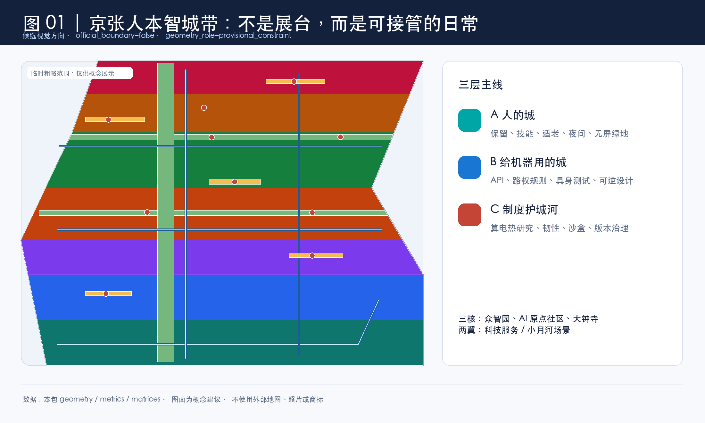
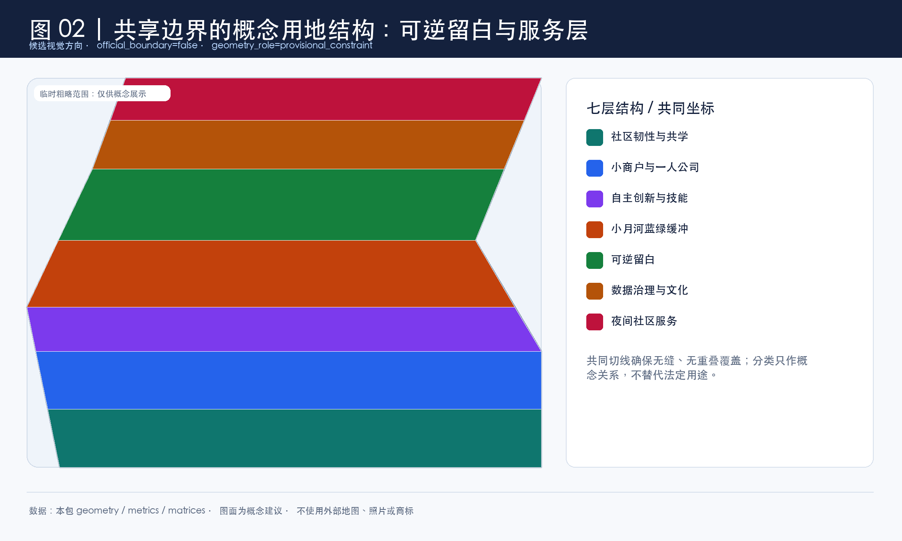
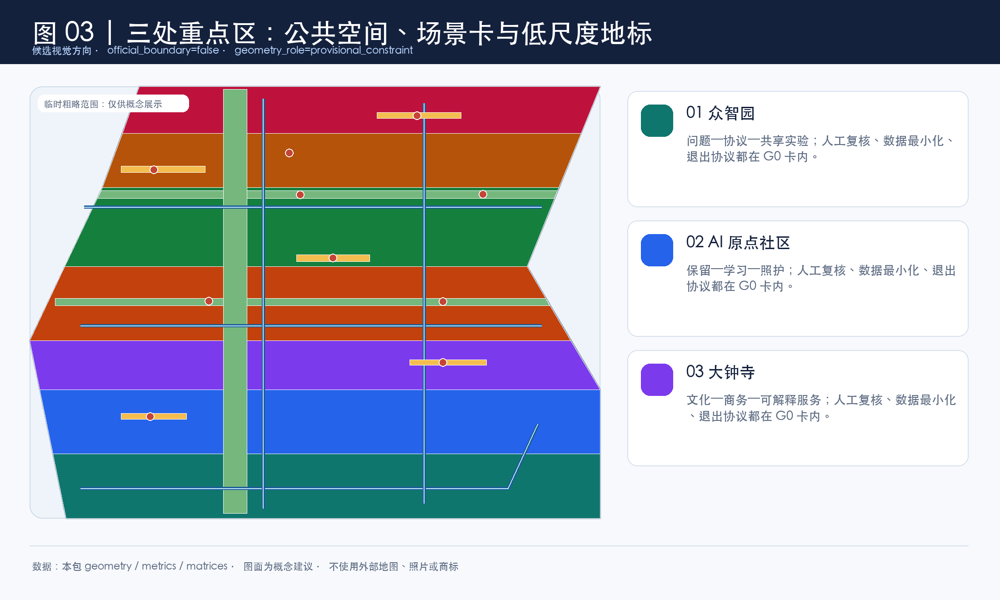
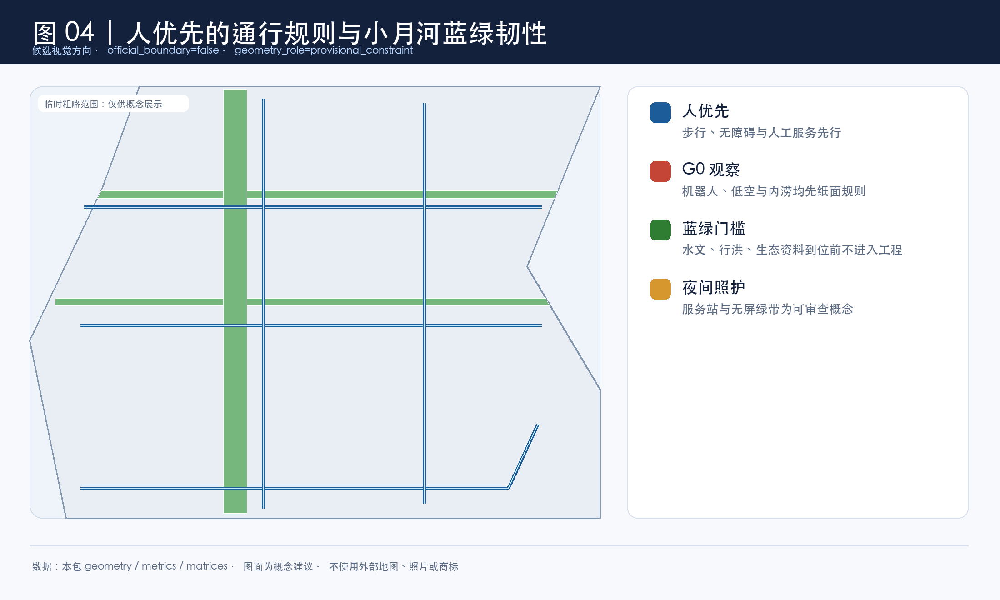
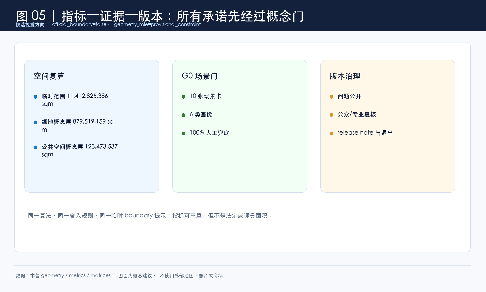
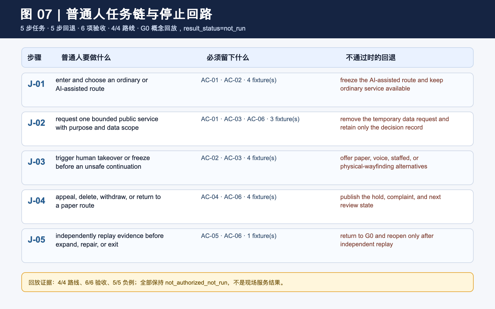
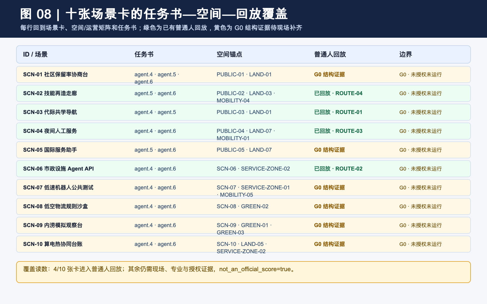
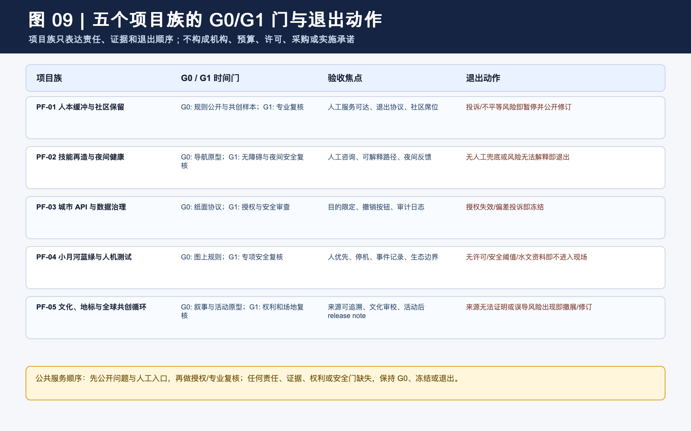
