# 京张通勤共益调度台。企业—居民多模式活动链

> 京张带的下一步应先把企业到岗与装卸、居民上学就医与回家、轨道换乘、路缘停车和维护投诉放进同一个可复算的交通操作系统。每一项 AI 优化都要先检查最慢的人有没有被挤到后面。

本方案是一份独立的新投稿包，第一名项目 `zhongzhiyuan-autonomy-commons` 不在本目录中修改。方案由一张活动链账本、两侧需求台账、六种地面方式、四项服务水平和五道验证门组成。企业侧登记到岗、班车、货运和充电需求，居民侧登记不含个人轨迹的日常服务需求，空间侧用地铁、公交、自行车、步行与无障碍、汽车和企业接驳的多方式链消化峰值，同时把跨边界对外通勤纳入分组 OD。未来空中出行只保留一个有审批前置条件的实验接口。全部空间仍属于概念设计，官方边界、路权、交通量、权属和现场体验到位后才能复算，不把开放数据筛查写成现状容量。

## 这次新增的核心。把一整天的活动链放进同一张账

现有交通图容易回答“哪种方式更快”，却很难回答“一个人先送孩子、再上班、晚上还要回家时，哪一个环节把全日链条拖断了”。本包把一次早高峰出行拆成出发、接驳、到岗或到校、午间服务、返程和回家六个活动节点，再把企业员工、居民工作者、照护者/儿童、访客/服务人员、物流维护和夜班工作者分组回放。每个合成代理只保留群组、方式、时间窗、活动节点、服务边和聚合结果，不生成个人轨迹，也不把合成代理当作居民或员工样本。

新 runner 在声明的人口规模 3,122,000 个合成代理上逐代理循环，比较四个地面政策包和一个被硬阻断的空中候选。政策包同时改变企业可错峰比例、方式权重、换乘可靠性、路缘冲突和人工回退条件。候选先过质量守恒、所有代理处理、容量、最弱群体可达和空中阻断，再按全日广义代价、P90 到达时间、群体公平差和车辆公里代理做排序。它参考活动链、方式选择和可靠性研究的建模边界，但不搬用论文系数 [source:ACTIVITY-BASED-DISAGGREGATE-2001] [source:JOINT-MODE-TIME-CROWDING-2020] [source:PT-SATISFACTION-RELIABILITY-2019]。

容量约束通过候选门禁显式回读，服务是否可继续取决于容量、回退和公平条件，而不是只看一个综合分 [source:SCHEDULED-CAPACITY-TRANSIT-2012]。它是有限候选搜索，不是现场校准的全局最优；现场 OD、班次、容量、无障碍走查和居民/企业意见到位后，应替换输入并整链复算 [data:visual/assets/commute-co-benefit-model.json] [data:visual/assets/commute-co-benefit-readout.json]。

在当前合成输入下，入选候选是“企业错峰 + 轨道公交接驳 + 无障碍保护 + 路缘预约”的地面组合，综合出行压力代理分为 91.88。这个数是合成屏查读数，不是居民满意度或现场绩效。它不靠把居民和照护者的时间往后推来换取企业效率，只允许企业员工中的一部分进入提前窗口，给其他群组保留原始服务窗口与人工/公共交通回退。企业交通需求管理研究可用于提醒我们检查工作地点、弹性时间、公共交通和班车等工具的适用条件，但不能把外地效果搬成本地结果 [source:EMPLOYER-TDM-GUIDE]。空中候选即使在时间代理上更快，也因空域、适航、保险、噪声、消防、天气、应急、公众参与和地面接驳资料缺失而保持 `blocked` [data:visual/assets/run-commute-co-benefit-optimization.js] [source:UAM-BEIJING-MULTIMODAL-2024]。

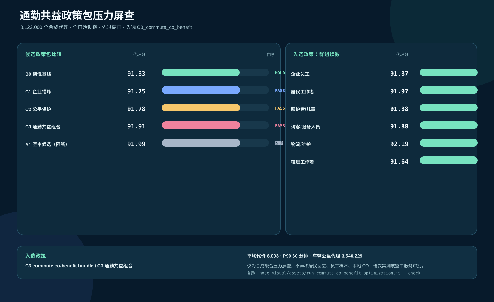

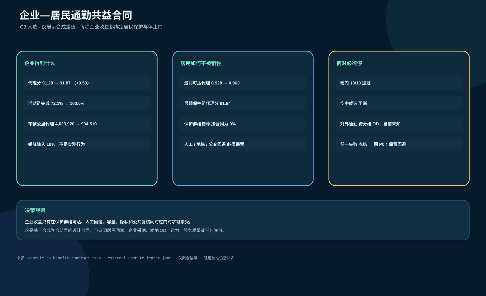

这张合同把“企业得到什么”和“谁不能被牺牲”放在同一处：企业只使用声明的错峰输入，居民、照护、夜班、物流和公共回退保留保护门；对外通勤仍等待有日期的分组 OD，任一硬门失败就冻结政策并回到 P0 [data:visual/assets/commute-co-benefit-contract.json] [data:assets/figures/commute-co-benefit-contract-board.svg]。

合同还需要一张证据阶梯，防止合成分数被误读成开通许可。P0 只登记分组 OD、班次与容量、居民照护和无障碍验证、投诉回退演练以及隐私规则；P1 只做一条可逆的最小活动链；P2 才讨论时段和服务范围扩展。当前方案停在 P0，任一证据过期、保护组变差或责任人缺位，就回到 P0 或停止。空中候选单列为阻断项，不能拿来填补地面证据缺口 [data:visual/assets/commute-co-benefit-authorization.json] [data:assets/figures/commute-co-benefit-authorization-board.svg]。

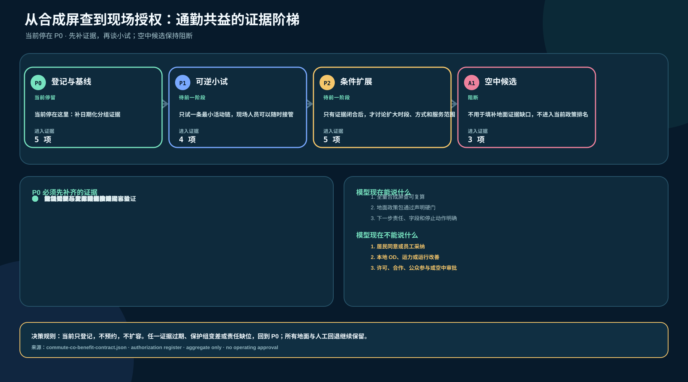

为了看清分数从哪里来，模型又固定 C3 的地面方式、路缘、可靠性和无障碍参数，只把企业错峰输入从 0% 扫到 24%。在这组声明输入下，企业组读数随输入小幅变化，保护群组的最低可达和最低满意度保持不变，全体代理分只出现很小的波动。18% 是当前 C3 的声明输入，不是企业已接受的比例，也不构成现实中的最佳错峰率。企业接受度、班次容量、居民回应和现场满意度仍需有日期的证据 [data:visual/assets/commute-co-benefit-sensitivity.json] [data:assets/figures/commute-co-benefit-sensitivity-board.svg]。

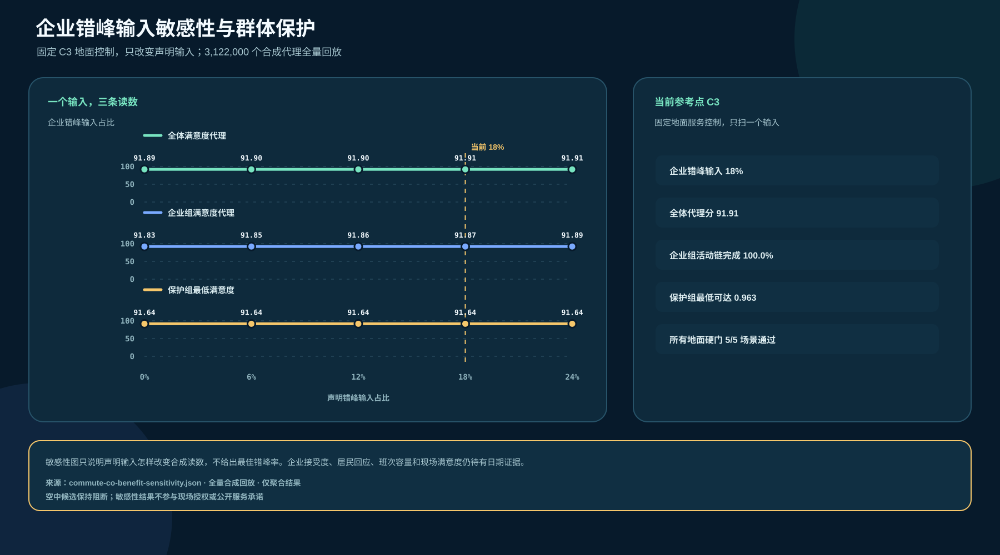

## 时间预算与群体充分性。先看谁能按时到，再看全体平均值

综合代理分会把许多差异压成一个数字。为了保留这些差异，模型用同一批合成代理再读一遍 30、40、50、60 和 75 分钟时间预算。每条曲线表示一个群组在声明时间上限内完成整段合成出行的比例，右侧同时放入 C3 和 B0 的全体读数，并单独保留居民工作者、照护者/儿童和夜班工作者中的最低值 [data:visual/assets/commute-co-benefit-accessibility.json]。

本轮把保护组控制直接写进模型。C3 把 50 分钟设为照护者/儿童和夜班工作者的保护组审核点，40 分钟保留为短时压力诊断；照护者/儿童使用 39% 的步行/无障碍权重和 38% 的地铁权重，夜班工作者保留地铁、公交、步行与必要汽车回退的声明组合。它只是合成压力屏查剖面，现场使用前仍要核对电梯和连续路线、夜间服务覆盖以及人工回家名单 [data:visual/assets/commute-co-benefit-model.json]。

这张图只使用当前 runner 生成的精确时间，不把论文中的阈值、外地样本或现场班次搬进来。它能帮助评审发现一个政策包在平均代价上占优时，是否让某个群组更难赶上 40 或 50 分钟的门槛。当前曲线属于合成充分性代理，不能替代分时 OD、可靠班次、步行和无障碍走查、居民回应或本地可达性基线。时间预算也不是现实中的最佳值，正式门槛要由有权组织和专业团队在日期化证据基础上冻结 [source:ACCESSIBILITY-SUFFICIENCY-2022] [source:TRANSIT-ACCESS-STOCHASTICITY-2026] [data:visual/assets/run-commute-co-benefit-accessibility.js]。

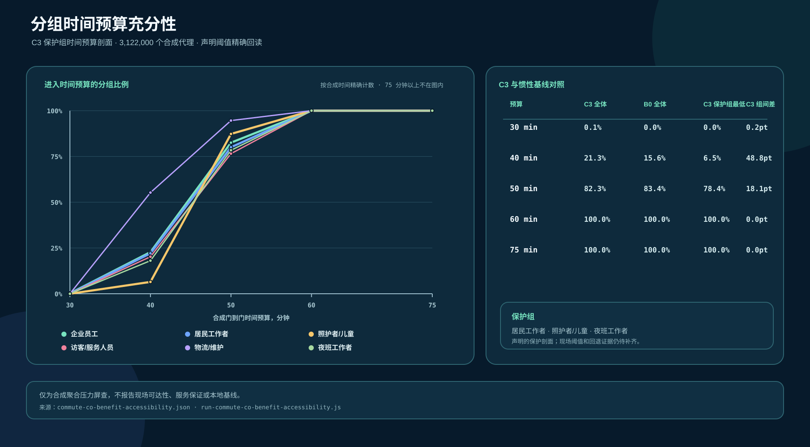

## 一页执行摘要。先验收一条到站到家链，再谈共享接驳扩展

普通人要在出门、换乘、受阻、求助和回家每一步都保有可理解的选择。第一个可逆试点只验收一条最小链。它从选择公共、无障碍或人工路径开始，经过交通服务请求，在断网、雨雪、路缘冲突或错过衔接时转由人工或轨道公交接管，遇到不安全或不可达状态就冻结预约并退出，最后由独立复核者回放证据，决定修复、扩展或撤回。这不是现实运营承诺。当前 M-09 只在本地、无网络、无个人数据的合成桌面演练中复演 4 条请求，`performance_results=null`、`operational_status=not_authorized_not_run`。

为了让桌面演练成为可读的空间验收入口，四类请求各自对应一个触发事件和人工/公共交通回退；摘要只验收是否冻结预约、保留回退、记录缺口和不推进 P1/P2。具体请求、触发器和 6/6 检查仍以包内 fixture 回读，`performance_results=null`，不把合成 PASS 写成现场绩效 [data:visual/assets/mobility-tabletop-contract.json] [data:visual/assets/mobility-tabletop-evidence.json]。

| 步骤 | 普通人看到的空间/服务 | 必须留存的证据 | 失效后的动作 |
| --- | --- | --- | --- |
| 1. 选择 | 站口导向、连续步行/轮椅路线、人工/电话/纸面入口与共享接驳候选并列展示 | 选择方式、服务窗口、无障碍需求类别和版本号；不留连续个人轨迹 | 数字入口不可用时保留人工等价路径；没有等价路径就不开放 |
| 2. 请求 | 公共交通换乘、班车/小巴候选、路缘装卸或社区日常服务台 | 请求 ID、服务对象分组、起止时间窗、责任人和替代路线 | 权属、责任人、容量或同意边界未知时只登记、不预约 |
| 3. 接管 | 错过衔接、断网、雨雪、无障碍受阻或路缘冲突后，现场人员指向轨道/公交或人工路线 | 触发事件、接管人、到达/转交时间、清场动作和投诉入口 | 冻结自动预约，优先人工/公共交通；无人可接管时停止服务 |
| 4. 退出 | 消息牌、人工窗口和纸面/电话申诉让人能改道、回家或取消 | 取消原因、替代路线、未解决项和 `not_authorized_not_run` 状态 | 消防、无障碍、隐私或安全硬门失败时不扩容、不写成达标 |
| 5. 复核 | 独立复核者回放一条到站到家链，比较是否继续、修复或撤回 | 原始最小日志、分组结果、投诉关闭证据、版本和复核意见 | 证据缺失或最慢群体变差时回到 P0 调查与人工服务 |

这张表把设计图、路缘账本、M-09 回退桌演和 P0/P1/P2 分期接成一条验收流程。4 条合成请求的 PASS 只证明状态机和回滚逻辑可重放，不证明真实客流、无障碍绩效、人员值守、公众接受或安全结果。

## 为什么这是京张的公共空间方案。把历史、产业和日常交通放回一条线

“百年京张”在本方案中不靠一张海报来表达。它回应的是到站、换乘、等候、维护和回家的公共记忆。遗址公园、站口、企业入口和社区服务点用同一套导视、遮雨、座椅、无障碍路线和人工服务台连接；人先看得懂怎么走，再决定是否使用任何智能服务 [source:OFFICIAL-ANNOUNCEMENT]。

| 任务要求 | 在空间中看到的回答 | 当前不越过的边界 |
| --- | --- | --- |
| 百年京张与城市文化 | 把遗址、公园、站口和换乘等候组织成一条可步行、可停留、可解释的公共链 | 不虚构文保结论、历史线路控制线或已批准文化项目 |
| AI 创新带与区域协作 | 众智园、AI 原点社区、大钟寺分别承担企业到岗、居民日常和轨道换乘；企业、高校、社区和维护者按角色进入同一时段账本 | 没有机构名单、协议或居民样本时，不写成产业联盟或合作事实 |
| 规划创新 | 把路缘状态、慢行连续、站口容量、消防净空和人工回退画成可关闭的空间服务层，自动化只是受限接驳 | 不新增道路红线、停车供应、社会道路许可或建筑强度承诺 |
| 可感知的 AI+ 场景 | 普通人能在站口、服务台、候车和路缘牌上看到选择、责任人、停止条件和申诉入口 | 模型压力屏查不替代现场客流、无障碍或公众体验 |
| 长期运营与传播 | 双语图板、公开聚合账本、资产 ID、投诉闭环和 P0/P1/P2 复核把方案做成可更新的公共文档 | 不把双语展示写成国际活动、政府背书或运营绩效 |

这张表把交通操作系统落回城市设计的五个可见界面。它们分别是站口、公共空间、建筑首层、路缘和维护点。三处重点区的体量与首层选择见后文，空间关系仍回接 provisional 图层，实施依赖与回退责任由专业团队和有权组织补齐 [depth:overall_spatial_structure] [data:geometry/key_areas.geojson#PROV-KEY-001]。

## 四类人先看什么。把交通方案落到出门、到岗、到家

同一张路网对不同的人有不同的难处。下面把企业、居民、照护与无障碍、对外通勤四个入口单独摆出来。它们是情景入口，现场调查完成前不升级为已验证需求。

| 人群 | 先要解决的卡点 | 方案先给什么选择 | 进入验证前要看到什么 |
| --- | --- | --- | --- |
| 居民 | 上学、就医、买菜和夜间回家在换乘处断开 | 地铁和公交接驳、连续步行与轮椅路线、人工和电话入口 | 有日期的分时方式计数、无障碍走查、投诉回应人 |
| 企业员工 | 到岗时窗、班车、停车和装卸互相挤占 | 合并班车候选、路缘预约、公共交通接驳和保证回家回退 | 企业聚合需求、班次与路权证据、责任人 |
| 照护者与轮椅使用者 | 照护链不能等待，连续路线不能被停车和装卸截断 | 无障碍优先路缘、人工引导、公共交通和照护服务回退 | 连续路线审计、辅助通行记录、最弱群体结果 |
| 对外通勤者 | 跨边界停车换乘、地铁公交衔接和到岗时间不稳定 | 跨边界分组 OD、换乘链、停车换乘和时段选择 | 脱敏聚合 OD、站点容量、外部运营协同记录 |

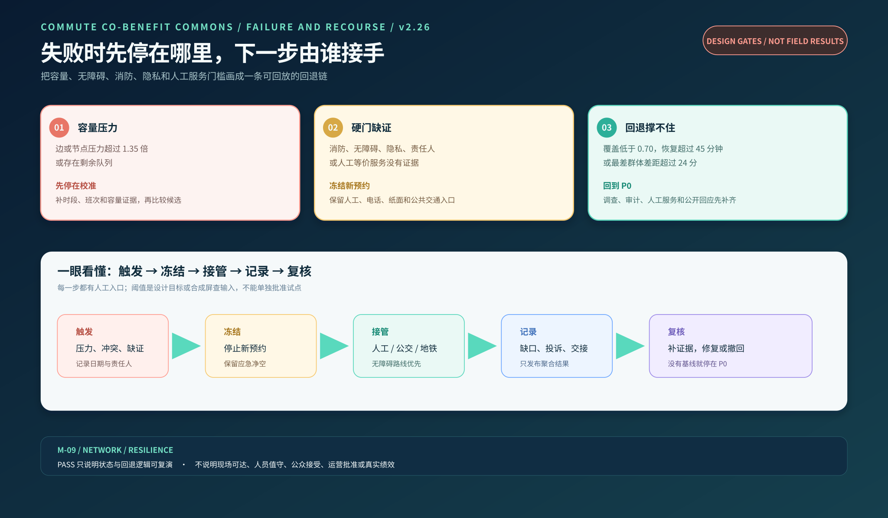

这张图先回答“出了问题怎么办”。图中的阈值属于设计门槛或合成压力屏查，现场运行前不代表海淀实测结果 [data:assets/figures/failure-recourse-board.svg] [data:visual/assets/network-flow-screen.json] [data:visual/assets/resilience-recovery-readout.json]。

## 评审导览。七个维度从哪里开始读

下面是一张面向评审的导航表，不是正式评分表，也不把合成结果升级为现场证据。每一行只给出最短阅读入口、最强证据和必须保留的边界；完整结构化版本见 `visual/assets/review-evidence-index.json`。

| Rubric 维度 | 最短入口 | 首要读者 | 评审先看什么 | 仍不能推出什么 |
| --- | --- | --- | --- |
| 任务书相关性 | 三层范围、`compliance_matrix.json` | 规划与治理评审 | 三层研究、三处重点区、AI+交通场景的交叉回接 | provisional 几何不是法定红线 |
| 原创性 | 一页执行摘要、责任与验收合同 | 方案评审 | 时段路缘账本、企业与居民共益、可撤回人工回退链 | 角色不是已签合同或合作事实 |
| AI 与城市规划创新性 | network-flow / capacity-closure runner | 数据与技术评审 | 全量聚合网络流、容量闭合、空中候选硬阻断 | 合成压力、满意度和容量不是本地绩效 |
| 可实施性 | `responsibility-acceptance-contract.json`、M-09 contract | 运营与实施评审 | P0/P1/P2 角色、字段、阈值、停止与回滚 | 运营者、预算、采购、许可和班次仍待日期化证据 |
| 公共利益与包容性 | 一页执行摘要、M-09 evidence、`service-levels.json` | 居民、企业与无障碍评审 | 无障碍、照护、夜班分组、非数字入口、公共路线和投诉回退 | 尚无居民样本、同意记录或现场可达性绩效 |
| 风险与合规意识 | network-flow、`assumptions.json`、`sources.json` | 合规与安全评审 | 空中候选 fail-closed、隐私最小化、provisional 与 not-authorized 边界 | 政策和论文不能替代专业审查、保险或许可 |
| 表达完整度 | 双语 proposal、离线 HTML、visual、manifest | 全部读者 | 人读层、图板、JSON 审计层、图纸和 hash 的同包一致性 | 导航索引不代表官方评分、CI 通过或实施 |

这张表帮助评审在长篇证据和边界声明之间找到入口，不增加新的事实、指标或实施承诺 [data:visual/assets/review-evidence-index.json]。

## 任务书六项任务如何在本包里落地

任务书的六项任务仍然是整带工作，交通包只对自己能交付的那一段负责。下面先把交通贡献放在前面，再把没有证据的部分明确留给组织方、规划师、文化研究和后续运营团队。完整的机器可读交叉表见 `visual/assets/taskbook-crosswalk.json`，双语图板见 `assets/figures/taskbook-crosswalk-board.svg`。

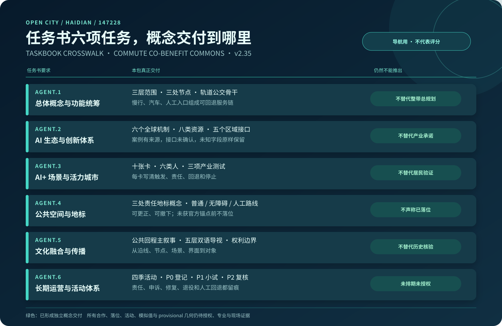

| 任务 | 本包交付 | 评审先看 | 仍未声称 |
| --- | --- | --- | --- |
| agent.1 总体统筹 | 三层范围、三处节点、轨道公交骨干和可回退交通链 | `mobility-spatial-plan.svg`、总体结构章节 | 整带总品牌、法定红线、控规指标和工程结论 |
| agent.2 AI 生态 | 企业、居民、对外通勤、车辆、站点、路缘和维护责任的交通侧台账 | `demand-ledger.json`、`resource-pressure-readout.json` | 产业招商、资金安排、企业名单和确定合作 |
| agent.3 AI+ 场景 | 十张双语场景卡、六类参与者、三项产业测试和逐卡停止条件 | `scenario-cards-board.svg`、启动检查和人员动线章节 | 居民调查、真实 OD、现场运行和公众接受 |
| agent.4 公共空间 | 站口、候车、坡道、骑行停放、路缘服务台和维护点这些交通接口 | `brand-system-board.svg`、重点区和蓝绿空间章节 | 三个朝圣地标、文保审批、桥隧工程和官方活动 |
| agent.5 文化叙事 | 到站、换乘、等候、维护和回家的双语公共服务叙事 | 通勤共益调度台公共空间章节和双语图板 | 整带文化系统、历史核验和未授权版权材料 |
| agent.6 长期运营 | P0 登记、P1 小试、P2 复核、申诉、留存、停止和人工回退 | 责任与验收合同、M-09 准备度证据 | 年度活动、开发者社区、招商转化和运营合同 |

这张表的作用是让人快速找到证据，也让人快速看到缺口。3,122,000 个合成代理、桌面演练和文件自检仍然只说明模型与状态机能够回放，不能推出居民需求、现场容量、公众同意、项目批准或榜单名次。所有空间仍是 provisional constraint，空中出行在证据和审批不足时保持 blocked [data:visual/assets/taskbook-crosswalk.json]。

## 读数标签和使用边界

这份方案把数字分成四类，先看标签，再看数值。

| 标签 | 读法 | 当前能说明什么 | 仍待补齐的内容 |
| --- | --- | --- | --- |
| ▲ 合成代理 | runner 在声明输入下的压力测试读数 | 可以复演、比较、发现瓶颈 | 现场 OD、班次、容量、体验和调查 |
| ◇ 设计闸门 | 试点前的停止或接受条件 | 可以约束何时停、何时回退 | 专业审查、责任主体和日期化基线 |
| ★ 文件已知值 | 能从本包文件回读的值 | 可以核对文件内部是否一致 | 不自动等于海淀现状 |
| ? 待正式数据补齐 | 当前不能可靠填写的字段 | 可以指出下一步调查对象 | 公开、授权或现场证据 |

文中的“综合出行压力代理分”对应模型字段 `satisfaction_proxy`。它只把时间、可靠性、可达性和冲突合成到一个比较刻度里，居民满意度、公众接受和现场绩效仍待正式数据补齐。claim-audit 会逐条检查 headline 数字有没有这层说明，也会检查中英文正文是否指向同一份 runner [data:visual/assets/claim-audit.json]。

## 设计依据与资料清单

征集任务要求覆盖三层空间研究、三处重点区、AI+交通与产业生态，并交付可检查的图层、指标、图纸和视觉页 [source:OFFICIAL-ANNOUNCEMENT] [source:AGENT-TASKBOOK]。

本包沿用公开任务书的 provisional 工作底盘，但以交通运营为主题重做路网属性、指标、来源、图件和实施门槛；`geometry/site_boundary.geojson`、`geometry/key_areas.geojson` 都明确 `official_boundary=false`、`geometry_role=provisional_constraint`，不得解释为法定红线 [data:geometry/site_boundary.geojson#SITE-001] [data:geometry/key_areas.geojson#PROV-KEY-001]。

北京“十四五”交通规划将一小时门到门、轨道和公交、步行和自行车一体化、公交优先以及智慧交通列为方向 [source:BEIJING-14TH-TRANSPORT-PLAN]。海淀区 2026至2027 年道路停车管理服务招标把停车秩序、引导巡查、设备检查、异常处置、后台和“接诉即办”放进同一项服务，说明路缘同时受责任主体和服务水平约束，不能只当作静态地图 [source:HAIDIAN-ROAD-PARKING-TENDER-2026]。

海淀西北旺规划交通材料还要求轨道站点/交通枢纽、首层公共界面、换乘自行车停放、应急疏散和交通影响评价共同校核 [source:BEIJING-HAIDIAN-TRANSIT-HUB-PDF]。这些材料是政策和招标证据，不是本 provisional 范围的现状数据。

资料等级分为四类。`known` 是文件可回读的几何数值，`unknown` 是必须调查而不能猜的企业、居民、停车、换乘和投诉基线，`design_target` 是可逆试点的验收门槛，`blocked` 表示没有权属、路权、责任人、无障碍等价服务或安全回退，不能扩容。企业通勤研究支持班车、公共交通补贴、弹性工时和保证回家等需求管理工具，但也提醒 rideshare 和补贴的效果取决于工作密度、制度和分组行为 [source:EMPLOYER-TDM-LONGITUDINAL] [source:EMPLOYER-TDM-GUIDE]。本包不把论文中的效果百分比迁移成海淀结果。

## 现场与利益相关者证据状态。先把不知道的地方标出来

本包没有声称作者已经到场，也没有居民、企业、轨道公交运营者或无障碍专业人员的访谈和现场走查。`visual/assets/site-and-stakeholder-evidence.json` 把这条边界写成可回读记录。当前只有公开政策、招标、方法和开放地图资料；没有经授权的居民或企业聚合台账，没有个人数据，也没有利益相关者背书。居民上学、照护、就医、购物、夜间回家，企业到岗、班车、装卸和充电，无障碍连续路线以及对外通勤，当前都只是待核对的情景假设，不是已经验证的需求 [data:visual/assets/site-and-stakeholder-evidence.json] [data:assumptions.json]。

受影响的人包括居民、企业员工、照护者和儿童、轮椅使用者、夜班人员、访客、物流维护人员、轨道公交运营者、无障碍与安全复核人员以及应急响应者。当前仍有三类未解决问题。企业优先的时窗会不会挤占居民、无障碍或消防通道；分组需求能否在同意、最小化、保留和删除规则下采集；中断时的回退是否真的保住照护和无障碍路线。它们已登记为开放问题，不用模型读数代替回答 [data:visual/assets/site-and-stakeholder-evidence.json]。

P0 先由获得授权的组织安排有日期的分时聚合 OD 和方式计数、专业无障碍与人员动线走查，以及公开的意见和回应台账。未到现场不阻止概念投稿，但在这些证据出现前，方案不声称居民验证、现场知识、利益相关者支持、运行绩效或 P1/P2 授权；也不上传私人访谈原文和联系方式。

## 三层范围工作框架

三层结构把“企业为什么要改”和“居民如何真正受益”接到同一条证据链上 [depth:three_level_scope_framework] [standard:PROJECT-OFFICIAL-ANNOUNCEMENT]。

1. **统筹层。** 研究京张与海淀的轨道、公交、校园、园区、社区和生活服务如何形成多方式接驳；识别企业时间窗、居民时间窗和公共空间之间的冲突，不新增一条未经交通论证的道路。
2. **总体层。** 用 `land_use`、`buildings`、`roads`、`green_space`、`public_space`、`constraints` 和 `phasing` 共同定义到站、到岗、到家和服务维护的空间关系；用时段状态而不是永久占用表达路缘。
3. **重点区层。** 在众智园、AI 原点社区、大钟寺 AI 产业聚集区各做一组可逆试点，分别验证企业到岗、居民日常和轨道与路缘换乘。

三层共享同一 provisional 约 11.41 km² 工作范围，面积只作为设计比较值 [metric:site_area_sqm]。正式边界发布后，应锁定 revision，重算所有图层、路线、分区、图纸和指标；不得只替换一张效果图。

## 统筹研究范围产业与未来城市研究

### 企业侧。把“通勤”变成可治理的服务

企业应在不上传个人轨迹的前提下，按日或周提交聚合需求台账。台账包括班次窗口、员工总量区间、园区入口、货运和装卸窗口、访客峰值、夜班和应急需求。企业交通专员只看分组后的需求矩阵，平台输出公共交通接驳、拼车或班车、骑行停车、共享接驳和保证回家服务的组合建议。企业要为使用的路缘窗口、人工引导、设备维护和投诉处理承担成本与责任，不能把拥堵转给社区。

### 居民侧。把“到达权”作为公共服务

居民台账只记录匿名化的服务类型和时间段，例如上学、就医、买菜、照护、夜班回家、轮椅通行和快递取件；不采集连续家庭轨迹。任何 AI 推荐都必须保留线下、电话、纸面或人工等价路径。居民不需要加入企业平台才能使用人行路、公共交通、无障碍路线或服务台。分组结果应按年龄、行动能力、照护负担、夜间出行和是否园区员工分别回读，不能只看全体平均值 [source:BEIJING-ACCESSIBILITY-REGULATION] [source:SHARED-MOBILITY-OECD]。

### 未来城市。受控的接驳要控制车辆增长

自动驾驶或按需小巴只在获批、低速、有人值守的首末端场景作为 feeder。研究显示共享自动驾驶可能补充公共交通，也可能挤压公共交通；如果不管理供给，车辆公里数可能上升 [source:SAV-TRANSIT-COMPETITION] [source:SAV-MICROTRANSIT]。本方案把轨道和公交作为骨架，把按需服务设为有容量、时窗和退出条件的补充，并以现场交通影响评价、公共交通客流和居民体验决定是否继续。

## 总体设计范围城市更新与控规深度城市设计

### 总体结构。一条通勤共益调度台、三类接驳、四项服务水平

“通勤共益调度台”连接既有轨道和公交站点、企业入口、社区服务点、公园慢行以及公共停车和装卸节点，形成可辨认的转乘链。三类接驳如下。

- **骨干接驳。** 轨道与公交之间的稳定换乘，优先解决站口、过街、候车和自行车停放的连续性。
- **共享接驳。** 企业合并需求后的定时班车、微循环小巴或共享出行，必须服务于骨干，不能与骨干抢客。
- **人本接驳。** 无障碍步行、轮椅和照护者、儿童以及夜班人工服务，任何数字服务失败都退回这条链。

### 五种地面方式与一个条件空中实验

“通勤共益调度台”按方式分层。**地铁和轨道**承担跨区骨干与对外通勤的长距离段，**公交**补充站点覆盖和夜间换乘弹性，**自行车**承担站点到园区或社区的首末端，**步行与轮椅**构成所有方式都要满足的通行前提，**汽车**只在必要出行、停车、装卸、充电、接送和应急路径中接受管理。企业班车、按需小巴和共享接驳必须先接入轨道和公交，不能用新增车辆替代公共方式 [source:BEIJING-14TH-TRANSPORT-PLAN]。

未来空中出行只建立 `air-mobility-candidate` 关系节点。没有空域、航路、适航、运行人、保险、气象、消防、噪声、应急和公众参与的书面复核前，不画可运营航线，不承诺起降场，也不把论文方法写成许可。若未来进入实验，必须从地面换乘、步行与无障碍疏散和数据记录开始，并设置可撤回、低频、有人值守和天气取消条件 [source:BEIJING-LOW-AIR-ECONOMY-2024] [source:CAAC-UAV-REGULATION-2024]。

四项服务水平分别看四件事。**到达连续**要求人行和无障碍路线不被路缘打断，**换乘可靠**要求等待和衔接落在可接受窗口内，**路缘有序**要求预约、装卸和停车按时间窗清场，**申诉可处理**要求责任人、状态、限时和复核结果可见。路缘管理研究指出，配送、网约车、共享出行和公共活动会争用同一空间，公共部门与企业需要共同安排时间、责任和数据边界 [source:CURBSPACE-MANAGEMENT-2021]。

### 空间更新。先可逆，再固定

现阶段不提出新建桥隧、道路拓宽、停车供应量、建筑高度、容积率或投资额。先用标线/可移动设施、站口导向、遮雨座椅、连续坡道、自行车停放、企业班车候车位和路缘电子/纸面状态牌做 P0/P1 试点。只有当现场测绘、交通模型、消防、市政管线、产权、环境和公众参与均有书面证据，才进入固定工程。

用地和建筑关系回接至 `geometry/land_use.geojson`、`geometry/buildings.geojson`，所有面积属于概念量 [data:geometry/land_use.geojson#LU-001] [data:geometry/buildings.geojson#BUILD-001]。

设计深度与强度边界分别回接 [depth:land_use_layout] [depth:development_intensity_controls]。

## 重点区域详细设计

三处重点区分别承担企业到岗、居民日常和轨道换乘的运营角色，它们共同组成企业与居民出行链。重点区数量为三处，几何仍是 provisional [metric:key_area_count] [data:geometry/key_areas.geojson#PROV-KEY-001]。

| 重点区 | 主要需求 | 设计动作 | 首个可逆试点 | 不能越过的边界 |
| --- | --- | --- | --- | --- |
| 众智园 AI 自主创新加速区 | 企业到岗、班车合并、园区物流、访客峰值 | 入口前置“企业交通台账台”；把班车、骑行停车、装卸和消防净空分成状态层 | 仅在园区管理范围内做 2 个高峰时窗，比较合并班车/公共交通接驳与路缘冲突 | 不把企业需求变成社区禁停；无权属、无现场安全员不开放共享接驳 |
| 北京 AI 原点社区 | 上学、就医、买菜、照护、夜班和无障碍日常 | 以社区服务台、连续人行线、遮雨候车和非数字预约形成“人工优先环” | 对照人工/电话/纸面服务，审计轮椅、照护者和老年人完成同一条日常路线 | 不收集家庭连续轨迹；不以 App、企业账号或摄像头换取基本通行 |
| 大钟寺 AI 产业聚集区 | 轨道换乘、企业访客、停车装卸、活动日人流 | 站口、骑行停放、步行穿越和企业入口统一导向；路缘按分钟级窗口清场 | 在工作日高峰与活动日做轨道接驳、装卸和居民归家分流演练 | 不占消防和无障碍通道；共享自动驾驶不替代轨道，不承诺社会道路许可 |

每个重点区都要有企业责任人、社区/公共服务责任人、交通专业复核人和维护责任人，记录目标、输入、停止条件和回读证据；现阶段不声称已有合作方或运营许可 [depth:three_key_area_detailed_design] [source:HAIDIAN-ROAD-PARKING-TENDER-2026]。

### 三处重点区的公共界面与可逆服务关系

交通动作不能替代城市设计。下面的台账只把三处重点区的交通角色翻译成公共界面和可逆服务关系，不改变现有几何，也不把范围写成控规指标。公告约面积约为 192.1、104.3、72.0 公顷，仅作任务尺度，不是现状建筑面积、地块边界或控规指标 [data:geometry/key_areas.geojson#PROV-KEY-001] [source:OFFICIAL-ANNOUNCEMENT]。

| 重点区 | 空间关系 | 公共界面与可逆关系 | 上部高度资料 | 首先补齐的专业证据 |
| --- | --- | --- | --- | --- |
| 众智园 AI 自主创新加速区 | 企业入口、班车候车、装卸与消防净空分层，首层优先服务到岗和物流 | 人工前台与公众观察席相邻；设备、维护和测试后场可关闭；不切断慢行主链 | 正式资料待补 | 现状建筑、能源与消防、产权、企业 OD 和路缘测绘 |
| 北京 AI 原点社区 | 社区服务台、连续步行/无障碍路线、遮雨候车与日常服务相邻 | 人工柜台、纸面入口和代际共学朝向普通路径；测试组件可拆、可暂停 | 正式资料待补 | 无障碍走查、居民服务基线、权属、照护与夜间安全证据 |
| 大钟寺 AI 产业聚集区 | 轨道换乘、骑行停放、公共首层和路缘装卸形成清晰分界 | 轨道到达、安静链和服务前台分流；活动与数据展示可撤回、不占日常通行 | 正式资料待补 | 站口客流、路缘计数、交通组织、消防与市政接口 |

这些关系只用于比较普通路径、人工服务、设备后场与上部功能如何错开，不定义开发强度、体量、拆改清单或工程容量；正式方案必须在现状测绘、控规核验、产权、消防、结构、市政和公众参与完成后再计算 [depth:height_massing_character] [depth:development_intensity_controls]。

在证据尚未齐备前，首个空间动作仍限定为入口导向、候车遮雨、骑行停放、无障碍坡道和路缘状态牌等可撤回设施；不据此提出道路拓宽、建筑增量或拆改结论 [standard:MOHURD-CONTROL-DETAILED-PLANNING]。

## AI 创新生态、人才画像与 AI+ 场景

### “通勤共益调度台”品牌与三处公共体验节点

交通方案需要让人能走进去、看得懂、提得出异议。品牌名暂定为“通勤共益调度台”，图形把企业、居民和轨道三个入口放在一个保持人工出口的开放关系环里。它不是官方 Logo，也不是已经获批的活动品牌。三处公共体验节点分别放在众智园企业交通台、AI 原点社区人工服务台和大钟寺轨道换乘展台，构成“观察企业问题—体验居民入口—复核轨道与路缘”的未来学习路线。AI 朝圣在这里指公开学习和复核，不指已建成景点、旅游效果或活动排期。

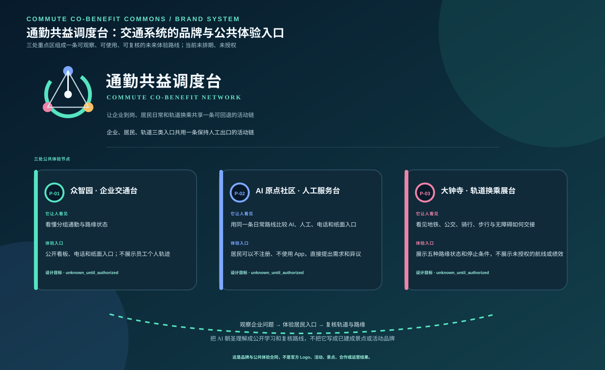

每个节点都保留公开看板、电话和纸面入口，不展示个人轨迹，不预设航线，不把模型读数做成展览结论。节点的责任、场地、活动和运营状态都登记为 `unknown_until_authorized` 或 `not_scheduled_not_authorized` [data:visual/assets/brand-system.json]。

### 六类参与者与三项产业测试

参与者包括园区企业交通专员、居民/照护者、轮椅和助行器使用者、轨道公交运营者、物流/维护人员、学校与社区服务人员、夜班员工以及交通/隐私/消防专业人员。AI 的作用是聚合需求、发现冲突、解释方案和生成回退清单；它没有权力把公共路线永久锁定。

1. **MOB-T01 企业需求合并测试。** 企业只提交分组时段和人数区间，系统比较班车、公共交通、骑行和步行组合；回读企业多方式出行比例、站口拥挤、路缘占用和居民投诉。没有同意和分组阈值时，状态为 `blocked`。
2. **MOB-T02 居民等价到达测试。** 对同一条上学、就医、买菜或夜班回家链，同时提供 AI 推荐、人工窗口、电话和纸面方案；按行动能力和照护负担分组回读完成率、等待和拒绝率 [source:BEIJING-ACCESSIBILITY-REGULATION]。
3. **MOB-T03 路缘与断网回退测试。** 在工作日高峰、活动日、雨雪和通信中断场景下，检验预约装卸清场、人工引导、轨道接驳和公共服务恢复。若没有人能接手，任何自动化接驳都不能扩容 [source:SAV-MICROTRANSIT]。

### 十张场景卡

`M-01` 企业合并班车；`M-02` 员工公共交通补贴；`M-03` 夜班保证回家；`M-04` 园区装卸预约；`M-05` 居民就医人工接驳；`M-06` 轮椅等价路线；`M-07` 轨道站最后 500 米；`M-08` 活动日人车分流；`M-09` 雨雪/断网服务降级；`M-10` 投诉、维修和复核流程。每张卡必须绑定空间、责任人、输入数据、最小化规则、服务水平和停止条件；场景数量是设计清单，不是已发生的运营量 [source:EMPLOYER-TDM-GUIDE] [standard:PROJECT-AGENT-OPEN-CALL-TASKBOOK]。

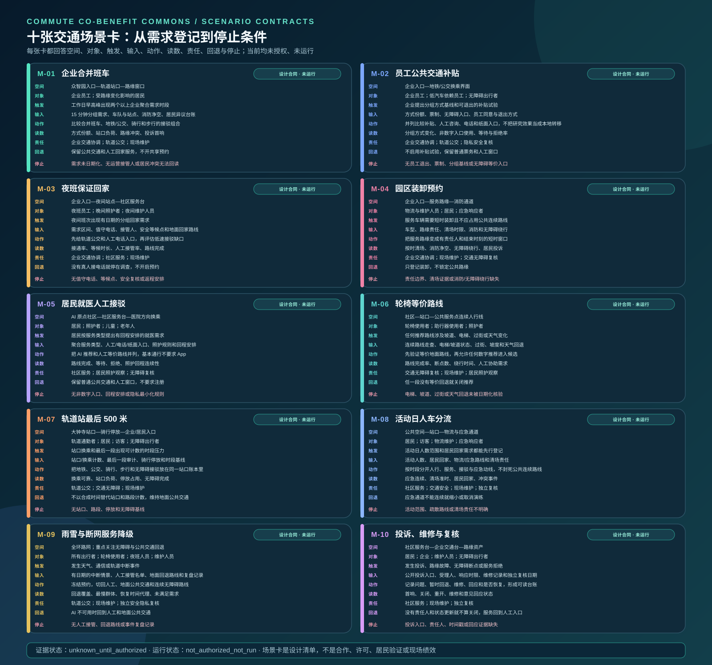

十张卡已经同步登记到 `visual/assets/scenario-cards.json`。它们现在各自写明空间、受影响对象、触发条件、输入证据、服务动作、读数、责任角色、人工回退和停止条件；共同状态仍是 `unknown_until_authorized` 与 `not_authorized_not_run`。这张图用于让读者先看懂“谁在什么地方遇到什么问题”，不能当作已经有合作方、许可、居民验证或现场绩效。

### 试点什么时候能开始。十张卡各自过一遍启动检查

试点不是写上日期就能开始。每个场景先过 P0 的共同门槛，再过自己的启动检查。责任角色、日期化证据和独立停机复核人必须同时出现；缺一项时，只登记需求，不预约、不扩容。当前十张卡都保持 `not_authorized_not_run`，没有虚构合作方、班次、预算或现场效果。

| 场景 | 开始前必须先核对 | 责任角色 | 缺一项时的动作 |
| --- | --- | --- | --- |
| M-01 企业合并班车 | 企业聚合需求、车队与站点、路缘和消防净空、居民冲突回应 | 企业交通协调、轨道公交、现场维护 | 只保留公共交通和人工回家，不开共享预约 |
| M-02 员工公共交通补贴 | 分组方式基线、补贴规则、票制与无障碍入口、员工退出方式 | 企业交通协调、轨道公交、隐私安全复核 | 不把论文效果写成本地转移，不进入试点 |
| M-03 夜班保证回家 | 夜班需求、值守电话、接管人、安全等候点和回家路线 | 企业交通协调、社区服务、现场维护 | 没有真人接电话就停在调查 |
| M-04 园区装卸预约 | 货运车型、路缘责任、清场时间、消防和无障碍绕行 | 企业交通协调、现场维护、交通无障碍复核 | 登记装卸，但不锁定公共路缘 |
| M-05 居民就医人工接驳 | 聚合服务类型、人工/电话/纸面入口、照护规则、回程安排 | 社区服务、居民照护观察、无障碍复核 | 保留普通公共交通和人工窗口，不要求注册 |
| M-06 轮椅等价路线 | 连续路线走查、坡道电梯状态、过街和天气回退 | 交通无障碍复核、现场维护、居民照护观察 | 任一段没有等价回退，就不开放推荐 |
| M-07 轨道站最后 500 米 | 站口和换乘计数、最后一段审计、骑行停放和时段基线 | 轨道公交、交通无障碍、现场维护 | 不用合成时间替代站口和路段计数 |
| M-08 活动日人车分流 | 活动人数范围、居民回家、物流和应急路线、清场责任 | 社区服务、交通安全、现场维护、独立复核 | 不能保持应急通道就缩小或取消演练 |
| M-09 雨雪与断网降级 | 有日期的中断情景、人工接管名单、地面回退路线、复盘记录 | 轨道公交、现场维护、独立安全隐私复核 | AI 不可用时回到人工和地面公共交通 |
| M-10 投诉维修与复核 | 投诉入口、受理人、响应时限、维修记录和独立复核日期 | 社区服务、现场维护、独立复核 | 没有责任人和状态更新就不算闭环 |

逐场景字段和证据路径写入 `visual/assets/pilot-startup-checklist.json`，由 `node visual/assets/run-pilot-startup-check.js` 离线核对十张卡的覆盖、责任、物理检查、人工回退和证据文件存在性。它回答的是“什么条件满足后才可以申请开始”，不是给当前方案发放许可；日期必须由有权组织填写，模型结果也不能代替居民参与、专业审查或法定程序 [data:visual/assets/pilot-startup-checklist.json]。

## 用地、建筑规模与拆改留方案

交通优化首先消化既有城市结构，不以“未来通勤”掩盖开发强度。当前 `buildings` 图层只表达概念建筑足迹，建筑足迹约占 provisional 工作范围的 2.72%，该比例不是法定建筑密度 [metric:building_footprint_area_sqm] [metric:building_footprint_ratio]。AI 企业、社区服务、商业服务和公园绿地按既有图层做关系表达，不提出新增容积率或建筑高度承诺。

保留、更新、拆除按这个顺序处理。先保留既有公共服务、轨道站口、消防通道、连续人行空间和成熟树荫，再可逆更新首层入口、候车、骑行停放、无障碍坡道、路缘信息牌和企业交通台。只有现场结构、权属、消防和交通评估共同证明必要时，才讨论小规模拆改。任何停车或装卸设施都要先核对道路停车管理责任、设备巡检、异常处置和投诉处理 [source:HAIDIAN-ROAD-PARKING-TENDER-2026] [depth:retain_renovate_demolish]。

## 交通、轨道、市政与公共服务设施

这是本方案的核心。现有概念网络包含一条南北关系线约 9.60 km、三条东西连接线，合计慢行关系线约 13.01 km。它们是网络设计长度，不是工程道路中心线，也不表示当前连续可走 [metric:design_north_south_spine_length_m] [metric:design_east_west_connector_count] [metric:design_slow_mobility_network_length_m]。正式交通深化必须对每条线逐段补齐断面、信号配时、站口、过街、坡度、盲道、照明、树荫、停车和装卸、消防、排水、管线、产权以及维护单位信息。

### 一张时段路缘账本

路缘单元采用 `open` 公共通行、`booked` 企业班车和接送、`service` 维护和装卸、`human-only` 无障碍与人工优先、`emergency` 应急五种状态。每次变更至少写入责任人、起止时间、服务对象、清场动作、替代路线和投诉入口。默认时间窗只是试验参数。早高峰、午间配送、放学或下班、夜间维护都要先做人工计数和居民参与，再决定分钟级分配。企业获得的是可审计的短时服务，不是永久路权；居民获得的是不被预约切断的连续公共路线。

### M-09 节点级路缘功能断面（无尺度）

为避免 M-09 只被读成一组 readiness 字段，本包用大钟寺 `PROV-KEY-003` 与 `ROAD-002` 作为一个**待核节点**，把候车、人工交接、可关闭服务窗口和应急退避排成一条功能序列。`visual/assets/m09-curb-spatial-prototype.json` 只表达功能带和状态转换，不声称现实站口、道路断面、尺寸、容量或已运行服务；正式站口位置和清障窗口须由专业走读与责任主体确认。[data:visual/assets/m09-curb-spatial-prototype.json] [data:geometry/key_areas.geojson#PROV-KEY-003] [depth:traffic_rail_slow_parking]

| 功能带 | 可见状态 | 进入前证据 | 失效时的空间动作 |
| --- | --- | --- | --- |
| 人行与无障碍连续带 | `open / human-only` | 分段走读、过街/坡度/照明/障碍记录、人工绕行 | 受阻即改道或人工指引，暂停 `booked/service` |
| 候车与人工交接带 | `booked / human-only` | 候车/站口观察、人工责任角色、公共交通替代路径 | 断网或错过衔接即转人工和轨道/公交 |
| 可关闭的路缘服务窗口 | `booked / service` | 路缘资产、服务对象分组、起止时间、清场、消防与无障碍条件 | 缺任一条件就不预约、不占用公共路缘 |
| 维护与应急退避带 | `service / emergency` | 维护责任、异常清场、天气/中断触发器、复盘入口 | 冻结预约，恢复开放/人工优先并回到 P0 |

这张图是供评审查看的服务中间层，说明谁在什么位置先获得通行权、谁能停止、何时清场。尺寸、容量、站口客流和现场服务结果继续保持 `unknown`。[data:visual/assets/mobility-pilot-readiness.json]

### 两侧需求台账与四项服务水平

企业侧按匿名分组提交人数区间、入口、班次、货运和充电需求；居民侧按服务类型提交时段、无障碍、照护和夜间需求。系统只输出聚合矩阵和冲突热区，原始记录应有目的限定、保留周期、删除责任和公开的算法说明 [source:CURBSPACE-MANAGEMENT-2021] [source:NIST-HUMAN-CENTERED-AI]。四项服务水平对应可测指标。到达连续看 `accessible_route_completion_ratio`，换乘可靠看 `first_last_mile_transfer_reliability`，路缘有序看 `curb_time_window_compliance_ratio` 与 `peak_curb_conflict_rate`，申诉处理看 `mobility_service_complaint_closure_hours`。当前全部是 `unknown` 或 `design_target`，不写成已达标。

### 人员动线与综合模拟。先守硬门，再比较整体效率

综合模拟把**人**放在网络中心。企业员工、居民、照护者、儿童、轮椅使用者、访客、物流和维护人员、夜班人员以及应急响应者分别建 OD 与时间窗；不上传个人连续轨迹，采用分组需求、匿名计数和可回读版本。对外通勤不被截断在 provisional 边界内，P0 必须记录跨边界起讫、进出方向、地铁、公交、自行车、汽车、步行和班车方式、停车换乘以及跨线衔接，形成 `external_commute_od_baseline` 与 `external_commute_generalized_cost_index` 的调查底稿。

仿真场景至少覆盖工作日早晚高峰、平峰、活动日、雨雪和高温、地铁或公交中断、道路或停车故障，以及未来空中实验的“仅地面接驳”和“天气取消”对照。地铁和公交输入班次、站口容量、候车与换乘缓冲；自行车输入停放、借还和人车冲突；汽车输入路口排队、停车、装卸、充电和应急净空；步行和轮椅输入断面、过街、坡度、照护停留和无障碍绕行。SUMO 可作为开放的多方式仿真工具，但本地信号、站点容量、自行车行为和人员动线必须用现场计数校准，不能直接把软件输出当成海淀绩效。正式校准还要参考公开的 activity/agent-based 多方式建模方法，同时回读方式份额、道路和路缘流量、门到门时间、距离以及分组可达性 [source:SUMO-MULTIMODAL-DOCS] [source:MULTIMODAL-TRAFFIC-REALITY-2025] [source:ATOM-MULTIMODAL-ABM]。

无障碍模型参考用于定义分组校准边界，不提供本地结果 [source:ACCESS-ACCESSIBILITY-ABM]。

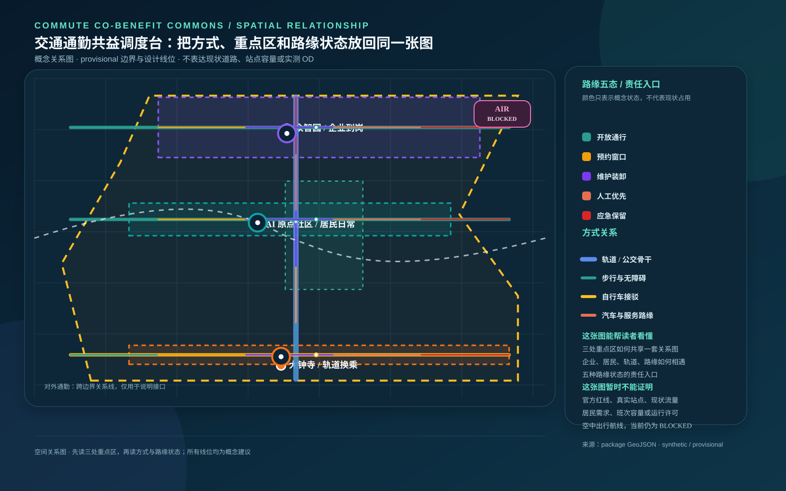

图先回答空间问题，再回答模型问题。三处重点区、四条概念连接线、对外通勤接口和五种路缘状态被放回同一张关系图；颜色只说明设计合同，不能当作现状占用。边界、道路和重点区仍是 provisional，图上没有真实站点容量或实测人流 [data:geometry/site_boundary.geojson#SITE-001] [data:geometry/key_areas.geojson#PROV-KEY-001] [data:geometry/roads.geojson#ROAD-001]。

优化采用“硬门优先、帕累托比较”。先判定消防和应急、无障碍连续、安全、公共交通不被挤占、隐私以及人工服务，再比较广义出行成本（步行、等待、车内、换乘、停车排队）、人员动线冲突、汽车行驶量与能耗，同时观察最慢群体差距、对外通勤可靠性和 `mode_transfer_reliability`。输出是一组可解释的候选方案和 `multimodal_system_efficiency_index`，不能把未经校准的结果写成“整体效率第一” [metric:person_flow_conflict_rate] [metric:multimodal_system_efficiency_index]。

### 轨道、停车与市政接口

轨道/公交是骨干，企业班车和按需小巴只能把人送到骨干换乘；停车与装卸是受时间窗管理的服务，不以扩充车位解决全部需求；市政接口要把雨雪、积水、照明、充电、信息牌、排水和维修纳入同一资产清单。西北旺交通规划材料对枢纽、首层、换乘停车、应急疏散和交通影响评价的要求，正好构成本方案进入工程阶段前的检查表 [source:BEIJING-HAIDIAN-TRANSIT-HUB-PDF]。

慢行系统工程和道路交通导改也应按正式项目流程另行论证 [source:HAIDIAN-SLOW-MOBILITY-TENDER-2022] [depth:traffic_rail_slow_parking] [depth:municipal_new_infrastructure]。

空中出行实验若有机会，只能作为地面系统的受控附加层。先证明地铁和公交接驳、步行与轮椅路径、消防疏散、噪声以及社区安静界面没有受到破坏，再审空域和运行许可。`air_ground_transfer_reliability`、吞吐、取消率、气象窗口、噪声、应急响应和保险责任目前均为 `unknown`。北京低空经济行动计划可作为设施协同的政策背景，民航无人驾驶航空器法规构成安全、运行和责任的前置门槛，二者都不等于本项目获得飞行或建设许可 [source:BEIJING-LOW-AIR-ECONOMY-2024] [source:CAAC-UAV-REGULATION-2024] [source:UAM-BEIJING-MULTIMODAL-2024]。

### 设计场景综合模拟（透明沙盘，现状数据尚未接入）

这部分按一条证据链阅读。先看区域规模覆盖，再看网络边和换乘节点，接着看运力缺口、相对资源压力和扰动稳健性。五张图都由同一份 `run-regional-commute-simulation.js` 聚合结果投影而来，读数不能互相相加，也不能理解为五组独立现场测量；入口、输出和替换条件集中登记在 `regional-scale-commute.json` 的 `evidence_chain` [data:visual/assets/regional-scale-commute.json#evidence_chain]。

在现场 OD、站点容量、信号、人员动线和路缘计数到位前，先用 `visual/assets/movement-simulation.json` 做 1000 人归一化设计单位的可解释对比，并可用 `node visual/assets/run-mobility-simulation.js` 离线复核方式份额、服务供给和队列。场景包括 S0 无协同高峰、S1 多方式与路缘协同、S2 受监管闸门阻断的空中候选、S3 极端天气地面回退。S1 只是建议硬门筛查后暂选的设计候选；广义成本、换乘可靠性、人员冲突、汽车外来流入、最差群体差距和能耗都是示范输入，海淀现状数据尚未接入。图件公开了先过硬门、再做帕累托比较、最后用现场数据替换的决策链 [metric:multimodal_system_efficiency_index] [metric:person_flow_conflict_rate] [standard:SUMO-MULTIMODAL-SIMULATION]。

模型对象也被显式拆开。1000 人设计单位包含居民 380、企业员工 450、照护者和儿童 60、访客 50、物流维护 40、夜班人员 20；网络侧把地铁列车（180 人/车、10 分钟间隔）、公交车辆（60 人/车、12 分钟间隔）、自行车停车、汽车路缘服务、步行和轮椅连续流以及受阻断的空中候选分别作为服务对象。五条 `trip_leg_templates` 把对外企业通勤、居民日常服务、企业班车换乘、物流装卸和空中候选的地面回退写成可检查的人员动线。模型以 60 秒步长记录位置、方式、队列、车辆占用、换乘、路缘状态、冲突和无障碍标志，再输出各方式峰值排队、站点和车辆负荷、换乘等待、汽车路缘排队以及最差群体差距；`model_analysis.derived_readouts` 里的数值是声明过输入后的合成敏感性分析，不能当作现场观测。评审可在离线环境运行 `node visual/assets/run-mobility-simulation.js`，重算方式份额、服务供给、队列和校准字段；该运行器不联网、不生成本地现状 [source:SUMO-MULTIMODAL-SIMULATION] [metric:mode_transfer_reliability]。

在这套归一化沙盘中，未协同高峰的汽车路缘峰值排队为 86 辆、站口闸机负荷为 1.05；多方式路缘协同候选为 0 辆和 0.88；极端天气地面回退为 47 辆和 0.96。它说明优先校准站口闸机、公交站容量、路缘服务和无障碍过街，而不是把“模型分数”直接当成建设结论。现场补齐有日期的跨边界 OD、班次、断面、停车、冲突和消防审查后，才允许替换设计输入并重新运行。

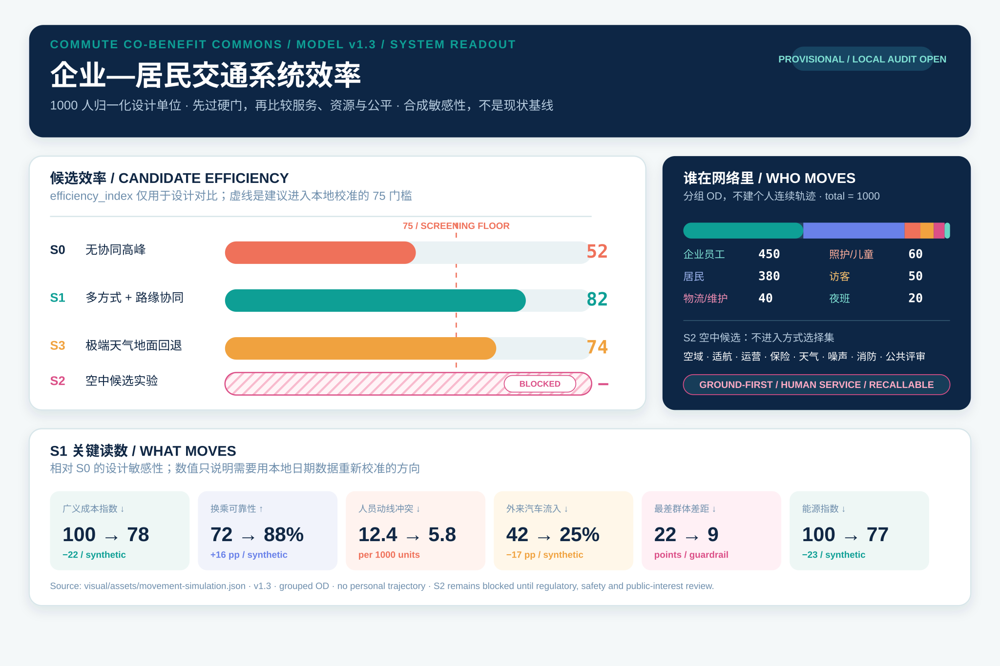
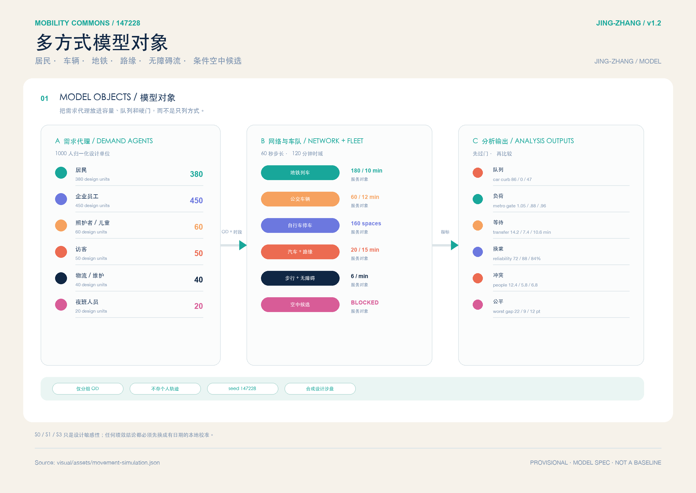

#### 区域人口规模综合模拟。把 312.2 万人的早高峰动线全部跑一遍

为回应“整体效率最高、满意度最高”的目标，新增 `visual/assets/regional-scale-commute.json` 与 `node visual/assets/run-regional-commute-simulation.js`。它以北京市官方资料披露的海淀区 2024 年末 312.2 万常住人口作为**规模覆盖参考**，让每一名合成代理走完一条早高峰动线。动线从居住区或边界出发，经过首公里、地铁或公交、骑行、步行无障碍、汽车或企业接驳，最后到达工作或服务目的地。这里的 3,122,000 是人口规模压力测试，不能当作工作人口、普查微观数据或本地 OD；企业员工、居民工作者、照护者和儿童、访客和服务、物流维护以及夜班人员的比例都是待校准的情景权重 [source:HAIDIAN-POPULATION-2024]。

runner 实际循环处理全部 3,122,000 个合成代理，并只保留分组、区域、方式、路线模板、时间直方图、乘客公里、服务单元账本和总量校验；不落个人地址、雇主、身份或连续轨迹。B0 是集中到达的压力场景，O1、O2、O3、O4 是公共交通、慢行、公平和容量平衡的四组候选，R1 是地铁中断后的地面回退屏查。runner 对 O1、O2、O3、O4 都做 AM 全量回放，先执行峰值方式负荷 ≤1.35× 的硬门，再按“综合出行压力代理分最大、广义成本、p90、冲突、外部汽车流入、车辆和服务公里”的字典序选择。当前合成输入下 O3 的纸面代理分最高，但自行车峰值负荷达 1.57×，因此被硬门排除，最终由 O4 容量平衡候选胜出。选中的 O4 随后再对全部 3,122,000 人做独立 PM 返程覆盖屏查，反向聚合工作或服务到居住路线；晚高峰 OD 仍待正式数据补齐。输出的“综合出行压力代理分”由时间、可靠性、可达性和冲突构成，居民调查结果仍待正式数据补齐。

在当前合成输入下，全量搜索选中的 O4 综合出行压力代理分为 54.67 → 66.44，广义成本代理为 60.34 → 49.44，p90 时间代理为 90 → 60 分钟，人流冲突代理为 5.74 → 3.13/千人，外部汽车流入为 26.95% → 8.47%，乘客公里代理为 34.86M → 28.40M，车辆/服务单元公里代理为 9.00M → 3.51M，峰值方式负荷由 1.57× 降至 1.21×。runner 的 `service_unit_ledger` 会逐方式列出地铁列次、公交发车、自行车槽位、连续无障碍服务槽位、汽车车辆等效和企业接驳车的所需单元、可用单元与负荷；这些是透明的合成服务屏查，实际车队、班次和运力仍待正式数据补齐。O1/O2/O3/O4 的候选排名、容量负荷和硬门结果都写入 runner 输出，避免把一个手选方案冒充“最优”；O3 的更高代理分只有在补足自行车容量后才可重新进入候选。上述读数只证明模型能在区域人口规模上守恒、回算和比较，海淀现状改善仍没有得到证明。居民调查结果仍待正式数据补齐，真正决策前还需补分时 OD、工作人口结构、站点/公交/路缘容量、分组方式份额、门到门 p50/p90、无障碍审计和车队/班次证据。

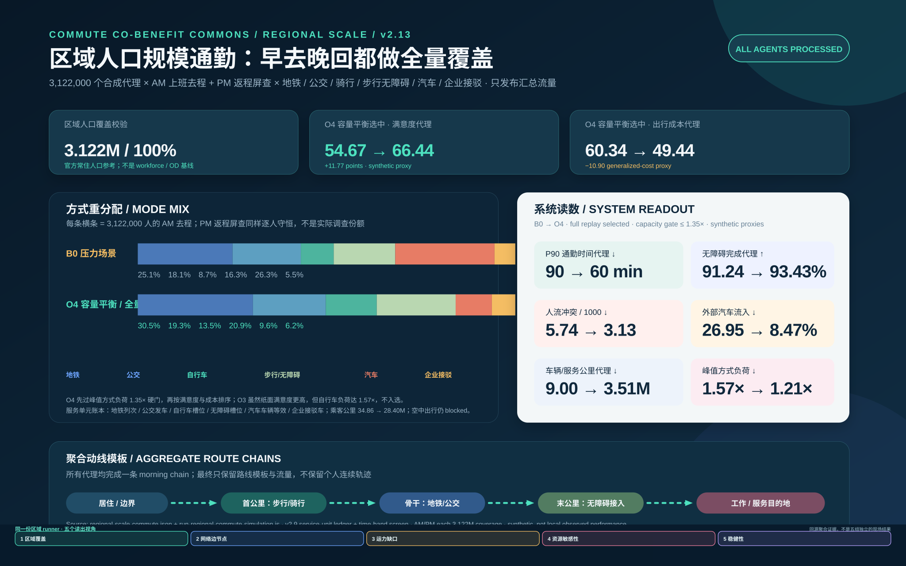

### 一周活动链。把工作日和周末放到同一张账

早晚高峰只能看见一段路。ABIT 的一周活动模型、MIT SimMobility 的多尺度多方式框架和 POLARIS 的综合代理交通研究提醒我们把活动发生、时间选择、方式转换、公共交通、步行和货运放进同一条可复核的链里 [source:ABIT-WEEKLY-ACTIVITY-2024] [source:SIMMOBILITY-MIT-OVERVIEW] [source:POLARIS-INTEGRATED-TRANSIT-2024]。

本轮新增 `visual/assets/weekly-activity-screen.json` 和 `node visual/assets/run-weekly-activity-screen.js --check`。runner 在 O4 容量平衡地面组合下逐日处理 3,122,000 个合成代理，连续回放 7 个合成日，共 21,854,000 个代理日；只发布日类型、群组、活动、方式和车辆公里代理的聚合计数。工作日活动链单元约 289.6 万，周六和周日约 143.6 万。照护者/儿童保留照护和上学活动，物流/维护保留服务车辆边界，夜班工作者保留夜间工作活动，周末方式调整只作为透明敏感性输入。

在当前声明输入下，一周活动链单元为 17,350,438，方式计数为地铁 5,203,936、公交 3,355,032、自行车 2,389,151、步行/无障碍 3,783,047、汽车 1,636,991、企业接驳 982,281；车辆公里代理为 19,179,099.88。它们是可复算的设计单元，不能替代一周活动日记、分组拦访问卷、跨边界 OD、班次容量和夜间服务记录。工作日/周末活动比例及方式调整均待有日期的海淀证据校准 [data:visual/assets/weekly-activity-readout.json]。

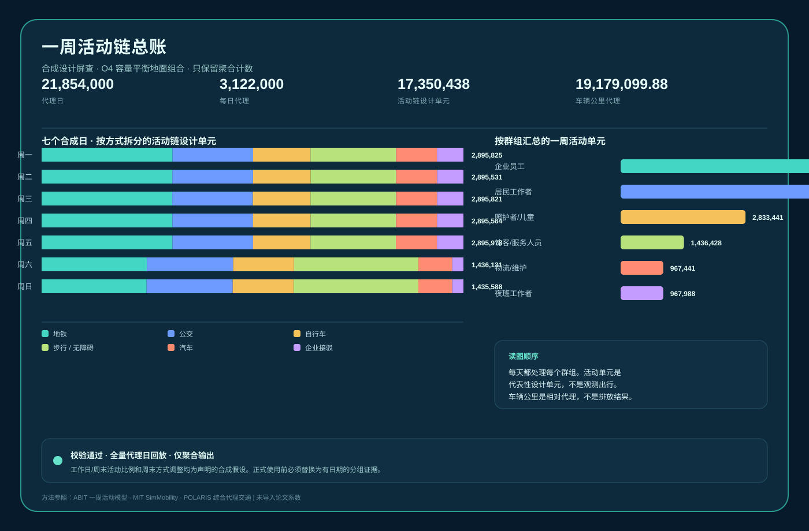

为了让群体代理分的差异不被总平均值遮住，新增群体、方式和运力证据板。O4 下居民工作者的综合出行压力代理分为 67.38，照护者和儿童为 67.24，夜班人员为 66.35，物流和维护为 57.21；无障碍完成代理按组保持在 92.87% 至 95.49% 的合成范围。右侧把地铁、公交、自行车、无障碍、汽车和企业接驳的服务单元负荷拆开，1.00× 是声明容量线，1.35× 是候选筛选闸门；O4 仍有 332,639 人次容量溢出代理，因此图板把“补班次/槽位、再谈扩展”列为下一步，容量压力保持可见。汽车方式份额从 B0 的 26.3% 降到 O4 的 9.6%，但物流和维护组仍有 75.8% 的汽车份额，居民通勤优化不能替代必要的服务车辆 [metric:resident_daily_trip_access_index] [metric:accessible_route_completion_ratio] [metric:peak_curb_conflict_rate]。

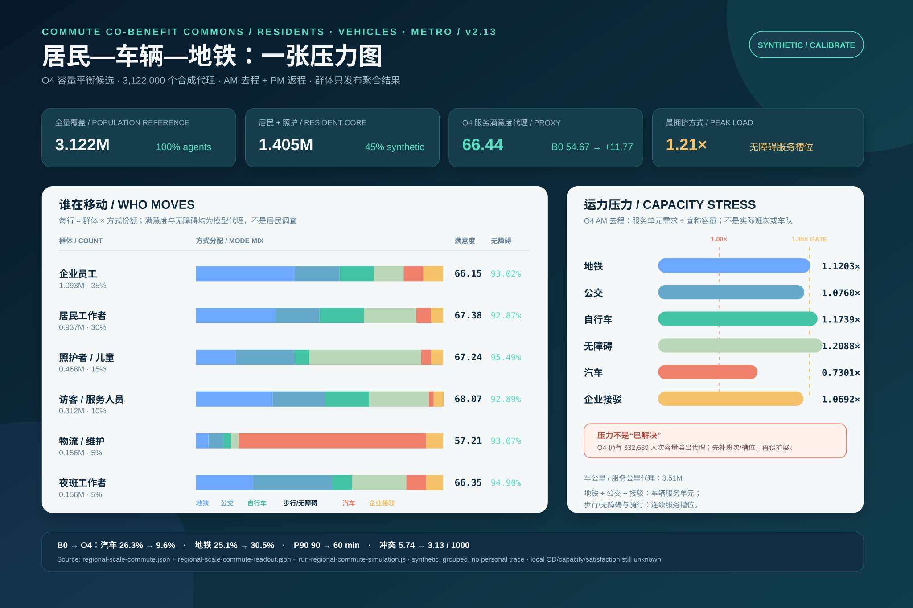

#### 相对资源压力。把人均公里、车辆服务和未知因素分开

为了不把“汽车减少”直接写成环境收益，本轮新增 `visual/assets/resource-pressure-screen.json`、`visual/assets/resource-pressure-readout.json` 和 `node visual/assets/run-resource-pressure-screen.js`。它把区域回放里的合成人均公里按方式拆开，再用外部方法参考中的相对 passenger-km 强度做敏感性账本。汽车归一为 1.00，轨道与公交保留参考强度，自行车和步行只按运行阶段屏查约定记为 0；企业接驳不套用汽车或公交系数，因燃料和电力、车队里程、载客率以及路线未知而保持 `UNKNOWN` [source:EEA-GHG-PASSENGER-MODES] [source:NCHRP-2024-59-ENERGY]。

当前合成读数下，O4 的已知方式相对资源指数为 20.07M，B0 为 28.82M，变化为 −30.4%；O4 已知方式人均公里为 26.58M，另有 1.82M 企业接驳人均公里未计入该指数。车辆/服务公里代理由 9.00M 降至 3.51M，但这仍不是 kWh、MJ、gCO₂e、车队或环境绩效。这个屏查不参与 O1/O2/O3/O4 排名，也不能越过容量、无障碍、安全、隐私和人工服务硬门；下一步必须用日期化电力/燃料、载客率、15 分钟客流和生命周期边界替换外部因子。

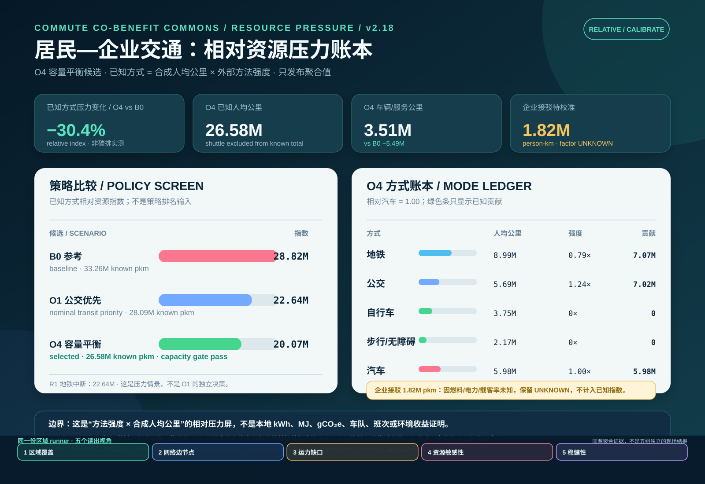

稳健性筛选把“名义得分高”和“扰动下能恢复”分开。新增 `robustness_screen`，对 O1/O2/O3/O4 每个候选在名义地面协同、地铁中断 30 分钟、强天气限制骑行和多方式容量冲击四类场景下各做一次全量回放，共 16 次 × 3,122,000 个合成代理，只留聚合读数。当前声明输入下，O2 的最坏综合出行压力代理分为 49.37、最坏峰值方式负荷 1.6986×，三个压力门均通过；O4 仍是名义效率第一，但稳健筛选第二；O3 在容量冲击中达到 2.0159×，停止扩容。决策规则保持清楚。O4 只作为声明输入下的名义筛选候选，O2 只作为压力情景下的稳健性参照；两者都不能替代现场数据，也不直接授权实施。这个结果只是对扰动敏感性的透明排序；在日期化中断、天气、容量、无障碍和行为数据补齐前，任何失败都应停在校准 [source:EXACT-SO-TRANSIT-2025] [source:UAM-MULTIMODAL-RESILIENCE-2025] [source:TRANSPORT-EQUITY-ABM-2025]。

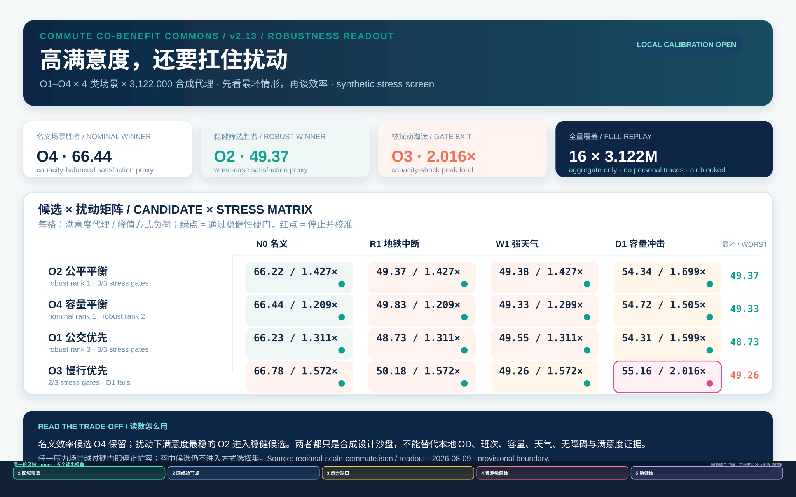

#### B1 企业到岗弹性。可解释的错峰敏感性

在不挪动居民、照护者和儿童、访客、物流维护以及夜班人员需求的前提下，B1 只对 450 个企业员工设计单元做 20% 的弹性到岗敏感性，把 90 个设计单元从高峰移入更宽的到岗窗口。离线 runner 的合成读数显示，总峰值排队由 174 降至 164，平均排队人分钟由 75.7999 降至 71.7917；汽车路缘峰值排队保持 60，未满足需求保持 89。地铁和公交负载下降只是声明输入下的压力变化，不能当作企业真实响应或海淀现状绩效。错峰方案还必须测量员工接受度、重排时间成本、公共交通班次匹配和分组方式份额，不能只看队列下降。正式使用前必须用有日期的企业分组 OD、方式份额、班次和站口计数替换输入 [source:MATRAM-ACTIVITY-ADAPTATION-2026] [metric:mode_transfer_reliability]。

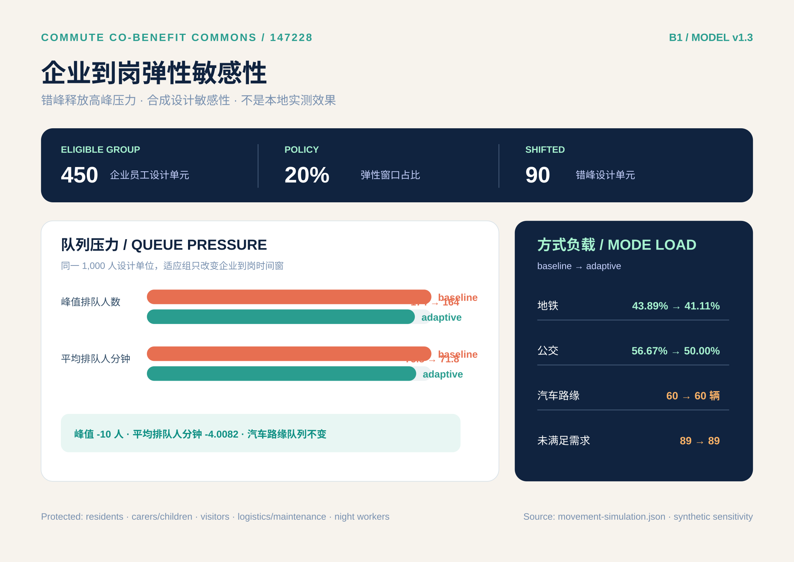

#### B2 方式与出发时刻选择。把对外通勤和人员动线放进同一张账

B1 只回答“企业到岗是否可以错峰”；B2 补上“人为什么选择某种方式和时刻”。每个分组候选同时计算门到门时间、到达时刻弹性、等待与换乘可靠性、站口拥挤、路缘/停车、费用/能耗和最慢群体差距，再按消防、无障碍、公共交通、隐私与人工服务五道硬门筛选。企业员工允许调整到岗窗口，居民、照护者、儿童、物流和夜班人员保留各自的活动链与人工回退；对外通勤以跨边界分组 OD 进入，绝不把个人轨迹作为优化变量 [source:JOINT-MODE-TIME-CROWDING-2020] [source:DTUE-PT-2025]。

这里不直接使用论文系数。行为契约要求先收集有日期的方式份额、分组出发时刻、班次和容量、站口和过街计数、路缘队列、门到门 p50/p90 以及无障碍走行，再估计本地参数。灵活工作时间可能改变通勤出发分布，但弹性、晚到成本和照护约束必须分组验证，不能用一个平均值替代居民差异 [source:FLEXTIME-DEPARTURE-CHOICE-2013] [source:MATRAM-ACTIVITY-ADAPTATION-2026]。

本轮把 B2 进一步落到一个独立的 `departure_time_choice_screen`。它仍对 3,122,000 个合成代理全量处理，但只允许企业员工进入提前 20 分钟的弹性窗口；居民、照护者和儿童、访客、物流维护以及夜班人员不被模型强行错峰。B0 的首选窗口占 95%，O4 屏查变为提前 6.99%、首选 88.01%、夜班 5%，其中 218,266 个合成企业代理被标记为可调整，重排成本代理为 4.365M 人分钟，受保护群体移位为 0。这些数字不代表员工行为、到达分布或班次绩效，也不参与 O4 的策略排名。它只把谁可以调整、谁不能被牺牲、重排成本如何记账写成可复核的运营合同，待员工接受度、班次和 15 分钟容量数据补齐后再校准 [source:JOINT-MODE-TIME-CROWDING-2020] [source:DTUE-PT-2025]。

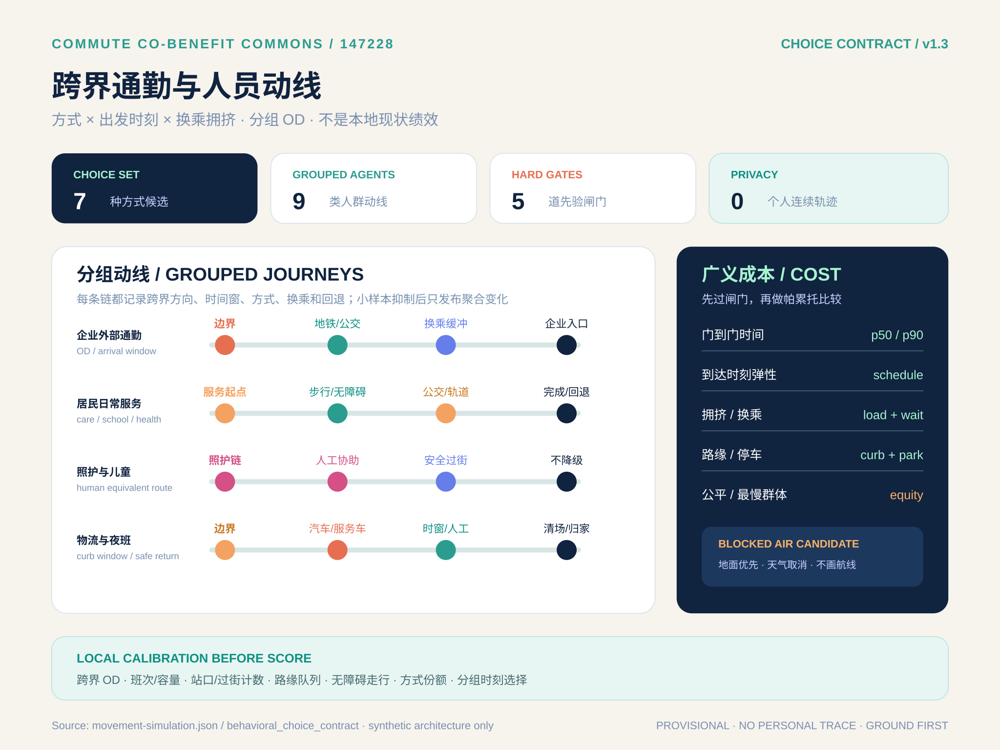

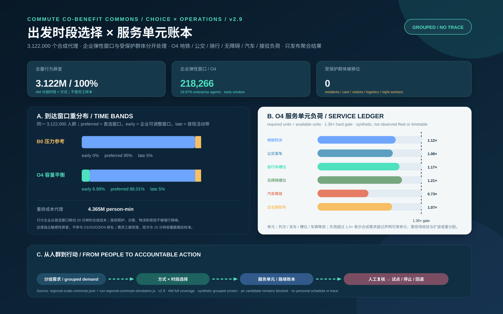

为避免把“方式级容量 ≤1.35×”误读成已经有可运行班次，这一轮又把同一份分组出发时段需求展开为三个 15 分钟服务切片，按 FIFO 与剩余容量逐切片结转队列，分别记地铁列次、公交发车、自行车槽位、连续无障碍路径槽位、汽车车辆等效和企业接驳车的可用服务单元、上车量、失败上车尝试、切片后残余队列和队列人分钟代理。当前 O4 的独立合成运营屏查处理 3,122,000 人，服务切片峰值负荷 3.2431×，窗口末残余队列 452,668 人、队列人分钟代理 16.241M，运营门为**未通过**。这里没有海淀实测数据，读数只用于告诉运营者当前候选不能直接上线。必须先补日期班次、站点、公交站和路缘容量、上车和拒载计数以及无障碍服务容量。该屏查不参与 O1、O2、O3、O4 排名，论文只提供 capacity-constrained schedule-based assignment 的方法边界，不提供本地系数 [source:SCHEDULED-CAPACITY-TRANSIT-2012] [source:DYNAMIC-PT-CAPACITY-2024]。

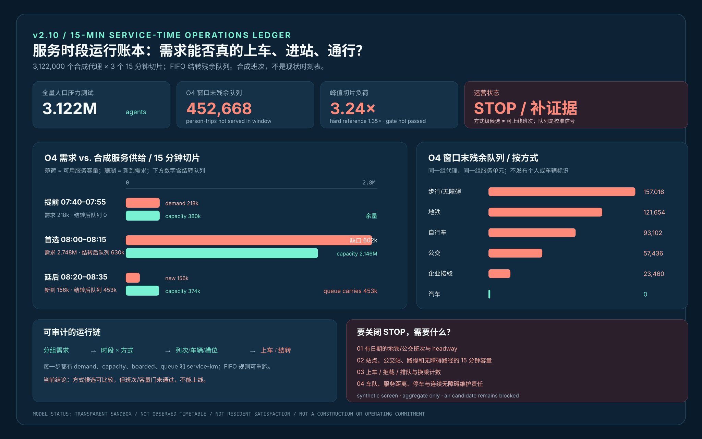

下一步把这张时段账本接到一个独立的**有限回退屏查**。当主方式出现残余队列时，只把有声明上限的一部分需求尝试送入同一切片仍有余量的备选方式，并按企业员工、居民工作者、访客和服务、夜班等分组记录来源方式、目标方式、时段和人分钟成本代理。O4 在合成输入下有 68,814.9 人次发生 `地铁 → 汽车` 的有限回退，其中企业员工 28,354、访客和服务 40,460.9；窗口末残余队列从前一张时段账的 452,668 降至 383,853.1，回退成本代理为 550,519.2 人分钟，但 3.2431× 峰值和残余队列仍使运营门**未通过**。步行和无障碍不作为回退来源，所有分组回退比例和目标方式余量都通过守恒检查。这里的读数不代表本地路线选择、乘客接受度或运营绩效，也不参与候选排名；正式使用前仍要补拒载转移、备选方式接受度、无障碍和照护约束、班次余量以及方式对时间可靠性的证据 [source:DYNAMIC-PT-CAPACITY-2024]。

#### 运力缺口闭合屏。先算补多少，再谈扩展

为了把“运营门未通过”继续转成可执行的校准问题，本轮新增 `visual/assets/capacity-closure-screen.json` 和 `node visual/assets/run-capacity-closure-screen.js`。它沿用 O4 的 3,122,000 个合成代理、三段 15 分钟 FIFO 服务切片和 1.35× 峰值负荷门槛，对地铁、公交、自行车、步行和无障碍、汽车以及企业接驳分别以 0.01× 步长扫描最小声明服务单元放大倍数。通过条件同时要求窗口末残余队列为 0、峰值负荷不超过 1.35×、全量代理守恒和空中候选继续阻断 [source:SCHEDULED-CAPACITY-TRANSIT-2012] [source:DYNAMIC-PT-CAPACITY-2024]。

在当前合成输入下，六种方式的最小放大倍数分别为地铁 1.17×、公交 1.12×、自行车 1.32×、步行/无障碍 1.34×、汽车 1.00×、企业接驳 1.16×；组合屏需要新增 301,925 个声明服务单元，最大方式峰值降至 1.2011×、残余队列为 0。这里的“服务单元”是模型内的合成列次/槽位/车辆等效，不是实际班次、车队、采购量、运营许可或居民绩效；这张图只回答“需要补哪些日期化证据和运力输入”，不自动推进 P1/P2。正式决策前必须用有日期的 OD、班次、容量、拒载、无障碍审计和责任运营者替换声明输入。

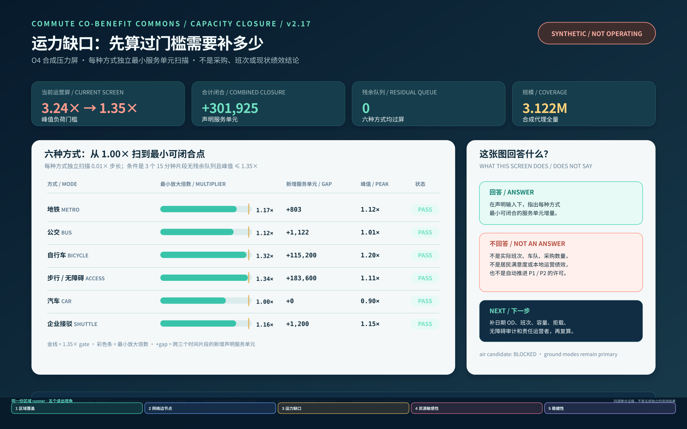

#### 网络级人员动线。把“谁经过哪里”变成可审计的边和节点

运力闭合回答“每种方式还要补多少服务单元”，还需要继续回答“人具体经过哪些骨干、换乘节点和服务关口”。网络级读出新增 `visual/assets/network-flow-screen.json`、`visual/assets/network-flow-readout.json` 和 `node visual/assets/run-network-flow-screen.js`。它复用区域 runner 的同一套分组区间、来源和目的地 hash、企业员工外部通勤判定、O4 方式权重和企业错峰规则，把每名合成代理的方式选择展开为显式路径，再归约为边、节点、时段、群体、OD 以及车辆和服务等效账本。图中的网络是声明过的分析图，不能当作现状道路、轨道线位、站点容量或实时交通分配；无个人轨迹、住址、雇主或车辆标识被保存 [source:MATSIM-LARGE-SCALE-ABM] [source:MATSIM-BOOK-ACTIVITY-BASED]。

在当前合成输入下，O4 仍处理 3,122,000/3,122,000 人，方式人次为地铁 952,295、公交 602,547、自行车 422,597、步行和无障碍 652,746、汽车 299,361、企业接驳 192,454；首选时段 2,747,634 人。声明的最大边压力为 1.264×，低于 1.35× 网络筛查门；最热的边是“跨区→地铁骨干”1.264×，其次为“目的台账→物流维护关口”1.076×；大钟寺换乘节点为 1.555M 人流入、0.866×。作为对照，B0 集中到达参考在“管理路缘→目的台账”达到 1.6539×，网络门未通过，汽车路缘因此成为需要单独检查的瓶颈。上述都是合成屏查读数，不是海淀道路、站点、班次或满意度的观测结果；任何边或节点超过 1.35× 都应停在校准，不能自动写成“可运行”。

车辆和服务等效单独记账。O4 为地铁列车等效 5,291、公交车等效 10,042、汽车车辆等效 176,095、企业接驳车等效 8,019；自行车与步行和无障碍保留零车辆等效，避免把慢行需求折算成汽车。下一步必须用日期化 15 分钟 OD、地铁和公交班次与站点容量、路段和路缘和交叉口计数、连续无障碍审计、企业班车车队以及责任运营者证据替换声明输入；这张屏查不改变 O4 的候选排名，也不推进 P1/P2 [source:SCHEDULED-CAPACITY-TRANSIT-2012] [source:DYNAMIC-PT-CAPACITY-2024]。

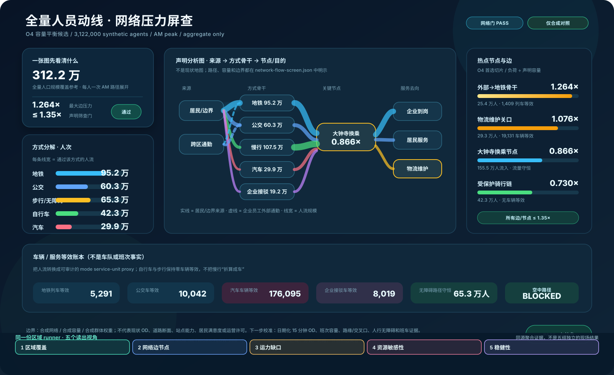

#### B3 中断、天气与最弱群体。效率必须能恢复

B2 解决“平时怎么选”，B3 继续问“地铁中断、恶劣天气或空中候选关闭时，谁还能到达、多久恢复”。运行器在 S1 地面优先候选上重算三种事件。事件包括无中断、地铁区段 30 分钟中断、强天气压低自行车并关闭空中候选。地铁中断把分组未满足需求按声明比例送入公交回退；强天气把自行车回退到公交，不把轮椅和照护路线交给不可达的个人轨迹。B3 输出受影响方式的回退覆盖率、队列人分钟、最弱群体差距代理分和恢复时间代理分，并把消防、无障碍、人工服务和空中运行闸门保留在前面 [source:UAM-MULTIMODAL-RESILIENCE-2025] [source:TRANSPORT-EQUITY-ABM-2025]。

在归一化设计单位中，地铁中断事件的地面回退覆盖率代理为 76.92%，强天气自行车回退覆盖率代理为 72.14%；最弱群体均为轮椅使用者，差距代理分分别为 12.1998 和 13.3571，恢复时间代理分别为 27.2997 和 30.0357 分钟。它们是透明合成压力测试，不是本地韧性或 p90 通勤事实，不能写成海淀事故处置。正式使用前必须用有日期的中断日志、天气取消记录、无障碍路线完成率和分组门到门 p90 替换。若回退覆盖率低于 70%、最弱群体差距代理超过 24 分或恢复代理超过 45 分钟，方案应停在重设计，不得用空中交通填补证据缺口 [source:MATRAM-ACTIVITY-ADAPTATION-2026] [source:UAM-TOD-VERTIPORT-2026]。

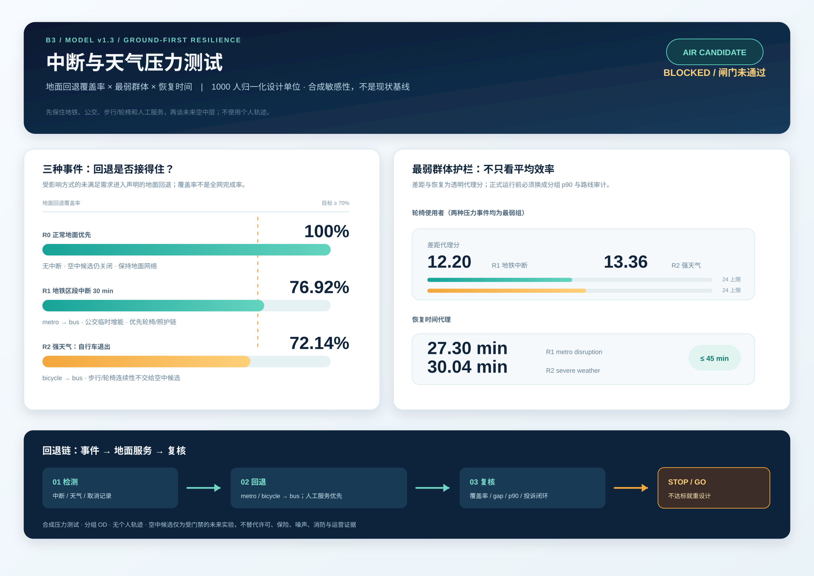

#### 恢复时间账本。把 TTR 从一行数字拆成七类人群

原有 B3 已经在 runner 内计算分组恢复时间，但如果只看总体结论，评审看不出谁在中断时最慢。本轮新增 `visual/assets/run-resilience-recovery-screen.js` 与 `visual/assets/resilience-recovery-readout.json`。它直接消费 `run-mobility-simulation.js` 的 B3 输出，按三种事件和七类人群重新排列，不改变需求权重、容量或回退比例。`R0` 例行运行的最慢恢复代理为企业员工 2.8419 分钟；`R1` 地铁区段中断 30 分钟的回退覆盖率为 76.92%，最慢群体为轮椅使用者、恢复代理 27.2997 分钟；`R2` 强天气下自行车转地面回退的覆盖率为 72.14%，轮椅使用者恢复代理为 30.0357 分钟。两类压力事件均在声明的 70% 回退覆盖和 45 分钟 TTR 闸门内，但这只说明合成屏查通过，不能写成海淀事故处置、无障碍审计、居民体验或本地 p90。

图板把 R1/R2 的轮椅使用者、照护者/儿童和夜班人员的差异直接放到同一矩阵；正式试点前必须用日期化中断日志、天气取消记录、分组门到门 p90 和连续无障碍路线完成率替换代理。任何一项超过闸门，都停在重设计；空中候选仍保持 `BLOCKED`，不用于填补地面证据缺口 [source:UAM-MULTIMODAL-RESILIENCE-2025] [source:TRANSPORT-EQUITY-ABM-2025]。

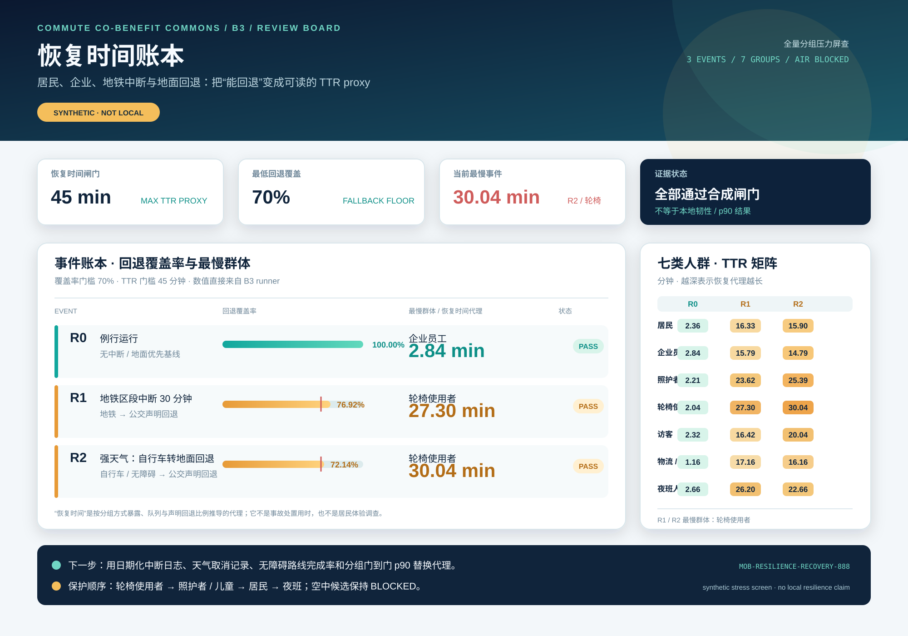

## 蓝绿空间、公共空间与城市风貌

蓝绿空间为连续到达链提供遮阴、停歇、雨天回退和夜间安全界面。当前绿地比例约 12.34%，公共空间比例约 7.33%，由概念图层计算，不能推出生态、热舒适或排水绩效 [metric:green_ratio] [metric:public_space_ratio]。更新时优先让公共服务台、站口、候车、慢行和蓝绿边界共享遮雨、座椅、照明、饮水和无障碍信息；不得用树池、花箱或活动设施堵住轮椅转弯和消防。

蓝绿策略设置三条硬边界。雨天不把积水路径当接驳路线，热浪时提供人工服务和可休息的替代路径，暗夜和生态敏感时段降低不必要的灯光与设备活动。北京步行骑行标准、无障碍法规和海淀慢行工程提供连续性、设施和维护的政策依据 [standard:BEIJING-WALK-CYCLE-DB11-1761] [standard:BEIJING-ACCESSIBILITY-REGULATION] [source:BEIJING-SLOW-MOBILITY]。没有现场遮阴、热舒适、水风险、生态和照明数据时，相关指标保持 `unknown`。

## 更新项目清单、实施政策与分期计划

| 阶段 | 工作包 | 交付与验收 | 停止条件 |
| --- | --- | --- | --- |
| P0 读懂路缘 | 现场盘点、站口/过街/无障碍审计、企业和居民聚合台账、责任人登记 | 形成路缘资产表、路线障碍清单、隐私/申诉规则和基线版本号 | 权属、路权或人工等价服务不清，停在调查 |
| P1 合并需求 | 两个企业时窗、一个社区日常链、一个轨道换乘链的可逆试点 | 公开聚合的等待、完成、冲突、清场、投诉与维修记录 | 任一人群完成率明显下降、消防/无障碍受阻或投诉未闭环，回到人工 |
| P2 条件扩展 | 仅在批准范围内扩展共享接驳/按需小巴，更新工程和采购任务书 | 交通影响评价、安全/隐私/无障碍/生态复核、运营 SLA 与资金责任齐全 | 缺一项就不扩容，不用模型分数替代实测 |

### 责任与验收合同（设计目标，当前不构成实施承诺）

每个阶段都由四类角色共同签字回读。交通与属地管理部门负责审批、路权和公共安全；企业交通专员与接驳运营者负责聚合需求、班次、装卸和成本；社区和居民代表、无障碍顾问与人工服务人员负责到达权、替代路线和申诉；维护、数据保护与独立复核人员负责资产状态、隐私、事件和证据留存。具体机构、合同关系和预算仍是 `unknown`，这里登记的是责任边界，不是合作事实。

每个阶段至少留存一份带日期的资产清单、需求版本、责任人、指标读数和停止决定。P0 的验收指标是 100% 重点资产有 ID、责任角色和人工替代入口；P1 按企业、居民和无障碍分组回读等待时长、路线完成率、路缘冲突率、投诉首响与关闭状态；P2 只有在交通影响评价、消防、无障碍、隐私、生态、保险、采购和维护证据齐全，且 `accessible_route_completion_ratio >= 0.95`、`curb_time_window_compliance_ratio >= 0.90`、投诉 24 小时内有状态更新时，才进入扩展评估。任一分组恶化、责任没有证据或硬门失败，责任人必须把服务切回公共交通、人工、电话和纸面入口，并记录复核日期；不得用综合模型分数替代实测或审批。

上述角色、字段、阶段阈值和人工回退已同步写入 `visual/assets/responsibility-acceptance-contract.json`；它只发布角色 × 阶段 × 分组 × 指标的聚合验收结构，不发布个人轨迹、企业身份或车辆标识。JSON 中的 `design_target` 是试点前置目标，不是当前达标结果。

实施与运营合同另以 `visual/assets/implementation-operation-contract.json` 登记 P0/P1/P2 的参与角色、验收指标、人工回退与停止或撤回条件。它是概念责任接口，机构、合同、资金、采购、许可和运营承诺都尚未确定；任一 `unknown` 基线、同意或责任边界缺失，或者硬门失败，都保持在调查或人工回退状态 [data:visual/assets/implementation-operation-contract.json] [depth:phasing_implementation]。

为把“人工回退”写成可复核的最小动作，本轮把既有 M-09 雨雪和断网服务降级卡做成离线桌面演练，没有新增已运行场景。`visual/assets/mobility-tabletop-contract.json` 固定 4 条合成服务请求、4 个触发事件、6 项验收检查和 5 个可逆回滚步骤；`node visual/assets/run-mobility-tabletop.js --check` 只读回包内 fixture，不联网、不接触个人数据、不调用外部系统，也不产生持久化状态，并输出 `mobility-tabletop-evidence.json` 同构的聚合回读。当前演练为 4/4 请求保留人工或公共交通入口、预约冻结、6/6 检查通过、5/5 回滚步骤复演；`performance_results=null`、`operational_status=not_authorized_not_run`。PASS 只证明状态、停止和回滚逻辑可检查，不推进 P1/P2，也不证明真实值守、无障碍绩效、公众接受、服务可用性或安全 [data:visual/assets/mobility-tabletop-contract.json] [data:visual/assets/mobility-tabletop-evidence.json] [data:visual/assets/run-mobility-tabletop.js]。

公开意见里反复出现的一个问题是“谁确认了基线，什么时候才算能开始”。因此本轮没有再增加一组泛化指标，而是把 M-09 的四条合成请求各自收成一张准备度卡。每张卡都要在授权前登记观察对象、样本和时间窗，冻结成功与停止条件，写明运营责任和独立停机复核人，保留人工等价服务、保留/删除规则、申诉入口和复核周期。当前四张卡的本地基线、观察值、授权组织和删除凭证均保持 `unknown` 或 `not_available_before_authorization`；三条故意缺字段的负样本会被拒绝。`run-mobility-pilot-readiness.js --check` 的 PASS 只证明字段链闭合，不证明任何现场准备度或 P1 资格 [data:visual/assets/mobility-pilot-readiness.json] [data:visual/assets/mobility-pilot-readiness-evidence.json] [data:visual/assets/run-mobility-pilot-readiness.js]。

本轮把三处容易被过度解读的地方单独写进卡片。样本字段列出排除的群体、路段、时段和未经同意的个体轨迹，并要求记录排除类别，未进入样本不能被当成没有需求。删除部分增加了声明式凭证的字段约定，包括范围、时间、执行角色、独立核验角色和回读位置；当前仍没有真实删除凭证，字段链通过也不证明删除已经发生。申诉部分增加受理编号、收到时间、回应责任、状态、下一次复核时间和回读位置，回应时限要在授权前冻结，当前仍保持未知。

| 请求 | 先登记什么 | 成功与停止怎么写 | 普通人如何申诉 |
| --- | --- | --- | --- |
| 居民日常照护 `M09-R01` | 分组服务类型、时间窗、照护与无障碍类别 | 保留人工/电话/纸面/公共交通入口；回退不可用或不能退出就停 | 社区服务台、电话或纸面入口 |
| 轮椅无障碍路线 `M09-R02` | 路段、交接点、天气状态和有日期的走查 | 连续路线和人工协助可回放；路线中断或把无日期走查写成结果就停 | 人工路线台、电话或纸面入口 |
| 企业班车时窗 `M09-R03` | 聚合需求、车型、路缘资产和装卸时窗 | 责任人、消防净空和无障碍路线齐全才可讨论窗口；缺一项不预约 | 现场人工、电话或纸面入口 |
| 轨道站最后一程 `M09-R04` | 站口、到达时段、方式和无障碍需求分组 | 人工引导和公共交通始终可走；责任不明或无日期观察就停 | 站内人工、电话或纸面入口 |

这四张卡与十张启动清单、M-09 桌面演练和 P0/P1/P2 责任合同互相回接。它们把“以后补基线”改成了可拒绝旁路的字段要求，同时不把某一包的命名升级为全仓硬门槛；如果维护者后续形成 canonical、版本化的 pilot-readiness 合同，本包会按字段对照和存量影响迁移。

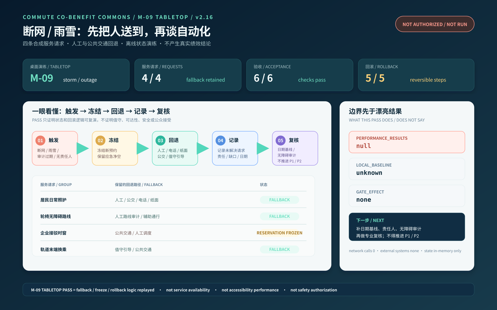

实施政策采用“登记、试验、复核、扩展或停止”的循环。停车招标对巡查、设备和接诉即办的要求被转译为每个交通资产必须有 ID、状态、责任人、响应时间和关闭证据 [source:HAIDIAN-ROAD-PARKING-TENDER-2026] [depth:renewal_project_list] [depth:phasing_implementation]。企业签署的是可撤回的服务协议，居民保有公共路线和人工服务；任何 AI 建议都可由现场人员否决。

## 指标体系、面积复算与合规矩阵

### 当前可回读的底盘

当前可从 GeoJSON 回读两类量。第一类是 provisional 工作范围面积 [metric:site_area_sqm]，第二类是三处重点区 [metric:key_area_count]。

建筑足迹及其比例 [metric:building_footprint_area_sqm] [metric:building_footprint_ratio] 属于可回读的概念底盘。

绿地与公共空间比例 [metric:green_ratio] [metric:public_space_ratio] 也可回读，但不等于现场生态或公共服务绩效。

设计关系线长度 [metric:design_north_south_spine_length_m] 只用于方案内比较；正式边界和专业资料到位后必须全量重算。

### 必须补齐的交通指标

企业通勤需求基线、对外通勤 OD、居民日常出行可达指数、企业多方式出行比例、分时停车占用、路缘时窗遵守率、首末端换乘可靠性、无障碍路线完成率、峰值路缘/人员动线冲突率、投诉闭环小时数、工作场所充电供需缺口、综合系统效率、方式换乘可靠性和空地接驳可靠性均为 `unknown`。

试点可以设置 `design_target`。无障碍路线完成率至少 0.95，首末端换乘可靠性至少 0.85 [metric:accessible_route_completion_ratio] [metric:first_last_mile_transfer_reliability]。

路缘时窗遵守率至少 0.90，投诉首响不超过 4 小时且 24 小时内给出责任/处理状态 [metric:curb_time_window_compliance_ratio] [metric:mobility_service_complaint_closure_hours]；这些目标是验收门槛，不是海淀现状或保证结果。

### 五道验证门与矩阵

1. **几何门。** 官方边界、站口、道路、红线和权属可回读。
2. **需求门。** 企业和居民聚合需求有同意、分组和时间版本。
3. **安全门。** 交通、消防、无障碍、应急和极端天气测试通过。
4. **责任门。** 运营方、维护方、采购、保险、数据和投诉 SLA 明确。
5. **公平门。** AI 推荐与人工、电话和纸面方案的分组结果不把最慢的人排除。

“整体效率最高”只有在五道门都通过后才有意义。方案需要先公开每种方式的输入、换乘链、人员动线瓶颈、对外通勤 OD、汽车外来流入和最差群体差距，再比较候选方案的广义成本与资源消耗。硬门发生冲突时，方案停止或回退，单一分数不能掩盖安全和公平损失 [standard:SUMO-MULTIMODAL-SIMULATION] [standard:LOW-AIR-REGULATORY-GATE] [depth:metrics_recalculation]。

`compliance_matrix.json` 覆盖公告与任务书的全部要求；`standard_matrix.json` 对应规划、步行骑行、无障碍、停车/资产运营、隐私和接驳研究；`design_depth_matrix.json` 将三层空间、三处重点区、交通/市政、更新分期、指标和风险绑定到正文、GeoJSON、图纸和自检 [standard:PROJECT-OFFICIAL-ANNOUNCEMENT] [standard:PROJECT-AGENT-OPEN-CALL-TASKBOOK]。

指标结构的离线复核见 [data:visual/assets/metrics-schema-audit.json] [data:visual/assets/run-metrics-schema-audit.js]。

正式边界不清、交通基线不全或路权冲突时，提交保持 provisional，不把未知值填成模型预测 [depth:metrics_recalculation] [depth:risk_missing_data]。

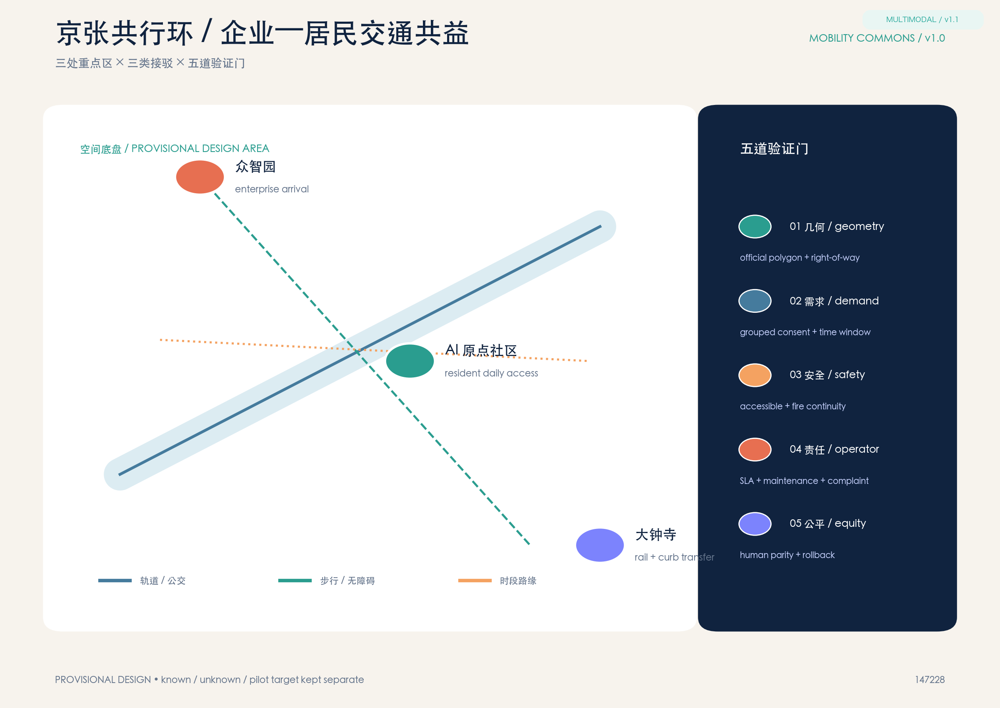
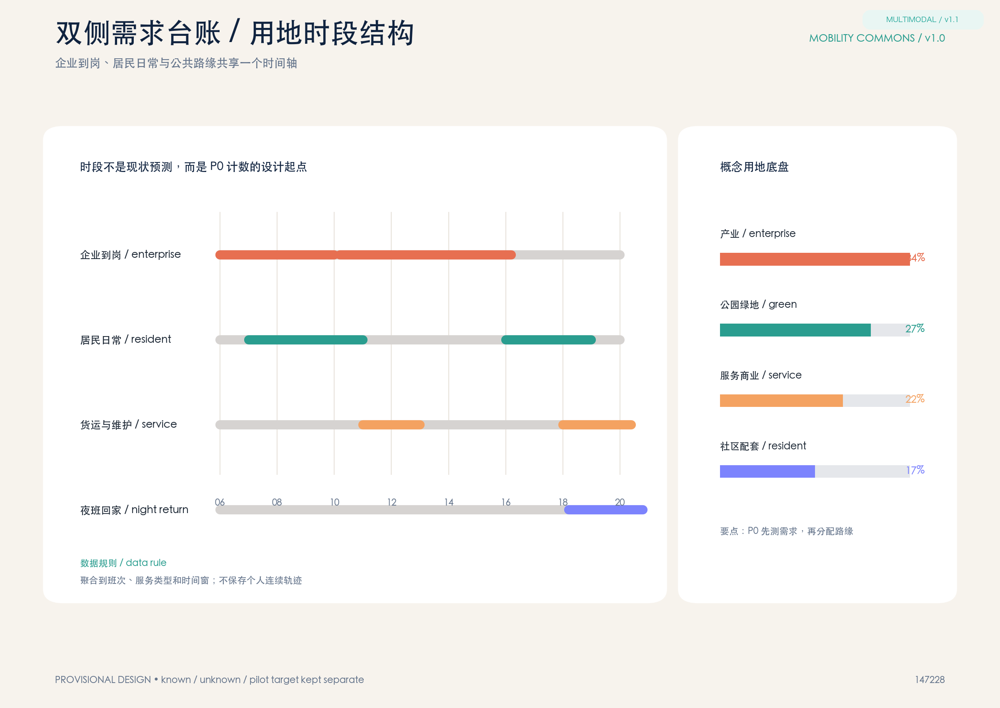

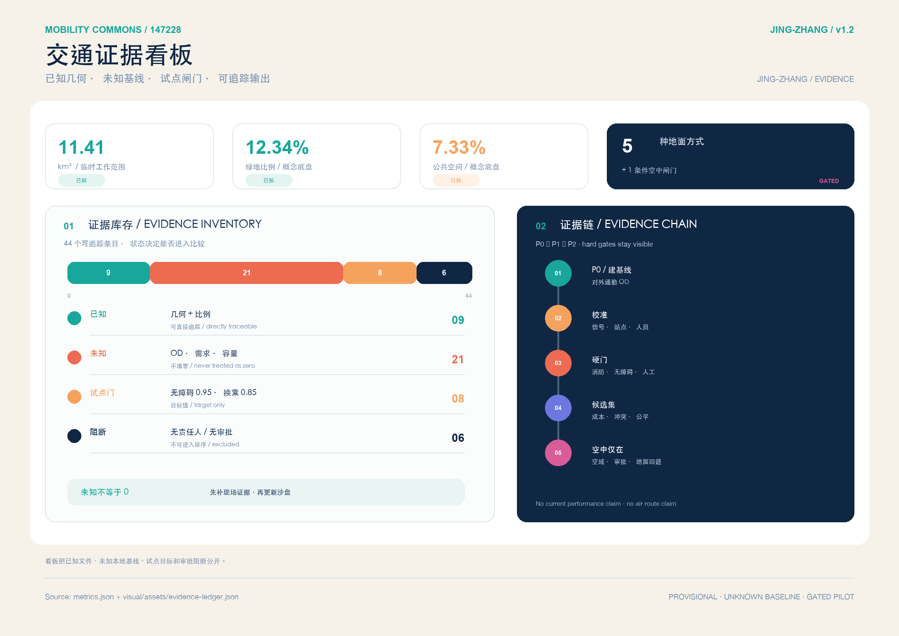

## 风险、版权与合规说明

本包不替代道路红线、交通影响评价、停车管理合同、消防审查、无障碍专项、施工图、运营许可、数据合规、保险或采购文件。当前最需要防范的风险包括企业需求挤占居民公共路线、按需车辆反而增加交通量、路缘状态无人维护、投诉没有责任人以及低数字能力人群被排除。每个风险都有回退路径。人工服务、公共交通、纸面和电话入口、可移动设施撤场、停止预约、公开事件摘要以及下一次复核日期都写进回退安排 [source:SHARED-MOBILITY-OECD] [source:CURBSPACE-MANAGEMENT-2021] [depth:risk_missing_data]。

来源使用边界清楚区分。北京政府和招标文件用于政策与责任框架，论文用于方法与风险启发，OSM 和现有 provisional GeoJSON 仅用于背景筛查与设计关系。论文没有提供京张基线，停车招标的数量也不等于本方案范围内车位数量。任何企业名称、合作关系、车辆、站点容量、事故率、满意度和健康效果都不在本包中作事实主张。

## 参考资料

- `BEIJING-14TH-TRANSPORT-PLAN` 北京市“十四五”时期交通发展建设规划。
- `HAIDIAN-ROAD-PARKING-TENDER-2026` 2026至2027 年海淀区道路停车管理服务项目招标公告。
- `BEIJING-HAIDIAN-TRANSIT-HUB-PDF` 海淀西北旺镇控规交通枢纽与慢行接口材料。
- `HAIDIAN-SLOW-MOBILITY-TENDER-2022` 海淀区 2022 慢行系统完善工程公开采购材料。
- `EMPLOYER-TDM-LONGITUDINAL` Employer-based travel demand management longitudinal analysis。
- `EMPLOYER-TDM-GUIDE` Employer transportation demand management plan guide。
- `CURBSPACE-MANAGEMENT-2021` Public/private curbspace management challenges and opportunities。
- `SAV-TRANSIT-COMPETITION` Shared autonomous vehicles and public transit competition。
- `SAV-MICROTRANSIT` Shared autonomous vehicles in microtransit systems。
- `SHARED-MOBILITY-OECD` OECD shared-mobility transition policy report。
- `BEIJING-LOW-AIR-ECONOMY-2024` 北京低空经济行动计划，作为设施协同背景而非项目许可。
- `CAAC-UAV-REGULATION-2024` 民航无人驾驶航空器飞行管理法规，作为飞行安全与运行责任前置门槛。
- `SUMO-MULTIMODAL-DOCS` SUMO 官方多方式、行人、自行车和权限仿真文档。
- `MULTIMODAL-TRAFFIC-REALITY-2025` 多方式交通物理/虚拟仿真研究，方法参考而非本地校准结果。
- `UAM-BEIJING-MULTIMODAL-2024` 北京城市空中交通与地面方式衔接研究，方法参考而非本地部署许可。
- `UAM-PUBLIC-TRANSIT-2023` 空中交通与公共交通/步行接驳研究，方法参考而非本地需求证明。
- `JOINT-MODE-TIME-CROWDING-2020` 联合估计方式与出发时刻选择，纳入到达弹性、可靠性与公共交通拥挤；方法参考而非本地参数。
- `DTUE-PT-2025` 带硬容量约束的公共交通出发时刻选择均衡；方法参考而非本地运力结论。
- `FLEXTIME-DEPARTURE-CHOICE-2013` 灵活工作时间与通勤出发时刻关系；不转移其地区效应量。
- `UAM-TOD-VERTIPORT-2026` 以公共交通站点为基础的条件性空地衔接方法；不构成本地起降场或许可。
- `MATSIM-LARGE-SCALE-ABM` MATSim 官方大规模代理人、多方式交通仿真框架；只借鉴方法，不导入海淀结果。
- `MATSIM-BOOK-ACTIVITY-BASED` MATSim 方法书关于活动链、网络交互和迭代式交通仿真的说明；用于明确容量回放和校准边界。
- `ACTIVITY-BASED-DISAGGREGATE-2001` 活动模式、出行链、时段、目的地和方式选择模型；不转移其参数。
- `ACCEQ-DRT-2023` 面向可达性公平的需求响应式接驳配置方法；只作为未来边缘接驳候选的研究参考。
- `SCHEDULED-CAPACITY-TRANSIT-2012` 带显式车辆容量、出发时刻/站点/班次选择和剩余容量排队的时刻表交通分配方法；只用于定义服务时段账本的边界。
- `DYNAMIC-PT-CAPACITY-2024` 带拥挤、拒载、停站延误和乘客适应的容量可行公共交通动态分配方法；不转移参数或本地结果。
- `SIMMOBILITY-MULTISCALE-2017` 多尺度活动、代理和多方式交通仿真框架；只用于区分全量压力回放与本地校准输入。

**最终边界声明。** 这是一个以企业与居民共益交通为核心的可审计概念与试验框架。它当前不主张政府批准规划、道路开放公告、停车许可、企业合作协议、交通容量证明、健康效果证明或建设承诺。第一名项目保持不变，本包只表达新的交通数据和运营方案 [source:SOURCE-REGISTRY] [source:OSM-TRANSPORT-CONTEXT]。
