# Jing-Zhang Mobility Commons: An Enterprise–Resident Mobility Operating System

> **Core proposition:** the next move for the Jing-Zhang corridor is not another speculative road. It is a public mobility operating system that lets enterprises manage arrival, shuttle, freight and charging demand while residents retain continuous walking, accessible and human-service routes.

This is a new independent submission package. It does not modify the existing first-place project. The proposal uses one time-windowed curb ledger, two aggregated demand registers, three connection types, four service levels and five verification gates. Enterprise data is submitted as grouped time windows, not personal traces. Resident needs cover school, care, health, daily shopping, night return and accessibility. Metro and bus remain the structural backbone; bicycle and walking/accessibility provide the first/last mile; cars are managed for necessary trips, parking, loading, charging and emergency access; shared shuttles and AI recommendations are reversible feeder services. External commuting is kept in the OD boundary, and future air mobility is only a conditional experiment. All geometry remains provisional until official boundaries, right-of-way, traffic counts, ownership and field audits are available.

## One-Page Executive Brief: Accept One Door-to-Door Chain Before Expanding Shared Feeders

An ordinary person is not a flow point in a model. At each step—leaving, transferring, encountering disruption, asking for help and returning home—they need an understandable choice. The first reversible pilot accepts one minimum chain: **choose a public/accessibility or human route → request one mobility service → trigger human or rail/bus takeover when a transfer is missed, the network is offline, weather turns bad or a curb conflict occurs → freeze the booking and exit when the state is unsafe or unreachable → let an independent reviewer replay the evidence and decide whether to repair, expand or withdraw**. This is not an operational claim. The current M-09 is only a local, offline, no-personal-data tabletop replay of four synthetic requests; `performance_results=null` and `operational_status=not_authorized_not_run`.

| Step | Space/service visible to an ordinary person | Evidence retained | Fail-closed action |
| --- | --- | --- | --- |
| 1. Choose | Station wayfinding, continuous walking/wheelchair route, human/phone/paper entry and shared-feeder candidate shown together | Choice, service window, accessibility-need category and version; no continuous personal trace | Keep an equivalent human route when digital access fails; do not open without one |
| 2. Request | Rail/bus transfer, shuttle/minibus candidate, curb loading or community service desk | Request ID, grouped service type, start/end window, responsible role and alternative route | Register only, without booking, when ownership, responsibility, capacity or consent boundaries are unknown |
| 3. Take over | After a missed transfer, outage, rain/snow, accessibility obstruction or curb conflict, a person points to rail/bus or a human route | Trigger, takeover person, handoff time, clearing action and complaint entry | Freeze automated booking and prefer human/public transport; stop if nobody can take over |
| 4. Exit | Signage, human desk and paper/phone complaint route allow rerouting, getting home or cancelling | Cancellation reason, alternative route, unresolved item and `not_authorized_not_run` state | Do not expand or report success when fire, accessibility, privacy or safety gates fail |
| 5. Replay | An independent reviewer replays one door-to-door chain and compares continue, repair or withdraw | Minimal log, grouped result, complaint-closure evidence, version and review decision | Return to P0 investigation and human service when evidence is missing or the slowest group worsens |

This table connects the design boards, curb ledger, M-09 fallback tabletop and P0/P1/P2 phasing to one acceptance entry point. PASS for four synthetic requests proves only that the state machine and rollback logic can be replayed; it does not prove real demand, accessibility performance, staffing, public acceptance or safety.

## Accessible-service state contract

The grouped simulation already keeps wheelchair users, carers, older residents and night-return users visible, but a route existing on a map does not establish that it is usable now. This increment adds a state contract for three reviewable routes using `UNKNOWN → AUDITED → READY`; an expired confirmation returns to `UNKNOWN`, while a critical obstacle, missing alternative or missing handoff moves the route to `CLOSED` and stops expansion.

The three routes are rail stop to enterprise entrance, a human-equivalent community daily-service route, and a public-transport fallback for night return. `READY` requires a dated route audit, accountable-owner confirmation, a usable accessible alternative and a human handoff entry. A repair record moves only to `RECHECK`; inspection and owner confirmation are required before `READY` can return. AI may organise state conflicts and replay evidence, but it cannot repair, release or publish a usable state for an accountable role. All three routes are currently `UNKNOWN`; field audits, operating authorizations and formal performance results are 0, and air mobility is excluded from the accessible-service denominator.

This is an offline structural replay. It does not establish elevator or ramp availability, field route continuity, staffing, night service or resident satisfaction [data:visual/assets/accessible-service-state-contract.json] [data:visual/assets/accessible-service-state-readout.json] [data:visual/assets/run-accessible-service-state-contract.js].

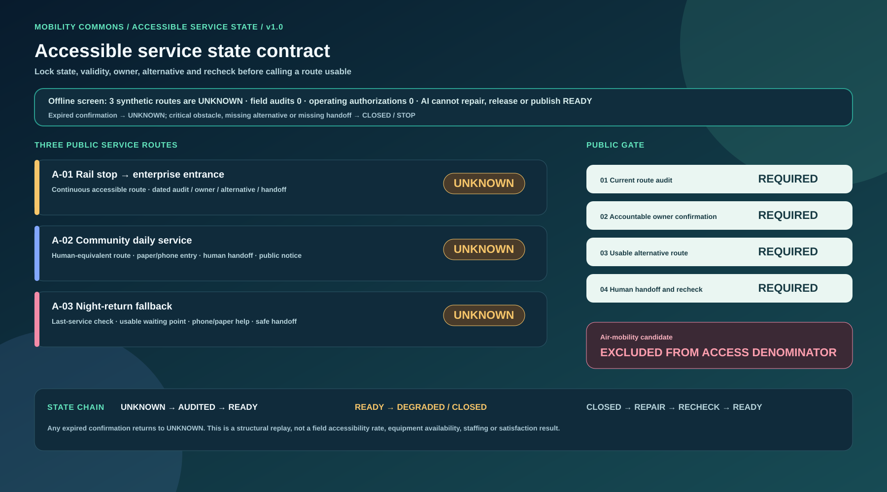

The board publishes states, gates and stop actions only. Field work must add segment-level route evidence, validity, owner, alternative, human handoff and recheck receipts before any `READY` state enters a public service directory.

## Mobility responsibility transfer screen

Mobility risk is not limited to an algorithm. A service can be proposed and still leave nobody willing to carry the space, equipment, maintenance, appeals and exit burden. The eight existing mobility interfaces now share one transfer screen covering the rail-stop interface, bus waiting, protected cycling, accessible route, managed curb, enterprise shuttle, logistics maintenance and the ground gate for a future air experiment.

Each interface declares the applicable classes among seven resource burdens, its originator, receiver, non-AI equivalent service, affected groups, failure denominator, stop evidence and recovery evidence. Failed and withdrawn requests remain in the denominator, so a success rate cannot erase refusal, incompletion or exit. When the receiving role has no dated acceptance, accountability stays with the originator, the proposed service is frozen, and the public route plus staffed or public-transport fallback remains available.

All eight interfaces currently have zero field receipts, zero accepted transfers and zero operating authorizations. The air candidate remains a ground-safety review object outside the transfer denominator. This is an offline protocol replay, not evidence of appointed roles, funded budgets, contracts, field service or resident outcomes [data:visual/assets/mobility-responsibility-transfer.json] [data:visual/assets/mobility-responsibility-transfer-readout.json] [data:visual/assets/run-mobility-responsibility-transfer.js].

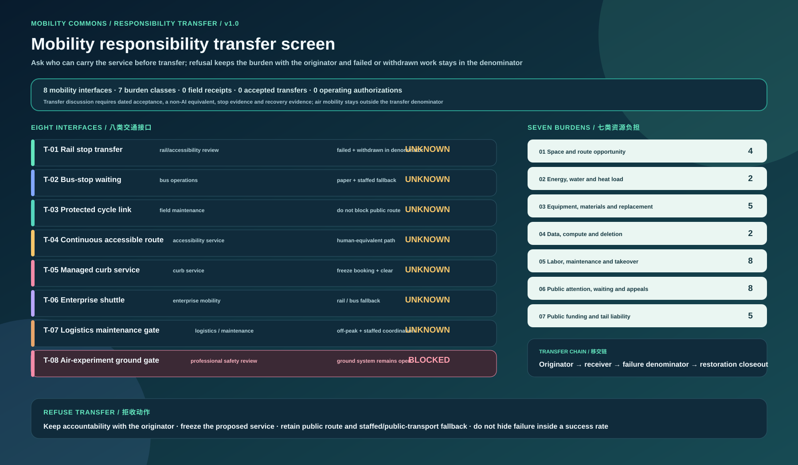

The board turns “who carries the burden” into inspectable fields and preserves the refusal action. It shares `UNKNOWN`, `not_authorized_not_run` and field-evidence boundaries with the resource passport, asset closeout and service-continuity screens; a protocol PASS is not an operating result.

## Mobility failure governance and appeal writeback

Having a receiver does not mean that a failure can be closed by saying “fixed.” This increment separates six transport failures: metro or bus interruption, accessible-route discontinuity, curb and cycle conflict, enterprise shuttle no-show, logistics and maintenance gate failure, and refusal at the ground gate for an air experiment. Each class names affected groups, an observer role, a fallback and a stop condition; an overall average cannot hide one group’s broken route.

The governance board uses five axes: service state, group impact, evidence confidence, human decision and release state. A first record may be `UNKNOWN`; every correction appends a new version and keeps `prior_record_id`. Affected groups may submit an aggregate appeal; an appeal pauses release rather than deleting the old record. Retirement keeps a reason, human decision and a successor service or ground fallback. The structure responds to the repository discussion about failure governance, multi-carrier writeback and reversible versions, while making the carriers specific to mobility interfaces.

There are currently no field incidents, real appeals, corrections, retired releases, field receipts or operating authorizations. The air candidate remains outside operational and incident denominators, and personal traces are not part of the record. The screen proves that fields, append-only rules and negative fixtures can be reviewed offline; it does not prove service delivery, completed resident appeals, incident response time or public satisfaction [data:visual/assets/mobility-failure-governance.json] [data:visual/assets/mobility-failure-governance-readout.json] [data:visual/assets/run-mobility-failure-governance.js].

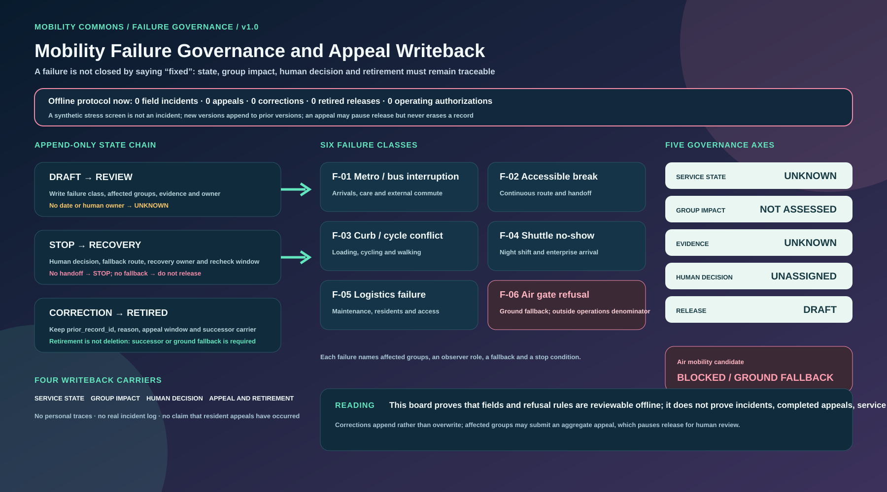

The `DRAFT → REVIEW → STOP → RECOVERY → RETIRED` chain is a record and release boundary, not a promise about real operations. Before a pilot, dated events, accountable roles, group-impact observation, human decisions, fallback service and public notice are required; missing evidence keeps the state at unknown or stopped.

## Mode competition guard for shared feeders

A shared feeder is not automatically a public-transport complement. A recent shared automated-vehicle study warns that, when operations are separated from transit, shared vehicles can pull trips away from public transport and increase vehicle travel [source:SAV-VKT-TRANSIT-COMPETITION-2024]. This package therefore adds four synthetic counterfactuals: a rail-bus-first reference, a capped feeder, unmanaged feeder expansion and a ground-first air candidate. Five groups remain visible: enterprise arrivals, residents and carers, accessible travellers, night-shift workers and external commuters.

This is a supplemental package screen, not a blocking gate in the core validator. The runner locks the scenario set to exactly `O0`, `O1`, `O2` and `O3`; duplicate, missing or unknown scenario IDs fail closed. It must be read alongside the formal `self_check` and trusted content review, and cannot by itself promote a submission, assign a score or update the public gallery.

The guard uses interpretable relative metrics: the transit ridership index must stay at or above 0.95, feeder share at or below 8%, vehicle-kilometre ratio at or below 1.10, and worst-group access delta at or above −0.03. O1 passes the synthetic guard but remains conditional review; O2 is closed for transit displacement, excess feeder share, increased vehicle-kilometres and worse worst-group access; O3 remains `BLOCKED` even with ground metrics inside the guard because no air operation is authorized, air agents are 0 and the ground public-transport fallback comes first [data:visual/assets/mode-competition-guard.json] [data:visual/assets/mode-competition-guard-readout.json] [data:visual/assets/run-mode-competition-guard.js].

The screen imports no paper coefficients and claims no Haidian ridership, vehicle-kilometre, satisfaction or service-performance result. The 3,122,000 figure is only the reference denominator for the existing synthetic population-scale replay; a formal decision still needs dated transit ridership, headways, capacity, feeder share, network length, grouped access and cross-boundary OD evidence.

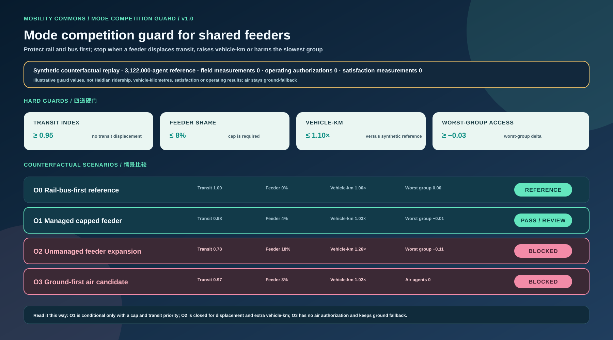

## Design Basis and Source List

The open-call requirements cover three spatial scales, three key areas, AI and mobility scenarios, an innovation ecosystem and reviewable drawings and data layers [source:OFFICIAL-ANNOUNCEMENT] [source:AGENT-TASKBOOK]. The package uses the public provisional site package but replaces the narrative, road attributes, metrics, evidence register and visual boards with an enterprise–resident mobility focus. Both the site and key-area polygons declare `official_boundary=false` and `geometry_role=provisional_constraint` [data:geometry/site_boundary.geojson#SITE-001] [data:geometry/key_areas.geojson#PROV-KEY-001].

The package keeps the site-package, boundary and key-area source declarations separate from the geometry itself [source:SITE-PACKAGE] [source:BOUNDARY-SOURCE] [source:KEY-AREA-SOURCE].

Beijing’s 14th Five-Year transport plan frames one-hour door-to-door trips, integrated rail/bus/walking/cycling, public-transport priority and smart transport as policy directions [source:BEIJING-14TH-TRANSPORT-PLAN]. A current Haidian road-parking service tender combines order management, guidance, patrol, equipment inspection, exception handling, backend operations and complaint response. It demonstrates that a curb is an operated asset, not merely a line on a map [source:HAIDIAN-ROAD-PARKING-TENDER-2026]. A Haidian transport planning document requires transit-hub conditions, ground-floor public interfaces, bicycle interchange, emergency routes and traffic-impact review [source:BEIJING-HAIDIAN-TRANSIT-HUB-PDF]. None of these sources is a local baseline for this provisional study area.

Evidence is separated into `known` geometry values, `unknown` local baselines, `design_target` pilot gates and `blocked` conditions. Employer travel-demand-management research supports transit benefits, multimodal subsidies, flexible hours and guaranteed rides home, but its effects are context-dependent and are not copied as Haidian outcomes [source:EMPLOYER-TDM-LONGITUDINAL] [source:EMPLOYER-TDM-GUIDE].

## Three-Level Scope Framework

The regional layer studies the rail, bus, campus, enterprise and residential relationships around the Jing-Zhang corridor. The overall layer translates them into access chains, curb states, public-service interfaces, blue-green fallback and maintenance packages. The key-area layer tests one reversible operational package in each of Zhongzhiyuan, the AI Origin Community and Dazhongsi [depth:three_level_scope_framework] [standard:PROJECT-OFFICIAL-ANNOUNCEMENT].

The three scales share the same provisional `site_boundary`, `key_areas`, `land_use`, `buildings`, `roads`, `green_space`, `public_space`, `constraints` and `phasing` layers. The approximately 11.41 km² area is a design-comparison value only [metric:site_area_sqm]. A future official revision must trigger one coordinated re-render of all geometry, metrics, drawings and visual cards.

## Coordinated Research Area: Industry and Future City Research

### Enterprise side

Enterprise mobility desks submit grouped demand windows: approximate employee bands, entrances, shuttle periods, freight and loading windows, visitor peaks, night work and emergency needs. The system compares public transport, consolidated shuttles, cycling, walking and shared feeder options. It does not retain individual trajectories. Enterprises receive a service window rather than permanent public right-of-way, and they share responsibility for on-site guidance, cleaning, maintenance and complaint closure.

### Resident side

Resident input records service types and time bands for school, care, health, shopping, night return and accessible travel. It does not require a continuous home-to-work trace. Offline, telephone, paper and human-service routes remain equivalent options. Results must be stratified by age, mobility, care load, night travel and enterprise affiliation; a single average satisfaction score cannot establish equity [source:BEIJING-ACCESSIBILITY-REGULATION] [source:SHARED-MOBILITY-OECD].

### Managed future mobility

Autonomous or on-demand shuttles are treated as regulated feeders, not replacements for rail or unlimited vehicle supply. Research finds that shared autonomous vehicles can complement or compete with transit and may increase vehicle kilometres if supply is unmanaged [source:SAV-TRANSIT-COMPETITION] [source:SAV-MICROTRANSIT]. Every feeder therefore needs capacity, a time window, a responsible operator, an accessible human fallback and a stop condition.

## Overall Design Area: Urban Renewal and Regulatory-Plan-Level Urban Design

### Overall structure: one shared mobility loop, three connection types and four service levels

The overall structure is a shared mobility loop, not a new closed road. Three connection types are used: stable rail/bus interchange, consolidated enterprise/shared feeder services, and human-first accessible walking. Four service levels are measured: route continuity, transfer reliability, orderly curb use and complaint closure. Curb-management research supports treating delivery, ride-hail, shared mobility and public events as competing demands that require joint public/private scheduling and responsibility [source:CURBSPACE-MANAGEMENT-2021].

### Five ground modes and one conditional air experiment

The loop is layered instead of flattening every trip into one line: **metro/rail** carries the long-distance backbone and external commuting; **bus** adds coverage, night service and transfer resilience; **bicycle** handles station-to-campus and station-to-community access; **walking and wheelchair access** are the public base for every mode; and **cars** are managed for necessary trips, parking, loading, charging, drop-off and emergency access. Enterprise shuttles, on-demand minibuses and shared feeders must connect to rail/bus rather than add unmanaged vehicle supply [source:BEIJING-14TH-TRANSPORT-PLAN].

Future air mobility is represented only as an `air-mobility-candidate` relationship node. Without written review of airspace, routes, airworthiness, operator, insurance, weather, fire, noise, emergency response and public participation, the package draws no operating route, promises no vertiport and claims no permit. If an experiment becomes eligible, it starts with ground transfer, accessible evacuation, human supervision, low frequency, reversibility and weather cancellation [source:BEIJING-LOW-AIR-ECONOMY-2024] [source:CAAC-UAV-REGULATION-2024].

The four service levels are continuous arrival, reliable transfer, orderly curb operation and complaint closure. They are acceptance dimensions, not claims that the provisional study area already meets them.

### Spatial renewal: reversible first, fixed later

The first intervention is reversible: signs, wayfinding, rain shelters, seats, bicycle parking, accessible ramps, enterprise mobility desks, human service counters and time-window curb markers. The package does not claim a new bridge, road widening, parking supply, building height, floor-area ratio or investment amount. All land-use and building relationships remain conceptual and are tied to the machine layers [data:geometry/land_use.geojson#LU-001] [data:geometry/buildings.geojson#BUILD-001].

The land-use layout and development-intensity limits remain design-depth questions for the later professional review [depth:land_use_layout] [depth:development_intensity_controls].

## Detailed Design of Key Areas

Zhongzhiyuan tests enterprise arrival, shuttle consolidation and loading. The AI Origin Community tests daily resident access, care and a genuinely equivalent human route. Dazhongsi tests rail transfer, bicycle parking, loading and event-day public-space management. The three key areas remain provisional and are read from the package geometry, not treated as official parcels [metric:key_area_count] [data:geometry/key_areas.geojson#PROV-KEY-001] [depth:three_key_area_detailed_design].

The Dazhongsi key area needs a separate positional disclosure. Public repository Issue #1029 reports that the inherited provisional PROV-KEY-003 polygon matches the declared area and north-to-south ordering, but its centroid is around Beijing North Railway Station and about 2.26 km from Dazhongsi metro station. This package does not shift the source polygon or treat it as a station buffer. The four-quadrant walking connection is an announcement-led task anchor and must not be read as proof that the provisional polygon locates the station [source:ISSUE-1029] [data:geometry/key_areas.geojson#PROV-KEY-003] [assumption:A-KEY003-POSITION-001].

Only an official anchor relation or polygon revision from the maintainer should trigger a coordinated recalculation of key areas, land-use and road relationships, metrics, figures, A3/A0 drawings, bilingual HTML, source and assumption records, manifest and self-check. This keeps the spatial version comparable across submissions and avoids independent participant-side shifts.

The first pilot is a small morning and evening window in Zhongzhiyuan, an accessible daily-route comparison in the Origin Community, and a rail/curb separation rehearsal at Dazhongsi. Enterprise bookings cannot become permanent community bans. Shared vehicles cannot occupy a fire route, accessible path or emergency corridor. The detailed-design register keeps the three roles separate and records the stop conditions [source:HAIDIAN-ROAD-PARKING-TENDER-2026].

### How a model output enters a spatial decision

Structural completeness is not the same as professional judgment. To show what the model finds and what a person must decide, the package adds a spatial mobility decision atlas. It divides the three provisional key areas and four time windows into 12 decision cells. Each cell states its backbone and support modes, synthetic guard values, spatial action, proposed owner, evidence request and stop condition. The atlas follows grouped review ideas from large-scale activity and agent-based transport-equity work, and it keeps the equity trade-off between shared micromobility and fixed transit visible. These papers constrain method questions only; no local parameter or result is imported [source:EQUITY-ABM-DC-2024] [source:MICROMOBILITY-TRANSIT-EQUITY-2024] [source:MULTIMODAL-SAMS-NETWORK-2024].

The boundary is written into the data. The 3,122,000 figure remains a synthetic replay scale reference. Feeder share and worst-group accessibility delta are synthetic guards, not resident surveys. `conditional_review` means that a field review may be prepared; `hold` means that anchor, ownership, responsibility, capacity, accessibility or night-safety evidence is incomplete. Passing a synthetic guard does not authorize construction, operation, scoring or gallery promotion. Air mobility remains at zero synthetic agents and fail-closed [data:visual/assets/spatial-mobility-atlas.json] [data:visual/assets/spatial-mobility-atlas-readout.json].

Every cell keeps one human question visible. Zhongzhiyuan AM arrival asks whether a feeder window cuts the public route. The Origin Community night window asks who can take over lighting, human service and ground fallback. Dazhongsi first asks whether the maintainer has published an official anchor relation. Proposed owners are work interfaces to be confirmed, not existing partners. Field traffic counts, grouped OD, accessibility walk-throughs, curb-clearance receipts, last-service fallback records and public input remain release conditions.

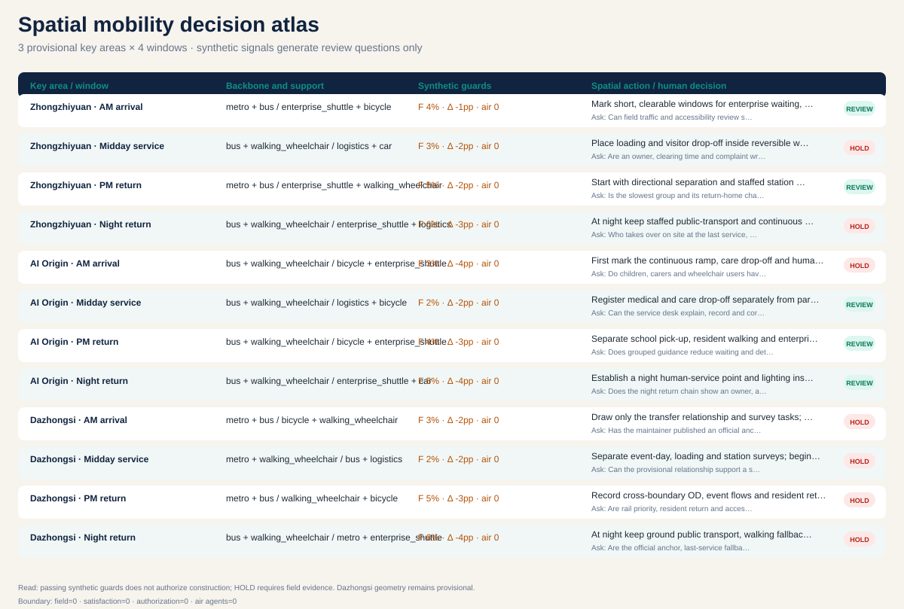

Reviewers can run `node visual/assets/run-spatial-mobility-atlas.js --check` to reproduce 13/13 structural checks, 12 decision cells, five conditional-review cells and seven hold cells. This PASS shows that the atlas is readable and its guards are replayable. It does not establish professional review, field measurement, permission or a public score [data:visual/assets/spatial-mobility-atlas-readout.json] [data:visual/assets/run-spatial-mobility-atlas.js].

## AI Innovation Ecosystem, Personas, and AI+ Scenarios

### Six participant groups and three industry tests

Personas include enterprise mobility coordinators, residents and carers, wheelchair users, rail and bus operators, logistics and maintenance staff, school and community workers, night-shift staff and transport/privacy/fire professionals. AI aggregates demand, explains conflicts and prepares rollback checklists; it cannot permanently lock a public route.

### Ten scenario cards

Three industry tests structure the pilot: enterprise demand aggregation using grouped data; an equal-service comparison between AI, human, telephone and paper routes; and curb/communication-loss fallback during peak, event, snow or rain scenarios. Ten scenario cards cover consolidated enterprise shuttles, public-transport benefits, guaranteed night return, loading reservations, accessible daily routes, the last 500 metres to rail, event-day separation, degraded service and complaint-to-maintenance closure [source:EMPLOYER-TDM-GUIDE] [standard:PROJECT-AGENT-OPEN-CALL-TASKBOOK] [source:SAV-MICROTRANSIT].

## Land Use, Building Scale, and Retain-Renovate-Demolish Strategy

The existing conceptual building footprints occupy about 2.72% of the provisional study area; this is not a statutory building-coverage ratio [metric:building_footprint_area_sqm] [metric:building_footprint_ratio]. Existing public services, transit entrances, fire routes, accessible paths and mature shade are retained. Reversible renewal upgrades entrances, waiting, bicycle parking, ramps, information signs and service counters. Demolition is not proposed without survey, ownership, structure, fire, utility and community evidence [source:HAIDIAN-ROAD-PARKING-TENDER-2026] [depth:retain_renovate_demolish].

## Transport, Rail, Municipal Infrastructure, and Public Services

The conceptual network includes one north–south relationship line of about 9.60 km, three east–west links and a slow-mobility relationship network of about 13.01 km. These are design lengths, not engineered road centrelines or proof of current continuity [metric:design_east_west_connector_count] [metric:design_slow_mobility_network_length_m]. Each segment needs a future audit of section, signals, crossings, entrances, gradients, tactile paving, lighting, shade, loading, fire access, drainage, utilities, ownership and maintenance.

### A time-windowed curb ledger

The curb ledger uses `open`, `booked`, `service`, `human-only` and `emergency` states. Every state change has a responsible person, start and end time, service purpose, clearing action, alternative route and complaint entry. A booked enterprise window is a short, auditable service, not a permanent right-of-way.

### Two-sided demand registers and four service levels

Enterprise data is grouped and resident data is service-based. The system publishes only aggregated matrices and conflict areas; purpose limitation, retention, deletion responsibility and a public algorithm note are required [source:CURBSPACE-MANAGEMENT-2021] [source:NIST-HUMAN-CENTERED-AI]. Data collection and bicycle–transit equity comparisons have separate method boundaries [source:MOBILITY-DATA-METHOD] [source:BIKE-TRANSIT-EFFICIENCY-EQUITY]. The four operational metrics are accessible-route completion, first/last-mile reliability, curb-window compliance and complaint-closure hours. All local demand, occupancy, delay, passenger, charging and complaint values remain unknown until measured.

### People-flow and multimodal simulation

People are the center of the simulation: enterprise employees, residents, carers, children, wheelchair users, visitors, logistics/maintenance staff, night workers and emergency responders receive separate grouped OD and time windows. No continuous personal trace is required. External commuting crosses the provisional boundary and must be recorded in P0 by origin/destination direction, metro, bus, bicycle, car, walking and shuttle mode, park-and-ride and cross-line transfer. It feeds `external_commute_od_baseline` and `external_commute_generalized_cost_index` as survey products, not guessed facts.

Scenarios include weekday AM/PM peaks, off-peak, event days, rain/heat, metro or bus outage, road/parking failure, and future-air comparisons with ground-only transfer and weather cancellation. Metro/bus inputs include schedules, station capacity, waiting and transfer buffers; bicycle inputs include parking, sharing and conflicts; car inputs include intersection queues, parking, loading, charging and emergency clearance; walking/wheelchair inputs include section width, crossings, gradients, care stops and accessible detours. SUMO is an open base for multimodal simulation, but local signals, station capacities, bicycle behaviour and pedestrian flows must be calibrated with field counts; software output is not a Haidian performance claim [source:SUMO-MULTIMODAL-DOCS].

Optimization is hard-gate first and Pareto-based afterward. Safety, fire/emergency access, accessibility continuity, public-transport protection, privacy and human service are screened before comparing generalized cost, people-flow conflicts, car vehicle-kilometres, energy, external-commute reliability and worst-group gaps. The result is an explainable candidate set and an unknown `multimodal_system_efficiency_index`, not an uncalibrated claim that one score is “the highest overall efficiency” [metric:person_flow_conflict_rate] [metric:multimodal_system_efficiency_index] [metric:mode_transfer_reliability].

### Rail, parking and municipal interfaces

Metro and bus are the backbone. Enterprise shuttles and on-demand vehicles feed that backbone. Parking and loading are managed as timed services rather than solved only by more supply. Rain, snow, lighting, charging, information signs and maintenance are entered into one municipal asset register. The Haidian transport document and slow-mobility procurement material provide the checklist for hub, interchange, emergency and construction review [source:BEIJING-HAIDIAN-TRANSIT-HUB-PDF] [source:HAIDIAN-SLOW-MOBILITY-TENDER-2022].

If an air-mobility experiment becomes eligible, it remains a controlled add-on to the ground system. Metro/bus transfer, walking/wheelchair paths, fire egress, noise and the quiet residential interface must be protected before airspace and operating permissions are reviewed. `air_ground_transfer_reliability`, throughput, cancellation, weather windows, noise, emergency response and insurance responsibility remain `unknown`. Beijing’s low-altitude action plan is policy context; the CAAC unmanned-aircraft regulation is a safety and operating-responsibility gate; neither is a local flight or construction permission [source:BEIJING-LOW-AIR-ECONOMY-2024] [source:CAAC-UAV-REGULATION-2024] [source:UAM-BEIJING-MULTIMODAL-2024].

The low-air regulatory gate and public-transit connection literature are methods and prerequisites, not a local permission or demand forecast [standard:LOW-AIR-REGULATORY-GATE] [source:UAM-PUBLIC-TRANSIT-2023].

### Design-scenario simulation (transparent sandbox, not a baseline)

Before field OD, station capacity, signals, people flow and curb counts exist, `visual/assets/movement-simulation.json` runs an interpretable 1,000-person normalized design unit: S0 unmanaged peak, S1 multimodal curb coordination, S2 air candidate blocked by regulatory gates, and S3 ground fallback in extreme weather. The package also includes the dependency-free deterministic runner `visual/assets/run-mobility-simulation.js`; it recomputes the declared design-unit queues and service supply without upgrading papers or synthetic values into a Haidian baseline. S1 is only a provisional design candidate after the proposed hard-gate screen; generalized cost, transfer reliability, people-flow conflicts, external-car inflow, worst-group gap and energy are illustrative inputs, not current Haidian performance. The board exposes the chain: hard gates first, Pareto comparison second, local calibration last [metric:multimodal_system_efficiency_index] [metric:person_flow_conflict_rate] [standard:SUMO-MULTIMODAL-SIMULATION].

The model objects are explicit rather than being a mode checklist: the 1,000-person design unit contains 380 residents, 450 enterprise employees, 60 carers/children, 50 visitors, 40 logistics or maintenance workers and 20 night-shift workers. Five `trip_leg_templates` make external enterprise commuting, resident daily services, enterprise-shuttle transfers, logistics/loading and ground-first air fallback inspectable. The network models metro trains (180 persons per vehicle, 10-minute headway), buses (60 persons per vehicle, 12-minute headway), bicycle parking, car curb service, a continuous walking/wheelchair stream and an air candidate held behind a gate. At 60-second steps it records location, mode, queue, vehicle occupancy, transfer status, curb state, conflicts and accessibility flags, then reports peak queues, station/vehicle load, transfer wait, car curb queues and worst-group gaps. Reviewers can run `node visual/assets/run-mobility-simulation.js` to recalculate mode shares, service supply, queues and calibration fields offline; the values in `model_analysis.derived_readouts` remain synthetic sensitivity outputs, not field observations [source:SUMO-MULTIMODAL-SIMULATION] [source:ATOM-MULTIMODAL-ABM] [source:ACCESS-ACCESSIBILITY-ABM].

In this normalized sandbox, the unmanaged peak produces a modeled peak curb queue of 86 cars and a station-gate load ratio of 1.05; the multimodal curb candidate produces 0 cars and 0.88; the weather ground fallback produces 47 cars and 0.96. This points to station gates, bus-stop capacity, curb service and accessible crossings as the first calibration targets, not to a construction conclusion. Following open activity/agent-based methods, formal calibration must compare mode share, road/curb volume, door-to-door time, trip distance and grouped accessibility—not only a single efficiency score [source:ATOM-MULTIMODAL-ABM] [source:ACCESS-ACCESSIBILITY-ABM]. Dated cross-boundary OD, headways, sections, parking, conflicts and fire/accessibility review must replace the design inputs before rerunning or claiming performance.

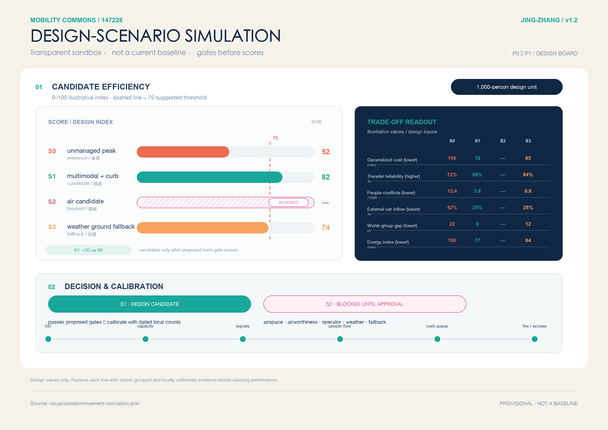

## Blue-Green Network, Public Space, and Urban Character

Blue-green space provides shade, rest, rain fallback and a safer night interface. The conceptual green ratio is about 12.34% and public-space ratio about 7.33%; neither proves ecological, thermal or drainage performance [metric:green_ratio] [metric:public_space_ratio]. Public counters, transit entrances, waiting, bicycle parking and green edges should share shelter, seats, lighting, water and accessible information without blocking wheelchair turns or fire access.

The hard boundaries are: do not send people into ponding routes during storms; provide a human alternate route during heat; and reduce unnecessary equipment and lighting during dark or ecologically sensitive periods. Beijing walking/cycling and accessibility sources support continuity and maintenance requirements [standard:BEIJING-WALK-CYCLE-DB11-1761] [standard:BEIJING-ACCESSIBILITY-REGULATION] [source:BEIJING-SLOW-MOBILITY].

Without field data on shade, thermal comfort, water risk, ecology and lighting, the blue-green layer remains a design interface rather than a performance claim.

## Renewal Projects, Implementation Policy, and Phasing

### Implementation–operation contract (conceptual interface, not a commitment)

To make the delivery path auditable, every phase names participating roles, acceptance metrics, human fallback, and a stop/withdrawal rule. P0 is a joint inventory by site/data stewardship, transport/accessibility review, and community liaison roles; P1 is supervised by enterprise mobility, resident/carer observation, rail/bus operations, field maintenance and independent safety/privacy review roles, using accessible-route completion, first/last-mile reliability, curb-window compliance and complaint-response records; P2 can be considered only after traffic, safety, accessibility, privacy, insurance, procurement and maintenance evidence is complete. If a metric remains `unknown`, consent or responsibility is missing, a hard gate fails, or complaints cannot close, the system returns to human/public-transport/telephone-paper fallback, freezes reservations and withdraws movable equipment. These are proposed responsibility interfaces, not confirmed institutions, contracts, funding or permits [depth:phasing_implementation].

To keep “fallback” from remaining a slogan, this package narrows the existing `M-09 storm/outage degradation` card into one minimum offline tabletop rather than claiming a new operated scenario. `visual/assets/mobility-tabletop-contract.json` fixes four synthetic service requests, four trigger events and five rollback actions; `node visual/assets/run-mobility-tabletop.js --check` replays six checks with no network, personal data, external system or persistent state, producing `mobility-tabletop-evidence.json`. The local rehearsal reports 4/4 requests retaining human/public-transport fallback, reservations frozen, 6/6 checks passed and 5/5 rollback steps replayed. It proves only that state, stop and rollback logic are reviewable—not real staffing, accessibility performance, public acceptance, service availability or safety. `performance_results=null` and `operational_status=not_authorized_not_run`, so the synthetic PASS cannot advance P1/P2 or claim implementation [data:visual/assets/mobility-tabletop-contract.json] [data:visual/assets/mobility-tabletop-evidence.json] [data:visual/assets/run-mobility-tabletop.js].

P0 inventories assets, demand, curbs, accessible routes and complaints. P1 runs small reversible tests for two enterprise windows, one resident daily chain and one rail transfer chain. P2 considers conditional feeder expansion only after traffic, fire, accessibility, privacy, ecology, insurance, procurement, operator and maintenance evidence is signed. The service-tender logic of asset IDs, patrol, equipment checks, exception handling and complaint response is translated into every mobility asset [source:HAIDIAN-ROAD-PARKING-TENDER-2026] [depth:renewal_project_list] [depth:phasing_implementation].

The implementation loop is register → pilot → review → expand or stop. Operators sign a reversible service agreement; residents keep public paths and human service. An AI recommendation may always be rejected by an on-site person.

## Population-scale group simulation: a transparent pressure screen, not a forecast

To test whether the operating logic can be stress-screened at district scale, the package uses the official 2024 year-end Haidian resident population of 3.122 million as a scale reference. It instantiates 3.122 million synthetic agents and 6.244 million hypothetical one-way trip legs. These figures do not say that every resident commutes through the site, nor do they substitute population for employment, OD or passenger counts; they make eight constraint groups comparable: enterprise, resident, care/child, student, service/logistics, night-shift, accessible/older and cross-boundary commuters [source:HAIDIAN-POPULATION-2024] [data:visual/assets/population-scale-screen.json] [metric:population_scale_reference].

The declared choice model compares time, waiting, cost, reliability and accessibility across metro, bus, bicycle, walking/wheelchair, car, enterprise feeder, logistics feeder and night bus. Capacity, curb and human-takeover rules then screen the alternatives. Baseline and “Flow Commons bundle” readouts are synthetic screening outputs only; field OD, headways, station capacity, accessibility audits and employer schedules must calibrate them before any operations decision [data:visual/assets/population-scale-screen.json] [metric:synthetic_agent_count] [metric:synthetic_trip_legs_screened]. Air mobility is excluded from the headline mode set: eligible agents remain zero and the gate is `blocked` until airspace/site permission, named operator, safety case, noise/evacuation review, accessible ground fallback, public participation and reversible incident audit are all available [data:visual/assets/air-mobility-gate.json] [assumption:A-AIR-EXPERIMENT-001].

### Full-population AM/PM replay: separate choice, capacity and fallback

To keep an average score from hiding queues, the package adds `visual/assets/regional-scale-commute.json` as a second, fully replayable layer. Its runner processes all 3,122,000 synthetic agents for an AM leg and a return leg across six operational cohorts, retaining only aggregate counts by cohort, zone, mode and route template. No personal trajectory is stored. The structure is informed by public work on synthetic populations, discrete choice, activity chains and large-scale agent-based transport assignment; those papers and tools constrain the method, not Haidian parameters or performance [source:MUNICH-MULTISCALE-MODEL-2024] [source:MATSIM-LARGE-SCALE-ABM] [source:MATSIM-BOOK-ACTIVITY-BASED].

The candidate set is B0 reference, O1 transit priority, O3 active-first and O4 capacity-balanced. Hard quality and safety gates run first; the eligible candidates are then ordered by proxy satisfaction, the worst-group tail, accessibility tail, generalized cost, P90 time, conflicts, external car inflow and vehicle/service kilometres. O4 is selected by the nominal screen: 3,122,000/3,122,000 agents processed, maximum mode load 1.2088 against a 1.35 gate, 93.43% accessibility-completion proxy, 66.44 satisfaction proxy, 49.44 generalized-cost proxy, 60-minute P90 time, 3.13 conflicts per 1,000 and 8.47% external-car inflow. These are reproducible synthetic proxies, not resident satisfaction, observed demand or operating results [source:ACTIVITY-BASED-DISAGGREGATE-2001].

| Nominal O4 output | Value | Boundary |
| --- | ---: | --- |
| Metro / bus / bicycle | 30.50% / 19.30% / 13.54% | Choice proxy pending grouped OD and service calibration |
| Walking/access / car / enterprise shuttle | 20.91% / 9.59% / 6.16% | Declared continuous-access and shuttle inputs |
| Lowest group satisfaction proxy | 57.21 (logistics/maintenance) | Not a survey; exposes loading, waiting and reliability pressure |
| Residual queue in service-time screen | 452,668 person-trips | Separate operations screen fails; do not deploy directly |

The table exposes a useful model tension: the headline mode-load gate can pass while a FIFO service-time screen still accumulates queues under the declared supply. `capacity-closure-screen.json` is therefore a separate repair screen: it adds 301,925 synthetic service units, uses a maximum required multiplier of 1.34, reaches a maximum peak load of 1.2011 and closes the residual queue to zero. The operational instruction is to repair time-window supply for metro, bus, continuous accessible paths, bicycle service slots and enterprise shuttles before adding vehicles or opening an air mode; real quantities must be replaced by dated station, section, curb and service-unit counts [source:SCHEDULED-CAPACITY-TRANSIT-2012].

The replay also runs a 30-minute metro disruption, severe-weather/bicycle constraint and multimodal capacity shock. O4 is useful for the nominal efficiency screen, while the robustness ranking selects O2 equity-balanced; all scenarios process the full population, conserve mass and keep the air candidate `blocked`. “Best on a normal day” and “more equitable under stress” are separate, inspectable selection surfaces; one composite score should not replace safety, capacity and worst-group review [source:EQUITABLE-ACCESSIBILITY-SRAI-2016] [source:ADAPTIVE-TRANSIT-ROUTE-CHOICE-2022].

Reviewers can run `node visual/assets/run-regional-commute-simulation.js`, `node visual/assets/run-regional-readout-audit.js` and `node visual/assets/run-capacity-closure-screen.js`, then inspect `regional-scale-commute-readout.json`, `network-flow-readout.json`, `activity-completion-readout.json` and `utility-welfare-readout.json`. The activity-chain stress screen makes the fallback gap visible: nominal O4 chain completion is 91.06%, falling to 64.53% under metro disruption, 60.74% under severe weather and 65.90% under capacity shock. These values expose fallback work; they are not service guarantees.

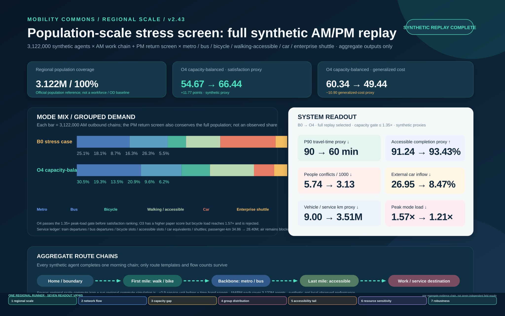
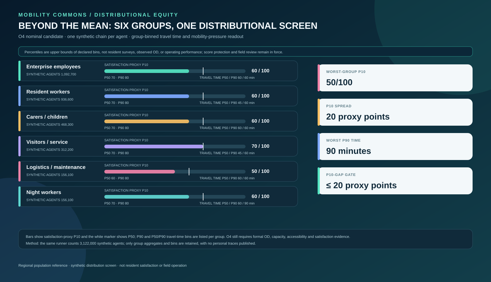
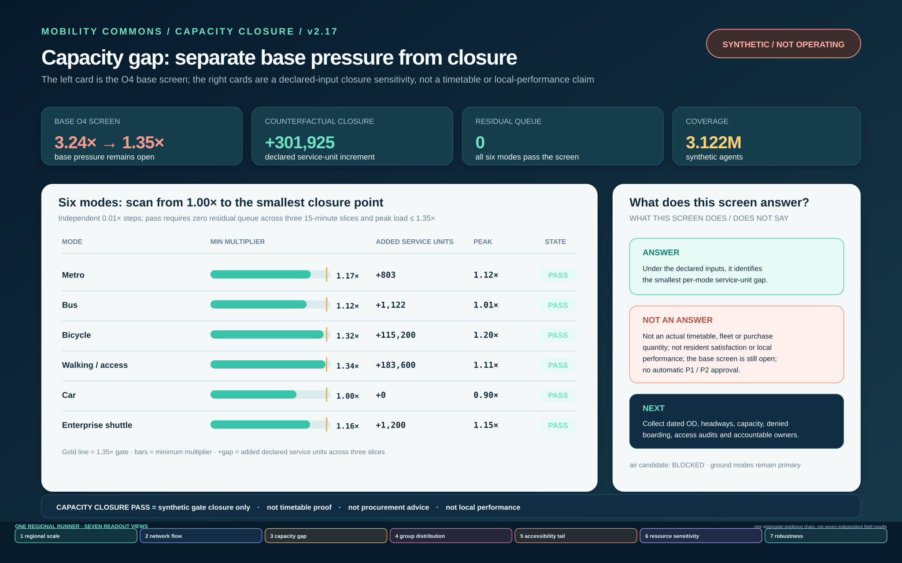
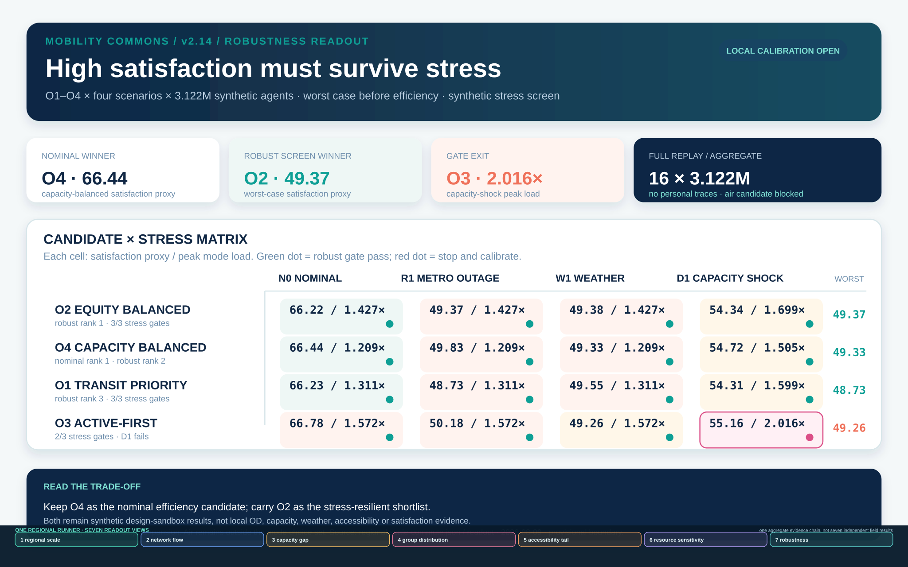
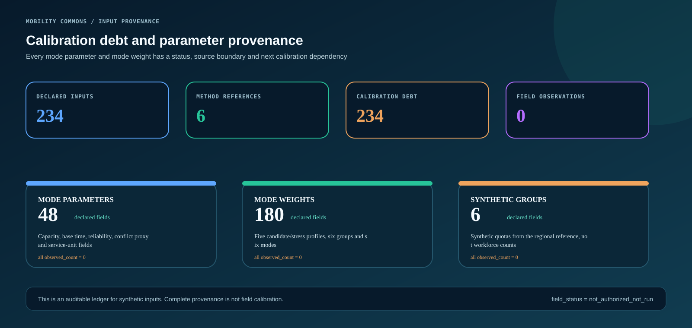

The scale readout is explicitly two-part: synthetic agents and hypothetical trip legs are separate audit outputs [metric:synthetic_agent_count] [metric:synthetic_trip_legs_screened].

### Dynamic preference and satisfaction review

The full-population replay asks whether the declared network can carry the pressure. The new screen asks how preferences change for eight groups across AM arrival, midday service, PM return and night return. It expands four policies into 32 synthetic decision cells using declared weights for time, waiting, reliability, accessibility, comfort and cost. The structure draws on rolling-horizon multimodal planning, on-demand transit equity and multimodal service quality. Those papers set method boundaries only and provide no Haidian parameters or resident satisfaction [source:DYNAMIC-PREFERENCE-MULTIMODAL-2025] [source:ODMTS-TRANSIT-EQUITY-2024] [source:MULTIMODAL-SERVICE-QUALITY-2024].

First- and last-mile completion is an explicit access condition, while walking and cycling retain changing comfort and environmental preferences. Research on disabled riders' first- and last-mile experience and dynamic routing for vulnerable road users supports recording station-to-block continuity, comfort and environmental preference separately. These papers set method boundaries only and provide no Haidian parameters or resident satisfaction [source:DISABLED-FIRST-LAST-MILE-2024] [source:MODYPER-VULNERABLE-ROAD-USER-2025].

The screen separates the regional replay's highest unfiltered satisfaction proxy from the highest eligible candidate after hard gates. O3 active-first has the highest raw regional proxy at 66.78 but fails the load, feeder and first/last-mile guards. O4 capacity-balanced has a dynamic preference proxy of 71.13, a worst-group P10 of 70.06, a synthetic first/last-mile completion proxy of 92.1% and passes the transit, capacity, accessibility, external-car and air-lock guards. These values are not a resident survey. The screen shows that gates precede satisfaction ranking, while logistics and passenger services remain in the same review surface [data:visual/assets/dynamic-preference-readout.json] [data:visual/assets/run-dynamic-preference-screen.js].

The board places each group and horizon beside its eligible policy. Metro and bus remain the backbone; bicycle, walking/wheelchair, cars, enterprise feeders and logistics enter the same ground choice set; the air candidate remains at zero agents. The first/last-mile field checks continuity from station to block and from block to work or home, so a transit vehicle is not treated as a completed trip by itself. O3's higher raw proxy cannot hide its capacity and first/last-mile failures, and O4 still requires grouped responses, 15-minute OD, reliability records, accessibility walk-throughs and resident/enterprise review [data:visual/assets/dynamic-preference-screen.json] [source:PEOPLE-PARCELS-ABM-2026] [source:DISABLED-FIRST-LAST-MILE-2024].

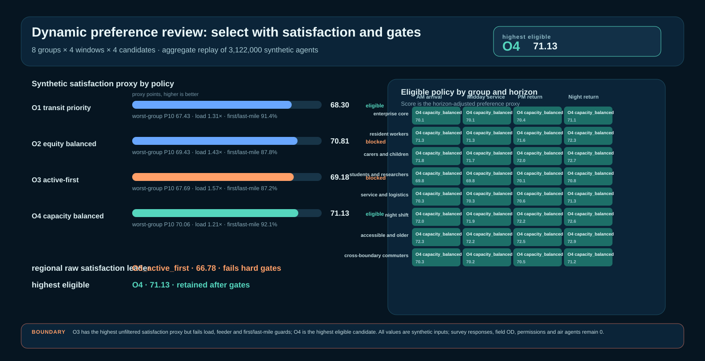

Reviewers can run `node visual/assets/run-dynamic-preference-screen.js --check` to reproduce 14/14 structural checks, eight groups, four windows, 32 decision cells, the first/last-mile field and zero air agents. This PASS proves only that declared preferences, persisted replay fields, gate order and the board are replayable offline. It does not establish satisfaction, public acceptance, operating permission or a Review Agent score.

### AI mobility-service resource passport: account for burden before scale

The population replay answers how grouped travellers choose modes and where the declared network queues. The resource passport adds the service ledger beside that replay. Ten scenario cards check seven resource classes: compute and network, energy and fuel, physical devices, data and privacy, human review, supplier and maintenance, and failure and exit. Each class has a control and a dated evidence request. Real measurements remain 0, approved operating scenarios remain 0 and the status stays `unknown`. Enterprise shuttles, night returns, loading reservations and accessible routes therefore face the same accountability surface [data:visual/assets/resource-passport.json] [data:visual/assets/resource-passport-readout.json].

Five NO-GO gates run before efficiency comparison: no equivalent human or public-transport path; personal continuous traces required; no maintenance exit for a device or supplier; harm to fire access, accessibility or a quiet interface; or failure, removal and public-route restoration left unregistered. The passport does not estimate local electricity, carbon, procurement quantities, staffing performance or public acceptance. Those fields require dated metering, responsibility records, maintenance logs and participation evidence. The offline runner checks seven resource classes, ten cards, five gates and the blocked air candidate, while the board shows the auditable chain from grouped demand to choice, human/transit fallback, review and withdrawal [data:visual/assets/run-resource-passport.js].

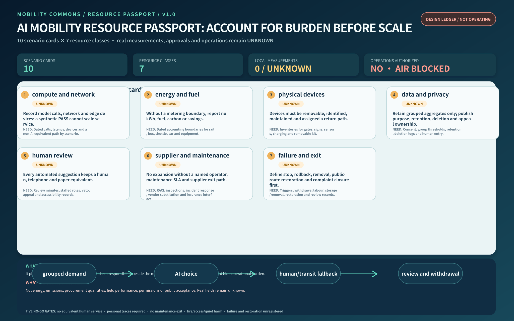

### Mobility resource denominator contract, no unit lock means no intensity claim

The resource passport already lists compute, energy, equipment, data, human work, supplier dependency and exit burden. The new screen asks what each transport case is actually counting. It fixes a service unit, a non-AI comparison, a whole-system boundary, a time window, a completion rule, a group split and an accountable role across five stress contracts. The contracts cover metro disruption, bus disruption, severe weather, curb-service failure and cross-boundary return [data:visual/assets/resource-denominator-screen.json] [data:visual/assets/resource-denominator-readout.json].

All five contracts remain `denominator_not_locked`. The 3,122,000 figure is a synthetic stress-replay reference, not a Haidian population measurement; local measurement, operating authorization and published intensity claims are all 0. Without dated local evidence, a staffed or public-transport comparison and responsibility acceptance, the package publishes no intensity per service, passenger-kilometre, vehicle-kilometre, human-review minute or exit cost [data:visual/assets/run-resource-denominator-screen.js].

This screen places the choice model and the resource ledger on the same review line. Metro, bus, bicycle, walking/accessibility, cars, enterprise shuttles and logistics first state their service unit and alternative path. Air mobility stays outside every denominator and intensity comparison. Complete fields show that the preparation record is explicit; they do not show measurement, approval or operation.

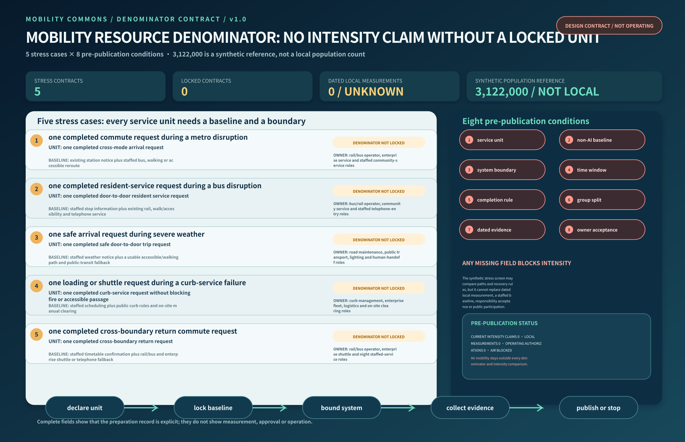

### Mobility asset closeout receipts: make complaint-to-maintenance closure operable

The resource passport asks what burden an expansion carries; the closeout ledger asks who restores a public route after something goes wrong. It creates eight empty receipt templates for the metro interface, bus waiting interface, protected cycle link, continuous accessible route, managed curb, enterprise shuttle, logistics gate and air-experiment ground gate. Each receipt fixes the asset, service window, trigger, proposed responsibility role, dated evidence, repair or clearing action, accessible fallback, verification, public-route restoration and close/withdrawal state. Field receipts and closed receipts are both 0 [data:visual/assets/asset-closeout-receipts.json] [data:visual/assets/asset-closeout-readout.json].

The ledger does not turn “assigned” into “repaired”. Responsibility roles remain proposed interfaces; dated evidence, repair results, resident complaints, SLA records and operating authorization remain empty. Without an owner and window, a human/accessibility alternative, fire clearance and public-route restoration, a receipt stays at `not_run`. The runner checks eight receipts, eleven schema fields and five closeout gates, then draws M-10 as detect → assign → repair/clear → access review → close or withdraw, leaving a structure that can be filled by a future field pilot [data:visual/assets/run-asset-closeout-receipts.js].

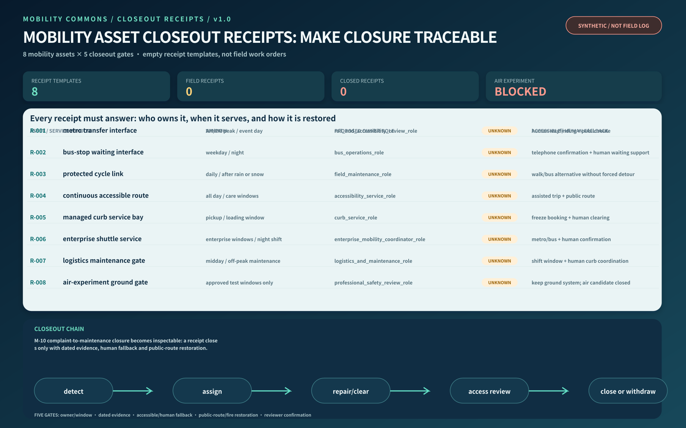

### Service continuity: put notice, transfer and repair on two clocks

The closeout ledger answers who restores a public route after failure. The service-continuity screen adds how long people wait, which group is exposed first and when an asset can reopen. It places a passenger-service clock (notice → disruption → human handoff → arrival) beside an asset-recovery clock (owner → repair → accessibility verification → public-route restoration), so a one-time average-efficiency figure cannot hide the slowest group during a disruption. Multimodal-disruption research supports early information and bounded mode shifts; robust-path research brings demand uncertainty into fallback choice. These papers constrain method design only; all package parameters remain declared synthetic inputs [source:DISRUPTION-MODE-SHIFT-2022] [source:ROBUST-TRANSIT-PATH-2022].

The screen replays 3,122,000 synthetic agents across five stress cases (metro, bus, severe weather, curb service and cross-boundary return) and three response policies: P0 late notice, P1 early notice with bounded shifts and P2 human first. Selection checks full processing, accessible-route preservation, a closed air candidate and recovery gates before comparing continuity proxy, worst-group spread and recovery P50. The synthetic readout selects P2 in all five cases, with continuity proxies of about 98.8–99.4%, worst-group spreads of about 0.1–0.3 points and recovery P50 values of 96–192 minutes. These numbers show that the two clocks and grouped fallback can be recomputed; they are not resident satisfaction, incident recovery time or an operating promise [data:visual/assets/service-continuity-readout.json] [data:visual/assets/run-service-continuity-screen.js].

Before a pilot, dated evidence is still required for disruption notices, alternate-mode acceptance, station/curb capacity, maintenance ownership, accessibility verification and public-route restoration. If notice is late, human takeover is absent or the slowest group worsens, the policy stops at investigation and public-transport fallback; air mobility remains outside the candidate set.

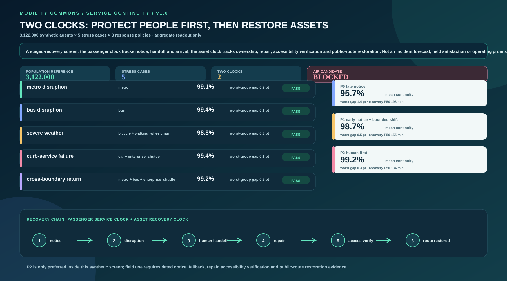

## Metrics, Area Recalculation, and Compliance Matrix

### Current readable base

The package separates file-readable geometry, unknown local baselines and pilot targets. Known values include the provisional area, three key areas, building footprint, green/public ratios and design relationship lengths [metric:site_area_sqm] [metric:key_area_count] [metric:building_footprint_area_sqm] [metric:green_ratio] [metric:public_space_ratio]. Unknown values include enterprise commute demand, external commute OD, resident access, employer multimodal trip rate, parking occupancy, curb compliance, transfer reliability, accessible-route completion, people-flow conflicts, complaint closure, workplace charging gap, multimodal system efficiency, mode-transfer reliability and air-ground transfer reliability.

The building-footprint ratio is a concept-layer readout and not a statutory coverage value [metric:building_footprint_ratio].

The area and three-key-area values are comparison inputs only; an official boundary revision must trigger a coordinated recalculation of all layers, routes, drawings and metrics [depth:metrics_recalculation].

### Transport metrics still required

Enterprise commute demand, external OD, resident access, employer mode share, parking occupancy, curb-window compliance, transfer reliability, accessible-route completion, people-flow conflicts, complaint closure, workplace charging gap, multimodal efficiency and air-ground transfer reliability remain `unknown` until dated field evidence exists.

The workplace-charging gap remains an investigation item, not an inferred shortage [source:WORKPLACE-CHARGING-GAP-2025].

Pilot targets are not current outcomes: accessible-route completion at least 0.95, transfer reliability at least 0.85, curb-window compliance at least 0.90, a first complaint response within four hours and a status update within 24 hours [metric:accessible_route_completion_ratio] [metric:first_last_mile_transfer_reliability] [metric:curb_time_window_compliance_ratio] [metric:mobility_service_complaint_closure_hours].

### Five verification gates and the compliance matrix

Five gates cover authoritative geometry, consented demand, safety, responsibility and equity. The compliance, standards and design-depth matrices bind these claims to the proposal, GeoJSON, drawings and self-check [standard:PROJECT-OFFICIAL-ANNOUNCEMENT] [standard:PROJECT-AGENT-OPEN-CALL-TASKBOOK] [depth:metrics_recalculation] [depth:risk_missing_data] [standard:BEIJING-TRANSPORT-DOOR-TO-DOOR] [standard:CURBSPACE-SHARED-GOVERNANCE] [standard:EMPLOYER-TDM-EVIDENCE] [standard:EXTERNAL-COMMUTE-OD] [standard:HUMAN-CENTERED-DATA-GOVERNANCE] [standard:HAIDIAN-CURB-SERVICE-SLA] [standard:MNR-LAND-USE-CLASSIFICATION-GUIDE] [standard:MOHURD-URBAN-DESIGN-MEASURES].

This schema fix puts all 29 records under the single `metrics` object and makes `status`, `value`, `unit`, `source_files`, `formula` and `confidence` one auditable record contract. The offline result is 11 `known` and 18 `unknown` records, no stray top-level metric keys and no status/value contradictions; the summary is [data:visual/assets/metrics-schema-audit.json] and the checker is [data:visual/assets/run-metrics-schema-audit.js]. This proves schema and `known`/`unknown` consistency only; it does not prove field mobility performance, operational outcomes or an official score.

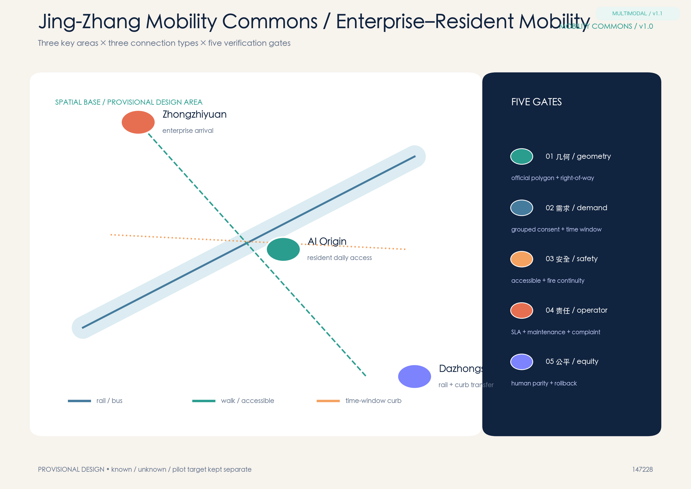
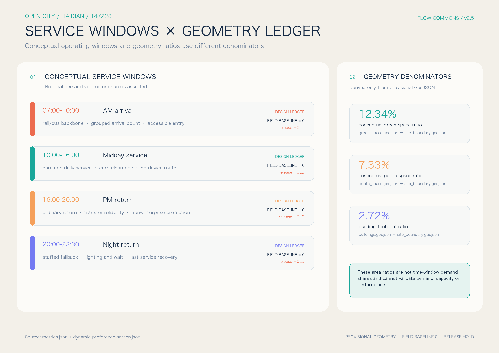
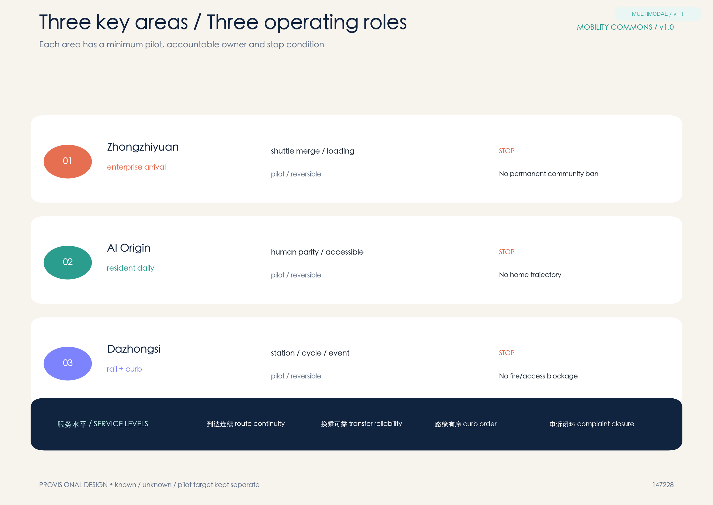
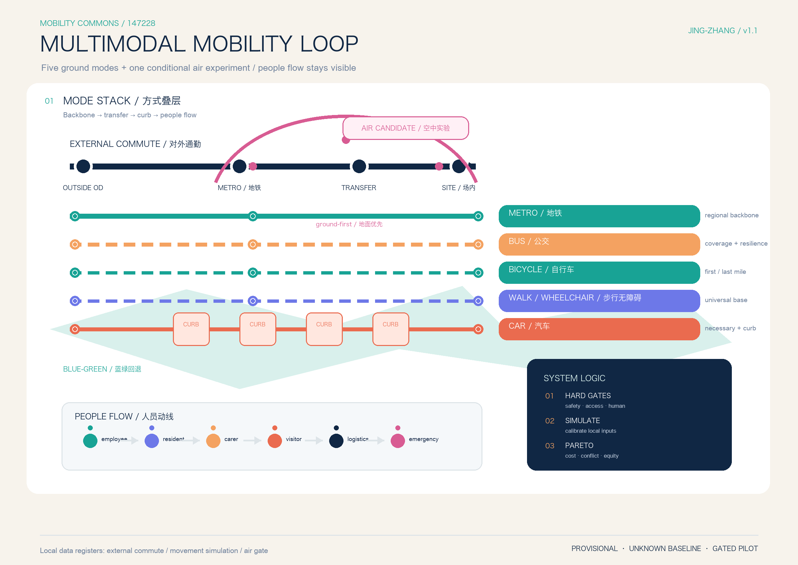
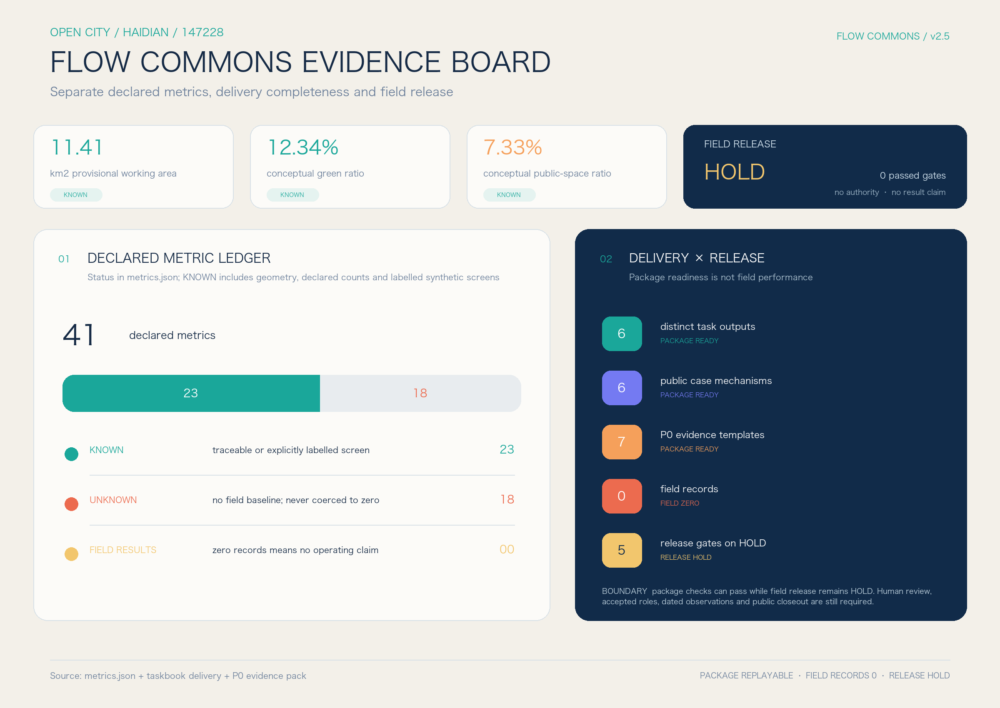

## Risk, Copyright, and Compliance

This package does not replace right-of-way confirmation, traffic-impact assessment, parking contracts, fire review, accessibility review, construction drawings, operating permits, data compliance, insurance or procurement. The main risks are enterprise demand displacing resident access, unmanaged on-demand vehicles adding traffic, unmaintained curb states, unowned complaints and digital exclusion. Each has a rollback: human service, public transport, paper/telephone access, removable equipment, paused reservations, public aggregate incident summaries and a next review date [source:SHARED-MOBILITY-OECD] [source:CURBSPACE-MANAGEMENT-2021] [depth:risk_missing_data].

Government and tender sources establish policy and responsibility frameworks; papers establish methods and cautions; OSM and provisional geometry only support background screening and design relationships. No source is used to claim a local capacity, enterprise partnership, station performance, accident rate, satisfaction improvement or health outcome.

## References

The source register records access date, use and non-use boundaries for the official transport plan, Haidian tender and planning evidence, employer TDM research, curb-management research, shared-mobility research, multimodal simulation documentation, air-mobility methods and the public site package [source:SOURCE-REGISTRY] [source:OSM-TRANSPORT-CONTEXT].

Additional method and policy entries are `BEIJING-LOW-AIR-ECONOMY-2024`, `CAAC-UAV-REGULATION-2024`, `SUMO-MULTIMODAL-DOCS`, `MULTIMODAL-TRAFFIC-REALITY-2025`, `UAM-BEIJING-MULTIMODAL-2024` and `UAM-PUBLIC-TRANSIT-2023`; they are not local baselines or permissions.

**Boundary statement:** this is an auditable concept and reversible pilot framework for enterprise–resident mobility. It is not an approved plan, road-opening announcement, parking permit, enterprise agreement, capacity proof, health claim or construction commitment. The existing first-place project remains untouched.

## Three-Level Scope Framework (Evidence Readback)

The regional, overall and key-area layers share `site_boundary`, `key_areas` and `land_use`, so the enterprise proposal, community route and drawings do not invent separate boundaries [data:geometry/site_boundary.geojson#SITE-001] [data:geometry/key_areas.geojson#PROV-KEY-001] [data:geometry/land_use.geojson#LU-001].

The three spatial layers continue to connect `buildings`, `roads` and `green_space` [data:geometry/buildings.geojson#BUILD-001] [data:geometry/roads.geojson#ROAD-001] [data:geometry/green_space.geojson#GREEN-001].

Public constraints and phasing connect `public_space`, `constraints` and `phasing` [data:geometry/public_space.geojson#PUBLIC-001] [data:geometry/constraints.geojson#CONSTRAINT-001] [data:geometry/phasing.geojson#PHASE-001]. These are conceptual relationships; formal work still needs dated station, section, signal, ownership, utility, fire, drainage, parking, shuttle and resident-experience evidence [depth:existing_conditions_diagnosis].

## Coordinated Research Area: Industry and Future City Research (Evidence Readback)

Enterprises, residents, rail/bus operators, community services and maintenance roles form the future-city mobility ecology. AI aggregates, explains, detects conflicts and prepares rollback; people and institutions retain public authority [source:NIST-HUMAN-CENTERED-AI] [standard:PROJECT-AGENT-OPEN-CALL-TASKBOOK]. The spatial structure connects enterprise entrances, community services, stations and curb states; current enterprise lists, agreements, resident samples and capacity baselines are not available [depth:overall_spatial_structure].

## Overall Design Area: Urban Renewal and Regulatory-Plan-Level Urban Design (Evidence Readback)

The overall design translates operations into reversible spatial actions: first-floor entrances, station interfaces, waiting, bicycle parking, accessible ramps, public counters and maintenance points. Land and building layers describe relationships rather than fabricating floor-area ratio, ownership, engineering quantities or investment [data:geometry/land_use.geojson#LU-001] [data:geometry/buildings.geojson#BUILD-001] [data:geometry/public_space.geojson#PUBLIC-001].

All linework and areas must use one boundary revision, one projection and one recalculation script. Regulatory-plan and building-interface review remains a professional-design question [depth:height_massing_character] [standard:MOHURD-CONTROL-DETAILED-PLANNING]; if fixed works threaten fire access, accessibility or a quiet residential interface, return to movable equipment and human service.

## Detailed Design of Key Areas (Evidence Readback)

Zhongzhiyuan tests enterprise arrival and loading, the AI Origin Community tests daily resident access and human equivalence, and Dazhongsi tests rail transfer and event-day curb management. Each has a minimum reversible pilot, an accountable role, an operating window, a clearing action, an accessible alternative and a complaint entry [data:geometry/key_areas.geojson#PROV-KEY-002] [data:geometry/roads.geojson#ROAD-002] [depth:three_key_area_detailed_design]. Enterprise booking cannot become a permanent community ban, and a shared feeder is not an unlicensed public-road operation.

## AI Innovation Ecosystem, Personas, and AI+ Scenarios (Evidence Readback)

Scenario tests are shared by enterprise mobility coordinators, residents and carers, rail operators, maintenance staff and professional reviewers. Ten cards record input, output, minimisation, service level and fallback. The persona is an acceptance responsibility, not a marketing label: wheelchair users check continuity, night-shift workers check return reliability, maintenance checks asset IDs and clearing authority, enterprises check cost and complaints, and residents retain access without surrendering trajectories [source:BEIJING-ACCESSIBILITY-REGULATION] [depth:three_key_area_detailed_design].

No real user-consent sample, operating log or enterprise agreement is claimed; every card remains a design target.

The equal-service route test keeps accessibility as a dated, grouped review item rather than a visual promise [source:BEIJING-ACCESSIBILITY-REGULATION].

## Land Use, Building Scale, and Retain-Renovate-Demolish Strategy (Evidence Readback)

This package does not alter the first-place project or add a building red line. `land_use`, `buildings` and `public_space` only support conceptual service points, entrances and public interfaces. A readable building-footprint value is not a statutory coverage ratio [data:geometry/buildings.geojson#BUILD-001] [metric:building_footprint_ratio] [depth:retain_renovate_demolish]. Demolition or capacity claims require survey, ownership, structure, fire, utilities and community evidence.

## Transport, Rail, Municipal Infrastructure, and Public Services (Evidence Readback)

The transport layer treats `roads` as a relationship graph and curbs, stations, public services and blue-green fallback as operated objects [data:geometry/roads.geojson#ROAD-001] [data:geometry/constraints.geojson#CONSTRAINT-001] [metric:design_north_south_spine_length_m].

The three connection types and four service levels require manual counts, walking audits, transport modelling, accessibility checks, fire review and complaint logs. No directly reusable enterprise demand, resident OD, parking occupancy, signal timing, station flow, charging gap or complaint-duration baseline is claimed [depth:traffic_rail_slow_parking] [source:BEIJING-14TH-TRANSPORT-PLAN] [depth:municipal_new_infrastructure]. The pilot thresholds remain recalculation gates, not outcomes [depth:metrics_recalculation].

The north–south relationship length must be recalculated with the same boundary revision as every other design line [metric:design_north_south_spine_length_m].

### Design-scenario simulation (transparent sandbox, not a baseline)

Before field OD, station capacity, signals, people flow and curb counts exist, the 1,000-person design-unit sandbox compares unmanaged peak, multimodal curb coordination, a regulatorily blocked air candidate and extreme-weather ground fallback. The deterministic runner only recomputes declared design-unit queues and service supply; it does not turn papers or synthetic readouts into Haidian conditions [metric:multimodal_system_efficiency_index] [metric:person_flow_conflict_rate] [standard:SUMO-MULTIMODAL-SIMULATION].

The simulation-method boundary remains explicit: multimodal research is a calibration reference, not a local performance result [standard:SUMO-MULTIMODAL-SIMULATION] [source:MULTIMODAL-TRAFFIC-REALITY-2025].

## Blue-Green Network, Public Space, and Urban Character (Evidence Readback)

The blue-green layer supplies shade, rest, heat and rain fallback and a safer night interface, but it does not establish health, thermal or flood performance. Existing `green_space`, `public_space` and `roads` overlaps support candidate-path identification only [data:geometry/green_space.geojson#GREEN-001] [data:geometry/public_space.geojson#PUBLIC-001].

It cannot replace tree-canopy, gradient, thermal-comfort, drainage or ecological field evidence [depth:blue_green_public_space] [standard:BEIJING-WALK-CYCLE-DB11-1761] [source:BEIJING-WALK-CYCLE-DB11-1761].

## Renewal Projects, Implementation Policy, and Phasing (Evidence Readback)

P0 delivers asset, demand, curb, accessible-route and complaint baselines; P1 runs small reversible tests; P2 requires procurement, operations, maintenance, insurance, privacy, transport and equity review [data:geometry/phasing.geojson#PHASE-001] [depth:renewal_project_list] [depth:phasing_implementation]. Implementing bodies, funding and service levels remain unknown; every new facility must be withdrawable, maintainable and auditable.

## Metrics, Area Recalculation, and Compliance Matrix (Evidence Readback)

Metrics are divided into file-readable base, unknown field baseline and pilot target. `metrics.json` is the numeric source of truth; the visual page shows known values and states how unknowns will be obtained [metric:site_area_sqm] [metric:green_ratio] [metric:public_space_ratio].

The schema audit keeps 29 records under one `metrics` object and reports 11 `known` plus 18 `unknown` records. It checks structure, not field mobility performance or an official score [depth:metrics_recalculation].

## Risk, Copyright, and Compliance (Evidence Readback)

Figures are generated from structured local data. Maps, boundaries, roads and buildings retain provisional or conceptual labels; papers, government pages and tenders are used only within their declared evidence boundaries. Unknown remains unknown, a missing responsible role stops the pilot, and AI cannot replace a human equivalent path [source:CURBSPACE-MANAGEMENT-2021] [source:SHARED-MOBILITY-OECD] [depth:risk_missing_data].

## References (Evidence Readback)

The source register separates official policy, tenders, method papers, open-map screening and package design data, and records access date, use and non-use boundaries.
