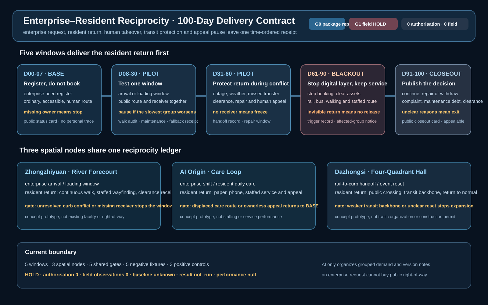
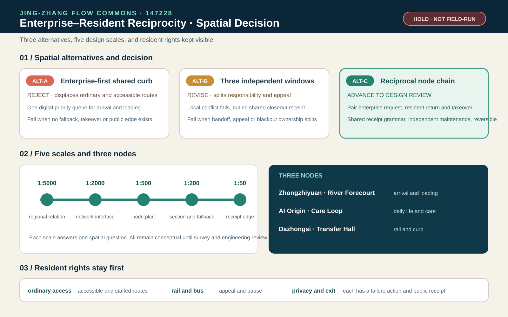

# Jing-Zhang Flow Commons: An Enterprise–Resident Reciprocity Operating System

> **Core proposition:** the next move for the Jing-Zhang corridor is not another speculative road. It is a public mobility operating system that lets enterprises manage arrival, shuttle, freight and charging demand while residents retain continuous walking, accessible and human-service routes.

This is a new independent submission package. It does not modify the existing first-place project. The proposal uses one time-windowed curb ledger, two aggregated demand registers, three connection types, four service levels and five verification gates. Enterprise data is submitted as grouped time windows, not personal traces. Resident needs cover school, care, health, daily shopping, night return and accessibility. Metro and bus remain the structural backbone; bicycle and walking/accessibility provide the first/last mile; cars are managed for necessary trips, parking, loading, charging and emergency access; shared shuttles and AI recommendations are reversible feeder services. External commuting is kept in the OD boundary, and future air mobility is only a conditional experiment. All geometry remains provisional until official boundaries, right-of-way, traffic counts, ownership and field audits are available.

## First-Screen Review Entry: Both Sides Must Be Delivered Together

This package narrows the problem to one question: **when an enterprise receives an arrival, feeder or curb window, what does a resident receive, who is accountable for delivering it, and which failure stops release?** `mobility-commons-jingzhang` focuses on mode and network operations, while `commute-co-benefit-jingzhang` focuses on demand, capacity and failure policy. Here, reciprocity is made spatial through three prototypes. An enterprise saving cannot be published alone; it must be accepted with daily access, an accessible route, an equivalent human entry, failed and withdrawn requests in the denominator, protection for the slowest group and an aggregate appeal right.

The first screen binds four conflict windows—AM peak, midday curb, weather and night return, and failure/repair/exit—to the same six release conditions. The current claim is limited to `G0 PACKAGE REPLAY PASS`: 4/4 synthetic requests retain fallback, 6/6 checks and 5/5 rollback actions replay. `G1 FIELD RELEASE` remains `HOLD` because dated route audits, accepted responsibility transfers, locked denominators and operating authorizations are all zero. Four negative fixtures block release when the resident return, human/public equivalent, slowest-group protection or appeal pause is missing [data:visual/assets/enterprise-resident-reciprocity-contract.json] [data:visual/assets/enterprise-resident-reciprocity-readout.json] [data:visual/assets/run-enterprise-resident-reciprocity.js].

## One-Page Executive Brief: Accept One Door-to-Door Chain Before Expanding Shared Feeders

An ordinary person is not a flow point in a model. At each step—leaving, transferring, encountering disruption, asking for help and returning home—they need an understandable choice. The first reversible pilot accepts one minimum chain: **choose a public/accessibility or human route → request one mobility service → trigger human or rail/bus takeover when a transfer is missed, the network is offline, weather turns bad or a curb conflict occurs → freeze the booking and exit when the state is unsafe or unreachable → let an independent reviewer replay the evidence and decide whether to repair, expand or withdraw**. This is not an operational claim. The current M-09 is only a local, offline, no-personal-data tabletop replay of four synthetic requests; `performance_results=null` and `operational_status=not_authorized_not_run`.

| Step | Space/service visible to an ordinary person | Evidence retained | Fail-closed action |
| --- | --- | --- | --- |
| 1. Choose | Station wayfinding, continuous walking/wheelchair route, human/phone/paper entry and shared-feeder candidate shown together | Choice, service window, accessibility-need category and version; no continuous personal trace | Keep an equivalent human route when digital access fails; do not open without one |
| 2. Request | Rail/bus transfer, shuttle/minibus candidate, curb loading or community service desk | Request ID, grouped service type, start/end window, responsible role and alternative route | Register only, without booking, when ownership, responsibility, capacity or consent boundaries are unknown |
| 3. Take over | After a missed transfer, outage, rain/snow, accessibility obstruction or curb conflict, a person points to rail/bus or a human route | Trigger, takeover person, handoff time, clearing action and complaint entry | Freeze automated booking and prefer human/public transport; stop if nobody can take over |
| 4. Exit | Signage, human desk and paper/phone complaint route allow rerouting, getting home or cancelling | Cancellation reason, alternative route, unresolved item and `not_authorized_not_run` state | Do not expand or report success when fire, accessibility, privacy or safety gates fail |
| 5. Replay | An independent reviewer replays one door-to-door chain and compares continue, repair or withdraw | Minimal log, grouped result, complaint-closure evidence, version and review decision | Return to P0 investigation and human service when evidence is missing or the slowest group worsens |

This table connects the design boards, curb ledger, M-09 fallback tabletop and P0/P1/P2 phasing to one acceptance entry point. PASS for four synthetic requests proves only that the state machine and rollback logic can be replayed; it does not prove real demand, accessibility performance, staffing, public acceptance or safety.

## Reciprocity Delivery Evidence: Four Hard Gates

The four offline screens remain in `visual/assets`. The proposal keeps only the conditions that can block a spatial release. Review delivery first and model scores second.

| Gate | Evidence required before release | Action when evidence is missing |
| --- | --- | --- |
| Accessible use | Dated segment audit, usable alternative, human handoff and accountable confirmation | Return to `UNKNOWN`; do not publish `READY` or expand bookings [data:visual/assets/accessible-service-state-readout.json] |
| Responsibility transfer | Originator, receiver, service window, non-AI equivalent, stop and recovery evidence | Keep accountability with the originator; keep the public route open [data:visual/assets/mobility-responsibility-transfer-readout.json] |
| Failure and appeal | Affected groups, original record, human decision, fallback, append-only correction and appeal pause | Pause release first; never erase failed, withdrawn or incomplete requests [data:visual/assets/mobility-failure-governance-readout.json] |
| Transit protection | Transit index, feeder share, vehicle-kilometre ratio and worst-group access all pass | Cap the feeder and return to rail, bus and human service when any check fails [data:visual/assets/mode-competition-guard-readout.json] |

All four currently pass package-structure replay only. Field receipts, operating authorization and real performance remain zero. The air candidate retains zero agents and stays outside operating denominators; papers frame the question but provide neither Haidian parameters nor permission [source:SAV-VKT-TRANSIT-COMPETITION-2024].

## First 100-day delivery contract, with the resident return first

The three spatial prototypes show where the service sits. The first 100-day contract adds who acts first, what the public can see, and where the release must stop. `visual/assets/enterprise-resident-100day-contract.json` places enterprise requests and resident returns in four states, `BASE → PILOT → BLACKOUT → CLOSEOUT`, and five delivery windows. An enterprise may submit grouped demand, but it cannot purchase public right-of-way with a request; ordinary, accessible, rail/bus and staffed routes remain visible first.

| Window | Enterprise delivery | Resident return | Evidence before release | Fail-closed action |
| --- | --- | --- | --- | --- |
| D00-07 | grouped need register, no booking | ordinary, accessible and human route card | audit scope, receiver, appeal entry, public status card | missing owner or unknown route stays at `BASE` |
| D08-30 | one arrival or loading window | same-window public route and human takeover | dated walk, maintainer, fallback receipt, grouped request record | pause when the slowest group worsens or the denominator is unlocked |
| D31-60 | clear, repair and read back a conflict | paper, phone, staffed alternative and appeal pause | outage/weather replay, repair window, appeal readback | freeze when no receiver can take over or the curb is uncleared |
| D61-90 | stop booking, clear assets and publish the reason | rail, bus, walking and staffed return | trigger record, human route readback, affected-group notice | remain in `BLACKOUT` when the return is not visible |
| D91-100 | publish continue, repair or withdraw decision | ordinary public asset and appealable closeout | complaint disposition, maintenance debt, clearance record, public closeout card | exit when the reason is not explainable or uncleared traces remain |

Five shared gates run through the three nodes. The first keeps ordinary service available. The second gives every enterprise request a resident return and a maintenance owner. The third keeps rail, bus, walking and accessibility routes in the acceptance denominator. The fourth makes the digital or feeder layer stoppable while public service continues. The fifth makes complaints, maintenance debt, withdrawal and clearance readable to the public. The contract currently proves only an offline synthetic replay. Authorization, field observations, local baseline and performance remain 0, 0, `unknown` and empty; `run-enterprise-resident-100day-contract.js` and its positive/negative fixtures check the boundary, not field acceptance.

## Design Basis and Source List

The open-call requirements cover three spatial scales, three key areas, AI and mobility scenarios, an innovation ecosystem and reviewable drawings and data layers [source:OFFICIAL-ANNOUNCEMENT] [source:AGENT-TASKBOOK]. The package uses the public provisional site package but replaces the narrative, road attributes, metrics, evidence register and visual boards with an enterprise–resident mobility focus. Both the site and key-area polygons declare `official_boundary=false` and `geometry_role=provisional_constraint` [data:geometry/site_boundary.geojson#SITE-001] [data:geometry/key_areas.geojson#PROV-KEY-001].

The package keeps the site-package, boundary and key-area source declarations separate from the geometry itself [source:SITE-PACKAGE] [source:BOUNDARY-SOURCE] [source:KEY-AREA-SOURCE].

Beijing’s 14th Five-Year transport plan frames one-hour door-to-door trips, integrated rail/bus/walking/cycling, public-transport priority and smart transport as policy directions [source:BEIJING-14TH-TRANSPORT-PLAN]. A current Haidian road-parking service tender combines order management, guidance, patrol, equipment inspection, exception handling, backend operations and complaint response. It demonstrates that a curb is an operated asset, not merely a line on a map [source:HAIDIAN-ROAD-PARKING-TENDER-2026]. A Haidian transport planning document requires transit-hub conditions, ground-floor public interfaces, bicycle interchange, emergency routes and traffic-impact review [source:BEIJING-HAIDIAN-TRANSIT-HUB-PDF]. None of these sources is a local baseline for this provisional study area.

Evidence is separated into `known` geometry values, `unknown` local baselines, `design_target` pilot gates and `blocked` conditions. Employer travel-demand-management research supports transit benefits, multimodal subsidies, flexible hours and guaranteed rides home, but its effects are context-dependent and are not copied as Haidian outcomes [source:EMPLOYER-TDM-LONGITUDINAL] [source:EMPLOYER-TDM-GUIDE].

## Three-Level Scope Framework

The regional layer studies the rail, bus, campus, enterprise and residential relationships around the Jing-Zhang corridor. The overall layer translates them into access chains, curb states, public-service interfaces, blue-green fallback and maintenance packages. The key-area layer tests one reversible operational package in each of Zhongzhiyuan, the AI Origin Community and Dazhongsi [depth:three_level_scope_framework] [standard:PROJECT-OFFICIAL-ANNOUNCEMENT].

The three scales share the same provisional `site_boundary`, `key_areas`, `land_use`, `buildings`, `roads`, `green_space`, `public_space`, `constraints` and `phasing` layers. The approximately 11.41 km² area is a design-comparison value only [metric:site_area_sqm]. A future official revision must trigger one coordinated re-render of all geometry, metrics, drawings and visual cards.

## Coordinated Research Area: Industry and Future City Research

### Enterprise side

Enterprise mobility desks submit grouped demand windows: approximate employee bands, entrances, shuttle periods, freight and loading windows, visitor peaks, night work and emergency needs. The system compares public transport, consolidated shuttles, cycling, walking and shared feeder options. It does not retain individual trajectories. Enterprises receive a service window rather than permanent public right-of-way, and they share responsibility for on-site guidance, cleaning, maintenance and complaint closure.

### Resident side

Resident input records service types and time bands for school, care, health, shopping, night return and accessible travel. It does not require a continuous home-to-work trace. Offline, telephone, paper and human-service routes remain equivalent options. Results must be stratified by age, mobility, care load, night travel and enterprise affiliation; a single average satisfaction score cannot establish equity [source:BEIJING-ACCESSIBILITY-REGULATION] [source:SHARED-MOBILITY-OECD].

### Managed future mobility

Autonomous or on-demand shuttles are treated as regulated feeders, not replacements for rail or unlimited vehicle supply. Research finds that shared autonomous vehicles can complement or compete with transit and may increase vehicle kilometres if supply is unmanaged [source:SAV-TRANSIT-COMPETITION] [source:SAV-MICROTRANSIT]. Every feeder therefore needs capacity, a time window, a responsible operator, an accessible human fallback and a stop condition.

## Overall Design Area: Urban Renewal and Regulatory-Plan-Level Urban Design

### Overall structure: one shared mobility loop, three connection types and four service levels

The overall structure is a shared mobility loop, not a new closed road. Three connection types are used: stable rail/bus interchange, consolidated enterprise/shared feeder services, and human-first accessible walking. Four service levels are measured: route continuity, transfer reliability, orderly curb use and complaint closure. Curb-management research supports treating delivery, ride-hail, shared mobility and public events as competing demands that require joint public/private scheduling and responsibility [source:CURBSPACE-MANAGEMENT-2021].

### Five ground modes and one conditional air experiment

The loop is layered instead of flattening every trip into one line: **metro/rail** carries the long-distance backbone and external commuting; **bus** adds coverage, night service and transfer resilience; **bicycle** handles station-to-campus and station-to-community access; **walking and wheelchair access** are the public base for every mode; and **cars** are managed for necessary trips, parking, loading, charging, drop-off and emergency access. Enterprise shuttles, on-demand minibuses and shared feeders must connect to rail/bus rather than add unmanaged vehicle supply [source:BEIJING-14TH-TRANSPORT-PLAN].

Future air mobility is represented only as an `air-mobility-candidate` relationship node. Without written review of airspace, routes, airworthiness, operator, insurance, weather, fire, noise, emergency response and public participation, the package draws no operating route, promises no vertiport and claims no permit. If an experiment becomes eligible, it starts with ground transfer, accessible evacuation, human supervision, low frequency, reversibility and weather cancellation [source:BEIJING-LOW-AIR-ECONOMY-2024] [source:CAAC-UAV-REGULATION-2024].

The four service levels are continuous arrival, reliable transfer, orderly curb operation and complaint closure. They are acceptance dimensions, not claims that the provisional study area already meets them.

### Spatial renewal: reversible first, fixed later

The first intervention is reversible: signs, wayfinding, rain shelters, seats, bicycle parking, accessible ramps, enterprise mobility desks, human service counters and time-window curb markers. The package does not claim a new bridge, road widening, parking supply, building height, floor-area ratio or investment amount. All land-use and building relationships remain conceptual and are tied to the machine layers [data:geometry/land_use.geojson#LU-001] [data:geometry/buildings.geojson#BUILD-001].

The land-use layout and development-intensity limits remain design-depth questions for the later professional review [depth:land_use_layout] [depth:development_intensity_controls].

## Detailed Design of Key Areas: Three Spatial Prototypes

The three key areas no longer share one operating-table template. They address a river-to-campus forecourt, a neighbourhood care loop and a station four-quadrant crossing. Enterprise requests and resident returns appear together in plan and section. The geometry remains provisional; these are concept prototypes, not surveyed conditions or engineering alignments [metric:key_area_count] [data:geometry/key_areas.geojson#PROV-KEY-001] [depth:three_key_area_detailed_design].

### Zhongzhiyuan: River Forecourt

The river walk and rain garden form an all-day public edge, with R&D courts, a shared foyer and campus entrances set behind it. Peak shuttles and midday loading use two timed curb segments while cycling and walking remain continuous. The enterprise receives consolidated arrival and loading windows; residents receive an uninterrupted river path and a curb that returns on time. Missing entry, rights, section, peak-flow or clearance evidence means register only, without booking [source:HAIDIAN-ROAD-PARKING-TENDER-2026].

### AI Origin: Care Loop

A continuous walking and wheelchair loop links the rail/bus interface, civic desk, quiet rest point and human foyer. Phone, paper and staffed service sit beside the digital entry, and visitor booking cannot occupy the daily community route. Until segment audits, night lighting, staffing, fallback and appeal entry are present, the state remains `UNKNOWN`. App-only access or a broken wheelchair/care chain stops release.

### Dazhongsi: Four-Quadrant Hall

This prototype follows the announcement task for a four-quadrant pedestrian connection at Dazhongsi station. It arranges station walking, cycle parking, event waiting, transit and timed loading, but it is not placed from the current `PROV-KEY-003` coordinates. Issue #1029 confirms that the provisional polygon reproduces the area and north-to-south order, yet its centroid is around Beijing North Railway Station and about 2.26 km from Dazhongsi station. This package neither shifts the source geometry nor presents the diagram as station conditions. Official anchors, quadrant sections, flows, rights and egress responsibility must trigger one coordinated recalculation of geometry, metrics, figures, A3/A0 drawings, bilingual HTML, manifest and self-check [source:ISSUE-1029] [data:geometry/key_areas.geojson#PROV-KEY-003] [assumption:A-KEY003-POSITION-001].

### The model stays backstage

Twelve model-to-human cells—three areas by four time windows—remain as an audit register for backbone mode, evidence requests and stop conditions. `conditional_review` only means that field review may be prepared; `hold` means that anchor, rights, responsibility, capacity, accessibility or night-safety evidence is incomplete. Synthetic guards cannot authorize construction, operation, scoring or gallery promotion. Field counts, grouped OD, accessibility walk-throughs, curb-clearance receipts, last-service fallback and public input remain the release evidence [data:visual/assets/spatial-mobility-atlas-readout.json] [data:visual/assets/run-spatial-mobility-atlas.js].

## One spatial decision, with the resident return route kept visible

The three prototypes still need a comparable design decision. `enterprise-spatial-decision.json` tests three alternatives against the same enterprise request, resident return and maintenance conditions. ALT-A gives priority to an enterprise shared curb and loses ordinary and accessible routes, so it is REJECTED. ALT-B separates the windows across three sites, reducing local conflict while splitting appeal, blackout and closeout responsibility, so it is sent back for REVISION. ALT-C keeps the three node identities while sharing resident-return, human-takeover, transit-protection and public-closeout rules, so it advances to design review. These states describe design alternatives, not field adoption.

The board then brings the decision through five design scales. 1:5000 asks about regional relations, 1:2000 about network interfaces, 1:500 about the node plan, 1:200 about the curb and fallback section, and 1:50 about the receipt edge and removable interface. Each scale answers one question. Until survey, rights, transport, fire, accessibility and engineering conditions are available, the values remain conceptual [data:visual/assets/enterprise-spatial-decision.json] [data:visual/assets/run-enterprise-spatial-decision.js] [depth:three_key_area_detailed_design].

ALT-C carries five resident rights into every enterprise window. Ordinary access keeps walking and public transport available. Accessible access keeps a continuous route and human help. Rail and bus remain in the denominator. Appeal and pause keep paper, phone and staffed entry. Privacy and exit prohibit continuous personal traces and require uncleared records to be removed. If any right lacks an owner, fallback, stop action and public receipt, the state remains `HOLD` [data:visual/assets/enterprise-spatial-decision.json].

## AI Innovation Ecosystem, Personas, and AI+ Scenarios

### Six participant groups and three industry tests

Personas include enterprise mobility coordinators, residents and carers, wheelchair users, rail and bus operators, logistics and maintenance staff, school and community workers, night-shift staff and transport/privacy/fire professionals. AI aggregates demand, explains conflicts and prepares rollback checklists; it cannot permanently lock a public route.

### Ten scenario cards

Three industry tests structure the pilot: enterprise demand aggregation using grouped data; an equal-service comparison between AI, human, telephone and paper routes; and curb/communication-loss fallback during peak, event, snow or rain scenarios. The ten cards are `M-01` consolidated enterprise shuttles; `M-02` public-transport benefits; `M-03` guaranteed night return; `M-04` loading reservations; `M-05` a staffed resident care trip; `M-06` an equivalent wheelchair route; `M-07` the last 500 metres to rail; `M-08` event-day separation; `M-09` storm/outage degradation; and `M-10` complaint-to-maintenance closure. Each card is a design and acceptance contract, not evidence that the service has operated [source:EMPLOYER-TDM-GUIDE] [standard:PROJECT-AGENT-OPEN-CALL-TASKBOOK] [source:SAV-MICROTRANSIT].

## Land Use, Building Scale, and Retain-Renovate-Demolish Strategy

The existing conceptual building footprints occupy about 2.72% of the provisional study area; this is not a statutory building-coverage ratio [metric:building_footprint_area_sqm] [metric:building_footprint_ratio]. Existing public services, transit entrances, fire routes, accessible paths and mature shade are retained. Reversible renewal upgrades entrances, waiting, bicycle parking, ramps, information signs and service counters. Demolition is not proposed without survey, ownership, structure, fire, utility and community evidence [source:HAIDIAN-ROAD-PARKING-TENDER-2026] [depth:retain_renovate_demolish].

## Transport, Rail, Municipal Infrastructure, and Public Services

The conceptual network includes one north–south relationship line of about 9.60 km, three east–west links and a slow-mobility relationship network of about 13.01 km. These are design lengths, not engineered road centrelines or proof of current continuity [metric:design_east_west_connector_count] [metric:design_slow_mobility_network_length_m]. Each segment needs a future audit of section, signals, crossings, entrances, gradients, tactile paving, lighting, shade, loading, fire access, drainage, utilities, ownership and maintenance.

### A time-windowed curb ledger

The curb ledger uses `open`, `booked`, `service`, `human-only` and `emergency` states. Every state change has a responsible person, start and end time, service purpose, clearing action, alternative route and complaint entry. A booked enterprise window is a short, auditable service, not a permanent right-of-way.

### Two-sided demand registers and four service levels

Enterprise data is grouped and resident data is service-based. The system publishes only aggregated matrices and conflict areas; purpose limitation, retention, deletion responsibility and a public algorithm note are required [source:CURBSPACE-MANAGEMENT-2021] [source:NIST-HUMAN-CENTERED-AI]. Data collection and bicycle–transit equity comparisons have separate method boundaries [source:MOBILITY-DATA-METHOD] [source:BIKE-TRANSIT-EFFICIENCY-EQUITY]. The four operational metrics are accessible-route completion, first/last-mile reliability, curb-window compliance and complaint-closure hours. All local demand, occupancy, delay, passenger, charging and complaint values remain unknown until measured.

### People-flow and multimodal simulation

People are the center of the simulation: enterprise employees, residents, carers, children, wheelchair users, visitors, logistics/maintenance staff, night workers and emergency responders receive separate grouped OD and time windows. No continuous personal trace is required. External commuting crosses the provisional boundary and must be recorded in P0 by origin/destination direction, metro, bus, bicycle, car, walking and shuttle mode, park-and-ride and cross-line transfer. It feeds `external_commute_od_baseline` and `external_commute_generalized_cost_index` as survey products, not guessed facts.

Scenarios include weekday AM/PM peaks, off-peak, event days, rain/heat, metro or bus outage, road/parking failure, and future-air comparisons with ground-only transfer and weather cancellation. Metro/bus inputs include schedules, station capacity, waiting and transfer buffers; bicycle inputs include parking, sharing and conflicts; car inputs include intersection queues, parking, loading, charging and emergency clearance; walking/wheelchair inputs include section width, crossings, gradients, care stops and accessible detours. SUMO is an open base for multimodal simulation, but local signals, station capacities, bicycle behaviour and pedestrian flows must be calibrated with field counts; software output is not a Haidian performance claim [source:SUMO-MULTIMODAL-DOCS].

Optimization is hard-gate first and Pareto-based afterward. Safety, fire/emergency access, accessibility continuity, public-transport protection, privacy and human service are screened before comparing generalized cost, people-flow conflicts, car vehicle-kilometres, energy, external-commute reliability and worst-group gaps. The result is an explainable candidate set and an unknown `multimodal_system_efficiency_index`, not an uncalibrated claim that one score is “the highest overall efficiency” [metric:person_flow_conflict_rate] [metric:multimodal_system_efficiency_index] [metric:mode_transfer_reliability].

### Rail, parking and municipal interfaces

Metro and bus are the backbone. Enterprise shuttles and on-demand vehicles feed that backbone. Parking and loading are managed as timed services rather than solved only by more supply. Rain, snow, lighting, charging, information signs and maintenance are entered into one municipal asset register. The Haidian transport document and slow-mobility procurement material provide the checklist for hub, interchange, emergency and construction review [source:BEIJING-HAIDIAN-TRANSIT-HUB-PDF] [source:HAIDIAN-SLOW-MOBILITY-TENDER-2022].

If an air-mobility experiment becomes eligible, it remains a controlled add-on to the ground system. Metro/bus transfer, walking/wheelchair paths, fire egress, noise and the quiet residential interface must be protected before airspace and operating permissions are reviewed. `air_ground_transfer_reliability`, throughput, cancellation, weather windows, noise, emergency response and insurance responsibility remain `unknown`. Beijing’s low-altitude action plan is policy context; the CAAC unmanned-aircraft regulation is a safety and operating-responsibility gate; neither is a local flight or construction permission [source:BEIJING-LOW-AIR-ECONOMY-2024] [source:CAAC-UAV-REGULATION-2024] [source:UAM-BEIJING-MULTIMODAL-2024].

The low-air regulatory gate and public-transit connection literature are methods and prerequisites, not a local permission or demand forecast [standard:LOW-AIR-REGULATORY-GATE] [source:UAM-PUBLIC-TRANSIT-2023].

### Design-scenario simulation (transparent sandbox, not a baseline)

Before field OD, station capacity, signals, people flow and curb counts exist, `visual/assets/movement-simulation.json` runs an interpretable 1,000-person normalized design unit: S0 unmanaged peak, S1 multimodal curb coordination, S2 air candidate blocked by regulatory gates, and S3 ground fallback in extreme weather. The package also includes the dependency-free deterministic runner `visual/assets/run-mobility-simulation.js`; it recomputes the declared design-unit queues and service supply without upgrading papers or synthetic values into a Haidian baseline. S1 is only a provisional design candidate after the proposed hard-gate screen; generalized cost, transfer reliability, people-flow conflicts, external-car inflow, worst-group gap and energy are illustrative inputs, not current Haidian performance. The board exposes the chain: hard gates first, Pareto comparison second, local calibration last [metric:multimodal_system_efficiency_index] [metric:person_flow_conflict_rate] [standard:SUMO-MULTIMODAL-SIMULATION].

The model objects are explicit rather than being a mode checklist: the 1,000-person design unit contains 380 residents, 450 enterprise employees, 60 carers/children, 50 visitors, 40 logistics or maintenance workers and 20 night-shift workers. Five `trip_leg_templates` make external enterprise commuting, resident daily services, enterprise-shuttle transfers, logistics/loading and ground-first air fallback inspectable. The network models metro trains (180 persons per vehicle, 10-minute headway), buses (60 persons per vehicle, 12-minute headway), bicycle parking, car curb service, a continuous walking/wheelchair stream and an air candidate held behind a gate. At 60-second steps it records location, mode, queue, vehicle occupancy, transfer status, curb state, conflicts and accessibility flags, then reports peak queues, station/vehicle load, transfer wait, car curb queues and worst-group gaps. Reviewers can run `node visual/assets/run-mobility-simulation.js` to recalculate mode shares, service supply, queues and calibration fields offline; the values in `model_analysis.derived_readouts` remain synthetic sensitivity outputs, not field observations [source:SUMO-MULTIMODAL-SIMULATION] [source:ATOM-MULTIMODAL-ABM] [source:ACCESS-ACCESSIBILITY-ABM].

In this normalized sandbox, the unmanaged peak produces a modeled peak curb queue of 86 cars and a station-gate load ratio of 1.05; the multimodal curb candidate produces 0 cars and 0.88; the weather ground fallback produces 47 cars and 0.96. This points to station gates, bus-stop capacity, curb service and accessible crossings as the first calibration targets, not to a construction conclusion. Following open activity/agent-based methods, formal calibration must compare mode share, road/curb volume, door-to-door time, trip distance and grouped accessibility—not only a single efficiency score [source:ATOM-MULTIMODAL-ABM] [source:ACCESS-ACCESSIBILITY-ABM]. Dated cross-boundary OD, headways, sections, parking, conflicts and fire/accessibility review must replace the design inputs before rerunning or claiming performance.

## Blue-Green Network, Public Space, and Urban Character

Blue-green space provides shade, rest, rain fallback and a safer night interface. The conceptual green ratio is about 12.34% and public-space ratio about 7.33%; neither proves ecological, thermal or drainage performance [metric:green_ratio] [metric:public_space_ratio]. Public counters, transit entrances, waiting, bicycle parking and green edges should share shelter, seats, lighting, water and accessible information without blocking wheelchair turns or fire access.

The hard boundaries are: do not send people into ponding routes during storms; provide a human alternate route during heat; and reduce unnecessary equipment and lighting during dark or ecologically sensitive periods. Beijing walking/cycling and accessibility sources support continuity and maintenance requirements [standard:BEIJING-WALK-CYCLE-DB11-1761] [standard:BEIJING-ACCESSIBILITY-REGULATION] [source:BEIJING-SLOW-MOBILITY].

Without field data on shade, thermal comfort, water risk, ecology and lighting, the blue-green layer remains a design interface rather than a performance claim.

## Renewal Projects, Implementation Policy, and Phasing

### Implementation–operation contract (conceptual interface, not a commitment)

To make the delivery path auditable, every phase names participating roles, acceptance metrics, human fallback, and a stop/withdrawal rule. P0 is a joint inventory by site/data stewardship, transport/accessibility review, and community liaison roles; P1 is supervised by enterprise mobility, resident/carer observation, rail/bus operations, field maintenance and independent safety/privacy review roles, using accessible-route completion, first/last-mile reliability, curb-window compliance and complaint-response records; P2 can be considered only after traffic, safety, accessibility, privacy, insurance, procurement and maintenance evidence is complete. If a metric remains `unknown`, consent or responsibility is missing, a hard gate fails, or complaints cannot close, the system returns to human/public-transport/telephone-paper fallback, freezes reservations and withdraws movable equipment. These are proposed responsibility interfaces, not confirmed institutions, contracts, funding or permits [depth:phasing_implementation].

To keep “fallback” from remaining a slogan, this package narrows the existing `M-09 storm/outage degradation` card into one minimum offline tabletop rather than claiming a new operated scenario. `visual/assets/mobility-tabletop-contract.json` fixes four synthetic service requests, four trigger events and five rollback actions; `node visual/assets/run-mobility-tabletop.js --check` replays six checks with no network, personal data, external system or persistent state, producing `mobility-tabletop-evidence.json`. The local rehearsal reports 4/4 requests retaining human/public-transport fallback, reservations frozen, 6/6 checks passed and 5/5 rollback steps replayed. It proves only that state, stop and rollback logic are reviewable—not real staffing, accessibility performance, public acceptance, service availability or safety. `performance_results=null` and `operational_status=not_authorized_not_run`, so the synthetic PASS cannot advance P1/P2 or claim implementation [data:visual/assets/mobility-tabletop-contract.json] [data:visual/assets/mobility-tabletop-evidence.json] [data:visual/assets/run-mobility-tabletop.js].

P0 inventories assets, demand, curbs, accessible routes and complaints. P1 runs small reversible tests for two enterprise windows, one resident daily chain and one rail transfer chain. P2 considers conditional feeder expansion only after traffic, fire, accessibility, privacy, ecology, insurance, procurement, operator and maintenance evidence is signed. The service-tender logic of asset IDs, patrol, equipment checks, exception handling and complaint response is translated into every mobility asset [source:HAIDIAN-ROAD-PARKING-TENDER-2026] [depth:renewal_project_list] [depth:phasing_implementation].

The implementation loop is register → pilot → review → expand or stop. Operators sign a reversible service agreement; residents keep public paths and human service. An AI recommendation may always be rejected by an on-site person.

## Population-Scale Pressure Screen: Keep Only Results That Change Spatial Decisions

The 3.122 million year-end 2024 Haidian population is a scale reference for synthetic stress replay. It is not station demand, employment, or observed OD. The proposal no longer repeats every model panel; it keeps four signals that change a plan, section or operating window [source:HAIDIAN-POPULATION-2024] [data:visual/assets/population-scale-screen.json].

| Pressure signal | Reproducible package result | Constraint on spatial design |
| --- | --- | --- |
| Service-window queue | Nominal O4 leaves 452,668 residual passenger-services; synthetic closure adds 301,925 service units | Add timed rail, bus, walking/accessibility, cycling and enterprise-feeder supply before hiding the queue with more vehicles or air modes [data:visual/assets/capacity-closure-readout.json] |
| First/last mile and slowest group | O3 has a higher raw preference proxy but fails capacity, feeder-share and first/last-mile gates; O4 is only the current eligible synthetic screen | Every prototype keeps a continuous walking/wheelchair route, care pause and human entry; an average cannot cover a broken chain [data:visual/assets/dynamic-preference-readout.json] |
| Disruption and weather | Nominal chain completion falls to 64.53%, 60.74% and 65.90% under metro disruption, severe weather and capacity shock | Station, neighbourhood and campus space must retain waiting, human takeover, ground fallback and repair recheck [data:visual/assets/activity-completion-readout.json] |
| Transit displacement | Uncapped feeder O2 fails for transit loss, excess feeder share, higher vehicle travel and worse worst-group access | Shared service stays a capped feeder; enterprise booking cannot become permanent curb control; air remains at zero agents [data:visual/assets/mode-competition-guard-readout.json] |

These values are synthetic proxies under declared parameters, not measured Haidian performance. Formal decisions still require grouped OD, headways and capacity, station and section counts, accessibility walk-throughs, curb-clearance records, last-service fallback, responsibility receipts and resident review. Detailed replays, denominator contracts, resource passports, asset closeout and service continuity remain in visual/assets as an audit backend rather than the spatial-design storyline [data:visual/assets/run-regional-readout-audit.js] [data:visual/assets/run-service-continuity-screen.js].

## Metrics, Area Recalculation, and Compliance Matrix

### Current readable base

The package separates file-readable geometry, unknown local baselines and pilot targets. Known values include the provisional area, three key areas, building footprint, green/public ratios and design relationship lengths [metric:site_area_sqm] [metric:key_area_count] [metric:building_footprint_area_sqm] [metric:green_ratio] [metric:public_space_ratio]. Unknown values include enterprise commute demand, external commute OD, resident access, employer multimodal trip rate, parking occupancy, curb compliance, transfer reliability, accessible-route completion, people-flow conflicts, complaint closure, workplace charging gap, multimodal system efficiency, mode-transfer reliability and air-ground transfer reliability.

The building-footprint ratio is a concept-layer readout and not a statutory coverage value [metric:building_footprint_ratio].

The area and three-key-area values are comparison inputs only; an official boundary revision must trigger a coordinated recalculation of all layers, routes, drawings and metrics [depth:metrics_recalculation].

### Transport metrics still required

Enterprise commute demand, external OD, resident access, employer mode share, parking occupancy, curb-window compliance, transfer reliability, accessible-route completion, people-flow conflicts, complaint closure, workplace charging gap, multimodal efficiency and air-ground transfer reliability remain `unknown` until dated field evidence exists.

The workplace-charging gap remains an investigation item, not an inferred shortage [source:WORKPLACE-CHARGING-GAP-2025].

Pilot targets are not current outcomes: accessible-route completion at least 0.95, transfer reliability at least 0.85, curb-window compliance at least 0.90, a first complaint response within four hours and a status update within 24 hours [metric:accessible_route_completion_ratio] [metric:first_last_mile_transfer_reliability] [metric:curb_time_window_compliance_ratio] [metric:mobility_service_complaint_closure_hours].

### Five verification gates and the compliance matrix

Five gates cover authoritative geometry, consented demand, safety, responsibility and equity. The compliance, standards and design-depth matrices bind these claims to the proposal, GeoJSON, drawings and self-check [standard:PROJECT-OFFICIAL-ANNOUNCEMENT] [standard:PROJECT-AGENT-OPEN-CALL-TASKBOOK] [depth:metrics_recalculation] [depth:risk_missing_data] [standard:BEIJING-TRANSPORT-DOOR-TO-DOOR] [standard:CURBSPACE-SHARED-GOVERNANCE] [standard:EMPLOYER-TDM-EVIDENCE] [standard:EXTERNAL-COMMUTE-OD] [standard:HUMAN-CENTERED-DATA-GOVERNANCE] [standard:HAIDIAN-CURB-SERVICE-SLA] [standard:MNR-LAND-USE-CLASSIFICATION-GUIDE] [standard:MOHURD-URBAN-DESIGN-MEASURES].

This schema fix puts all 29 records under the single `metrics` object and makes `status`, `value`, `unit`, `source_files`, `formula` and `confidence` one auditable record contract. The offline result is 11 `known` and 18 `unknown` records, no stray top-level metric keys and no status/value contradictions; the summary is [data:visual/assets/metrics-schema-audit.json] and the checker is [data:visual/assets/run-metrics-schema-audit.js]. This proves schema and `known`/`unknown` consistency only; it does not prove field mobility performance, operational outcomes or an official score.

## Risk, Copyright, and Compliance

This package does not replace right-of-way confirmation, traffic-impact assessment, parking contracts, fire review, accessibility review, construction drawings, operating permits, data compliance, insurance or procurement. The main risks are enterprise demand displacing resident access, unmanaged on-demand vehicles adding traffic, unmaintained curb states, unowned complaints and digital exclusion. Each has a rollback: human service, public transport, paper/telephone access, removable equipment, paused reservations, public aggregate incident summaries and a next review date [source:SHARED-MOBILITY-OECD] [source:CURBSPACE-MANAGEMENT-2021] [depth:risk_missing_data].

Government and tender sources establish policy and responsibility frameworks; papers establish methods and cautions; OSM and provisional geometry only support background screening and design relationships. No source is used to claim a local capacity, enterprise partnership, station performance, accident rate, satisfaction improvement or health outcome.

## References

The source register records access date, use and non-use boundaries for the official transport plan, Haidian tender and planning evidence, employer TDM research, curb-management research, shared-mobility research, multimodal simulation documentation, air-mobility methods and the public site package [source:SOURCE-REGISTRY] [source:OSM-TRANSPORT-CONTEXT].

Additional method and policy entries are `BEIJING-LOW-AIR-ECONOMY-2024`, `CAAC-UAV-REGULATION-2024`, `SUMO-MULTIMODAL-DOCS`, `MULTIMODAL-TRAFFIC-REALITY-2025`, `UAM-BEIJING-MULTIMODAL-2024` and `UAM-PUBLIC-TRANSIT-2023`; they are not local baselines or permissions.

**Boundary statement:** this is an auditable concept and reversible pilot framework for enterprise–resident mobility. It is not an approved plan, road-opening announcement, parking permit, enterprise agreement, capacity proof, health claim or construction commitment. The existing first-place project remains untouched.
