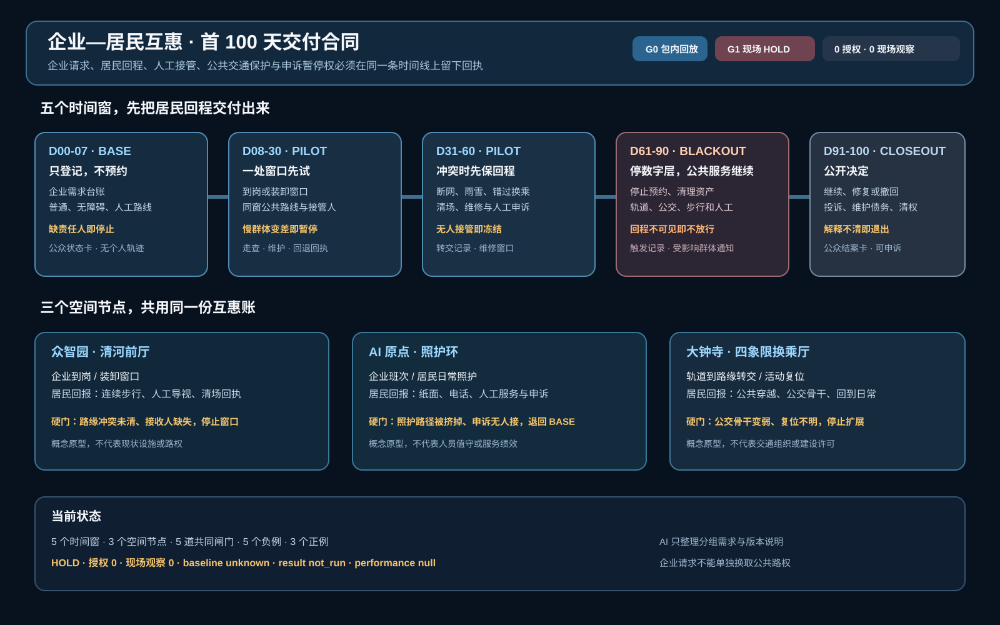
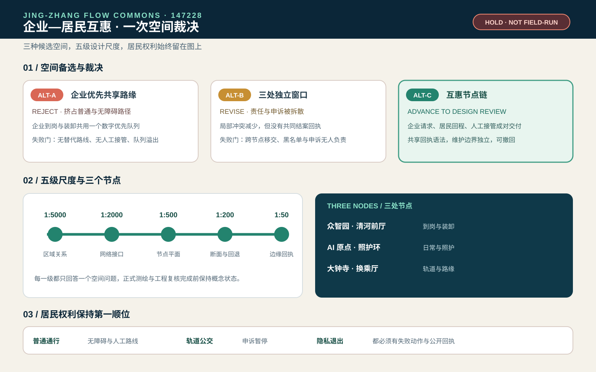
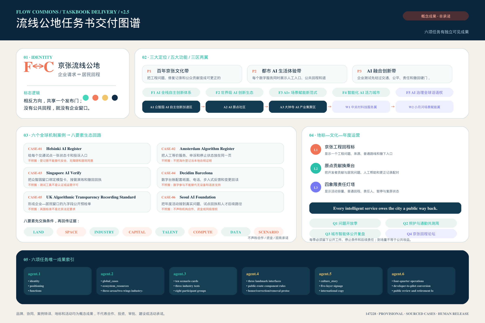
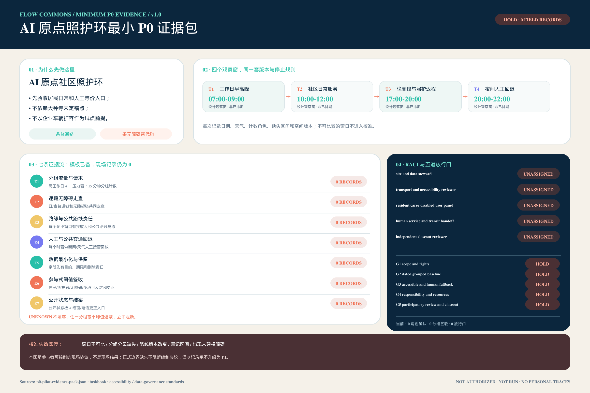

# 京张流线公地：企业—居民互惠通勤操作系统

> **一句话判断**：京张带下一步要把企业到岗与装卸、居民上学就医与回家、轨道换乘、路缘停车和维护投诉放进同一个可复算的交通操作系统，让每一项 AI 优化先证明没有挤掉最慢的人。

本方案是一份独立的新投稿包，第一名项目 `zhongzhiyuan-autonomy-commons` 不在本目录中修改。方案提出“**一张时段路缘账本、两侧需求台账、三类接驳、四项服务水平、五道验证门**”：企业侧登记到岗、班车、货运和充电需求；居民侧登记不含个人轨迹的日常服务需求；空间侧用地铁—公交—自行车—步行/无障碍—汽车的多方式接驳链和可逆路缘窗口消化峰值，同时把跨边界对外通勤纳入 OD；未来空中出行仅保留一个有审批前置条件的实验接口。全部空间仍属于概念设计，官方边界、路权、交通量、权属和现场体验到位后才能复算，不把开放数据筛查写成现状容量。

## 首屏评审入口：先看两边是不是同时兑现

本包把问题收窄到一件事：**企业得到一个到岗、接驳或路缘窗口时，居民具体得到什么，谁负责兑现，哪一种失败可以当场叫停。** `mobility-commons-jingzhang` 侧重方式与网络运营，`commute-co-benefit-jingzhang` 侧重需求、容量和失败政策；这里专门把互惠关系落到三处空间原型。企业侧节省不能单独发布，必须和居民日常到达、无障碍路线、人工等价入口、失败与撤回分母、最慢群体不变差以及申诉暂停权一起验收。

首屏把早高峰、午间路缘、雨雪与夜间返程、故障维护与退出四个冲突窗口接到同一套六项发布条件。当前只能报告 `G0 包内回放 PASS`：4/4 合成请求保留回退、6/6 检查和 5/5 回滚动作可重放；`G1 现场发布` 仍为 `HOLD`，因为现场路线审计、责任接受、锁定分母和运行授权都是 0。四个负例会在缺少居民回报、人工/公共交通等价路径、最慢群体保护或申诉暂停权时阻断发布 [data:visual/assets/enterprise-resident-reciprocity-contract.json] [data:visual/assets/enterprise-resident-reciprocity-readout.json] [data:visual/assets/run-enterprise-resident-reciprocity.js]。

## 一页执行摘要：先验收一条到站—到家链，再谈共享接驳扩展

普通人要在出门、换乘、受阻、求助和回家每一步都保有可理解的选择。第一个可逆试点只验收一条最小链：**选择公共/无障碍或人工路径 → 请求一项交通服务 → 在断网、雨雪、路缘冲突或错过衔接时触发人工/轨道公交接管 → 对不安全或不可达状态冻结预约并退出 → 由独立复核者回放证据后决定修复、扩展或撤回**。当前 M-09 只在本地、无网络、无个人数据的合成桌面演练中复演 4 条请求，`performance_results=null`、`operational_status=not_authorized_not_run`，不承担现实运营承诺。

| 步骤 | 普通人看到的空间/服务 | 必须留存的证据 | 失效即闭环的动作 |
| --- | --- | --- | --- |
| 1. 选择 | 站口导向、连续步行/轮椅路线、人工/电话/纸面入口与共享接驳候选并列展示 | 选择方式、服务窗口、无障碍需求类别和版本号；不留连续个人轨迹 | 数字入口不可用时保留人工等价路径；没有等价路径就不开放 |
| 2. 请求 | 公共交通换乘、班车/小巴候选、路缘装卸或社区日常服务台 | 请求 ID、服务对象分组、起止时间窗、责任人和替代路线 | 权属、责任人、容量或同意边界未知时只登记、不预约 |
| 3. 接管 | 错过衔接、断网、雨雪、无障碍受阻或路缘冲突后，现场人员指向轨道/公交或人工路线 | 触发事件、接管人、到达/转交时间、清场动作和投诉入口 | 冻结自动预约，优先人工/公共交通；无人可接管时停止服务 |
| 4. 退出 | 消息牌、人工窗口和纸面/电话申诉让人能改道、回家或取消 | 取消原因、替代路线、未解决项和 `not_authorized_not_run` 状态 | 消防、无障碍、隐私或安全硬门失败时不扩容、不写成达标 |
| 5. 复核 | 独立复核者回放一条到站—到家链，比较是否继续、修复或撤回 | 原始最小日志、分组结果、投诉关闭证据、版本和复核意见 | 证据缺失或最慢群体变差时回到 P0 调查与人工服务 |

这张表把设计图、路缘账本、M-09 回退桌演和 P0/P1/P2 分期接成同一个验收入口；4 条合成请求的 PASS 只证明状态机和回滚逻辑可重放，不证明真实客流、无障碍绩效、人员值守、公众接受或安全结果。

## 互惠交付证据：四项硬门

四套离线屏仍保留在 `visual/assets`，正文只留下会阻断空间发布的条件。评审先看能否交付，再看模型分数。

| 硬门 | 放行前必须看到 | 缺证据时的动作 |
| --- | --- | --- |
| 无障碍可用 | 有日期的逐段走查、可用替代路线、人工交接与责任确认 | 状态回到 `UNKNOWN`；不发布 `READY`，不扩展预约 [data:visual/assets/accessible-service-state-readout.json] |
| 责任移交 | 发起方、接收方、服务窗口、非 AI 等价服务、停止与恢复证据 | 接收方未确认，责任留在发起方，公共路线保持开放 [data:visual/assets/mobility-responsibility-transfer-readout.json] |
| 失败与申诉 | 受影响群体、原始记录、人工决定、替代服务、追加式纠错和申诉暂停权 | 先暂停发布；不能删除失败、撤回或未完成请求 [data:visual/assets/mobility-failure-governance-readout.json] |
| 公交骨干保护 | 公共交通客流指数、接驳份额、车公里比和最差群体可达性同时过门 | 任一项失败就封顶接驳，退回轨道、公交和人工服务 [data:visual/assets/mode-competition-guard-readout.json] |

当前四项都只通过包内结构回放，没有现场回执、运行授权或真实绩效。空中候选保持 0 个代理并排除在运营分母之外；论文只帮助定义问题，不提供海淀参数或许可 [source:SAV-VKT-TRANSIT-COMPETITION-2024]。

## 首 100 天交付合同，先把回程交付给居民

三处空间原型已经回答服务落在哪里，首 100 天合同继续回答谁先做什么、公众看到什么、哪一步必须停。`visual/assets/enterprise-resident-100day-contract.json` 将企业请求和居民回程放进 `BASE → PILOT → BLACKOUT → CLOSEOUT` 四个状态，并拆成五个时间窗。企业只能提交分组需求，不能凭一项需求换取公共路权；居民的普通、无障碍、轨道公交和人工路径必须先可见。

| 时间窗 | 企业交付 | 居民回程 | 放行证据 | 失效动作 |
| --- | --- | --- | --- | --- |
| D00-07 | 分组需求登记，不预约 | 普通、无障碍、人工路线卡 | 走查范围、接收人、申诉入口、公开状态卡 | 缺责任人或路线未知，停在 `BASE` |
| D08-30 | 一处到岗或装卸窗口 | 同窗公共路线和人工接管 | 有日期走查、维护人、回退回执、分组请求记录 | 最慢群体变差或容量分母未锁定，暂停 |
| D31-60 | 冲突时清场、维修并回读 | 纸面、电话、人工替代和申诉暂停 | 断网/雨雪回放、维修窗口、申诉回读 | 无人接管或路缘未清，冻结窗口 |
| D61-90 | 停预约、清资产、公开原因 | 轨道、公交、步行和人工回程 | 触发记录、人工路线回读、受影响群体通知 | 回程不可见，保持 `BLACKOUT` |
| D91-100 | 发布继续、修复或撤回决定 | 普通公共资产和可申诉结案 | 投诉处置、维护债务、清权记录、公众结案卡 | 理由不可解释或仍有未清权痕迹，退出 |

五道共同闸门贯穿三处节点。第一道要求普通服务先可用，第二道要求每项企业请求都有居民回程和维护责任人，第三道把轨道、公交、步行和无障碍路线留在验收分母，第四道要求数字层或接驳层可以停而公共服务继续，第五道要求投诉、维修债务、撤回和清权结果对公众可读。当前合同只完成包内合成回放，授权、现场观察、本地基线和绩效结果仍为 0、0、`unknown` 和空值；`run-enterprise-resident-100day-contract.js` 与正负例测试是离线边界检查，不是现场验收。

## 设计依据与资料清单

征集任务要求覆盖三层空间研究、三处重点区、AI+交通与产业生态，并交付可检查的图层、指标、图纸和视觉页 [source:OFFICIAL-ANNOUNCEMENT] [source:AGENT-TASKBOOK]。

本包沿用公开任务书的 provisional 工作底盘，但以交通运营为主题重做路网属性、指标、来源、图件和实施门槛；`geometry/site_boundary.geojson`、`geometry/key_areas.geojson` 都明确 `official_boundary=false`、`geometry_role=provisional_constraint`，不得解释为法定红线 [data:geometry/site_boundary.geojson#SITE-001] [data:geometry/key_areas.geojson#PROV-KEY-001]。

边界与包内证据的使用边界见 [source:SITE-PACKAGE] [source:BOUNDARY-SOURCE] [source:KEY-AREA-SOURCE]。

北京“十四五”交通规划将一小时门到门、轨道/公交/步行/自行车一体化、公交优先和智慧交通列为方向 [source:BEIJING-14TH-TRANSPORT-PLAN]。海淀区 2026—2027 年道路停车管理服务招标则把停车秩序、引导巡查、设备检查、异常处置、后台和“接诉即办”放进同一项服务，路缘因此需要责任主体和服务水平来管理 [source:HAIDIAN-ROAD-PARKING-TENDER-2026]。

海淀西北旺规划交通材料还要求轨道站点/交通枢纽、首层公共界面、换乘自行车停放、应急疏散和交通影响评价共同校核 [source:BEIJING-HAIDIAN-TRANSIT-HUB-PDF]。这些材料是政策和招标证据，不是本 provisional 范围的现状数据。

资料等级分为四类：`known` 是文件可回读的几何数值；`unknown` 是必须调查而不能猜的企业、居民、停车、换乘和投诉基线；`design_target` 是可逆试点的验收门槛；`blocked` 是没有权属、路权、责任人、无障碍等价服务或安全回退时不得扩容的状态。企业通勤研究支持班车、公共交通补贴、弹性工时和保证回家等需求管理工具，但也提醒 rideshare 和补贴的效果取决于工作密度、制度和分组行为 [source:EMPLOYER-TDM-LONGITUDINAL] [source:EMPLOYER-TDM-GUIDE] [source:WORKPLACE-CHARGING-GAP-2025]；不把论文中的效果百分比迁移成海淀结果。

## 三层范围工作框架

三层结构把“企业为什么要改”和“居民如何真正受益”接到同一条证据链上 [depth:three_level_scope_framework] [standard:PROJECT-OFFICIAL-ANNOUNCEMENT]。

1. **统筹层**：研究京张—海淀的轨道、公交、校园、园区、社区和生活服务如何形成多方式接驳；识别企业时间窗、居民时间窗和公共空间之间的冲突，不新增一条未经交通论证的道路。
2. **总体层**：用 `land_use`、`buildings`、`roads`、`green_space`、`public_space`、`constraints` 和 `phasing` 共同定义到站、到岗、到家和服务维护的空间关系；用时段状态而不是永久占用表达路缘。
3. **重点区层**：在众智园、AI 原点社区、大钟寺 AI 产业聚集区各做一组可逆试点，分别验证企业到岗、居民日常和轨道/路缘换乘。

三层共享同一 provisional 约 11.41 km² 工作范围，面积只作为设计比较值 [metric:site_area_sqm]。正式边界发布后，应锁定 revision，重算所有图层、路线、分区、图纸和指标；不得只替换一张效果图。

## 统筹研究范围产业与未来城市研究

### 企业侧：把“通勤”从人力成本变成可治理的服务

企业不再各自发班车、各自占用路缘，而是在不上传个人轨迹的前提下，按日/周提交聚合需求台账：班次窗口、员工总量区间、园区入口、货运/装卸窗口、访客峰值、夜班和应急需求。企业交通专员只看分组后的需求矩阵，平台输出公共交通接驳、拼车/班车、骑行停车、共享接驳和保证回家服务的组合建议。企业必须为使用的路缘窗口、人工引导、设备维护和投诉闭环承担成本与责任，不能把拥堵外包给社区。

### 居民侧：把“到达权”作为不可稀释的公共服务

居民台账只记录匿名化的服务类型和时间段，例如上学、就医、买菜、照护、夜班回家、轮椅通行和快递取件；不采集连续家庭轨迹。任何 AI 推荐都必须保留线下、电话、纸面或人工等价路径。居民不需要加入企业平台才能使用人行路、公共交通、无障碍路线或服务台。分组结果应按年龄、行动能力、照护负担、夜间出行和是否园区员工分别回读，不能只看全体平均值 [source:BEIJING-ACCESSIBILITY-REGULATION] [source:SHARED-MOBILITY-OECD]。

### 未来城市：受控的接驳，而不是无限增加车辆

自动驾驶或按需小巴只在获批、低速、有人值守的首末端场景作为 feeder；研究显示共享自动驾驶既可能补充也可能挤压公共交通，若不管理供给，车辆公里数可能上升 [source:SAV-TRANSIT-COMPETITION] [source:SAV-MICROTRANSIT]。本方案因此把轨道和公交作为骨架，把按需服务设为有容量、时窗和退出条件的补充，并以现场交通影响评价、公共交通客流和居民体验决定是否继续。

## 总体设计范围城市更新与控规深度城市设计

### 总体结构：一条共行环、三类接驳、四项服务水平

“共行环”把既有轨道/公交站点、企业入口、社区服务点、公园慢行和公共停车/装卸节点串成可辨认的转乘链，不新增封闭环路。三类接驳为：

- **骨干接驳**：轨道与公交之间的稳定换乘，优先解决站口、过街、候车和自行车停放的连续性；
- **共享接驳**：企业合并需求后的定时班车、微循环小巴或共享出行，必须服务于骨干而不是与骨干抢客；
- **人本接驳**：无障碍步行、轮椅/照护者、儿童和夜班人工服务，任何数字服务失败都退回这条链。

### 五种地面方式与一个条件空中实验

“共行环”按方式分层，不把所有出行压成一条线：**地铁/轨道**承担跨区骨干和对外通勤的长距离段，**公交**补充站点覆盖和夜间/换乘弹性，**自行车**承担站点—园区/社区的首末端，**步行与轮椅**是所有方式的公共通行基础，**汽车**只在必要出行、停车、装卸、充电、接送和应急路径中被管理。企业班车、按需小巴和共享接驳必须先接入轨道/公交，不以新增车辆替代公共方式 [source:BEIJING-14TH-TRANSPORT-PLAN]。

未来空中出行只建立 `air-mobility-candidate` 关系节点：在没有空域、航路、适航、运行人、保险、气象、消防、噪声、应急和公众参与的书面复核前，不画可运营航线、不承诺起降场、不把论文方法写成许可。若未来进入实验，必须从地面换乘、步行/无障碍疏散和数据记录开始，并设置可撤回、低频、有人值守和天气取消条件 [source:BEIJING-LOW-AIR-ECONOMY-2024] [source:CAAC-UAV-REGULATION-2024]。

四项服务水平是：**到达连续**（人行/无障碍路线不被路缘打断）、**换乘可靠**（等待和衔接在可接受窗口内）、**路缘有序**（预约/装卸/停车按时间窗清场）、**申诉可闭环**（责任人、状态、限时和复核可见）。路缘管理研究指出，配送、网约车、共享出行和公共活动对同一空间的需求会冲突，公共部门与企业必须共同安排时间、责任和数据边界 [source:CURBSPACE-MANAGEMENT-2021]。

### 空间更新：先可逆，再固定

现阶段不提出新建桥隧、道路拓宽、停车供应量、建筑高度、容积率或投资额。先用标线/可移动设施、站口导向、遮雨座椅、连续坡道、自行车停放、企业班车候车位和路缘电子/纸面状态牌做 P0/P1 试点。只有当现场测绘、交通模型、消防、市政管线、产权、环境和公众参与均有书面证据，才进入固定工程。

用地和建筑关系回接至 `geometry/land_use.geojson`、`geometry/buildings.geojson`，所有面积属于概念量 [data:geometry/land_use.geojson#LU-001] [data:geometry/buildings.geojson#BUILD-001]。

设计深度与强度边界分别回接 [depth:land_use_layout] [depth:development_intensity_controls]。

## 重点区域详细设计：三种空间原型

三处重点区不再套用同一张运营表。它们分别处理河岸—园区前厅、社区照护环和站点四象限穿越，企业请求与居民回报在平面和断面上成对出现。三处几何仍为 provisional，图示是概念原型，不是实测现状或工程线位 [metric:key_area_count] [data:geometry/key_areas.geojson#PROV-KEY-001] [depth:three_key_area_detailed_design]。

### 众智园：清河前厅

河岸步行与雨水花园构成全天开放的公共边，研发庭院、共享前厅和园区入口从这条边后退。高峰班车与午间装卸使用两段定时路缘，骑行和步行连续穿过。企业得到可合并的到岗与装卸窗口；居民得到不断的河岸路径和按时归还的路缘。入口、权属、断面、峰值流量或清场责任缺一项，试点只登记、不预约 [source:HAIDIAN-ROAD-PARKING-TENDER-2026]。

### AI 原点：照护环

连续步行与轮椅环串起轨道/公交接口、社区服务台、安静休息点和人工前厅。电话、纸面与现场服务和数字入口并列，园区访客预约不能占用社区日常路线。逐段走查、夜间照明、值守、替代路线和申诉入口未齐时，状态保持 `UNKNOWN`；必须使用 App 或照护链断裂时立即停止。

### 大钟寺：四象限换乘厅

该原型依据公告中的“大钟寺站路口四象限步行连通”任务，组织站口步行、骑行停放、活动等候、公共交通与限时装卸；它不按当前 `PROV-KEY-003` 坐标落位。Issue #1029 已确认，临时多边形的面积和南北排序可复现，但质心约在北京北站一带，距大钟寺站约 2.26 km。本包不自行平移源几何，也不把概念图写成站点现状。正式锚点、四象限断面、流量、权属和疏散责任到位后，才统一重算图层、指标、图件、A3/A0、双语 HTML、manifest 与 self-check [source:ISSUE-1029] [data:geometry/key_areas.geojson#PROV-KEY-003] [assumption:A-KEY003-POSITION-001]。

### 模型留在后台

三处重点区 × 四个时段仍保留 12 个模型到人工决定单元，用来登记骨干方式、补证要求和停止条件。`conditional_review` 只表示可以准备现场复核，`hold` 表示锚点、权属、责任、容量、无障碍或夜间安全证据尚未齐全。合成护栏不能授权施工、运营、评分或上榜；现场交通计数、分组 OD、无障碍走查、路缘清场回执、末班车回退和公众意见才是释放条件 [data:visual/assets/spatial-mobility-atlas-readout.json] [data:visual/assets/run-spatial-mobility-atlas.js]。

## 一次空间裁决，先把居民回程留在图上

三处原型还需要一个可比较的设计决定。`enterprise-spatial-decision.json` 对同一组企业请求、居民回程和维护条件生成三个备选。ALT-A 把优先级交给企业共享路缘，直接失去普通与无障碍路径，予以 REJECT。ALT-B 把窗口拆到三处，局部冲突下降，但申诉、停运和结案责任被拆散，予以 REVISE。ALT-C 保留三处节点的差异，同时使用同一套居民回程、人工接管、轨道公交保护和公开结案规则，进入设计复核。三种状态属于设计备选，不代表现场采纳。

图件把裁决继续压到五级尺度。1:5000 只回答区域关系，1:2000 回答网络接口，1:500 回答节点平面，1:200 回答路缘与回退断面，1:50 回答边缘回执和可拆接口。每一级只承担一个问题，正式测绘、权属、交通、消防、无障碍和工程条件未齐以前，数值保持概念状态 [data:visual/assets/enterprise-spatial-decision.json] [data:visual/assets/run-enterprise-spatial-decision.js] [depth:three_key_area_detailed_design]。

ALT-C 的五项居民权利与每个企业窗口一起验收。普通通行保留步行和公共交通，无障碍通行保留连续路线与人工帮助，轨道公交保留在分母内，申诉暂停保留纸面、电话和人工入口，隐私退出要求没有连续个人轨迹并清除未登记记录。任何一项没有责任人、替代路径、停止动作和公开回执，状态维持 `HOLD` [data:visual/assets/enterprise-spatial-decision.json]。

## 任务书交付图谱：让交通专题重新成为完整的一带方案

“京张流线公地 / Jing-Zhang Flow Commons”不只是一套交通算法。它的视觉标志 `F↔C` 由两条相反方向、共享一个发布门的线组成：企业请求必须在同一处遇到居民回程。标志只使用自绘几何和系统字体，不与政府、企业或既有商标组合；青绿代表普通与无障碍公共路线，珊瑚代表企业请求，金色代表人工复核与暂停，深蓝代表证据、责任和版本 [data:visual/assets/enterprise-taskbook-delivery.json] [standard:PROJECT-AGENT-OPEN-CALL-TASKBOOK]。

三大定位和五大功能被翻译成一条可检查的“去—回”循环。百年京张文化带留下工程问题、修复与公众贡献的可更正档案；都市 AI 生活体验带要求每项数字服务并列展示人工入口、公共回程和退出；AI 融合创新带要求企业试验先过交通、公平、责任和撤回硬门。众智园承担封闭测试与人工接管，AI 原点社区承担照护、无障碍和开源反馈，大钟寺承担换乘、活动降容和责任结案；中关村科技服务翼提供资金、人才、算力、数据与专业服务的条件接口，小月河场景赋能翼负责公共空间、慢行、蓝绿和居民体验回读。所有关系都是概念协同，不声称机构合作、土地安排、资金或招商承诺 [source:AGENT-TASKBOOK] [data:visual/assets/enterprise-taskbook-delivery.json]。

### 六个案例只迁移机制，不迁移结论

六个公开案例分别补足“登记—测试—参与—解释—运营”的方法链：Helsinki AI Register 和 Amsterdam Algorithm Register 启发公开用途、责任、人工等价服务与反馈入口；Singapore AI Verify 启发众智园的模型卡、接管演练和撤回回执；Decidim 启发数字台账与纸面、电话、步入式参与并行 [source:CASE-HELSINKI-AI-REGISTER] [source:CASE-AMSTERDAM-ALGORITHM-REGISTER] [source:CASE-SINGAPORE-AI-VERIFY]。

UK Algorithmic Transparency Recording Standard 启发企业—居民窗口的九字段公开预检，Seoul AI Foundation 的公开案例只用于比较“研究—公共服务—人才—全球协作”如何接入年度问题闭环。上述案例都不等于北京法定要求、产品认证、合作关系或本地绩效；每个案例在结构化图谱中都列出“不照搬”边界 [source:CASE-DECIDIM-BARCELONA] [source:CASE-UK-ATRS] [source:CASE-SEOUL-AI-FOUNDATION]。

案例机制进入土地、空间、产业、资金、人才、算力、数据、场景八要素回路：资源只有在来源、责任、公共回程、退出和复核条件齐全时才进入试点；试点结束后必须回传失败、申诉、维护和撤回证据，而不是只回传招商或流量数字 [data:visual/assets/enterprise-taskbook-delivery.json]。

### 三个地标是一组公共责任界面

1. **京张工程回程标**位于京张遗址公园概念公共界面，展示一个工程问题、来源、普通路线和撤下入口；没有版权与文保复核，不展示历史图像或实体改造。
2. **原点贡献换乘台**位于 AI 原点社区照护环，把开发者贡献与居民问题、人工帮助和更正记录配对；贡献可更正或撤回，不保存连续个人行为。
3. **四象限责任灯塔**位于大钟寺站任务锚点的概念界面，显示活动容量、普通回程、责任人、暂停与复原；正式锚点、权属、消防和四象限连续路线未确认前不落位。

文化叙事不是“铁路外观 + AI 灯光”，而是“可验证的京张工程问题—中关村开放试错—AI 时代可申诉、可撤回的公共服务”。导视分为历史问题、当前公共路线、试验状态、人工帮助、更正/撤下五层，并使用一句国际传播文案：**Every intelligent service owes the city a public way back.** 这套叙事只使用自写文字、系统字体和抽象图形，不冒用历史图片、人物、商标或机构标识 [data:visual/assets/enterprise-taskbook-delivery.json]。

### 四季活动必须留下工件和后续责任

年度循环不是活动排期承诺。Q1“问题开放季”发布来源、权利边界和待解问题；Q2“照护与通勤共测周”形成逐段走查、分组计数和修复工单；Q3“城市智能体公开复盘”公开模型卡、失败、申诉、更正和退役；Q4“京张回程论坛”比较跨区域案例、年度证据账和下一年问题。每季都必须有停止条件、公开工件和有责任人的人才/场景后续路径；到场量、媒体量和模型分数不能替代公共收益与问题结案 [data:visual/assets/enterprise-taskbook-delivery.json]。

| 任务 | 本包独立可见成果 | 放行前验收 |
| --- | --- | --- |
| agent.1 | 中英文命名、`F↔C` 标志、三定位五功能、三区两翼回路 | 标志不冒用品牌；五个空间角色可单独复核 |
| agent.2 | 六案例机制表、八要素生态回路、产业—空间接口 | 每个案例有公开来源与“不照搬”边界 |
| agent.3 | 10 场景卡、3 产业测试、8 类参与者、场景—空间—运营合同 | 每个场景有人工等价服务和停止条件 |
| agent.4 | 3 个责任地标、公共路线组件规则、荣誉/更正/撤下协议 | 无账户可读，不阻断无障碍与消防，不越过文保权属 |
| agent.5 | 去—回文化叙事、五层导视、国际文案与清权边界 | 来源、状态、人工帮助和撤下入口同时可见 |
| agent.6 | 四季循环、开发者转试点、公开复盘和退役机制 | 每季留下工件、责任、停止与继续/退出决定 |

## AI 创新生态、人才画像与 AI+ 场景

### 六类参与者与三项产业测试

参与者包括园区企业交通专员、居民/照护者、轮椅和助行器使用者、轨道公交运营者、物流/维护人员、学校与社区服务人员、夜班员工以及交通/隐私/消防专业人员。AI 的作用是聚合需求、发现冲突、解释方案和生成回退清单；它没有权力把公共路线永久锁定。

1. **MOB-T01 企业需求合并测试**：企业只提交分组时段和人数区间，系统比较班车、公共交通、骑行和步行组合；回读企业多方式出行比例、站口拥挤、路缘占用和居民投诉。没有同意和分组阈值时，状态为 `blocked`。
2. **MOB-T02 居民等价到达测试**：对同一条上学/就医/买菜/夜班回家链，同时提供 AI 推荐、人工窗口、电话和纸面方案；按行动能力和照护负担分组回读完成率、等待和拒绝率 [source:BEIJING-ACCESSIBILITY-REGULATION]。
3. **MOB-T03 路缘与断网回退测试**：在工作日高峰、活动日、雨雪和通信中断场景下，检验预约装卸清场、人工引导、轨道接驳和公共服务恢复。若没有人能接手，任何自动化接驳都不能扩容 [source:SAV-MICROTRANSIT]。

### 十张场景卡

`M-01` 企业合并班车；`M-02` 员工公共交通补贴；`M-03` 夜班保证回家；`M-04` 园区装卸预约；`M-05` 居民就医人工接驳；`M-06` 轮椅等价路线；`M-07` 轨道站最后 500 米；`M-08` 活动日人车分流；`M-09` 雨雪/断网服务降级；`M-10` 投诉—维修—复核闭环。每张卡必须绑定空间、责任人、输入数据、最小化规则、服务水平和停止条件；场景数量是设计清单，不是已发生的运营量 [source:EMPLOYER-TDM-GUIDE] [standard:PROJECT-AGENT-OPEN-CALL-TASKBOOK]。

## 用地、建筑规模与拆改留方案

交通优化首先消化既有城市结构，不以“未来通勤”掩盖开发强度。当前 `buildings` 图层只表达概念建筑足迹，建筑足迹约占 provisional 工作范围的 2.72%，该比例不是法定建筑密度 [metric:building_footprint_area_sqm] [metric:building_footprint_ratio]。AI 企业、社区服务、商业服务和公园绿地按既有图层做关系表达，不提出新增容积率或建筑高度承诺。

保留—更新—拆除的顺序为：保留既有公共服务、轨道站口、消防通道、连续人行空间和成熟树荫；可逆更新首层入口、候车、骑行停放、无障碍坡道、路缘信息牌和企业交通台；只有现场结构、权属、消防和交通评估共同证明必要时，才讨论小规模拆改。任何停车/装卸设施应先核对道路停车管理责任、设备巡检、异常处置和投诉闭环 [source:HAIDIAN-ROAD-PARKING-TENDER-2026] [depth:retain_renovate_demolish]。

## 交通、轨道、市政与公共服务设施

这是本方案的核心。现有概念网络包含一条南北关系线约 9.60 km、三条东西连接线，合计慢行关系线约 13.01 km；它们是网络设计长度，不是工程道路中心线，也不表示当前连续可走 [metric:design_north_south_spine_length_m] [metric:design_east_west_connector_count] [metric:design_slow_mobility_network_length_m]。正式交通深化必须对每条线逐段补：断面、信号配时、站口、过街、坡度、盲道、照明、树荫、停车/装卸、消防、排水、管线、产权和维护单位。

### 一张时段路缘账本

路缘单元采用 `open` 公共通行、`booked` 企业班车/接送、`service` 维护/装卸、`human-only` 无障碍与人工优先、`emergency` 应急五种状态。每次变更至少写入责任人、起止时间、服务对象、清场动作、替代路线和投诉入口。默认时间窗只是试验参数：早高峰、午间配送、放学/下班、夜间维护需先做人工计数与居民参与，再决定分钟级分配。企业获得的是可审计的短时服务，不是永久路权；居民获得的是不被预约切断的连续公共路线。

### 两侧需求台账与四项服务水平

企业侧按匿名分组提交人数区间、入口、班次、货运和充电需求；居民侧按服务类型提交时段、无障碍、照护和夜间需求。系统只输出聚合矩阵和冲突热区，原始记录应有目的限定、保留周期、删除责任和公开的算法说明 [source:CURBSPACE-MANAGEMENT-2021] [source:NIST-HUMAN-CENTERED-AI]。

数据采集和骑行—公交公平比较另有方法边界 [source:MOBILITY-DATA-METHOD] [source:BIKE-TRANSIT-EFFICIENCY-EQUITY]。四项服务水平对应可测指标：到达连续看 `accessible_route_completion_ratio`；换乘可靠看 `first_last_mile_transfer_reliability`；路缘有序看 `curb_time_window_compliance_ratio` 与 `peak_curb_conflict_rate`；申诉闭环看 `mobility_service_complaint_closure_hours`。当前全部是 `unknown` 或 `design_target`，不写成已达标。

### 人员动线与综合模拟：先守硬门，再追整体效率

综合模拟把**人**放在网络中心：企业员工、居民、照护者、儿童、轮椅使用者、访客、物流/维护人员、夜班人员和应急响应者分别建 OD 与时间窗；不上传个人连续轨迹，采用分组需求、匿名计数和可回读版本。对外通勤不被截断在 provisional 边界内，P0 必须记录跨边界起讫、进出方向、地铁/公交/自行车/汽车/步行/班车方式、停车换乘和跨线衔接，形成 `external_commute_od_baseline` 与 `external_commute_generalized_cost_index` 的调查底稿。

仿真场景至少覆盖工作日早晚高峰、平峰、活动日、雨雪/高温、地铁或公交中断、道路/停车故障，以及未来空中实验的“仅地面接驳”和“天气取消”对照。地铁/公交输入班次、站口容量、候车与换乘缓冲；自行车输入停放、借还和人车冲突；汽车输入路口排队、停车、装卸、充电和应急净空；步行/轮椅输入断面、过街、坡度、照护停留和无障碍绕行。SUMO 可作为开放的多方式仿真底座，但本地信号、站点容量、自行车行为和人员动线必须用现场计数校准，不能直接把软件输出当成海淀绩效；参考公开的 activity/agent-based 多方式建模方法，正式校准还要同时回读方式份额、道路/路缘流量、门到门时间、距离和分组可达性 [source:SUMO-MULTIMODAL-DOCS] [source:ATOM-MULTIMODAL-ABM] [source:ACCESS-ACCESSIBILITY-ABM]。

优化采用“硬门优先、帕累托比较”：消防/应急、无障碍连续、安全、公共交通不被挤占、隐私和人工服务先判定；通过后再同时降低广义出行成本（步行、等待、车内、换乘、停车排队）、人员动线冲突、汽车行驶量与能耗，并观察最慢群体差距、对外通勤可靠性和 `mode_transfer_reliability`。输出是一组可解释的候选方案和 `multimodal_system_efficiency_index`，不是一个未经校准的“整体效率第一”结论 [metric:person_flow_conflict_rate] [metric:multimodal_system_efficiency_index]。

### 轨道、停车与市政接口

轨道/公交是骨干，企业班车和按需小巴只能把人送到骨干换乘；停车与装卸是受时间窗管理的服务，不以扩充车位解决全部需求；市政接口要把雨雪、积水、照明、充电、信息牌、排水和维修纳入同一资产清单。西北旺交通规划材料对枢纽、首层、换乘停车、应急疏散和交通影响评价的要求，正好构成本方案进入工程阶段前的检查表 [source:BEIJING-HAIDIAN-TRANSIT-HUB-PDF]。慢行系统工程和道路交通导改也应按正式项目流程另行论证 [source:HAIDIAN-SLOW-MOBILITY-TENDER-2022]。

空中出行实验若有机会，只能作为地面系统的受控附加层：先证明地铁/公交接驳、步行/轮椅路径、消防疏散、噪声与社区安静界面不被破坏，再审空域和运行许可；`air_ground_transfer_reliability`、吞吐、取消率、气象窗口、噪声、应急响应和保险责任目前均为 `unknown`。北京低空经济行动计划与民航规则构成前置门槛 [source:BEIJING-LOW-AIR-ECONOMY-2024] [source:CAAC-UAV-REGULATION-2024]。

多方式接驳研究只提供方法启发 [source:UAM-BEIJING-MULTIMODAL-2024] [source:UAM-PUBLIC-TRANSIT-2023]，都不等于本项目获得飞行或建设许可。

### 设计场景综合模拟（透明沙盘，不是现状）

在现场 OD、站点容量、信号、人员动线和路缘计数到位前，先用 `visual/assets/movement-simulation.json` 做 1000 人归一化设计单位的可解释对比，并可用 `node visual/assets/run-mobility-simulation.js` 离线复核方式份额、服务供给和队列：S0 无协同高峰、S1 多方式与路缘协同、S2 受监管闸门阻断的空中候选、S3 极端天气地面回退。S1 只是在建议硬门筛查后暂选的设计候选；广义成本、换乘可靠性、人员冲突、汽车外来流入、最差群体差距和能耗都是示范输入，不是海淀现状。图件把“先过硬门、再做帕累托比较、最后用现场数据替换”的决策链公开 [metric:multimodal_system_efficiency_index] [metric:person_flow_conflict_rate] [standard:SUMO-MULTIMODAL-SIMULATION]。

模型对象也被显式拆开：1000 人设计单位包含居民 380、企业员工 450、照护者/儿童 60、访客 50、物流维护 40、夜班人员 20；网络侧把地铁列车（180 人/车、10 分钟间隔）、公交车辆（60 人/车、12 分钟间隔）、自行车停车、汽车路缘服务、步行/轮椅连续流和受阻断的空中候选分别作为服务对象。五条 `trip_leg_templates` 把对外企业通勤、居民日常服务、企业班车换乘、物流装卸和空中候选的地面回退写成可检查的人员动线。模型以 60 秒步长记录位置、方式、队列、车辆占用、换乘、路缘状态、冲突和无障碍标志，再输出各方式峰值排队、站点/车辆负荷、换乘等待、汽车路缘排队和最差群体差距；`model_analysis.derived_readouts` 里的数值是声明过输入后的合成敏感性分析，不是现场观测。评审可离线运行 [source:SUMO-MULTIMODAL-SIMULATION] [source:BEIJING-WALK-CYCLE-DB11-1761] [source:MULTIMODAL-TRAFFIC-REALITY-2025] `node visual/assets/run-mobility-simulation.js`。

人员动线与无障碍方法另有参考 [source:ATOM-MULTIMODAL-ABM] [source:ACCESS-ACCESSIBILITY-ABM]；运行器重算方式份额、服务供给、队列和校准字段，不联网、不生成本地现状 [metric:mode_transfer_reliability]。

在这套归一化沙盘中，未协同高峰的汽车路缘峰值排队为 86 辆、站口闸机负荷为 1.05；多方式路缘协同候选为 0 辆和 0.88；极端天气地面回退为 47 辆和 0.96。它说明优先校准站口闸机、公交站容量、路缘服务和无障碍过街，而不是把“模型分数”直接当成建设结论。现场补齐有日期的跨边界 OD、班次、断面、停车、冲突和消防审查后，才允许替换设计输入并重新运行。

## 蓝绿空间、公共空间与城市风貌

蓝绿为连续到达链提供遮阴、停歇、雨天回退和夜间安全界面。当前绿地比例约 12.34%，公共空间比例约 7.33%，由概念图层计算，不能推出生态、热舒适或排水绩效 [metric:green_ratio] [metric:public_space_ratio]。更新时优先让公共服务台、站口、候车、慢行和蓝绿边界共享遮雨、座椅、照明、饮水和无障碍信息；不得用树池、花箱或活动设施堵住轮椅转弯和消防。

蓝绿策略设置三条硬边界：雨天不把积水路径当接驳路线；热浪时提供人工服务和可休息的替代路径；暗夜和生态敏感时段降低不必要的灯光与设备活动。北京步行骑行标准、无障碍法规和海淀慢行工程提供连续性、设施和维护的政策依据 [standard:BEIJING-WALK-CYCLE-DB11-1761] [standard:BEIJING-ACCESSIBILITY-REGULATION] [source:BEIJING-SLOW-MOBILITY]。没有现场遮阴、热舒适、水风险、生态和照明数据时，相关指标保持 `unknown`。

## 更新项目清单、实施政策与分期计划

### 实施—运营合同（概念接口，非实施承诺）

为让“有分期”可以被复核，每一阶段同时写明参与主体、验收指标、人工回退和停止/撤回规则。P0 由场地与数据责任角色、交通/无障碍专业复核角色、社区联络角色共同完成盘点和授权登记；P1 由企业交通专员角色、居民/照护者观察席、轨道/公交运营角色、现场维护角色和独立安全/隐私复核角色共同值守，按无障碍路线完成率、首末端换乘可靠性、路缘时窗遵守率和投诉响应记录验收；P2 只有在交通影响、安全、无障碍、隐私、保险、采购和维护证据齐全后，才由专业责任方判断是否条件扩展。任一指标仍为 `unknown`、参与者同意或责任边界缺失、硬门失败或投诉无法闭环时，自动回到人工/公共交通/电话纸面入口，冻结预约并撤回可移动设施。这里的角色是待确认的责任接口，不是已确定机构、合同、资金或许可 [depth:phasing_implementation]。

### 最小 P0 证据包：先验收 AI 原点照护环

首个 P0 不从交通量最大或企业需求最强的节点开始，而从 **AI 原点社区照护环**开始：它能先验收居民日常、无障碍替代和人工入口，不依赖仍待组织方确认的大钟寺站点锚点，也不要求企业车辆先扩容。范围只包含一条普通步行链、一条无障碍替代链、一个人工服务台候选和一个轨道/公交交接点；正式路线、断面和服务台位置由有资质的现场团队与使用者共同确认 [data:visual/assets/p0-pilot-evidence-pack.json] [assumption:A-ACCESSIBILITY-001] [assumption:A-OPERATIONS-001]。

| 证据流 | 参与者可控制的最小交付 | 不能放行的情况 |
| --- | --- | --- |
| E1 分组流量与请求 | 两个可比工作日加一个压力/活动窗；15 分钟、方向、方式和服务目的分组计数，不留设备 ID 或连续轨迹 | 日期、天气、计数角色、分组分母或缺失区间不清 |
| E2 逐段无障碍走查 | 普通链和无障碍链在日/夜共同走查；记录断面、坡度、过街、障碍、替代路线和使用者意见 | 任一段仍是 `UNKNOWN`、替代路线不可用或参与者不安全 |
| E3 路缘与公共路线责任 | 每个企业窗口都有发起角色、接收角色、清场动作、消防/无障碍路线和复原回执 | 接收方未确认、公共路线不能恢复或资源分母未锁定 |
| E4 人工与公交回退 | 每个时窗完成一次断网/雨雪/错过衔接的人工、电话、纸面与轨道公交接管回放 | 无人接管、末班车回退不可见或必须使用 App |
| E5 数据最小化 | 每个字段先写目的、访问角色、保留期限、删除责任和公开算法说明 | 不必要个人标识、无法删除或用途扩张 |
| E6 参与式阈值签收 | 居民、照护者、无障碍使用者和夜班人员可反对、要求更正并回读响应 | 平均值遮蔽某组变差、被迫绕行/拒绝/等待未入账 |
| E7 公开状态与结案 | 无账户可读的状态板，另有纸面/电话更正入口；公开责任、替代、维修债务和下次复核 | 申诉或维修债务未清、撤回后仍留权属痕迹 |

校准协议明确“合成参数如何失效”：观察窗不可比、分组分母缺失、路线/站点版本变化、漏记超过一个区间、现场出现模型外方式/队列，或受影响群体报告未建模障碍时，本轮模型不进入 P1。当前七套模板已备，但现场记录、角色确认、分组签收、校准参数和放行门通过数都是 0；状态保持 `HOLD`、`not_authorized_not_run`，不能把一张完整协议图写成已完成现场试点 [data:visual/assets/p0-pilot-evidence-pack.json]。

为避免“有回退”停留在口号，本包把既有 `M-09 雨雪/断网服务降级` 收敛为一个最小离线桌面演练，而不是新增一个已运行场景。`visual/assets/mobility-tabletop-contract.json` 固定四条合成服务请求、四个触发事件和五个回滚动作；`node visual/assets/run-mobility-tabletop.js --check` 可在无网络、无个人数据、无外部系统和仅内存状态下复演 6 项检查，输出 `mobility-tabletop-evidence.json`。本地演练的结果是 4/4 请求保留人工/公共交通回退、预约冻结、6/6 检查通过、5/5 回滚步骤复演；它只证明状态、停止和回滚逻辑可复核，不证明真实人员值守、无障碍绩效、公众接受、服务可用性或安全。`performance_results=null`、`operational_status=not_authorized_not_run`，因此不会把合成 PASS 推进为 P1/P2 或现实实施 [data:visual/assets/mobility-tabletop-contract.json] [data:visual/assets/mobility-tabletop-evidence.json] [data:visual/assets/run-mobility-tabletop.js]。

| 阶段 | 工作包 | 交付与验收 | 停止条件 |
| --- | --- | --- | --- |
| P0 读懂路缘 | 现场盘点、站口/过街/无障碍审计、企业和居民聚合台账、责任人登记 | 形成路缘资产表、路线障碍清单、隐私/申诉规则和基线版本号 | 权属、路权或人工等价服务不清，停在调查 |
| P1 合并需求 | 两个企业时窗、一个社区日常链、一个轨道换乘链的可逆试点 | 公开聚合的等待、完成、冲突、清场、投诉与维修记录 | 任一人群完成率明显下降、消防/无障碍受阻或投诉未闭环，回到人工 |
| P2 条件扩展 | 仅在批准范围内扩展共享接驳/按需小巴，更新工程和采购任务书 | 交通影响评价、安全/隐私/无障碍/生态复核、运营 SLA 与资金责任齐全 | 缺一项就不扩容，不用模型分数替代实测 |

实施政策采用“登记—小试—复核—扩展/停止”循环。停车招标对巡查、设备和接诉即办的要求被转译为每个交通资产必须有 ID、状态、责任人、响应时间和关闭证据 [source:HAIDIAN-ROAD-PARKING-TENDER-2026] [depth:renewal_project_list] [depth:phasing_implementation]。企业签署的是可撤回的服务协议，居民保有公共路线和人工服务；任何 AI 建议都可由现场人员否决。

## 区级压力屏：只保留会改变空间决定的结果

海淀 2024 年末 312.2 万常住人口只作为合成压力回放的规模参照，不等于本站点客流、就业人口或真实 OD。正文不再逐项复述模型面板，只保留会改变平面、断面或运营窗口的四个信号 [source:HAIDIAN-POPULATION-2024] [data:visual/assets/population-scale-screen.json]。

| 压力信号 | 包内可复算结果 | 对空间方案的约束 |
| --- | --- | --- |
| 服务时段排队 | 名义 O4 仍有 452,668 人次残余队列；合成容量闭合需增加 301,925 个服务单位 | 先补轨道、公交、步行/无障碍、自行车和企业接驳的时段供给，不用新增车辆或空中方式遮住排队 [data:visual/assets/capacity-closure-readout.json] |
| 首末端与最慢群体 | 原始满意度较高的 O3 因容量、接驳份额和首末端完成率未过门而淘汰；O4 仅为当前合成筛查的可选项 | 三处原型必须保留连续步行/轮椅路线、照护停留和人工入口；平均值不能覆盖断点 [data:visual/assets/dynamic-preference-readout.json] |
| 中断与天气 | 名义链完成代理在地铁中断、强天气和容量冲击下分别降至 64.53%、60.74% 和 65.90% | 站口、社区和园区都要预留候车、人工接管、地面回退和维修复验空间 [data:visual/assets/activity-completion-readout.json] |
| 公交被挤出 | 无封顶接驳 O2 因公共交通下降、接驳过量、车公里上升和最差群体变差而闭锁 | 共享接驳只做封顶 feeder，企业预约不能永久占用公共路缘；空中候选继续保持 0 个代理 [data:visual/assets/mode-competition-guard-readout.json] |

这些数字都是声明参数下的 synthetic proxy，不是海淀实测绩效。正式判断仍要补齐分组 OD、班次与容量、站口和断面流量、无障碍走查、路缘清场、末班车回退、责任回执与居民复核。详细回放、分母合同、资源护照、资产关单和服务连续性证据继续保留在 visual/assets；它们是审计后台，不再挤占空间设计主线 [data:visual/assets/run-regional-readout-audit.js] [data:visual/assets/run-service-continuity-screen.js]。

## 指标体系、面积复算与合规矩阵

### 当前可回读的底盘

本包的标准回接由 `standard_matrix.json` 统一维护，覆盖门到门交通、共享路缘治理和企业需求管理 [standard:BEIJING-TRANSPORT-DOOR-TO-DOOR] [standard:CURBSPACE-SHARED-GOVERNANCE] [standard:EMPLOYER-TDM-EVIDENCE]。

对外通勤 OD、人本数据治理、海淀路缘服务水平另有条目 [standard:EXTERNAL-COMMUTE-OD] [standard:HUMAN-CENTERED-DATA-GOVERNANCE] [standard:HAIDIAN-CURB-SERVICE-SLA]。用地分类和城市设计措施也有独立回接 [standard:MNR-LAND-USE-CLASSIFICATION-GUIDE] [standard:MOHURD-URBAN-DESIGN-MEASURES]。这些是审查入口和证据索引，不是项目已获批或现场已达标的证明。

当前可从 GeoJSON 回读的量为：provisional 工作范围面积 [metric:site_area_sqm]、三处重点区 [metric:key_area_count]。

人口规模屏查另有官方参照 [metric:population_scale_reference]，并可回读合成代理数和假设性出行腿数 [metric:synthetic_agent_count] [metric:synthetic_trip_legs_screened]。

建筑足迹及其比例 [metric:building_footprint_area_sqm] [metric:building_footprint_ratio]。

绿地与公共空间比例分别有独立回读项 [metric:green_ratio] [metric:public_space_ratio]，但都属于概念底盘。

设计关系线长度 [metric:design_north_south_spine_length_m] 只用于方案内比较；正式边界和专业资料到位后必须全量重算。

### 必须补齐的交通指标

企业通勤需求基线、对外通勤 OD、居民日常出行可达指数、企业多方式出行比例、分时停车占用、路缘时窗遵守率、首末端换乘可靠性、无障碍路线完成率、峰值路缘/人员动线冲突率、投诉闭环小时数、工作场所充电供需缺口、综合系统效率、方式换乘可靠性和空地接驳可靠性均为 `unknown`。

试点可以设置 `design_target`：无障碍路线完成率至少 0.95，首末端换乘可靠性至少 0.85 [metric:accessible_route_completion_ratio] [metric:first_last_mile_transfer_reliability]。

路缘时窗遵守率至少 0.90，投诉首响不超过 4 小时且 24 小时内给出责任/处理状态 [metric:curb_time_window_compliance_ratio] [metric:mobility_service_complaint_closure_hours]；这些目标是验收门槛，不是海淀现状或保证结果。

### 五道验证门与矩阵

1. **几何门**：官方边界、站口、道路、红线和权属可回读；
2. **需求门**：企业/居民聚合需求有同意、分组和时间版本；
3. **安全门**：交通、消防、无障碍、应急和极端天气测试通过；
4. **责任门**：运营方、维护方、采购、保险、数据和投诉 SLA 明确；
5. **公平门**：AI 推荐与人工/电话/纸面方案的分组结果不把最慢的人排除。

“整体效率最高”只有在五道门都通过后才有意义：先公开每种方式的输入、换乘链、人员动线瓶颈、对外通勤 OD、汽车外来流入和最差群体差距，再比较候选方案的广义成本与资源消耗。若硬门冲突，结果就是停止/回退，而不是用单一分数掩盖安全或公平损失 [standard:SUMO-MULTIMODAL-SIMULATION] [standard:LOW-AIR-REGULATORY-GATE] [depth:metrics_recalculation]。

`compliance_matrix.json` 覆盖公告与任务书的全部要求；`standard_matrix.json` 对应规划、步行骑行、无障碍、停车/资产运营、隐私和接驳研究；`design_depth_matrix.json` 将三层空间、三处重点区、交通/市政、更新分期、指标和风险绑定到正文、GeoJSON、图纸和自检 [standard:PROJECT-OFFICIAL-ANNOUNCEMENT] [standard:PROJECT-AGENT-OPEN-CALL-TASKBOOK]。

正式边界不清、交通基线不全或路权冲突时，提交保持 provisional，不把未知值填成模型预测 [depth:metrics_recalculation] [depth:risk_missing_data]。

## 风险、版权与合规说明

本包不替代道路红线、交通影响评价、停车管理合同、消防审查、无障碍专项、施工图、运营许可、数据合规、保险或采购文件。风险主要来自企业需求挤占居民公共路线、按需车辆增加交通量、路缘状态无人维护、投诉缺少责任人和低数字能力人群被排除。每个风险都有回退：人工服务、公共交通、纸面/电话入口、可移动设施撤场、停止预约、公开事件摘要和下一次复核日期 [source:SHARED-MOBILITY-OECD] [source:CURBSPACE-MANAGEMENT-2021]。

来源使用边界清楚区分：北京政府和招标文件用于政策/责任框架；论文用于方法与风险启发；OSM 和现有 provisional GeoJSON 仅用于背景筛查与设计关系。论文没有提供京张基线，停车招标的数量也不等于本方案范围内车位数量；任何企业名称、合作关系、车辆、站点容量、事故率、满意度和健康效果都不在本包中作事实主张。

## 参考资料

完整来源表记录访问日期、用途与不得推断的边界 [source:SOURCE-REGISTRY]。

- `BEIJING-14TH-TRANSPORT-PLAN` 北京市“十四五”时期交通发展建设规划。
- `HAIDIAN-ROAD-PARKING-TENDER-2026` 2026—2027 年海淀区道路停车管理服务项目招标公告。
- `BEIJING-HAIDIAN-TRANSIT-HUB-PDF` 海淀西北旺镇控规交通枢纽与慢行接口材料。
- `HAIDIAN-SLOW-MOBILITY-TENDER-2022` 海淀区 2022 慢行系统完善工程公开采购材料。
- `EMPLOYER-TDM-LONGITUDINAL` Employer-based travel demand management longitudinal analysis。
- `EMPLOYER-TDM-GUIDE` Employer transportation demand management plan guide。
- `CURBSPACE-MANAGEMENT-2021` Public/private curbspace management challenges and opportunities。
- `SAV-TRANSIT-COMPETITION` Shared autonomous vehicles and public transit competition。
- `SAV-MICROTRANSIT` Shared autonomous vehicles in microtransit systems。
- `SHARED-MOBILITY-OECD` OECD shared-mobility transition policy report。
- `BEIJING-LOW-AIR-ECONOMY-2024` 北京低空经济行动计划，作为设施协同背景而非项目许可。
- `CAAC-UAV-REGULATION-2024` 民航无人驾驶航空器飞行管理法规，作为飞行安全与运行责任前置门槛。
- `SUMO-MULTIMODAL-DOCS` SUMO 官方多方式、行人、自行车和权限仿真文档。
- `MULTIMODAL-TRAFFIC-REALITY-2025` 多方式交通物理/虚拟仿真研究，方法参考而非本地校准结果。
- `UAM-BEIJING-MULTIMODAL-2024` 北京城市空中交通与地面方式衔接研究，方法参考而非本地部署许可。
- `UAM-PUBLIC-TRANSIT-2023` 空中交通与公共交通/步行接驳研究，方法参考而非本地需求证明。

**最终边界声明**：这是一个以企业—居民共益交通为核心的可审计概念与试验框架，不是政府批准规划、道路开放公告、停车许可、企业合作协议、交通容量证明、健康效果证明或建设承诺。第一名项目保持不变，本包只表达新的交通数据和运营方案。
