# 京张流线公地：企业—居民全域通勤公平优化器

> **一句话判断**：京张带下一步要把企业到岗与装卸、居民上学就医与回家、轨道换乘、路缘停车和维护投诉放进同一个可复算的交通操作系统，让每一项 AI 优化先证明没有挤掉最慢的人。

本方案是一份独立的新投稿包，第一名项目 `zhongzhiyuan-autonomy-commons` 不在本目录中修改。方案提出“**一张时段路缘账本、两侧需求台账、三类接驳、四项服务水平、五道验证门**”：企业侧登记到岗、班车、货运和充电需求；居民侧登记不含个人轨迹的日常服务需求；空间侧用地铁—公交—自行车—步行/无障碍—汽车的多方式接驳链和可逆路缘窗口消化峰值，同时把跨边界对外通勤纳入 OD；未来空中出行仅保留一个有审批前置条件的实验接口。全部空间仍属于概念设计，官方边界、路权、交通量、权属和现场体验到位后才能复算，不把开放数据筛查写成现状容量。

## 一页执行摘要：先验收一条到站—到家链，再谈共享接驳扩展

普通人要在出门、换乘、受阻、求助和回家每一步都保有可理解的选择。第一个可逆试点只验收一条最小链：**选择公共/无障碍或人工路径 → 请求一项交通服务 → 在断网、雨雪、路缘冲突或错过衔接时触发人工/轨道公交接管 → 对不安全或不可达状态冻结预约并退出 → 由独立复核者回放证据后决定修复、扩展或撤回**。当前 M-09 只在本地、无网络、无个人数据的合成桌面演练中复演 4 条请求，`performance_results=null`、`operational_status=not_authorized_not_run`，不承担现实运营承诺。

| 步骤 | 普通人看到的空间/服务 | 必须留存的证据 | 失效即闭环的动作 |
| --- | --- | --- | --- |
| 1. 选择 | 站口导向、连续步行/轮椅路线、人工/电话/纸面入口与共享接驳候选并列展示 | 选择方式、服务窗口、无障碍需求类别和版本号；不留连续个人轨迹 | 数字入口不可用时保留人工等价路径；没有等价路径就不开放 |
| 2. 请求 | 公共交通换乘、班车/小巴候选、路缘装卸或社区日常服务台 | 请求 ID、服务对象分组、起止时间窗、责任人和替代路线 | 权属、责任人、容量或同意边界未知时只登记、不预约 |
| 3. 接管 | 错过衔接、断网、雨雪、无障碍受阻或路缘冲突后，现场人员指向轨道/公交或人工路线 | 触发事件、接管人、到达/转交时间、清场动作和投诉入口 | 冻结自动预约，优先人工/公共交通；无人可接管时停止服务 |
| 4. 退出 | 消息牌、人工窗口和纸面/电话申诉让人能改道、回家或取消 | 取消原因、替代路线、未解决项和 `not_authorized_not_run` 状态 | 消防、无障碍、隐私或安全硬门失败时不扩容、不写成达标 |
| 5. 复核 | 独立复核者回放一条到站—到家链，比较是否继续、修复或撤回 | 原始最小日志、分组结果、投诉关闭证据、版本和复核意见 | 证据缺失或最慢群体变差时回到 P0 调查与人工服务 |

这张表把设计图、路缘账本、M-09 回退桌演和 P0/P1/P2 分期接成同一个验收入口；4 条合成请求的 PASS 只证明状态机和回滚逻辑可重放，不证明真实客流、无障碍绩效、人员值守、公众接受或安全结果。

## 无障碍服务状态契约

分组模拟已经把轮椅、照护、老人和夜班返程列为独立群组，但“路线存在”还不等于“此刻可用”。本轮新增一张状态契约屏，把三条可复核路线统一成 `UNKNOWN → AUDITED → READY` 的证据链；确认过期自动回到 `UNKNOWN`，关键障碍、没有替代路线或无人接管时进入 `CLOSED` 并停止扩展。

三条路线分别是轨道站到企业入口、社区日常服务和夜班返程回退。发布 `READY` 前必须有日期化路线审计、责任角色确认、可用的无障碍替代路线和人工交接入口。维修记录只能进入 `RECHECK`，复验和责任确认齐备后才能回到 `READY`。AI 只做状态冲突整理和回放，不维修、不放行，也不能替责任角色发布可用状态。当前三条路线均为 `UNKNOWN`，现场审计、运行授权和正式绩效均为 0，空中出行排除在无障碍分母之外。

该屏是离线结构回放，不能证明电梯或坡道可用率、现场连续可达率、人员配置、夜间服务或居民满意度 [data:visual/assets/accessible-service-state-contract.json] [data:visual/assets/accessible-service-state-readout.json] [data:visual/assets/run-accessible-service-state-contract.js]。

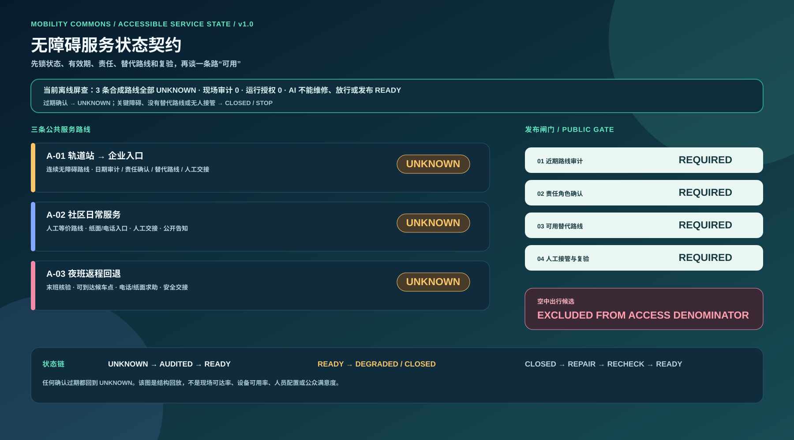

图件只发布状态、闸门和停止动作；现场须补齐路线分段、有效期、责任、替代、人工交接与复验凭证，才能把任何 `READY` 状态写入公开服务目录。

## 交通责任移交屏

交通服务常见的风险还在于服务发起后没有人愿意接住空间、设备、维护、申诉和退出。现有八类交通接口现在共用一张移交屏，覆盖地铁站口、公交候车、骑行链、无障碍路线、时段路缘、企业接驳、物流维护和空中实验地面闸门。

每个接口都要同时写出七类资源负担中的适用项、发起角色、接收角色、非 AI 等价服务、受影响群体、失败分母、停止证据和恢复证据。失败请求和撤回请求继续进入分母，不让成功率把被拒绝、未完成或退出的人抹掉。接收角色没有日期化确认时，责任仍留在发起方，拟议服务冻结，公共路线和人工/公共交通回退保持可用。

当前八类接口没有现场回执，没有已接受移交，也没有运行授权。空中候选只作为地面安全审查对象，不进入责任移交分母。该屏是协议结构的离线回放，不证明角色任命、预算落实、合同、现场服务或居民结果 [data:visual/assets/mobility-responsibility-transfer.json] [data:visual/assets/mobility-responsibility-transfer-readout.json] [data:visual/assets/run-mobility-responsibility-transfer.js]。

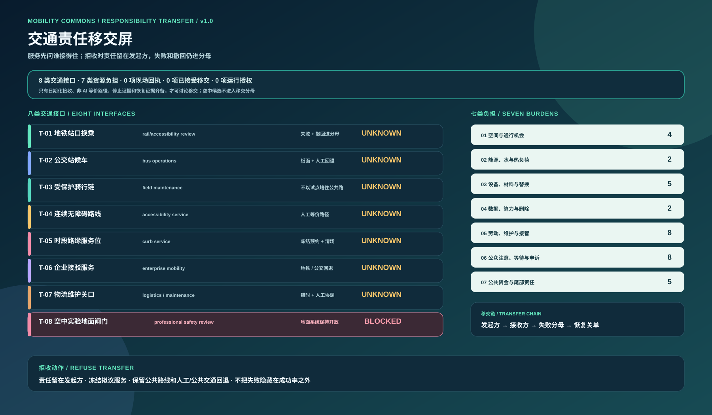

这张图把“谁来负责”拆成可检查的字段，也保留拒收时的退出动作。它和资源护照、资产关单、服务连续性屏共用 `UNKNOWN`、`not_authorized_not_run` 与现场证据边界，不把协议 PASS 写成运营成绩。

## 交通失败治理与申诉回写屏

责任有人接住，还不等于一次故障就能被“关掉”。这轮把轨道/公交中断、无障碍断裂、路缘与骑行冲突、企业接驳失约、物流维护失效和空中实验地面闸门拒绝拆成六类失败。每类都要写清受影响群体、观察角色、替代路线和停止条件；不能拿总平均覆盖某一组人的断点。

治理屏再把记录拆成五条轴：服务状态、群体影响、证据置信度、人工决定和发布状态。首版记录可以是 `UNKNOWN`，后续纠错必须追加新版本并保留 `prior_record_id`；受影响群体可以提交聚合申诉，申诉先暂停发布，不能删除原记录；退役还必须留下理由、人工决定和继任服务或地面回退。这里借鉴了近期仓库讨论里对失败治理、三类回写和可撤回版本的要求，但做了交通接口的具体化。

当前没有现场事故、真实申诉、纠错、退役发布、现场回执或运营授权。空中候选继续被挡在运营与事故分母之外，个人轨迹也不进入记录。该屏证明字段、追加规则和负例能离线复核，不证明服务发生、居民申诉完成、事故处置时间或公众满意度 [data:visual/assets/mobility-failure-governance.json] [data:visual/assets/mobility-failure-governance-readout.json] [data:visual/assets/run-mobility-failure-governance.js]。

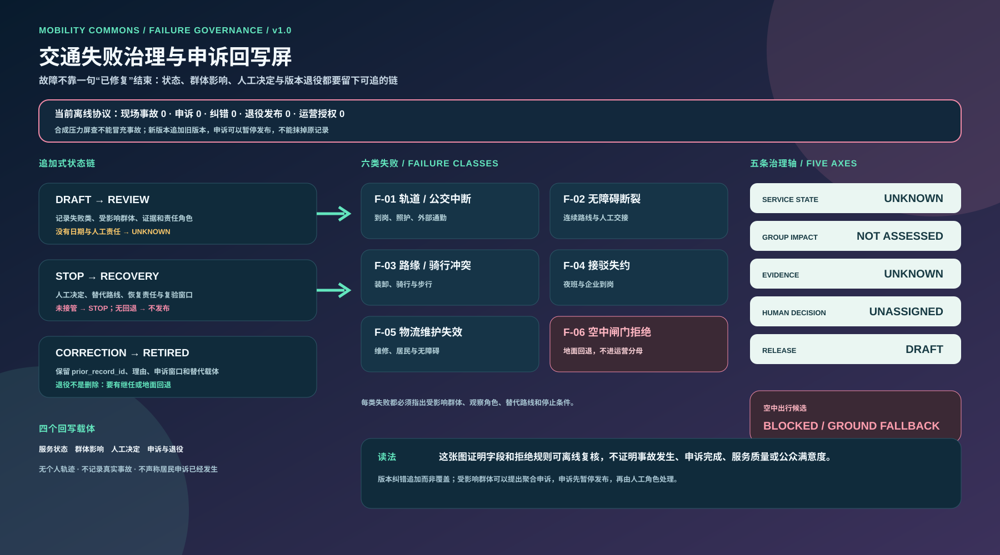

图上的 `DRAFT → REVIEW → STOP → RECOVERY → RETIRED` 是记录和发布的状态链，不是现实运营流程的承诺。真正进入试点前，需要有日期的事件、责任角色、群体影响观察、人工决定、替代服务和公众告知；缺一项就停在未知或停止。

## 共享接驳模式竞争护栏

共享接驳不是天然的公共交通补丁。近期共享自动驾驶车辆研究提醒，车辆共享如果和公共交通脱节，可能把出行从轨道公交吸走，并增加车辆行驶量 [source:SAV-VKT-TRANSIT-COMPETITION-2024]。因此本包新增四个合成反事实情景：轨道公交优先基线、封顶式接驳、无封顶接驳扩张，以及地面优先的空中候选。五个群组都保留：企业到岗、居民与照护、无障碍出行、夜班人员和对外通勤。

这张屏是本包的补充审查屏，不是阻塞核心自检的验证门。运行器锁定 `O0`、`O1`、`O2`、`O3` 四个且仅四个情景；重复、缺失或未知情景 ID 会闭锁。它必须和正式 `self_check`、可信内容审查一起阅读，不能单独提升投稿、赋分或更新公开图库。

护栏只看可解释的相对指标：公共交通客流指数不得低于 0.95，接驳份额不得超过 8%，车公里比不得超过 1.10，最差群体可达性差值不得低于 −0.03。O1 封顶式接驳通过合成护栏，仍只进入条件复核；O2 因公共交通被挤出、接驳过量、车公里上升和最差群体变差而闭锁；O3 即使地面指标暂时通过，也因没有空中运行授权而保持 `BLOCKED`，空中 agents 为 0，地面公共交通回退先行 [data:visual/assets/mode-competition-guard.json] [data:visual/assets/mode-competition-guard-readout.json] [data:visual/assets/run-mode-competition-guard.js]。

这张屏没有导入论文系数，也没有声称海淀客流、车公里、满意度或服务绩效。3,122,000 只是既有合成规模回放的参考分母；正式判断仍要补齐轨道/公交客流、发车间隔、车辆容量、接驳占比、路网长度、分组可达性和跨边界 OD 的日期化数据。

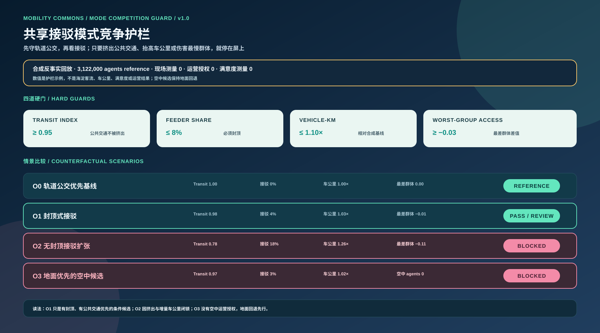

## 设计依据与资料清单

征集任务要求覆盖三层空间研究、三处重点区、AI+交通与产业生态，并交付可检查的图层、指标、图纸和视觉页 [source:OFFICIAL-ANNOUNCEMENT] [source:AGENT-TASKBOOK]。

本包沿用公开任务书的 provisional 工作底盘，但以交通运营为主题重做路网属性、指标、来源、图件和实施门槛；`geometry/site_boundary.geojson`、`geometry/key_areas.geojson` 都明确 `official_boundary=false`、`geometry_role=provisional_constraint`，不得解释为法定红线 [data:geometry/site_boundary.geojson#SITE-001] [data:geometry/key_areas.geojson#PROV-KEY-001]。

边界与包内证据的使用边界见 [source:SITE-PACKAGE] [source:BOUNDARY-SOURCE] [source:KEY-AREA-SOURCE]。

北京“十四五”交通规划将一小时门到门、轨道/公交/步行/自行车一体化、公交优先和智慧交通列为方向 [source:BEIJING-14TH-TRANSPORT-PLAN]。海淀区 2026—2027 年道路停车管理服务招标则把停车秩序、引导巡查、设备检查、异常处置、后台和“接诉即办”放进同一项服务，路缘因此需要责任主体和服务水平来管理 [source:HAIDIAN-ROAD-PARKING-TENDER-2026]。

海淀西北旺规划交通材料还要求轨道站点/交通枢纽、首层公共界面、换乘自行车停放、应急疏散和交通影响评价共同校核 [source:BEIJING-HAIDIAN-TRANSIT-HUB-PDF]。这些材料是政策和招标证据，不是本 provisional 范围的现状数据。

资料等级分为四类：`known` 是文件可回读的几何数值；`unknown` 是必须调查而不能猜的企业、居民、停车、换乘和投诉基线；`design_target` 是可逆试点的验收门槛；`blocked` 是没有权属、路权、责任人、无障碍等价服务或安全回退时不得扩容的状态。企业通勤研究支持班车、公共交通补贴、弹性工时和保证回家等需求管理工具，但也提醒 rideshare 和补贴的效果取决于工作密度、制度和分组行为 [source:EMPLOYER-TDM-LONGITUDINAL] [source:EMPLOYER-TDM-GUIDE] [source:WORKPLACE-CHARGING-GAP-2025]；不把论文中的效果百分比迁移成海淀结果。

## 三层范围工作框架

三层结构把“企业为什么要改”和“居民如何真正受益”接到同一条证据链上 [depth:three_level_scope_framework] [standard:PROJECT-OFFICIAL-ANNOUNCEMENT]。

1. **统筹层**：研究京张—海淀的轨道、公交、校园、园区、社区和生活服务如何形成多方式接驳；识别企业时间窗、居民时间窗和公共空间之间的冲突，不新增一条未经交通论证的道路。
2. **总体层**：用 `land_use`、`buildings`、`roads`、`green_space`、`public_space`、`constraints` 和 `phasing` 共同定义到站、到岗、到家和服务维护的空间关系；用时段状态而不是永久占用表达路缘。
3. **重点区层**：在众智园、AI 原点社区、大钟寺 AI 产业聚集区各做一组可逆试点，分别验证企业到岗、居民日常和轨道/路缘换乘。

三层共享同一 provisional 约 11.41 km² 工作范围，面积只作为设计比较值 [metric:site_area_sqm]。正式边界发布后，应锁定 revision，重算所有图层、路线、分区、图纸和指标；不得只替换一张效果图。

## 统筹研究范围产业与未来城市研究

### 企业侧：把“通勤”从人力成本变成可治理的服务

企业不再各自发班车、各自占用路缘，而是在不上传个人轨迹的前提下，按日/周提交聚合需求台账：班次窗口、员工总量区间、园区入口、货运/装卸窗口、访客峰值、夜班和应急需求。企业交通专员只看分组后的需求矩阵，平台输出公共交通接驳、拼车/班车、骑行停车、共享接驳和保证回家服务的组合建议。企业必须为使用的路缘窗口、人工引导、设备维护和投诉闭环承担成本与责任，不能把拥堵外包给社区。

### 居民侧：把“到达权”作为不可稀释的公共服务

居民台账只记录匿名化的服务类型和时间段，例如上学、就医、买菜、照护、夜班回家、轮椅通行和快递取件；不采集连续家庭轨迹。任何 AI 推荐都必须保留线下、电话、纸面或人工等价路径。居民不需要加入企业平台才能使用人行路、公共交通、无障碍路线或服务台。分组结果应按年龄、行动能力、照护负担、夜间出行和是否园区员工分别回读，不能只看全体平均值 [source:BEIJING-ACCESSIBILITY-REGULATION] [source:SHARED-MOBILITY-OECD]。

### 未来城市：受控的接驳，而不是无限增加车辆

自动驾驶或按需小巴只在获批、低速、有人值守的首末端场景作为 feeder；研究显示共享自动驾驶既可能补充也可能挤压公共交通，若不管理供给，车辆公里数可能上升 [source:SAV-TRANSIT-COMPETITION] [source:SAV-MICROTRANSIT]。本方案因此把轨道和公交作为骨架，把按需服务设为有容量、时窗和退出条件的补充，并以现场交通影响评价、公共交通客流和居民体验决定是否继续。

## 总体设计范围城市更新与控规深度城市设计

### 总体结构：一条共行环、三类接驳、四项服务水平

“共行环”把既有轨道/公交站点、企业入口、社区服务点、公园慢行和公共停车/装卸节点串成可辨认的转乘链，不新增封闭环路。三类接驳为：

- **骨干接驳**：轨道与公交之间的稳定换乘，优先解决站口、过街、候车和自行车停放的连续性；
- **共享接驳**：企业合并需求后的定时班车、微循环小巴或共享出行，必须服务于骨干而不是与骨干抢客；
- **人本接驳**：无障碍步行、轮椅/照护者、儿童和夜班人工服务，任何数字服务失败都退回这条链。

### 五种地面方式与一个条件空中实验

“共行环”按方式分层，不把所有出行压成一条线：**地铁/轨道**承担跨区骨干和对外通勤的长距离段，**公交**补充站点覆盖和夜间/换乘弹性，**自行车**承担站点—园区/社区的首末端，**步行与轮椅**是所有方式的公共通行基础，**汽车**只在必要出行、停车、装卸、充电、接送和应急路径中被管理。企业班车、按需小巴和共享接驳必须先接入轨道/公交，不以新增车辆替代公共方式 [source:BEIJING-14TH-TRANSPORT-PLAN]。

未来空中出行只建立 `air-mobility-candidate` 关系节点：在没有空域、航路、适航、运行人、保险、气象、消防、噪声、应急和公众参与的书面复核前，不画可运营航线、不承诺起降场、不把论文方法写成许可。若未来进入实验，必须从地面换乘、步行/无障碍疏散和数据记录开始，并设置可撤回、低频、有人值守和天气取消条件 [source:BEIJING-LOW-AIR-ECONOMY-2024] [source:CAAC-UAV-REGULATION-2024]。

四项服务水平是：**到达连续**（人行/无障碍路线不被路缘打断）、**换乘可靠**（等待和衔接在可接受窗口内）、**路缘有序**（预约/装卸/停车按时间窗清场）、**申诉可闭环**（责任人、状态、限时和复核可见）。路缘管理研究指出，配送、网约车、共享出行和公共活动对同一空间的需求会冲突，公共部门与企业必须共同安排时间、责任和数据边界 [source:CURBSPACE-MANAGEMENT-2021]。

### 空间更新：先可逆，再固定

现阶段不提出新建桥隧、道路拓宽、停车供应量、建筑高度、容积率或投资额。先用标线/可移动设施、站口导向、遮雨座椅、连续坡道、自行车停放、企业班车候车位和路缘电子/纸面状态牌做 P0/P1 试点。只有当现场测绘、交通模型、消防、市政管线、产权、环境和公众参与均有书面证据，才进入固定工程。

用地和建筑关系回接至 `geometry/land_use.geojson`、`geometry/buildings.geojson`，所有面积属于概念量 [data:geometry/land_use.geojson#LU-001] [data:geometry/buildings.geojson#BUILD-001]。

设计深度与强度边界分别回接 [depth:land_use_layout] [depth:development_intensity_controls]。

## 重点区域详细设计

三处重点区承担同一条企业—居民出行链上的三种运营角色；重点区数量为三处，几何仍是 provisional [metric:key_area_count] [data:geometry/key_areas.geojson#PROV-KEY-001]。

大钟寺重点区的空间位置需要单独披露。仓库 Issue #1029 的公开复核指出，当前继承的 `PROV-KEY-003` 临时多边形面积和南北排序与任务文字相符，但质心约在北京北站一带，距大钟寺地铁站约 2.26 km。本包不自行平移这块源几何，也不把它当作大钟寺站缓冲区；正文中的“四象限步行连通”来自公告任务锚点，不能反推临时多边形已经完成站点定位 [source:ISSUE-1029] [data:geometry/key_areas.geojson#PROV-KEY-003] [assumption:A-KEY003-POSITION-001]。

只有维护者发布新的官方锚定关系或多边形后，本包才会按同一版本整体重算 `key_areas`、用地与道路关系、指标、图件、A3/A0、双语 HTML、来源与假设登记、manifest 和 self-check。这样可以避免各参赛包各自平移，留下无法比较的空间版本。

| 重点区 | 主要需求 | 设计动作 | 首个可逆试点 | 不能越过的边界 |
| --- | --- | --- | --- | --- |
| 众智园 AI 自主创新加速区 | 企业到岗、班车合并、园区物流、访客峰值 | 入口前置“企业交通台账台”；把班车、骑行停车、装卸和消防净空分成状态层 | 仅在园区管理范围内做 2 个高峰时窗，比较合并班车/公共交通接驳与路缘冲突 | 不把企业需求变成社区禁停；无权属、无现场安全员不开放共享接驳 |
| 北京 AI 原点社区 | 上学、就医、买菜、照护、夜班和无障碍日常 | 以社区服务台、连续人行线、遮雨候车和非数字预约形成“人工优先环” | 对照人工/电话/纸面服务，审计轮椅、照护者和老年人完成同一条日常路线 | 不收集家庭连续轨迹；不以 App、企业账号或摄像头换取基本通行 |
| 大钟寺 AI 产业聚集区 | 轨道换乘、企业访客、停车装卸、活动日人流 | 站口—骑行停放—步行穿越—企业入口统一导向；路缘按分钟级窗口清场 | 在工作日高峰与活动日做轨道接驳、装卸和居民归家分流演练 | 不占消防/无障碍通道；共享自动驾驶不替代轨道，不承诺社会道路许可 |

每个重点区都要有企业责任人、社区/公共服务责任人、交通专业复核人和维护责任人，记录目标、输入、停止条件和回读证据；现阶段不声称已有合作方或运营许可 [depth:three_key_area_detailed_design] [source:HAIDIAN-ROAD-PARKING-TENDER-2026]。

### 模型输出如何进入空间决定

结构完整不等于专业判断已经完成。为让审阅者看到“模型发现了什么、现场的人要决定什么”，本包新增一张空间交通决策图谱。它把三处临时重点区和四个时段拆成 12 个决定单元，逐格写明骨干方式、支撑方式、合成护栏、空间动作、责任角色、补证要求和停止条件。它借用大规模活动/主体模型与交通公平研究的分组审查思路，也参考共享微出行与公共交通的公平性权衡；论文只约束方法问题，不迁移当地参数或结果 [source:EQUITY-ABM-DC-2024] [source:MICROMOBILITY-TRANSIT-EQUITY-2024] [source:MULTIMODAL-SAMS-NETWORK-2024]。

图谱把每一格的边界写在数据里。3,122,000 仍只是合成回放的规模参照，接驳占比和最差群体可达性差值是合成护栏，不是居民调查。`conditional_review` 只表示可以准备现场复核；`hold` 表示锚点、权属、责任人、容量、无障碍或夜间安全证据尚未齐全。合成护栏通过也不能直接施工、运营、评分或上榜。空中出行保持 0 个合成代理并继续闭锁 [data:visual/assets/spatial-mobility-atlas.json] [data:visual/assets/spatial-mobility-atlas-readout.json]。

每格都保留一个人的问题。例如众智园早到岗要回答班车窗口是否切断公共路线；AI 原点社区夜间要回答谁能接手照明、人工服务和地面回退；大钟寺要先回答维护者是否发布正式锚定关系。责任角色是待确认的工作接口，不是已存在的合作方。现场交通计数、分组 OD、无障碍走查、路缘清场回执、末班车回退记录和公众意见仍是释放条件。

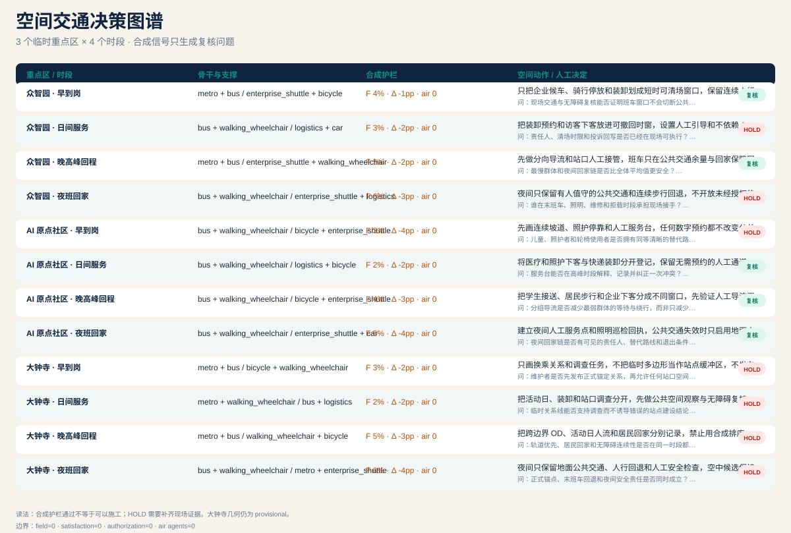

评审者可运行 `node visual/assets/run-spatial-mobility-atlas.js --check`，复核 13/13 个结构检查、12 个决定单元、5 个条件复核单元和 7 个保持单元。这个 PASS 只说明图谱可读和护栏可重放，不代表专业审查、现场调查、许可或公开评分已经完成 [data:visual/assets/run-spatial-mobility-atlas-readout.json] [data:visual/assets/run-spatial-mobility-atlas.js]。

## AI 创新生态、人才画像与 AI+ 场景

### 六类参与者与三项产业测试

参与者包括园区企业交通专员、居民/照护者、轮椅和助行器使用者、轨道公交运营者、物流/维护人员、学校与社区服务人员、夜班员工以及交通/隐私/消防专业人员。AI 的作用是聚合需求、发现冲突、解释方案和生成回退清单；它没有权力把公共路线永久锁定。

1. **MOB-T01 企业需求合并测试**：企业只提交分组时段和人数区间，系统比较班车、公共交通、骑行和步行组合；回读企业多方式出行比例、站口拥挤、路缘占用和居民投诉。没有同意和分组阈值时，状态为 `blocked`。
2. **MOB-T02 居民等价到达测试**：对同一条上学/就医/买菜/夜班回家链，同时提供 AI 推荐、人工窗口、电话和纸面方案；按行动能力和照护负担分组回读完成率、等待和拒绝率 [source:BEIJING-ACCESSIBILITY-REGULATION]。
3. **MOB-T03 路缘与断网回退测试**：在工作日高峰、活动日、雨雪和通信中断场景下，检验预约装卸清场、人工引导、轨道接驳和公共服务恢复。若没有人能接手，任何自动化接驳都不能扩容 [source:SAV-MICROTRANSIT]。

### 十张场景卡

`M-01` 企业合并班车；`M-02` 员工公共交通补贴；`M-03` 夜班保证回家；`M-04` 园区装卸预约；`M-05` 居民就医人工接驳；`M-06` 轮椅等价路线；`M-07` 轨道站最后 500 米；`M-08` 活动日人车分流；`M-09` 雨雪/断网服务降级；`M-10` 投诉—维修—复核闭环。每张卡必须绑定空间、责任人、输入数据、最小化规则、服务水平和停止条件；场景数量是设计清单，不是已发生的运营量 [source:EMPLOYER-TDM-GUIDE] [standard:PROJECT-AGENT-OPEN-CALL-TASKBOOK]。

## 用地、建筑规模与拆改留方案

交通优化首先消化既有城市结构，不以“未来通勤”掩盖开发强度。当前 `buildings` 图层只表达概念建筑足迹，建筑足迹约占 provisional 工作范围的 2.72%，该比例不是法定建筑密度 [metric:building_footprint_area_sqm] [metric:building_footprint_ratio]。AI 企业、社区服务、商业服务和公园绿地按既有图层做关系表达，不提出新增容积率或建筑高度承诺。

保留—更新—拆除的顺序为：保留既有公共服务、轨道站口、消防通道、连续人行空间和成熟树荫；可逆更新首层入口、候车、骑行停放、无障碍坡道、路缘信息牌和企业交通台；只有现场结构、权属、消防和交通评估共同证明必要时，才讨论小规模拆改。任何停车/装卸设施应先核对道路停车管理责任、设备巡检、异常处置和投诉闭环 [source:HAIDIAN-ROAD-PARKING-TENDER-2026] [depth:retain_renovate_demolish]。

## 交通、轨道、市政与公共服务设施

这是本方案的核心。现有概念网络包含一条南北关系线约 9.60 km、三条东西连接线，合计慢行关系线约 13.01 km；它们是网络设计长度，不是工程道路中心线，也不表示当前连续可走 [metric:design_north_south_spine_length_m] [metric:design_east_west_connector_count] [metric:design_slow_mobility_network_length_m]。正式交通深化必须对每条线逐段补：断面、信号配时、站口、过街、坡度、盲道、照明、树荫、停车/装卸、消防、排水、管线、产权和维护单位。

### 一张时段路缘账本

路缘单元采用 `open` 公共通行、`booked` 企业班车/接送、`service` 维护/装卸、`human-only` 无障碍与人工优先、`emergency` 应急五种状态。每次变更至少写入责任人、起止时间、服务对象、清场动作、替代路线和投诉入口。默认时间窗只是试验参数：早高峰、午间配送、放学/下班、夜间维护需先做人工计数与居民参与，再决定分钟级分配。企业获得的是可审计的短时服务，不是永久路权；居民获得的是不被预约切断的连续公共路线。

### 两侧需求台账与四项服务水平

企业侧按匿名分组提交人数区间、入口、班次、货运和充电需求；居民侧按服务类型提交时段、无障碍、照护和夜间需求。系统只输出聚合矩阵和冲突热区，原始记录应有目的限定、保留周期、删除责任和公开的算法说明 [source:CURBSPACE-MANAGEMENT-2021] [source:NIST-HUMAN-CENTERED-AI]。

数据采集和骑行—公交公平比较另有方法边界 [source:MOBILITY-DATA-METHOD] [source:BIKE-TRANSIT-EFFICIENCY-EQUITY]。四项服务水平对应可测指标：到达连续看 `accessible_route_completion_ratio`；换乘可靠看 `first_last_mile_transfer_reliability`；路缘有序看 `curb_time_window_compliance_ratio` 与 `peak_curb_conflict_rate`；申诉闭环看 `mobility_service_complaint_closure_hours`。当前全部是 `unknown` 或 `design_target`，不写成已达标。

### 人员动线与综合模拟：先守硬门，再追整体效率

综合模拟把**人**放在网络中心：企业员工、居民、照护者、儿童、轮椅使用者、访客、物流/维护人员、夜班人员和应急响应者分别建 OD 与时间窗；不上传个人连续轨迹，采用分组需求、匿名计数和可回读版本。对外通勤不被截断在 provisional 边界内，P0 必须记录跨边界起讫、进出方向、地铁/公交/自行车/汽车/步行/班车方式、停车换乘和跨线衔接，形成 `external_commute_od_baseline` 与 `external_commute_generalized_cost_index` 的调查底稿。

仿真场景至少覆盖工作日早晚高峰、平峰、活动日、雨雪/高温、地铁或公交中断、道路/停车故障，以及未来空中实验的“仅地面接驳”和“天气取消”对照。地铁/公交输入班次、站口容量、候车与换乘缓冲；自行车输入停放、借还和人车冲突；汽车输入路口排队、停车、装卸、充电和应急净空；步行/轮椅输入断面、过街、坡度、照护停留和无障碍绕行。SUMO 可作为开放的多方式仿真底座，但本地信号、站点容量、自行车行为和人员动线必须用现场计数校准，不能直接把软件输出当成海淀绩效；参考公开的 activity/agent-based 多方式建模方法，正式校准还要同时回读方式份额、道路/路缘流量、门到门时间、距离和分组可达性 [source:SUMO-MULTIMODAL-DOCS] [source:ATOM-MULTIMODAL-ABM] [source:ACCESS-ACCESSIBILITY-ABM]。

优化采用“硬门优先、帕累托比较”：消防/应急、无障碍连续、安全、公共交通不被挤占、隐私和人工服务先判定；通过后再同时降低广义出行成本（步行、等待、车内、换乘、停车排队）、人员动线冲突、汽车行驶量与能耗，并观察最慢群体差距、对外通勤可靠性和 `mode_transfer_reliability`。输出是一组可解释的候选方案和 `multimodal_system_efficiency_index`，不是一个未经校准的“整体效率第一”结论 [metric:person_flow_conflict_rate] [metric:multimodal_system_efficiency_index]。

### 轨道、停车与市政接口

轨道/公交是骨干，企业班车和按需小巴只能把人送到骨干换乘；停车与装卸是受时间窗管理的服务，不以扩充车位解决全部需求；市政接口要把雨雪、积水、照明、充电、信息牌、排水和维修纳入同一资产清单。西北旺交通规划材料对枢纽、首层、换乘停车、应急疏散和交通影响评价的要求，正好构成本方案进入工程阶段前的检查表 [source:BEIJING-HAIDIAN-TRANSIT-HUB-PDF]。慢行系统工程和道路交通导改也应按正式项目流程另行论证 [source:HAIDIAN-SLOW-MOBILITY-TENDER-2022]。

空中出行实验若有机会，只能作为地面系统的受控附加层：先证明地铁/公交接驳、步行/轮椅路径、消防疏散、噪声与社区安静界面不被破坏，再审空域和运行许可；`air_ground_transfer_reliability`、吞吐、取消率、气象窗口、噪声、应急响应和保险责任目前均为 `unknown`。北京低空经济行动计划与民航规则构成前置门槛 [source:BEIJING-LOW-AIR-ECONOMY-2024] [source:CAAC-UAV-REGULATION-2024]。

多方式接驳研究只提供方法启发 [source:UAM-BEIJING-MULTIMODAL-2024] [source:UAM-PUBLIC-TRANSIT-2023]，都不等于本项目获得飞行或建设许可。

### 设计场景综合模拟（透明沙盘，不是现状）

在现场 OD、站点容量、信号、人员动线和路缘计数到位前，先用 `visual/assets/movement-simulation.json` 做 1000 人归一化设计单位的可解释对比，并可用 `node visual/assets/run-mobility-simulation.js` 离线复核方式份额、服务供给和队列：S0 无协同高峰、S1 多方式与路缘协同、S2 受监管闸门阻断的空中候选、S3 极端天气地面回退。S1 只是在建议硬门筛查后暂选的设计候选；广义成本、换乘可靠性、人员冲突、汽车外来流入、最差群体差距和能耗都是示范输入，不是海淀现状。图件把“先过硬门、再做帕累托比较、最后用现场数据替换”的决策链公开 [metric:multimodal_system_efficiency_index] [metric:person_flow_conflict_rate] [standard:SUMO-MULTIMODAL-SIMULATION]。

模型对象也被显式拆开：1000 人设计单位包含居民 380、企业员工 450、照护者/儿童 60、访客 50、物流维护 40、夜班人员 20；网络侧把地铁列车（180 人/车、10 分钟间隔）、公交车辆（60 人/车、12 分钟间隔）、自行车停车、汽车路缘服务、步行/轮椅连续流和受阻断的空中候选分别作为服务对象。五条 `trip_leg_templates` 把对外企业通勤、居民日常服务、企业班车换乘、物流装卸和空中候选的地面回退写成可检查的人员动线。模型以 60 秒步长记录位置、方式、队列、车辆占用、换乘、路缘状态、冲突和无障碍标志，再输出各方式峰值排队、站点/车辆负荷、换乘等待、汽车路缘排队和最差群体差距；`model_analysis.derived_readouts` 里的数值是声明过输入后的合成敏感性分析，不是现场观测。评审可离线运行 [source:SUMO-MULTIMODAL-SIMULATION] [source:BEIJING-WALK-CYCLE-DB11-1761] [source:MULTIMODAL-TRAFFIC-REALITY-2025] `node visual/assets/run-mobility-simulation.js`。

人员动线与无障碍方法另有参考 [source:ATOM-MULTIMODAL-ABM] [source:ACCESS-ACCESSIBILITY-ABM]；运行器重算方式份额、服务供给、队列和校准字段，不联网、不生成本地现状 [metric:mode_transfer_reliability]。

在这套归一化沙盘中，未协同高峰的汽车路缘峰值排队为 86 辆、站口闸机负荷为 1.05；多方式路缘协同候选为 0 辆和 0.88；极端天气地面回退为 47 辆和 0.96。它说明优先校准站口闸机、公交站容量、路缘服务和无障碍过街，而不是把“模型分数”直接当成建设结论。现场补齐有日期的跨边界 OD、班次、断面、停车、冲突和消防审查后，才允许替换设计输入并重新运行。

## 蓝绿空间、公共空间与城市风貌

蓝绿为连续到达链提供遮阴、停歇、雨天回退和夜间安全界面。当前绿地比例约 12.34%，公共空间比例约 7.33%，由概念图层计算，不能推出生态、热舒适或排水绩效 [metric:green_ratio] [metric:public_space_ratio]。更新时优先让公共服务台、站口、候车、慢行和蓝绿边界共享遮雨、座椅、照明、饮水和无障碍信息；不得用树池、花箱或活动设施堵住轮椅转弯和消防。

蓝绿策略设置三条硬边界：雨天不把积水路径当接驳路线；热浪时提供人工服务和可休息的替代路径；暗夜和生态敏感时段降低不必要的灯光与设备活动。北京步行骑行标准、无障碍法规和海淀慢行工程提供连续性、设施和维护的政策依据 [standard:BEIJING-WALK-CYCLE-DB11-1761] [standard:BEIJING-ACCESSIBILITY-REGULATION] [source:BEIJING-SLOW-MOBILITY]。没有现场遮阴、热舒适、水风险、生态和照明数据时，相关指标保持 `unknown`。

## 更新项目清单、实施政策与分期计划

### 实施—运营合同（概念接口，非实施承诺）

为让“有分期”可以被复核，每一阶段同时写明参与主体、验收指标、人工回退和停止/撤回规则。P0 由场地与数据责任角色、交通/无障碍专业复核角色、社区联络角色共同完成盘点和授权登记；P1 由企业交通专员角色、居民/照护者观察席、轨道/公交运营角色、现场维护角色和独立安全/隐私复核角色共同值守，按无障碍路线完成率、首末端换乘可靠性、路缘时窗遵守率和投诉响应记录验收；P2 只有在交通影响、安全、无障碍、隐私、保险、采购和维护证据齐全后，才由专业责任方判断是否条件扩展。任一指标仍为 `unknown`、参与者同意或责任边界缺失、硬门失败或投诉无法闭环时，自动回到人工/公共交通/电话纸面入口，冻结预约并撤回可移动设施。这里的角色是待确认的责任接口，不是已确定机构、合同、资金或许可 [depth:phasing_implementation]。

为避免“有回退”停留在口号，本包把既有 `M-09 雨雪/断网服务降级` 收敛为一个最小离线桌面演练，而不是新增一个已运行场景。`visual/assets/mobility-tabletop-contract.json` 固定四条合成服务请求、四个触发事件和五个回滚动作；`node visual/assets/run-mobility-tabletop.js --check` 可在无网络、无个人数据、无外部系统和仅内存状态下复演 6 项检查，输出 `mobility-tabletop-evidence.json`。本地演练的结果是 4/4 请求保留人工/公共交通回退、预约冻结、6/6 检查通过、5/5 回滚步骤复演；它只证明状态、停止和回滚逻辑可复核，不证明真实人员值守、无障碍绩效、公众接受、服务可用性或安全。`performance_results=null`、`operational_status=not_authorized_not_run`，因此不会把合成 PASS 推进为 P1/P2 或现实实施 [data:visual/assets/mobility-tabletop-contract.json] [data:visual/assets/mobility-tabletop-evidence.json] [data:visual/assets/run-mobility-tabletop.js]。

| 阶段 | 工作包 | 交付与验收 | 停止条件 |
| --- | --- | --- | --- |
| P0 读懂路缘 | 现场盘点、站口/过街/无障碍审计、企业和居民聚合台账、责任人登记 | 形成路缘资产表、路线障碍清单、隐私/申诉规则和基线版本号 | 权属、路权或人工等价服务不清，停在调查 |
| P1 合并需求 | 两个企业时窗、一个社区日常链、一个轨道换乘链的可逆试点 | 公开聚合的等待、完成、冲突、清场、投诉与维修记录 | 任一人群完成率明显下降、消防/无障碍受阻或投诉未闭环，回到人工 |
| P2 条件扩展 | 仅在批准范围内扩展共享接驳/按需小巴，更新工程和采购任务书 | 交通影响评价、安全/隐私/无障碍/生态复核、运营 SLA 与资金责任齐全 | 缺一项就不扩容，不用模型分数替代实测 |

实施政策采用“登记—小试—复核—扩展/停止”循环。停车招标对巡查、设备和接诉即办的要求被转译为每个交通资产必须有 ID、状态、责任人、响应时间和关闭证据 [source:HAIDIAN-ROAD-PARKING-TENDER-2026] [depth:renewal_project_list] [depth:phasing_implementation]。企业签署的是可撤回的服务协议，居民保有公共路线和人工服务；任何 AI 建议都可由现场人员否决。

## 区级尺度的群组仿真：把人口规模变成可解释压力屏查

为了回答“这套系统能不能承受区级尺度的人流”，本包新增一份透明的 population-scale screen：以官方 2024 年末海淀常住人口 312.2 万作为规模参照，生成 312.2 万个合成代理和 624.4 万条假设性单向出行腿。这个数字不是说所有居民都在本站点通勤，也不是把常住人口等同于就业人口、OD 或客流；它只让企业、居民、照护、学生、服务物流、夜班、无障碍/老年和跨边界八类约束可以用同一张表比较 [source:HAIDIAN-POPULATION-2024] [data:visual/assets/population-scale-screen.json]。

八类群组比例被显式写在 JSON 中，方式集合覆盖地铁、公交、自行车、步行/无障碍、汽车、企业接驳、物流接驳和夜班公交。离散选择先按声明式效用比较时间、等待、成本、可靠性与无障碍，再用容量/路缘/人工回退规则筛查；保护组不能通过平均值改善而变差。基线与“流线公地组合包”的门到门、可靠性、无障碍路径和满意度只是模型内的 screening readout，必须用现场 OD、班次、站口容量、无障碍审计和企业班次校准后才能进入运维决策 [data:visual/assets/population-scale-screen.json] [metric:synthetic_agent_count] [metric:synthetic_trip_legs_screened]。

### 全人口 AM/PM 重放：把“能不能承受”拆成选择、容量、回退三层

为避免摘要分数掩盖排队，本包把 `visual/assets/regional-scale-commute.json` 作为第二层可复核模型：运行器按六类运行群组逐一重放 3,122,000 个合成代理的早高峰与返程腿，只保留群组 × 分区 × 方式 × 路径模板的聚合计数，不保存个人轨迹。这个结构参考了合成群体、离散选择、活动链和大规模多代理交通分配的公开方法；论文和工具只约束模型结构，不提供海淀参数或绩效 [source:MUNICH-MULTISCALE-MODEL-2024] [source:MATSIM-LARGE-SCALE-ABM] [source:MATSIM-BOOK-ACTIVITY-BASED]。

候选集合为 B0 参考、O1 公交优先、O3 慢行优先和 O4 容量平衡。先检查质量和安全硬门，再按满意度代理、最差组尾部、可达尾部、广义成本、P90 时间、冲突、外来汽车流入和车辆/服务公里排序。名义屏查选出 O4：3,122,000/3,122,000 代理完成处理，方式负荷上限 1.2088（硬门 1.35），无障碍完成代理 93.43%，代理满意度 66.44，广义成本代理 49.44，P90 时间 60 分钟，人员冲突代理 3.13/千人，外来汽车流入 8.47%。这些是可复算的 synthetic proxy，不是居民满意度、真实客流或交通运行结果 [source:ACTIVITY-BASED-DISAGGREGATE-2001]。

| 名义 O4 输出 | 数值 | 解释边界 |
| --- | ---: | --- |
| 地铁 / 公交 / 自行车 | 30.50% / 19.30% / 13.54% | 方式选择代理，待分组 OD 与班次校准 |
| 步行/无障碍 / 汽车 / 企业接驳 | 20.91% / 9.59% / 6.16% | 含连续无障碍路线与企业班车的设计输入 |
| 最低群组满意度代理 | 57.21（物流/维护） | 不是问卷结果；暴露装卸、等待和可靠性压力 |
| 服务时段残余队列 | 452,668 人次 | 单独运营筛查未过，不能直接投入 |

这张表揭示一个重要的“模型内矛盾”：方式负荷硬门可以通过，服务时段 FIFO 队列仍会在声明容量下堆积。`capacity-closure-screen.json` 因而作为独立修复屏查：增加 301,925 个合成服务单位，最大需求倍率 1.34，最大峰值负荷 1.2011，残余队列归零，容量闭合门通过。它给出的动作是先补地铁、公交、步行/无障碍连续段、自行车服务槽位和企业接驳的时段供给，再谈扩展车辆或空中方式；实际数量必须由有日期的站点、断面、路缘和服务单元盘点替换 [source:SCHEDULED-CAPACITY-TRANSIT-2012]。

回放还分开做 30 分钟地铁中断、强天气/骑行受限和多方式容量冲击。名义运行候选 O4 适合效率屏查，稳健性排序选出 O2 公平平衡；四种情景均处理全人口、保持质量守恒，并将空中候选继续锁定为 `blocked`。这意味着“日常效率最优”和“压力下更公平”是两个可解释的选择面，不能用一个总分替代安全、容量和最慢群组的复核 [source:EQUITABLE-ACCESSIBILITY-SRAI-2016] [source:ADAPTIVE-TRANSIT-ROUTE-CHOICE-2022]。

审阅者可以离线运行 `node visual/assets/run-regional-commute-simulation.js`、`node visual/assets/run-regional-readout-audit.js` 和 `node visual/assets/run-capacity-closure-screen.js`，再查看 `regional-scale-commute-readout.json`、`network-flow-readout.json`、`activity-completion-readout.json` 与 `utility-welfare-readout.json`。活动链压力屏明确显示：名义 O4 链完成代理为 91.06%，但地铁中断、强天气和容量冲击分别跌至 64.53%、60.74% 和 65.90%；这些结果用于暴露回退缺口，不能包装成服务承诺。

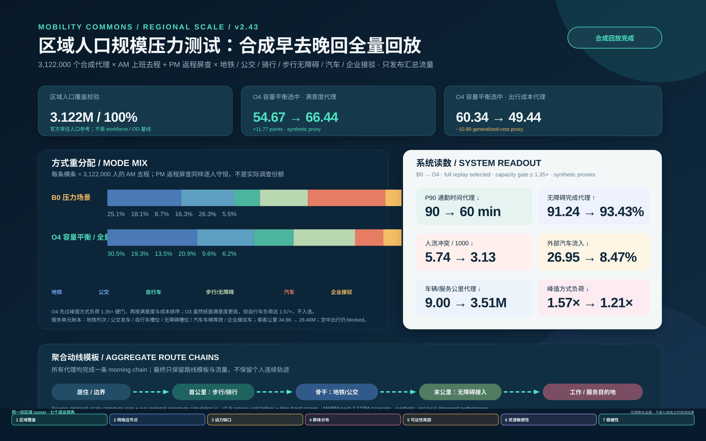
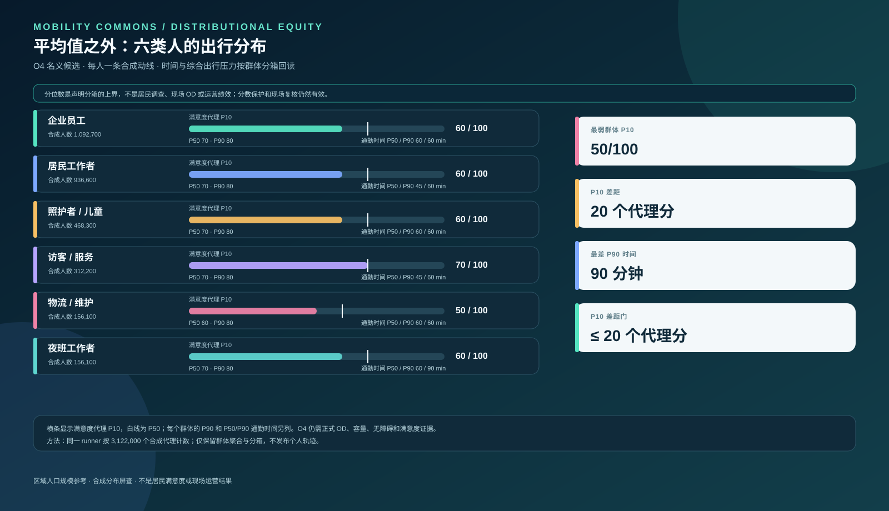
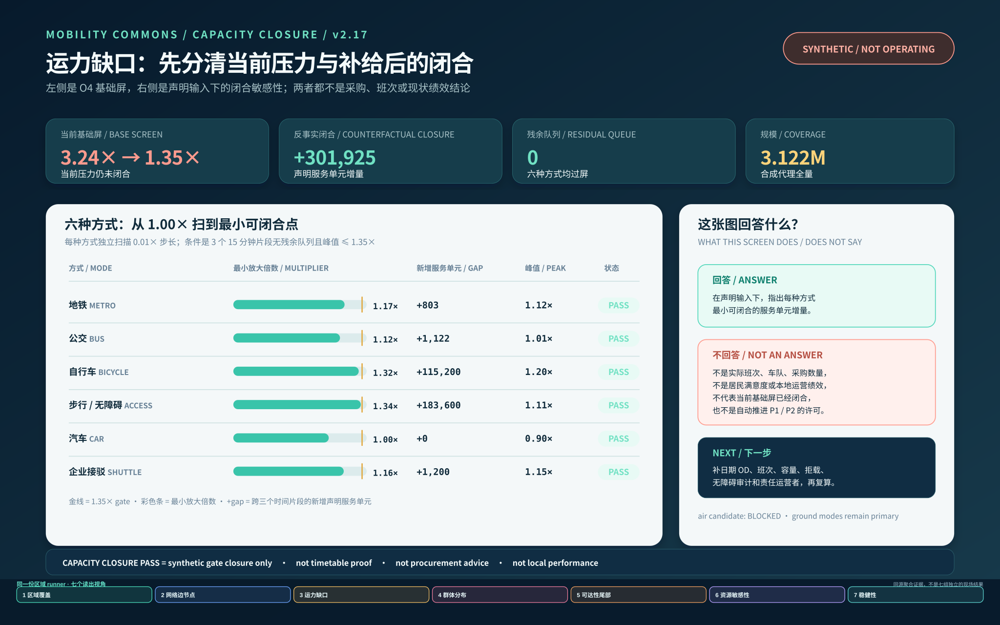
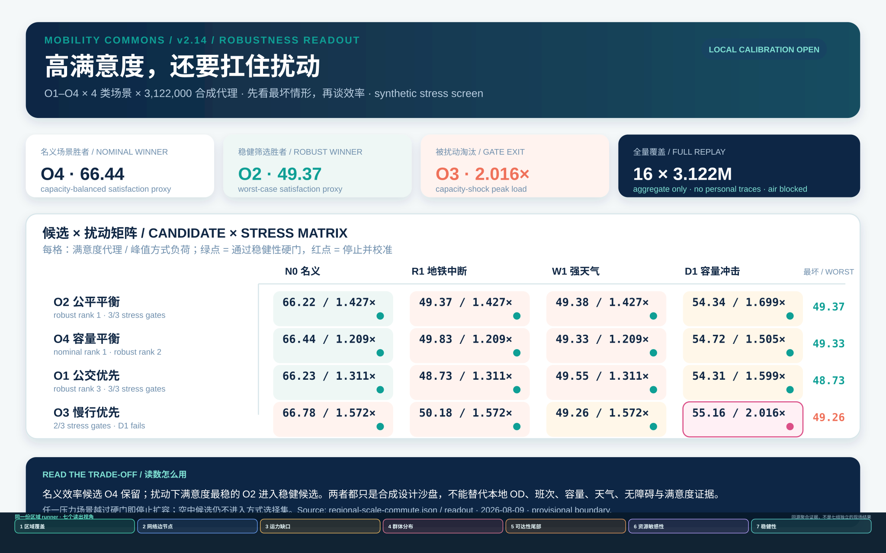
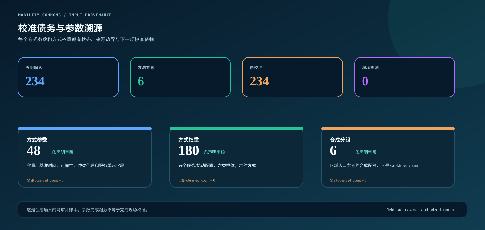

空中交通从 headline 方式集合中剔除，eligible agents=0、状态为 `blocked`。在空域/场地许可、具名运营方、安全论证、噪声与疏散、无障碍地面兜底、公众参与和可回滚事故审计都具备前，不画批准航线、不报飞行人数，也不把未来实验写成现状能力。这样做的价值是把真正可执行的地面系统优先级留给地铁、公交、自行车、步行/无障碍、汽车、接驳和物流，而不是用一个漂亮的飞行比例掩盖地面断点 [data:visual/assets/air-mobility-gate.json] [assumption:A-AIR-EXPERIMENT-001]。

### 动态偏好与满意度复核：把“最高”拆成可解释的选择

现有全人口回放先回答网络能否承受；新增屏再回答不同群体在早到岗、日间服务、晚高峰回程和夜班回家时，哪些偏好变化会改变选择。它将八类群体、四个时段、四个政策候选展开成 32 个合成决定单元，使用时间、等待、可靠性、无障碍、舒适度和成本六项声明式权重。这个结构参考滚动时域多方式规划、按需多方式交通公平和多方式服务质量研究；论文用于方法边界，不提供海淀参数或居民满意度 [source:DYNAMIC-PREFERENCE-MULTIMODAL-2025] [source:ODMTS-TRANSIT-EQUITY-2024] [source:MULTIMODAL-SERVICE-QUALITY-2024]。

首末端被单独列为可达性条件，步行和骑行还保留舒适度与环境偏好的变化。残障乘客首末端经验研究和脆弱道路使用者动态路径研究支持把站口到街区的连续性、舒适度和环境偏好单独记录；它们只限定方法，不提供海淀参数或居民满意度 [source:DISABLED-FIRST-LAST-MILE-2024] [source:MODYPER-VULNERABLE-ROAD-USER-2025]。

屏查把“未经筛选的满意度最高”和“硬门后可选的满意度最高”分开。区域回放原始代理分数最高的是 O3 慢行优先，数值为 66.78，但方式负荷、接驳份额和首末端完成率均未过。O4 容量平衡的动态偏好代理为 71.13，最弱群体 P10 为 70.06，首末端完成率代理为 92.1%，且通过公共交通、容量、无障碍、外来汽车流入和空中闭锁硬门，因此成为当前合成筛查中的最高可选候选。这些数值都不是居民问卷；它们只说明硬门先于满意度排序，物流与人员服务仍然可以放在同一张复核表上 [data:visual/assets/dynamic-preference-readout.json] [data:visual/assets/run-dynamic-preference-screen.js]。

图中右侧把每类群体在四个时段的可选政策并排展开。地铁和公交继续是骨干；自行车、步行/无障碍、汽车、企业接驳和物流作为地面候选进入相同选择表；空中候选保持 0 个代理。首末端完成率单独检查站口到街区、街区到工作地或家庭的连续路径，避免把“有一班车”当成“人能完成整段行程”。O3 的较高原始代理分数不能掩盖容量和首末端失败，O4 也不能绕过分组调查、15 分钟 OD、可靠性记录、无障碍走查或居民和企业复核 [data:visual/assets/dynamic-preference-screen.json] [source:PEOPLE-PARCELS-ABM-2026] [source:DISABLED-FIRST-LAST-MILE-2024]。

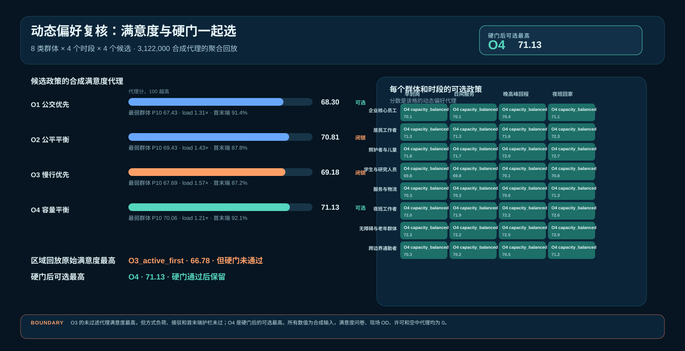

评审者可运行 `node visual/assets/run-dynamic-preference-screen.js --check`，复核 14/14 项结构检查、8 类群体、4 个时段、32 个决定单元、首末端字段和 0 个空中代理。这个 PASS 只证明声明式偏好、持久回放字段、硬门顺序和图件可以离线重放，不代表满意度、公众接受、运营许可或 Review Agent 分数。

### AI 交通服务资源护照：把扩容前的负担逐项摊开

全人口交通回放解决的是人如何选择方式、网络哪里排队；资源护照补上 AI 服务自身的账本。十张场景卡统一检查算力与网络、能源与燃料、设备与材料、数据与隐私、人工复核、供应商与维护、失败与退出七类资源。每一类都登记控制动作和待补证据，当前现实测量数为 0、批准运行场景数为 0，状态保持 `unknown`。这让企业班车、夜班回家、装卸预约和轮椅等价路线在同一张图上接受同样的责任审查 [data:visual/assets/resource-passport.json] [data:visual/assets/resource-passport-readout.json]。

五道 NO-GO 门先于效率比较：没有人工/公共交通等价路径、必须收集个人连续轨迹、设备或供应商没有维护退出路径、消防/无障碍/安静界面受到损害，或失败拆除与公共路线恢复未登记时，场景停在设计账本。护照不估算本地电量、碳排、采购数量、人员绩效或居民接受度；这些字段需要有日期的计量、责任矩阵、维护记录和公众参与后再回填。运行器可离线复核七类覆盖、十张卡、五道门和空中候选 `blocked` 状态，图件把“需求—选择—人工/公交回退—复核/撤回”画成一条可审查链 [data:visual/assets/run-resource-passport.js]。

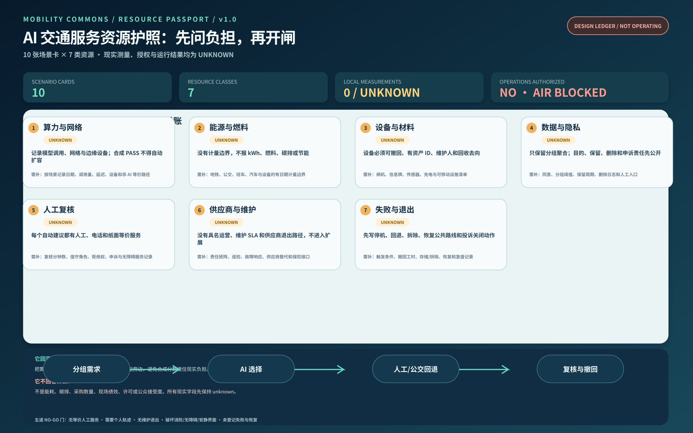

### 交通资源分母合同，不锁单位就不发布强度值

资源护照已经列出算力、能源、设备、数据、人工、供应商和退出七类负担。新屏继续追问每个交通场景到底在算哪一件事，把服务单位、非 AI 对照、完整系统边界、时间窗口、完成规则、分组拆分和责任角色逐项写进五条压力合同。五条合同分别覆盖地铁中断、公交中断、雨雪天气、路缘服务失效和跨边界返程 [data:visual/assets/resource-denominator-screen.json] [data:visual/assets/resource-denominator-readout.json]。

当前五条合同都停在 `denominator_not_locked`。3,122,000 只是合成压力回放的人口参考，不是海淀人口计量；本地计量、运行授权和强度发布数均为 0。没有有日期的本地证据、人工或公共交通对照和责任确认，系统不发布每次服务、每客公里、每车公里、人工复核分钟或退出成本的强度值 [data:visual/assets/run-resource-denominator-screen.js]。

这张屏把选择模型和资源账本接到同一条审查线上。地铁、公交、自行车、步行/无障碍、汽车、企业接驳和物流都先回答服务单位与替代路径，空中出行继续留在所有分母和强度比较之外。字段齐全只说明准备记录写清了，不说明已经测量、获批或运行。

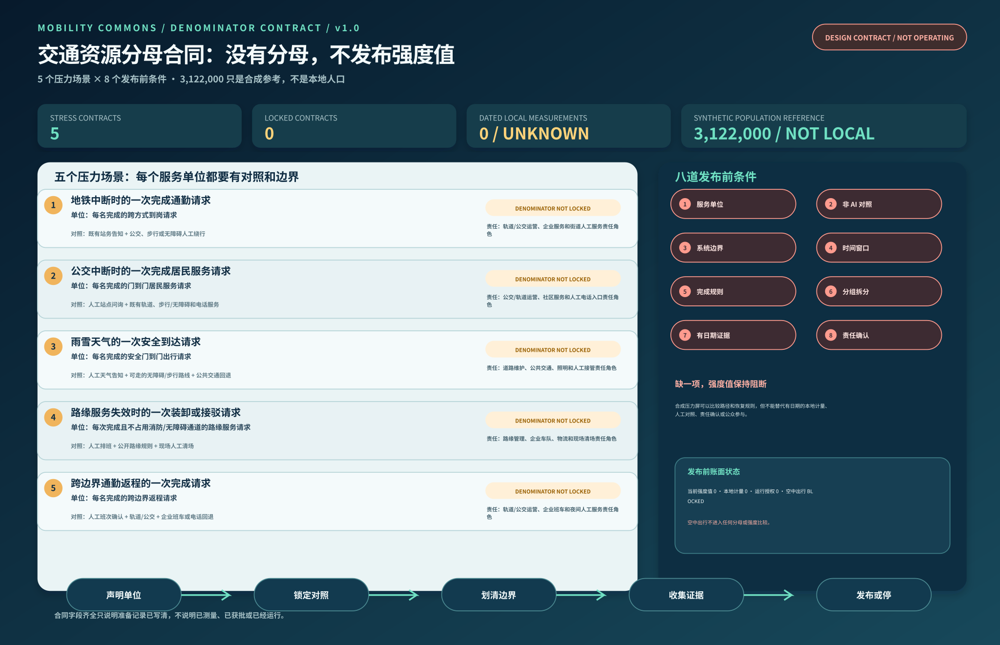

### 交通资产闭合回执：让投诉—维修—复核可以关单

资源护照回答“扩容需要承担什么负担”，资产闭合回执回答“出了问题谁把公共路线恢复回来”。账本为地铁站口、公交候车、受保护骑行链、连续无障碍路线、时段路缘、企业接驳、物流维护关口和空中实验地面闸门建立 8 条空回执模板。每条回执固定资产、服务窗口、触发条件、拟议责任角色、日期证据、维修/清场动作、无障碍回退、复核结果、公共路线恢复和关闭/撤回状态；当前现场回执数和关闭回执数均为 0 [data:visual/assets/asset-closeout-receipts.json] [data:visual/assets/asset-closeout-readout.json]。

这份账本不把“已派单”写成“已修复”。责任角色仍是待确认接口，日期证据与维修结果为空，居民投诉、SLA 和运营授权也没有现场记录。缺少责任与服务窗口、人工/无障碍替代、消防净空或公共路线恢复时，回执保持 `not_run`。运行器检查 8 条回执、11 个字段、5 道闭合门，并把 M-10 的处理链画成“发现—派单—维修/清场—无障碍复核—关闭或撤回”，为后续现场试点留下可直接回填的结构 [data:visual/assets/run-asset-closeout-receipts.js]。

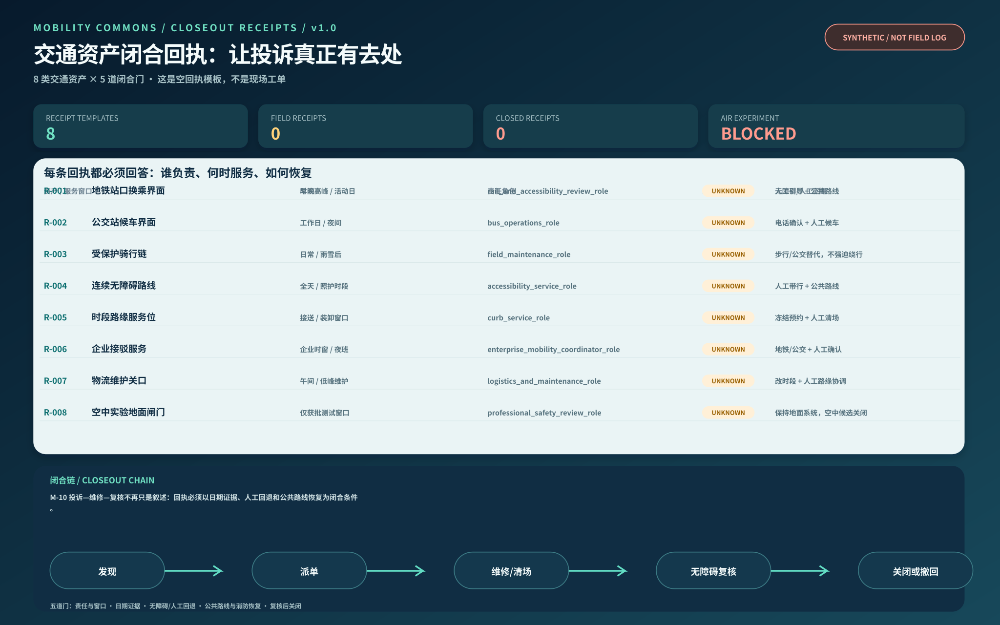

### 服务连续性：把通知、换乘、维修分成两只时钟

闭合回执回答“出了问题谁把路恢复回来”；服务连续性屏查继续回答“人要等多久、哪一组先被影响、资产什么时候才可以重新开放”。它把乘客服务时钟（通知—中断—人工接管—到达）和资产恢复时钟（责任—维修—无障碍复核—公共路线恢复）并排记录，避免用一次性的平均效率掩盖中断期间的最慢群体。多方式中断研究强调提前告知与有界方式转换，鲁棒路径研究则把需求不确定性放进回退选择；这些论文只用于方法边界，参数仍由本包声明并标成合成输入 [source:DISRUPTION-MODE-SHIFT-2022] [source:ROBUST-TRANSIT-PATH-2022]。

屏查重放 3,122,000 个合成代理、5 个压力场景（地铁、公交、强天气、路缘服务、跨边界返程）和 3 种处置策略：P0 晚通知、P1 提前通知加有界换乘、P2 人工优先。选择顺序先看全量处理、守住无障碍路线、空中候选继续关闭和恢复门，再比较连续性代理、最差组差距与恢复 P50。当前合成回读在五个场景均选 P2，连续性代理约 98.8%—99.4%，最差组差距约 0.1—0.3 个百分点，恢复 P50 为 96—192 分钟；这些数值只证明脚本能把两只时钟和分组回退算清楚，不是居民满意度、事故恢复时间或现实服务承诺 [data:visual/assets/service-continuity-readout.json] [data:visual/assets/run-service-continuity-screen.js]。

真正进入试点前，必须补齐有日期的中断通知、替代方式接受度、站点/路缘容量、维修责任、无障碍复核和公共路线恢复回执。若通知不足、人工接管缺失或最慢组差距扩大，策略停在调查与公共交通回退；空中方式仍不进入候选集合。

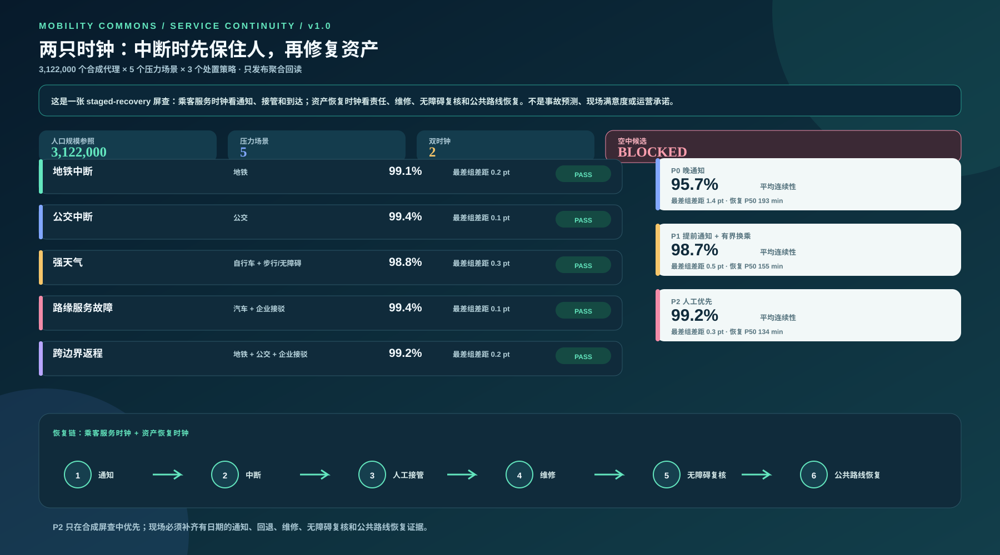

## 指标体系、面积复算与合规矩阵

### 当前可回读的底盘

本包的标准回接由 `standard_matrix.json` 统一维护，覆盖门到门交通、共享路缘治理和企业需求管理 [standard:BEIJING-TRANSPORT-DOOR-TO-DOOR] [standard:CURBSPACE-SHARED-GOVERNANCE] [standard:EMPLOYER-TDM-EVIDENCE]。

对外通勤 OD、人本数据治理、海淀路缘服务水平另有条目 [standard:EXTERNAL-COMMUTE-OD] [standard:HUMAN-CENTERED-DATA-GOVERNANCE] [standard:HAIDIAN-CURB-SERVICE-SLA]。用地分类和城市设计措施也有独立回接 [standard:MNR-LAND-USE-CLASSIFICATION-GUIDE] [standard:MOHURD-URBAN-DESIGN-MEASURES]。这些是审查入口和证据索引，不是项目已获批或现场已达标的证明。

当前可从 GeoJSON 回读的量为：provisional 工作范围面积 [metric:site_area_sqm]、三处重点区 [metric:key_area_count]。

人口规模屏查另有官方参照 [metric:population_scale_reference]，并可回读合成代理数和假设性出行腿数 [metric:synthetic_agent_count] [metric:synthetic_trip_legs_screened]。

建筑足迹及其比例 [metric:building_footprint_area_sqm] [metric:building_footprint_ratio]。

绿地与公共空间比例分别有独立回读项 [metric:green_ratio] [metric:public_space_ratio]，但都属于概念底盘。

设计关系线长度 [metric:design_north_south_spine_length_m] 只用于方案内比较；正式边界和专业资料到位后必须全量重算。

### 必须补齐的交通指标

企业通勤需求基线、对外通勤 OD、居民日常出行可达指数、企业多方式出行比例、分时停车占用、路缘时窗遵守率、首末端换乘可靠性、无障碍路线完成率、峰值路缘/人员动线冲突率、投诉闭环小时数、工作场所充电供需缺口、综合系统效率、方式换乘可靠性和空地接驳可靠性均为 `unknown`。

试点可以设置 `design_target`：无障碍路线完成率至少 0.95，首末端换乘可靠性至少 0.85 [metric:accessible_route_completion_ratio] [metric:first_last_mile_transfer_reliability]。

路缘时窗遵守率至少 0.90，投诉首响不超过 4 小时且 24 小时内给出责任/处理状态 [metric:curb_time_window_compliance_ratio] [metric:mobility_service_complaint_closure_hours]；这些目标是验收门槛，不是海淀现状或保证结果。

### 五道验证门与矩阵

1. **几何门**：官方边界、站口、道路、红线和权属可回读；
2. **需求门**：企业/居民聚合需求有同意、分组和时间版本；
3. **安全门**：交通、消防、无障碍、应急和极端天气测试通过；
4. **责任门**：运营方、维护方、采购、保险、数据和投诉 SLA 明确；
5. **公平门**：AI 推荐与人工/电话/纸面方案的分组结果不把最慢的人排除。

“整体效率最高”只有在五道门都通过后才有意义：先公开每种方式的输入、换乘链、人员动线瓶颈、对外通勤 OD、汽车外来流入和最差群体差距，再比较候选方案的广义成本与资源消耗。若硬门冲突，结果就是停止/回退，而不是用单一分数掩盖安全或公平损失 [standard:SUMO-MULTIMODAL-SIMULATION] [standard:LOW-AIR-REGULATORY-GATE] [depth:metrics_recalculation]。

`compliance_matrix.json` 覆盖公告与任务书的全部要求；`standard_matrix.json` 对应规划、步行骑行、无障碍、停车/资产运营、隐私和接驳研究；`design_depth_matrix.json` 将三层空间、三处重点区、交通/市政、更新分期、指标和风险绑定到正文、GeoJSON、图纸和自检 [standard:PROJECT-OFFICIAL-ANNOUNCEMENT] [standard:PROJECT-AGENT-OPEN-CALL-TASKBOOK]。

正式边界不清、交通基线不全或路权冲突时，提交保持 provisional，不把未知值填成模型预测 [depth:metrics_recalculation] [depth:risk_missing_data]。

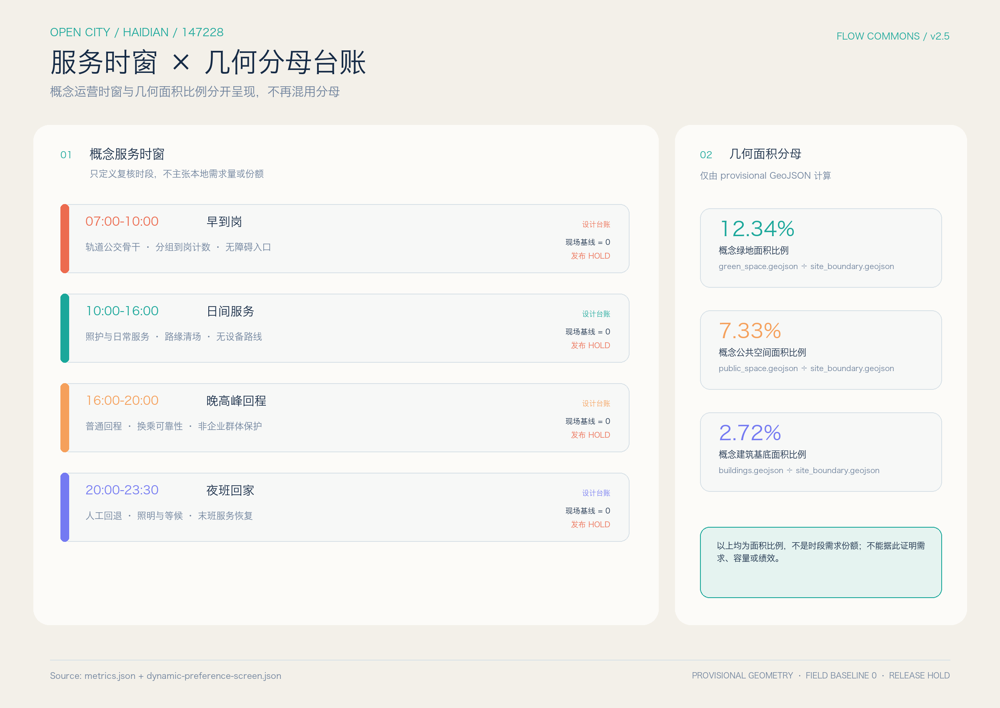
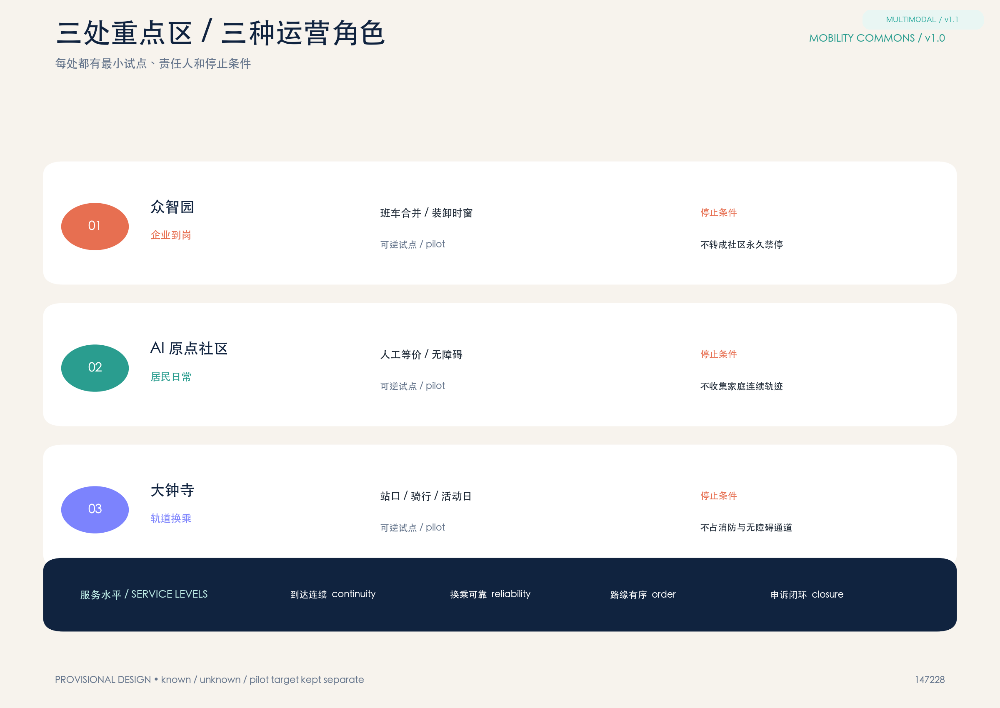
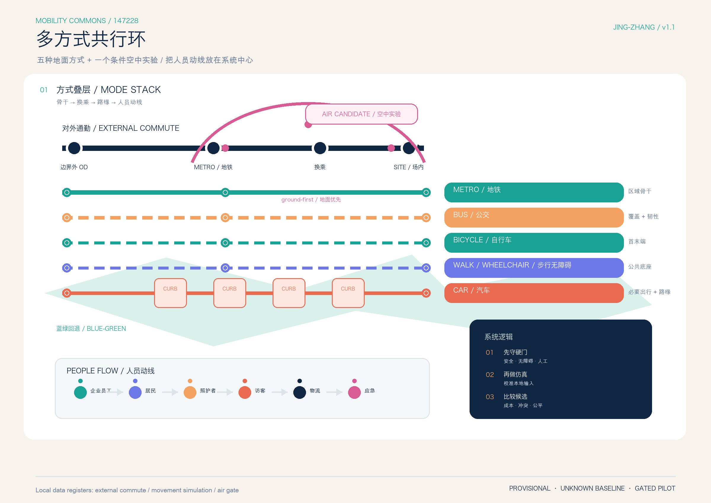
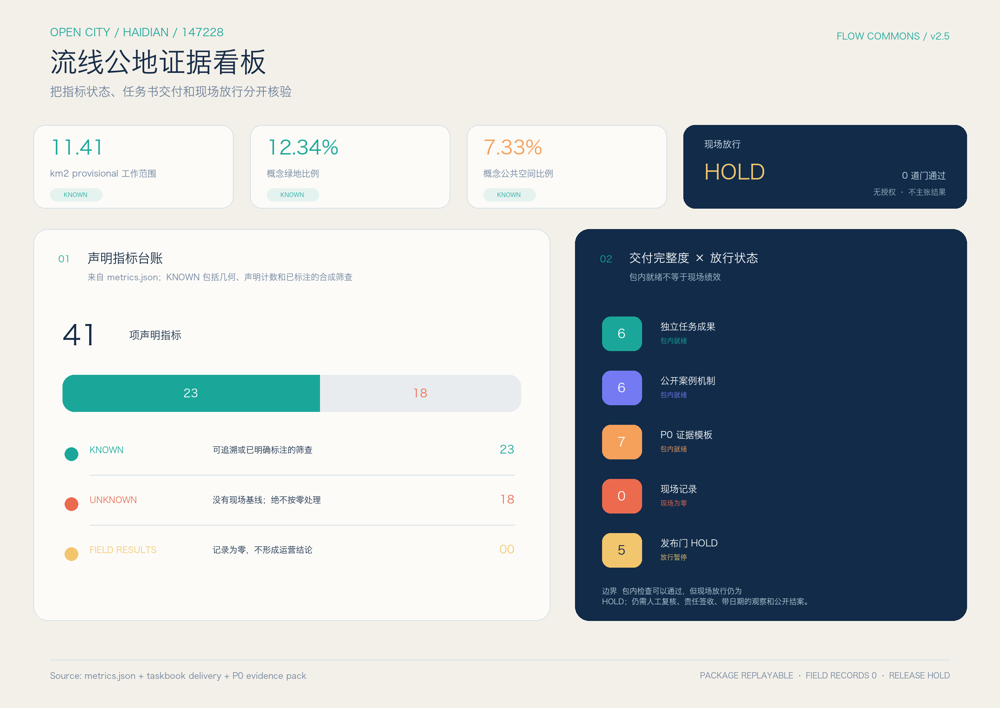

## 风险、版权与合规说明

本包不替代道路红线、交通影响评价、停车管理合同、消防审查、无障碍专项、施工图、运营许可、数据合规、保险或采购文件。风险主要来自企业需求挤占居民公共路线、按需车辆增加交通量、路缘状态无人维护、投诉缺少责任人和低数字能力人群被排除。每个风险都有回退：人工服务、公共交通、纸面/电话入口、可移动设施撤场、停止预约、公开事件摘要和下一次复核日期 [source:SHARED-MOBILITY-OECD] [source:CURBSPACE-MANAGEMENT-2021]。

来源使用边界清楚区分：北京政府和招标文件用于政策/责任框架；论文用于方法与风险启发；OSM 和现有 provisional GeoJSON 仅用于背景筛查与设计关系。论文没有提供京张基线，停车招标的数量也不等于本方案范围内车位数量；任何企业名称、合作关系、车辆、站点容量、事故率、满意度和健康效果都不在本包中作事实主张。

## 参考资料

- `BEIJING-14TH-TRANSPORT-PLAN` 北京市“十四五”时期交通发展建设规划。
- `HAIDIAN-ROAD-PARKING-TENDER-2026` 2026—2027 年海淀区道路停车管理服务项目招标公告。
- `BEIJING-HAIDIAN-TRANSIT-HUB-PDF` 海淀西北旺镇控规交通枢纽与慢行接口材料。
- `HAIDIAN-SLOW-MOBILITY-TENDER-2022` 海淀区 2022 慢行系统完善工程公开采购材料。
- `EMPLOYER-TDM-LONGITUDINAL` Employer-based travel demand management longitudinal analysis。
- `EMPLOYER-TDM-GUIDE` Employer transportation demand management plan guide。
- `CURBSPACE-MANAGEMENT-2021` Public/private curbspace management challenges and opportunities。
- `SAV-TRANSIT-COMPETITION` Shared autonomous vehicles and public transit competition。
- `SAV-MICROTRANSIT` Shared autonomous vehicles in microtransit systems。
- `SHARED-MOBILITY-OECD` OECD shared-mobility transition policy report。
- `BEIJING-LOW-AIR-ECONOMY-2024` 北京低空经济行动计划，作为设施协同背景而非项目许可。
- `CAAC-UAV-REGULATION-2024` 民航无人驾驶航空器飞行管理法规，作为飞行安全与运行责任前置门槛。
- `SUMO-MULTIMODAL-DOCS` SUMO 官方多方式、行人、自行车和权限仿真文档。
- `MULTIMODAL-TRAFFIC-REALITY-2025` 多方式交通物理/虚拟仿真研究，方法参考而非本地校准结果。
- `UAM-BEIJING-MULTIMODAL-2024` 北京城市空中交通与地面方式衔接研究，方法参考而非本地部署许可。
- `UAM-PUBLIC-TRANSIT-2023` 空中交通与公共交通/步行接驳研究，方法参考而非本地需求证明。

**最终边界声明**：这是一个以企业—居民共益交通为核心的可审计概念与试验框架，不是政府批准规划、道路开放公告、停车许可、企业合作协议、交通容量证明、健康效果证明或建设承诺。第一名项目保持不变，本包只表达新的交通数据和运营方案。

## 三层范围工作框架（证据回读）

统筹层、总体层和重点区层共享 `site_boundary`、`key_areas`、`land_use`，避免企业方案、社区方案和图纸各画一套边界 [data:geometry/site_boundary.geojson#SITE-001] [data:geometry/key_areas.geojson#PROV-KEY-001] [data:geometry/land_use.geojson#LU-001]。

三类空间图层继续回接 `buildings`、`roads`、`green_space`、`public_space` [data:geometry/buildings.geojson#BUILD-001] [data:geometry/roads.geojson#ROAD-001] [data:geometry/green_space.geojson#GREEN-001]。

公共约束和分期回接 `public_space`、`constraints`、`phasing` [data:geometry/public_space.geojson#PUBLIC-001] [data:geometry/constraints.geojson#CONSTRAINT-001] [data:geometry/phasing.geojson#PHASE-001]。

当前这些线面是概念关系，正式深化需要补站口、交通断面、信号、权属、管线、消防、排水、停车、班车和居民体验；任何服务水平指标都必须带日期、分组、时段、责任人和缺口 [depth:existing_conditions_diagnosis]。

## 统筹研究范围产业与未来城市研究（证据回读）

企业、居民、轨道公交运营者、社区服务和维护单位共同组成未来城市的交通生态；AI 只做聚合、解释、冲突发现和回退清单，公共权利仍由人和制度决定 [source:NIST-HUMAN-CENTERED-AI] [standard:PROJECT-AGENT-OPEN-CALL-TASKBOOK]。企业提供匿名聚合时段，居民保有不依赖 App 的人工入口，轨道/公交是骨干，按需车辆必须接受容量和停止条件约束。几何上，企业入口、社区服务点、站口和路缘状态回接 `key_areas`、`roads`、`public_space`，指标上把企业多方式出行、居民分组完成率和申诉闭环设为后续调查项；当前没有企业名单、协议、居民分层样本或运力基线，因此不能写“已经形成产业集群协同”或“居民满意度提升” [depth:overall_spatial_structure]。

## 总体设计范围城市更新与控规深度城市设计（证据回读）

总体设计用路缘时窗、换乘链和蓝绿回退界面把交通运营翻译为空间动作：首层入口、站口、候车、骑行停放、无障碍坡道、公共服务台和维护点优先可逆更新；建筑和用地只表达关系，不伪造 FAR、权属、工程量和投资 [data:geometry/land_use.geojson#LU-001] [data:geometry/buildings.geojson#BUILD-001] [data:geometry/public_space.geojson#PUBLIC-001]。

空间线位和面积需要同一版 boundary、同一投影和同一复算脚本；控规与建筑界面回接 [depth:height_massing_character] [standard:MOHURD-CONTROL-DETAILED-PLANNING]。交通容量、停车供应、站点设施和市政接口另行由专业团队确认；如果固定设施会侵占消防、无障碍或居民安静界面，则退回移动设施和人工服务 [depth:municipal_new_infrastructure]。

## 重点区域详细设计（证据回读）

众智园验证企业到岗和装卸，AI 原点社区验证居民日常和人工等价，大钟寺验证轨道换乘和活动日路缘；三处各有一个最小可逆试点和一组停止条件，而不是把“AI”作为统一答案 [data:geometry/key_areas.geojson#PROV-KEY-002] [data:geometry/roads.geojson#ROAD-002] [depth:three_key_area_detailed_design]。节点必须绑定运营责任、时间窗、清场、无障碍替代路线和投诉入口，不能把企业预约变成社区永久禁停，也不能把共享接驳当成无需许可的社会道路运营。

## AI 创新生态、人才画像与 AI+ 场景（证据回读）

场景以企业交通专员、居民/照护者、轨道运营者、维护人员和专业复核人共同测试；十张卡分别记录输入、输出、最小化、服务水平和回退。人才画像用于分组验收责任：轮椅使用者看路线连续，夜班人员看回家可靠，维护人员看资产 ID 和清场权，企业看成本与投诉，居民看不交轨迹也能通行 [source:BEIJING-ACCESSIBILITY-REGULATION] [depth:three_key_area_detailed_design]。现阶段没有实际用户同意样本、运行日志或企业协定，所有场景仍是设计目标。

## 用地、建筑规模与拆改留方案（证据回读）

本包不改变第一名项目，也不在本方案中新增建筑红线。`land_use`、`buildings` 和 `public_space` 只提供交通服务点、入口和公共界面的概念支撑；可回读的建筑足迹指标不等于法定建筑覆盖率 [data:geometry/buildings.geojson#BUILD-001] [metric:building_footprint_ratio] [depth:retain_renovate_demolish]。拆改决策必须先有现状测绘、权属、结构、消防、地下管线和社区参与，任何“提升容量”的图示在这些条件缺失时都保持 provisional。

## 交通、轨道、市政与公共服务设施（证据回读）

交通层把 `roads` 当作关系图，把路缘状态、站口、公共服务和蓝绿回退当作运营对象 [data:geometry/roads.geojson#ROAD-001] [data:geometry/constraints.geojson#CONSTRAINT-001]。

三类接驳和四项 SLA 都须用人工计数、走行审计、交通模型、无障碍检查、消防核验和投诉日志逐项回读 [depth:traffic_rail_slow_parking] [source:BEIJING-14TH-TRANSPORT-PLAN]。当前不存在可直接引用的企业通勤量、居民 OD、停车占用、信号配时、站口客流、充电供需或投诉时长，因此指标保留 `unknown`；设计目标只用于设置试点停止线 [depth:metrics_recalculation]。

### 设计场景综合模拟（透明沙盘，不是现状）

在现场 OD、站点容量、信号、人员动线和路缘计数到位前，先用 `visual/assets/movement-simulation.json` 做 1000 人归一化设计单位的可解释对比：S0 无协同高峰、S1 多方式与路缘协同、S2 受监管闸门阻断的空中候选、S3 极端天气地面回退。`visual/assets/run-mobility-simulation.js` 是同一输入文件的无依赖确定性复核器；它只重算设计单位的队列和服务供给，不把论文参数或模型读数升级为海淀现状。S1 只是在建议硬门筛查后暂选的设计候选；广义成本、换乘可靠性、人员冲突、汽车外来流入、最差群体差距和能耗都是示范输入，不是海淀现状。图件把“先过硬门、再做帕累托比较、最后用现场数据替换”的决策链公开 [metric:multimodal_system_efficiency_index] [metric:person_flow_conflict_rate] [standard:SUMO-MULTIMODAL-SIMULATION]。

## 蓝绿空间、公共空间与城市风貌（证据回读）

蓝绿系统为交通提供遮雨、停歇、热浪回退和暗夜安全，但不自动等于健康收益或防洪能力。现有 `green_space`、`public_space` 和 `roads` 的交叠关系只支持候选路径识别 [data:geometry/green_space.geojson#GREEN-001] [data:geometry/public_space.geojson#PUBLIC-001]。

它不能代替树冠、坡度、热舒适、排水和生态现场数据 [depth:blue_green_public_space] [standard:BEIJING-WALK-CYCLE-DB11-1761]。

## 更新项目清单、实施政策与分期计划（证据回读）

P0 的核心交付是资产、需求、路缘、无障碍和投诉基线；P1 只做小规模可逆试验；P2 需要把采购、运营、维护、保险、隐私、交通和公平复核写成可执行条款 [data:geometry/phasing.geojson#PHASE-001] [depth:renewal_project_list] [depth:phasing_implementation]。实施主体、资金和 SLA 当前未知，不能把方案写成中标或建设承诺；每项新增设施都必须可撤回、可维护、可审计。

## 指标体系、面积复算与合规矩阵（证据回读）

指标分为文件可回读底盘、现场未知基线和试点目标三层；`metrics.json` 为唯一数值源，视觉页只展示其中的已知指标，其余以状态卡说明如何获取。五道验证门把几何、需求、安全、责任和公平串联 [metric:site_area_sqm] [metric:green_ratio] [metric:public_space_ratio]。

本次 schema 修复把 29 条记录统一放在 `metrics` 对象下，并将每条记录的 `status`、`value`、`unit`、`source_files`、`formula` 和 `confidence` 作为同一审计入口；离线检查结果为 11 条 `known`、18 条 `unknown`、无顶层游离指标、无状态/数值矛盾，摘要见 [data:visual/assets/metrics-schema-audit.json]，复核器为 [data:visual/assets/run-metrics-schema-audit.js]。这只证明结构和 `known`/`unknown` 的一致性，不证明现场交通绩效、运营结果或官方评分。

合规矩阵、标准矩阵、深度矩阵和 `self_check.json` 共同记录响应；任何未知指标都不通过改名、四舍五入或模拟结果变成已知 [depth:metrics_recalculation] [depth:risk_missing_data]。

## 风险、版权与合规说明（证据回读）

图件由本包脚本根据结构化数据生成，地图、边界、道路和建筑保持 provisional 或概念建议标识；论文、政府网页和招标文件只按来源说明用途。缺少本地基线时指标保持 unknown；责任主体缺失或人工等价路径不可用时，试点停止，AI 不得替代公共服务 [source:CURBSPACE-MANAGEMENT-2021] [source:SHARED-MOBILITY-OECD] [depth:risk_missing_data]。

## 参考资料（证据回读）

来源登记将官方政策、官方招标、论文方法、开放地图筛查和本包设计数据分开；访问日期、用途和不适用边界写在 `sources.json`，不以论文结论替代北京现场测量 [source:SOURCE-REGISTRY] [source:OSM-TRANSPORT-CONTEXT]。
