## v2.6 Public-interest coverage extension | Return three easily hidden groups to the scenes

The existing `personas-and-fairness.json` registers six base personas. This iteration does not rewrite that contract. It adds three groups often hidden by an AI-centred narrative: youth, students and people entering the workforce; developers and researchers; and first-time or international visitors. Each returns through benefit, impact risk, spatial/scenario reference, human alternative, stop condition, and missing evidence, without turning a concept population into a demographic survey, service-coverage rate, or fairness outcome.[data:visual/assets/public-interest-coverage-v26.json] [data:visual/assets/run-public-interest-coverage-v26.js] [depth:risk_missing_data]

| Public-interest extension | Visible benefit | Impact to prevent | Existing scenario and spatial return | If evidence is missing |
| --- | --- | --- | --- | --- |
| Youth, students, and people entering the workforce | Reskilling, staffed explanation, and withdrawable learning without automated eligibility scoring | Transition pressure, stigma, waiting time, and excess retention of learning data | `SC-A02` / `ROAD-A-SKILL` / `BLDG-A-02` | Stay at G0 and do not open automated routing without staffed advice, exit records, or job-quality evidence |
| Developers and researchers | Least-privilege catalogue, public observer seat, and bounded experiments without platform scoring as entry | Vendor lock-in, unclear IP, test spillover, and accidental personal/civic-data access | `SC-B01` / `ZONE-B-API` / `BLDG-B-01` / `BLDG-D-01` | Freeze the experiment and return to the paper protocol when authorization, rights, logs, or takeover are unclear |
| First-time and international visitors | Multilingual public information, staffed explanation, ordinary movement, and withdrawable service | Language barriers, wrong health/daily-life information, case-data collection, and cultural misreading | `SC-D03` / `BLDG-D-02` / `PUBLIC-D-GLOBAL` | Close the display and retain ordinary movement and staffed service when language, rights, or case authorization is incomplete |

This is a coverage and evidence-gap register, not a demographic survey, accessibility certification, service outcome, employment result, or official score. Recompute it with personas, scenarios, geometry, metrics, figures, HTML, PDFs, and self-check after formal baselines, rights, and authorization arrive.[data:geometry/constraints.geojson#SC-A02] [data:geometry/constraints.geojson#SC-D03] [depth:risk_missing_data]

## v2.5 Public-space connectors and community conversion | Make agent.4 and agent.6 more than an event list

v2.5 closes two places where an “AI showcase” can hide the real urban question. **North–south continuity / east–west stitching** is not a new road or engineering alignment: it is a reading rule that connects the three focus areas as ordinary arrival → staffed choice → bounded machine → blue-green recovery → exit replay, while public problem desks, community service, OPC learning and Xiaoyuehe screen-free recovery stitch innovation back to daily life.[data:visual/assets/public-space-connector-atlas-v25.json] [data:geometry/phasing.geojson#PHASE-V01] [depth:overall_spatial_structure]

The component library makes five human-first public-space actions reusable: staffed access desk, intergenerational learning table, screen-free recovery node, contribution/honour replay wall, and pause/rollback marker. Each component points to an existing `public_space` or `green_space` anchor, keeps `dimensions=null`, and makes no venue, rights, heritage, operator or construction claim.[data:visual/assets/public-space-connector-atlas-v25.json] [data:geometry/public_space.geojson#PUBLIC-A-INCLUSION] [data:geometry/green_space.geojson#GREEN-A-QUIET-1]

The “three-panel public contribution display” shows only authorized, traceable and withdrawable problem, care and replay contributions. Honour refers to public contribution, not an official honour, award, enterprise list,招商 commitment or public-credit score. Rights, attribution, withdrawal and independent review must be available before a professional team deepens the concept.[data:visual/assets/public-space-connector-atlas-v25.json] [depth:risk_missing_data]

Developer-community and long-term operation are now a stoppable four-gate conversion chain: **open problem → learn / review → bounded scenario → replay / release**. Each gate declares a spatial anchor, human equivalent, first evidence and stop condition. It connects paid transition for workers at displacement risk, developer protocol review, public-service questions and city release notes without naming an operator, budget, schedule,招商 arrangement or settled policy.[data:visual/assets/developer-community-conversion-v25.json] [source:HD-OPC-2026] [depth:phasing_implementation]

Figure 27 places the connector strategy, five components and the conversion chain on one presentation-level urban-design board; it is not a debug screenshot, engineering drawing or scorecard.[data:visual/assets/check-public-space-operations-v25.js]

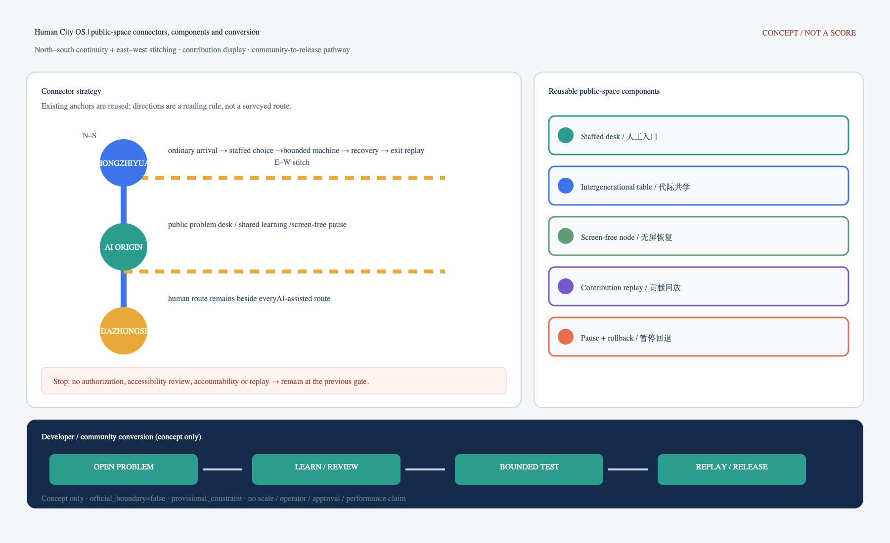

This increment changes evidence legibility and transferability only. It does not change `geometry`, `metrics`, the five core figures or publication ordering. All anchors remain `official_boundary=false` and `geometry_role=provisional_constraint`; activities, components and conversion remain conceptual suggestions / reference schemes for professional teams to deepen. When official boundary, rights, heritage, accessibility, climate, data-authorization and operation inputs arrive, recompute the figures, HTML, PDFs, manifest and self-check together.[data:visual/assets/check-public-space-operations-v25.js] [depth:metrics_recalculation] [depth:risk_missing_data]

## v2.4 Evidence crosswalk and policy boundary | Make every requirement independently replayable

v2.4 adds no new spatial commitment. Instead, each of the 23 announcement / taskbook requirements now has a shortest package-local evidence chain in `compliance_matrix.json`: `evidence_items` provides a unique entrance, spatial or structural references, and a review boundary; `reviewer_evidence_map.differentiator_zh` records why that response is more than an AI showcase. A reviewer can therefore audit a requirement without treating one repeated summary table as proof of every claim.[data:compliance_matrix.json] [depth:brief_alignment]

`assumptions.json` now labels every missing input with a `priority`. High priority means that the missing input would change space, metrics, or a release gate; it does not mean that the input is solved. Official boundaries, road / airspace, rights, public baselines, energy, climate, authorization, and operational outcomes remain open.[data:assumptions.json] [depth:risk_missing_data]

`metrics.json` adds `proposal_baseline_not_measured` `design_target` objects to `operational_pue` and `green_electricity_share`. The first only references Beijing computing-infrastructure policy direction; the second explicitly treats 30% as a proposal baseline derived from a specified existing-data-centre target band. Neither is a project statutory control, permit conclusion, or measured performance.[source:BJ-COMPUTE-2024] [source:BJ-DATACENTER-2024]

Once authorized energy design, credentials, and metering exist, drawings, HTML, PDFs, and self-check must be recalculated together.[metric:operational_pue] [metric:green_electricity_share]

This increment improves evidence legibility, missing-data ordering, and policy boundaries only. It does not turn any unknown into an outcome or create an official score, government endorsement, or implementation approval.[depth:metrics_recalculation] [depth:risk_missing_data]

## v2.3 six-step city-API sequence | Make callability replayable as accountability

v2.2 put “where the spatial relationship sits” and “how a person enters, refuses, pauses and exits” on one first-screen board. v2.3 turns the city API from a sentence into a six-step replayable sequence: **catalogue → authorize → call → log → audit → exit**. Each step provides a spatial anchor, an accountability role, a human equivalent, a stop/return trigger and an in-package evidence entry, so a reviewer can follow who may call, why, and when the call must stop.[data:visual/assets/city-api-sequence-v23.json] [depth:municipal_new_infrastructure] [depth:phasing_implementation]

Figure 26 is a presentation-level urban-design diagram, not an API deployment architecture, engineering section or operating result. The six steps use only existing provisional anchors—`PUBLIC-B-API`, `SC-B01`, `SC-B04`, `SC-C04` and `PHASE-V02`—and retain `official_boundary=false`, `geometry_role=provisional_constraint`, `operational_status=not_authorized_not_run` and `performance_results=null`. Staffed, telephone, paper and offline explanation/withdrawal routes remain alongside AI; failure to replay or unclear accountability returns to the prior release gate.[data:geometry/public_space.geojson#PUBLIC-B-API] [data:geometry/constraints.geojson#SC-B01] [data:geometry/phasing.geojson#PHASE-V02]

The offline check for the six-step sequence is recorded at [data:visual/assets/city-api-sequence-v23-evidence.json]; it proves only that fields, references, stop boundaries and bilingual figures replay locally, not interface capability, permits, operation or any score.

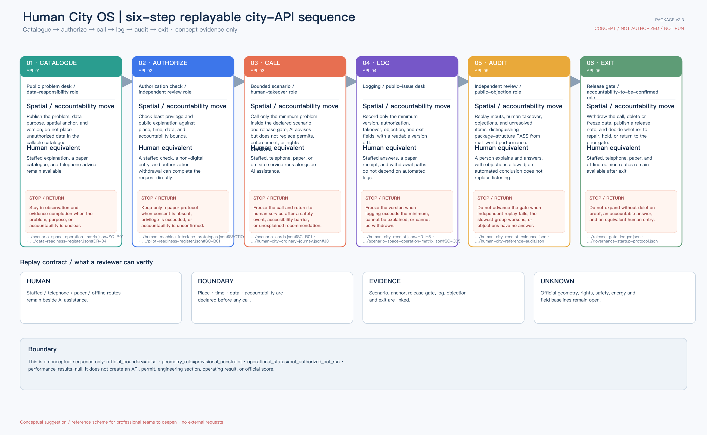

The six test-oriented records now also state `first_evidence_needed_zh/en` and `first_evidence_owner_zh/en`. These fields say what the first evidence would be and which class of to-be-authorized role would review it; they do not turn a suggested role into a confirmed operator.[data:visual/assets/pilot-readiness-register.json] [depth:risk_missing_data]

Parametric trade-offs no longer show only that candidates exist: `parametric-tradeoff-study-evidence.json` adds `decision_diff`, recalculating the deltas for community retention, reversible meanwhile space, and the API/embodied band from existing baseline shares, variant shares and derived areas. `status=conceptual_comparison_only`; no formal geometry, metrics, drawings or release state changes.[data:visual/assets/parametric-tradeoff-study-evidence.json]

The deltas reconnect to the existing community-retention support area, reversible-space ratio and metric-recalculation rules.[metric:community_retention_support_area_ratio] [metric:reversible_space_ratio] [depth:metrics_recalculation]

### One reviewer-readable AI spatial delta | Callability is not the only objective

The table below expands only the existing `people_first` versus `baseline_reproduction` calculation so a reviewer can see what the spatial trade-off changes before opening the JSON. It is not a recommendation, an existing condition, a settled plan, or a formal area metric. All three rows use the same provisional site-area input; `derived_area_sqm_delta` is for conceptual comparison only.[data:visual/assets/parametric-tradeoff-study.json] [data:visual/assets/parametric-tradeoff-study-evidence.json] [data:visual/assets/spatial-action-rooms-v21.json]

| Existing spatial band | baseline → people-first | share delta | derived area delta (sqm) | Linked spatial-action room |
| --- | ---: | ---: | ---: | --- |
| Community retention and services (LU-H01) | 18.2759% → 24.0000% | +5.7241 pp | +653,284.939 | Beijing AI Origin Community: retention ledger, staffed access, screen-free recovery |
| Reversible meanwhile use (LU-B01) | 15.0936% → 18.0000% | +2.9064 pp | +331,703.646 | Blue-green stay, meanwhile use, and exit/replay path |
| City API and embodied-AI research (LU-B02) | 15.4835% → 11.0000% | −4.4835 pp | −511,691.664 | Zhongzhiyuan: bounded test, staffed takeover, stop/exit |

This table improves delta visibility only. Formal geometry, areas, metrics, permits, and operating results still require a full recalculation after official inputs arrive.[depth:metrics_recalculation] [depth:risk_missing_data]

v2.3 improves accountability readability, implementation reviewability and expression completeness only. It adds no official boundary, development quantum, building height, engineering alignment, capacity, investment, permit, settled policy or operating-performance claim. When official geometry, rights, road/airspace, safety, energy, climate, authorization and public-baseline inputs arrive, recompute the sequence board, readiness register, parametric replay, metrics, HTML, PDFs and self-check together.[depth:risk_missing_data]

## v1.9 One-page execution brief | from taskbook to spatial response

This page answers three reviewer questions first: what the brief asks for, how the concept translates it into space, and where each claim can be checked. The package remains a conceptual suggestion / reference scheme for professional teams to deepen. The three focus areas and two wings are `official_boundary=false` and `geometry_role=provisional_constraint`; they are not official redlines or implementation boundaries.[source:AGENT-TASKBOOK] [data:visual/assets/brief-alignment-atlas-v19.json]

### Three positions, five functions, three areas and two wings

| Brief layer | Spatial translation in this proposal | Shortest review entry |
| --- | --- | --- |
| Three positions | Jing-Zhang Centennial Heritage Belt: retain a continuous public memory in the Dazhongsi and Jing-Zhang narrative; Urban AI Everyday-Life Belt: make human channels, intergenerational learning and screen-free everyday life work first in the AI Origin Community; AI Integration and Innovation Belt: place innovation in pausable, replayable interfaces around Zhongzhiyuan and the Zhongguancun service wing. | `assets/figures/brief-alignment-atlas.en.png`; `proposal.en.md`; `geometry/key_areas.geojson` |
| Five functions | Full-stack AI self-innovation system, world-class AI innovation ecosystem, AI+ scenario enablement paradigm, intelligent/vibrant AI city, and global voice in AI governance return to controlled tests, case/region interfaces, 17 scenario cards, public-space/mobility blue-green moves, and versioned release gates. | `visual/assets/brief-alignment-atlas-v19.json`; `compliance_matrix.json` |
| Three areas + two wings | Zhongzhiyuan AI Self-innovation Accelerator, Beijing AI Origin Community, Dazhongsi AI Industry Cluster; Zhongguancun Technology-Service Wing and Xiaoyuehe Scenario-Enablement Wing. Each unit has an action, scenario, data gap, and exit condition, without adding engineering dimensions or an operating entity. | `geometry/key_areas.geojson`; `visual/assets/spatial-action-atlas.json`; `visual/assets/regional-interface-ledger.json` |

### Four differentiated chains land in scenes, metrics and gaps

| Chain | Visible spatial move | Scenes / metric | What the package cannot yet prove |
| --- | --- | --- | --- |
| A Human dignity | Community-retention forum, human and intergenerational channels, skill-transition corridor, screen-free recovery landscape | `SC-A01` / `SC-A03` / `SC-A05`; `community_retention_support_area_ratio` | Resident/shop baselines, sustained employment, equivalent human-service walk-through, informed consent |
| B Machine usability | City API exchange, constrained embodied-AI test, silicon right-of-way and conceptual low-altitude layering | `SC-B01` / `SC-B02` / `SC-B04`; `silicon_right_of_way_length_m` | Road, airspace, safety, insurance, responsibility and interface authorization sections |
| C Hard constraints | Compute-energy/heat audit, flood/sponge simulation, regulatory-sandbox incident replay, public-data authorization room | `SC-C01`—`SC-C05`; `operational_pue` remains `unknown` | Energy/heat network, hydrology, insurance responsibility, formal data authorization and professional review |
| D Spillovers | OPC shared experiment, standards studio, version release note, international service room | `SC-D01`—`SC-D04`; `version_release_count` | Actors, IP licensing, cross-region cooperation and service-capacity verification |

Figure 22 compresses this map into a reviewer-facing board; the JSON records each row's `spatial_refs`, `scenario_refs`, `metric_refs` and `data_gap`. It demonstrates that the brief, spatial move and evidence can be traced together. It generates no official score and does not turn visual completeness into field performance.[data:assets/figures/brief-alignment-atlas.en.png] [depth:overall_spatial_structure] [depth:risk_missing_data]

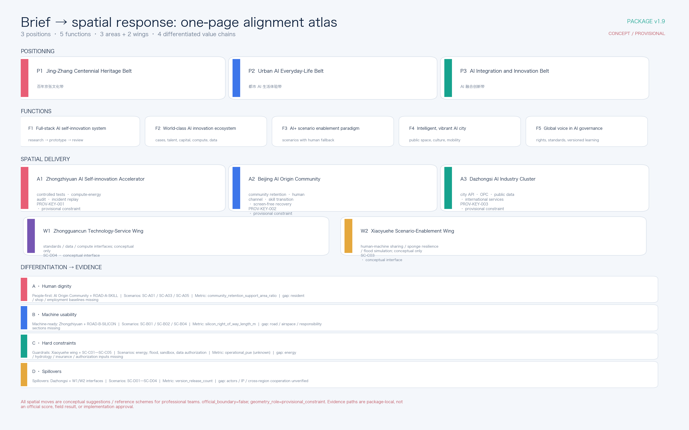

## v2.0 Public space, cultural narrative and annual operation | Bring agent.4–agent.6 onto the drawing

The brief's public space, landmarks, cultural narrative and annual operation meet in one concept board: landmarks carry readable everyday public actions, the four-season rhythm carries versioned governance, and the project families connect spatial moves to evidence gates and exit conditions. All remain conceptual suggestions for professional teams to deepen; no operator, venue, permit, funding or performance is named.[source:AGENT-TASKBOOK] [data:visual/assets/public-culture-operations-atlas-v20.json]

| Design layer | Three readable landmarks | Four-season rhythm | Current evidence and gaps |
| --- | --- | --- | --- |
| Public space + new industry | People's Version Hall: issues, changes, withdrawals; Rail Interface Clock: railway time and city versions; Screen-free Recovery Beacon: shade, sound, night safety and no forced interaction | Spring: public problem open week; summer: city API + embodied test month; autumn: work transition + OPC co-creation; winter: city version conference | `SC-C05`, `SC-D02`, `GREEN-A-QUIET-1`, 17 scenario cards; formal venue, accessibility, thermal comfort, night safety and participation baselines remain pending |
| Project families + release gates | PF-A human buffer, PF-B city API, PF-C human-machine/climate/compute-energy, PF-D data authorization/version governance, PF-E ecology/spillovers return to the three areas/two wings and v0.1/v0.2/v1.0 concept gates | Each season opens only the concept moves covered by its evidence gate; without human explanation, independent replay, accountable response or public-objection handling it stays at the prior gate | `visual/assets/implementation-operation-matrix.json`; no schedule, budget, capacity or operating commitment is generated |

The cultural grammar is “rail — time — interface”: rail carries Jing-Zhang continuity, time carries the annual version, and interface carries public explanation and final human authority. The three landmarks are not corporate showcases; they place history, ordinary-person recovery and a question-able city version on one public spine.[data:assets/figures/public-culture-operations-atlas.en.png] [depth:renewal_project_list] [depth:overall_spatial_structure]

Figure 23 expresses conceptual relationships and replayable operating boundaries only. Every anchor remains `official_boundary=false` and `geometry_role=provisional_constraint`. When formal public-space, heritage, road, accessibility, thermal, night-safety, energy, venue-authorization and resident-feedback inputs arrive, the landmarks, annual rhythm, matrices, metrics, HTML and PDFs must be recalculated together.[data:visual/assets/public-culture-operations-atlas-v20.json] [depth:risk_missing_data]

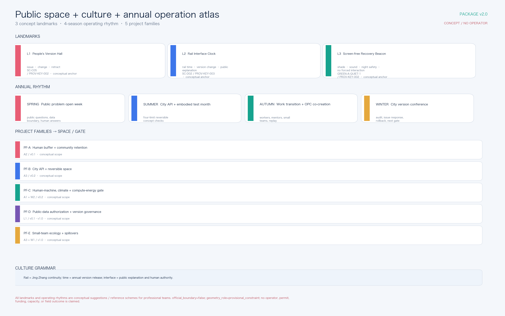

## v2.1 spatial action rooms | Read each focus area as a walkable sequence

v2.0 answered how public space and annual rhythm receive the brief. v2.1 makes each provisional focus area's first question legible through five continuous spatial rooms: arrival / staffed edge → public explanation / choice → bounded machine interface → blue-green pause / recovery → exit, appeal and replay. Each room states the human equivalent, machine limit, and stop/return action so the spatial proposal does not depend on a reviewer reconstructing the move from governance ledgers.[data:visual/assets/spatial-action-rooms-v21.json] [depth:three_key_area_detailed_design] [depth:overall_spatial_structure]

Figure 24 is a presentation-level concept board, not a debug screenshot or engineering section. The left column returns to the three `official_boundary=false`, `geometry_role=provisional_constraint` GeoJSON anchors; the five color blocks represent spatial-action stages, not distance, area, storeys, capacity, or alignment. Scenario and metric references, data gaps, and the recomputation trigger are registered in the paired JSON.[data:assets/figures/spatial-action-rooms-v21.en.png] [data:geometry/key_areas.geojson#PROV-KEY-001]

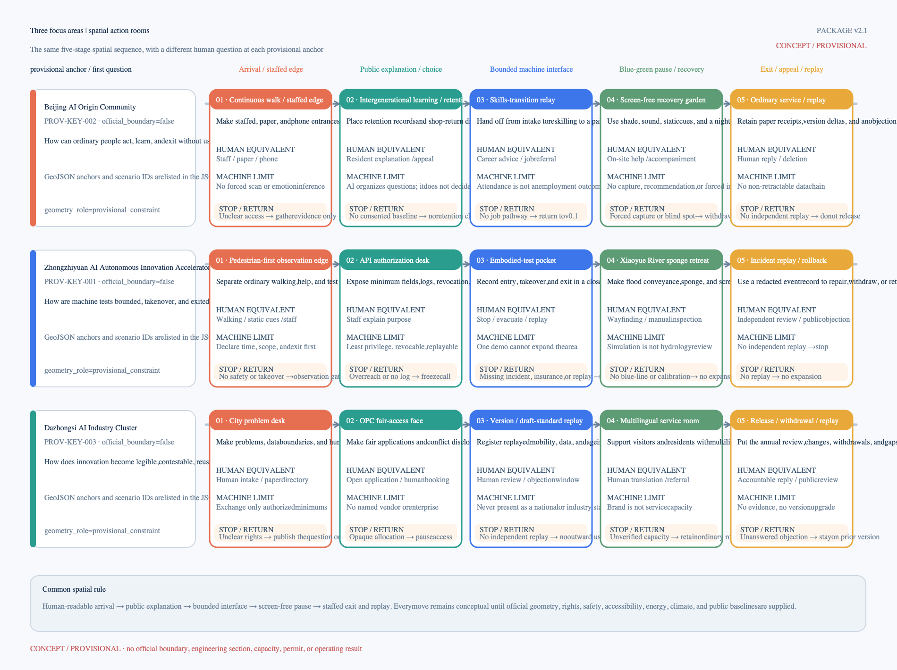

All three focus areas remain conceptual suggestions / reference schemes for professional teams to deepen. If official geometry, roads/airspace, rights, accessibility, energy, climate, accountability, public baselines, or authorization inputs change, this board, the five core figures, metrics, HTML, PDFs and self-check must be recomputed together; no formal geometry or metric changes in this iteration.[data:visual/assets/spatial-action-rooms-v21.json] [depth:metrics_recalculation] [depth:risk_missing_data]

## v2.2 reviewer first screen | Put spatial evidence and human action on one board

The five-stage rooms in v2.1 are replayable node by node. v2.2 puts them back into the first `site-overview.png` a reviewer sees: the left panel is the same GeoJSON in a display transform, the right panel is a compact three-area × five-stage action sequence, and the bottom records the retained human path, the EPSG:4548 metric source, and the missing official boundary/rights/safety/energy/field-baseline inputs. “Where does the spatial relationship sit?” and “How does a person enter, refuse, pause, and exit?” can now be read together instead of reconstructed across two figures.[data:visual/assets/reviewer-facing-atlas-v22.json] [data:assets/figures/site-overview.en.png]

This first screen responds to the taskbook dimensions of scenario perceptibility and spatial clarity. Three-key-area detailed design carries the first formal depth evidence [depth:three_key_area_detailed_design], while overall spatial structure carries the second [depth:overall_spatial_structure].

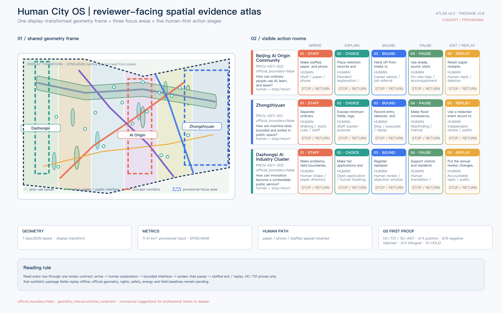

Figure 25 improves expression-level urban-design readability only. The belt is a display transform for legibility; pixel distance is not used as metric evidence. The provisional boundary remains `official_boundary=false` and `geometry_role=provisional_constraint`, and every action card remains a conceptual suggestion / reference scheme for professional teams to deepen. If official polygons, road/airspace sections, rights, accessibility, energy, climate, accountability or public baselines change, recompute the five core figures, Figure 24, metrics, HTML, PDFs and self-check together.[data:visual/assets/reviewer-facing-atlas-v22.json] [data:geometry/site_boundary.geojson#SITE-001] [depth:metrics_recalculation]

Risk and data-gap fallback continues under [depth:risk_missing_data]; the board does not upgrade a provisional display transform into official measurement or an implementation conclusion.

## One-page read | Spatial moves first, governance evidence second

### Design judgment

“From an AI showcase to a city for people in the AI era” does not paste technology language onto a conventional plan. It translates rapid AI iteration into urban interfaces that are **enterable, rejectable, pausable, and reversible**.[source:AGENT-TASKBOOK] [depth:three_level_scope_framework]

Three provisional key areas, a six-layer spatial operating system, four value chains, 17 spatial scenario nodes and three release gates resolve to one evidence chain.[metric:key_area_count] [metric:scenario_node_count] [metric:version_release_count]

### Four value chains become spatial moves

| Value chain | Readable conceptual move | Package evidence | Data still required |
| --- | --- | --- | --- |
| A Human dignity | Resident retention and service repair, a skills-transition corridor, human/phone/paper access, no-screen green space and wellbeing support | `LU-H01`, `ROAD-A-SKILL`, six base personas plus three public-interest extensions, seventeen scenario cards | Resident baseline, small-business and employment follow-up, accessibility walk-through and authorized operations records |
| B Machine-ready | Urban API exchange, silicon right-of-way test field, layered low-altitude logistics, reversible components and a public digital-twin bench | `LU-B01`/`LU-B02`, `ROAD-B-SILICON`, interface prototypes | Traffic/aviation/safety sections, interface responsibility, professional models and field tests |
| C Hard constraints | Compute-power and heat audit, floodway and sponge simulation, regulatory sandbox, public-data authorization and version release room | `SC-C01`—`SC-C05`, three release gates, five-stage startup protocol | Energy/heat network, hydrology, insurance/liability, data authorization and formal boundary |
| D Spillover | OPC shared lab, standards spillover studio and international service room that turn R&D records into reusable protocols | `SC-D01`—`SC-D03`, three-area interfaces | Participants, IP permissions, cross-region cooperation and service verification |

### Three key areas are not three showcases

| Provisional key area | Question | Representative spatial move |
| --- | --- | --- |
| Zhongzhiyuan AI autonomy accelerator | How are machines constrained and stopped? | Controlled embodied-AI testing, compute-power audit, restricted right-of-way and incident review |
| Beijing AI Origin Community | How can ordinary people avoid digital exclusion? | Human channels, intergenerational learning, skills transition, resident retention and screen-free green |
| Dazhongsi AI industry cluster | How does innovation become a public daily interface? | Cultural narrative, OPC/small-team services, international support and public display |

All three boundaries are `official_boundary=false` and `geometry_role=provisional_constraint`; they express spatial relationships for recalculation, not official redlines, tenure boundaries or engineering locations.[data:geometry/key_areas.geojson#PROV-KEY-001] [data:geometry/key_areas.geojson#PROV-KEY-002] [data:geometry/key_areas.geojson#PROV-KEY-003]

### A small recomputable metric set calibrates the trade-offs

The submission boundary recalculates to 11,412,825.386 square metres in EPSG:4548 (low confidence, provisional geometry); green space is 11.1213% and public space 1.0641%.[metric:site_area_sqm] [metric:green_ratio] [metric:public_space_ratio]

Retention-support land is 18.2759% and reversible reserve 15.0936%; the skills-transition corridor, silicon right-of-way and low-altitude concept corridor are 5,919.240 m, 4,585.615 m and 2,015.137 m respectively.[metric:community_retention_support_area_ratio] [metric:reversible_space_ratio] [metric:skill_transition_corridor_length_m]

These are recomputable conceptual quantities, not statutory indicators, engineering lengths or performance commitments; road length and the low-altitude corridor remain separately traceable to geometry.[metric:silicon_right_of_way_length_m] [metric:low_altitude_concept_corridor_length_m]

### Three release gates bridge a ten-year city cycle and three-month AI iteration

`PHASE-V01` covers observation, baseline and public sense-making; `PHASE-V02` permits only reversible, exit-ready conceptual pilots; `PHASE-V10` is the point for expansion and standards spillover after professional review.[data:geometry/phasing.geojson#PHASE-V01] [data:geometry/phasing.geojson#PHASE-V02] [data:geometry/phasing.geojson#PHASE-V10]

Every gate retains an equivalent human service, unconfirmed accountability, data gaps and stop actions. These remain conceptual suggestions; no authorization, operation, approval or implementation is claimed.[depth:phasing_implementation]

**First-read boundary:** the package can prove that spatial moves, evidence references, metric formulas and fail-closed paths are replayable offline. It cannot prove official boundaries, resident or employment outcomes, PUE/green-power, heat-network connection, traffic safety, permits, investment or real operations. Gaps remain in `assumptions.json`, `metrics.json` and the readiness register for later recalculation when public or authorized data arrives.[depth:risk_missing_data]

## v1.4 spatial sequence | Walk the human path before calling the machine

The previous revision answered what each key area should do. This revision compresses that work into a sequence that a reviewer and an ordinary person can follow across the drawing: **arrival and dwell → staffed explanation and choice → bounded machine interface → blue-green pause → exit, appeal, and replay**. It is not another showcase axis or a renamed governance ledger; it places the visible spatial cue, machine boundary, and failure action in one row for professional deepening.[data:visual/assets/human-city-spatial-sequence.json] [depth:overall_spatial_structure]

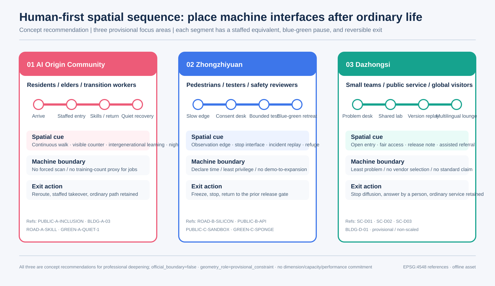

| Provisional key area | Human-visible spatial sequence | What the machine may do | Spatial action on failure | Evidence still required |
| --- | --- | --- | --- | --- |
| Beijing AI Origin Community | Continuous walk and staffed wayfinding → service hall/intergenerational learning → skills transition and small-business return forum → screen-free recovery green | Suggest translation, queuing, or job information; no forced scan and no training-count proxy for employment | Reroute, staffed takeover, telephone/paper path retained; no retention or transition ratio without a credible baseline | Official boundary, accessibility walk-through, consented resident/shopkeeper baseline, night-service capacity |
| Zhongzhiyuan AI autonomy accelerator | Slow pedestrian-priority observation edge → API authorization desk → bounded embodied test and incident replay → Xiaoyue River sponge retreat | Simulate or test only in declared windows and least privilege; no demo-to-expansion inference | Freeze calls, stop, return to the prior release gate; no test without safety, insurance, accountability, and replay | Official boundary, road/airspace review, insurance/incident protocol, hydrology and drainage inputs |
| Dazhongsi AI industry cluster | Public urban-API problem desk → fair OPC application/shared lab → version/standards replay → multilingual staffed service lounge | Exchange the least authorized problem and version; no vendor selection and no national-standard claim | Stop diffusion, answer by a person, ordinary service retained; no next gate without independent replay | Official boundary, shared-lab access rules, rights/IP protocol, multilingual and health-service capacity |

All three sequences reuse existing GeoJSON anchors; functional bands and interface relationships carry no engineering dimensions. `official_boundary=false`, `geometry_role=provisional_constraint`, and `operational_status=not_authorized_not_run` remain unchanged. Figure 15 and its JSON prove only that the spatial reading order and fallback logic are traceable; they do not prove actual roads, buildings, staff, blue lines, airspace, capacity, performance, or implementation authorization.[data:geometry/key_areas.geojson#PROV-KEY-001] [data:geometry/key_areas.geojson#PROV-KEY-002]

The third key-area anchor, the overall provisional area, and data gaps remain registered under the same rule; once cleared or official inputs arrive, the package must be recomputed as a whole.[data:geometry/key_areas.geojson#PROV-KEY-003] [metric:site_area_sqm] [depth:risk_missing_data]

## v1.5 design mainline | Walk the Jing-Zhang public spine before calling the machine

The v1.4 cards answered how each focus area can stop. This iteration connects the three provisional areas in the announced north-to-south order as one readable mainline: enter and dwell first, then receive staffed explanation and choice, and only then open a bounded machine interface; the blue-green pause and exit replay remain conditions after the machine edge.[data:visual/assets/human-city-mainline.json] [data:geometry/key_areas.geojson#PROV-KEY-001] [depth:overall_spatial_structure]

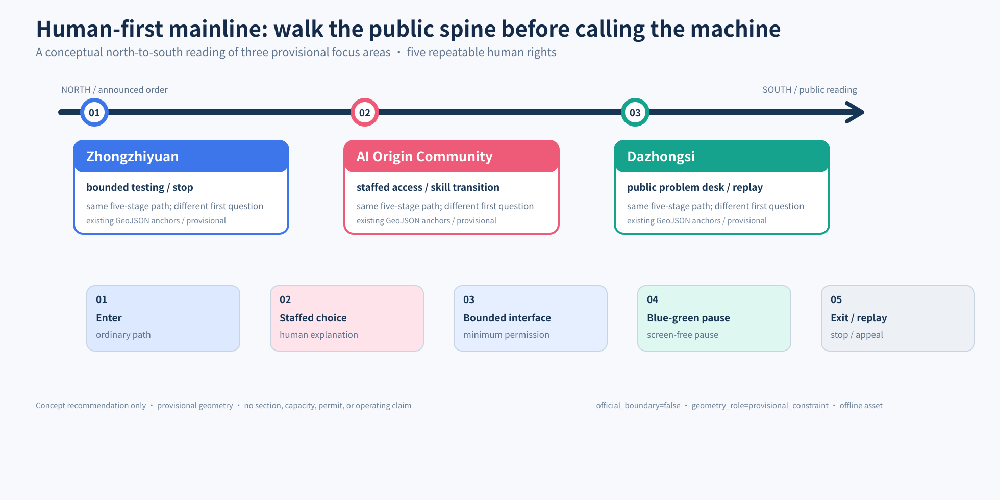

Figure 16 only rearranges existing spatial anchors and five spatial actions; it adds no distance, section, capacity, or operating fact. The north-to-south order is a conceptual reading rule, not an official alignment. Once official polygons, roads, rights, heritage, hydrology, airspace, and public baselines arrive, figures, metrics, and release gates must be recomputed together.[data:visual/assets/human-city-spatial-sequence.json] [depth:risk_missing_data]

## v1.5 planning exploration | From three hand-set candidates to a replayable search set

Beyond the existing three transparent candidates, this iteration generates 128 candidates over the six conceptual bands with a fixed seed, recomputes the four existing comparison lenses, and retains a non-dominated set. The search makes a machine-replayable trade-off process visible; it does not turn proxy values into AI capability, resident outcomes, or a formal recommendation.[data:visual/assets/parametric-search.json] [metric:site_area_sqm] [depth:metrics_recalculation]

`visual/assets/parametric-search-evidence.json` records candidate constraints, area formulas, proxy lenses, non-dominated filtering, and the boundary that formal geometry/metrics do not change; `confidence=low` and every data gap remain intact.[data:visual/assets/parametric-search-evidence.json] [data:geometry/land_use.geojson#LU-H01] [depth:risk_missing_data]

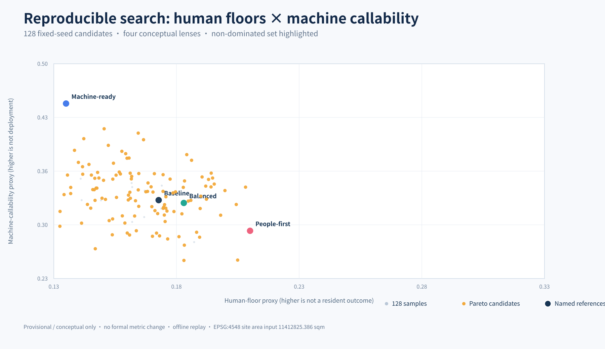

Candidate shares are conceptual comparisons over the same provisional site; areas still reconnect to the existing EPSG:4548 `site_area_sqm` formula. They create no FAR, building-height, retain/renew/demolish, engineering, investment, or policy conclusion.[metric:site_area_sqm] [metric:design_partition_area_sqm]

## v1.5 conceptual delivery spine | Project family, gate, evidence, and stop in one view

Governance ledgers no longer occupy the first visual read on their own. Figure 18 compresses the existing PF-A–PF-E families, v0.1/v0.2/v1.0 release gates, entry evidence, and failure returns into one review skeleton. It reuses only the suggested roles and stop protocols in `implementation-operation-matrix.json`; it adds no accountable operator, budget, schedule, permit, or operating commitment.[data:visual/assets/human-city-delivery-spine.json] [depth:phasing_implementation] [depth:risk_missing_data]

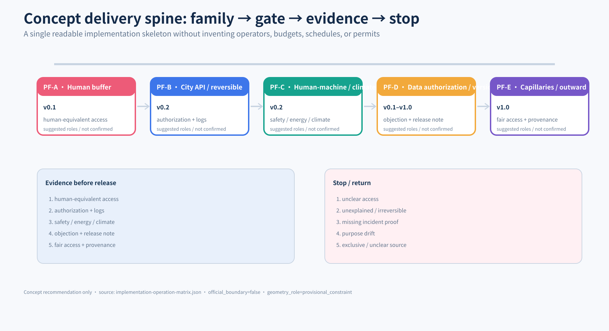

Every family remains `conceptual_governance_not_commitment`, and suggested roles are not confirmed operators. After official boundaries, rights, energy, climate, mobility, accessibility, accountability, and public inputs arrive, professional teams may selectively recompute and deepen the package.[data:visual/assets/implementation-operation-matrix.json] [data:geometry/site_boundary.geojson#SITE-001] [depth:risk_missing_data]

## v1.6 spatial evidence figures | Let the reviewer see the relationships first

This round replaces the five review-visible core figures with one-source spatial evidence maps. The overview overlays the provisional site boundary, six bands, three focus areas, five conceptual centerlines, green spaces, public interfaces, and sixteen scenario nodes. The focus-area figure then enlarges the three true submitted outlines in the same coordinate frame and places differentiated actions beside their local geometry: community retention and skills transition, staffed access and intergenerational learning, and the regulatory sandbox with the public-data interface.[data:visual/assets/spatial-proof-v16.json] [data:geometry/key_areas.geojson#PROV-KEY-001] [depth:overall_spatial_structure]

Areas, shares, and lengths in the figures are recomputed from `metrics.json` and the GeoJSON in EPSG:4548. The northward rotation makes the long corridor legible from left to right; the scale note describes only the provisional display frame. `official_boundary=false`, `geometry_role=provisional_constraint`, and `operational_status=not_authorized_not_run` remain explicit in the figure labels and evidence record.[data:geometry/site_boundary.geojson#SITE-001] [metric:site_area_sqm] [depth:metrics_recalculation]

These figures make the spatial relationships inspectable; they do not replace official boundaries, controls, road redlines, rights, blue lines, airspace review, existing-condition surveys, resident baselines, or operational tests. Once those inputs arrive, the five figures, matrices, metrics, HTML, and PDFs must be recomputed as one package. All spatial moves remain conceptual suggestions or reference schemes for professional teams to deepen.[data:visual/assets/spatial-proof-v16.json] [depth:risk_missing_data]

## v1.7 spatial expression upgrade | Make node actions legible in the review window

v1.6 replaced abstract bands with the submitted geometry. v1.7 addresses the reading scale. The overview now carries three focus-area zooms that return to `PROV-KEY-001`, `PROV-KEY-002`, and `PROV-KEY-003`; the focus-area board places each outline beside its differentiated action chain; the human-machine figure places skill transition, silicon right-of-way, the conceptual low-air layer, and Xiaoyue River sponge resilience beside a repeated crossing rule; and the metric board makes the geometry → metric → missing-input sequence explicit.[data:visual/assets/spatial-proof-v17.json] [data:geometry/key_areas.geojson#PROV-KEY-001]

This expression supports the reading of detailed focus-area design and overall spatial structure; `ROAD-B-SILICON` and the other actions still return to the structured ledgers for review.[data:geometry/roads.geojson#ROAD-B-SILICON] [depth:three_key_area_detailed_design] [depth:overall_spatial_structure]

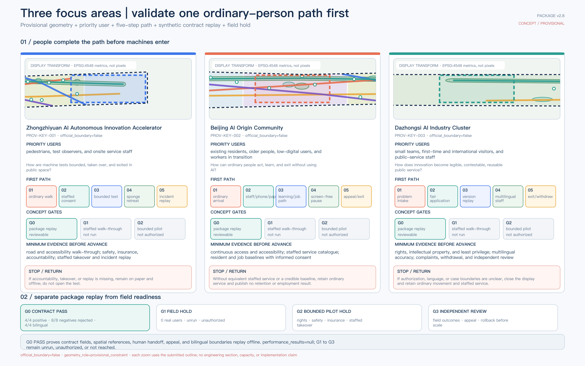

The zooms help a reviewer check node relationships, but they are not surveys or engineering details. The short axis is expanded for reading; pixels do not enter area, ratio, or length calculations.[data:visual/assets/spatial-proof-v17.json]

Numbers still come from `metrics.json` and GeoJSON recomputation in EPSG:4548; the package can currently replay site area and the community-retention support-area proxy.[metric:site_area_sqm] [metric:community_retention_support_area_ratio] [depth:metrics_recalculation]

Every unknown remains a data gate; resident retention, employment transition, manual-service equivalence, PUE, green power, and recovered heat do not become outcomes because the figure is more complete.[depth:risk_missing_data]

## v1.8 seven-dimension reviewer readback | Put the question, evidence, and boundary on one page

This round connects the seven repository formal-workflow questions to their shortest in-package paths. `formal-scorecard-readback-v18.json` records each question, known evidence, remaining boundary, and next authorized verification; it governs review order and produces no score.[data:visual/assets/formal-scorecard-readback-v18.json] [data:visual/assets/reviewer-navigation-index.json]

Figure 21 places the seven reading routes and five evidence spines on one page. The 20%, 10%, 15%, 20%, 10%, 10%, and 15% values belong only to the repository workflow template; they are not an organizer score. Provisional geometry, unknowns, conceptual suggestions, and not-authorized states remain at their declared evidence levels.[data:assets/figures/reviewer-scorecard-map.en.png] [standard:PROJECT-AGENT-OPEN-CALL-TASKBOOK] [depth:risk_missing_data]

The page asks the reviewer to start with a question, return to the prose, ledgers, drawings, and manifest, and then see which verification must be supplied by an authorized professional team. It creates no score for this submission, official review conclusion, award prediction, or implementation proof; the bilingual text and audit ledger are updated together.[data:visual/assets/bilingual-equivalence-audit.json] [depth:risk_missing_data]

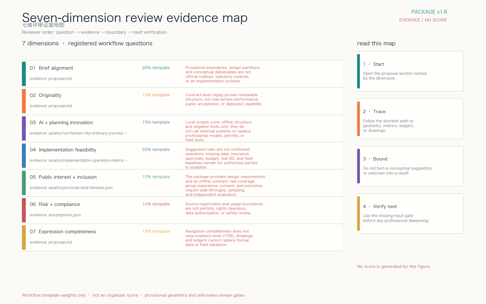

## v0.2 score repair | Read the three key areas as spatial action chains

This iteration does not add another abstract AI slogan. It decomposes each provisional key area into four actions. Each action names a spatial carrier, role class, entry evidence, and stop condition, so a reviewer can move from the figure back to GeoJSON, scenario cards, and metrics instead of treating an “AI showcase” as an urban-design conclusion. Full fields are in `visual/assets/spatial-action-atlas.json`; every move remains a conceptual suggestion for professional teams to deepen.[data:visual/assets/spatial-action-atlas.json] [data:geometry/key_areas.geojson#PROV-KEY-001]

The other two provisional outlines are recorded beside it in the same ledger, with no upgrade beyond temporary constraints.[data:geometry/key_areas.geojson#PROV-KEY-002] [data:geometry/key_areas.geojson#PROV-KEY-003]

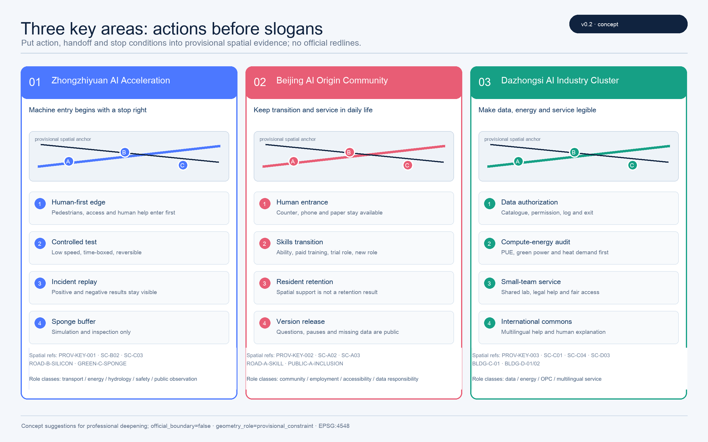

Zhongzhiyuan sequences a pedestrian-priority edge, bounded embodied-AI test, compute-power audit, and incident-review court into a closable test chain. It references `SC-B02`, `SC-C01`, and the silicon-right-of-way geometry.[data:geometry/constraints.geojson#SC-B02] [data:geometry/constraints.geojson#SC-C01] [metric:silicon_right_of_way_length_m]

The chain does not imply real airspace, traffic-safety, PUE, green-power, or recovered-heat outcomes; those checks remain open.[metric:operational_pue] [metric:recovered_heat_mwh]

The Beijing AI Origin Community connects a resident-retention room, staffed and intergenerational learning, a skills-transition handoff, and a screen-free recovery garden into an ordinary-person path. The spatial support area and corridor can be recomputed.[data:geometry/constraints.geojson#SC-A01] [data:geometry/constraints.geojson#SC-A03] [data:geometry/roads.geojson#ROAD-A-SKILL]

Resident retention, small-business return, and sustained employment remain `unknown`; area, training counts, or web accessibility cannot substitute for those outcomes.[metric:community_retention_support_area_ratio] [metric:resident_retention_rate] [metric:sustained_employment_transition_rate]

Equivalent human-service availability also remains `unknown`.[metric:manual_service_equivalence_rate]

Dazhongsi sequences a public urban-API interface, an OPC shared lab, a standards spillover studio, and an international service room into a “question—authorization—replay—exit” interface chain. Regional cooperation exchanges reviewable questions, evidence, and versions; it does not claim partners, companies, administrative agreements, compute coupons, or international institutions.[data:geometry/constraints.geojson#SC-D01] [data:geometry/constraints.geojson#SC-D02] [data:geometry/constraints.geojson#SC-D03]

The version-release count and international-service anchors remain in the structured ledger.[metric:version_release_count]

## Regional interfaces | Exchange questions before claiming cooperation

The taskbook-named Jing-Jin-Ji manufacturing/application link, standards spillover, knowledge circulation, OPC small-team ecology, and international support are written as five interfaces. Each interface states what is exchanged, which conceptual space carries it, and what missing evidence blocks the next version. It is not a signed partnership, an enterprise list, or an investment plan. `visual/assets/regional-interface-ledger.json` records the source boundary, spatial anchor, gap, and stop rule for every interface.[data:visual/assets/regional-interface-ledger.json] [source:AGENT-TASKBOOK] [depth:overall_spatial_structure]

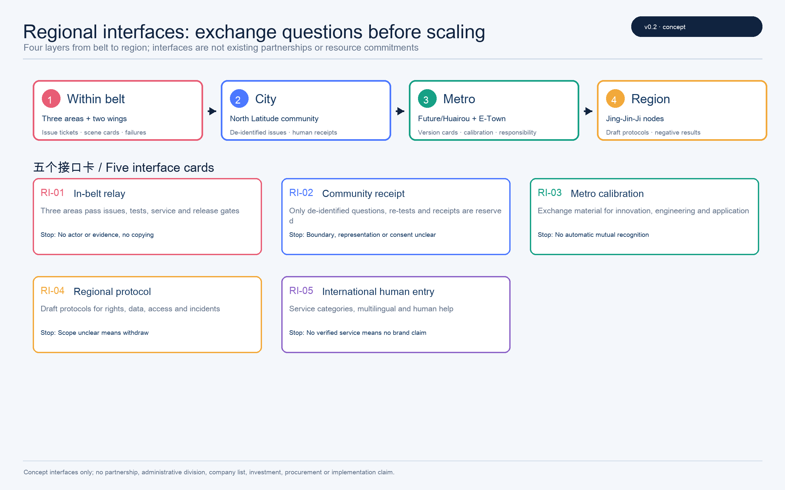

The technical interface moves a Haidian research question toward a Jing-Jin-Ji manufacturing/application discussion. The standards interface outputs only a draft for professional review. The knowledge interface learns through public question lists, incident replays, and annual release notes. The small-team interface keeps fair application and conflict disclosure visible. The international interface is only a to-be-verified service directory for language, medical navigation, IP, and daily support.[data:geometry/constraints.geojson#SC-D01] [data:geometry/constraints.geojson#SC-D02] [data:geometry/constraints.geojson#SC-D03]

Any missing authorization, accountability, rights, copyright, or service capacity returns the interface to the data gate rather than becoming a delivery claim.[depth:risk_missing_data]

## Identity and spatial cards | Make “human city” a legible design language

This iteration adds an author-originated concept identity so drawing headers, scenario cards, human-stop cues, and release notes share one readable grammar. An open bracket, a rail, and a human confirmation point signal callability, historical continuity, and final human authority. The palette serves reading only; it is not an organizer, government, company, or project mark. Fields and rights boundaries are in `visual/assets/brand-identity.json`.[data:visual/assets/brand-identity.json] [data:report/copyright_statement.md] [depth:risk_missing_data]

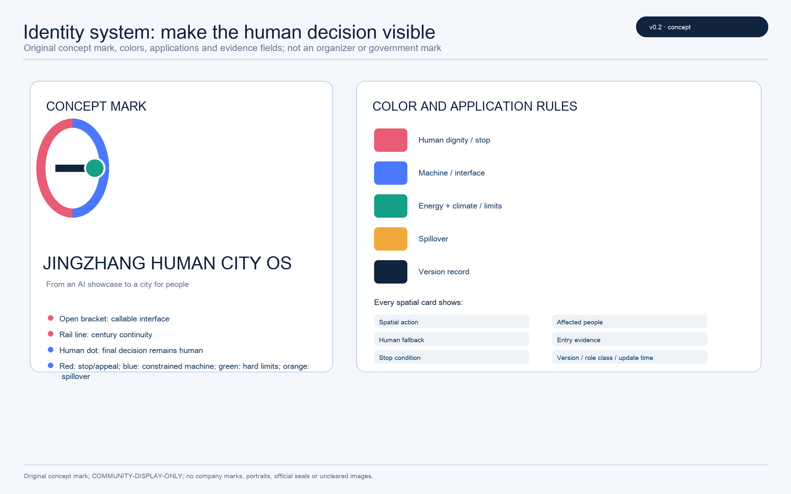

The mark is used only in this package's figures and offline display. Orange marks human takeover and stop, teal marks public interface and blue-green space, yellow marks release gates and data gaps, while navy and paper preserve drawing readability. If official branding, heritage, or public-space visual rules arrive, rights review and professional adaptation must precede any figure or PDF regeneration.[source:SITE-PACKAGE] [depth:risk_missing_data]

## v0.3 score repair | From action atlas to node-level spatial sequence

The action atlas answers what each key area should do. This section makes the intermediate spatial sequence visible: **arrival and dwell → public state/human explanation → functional bands → human takeover or exit → evidence replay**. `visual/assets/spatial-action-node-plans.json` uses only existing provisional anchors. The bands express spatial relationship and state without engineering dimensions; they are not a street section, building plan, bill of quantities, or operating service.[data:visual/assets/spatial-action-node-plans.json] [depth:overall_spatial_structure]

| Node | Anchor sequence | Functional bands (non-scaled; order and state only) | Evidence before entry | Spatial fallback on failure |
| --- | --- | --- | --- | --- |
| AI Origin Community | `PUBLIC-A-INCLUSION` → `BLDG-A-03` → `ROAD-A-SKILL` → `GREEN-A-QUIET-1` | Arrival/dwell forecourt → staffed, telephone and paper entry → skills transition and intergenerational learning → screen-free restorative green | Continuous-entry walk-through, service catalogue, consented baseline and paid pathway | Reroute or remain with human service when the path or human entry fails; outcomes remain `unknown` |
| Zhongzhiyuan | `ROAD-B-SILICON` → `PUBLIC-B-API` → `PUBLIC-C-SANDBOX` → `GREEN-C-SPONGE` | Pedestrian-first observation → human stop and incident review → bounded test/API simulation → sponge buffer and safe retreat | Road/accessibility, safety, blue-line/drainage, authorization, insurance and takeover rehearsal | Freeze testing and return to the prior release gate when takeover or replay is unavailable |
| Dazhongsi | `SC-D01` → `SC-D02` → `SC-D03` | Urban API public-interface hall → OPC shared laboratory → standards replay studio → multilingual human-explanation lounge | Service catalogue, least-privilege authorization, conflict disclosure, rights boundary and accountable role | Freeze calls and retain only the public problem list when access is excessive, unexplained, or lacks human service |

This node plan supplies the visible middle layer showing how spatial carriers hold an ordinary-person journey and stop action; it does not turn functional bands into measured sections. Until official roads, rights, existing facilities, heritage, accessibility, and operating inputs are available, all dimensions, capacities, throughput, and outcome indicators remain pending or `unknown`.[data:geometry/key_areas.geojson#PROV-KEY-001] [depth:risk_missing_data]

# Jingzhang Human City OS

> From an AI showcase to a city for people in the AI era. AI is not the protagonist of the city; it is an auditable, rejectable, and reversible capability serving residents, workers, founders, and public institutions.

The current revision brings three additions into one spatial and service evidence path: the pre-authorization startup protocol, the synthetic human-city handoff receipt, and the Zhongguancun technology-service wing with its parametric spatial trade-off study. They answer who may start, who can take over, and which spatial relationships deserve comparison first. Full fields and offline checks remain in the package assets; space, metrics, operators, permits, and public outcomes retain their conceptual or `unknown` status. [data:visual/assets/governance-startup-protocol.json] [data:visual/assets/human-city-receipt.json] [data:geometry/site_boundary.geojson#SITE-001]

## v0.7: Make Two Review Question Sets Return to the Same Evidence

This iteration repairs a readability gap, not a score opportunity. The repository formal scorecard has seven workflow questions with template percentages, while the taskbook lists thirteen unified review dimensions and registers no local weights. They must not be presented as one “official scoring” system. `reviewer-navigation-index.json` therefore records them separately: the first names only repository-script sources and workflow percentages; the second preserves every taskbook question without inferring a weight or total. Both paths return to the same bilingual prose, geometry, scenario, persona, release-gate, data, and rights ledgers. [source:AGENT-TASKBOOK] [depth:risk_missing_data]

The new network-free `run-reviewer-navigation-audit.js` reads the taskbook, local formal-scorecard scripts, and the package navigation. It verifies all 13/13 taskbook dimensions, 7/7 workflow questions, their 100% template-weight alignment, and 42/42 package-local file paths; negative samples that remove a dimension or replace a path with a nonexistent file must fail. It proves only that reading paths and local vocabularies have not drifted—not design quality, source authority, rights, field performance, reviewer judgement, or any score. Figure 10 compresses the two question sets, five evidence spines, and their shared boundary—missing input stays conceptual or `unknown`—onto one reading page. [data:geometry/site_boundary.geojson#SITE-001] [metric:site_area_sqm] [depth:metrics_recalculation]

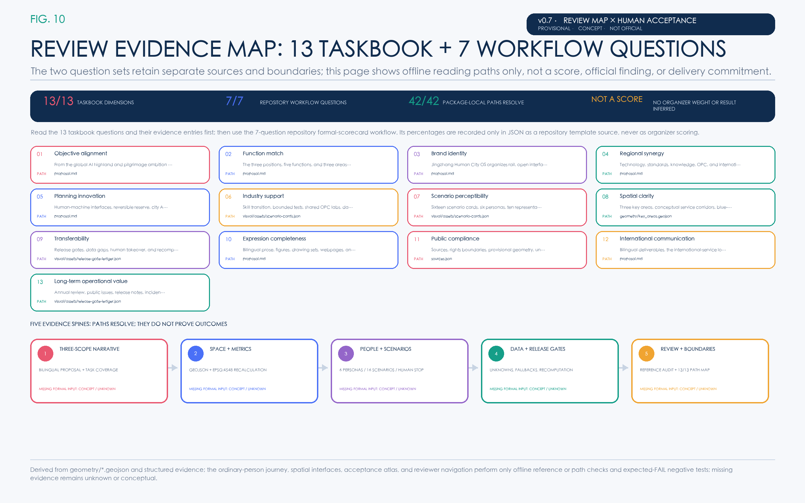

## v0.8: Turn “ready to start” into a pre-authorization acceptance register

This iteration answers the most important delivery question in the review: the scenario cards already describe human takeover and stop actions, but they do not yet make clear when a study may start. `visual/assets/pilot-readiness-register.json` therefore registers all 6 `test_validation=true` scenarios against a baseline, participant and time window, success condition, stop condition, human alternative, final accountability, review period, and deletion proof. Every value stays at “not collected,” “to be defined,” or “freeze before authorization”; no example number is presented as a field result. [data:geometry/phasing.geojson#PHASE-V02] [depth:risk_missing_data]

| Question before entry | Current status | Who still has to complete it |
| --- | --- | --- |
| Baseline and observation scope | Not collected; sampling frame and time window are not frozen | An authorized party and professional evaluator after consent |
| Success and stop conditions | Numeric thresholds freeze before authorization; scenario-card stops for safety, complaints, unauthorized access, accessibility barriers, and unclear accountability already apply | Professional evaluator and on-site safety role |
| Human alternative and accountability | Staffed, telephone, paper, or on-site paths are registered; named shifts, response time, and operator remain unconfirmed | Operator, data-accountability party, and independent reviewer |
| Review, objections, and deletion | Period, public summary, objection response, and deletion proof must enter the release note before start | Authorized party and public-feedback procedure |

This is a pre-authorization working contract. The package contains no site visit, resident interview, survey, operating log, or real performance result; `site_visit_status`, `resident_validation_status`, `stakeholder_engagement_status`, and `field_measurement_status` remain not conducted or not collected. The offline runner checks 6/6 test scenarios, 8/8 required fields, and three negative fixtures covering a missing field, an invented numeric value, and an injected accountability value. A pass proves only that the register has no structural omission; it does not prove approval, deployment, or effectiveness. [metric:manual_service_equivalence_rate] [depth:metrics_recalculation]

## v0.6: Put “who can enter and who can stop” on one spatial page

This iteration reorganizes the acceptance relationships already distributed across six base persona records, three public-interest extensions, seventeen scenario cards, three release gates, and provisional spatial anchors into Figure 09. The six base persona paths start with existing residents/older people, workers at displacement risk, night AI workers, OPCs/small merchants, public-service staff, and disabled or low-digital users; the three extensions register benefit, impact, human alternative, and stop conditions in `public-interest-coverage-v26.json`. Ten directly related scenarios are selected as legible paths, while all seventeen cards, sixteen geometry nodes, and all three release gates remain visible so that representative personas stay alongside the complete scenario registry. [data:geometry/constraints.geojson#SC-A01] [metric:scenario_node_count] [depth:municipal_new_infrastructure]

`visual/assets/human-city-acceptance-atlas.json` records only existing persona, scenario, and gate IDs. Its offline runner resolves 6/6 persona paths, 17/17 scenario cards, 10/10 representative links, 30/30 representative spatial references, 47/47 scenario spatial references, and 3/3 release gates; a fabricated persona anchor must fail. PASS proves only that the figure has not hidden the package's references and stop conditions. It does not prove real human coverage, staffed service, spatial access, field safety, permits, or social performance. [data:geometry/constraints.geojson#SC-C04] [data:geometry/phasing.geojson#PHASE-V10] [depth:risk_missing_data]

The six Figure 09 cards retain the same three questions—human floor, human fallback, and stop/rollback. For example, community retention cannot use a spatial proxy as a real retention rate; skills pathways cannot substitute training counts for employment outcomes; digital entry cannot displace an equivalent human alternative; and public-service AI cannot autonomously decide individual rights. The points remain conceptual anchors in submitted provisional geometry, not actual service points, road alignments, or engineering locations. [data:geometry/public_space.geojson#PUBLIC-A-INCLUSION] [data:geometry/roads.geojson#ROAD-A-SKILL] [metric:manual_service_equivalence_rate]

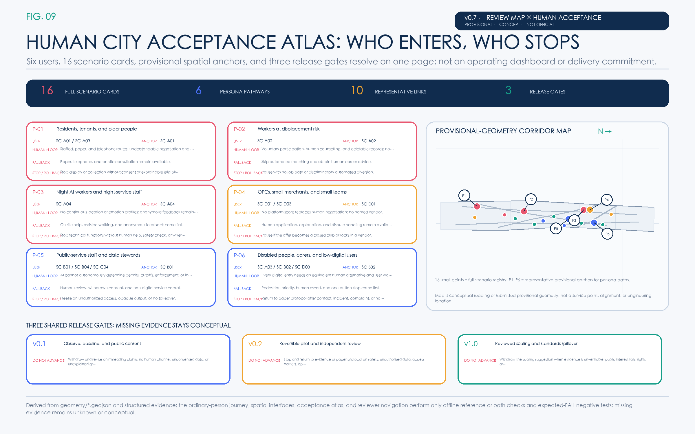

## v0.5: Put human stop actions into spatial interfaces

This iteration adds two **non-scaled spatial-interface prototypes**, without drawing concept corridors as actual street sections. The AI Origin Community places accessible walking, staffed/telephone/paper entry, skills transition, and screen-free green together, so long-term residents, older people, and workers at displacement risk can see one chain of enter → request → human takeover → exit → review. Zhongzhiyuan places a pedestrian-first buffer, a human-stop and incident-review point, bounded human–machine testing, and sponge retreat together, making clear that machine testing cannot skip a person's right to stop. Each prototype binds existing spatial anchors, scenario cards, and concept release gates; every extent remains a conceptual suggestion for professional teams to deepen. [data:geometry/public_space.geojson#PUBLIC-A-INCLUSION] [data:geometry/roads.geojson#ROAD-B-SILICON] [depth:traffic_rail_slow_parking]

`visual/assets/human-machine-interface-prototypes.json` records the human-priority principle, fail-closed action, ordinary-person journey step, trigger, and data-readiness gate for every layer. The offline `check-human-machine-interface-prototypes.js` resolves the complete spatial-anchor, journey, data-gate, and bilingual fallback chain for both prototypes, and uses a nonexistent anchor as a negative sample. Its 17 structural checks prove only that references are traceable; they do not prove a real section, staffing, accessibility, operational safety, permit, investment, or delivery performance. [data:geometry/phasing.geojson#PHASE-V02] [metric:version_release_count] [depth:risk_missing_data]

Figure 08 uses a shared vocabulary of “public entry—human stop—bounded test/replay—data gate” to bring institutional requirements back to spatial interfaces. Before cleared GIS/CAD, existing-condition, road, utility, rights, and professional-review inputs exist, it contains no dimension, capacity, alignment, or engineering conclusion.

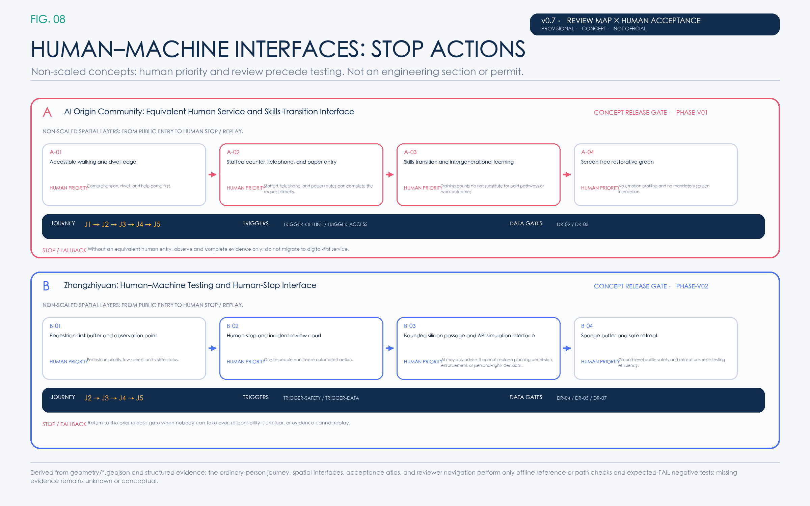

## v0.4: Ordinary-Person Service Journey and Data Readiness

### First accept one service chain that an ordinary person can complete

From a reviewer's and an ordinary person's perspective, the minimum acceptance object of the Human City OS is not a city API. It is a service chain that a person can understand, refuse, and complete: **enter a public space or service point → choose staffed, telephone, paper, or AI-assisted access → request one everyday service → let a person take over when the network is offline, accessibility is blocked, a safety event occurs, or data authorization is unclear → freeze, reroute, appeal, or exit → let an independent reviewer replay the evidence and decide whether to repair, continue, or withdraw**. This remains a conceptual acceptance contract, not an operational, permit, or performance claim.

| Step | Space/service visible to an ordinary person | Evidence to replay | Fail-closed action |
| --- | --- | --- | --- |
| 1. Enter and choose | Community service room, station/public space, staffed counter, telephone, paper, and AI-assisted entry shown together | Entry mode, service-user category, place/version, and accessibility note | Stop at observation and data completion when no equivalent human entry or clear data boundary exists |
| 2. Request | A clear request for translation, queuing, accessible navigation, reskilling, or public-data advice | Purpose, minimum data, accountable role, time window, and alternative path | Register only, without invocation, when permissions exceed minimum, consent is missing, or accountability is unclear |
| 3. Human takeover | A person takes over after outage, accessibility obstruction, safety event, or an unexplained AI recommendation | Trigger, takeover person, handoff time, state change, and complaint route | Freeze automated action and return to staffed/telephone/paper service; stop if nobody can take over |
| 4. Exit and appeal | A person can cancel, reroute, delete data, object, and obtain a non-AI explanation | Exit reason, deletion/restoration action, alternative service, and unresolved item | Withdraw the scene and return to the prior release gate when rights are harmed, evidence is insufficient, or recovery is impossible |
| 5. Independent replay | A reviewer replays one service chain and decides continue, repair, or withdraw | Minimal log, grouped result, objection handling, version, and review decision | Do not expand or report a display PASS as an outcome when the chain cannot be replayed or the slowest group worsens |

The contract is stored in `visual/assets/human-city-ordinary-journey.json`. It binds two minimum replay routes to existing scenario cards, personas, spatial anchors, and release gates: an accessibility/low-digital-capability route uses `SC-A03 + P-06 + PHASE-V01`, while a data-accountability route uses `SC-B01 + P-05 + PHASE-V02`. The offline `run-human-city-ordinary-journey.js` resolves those references and runs two negative samples: a missing human stop action and a nonexistent spatial anchor must both return `FAIL`; each of the five steps also binds trigger IDs and evidence fields, so the runner requires 5/5 steps, 4/4 triggers, and every registered evidence field to resolve, with unique IDs. This makes both reference resolution and rejection of a missing contract element reviewable; it remains contract-level negative testing, not field behavior or performance testing. It touches no personal data or external system; `performance_results=null` and `operational_status=not_authorized_not_run`. A local PASS proves only that the contract and its negative tests can be replayed, not real accessibility, staffing, public acceptance, or safety performance. [data:geometry/phasing.geojson#PHASE-V02] [metric:version_release_count]

### Reviewer navigation: separate the question sources, then replay the shortest evidence

The seven rows below correspond only to the repository formal-scorecard workflow. Their template percentages are not organizer scoring and are not a score for this package. The taskbook's thirteen unified review dimensions, their bilingual boundaries, and their shortest evidence paths are separately registered in `visual/assets/reviewer-navigation-index.json` and checked for coverage and paths by `run-reviewer-navigation-audit.js`. The package's `[metric:]`, `[source:]`, `[data:]`, `[depth:]`, and `[standard:]` markers remain resolved by the network-free `visual/assets/run-human-city-reference-audit.js`; an unregistered ID or nonexistent spatial feature is reported as FAIL.

| Repository formal workflow question (not organizer scoring) | Shortest entry | What to inspect first | What this package still cannot prove |
| --- | --- | --- | --- |
| Brief alignment | `compliance_matrix.json` + `design_depth_matrix.json` | Scope, task coverage, and deliverable depth | Provisional geometry is not a statutory redline or control plan |
| Originality | `human-city-ordinary-journey.json` + `release-gate-ledger.json` | Whether human takeover, refusal, exit, and rollback enter the spatial-service chain | An offline contract is not field performance or deployed capability |
| AI planning innovation | `run-human-city-ordinary-journey.js` + `parametric-tradeoff-study.json` + `scenario-cards.json` | Whether planning alternatives, AI-assisted reasoning, and human takeover are recalculable and reviewable | Offline runners do not replace professional models, permits, or field tests |
| Implementation feasibility | `implementation-operation-matrix.json` + `data-readiness-register.json` | Accountability, prerequisites, release gates, and stop conditions | Suggested roles are not confirmed operators; budget, approvals, and field baselines remain open |
| Public interest and inclusion | `personas-and-fairness.json` + `accessibility-audit.json` | Equivalent access, refusal, human fallback, and appeal paths | Real group experience, coverage, consent, and outcomes require walk-throughs and sampling |
| Risk and compliance | `assumptions.json` + `rights-clearance-ledger.json` | Sources, authorization, rights, provisional geometry, and pause conditions | Registration is not a permit, rights clearance, or safety review |
| Expression completeness | Bilingual proposal + `visual/index.html` + `manifest.json` | Whether text, drawings, visuals, and ledgers return to the same evidence | Navigation completeness does not raise the evidence level |

### Data readiness: turn evidence gaps into closable release gates

v0.4 is also a substantive upgrade to data governance and social-outcome boundaries, not an operation on date, name, slug, or public ordering. The new `visual/assets/data-readiness-register.json` uses seven evidence paths to connect twelve assumptions to scenarios, affected spatial layers, metrics, release gates, minimum evidence, suggested review roles, fallbacks, and recalculation triggers. It appoints no real operator, approval date, or implementation commitment. Its purpose is to make an evidence gap traceable and vetoable while keeping an insufficiently evidenced item explicitly conceptual. [data:geometry/phasing.geojson#PHASE-V02] [depth:risk_missing_data]

This iteration also records `sustained_employment_transition_rate` and `manual_service_equivalence_rate` as formal `unknown` metrics. The first requires a consented baseline, a paid-pathway definition, and predeclared follow-up; the second requires a service catalogue, equal-status fallback rules, and real walk-through evidence. Corridor length, training attendance, web accessibility, or global AI-exposure rates cannot substitute for either outcome. No provisional-boundary coordinate, design partition, existing area, ratio, line length, or existing metric value changes in this iteration. [metric:sustained_employment_transition_rate] [metric:manual_service_equivalence_rate] [metric:skill_transition_corridor_length_m]

Figure 07 compresses each path into a review card of “minimum evidence—entry gate—if still missing,” while the full JSON retains the assumption, scenario, spatial, metric, and fallback relationships. When any official or cleared spatial input arrives, geometry, metrics, figures, HTML, PDFs, and self-check must be recalculated before a claim changes; a paragraph or partial sketch cannot substitute. [metric:site_area_sqm] [depth:metrics_recalculation]

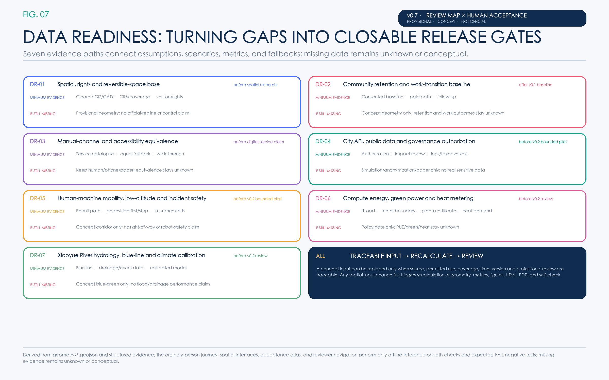

## v0.3: Making Spatial Evidence Genuinely Legible

v0.3 is a substantive upgrade to spatial-evidence presentation, not an operation on date, name, or public ordering. Without changing a single provisional-boundary coordinate, design partition, area, ratio, line length, scenario count, or `unknown` state, it redraws six bilingual figures and bilingual A3/A0 drawing sets. The figures use the same package GeoJSON and internal EPSG:4548 recalculation, add figure numbers, scale bars, corresponding legends, and provisional-boundary notes, and apply a 90-degree clockwise display rotation solely to make the corridor readable; original north is therefore explicitly labelled “N →”. This is a display transformation only, never an upgrade of provisional geometry to an official redline or survey product. [data:geometry/site_boundary.geojson#SITE-001] [metric:site_area_sqm] [depth:metrics_recalculation]

Every layer continues to derive directly from `geometry/` and `metrics.json`. The six land-use polygons in Figure 02 still cover the submitted boundary seamlessly and without overlap, while the three key areas in Figure 03 and service corridors in Figure 04 remain conceptual suggestions only. `visual/assets/spatial-figure-method.json` records inputs, display rotation, and precision limits so professional teams can regenerate the entire package after official polygons, controls, rights, roads, utilities, blue lines, heritage, existing-condition, and operational data arrive; prose or visual completeness may not substitute for those data. [data:geometry/land_use.geojson#LU-H01] [metric:design_partition_area_sqm] [depth:land_use_layout]

## v0.2: Turning City Versions into Vetoable Release Gates

This v0.2 is a substantive evidence upgrade, not a repackaging of spatial values or public ordering. Without changing provisional-boundary coordinates, design areas, or existing `known` metrics, it adds seventeen cards linking space, accountability, human fallback, data boundary, and stop condition, a ledger for three city release gates, and audits for accessibility and persona fairness. The earlier claim of reversibility becomes reviewable questions of who may begin research, what evidence is needed, and when a proposal must pause. It remains a conceptual reference scheme for professional teams to deepen. [data:geometry/phasing.geojson#PHASE-V02] [metric:version_release_count]

| Release gate | Must be completed before entry | Reviewable evidence | Pause or rollback condition |
| --- | --- | --- | --- |
| v0.1 Observe, baseline, and public consent | Data boundary, human-service floor, objection channel | Comprehension walk-through; problem and gap ledger | Unconsented data use, no human channel, or exclusion risk |
| v0.2 Reversible pilots and independent evaluation | Limited place/time/data/accountability, human takeover, professional authorization | Incident review; authorization, metering, calibration, and independent assessment | Safety event, unauthorized data, accessibility barrier, or insufficient evidence |
| v1.0 Reviewed scaling and standards spillover | Prior-version evidence, objection handling, public-interest review | Annual health check, release note, reviewable protocol drafts | Unverifiable evidence, harmed rights, or changed base conditions |

The gate ledger and scenario cards expressly do not constitute permits, engineering schemes, investment commitments, or implementation findings. Once official boundaries, rights, controls, roads, utilities, blue lines, or existing-condition data arrive, the whole package must be recalculated before another version is considered.

## Core Concept and Four Operating Mechanisms

The core concept is the Human City OS: a release system that organizes urban space, public services, and AI agents so they remain observable, rejectable, and reversible. AI is not turned into a landmark, and automation does not replace human judgement. Each urban capability is split into four auditable mechanisms: a human-priority mechanism that protects staffed service, accessibility, and the right to refuse; an evidence-release mechanism that binds place, time, data, accountability, and version gates; a space-service interface mechanism that connects the city API, walking network, public space, and scenario cards into a reviewable service chain; and an exit-and-repair mechanism that requires shutdown, removal, data deletion, objection handling, and independent review together. [depth:phasing_implementation] [metric:version_release_count]

Together these mechanisms turn “from an AI showcase to a city for people” from a value statement into a spatial-governance-operations protocol. Every pilot must answer who may start it, who retains final responsibility, how the public can refuse, what evidence permits expansion, and how the system recovers after failure. Unknown metrics remain `unknown` rather than being filled by model inference or case analogy; every spatial band remains a design suggestion, not a statutory land-use zone, official boundary, or implementation commitment.

## Design Basis and Source List

The proposal first follows the three planning extents, three key areas, and design tasks established by the official call, and uses the six agent tasks in the cleared taskbook as its delivery checklist. [source:OFFICIAL-ANNOUNCEMENT] [source:AGENT-TASKBOOK]

The five formally usable records in the repository source registry support only the uses explicitly permitted there. Provisional boundaries are used for generation, visualization, and intake checks; they are not represented as statutory redlines, official parcels, or exact regulatory controls. [source:SOURCE-REGISTRY] [data:geometry/site_boundary.geojson#SITE-001]

### 1. Evidence hierarchy and human-first decision boundary

The package keeps source registration, design exploration and “ready to start” separate. A registered record is not automatically an established fact; every spatial move must show both what it supports and what remains out of scope.

| Evidence level | Package examples | Can support | Cannot support |
| --- | --- | --- | --- |
| Task and professional standards (formal) | Official announcement, cleared taskbook, planning and regulatory-plan standards | Task coverage, deliverable depth and professional review principles | Official polygons, ownership, engineering conditions, permits or government commitment |
| Formal-usable source registration | `sources.json`, `data/source_registry.json`, policy and case records | Source use, mechanism comparison, accountability links and disabled scope | Upgrading case performance, background statistics or registration records into Haidian implementation facts |
| Provisional spatial basis | `site_boundary`, `key_areas`, six conceptual spatial bands | Concept placement, relative relationships, topology checks and a whole-package replacement trigger | Statutory land use, road redlines, precise area, building controls or ownership |
| Package-derived exploration | GeoJSON, `metrics.json`, 128 candidates, release gates and project families | Replayable trade-offs, node actions, version dependencies and audit interfaces | Existing-condition survey, resident demand, facility capacity, AI capability or formal recommendation |
| Administrative/open background | Statistics, policy, public cases and open maps | Question calibration, data-collection priorities and explicit uncertainty | Corridor demand, field performance, siting, partnership facts or investment commitment |
| Synthetic scenarios and governance methods | Ordinary-person journeys, negative fixtures, release gates and paper methods | Human priority, stop, exit, redress and follow-up validation design | Field accessibility, public consent, professional sign-off, implementation permission or competition score |

The review rule is: `provisional`, `unknown`, `design_target` and `not_authorized_not_run` remain in those states. A local checker PASS proves only that a package contract can be replayed; it does not become field evidence, professional approval or a government implementation finding.

The available public package does not contain official polygons, plot ratios, height or density controls, green-space ratios, setbacks, road redlines, property rights, existing-building surveys, heritage control lines, utility capacity, or a public-service baseline. Land-use bands, concept buildings, roads, a low-altitude layer, sponge facilities, and phases are therefore design hypotheses requiring professional development. Every material limitation is registered in `assumptions.json`. The recalculated area of 11,412,825.386 square metres is an internal consistency value derived from the provisional geometry, not an official area conclusion. [metric:site_area_sqm] [depth:existing_conditions_diagnosis]

New claims about employment, talent, and energy use verifiable first-party sources. The IMF reports that almost 40% of global employment is exposed to AI and that the share is about 60% in advanced economies; exposure includes both substitution and augmentation and is not a forecast of unemployment. In the World Economic Forum's 2025 employer survey, 41% of respondents expected workforce reductions where AI can replicate roles; this is not a Haidian forecast. [source:IMF-AI-JOBS-2024] [source:WEF-FUTURE-JOBS-2025] The currently verifiable public figure for Haidian is approximately 90,000 AI professionals, not 95,000. It is used only to establish the order of magnitude relevant to wellbeing and night services, never to infer a site population or facility capacity. [source:HD-AI-TALENT-2026]

Compute-energy requirements are also corrected to current official wording. Beijing's 2024 computing-infrastructure implementation plan states that PUE for new or expanded intelligent-computing centres should generally not exceed 1.25, and generally not exceed 1.15 for large advanced facilities. From 2026, data centres exceeding the applicable 1.35 limit are subject to differentiated electricity pricing. A 30% green-electricity share is a Beijing target for a specified band of existing data centres; this proposal may use it as a design baseline, but does not misstate it as a statutory minimum for a new centre. [source:BJ-COMPUTE-2024] [source:BJ-DATACENTER-2024]

**Figure 01 key-area legend:** 1 = Zhongzhiyuan; 2 = Beijing AI Origin Community; 3 = Dazhongsi AI Industry Cluster. All three are provisional key areas for conceptual validation and professional deepening, not official redlines.

## Three-Level Scope Framework

The 43.6-square-kilometre coordinated research area asks how Haidian's innovation capacity can spill over beyond the district. The approximately 11.4-square-kilometre overall design area asks how human services, a city API, and hard constraints can coexist spatially. The approximately 368.4-hectare key-area set asks what should be tested first in Zhongzhiyuan, the AI Origin Community, and Dazhongsi. The three extents form one evidence chain running from strategy through spatial structure to controlled validation. [standard:PROJECT-OFFICIAL-ANNOUNCEMENT] [depth:three_level_scope_framework]

| Extent | Primary question | Delivery in this proposal | Boundary condition |
| --- | --- | --- | --- |
| Coordinated research area | How can technology, standards, and knowledge spill over? | Six global cases, Beijing-Tianjin-Hebei collaboration, OPC support, and international services | No fabricated firms, investment, output, or partnerships |
| Overall design area | How can an AI showcase become a city for people? | Four value chains A/B/C/D, six spatial layers, and paired human/machine movement networks | Functional bands are not statutory land-use zones or road redlines |
| Three key areas | How can reversible pilots be validated? | Sixteen geometry nodes, seventeen scenario cards, six test-and-validation scenes, and three release stages | No operation without authorization; heritage, traffic, airspace, and data rules remain controlling |

Group A, Human Dignity, covers community retention, work transition, digital inclusion, and physical and mental wellbeing. Group B, Machine-Ready City, covers a city API, silicon right-of-way, a digital twin, and reversible white space. Group C treats compute-energy, climate, a regulatory sandbox, public-data authorization, and city-version governance as hard gates. Group D organizes technology, standards, knowledge, OPC support, and international services into spillovers. Each group appears in scenario nodes, spatial layers, and recalculable metrics rather than remaining a slogan. [data:geometry/constraints.geojson#SC-A01] [metric:scenario_node_count]

The spatial proposition is “one historic public spine, two movement systems, three validation grounds, four value chains, and six functional bands.” The Jingzhang Railway Heritage Park is treated only as a narrative spine of history and public space; the provisional boundaries remain low-contrast dashed references. Any official boundary update triggers a full regeneration of every design layer, figure, HTML page, PDF, and metric instead of a selective graphical replacement. [data:geometry/phasing.geojson#PHASE-V01] [depth:overall_spatial_structure]

## Coordinated Research Area: Industry and Future City Research

The ecosystem is not reduced to attracting large firms. It is decomposed into six capabilities: frontier research, affordable testing, trustworthy data, workforce transition, social acceptance, and international services. Large teams can provide foundation models and platforms. Small teams and one-person companies can enter public-interest scenarios through shared laboratories, model and compute services, legal support, and data-authorization assistance. Workers whose occupations are changing can move through a reskilling corridor toward robotics operations, data quality, scenario operations, accessibility services, and incident review. [source:HD-OPC-2026] [depth:overall_spatial_structure]

Six international cases contribute mechanisms, not imported urban forms. Singapore's Punggol Digital District demonstrates how an open digital platform and digital twin can become callable district infrastructure. Helsinki's Smart Kalasatama demonstrates the value of an inhabited community, resident participation, and agile pilots over a one-time “smart city delivery.” Barcelona's 22@ experience warns that innovation-district renewal must address housing and existing communities. Seoul AI Hub combines education, incubation, research, and public support. Busan Eco Delta City places living labs, a regulatory sandbox, open data, and robotics within the same public program. Toronto's Quayside debate shows why independent governance, responsible data use, and public purpose must precede sensor deployment. [source:CASE-PUNGGOL] [source:CASE-KALASATAMA] [source:CASE-QUAYSIDE]

| Case | Transferable mechanism | Jingzhang translation | Required safeguard |
| --- | --- | --- | --- |
| Punggol Digital District | Open platform, APIs, digital twin | City API Exchange | Data catalogue, permissions, logs, and exit procedure |
| Smart Kalasatama | Resident participation and agile pilots | Reversible v0.1-v0.2 pilots | Start with public problems, not technology in search of a use |
| Barcelona 22@ | Innovation alongside housing and community | Community-retention ledger and small-business return | Baseline, eligibility, leases, and anti-displacement audit |
| Seoul AI Hub | Education, incubation, and R&D support | Reskilling corridor and shared lab | Track employment outcomes, not training attendance publicity |
| Busan Eco Delta | Living lab, sandbox, open data | Embodied-AI testing and climate simulation in the Xiaoyue River wing | Insurance, incident response, and human takeover |
| Toronto Quayside | Independent data governance | Public Data Authorization Room | Public interest, privacy, and third-party evaluation first |

Spillover follows four paths: technology, standards, knowledge, and international services. Technology spillover gives Beijing-Tianjin-Hebei manufacturing and application partners test interfaces for Haidian research. Standards spillover converts right-of-way, authorization, accessibility, and incident-review protocols into reusable templates. Knowledge spillover combines a fifteen-minute encounter network, an open problem list, annual release notes, and cross-campus communities into traceable knowledge assets. International services cover language, medical navigation, intellectual property, compliance, and daily life; the proposal fabricates no school, hospital, agency, or institutional commitment. The Zhongguancun technology-service wing supplies a public catalogue, staffed advice, authorization review, and an application-transfer ledger for this spillover. [source:AGENT-TASKBOOK] [data:geometry/constraints.geojson#ZONE-C-DATA] [depth:existing_conditions_diagnosis]

The Zhongguancun technology-service wing is a conceptual interface for global factor configuration, Zhongguancun intellectual-property support, and compliant capital-information services. `SC-D04` sends reviewable protocol drafts into Beijing-Tianjin-Hebei manufacturing and application discussions; it does not promise financing, investment, recruitment, or a confirmed operator. The Xiaoyue River scenario-empowerment wing carries embodied testing and climate-resilience scenes, so the two wings connect through standards, data, knowledge, and workforce transition. [source:AGENT-TASKBOOK] [data:geometry/public_space.geojson#PUBLIC-D-GLOBAL] [depth:overall_spatial_structure]

## Overall Design Area: Urban Renewal and Regulatory-Plan-Level Urban Design

The overall design establishes six functional operating layers within the provisional design boundary while retaining the city's diverse everyday structure: community retention and support; international and OPC services; reskilling and public-data learning; reversible white space; city API and embodied-AI R&D; and screen-free green/climate resilience. The six polygons cover the submitted site without overlap, and their areas and shares are recalculated from one GeoJSON source in EPSG:4548. [data:geometry/land_use.geojson#LU-H01] [metric:design_partition_area_sqm] [depth:land_use_layout]

The community-retention support band occupies approximately 18.3% of the provisional site, while reversible white space occupies approximately 15.1%. These are spatial proxies describing the design allocation; they are not a resident-retention rate or a statutory reserve ratio. A real resident-retention rate requires a rights-cleared household baseline, eligibility rules, informed consent, and longitudinal registration, so the outcome metric remains `unknown`. [metric:community_retention_support_area_ratio] [metric:reversible_space_ratio] [metric:resident_retention_rate]

The city API uses a six-step protocol: catalogue, authorize, invoke, log, audit, and exit. A municipal-facility agent may call only minimized and tiered interfaces. Water, electricity, heat, transport, and public-data calls retain human takeover and incident traceability. Beijing's current public-data authorization rules emphasize legal compliance, public-interest priority, security, evaluation, and exit. The proposal therefore treats a “data-factor district” as an auditable institutional prototype, not a technology showroom. [source:BJ-PUBLIC-DATA-2026] [data:geometry/constraints.geojson#ZONE-B-API]

Reversible design uses modular components, removable service pods, short-cycle leases, and meanwhile use to mediate the mismatch between three-month AI cycles and ten-year urban construction cycles. Every pilot must file removal, restoration, and data-deletion plans at approval. A v0.2 pilot cannot expand to v1.0 without independent evaluation and public review. Building height, development intensity, construction volume, and retain-renovate-demolish decisions remain for professional development because official controls and surveys are absent. [standard:MOHURD-CONTROL-DETAILED-PLANNING] [depth:development_intensity_controls]

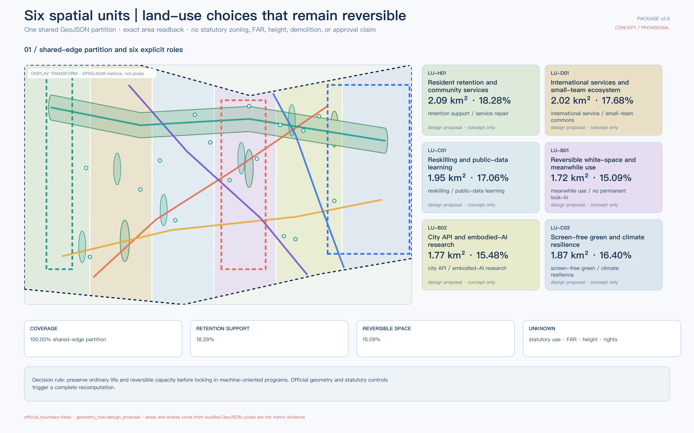

### Parametric study: a replayable candidate set for spatial trade-offs

`visual/assets/parametric-tradeoff-study.json` uses the current six-band geometry allocation as a baseline and compares people-first, balanced, and machine-ready parameter sets. Each area is computed as `share × provisional site_area_sqm`; the offline runner checks share sums, derived areas, and baseline reconnection to the current metrics, with evidence written to `parametric-tradeoff-study-evidence.json`. [data:geometry/land_use.geojson#LU-H01] [metric:community_retention_support_area_ratio]

The study puts community retention, learning, reversible space, city API, and screen-free resilience on one comparison page for professional review after formal inputs arrive. [metric:reversible_space_ratio] [depth:metrics_recalculation]

The three sets remain low-confidence conceptual suggestions. They do not change formal geometry, areas, ratios, drawings, or `scenario_node_count=16`; `SC-D04` reuses existing spatial anchors while the scenario registry contains seventeen cards. Any next-round choice must recheck official boundaries, rights, controls, buildings, mobility, utilities, energy, climate, and public baselines. [data:geometry/site_boundary.geojson#SITE-001] [metric:scenario_node_count] [depth:risk_missing_data]

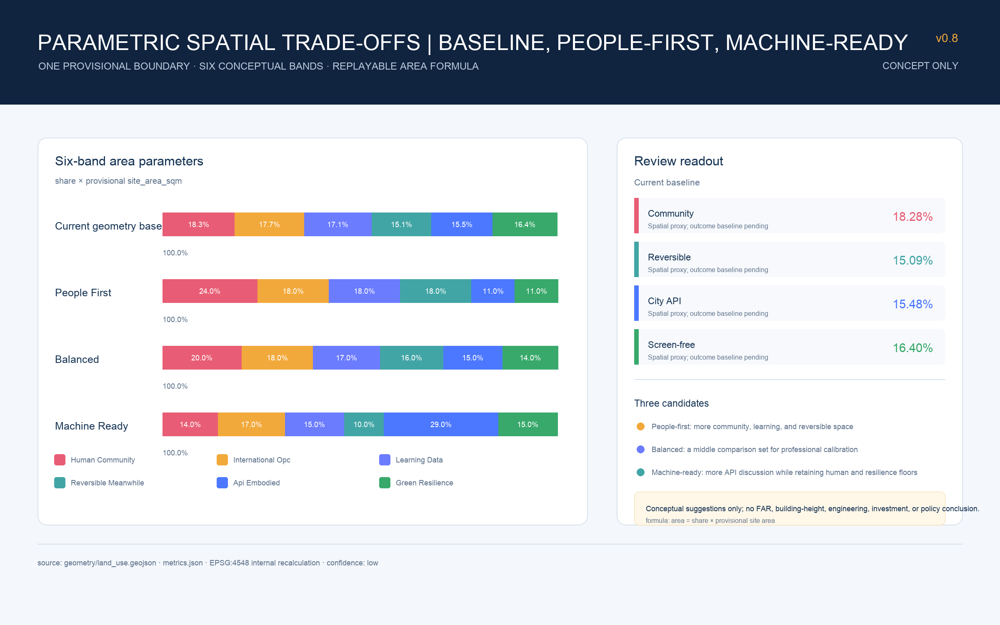

## Detailed Design of Key Areas

Zhongzhiyuan, the AI Origin Community, and Dazhongsi use the repository's coarse provisional extents only to locate design questions; the rectangular outlines carry no planning meaning. All three areas follow the sequence “public problem, controlled test, independent evaluation, reversible expansion,” while each has a different first responsibility. [data:geometry/key_areas.geojson#PROV-KEY-001] [metric:key_area_count] [depth:three_key_area_detailed_design]

| Key area | Primary proposition | First spatial actions | Evaluation gate |
| --- | --- | --- | --- |
| Zhongzhiyuan | Can a machine-ready city enter public space safely? | Silicon-right-of-way test, embodied-AI public test bay, compute-energy/heat audit, standards spillover studio | Accountable operator, insurance, human takeover, energy metering, and public incident review |
| AI Origin Community | Can innovation density protect everyday life and workforce transition? | Reskilling Relay, City API Exchange, intergenerational learning, City Release Room | Employment conversion, retained human services, data minimization, and resident vote |
| Dazhongsi | Can data and international services create a trustworthy urban interface? | Public Data Authorization Room, International Service Commons, OPC shared services | Lawful authorization, exit, accessibility, multilingual and compliance-service audit |

The three key areas keep their coarse provisional extents and now add a comparable public-interface and reversible-service layer. The comparison only asks how ordinary routes, staffed services, equipment back-of-house, and upper functions should be separated; it does not define development intensity, massing, a retain/renew/demolish list, or engineering capacity. Those inputs remain `unknown` before G1. [data:geometry/key_areas.geojson#PROV-KEY-001] [data:visual/assets/parametric-tradeoff-study.json] [depth:risk_missing_data]

| Key area | Concept spatial trade-off | Public interface and reversible relationship | Professional evidence to collect first |
| --- | --- | --- | --- |
| Zhongzhiyuan | Place embodied-AI testing, compute-energy/heat audit, and standards studio behind a human-priority public interface, with a withdrawable test boundary and incident-review court | Staffed front desk and public observer seat stay adjacent; equipment, maintenance, and test back-of-house can close without cutting the walking spine | Existing buildings, energy load, fire, insurance, pedestrian walk-through, and accountable role |
| AI Origin Community | Connect the Reskilling Relay, intergenerational learning, and City API Exchange on a daily walking route, with ordinary and AI-assisted entries side by side | Staffed, paper, and intergenerational entries face the ordinary route; test components remain removable and pausable | Resident and service baseline, accessibility walk-through, employment-outcome definition, tenure, and leases |
| Dazhongsi | Keep public-data authorization, international services, and OPC shared services in a low-scale civic living room, with night service and cultural interpretation using one staffed front desk | Rail arrival, quiet route, and service front desk are separated; events and data display can withdraw without occupying daily resident movement | Heritage, transport and night service, language access, data authorization, and exit conditions |

These ranges answer which spatial relationships to compare first. They do not answer where construction is permitted, who holds the space, or how much may be built. Provisional `PROV-KEY-001` through `PROV-KEY-003` remain non-redline geometry; drawings, metrics, and release gates can be recalculated only after formal boundaries and rights-cleared inputs arrive.

Embodied-AI testing in Zhongzhiyuan does not assume that autonomous vehicles or robots naturally possess right-of-way. Temporary permits are conditioned on pedestrian priority, speed, time, task, and risk class. The low-altitude logistics layer is only a vertically separated concept corridor and cannot enter testing before airspace, noise, drop risk, privacy, fire safety, and insurance reviews. [data:geometry/roads.geojson#ROAD-B-SILICON] [metric:silicon_right_of_way_length_m]

The AI Origin Community places workers at substitution risk, not only celebrated technical talent, inside the innovation chain. Capability assessment, paid learning, real-job trials, and roles in robotics operations, data quality, scenario operations, accessibility, and human review form a trackable reskilling corridor. Dazhongsi lowers compliance costs for small teams through public-data and international-service support. Any subsidy or company service is referenced to current policy and is not extended into a promise. [data:geometry/roads.geojson#ROAD-A-SKILL] [metric:skill_transition_corridor_length_m]

## AI Innovation Ecosystem, Personas, and AI+ Scenarios

Six base personas plus three public-interest extensions establish that the right to refuse AI is part of service quality. Long-term residents and older people need a human channel, familiar social networks, privacy, and low-disruption renewal. Workers at substitution risk need a verifiable route to a new job. AI researchers need safe night travel, twenty-four-hour basics, and screen-free recovery. OPCs and small teams need on-demand labs, compute, and compliance support. Public-service staff need explainable work orders and human review. Youth and early entrants need a non-automated learning and transition route; developers and researchers need least privilege and a rights register; international visitors need multilingual explanation, ordinary movement, and withdrawable service. The extension is not a demographic survey or outcome claim. [source:HD-AI-TALENT-2026] [data:visual/assets/public-interest-coverage-v26.json] [depth:municipal_new_infrastructure]

| Persona | Non-negotiable right | Spatial/service response | Validation |
| --- | --- | --- | --- |
| Existing resident or older person | Ability to remain, human service, privacy, familiar relations | Community Retention Hall, staffed counter, intergenerational learning | Retention awaits a lawful baseline; audit human-channel availability |
| Worker at substitution risk | Paid transition period and a real job pathway | Reskilling corridor and job-trial workshop | Longitudinal tracking from enrolment to trial and sustained employment |
| AI professional | Safe return at night, health, non-screen rest | Night Safety Link, 24-hour basics, screen-free green space | Night-service coverage and anonymous satisfaction |
| OPC or small team | Low-threshold facilities and fair access to tests | Shared lab, model/compute, legal and data support | Open application, conflict disclosure, and resource audit |
| Public-service worker | Human final responsibility and explainable tools | City API console and Incident Review Court | Takeover drill and log audit |
| International visitor or team | Accessible language, health, compliance, and daily services | One-stop International Service Commons | Multilingual accessibility walk-through; no invented providers |

All seventeen scenario cards are encoded in the structured registry and anchored to sixteen geometry nodes: four geometry nodes in A, four in B, five in C, and three in D. Six are explicitly tagged as test-and-validation scenarios, exceeding the taskbook minimum. [data:geometry/constraints.geojson#SC-B01] [metric:human_first_scenario_count] [metric:machine_city_scenario_count]

v0.2 upgrades these sixteen entries from a catalogue to reviewable scenario cards. Each links its spatial anchor, suggested users, human alternative, data boundary, evidence required for acceptance, and stop condition. Test scenarios additionally use the four limits of place, time, data, and accountability. This does not mean that any scenario is ready to operate; it makes what is still missing visible before expansion. [data:geometry/constraints.geojson#SC-C03] [metric:test_validation_scenario_count]

| Card | Group | Scenario | Spatial carrier | Human/institutional safeguard |
| --- | --- | --- | --- | --- |
| SC-A01 | A | Community Retention Ledger | Community-retention support area | Rights-cleared baseline, resident consent, no commercial profiling |
| SC-A02 | A | Reskilling Relay | Reskilling corridor | Paid learning and job-outcome tracking |
| SC-A03 | A | Human Channel and Intergenerational Learning | Public-service hall | Permanent staffed option; no mandatory QR access |
| SC-A04 | A | 24-hour Wellbeing Refill | Night link and screen-free gardens | Anonymous use; no emotion profiling |
| SC-B01 | B/test | City API Exchange | API authorization zone | Least privilege, logs, human takeover, and exit |
| SC-B02 | B/test | Silicon Right-of-Way Test Ground | Controlled Xiaoyue River route | Time/speed limits, insurance, and incident response |
| SC-B03 | B | Reversible Component Library | White-space/meanwhile-use band | Removal and restoration plan submitted at approval |
| SC-B04 | B/test | Public Digital-Twin Bench | City API zone | Synthetic or anonymized data first; compare model and reality |
| SC-C01 | C/test | Compute-Energy and Recovered-Heat Audit | Concept building node | Meter PUE, green power, and recovered heat |
| SC-C02 | C/test | Flood and Sponge Simulation Ground | Xiaoyue River resilience wing | Obtain hydrology, blue-line, and drainage evidence first |
| SC-C03 | C/test | Regulatory Sandbox and Incident Review Court | Public governance space | Responsibility, insurance, shutdown, and public review |
| SC-C04 | C | Public Data Authorization Room | Dazhongsi data-service zone | Public interest, privacy, and third-party evaluation |
| SC-C05 | C | City Release Room | Origin Community public hall | Annual health check, public issues, and release note |
| SC-D01 | D | OPC Shared Laboratory | Shared experiment/service node | Open application and supplier neutrality |
| SC-D02 | D | Standards Spillover Studio | Zhongzhiyuan collaboration node | Publish reviewable protocols; do not claim national-standard status |
| SC-D03 | D | International Service Commons | Dazhongsi public space | Multilingual, accessible, and compliance-bound services |

The six tests share a “limited place, limited time, limited data, limited responsibility” protocol. Success means jointly meeting safety, human-takeover, energy, accessibility, public-acceptance, and removability thresholds. A strong single technical indicator never automatically authorizes expansion. [metric:test_validation_scenario_count] [depth:risk_missing_data]

## Land Use, Building Scale, and Retain-Renovate-Demolish Strategy

The six functional bands use a subset of the national land-use classification for machine readability, while remaining design suggestions rather than approved land uses. Community retention uses 0702; international and small-team services use 05; reskilling uses 0804; reversible white space uses 16; city API and R&D use 0802; and screen-free resilience space uses 1401. The six faces share edges, cover the provisional `SITE_BOUNDARY`, and contain neither gaps nor overlaps. [standard:MNR-LAND-USE-CLASSIFICATION-GUIDE] [data:geometry/land_use.geojson#LU-B01]

Eight building footprints locate program prototypes only: Community Retention Service Station, Reskilling Workshop, Age-Friendly Human Channel Station, City API Exchange, Embodied-AI Test Bay, Compute-Energy and Recovered-Heat Audit Station, OPC Shared Laboratory, and International Service Commons. Their combined 44,160-square-metre footprint is recalculated from concept geometry. Without an existing-building survey, property data, or regulatory controls, it cannot become a development quantum or demolition list. [data:geometry/buildings.geojson#BLDG-A-01] [metric:building_footprint_area_sqm]

Retain-renovate-demolish decisions follow “survey first, classify second, decide last.” Safe structures with historical or community value are retained first. Buildings that can be made accessible, efficient, and useful through insertion are renovated first. Only demonstrated structural or public-safety failures proceed to professional demolition review. New construction must show that existing space cannot meet the need and that a reversible pilot has passed evaluation. Every concept building is marked `pending_existing_building_survey`; no conclusion is made about a real building. [depth:retain_renovate_demolish] [depth:height_massing_character]

The anti-gentrification toolkit has four institutional components: a resident-retention registration protocol, priority return for small businesses, temporary trading space during construction, and reinvestment of public benefit into community services. Real retention and return rates require a lawful, informed-consent baseline and longitudinal records. This package reports only the spatial support share and does not market a spatial proxy as a social outcome. [metric:resident_retention_rate] [depth:development_intensity_controls]

## Transport, Rail, Municipal Infrastructure, and Public Services

The transport system recognizes people and machines as distinct right-holders, while life safety, accessibility, and the right to refuse automation take precedence. The human network includes the reskilling corridor, night safety connection, continuous age-friendly walking, and screen-free green space. The machine network includes the controlled silicon-right-of-way corridor, a conceptual low-altitude layer, city-API nodes, and embodied-AI test grounds. Intersections use visible status, low-speed zones, human takeover, and incident shutdown; “optimal efficiency” cannot overrule pedestrians. [data:geometry/roads.geojson#ROAD-A-NIGHT] [depth:traffic_rail_slow_parking]

The low-altitude concept-corridor length is recalculated from geometry, but airspace, clearance, noise, privacy, fire, route, and permitting data are absent. It is therefore a vertical functional layer for further study, not an engineering alignment. Silicon right-of-way likewise describes a controlled testing protocol, not a grant of road rights. No line on a figure is presented as an approved route or operating service. [metric:low_altitude_concept_corridor_length_m] [metric:silicon_right_of_way_length_m]

Compute-energy coordination is a front-end spatial gate, not a late-stage mechanical optimization. New or expanded intelligent-computing facilities must first comply with current Beijing PUE requirements. The proposal recommends 30% green electricity as an initial design baseline verified by power-purchase credentials and metering, while expressly distinguishing it from a statutory project value. Recovered heat may connect to community energy only when temperature grade, seasonal demand, heat network, metering, and economics are demonstrated. [source:BJ-COMPUTE-2024] [metric:operational_pue] [metric:green_electricity_share]

Public services use dual channels. AI may assist translation, queuing, accessibility navigation, and work-order recommendations, while staffed counters, telephone service, and on-site assistance remain available. A municipal agent can recommend but cannot autonomously issue a planning permit, interrupt water or power, exercise enforcement, or decide personal rights. Interface logs, permission revocation, continuity, and disaster-recovery drills are acceptance requirements. [source:BJ-PUBLIC-DATA-2026] [depth:municipal_new_infrastructure]

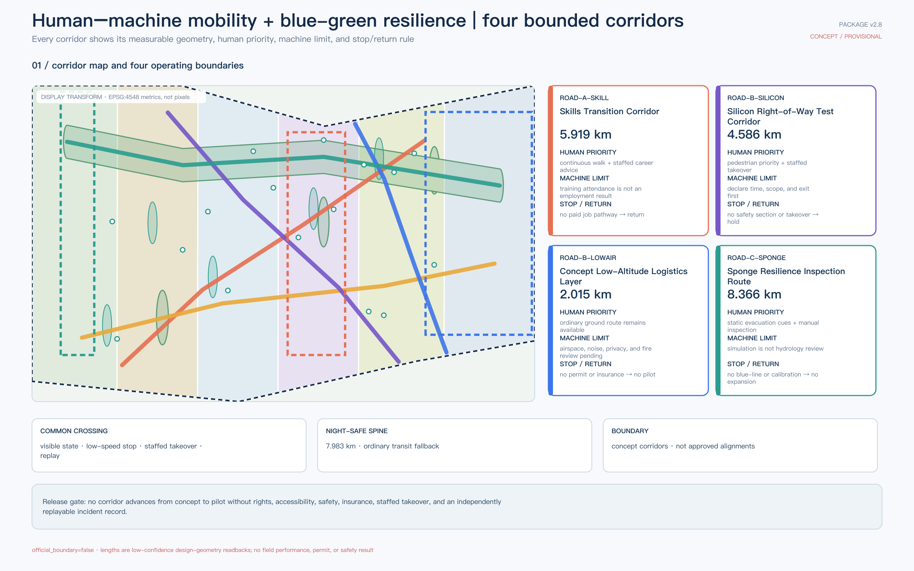

## Blue-Green Network, Public Space, and Urban Character

The blue-green network is not a backdrop for an AI demonstration. It is infrastructure for heat waves, intense rainfall, mental recovery, and ordinary social life. A conceptual sponge-resilience band along the Xiaoyue River wing connects modelling, inspection, and public risk information. Three Screen-Free Stillness Gardens prohibit mandatory interactive screens, targeted advertising, and emotion recognition, preserving space that is not continuously computed for knowledge workers, older people, children, and residents. [data:geometry/green_space.geojson#GREEN-C-SPONGE] [metric:no_screen_green_area_sqm]

Design green space totals approximately 1,269,256.687 square metres, or 11.12% of the provisional site. Public-space polygons total approximately 121,447.158 square metres, or 1.06%. These values belong to design layers and are not a statutory green ratio, park implementation area, or public-space dedication. Official boundaries, river blue lines, heritage controls, and an existing-green survey would trigger regeneration and recalculation. [metric:green_ratio] [metric:public_space_ratio] [depth:blue_green_public_space]

Urban character uses “rail, time, interface” as its language. Rail represents the continuity of the century-old Jingzhang corridor, time marks the sequence of city releases, and interface nodes reference Zhongguancun's open-source culture. Buildings and public facilities use removable, repairable, legible components. Screens, luminous façades, and corporate logos are not treated as an AI architectural style. Until formal protection information is available, historic resources, the former Tsinghuayuan Station, and park limits receive conservative avoidance. [standard:MOHURD-URBAN-DESIGN-MEASURES] [depth:height_massing_character]

Three pilgrimage landmarks make the operating philosophy visible. The Human Release Hall publishes city issues, changes, and withdrawals. The Rail Interface Clock places railway time beside algorithm versioning and records who changed the city and when. The Screen-Free Recovery Beacon uses shade, wind, sound, and night safety to create a non-screen civic landmark. All three are original concepts and use no corporate trademark, personal likeness, or restricted imagery. [source:AGENT-TASKBOOK] [depth:risk_missing_data]

## Renewal Projects, Implementation Policy, and Phasing

Implementation uses three city releases instead of a single completion date. Release v0.1 establishes baselines, a public issue list, and the minimum human-service guarantee. Release v0.2 conducts reversible pilots, independent evaluation, and incident drills. Release v1.0 expands only projects that pass public-interest, energy, climate, accessibility, and reversibility reviews. The three geometries cover the provisional site as governance responsibility zones, not as promised development timing. [data:geometry/phasing.geojson#PHASE-V02] [metric:version_release_count] [depth:phasing_implementation]

Before a suggested project enters its next gate, it leaves a synthetic human-city handoff receipt. H0 hands a problem from community observation to data and spatial review; H1 confirms an equivalent human entrance; H2 checks minimum fields and revocation; H3 reviews energy, climate, mobility, and safety evidence; H4 performs independent replay and opens an objection window; H5 records version differences and exit. The three cases are synthetic fixtures and the roles are abstract suggestions. They make who takes over, what permits acceptance, when to stop, and how to return to the previous gate queryable without presenting a suggested role as a real operator. [data:visual/assets/human-city-receipt.json] [data:visual/assets/implementation-operation-matrix.json]

### v2.7 bounded public-service tabletop contract | Make “human takes over first” rejectable

The existing handoff receipt answers how one human-first service can be replayed. This revision adds four spatially anchored tabletop contracts for the human channel, city-API authorization, incident replay, and multilingual public service. Each card keeps the user, space, proposed role, permission, minimum data, human alternative, missing baseline, acceptance, privacy, and stop/recovery action on one line. Roles remain pending-authorization placeholders; field_location=null; no real system is connected. [data:visual/assets/human-city-public-service-tabletop-v1.json] [depth:phasing_implementation]

| Contract card | Spatial anchor | Acceptable synthetic action | If evidence is missing or scope is exceeded |
| --- | --- | --- | --- |
| HC-T01 Human channel and intergenerational learning | PUBLIC-A-INCLUSION | Submit a question without scanning, receive human explanation and an expected receipt | Return to paper/telephone when the human route is unavailable or exclusionary |
| HC-T02 City-API authorization desk | SC-B01 | Explain purpose, permission, minimum fields, and revocation | Freeze the call on excess permission, purpose drift, or missing logs |
| HC-T03 Regulatory-sandbox incident replay desk | SC-C03 | Record who stops, who reviews, how to appeal, and when recovery may be considered | Keep the human-safe state when accountability or human stop is missing |
| HC-T04 Multilingual public-service living room | PUBLIC-D-GLOBAL | Provide bilingual-reviewed public information and human routing | Retain paper information when bilingual terms or service scope is unclear |

The four positive fixtures must satisfy consent, human handoff, permission scope, minimum data, appeal, bilingual review, and a low-impact action. Eight negative fixtures reject missing consent, human entry, minimum data, permission, appeal, low-impact boundaries, bilingual review, or a spatial anchor. run-human-city-public-service-tabletop-v1.js --check replays 4/4 positive and 8/8 negative fixtures offline and writes an expected receipt. PASS proves only that the contract is rejectable and replayable; it does not prove service performance, staffing, permits, accessibility outcomes, incident safety, public outcomes, or an official score. [data:visual/assets/run-human-city-public-service-tabletop-v1.js] [data:visual/assets/human-city-public-service-tabletop-v1-evidence.json] [depth:risk_missing_data]

| Project | Release | Prerequisite | Stop or rollback condition |
| --- | --- | --- | --- |
| Community-retention baseline and return protocol | v0.1 | Resident consent, eligibility, and privacy rules | Do not publish a rate if a credible baseline cannot be formed |
| Reskilling Relay | v0.1 | Employment partners, paid mechanism, and job tracking | Correct the program if it counts attendance without a job path |
| Human service and intergenerational learning | v0.1 | Staffed service and accessibility walk-through | Stop digital migration when a human channel is unavailable |
| Screen-Free Stillness Gardens | v0.1 | Confirm green/heritage boundaries | Remove any mandatory collection or targeted advertising |
| City API Exchange | v0.2 | Data catalogue, permissions, logs, and exit | Shut down on unauthorized access, opacity, or missing takeover |
| Silicon-right-of-way test | v0.2 | Traffic review, insurance, and incident plan | Withdraw if safety or public acceptance thresholds fail |
| Flood and sponge simulation | v0.2 | Hydrology, blue-line, drainage, and model calibration | No expansion without calibration against events or drills |
| Compute-energy/recovered-heat audit | v0.2 | IT load, PUE, green-power, and heat-demand evidence | No community-heat claim without metering or a heat user |
| Public Data Authorization Room | v0.2 | Lawful authorization, public-interest priority, third-party evaluation | Close when privacy, trade-secret, or exit requirements fail |
| OPC Shared Laboratory | v0.2 | Fair application, conflict disclosure, resource audit | Redesign if it becomes a closed club or tied-vendor channel |
| Standards Spillover Studio | v1.0 | Open protocol and cross-district review | Never call an unvalidated output a national or industry standard |
| International Service Commons | v1.0 | Multilingual, health-navigation, and compliance walk-through | Do not substitute branding for actual service capability |

The core governance artifact is the release note. It records additions, changes, withdrawals, incidents, public objections, data permissions, and the next release's gates. The annual health check reviews space together with resident retention, job transition, energy, climate, data, and human channels. The public can file issues, and the maintenance team must answer “accept,” “test,” “reject,” or “await evidence,” with reasons. [depth:renewal_project_list] [depth:phasing_implementation]

To avoid treating display as an upgrade, v0.2 added entry, advance, and exit gates to the three conceptual phase polygons, with the then-complete ledger of sixteen scenario cards as offline structured attachments; v0.8 adds SC-D04 and v0.9 adds the handoff receipt, bringing the current registry to seventeen cards. They require human takeover, authorization, insurance, metering, calibration, accessibility, and public review to be prerequisites instead of allowing any one technical effect to justify expansion. [data:geometry/phasing.geojson#PHASE-V02] [standard:MOHURD-URBAN-DESIGN-MEASURES]

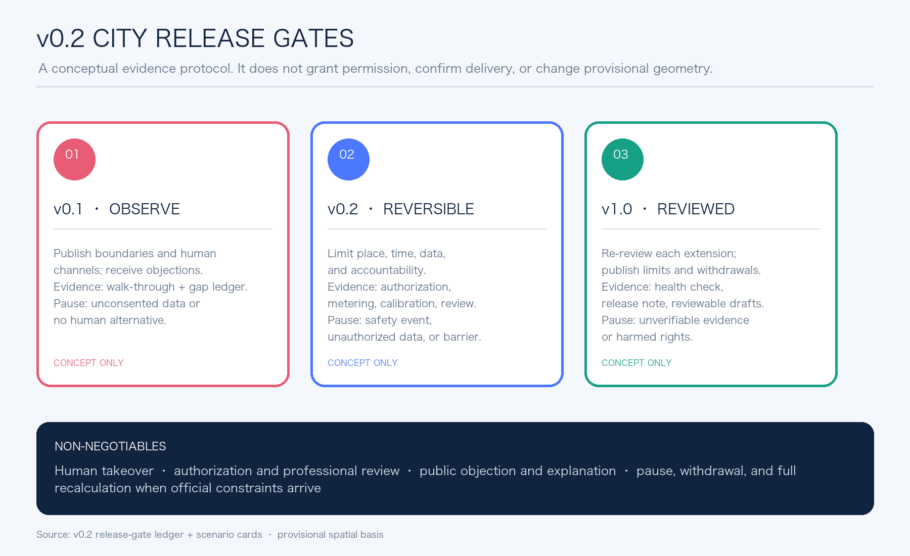

Long-term operation follows four seasons. Spring's Open City Problems Week collects issues from residents and frontline staff. Summer's City API and Embodied-AI Test Month permits controlled validation only. Autumn's Work Transition and OPC Co-creation Season links jobs, skills, and small teams. Winter's City Release Conference publishes the annual health check and release note. This is a proposed operating mechanism and claims no government approval, budget, venue, or partnership. [source:AGENT-TASKBOOK] [depth:renewal_project_list]

The name is “Jingzhang Human City OS / 京张人本城市操作系统.” The logo direction places a rail segment and a human-confirmation point inside an open bracket: the bracket means API callability, the rail means historical continuity, and the confirmation point means that a person retains final authority. The identity uses original geometry and system fonts without company marks or unlicensed typefaces. [source:AGENT-TASKBOOK] [depth:risk_missing_data]

## Metrics, Area Recalculation, and Compliance Matrix

Every metric marked `known` is recalculated by projecting package GeoJSON into EPSG:4548. The proposal, five figures, HTML pages, and PDFs draw from the same `metrics.json`. The spatial metrics have low confidence because their source boundary is provisional; additional decimal places improve reproducibility, not factual precision. [metric:site_area_sqm] [depth:metrics_recalculation]

The v0.2-v0.5 metric audit separates spatial recalculations unchanged in this revision from social and operational outcomes that cannot substitute for measurements. Release gates, scenario cards, data readiness, and spatial interfaces change no area, ratio, length, or existing metric value. Any later geometry edit must recalculate `metrics.json`, figures, HTML, and PDFs together; prose cannot override data. [metric:green_ratio] [metric:operational_pue]

| Metric | Current value | Evidence | Interpretation boundary |
| --- | ---: | --- | --- |
| Provisional overall-design area | 11,412,825.386 sqm | site_boundary | Not an official exact area |
| Design green area/share | 1,269,256.687 sqm / 11.12% | green_space | Not a statutory green-space ratio |
| Public-space area/share | 121,447.158 sqm / 1.06% | public_space | Not an implementation boundary |
| Community-retention support share | 18.28% | land_use LU-H01 | Not a resident-retention rate |
| Reversible white-space share | 15.09% | land_use LU-B01 | Not approved reserve land |
| Reskilling corridor | Recalculated from road geometry | ROAD-A-SKILL | Not an engineering alignment |
| Sustained employment-transition rate | unknown | Consented baseline, paid pathway, and follow-up | Cannot be inferred from attendance or corridor length |
| Manual-service equivalence rate | unknown | Service catalogue, fallback rule, and walk-through | Cannot be inferred from web accessibility or spatial area |
| Human-first / machine-ready scenes | 4 / 4 | constraints | Content coverage counts |
| Test-and-validation scenes | 6 | constraints | Not an operational approval |
| City releases | 3 | phasing | Governance stages, not construction promises |

Resident-retention rate, sustained employment-transition rate, manual-service equivalence rate, operational PUE, green-electricity share, and recovered-heat output remain `unknown`. They require, respectively, a household baseline, a consented paid path and follow-up, service walk-through evidence, operating-facility consumption, power credentials, and heat-network metering. Keeping them unknown in the machine-readable record prevents a vision from being read as measured performance. [metric:sustained_employment_transition_rate] [metric:manual_service_equivalence_rate] [metric:recovered_heat_mwh]

`compliance_matrix.json` covers twenty-three requirements across announcement groups 1.3, 1.4, 1.5 and agent.1 through agent.6. `standard_matrix.json` covers the announcement, taskbook, and three formally usable professional standards. `design_depth_matrix.json` covers fifteen required depth topics, while `self_check.json` stores the four gates. v0.2-v0.5 additionally provides ledgers for scenarios, release gates, persona fairness, implementation roles, metric recalculation, rights, bilingual equivalence, accessibility, data readiness, and spatial interfaces so professional teams can review evidence without treating appendices as proof of implementation. [standard:MOHURD-URBAN-DESIGN-MEASURES] [depth:metrics_recalculation]

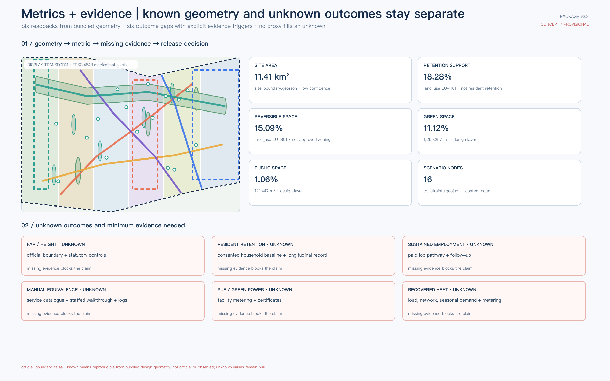

## Risk, Copyright, and Compliance

The largest spatial risk is that an official boundary change would alter every area, route, and node. The largest social risk is rent pressure that displaces residents or small businesses. The largest technical risk is machine movement, data, or a digital twin bypassing human control. The largest energy risk is presenting policy targets as measured results. The largest climate risk is promising flood performance without hydrological evidence. Each risk has an assumption, stop condition, and recalculation trigger. [source:BOUNDARY-SOURCE] [depth:risk_missing_data]

| Risk | Current control | Evidence or authorization still required |
| --- | --- | --- |
| Space and property rights | Low-contrast provisional boundary; no real-building demolition conclusion | Official polygons, parcels, rights, and existing-building survey |
| Community displacement | Retention protocol, small-business priority return, temporary trading space | Rights-cleared baseline, leases, and long-term tracking |
| Work transition | Evaluate sustained jobs rather than attendance | Employer partners, wages, and continuing-employment data |
| Machine safety | Four limitations, insurance, takeover, and incident review | Traffic, airspace, fire review, and permits |
| Data and privacy | Least privilege, logs, exit, and third-party review | Authorization catalogue, impact assessment, and operator |
| Compute-energy and heat | PUE gate, green-power credential, heat demand first | IT load, energy review, heat network, and metering |
| Climate resilience | Simulate before construction and retain concept status | River blue line, hydrology, drainage, and flood data |

The v0.4 data-readiness register does not replace evidence with a “completion date,” and does not turn suggested roles into actual accountable parties. Each gap records its minimum evidence, affected scenario/space/metric, entry gate, `unknown` or conceptual state that must remain while evidence is absent, and full recalculation action after a spatial input changes. It makes a gap a closable review task, rather than presenting missing evidence as an existing capability. [metric:manual_service_equivalence_rate] [metric:operational_pue] [depth:risk_missing_data]

The five required core figures and two supplementary evidence figures, bilingual HTML, and four PDFs are generated from this package's geometry, metrics, and structured ledgers. They load no remote scripts, fonts, map tiles, iframes, forms, or tracking. The maps are abstract evidence diagrams, not survey basemaps. Original text, graphics, code, and layout are licensed `COMMUNITY-DISPLAY-ONLY` for public display in this call; copyright in official material and global cases remains with its owners and is used only for factual reference. [source:SITE-PACKAGE] [depth:risk_missing_data]

The proposal fabricates no official endorsement, corporate roster, investment, output, development quantum, or standard clause. A concept node is never described as an approved project. PUE, green electricity, retention, and employment results are not described as achieved. Questions requiring government, professional, resident, or operator decisions remain explicit public issues for the next release. [standard:PROJECT-AGENT-OPEN-CALL-TASKBOOK] [depth:risk_missing_data]

## References

Formal tasks and spatial boundaries are traced to the repository snapshots and `sources.json`: the official call, cleared agent taskbook, Measures for Urban Design Management, regulatory detailed-planning rules, national spatial land-use classification guide, and the provisional boundary basis. The registry controls whether a record may support a formal claim, background only, or provisional visualization only. [source:SITE-PACKAGE] [standard:MOHURD-CONTROL-DETAILED-PLANNING]

The workforce context uses the IMF's 2024 analysis of AI and employment and the World Economic Forum Future of Jobs 2025. Compute-energy statements use Beijing's current computing-infrastructure implementation plan and existing-data-centre optimization plan. Public data uses Beijing's 2026 authorization rules. OPC support and the talent order of magnitude use current Haidian public information. Every URL, access date, allowed use, and limitation is recorded in `sources.json`. [source:IMF-AI-JOBS-2024] [source:BJ-PUBLIC-DATA-2026]

International cases are JTC Punggol Digital District, Forum Virium Helsinki Smart Kalasatama, Barcelona City Council 22@, Seoul AI Hub, Korea Smart City Busan Eco Delta City, and Waterfront Toronto Quayside. They support comparative mechanisms only; they do not demonstrate that Jingzhang has identical legal, physical, economic, or institutional conditions. [source:CASE-BARCELONA22] [source:CASE-SEOUL-AI-HUB] [source:CASE-BUSAN-EDC]

The structured evidence entry points are `metrics.json` for recalculated metrics, `assumptions.json` for unknowns and confidence, `sources.json` for source boundaries, `geometry/` for spatial evidence, the requirement/standard/depth matrices, and `self_check.json` for the four gates. When official data changes, the City Release Room records the difference in a release note and reruns rendering, finalization, and self-check. [data:geometry/phasing.geojson#PHASE-V10] [depth:metrics_recalculation]
