## v2.6 公共利益覆盖扩展｜把三类容易被 AI 叙事遮住的人写回场景

既有 `personas-and-fairness.json` 已登记六类基础 persona，本轮不改写原有契约，只补充三类在公共利益审阅中容易被漏看的群体：青年学生与初入行者、开发者与研究者、首次到访者与国际访客。每一类都沿“受益—影响风险—空间/场景—人工替代—停止条件—待补证据”回到既有包内要素，避免用概念人群冒充人口调查、服务覆盖率或公平结果。[data:visual/assets/public-interest-coverage-v26.json] [data:visual/assets/run-public-interest-coverage-v26.js] [depth:risk_missing_data]

| 公共利益扩展 | 可见受益 | 需要防止的影响 | 既有场景与空间回接 | 资料不到位时 |
| --- | --- | --- | --- | --- |
| 青年学生与初入行者 | 不以自动评分筛选的技能再造、人工解释和可撤回学习入口 | 转型压力、污名化、等待时间和学习数据过度留存 | `SC-A02` / `ROAD-A-SKILL` / `BLDG-A-02` | 没有人工咨询、退出记录或岗位质量资料，停在 G0，不开放自动分流 |
| 开发者与研究者 | 最小权限目录、公共观察席和受限实验，不把平台评分当入场资格 | 供应商锁定、知识产权不清、测试外溢和误接入个人/市政数据 | `SC-B01` / `ZONE-B-API` / `BLDG-B-01` / `BLDG-D-01` | 授权、权利、日志或人工接管不清，冻结实验，回到纸面协议 |
| 首次到访者与国际访客 | 多语公共信息、人工解释、普通通行和可退出服务 | 语言障碍、错误医疗/生活信息、个案数据误收集和文化误读 | `SC-D03` / `BLDG-D-02` / `PUBLIC-D-GLOBAL` | 语言解释、权利清单或个案授权不完整，关闭展示，保留人工服务 |

这是一份覆盖和资料缺口登记，不是人口调查、无障碍认证、服务绩效、就业结果或官方评分。正式基线、权利和授权资料到位后，须连同 persona、scenario、geometry、metrics、图件、HTML、PDF 和 self-check 一起重算。[data:geometry/constraints.geojson#SC-A02] [data:geometry/constraints.geojson#SC-D03] [depth:risk_missing_data]

## v2.5 公共空间连接与社群转化｜让 agent.4、agent.6 不停在活动清单

v2.5 补的是任务书里最容易被“AI 展台”掩盖的两处：**东西缝合 / 南北贯通**不是新增道路或工程线位，而是把三处重点区读成一条“普通到达 → 人工选择 → 受控机器 → 蓝绿恢复 → 退出回放”的南北公共脊，并用公共问题台、社区服务、OPC 共学和小月河无屏恢复把东西两侧缝合回日常。[data:visual/assets/public-space-connector-atlas-v25.json] [data:geometry/phasing.geojson#PHASE-V01] [depth:overall_spatial_structure]

组件库把公共空间的动作写成可复用的五种“人先看到的构件”：人工入口桌、代际共学桌、无屏恢复节点、贡献与荣誉回放墙、暂停与回退标识。它们均绑定既有 `public_space` / `green_space` 锚点，尺寸保持 `null`，不主张场地、权属、文保、运营或建设结果。[data:visual/assets/public-space-connector-atlas-v25.json] [data:geometry/public_space.geojson#PUBLIC-A-INCLUSION] [data:geometry/green_space.geojson#GREEN-A-QUIET-1]

“公共贡献三联展”只展示经授权、可追溯、可撤回的问题贡献、照料贡献和回放贡献；“荣誉”指向公共贡献，不是官方荣誉、评奖、企业名单、招商或公共信用评价。取得权利、署名、撤回和独立复核资料后，才可由专业团队深化研究。[data:visual/assets/public-space-connector-atlas-v25.json] [depth:risk_missing_data]

开发者社群与长期运营不再只写四季活动，而是压成四个可停止的转化门：**公开问题 → 共学 / 复核 → 受控场景 → 回放 / 发布**。每一门都给出空间锚点、人工等效、第一份证据和停止条件；它可以把被替代风险劳动者的带薪转型、开发者协议复核、公共服务问题和城市 release note 放到同一条知识外溢链，但不指定主体、经费、日程、招商或政策。[data:visual/assets/developer-community-conversion-v25.json] [source:HD-OPC-2026] [depth:phasing_implementation]

图 27 把连接策略、五类组件和转化链放进同一张表达级城市设计图；它不是调试截图、工程图或评分卡。[data:visual/assets/check-public-space-operations-v25.js]

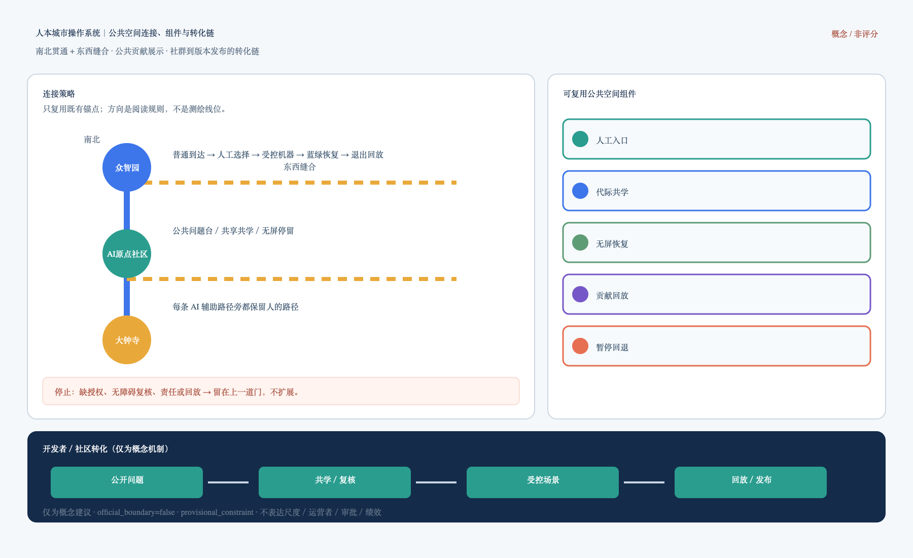

本轮只增加任务可读性和可转化证据，不改变 `geometry`、`metrics`、核心五图或发布排序。所有锚点仍是 `official_boundary=false`、`geometry_role=provisional_constraint`，活动 / 组件 / 转化仍是概念建议、参考方案，可供专业团队深化研究；取得正式边界、权属、文保、无障碍、气候、数据授权和运营资料后，应连同图件、HTML、PDF、manifest 与 self-check 全量复算。[data:visual/assets/check-public-space-operations-v25.js] [depth:metrics_recalculation] [depth:risk_missing_data]

## v2.4 证据交叉索引与政策边界｜让每一条任务都能独立回读

v2.4 不增加新的空间承诺，而是把 23 条公告 / 任务书要求各自绑定到一条最短的包内证据链：`compliance_matrix.json` 的 `evidence_items` 给出唯一入口、空间或结构证据和复核边界；`reviewer_evidence_map` 的 `differentiator_zh` 说明这一条与“AI 展台”叙事的差别。这样评审者不必把同一组总表当成每条要求的证明。[data:compliance_matrix.json] [depth:brief_alignment]

`assumptions.json` 现在给每个资料缺口标注 `priority`。高优先级只表示补料会改变空间、指标或发布门，不表示缺口已经解决；官方边界、道路 / 空域、权属、公众基线、能源、气候、授权和运营结果仍保持待补状态。[data:assumptions.json] [depth:risk_missing_data]

`metrics.json` 对 `operational_pue` 和 `green_electricity_share` 增加了 `proposal_baseline_not_measured` 的 `design_target`。前者只引用北京智算设施政策导向，后者明确 30% 是相关存量数据中心目标区间的提案基线；两者都不是本项目法定控制值、许可结论或实测绩效。[source:BJ-COMPUTE-2024] [source:BJ-DATACENTER-2024]

正式项目取得授权、能源设计、采购凭证与计量后，必须连同图件、HTML、PDF 和 self-check 一起重算。[metric:operational_pue] [metric:green_electricity_share]

这轮增量只改善证据可读性、补料排序和政策边界；不把任何 unknown 升级成结果，也不产生官方评分、政府背书或实施许可结论。[depth:metrics_recalculation] [depth:risk_missing_data]

## v2.3 城市 API 六步序列｜把可调用写成可回放的责任链

v2.2 已将“哪里发生空间关系”和“人怎样进入、拒绝、暂停、退出”放在同一首屏；v2.3 再把城市 API 从一句协议压成六步可回放序列：**目录 → 授权 → 调用 → 日志 → 审计 → 退出**。每一步同时给出空间锚点、责任角色、人工等效、停止/回退触发器和包内证据入口，评审者可沿同一条线核对“谁能调用、凭什么调用、何时必须停”。[data:visual/assets/city-api-sequence-v23.json] [depth:municipal_new_infrastructure] [depth:phasing_implementation]

图 26 是表达级城市设计图，不是 API 架构部署图、工程断面或运行结果。六步只引用既有 `PUBLIC-B-API`、`SC-B01`、`SC-B04`、`SC-C04` 与 `PHASE-V02` 等临时锚点；`official_boundary=false`、`geometry_role=provisional_constraint`、`operational_status=not_authorized_not_run` 和 `performance_results=null` 继续保持。人工、电话、纸面、线下解释与撤销路径并列保留，不能独立回放或责任不清就退回上一发布门。[data:geometry/public_space.geojson#PUBLIC-B-API] [data:geometry/constraints.geojson#SC-B01] [data:geometry/phasing.geojson#PHASE-V02]

六步序列的离线检查证据见 [data:visual/assets/city-api-sequence-v23-evidence.json]；它只证明字段、引用、停止边界与双语图件可回放，不产生接口能力、许可、运营或评分结论。

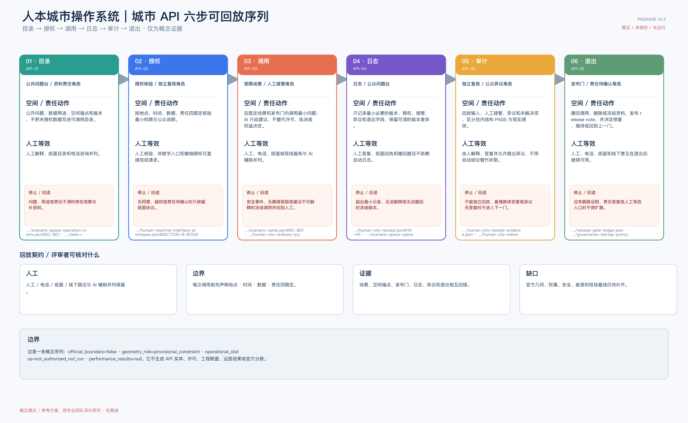

本轮同时在六个测试类场景登记 `first_evidence_needed_zh/en` 与 `first_evidence_owner_zh/en`：它们只说明若有一天获得授权，第一份应收集什么、由哪类待授权角色复核，不把建议角色写成已确认运营者。[data:visual/assets/pilot-readiness-register.json] [depth:risk_missing_data]

参数化取舍不再只显示“候选存在”：`parametric-tradeoff-study-evidence.json` 新增 `decision_diff`，从既有 baseline share、候选 share 和派生面积回算社区保留、可逆留白与 API/具身带的差异；`status=conceptual_comparison_only`，不改写正式 geometry、metrics、图纸或发布状态。[data:visual/assets/parametric-tradeoff-study-evidence.json]

这组差异回接既有的社区保留支撑面积、可逆留白占比与指标复算规则。[metric:community_retention_support_area_ratio] [metric:reversible_space_ratio] [depth:metrics_recalculation]

### 一条可回读的 AI 空间差分｜机器可调用不是唯一目标

下面只把 `people_first` 与 `baseline_reproduction` 的既有回算结果展开，帮助评审先看“空间取舍改变了什么”；它不是推荐方案，也不是现状、规划定案或正式面积指标。三项都以同一临时场地面积推导，`derived_area_sqm_delta` 只用于概念比较。[data:visual/assets/parametric-tradeoff-study.json] [data:visual/assets/parametric-tradeoff-study-evidence.json] [data:visual/assets/spatial-action-rooms-v21.json]

| 既有空间带 | baseline → people-first | share 差分 | 派生面积差分（㎡） | 回接的空间动作房间 |
| --- | ---: | ---: | ---: | --- |
| 社区保留与服务（LU-H01） | 18.2759% → 24.0000% | +5.7241 个百分点 | +653,284.939 | 北京 AI 原点社区：保留账本、人工入口与无屏恢复 |
| 可逆留白与临时使用（LU-B01） | 15.0936% → 18.0000% | +2.9064 个百分点 | +331,703.646 | 蓝绿停留、临时使用与退出/回放路径 |
| 城市 API 与具身研发（LU-B02） | 15.4835% → 11.0000% | −4.4835 个百分点 | −511,691.664 | 众智园：受限测试、人工接管与停止/退出 |

这张表只提高差分的可见性；正式几何、面积、指标、许可和运营结果仍以官方资料到位后的全量重算为准。[depth:metrics_recalculation] [depth:risk_missing_data]

v2.3 仍只改善责任链、实施可审查性与表达完整度；不新增官方边界、容积率、建筑高度、工程线位、容量、投资、许可、政策确定性或现实运营绩效。官方几何、权属、道路/空域、安全、能源、气候、授权和公众基线到位后，应连同序列图、准备度台账、参数化回放、metrics、HTML、PDF 和 self-check 全量重算。[depth:risk_missing_data]

## v1.9 一页执行摘要｜任务书到空间响应

本页先回答“任务书要求什么、空间怎样承接、评审者到哪里核对”。全篇仍是概念建议 / 参考方案，供专业团队深化研究；三处重点区及两翼只作为 `official_boundary=false`、`geometry_role=provisional_constraint` 的空间约束，不是官方红线或实施边界。[source:AGENT-TASKBOOK] [data:visual/assets/brief-alignment-atlas-v19.json]

### 三大定位、五大功能、三区两翼

| 任务书层 | 本方案的空间翻译 | 最短核对入口 |
| --- | --- | --- |
| 三大定位 | 百年京张文化带：在大钟寺与京张历史叙事中保留连续记忆；都市 AI 生活体验带：在 AI 原点社区先走通人工、代际与无屏日常；AI 融合创新带：在众智园和中关村科技服务翼把创新放进可暂停、可回放的接口。 | `assets/figures/brief-alignment-atlas.png`；`proposal.md`；`geometry/key_areas.geojson` |
| 五大功能 | AI 全栈自主创新体系、世界级 AI 创新生态、AI+ 场景赋能新范式、智能化 AI 活力城市、AI 治理全球话语权，分别回到受控测试、全球案例/区域接口、17 张场景卡、公共空间/交通蓝绿和版本发布门。 | `visual/assets/brief-alignment-atlas-v19.json`；`compliance_matrix.json` |
| 三区两翼 | 众智园 AI 自主创新加速区、北京 AI 原点社区、大钟寺 AI 产业聚集区；中关村科技服务翼、小月河场景赋能翼。每个空间单元有动作、场景、资料缺口和退出条件，没有新增工程尺寸或运营主体。 | `geometry/key_areas.geojson`；`visual/assets/spatial-action-atlas.json`；`visual/assets/regional-interface-ledger.json` |

### 四条主线各自落到场景、指标和缺口

| 主线 | 可见空间动作 | 场景 / 指标 | 当前不能证明的资料 |
| --- | --- | --- | --- |
| A 人的尊严 | 社区保留议事、人工与代际共学、技能再造走廊、无屏恢复绿地 | `SC-A01` / `SC-A03` / `SC-A05`；`community_retention_support_area_ratio` | 居民与商户基线、持续就业、人工服务等效走读和知情同意 |
| B 机器可用 | 城市 API 交换、受限具身测试、硅基通行权和低空概念分层 | `SC-B01` / `SC-B02` / `SC-B04`；`silicon_right_of_way_length_m` | 道路、空域、安全、保险、责任和接口授权断面 |
| C 硬约束 | 算电余热核验、行洪/海绵模拟、监管沙盒事故复盘、公共数据授权样板间 | `SC-C01`—`SC-C05`；`operational_pue` 保持 `unknown` | 能源与热网、水文、保险责任、正式数据授权与专业审查 |
| D 势能外溢 | OPC 共享实验、标准外溢工作室、版本 release note、国际服务客厅 | `SC-D01`—`SC-D04`；`version_release_count` | 参与主体、知识产权许可、跨区协作和服务能力核验 |

图 22 将这套映射压成评审窗口可读的一页；JSON 记录每行的 `spatial_refs`、`scenario_refs`、`metric_refs` 和 `data_gap`。它用于证明“任务书—空间—证据”能相互回读，不生成官方分数，也不把图面完整度写成现实绩效。[data:assets/figures/brief-alignment-atlas.png] [depth:overall_spatial_structure] [depth:risk_missing_data]

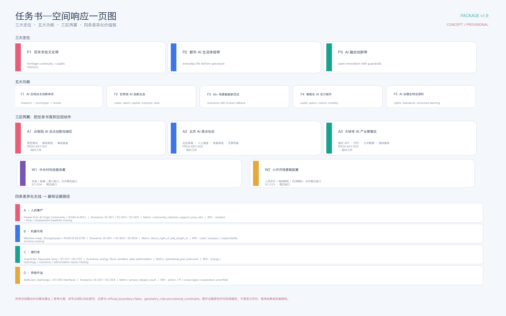

## v2.0 公共空间、文化叙事与年度运营｜让 agent.4—agent.6 在图上相遇

任务书的公共空间、地标、文化叙事与年度运营在同一张概念图上相遇：地标承担日常可读的公共动作，四季节奏承担版本治理，项目族把空间动作交给相应的资料门和退出条件。三者均供专业团队深化研究，不指定现实运营主体、场地、许可、资金或绩效。[source:AGENT-TASKBOOK] [data:visual/assets/public-culture-operations-atlas-v20.json]

| 设计层 | 三个可读地标 | 四季运营节奏 | 当前证据与缺口 |
| --- | --- | --- | --- |
| 公共空间与新产业 | 人的版本大厅：issue、变更、撤回；轨道接口钟：铁路时间与城市版本；无屏恢复灯塔：树荫、声音、夜间安全与不强制交互 | 春：城市问题开源周；夏：城市 API 与具身测试月；秋：工作转型与 OPC 共创季；冬：城市版本大会 | `SC-C05`、`SC-D02`、`GREEN-A-QUIET-1`、17 张场景卡；正式场地、无障碍、热环境、夜间安全与公众参与基线待补 |
| 项目族与发布门 | PF-A 人本缓冲、PF-B 城市 API、PF-C 人机/气候/算电、PF-D 数据授权/版本治理、PF-E 生态外溢，分别回到三区两翼与 v0.1/v0.2/v1.0 概念门 | 每季只开放对应资料门内的概念动作；没有人工解释、独立回放、责任回复或公众异议处理就停留在上一门 | `visual/assets/implementation-operation-matrix.json`；不生成工期、预算、容量或运营承诺 |

文化语法采用“钢轨—时间—接口”：钢轨承接百年京张连续性，时间刻度承接年度版本，接口节点承接公共解释和人的最终决定权。三座地标不是企业展示台；它们把历史、普通人的恢复和可质疑的城市版本放到同一条公共脊上。[data:assets/figures/public-culture-operations-atlas.png] [depth:renewal_project_list] [depth:overall_spatial_structure]

图 23 只表达概念关系与可回放的运营边界，所有锚点继续是 `official_boundary=false`、`geometry_role=provisional_constraint`。正式公共空间、文保、道路、无障碍、热环境、夜间安全、能源、场地授权与居民反馈到位后，应连同地标、年度节奏、矩阵、metrics、HTML 和 PDF 一并重算。[data:visual/assets/public-culture-operations-atlas-v20.json] [depth:risk_missing_data]

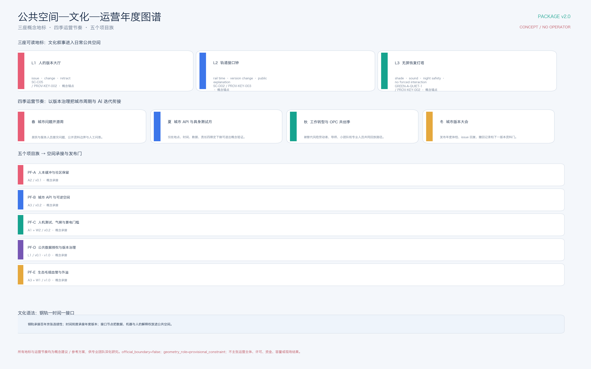

## v2.1 空间动作房间｜把三处重点区从“节点”读成可走的空间序列

v2.0 的地标与年度节奏回答了“公共空间如何承接任务书”；v2.1 进一步把三处临时重点区各自的问题压到五个连续空间房间：到达与人工入口 → 公共解释与选择 → 受限机器接口 → 蓝绿停留与恢复 → 退出、申诉与回放。每个房间同时写出人工等效、机器边界和停止/回退动作，使空间建议不依赖评审者从治理台账自行补全。[data:visual/assets/spatial-action-rooms-v21.json] [depth:three_key_area_detailed_design] [depth:overall_spatial_structure]

图 24 是表达级概念板，不是调试截图或工程断面。左栏回指三处 `official_boundary=false`、`geometry_role=provisional_constraint` 的 GeoJSON 锚点，五个色块只代表空间动作阶段，不代表距离、面积、层数、容量或线位；每行的场景与指标引用、资料缺口和重算触发器登记在同名 JSON。[data:assets/figures/spatial-action-rooms-v21.png] [data:geometry/key_areas.geojson#PROV-KEY-001]

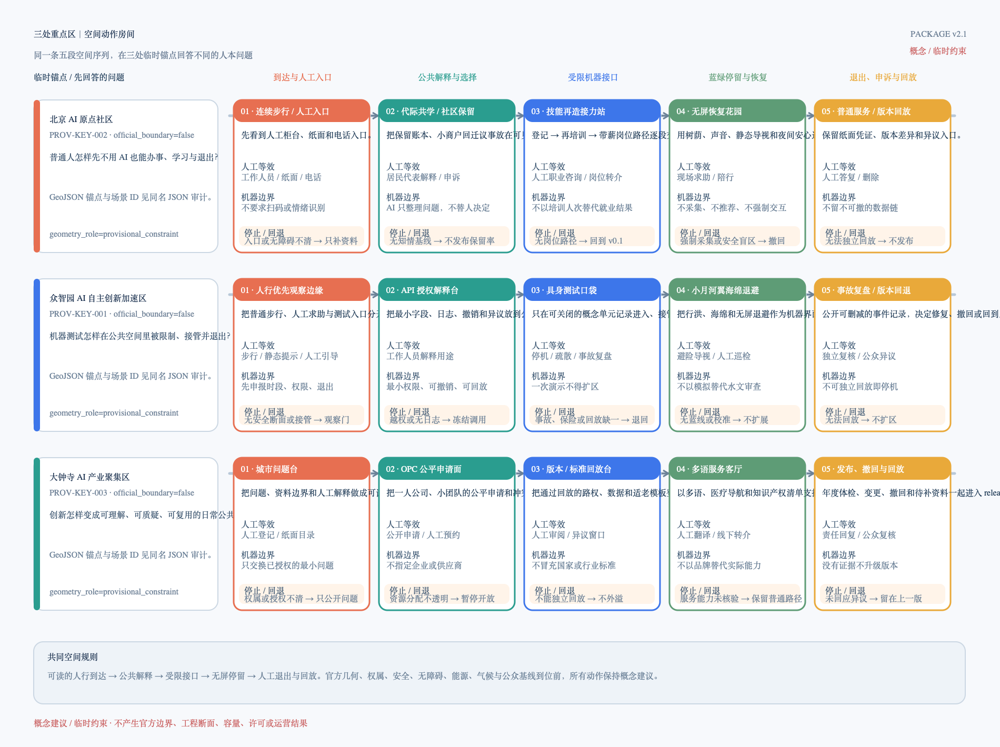

三处重点区仍只是概念建议 / 参考方案，可供专业团队深化研究。官方边界、道路/空域、权属、无障碍、能源、气候、责任、公众基线或授权数据发生变化时，需连同该图、五张核心图、metrics、HTML、PDF 和 self-check 全量重算；本轮不改变任何正式几何或指标。[data:visual/assets/spatial-action-rooms-v21.json] [depth:metrics_recalculation] [depth:risk_missing_data]

## v2.2 评审首屏｜让空间证据与人本动作在同一张图上相遇

v2.1 的五段空间动作房间已能逐节点回放；v2.2 进一步把它们放回评审者最先看到的 `site-overview.png`：左侧是同一批 GeoJSON 的显示变换底图，右侧是三区 × 五段动作的紧凑卡片，底部同时标出人工路径、EPSG:4548 指标来源和仍未补齐的官方边界/权属/安全/能源/现场基线。这样“哪里发生空间关系”与“人怎样进入、拒绝、暂停、退出”不再分散到两张图。[data:visual/assets/reviewer-facing-atlas-v22.json] [data:assets/figures/site-overview.png]

这张首屏对应任务书的场景可感知性与空间清晰度问题；重点区详细设计承接首个 formal 深度证据 [depth:three_key_area_detailed_design]，总体空间结构承接第二个 [depth:overall_spatial_structure]。

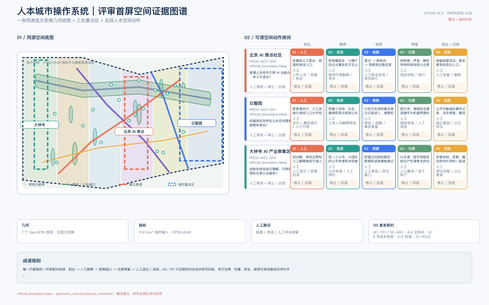

图 25 只改善表达级城市设计图的首屏可读性。底图采用为长廊阅读的显示变换，像素距离不参与度量；临时边界仍是 `official_boundary=false`、`geometry_role=provisional_constraint`，动作卡仍是概念建议 / 参考方案，可供专业团队深化研究。官方 polygon、道路/空域断面、权属、无障碍、能源、气候、责任或公众基线变化时，必须连同五张核心图、图 24、metrics、HTML、PDF 和 self-check 全量重算。[data:visual/assets/reviewer-facing-atlas-v22.json] [data:geometry/site_boundary.geojson#SITE-001] [depth:metrics_recalculation]

其中，风险与资料缺口的回退动作沿用 [depth:risk_missing_data]；该图不把临时显示变换升级为官方测量或实施结论。

## 一页先读｜先看空间动作，再看治理证据

### 方案判断

“从 AI 展台，到 AI 时代人的城”不是把传统总图换成科技词汇，而是把 AI 的快速迭代翻译成一套**可进入、可拒绝、可暂停、可回滚**的城市接口。[source:AGENT-TASKBOOK] [depth:three_level_scope_framework]

三层范围收敛为同一条证据链：三处临时重点区、六层空间操作系统、四条价值链、17 个空间场景节点与三道发布门。[metric:key_area_count] [metric:scenario_node_count] [metric:version_release_count]

### 四条价值链落到空间

| 价值链 | 现场可读的概念动作 | 当前包内证据 | 仍需补齐的资料 |
| --- | --- | --- | --- |
| A 人的尊严 | 原住民保留与社区服务织补、技能再造走廊、人工/电话/纸面入口、无屏绿地与身心健康补给 | `LU-H01`、`ROAD-A-SKILL`、6 类基础 persona + 3 类公共利益扩展、17 张场景卡 | 居民基线、商户与就业追踪、无障碍走读与授权运营记录 |
| B 机器可用 | 城市 API 交换站、硅基通行权测试场、低空物流分层、可逆构件库与数字孪生试验台 | `LU-B01`/`LU-B02`、`ROAD-B-SILICON`、人机接口原型 | 交通/航空/安全断面、接口责任主体、专业模型与现场测试 |
| C 硬约束 | 算电余热审计、行洪与海绵模拟、监管沙盒事故复盘、公共数据授权样板间、版本发布室 | `SC-C01`—`SC-C05`、3 道发布门、5 阶段启动程序 | 能源与热网、蓝线水文、保险/责任、数据授权与正式边界 |
| D 势能外溢 | OPC 共享实验室、标准外溢工作室、国际服务客厅，把研发记录转成可复用协议 | `SC-D01`—`SC-D03`、三区两翼接口 | 参与主体、知识产权许可、跨区协作与服务供给核验 |

### 三处重点区不是三个展台

| 临时重点区 | 重点回答的问题 | 代表性空间动作 |
| --- | --- | --- |
| 众智园 AI 自主创新加速区 | 机器怎样被约束、怎样停下来 | 具身智能受控测试、算电余热核验、受限路权与事故复盘 |
| 北京 AI 原点社区 | 普通人怎样不被数字化排除 | 人工通道、代际共学、技能再造、社区保留与无屏绿地 |
| 大钟寺 AI 产业聚集区 | 创新怎样变成公共可读的日常 | 文化叙事、OPC/小团队服务、国际化软配套与公共展示 |

三处边界均是 `official_boundary=false`、`geometry_role=provisional_constraint` 的临时约束，用于表达空间关系和复算，不是官方红线、权属界线或工程定位。[data:geometry/key_areas.geojson#PROV-KEY-001] [data:geometry/key_areas.geojson#PROV-KEY-002] [data:geometry/key_areas.geojson#PROV-KEY-003]

### 用少量可重算指标校准取舍

当前提交边界在 EPSG:4548 下复算为 11,412,825.386 平方米（低置信、临时几何）；绿色空间占比 11.1213%，公共空间占比 1.0641%。[metric:site_area_sqm] [metric:green_ratio] [metric:public_space_ratio]

社区保留支持用地占比 18.2759%，可逆留白占比 15.0936%；技能再造走廊、硅基通行权与低空概念走廊分别为 5,919.240 米、4,585.615 米和 2,015.137 米。[metric:community_retention_support_area_ratio] [metric:reversible_space_ratio] [metric:skill_transition_corridor_length_m]

上述量均为概念结构的可重算量，不是法定指标、工程长度或绩效承诺；道路长度与低空廊道另行登记为可复核几何证据。[metric:silicon_right_of_way_length_m] [metric:low_altitude_concept_corridor_length_m]

### 三道发布门把十年城市周期和三个月 AI 迭代接起来

`PHASE-V01` 先做观察、基线与公众共识；`PHASE-V02` 只允许可逆、可退出的概念试点；`PHASE-V10` 才讨论经专业审查后的扩展与标准外溢。[data:geometry/phasing.geojson#PHASE-V01] [data:geometry/phasing.geojson#PHASE-V02] [data:geometry/phasing.geojson#PHASE-V10]

每道门都保留人工等价服务、责任待确认、资料缺口和停止动作；当前全部属于概念建议，未宣称已经授权、运营、获批或实施。[depth:phasing_implementation]

**先读结论：**本包能证明空间动作、证据引用、指标公式和失败关闭路径可以离线复核；不能证明官方边界、居民结果、就业结果、PUE/绿电、热网接入、交通安全、许可、投资或现实运营绩效。所有缺口保留在 `assumptions.json`、`metrics.json` 与资料就绪度台账，待公开或授权数据到位后再重算。[depth:risk_missing_data]

## v1.4 空间序列｜先把人的日常走通，再调用机器

上一版已经回答三处重点区“要做什么”；本版把它压成评审者和普通人都能沿着图面走的一条空间序列：**到达与停留 → 人工解释与选择 → 受限机器接口 → 蓝绿缓冲 → 退出、申诉与回放**。这不是新增一条展示轴，也不是把制度台账换个名字，而是把每个空间节点的可见手势、机器边界和失效动作放在同一行，供专业团队深化研究。[data:visual/assets/human-city-spatial-sequence.json] [depth:overall_spatial_structure]

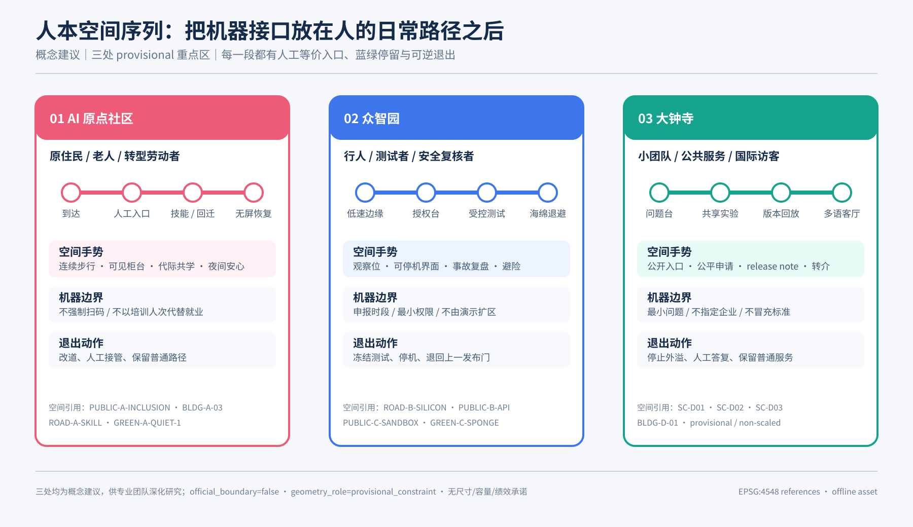

| 临时重点区 | 人先看到的空间序列 | 机器只能做什么 | 失效时的空间动作 | 仍需补齐的资料 |
| --- | --- | --- | --- | --- |
| 北京 AI 原点社区 | 连续步行与人工导视 → 服务厅/代际共学 → 技能再造与小商户回迁议事 → 无屏恢复绿地 | 提供翻译、排队或岗位信息建议；不强制扫码、不以培训人次替代就业 | 改道、人工接管、保留电话/纸面路径；无可信基线不发布保留或转型比例 | 官方边界、无障碍走读、居民/商户知情基线、夜间服务能力 |
| 众智园 AI 自主创新加速区 | 低速人行优先观察边缘 → API 授权解释台 → 受限具身测试与事故复盘 → 小月河翼海绵退避 | 在申报时段和最小权限内做模拟或受控测试；不由一次演示扩区 | 冻结调用、停机、回到上一发布门；安全、保险、责任或回放缺一不测 | 官方边界、道路/空域审查、保险事故协议、水文与排水输入 |
| 大钟寺 AI 产业聚集区 | 城市 API 问题台 → OPC 公平申请与共享实验 → 版本/标准回放 → 多语人工服务客厅 | 交换已授权的最小问题和版本；不指定企业、不冒充国家标准 | 停止外溢、人工答复、保留普通服务；无法独立回放不进入下一门 | 官方边界、共享实验室规则、权利/IP 协议、多语和医疗服务能力 |

三处节点全部使用现有 GeoJSON 锚点，功能带和界面关系不填工程尺寸；`official_boundary=false`、`geometry_role=provisional_constraint`、`operational_status=not_authorized_not_run` 均保持不变。图 15 与 JSON 只证明空间阅读顺序和回退逻辑可回溯，不证明实际道路、建筑、人员值守、蓝线、空域、容量、绩效或实施授权。[data:geometry/key_areas.geojson#PROV-KEY-001] [data:geometry/key_areas.geojson#PROV-KEY-002]

三处重点区的第三个空间锚点、总体临时面积和资料缺口仍按同一规则登记；取得清权或官方输入后再整包重算。[data:geometry/key_areas.geojson#PROV-KEY-003] [metric:site_area_sqm] [depth:risk_missing_data]

## v1.5 设计主线｜沿京张公共脊先走通日常，再调用机器

v1.4 的三张重点区卡回答“每区怎么停下来”；本轮把三处临时重点区按公告南北顺序串成一条可读主轴：先进入与停留，再由人工解释和选择，之后才开放受限机器接口；蓝绿缓冲和退出回放始终是机器界面的后置条件。[data:visual/assets/human-city-mainline.json] [data:geometry/key_areas.geojson#PROV-KEY-001] [depth:overall_spatial_structure]

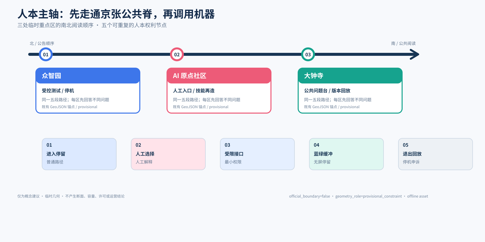

图 16 只重排既有空间锚点和五段空间动作，不新增距离、断面、容量或运营事实。主轴顺序是概念阅读规则，不是官方规划线位；取得官方 polygon、道路、权属、文保、水文、空域和公众基线后，须连同图件、metrics 和发布门全量重算。[data:visual/assets/human-city-spatial-sequence.json] [depth:risk_missing_data]

## v1.5 规划推演｜从三组手工候选到可回放搜索集

在既有三组透明候选之外，本轮用固定种子在六层概念功能带上生成 128 组候选，并按四个既有比较镜头重算、筛出非支配集合。这个搜索展示“机器可复算的取舍过程”，不是把代理值写成 AI 能力、居民结果或正式推荐。[data:visual/assets/parametric-search.json] [metric:site_area_sqm] [depth:metrics_recalculation]

`visual/assets/parametric-search-evidence.json` 逐项记录样本约束、面积公式、代理镜头、非支配筛选和“不改正式 geometry/metrics”的边界；`confidence=low` 与所有资料缺口保持不变。[data:visual/assets/parametric-search-evidence.json] [data:geometry/land_use.geojson#LU-H01] [depth:risk_missing_data]

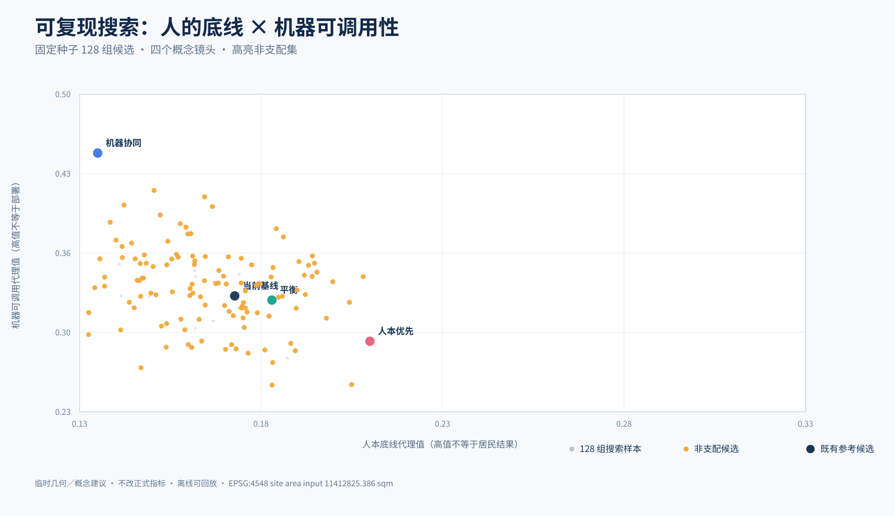

候选 share 只用于同一临时边界的概念比较，面积仍按 EPSG:4548 下已有 `site_area_sqm` 公式回接；它不产生容积率、建筑高度、拆改留、工程可行性、投资或政策结论。[metric:site_area_sqm] [metric:design_partition_area_sqm]

## v1.5 概念交付主线｜项目族、发布门、证据与停止动作同图

治理台账不再单独占据首屏；图 18 把既有 PF-A—PF-E 项目族、v0.1/v0.2/v1.0 发布门、进入前证据和失败回退压成一个审阅骨架。它只复用 `implementation-operation-matrix.json` 的建议角色与停止协议，不新增责任主体、预算、工期、许可或运营承诺。[data:visual/assets/human-city-delivery-spine.json] [depth:phasing_implementation] [depth:risk_missing_data]

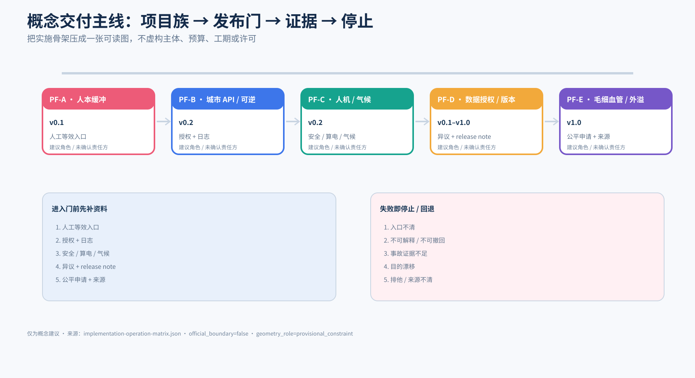

所有项目族仍处于 `conceptual_governance_not_commitment`，建议角色不是确认运营方；当官方边界、权属、能源、气候、交通、无障碍、责任与公众资料到位后，才可由专业团队选择性重算和深化。[data:visual/assets/implementation-operation-matrix.json] [data:geometry/site_boundary.geojson#SITE-001] [depth:risk_missing_data]

## v1.6 空间证据图｜让评审先看见真实关系

本轮把评审窗口中的五张核心图统一改为同源空间证据图。总体图叠合临时总体边界、六块分区、三处重点区、五条概念中心线、绿地、公共接口和十六个场景节点；重点区图再以同一坐标框架放大三处轮廓，并把社区保留、技能再造、人工通道、监管沙盒等差异化动作放到各自空间旁。[data:visual/assets/spatial-proof-v16.json] [data:geometry/key_areas.geojson#PROV-KEY-001] [depth:overall_spatial_structure]

图件中的面积、占比和长度只从 `metrics.json` 与 GeoJSON 在 EPSG:4548 下重算。图上北向旋转只为让南北走廊横向可读，比例尺也只描述临时几何的展示框架；`official_boundary=false`、`geometry_role=provisional_constraint` 和 `operational_status=not_authorized_not_run` 仍在图签与证据记录中显式保留。[data:geometry/site_boundary.geojson#SITE-001] [metric:site_area_sqm] [depth:metrics_recalculation]

这组图补足的是“空间关系能否被一眼核对”，不替代官方边界、控规、道路红线、权属、蓝线、空域、现状调查、居民基线或运营测试。取得这些资料后，五张图、四类矩阵、指标、HTML 与 PDF 需整包重算；当前所有空间动作均为概念建议 / 参考方案，供专业团队深化研究。[data:visual/assets/spatial-proof-v16.json] [depth:risk_missing_data]

## v1.7 空间表达升级｜让节点动作在评审窗口中可辨认

v1.6 已经把抽象长条换成了真实提交几何，v1.7 继续处理阅读尺度问题。总体图下方增加三处重点区放大框，分别回指 `PROV-KEY-001`、`PROV-KEY-002`、`PROV-KEY-003`；重点区图把每个轮廓与差异化动作链并置；人机共行图把技能再造、硅基通行权、低空概念分层和小月河海绵韧性放在同一组交叉规则旁；指标图明确“几何 → 指标 → 待补资料”的回读顺序。[data:visual/assets/spatial-proof-v17.json] [data:geometry/key_areas.geojson#PROV-KEY-001]

这组表达重点支撑重点区详细设计和总体空间结构的阅读，`ROAD-B-SILICON` 及其余动作仍需回到台账核对。[data:geometry/roads.geojson#ROAD-B-SILICON] [depth:three_key_area_detailed_design] [depth:overall_spatial_structure]

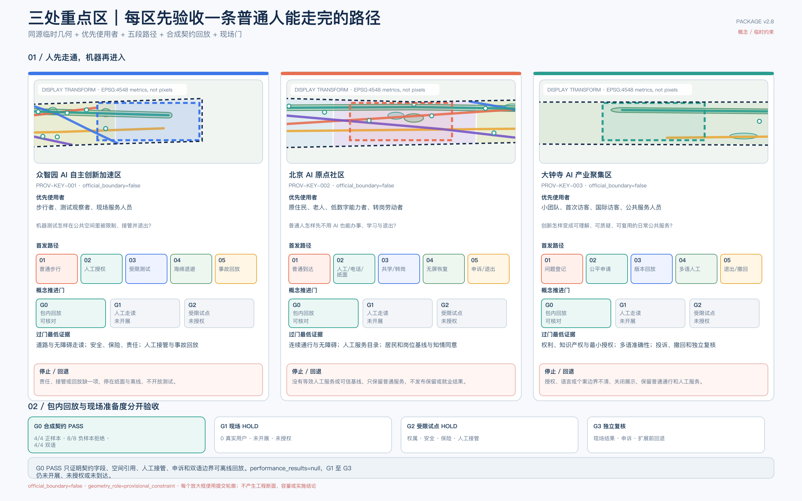

放大框可以帮助评审核对节点关系，却不能把临时几何变成测绘或工程详图。图面短轴为阅读而展开，像素不参与面积、比例或长度计算。[data:visual/assets/spatial-proof-v17.json]

数字仍由 `metrics.json` 与 EPSG:4548 下的 GeoJSON 重算，当前包内可复核的是场地面积和社区保留支撑分区面积代理。[metric:site_area_sqm] [metric:community_retention_support_area_ratio] [depth:metrics_recalculation]

每个 unknown 继续保留为下一道资料门，社区保留率、就业转型、人工服务等效性、PUE、绿电和余热均不因图面更完整而升级为结果。[depth:risk_missing_data]

## v1.8 七维评审回读｜让评分问题、证据与边界同页可见

本轮将仓库 formal workflow 的七个问题逐项接回最短的包内路径，并在 `formal-scorecard-readback-v18.json` 中登记问题、已知证据、剩余边界和下一步授权核验；它服务于复核顺序，不合成分数。[data:visual/assets/formal-scorecard-readback-v18.json] [data:visual/assets/reviewer-navigation-index.json]

图 21 把七行阅读路线与五条证据脊放在同一画面。20%、10%、15%、20%、10%、10%、15% 只代表仓库工作流模板的权重范围，不能读作主办方评分；临时几何、unknown、概念建议和未授权状态仍保持原级别。[data:assets/figures/reviewer-scorecard-map.png] [standard:PROJECT-AGENT-OPEN-CALL-TASKBOOK] [depth:risk_missing_data]

这张图的价值在于让评审者先提出问题，再回到正文、结构化台账、图纸和 manifest，最后看到需要由有权专业团队补齐的核验。它不产生本投稿得分、官方评审结论、获奖预测或实施证明，双语文本与审计台账同步更新。[data:visual/assets/bilingual-equivalence-audit.json] [depth:risk_missing_data]

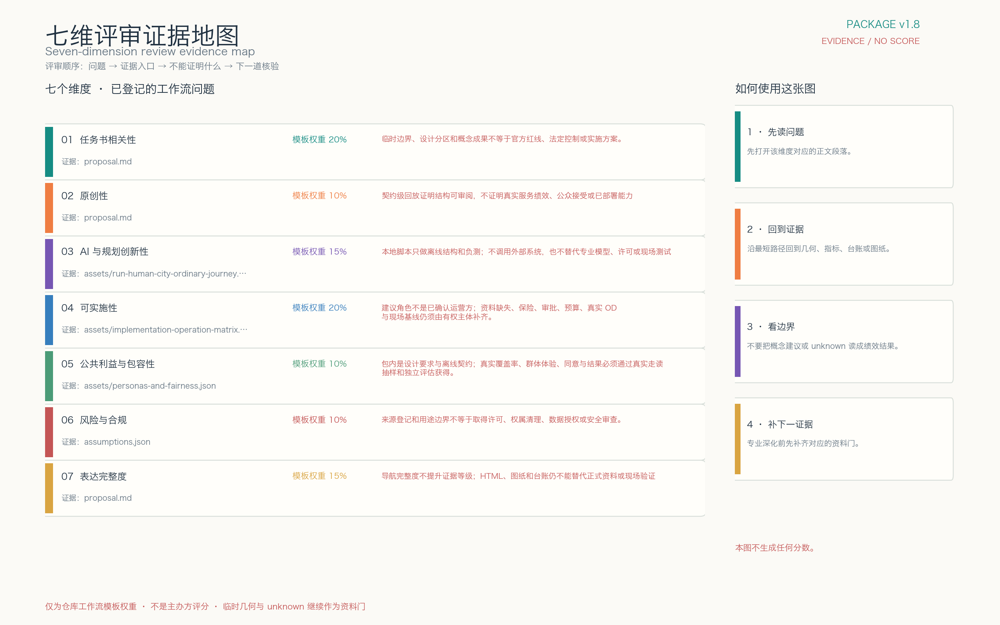

## v0.2 评分修复｜把三个重点区读成空间动作链

本轮不再增加抽象口号，而是把三个临时重点区各自拆成四步动作。每一步都回答空间载体、责任角色、进入前证据和停止条件，评审者可以从图面回到 GeoJSON、场景卡与指标，而不必把一张“AI 展台”当作城市设计结论。完整字段见 `visual/assets/spatial-action-atlas.json`，以下仍是概念建议，供专业团队深化研究。[data:visual/assets/spatial-action-atlas.json] [data:geometry/key_areas.geojson#PROV-KEY-001] 三处重点区的其余边界 ID 同列在台账中，均保持临时约束。

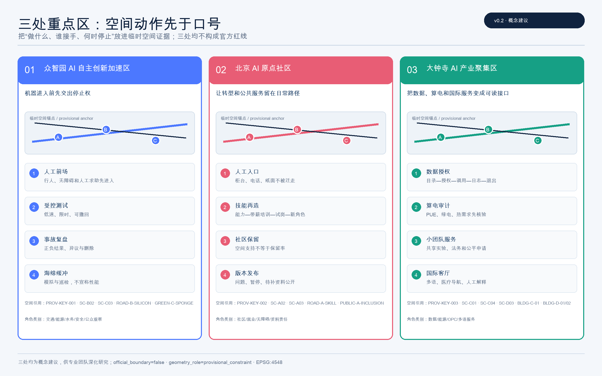

众智园先把人行优先边缘、受控具身测试、算电核验和事故复盘排成一条可关闭的测试链。它引用 `SC-B02`、`SC-C01` 与硅基通行权几何，仍不能推出真实空域、交通安全、PUE、绿电或余热结果。[data:geometry/constraints.geojson#SC-B02] [data:geometry/constraints.geojson#SC-C01] [metric:operational_pue] 其余能耗与长度指标在指标台账中保持 unknown 或概念状态。

北京 AI 原点社区把社区保留议事、人工与代际共学、技能再造接力和无屏恢复花园连成普通人的路径。空间支撑分区和技能走廊可以复算，但居民保留率、商户回迁、持续就业和人工服务等效可用率仍为 `unknown`，不能用面积、培训人次或网页可访问性替代。[data:geometry/constraints.geojson#SC-A01] [data:geometry/roads.geojson#ROAD-A-SKILL] [metric:resident_retention_rate] 其他社会结果指标仍在 `metrics.json` 中保持 unknown。

大钟寺把城市 API 公共接口、OPC 共享实验室、标准外溢工作室和国际服务客厅排成“问题—授权—回放—退出”的接口链。区域协同只交换可复核问题、证据与版本，不声称已有伙伴、企业、行政协议、算力券或国际机构。[data:geometry/constraints.geojson#SC-D01] [data:geometry/constraints.geojson#SC-D02] [metric:version_release_count] 国际服务场景的空间锚点仍以场景台账为准。

## 区域协同接口｜先交换问题，不替协作关系背书

本方案把任务书点名的京津冀制造应用、技术标准、知识传播、OPC 小团队和国际服务写成五条接口。接口只规定交换什么、由哪一处概念空间承接、缺什么资料后才可继续，不能被阅读为已签约伙伴或招商计划。`visual/assets/regional-interface-ledger.json` 登记了每条接口的来源边界、空间锚点、缺口和停止规则。[data:visual/assets/regional-interface-ledger.json] [source:AGENT-TASKBOOK] [depth:overall_spatial_structure]

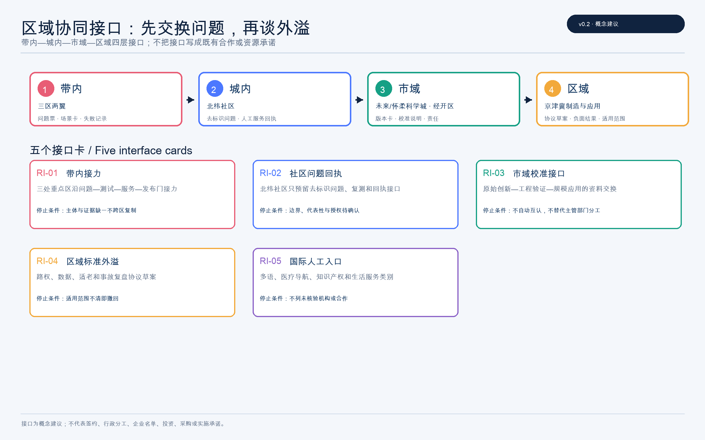

技术接口从海淀研发问题转向京津冀制造与应用讨论，标准接口只输出待专业复核的协议草案，知识接口通过问题清单、事件复盘和年度 release note 学习，生态接口给一人公司和小团队留下公平申请与冲突披露，国际接口只表达多语、医疗导航、知识产权和生活服务的待核验目录。任何接口遇到授权、责任、权属、版权或服务能力缺口都回到资料门，不升级为空间实施结论。[data:geometry/constraints.geojson#SC-D01] [data:geometry/constraints.geojson#SC-D02] [depth:risk_missing_data] 国际服务场景另由 SC-D03 台账登记。

## 标识与空间卡｜让“人本”成为可辨认的设计语言

本轮补一套作者原创的概念识别规则，使图签、场景卡、人工停止提示和版本 release note 有同一视觉语法。开放括号、轨道和人工确认点分别提示可调用、历史连续和人的最终决定权；色彩只服务于阅读，不冒充主办方、政府、企业或项目官方标识。字段与版权边界见 `visual/assets/brand-identity.json`。[data:visual/assets/brand-identity.json] [data:report/copyright_statement.md] [depth:risk_missing_data]

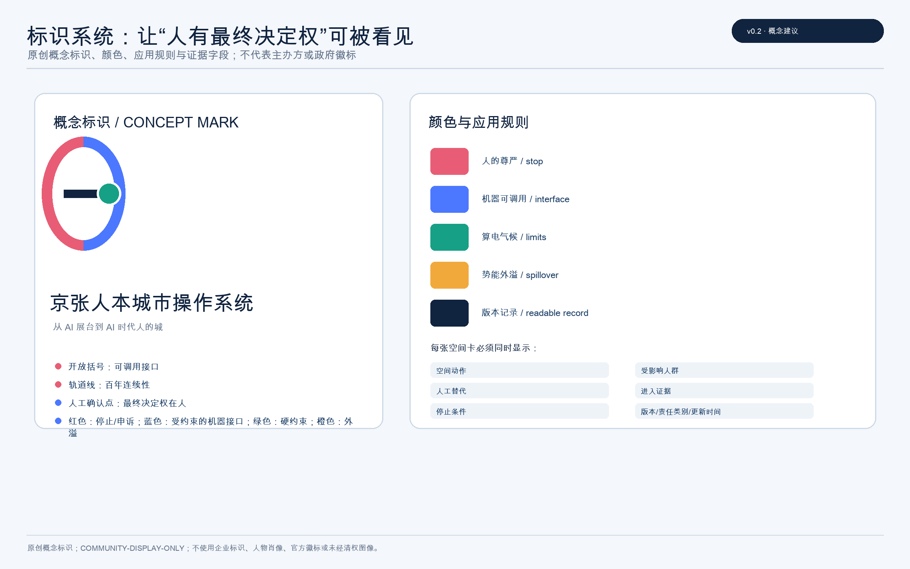

标识只落在本包图件和离线展示上，不导出企业名单、招商承诺或官方背书。橙色用于人工接管和停止，青绿色用于公共接口和蓝绿空间，黄色用于版本门和资料缺口，深蓝与纸色保持专业图纸的可读底。以后若取得官方品牌、文保或公共空间视觉规范，必须先做权利核验和专业适配，再重算图件与 PDF。[source:SITE-PACKAGE] [depth:risk_missing_data]

## v0.3 评分修复｜从动作图谱到节点级空间序列

空间动作图谱回答“每处重点区要完成什么”；本节再把它压到节点级的连续阅读：**到达与停留 → 公共状态/人工解释 → 功能带 → 人工接管或退出 → 证据回放**。`visual/assets/spatial-action-node-plans.json` 只使用现有 provisional 锚点，功能带用于表达空间关系和状态，不填工程尺寸；节点计划不是道路横断面、建筑平面、工程量或已运营服务。[data:visual/assets/spatial-action-node-plans.json] [depth:overall_spatial_structure]

| 节点 | 从哪里到哪里 | 功能带（无尺度，仅表达先后与状态） | 进入前证据 | 失效时的空间动作 |
| --- | --- | --- | --- | --- |
| AI 原点社区 | `PUBLIC-A-INCLUSION` → `BLDG-A-03` → `ROAD-A-SKILL` → `GREEN-A-QUIET-1` | 到达/停留前场 → 人工柜台电话纸面 → 技能再造与代际共学 → 无屏恢复绿地 | 连续进入走读、服务目录、知情基线与岗位路径 | 路径受阻或人工入口不可用时改道并停留人工服务；结果保持 `unknown` |
| 众智园 | `ROAD-B-SILICON` → `PUBLIC-B-API` → `PUBLIC-C-SANDBOX` → `GREEN-C-SPONGE` | 人行优先观察位 → 人工停止与事故复盘 → 受限测试/API 模拟 → 海绵缓冲与安全退避 | 道路/无障碍、安全、蓝线排水、授权、保险与接管演练 | 无人接管或不能回放时冻结测试，退回上一发布门 |
| 大钟寺 | `SC-D01` → `SC-D02` → `SC-D03` | 城市 API 公共接口厅 → OPC 共享实验室 → 标准回放工作室 → 多语人工解释客厅 | 服务目录、最小授权、冲突披露、权利边界与责任主体 | 越权、不可解释或无人工服务时冻结调用，只保留公开问题清单 |

这组节点计划补的是“空间载体如何承接普通人路径和停止动作”的可见中间层，不把功能带误写成实测断面。官方道路、权属、现状设施、文保、无障碍和运营资料到位前，所有尺寸、容量、通行能力和结果指标仍为待补资料或 `unknown`。[data:geometry/key_areas.geojson#PROV-KEY-001] [depth:risk_missing_data]

# 京张人本城市操作系统

> 从 AI 展台，到 AI 时代人的城。AI 不应成为城市的主角，而应成为居民、劳动者、创业者和公共机构可审计、可拒绝、可回滚的基础能力。

当前版本把三类新增工作放到同一套空间与服务证据中阅读：授权前启动程序、合成人本交接凭证，以及中关村科技服务翼与参数化空间取舍。它们分别回答谁能开始、谁能接管、哪些空间关系值得先比较。完整字段和离线复核仍保存在包内资产中；空间、指标、运营者、许可和公众结果保持原有的概念或 `unknown` 状态。[data:visual/assets/governance-startup-protocol.json] [data:visual/assets/human-city-receipt.json] [data:geometry/site_boundary.geojson#SITE-001]

## v0.7：让两套评审问题指向同一组证据

本轮先修复一个可读性而非“加分”缺口：仓库的 formal scorecard 有 7 项工作流问题及模板百分比，任务书则有 13 项统一评审维度且本地未登记权重；二者不能混写成一套“官方评分”。因此，`reviewer-navigation-index.json` 将它们分开登记：前者只标明仓库脚本来源与工作流百分比，后者逐项保留任务书问题、不推断权重或总分。两套路径都回到同一组双语正文、几何、场景、人物、发布门、资料和权利台账。[source:AGENT-TASKBOOK] [depth:risk_missing_data]

新增加的无网络 `run-reviewer-navigation-audit.js` 读取任务书、本地 formal scorecard 脚本和包内导航，核验 13/13 任务书维度、7/7 工作流问题、其 100% 模板权重与 42/42 包内文件路径；缺少任一维度或替换为不存在的路径的负样本必须 FAIL。它只证明阅读路径和本地词表没有漂移，不验证设计好坏、来源权威、许可、现场绩效、评审判断或任何得分。图 10 将这两套问题、五条证据脊和“资料不足则保持概念 / unknown”的共同边界压缩为一页阅读地图。[data:geometry/site_boundary.geojson#SITE-001] [metric:site_area_sqm] [depth:metrics_recalculation]

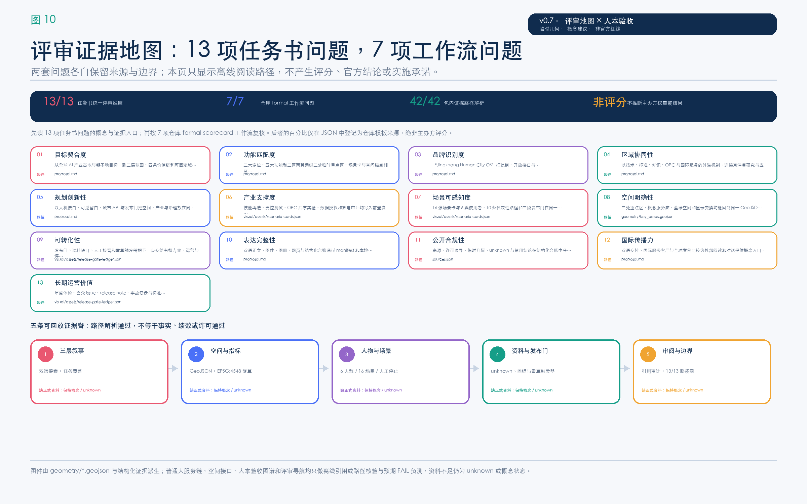

## v0.8：把“可以开始”写成授权前的验收登记

本轮回应评审中最关键的落地问题：场景卡已经写了人工接管和停止动作，却还不够让人判断一项研究何时可以开始。于是把 6 个 `test_validation=true` 场景逐项登记到 `visual/assets/pilot-readiness-register.json`，每条都回答基线、观察对象与时间窗、成功条件、停止条件、人工替代、最终责任、复核周期和删除证明。登记值全部保持“未采集、待授权主体确定或授权前冻结”，不把示范数字写成现场结果。[data:geometry/phasing.geojson#PHASE-V02] [depth:risk_missing_data]

| 进入前要回答的问题 | 当前状态 | 仍需谁补齐 |
| --- | --- | --- |
| 现状基线与观察对象 | 未采集，样本框和时间窗未冻结 | 有权主体与专业评估者，在取得同意后确定 |
| 成功与停止条件 | 数量阈值待授权前冻结，场景卡的安全、投诉、越权、无障碍和责任不清即暂停仍然有效 | 专业评估者与现场安全责任角色 |
| 人工替代与责任 | 人工、电话、纸面或现场路径已写入包内，实际班次、响应时限和运营主体待确认 | 运营方、资料责任方和独立复核者 |
| 复核、异议与删除 | 周期、公开摘要、异议答复和删除证明待启动前写入 release note | 授权主体与公众反馈程序 |

这张表只是一份授权前的工作合同。包内没有现场走访、居民访谈、问卷、运营日志或真实绩效，`site_visit_status`、`resident_validation_status`、`stakeholder_engagement_status` 和 `field_measurement_status` 均保持未开展或未采集。离线 runner 会对 6/6 测试类场景、8/8 必填字段和三个覆盖缺字段、误填数值与误填责任值的负样本做结构复核；通过只说明台账没有漏项，不能证明可以获批、可以部署或已经有效。[metric:manual_service_equivalence_rate] [depth:metrics_recalculation]

## v0.6：把“谁能进入、谁能停止”放到同一张空间图

本轮把原已分散在 6 类基础用户画像、3 类公共利益扩展、17 张场景卡、3 段发布门和临时空间锚点中的验收关系重组为图 09。六条基础人物路径分别从原住民/老人、被替代风险劳动者、夜班 AI 从业者、OPC/小商户、公共服务人员与行动不便/低数字能力使用者出发；三类扩展群体另以 `public-interest-coverage-v26.json` 登记受益、影响、人工替代和停止条件。图中选择其中 10 条直接关联场景作为可读路径，同时保留 17 张场景卡、16 个几何空间节点和全部 3 个发布门，让“代表性人物”始终与完整场景清单并列阅读。[data:geometry/constraints.geojson#SC-A01] [metric:scenario_node_count] [depth:municipal_new_infrastructure]

`visual/assets/human-city-acceptance-atlas.json` 只登记已有 persona、场景与发布门 ID；离线 runner 再核验 6/6 人物路径、17/17 场景卡、10/10 代表性链接、30/30 代表性空间引用、47/47 场景空间引用和 3/3 发布门均能解析，并使“虚构人物锚点”负样本失败。这个 PASS 只说明本包的引用与停止条件没有被图面遮蔽，不证明真实人群覆盖、人工服务、空间可达、现场安全、许可或社会绩效。[data:geometry/constraints.geojson#SC-C04] [data:geometry/phasing.geojson#PHASE-V10] [depth:risk_missing_data]

图 09 的 6 张人物卡逐项保留“人本底线—人工替代—停止/回退”三件事：例如，社区保留不能用空间代理冒充真实保留率，技能路径不能把培训人次替代就业结果，数字入口不能排挤同等人工替代，公共服务 AI 不能自主决定个人权利。点位仍只是提交包的临时几何概念锚点；它们不是现实服务点、道路或工程定位。[data:geometry/public_space.geojson#PUBLIC-A-INCLUSION] [data:geometry/roads.geojson#ROAD-A-SKILL] [metric:manual_service_equivalence_rate]

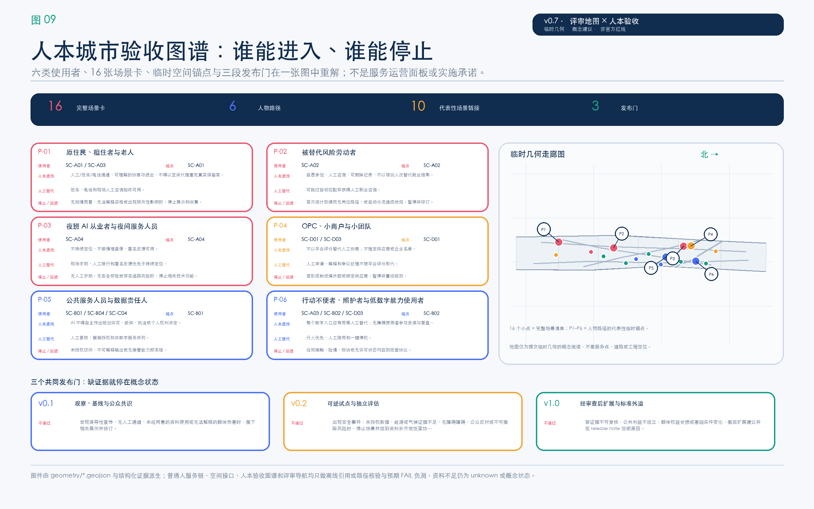

## v0.5：把人工停止动作放进空间接口

本轮新增两种**非尺度化空间接口原型**，并不把概念走廊画成真实道路横断面：AI 原点社区把无障碍步行、人工/电话/纸面入口、技能再造与无屏绿地并置，让老住户、老人和被替代风险劳动者能看见“进入—请求—人工接管—退出—复核”的服务链；众智园则把人行优先缓冲、人工停止与事故复盘、受限人机测试和海绵退避并置，强调机器测试不能跳过人的停止权。两套原型分别绑定现有空间锚点、场景卡与概念发布门，所有范围仍是供专业团队深化研究的概念建议。[data:geometry/public_space.geojson#PUBLIC-A-INCLUSION] [data:geometry/roads.geojson#ROAD-B-SILICON] [depth:traffic_rail_slow_parking]

原型的 `visual/assets/human-machine-interface-prototypes.json` 同时登记每一层的人工优先原则、失效即闭环动作、普通人服务链步骤、触发器和资料就绪门。无网络的 `check-human-machine-interface-prototypes.js` 离线重解 2 个原型的全部空间锚点、服务链、资料门和双语停止措辞，并以不存在的锚点作负样本；17 项结构检查通过只说明引用能回溯，绝不证明现实断面、人员值守、可访问性、运行安全、许可、投资或实施绩效。[data:geometry/phasing.geojson#PHASE-V02] [metric:version_release_count] [depth:risk_missing_data]

图 08 以“公共进入—人工停止—受限测试/回放—资料门”为共同阅读语法，把制度要求落回空间界面；没有清权 GIS/CAD、现状、道路、市政、权属和专业审查资料时，图中不含尺寸、容量、线位或工程结论。

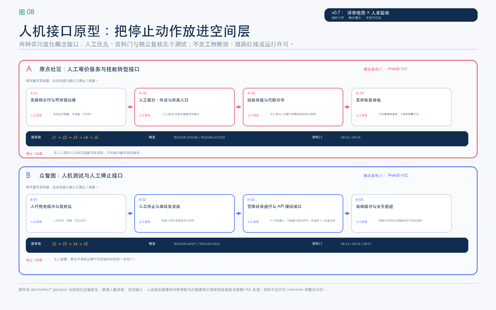

## v0.4：普通人服务链与资料就绪度

### 先验收一条普通人可完成的服务链

从评审和普通人视角看，Human City OS 的最小验收对象是一条能被人看懂、拒绝并完成的服务链；城市 API 只是其中一项可调用能力：**进入公共空间或服务点 → 在人工、电话、纸面与 AI 辅助之间选择 → 请求一项日常服务 → 在断网、无障碍受阻、安全事件或资料授权不清时由人接管 → 冻结、改道、申诉或退出 → 由独立复核者回放证据后决定修复、继续或撤回**。这条链仍是概念验收契约，现实运营、许可与绩效需由有权主体另行验证。

| 步骤 | 普通人可见的空间/服务 | 必须回放的证据 | 失效即闭环的动作 |
| --- | --- | --- | --- |
| 1. 进入与选择 | 社区服务厅、站口/公共空间、人工柜台、电话、纸面与 AI 辅助入口并列 | 入口方式、服务对象类别、地点/版本和可访问性说明 | 没有人工等价入口，或资料边界不清，停在观察与补资料 |
| 2. 请求 | 翻译、排队、无障碍导航、技能服务或公共数据咨询的明确请求 | 请求目的、最小数据、责任角色、时间窗和替代路径 | 超出最小权限、未获同意或责任角色缺失时只登记不调用 |
| 3. 人工接管 | 断网、无障碍障碍、安全事件或 AI 建议无法解释时，现场人员接手 | 触发事件、接管人、交接时间、状态变化和投诉入口 | 冻结自动化动作，回到人工/电话/纸面；无人可接管时停止 |
| 4. 退出与申诉 | 人可以取消、改道、删除资料、提出异议并获得非 AI 解释 | 退出原因、删除/恢复动作、替代服务和未解决项 | 权益受损、证据不足或不可恢复时撤下场景并回到前一发布门 |
| 5. 独立复核 | 复核者回放一条服务链，判断继续、修复或撤回 | 最小日志、分组结果、异议处理、版本和复核意见 | 不能复核或最慢群体变差时不扩展，不把展示 PASS 写成成效 |

契约写入 `visual/assets/human-city-ordinary-journey.json`，并把两条最小回放路线绑定到既有场景卡、persona、空间锚点和发布门：无障碍/低数字能力入口回放 `SC-A03 + P-06 + PHASE-V01`，数据责任回放 `SC-B01 + P-05 + PHASE-V02`。无网络的 `run-human-city-ordinary-journey.js` 会解析这些引用，再对缺少人工闭环和不存在空间锚点的两个负样本预期得到 `FAIL`；同时，5 个步骤逐项绑定 trigger ID 与 evidence 字段，runner 要求 5/5 step、4/4 trigger 和全部登记 evidence field 可回接，并校验 ID 唯一，证明“引用能解析”和“缺口会被拒绝”都可复核。这仍是契约级负测，不是现场行为或绩效测试。它不接触个人数据或外部系统，`performance_results=null`、`operational_status=not_authorized_not_run`；本地 PASS 只证明契约及其负测可重放，不证明真实可访问性、人员值守、公众接受或安全绩效。[data:geometry/phasing.geojson#PHASE-V02] [metric:version_release_count]

### 评审导航：先区分问题来源，再回放最短证据

下面的 7 行仅对应仓库 formal scorecard 的工作流问题；其模板百分比不属于主办方官方评分，也不构成本投稿得分。任务书的 13 项统一评审维度、各自的中英文边界与最短证据路径另登记在 `visual/assets/reviewer-navigation-index.json`，并由 `run-reviewer-navigation-audit.js` 做离线覆盖与路径复核。正文中的 `[metric:]`、`[source:]`、`[data:]`、`[depth:]` 和 `[standard:]` 标记仍由无网络的 `visual/assets/run-human-city-reference-audit.js` 解析；未登记 ID 或不存在的空间要素会被报告为 FAIL。

| 仓库 formal 工作流问题（非主办方评分） | 最短入口 | 评审者先看什么 | 本包仍不能证明什么 |
| --- | --- | --- | --- |
| 任务书契合度 | `compliance_matrix.json` + `design_depth_matrix.json` | 三层范围、任务覆盖、成果深度 | 临时边界不是法定红线或控规成果 |
| 原创性 | `human-city-ordinary-journey.json` + `release-gate-ledger.json` | 人工接管、拒绝、退出、回滚是否进入空间—服务链 | 离线契约不是现实绩效或已部署能力 |
| AI 规划创新 | `run-human-city-ordinary-journey.js` + `scenario-cards.json` | AI 参与的推演是否可复算、可审阅、有人接管 | 脚本不替代专业模型、许可或现场测试 |
| 实施可行性 | `implementation-operation-matrix.json` + `data-readiness-register.json` | 责任、前置资料、发布门和停止条件 | 建议角色不是已确认运营方；预算、审批、真实基线待补 |
| 公共利益与包容 | `personas-and-fairness.json` + `accessibility-audit.json` | 等效入口、拒绝权、人工替代和申诉路径 | 真实群体体验、覆盖率、同意与结果待走读/抽样 |
| 风险与合规 | `assumptions.json` + `rights-clearance-ledger.json` | 来源、资料授权、版权、临时边界和暂停条件 | 登记边界不等于许可、权属清理或安全审查 |
| 表达完整性 | 双语正文 + `visual/index.html` + `manifest.json` | 文本、图纸、可视化与台账能否回到同一证据 | 导航完整度不提升证据等级 |

### 把资料缺口做成可关闭的发布门

本次 v0.4 同时是资料治理与社会结果边界的实质性升级，不是对日期、名称、slug 或公共排序的操作。新增的 `visual/assets/data-readiness-register.json` 以七条资料路径把 12 项 assumption 连接到具体场景、受影响空间层、指标、发布门、最低证据、建议审阅角色、资料缺失时的回退动作和重算触发器。它不指定真实运营方、审批时点或实施承诺；其作用是让“待补资料”可被追踪、可被拒绝，也可在资料仍不足时明确停留在概念状态。[data:geometry/phasing.geojson#PHASE-V02] [depth:risk_missing_data]

本轮还把“持续就业转型率”和“人工通道等效可用率”正式登记为 `unknown` 指标：前者需要经同意的基线、带薪路径定义与预先声明的随访，后者需要服务目录、同等效力替代规则与真实走读。技能走廊长度、培训人次、网页可访问性或全球 AI 暴露率都不能替代这两项结果。临时边界坐标、设计分区、既有面积、比例、线长和既有指标值在本轮均未改动。[metric:sustained_employment_transition_rate] [metric:manual_service_equivalence_rate] [metric:skill_transition_corridor_length_m]

图 07 将每一条资料路径压缩为“最低资料—进入门—资料缺失时”的审阅卡；完整 JSON 再保留其假设、场景、空间、指标与回退关系。拿到任一正式或清权空间输入后，必须先重算 geometry、metrics、图件、HTML、PDF 和 self-check，不能只更新一段文本或局部示意。[metric:site_area_sqm] [depth:metrics_recalculation]

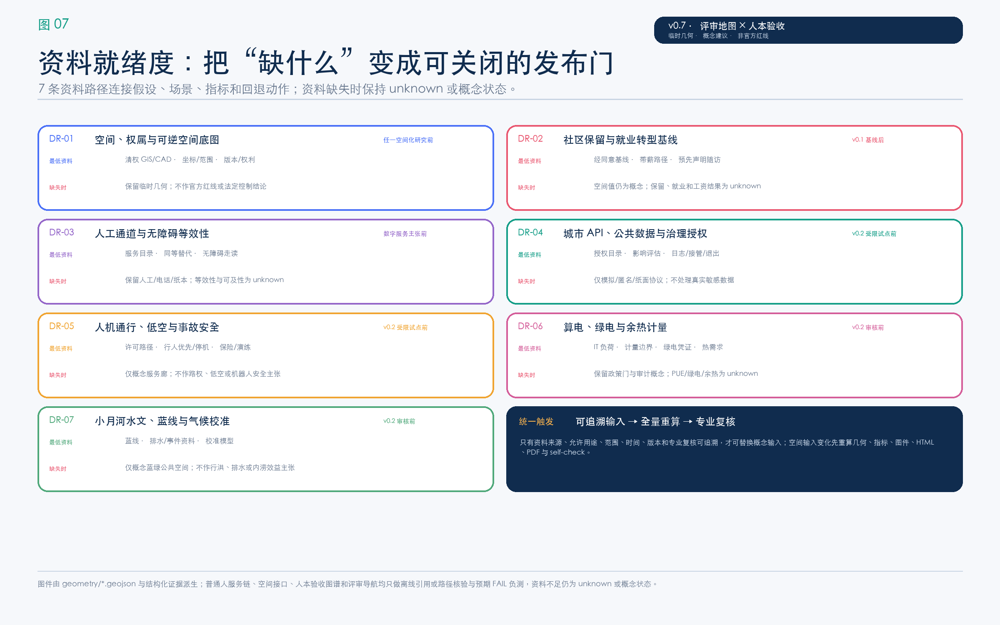

## v0.3：让空间证据真正可读

本次 v0.3 是一轮实质性的空间证据表达升级，不是对日期、名称或公共排序的操作。它在不改变任何临时边界坐标、设计分区、面积、比例、线长、场景数量或 `unknown` 状态的前提下，重绘六张中英对照图和双语 A3/A0 图册：图纸以同一组 GeoJSON 在 EPSG:4548 下的内部复算为依据，加入图号、比例尺、可对应的图例、临时边界说明，并仅为走廊阅读作 90° 顺时针显示旋转，故原始北向在图中明确标为“北 →”。这只是展示变换，绝不把临时几何升级为官方红线或测绘成果。[data:geometry/site_boundary.geojson#SITE-001] [metric:site_area_sqm] [depth:metrics_recalculation]

所有图层仍直接派生自 `geometry/` 与 `metrics.json`；图 02 的六个用地多边形继续无缝、无重叠覆盖提交边界，图 03 的三处重点区与图 04 的服务廊也仍仅是概念建议。制图方法、输入文件、显示旋转和精度限制均登记在 `visual/assets/spatial-figure-method.json`，供专业团队在取得官方 polygon、控规、权属、道路、市政、蓝线、文保、现状与运营资料后整包重算，而不是由叙述或视觉完整度替代资料。[data:geometry/land_use.geojson#LU-H01] [metric:design_partition_area_sqm] [depth:land_use_layout]

## v0.2：把城市版本做成可否决的发布门

本次 v0.2 是一轮实质性证据升级，而不是对空间数值或公共排序的包装：在不改变临时边界坐标、设计面积和既有 `known` 指标的前提下，新增 16 张“空间—责任—人工兜底—资料边界—停止条件”场景卡、三段城市发布门台账，以及可访问性与用户公平审计。它把原先的“可回滚”主张落到谁可以启动研究、需要什么证据、何时必须暂停的可审阅问题上；仍只是概念建议，供专业团队深化研究。[data:geometry/phasing.geojson#PHASE-V02] [metric:version_release_count]

| 发布门 | 进入前必须先补齐 | 可核验证据 | 暂停或回滚条件 |
| --- | --- | --- | --- |
| v0.1 观察、基线与公众共识 | 资料边界、人工服务底线、异议入口 | 可理解性走读、问题与缺口台账 | 未经同意使用资料、无人工通道或排斥风险 |
| v0.2 可逆试点与独立评估 | 地点/时间/数据/责任四限定、人工接管、专业授权 | 事件复盘、授权/计量/校准资料、独立评价 | 安全事件、未授权数据、无障碍障碍或证据不足 |
| v1.0 经审查后扩展与标准外溢 | 前一版本证据、异议处理、公共利益审查 | 年度体检、release note、可复核协议草案 | 证据不可复核、权益受损或基础条件变化 |

发布门台账与每张场景卡均明确不构成许可、工程方案、投资承诺或实施结论；官方边界、权属、控规、道路、市政、蓝线和现状资料一旦补齐，须先全量重算再讨论下一版本。

## 核心概念与四项运行机制

核心概念是“人本城市操作系统”（Human City OS）：把城市空间、公共服务与 AI 代理组织成一套可观察、可拒绝、可回滚的发布系统。AI 在这里承担城市能力的调用与协作，人的判断保留最终权力。系统拆成四项可审计机制：人类优先机制保证人工服务、无障碍和拒绝权；证据发布机制把地点、时间、数据、责任和版本门绑定；空间—服务接口机制把城市 API、慢行网络、公共空间和场景卡连成可复核的服务链；退出与修复机制要求停机、撤除、数据删除、异议处理和独立复盘同时存在。[depth:phasing_implementation] [metric:version_release_count]

四项机制共同把“从 AI 展台到人的城”从价值宣言变成空间—治理—运营协议：每个试点必须回答谁能启动、谁负最终责任、公众如何拒绝、什么证据才能扩展，以及失败后如何恢复。任何未知指标继续保留 `unknown`，不由模型或案例类比补齐；任何设计分区仍是概念建议，不提升为法定用地、官方边界或实施承诺。

## 设计依据与资料清单

本方案首先服从征集公告确定的三层范围、三处重点区域与设计任务，并以面向智能体任务书的六项任务作为成果覆盖清单。[source:OFFICIAL-ANNOUNCEMENT] [source:AGENT-TASKBOOK]

仓库 `source_registry` 中五项正式可用资料只支撑其允许用途；临时边界只用于生成、展示与 intake 自检，不能被提升为官方红线、精确面积或法定控制。[source:SOURCE-REGISTRY] [data:geometry/site_boundary.geojson#SITE-001]

### 1. 证据等级与人本决策边界

本包把“资料登记”“设计推演”和“可以开始”分开读。登记完成不等于事实成立；任何空间动作都要同时看到它能支持什么、还不能支持什么。

| 证据层级 | 本包实例 | 可以支持 | 不能支持 |
| --- | --- | --- | --- |
| 任务与专业标准（formal） | 官方公告、清权任务书、规划与控规标准 | 任务覆盖、成果深度、专业审阅原则 | official polygon、权属、工程条件、许可或政府承诺 |
| 正式可用来源登记 | `sources.json`、`data/source_registry.json`、政策与案例记录 | 来源用途、机制对照、责任回链和禁用范围 | 把案例绩效、背景统计或登记记录升级为海淀实施事实 |
| 临时空间依据（provisional） | `site_boundary`、`key_areas`、六层概念功能带 | 概念落位、相对关系、拓扑自检和整体替换触发器 | 法定用地、道路红线、精确面积、建筑控制或权属 |
| 包内派生推演 | GeoJSON、`metrics.json`、128 组候选、发布门和项目族 | 可回放的取舍、节点动作、版本依赖和审计接口 | 现状测绘、居民需求、设施容量、AI 能力或正式推荐 |
| 行政/开放背景 | 统计、政策、公开案例与开放地图 | 校准问题、补采优先级和不确定性说明 | 走廊需求、现场绩效、选址、合作事实或投资承诺 |
| 合成场景与治理方法 | 普通人旅程、负例 runner、发布门和纸面方法 | 人工优先、停止、退出、申诉和后续验证设计 | 现场无障碍、公众同意、专业签章、实施许可或竞赛分数 |

审阅规则是：`provisional`、`unknown`、`design_target` 和 `not_authorized_not_run` 保持原状态；本地 checker 的 PASS 只证明包内合同可回放，不升级为现场证据、专业批准或政府实施结论。

当前公开资料缺少官方 polygon、控规指标、道路红线、权属、现状建筑、文保控制线、市政与公共服务底数。因此，方案把土地功能、建筑、道路、低空层、海绵设施和项目分期都写成“概念建议/待专业团队深化”，并把全部限制登记到 `assumptions.json`。由临时边界复算出的 11,412,825.386 平方米只用于内部一致性核验，不作为官方面积结论。[metric:site_area_sqm] [depth:existing_conditions_diagnosis]

本方案新增的就业、人才与能源事实均使用可核验一手来源。IMF 的结论是全球近 40% 就业受到 AI 暴露、发达经济体约 60%，这里的“暴露”同时包括替代与增强，不能写成失业预测；WEF 2025 雇主调查中 41% 受访雇主预计因 AI 能力扩展而缩减人员，也不是海淀本地预测。[source:IMF-AI-JOBS-2024] [source:WEF-FUTURE-JOBS-2025] 当前可核验的海淀公开口径是“约 9 万名 AI 人才”，不是 9.5 万；本方案仅把它作为身心健康与夜间服务的量级提醒，不据此推算场地人口或设施容量。[source:HD-AI-TALENT-2026]

算电口径也按现行官方文本校正：北京 2024 算力基础设施方案对新建和改扩建智算中心的表述是 PUE 一般不超过 1.25，大规模先进智算中心一般不超过 1.15；2026 年起，对超过适用 1.35 限值的数据中心执行差别电价。30% 是北京存量数据中心相应 PUE 区间的绿电使用目标，可作为本方案的设计基线，但不能冒充“新建中心法定最低比例”。[source:BJ-COMPUTE-2024] [source:BJ-DATACENTER-2024]

**图 01 重点区图例：** 1 = 众智园；2 = 北京 AI 原点社区；3 = 大钟寺 AI 产业聚集区。三处均为临时重点区，仅用于概念验证与专业深化，不是官方红线。

## 三层范围工作框架

43.6 平方公里统筹研究范围回答“海淀的创新势能如何外溢”；约 11.4 平方公里总体设计范围回答“人本服务、城市 API 与硬约束如何共同落入空间”；约 368.4 公顷重点区域回答“在众智园、AI 原点社区和大钟寺分别先试什么”。三层沿同一条证据链推进，顺序从战略、空间落位到场景验证。[standard:PROJECT-OFFICIAL-ANNOUNCEMENT] [depth:three_level_scope_framework]

| 层级 | 主问题 | 本方案交付 | 不越界条件 |
| --- | --- | --- | --- |
| 统筹研究范围 | 如何形成技术、标准与知识外溢 | 六个全球案例、京津冀协同、OPC 与国际服务机制 | 不编造企业、投资额和产值 |
| 总体设计范围 | 如何从 AI 展台转为人的城市 | A/B/C/D 四条价值链、六层空间操作系统、人机双通行网络 | 不把功能带当作法定用地或道路红线 |
| 三处重点区域 | 如何以可逆试点验证 | 16 个场景节点、6 个测试验证场景、3 个版本阶段 | 未获授权不得运营，不得越过文保、交通和数据规则 |

A 组“人的尊严”包括社区保留、就业转型、数字包容和身心健康；B 组“机器可用”包括城市 API、硅基通行权、数字孪生和可逆留白；C 组把算电、气候、监管沙盒、公共数据授权与城市版本治理设为硬门槛；D 组把技术、标准、知识、OPC 与国际服务组织成势能外溢。四组分别进入场景节点、道路/绿地/用地/公共空间和可复算指标，不靠口号完成任务。[data:geometry/constraints.geojson#SC-A01] [metric:scenario_node_count]

空间关系采用“一条历史公共脊、两套通行网络、三处验证场、四条价值链、六层功能带”。京张铁路遗址公园只作为历史与公共空间叙事骨架；临时边界在图中保持低对比虚线。任何官方边界更新都触发所有设计层、图件、HTML 和指标的全量重算，而不是局部替换。[data:geometry/phasing.geojson#PHASE-V01] [depth:overall_spatial_structure]

## 统筹研究范围产业与未来城市研究

方案不把“聚集大企业”当作唯一生态答案，而把创新生态拆成六种能力：源头研究、可负担试验、可信数据、人才转型、社会接受和国际服务。大团队可以承担基础模型与平台，小团队和一人公司通过共享实验室、模型/算力服务、法务与数据授权支持进入场景；被 AI 改变岗位的劳动者通过技能再造走廊进入机器人运维、数据质量、场景运营、无障碍服务和事故复盘等新角色。[source:HD-OPC-2026] [depth:overall_spatial_structure]

六个全球案例只提炼机制，不照搬空间形态。新加坡榜鹅数字园区说明城市 API 与数字孪生可以成为可调用的区级基础设施；赫尔辛基 Kalasatama 说明真实社区、居民参与和敏捷小试比一次性“智慧城市交付”更可持续；巴塞罗那 22@ 的更新经验提醒创新区必须同步处理住房和社区关系；首尔 AI Hub 展示教育、孵化、研究与公共组织的组合；釜山 Eco Delta 把 living lab、监管沙盒、开放数据和机器人城市并列；多伦多 Quayside 的数据治理讨论则提示独立治理、责任数据使用和公共利益必须先于传感器铺设。[source:CASE-PUNGGOL] [source:CASE-KALASATAMA] [source:CASE-QUAYSIDE]

| 案例 | 可转译机制 | 京张转译 | 必须补上的护栏 |
| --- | --- | --- | --- |
| Punggol Digital District | 开放平台、API、数字孪生 | 城市 API 交换站 | 数据目录、权限、日志、退出机制 |
| Smart Kalasatama | 居民参与、敏捷试点 | v0.1-v0.2 可逆试点 | 公共问题先行，不以技术找场景 |
| Barcelona 22@ | 创新区与居住/社区并置 | 社区保留账本与小商户回迁 | 基线、资格、租约和反搬迁审计 |
| Seoul AI Hub | 教育、孵化、R&D 支撑 | 技能再造走廊与共享实验室 | 就业结果跟踪而非培训人次宣传 |
| Busan Eco Delta | living lab、沙盒、开放数据 | 小月河翼具身测试与气候模拟 | 保险、事故处置、人工接管 |
| Toronto Quayside | 独立数据治理 | 公共数据授权样板间 | 公益优先、隐私保护、第三方评估 |

外溢机制从技术、标准、知识和国际服务四条路径展开。技术外溢通过京津冀制造和应用伙伴把海淀研发形成测试接口；标准外溢把路权、数据授权、无障碍和事故复盘模板沉淀为可复用规范；知识外溢以 15 分钟碰撞圈、公开问题清单、年度 release note 和跨校社群形成可追溯知识资产。国际化服务集中于语言、医疗导航、知识产权、合规和生活支持，不列出未经核验的国际学校、医院或机构名单。[source:AGENT-TASKBOOK] [depth:existing_conditions_diagnosis]

中关村科技服务翼承担要素全球化配置、中关村 IP 与资本信息服务的概念接口：`SC-D04` 先提供公开服务目录、人工咨询、授权核验和跨区域应用问题台账，再把可复核的协议草案送入京津冀制造与应用讨论。资本信息服务在本包中只表示信息与合规接口，未写成融资、投资或招商承诺；小月河场景服务翼则承接具身测试与气候韧性场景，两翼通过标准、数据、知识和人才转型形成协同回路。[source:AGENT-TASKBOOK] [data:geometry/constraints.geojson#ZONE-C-DATA] [depth:overall_spatial_structure]

## 总体设计范围城市更新与控规深度城市设计

总体设计在临时设计边界内建立六层功能操作系统，并保留现有城市结构的多样日常：社区保留与服务、国际/OPC 服务、技能再造与公共数据学习、可逆留白、城市 API 与具身研发、无屏绿地与气候韧性。六个多边形完整覆盖提交边界且无重叠，面积和比例由同一 GeoJSON 在 EPSG:4548 下重算。[data:geometry/land_use.geojson#LU-H01] [metric:design_partition_area_sqm] [depth:land_use_layout]

社区保留支撑分区占临时边界约 18.3%，可逆留白分区占约 15.1%。这两个值是设计分区的空间代理，不是居民保留率或法定留白率；真实社区保留率必须以清权家庭基线、资格规则和后续登记计算，因此目前保持 unknown。[metric:community_retention_support_area_ratio] [metric:reversible_space_ratio] [metric:resident_retention_rate]

城市 API 层采用“目录-授权-调用-日志-审计-退出”六步协议。市政设施 Agent 只能调用最小化、分级授权的接口；涉及供水、供电、供热、交通和公共数据的调用必须保留人工接管和事故追溯。北京现行公共数据授权运营办法要求依法合规、公益优先、安全可控并设置评价与退出，本方案据此把数据要素城区从展示厅变成可审计的制度样板。[source:BJ-PUBLIC-DATA-2026] [data:geometry/constraints.geojson#ZONE-B-API]

可逆设计用模块化构件、可拆服务舱、短周期租约和 meanwhile use 化解“AI 三个月迭代、城市十年建设周期”的错配。每个试点在立项时同时提交撤除、复原与数据删除计划；v0.2 试点没有独立评估与公众复核，不得进入 v1.0 扩展。建筑高度、开发强度、拆改留和工程容量因缺官方条件全部留待专业深化。[standard:MOHURD-CONTROL-DETAILED-PLANNING] [depth:development_intensity_controls]

### 参数化推演：把空间取舍放到可复算候选集

`visual/assets/parametric-tradeoff-study.json` 以当前六层概念功能带的 geometry 面积为基线，设置人本优先、平衡、机器协同三组透明参数。每组都按“share × 临时边界面积”计算讨论面积；离线 runner 同时检查 share 求和、面积回算和 `LU-H01`、`LU-B01` 基线回接，证据写入 `parametric-tradeoff-study-evidence.json`。[data:geometry/land_use.geojson#LU-H01] [metric:community_retention_support_area_ratio]

这组研究把社区保留、技能学习、可逆留白、城市 API 和无屏韧性空间放在同一张比较图上，供专业团队在正式资料补齐后替换输入。[metric:reversible_space_ratio] [depth:metrics_recalculation]

三组参数保持低置信度和概念状态。它们不改写本包正式面积、比例、图纸或 `scenario_node_count=16` 的几何事实，17 张场景卡中的 `SC-D04` 也继续以既有空间锚点表达；任何进入下一轮的取舍都要重新核对官方边界、权属、控规、建筑、交通、市政、能源、气候和公众基线。[data:geometry/site_boundary.geojson#SITE-001] [metric:scenario_node_count] [depth:risk_missing_data]

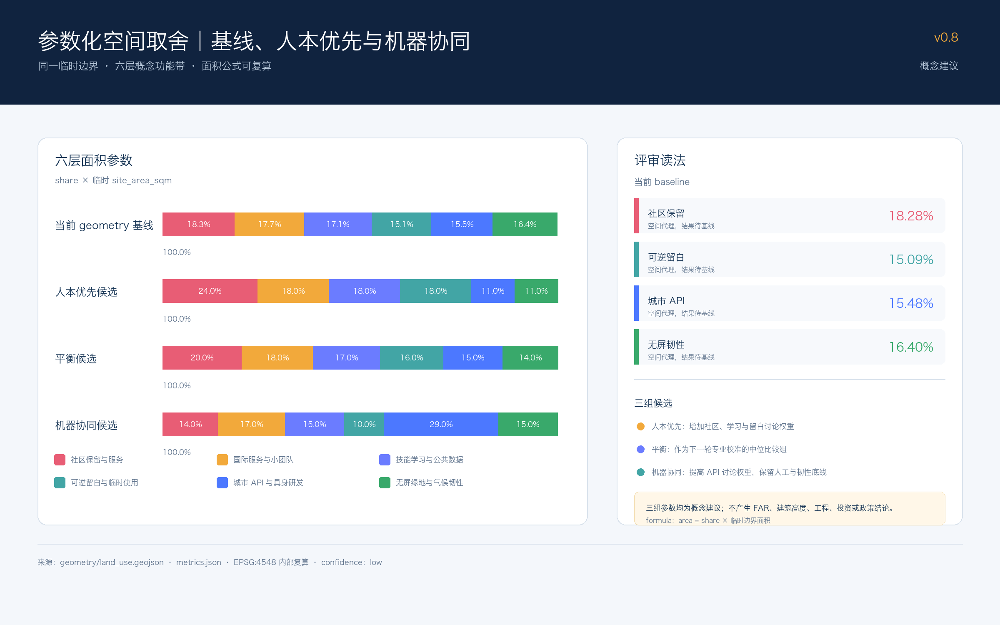

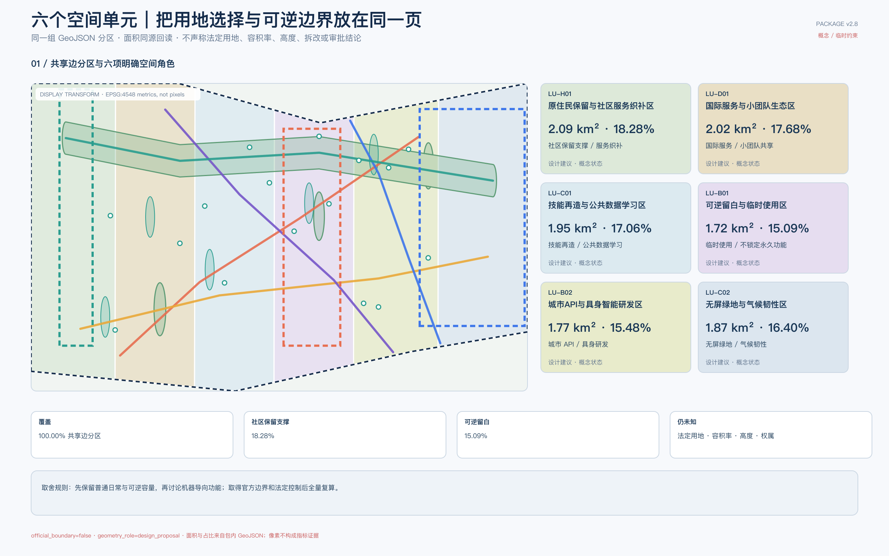

## 重点区域详细设计

众智园、AI 原点社区和大钟寺使用仓库提供的临时粗略范围，仅用于定位设计议题，不解释矩形边界。三处区域共同遵循“公共问题-受控测试-独立评价-可回滚扩展”的流程，但承担不同首要任务。[data:geometry/key_areas.geojson#PROV-KEY-001] [metric:key_area_count] [depth:three_key_area_detailed_design]

| 重点区域 | 首要命题 | 首批空间动作 | 评价门槛 |
| --- | --- | --- | --- |
| 众智园 | 给机器用的城市能否安全进入公共环境 | 硅基通行权测试、具身智能公共测试仓、算电余热审计、标准外溢工作室 | 责任主体、保险、人工接管、能耗计量、事故公开复盘 |
| AI 原点社区 | 创新密度能否同时保护人的转型与日常生活 | 技能再造接力站、城市 API 交换站、代际共学、城市版本发布室 | 就业转化、人工服务保留、隐私最小化、居民表决 |
| 大钟寺 | 数据与国际服务能否形成可信城市接口 | 公共数据授权样板间、国际服务客厅、OPC 共享服务 | 数据授权、退出机制、无障碍、语言与合规服务审计 |

三处重点区继续使用临时粗略范围，但每处增加一组可比较的公共界面与可逆服务关系。比较只回答普通路径、人工服务、设备后场与上部功能如何错开，不定义开发强度、体量、拆改清单或工程容量；这些资料在 G1 前保持 `unknown`。[data:geometry/key_areas.geojson#PROV-KEY-001] [data:visual/assets/parametric-tradeoff-study.json] [depth:risk_missing_data]

| 重点区 | 概念空间取舍 | 公共界面与可逆关系 | 先补的专业证据 |
| --- | --- | --- | --- |
| 众智园 | 把具身测试、算电余热审计和标准外溢工作室放在人工优先的公共界面后方，保留可撤回测试边界和事故复盘庭 | 人工前台与公众观察席相邻；设备、维护和测试后场可关闭；不切断慢行主链 | 现状建筑、能源负荷、消防、保险、行人走测和责任主体 |
| AI 原点社区 | 把技能再造接力站、代际共学和城市 API 交换站连成日常步行路径，普通居民入口与 AI 入口并列 | 人工柜台、纸面入口和代际共学朝向普通路径；测试组件可拆、可暂停 | 居民与服务基线、无障碍走测、就业转化口径、权属与租约 |
| 大钟寺 | 把公共数据授权、国际服务和 OPC 共享服务压到低尺度城市客厅，夜间服务与文化解释共用人工前台 | 轨道到达、安静链和服务前台分流；活动与数据展示可撤回，不占用居民日常通行 | 文化遗产、交通与夜间服务、语言可达性、数据授权与退出条件 |

这些范围只回答先比较的空间关系，不能回答哪里可以建设、谁拥有空间或最终建多少。临时 `PROV-KEY-001` 至 `PROV-KEY-003` 仍不是红线；专业团队取得正式边界和清权资料后，才可重算图纸、指标和发布门。

众智园的具身测试不预设自动驾驶或机器人“天然有路权”。测试路径采用与行人速度、时段、任务和风险等级绑定的临时许可；低空物流只是一条高度分层概念廊，必须在空域、噪声、坠落风险、隐私、消防与保险审查后才可能进入试点。[data:geometry/roads.geojson#ROAD-B-SILICON] [metric:silicon_right_of_way_length_m]

AI 原点社区把被替代风险劳动者而非“明星人才”放入创新链：从能力盘点、带薪培训、真实岗位试做，到机器人运维、数据质量、场景运营和人工复核，形成一条可跟踪的技能再造走廊。大钟寺则以公共数据和国际服务降低小团队合规成本；任何政策补贴或企业支持均引用现行文件，不扩写为承诺。[data:geometry/roads.geojson#ROAD-A-SKILL] [metric:skill_transition_corridor_length_m]

## AI 创新生态、人才画像与 AI+ 场景

用户画像以六类基础 persona 加三类公共利益扩展覆盖，并把“可拒绝 AI”视为服务权利：老住户/老人需要人工通道、熟人网络与低扰动更新；被替代风险劳动者需要可验证的岗位转型；AI 研发者需要夜间交通、24 小时基础服务和无屏恢复空间；小团队/OPC 需要按需实验室、算力与合规支持；公共服务人员需要可解释工单和人工复核；青年初入行者需要不被自动筛选的学习与转岗入口；开发者/研究者需要最小权限和权利清单；国际访客需要多语解释、普通通行和可撤回服务。扩展记录仍不是人口调查或结果证明。[source:HD-AI-TALENT-2026] [data:visual/assets/public-interest-coverage-v26.json] [depth:municipal_new_infrastructure]

| 用户画像 | 不能被牺牲的权利 | 空间/服务响应 | 验证方式 |
| --- | --- | --- | --- |
| 原住民与老人 | 留居、人工办理、隐私与熟悉关系 | 社区保留议事厅、人工柜台、代际共学 | 真实保留率待基线；人工通道可用性抽测 |
| 被替代风险劳动者 | 有收入的转型期与真实岗位路径 | 技能再造走廊、试岗工坊 | 入训-试岗-稳定就业纵向跟踪 |
| AI 从业者 | 安全夜归、健康、非屏幕休息 | 夜间安心接驳、24 小时补给、无屏绿地 | 夜间服务覆盖与匿名满意度 |
| OPC/小团队 | 低门槛设施与公平测试机会 | 共享实验室、模型/算力服务、法务数据支持 | 开放申请、冲突披露、资源使用审计 |
| 公共服务人员 | 人工最终责任与可解释工具 | 城市 API 控制台、事故复盘庭 | 人工接管演练与日志审计 |
| 国际访客/团队 | 语言、医疗、合规和生活可达 | 一站式国际服务客厅 | 多语无障碍走查，不虚构服务机构 |

16 个几何场景节点与 17 张场景卡共同构成场景清单：几何节点中 A、B 各 4 项，C 5 项，D 3 项；`SC-D04` 复用 `ZONE-C-DATA` 与 `PUBLIC-D-GLOBAL` 两个空间锚点，补足中关村科技服务翼的功能机制。6 个节点标记为测试验证场景，超过任务书最低要求。[data:geometry/constraints.geojson#SC-B01] [data:geometry/constraints.geojson#ZONE-C-DATA]

节点总量与人本、机器场景计数见 [metric:scenario_node_count] [metric:human_first_scenario_count] [metric:machine_city_scenario_count]。

v0.2 将这 17 张卡从目录升级为可审阅场景卡：每张卡都连接其空间锚点、建议服务对象、人工替代、资料边界、验收所需证据与停止条件。测试类节点额外执行地点、时间、数据、责任“四限定”；场景卡保持概念状态，把“还缺什么”放在扩展之前。[data:geometry/constraints.geojson#SC-C03] [metric:test_validation_scenario_count]

| 卡片 | 主题 | 场景 | 空间载体 | 人工/制度护栏 |
| --- | --- | --- | --- | --- |
| SC-A01 | A | 社区保留账本 | 社区保留服务区 | 清权基线、居民同意、不得商业画像 |
| SC-A02 | A | 技能再造接力站 | 技能再造走廊 | 带薪培训与岗位结果跟踪 |
| SC-A03 | A | 人工通道与代际共学 | 公共服务厅 | 人工窗口永久保留，不强制扫码 |
| SC-A04 | A | 24 小时身心健康补给站 | 夜间接驳与无屏绿地 | 匿名使用，不采集情绪画像 |
| SC-B01 | B/测试 | 城市 API 交换站 | API 授权运行区 | 最小权限、日志、人工接管、退出 |
| SC-B02 | B/测试 | 硅基通行权测试场 | 小月河翼受控路径 | 分时限速、保险、事故处置 |
| SC-B03 | B | 可逆构件库 | 留白与 meanwhile use 区 | 同步提交撤除与复原方案 |
| SC-B04 | B/测试 | 数字孪生公共试验台 | 城市 API 区 | 合成/匿名数据优先，虚实结果校验 |
| SC-C01 | C/测试 | 算电余热审计站 | 概念建筑节点 | PUE、绿电、余热均需计量 |
| SC-C02 | C/测试 | 内涝与海绵模拟场 | 小月河翼韧性带 | 先补水文、蓝线与排水资料 |
| SC-C03 | C/测试 | 监管沙盒与事故复盘庭 | 公共治理空间 | 责任、保险、停机与公开复盘 |
| SC-C04 | C | 公共数据授权样板间 | 大钟寺数据服务区 | 公益优先、隐私保护、第三方评估 |
| SC-C05 | C | 城市版本发布室 | 原点社区公共厅 | 年度体检、公众 issue、release note |
| SC-D01 | D | OPC 共享实验室 | 共享实验与服务节点 | 开放申请，不指定供应商 |
| SC-D02 | D | 标准外溢工作室 | 众智园协作节点 | 输出可复核协议，不声称国家标准 |
| SC-D03 | D | 国际服务一站式客厅 | 大钟寺公共空间 | 多语、无障碍、合规边界 |
| SC-D04 | D | 中关村科技服务翼要素配置台 | 数据授权与国际服务锚点 | IP、合规、人工入口与冲突披露 |

六个测试节点都采用“限定范围-限定时间-限定数据-限定责任”的四限定协议。测试成功要同时满足事故率、人工接管、能源、无障碍、公众接受和撤除能力的约定门槛；任何单一技术指标都不能自动触发扩区。[metric:test_validation_scenario_count] [depth:risk_missing_data]

## 用地、建筑规模与拆改留方案

六层功能分区采用国家用地分类子集表达，但它们仍是设计建议，不是已批用地。社区保留带使用 0702，国际与小团队服务使用 05，技能学习使用 0804，可逆留白使用 16，城市 API/研发使用 0802，无屏与韧性空间使用 1401。六个面共享边界、完整覆盖临时 SITE_BOUNDARY，无缝无叠。[standard:MNR-LAND-USE-CLASSIFICATION-GUIDE] [data:geometry/land_use.geojson#LU-B01]

八个建筑基底只定位程序原型：社区保留服务站、技能再造工坊、适老人工通道站、城市 API 交换站、具身测试仓、算电余热审计站、OPC 共享实验室和国际服务客厅。其合计基底面积 44,160 平方米由概念 geometry 复算，但由于缺现状建筑、权属和控规，该值不能转化为建设规模或拆改留清单。[data:geometry/buildings.geojson#BLDG-A-01] [metric:building_footprint_area_sqm]

拆改留采用“先调查、再分级、后决定”：历史和社区价值高且安全可用者优先保留；可通过无障碍、节能和功能嵌入解决者优先改造；确有结构与公共安全问题者才进入专业论证；新建必须证明现有空间无法满足且可逆试点已验证。当前所有概念建筑属性均为 `pending_existing_building_survey`，不对任何真实建筑给出拆除结论。[depth:retain_renovate_demolish] [depth:height_massing_character]

反士绅化工具箱包含四件制度构件：社区保留率登记协议、小商户回迁优先顺序、施工期临时经营空间、公共收益回流社区服务。真实保留率与回迁率必须在合法、知情同意的基线上计算；本包只提交空间支撑比例，不把空间代理包装成社会结果。[metric:resident_retention_rate] [depth:development_intensity_controls]

## 交通、轨道、市政与公共服务设施

交通系统把人和机器视为两类权利主体，但人的生命安全、无障碍和拒绝权优先。人本网络包括技能再造走廊、夜间安心接驳、适老连续步行和无屏绿地；机器网络包括硅基通行权测试廊、低空物流概念分层、城市 API 节点与具身测试场。两类网络在交叉点设置可视状态、低速区、人工接管和事故停机，不以“效率最优”压倒步行者。[data:geometry/roads.geojson#ROAD-A-NIGHT] [depth:traffic_rail_slow_parking]

低空概念廊长度由 geometry 复算，但没有空域、净空、噪声、隐私、消防和航线审批资料，因此只能作为需研究的垂直功能层。硅基通行权在本包中表示受控测试协议，涉及人机混行规则、责任、保险与事故处置；它不产生工程线位或既定运营路线。[metric:low_altitude_concept_corridor_length_m] [metric:silicon_right_of_way_length_m]

算电协同是空间设计前置门槛，不是后置机电优化。新建/改扩建智算设施需先对照北京现行 PUE 要求；本方案建议绿电占比以 30% 为初始设计基线，并用购电凭证与计量核验，但明确它不是项目法定值；余热只有在热品位、季节需求、供热管网与经济性成立时，才可接入社区能源系统。[source:BJ-COMPUTE-2024] [metric:operational_pue] [metric:green_electricity_share]

公共服务采用“双通道”：AI 辅助可以提供翻译、排队、无障碍导航和工单建议，但人工柜台、电话和现场服务持续存在。市政 Agent 只能建议，不能自行形成规划许可、停水停电、执法或个人权益决定。接口日志、权限撤销和灾备演练是设施验收内容。[source:BJ-PUBLIC-DATA-2026] [depth:municipal_new_infrastructure]

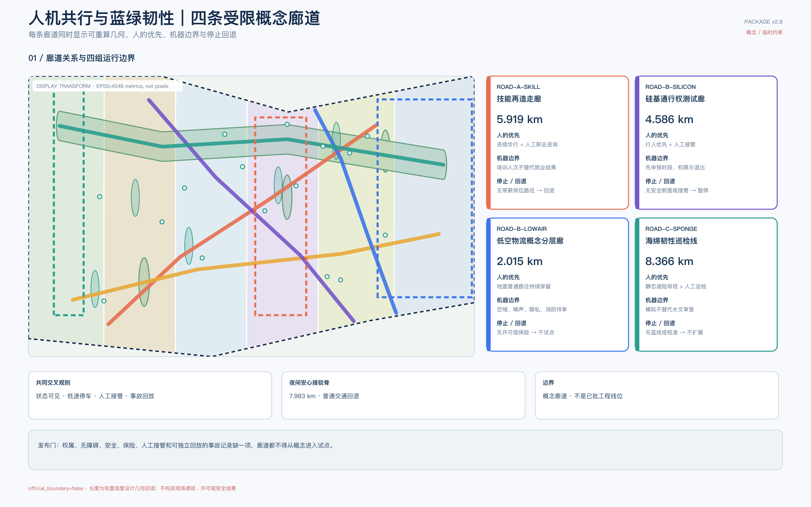

## 蓝绿空间、公共空间与城市风貌

蓝绿系统承担热浪、暴雨、心理恢复和日常交往等基础设施功能。小月河翼海绵韧性概念带连接模拟、巡检和公众避险信息；三个无屏静心花园要求不设置强制交互屏、广告推荐或情绪识别，给高强度脑力劳动者、老人、儿童和居民保留不被计算的空间。[data:geometry/green_space.geojson#GREEN-C-SPONGE] [metric:no_screen_green_area_sqm]

绿地总面积约 1,269,256.687 平方米、占临时边界约 11.12%；公共空间约 121,447.158 平方米、占约 1.06%。这些都是设计图层值，不是法定绿地率或公园实施面积；取得官方边界、蓝线、文保和现状绿地后必须重新生成。[metric:green_ratio] [metric:public_space_ratio] [depth:blue_green_public_space]

城市风貌以“钢轨-时间-接口”为语法：钢轨代表百年京张的连续历史，时间刻度对应城市版本，接口节点对应中关村开源文化。建筑和公共设施采用可拆、可修、可识别的构件逻辑，避免把屏幕、发光立面和企业标识当作 AI 风貌。历史资源、清华园车站旧址和公园范围在缺正式保护资料时保持保守退让。[standard:MOHURD-URBAN-DESIGN-MEASURES] [depth:height_massing_character]

三个“朝圣地标”分别是：人的版本大厅——公开城市 issue、变更与撤回；轨道接口钟——以铁路时间与算法版本并置，展示谁在何时改变了城市；无屏恢复灯塔——以树荫、风、声音和夜间安全构成非屏幕公共地标。它们均为原创概念，不使用企业商标、人物肖像或受限图像。[source:AGENT-TASKBOOK] [depth:risk_missing_data]

## 更新项目清单、实施政策与分期计划

项目采用三次城市 release，而不是一次建成：v0.1 建立基线、公众问题清单和人工服务底线；v0.2 开展可逆小试、独立评估和事故演练；v1.0 只扩展通过公共利益、能源、气候、无障碍和可回滚审查的项目。三个阶段完整覆盖临时边界，用于治理责任分区而非开发时序承诺。[data:geometry/phasing.geojson#PHASE-V02] [metric:version_release_count] [depth:phasing_implementation]

每个建议项目在进入下一道门前都要留下合成人本交接凭证：H0 由问题观察交给资料与空间审阅，H1 确认等效人工入口，H2 核对最小字段与撤销，H3 检查能源、气候、交通和安全资料，H4 独立回放并开放异议，H5 记录版本差异和退出。三案例只是合成夹具，角色是抽象建议角色；它们把“谁接手、凭什么接受、何时停止、如何回到上一门”变成可查字段，不把建议角色写成现实运营方。[data:visual/assets/human-city-receipt.json] [data:visual/assets/implementation-operation-matrix.json]

### v2.7 公共服务桌面试验合同｜把“人先接手”写成可拒绝的正负夹具

现有交接凭证回答“如何回放一项人本服务”；本轮新增四个空间锚定的桌面合同，分别覆盖人工通道、城市 API 授权、事故复盘和多语公共服务。每张卡把用户、空间、建议角色、权限、最小数据、人工替代、基线缺口、验收、隐私和停止/恢复写在同一行。角色仍是待授权占位，field_location=null，不接入真实系统。[data:visual/assets/human-city-public-service-tabletop-v1.json] [depth:phasing_implementation]

| 合同卡 | 空间锚点 | 可接受的合成动作 | 资料不足或越界时 |
| --- | --- | --- | --- |
| HC-T01 人工通道与代际共学 | PUBLIC-A-INCLUSION | 不扫码提交问题，获得人工解释与预期回执 | 人工入口不可用或造成排斥，回到纸本/电话 |
| HC-T02 城市 API 授权解释台 | SC-B01 | 说明目的、权限、最小字段和撤销路径 | 越权、目的漂移或无日志，冻结调用 |
| HC-T03 监管沙盒事故复盘台 | SC-C03 | 记录谁暂停、谁复核、如何申诉和何时恢复 | 责任不清或无人工停机，保持人工安全状态 |
| HC-T04 多语公共服务客厅 | PUBLIC-D-GLOBAL | 经过双语复核的公共信息与人工转接 | 双语不一致或服务范围不明，保留纸面说明 |

四条正样本必须同时满足同意、人工接管、权限范围、最小数据、申诉、双语复核和低影响动作；八条负样本分别拒绝缺少同意、人工入口、最小数据、权限、申诉、低影响边界、双语复核或空间锚点的请求。run-human-city-public-service-tabletop-v1.js --check 在无网络条件下逐项复核 4/4 正样本和 8/8 负样本，并生成预期回执；PASS 只证明合同可拒绝、可回放，不证明服务绩效、排班、许可、无障碍结果、事故安全、公众结果或官方评分。[data:visual/assets/run-human-city-public-service-tabletop-v1.js] [data:visual/assets/human-city-public-service-tabletop-v1-evidence.json] [depth:risk_missing_data]

| 项目 | 版本 | 前置条件 | 停止/回滚条件 |
| --- | --- | --- | --- |
| 社区保留基线与回迁协议 | v0.1 | 居民同意、资格和隐私规则 | 无法形成可信基线则不发布比例 |
| 技能再造接力站 | v0.1 | 用工伙伴、带薪机制、岗位跟踪 | 只有培训人次、无岗位路径则整改 |
| 人工服务与代际共学 | v0.1 | 人工人员与无障碍走查 | 人工渠道不可用则停止数字迁移 |
| 无屏静心花园 | v0.1 | 绿地/文保边界核验 | 出现强制采集或广告推荐则撤除 |
| 城市 API 交换站 | v0.2 | 数据目录、权限、日志、退出 | 越权、不可解释或无人工接管则停机 |
| 硅基通行权测试 | v0.2 | 交通审查、保险、事故预案 | 安全阈值或公众接受度不达标则撤场 |
| 内涝与海绵模拟 | v0.2 | 水文、蓝线、排水和模型校准 | 未经真实事件/演练校准不得扩展 |
| 算电余热审计 | v0.2 | IT 负荷、PUE、绿电、热需求 | 无计量或无热用户则不宣称社区供热 |
| 公共数据授权样板间 | v0.2 | 依法授权、公益优先、第三方评估 | 隐私、商业秘密或退出机制不满足则关闭 |
| OPC 共享实验室 | v0.2 | 公平申请、冲突披露、资源审计 | 变成指定供应商或封闭会所则重设 |
| 标准外溢工作室 | v1.0 | 公开协议、跨区复核 | 未经验证不得称国家/行业标准 |
| 国际服务客厅 | v1.0 | 多语、医疗导航、合规服务走查 | 无实际服务能力则不得以品牌替代 |

版本治理的核心文件是 release note：列出新增、改变、撤回、事故、公众异议、数据权限和下一版本门槛。年度体检既看空间，也看居民保留、岗位转型、能源、气候、数据和人工通道。公众可以提交 issue，维护团队必须回复“接受、试验、拒绝或待资料”并说明证据。[depth:renewal_project_list] [depth:phasing_implementation]

为避免“展示即升级”，本次 v0.2 将三处概念分期面补入进入门、推进门、退出门，并把当时的 16 张场景卡作为离线结构化附件；v0.8 再增加 SC-D04，v0.9 再补交接凭证，当前完整台账为 17 张卡。它们要求把人工接管、授权、保险、计量、校准、无障碍和公众复核写成前提，而不是把任何单一技术效果当作扩区理由。[data:geometry/phasing.geojson#PHASE-V02] [standard:MOHURD-URBAN-DESIGN-MEASURES]

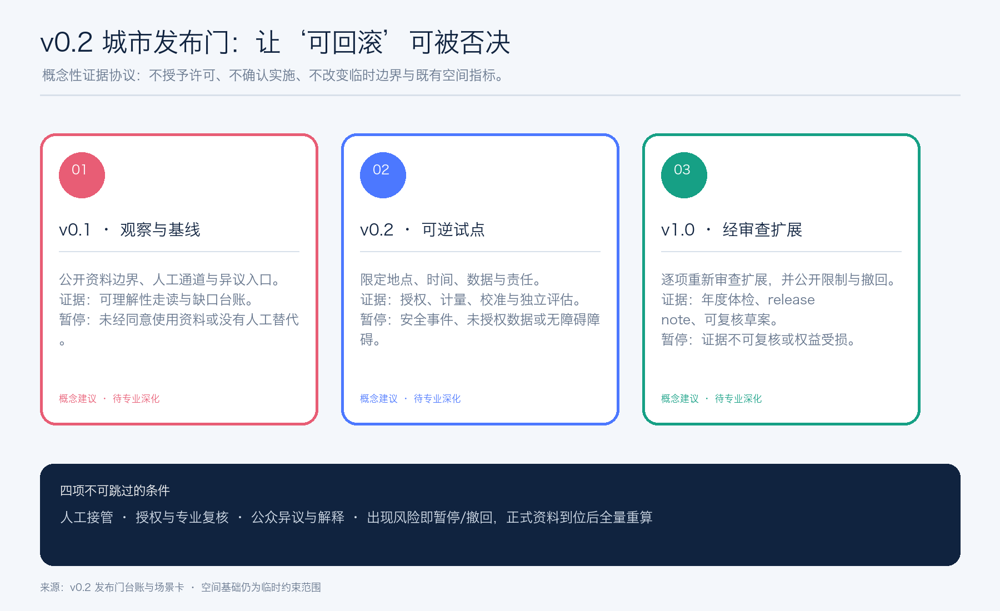

长期运营形成四季节奏：春季“城市问题开源周”收集居民与服务人员问题；夏季“城市 API 与具身测试月”只做受控验证；秋季“工作转型与 OPC 共创季”连接岗位、技能和小团队；冬季“城市版本大会”发布年度体检和 release note。活动仅为概念运营机制，尚未取得任何政府审批、资金或场地承诺。[source:AGENT-TASKBOOK] [depth:renewal_project_list]

品牌名称为“Jingzhang Human City OS / 京张人本城市操作系统”。Logo 方向是一个开放括号包住一段轨道与一个人工确认点：括号代表 API 可调用，轨道代表历史连续，确认点代表人拥有最终决定权。视觉只用原创几何与系统字体，不使用企业标识或未经授权字体。[source:AGENT-TASKBOOK] [depth:risk_missing_data]

## 指标体系、面积复算与合规矩阵

所有 `known` 指标均从本包 GeoJSON 投影到 EPSG:4548 后复算；proposal、五张图、HTML 和 PDF 使用同一 `metrics.json`。空间指标的低置信度来自临时边界，并不因小数位多而提高精度。[metric:site_area_sqm] [depth:metrics_recalculation]

v0.2-v0.5 的指标审计明确区分“本轮不变的空间复算值”和“仍不能替代实测的社会/运行结果”。发布门、场景卡、资料就绪度与空间接口不改变任一面积、比例、线长或既有指标值；后续一旦改动 geometry，必须同时重算 `metrics.json`、图件、HTML 与 PDF，不能用叙述覆盖数据。[metric:green_ratio] [metric:operational_pue]

| 指标 | 当前值 | 证据 | 解释边界 |
| --- | ---: | --- | --- |
| 临时总体设计面积 | 11,412,825.386 sqm | site_boundary | 非官方精确面积 |
| 绿地设计面积/比例 | 1,269,256.687 sqm / 11.12% | green_space | 非法定绿地率 |
| 公共空间面积/比例 | 121,447.158 sqm / 1.06% | public_space | 非实施边界 |
| 社区保留支撑分区比例 | 18.28% | land_use LU-H01 | 不是居民保留率 |
| 可逆留白比例 | 15.09% | land_use LU-B01 | 不是已批留白用地 |
| 技能再造走廊 | 由 roads 几何复算 | ROAD-A-SKILL | 非工程线位 |
| 持续就业转型率 | unknown | 经同意基线、带薪路径与随访 | 不能由培训人次或走廊长度推断 |
| 人工通道等效可用率 | unknown | 服务目录、替代规则与走读 | 不能由网页可访问性或空间面积推断 |
| 人本/机器场景数 | 4 / 4 | constraints | 内容覆盖计数 |
| 测试验证场景数 | 6 | constraints | 不等于获批运营 |
| 城市版本数 | 3 | phasing | 治理阶段，不是建设承诺 |

居民保留率、持续就业转型率、人工通道等效可用率、运行 PUE、绿电占比和余热回收量保持 `unknown`：它们分别需要家庭基线、经同意的带薪路径与随访、服务走读、实际设施能耗、绿电凭证和热网计量。把 unknown 留在机器文件中，是为了阻止愿景被误读成绩效。[metric:sustained_employment_transition_rate] [metric:manual_service_equivalence_rate] [metric:recovered_heat_mwh]

`compliance_matrix.json` 覆盖公告 1.3、1.4、1.5 和 agent.1-agent.6 共 23 项；`standard_matrix.json` 覆盖公告、任务书与三项可正式使用的专业标准；`design_depth_matrix.json` 覆盖 15 项深度；`self_check.json` 记录四类门禁。v0.2-v0.5 另附场景、发布门、用户公平、执行责任、指标复算、权利、双语、可访问性、资料就绪度与空间接口台账，便于专业团队复核而不把附表误当作实施证明。[standard:MOHURD-URBAN-DESIGN-MEASURES] [depth:metrics_recalculation]

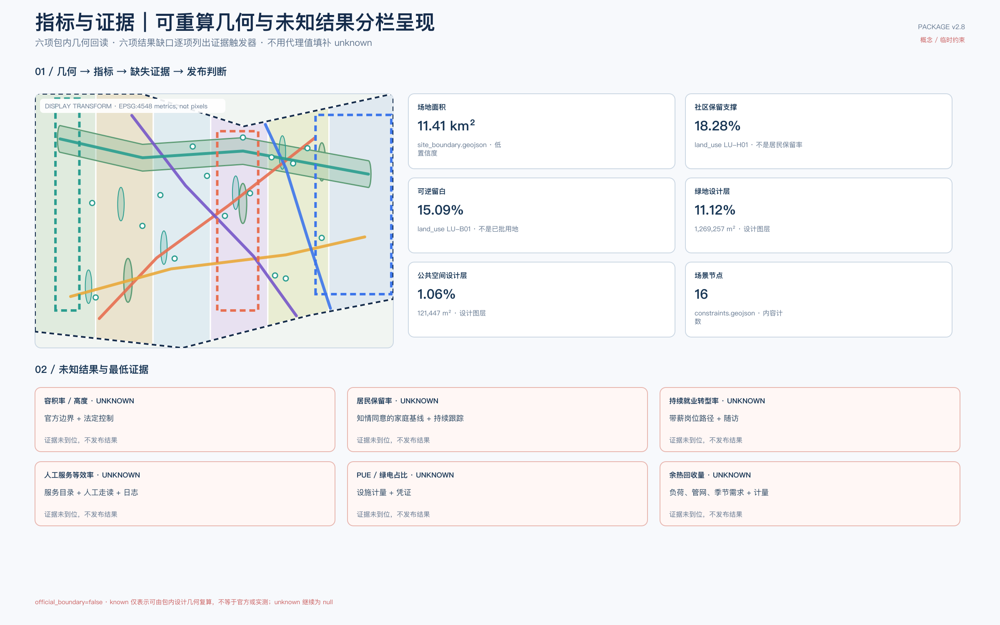

## 风险、版权与合规说明

最大空间风险是临时边界可能改变全部面积、线路和节点位置；最大社会风险是“创新区”抬升租金并挤出居民和小商户；最大技术风险是机器路权、数据和数字孪生越过人工控制；最大能源风险是把政策目标当成实测结果；最大气候风险是没有水文资料却作行洪承诺。每项风险都有对应 assumption、停止条件和复算触发器。[source:BOUNDARY-SOURCE] [depth:risk_missing_data]

| 风险 | 当前控制 | 仍需资料/授权 |
| --- | --- | --- |
| 空间与权属 | 临时边界低对比、概念建筑不下拆改留结论 | 官方 polygon、宗地、权属、现状建筑 |
| 社区挤出 | 社区保留协议、小商户回迁、施工期临时经营 | 清权基线、租约与长期跟踪 |
| 就业转型 | 以稳定岗位而非培训人次评价 | 用工伙伴、工资和持续就业数据 |
| 机器安全 | 四限定、保险、人工接管、事故复盘 | 交通/空域/消防审查与许可 |
| 数据与隐私 | 最小权限、日志、退出、第三方评价 | 授权目录、影响评估、运营主体 |
| 算电与余热 | PUE 门槛、绿电凭证、热需求先行 | IT 负荷、节能审查、热网与计量 |
| 气候韧性 | 模拟先于工程，保持概念状态 | 河道蓝线、水文、排水、防洪资料 |

v0.4 资料就绪度台账不以“补齐日期”代替证据，也不把建议角色误写成实际责任主体。每项资料缺口都登记最低可用证据、受影响的场景/空间/指标、进入门、资料缺失时必须保留的 `unknown` 或概念状态，以及任何空间输入变动后的全量重算动作。它把缺口变成可关闭的审阅任务，而不把待补资料包装为已经存在的能力。[metric:manual_service_equivalence_rate] [metric:operational_pue] [depth:risk_missing_data]

五张必交核心图与两张补充证据图、双语 HTML 和四份 PDF 均由本包几何、指标与结构化台账生成；不加载远程脚本、字体、地图瓦片、iframe、表单或跟踪。图中地图是抽象证据图，不是测绘底图。原创文字、图形、代码与布局按 `COMMUNITY-DISPLAY-ONLY` 用于本征集公共展示；官方资料和全球案例版权仍归原权利人，仅作事实引用。[source:SITE-PACKAGE] [depth:risk_missing_data]

本方案不伪造官方背书、企业名单、投资额、产值、建设规模或标准条文；不把概念节点写成获批项目；不把 PUE、绿电、保留率和就业结果写成已实现。所有需要政府、专业团队、居民或运营主体决定的事项均保留为下一版本的公开问题。[standard:PROJECT-AGENT-OPEN-CALL-TASKBOOK] [depth:risk_missing_data]

## 参考资料

正式任务与空间边界以仓库本地快照和 `sources.json` 为准：官方征集公告、清权智能体任务书、城市设计管理办法、控规编制审批办法、国土空间用地分类指南，以及临时边界说明。[source:SITE-PACKAGE] [standard:MOHURD-CONTROL-DETAILED-PLANNING]

就业转型背景使用 IMF 2024 AI 与就业分析、WEF Future of Jobs 2025；算电使用北京市算力基础设施建设实施方案和存量数据中心优化工作方案；公共数据使用北京市 2026 公共数据资源授权运营管理办法；OPC 与人才量级使用海淀现行公开信息。具体 URL、访问日期、允许用途和限制全部登记在 `sources.json`。[source:IMF-AI-JOBS-2024] [source:BJ-PUBLIC-DATA-2026]

全球案例包括 JTC Punggol Digital District、Forum Virium Helsinki Smart Kalasatama、Barcelona City Council 22@、Seoul AI Hub、Korea Smart City Busan Eco Delta、Waterfront Toronto Quayside。案例只用于机制比较，不证明京张具备相同条件。[source:CASE-BARCELONA22] [source:CASE-SEOUL-AI-HUB] [source:CASE-BUSAN-EDC]

结构化证据入口：`metrics.json`（复算指标）、`assumptions.json`（未知与置信度）、`sources.json`（来源边界）、`geometry/`（空间证据）、三项矩阵（任务/标准/深度）和 `self_check.json`（四类门禁）。当官方数据更新时，城市版本发布室应将差异写入 release note，并重新运行 render、finalize 与 self-check。[data:geometry/phasing.geojson#PHASE-V10] [depth:metrics_recalculation]
