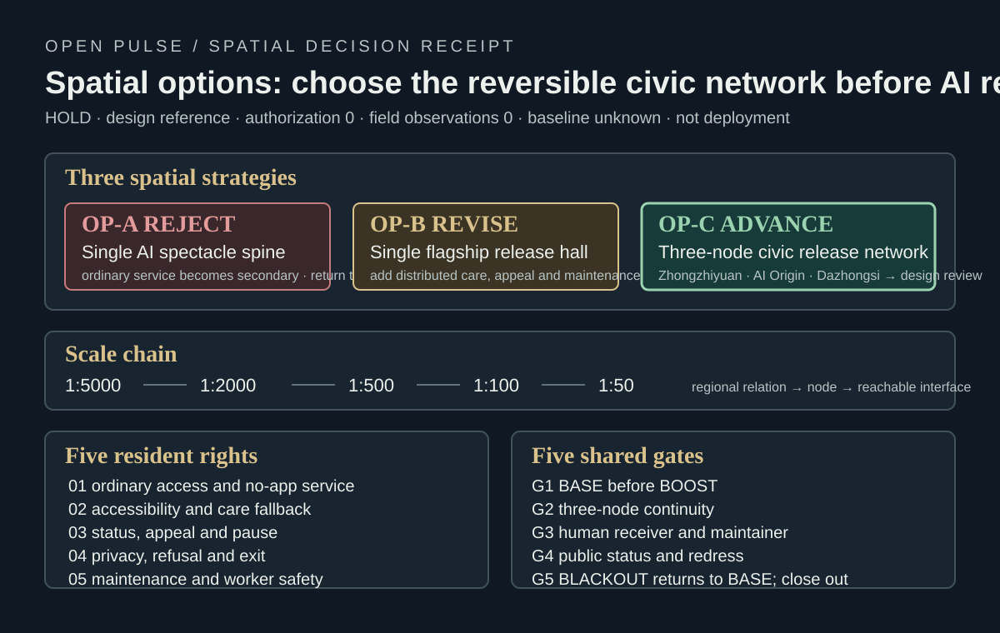
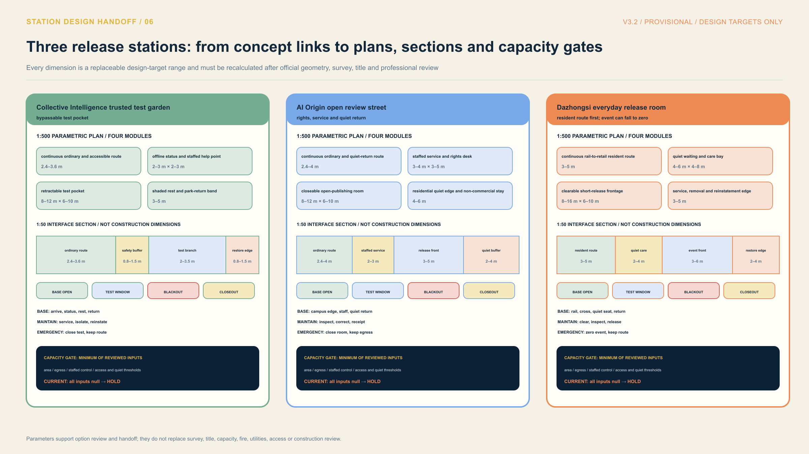
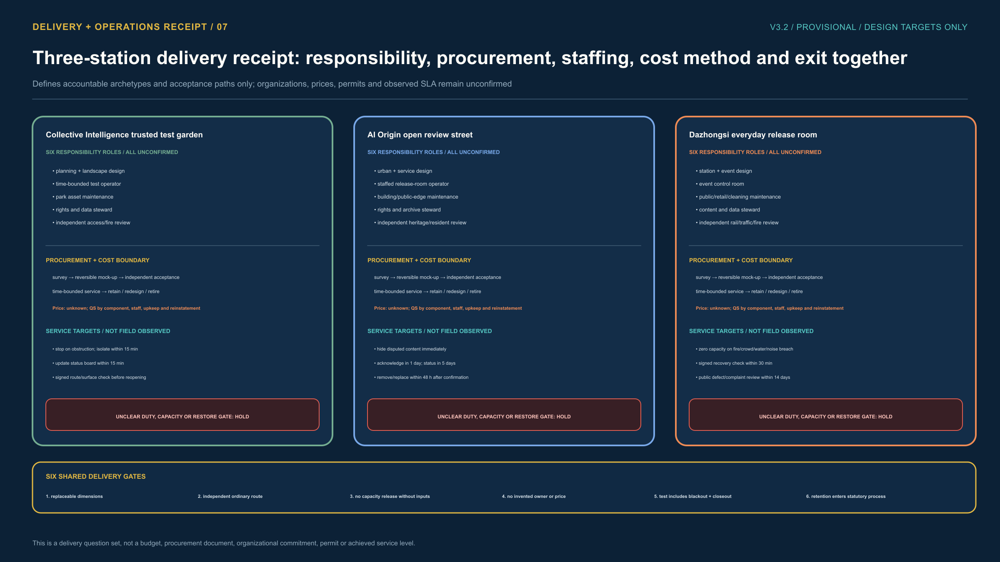

# Jing-Zhang Open Pulse, The City Releases Its Own Civic Versions

> **A city does not chase model versions; it releases its own civic versions.**

## Executive Summary

Models update by the month, while a city remains accountable for shade, rainwater, access and maintenance years later. Open Pulse therefore establishes a civic version contract. No AI-assisted urban scenario moves straight from demonstration into daily life. It must leave six traceable objects: **ISSUE, bounded FORK, evidence TEST, dual REVIEW, civic RELEASE, and REPAIR or RETIRE**. Each stage has a spatial carrier, named responsibility, ordinary alternative, stop condition and archivable receipt. [data:visual/assets/civic-pulse-protocol.json] [source:NIST-AI-RMF-1.0]

One continuously open public spine links three civic release stations. Collective Intelligence Garden tests bounded prototypes; AI Origin reviews evidence, rights and reusable interfaces; Dazhongsi returns a reviewed capability to ordinary urban life. The Zhongguancun service wing provides enterprise, talent, legal and capital interfaces. The Xiaoyue River scenario wing brings community, blue-green and everyday questions. Regional names in the taskbook remain future coordination interfaces and do not establish a partnership. [source:AGENT-TASKBOOK] [depth:overall_spatial_structure]

The package contains concept design, machine-recomputed geometry and one local synthetic tabletop replay. S-02 can replay stop, withdrawal and restoration logic offline, but its field window remains **HOLD / not authorised / not run**. This is not evidence of robot performance, safety, public acceptance or deployment. Walking, staffed service and hand-cart delivery remain available in every state. [data:visual/assets/open-pulse-tabletop-evidence.json] [data:visual/assets/example-s02-embodied-test-window.json]

## Ordinary Routes Come First and AI Adds a Reversible Gain

Each key area keeps an ordinary service route that does not depend on an account, model or network. Zhongzhi Garden places human delivery beside a low-speed robot window, AI Origin places a staffed counter beside process retrieval, and Dazhongsi places resident return and ordinary retail beside capacity prompts. Each route leaves a five-step receipt that checks the ordinary entry, the AI role, human takeover, stop conditions and restoration [data:visual/assets/open-pulse-service-equivalence-atlas.json] [data:visual/assets/run-open-pulse-service-equivalence.js].

| Receipt step | Reviewer check | Current boundary |
| --- | --- | --- |
| See ordinary entry | Walking, paper, human help and public rules remain available | Concept contract |
| Know the AI role | Only bounded retrieval, prompts or window gains are described | Role pending review |
| Human takeover | Accountable roles, complaint and exit paths remain | Not authorised |
| Stop on failure | Conflict, overreach, fire or accessibility breach stops the route | Synthetic replay |
| Restore and receipt | Remove the device or digital layer and retain the decision record | Field result unknown |

The replay checks only the links among 14 package scenarios, 8 operating actions, 3 nodes and 8 personas, with four negative fixtures returning to HOLD. It provides no resident experience, service performance, field accessibility, permit, staffing or official-score evidence [data:visual/assets/open-pulse-service-equivalence-atlas.json].

## Spatial Options Before AI Release

The ordinary-route contract says what cannot be sacrificed; the next decision must explain why this spatial organisation is selected. `visual/assets/open-pulse-spatial-decision.json` puts three alternatives on one receipt: OP-A, a single AI spectacle spine, is `REJECT`; OP-B, a single flagship release hall, is `REVISE` until distributed care, appeal and maintenance are added; only OP-C, the three-node civic release network, may `ADVANCE_TO_DESIGN_REVIEW`. Advance means entering the next spatial design review only. It is not approval, construction, procurement, deployment or a ranking claim.

The decision follows `1:5000 → 1:2000 → 1:500 → 1:100 → 1:50`: regional public-service relationships, corridor seams, the three-key-area network, status/route/appeal/maintenance handoffs, and finally whether a person can read, enter, refuse, appeal and leave. The five rights are ordinary access and no-app service, accessibility and care fallback, status/appeal/pause, privacy/refusal/exit, and maintenance/worker safety. The five gates are `BASE` before `BOOST`, three-node continuity, human receiver and maintainer, public status and redress, and `BLACKOUT` returning to `BASE` with a clean closeout. The contract remains `HOLD`, with zero authorization, zero field observations, an `unknown` baseline, empty performance and empty field claims; `numeric_dimensions=null` and the scale chain is not a construction dimension. [data:visual/assets/open-pulse-spatial-decision.json] [source:NIST-AI-RMF-1.0]

`run-open-pulse-spatial-decision.js` and its six negative fixtures reject a non-`HOLD` contract, an invalid option, a broken scale chain, missing rights or field claims. If any shared gate fails, OP-C returns to `BASE` and cannot scale. This adds a reviewer-visible choice and stop path, not new field facts.

## Design Basis and Source List

The first authority layer is the official open-call announcement and agent taskbook, which define the three scope levels, three key areas, five functions, three-area/two-wing coordination and deliverable depth. [source:OFFICIAL-ANNOUNCEMENT] [source:AGENT-TASKBOOK] The second layer is the structured brief, standards, enums and provisional geometry in `brief/site-package/`. [source:SITE-PACKAGE] [source:SOURCE-REGISTRY] The third layer is public Beijing policy, international standards and peer-reviewed research. External material defines methods and questions; it does not transfer another place's performance to Jing-Zhang.

`SITE-001` and the three `PROV-KEY-*` features are rough provisional geometry. They support concept composition, topology checks and package-local recalculation, but they are not official redlines, ownership, road redlines or approvals. Once official polygons arrive, all nine GeoJSON layers, ratios, PDFs, HTML and narrative must be recomputed together. [data:geometry/site_boundary.geojson#SITE-001] [data:geometry/key_areas.geojson#PROV-KEY-001] [metric:site_area_sqm]

| Evidence state | What it can support | What it cannot support |
| --- | --- | --- |
| official / public | task scope, policy direction, methods and legal floor | project approval, partnership, investment or site performance |
| provisional geometry | conceptual relations, machine recalculation and option comparison | statutory area, development control, ownership or engineering set-out |
| design target | next acceptance question, metric and stop condition | achieved service or improvement |
| field unknown / hold | visible gap, responsibility and next gate | substituting tabletop evidence for field safety or public experience |

Long-lived urban experiments depend on linked learning, embedding, professionalisation, knowledge sharing and engagement rather than a single pilot. NIST AI RMF requires lifecycle governance, context mapping, measurement and treatment. The UK ATRS offers a reference format for publishing purpose, responsibility and impacts. Open Pulse borrows those mechanisms without presenting them as local statutory requirements. [source:ANICHE-URBAN-LIVING-LAB-LONGEVITY-2026] [source:NIST-AI-RMF-1.0] [source:CASE-UK-ATRS]

## Three-Level Scope Framework

All three scope levels use one civic version chain, so strategy, overall design and key-area detail do not split into unrelated stories.

| Level | Core question | Design output | Civic-version receipt |
| --- | --- | --- | --- |
| 43.6 km² coordinated study | How should AI industry and future city collaborate? | university-enterprise-community-professional issue network | which issues enter Jing-Zhang, who receives them, how learning returns |
| 11.4 km² overall design | How do renewal, mobility, blue-green and services land spatially? | one public spine, three stations, two wings and three east-west seams | what remains ordinary, what is only a bounded fork |
| 368.4 ha key areas | How does a scenario finish, stop and recover? | nodes, roles, gates and ordinary routes at three stations | evidence pack, decision, public status and retirement path |

Areas derive from the current provisional geometry. Key-area positions express working relationships, not official parcels. The spine protects walking, accessibility, rest, wayfinding and staffed service. The wings bring questions and resources in and return learning; they do not create a closed AI-only corridor over the park. [data:geometry/roads.geojson#ROAD-001] [data:geometry/public_space.geojson#PUBLIC-001]

## Coordinated Research Area: Industry and Future City Research

The belt's industrial role is to reduce the cost of validating urban innovation, not to display the newest model. Universities and developers contribute methods and prototypes; firms contribute products and maintenance capacity; residents and frontline staff bring real problems; professional teams review safety, accessibility, law, data, fire and municipal systems. Every party works only within an authorised scope, while contribution, dissent and withdrawal enter the version record. [data:visual/assets/policy-enterprise-playbook.json]

The three stations answer different questions. Collective Intelligence Garden asks whether a bounded test can be safe and stable. AI Origin asks whether evidence, rights and interfaces can be independently reviewed. Dazhongsi asks whether a person without an account or model knowledge can use, refuse and return to ordinary life. Regional interfaces exchange only issues, evidence, methods and receipts, not unauthorised personal data or invented partnerships. [data:visual/assets/regional-ecosystem.json]

The identity has one operational meaning: **Open Pulse is the city's civic-release cadence**. Signs, status boards and receipts use ISSUE / FORK / TEST / REVIEW / RELEASE / RETIRE at all three stations. The self-generated mark is a concept, not a registered trademark or existing government brand. [data:assets/identity/open-pulse-mark.svg] [data:visual/assets/identity-system.json]

## Overall Design Area: Urban Renewal and Regulatory-Plan-Level Urban Design

The overall design follows three rules: public baseline first, test pockets remain removable, and civic release stations remain maintainable. Continuous green and public space form the spine. AI R&D, enterprise services and community support occupy adjustable conceptual zones along existing urban edges. Small tests enter bounded, bypassable and recoverable pockets, never the accessible main route, fire access or ordinary service.

Package-local geometry yields 11.41 km² of provisional area, 12.34% green space and 7.33% public space. These values test layer consistency; they are not statutory controls. [metric:site_area_sqm] [metric:green_ratio] [metric:public_space_ratio] The conceptual building-footprint ratio is 2.72%; FAR remains unknown until official planning, ownership, existing-building, municipal and heritage inputs arrive. [metric:building_footprint_ratio] [data:metrics.json]

Spatial control has three classes. Durable, account-free and low-maintenance elements form the long-term public baseline. Tests use rented or removable components with a restoration budget. Permanent construction is discussed only after official geometry, professional review and public process. AI equipment never determines statutory use, intensity or demolition scope. [depth:development_intensity_controls]

## Detailed Design of Key Areas

| Station | A complete everyday route | Version responsibility | If the gate fails |
| --- | --- | --- | --- |
| Collective Intelligence trusted test garden | park arrival—status board—accessible seam—rain garden—booked test—park return | bounded fork; model, embodied-AI, energy, water and safety tests | no test if river, flood, transport, ownership, fire or human-takeover evidence is missing |
| AI Origin open review street | campus edge—release room—rights desk—contribution wall—shared learning—quiet residential edge | review source, licence, interface, explanation and human alternative | no merge if campus access, heritage, displacement, licence or withdrawal is unresolved |
| Dazhongsi everyday release room | rail arrival—four-way crossing—quiet seat—short display—ordinary retail—daily return | release only after dual review; publish state, responsibility, appeal and retirement time | reduce activity to zero if rail, road, fire, crowd, noise or emergency gate fails |

All three forms come from provisional `geometry/key_areas.geojson`. The routes are conceptual spatial and operating contracts, not construction drawings, quantities, approvals or completed experiences. [data:visual/assets/key-area-node-plans.json] [depth:three_key_area_detailed_design]

### Collective Intelligence: the test pocket can close; the park route cannot

Collective Intelligence Garden sets a 2.4–3.6 m ordinary and accessible route as a design-target baseline, with an offline status/staffed-help point, retractable test pocket, shaded rest and park-return band beside it. The 1:50 interface section separates the ordinary route, safety buffer, test branch and maintenance/reinstatement edge so a bay, barrier or repair cannot quietly consume daily access. These ranges compare options; they are not surveyed widths or construction dimensions. Capacity inputs remain null and the decision remains HOLD until river, flood, transport, title, fire and accessibility review is complete. [data:visual/assets/open-pulse-station-delivery-contract.json]

### AI Origin: rights, staffed service and quiet return share one street

AI Origin first keeps a 2.4–4.0 m ordinary and quiet-return route, then adds a staffed rights desk, closeable publishing room, residential quiet edge and non-commercial stay. The frontage has four states—BASE, TEST_WINDOW, BLACKOUT and CLOSEOUT. A rights dispute hides the digital layer first; paper information, staff, egress and quiet return do not close with it. Release capacity is the minimum of usable area, egress, staffed-service and quiet-edge limits, and remains unset until those inputs are reviewed. [data:visual/assets/open-pulse-station-delivery-contract.json]

### Dazhongsi: event capacity can fall to zero while the resident route remains

Dazhongsi uses a 3.0–5.0 m rail-to-retail return route as the baseline and places quiet waiting, care, short release and removal/reinstatement on a clearable side frontage. Any fire, crowd, water, noise or resident-access breach immediately reduces event capacity to zero. Displays and events stop, while rail arrival, crossing, quiet seating, ordinary retail and the resident route continue. Usable area, rail/crossing, fire egress, quiet route and staffing inputs remain null rather than being inferred from a concept drawing. [data:visual/assets/open-pulse-station-delivery-contract.json]

Together the stations register twelve parametric plan modules, twelve interface-section bands, nine unconfirmed ownership interfaces and three capacity formulas. Parameters make spatial choices and survey questions reviewable; they do not replace official boundaries, existing-condition survey, title, utilities, fire, transport, accessibility or construction review.

## AI Innovation Ecosystem, Personas, and AI+ Scenarios

Five user groups operate as independent acceptance viewpoints, not marketing profiles. Residents test ordinary access and low disturbance. Older and disabled people and carers test accessibility and no-app service. Maintainers test failure, spares and takeover. Students and developers test contribution, reproducibility and withdrawal. Firms and visitors test service interfaces, compliance and international communication. An average must never conceal one group's exclusion or extra risk. [metric:user_persona_count] [data:visual/assets/persona-and-inclusion-matrix.json]

Fourteen scenarios are grouped into six urban tasks, each with ordinary service and an exit condition.

| Urban task | Scenario examples | Minimum data | Human responsibility and ordinary alternative |
| --- | --- | --- | --- |
| access and accessibility | walking gaps, accessible assistance, low-speed delivery | manual counts, barriers, event log | transport/accessibility lead; static signs, hand-cart and human delivery |
| research and safety | model red-team, data sandbox, embodied-AI test | cleared sample, model card, stop/takeover log | assurance and safety leads; paper review and closed test |
| enterprise and talent service | open release, enterprise support, talent collaboration | authorised materials, public process, audit log | named service lead; staffed desk and paper directory |
| health and culture | non-diagnostic navigation, cultural guide, learning service | minimum referral data and cleared heritage content | professional referral and cultural leads; human, print and audio service |
| commerce and events | AI retail, developer week, international exchange | aggregate crowd, fire, noise and content list | event control; ordinary retail, quiet route and cancellation |
| blue-green and maintenance | rain garden, quiet night chain, asset inspection | ponding point, light/noise record and work order | asset owner; manual clearing, inspection and static lighting |

S-02 is the only example with a local synthetic tabletop replay. Its 4/4 fixtures, 6/6 checks and 5/5 restoration steps pass only as a replayable protocol. Field route, accessibility, safety, permission, maintenance and public acceptance remain absent, so no RELEASE is issued. [metric:scenario_card_count] [data:visual/assets/open-pulse-tabletop-evidence.json]

## Land Use, Building Scale, and Retain-Renovate-Demolish Strategy

Four conceptual land-use classes cover the provisional boundary: AI R&D, park and open space, industrial/commercial service, and community support. They compare functional relationships without changing statutory use. Buildings receive only working labels: retain, repair, reversible insert or professional review required. Without official survey, title, structure, fire, heritage and planning controls, the proposal makes no total floor area, FAR, height or demolition promise. [data:geometry/land_use.geojson#LU-001] [data:geometry/buildings.geojson#BLDG-001]

New elements remain light, removable and repairable. Status boards, tactile maps, shaded seats, staffed desks, device bays, emergency stops and recovery signs need asset IDs, maintenance responsibility, spares and retirement destinations. Evidence of use and maintainability determines retention, not the amount of technology. [source:ISO-55001-2024] [source:ASSET-MANAGEMENT-GBT33172]

## Transport, Rail, Municipal Infrastructure, and Public Services

The conceptual slow-mobility network totals 13.01 km. Its public north-south spine is about 9.60 km, and three east-west links serve the key areas. These lengths are projected from `roads.geojson`, not engineering centrelines. [metric:design_slow_mobility_network_length_m] [metric:design_north_south_spine_length_m] [metric:design_east_west_connector_count] Mapped station names and 189 OSM crossings screen interfaces only; they do not replace entrance, signal, accessibility or safety audits. [metric:osm_mapped_crossing_count]

Embodied AI follows four gates: G0 keeps ordinary routes open; G1 is a local synthetic tabletop; G2 requires independent accessibility, safety, permission and maintenance review; only G3 may consider one witnessed bounded field window. Pedestrian conflict, reduced clear width, failed stop, lost spotter sight, flood or fire concern immediately clears the device and restores the ordinary route. [source:ISO-13482-SERVICE-ROBOT-SAFETY] [source:ISO-TR-4448-PUBLIC-MOBILE-ROBOTS]

Municipal and public services keep a minimum offline contract. Static wayfinding, staffed service, passive drainage, emergency lighting and manual takeover cannot fail with a sensor, model, network or vendor. Energy, drainage, fire and edge-compute capacity remain subject to official data and professional review. [source:RESILIENT-CITY-INFRASTRUCTURE-2024]

## Blue-Green Network, Public Space, and Urban Character

The blue-green system first provides shade, water management, rest, accessibility and quiet nights, then hosts sensing or algorithmic scenarios. Collective Intelligence Garden combines the Qinghe edge, rain gardens and test pockets. AI Origin links campus and community walking, quiet learning and non-commercial rest. Dazhongsi combines station crossings, event reduction, wet-weather return and low-disturbance nights. Sensors may improve alerts, but drainage, trees, seats and manual inspection remain independently useful. [source:BEIJING-CLIMATE-ADAPTATION-2024] [source:BEIJING-FLOOD-PLAN-2021-2025] [source:BEIJING-ACCESSIBILITY-REGULATION]

Wind, heat, air, stormwater, ecology and lighting baselines remain unknown. The package preregisters points, instruments, calibration, model alignment, stop rules and professional sign-off. Without field measurement, CFD, SWMM, resident survey or health evidence, no improvement percentage is claimed. [data:visual/assets/wind-health-field-protocol.json] [source:AIJ-CFD-PEDESTRIAN-WIND-2008] [source:BEIJING-LIGHTING-GUIDE-2025]

Urban character retains the railway's line, rhythm, durable material and maintainability. Technical elements use low glare, legible state and reversible installation. Open source means an explainable, repairable and archivable urban method, not more screens.

## Renewal Projects, Implementation Policy, and Phasing

| Phase | Suggested time | First action | Release evidence | Exit condition |
| --- | --- | --- | --- | --- |
| P0 lock the baseline | months 0–3 | replace official geometry; add existing condition, ownership, access, fire, utilities and public baseline | versioned base map, gap list, ordinary-route acceptance | do not pilot while critical evidence or responsibility is missing |
| P1 build three stations | months 4–9 | issue wall, rights desk, status board, staffed service and reversible test pocket | asset owner, maintenance budget, complaint and withdrawal route | pause if ordinary service is displaced or maintenance has no owner |
| P2 bounded release | months 10–18 | at most one witnessed scenario per station, each with a public receipt | baseline, incident, group impact, professional review and recovery | return on safety, rights, access, ecology or group-impact breach |
| P3 review and migrate | annual | compare versions; expand, repair or retire; publish failure records | annual evidence account, budget, work orders, dissent and retirement list | retire if evidence cannot replay or lifecycle cost is unsustainable |

Eight operating packages cover official geometry, human-experience baseline, wind-heat-water validation, embodied-AI testing, open-source rights, Dazhongsi event reduction, rain/quiet-night operations, and annual review. Responsibility slots first name the organizer's data steward, transport/accessibility specialists, community liaison, site maintainer, test observer and independent reviewer; real bodies, budget, procurement and SLA require professional and public confirmation. The first P1/P2 screen uses five measures: ordinary-route completion, staffed-takeover response time, complaint closure, withdrawal execution and on-time maintenance work orders. If a measure has no baseline, it remains `unknown` and no release is issued. [data:visual/assets/operations-matrix.json]

### Responsibility begins with roles, not invented organizations

Each station starts with six duties: design lead, accountable decision, window operator, asset maintenance, rights/data and independent acceptance. Collective Intelligence emphasizes planning/landscape design, test operation and park maintenance; AI Origin emphasizes urban/service design, staffed publishing, rights/archive and residential-impact review; Dazhongsi emphasizes station/event design, event control, public-realm removal and rail/traffic/fire review. These are responsibility archetypes, not contracted bodies. Every role remains unconfirmed, and a missing duty keeps the window closed. [data:visual/assets/open-pulse-station-delivery-contract.json]

### Procurement and cost start with a method, not a false number

All three stations follow one sequence: survey and option review, reversible mock-up, independent acceptance, time-bounded service purchase, then retain/redesign/retire. Cost lower and upper bounds remain null until quantities and market checks exist. A quantity survey must separate components, staffed window hours, maintenance cycles, rights/data work and final reinstatement liability. This exposes where cost arises without presenting an unsupported estimate as a budget commitment. [data:visual/assets/open-pulse-station-delivery-contract.json]

### Service levels are next-round acceptance targets, not achieved performance

The three stations define nine service targets. Collective Intelligence stops on a critical obstruction, isolates within 15 minutes and updates public state within 15 minutes. AI Origin hides disputed content immediately, acknowledges within one working day, gives a status within five days and removes confirmed invalid material within 48 hours. Dazhongsi reduces activity to zero on a breached gate, checks ordinary-use recovery within 30 minutes of planned close and reviews defects and complaints within 14 days. Every time is marked `design_target_not_observed`. The runner rejects an observed-performance claim, invented capacity or cost, confirmed ownership, or a missing BLACKOUT/CLOSEOUT path. [data:visual/assets/run-open-pulse-station-delivery.js] [data:visual/assets/test-open-pulse-station-delivery.js]

## Metrics, Area Recalculation, and Compliance Matrix

The proposal keeps three accounts. The spatial account contains only values recomputable from GeoJSON. The service account remains unknown before field evidence. The version account records whether each scenario has an issue, accountable owner, ordinary alternative, evidence pack, public decision and retirement path. Missing one of six blocks RELEASE.

| Account | Currently confirmed | Unknown / hold | Decision use |
| --- | --- | --- | --- |
| spatial | 11.41 km² provisional area, 12.34% green, 7.33% public space, 13.01 km conceptual network | statutory area, FAR, height and engineering capacity | test layer closure and recompute after official data |
| scenario | 14 operating contracts, 3 industry windows, S-02 tabletop PASS | field safety, access, acceptance and service impact | decide whether independent professional review may begin |
| version | six-stage protocol, ordinary alternative and stop rules defined | real signatures, budget, permission and field baseline | ISSUE, FORK, REVIEW, RELEASE or RETIRE |

`compliance_matrix.json` maps announcement and taskbook requirements to sections, layers, metrics, drawings and HTML. `standard_matrix.json` records how standards are used and what they do not replace. `design_depth_matrix.json` records diagnosis, structure, key-area, implementation and recalculation depth. Machine PASS means structural completeness, not professional scoring or field approval. [data:compliance_matrix.json] [data:standard_matrix.json] [data:design_depth_matrix.json]

## Risk, Copyright, and Compliance

| Risk | Immediate stop | Evidence required to re-enter |
| --- | --- | --- |
| provisional geometry treated as statutory | any figure or text upgrades provisional to official | official source, version comparison, full-package recomputation and professional review |
| accessibility or ordinary service breaks | main route blocked, no human alternative, refusal/appeal inaccessible | independent route audit, repair record and affected-group retest |
| embodied-AI safety fails | stop/takeover failure, conflict or failure to return to bay | incident review, closed test, responsible signature and witnessed window |
| privacy, copyright or authority unclear | source, consent, retention, attribution or withdrawal gap | rights ledger, correction/deletion, minimum data and public notice |
| water, fire, ecology or night disturbance | professional gate absent or alert triggered | field data, professional sign-off, reduction plan and recovery acceptance |
| maintenance, budget or owner disappears | overdue work order, missing spare or unavailable owner | renewed responsibility and budget, repair evidence; otherwise RETIRE |

All figures derive from package geometry, metrics and self-generated scripts. Policy, standard and research sources carry explicit use boundaries in `sources.json`. Images, SVG, HTML, PDFs and machine-readable assets enter a path-level rights ledger. `COMMUNITY-DISPLAY-ONLY` covers repository community display only and does not relicense third-party material. [data:visual/assets/copyright-ledger.json]

The proposal claims no confirmed partnership, land supply, investment, approval, procurement, award, field test or performance. Implementation requires official geometry, existing-condition and title checks; planning, transport, utilities, fire, heritage, accessibility, data and safety review; and real public participation.

## References

- `brief/public-brief.md`
- `brief/site-package/design_brief.json`
- `brief/site-package/agent_taskbook.json`
- `data/processed/agent_fact_pack.md`
Appendix receipt entry points (1): [data:visual/assets/civic-pulse-protocol.json] [data:visual/assets/scenario-operation-matrix.json] [data:visual/assets/operations-matrix.json]

Appendix receipt entry points (2): [data:visual/assets/open-pulse-tabletop-evidence.json] [data:visual/assets/example-s02-embodied-test-window.json]
- Open-call and governance references: [source:OFFICIAL-ANNOUNCEMENT], [source:NIST-AI-RMF-1.0]
- Longevity and public-transparency references: [source:ANICHE-URBAN-LIVING-LAB-LONGEVITY-2026], [source:CASE-UK-ATRS]
- Accessibility and embodied-AI safety references: [source:BEIJING-ACCESSIBILITY-REGULATION], [source:ISO-13482-SERVICE-ROBOT-SAFETY]
