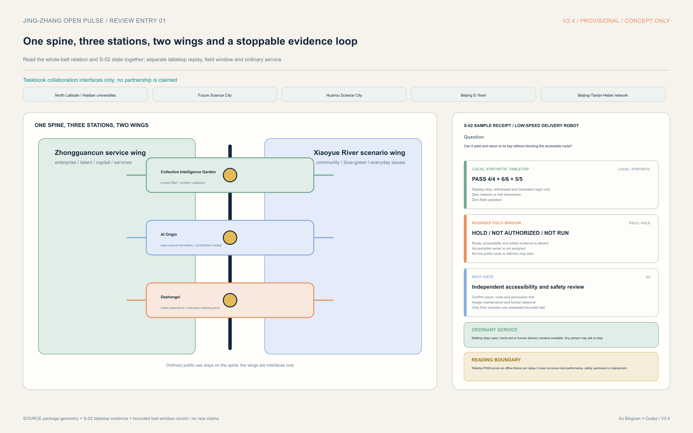
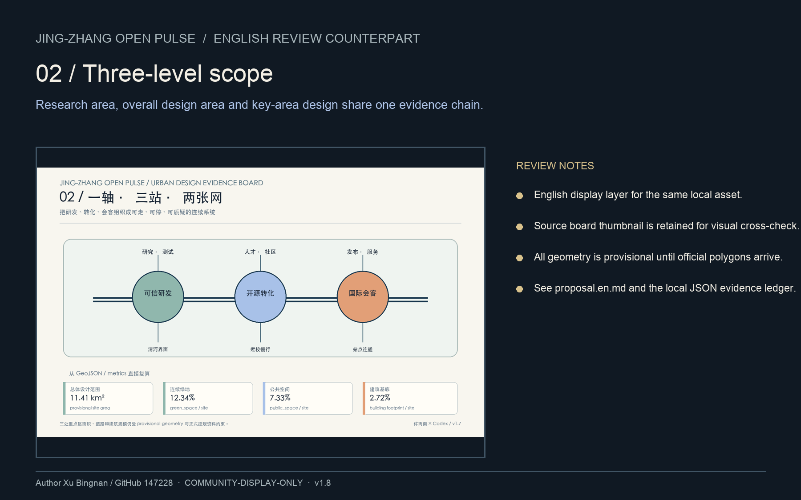
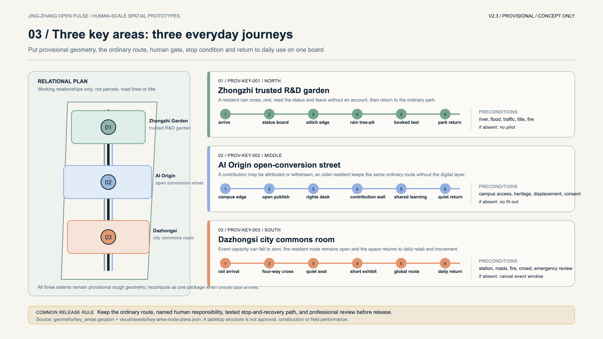
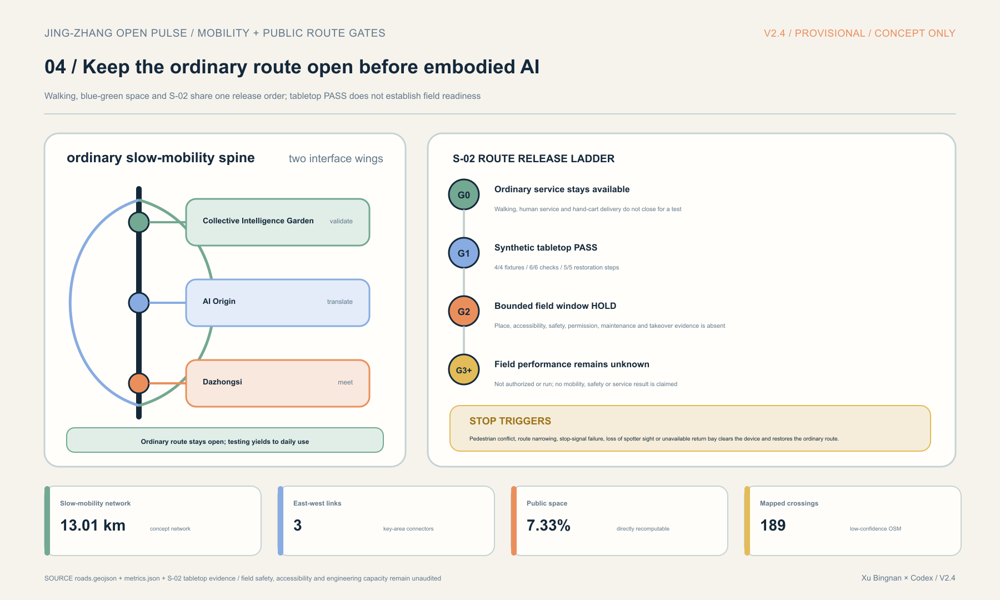
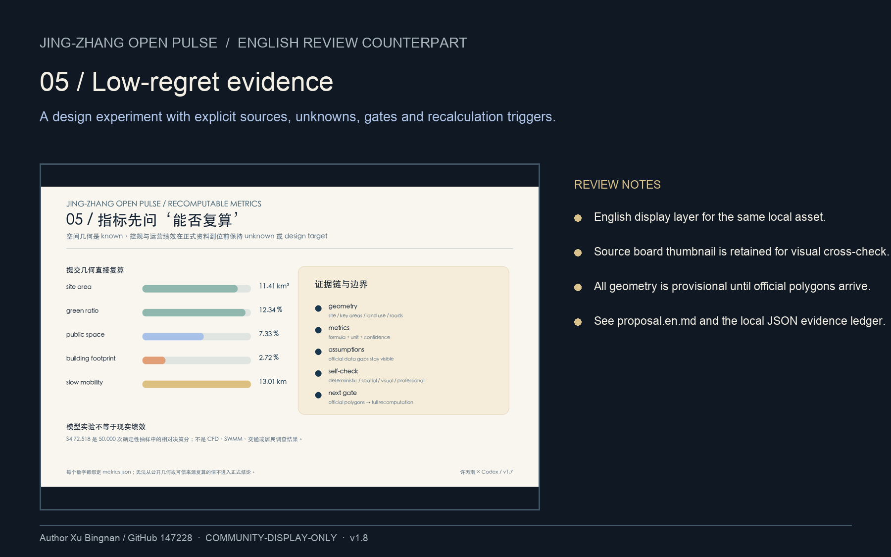
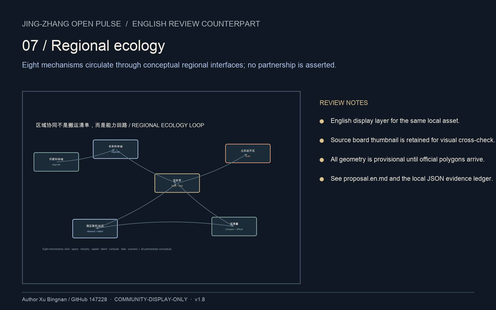
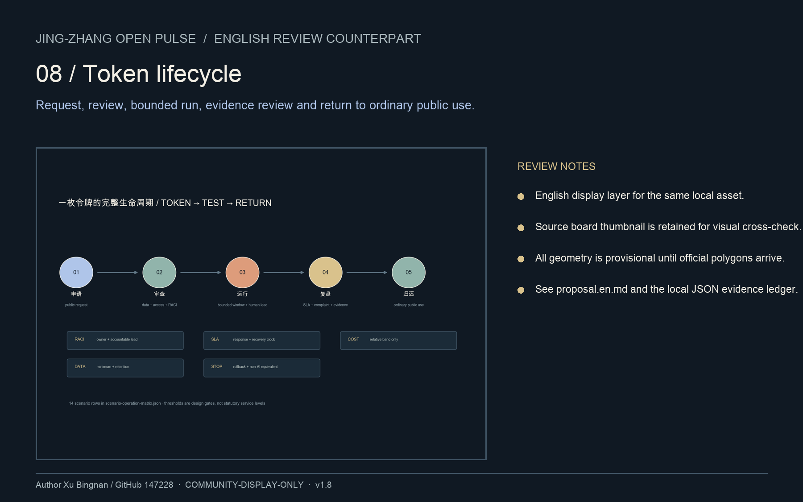
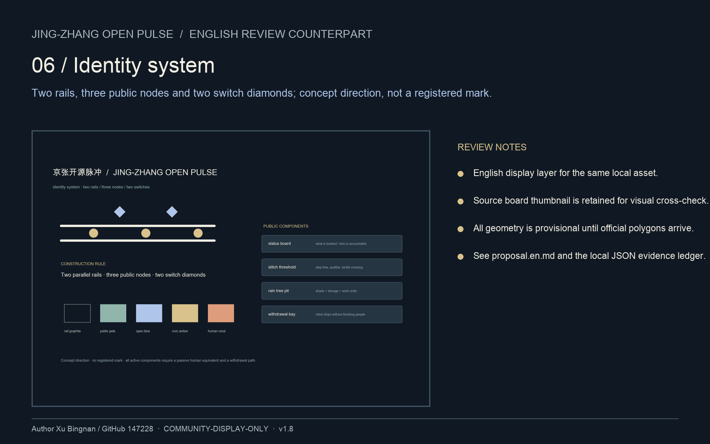

# Jing-Zhang Open Pulse: A Verifiable AI Innovation Public Belt

**Author:** Xu Bingnan / GitHub `147228`

**Review copy:** English translation of `proposal.md`, v2.4

**Status:** formal submission package; all new spatial interfaces remain provisional concepts until official polygons, professional safety review and community review are available.

## One-page reading: reconnect tests to everyday city life

This proposal does not turn the Jing-Zhang belt into a row of AI installations. It treats the heritage park as a public spine: Zhongzhi Garden supports trusted R&D, AI Origin supports open conversion, and Dazhongsi supports urban experience. The Zhongguancun service wing and Xiaoyuehe scenario wing connect enterprise services, community demand and blue-green systems to those three stations. Beiwei community, Future Science City, Huairou Science City, Beijing E-Town and the wider Beijing-Tianjin-Hebei network are taskbook interfaces only, not confirmed partnerships. [source:AGENT-TASKBOOK] [depth:overall_spatial_structure]

Every pilot follows one civic loop: question, authorise, test small, decide, issue a receipt, and retire. It cannot advance without an ordinary-service route, named human accountability, stop conditions and rights evidence. The current spatial layer remains provisional and must be recomputed when official data arrives; no partnership, land allocation, investment, approval or field performance is asserted. [source:AGENT-TASKBOOK] [data:geometry/site_boundary.geojson#SITE-001]

The first board separates the S-02 tabletop replay from the field window. The local synthetic tabletop repeats 4/4 fixtures, 6/6 checks and 5/5 restoration steps; that PASS applies only to the stop, withdrawal and restoration logic. The bounded field window remains on HOLD, is not authorised and has not run. Ordinary walking and human delivery stay available, and any person may ask to stop, until route, accessibility, safety, permission, maintenance and human-takeover evidence is complete. The replay record is `visual/assets/open-pulse-tabletop-evidence.json`; the field-window boundary is `visual/assets/example-s02-embodied-test-window.json`.

## Design Basis and Source List

This proposal follows the official open-call announcement, the repository site package and the agent taskbook. The machine-readable evidence chain is registered in `sources.json`, `standard_matrix.json`, `design_depth_matrix.json`, `compliance_matrix.json`, and `visual/assets/evidence-ledger.json`. The most important source IDs are `[source:OFFICIAL-ANNOUNCEMENT]`, `[source:AGENT-TASKBOOK]`, `[source:SITE-PACKAGE]`, `[source:SOURCE-REGISTRY]`, `[source:PROCESSED-FACT-PACK]`, `[source:BOUNDARY-SOURCE]`, and `[source:KEY-AREA-SOURCE]`.

The package uses the repository's maintained provisional geometry where official boundary polygons are not available. `geometry/site_boundary.geojson` and `geometry/key_areas.geojson` therefore remain `official_boundary=false` and `provisional_constraint`. They are suitable for design discussion, visualisation and self-checking, but not for a statutory red line, approval, precise land-area claim or government commitment. When official polygons arrive, all land use, roads, buildings, green space, public space, phasing and metrics must be recalculated.

## Three-Level Scope Framework

The proposal works at three linked scales: the 43.6 km² coordinated research area, the 11.4 km² overall design area around the Jing-Zhang heritage park, and the 368.4 ha detailed-design area containing three key areas. These figures are taskbook scope descriptors, not a claim that the current provisional polygons reproduce official measurements. The three levels are cross-referenced in `compliance_matrix.json` and `visual/assets/taskbook-crosswalk.json`.

The spatial idea is **one belt, three nodes, many scenes, and a blue-green walking loop**. “One belt” is a design method rather than a new legal boundary; the three nodes correspond to the three taskbook key areas; the loop joins slow movement, public space, water, shade and everyday services.

| Scale | Design question | Evidence and decision |
| --- | --- | --- |
| Coordinated research | How can knowledge, talent, compute, capital and public demand circulate? | Eight-mechanism regional loop; conceptual only. |
| Overall design | How do renewal, industry, transport, municipal systems and character fit together? | Linked geometry layers, metrics and phasing. |
| Key areas | How does each area become experienced, operated and reversible? | Node concepts, 14 scenario rows and component library. |

## Coordinated Research Area: Industry and Future City Research

The research-area strategy is a public-facing innovation chain: university and community demand → open collaboration → enterprise conversion → ordinary public experience → evidence and international exchange. It is not an assertion that any named institution has agreed to participate. The regional mechanism diagram makes the proposed interfaces inspectable: Haidian universities and communities originate questions; Huairou contributes upstream science; Future Science City contributes engineering and energy testing; Beijing E-Town contributes manufacturing and deployment; the Jing-Zhang belt provides bounded public test windows; the broader Beijing-Tianjin-Hebei network compares and diffuses results.

The eight mechanisms are **land, space, industry, capital, talent, compute, data and scenario**. Each mechanism has an inbound need, an outbound return and an accountable future operator in `visual/assets/regional-ecosystem.json`. No partnership, funding, land allocation, or government commitment is asserted. The regional return loop is: originate → engineer → book → test → publish evidence → scale or retire.

To satisfy the taskbook's request for 5–8 AI ecosystem cases, `visual/assets/case-mechanism-matrix.json` separates six officially sourced public examples from six transferable patterns. The examples answer what policy or enterprise-development mechanism the official page makes visible; they do not transfer foreign performance, law or partnership claims to Haidian:

| Case | Policy / enterprise mechanism | Jing-Zhang interface | Do-not-copy boundary |
| --- | --- | --- | --- |
| Helsinki AI Register | Public inventory, detail pages and feedback route for city AI systems | Pilot card states purpose, data boundary, accountable lead, state and complaint route | A register does not replace safety, accessibility, procurement or consent review [source:CASE-HELSINKI-AI-REGISTER] |
| Amsterdam Algorithm Register | Plain-language explanation of what municipal algorithms are used for | Preflight record links purpose to review, stop and redress paths | Not Chinese legal compliance [source:CASE-AMSTERDAM-ALGORITHM-REGISTER] |
| Singapore AI Verify | Standardised AI testing, open-source collaboration and assurance sandbox | Booked, human-led test window for startups with model card and rollback record | Not certification, procurement approval or permission to test residents [source:CASE-SINGAPORE-AI-VERIFY] |
| Decidim Barcelona | Traceable digital and face-to-face participation infrastructure | Contribution wall plus paper, walk-in and multilingual routes; publish what changed | Digital participation cannot replace access for people without accounts or devices [source:CASE-DECIDIM-BARCELONA] |
| UK ATRS | Standardised public record of why and how algorithmic tools are used | Record purpose, owner, data, human review, alternatives, limits, incidents and update | Not a Beijing statutory requirement; local legal and procurement review remains necessary [source:CASE-UK-ATRS] |
| Seoul AI Foundation | Institutional capacity linking research, public service, talent and global exchange | Named interface among research, enterprise service, public testing and exchange | No Seoul partnership, funding or Jing-Zhang mandate is implied [source:CASE-SEOUL-AI-FOUNDATION] |

The policy and enterprise-development interface is recorded separately in `visual/assets/case-policy-enterprise-crosswalk.json`: every case is linked to a policy tool, an enterprise question, a local scenario, acceptance evidence and a do-not-copy boundary. `visual/assets/policy-enterprise-playbook.json` turns that interface into executable growth-stage cards, beginning with a public AI register and feedback card. `visual/assets/industry-validation-cases.json` adds three bounded validation windows for model safety, enterprise-service data governance and low-speed embodied AI. `visual/assets/landmark-honor-crosswalk.json` connects responsibility desks, contribution archives and safety-governance markers to the policy and enterprise interfaces. The six design patterns remain in the `rows` array, while sources, access dates and use boundaries are recorded in `sources.json`.

## Overall Design Area: Urban Renewal and Regulatory-Plan-Level Urban Design

The overall design uses a renewal-first structure. Low-efficiency spaces are not assigned invented floor-area ratios or heights; instead, they receive a retain–renovate–demolish decision gate and a requirement for later official-control confirmation. The geometry package expresses land use, building footprints, roads, green space, public space and phasing, while `metrics.json` reports what can be recomputed from those layers.

Transport and municipal systems are designed as a continuous human network: rail-station interfaces, step-free crossings, low-speed logistics windows, cycle parking, emergency access, rainwater tree pits, shade, drainage maintenance and ordinary public use. AI may assist observation or scheduling, but a resident must still be able to walk, ask, complain, receive service and leave without an app, account or biometric identification.

## Detailed Design of Key Areas

**Zhongzhi Garden: autonomous-innovation accelerator**

Zhongzhi Garden is a garden-like full-stack innovation district. Its public edge displays safety cases, standards work and low-carbon computing rather than turning the park into a private campus. A “stitch threshold” creates a step-free, audible and tactile crossing; a status board shows the current test window, accountable operator, stop condition and non-AI equivalent.

**Beijing AI Origin Community**

The Origin Community is a near-campus conversion and talent neighbourhood. The design stitches campus, park, enterprise and residential routes; creates an open publishing room; and reserves ordinary living, rest and care spaces. Results are presented as cleared models, diagrams and explainers, not as unlicensed historical or corporate imagery.

**Dazhongsi AI industry cluster**

Dazhongsi is an urban, internationally legible AI service and enterprise district. The station interface, four-quadrant pedestrian connections and retail/service edges are treated as one public sequence. Intelligent-device demonstrations are bounded by capacity, fire safety, resident access and a thirty-minute return-to-normal rule after an event.

Each key-area polygon is provisional and each node proposal is a concept for professional refinement. The node-level decision record is mapped to `[data:geometry/key_areas.geojson#PROV-KEY-001]`, `#PROV-KEY-002`, and `#PROV-KEY-003`.

The board reads each node as an ordinary errand rather than a coloured box: a resident can read the status, cross Zhongzhi and return to the park without an account; an older resident keeps the same everyday route through AI Origin without using a digital service; and Dazhongsi retains its crossing, quiet seat and daily retail even when an event is cancelled. Each journey names human responsibility, a stop condition and a recovery action. If river, flood, traffic, title, fire, campus, heritage, displacement, rail, crowd or emergency-review gates are not met, the pilot does not open or the event window is cancelled. The board is derived from `geometry/key_areas.geojson` and `visual/assets/key-area-node-plans.json`; all three extents remain provisional rough geometry, not official parcels, road lines, title or approval.

## AI Innovation Ecosystem, Personas, and AI+ Scenarios

The city is designed for more than one “AI user”. Personas include a university researcher, an SME founder, a community service worker, an older resident or carer, a visitor, a night-shift worker, an accessibility reviewer and a maintenance crew. Every persona has a non-digital fallback, a place to rest, a right to opt out and a visible complaint path.

The package contains 14 scenario cards in `visual/assets/scenario-operation-matrix.json`. They cover walking-gap diagnosis, low-speed delivery robots, autonomous-mobility assistance, model red-teaming, open publishing, Jing-Zhang cultural wayfinding, health-service navigation, enterprise service, data-governance demonstrations, intelligent retail, public-safety review, an international AI week walk, rainwater/tree-pit maintenance, and a low-light quiet chain.

The matrix is a design-control instrument, not a promise of service levels. Every row states: spatial carrier, trigger, minimum data, RACI, response/recovery SLA, relative cost band, data retention, non-AI equivalent, stop condition, success metric and phase. The universal gates are: no digital precondition; human review cannot be removed; an accessible route remains continuous; a public status and complaint path exists; and stop/rollback has been tested.

To make a scenario card reproducible rather than merely readable, this package adds `visual/assets/open-pulse-relay-receipt.schema.json` and `visual/assets/example-s02-embodied-receipt.json`. The latter is a fully synthetic S02 low-speed-delivery sandbox receipt: it puts the provisional road reference, no-app human alternative, minimum fields, visible stop and human spotter, rights/appeal/deletion rules, maintenance responsibility and exit-asset plan in one record. `performance_results` remains `null`; the receipt format is not robot performance or field acceptance. Any real pilot must issue a new receipt and pass accessibility, safety, maintenance and public-review gates.

**Three industry validation windows: evidence before procurement or scale-up**

To connect policy tools to enterprise development rather than leave them as case summaries, `visual/assets/industry-validation-cases.json` defines three reversible validation windows. They are conceptual test protocols for organisers, suppliers and public-service teams—not procurement approvals, deployment facts, investment commitments or evidence of local-company performance. Each window couples an enterprise question with a policy interface, acceptance evidence, a stop condition and a non-AI equivalent:

| Validation window | Enterprise-development question | Policy interface | Acceptance and stop gate |
| --- | --- | --- | --- |
| Model safety and transparency | Can a startup or supplier show reproducible safety, provenance, human review and rollback evidence before expansion? | Pre-procurement assurance record: model/data boundary, red-team result, accountable reviewer, non-AI route and stop decision | Two independent reviewers reproduce the test note; unclear rights, no human reviewer or failed takeover drill stops the window. S04 / Zhongzhi Garden. |
| Enterprise service and data-governance compliance | Can an enterprise-service team shorten a public process without exposing unauthorised data or turning an AI answer into a binding decision? | Service preflight record: public source, authorised documents, human decision owner, correction path, retention and manual-counter equivalent | AI-assisted and manual routes both work and material answers have sources and a correction route; unverifiable documents, privacy spill, discriminatory routing or no manual counter stops the window. S08/S09 / Origin–Dazhongsi. |
| Low-speed embodied-AI safety and operations | Can a robot or embodied-AI supplier demonstrate safe coexistence with an accessible public route before scale-up or procurement? | Public test permit: route, speed/priority rule, emergency stop, human takeover, incident log, privacy boundary, maintenance owner and withdrawal trigger | A staffed drill completes stop, takeover, route clearance and return to ordinary use; blocked accessibility, a severe near miss or overdue maintenance stops the window. S02/S03 / Zhongzhi–Jing-Zhang park edge. |

All three windows start small, staffed and reviewable, then decide whether to scale, redesign or retire. “Success” means that acceptance evidence is complete; it does not mean product effectiveness, investment return or government procurement has been established. `[source:AGENT-TASKBOOK]`

**Cultural narrative, markers and long-term operations**

The cultural narrative uses engineering proof, open collaboration and public reciprocity as a three-part experience. Four non-glitzy public markers are proposed: the **Century Engineering Questions Wall**, the **Open-Source Contribution Archive**, the **Urban Agent Responsibility Desk**, and the **Enterprise Safety-Governance Responsibility Desk**. Their policy and enterprise value, acceptance tests, spatial links and clearance boundaries are recorded in `visual/assets/landmark-honor-crosswalk.json`. These are conceptual nodes for heritage, public-art, management and rights review, not institutional endorsements or advertising sites.

**Node-level concepts and public-interest audit**

`visual/assets/key-area-node-plans.json` makes the three key areas reviewable as sequences rather than slogans: arrival → status board → component → bounded operation → return to ordinary public use. Each node has components, an acceptance test and a professional gate for official parcels, ownership, roads, fire, ecology, heritage, drainage and municipal systems. It is a provisional concept for professional refinement, not an official parcel or construction drawing.

`visual/assets/public-interest-audit.json` deliberately leaves the baseline unknown until a survey is run. Older residents, disabled people, carers, night workers, children and guardians, visitors, small businesses and maintenance crews are named as participants. The audit tests step-free continuity, service without an app, complaint response, group differences and night light/noise. Participation has paper, staffed and multilingual channels; conflict resolution pauses the scenario, shows the disputed evidence, offers a non-AI equivalent and publishes remedy or withdrawal.

## Land Use, Building Scale, and Retain-Renovate-Demolish Strategy

The proposal avoids false precision. Building scale is expressed as a design relationship—heritage line, public node, quiet edge, enterprise interface and service courtyard—until official height, FAR, heritage and municipal constraints are supplied. Each future project must record whether an existing building is retained, renovated or removed, the reason, embodied-carbon implication, displacement risk, temporary public route and maintenance owner.

## Transport, Rail, Municipal Infrastructure, and Public Services

The rail corridor is treated as a civic seam rather than a barrier. The design prioritises safe crossings, legible station approaches, cycle and wheelchair continuity, emergency access and low-speed delivery windows. Drainage is a visible operating system: rainwater tree pits, inlet inspections, post-storm work orders and no-device-dependent overflow paths are paired with any future sensing.

Public services are human-first. Health navigation is non-diagnostic; enterprise service uses authorised materials and human review; data demonstrations stay in a sandbox; and a network outage switches to printed guidance, staffed counters and ordinary public operations.

## Urban Resilience, Embodied Intelligence, and Lifecycle Iteration v1.3

The proposal treats climate, public space, people, machines and assets as one operating problem. Heat, extreme rain, drought, air quality, drainage, accessibility, night comfort, embodied intelligence, utilities, materials and maintenance are assessed together, while every claim remains bounded by the current provisional geometry and missing field data.

### 1. Choose the option with the least regret, not the highest single score

Five design prototypes are compared under eleven indicators, five stakeholder weight profiles and eight stress conditions. S4 balanced adaptation has the highest current win rate and the lowest average regret. Its 72.518 robust mean, 70.252 fifth-percentile score and 67.194 worst stress result describe a model choice, not field performance. The result supports a cautious, cross-group option; it does not prove that every dimension is excellent. [assumption:A-RESILIENCE-MCDA-001] [metric:resilience_v13_candidate_count] [metric:resilience_v13_monte_carlo_draws] [metric:resilience_v13_selected_mean_score] [metric:resilience_v13_selected_p05_score] [metric:resilience_v13_selected_win_rate] [metric:resilience_v13_selected_mean_regret] [metric:resilience_v13_selected_min_stress_score] [metric:resilience_v13_hard_gates_passed]

### 2. The S4 balanced-adaptation spatial operating system

S4 gives priority to passive shade, drainage that can be inspected and repaired, continuous accessible routes, human takeover, privacy, ecological night conditions and asset records. A sensor, robot, light, tree pit or public-space component must retain a physical fallback when its digital layer fails. Weather and drainage values remain design inputs until calibrated local measurements, geometry and professional review are available. [source:BEIJING-VENTILATION-NETWORK-2035] [source:HAIDIAN-SPONGE-CITY-PLAN] [source:BEIJING-ACCESSIBILITY-REGULATION] [source:BEIJING-EMBODIED-INTELLIGENCE-2025-2027] [source:ASSET-MANAGEMENT-GBT33172] [assumption:A-CLIMATE-STRESS-001] [assumption:A-HUMAN-EXPERIENCE-001] [assumption:A-EMBODIED-AI-SAFETY-001] [assumption:A-LIFECYCLE-MAINTENANCE-001] [assumption:A-BIODIVERSITY-LIGHT-001]

### 2.1 Cultural boundary and engineering translation of cang feng ju qi / feng shui

The expressions cang feng ju qi and feng shui are used only as cultural landscape narratives connected to railway memory and place names. They do not establish medical, public-health, air-quality, hydrological, engineering or approval claims. Any later health or comfort discussion must be separated into wind, pollution, heat, shade, blue-green access and water-risk indicators. Their current status is pending formal data. [assumption:A-AIR-WIND-001] [assumption:A-DRAINAGE-SYSTEM-001] [source:LIU-URBAN-VENTILATION-2017]

The wind-health validation plan, field protocol and point register define geometry versions, sampling, calibration, field safety, professional responsibility and stop conditions. The 18 planning slots are not measurements. Data routes for climate normals, the Haidian monitoring network and Qinghe Station are acquisition leads only, not substitutes for three-key-area observations or CFD calibration.

### 3. Differential stress tests for the three key areas

Zhongzhi Garden tests the Qinghe edge, drainage, winter slip risk, embodied-intelligence failure and data safety before public display. AI Origin prioritises shade, quiet learning, walking and cycling, and everyday service, with robots kept away from the accessible route. Dazhongsi prioritises the four-quadrant station crossing, stormwater, event crowds, deliveries, night noise and return to ordinary use. Alerts reduce activity, clear low points, stop autonomous movement or pause the pilot when the relevant gate fails. [source:BEIJING-METEOROLOGICAL-OPEN-DATA] [source:BEIJING-FLOOD-PLAN-2021-2025] [source:BEIJING-WATER-REPORT-2024] [source:BEIJING-ROAD-MAINTENANCE-2026] [source:BEIJING-BIRD-BIODIVERSITY-2024] [source:BEIJING-LIGHTING-GUIDE-2025] [source:WHO-URBAN-HEALTH-AND-GREEN] [source:IPCC-AR6-URBAN-RISK] [source:NIST-HUMAN-CENTERED-AI] [source:UN-HABITAT-PEOPLE-CENTRED-SMART-CITIES] [source:BEIJING-WALK-CYCLE-DB11-1761] [source:ISO-13482-SERVICE-ROBOT-SAFETY] [source:ISO-55001-2024]

### A stricter Monte Carlo robustness check

The 50,000 deterministic draws use seed 147228 and explicit uncertainty in weights and indicator responses. The next improvement is clear from the result: increase passive shade and repairable storage, reduce sensor dependence, improve offline operation and human takeover, separate event capacity from quiet space, and standardise spare parts. The climate, drainage, embodied-intelligence, asset and rights inputs must be replaced with local professional evidence before implementation. [source:RESILIENT-CITY-INFRASTRUCTURE-2024] [source:BEIJING-VENTILATION-NETWORK-2035] [source:SERVICE-ROBOT-INFOSEC-GB45502] [assumption:A-METEOROLOGICAL-DATA-001]

## v1.5 Full-state city operating system: from renderings to reversible everyday experience

The v1.5 layer converts the model threshold into 97 atomic evidence records. Each record names an input, formula, human review, accountable owner and stop condition. Four states are kept separate: known, design target, unknown and blocked. A failed accessible route, drainage fallback, emergency stop, privacy boundary or maintenance duty switches the service to human operation and stops expansion. The package storyboard follows wind and shade, rainwater, station priority, network outage, manual takeover, maintenance and resident review. These are review protocols, not field performance or implementation evidence. [data:visual/assets/evidence-ledger.json#climate-risk-baseline] [data:visual/assets/evidence-ledger.json#cfd-validation] [data:visual/assets/evidence-ledger.json#commitment-register] [data:visual/assets/evidence-ledger.json#film-storyboard] [metric:resilience_v13_selected_mean_score] [source:NIST-HUMAN-CENTERED-AI] [source:ISO-13482-SERVICE-ROBOT-SAFETY] [source:BEIJING-FLOOD-PLAN-2021-2025] [source:BEIJING-WATER-REPORT-2024] [source:ISO-55001-2024] [source:WHO-URBAN-HEALTH-AND-GREEN] [source:BEIJING-ACCESSIBILITY-REGULATION]

## Blue-Green Network, Public Space, and Urban Character

The blue-green loop is a climate adaptation and social infrastructure, not a decorative green ribbon. Shade, quiet seats, permeable edges, rainwater storage, low-glare lighting and accessible routes are designed together. A component can fail digitally without failing physically: the rainwater tree pit still drains, the tactile route still works, and the seat remains a seat.

The identity system is **two parallel rails, three open nodes and two switch diamonds**. It turns the railway memory into a contemporary public grammar without using un-cleared historical images. The palette and wayfinding rules, including high contrast, tactile and audible alternatives, are machine-readable in `visual/assets/identity-system.json`.

This iteration also makes the identity direction inspectable as a vector mark in `assets/identity/open-pulse-mark.svg`: two parallel rails, three open nodes, two switch diamonds and bilingual naming remain legible at different scales. It is a concept asset authored by Xu Bingnan / Codex, not a registered trademark, government emblem or finished VI system; trademark, font, accessibility and public-communications review remain required before use.

## Renewal Projects, Implementation Policy, and Phasing

Implementation is a sequence of reversible windows rather than a one-off technology launch:

1. **Read and prepare:** confirm official polygons, survey accessibility, drainage and heritage; publish the rights ledger and baseline.
2. **Pilot and learn:** open low-risk public-space components and two or three bounded scenarios with a staffed operator.
3. **Connect:** add the regional return loop, enterprise and research interfaces only after the stop gates pass.
4. **Scale or retire:** publish evidence, compare equity and climate outcomes, and either expand, redesign or remove the intervention.

The `scenario-operation-matrix.json` uses relative `low`, `medium` and `high` cost bands only; they are not budgets or procurement estimates. RACI and SLA fields identify the future owner needed for a formal implementation plan. If a responsible operator, safety case, rights record, drainage check or non-AI equivalent is missing, the scenario cannot advance.

## Metrics, Area Recalculation, and Compliance Matrix

The current quantitative decision experiment compares baseline, adaptive, regenerative and stress states. The adaptive state has a model score of 97.39 with a minimum dimension of 91.14; the regenerative state is 97.26, baseline 95.86, and stress 91.78. These are design decision scores from the package model, not official statistics, a field measurement or a competition ranking. The historical 2023 index is 97.58 in the same model frame.

The preferred indicators are district income per capita, district GDP per capita and district health institutions per 10,000 people, with green coverage, physicians, wastewater treatment and water intensity as guardrails. Every number must be read with its source, year, unit, scope and limitation in `visual/assets/evidence-ledger.json`, `visual/assets/model-backtest.json`, `visual/assets/indicator-selection.json` and `metrics.json`.

Once official polygons replace the provisional geometry, the package must rerun area, ratios, key-area counts, accessible-route checks, blue-green continuity, drainage interfaces, land-use coverage and phasing. A passing self-check is evidence of package integrity, not evidence that a provisional concept is legally approved.

## Risk, Copyright, and Compliance

The package includes a path-level `visual/assets/copyright-ledger.json` and an expanded `report/copyright_statement.md`. Text, geometry, diagrams, offline HTML and figures are authored or derived in this worktree by Xu Bingnan / Codex. Official public data retain their source attribution. No third-party images, maps or remote runtime assets are embedded; local system fonts are used only for rendering and are not redistributed. The identity mark is a concept direction, not a registered trademark.

The rights ledger records authorship, source inputs, license scope, hashes and review limits for each asset. It is not a legal opinion. Any future team member adding an image, font, map, logo, data extract or event content must add a source, permission and hash before publication. Historical interpretation is expressed with text and self-generated diagrams unless a rights-cleared source is explicitly registered.

Public-interest checks cover accessibility, older residents, carers, night workers, privacy, conflict resolution and ordinary non-AI access. The package rejects facial recognition and individual trajectory retention for these scenarios. The stop condition is part of the design, not an afterthought: a failed safety, rights, drainage, access or resident-impact gate triggers human operation or withdrawal.

### The spatial commitment: verifiable publicness over an AI installation show

Open Pulse uses the heritage park as a public base, the three key areas as innovation anchors and auditable scenario windows as its operating method. The identity direction uses two parallel lines, three open nodes and accessible alternatives. It is a concept system that must still pass trademark, font, accessibility, public-communications and professional review. [source:AGENT-TASKBOOK] [data:geometry/roads.geojson#ROAD-001] [depth:overall_spatial_structure] [metric:green_ratio]

### Refinement actions for the three key areas

Zhongzhi Garden becomes a visible but controlled research garden, AI Origin a near-campus open conversion district, and Dazhongsi a station-facing public meeting room. Each action preserves ordinary routes, names the professional inputs still missing and keeps parcels, ownership, transport, fire, heritage, drainage and public-space decisions provisional until verified. [data:geometry/key_areas.geojson#PROV-KEY-001] [data:geometry/key_areas.geojson#PROV-KEY-002] [data:geometry/key_areas.geojson#PROV-KEY-003] [depth:three_key_area_detailed_design] [depth:retain_renovate_demolish] [depth:traffic_rail_slow_parking]

### Ten scenario cards and governance boundaries

The ten public-facing cards cover open publishing, safety evaluation, accessible-mobility diagnosis, low-carbon edge computing, campus-enterprise conversion, non-diagnostic health navigation, AI learning, public procedures, data-governance demonstration and a global AI week route. They are concept proposals with no individual tracking, no unlicensed material and a staffed alternative. [source:AGENT-TASKBOOK] [depth:risk_missing_data]

### Three industry validation windows: evidence before procurement or scale-up

The three windows cover model safety, enterprise service and data governance, and low-speed embodied intelligence. Each one connects an enterprise question to a policy record, acceptance evidence, a stop condition and a non-AI equivalent. A complete test record does not establish product effectiveness, investment return, procurement or local-company performance. [metric:user_persona_count] [source:AGENT-TASKBOOK] [depth:risk_missing_data]

### Cultural narrative, landmarks and long-term operations

The cultural experience links engineering questions, open contributions and public responsibility. Four proposed markers are the Century Engineering Questions Wall, Open-Source Contribution Archive, Urban Agent Responsibility Desk and Enterprise Safety-Governance Responsibility Desk. Seasonal operation can collect questions, open small scenarios, hold a developer week and publish evidence reviews, but these remain concepts pending permissions, funding, rights clearance, safety and operating owners. [metric:ai_landmark_count] [source:AGENT-TASKBOOK] [data:geometry/public_space.geojson#PUBLIC-001] [depth:phasing_implementation]

## v1.6 Official Statistical Time Series and Low-Regret Design

The v1.6 time-series section is retained in the Chinese source document and its machine-readable assets. It records the official statistical source boundary, the 2023 baseline frame and the four scenario comparison. It does not turn modeled outcomes into official forecasts. Readers should use the time-series figure and ledger to inspect source years, transformations, missing values and guardrails.

## v1.7 Top-Rank Repair: From Concept to Reviewable Deliverables

This iteration directly repairs review gaps found in high-scoring repository submissions and the repository's detailed validator feedback:

- `visual/assets/taskbook-crosswalk.json` gives every agent.1–agent.6 requirement one unique section, artifact and acceptance test.
- `visual/assets/regional-ecosystem.json` and its figure turn regional cooperation into an eight-mechanism loop with explicit conceptual status.
- `visual/assets/scenario-operation-matrix.json` turns 14 scenes into spatial, operational and rollback records with RACI, SLA, cost bands and non-AI equivalents.
- `visual/assets/component-library.json` gives eight physical, legible and maintainable public-space components.
- `visual/assets/identity-system.json` and the identity figure provide a real, inspectable identity and wayfinding grammar.
- `visual/assets/copyright-ledger.json` makes authorship, sources, licenses, hashes and future-clearance duties auditable.
- `visual/assets/case-mechanism-matrix.json`, `visual/assets/case-policy-enterprise-crosswalk.json`, `key-area-node-plans.json` and `public-interest-audit.json` close the case-comparison, policy-tool, enterprise-interface, node-level and participation/equity evidence gaps without inventing a baseline or partnership.
- `proposal.md`, this English translation, two offline report pages, the offline visual index and `changelog.md` keep the bilingual review surface aligned.

These are reviewable design deliverables, not claims that a project has been commissioned. Their value is that a reviewer can find the requirement, inspect the evidence, test the stop gate and identify what must be confirmed before implementation.

The local review-surface record is `visual/assets/qa-readiness.json`. It records semantic HTML tables, locally linked bilingual figures and A3/A0 outputs, the offline-only runtime boundary, and the known limits that provisional geometry and unknown field baselines still require professional and public review.

### 1. Taskbook unique index and regional collaboration

`visual/assets/taskbook-crosswalk.json` gives every agent.1 through agent.6 requirement one section, artifact and acceptance test. Regional collaboration is described as an eight-part capability loop covering land, space, industry, capital, talent, compute, data and scenario. Haidian universities and communities originate questions, science and engineering partners contribute bounded inputs, and the Jing-Zhang belt hosts public, reversible tests. Every relationship remains a conceptual suggestion rather than a partnership or implementation commitment. [source:AGENT-TASKBOOK] [standard:PROJECT-AGENT-OPEN-CALL-TASKBOOK] [source:PROJECT-SCOPE-SUMMARY]

### 2. Fourteen scenario–space–operations matrix

`visual/assets/scenario-operation-matrix.json` expands the ten public cards into fourteen rows. Each row has a spatial carrier, trigger, minimum data, RACI, response and recovery SLA, relative cost band, retention rule, non-AI equivalent, success metric and stop condition. The acceptance language is a design contract for future operators, not a statutory service level. [metric:policy_enterprise_playbook_card_count] [metric:industry_validation_case_count] [metric:scenario_card_count] [source:AGENT-TASK-REQUIREMENTS] [source:SOURCE-USE-MATRIX]

### 3.1 Node-level concept plan and public-interest audit

`visual/assets/key-area-node-plans.json` reads each key area as arrival, public status, component, bounded operation and return to ordinary public use. `visual/assets/public-interest-audit.json` keeps the baseline open until paired walks, staffed tests, stratified listening and public status review are completed. Paper, staffed and multilingual routes remain available, and a conflict pauses the scenario while a non-AI equivalent is offered. [data:geometry/key_areas.geojson#PROV-KEY-001] [data:geometry/key_areas.geojson#PROV-KEY-002] [data:geometry/key_areas.geojson#PROV-KEY-003] [depth:three_key_area_detailed_design] [depth:existing_conditions_diagnosis]

### 3. Identity system, public-space components, and embodied intelligence

The identity grammar uses two parallel rails, three open nodes and two switch diamonds. Eight physical components support status, access, shade, drainage, quiet, contribution and reversible stopping. They must continue to serve people without sensors or robots, and any embodied-intelligence window requires visible emergency stop, human takeover, privacy boundaries and maintenance ownership. This is a concept asset, not a product certification, construction drawing or procurement commitment. [source:BEIJING-EMBODIED-INTELLIGENCE-2025-2027] [source:SERVICE-ROBOT-INFOSEC-GB45502] [source:ISO-TR-4448-PUBLIC-MOBILE-ROBOTS] [assumption:A-EMBODIED-AI-SAFETY-001]

### 4. Copyright, privacy, and public-interest rights clearance

`visual/assets/copyright-ledger.json` records each path, author, input, third-party material, licence, attribution, font treatment and SHA-256. Public scenarios reject facial recognition and individual trajectory retention. Medical navigation remains non-diagnostic, data demonstrations stay in a sandbox, and every public status board has an ordinary human alternative. The ledger supports review and is not a legal opinion. [source:SITE-PACKAGE] [source:SOURCE-REGISTRY] [standard:MOHURD-ARCH-DESIGN-DEPTH-2016]

### 5. Bilingual review and version verification

The English companion, offline report, visual index and A3/A0 outputs are intended to describe the same proposal. Figures, metrics, spatial references and evidence markers must remain paired, and the English version must not introduce legal facts or partnerships absent from the Chinese source. The manifest records the package files and hashes; the local QA record keeps provisional geometry, unknown baselines and offline-only runtime limits visible. [source:MISSING-DATA-CHECKLIST] [depth:risk_missing_data]

## v1.8 Reviewer-Visible Evidence Layer: One-Page Readback of Position, Functions, Nodes, and Publicness

The v1.8 revision places the highest-impact taskbook evidence directly in `proposal.md` so a reviewer can audit it without opening every JSON attachment. The following crosswalk is an exact reading of the taskbook, not a new statutory claim.

### 1. Hard mapping of three positions, five functions, three areas and two wings

The package maps the century-old Jing-Zhang culture belt, the urban AI life-experience belt and the AI-integrated innovation belt to the same identity, public-service and evidence system. It maps five functions to trusted testing, open conversion, fourteen bounded scenarios, a public station sequence and transparent governance. AI Origin Community, Zhongzhi Garden and Dazhongsi remain the three conceptual areas; the Zhongguancun and Xiaoyuehe wings remain conceptual interfaces. [source:AGENT-TASKBOOK] [standard:PROJECT-AGENT-OPEN-CALL-TASKBOOK] [depth:overall_spatial_structure]

| Taskbook layer | Jing-Zhang answer | Reviewable proof |
| --- | --- | --- |
| Three positions | Century Jing-Zhang culture belt; urban AI life-experience belt; AI-integrated innovation belt | Two-rail identity, no-app service, research → public test → evidence loop |
| Five functions | Full-stack autonomy; world-class ecosystem; AI+ scene paradigm; intelligent active city; global AI-governance voice | Zhongzhi Garden test gate, Origin open room, 14 scenarios, Dazhongsi public sequence, red-team and responsibility desk |
| Three areas / two wings | AI Origin Community; Zhongzhi Garden; Dazhongsi; Zhongguancun technology-service wing; Xiaoyuehe scene-empowerment wing | Provisional key-area geometry, node plans, regional ecology, blue-green and operations records |

The regional chain explicitly includes the **Beijing North Latitude Community / Haidian universities and institutes**, Huairou Science City, Future Science City, Beijing E-Town and the Beijing-Tianjin-Hebei network. Each interface has an input, an output, a future owner and evidence required before activation. All are conceptual suggestions; no partnership, funding, land allocation or government commitment is asserted.

### 2. Regional collaboration as a responsibility chain, not a list

Each regional interface names an input, a Jing-Zhang return, a future owner and evidence required before activation. The feasible unit is one public question, one booked token window, one accountable person, one published review and one decision to scale, redesign or retire. No land supply, investment, recruitment, data sharing or government commitment is asserted. [source:AGENT-TASKBOOK]

### 3. Node-level plans for the three key areas

| Node | Human sequence | Embodied-intelligence boundary | Gate and acceptance test |
| --- | --- | --- | --- |
| Zhongzhi Garden | arrival → status board → stitch threshold → rain tree pit → booked test → park return | low-speed, booked window; visible emergency stop; never blocks the accessible chain | river/flood/traffic/ownership/fire review; a resident crosses, reads and leaves without an account |
| AI Origin Community | campus edge → open room → rights desk → contribution wall → learning → quiet residential edge | contributions can be attributed or withdrawn; data stays in a sandbox | parcel/heritage/displacement review; an older resident can use the route and service offline |
| Dazhongsi | rail arrival → four-quadrant crossing → quiet seat → short exhibition → international route → daily retail | event capacity can fall to zero; public broadcast and withdrawal bay remain visible | station/road/fire/crowd review; the route remains open and the space returns to ordinary use |

The 14-row matrix gives every scenario a spatial carrier, trigger, minimum data, RACI, response/recovery SLA, relative cost band, retention, non-AI equivalent and stop condition. In review shorthand: the walking and accessibility group pauses on a broken route; robot testing exits on a serious conflict or failed stop; red-team testing rejects unclear provenance; public publishing removes uncleared material; health navigation never diagnoses; events reduce to zero if fire, quiet or resident-access gates fail; rain and quiet-chain pilots freeze on overdue drains or threshold breaches.

### 4. Fourteen scenarios and their minimum operating contract

The fourteen-row matrix assigns each scenario a space, trigger, minimum data, responsible roles, response and recovery time, retention rule, non-AI equivalent, success measure and stop condition. A broken accessible route, failed emergency stop, unclear provenance, missing human counter, overdue drainage work order or excessive event impact pauses the relevant window. These are design contracts for future operators, not legal service standards. [source:AGENT-TASKBOOK] [source:BEIJING-ACCESSIBILITY-REGULATION] [depth:traffic_rail_slow_parking] [depth:municipal_new_infrastructure]

### 5. Public interest, participation, and equity: measure before promising

The baseline is deliberately **unknown until surveyed**. Older residents, disabled people, carers, night workers, children and guardians, visitors, small businesses and maintenance crews are named participants. Step-free continuity, service without an app, complaint response, group differences and night light/noise are audited through paired walks, staffed tests, stratified listening and public status boards. A conflict pauses the scenario, shows the disputed evidence, offers a non-AI equivalent and publishes remedy or withdrawal.

The case file compares six mechanism patterns—station-as-public-room, bounded living lab, blue-green service street, developer commons, quiet night network and heritage-as-method—rather than inventing international project facts. Each pattern says what to borrow, what not to copy, the Jing-Zhang test interface and what must be sourced before a formal citation. This preserves international communication while keeping the rights and evidence boundary auditable.

### 6. Migration mechanism and long-term operations

The proposal is not considered implemented because it is written. It is reviewable because each task can be traced to a section, a spatial or operational artifact, a source/assumption, an acceptance test and a stop/rollback path. Official polygons, planning controls, ownership, municipal, heritage, traffic, weather, drainage and measured-experience data must replace the provisional and unknown fields before professional implementation.

The six transferable patterns are station-as-public-room, bounded living lab, blue-green service street, developer commons, quiet night network and heritage-as-method. Seasonal operations can collect questions, open small scenarios, hold a developer week and publish an evidence review. RACI, rights clearance, maintenance, complaints and withdrawal records must enter the public knowledge base before any claim of continuation. [source:AGENT-TASKBOOK] [depth:phasing_implementation]

**Wind–Water–Health evidence gate.**

The expressions *cang feng ju qi* and *feng shui* may be used only as cultural landscape narratives linked to spatial memory. They are not medical findings, public-health causation, air-quality evidence, hydrological rules, engineering models or approval criteria. The narrative is therefore translated into six separate, auditable indicators whose current baselines remain `unknown`:

- pedestrian wind-comfort acceptable-area ratio, to be tested across seasonal wind directions and leaf-on/leaf-off states with calibrated pedestrian-level CFD and field wind measurements; [metric:pedestrian_wind_comfort_acceptable_area_ratio] [source:LIU-URBAN-VENTILATION-2017]
- pollutant-stagnation hotspot count, requiring an emissions inventory, boundary conditions, PM2.5 observations and a professionally accepted air-age or ventilation-effectiveness method; [metric:pollutant_stagnation_hotspot_count] [source:MENG-WIND-HEAT-PM25-2022] [source:NOSEK-STREET-CANYON-2025]
- mean-radiant-temperature baseline and continuous shaded accessible-route ratio, requiring seasonal solar/tree-canopy modelling, MRT measurements and accompanied-route tests; [metric:mean_radiant_temperature_baseline_c] [metric:continuous_shaded_accessible_route_ratio]
- blue-green accessible-route overlap, requiring field verification of entrances, gradients, continuity, safety, water quality and maintenance, with no direct inference of physical or mental-health improvement from proximity; [metric:blue_green_accessible_route_overlap_ratio] [source:WHO-URBAN-HEALTH-AND-GREEN]
- water-risk exceedance-route verification, requiring a DEM, drainage network, outfalls, soils, groundwater, water quality, design storms and calibrated surface-flow modelling before any flood-free claim. [metric:water_risk_exceedance_route_verified_ratio] [assumption:A-DRAINAGE-SYSTEM-001]

The `design_target` entries in `visual/assets/evidence-ledger.json` are future review gates; the six `unknown` entries in `metrics.json` are the present evidence state. None of the three cited research cases is represented as Jing-Zhang CFD, monitoring or health evidence, and no published case percentage is transferred to this site. [assumption:A-AIR-WIND-001]

To keep “measure it later” from becoming an empty promise, `visual/assets/wind-health-validation-plan.json` defines an evidence contract for all six indicators. It binds each gate to a geometry version, wind/heat boundary cases, emission sources where relevant, field sampling, calibration error, accountable professional review and stop conditions. It is a validation protocol—not Haidian field data, CFD output, a health outcome or an engineering/approval document; the three ventilation papers supply method boundaries only and no case value is transferred.

This round adds `visual/assets/wind-health-field-protocol.json` to make “measure it later” a pre-registrable work package. Each observation must carry a stable `point_id`, `geometry_version`, timestamp, instrument, height, wind speed/direction, PM2.5, thermal variables, canopy state and QC flag. Wind, pollution and thermal observations are kept separate, with collocation/calibration, background and source schedules, same-point model–field alignment, and error reporting. The professional team must register point counts, repeats and final comfort thresholds before seeing the result; a convenience walk cannot stand in for a representative sample. Missing geometry alignment or calibration, unsafe field conditions, missing source or detection-limit information, or any attempt to turn “cang feng ju qi/feng shui” into causal evidence stops interpretation and keeps the metric `unknown`. [source:AIJ-CFD-PEDESTRIAN-WIND-2008] [source:AIJ-CFD-GUIDEBOOK] [source:ISO-7726-INSTRUMENTS-2025]

To make those rules directly usable by the survey and field teams, this round adds `visual/assets/wind-health-point-register.json`. It registers six planning slots for each of the three key areas—open edge, paired windward/leeward points, accessible connection, source interface and background reference—for 18 stable `point_id` values, tied to the relationships in `PROV-KEY-001—003` and `ROAD-001—004`. Coordinates, height, entrances, obstructions, canopy, permission and safety status are explicitly `pending_survey`; this is an expandable measurement plan, not a claim that the rough boundary is field truth. The background point does not presume Qinghe Station is representative; a professional must select it from the wind and source relationship. Every slot is currently `not_measured`, so all six metrics remain `unknown`. [source:AIJ-CFD-GUIDEBOOK] [source:HAIDIAN-CLIMATE-NORMS-DATASET-2025] [source:QINGHE-STATION-WIND-MONITORING-2021]

The data routes are separately recorded as **identified but not downloaded**: the Beijing public-data platform lists a Haidian ground-climate-normals dataset; a Haidian government report describes a `1+21+65+100` meteorological monitoring network; and a station-authority report documents wind monitoring at Qinghe Station. These are lawful acquisition, coordination and nearby-context routes only. They do not replace three-key-area observations or CFD calibration, and all six local metrics remain `unknown` until a versioned dataset is obtained and its station-to-site relevance is reviewed. [source:HAIDIAN-CLIMATE-NORMS-DATASET-2025] [source:HAIDIAN-METEOROLOGICAL-NETWORK-2023] [source:QINGHE-STATION-WIND-MONITORING-2021]

## References

See `sources.json`, `standard_matrix.json`, `design_depth_matrix.json`, `compliance_matrix.json`, `data/source_registry.json`, and the repository taskbook for the complete source and standard registry. The package intentionally preserves the distinction between official public information, user/repository-provided material, provisional geometry, modeled design scores, conceptual partnerships and future implementation requirements.

For bilingual traceability, the remaining source, standard, design-depth, data, metric and assumption markers are retained below with the same occurrence counts as the Chinese companion.
- [source:AGENT-TASKBOOK] [depth:overall_spatial_structure] [data:geometry/site_boundary.geojson#SITE-001] [data:geometry/site_boundary.geojson#SITE-001] [data:geometry/site_boundary.geojson#SITE-001] [data:geometry/site_boundary.geojson#SITE-001]
- [source:OFFICIAL-ANNOUNCEMENT] [source:OFFICIAL-ANNOUNCEMENT] [source:SITE-PACKAGE] [source:SOURCE-REGISTRY] [source:PROCESSED-FACT-PACK] [source:PROCESSED-FACT-PACK]
- [source:PROCESSED-FACT-PACK] [source:PROCESSED-FACT-PACK] [source:BOUNDARY-SOURCE] [source:KEY-AREA-SOURCE] [standard:PROJECT-OFFICIAL-ANNOUNCEMENT] [standard:PROJECT-OFFICIAL-ANNOUNCEMENT]
- [standard:PROJECT-OFFICIAL-ANNOUNCEMENT] [standard:PROJECT-AGENT-OPEN-CALL-TASKBOOK] [standard:PROJECT-AGENT-OPEN-CALL-TASKBOOK] [standard:MOHURD-URBAN-DESIGN-MEASURES] [standard:MOHURD-URBAN-DESIGN-MEASURES] [standard:MOHURD-URBAN-DESIGN-MEASURES]
- [standard:MOHURD-CONTROL-DETAILED-PLANNING] [standard:MOHURD-CONTROL-DETAILED-PLANNING] [standard:MOHURD-CONTROL-DETAILED-PLANNING] [standard:MNR-LAND-USE-CLASSIFICATION-GUIDE] [standard:MNR-LAND-USE-CLASSIFICATION-GUIDE] [data:geometry/key_areas.geojson#PROV-KEY-001]
- [data:geometry/key_areas.geojson#PROV-KEY-001] [data:geometry/key_areas.geojson#PROV-KEY-001] [data:geometry/key_areas.geojson#PROV-KEY-001] [data:geometry/key_areas.geojson#PROV-KEY-001] [metric:site_area_sqm] [metric:site_area_sqm]
- [metric:site_area_sqm] [metric:key_area_count] [metric:key_area_count] [metric:key_area_count] [depth:three_level_scope_framework] [data:geometry/land_use.geojson#LU-001]
- [data:geometry/land_use.geojson#LU-001] [data:geometry/land_use.geojson#LU-001] [data:geometry/land_use.geojson#LU-001] [data:geometry/roads.geojson#ROAD-001] [data:geometry/roads.geojson#ROAD-001] [data:geometry/roads.geojson#ROAD-001]
- [data:geometry/roads.geojson#ROAD-001] [data:geometry/roads.geojson#ROAD-001] [data:geometry/key_areas.geojson#PROV-KEY-002] [data:geometry/key_areas.geojson#PROV-KEY-002] [data:geometry/key_areas.geojson#PROV-KEY-002] [data:geometry/key_areas.geojson#PROV-KEY-003]
- [data:geometry/key_areas.geojson#PROV-KEY-003] [data:geometry/key_areas.geojson#PROV-KEY-003] [data:geometry/public_space.geojson#PUBLIC-001] [data:geometry/public_space.geojson#PUBLIC-001] [data:geometry/public_space.geojson#PUBLIC-001] [data:geometry/public_space.geojson#PUBLIC-001]
- [data:geometry/public_space.geojson#PUBLIC-001] [data:geometry/public_space.geojson#PUBLIC-001] [data:geometry/buildings.geojson#BLDG-001] [data:geometry/buildings.geojson#BLDG-001] [data:geometry/buildings.geojson#BLDG-001] [data:geometry/buildings.geojson#BLDG-001]
- [metric:building_footprint_area_sqm] [metric:building_footprint_area_sqm] [metric:building_footprint_area_sqm] [depth:land_use_layout] [depth:development_intensity_controls] [depth:three_key_area_detailed_design]
- [data:geometry/green_space.geojson#GREEN-001] [data:geometry/green_space.geojson#GREEN-001] [data:geometry/green_space.geojson#GREEN-001] [data:geometry/green_space.geojson#GREEN-001] [metric:public_space_ratio] [metric:public_space_ratio]
- [metric:public_space_ratio] [metric:green_ratio] [metric:green_ratio] [metric:green_ratio] [metric:green_ratio] [depth:height_massing_character]
- [depth:retain_renovate_demolish] [source:OSM-TRANSPORT-CONTEXT] [metric:osm_mapped_station_names_within_800m_count] [metric:osm_mapped_crossing_count] [source:JINGZHANG-FUTURE-BELT-2026] [source:BEIJING-SLOW-MOBILITY]
- [data:geometry/roads.geojson#ROAD-002] [data:geometry/roads.geojson#ROAD-003] [data:geometry/roads.geojson#ROAD-004] [metric:design_north_south_spine_length_m] [metric:design_east_west_connector_count] [metric:design_slow_mobility_network_length_m]
- [source:JINGZHANG-PUBLIC-FEEDBACK] [depth:traffic_rail_slow_parking] [source:BEIJING-15-MINUTE-LIFE-CIRCLE] [metric:resident_transport_satisfaction_index] [source:JINGZHANG-PARK-CATALOG] [data:geometry/constraints.geojson#CONSTRAINTS]
- [data:geometry/constraints.geojson#CONSTRAINTS] [data:geometry/constraints.geojson#CONSTRAINTS] [source:BEIJING-CLIMATE-ADAPTATION-2024] [source:BEIJING-METEOROLOGICAL-OPEN-DATA] [source:BEIJING-METEOROLOGICAL-OPEN-DATA] [assumption:A-METEOROLOGICAL-DATA-001]
- [source:RESILIENT-CITY-INFRASTRUCTURE-2024] [source:RESILIENT-CITY-INFRASTRUCTURE-2024] [source:BEIJING-BIRD-BIODIVERSITY-2024] [source:BEIJING-BIRD-BIODIVERSITY-2024] [assumption:A-BIODIVERSITY-LIGHT-001] [assumption:A-BIODIVERSITY-LIGHT-001]
- [metric:resilience_v13_candidate_count] [metric:resilience_v13_monte_carlo_draws] [metric:resilience_v13_selected_mean_score] [metric:resilience_v13_selected_p05_score] [metric:resilience_v13_selected_win_rate] [metric:resilience_v13_selected_mean_regret]
- [metric:resilience_v13_selected_min_stress_score] [metric:resilience_v13_hard_gates_passed] [assumption:A-AIR-WIND-001] [assumption:A-DRAINAGE-SYSTEM-001] [assumption:A-DRAINAGE-SYSTEM-001] [source:HAIDIAN-SPONGE-CITY-PLAN]
- [source:WHO-HEAT-HEALTH-2026] [source:BEIJING-LIGHTING-GUIDE-2025] [source:ASSET-MANAGEMENT-GBT33172] [assumption:A-LIFECYCLE-MAINTENANCE-001] [source:IPCC-AR6-URBAN-RISK] [depth:blue_green_public_space]
- [depth:renewal_project_list] [data:geometry/phasing.geojson#PHASE-001] [data:geometry/phasing.geojson#PHASE-001] [depth:metrics_recalculation] [depth:metrics_recalculation] [metric:building_footprint_ratio]
- [source:REGIONAL-YEARBOOK-2024-2] [source:BEIJING-YEARBOOK-2024] [source:BEIJING-BULLETIN-2024] [source:BEIJING-BULLETIN-2025]
