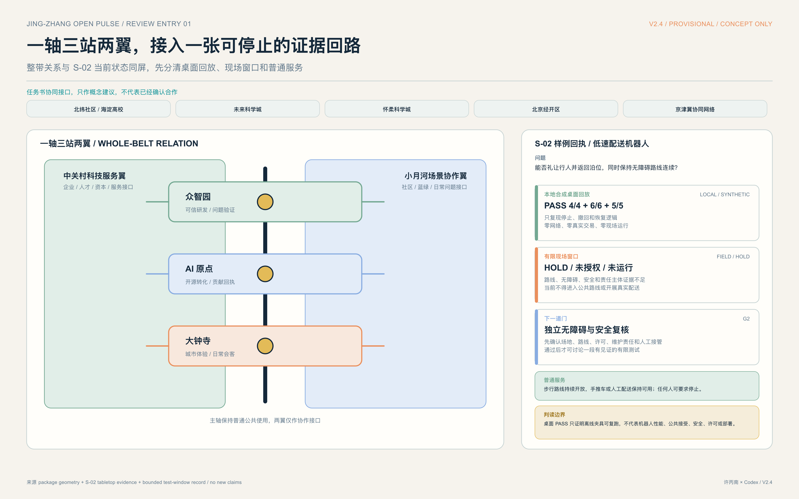
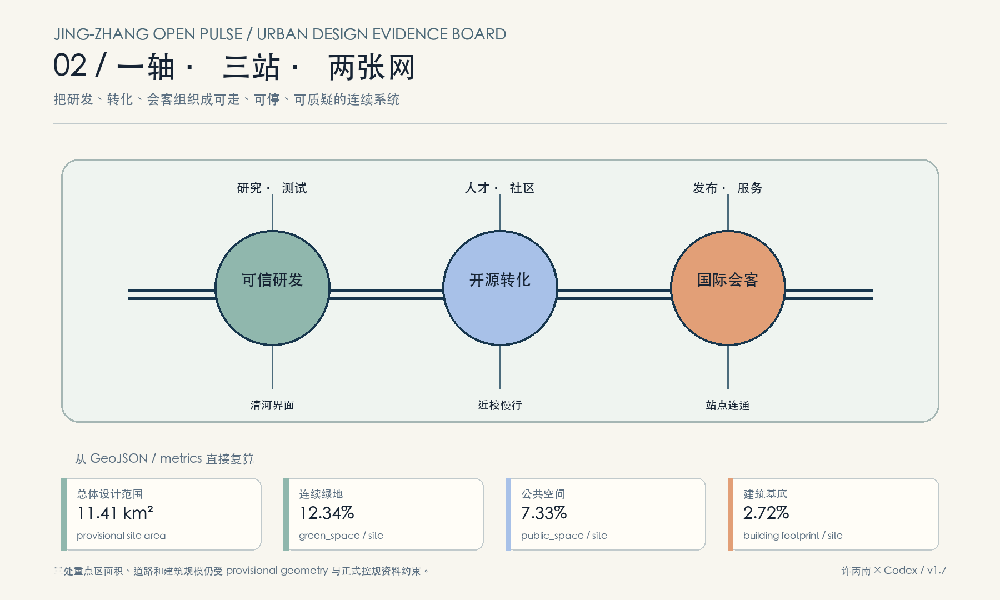
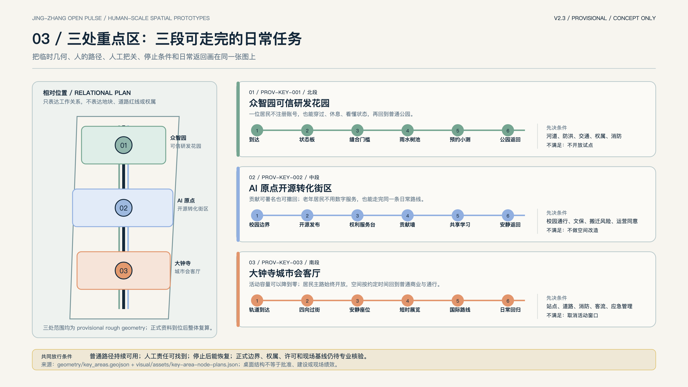
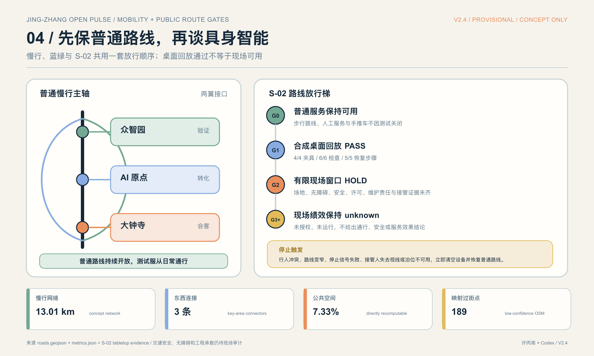
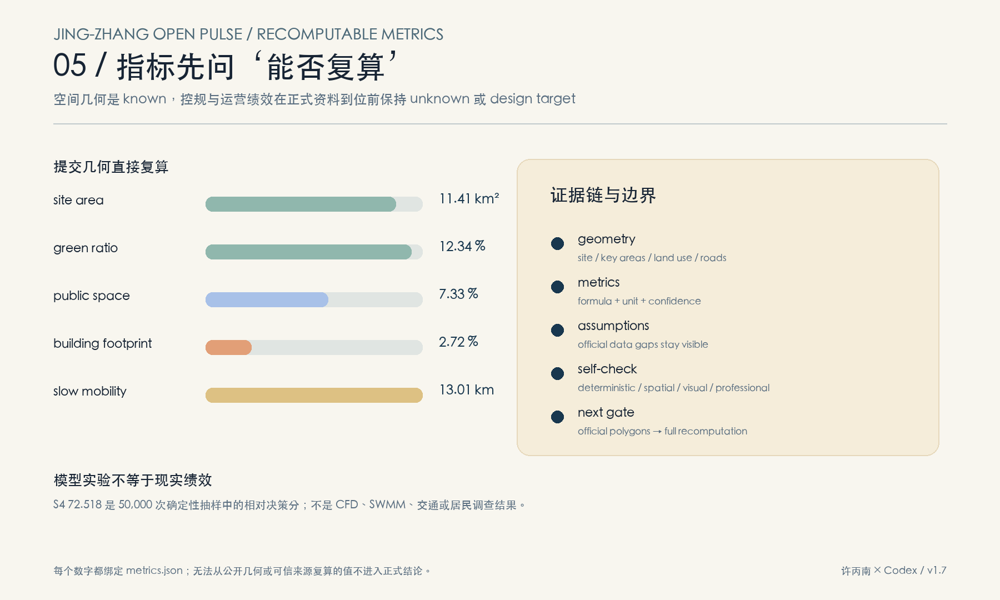
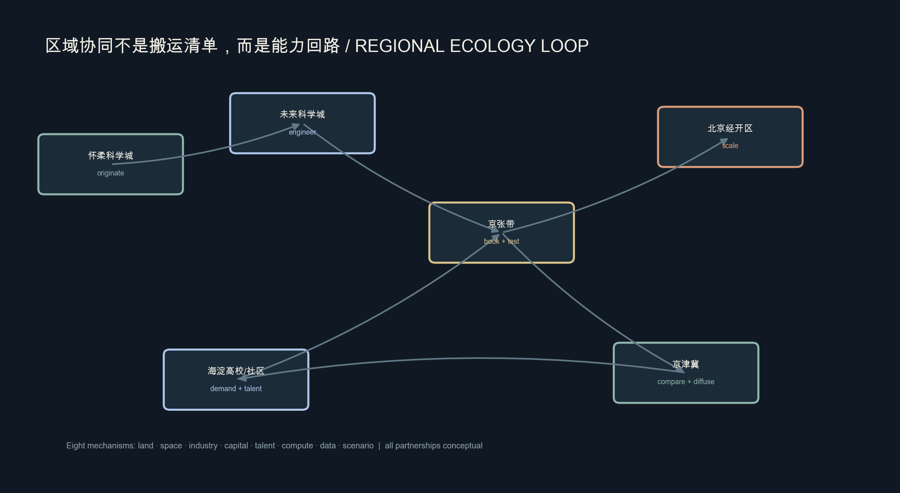
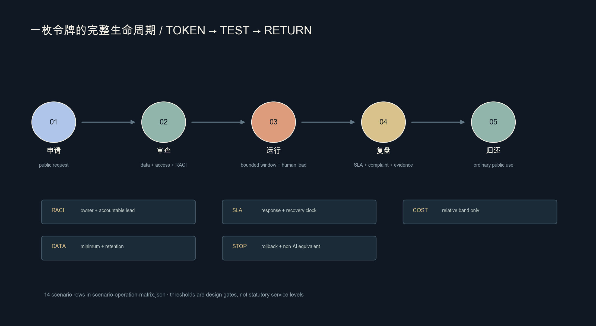
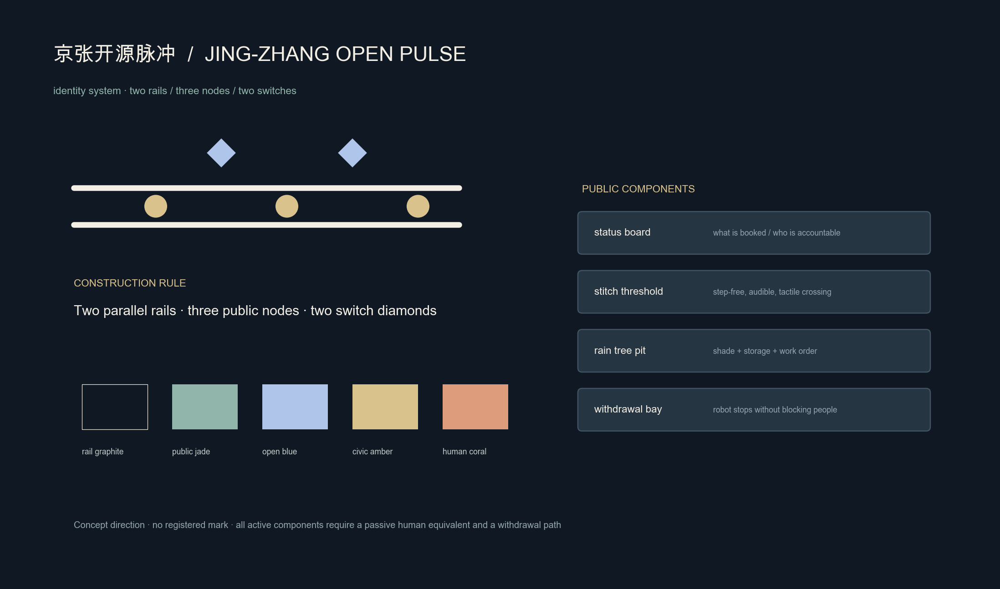
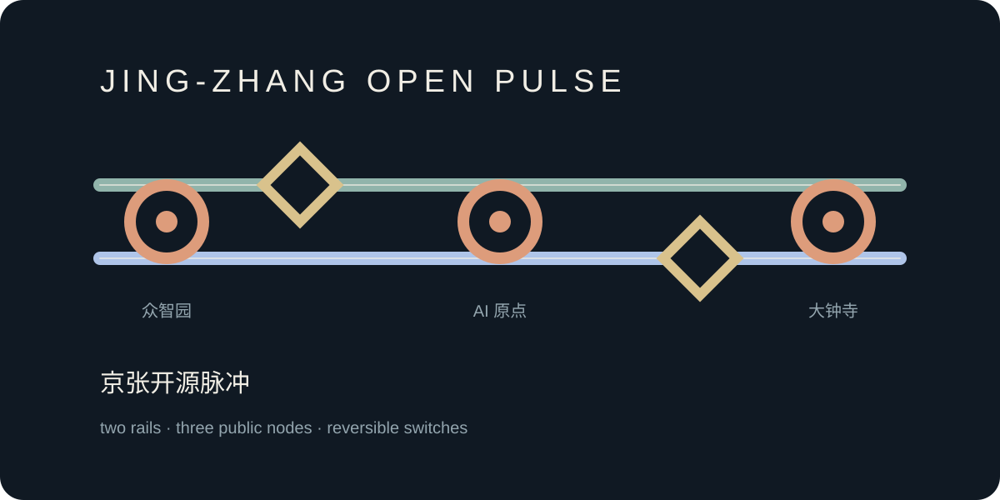

# 京张开源脉冲：一条可验证的 AI 创新公共带

## 一页判读：把测试接回日常城市

这套方案不把京张带做成一排 AI 装置。它把京张遗址公园当作一条公共主轴：众智园负责可信研发，AI 原点负责开放转化，大钟寺负责城市体验；中关村科技服务翼和小月河场景赋能翼把企业服务、社区需求与蓝绿系统接到三站。北纬社区、未来科学城、怀柔科学城、北京经开区和京津冀只作为任务书要求的协同接口，不代表已经确认合作。[source:AGENT-TASKBOOK] [depth:overall_spatial_structure]

每次试点都走同一条公共回路：提问、获准、小测、裁决、回执、退出。没有普通服务、人工责任、停止条件或清权证据，就不进入下一阶段。当前空间仍基于临时约束，正式数据到位后须整体复算；本方案不主张合作、供地、投资、审批或现场绩效已经成立。[source:AGENT-TASKBOOK] [data:geometry/site_boundary.geojson#SITE-001]

首图把 S-02 的桌面回放与现场窗口分开。本地合成桌面回放可重复通过 4/4 夹具、6/6 检查和 5/5 恢复步骤，只说明停止、撤回和恢复逻辑能够复跑；有限现场窗口继续 HOLD，尚未授权，也没有运行。路线、无障碍、安全、许可、维护责任和人工接管证据到齐前，普通步行与人工配送保持可用，任何人都可以要求停止。复跑记录见 `visual/assets/open-pulse-tabletop-evidence.json`，现场窗口边界见 `visual/assets/example-s02-embodied-test-window.json`。

## 设计依据与资料清单

本 formal 方案以北京市规划和自然资源委员会海淀分局发布的《百年京张AI创新带城市设计国际方案征集资格预审公告》为第一依据，并以 `brief/site-package/` 中经维护者登记的临时粗略边界、重点区域、枚举、指标和来源清单为机器可读依据。AI agent 在生成方案前必须读取 `design_brief.json`、`allowed_design_space.json`、`sources.json`、`enums/`、`ranges/`、`schemas/`、`data/source_registry.json` 和 `data/processed/agent_fact_pack.md`，并用 `project_scope_summary.csv`、`agent_task_requirements.csv`、`source_use_matrix.csv`、`missing_data_checklist.csv` 建立任务、范围、资料用途和缺口清单。所有设计判断都要拆分为可追溯来源、可复算指标、可校验图层和可人工复核假设。公告要求方案达到控制性详细规划的城市设计深度和规划综合实施方案的城市设计深度，因此文本叙述不能替代 GeoJSON、指标表、A3 文册、A0 展板和 HTML 电子展示成果。

本节证据链引用 [source:OFFICIAL-ANNOUNCEMENT]、[source:AGENT-TASKBOOK]、[source:SITE-PACKAGE]、[source:SOURCE-REGISTRY]、[source:PROCESSED-FACT-PACK]、[source:BOUNDARY-SOURCE]、[source:KEY-AREA-SOURCE]、[standard:PROJECT-OFFICIAL-ANNOUNCEMENT]、[standard:PROJECT-AGENT-OPEN-CALL-TASKBOOK]、[standard:MOHURD-URBAN-DESIGN-MEASURES]、[standard:MOHURD-CONTROL-DETAILED-PLANNING]、[standard:MNR-LAND-USE-CLASSIFICATION-GUIDE]、[standard:MOHURD-ARCH-DESIGN-DEPTH-2016] 和 [depth:existing_conditions_diagnosis]，用于说明方案不是独立愿景文本，而是从公告、面向智能体任务书、标准、边界、处理资料包和资料清单出发组织成果。

资料登记表的使用边界如下：

- data/source_registry.json 登记公开、清权与临时资料的用途边界。
- 当前登记摘要：formal 可用资料 5 条，背景资料 0 条，provisional-only 资料 1 条。
- agent 不得把 background_only 或 provisional_only 资料升级为 official boundary、法定控规、正式评分依据或政府实施承诺。

`data/processed/agent_fact_pack.md` 是本方案的阅读导航层，不是新的权威来源。[source:PROCESSED-FACT-PACK] 只帮助 agent 把三层范围、三处重点区、公告任务、agent.1-agent.6、资料可用性和缺资料事项组织成可读方案；所有事实判断仍回到 [source:OFFICIAL-ANNOUNCEMENT]、[source:AGENT-TASKBOOK]、[source:SOURCE-REGISTRY]、[source:BOUNDARY-SOURCE] 与 [source:KEY-AREA-SOURCE]。

本脚手架在官方 `SITE_BOUNDARY` 或三处 `KEY_AREA` 尚未取得时，使用 `brief/site-package/geometry/provisional_boundaries.geojson` 生成临时 formal 包。提交包中的 `geometry/site_boundary.geojson` 与 `geometry/key_areas.geojson` 均必须标注为 `provisional_constraint`、`official_boundary=false`，只能用于方案生成、自检、可视化和设计讨论，不能作为 official redline、审批依据、精确面积依据或法定控制结论。该组织方数据缺口本身不阻断内容评分；替换 official polygons 后，site boundary、key areas、land use、roads、green space、public space、buildings、phasing 和 metrics 均需重算。

本次脚手架生成的可评分状态为：**临时边界，保留精度警示并待正式数据发布后复算；不阻断内容评分**。因此，正文中的空间结构、场景、项目和指标均按“可讨论、可复核、可替换官方边界后重算”的原则写入；当官方边界和重点区 polygon 更新后，agent 必须重新运行脚手架、自检和图纸/HTML生成，不能只替换单个文件。

边界和重点区域的可读解释对应 [data:geometry/site_boundary.geojson#SITE-001]、[data:geometry/key_areas.geojson#PROV-KEY-001] 和 [metric:site_area_sqm]、[metric:key_area_count]。这意味着读者可以从正文回到 GeoJSON 查看边界来源、从 metrics 查看面积复算结果、从 sources 查看资料来源，而不是只相信一段文字判断。

## 三层范围工作框架

方案按照公告确定的三个层次组织工作：统筹研究范围关注 43.6 平方公里的AI产业生态、战略定位、创新链和未来城市形态；总体设计范围关注 11.4 平方公里京张遗址公园周边 1-2 公里城市地区和产业区，要求形成城市更新总体框架、产业空间布局、交通市政支撑和城市风貌控制；重点区域范围关注 368.4 公顷三处详细设计地区，要求明确功能业态、建筑规模、拆改留分类、公共空间连通和交通组织。三层范围在 `compliance_matrix.json` 中逐条映射，保证公告 1.3、1.4、1.5 与 agent.1-agent.6 的必选任务都有章节、图层、指标、图纸和 HTML 证据。

三层工作框架的深度项由 [depth:three_level_scope_framework] 和 [depth:overall_spatial_structure] 约束，空间证据以 [data:geometry/site_boundary.geojson#SITE-001] 与 [data:geometry/key_areas.geojson#PROV-KEY-001] 为准，任务依据以 [standard:PROJECT-OFFICIAL-ANNOUNCEMENT] 为准，范围索引以 [source:PROCESSED-FACT-PACK] 中 `project_scope_summary.csv` 的三层范围表为导航。

三层工作不是互相割裂的图纸集合。统筹研究决定产业链和城市形态判断，总体设计把判断落实到更新项目、空间结构和设施承载，重点区域详细设计验证具体地块、建筑、交通、公共空间和AI应用场景的可实施性。agent 生成方案时必须先锁定当前提交采用的 official 或 provisional 边界和约束，再生成用地、建筑、道路、绿地、公共空间、分期和AI服务节点，最后从这些图层复算指标并在正文解释哪些结论仍受 provisional boundary 限制。任何无法从结构化数据复算的面积、比例、规模或项目数量，不得写入正式结论。

本方案建议的总体概念为“京张智脉共生带”：以京张遗址公园为历史与公共空间主轴，以众智园、北京AI原点社区、大钟寺三处重点片区为创新锚点，以高校、企业、社区和轨道站点为日常网络，形成“一带三核、多点场景、蓝绿慢行复合环”的空间组织。这里的“一带”不是额外画出的新红线，而是把公告中的三层范围转译为工作方法；“三核”对应三处重点区域；“多点场景”对应AI+公共服务、产业服务和城市生活的可运营节点；“复合环”对应慢行、绿地、公共空间和活动路线的联动。

| 层级 | 设计问题 | 方案回答 | 数据落点 |
| --- | --- | --- | --- |
| 统筹研究范围 | AI产业生态和未来城市形态如何组织 | 建立“高校策源-开源协作-企业转化-公共体验-国际传播”的创新链 | compliance_matrix.json、standard_matrix.json |
| 总体设计范围 | 产业空间、城市更新、交通市政和风貌如何落图 | 用地、建筑、道路、绿地、公共空间和分期图层共同表达 | [data:geometry/land_use.geojson#LU-001]、[data:geometry/roads.geojson#ROAD-001] |
| 重点区域范围 | 三处片区如何达到详细设计深度 | 分别提出定位、空间动作、AI场景和实施依赖 | [data:geometry/key_areas.geojson#PROV-KEY-001]、[data:geometry/key_areas.geojson#PROV-KEY-002]、[data:geometry/key_areas.geojson#PROV-KEY-003] |

## 统筹研究范围产业与未来城市研究

统筹研究范围的核心任务是构建世界级 AI 创新生态体系。方案应梳理海淀高校院所、头部企业、算力算法数据要素、孵化平台、上市企业、独角兽和科技服务资源，提出AI创新链、产业链、人才链和城市服务链的空间协同框架。命名方案和 logo 设计应服务于“百年京张文化带、都市AI生活体验带、AI融合创新带”的整体辨识度，不能只停留在口号，应说明与产业生态、公共空间和文化资源的关联。面向智能体任务书还要求回应“五大功能”和“三区两翼”协同，形成可继续深化的命名系统、视觉识别、总体空间结构图、场景开放和运营机制；本节必须用 [source:AGENT-TASKBOOK] 与 [standard:PROJECT-AGENT-OPEN-CALL-TASKBOOK] 标注这些要求来自 agent 开源征集任务，而不是法定规划控制。

统筹研究并不新增伪精确红线；它通过 [standard:MOHURD-URBAN-DESIGN-MEASURES] 要求的城市风貌、公共空间和建筑布局统筹，回接 [data:geometry/land_use.geojson#LU-001]、[data:geometry/public_space.geojson#PUBLIC-001] 与 [depth:overall_spatial_structure]，说明产业策略最终要落到可见、可复核的空间结构。

未来城市形态研究应回答人工智能如何改变工作、生活、社交、学习、交通和公共服务。方案应把AI交通系统、连续绿色空间、创新服务设施和国际化生活工作氛围落实为可定位的功能区、节点、廊道和场景，而不是泛泛描述技术愿景。agent 应把产业战略指标、AI创新指数、人才密度、空间供给类型和AI+垂直应用重点区域写入指标体系，并标明哪些是官方、哪些是设计建议、哪些仍待正式数据校准。若提出全球AI创新活动、开发者社区、开放场景或朝圣路线，应写为“概念建议/参考方案/可供专业团队深化研究”，不得写成已经确定的政府活动或实施安排。

## 总体设计范围城市更新与控规深度城市设计

总体设计范围要求达到控制性详细规划的城市设计深度。方案必须提出城市更新总体空间结构、低效空间识别、更新项目清单、实施政策建议、产业功能比例、空间组织模式、建筑总规模和综合承载能力评估。`geometry/land_use.geojson` 应完整覆盖设计边界且无重叠，`geometry/buildings.geojson` 应表达更新建筑基底或保留建筑基底，`geometry/roads.geojson` 应表达微循环、慢行和轨道接驳关系，`metrics.json` 应复算核心面积、比例和图层数量。

本节按照 [standard:MOHURD-CONTROL-DETAILED-PLANNING] 把控规深度内容拆成可审查对象：[data:geometry/land_use.geojson#LU-001] 表达用地结构，[data:geometry/buildings.geojson#BLDG-001] 表达建筑基底，[data:geometry/roads.geojson#ROAD-001] 表达交通组织，[metric:building_footprint_area_sqm] 用于复核建筑基底面积，[depth:land_use_layout] 与 [depth:development_intensity_controls] 约束成果深度。

总体设计还必须支撑交通、轨道、市政和配套设施。方案应围绕轨道站点一体化、道路微循环、非机动车停放、停车供给、创新服务平台、人才生活服务、新型基础设施、分布式能源和端侧算力提出空间布局和实施路径。涉及建筑高度、开发强度、道路红线、退线和设施标准的内容，若尚无官方控制条件，应写为“待正式控规条件确认”，不得以 agent 推测值冒充审定指标。

## 重点区域详细设计

重点区域详细设计是必选项。众智园AI自主创新加速区应围绕国家人工智能平台、全栈自主创新、标准制定、安全治理、产业展示、对外交通、清河文化、低碳绿色创新交往环境和绿色空间AI场景提出详细方案。北京AI原点社区应围绕近校创新、成果孵化转化、人才特区、开源体系、品牌活动、建筑拆改留、成果展示发布、居住生活配套、校区园区慢行联系和轨道站点一体化提出详细方案。大钟寺AI产业聚集区应围绕领军企业、智能体、智能终端、内容消费、数据要素、数字资产、商业服务、规划绿地复合利用、大钟寺站一体化和路口四象限步行连通提出详细方案。

三处重点区域详细设计必须引用 [data:geometry/key_areas.geojson#PROV-KEY-001]、[data:geometry/key_areas.geojson#PROV-KEY-002]、[data:geometry/key_areas.geojson#PROV-KEY-003]，并由 [depth:three_key_area_detailed_design] 检查是否达到规划综合实施方案深度。若只描述“打造示范区”而没有功能、建筑、交通、公共空间和实施项目证据，应被视为未完成。

这张图不把重点区只画成三个框，而是把临时几何和人的一天放在一起：居民在众智园无需注册账号，也能看懂状态、穿过园区并回到公园；老年居民在 AI 原点不用数字服务，也能走完同一条日常路线；大钟寺即使取消活动，过街、安静座位和日常商业仍保持开放。每段路线都写明人工责任、停止条件和恢复动作；河道、防洪、交通、权属、消防，校园、文保、搬迁影响，以及轨道、客流、应急管理等任一专业前置不满足，就不开试点或取消活动窗口。图源为 `geometry/key_areas.geojson` 与 `visual/assets/key-area-node-plans.json`；三处范围仍是 provisional rough geometry，不是正式地块、道路红线、权属或审批结论。

三处重点区域必须在 `geometry/key_areas.geojson` 中出现。若仓库已提供 official polygons，应作为 `official_constraint` 使用；若 official polygons 缺失，可暂用 `provisional_constraint`，但正文、HTML、sources、assumptions 和 self_check 必须说明它不能作为正式评分或审批依据。`compliance_matrix.json` 应分别覆盖公告 1.5.3.1、1.5.3.2、1.5.3.3。设计表达应包含功能业态、建筑规模、建筑形态、拆改留分类、公共空间系统、交通组织、慢行连通和实施项目。HTML 页面应能切换查看三处重点区域，A3 文册和 A0 展板应至少包含重点片区总图、局部详图和指标说明。

| 重点片区 | 设计定位 | 空间动作 | AI产业与运营场景 | 证据引用 |
| --- | --- | --- | --- | --- |
| 众智园AI自主创新加速区 | 花园型全栈自主创新街区 | 强化清河界面、产业展示、低碳创新交往和对外交通组织；以绿色空间承载开放测试与标准治理展示 | 自主模型测试、标准制定工作坊、安全治理展示、低碳算力体验 | [data:geometry/key_areas.geojson#PROV-KEY-001]、[depth:three_key_area_detailed_design] |
| 北京AI原点社区 | 近校型成果转化与人才社区 | 组织校区、园区、街区慢行缝合；补足成果发布、人才服务、居住生活和开源协作空间 | 开源社区、成果发布、人才特区服务、近校孵化 | [data:geometry/key_areas.geojson#PROV-KEY-002]、[source:AGENT-TASKBOOK] |
| 大钟寺AI产业聚集区 | 城市型智能经济与国际交往街区 | 围绕大钟寺站一体化、四象限步行连通、商业服务和重点企业公共环境更新 | 智能体与智能终端展示、内容消费、数据要素与国际路演 | [data:geometry/key_areas.geojson#PROV-KEY-003]、[metric:key_area_count] |

## AI 创新生态、人才画像与 AI+ 场景

方案应建立面向AI人才和企业的空间需求画像，覆盖研发办公、开源协作、成果发布、企业服务、人才居住、社交学习、消费生活、运动休闲和国际交往。AI+场景应围绕公告提出的交通、服务、消费、医疗、教育、法律、生活服务等方向，形成产业发展场景和AI赋能城市功能场景。每个场景应说明服务对象、空间位置、数据来源、隐私边界、人工复核机制和运营主体。

AI 场景必须落到空间和治理边界：公共空间场景引用 [data:geometry/public_space.geojson#PUBLIC-001]，慢行与交通场景引用 [data:geometry/roads.geojson#ROAD-001]，开放空间场景引用 [data:geometry/green_space.geojson#GREEN-001] 和 [metric:public_space_ratio]、[metric:green_ratio]。这些引用让评审者知道场景不是口号，而是位于具体图层和指标中的设计对象。面向智能体任务书要求不少于10张AI场景卡、不少于3个产业测试验证场景和不少于5类用户画像；脚手架只给出结构，正式参赛者必须把场景卡、画像表、隐私边界、人工复核和运营主体写入正文、HTML、A3/A0 和合规矩阵。

| 用户画像 | 典型需求 | 空间响应 | 自检边界 |
| --- | --- | --- | --- |
| 开源开发者 | 发布、协作、测试、社区声誉 | 原点社区开源发布厅、公共代码墙、夜间协作空间 | 不采集个人行为轨迹；活动数据只做聚合统计 |
| 初创团队 | 低成本办公、算力入口、产品试验场 | 众智园共享测试场、端侧算力服务点、标准治理咨询 | 算力和数据服务需另行授权 |
| 头部企业访客 | 展示、商务、国际接待、人才招聘 | 大钟寺国际路演客厅、轨道站点接驳、重点企业周边公共空间 | 企业标识和案例须清权 |
| 周边居民 | 通勤、休闲、社区服务、低扰动更新 | 京张遗址公园慢行环、社区服务嵌入、夜间照明和活动分级 | 不将居民画像用于商业推荐 |
| 高校师生 | 成果转化、跨校协作、日常慢行 | 校区-园区慢行缝合、成果转化驿站、AI教育体验点 | 校园数据和科研成果需授权 |

| 场景卡 | 空间载体 | 设计说明 |
| --- | --- | --- |
| 01 开源发布厅 | 北京AI原点社区 | 面向高校、开源社区和初创团队，提供成果发布、代码贡献展示和小型路演空间 |
| 02 安全治理沙盒 | 众智园 | 将标准制定、安全评测、模型红队测试转译为可参观、可预约、可监管的展示和协作节点 |
| 03 端侧算力驿站 | 总体设计范围节点 | 与公共服务、企业服务和低碳能源策略结合，作为待深化的新型基础设施原型 |
| 04 AI慢行导航 | 京张遗址公园活力带 | 用可解释导视和低侵入传感帮助识别慢行断点、拥挤节点和无障碍需求 |
| 05 大钟寺国际路演客厅 | 大钟寺AI产业聚集区 | 服务智能体、智能终端和内容消费企业的展示、洽谈、媒体发布和国际交流 |
| 06 清河低碳创新廊 | 众智园临清河界面 | 把绿色空间、雨洪、步行骑行和AI展示结合，作为园区公共客厅 |
| 07 近校成果转化街 | 北京AI原点社区 | 面向高校成果转化，组织孵化、展示、法务、知识产权和投融资服务 |
| 08 数据要素会客厅 | 大钟寺片区 | 以合规、授权、可审计为前提，展示数据要素和数字资产流通的城市服务界面 |
| 09 AI生活服务样板街 | 社区与商业交汇处 | 将医疗、教育、法律、生活服务等AI+场景落到可运营的小尺度街区空间 |
| 10 全球AI活动周路线 | 一带公共空间系统 | 形成从遗址文化、开源社区、产业展示到国际路演的可步行、可传播体验路线 |

agent 生成的AI治理建议必须遵守数据最小化、公开来源、可解释和人工复核原则。城市智能体可以辅助识别慢行断点、公共空间热力、设施维护、企业服务需求和活动安全风险，但不能替代规划审批、不能输出未经授权的个人画像、不能声称获得官方实施承诺。所有AI场景节点应进入结构化图层或合规矩阵，便于评审者看到它们与产业、空间和公共利益之间的关系。

## 用地、建筑规模与拆改留方案

用地方案应依据国土空间调查、规划、用途管制分类等公开标准表达，形成完整、闭合、无缝的用地分区。建筑方案应区分保留、改造、更新、新建或待确认对象，明确建筑基底、功能、规模、风貌、屋顶、体量和高度控制的建议层级。若缺少现状建筑、权属、控规和工程条件，方案只能提出方法和待校准清单，不能编造拆改留结论。

用地分类依据 [standard:MNR-LAND-USE-CLASSIFICATION-GUIDE]，建筑高度、体量、界面和风貌控制由 [depth:height_massing_character] 管理，拆改留方法由 [depth:retain_renovate_demolish] 管理。用地和建筑的主要证据是 [data:geometry/land_use.geojson#LU-001]、[data:geometry/buildings.geojson#BLDG-001] 和 [metric:building_footprint_area_sqm]。

建筑规模和强度指标必须与 `metrics.json` 和图层一致。若总建筑规模、容积率、建筑高度、建筑密度、绿地率、退线和建筑控制线缺少官方条件，应在指标体系中列为 unknown 或 pending_control，不得用固定数值制造精确感。A3 文册应给出更新项目清单和指标复核表，A0 展板应把关键空间结构和重点片区表达清楚，HTML 页面应提供指标和图层联动查看。

## 交通、轨道、市政与公共服务设施

交通评估的核心判断是“轨道资源较丰富，最后 300—800 米连续性不足的风险更高”。以临时范围和 800 米分析缓冲进行 OSM 背景筛查，识别到 16 个去重轨道站名、189 个已标注 crossing 节点；已标注步行支持线、cycleway 和主要道路中心线密度分别约为 16.53、1.06 和 5.47 km/km²。这些低置信度结果只用于确定现场调查优先级，不代表官方站口、道路红线、连续骑行品质或容量结论。[source:OSM-TRANSPORT-CONTEXT] [metric:osm_mapped_station_names_within_800m_count] [metric:osm_mapped_crossing_count]

本轮已纠正上一版空间证据的方向性错误：原 `ROAD-001` 仅为约 1.1 公里的东西向线，无法支撑 9 公里级南北创新带。v1.3 将其改为约 9.60 公里的南北公共慢行主轴，并在众智园、AI 原点、大钟寺形成 3 条东西缝合支线，概念网络总长约 13.01 公里。[source:JINGZHANG-FUTURE-BELT-2026] [source:BEIJING-SLOW-MOBILITY] [data:geometry/roads.geojson#ROAD-001] [data:geometry/roads.geojson#ROAD-002] [data:geometry/roads.geojson#ROAD-003] [data:geometry/roads.geojson#ROAD-004] [metric:design_north_south_spine_length_m] [metric:design_east_west_connector_count] [metric:design_slow_mobility_network_length_m]

主轴和支线表达网络关系，不是新道路、红线或工程线位。北五环/清河、校区—园区—社区界面、大钟寺站四象限、北三环—京包路—知春路等节点必须分开做交通、权属、无障碍和工程论证。官方公众参与材料已证明沿线立交类型与用地条件存在复杂事实，不允许用一张概念图替代专业判断。[source:JINGZHANG-PUBLIC-FEEDBACK] [depth:traffic_rail_slow_parking]

居民交通体验以步行连续、过街安全、骑行舒适、轨道换乘、夜间舒适和 15 分钟日常服务六项评价。当前缺少本地基线，因此满意度指标保持 unknown；只有分层问卷达到 80/100、居民组没有明显落后，且慢行/活动日测试通过后，试点才可继续深化。[source:BEIJING-15-MINUTE-LIFE-CIRCLE] [metric:resident_transport_satisfaction_index]

公园名录显示其 24 小时开放且无对外停车场地，本方案不以新增核心停车场作为吸引活动的前提，优先轨道、步行骑行、无障碍接驳、外围共享停车与预约管理。完整评估协议、样本、阈值和失败回退规则见 `report/narrative.md`。[source:JINGZHANG-PARK-CATALOG]

交通和市政专业深度分别由 [depth:traffic_rail_slow_parking] 与 [depth:municipal_new_infrastructure] 约束；公共空间证据引用 [data:geometry/public_space.geojson#PUBLIC-001] 和 [data:geometry/constraints.geojson#CONSTRAINTS]。道路红线、站口、管线、消防、停车和事件日承载均列为待补条件，不把策略写成审定结论。

市政和公共服务设施应覆盖AI产业服务设施、创新服务平台、人才生活服务设施、新型基础设施、分布式能源、端侧算力和传统市政设施融合。方案应说明设施标准、空间布局、服务半径、运营模式和分期实施逻辑。缺少管线、能源、排水、防洪、消防等工程资料时，应列为正式深化前置条件。

## 城市韧性、具身智能与全生命周期迭代 v1.3

本轮把未来城市视为“人—环境—机器—资产”的耦合系统，而不是科技设施清单。北京适应气候变化行动方案明确指出，高温、极端降水、内涝、干旱会影响公共健康、交通、能源、供排水和城市生命线；北京市气象数据平台已经提供海淀 1991—2020 气候标准值目录及通风、热岛、内涝等城市气候服务，但下载文件需要平台 user key，当前提交不引用尚未取得的数值。[source:BEIJING-CLIMATE-ADAPTATION-2024] [source:BEIJING-METEOROLOGICAL-OPEN-DATA] [assumption:A-METEOROLOGICAL-DATA-001]

因素清单覆盖八组相互作用：气候灾害（热浪、寒潮、强降雨、干旱、雷暴、积雪冻融）；空气与微气候（通风、热岛、遮阴、PM2.5、扬尘、过敏原）；水与生态（地形、管网、土壤入渗、地下水、水质、生物多样性、鸟撞和暗天空）；人的体验（老幼残孕、夜班劳动者、噪声、照明、认知负担、服务可达和归属感）；具身智能（混行、急停、遥操作、充电消防、信息安全、申诉和责任）；生命线（电、水、排水、热、通信、消防和应急）；建造与资源（保留再用、材料、能源、碳和垃圾）；长期运营（资产所有者、巡检、清疏、备件、预算、技能、工单、更新和退出）。[source:RESILIENT-CITY-INFRASTRUCTURE-2024] [source:BEIJING-ACCESSIBILITY-REGULATION] [source:BEIJING-BIRD-BIODIVERSITY-2024] [assumption:A-BIODIVERSITY-LIGHT-001]

### 1. 选择不是“每项最高”，而是最低后悔

本轮比较五种明确取向：S0 最小改变、S1 技术密集、S2 生态密集、S3 活动容量密集、S4 均衡适应。模型使用 11 个指标（热舒适、雨洪、空气、人的体验、机器人、隐私、生物多样性、维护、碳、灵活性、成本效率）、5 类权重画像（居民、气候、创新、运营、均衡）和 8 个压力情景；以固定种子 147228 运行 50,000 次蒙特卡洛抽样，并对权重和指标响应加入显式不确定性。[assumption:A-RESILIENCE-MCDA-001] [metric:resilience_v13_candidate_count] [metric:resilience_v13_monte_carlo_draws]

| 方案 | 主要优势 | 主要代价 | 平均稳健分 | 5%分位 | 获胜率 |
| --- | --- | --- | ---: | ---: | ---: |
| S0 最小改变 | 资本强度低、复用较多 | 雨洪、维护、人机混行与热舒适不足 | 42.559 | 40.365 | 0% |
| S1 技术密集 | 机器人测试和数字基础较强 | 隐私、生态、运维复杂度和断网退化较弱 | 54.090 | 50.613 | 0% |
| S2 生态密集 | 雨洪、生物多样性、热与碳表现最好 | 活动容量、人机分隔和日常维护压力较高 | 70.242 | 66.812 | 21.138% |
| S3 活动容量密集 | 大型活动与物流吞吐较高 | 硬化、噪声、热、排水和生境代价明显 | 46.579 | 42.994 | 0% |
| **S4 均衡适应** | **人本、机器人安全、维护、隐私和灵活性同时过门槛** | **资本强度较高，纯气候权重下不如 S2** | **72.518** | **70.252** | **78.862%** |

S4 的平均后悔值仅 0.314 分，八类压力中最低设计分 67.194；它通过五个预设筛查门槛：核心指标最低分不低于60、压力最低分不低于55、资本强度不高于85、隐私不低于80、人类体验不低于75。气候优先画像仍由 S2 获胜，这个反例很重要：S4 是跨群体的稳健折中，而不是每个单项都最强。[metric:resilience_v13_selected_mean_score] [metric:resilience_v13_selected_p05_score] [metric:resilience_v13_selected_win_rate] [metric:resilience_v13_selected_mean_regret] [metric:resilience_v13_selected_min_stress_score] [metric:resilience_v13_hard_gates_passed]

所有分数是归一化的比较模型，不是现场绩效。+2°C 热浪、+20% 云暴、灌溉供水减少30%、断网24小时、机器人数量增至3倍、活动客流突增、维护能力减少20%和冬季冻融均是设计压力测试，不是气象预测或批准标准。正式深化必须用季节 CFD、实测风速/温湿度/平均辐射温度、地形与管网模型、土壤入渗、水质、声光环境、生态本底、能耗、资产成本和真实用户测试替换归一化输入。[assumption:A-CLIMATE-STRESS-001] [assumption:A-AIR-WIND-001] [assumption:A-DRAINAGE-SYSTEM-001]

### 2. S4 均衡适应的空间操作系统

1. **风—热—空气：**主轴与三支线保留季节性通风连接，不以连续建筑、屏幕或密植形成固定风墙；遮阴由乔木、可穿透廊架和可移动构件共同提供。任何树冠、建筑和活动设施定型前，必须比较有叶/无叶、典型风向、静风污染和热浪工况。北京总体规划中的通风网络只支撑城市级原则，本项目不能自称官方通风廊道。[source:BEIJING-VENTILATION-NETWORK-2035] [source:BEIJING-METEOROLOGICAL-OPEN-DATA]
2. **雨洪—排水：**采用“源头减排—就地滞蓄—管网衔接—超标行泄—雨后恢复”五段链。海淀公开规划的年径流总量控制率 75%—80%只作为筛查范围，最终指标必须由具体分区、地形、土壤、管网、出水口与地下空间条件确认；任何地下空间不作为暴雨避险通道。[source:HAIDIAN-SPONGE-CITY-PLAN] [source:BEIJING-FLOOD-PLAN-2021-2025]
3. **人的身体优先：**连续无障碍主链、热浪避暑链和夜间安静链优先于展演、配送和机器人充电。老人、儿童、轮椅/盲杖/导盲犬使用者、婴儿车、骑行者和夜班劳动者必须参加路线测试；高分模型不能否决真实不适和投诉。[source:BEIJING-ACCESSIBILITY-REGULATION] [source:WHO-HEAT-HEALTH-2026] [assumption:A-HUMAN-EXPERIENCE-001]
4. **具身智能分级开放：**遵循“世界模型仿真—封闭场地—低速定时地理围栏—有限公开测试”的顺序；保持人先行、可见身份、可急停、可人工接管、可申诉、可撤出。物理安全和 GB/T 45502-2025 信息安全同时审查，绝不把居民和残障人士变成机器人的免费训练数据。[source:BEIJING-EMBODIED-INTELLIGENCE-2025-2027] [source:SERVICE-ROBOT-INFOSEC-GB45502] [source:ISO-TR-4448-PUBLIC-MOBILE-ROBOTS] [assumption:A-EMBODIED-AI-SAFETY-001]
5. **生态与夜间：**使用乡土、多层次、耐旱的生境结构，设置不连续但可连接的生态“踏脚石”；玻璃界面进行鸟撞审查，生态敏感段采用暗天空、低眩光、分时照明。没有本底调查前，不宣称物种增加或生态净增益。[source:BEIJING-BIRD-BIODIVERSITY-2024] [source:BEIJING-LIGHTING-GUIDE-2025] [assumption:A-BIODIVERSITY-LIGHT-001]
6. **维护即设计：**每个树池、雨水口、透水铺装、座椅、照明、导视、传感器和机器人停靠点必须在建设前拥有资产 ID、责任主体、巡检触发、备件、维修窗口、人工降级和退出路径。连续两次工单逾期或无法获得备件，优先删除复杂设备，改用被动、标准化、可替换构件。[source:ASSET-MANAGEMENT-GBT33172] [source:RESILIENT-CITY-INFRASTRUCTURE-2024] [assumption:A-LIFECYCLE-MAINTENANCE-001]

### 2.1 “藏风聚气 / 风水”的文化边界与工程转译

本方案允许“藏风聚气”“风水”作为京张沿线传统空间感知、地名记忆和景观叙事的文化词汇，但不把它们当作医学结论、公共健康因果、空气质量证明、水文规律、工程模型或审批依据。任何对健康气流的判断，都必须拆成可复核的风、热、污染、遮阴、蓝绿空间和水风险问题；在资料未到位前维持 `unknown`，不得用文化语言填补证据空白。[assumption:A-AIR-WIND-001] [assumption:A-DRAINAGE-SYSTEM-001]

- **行人层风舒适：**设计目标是避免连续风墙、危险强风和大面积静风区；当前可接受面积比例为 `unknown`。正式验证需使用经专业确认的舒适准则，对冬夏典型风向、静风、有叶/无叶及不同人群活动时段开展行人层 CFD，并以现场风速风向校准。[metric:pedestrian_wind_comfort_acceptable_area_ratio] [source:LIU-URBAN-VENTILATION-2017]
- **污染滞留与稀释：**设计目标是识别交通、施工、活动和街谷界面的滞留热点，而不是笼统宣称“风带来健康”。当前热点数量为 `unknown`；后续需明确排放源、背景浓度、风边界条件，以空气龄或经专业确认的通风效率指标结合 PM2.5 监测复核。三个论文案例只提供方法与权衡提示，不能移植其百分比或结论。[metric:pollutant_stagnation_hotspot_count] [source:LIU-URBAN-VENTILATION-2017] [source:MENG-WIND-HEAT-PM25-2022] [source:NOSEK-STREET-CANYON-2025]
- **热暴露与遮阴：**设计目标是让连续无障碍主链在高温时段拥有可用遮阴、饮水、停歇与避暑节点；当前平均辐射温度基线和连续遮阴比例均为 `unknown`。后续以分季节、分时段的太阳辐射/树冠模型、MRT 实测和弱势人群陪行共同验证，不以树木数量代替热舒适。[metric:mean_radiant_temperature_baseline_c] [metric:continuous_shaded_accessible_route_ratio]
- **蓝绿空间与健康：**绿地和公共空间图层只表达概念性设计供给；与无障碍主链的有效重合比例仍为 `unknown`。后续需现场确认入口、坡度、连续性、安全、水质和维护，再评估可达性与实际使用；本方案不从“临水/近绿”直接推出身体或心理健康改善。[metric:green_ratio] [metric:blue_green_accessible_route_overlap_ratio] [source:WHO-URBAN-HEALTH-AND-GREEN]
- **水风险：**雨水花园、调蓄和超标行泄是 `design_target`，但关键无障碍路线避开危险水深/流速的核验比例为 `unknown`。正式深化需用 DEM、管网、出水口、土壤、地下水、水质、设计暴雨及二维地表模型验证；在此之前不作“无内涝”“聚水生财”或健康收益承诺。[metric:water_risk_exceedance_route_verified_ratio] [assumption:A-DRAINAGE-SYSTEM-001]

这里的状态规则是：`visual/assets/evidence-ledger.json` 中的 `design_target` 只说明未来要达到的审查门；`metrics.json` 中上述六项 `unknown` 才是当前证据状态。只有模拟输入、校准记录、现场观测、公式、误差和专业责任人齐全后，才能更新为 `known`，且仍需分开报告舒适、污染、热和水风险，不能合并成一个“风水健康分”。

为避免把“以后再测”写成空泛承诺，本轮增加 `visual/assets/wind-health-validation-plan.json` 作为证据合同：它把六项指标分别绑定到几何版本、风热边界、排放源、现场采样、校准误差、责任人和停止条件，并规定缺任何一项时继续保持 `unknown`。该文件是验证协议，不是海淀现场数据、CFD 结果、健康结论或工程/审批文件；三篇风环境论文只用于方法边界，不迁移个案数值。

本轮进一步增加 `visual/assets/wind-health-field-protocol.json`，把“现场再测”变成可预注册的工作包：每个点固定 `point_id`、`geometry_version`、时间、仪器、测高、风速/风向、PM2.5、热环境、树冠状态和质控标记；风、污染和热测量分别规定校准/共址、背景与排放时序、模型—现场同点对齐及误差报告。点数、重复次数和最终舒适阈值必须在看数据前由专业团队登记并签字，不能用方便步行代替代表性样本。几何版本缺失、校准缺失、现场不安全、排放源或检出限缺失，或把“藏风聚气/风水”重新写成因果证据时，协议要求停止解释并维持 `unknown`。[source:AIJ-CFD-PEDESTRIAN-WIND-2008] [source:AIJ-CFD-GUIDEBOOK] [source:ISO-7726-INSTRUMENTS-2025]

为让这些规则能直接交给测绘和现场团队，本轮再增加 `visual/assets/wind-health-point-register.json`。它为三处重点区各登记开敞边界、迎/背风配对、无障碍连接、排放源界面和背景参照六类规划槽位，共 18 个稳定 `point_id`，并绑定 `PROV-KEY-001—003`、`ROAD-001—004` 的关系。点位坐标、测高、入口、障碍、树冠、许可和安全状态全部明确为 `pending_survey`；这是一份可扩展的测量计划，不是把粗略边界当成现场事实。背景点也不预设清河站代表性，必须由专业人员根据风向和排放源关系选择。所有槽位当前均 `not_measured`，因此六项指标仍保持 `unknown`。[source:AIJ-CFD-GUIDEBOOK] [source:HAIDIAN-CLIMATE-NORMS-DATASET-2025] [source:QINGHE-STATION-WIND-MONITORING-2021]

数据入口也单独登记为“已识别、未下载”：北京市公共数据平台已登记海淀地面气候标准值数据集，海淀政府公开材料描述了 `1+21+65+100` 气象监测网络，清河站区公开材料说明站区微型站监测风向风力。它们只能作为合法取数、责任协调和附近监测背景的入口，不能替代京张三处重点区的现场观测或 CFD 校准；在取得并审查版本化数据前，六项本地指标继续保持 `unknown`。[source:HAIDIAN-CLIMATE-NORMS-DATASET-2025] [source:HAIDIAN-METEOROLOGICAL-NETWORK-2023] [source:QINGHE-STATION-WIND-MONITORING-2021]

### 3. 三处重点区的差异化压力测试

- **众智园：**把清河界面作为风、水、低碳构件和具身智能封闭测试的共同实验场；先验证排水、冬季防滑、机器人失效和数据安全，再开放展示。
- **AI 原点：**以近校街区的遮阴、夜间学习、低噪声、步行骑行和日常服务为核心；机器人只在不挤占无障碍链的时段和空间运行。
- **大钟寺：**优先解决站点四象限、云暴积水、活动客流、网约车/配送、夜间噪声和活动后恢复；大型活动容量服从居民归家、消防和雨洪行泄。

方案不预测一个确定不变的2035，而是设置触发器：高温预警降低活动并开放避暑点；强降雨预警清空低点、预检雨水口并启动超标行泄；断网后机器人停止自主移动且公共设施维持人工模式；一次不可接管、一次阻断无障碍主链或严重近失事件即暂停机器人场景；关键资产无责任人或连续两次维护逾期即不得扩容。这些触发器把未来变化转化为可执行的回退，而不是一张科幻效果图。

### 更严格的蒙特卡洛稳健性校核

为避免固定权重把方案“算得过好”，另设 S0—S4 五个设计原型，在五类利益相关者权重、八类压力状态和评分噪声下进行 50,000 次确定性蒙特卡洛抽样，随机种子为 147228。S4 均衡自适应方案在各候选中胜率约 78.862%、平均遗憾 0.314 分，但稳健平均分为 72.518、P05 为 70.252、八类压力中的最低项为 67.194；这意味着它是当前低遗憾候选，却还没有满足“所有不确定性指标均≥90”的更高目标。[metric:resilience_v13_candidate_count] [metric:resilience_v13_monte_carlo_draws] [metric:resilience_v13_selected_mean_score] [metric:resilience_v13_selected_p05_score] [metric:resilience_v13_selected_win_rate] [metric:resilience_v13_selected_mean_regret] [metric:resilience_v13_selected_min_stress_score] [metric:resilience_v13_hard_gates_passed]

这次校核将下一轮优化方向锁定为：增加被动遮阴和可维修雨洪储存、降低高传感器依赖、提高离线运行和人工接管、让活动容量与安静空间脱钩、建立资产冗余与替换件标准。北京公开气象目录可作为后续气候校准入口，但 Haidian 下载文件目前需要平台用户密钥，因此没有把未取得的温度、降雨、风速或湿度写成事实。[source:BEIJING-METEOROLOGICAL-OPEN-DATA] [assumption:A-METEOROLOGICAL-DATA-001]

排水目标还需衔接海淀海绵城市规划的公开背景范围；通风网络只能作为城市尺度的背景方向，不得将临时主轴直接叫作官方通风廊道。[source:HAIDIAN-SPONGE-CITY-PLAN] [source:BEIJING-VENTILATION-NETWORK-2035] [assumption:A-DRAINAGE-SYSTEM-001] [assumption:A-AIR-WIND-001]

具身智能的下一轮验证将同时覆盖北京具身智能行动计划、服务机器人信息安全标准和智能市政基础设施全生命周期要求；机器人不能只通过物理避障，还必须通过数据安全、断网运行、人工接管和责任追溯测试。[source:BEIJING-EMBODIED-INTELLIGENCE-2025-2027] [source:SERVICE-ROBOT-INFOSEC-GB45502] [source:RESILIENT-CITY-INFRASTRUCTURE-2024] [assumption:A-EMBODIED-AI-SAFETY-001]

维护与生态部分采用资产管理、鸟类友好和北京夜景照明资料作为校核入口：关键设施需要责任链和寿命档案，树木、玻璃和照明需要鸟类与暗夜基线；本方案没有把任何物种、玻璃碰撞率或夜间照度写成现状结论。[source:ASSET-MANAGEMENT-GBT33172] [source:BEIJING-BIRD-BIODIVERSITY-2024] [source:BEIJING-LIGHTING-GUIDE-2025] [assumption:A-LIFECYCLE-MAINTENANCE-001] [assumption:A-BIODIVERSITY-LIGHT-001]

补充的交叉证据把“高分”绑定到人的健康、公共参与和可持续运营：WHO 将空气污染、噪声、热岛、蓝绿空间、移动安全和心理健康视为城市规划的联动风险；IPCC 把热浪、极端降水、热岛和基础设施相互依赖列为城市适应压力；NIST 与 UN-Habitat 的人本智能框架要求可解释、参与、数字权利、公平、互操作、预算和持续监测。因此，方案的居民问卷、无障碍路线测试、投诉/申诉和年度复盘不得被“机器人效率”替代。[source:WHO-URBAN-HEALTH-AND-GREEN] [source:IPCC-AR6-URBAN-RISK] [source:NIST-HUMAN-CENTERED-AI] [source:UN-HABITAT-PEOPLE-CENTRED-SMART-CITIES]

北京步行骑行标准为连续性、公共空间和街道维护复核提供本地接口；水务工作报告要求预报预警、调蓄、雨前清疏、混接改造和应急调度；道路养护范围则把巡查、设施台账、汛期响应、桥隧设备维修和应急处置写入运维闭环。[source:BEIJING-WALK-CYCLE-DB11-1761] [source:BEIJING-WATER-REPORT-2024] [source:BEIJING-ROAD-MAINTENANCE-2026]

具身智能的边界同时参考 ISO 13482 的移动/辅助机器人危险降低原则与 ISO 55001:2024 的资产全生命周期管理要求：前者用于测试边界和急停、接管、人与机的物理风险，后者用于资产绩效、风险、支出、运行、维护和持续改进；二者都不等同于本项目的部署许可或本地采购标准。[source:ISO-13482-SERVICE-ROBOT-SAFETY] [source:ISO-55001-2024]

## v1.5 全状态城市操作系统：从效果图到可回退的真实体验

v1.5 在上一轮“低后悔”压力测试上扩展为 97 条原子证据记录，见 [data:visual/assets/evidence-ledger.json#climate-risk-baseline]、[data:visual/assets/evidence-ledger.json#cfd-validation] 和 [data:visual/assets/evidence-ledger.json#commitment-register]。这些记录不是把所有指标强行涂成 90 分，而是把 90 设为设计门槛，把每个门槛拆成输入、公式、人工复核、责任人和停止条件；当前均标记为 `design_target`，不得误读为现状实测值。[metric:resilience_v13_selected_mean_score] [source:IPCC-AR6-URBAN-RISK]

全状态矩阵先看人，再看设备：晴天与雨天分别检验遮阴、风环境、空气质量、雨水路径、无障碍主链、夜间安全和人的休息；断网、断电、传感器漂移、机器人无法接管时，导视、急停、照明、求助和人工值守必须保持最低服务。具身智能只在 `edge-compute`、`embodied-ai-governance`、`privacy-minimization` 和 `model-card` 四道门同时通过后小规模试点，不能以“自治率”替代公共性。[source:NIST-HUMAN-CENTERED-AI] [source:ISO-13482-SERVICE-ROBOT-SAFETY]

气候与水系统按“源头渗透—就地调蓄—管网排放—超标行泄”组织；风环境只作为候选网络并等待专业模拟，排水目标只作为背景基准并等待水务、道路、管线资料。树木根域、冬季防滑、材料可拆解、微电网降级、维护欠账、资产责任和年度故障演练被放进同一运维循环，避免把一张新图交给没有人维护的未来。[source:BEIJING-FLOOD-PLAN-2021-2025] [source:BEIJING-WATER-REPORT-2024] [source:ISO-55001-2024]

评价看板将状态分为 `known`、`design_target`、`unknown`、`blocked` 四类；无障碍主链被占用、暴雨时低点无法回退、机器人无法急停、隐私边界不清或维护连续逾期时，方案自动降级为人工模式并停止扩容。公平账本同时报告老幼、残障、夜间劳动者、居民、开发者和访客的可达性、热舒适、风险和服务差异，不用平均数掩盖最弱体验。[source:WHO-URBAN-HEALTH-AND-GREEN] [source:BEIJING-ACCESSIBILITY-REGULATION]

三十秒短片不再只拍“城市很聪明”：镜头一从清晨的风和树影开始，镜头二跟随雨水从铺装边缘进入雨洪花园，镜头三在站点四象限让行给老人和配送人员，镜头四在断网时切换为人工导视与机器人急停，镜头五以夜间贡献档案、维护工单和居民复盘收束。每个镜头都对应账本记录、空间图层、声音线索和回退动作，传播层不能替代工程证明。[data:visual/assets/evidence-ledger.json#film-storyboard]

## 蓝绿空间、公共空间与城市风貌

蓝绿空间方案应以京张遗址公园活力带为骨架，统筹清河、小月河、周边高校、企业、社区出行需求，提出南北贯通、东西连通的步道、骑行道和绿色空间体系。方案应识别慢行断点、上跨环路节点、公园南端和北端景观节点，提出停车、体育、创新交往、科技测试、应用展示和公共服务复合利用策略。

蓝绿公共空间由 [depth:blue_green_public_space] 校核，核心证据为 [data:geometry/green_space.geojson#GREEN-001]、[data:geometry/public_space.geojson#PUBLIC-001]、[metric:green_ratio] 和 [metric:public_space_ratio]。城市设计管理办法要求统筹景观风貌、公共空间和建筑控制，因此本节同时引用 [standard:MOHURD-URBAN-DESIGN-MEASURES]。

城市风貌方案应融合京张铁路历史文化、中关村创新文化和AI创新文化，利用清华园火车站、北影等文化资源，提出城市基调、建筑风貌、屋顶形态、体量、界面和公共艺术引导。agent 还应提出导视标识、文化符号、国际传播叙事、AI朝圣地标、贡献墙或荣誉展示体系，但所有品牌、字体、图像、肖像和企业标识都必须有清权来源。风貌控制应分清官方管控、设计建议和待确认条件，严禁在没有文保或控规依据时给出伪精确控制线。

## 更新项目清单、实施政策与分期计划

实施方案应形成可审查的更新项目清单，说明项目位置、类型、功能、责任主体、依赖条件、实施阶段、风险和评估指标。政策建议应覆盖城市更新统筹实施、空间供给、运营机制、产业服务、公共参与、数据治理和产权协同。`geometry/phasing.geojson` 应表达分期范围，`compliance_matrix.json` 应把每个任务与分期和图纸挂接。

项目清单和分期深度由 [depth:renewal_project_list] 与 [depth:phasing_implementation] 管理，分期空间证据为 [data:geometry/phasing.geojson#PHASE-001]。如果没有权属、资金、实施主体和审批路径，方案必须把它写成实施风险，而不是承诺落地。

| 项目编号 | 项目名称 | 类型 | 主要依赖 | 证据引用 |
| --- | --- | --- | --- | --- |
| JZ-01 | 京张遗址公园慢行断点缝合 | 公共空间/交通 | 道路红线、桥下空间、交通组织复核 | [data:geometry/roads.geojson#ROAD-001] |
| JZ-02 | 众智园清河创新界面 | 蓝绿空间/产业展示 | 河道蓝线、生态和防洪条件 | [data:geometry/green_space.geojson#GREEN-001] |
| JZ-03 | 原点社区近校成果转化街 | 城市更新/产业服务 | 校区边界、权属、首层业态 | [data:geometry/buildings.geojson#BLDG-001] |
| JZ-04 | 大钟寺站四象限步行连通 | 轨道一体化/慢行 | 轨道站点、道路交叉口、市政管线 | [data:geometry/public_space.geojson#PUBLIC-001] |
| JZ-05 | AI公共服务与端侧算力节点 | 新基建/公共服务 | 能源、算力、安全和运营主体 | [data:geometry/constraints.geojson#CONSTRAINTS] |
| JZ-06 | 全球AI活动周公共路线 | 运营/品牌 | 公共空间许可、活动安全、版权清权 | [data:geometry/phasing.geojson#PHASE-001] |

分期应与 100 天征集设计周期形成区分：征集周期是提交成果的时间要求，实施分期是城市更新和项目建设的推进路径。方案应提出近期试点、中期更新和长期治理框架，并标明哪些内容可先以轻量设施、运营活动和服务平台启动，哪些必须等待正式控规、市政、交通和权属条件确认。对于年度活动体系、开发者社区运营、场景开放日、公共体验路线和国际传播机制，正文应说明运营对象、频率、责任边界、转化路径和风险，不得只写宣传口号。

## 指标体系、面积复算与合规矩阵

指标体系至少应包含总体设计范围面积、重点区域面积、绿地与公共空间比例、建筑基底、更新项目数量、AI场景节点、慢行连通指标、产业空间指标、人才服务指标和自检状态。所有 known 指标必须能从 GeoJSON 或可信来源复算；unknown 指标必须给出原因和正式提交前置条件。`scripts/spatial_review.py` 和 `scripts/visual_review.py` 的结果是 formal 自检的重要证据。

指标复算深度由 [depth:metrics_recalculation] 管理。本方案正文显式引用 [metric:site_area_sqm]、[metric:key_area_count]、[metric:building_footprint_area_sqm]、[metric:building_footprint_ratio]、[metric:green_ratio]、[metric:public_space_ratio]，并说明这些值来自 [data:geometry/site_boundary.geojson#SITE-001]、[data:geometry/key_areas.geojson#PROV-KEY-001]、[data:geometry/buildings.geojson#BLDG-001]、[data:geometry/green_space.geojson#GREEN-001] 和 [data:geometry/public_space.geojson#PUBLIC-001]。图面中的建筑基底 2.72% 只指提交几何的 `building_footprint_ratio`，不等于法定建筑密度或控规指标。

合规矩阵是任务响应性的主控文件。每条公告任务和 agent_taskbook 任务必须对应到报告章节、图层、指标、图纸、HTML 页面、来源、假设和自检项。未能覆盖公告 1.3、1.4、1.5 或 agent.1-agent.6 的任一必选任务，方案不得进入 formal professional scoring。

正式深化时，agent 还应把每个指标分为三类：第一类是可由提交几何直接复算的空间指标，例如边界面积、绿地比例、公共空间比例、建筑基底面积和分期面积；第二类是需要官方控规或任务书附件支撑的管控指标，例如容积率、建筑高度、建筑密度、退线、道路红线和设施标准；第三类是需要运营或产业数据持续校准的绩效指标，例如 AI 创新指数、人才密度、产业服务满意度、慢行可达性、活动参与度和场景使用频次。三类指标应分别进入 `metrics.json`、`assumptions.json` 和 `compliance_matrix.json`，避免把运营愿景误写成审定规划条件。

## 风险、版权与合规说明

### 本方案的空间承诺：以“可验证的公共性”替代“AI 装置秀”

本方案将“京张开源脉冲（Jing-Zhang Open Pulse）”定义为一条以遗址公园为公共底板、以三处重点区为创新锚点、以可审计的场景开放为运营机制的城市协作带；本次提交为 v1.7，新增可复算交通网络、居民体验门槛、气候—雨洪—具身智能—维护压力测试、可逆试点协议以及双语、区域协同、组件维护和逐资产清权证据，并继续以“数据约束想象力”的证据型展板系统表达空间主张。Logo 方向为“并行双线与开放节点”：两条不等宽的线对应百年铁路与持续迭代的数字协作，三个节点对应众智园、AI 原点和大钟寺；仅作为概念视觉系统，后续应由专业团队完成商标、字体和无障碍识别审查。[source:AGENT-TASKBOOK] [data:geometry/roads.geojson#ROAD-001]

空间上采用“一轴、三站、两张网”：一轴是京张文化与日常慢行轴；三站是众智园的可信研发与测试、AI 原点的开源转化与人才生活、大钟寺的产业发布与国际会客；两张网分别是串联绿地和公共空间的“慢行交往网”，以及串联场景卡、人工复核和数据最小化的“公共服务网”。它不提出新的法定道路、容积率、拆改留或工程结论，而是给专业团队一套可随官方边界、控规与权属资料到位后复算的空间—运营接口。[depth:overall_spatial_structure] [metric:green_ratio]

### 三处重点区的可深化设计动作

**众智园：可信研发花园。** 建议将临清河的开放空间组织为“测试可见、数据不可见”的研发花园：公共界面展示模型评测方法、标准工作坊与低碳算力科普；涉及模型、数据与设备的测试留在预约、脱敏、人工复核的封闭环节。沿线以雨洪花园、骑行驿站和小尺度讨论空间连接，而非以大体量新建为前提。该动作依托临时重点区形状提出，需以蓝线、生态、防洪、交通和权属资料校正。[data:geometry/key_areas.geojson#PROV-KEY-001] [depth:three_key_area_detailed_design]

**AI 原点：开源转化街区。** 建议把近校慢行界面作为成果“从论文到公共问题”的转译带：设置可预约的开源发布厅、知识产权与合规咨询桌、校企项目橱窗和晚间学习共享空间。建筑保留、改造、更新或新建均为待调查的分类方法，不以本方案替代现状测绘、权属核验或审批判断；首层公共性和步行连续性是后续深化优先审查项。[data:geometry/key_areas.geojson#PROV-KEY-002] [depth:retain_renovate_demolish]

**大钟寺：城市级展示与会客厅。** 建议把站点周边的步行连通、无障碍换乘、智能终端体验和国际路演组织为连续街区体验，强调可步行抵达的服务、短时展示和多语种导视，不把“站城一体化”表述为工程承诺。四象限连通、活动时段、消防疏散、商业及交通承载均待官方和运营资料复核。[data:geometry/key_areas.geojson#PROV-KEY-003] [depth:traffic_rail_slow_parking]

### 十张场景卡与治理边界

| 场景 | 所在空间 | 服务对象与公共价值 | 数据与人工边界 |
| --- | --- | --- | --- |
| 开源发布厅 | AI 原点 | 开发者与高校成果公开交流 | 仅上传授权材料，活动记录默认不采集 |
| 可信评测沙盒（测试） | 众智园 | 初创团队进行模型安全评测 | 脱敏样本、预约准入、专家复核 |
| 无障碍慢行诊断（测试） | 遗址公园轴 | 老幼与行动不便者优化出行 | 公开观察与人工巡查，不追踪个人 |
| 低碳算力驿站（测试） | 众智园—原点节点 | 解释能源、端侧算力和服务设施关系 | 不接入真实生产系统，工程条件待核 |
| 校企转化客厅 | AI 原点 | 项目路演、知识产权与合规咨询 | 合同与成果不进入公共系统 |
| AI 医疗导览 | 社区服务节点 | 提供就医流程的非诊断引导 | 不采集病历，人工人员在场 |
| AI 教育共创课 | 高校—社区界面 | 面向居民的可解释 AI 素养活动 | 未成年人信息由监护人与机构管理 |
| 法律与政务导航 | 公共服务节点 | 提供公开程序和材料清单 | 明示非法律意见，人工窗口兜底 |
| 数据要素会客厅 | 大钟寺 | 展示合规数据流通的流程 | 只使用公开或清权的演示数据 |
| 全球 AI 活动周路线 | 三站一轴 | 串联文化、开源、产业和公共体验 | 活动另行审批，拥挤与安全人工管理 |

五类画像为开源开发者、初创团队、产业访客、周边居民和高校师生；它们不是基于个人画像的自动决策对象，而是公共服务和空间供给的设计视角。所有测试场景均为概念建议，须经过专业、安全、隐私与运营审查后方可试点。[source:AGENT-TASKBOOK] [depth:risk_missing_data]

### 三个产业测试验证场：先证据，后采购或扩容

为把“政策工具”真正接到企业发展，而不是停留在案例罗列，`visual/assets/industry-validation-cases.json` 设置三个可撤回的验证窗。它们是面向组织方、企业和公共服务团队的概念测试协议，不是采购批准、部署事实、投资承诺或本地企业绩效证明。每个验证窗都要求企业问题、政策接口、验收证据、停止条件和非 AI 等价服务同时出现：

| 验证场 | 企业发展问题 | 政策接口 | 关键验收与停止条件 |
| --- | --- | --- | --- |
| 模型安全与透明度验证窗 | 初创团队或供应商能否在扩容前提交可复现的安全、数据来源、人工复核和回退证据 | 采购前 assurance record：模型/数据边界、红队结果、责任审查人、非 AI 方案和停止决定 | 两名独立审查人可复现测试记录；权属不清、缺少人工审查人或接管演练失败即停止。对应 S04、众智园。 |
| 企业服务与数据要素合规验证窗 | 企业服务团队能否缩短公开流程，同时不暴露未授权数据、不把 AI 答复变成行政决定 | 服务 preflight record：公开来源、授权材料、人工决策责任人、更正路径、留存期限和人工柜台等价路径 | AI 辅助与人工路径都能走通，关键答复均有来源和人工更正路由；材料不可核验、隐私泄露、歧视性分流或缺少人工柜台即停止。对应 S08/S09、原点社区/大钟寺。 |
| 低速具身智能安全与运营验证窗 | 机器人或具身智能供应商能否在任何规模化部署或采购决定前证明与无障碍公共路线安全共存 | 公共测试许可包：路线、速度/优先规则、急停、人工接管、事件日志、隐私边界、维护责任和撤回触发器 | 现场演练完成急停、人工接管、清空路线和恢复普通公共使用；阻断无障碍链、严重险情或维护逾期即停止。对应 S02/S03、众智园—京张公园界面。 |

三类验证场都先走小规模、有人值守、可复盘的测试窗，再决定扩容、改设计或退出；任何“成功”只表示验收证据完整，不表示产品效果、投资回报或政府采购已经成立。三类验证场的机器可读计数为 [metric:industry_validation_case_count]，正文场景卡总量为 [metric:scenario_card_count]，五类画像对应 [metric:user_persona_count]。[source:AGENT-TASKBOOK] [depth:risk_missing_data]

### 文化叙事、地标与长期运营

文化叙事不是把铁路当作科技背景板，而是把“工程求证—开放协作—公共回馈”作为三段式体验：京张铁路的工程理性、中关村的自主创新、AI 时代的可验证公共性。建议设置四类非炫耀性地标/荣誉节点：**百年工程问题墙**（以清权史料讲述问题与求解）、**开源贡献档案廊**（展示可公开验证的项目记录）、**城市智能体责任台**（展示场景数据边界、申诉与人工复核路径）、**企业安全治理责任台**（展示企业测试的安全证据、停止理由和恢复普通公共使用的条件）。四个节点的政策与企业价值、验收测试、关联图层和清权边界见 `visual/assets/landmark-honor-crosswalk.json`；机器可读节点计数为 [metric:ai_landmark_count]。它们均为概念节点，需在文保、公共艺术、管理与版权审查后深化，不构成机构背书或企业广告位。[source:AGENT-TASKBOOK] [data:geometry/public_space.geojson#PUBLIC-001]

运营上建议形成“春季问题征集、夏季场景开放、秋季开发者周、冬季证据复盘”的年度闭环；每次活动留存开放议题、证据链接、公众反馈和人工复盘，而不以到场人数或招商金额制造绩效。开发者社区以公开议题库、可复现实验、贡献署名和问题申诉为核心；场景开放以小规模预约测试—第三方复核—公开复盘为核心。这是供组织方、专业团队与社区协商的运营原型，不代表已确定的活动、资金、政策或招引承诺。[source:AGENT-TASKBOOK] [depth:phasing_implementation]

方案文件可使用中文或英文；英文为主语言时，必须在同一 `proposal.md` 中附完整中文正式译文，并设置双语元数据。所有图片、图纸、图标、数据和代码资产必须在 `sources.json` 或 `report/copyright_statement.md` 中说明来源、许可和授权状态。HTML 页面不得加载远程脚本、远程地图瓦片、远程字体、iframe、表单或外部 API，不得跟踪评审者行为。

风险和缺资料清单由 [depth:risk_missing_data] 管理，并与 [data:geometry/constraints.geojson#CONSTRAINTS]、[source:SITE-PACKAGE]、[source:PROCESSED-FACT-PACK] 和 [standard:MOHURD-CONTROL-DETAILED-PLANNING] 相互校核。`missing_data_checklist.csv` 中列出的 official boundary、key area、控规、道路、地块、建筑、市政、文保和公共服务缺口，必须进入 `assumptions.json`、自检和正文风险章节。任何缺少官方控规、道路红线、权属、市政、消防或文保条件的结论，都必须降级为待确认事项。

本方案不声称官方批准、审定控规、最终土地权属、最终建设规模或保证实施。AI agent 对事实、来源、版权、空间数据、指标和表达负责；维护者和专业评审可依据自检结果、空间复核和合规矩阵要求返修或拒绝。

## v1.6 官方统计时间序列与低遗憾方案

本轮新增一套可复核的量化层，署名许丙南。海淀区 2014—2023 年人口、GDP、财政、零售、居民收入、教育和卫生序列来自《2024北京区域统计年鉴》[source:REGIONAL-YEARBOOK-2024-2]；北京市能源、水、污水、PM2.5、绿化和公共交通序列来自《北京统计年鉴2024》[source:BEIJING-YEARBOOK-2024]。2024、2025 市级统计公报仅用于新鲜度背景 [source:BEIJING-BULLETIN-2024] [source:BEIJING-BULLETIN-2025]，不混入区级模型。原始与派生序列、来源和修订边界见 `visual/assets/sustainability-timeseries.json`。

样本只有 10 个年度点，采用 5—95 分位稳健归一化、经济活力/资源效率/生态健康/社会韧性四维等权、Theil—Sen 斜率和滚动起点线性—朴素基线回测；不使用高阶 ARIMA 或黑箱深度模型。主观测指标优先级由完整度 30%、稳定性 25%、回测技能 25%、决策相关性 20%构成，结果见 `visual/assets/indicator-selection.json`。0—100 是相对决策分，不是官方评分；城市级环境数据也不等同于海淀区实测。

以当前趋势外推到 2030，并用明确标注为“设计阈值”的资源强度、空气、污水、绿化和公共服务目标做压力实验。baseline、adaptive、regenerative、stress 四情景中，`adaptive` 在最低维度分不低于 60 的可行方案里，以综合目标分减维护强度惩罚并加低遗憾稳健性奖励后排名第一（97.39）；该结果是方案比较，不是因果收益、工程造价或政府承诺。情景原始值、目标、回测和回退动作见 `visual/assets/model-backtest.json`。扩初前必须用海淀实测风热、雨洪、交通、居民体验和资产工单替换设计旋钮。

量化图表已加入 HTML 展板 `visual/index.html`；固定资产投资在 2018 年发生水平/增长速度口径切换，COD 2023 年为初步核算值，人口和经济历史数据可能因普查/经济普查修订，均不进入不当的精确承诺。

## v1.7 冲顶修复：从概念到可审阅成果

本轮修复针对高分投稿和详细评审中反复出现的硬缺口：任务书逐条回读、区域协同与生态图谱、真实身份系统、节点级空间动作、具身智能组件、场景运营责任、版权清权和双语审阅。它们不是把“AI”再写长一遍，而是把每个判断绑定到一个可打开、可复算、可停止或可追责的证据位置。

### 1. 任务书唯一索引与区域协同

`visual/assets/taskbook-crosswalk.json` 将 agent.1—agent.6 的每一条要求绑定到唯一正文段落、图件、机器可读成果和 acceptance test。评审者可以从任务直接跳到证据，不必在叙事中猜测是否覆盖。

区域协同不写成未经确认的招商名单，而是写成八要素能力回路：**土地、空间、产业、资本、人才、算力、数据、场景**。海淀高校/社区负责提出问题和人才回流，怀柔科学城对应上游科研，未来科学城对应工程与低碳验证，北京经开区对应规模化转化，京津冀网络负责比较与扩散，京张带只承担公开、可撤回、可审计的城市验证界面。全部关系标为 `conceptual_suggestion`，不声称合作、资金、供地或政府承诺。

机器可读的边界、输入、输出、责任和回流路径见 `visual/assets/regional-ecosystem.json`；图中“originate—engineer—book—test—publish evidence—scale or retire”是运营建议，不是已签署的组织架构。

为补齐 agent.2 要求的 5—8 个 AI 生态案例，`visual/assets/case-mechanism-matrix.json` 把六个官方公开案例与六种可迁移机制分开记录。案例只回答“官方页面公开展示了什么政策或企业发展机制”，不把外部城市的成绩、法律制度或合作关系移植到海淀：

| 案例 | 政策/企业机制 | 京张接口 | 不照搬边界 |
| --- | --- | --- | --- |
| Helsinki AI Register | 城市 AI 系统登记、详情页与反馈入口 | 试点卡写明目的、数据边界、责任人、状态和投诉路由 | 登记不能替代安全、无障碍、采购和居民同意审查 [source:CASE-HELSINKI-AI-REGISTER] |
| Amsterdam Algorithm Register | 公开说明城市算法用于什么服务 | 测试前发布说明，连接审查、停止和补救路径 | 不把外部登记机制当作中国法律合规 [source:CASE-AMSTERDAM-ALGORITHM-REGISTER] |
| Singapore AI Verify | 标准化 AI 测试、开源协作与 assurance sandbox | 为初创团队提供预约、人工主导的测试窗口、模型卡和回滚记录 | 工具包不是认证、采购批准或无同意测试许可 [source:CASE-SINGAPORE-AI-VERIFY] |
| Decidim Barcelona | 可追溯的线上与线下参与基础设施 | 贡献墙同时提供纸面、窗口和多语种渠道，公开意见如何改变决定 | 数字参与不能替代无账号、无设备或需要线下支持的人 [source:CASE-DECIDIM-BARCELONA] |
| UK ATRS | 标准化公开记录说明算法为何、如何使用 | 形成 purpose、owner、data、human review、alternatives、limits、incident、update 记录 | 不是北京地方强制要求，仍需本地法律和采购审查 [source:CASE-UK-ATRS] |
| Seoul AI Foundation | 串联研究、公共服务、人才和全球协作的机构能力 | 以责任明确的接口连接高校策源、企业服务、公共验证和交流 | 不暗示首尔合作、资金、机构授权或京张实施承诺 [source:CASE-SEOUL-AI-FOUNDATION] |

政策工具与企业发展接口进一步写入 `visual/assets/case-policy-enterprise-crosswalk.json`：每个案例绑定一个政策工具、一个企业发展问题、本地场景、验收证据和不照搬边界。`visual/assets/policy-enterprise-playbook.json` 再把接口拆成 42 张可执行的成长阶段卡 [metric:policy_enterprise_playbook_card_count]，先落一张公共 AI 登记与反馈卡；`visual/assets/industry-validation-cases.json` 补出模型安全、企业服务数据合规和低速具身智能三条产业测试验证窗；`visual/assets/landmark-honor-crosswalk.json` 把责任台、贡献档案和安全治理节点绑定到政策与企业接口。六种模式仍保留在 `case-mechanism-matrix.json` 的 `rows` 中，案例来源、访问日期和用途边界回到 `sources.json`。

### 2. 十四条场景—空间—运营矩阵

新增的 `visual/assets/scenario-operation-matrix.json` 将原有十张场景卡扩展为 14 行，并为每行补齐空间载体、触发器、最小数据、RACI、SLA、相对成本带、留存期限、非 AI 等价服务、停止条件、成功指标和阶段。场景包括慢行断点诊断、低速配送机器人、自主慢行辅助、模型安全红队、开源发布厅、京张文化导视、AI 医疗导航、企业服务柜台、数据要素会客厅、智能原生零售街、公共安全复盘、全球 AI 周路线、雨洪树池维护和夜间低照度安静链。

每个场景都保留五道公共性门槛：不以数字设备作为服务前提；人工复核不可移除；无障碍主链不断；状态、投诉和责任人可被公众看到；停止与回滚已经演练。矩阵中的 `low/medium/high` 是相对规划类别，不是预算或采购估算；SLA 是待运营方确认的设计门槛，不是法定服务标准。

为了让“场景卡”可以被复核而不是只被阅读，本包新增 `visual/assets/open-pulse-relay-receipt.schema.json` 与 `visual/assets/example-s02-embodied-receipt.json`。后者是一个完全合成的 S02 低速配送机器人沙盒凭证：它把临时道路引用、无 App 人工替代、最小字段、急停与人类观察员、清权/申诉/删除、维护责任和退出资产计划放在同一条记录里；`performance_results` 保持 `null`，不把凭证格式冒充为机器人性能或现场验收。任何真实试点都必须重新签发凭证并由无障碍、安全、维护和公众代表共同过门。

### 3.1 节点级概念计划与公共利益审计

三处重点区不再只停留在定位口号。`visual/assets/key-area-node-plans.json` 把众智园、AI 原点和大钟寺分别拆成到达—公共状态板—空间组件—运营窗口—普通公共使用的连续序列，并为每处写出组件、专业前置闸门和 acceptance test。它仍是 `provisional_concept_for_professional_refinement`，不替代官方地块、权属、道路、消防、生态、文保或市政条件。

`visual/assets/public-interest-audit.json` 明确不填造假基线：老年人、残障者、照护者、夜班者、儿童及监护人、访客、小商户和维护人员均列为待参与群体；无障碍连续、无 App 服务、投诉响应、分组影响差异、夜间照度/噪声均先做 baseline survey，再进入试点。参与必须有纸面、人工和多语种通道，冲突时先暂停场景、展示争议数据、给出非 AI 等价服务并公开补救或撤回。

### 3. 身份系统、公共空间组件与具身智能

身份系统把“百年铁路—开源协作—公共回馈”压缩成两条平行线、三个开放节点和两个切换菱形：众智园、AI 原点、大钟寺是公共节点，东西两翼可以接入不同的试点，但不改变普通公共使用。`visual/assets/identity-system.json` 和 `assets/figures/identity-system.png` 给出构造规则、色板、导视、盲文/高对比/语音替代和清权边界；当前只是概念方向，不是注册商标或 VI 定稿。

本轮把身份方向落实为一个可评估的矢量标记 `assets/identity/open-pulse-mark.svg`：两条并行线、三个开放节点、两个切换菱形与中英文命名均可缩放，旁边的 kilometre ticks、站点牌、盲文/高对比/语音替代遵循同一构造规则。它是许丙南 / Codex 的概念资产，不是注册商标、政府标识或已完成的 VI 定稿；正式使用前仍需商标、字体、无障碍和公共传播审查。

`visual/assets/component-library.json` 给出八个实体组件：双线身份标、令牌入口板、缝合阈、雨水树池单元、安静链座椅、低照度呼吸灯、开放贡献墙和可撤回停靠位。每个组件都能离线服务人类、写明维护频率和故障触发，并要求机器人断网或传感器失效时不破坏排水、无障碍和安全。具身智能只能在有界窗口低速运行，急停、消防隔离和人工接管可见；组件不是产品认证、施工图或采购承诺。

### 4. 版权、隐私与公共利益清权

`report/copyright_statement.md` 从短声明升级为可审计协议，`visual/assets/copyright-ledger.json` 逐项记录路径、作者、生成方式、输入来源、第三方材料、许可、归属、字体处理和 SHA-256。文本、几何、图件、离线 HTML 和 JSON 由许丙南 / Codex 在提交工作树中创作或派生；官方统计资料保留来源署名；不嵌入第三方图片、地图、远程字体或运行时外链。未来新增素材必须先登记授权和哈希；该台账是提交证据，不是法律意见。

隐私和公共性不靠一句“以人为本”收尾：场景不做人脸识别或个体轨迹留存，医疗导航不诊断，数据展示留在沙盒，公共状态板给出人工等价服务和投诉入口；老人、照护者、夜班者、残障者、访客和维护人员均有不依赖 App 的路径。发生安全、清权、排水、无障碍或居民影响闸门失败时，场景转人工或撤回。

### 5. 双语审阅与版本复核

`proposal.en.md` 是完整英文审阅译本，`report/proposal.en.html` 和 `visual/index.en.html` 是离线审阅入口；中文正文保留既有指标、来源、风险和 v1.6 量化实验。`changelog.md` 记录本次版本变更，manifest 将双语文件和新证据资产逐项登记。英文译本不增加中文正文没有的法定事实；区域伙伴、成本带、SLA 和空间边界均明确标为概念或待正式数据确认。

本版的可见 QA 记录在 `visual/assets/qa-readiness.json`：报告表格已语义化、双语图件和 A3/A0 成果均为本地资源、离线页面无远程运行依赖；同时把临时边界和现场基线未知作为已知限制，不将本地预检误写成现场、无障碍或专业批准。

本轮成果的目标不是用更多效果图制造“完成感”，而是让评审者可以沿着一条路径工作：任务 → 章节 → 图件/JSON → 指标/来源 → acceptance test → 停止或回滚。官方边界和控规资料发布后，仍需重算面积、连通、雨洪、交通、维护和量化指标，再进入专业深化。

## v1.8 评审可见证据层：定位、功能、节点与公共性一页回读

v1.7 的机器可读资产保留不变；v1.8 把最影响内容评分的证据直接写回 `proposal.md`，让不打开附加 JSON 的评审者也能逐项复核。这一节只复述任务书和本方案的概念接口，不把设计建议升级为政府决策或法定规划条件。[source:AGENT-TASKBOOK] [standard:PROJECT-AGENT-OPEN-CALL-TASKBOOK]

### 1. 三大定位、五大功能、三区两翼的硬映射

| 任务书定位 | 本方案的空间/运营回答 | 可审阅证据 |
| --- | --- | --- |
| 百年京张文化带 | 双线身份系统、工程问题墙、清权文化导视、三站一轴 | `identity-system.json`、文化叙事段、身份图 |
| 都市 AI 生活体验带 | 无 App 服务、AI 医疗非诊断导航、公共状态板、蓝绿慢行与安静链 | 14 条场景矩阵、公共利益审计、`public_space.geojson` |
| AI 融合创新带 | 研发—开源—企业转化—公共测试—证据发布—扩散/退出 | 区域八要素回路、场景 RACI/SLA、分期表 |

| 五大功能（原文任务） | 方案落地接口 | 不是的东西 |
| --- | --- | --- |
| AI 全栈自主创新体系 | 众智园的预约测试、模型卡、红队沙盒、标准工作坊 | 不是未经安全审查的生产系统 |
| 世界级 AI 创新生态 | AI 原点的开源发布厅、北纬社区需求入口、区域协同回路 | 不是已签署招商或合作协议 |
| AI+ 场景赋能新范式 | 14 条触发—运行—复盘—归还场景卡 | 不是“装置越多越智能” |
| 智能化 AI 活力城市 | 大钟寺站城公共序列、低速具身智能、公共服务人工等价 | 不是以算法取代公共服务 |
| AI 治理全球话语权 | 安全红队、责任台、开源贡献与可撤回令牌的公开规则 | 不是国际组织背书或政策承诺 |

| 三区两翼 | 角色与接口 | 主要空间证据 |
| --- | --- | --- |
| AI 原点社区 | 世界级生态、近校转化、人才生活 | `PROV-KEY-002`、NODE-02 |
| 众智园 AI 自主创新加速区 | 全栈创新与治理话语权、可信研发花园 | `PROV-KEY-001`、NODE-01 |
| 大钟寺 AI 产业集聚区 | 智能原生新业态、国际会客厅 | `PROV-KEY-003`、NODE-03 |
| 中关村科技服务翼 | 要素全球配置、中关村 IP 与资本赋能 | 北纬社区/高校—企业—服务接口；概念建议 |
| 小月河场景赋能翼 | AI 场景、蓝绿系统、智能化日常城市 | 小月河—清河蓝绿慢行与雨洪维护接口；概念建议 |

### 2. 区域协同不是名单，而是可回流的责任链

| 区域接口 | 输入 | 京张带输出 | 需确认的责任/证据 |
| --- | --- | --- | --- |
| 北纬社区与海淀高校院所 | 居民问题、人才、开源议题 | 公开场景题、参与反馈、可复现实验 | 社区授权、参与补偿、隐私边界 |
| 怀柔科学城 | 上游科学、设施能力 | 面向公众的解释性展示与验证问题 | 科研设施运营方同意、数据清权 |
| 未来科学城 | 材料、能源、工程测试 | 低碳构件、排水、机器人接口小试 | 工程安全、生态和市政校核 |
| 北京经开区 | 制造、产业化和规模部署 | 经过安全门的公共验证证据 | 企业/园区合作、采购与责任边界 |
| 京津冀协同网络 | 多样城市场景与比较反馈 | 方案扩散、复用或退出记录 | 区域主管部门和运营方确认 |

每一条区域关系均为 `conceptual_suggestion`；不声称供地、投资、招商、数据共享或政府承诺。它的可实施单位是“一个问题、一个令牌窗口、一个责任人、一个公开复盘、一次扩散或退出”。这比把区域名词排列在地图上更能被运营团队接续。[source:AGENT-TASKBOOK]

### 3. 三处重点区的节点级计划

| 节点 | 体验序列（人可读） | 组件/具身智能边界 | 专业闸门与验收 |
| --- | --- | --- | --- |
| 众智园可信研发花园 | 到达 → 公共状态板 → 缝合阈 → 雨水树池 → 预约测试 → 回到公园 | 低速机器人仅在有界窗口；急停不占无障碍链 | 清河/防洪/交通/权属/消防确认；居民可无账号阅读、跨越、离开 |
| AI 原点开源转化街区 | 校园边界 → 开源发布厅 → 清权桌 → 贡献墙 → 学习共享 → 安静居住边 | 贡献可署名、撤回；数据不离沙盒；纸面与人工服务常在 | 校园/地块/文保/搬迁影响确认；贡献记录能追溯且可撤回 |
| 大钟寺城市级会客厅 | 轨道到达 → 四象限过街 → 安静座椅 → 短展 → 国际路线 → 日常商业 | 活动可降容为零；设备停靠、消防隔离、人工广播可见 | 轨道/道路/消防/客流/商业承载确认；活动结束后回到普通使用 |

这些不是控规地块、建筑施工图或工程量承诺；`visual/assets/key-area-node-plans.json` 记录每处的空间载体、组件、前置资料和 acceptance test。[data:geometry/key_areas.geojson#PROV-KEY-001] [data:geometry/key_areas.geojson#PROV-KEY-002] [data:geometry/key_areas.geojson#PROV-KEY-003]

### 4. 十四条场景的最低运营合同

| 场景组 | 空间载体 | 触发/最小数据 | 责任与 SLA | 非 AI 等价/退出 |
| --- | --- | --- | --- | --- |
| 慢行断点诊断、无障碍辅助 | 道路、公共空间 | 人工计数、障碍记录、无障碍路线 | 交通/无障碍负责人；季检/投诉 7–14 日响应 | 人工引导和实体导视；主链断裂即停 |
| 低速配送机器人 | 道路约束、可撤回停靠位 | 围栏、急停、现场安全员、事件日志 | 运营方负责，安全负责人问责；每次运行后 24 小时复盘 | 人工配送/手推车；严重冲突或急停失败即退出 |
| 模型红队与数据沙盒 | 受控测试房、公共状态板 | 清权样本、模型卡、评测日志 | 评测团队负责，实验室运营者问责；窗口结束发布摘要 | 纸面评测/专家会；来源不明即拒绝令牌 |
| 开源发布、企业服务、数据会客厅 | AI 原点/服务节点 | 授权材料、公开流程、审计日志 | 社区/服务负责人；活动 7 日记录，材料 2 工作日更正 | 人工柜台和公告栏；授权撤回即熔断 |
| 医疗导航与文化导视 | 社区服务节点、绿地 | 非诊断流程、清权史料、盲文/高对比 | 服务/园区负责人；人工窗口全时，导视损坏 48 小时替换 | 人工讲解、纸本、语音；误诊/史料不明即下架 |
| 智能原生零售、全球 AI 周 | 大钟寺商业/一轴三站 | 聚合客流、消防、安静区、活动内容 | 活动控制室/文化负责人；活动后 30 分钟恢复日常、14 日复盘 | 普通商业/公园开放；消防、噪声或居民主链超阈值即降容/取消 |
| 雨洪树池、夜间安静链 | 绿地、排水、公共空间 | 雨前后积水点、照度/噪声、人工巡查 | 资产负责人；雨前 24 小时、雨后 48 小时闭环，夜间每夜巡查 | 人工清疏、实体导向；关键雨水口逾期或照度/噪声超阈值即冻结 |

完整 14 行（含 data retention、relative cost band、success metric）见 `scenario-operation-matrix.json`。以上 SLA 是设计合同草案，不是法定标准；所有窗口结束后归还普通公共使用。

### 5. 公共利益、参与和公平：先测再承诺

| 审计项 | 当前状态 | 试点前证据 | 冲突处置 |
| --- | --- | --- | --- |
| 无障碍连续与夜间可达 | 未知，不填造假基线 | 日/夜配对步行审计、照度/声音记录 | 暂停场景，给人工路线并公开修复 |
| 无 App 获得服务 | 未知，列入服务盘点 | 纸面、人工、语音、多语种路径测试 | 保留人工窗口，数字层不得成为前提 |
| 分组影响差异 | 未知，分组调查 | 老人、残障、照护、夜班、儿童、访客、小商户、维护人员参与 | 公开分歧，不以平均数掩盖差异 |
| 投诉与回应 | 未知，建立公共状态板 | 每案确认/修复时钟与责任人 | 7–14 日回应；无法修复则撤回 |
| 隐私与清权 | 仅最小数据、无个体轨迹 | 来源、授权、留存、哈希逐项核验 | 授权撤回/越权访问即熔断 |

参与原则是公开问题—给时间和渠道—返回决定及理由—记录异议—补救或退出。`public-interest-audit.json` 把这些要求变成可复核的指标和方法；它不把“待测”写成“已达标”。

### 6. 迁移机制和长期运营

本方案比较六种可迁移机制，而不是无来源地宣称“全球案例”：站点公共客厅、有界城市实验室、蓝绿服务街、开发者公共库、夜间安静网络、文化作为方法。每种机制都列出可借鉴、不可照搬、京张测试接口和正式引用前的证据。四季运营为春季问题征集、夏季场景开放、秋季开发者周、冬季证据复盘；每一季的 RACI、清权、维护、投诉和退出记录必须进入公共知识库。它可被专业、运营和传播团队继续深化，但不代表活动已经获批或已获资金。

v1.8 的验收不是“方案写得更长”，而是 13 个任务书评审维度均能回到一句可核验的话：目标/功能有映射，品牌有构造规则，区域有责任链，产业有测试门，场景有空间和感知路径，节点有闸门，公共性有基线计划，版权有逐路径证据，国际传播有双语入口，长期运营有 RACI/SLA 和退出。官方边界、控规、权属、市政、文保、交通、气象、雨洪和实测体验到位后，全部结果必须重算。

## 参考资料

- brief/public-brief.md
- brief/site-package/design_brief.json
- brief/site-package/allowed_design_space.json
- brief/site-package/enums/
- brief/site-package/ranges/planning_limits.json
- data/processed/agent_fact_pack.md
- data/processed/project_scope_summary.csv
- data/processed/agent_task_requirements.csv
- data/processed/source_use_matrix.csv
- data/processed/missing_data_checklist.csv
- 机器可读引用索引：[source:OFFICIAL-ANNOUNCEMENT]、[source:AGENT-TASKBOOK]、[source:SITE-PACKAGE]、[source:SOURCE-REGISTRY]、[source:PROCESSED-FACT-PACK]、[source:PROJECT-SCOPE-SUMMARY]、[source:AGENT-TASK-REQUIREMENTS]、[source:SOURCE-USE-MATRIX]、[source:MISSING-DATA-CHECKLIST]、[standard:PROJECT-OFFICIAL-ANNOUNCEMENT]、[standard:PROJECT-AGENT-OPEN-CALL-TASKBOOK]、[depth:metrics_recalculation]、[data:geometry/site_boundary.geojson#SITE-001]、[metric:site_area_sqm]
