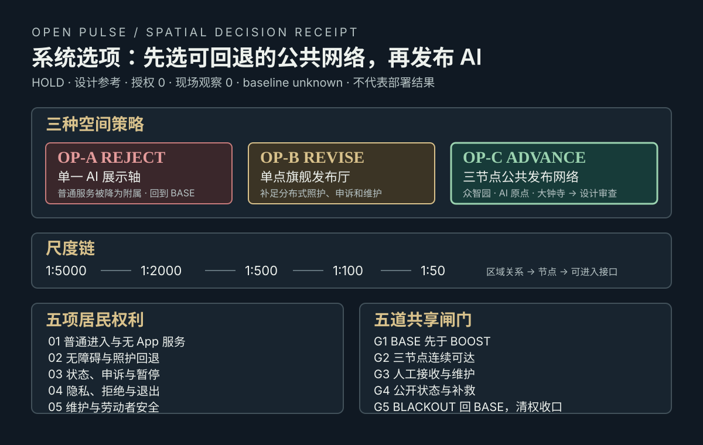
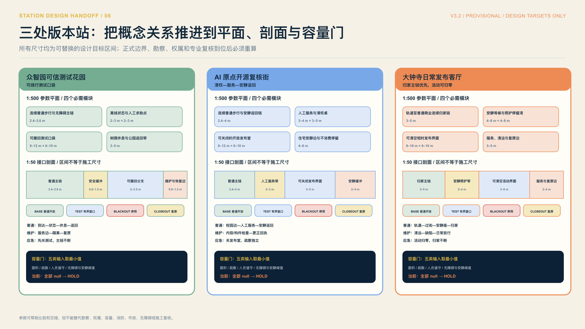
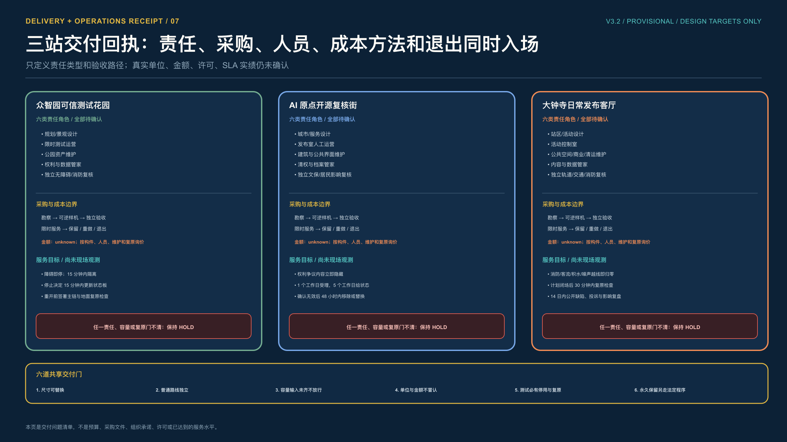

# 京张开源脉冲，城市发布自己的公共版本

> **城市不追随模型版本，城市发布自己的公共版本。**

## 执行摘要

模型按月更新，城市却要对十年后的树荫、雨水、通行和维护负责。京张开源脉冲据此提出一套“公共版本协议”。任何 AI 城市场景都不能从演示直接进入日常，必须依次留下 **问题单 ISSUE、试验分支 FORK、证据测试 TEST、双重审查 REVIEW、公共发布 RELEASE、修复或退役 RETIRE**。六个阶段各有空间载体、具名责任、普通服务、停止条件和可归档回执。[data:visual/assets/civic-pulse-protocol.json] [source:NIST-AI-RMF-1.0]

空间上，一条始终开放的公共主脊串联三座“版本站”。众智园负责可信测试，AI 原点负责开源复核与转化，大钟寺负责把通过审查的能力放回普通人的一天；中关村科技服务翼提供企业、人才、法务和资本接口，小月河场景协作翼提供社区、蓝绿和日常问题接口。任务书中的北纬社区、未来科学城、怀柔科学城、北京经开区和京津冀网络只作为可进一步协商的接口，不代表已经确认合作。[source:AGENT-TASKBOOK] [depth:overall_spatial_structure]

方案当前只完成概念设计、机器复算和一组本地合成桌面回放。S-02 低速配送场景的离线夹具可以复跑停止、撤回和恢复逻辑，但现场窗口仍为 **HOLD / 未授权 / 未运行**；这不是机器人性能、安全、公共接受或部署结果。普通步行、人工服务和手推车配送在任何状态下都保持可用。[data:visual/assets/open-pulse-tabletop-evidence.json] [data:visual/assets/example-s02-embodied-test-window.json]

## 普通路径先行，AI 只做可撤回增益

三处重点区各保留一条不依赖账号、模型或网络的普通服务路径。众智园把人工配送放在低速机器人窗口旁，AI 原点把人工柜台放在流程检索旁，大钟寺把居民归家和普通商业放在活动容量提示旁。每条路径都留下五步回执，先看普通入口，再看 AI 做什么，随后确认人工接管、停止条件和恢复动作 [data:visual/assets/open-pulse-service-equivalence-atlas.json] [data:visual/assets/run-open-pulse-service-equivalence.js]。

| 回执步骤 | 读者要核对的内容 | 当前边界 |
| --- | --- | --- |
| 看见普通入口 | 步行、纸面、人工和公开规则仍然可用 | 概念合同 |
| 知道 AI 做什么 | 只描述有限的检索、提示或窗口增益 | 角色待复核 |
| 人工可以接管 | 具名责任、投诉和退出入口留在路径上 | 尚未授权 |
| 失败立即停用 | 冲突、越权、消防或无障碍问题触发停止 | 合成回放 |
| 回到日常并留回执 | 撤回设备或数字层，保留决定记录 | 现场结果 unknown |

当前回放只检查包内 14 条场景、8 项运营动作、3 处节点和 8 类画像的连接，4 个负向夹具均应回到 HOLD。它不证明居民体验、服务绩效、现场无障碍、许可、人员值守或官方评分 [data:visual/assets/open-pulse-service-equivalence-atlas.json]。

## 系统选项先于 AI 发布

普通路径已经说明“不能牺牲什么”，还需要说明“为什么选这套空间组织”。`visual/assets/open-pulse-spatial-decision.json` 将三个候选放在同一张回执上：OP-A“单一 AI 展示轴”直接 `REJECT`；OP-B“单点旗舰发布厅”先 `REVISE`，补齐分布式照护、申诉和维护；OP-C“三节点公共发布网络”才允许 `ADVANCE_TO_DESIGN_REVIEW`。这里的 advance 只代表进入下一轮空间设计审查，不代表批准、施工、采购、部署或排名。

决策沿 `1:5000 → 1:2000 → 1:500 → 1:100 → 1:50` 展开：从区域公共服务关系、走廊缝隙、三处重点区网络，到状态/路线/申诉/维护交接，再到一个人能否读懂、进入、拒绝、申诉并离开。五项权利是普通进入与无 App 服务、无障碍与照护回退、状态/申诉/暂停、隐私/拒绝/退出、维护与劳动者安全；五道闸门是 `BASE` 先于 `BOOST`、三节点连续可达、人工接收与维护、公开状态与补救、`BLACKOUT` 回到 `BASE` 并清权收口。当前仍为 `HOLD`、零授权、零现场观察、`unknown` baseline、空绩效和空现场声称；`numeric_dimensions=null`，不把尺度链写成施工尺寸。[data:visual/assets/open-pulse-spatial-decision.json] [source:NIST-AI-RMF-1.0]

`run-open-pulse-spatial-decision.js` 与 6 个负向夹具会拒绝非 `HOLD`、错误选项、断裂尺度链、缺失权利和现场声称。任一共享闸门不通过，OP-C 只能回到 `BASE`，不能扩容。它补的是评审者的选择与止损路径，不是新增现场事实。

## 设计依据与资料清单

第一层依据是公开征集公告与面向智能体任务书，它们规定三层工作范围、三处重点区域、五大功能、“三区两翼”协同和成果深度。[source:OFFICIAL-ANNOUNCEMENT] [source:AGENT-TASKBOOK] 第二层依据是仓库 `brief/site-package/` 中的结构化任务、标准、枚举和临时边界。[source:SITE-PACKAGE] [source:SOURCE-REGISTRY] 第三层是北京公开政策、国际标准与同行评议研究。外部资料只用于定义方法和待核事项，不把外地绩效搬到京张。

当前 `SITE-001` 与三处 `PROV-KEY-*` 是临时粗略几何，可用于概念构图、拓扑检查和包内指标复算，不是官方红线、权属、道路红线或审批依据。取得正式 polygon 后，九个 GeoJSON、面积比例、PDF、HTML 和正文须整体重算。[data:geometry/site_boundary.geojson#SITE-001] [data:geometry/key_areas.geojson#PROV-KEY-001] [metric:site_area_sqm]

| 证据状态 | 可以支持什么 | 不能支持什么 |
| --- | --- | --- |
| official / public | 任务范围、政策方向、方法与法规底线 | 项目审批、合作、投资或现场绩效 |
| provisional geometry | 概念空间关系、机器复算与方案比较 | 法定面积、控规强度、权属与工程落位 |
| design target | 下一轮验收问题、指标和停止条件 | 已达标、已服务或已改善 |
| field unknown / hold | 明确缺口、责任和下一道门 | 用桌面结果替代现场安全与公众体验 |

城市实验的长期价值来自持续学习、嵌入日常治理、专业化、知识共享和公众参与的组合，而非一次性试点；NIST AI RMF 强调贯穿生命周期的治理、情境识别、测量与处置；英国 ATRS 提供了公开记录算法用途、责任与影响的参考格式。本案只吸收这些机制，不把它们写成本地法定要求。[source:ANICHE-URBAN-LIVING-LAB-LONGEVITY-2026] [source:NIST-AI-RMF-1.0] [source:CASE-UK-ATRS]

## 三层范围工作框架

三层范围共享同一条公共版本链，避免战略、总图和重点区各说一套话。

| 层级 | 关键问题 | 设计成果 | 公共版本回执 |
| --- | --- | --- | --- |
| 43.6 km² 统筹研究 | AI 产业和未来城市如何协同 | 高校、企业、社区和专业服务组成的问题网络 | 哪类问题进入京张、由谁接收、如何回流 |
| 11.4 km² 总体设计 | 更新、交通、蓝绿和服务如何落图 | 一条公共主脊、三站、两翼、三条东西缝合线 | 哪些空间保持日常开放，哪些只作有界分支 |
| 368.4 ha 重点区域 | 场景如何走完、停止并恢复 | 三座版本站的节点、角色、门槛与普通路线 | 每次测试的证据包、决定、公开状态和退役路径 |

图中的面积来自当前临时几何；三处重点区位置表达工作关系，不表达正式地块边界。主脊优先保证步行、无障碍、休息、导视和人工服务，两翼承担问题与资源的进入、回流，不在公园上叠加一条封闭“AI 专用带”。[data:geometry/roads.geojson#ROAD-001] [data:geometry/public_space.geojson#PUBLIC-001]

## 统筹研究范围产业与未来城市研究

京张带要降低城市创新的验证成本，最新模型只有在解决真实问题时才进入试验。高校和开发者可以带来方法与原型，企业可以带来产品和维护能力，居民与一线人员提出真实问题，专业团队负责安全、无障碍、法务、数据、消防和市政审查。每个参与方只在已获授权的范围内工作，贡献、异议和撤回都进入版本记录。[data:visual/assets/policy-enterprise-playbook.json]

三座版本站各自处理一个问题。众智园先看能否安全、稳定地测，AI 原点检查证据、权利和接口能否被别人复核；到了大钟寺，验收标准变成普通人不用账号、不懂模型，仍能使用、拒绝并回到日常。区域之间只交换问题、证据、方法和回执，不交换未经授权的个体数据，也不把概念网络写成既有合作。[data:visual/assets/regional-ecosystem.json]

品牌只保留一个可执行含义。**Open Pulse 是城市公共版本的发布节奏**。标记、状态板和回执用同一组 ISSUE / FORK / TEST / REVIEW / RELEASE / RETIRE 词汇，让公众在三处站点都能读懂当前状态；标识是自生成概念，不是注册商标或既有政府品牌。[data:assets/identity/open-pulse-mark.svg] [data:visual/assets/identity-system.json]

## 总体设计范围城市更新与控规深度城市设计

总体设计以“公共基线先行、测试口袋可撤回、版本站可维护”为更新原则。连续绿地和公共空间构成主脊；AI 研发、产业服务、社区配套沿既有城市界面组织成可调整的概念分区；小型测试只进入可封闭、可绕行、可恢复的口袋，不占用无障碍主链、消防通道和普通服务。

当前包内几何复算得到临时总体范围 11.41 km²，连续绿地占比 12.34%，公共空间占比 7.33%。这些数值用于检查图层是否自洽，不是法定指标。[metric:site_area_sqm] [metric:green_ratio] [metric:public_space_ratio] 概念建筑基底占比为 2.72%；容积率保持 unknown，待正式控规、权属、现状建筑、市政和文保资料到位后再定。[metric:building_footprint_ratio] [data:metrics.json]

空间控制分为三类。长期公共基线采用耐久、无账号、低维护构件；试验分支采用租赁或可拆组件并保留恢复预算；永久建设只在正式边界、专业论证和公众审查后讨论。任何 AI 设备都不能反向决定法定用途、开发强度或拆迁范围。[depth:development_intensity_controls]

## 重点区域详细设计

| 版本站 | 一段可走完的日常路线 | 版本职责 | 未满足时如何处理 |
| --- | --- | --- | --- |
| 众智园可信测试花园 | 公园到达 → 状态板 → 无障碍缝合口 → 雨水树池 → 预约测试 → 回到公园 | 建立有界分支，完成模型、具身智能、能耗、雨洪和安全测试 | 河道、防洪、交通、权属、消防或人工接管缺一项，不开放测试 |
| AI 原点开源复核街 | 校园边界 → 发布厅 → 清权桌 → 贡献墙 → 共享学习 → 安静居住边 | 复核来源、许可、接口、可解释性和人工替代，形成可复用证据包 | 校园通行、文保、搬迁影响、授权或撤回机制不清，不合并版本 |
| 大钟寺日常发布客厅 | 轨道到达 → 四向过街 → 安静座位 → 短时展示 → 普通商业 → 日常回归 | 只发布通过双重审查的场景，公开状态、责任、申诉和退役时间 | 轨道、道路、消防、客流、噪声或应急门未过，活动降容至零 |

三处图形均来自 `geometry/key_areas.geojson` 的临时范围。节点序列是概念性空间与运营合同，不是建筑施工图、工程量、地块审批或已完成体验。[data:visual/assets/key-area-node-plans.json] [depth:three_key_area_detailed_design]

### 众智园：测试口袋可以关，公园主链不能断

众智园把一条 2.4—3.6 米的普通步行与无障碍主链作为参数底线，在主链之外依次放置离线状态与人工求助点、可撤回测试口袋、树荫休息与公园返回带。1:50 接口剖面把普通主链、安全缓冲、测试分支和维护复原边分开，避免设备停靠、围挡或检修反向占用日常通行。这些数值是下一轮比较方案的目标区间，不是现场净宽或施工尺寸；河道、防洪、交通、权属、消防和无障碍复核未完成前，容量输入全部为 null，决定保持 HOLD。[data:visual/assets/open-pulse-station-delivery-contract.json]

### AI 原点：清权、人工服务和安静返回在一条街上

AI 原点先保留 2.4—4.0 米的普通与安静返回链，再组织人工服务与清权桌、可关闭发布室、住宅安静边和不消费停留。发布界面有 BASE、TEST_WINDOW、BLACKOUT、CLOSEOUT 四个状态：内容发生权利争议时先隐藏数字层，纸面目录、人工服务、疏散和安静返回不随之关闭。容量不按屏幕或展项数量推定，而取可用面积、疏散、人工服务和安静边承载的最小值；四项输入未核前不发布。[data:visual/assets/open-pulse-station-delivery-contract.json]

### 大钟寺：活动容量可以归零，居民归家路线仍须成立

大钟寺以 3.0—5.0 米的轨道至普通商业归家链为底盘，把安静等候、照护停留、短时发布和清运复原放在可清空的侧向界面。任何消防、客流、积水、噪声或居民通行门越线，活动容量立即降为零；显示与活动停止，但轨道到达、过街、安静座位、普通商业和归家链继续工作。可用面积、轨道与过街、消防疏散、安静路线和人员值守均待专业输入，不以概念图填入人数。[data:visual/assets/open-pulse-station-delivery-contract.json]

三站共登记 12 个参数平面模块、12 段接口剖面、9 处待确认权属接口和三条容量公式。参数让评审者能够比较空间取舍，也把下一轮勘察问题钉在图上；它仍不能代替正式红线、现状测绘、产权、市政、消防、交通、无障碍或施工复核。

## AI 创新生态、人才画像与 AI+ 场景

五类使用者提供五个独立验收视角，不能被简化为营销画像。周边居民检验日常开放与低扰动；老人、残障者和照护者检验无障碍与无 App 路径；维护人员检验故障、备件和接管；高校师生与开发者检验贡献、复现和撤回；企业与访客检验服务接口、合规和国际沟通。任何平均分都不能掩盖某一组无法使用或承担额外风险。[metric:user_persona_count] [data:visual/assets/persona-and-inclusion-matrix.json]

14 个场景被压成六类城市任务，每类都必须有普通服务和退出条件。

| 城市任务 | 场景示例 | 最小数据 | 人工责任与普通替代 |
| --- | --- | --- | --- |
| 通行与无障碍 | 慢行断点、无障碍辅助、低速配送 | 人工计数、障碍、事件日志 | 交通/无障碍负责人；实体导视、手推车和人工配送 |
| 研发与安全 | 模型红队、数据沙盒、具身智能测试 | 清权样本、模型卡、急停与接管记录 | 评测与安全负责人；纸面评测、封闭测试 |
| 企业与人才服务 | 开源发布、企业服务、人才协作 | 授权材料、公开流程、审计日志 | 具名服务负责人；人工柜台和纸面目录 |
| 健康与文化 | 非诊断导航、文化导视、学习服务 | 最小转介信息、清权史料 | 专业转介与文化负责人；人工讲解、纸本和语音 |
| 商业与活动 | 智能零售、开发者周、国际交流 | 聚合客流、消防、噪声与内容清单 | 活动控制室；普通商业、安静路线和取消机制 |
| 蓝绿与运维 | 雨水树池、夜间安静链、设施巡检 | 积水点、照度/噪声、人工工单 | 资产负责人；人工清疏、巡查和静态照明 |

S-02 是当前唯一执行过本地合成桌面回放的样例。4/4 夹具、6/6 检查和 5/5 恢复步骤为 PASS，只证明协议脚本可复跑；现场路线、无障碍、安全、许可、维护责任和公众接受尚无证据，故 RELEASE 未签发。[metric:scenario_card_count] [data:visual/assets/open-pulse-tabletop-evidence.json]

## 用地、建筑规模与拆改留方案

四类概念用地完整覆盖临时范围，包括 AI 研发创新、公园绿地与开敞空间、产业与商业服务、社区服务与配套。分区用于比较功能关系，不改变法定用途。建筑只建立保留、修缮、可逆嵌入、待专业判定四类工作标签；在正式现状普查、产权、结构、消防、文保和控规条件缺失时，不给出总建筑规模、容积率、高度或拆除量承诺。[data:geometry/land_use.geojson#LU-001] [data:geometry/buildings.geojson#BLDG-001]

新增构件优先轻量、可拆、可维修。状态板、触觉地图、遮阴座椅、人工服务台、设备停靠位、急停与恢复标识均须有资产编号、维护责任、备件和退役去向。长期保留与否由使用证据和维护能力决定，不由“智能化程度”决定。[source:ISO-55001-2024] [source:ASSET-MANAGEMENT-GBT33172]

## 交通、轨道、市政与公共服务设施

概念慢行网络长 13.01 km，其中南北公共主脊约 9.60 km，三条东西连接分别服务三处重点区；长度来自当前 `roads.geojson` 投影复算，不是工程中心线。[metric:design_slow_mobility_network_length_m] [metric:design_north_south_spine_length_m] [metric:design_east_west_connector_count] 轨道站名和 189 个 OSM 过街点只用于发现待核接口，不能代替站口、信号、无障碍和交通安全审计。[metric:osm_mapped_crossing_count]

具身智能场景服从四级放行。G0 普通路线持续可用；G1 本地合成桌面回放；G2 独立无障碍、安全、许可和维护复核；G3 才可讨论一段有见证的有限现场窗口。行人冲突、通行净宽变化、急停失败、接管人失去视线、雨洪或消防条件不满足，立即清空设备并恢复普通路线。[source:ISO-13482-SERVICE-ROBOT-SAFETY] [source:ISO-TR-4448-PUBLIC-MOBILE-ROBOTS]

市政与公共服务采用“断网仍可用”的最低合同。实体导视、人工窗口、被动排水、应急照明和手动接管不能因传感器、模型、网络或供应商退出而失效。能源、排水、消防和端侧算力容量均待正式资料和专业复核，不用概念图推定承载。[source:RESILIENT-CITY-INFRASTRUCTURE-2024]

## 蓝绿空间、公共空间与城市风貌

蓝绿系统首先服务树荫、雨水、休息、无障碍和夜间安静，再作为传感与算法场景。众智园侧重清河界面、雨水树池和测试口袋；AI 原点侧重校园与社区之间的慢行、安静学习与不消费停留；大钟寺侧重站城过街、活动降容、雨天回归和夜间低扰动。传感器可增加预警，但排水路径、树池、座椅和人工巡查必须独立成立。[source:BEIJING-CLIMATE-ADAPTATION-2024] [source:BEIJING-FLOOD-PLAN-2021-2025] [source:BEIJING-ACCESSIBILITY-REGULATION]

风、热、空气、雨洪、生态和照明现状仍为 unknown。方案只预注册测点、仪器、校准、模型对齐、停止条件与专业签字路径；没有现场测量、CFD、SWMM、居民调查或健康结果时，不给出改善百分比。[data:visual/assets/wind-health-field-protocol.json] [source:AIJ-CFD-PEDESTRIAN-WIND-2008] [source:BEIJING-LIGHTING-GUIDE-2025]

城市风貌保留铁路遗产的线性、节奏、材料耐久和可维护性。技术构件使用低眩光、可读状态和可撤回安装；“开源”体现为可解释、可修补、可归档的城市方法，不把屏幕数量当作未来感。

## 更新项目清单、实施政策与分期计划

| 阶段 | 时间建议 | 先做什么 | 放行证据 | 退出条件 |
| --- | --- | --- | --- | --- |
| P0 锁基线 | 0 至 3 个月 | 替换正式边界，补现状、权属、无障碍、消防、市政和公众基线 | 版本化底图、缺口清单、普通路线验收 | 关键资料或责任缺失则不进入试点 |
| P1 建三站 | 4 至 9 个月 | 建立问题墙、清权桌、状态板、人工窗口和可逆测试口袋 | 资产责任、维护预算、投诉与撤回路径 | 普通服务被挤占或维护无人负责即暂停 |
| P2 小范围发布 | 10 至 18 个月 | 每站最多启动一个有见证场景，发布公开回执 | 基线、事件、分组影响、专业审查与恢复记录 | 安全、权利、无障碍、生态或群体差异越线即退回 |
| P3 复盘与迁移 | 每年 | 比较版本，决定扩展、修复或退役，公开失败档案 | 年度证据账、预算、工单、公众异议和退役清单 | 证据不可复现或长期维护成本失控则退役 |

八项运维包把上述阶段拆成官方边界复核、人的体验基线、风热雨洪验证、具身智能测试、开源清权、大钟寺活动降容、雨洪与夜间运维、年度复盘。参与主体先按证据责任分为组织方资料责任人、交通与无障碍专业团队、社区联络者、场地维护者、测试观察者和独立复核团队；真实主体、预算、采购与 SLA 仍需由后续专业和公共程序确认。P1/P2 首轮只读五项指标：普通路线完成率、人工接管响应时长、投诉闭环率、撤回执行率和维护工单按期率；任一指标没有基线就保持 `unknown`，不发布。[data:visual/assets/operations-matrix.json]

### 责任先写成岗位，不冒认具体单位

每站先设六类责任：设计牵头、最终裁决、窗口运营、资产维护、权利与数据、独立验收。众智园侧重规划景观、测试运营和公园维护；AI 原点侧重城市与服务设计、发布室人工运营、清权归档和居民影响复核；大钟寺侧重站区活动设计、活动控制、公共空间与清运维护、轨道交通和消防复核。这里登记的是责任原型，不是已签约组织；六类岗位均为 unconfirmed，缺一类就不进入窗口。[data:visual/assets/open-pulse-station-delivery-contract.json]

### 采购和成本先写方法，不用假数字制造可实施感

三站采用同一条采购顺序：勘察与方案复核、可逆样机、独立验收、限时服务采购、保留/重做/退出裁决。金额上下限保持 null，待工程量和市场询价后再由造价专业按构件、开放时窗人员、维护周期、清权与数据工作、最终复原责任分别计取。这样可以提前看见成本由谁产生，却不会把没有图纸、数量和授权的估算写成预算承诺。[data:visual/assets/open-pulse-station-delivery-contract.json]

### 服务水平只作为下一轮验收目标，不写成已经达到

三站共设置 9 项服务目标。众智园要求关键障碍立即停、15 分钟内隔离并更新状态；AI 原点要求争议内容先隐藏、1 个工作日受理、5 个工作日给出状态，确认无效后 48 小时内移除或替换；大钟寺要求越线即把活动容量归零、计划闭场后 30 分钟内完成复原检查、14 日内公开缺陷和投诉复盘。这些时间均标为 `design_target_not_observed`。runner 会拒绝把目标改写成现场实绩、填入未经核验的容量或成本、确认不存在的权属主体，或删掉 BLACKOUT/CLOSEOUT 回退。[data:visual/assets/run-open-pulse-station-delivery.js] [data:visual/assets/test-open-pulse-station-delivery.js]

## 指标体系、面积复算与合规矩阵

指标分成三本账。空间账只记录可从 GeoJSON 复算的面积、长度和数量；服务账在现场前保持 unknown；版本账记录每个场景是否具备问题单、责任人、普通替代、证据包、公开决定和退役路径。六项缺一，版本不得 RELEASE。

| 指标组 | 当前可确认 | 仍为 unknown / hold | 决策用途 |
| --- | --- | --- | --- |
| 空间账 | 11.41 km² 临时范围、12.34% 绿地、7.33% 公共空间、13.01 km 概念慢行网 | 法定面积、FAR、高度、工程容量 | 检查图层闭合，正式数据到位后整体重算 |
| 场景账 | 14 张运营合同、3 个产业验证窗口、S-02 桌面回放 PASS | 现场安全、通行、公众接受与服务成效 | 决定是否允许进入独立专业复核 |
| 版本账 | 六段协议、普通替代和停止规则已定义 | 真实责任签字、预算、许可、现场基线 | 决定 ISSUE 留档、FORK、REVIEW、RELEASE 或 RETIRE |

`compliance_matrix.json` 将公告和任务书要求映射到章节、图层、指标、图纸与 HTML；`standard_matrix.json` 记录标准用途和非替代边界；`design_depth_matrix.json` 记录诊断、结构、重点区、实施与复算深度。机器 PASS 只说明结构完整，不是专业评分或现场批准。[data:compliance_matrix.json] [data:standard_matrix.json] [data:design_depth_matrix.json]

## 风险、版权与合规说明

| 风险 | 立即停止条件 | 重新进入下一阶段需要什么 |
| --- | --- | --- |
| 临时几何被误作法定条件 | 图面或文字把 provisional 写成 official | 正式来源、版本比对、全包重算与专业复核 |
| 无障碍或普通服务中断 | 主链受阻、无人工替代、拒绝/申诉不可达 | 独立路线审计、修复记录、受影响群体复测 |
| 具身智能安全失效 | 急停/接管失败、冲突、设备未回泊位 | 事故复盘、封闭测试、责任签字和见证窗口 |
| 隐私、版权或授权不清 | 来源、同意、留存、署名或撤回存在缺口 | 清权台账、更正/删除、最小数据与公开说明 |
| 雨洪、消防、生态或夜间扰动 | 专业门槛未过或预警触发 | 现场数据、专业签字、降容方案和恢复验收 |
| 维护、预算或主体失联 | 工单逾期、备件缺失、责任人不可用 | 新责任与预算、修复证明；无法持续则 RETIRE |

所有图表由包内几何、指标和自生成脚本派生；外部政策、标准和研究均在 `sources.json` 登记用途边界。图片、SVG、HTML、PDF 和机器可读资产逐路径进入版权台账。`COMMUNITY-DISPLAY-ONLY` 只授权本仓库社区展示，不等于第三方材料的再许可。[data:visual/assets/copyright-ledger.json]

本案不主张合作、供地、投资、审批、采购、获奖、现场测试或绩效已经成立。任何落地均需正式边界、现状与权属核验，规划、交通、市政、消防、文保、无障碍、数据与安全专业审查，以及真实公众参与。

## 参考资料

- `brief/public-brief.md`
- `brief/site-package/design_brief.json`
- `brief/site-package/agent_taskbook.json`
- `data/processed/agent_fact_pack.md`
附录回执入口（一）：[data:visual/assets/civic-pulse-protocol.json] [data:visual/assets/scenario-operation-matrix.json] [data:visual/assets/operations-matrix.json]

附录回执入口（二）：[data:visual/assets/open-pulse-tabletop-evidence.json] [data:visual/assets/example-s02-embodied-test-window.json]
- 征集与治理依据 [source:OFFICIAL-ANNOUNCEMENT]、[source:NIST-AI-RMF-1.0]
- 长期运行与公开透明依据 [source:ANICHE-URBAN-LIVING-LAB-LONGEVITY-2026]、[source:CASE-UK-ATRS]
- 无障碍与具身智能安全依据 [source:BEIJING-ACCESSIBILITY-REGULATION]、[source:ISO-13482-SERVICE-ROBOT-SAFETY]
