# Jing-Zhang Mobility Commons: An Enterprise–Resident Mobility Operating System

> The next move for the Jing-Zhang corridor is to place enterprise arrival and loading, resident school, care and return trips, rail transfers, curb parking and maintenance complaints in one replayable mobility operating system. Every AI optimisation must first check that the slowest person has not been pushed further back.

This is a new independent submission package maintained within this directory. The proposal consists of one time-windowed curb ledger, two aggregated demand registers, three connection types, four service levels and five verification gates. Enterprise data is submitted as grouped time windows, not personal traces. Resident needs cover school, care, health, daily shopping, night return and accessibility. Metro and bus remain the structural backbone; bicycle and walking/accessibility provide the first/last mile; cars are managed for necessary trips, parking, loading, charging, drop-off and emergency access; shared shuttles and AI recommendations are reversible feeder services. External commuting is kept in the OD boundary, and future air mobility is only a conditional experiment. All geometry remains provisional until official boundaries, right-of-way, traffic counts, ownership and field audits are available.

## One-Page Executive Brief: Accept One Door-to-Door Chain Before Expanding Shared Feeders

An ordinary person is not a flow point in a model. At each step—leaving, transferring, encountering disruption, asking for help and returning home—they need an understandable choice. The first reversible pilot accepts one minimum chain: **choose a public/accessibility or human route → request one mobility service → trigger human or rail/bus takeover when a transfer is missed, the network is offline, weather turns bad or a curb conflict occurs → freeze the booking and exit when the state is unsafe or unreachable → let an independent reviewer replay the evidence and decide whether to repair, expand or withdraw**. This is not an operational claim. The current M-09 is only a local, offline, no-personal-data tabletop replay of four synthetic requests; `performance_results=null` and `operational_status=not_authorized_not_run`.

To make the tabletop replay a readable spatial acceptance entry point, the four request types each connect to a trigger and a human/public-transport fallback; the brief checks only reservation freeze, fallback retention, gap recording and no P1/P2 advancement. The exact requests, triggers and 6/6 checks remain in the package fixture; `performance_results=null`, so a synthetic PASS is not field performance [data:visual/assets/mobility-tabletop-contract.json] [data:visual/assets/mobility-tabletop-evidence.json].

| Step | Space/service visible to an ordinary person | Evidence retained | Fail-closed action |
| --- | --- | --- | --- |
| 1. Choose | Station wayfinding, continuous walking/wheelchair route, human/phone/paper entry and shared-feeder candidate shown together | Choice, service window, accessibility-need category and version; no continuous personal trace | Keep an equivalent human route when digital access fails; do not open without one |
| 2. Request | Rail/bus transfer, shuttle/minibus candidate, curb loading or community service desk | Request ID, grouped service type, start/end window, responsible role and alternative route | Register only, without booking, when ownership, responsibility, capacity or consent boundaries are unknown |
| 3. Take over | After a missed transfer, outage, rain/snow, accessibility obstruction or curb conflict, a person points to rail/bus or a human route | Trigger, takeover person, handoff time, clearing action and complaint entry | Freeze automated booking and prefer human/public transport; stop if nobody can take over |
| 4. Exit | Signage, human desk and paper/phone complaint route allow rerouting, getting home or cancelling | Cancellation reason, alternative route, unresolved item and `not_authorized_not_run` state | Do not expand or report success when fire, accessibility, privacy or safety gates fail |
| 5. Replay | An independent reviewer replays one door-to-door chain and compares continue, repair or withdraw | Minimal log, grouped result, complaint-closure evidence, version and review decision | Return to P0 investigation and human service when evidence is missing or the slowest group worsens |

This table connects the design boards, curb ledger, M-09 fallback tabletop and P0/P1/P2 phasing to one acceptance entry point. PASS for four synthetic requests proves only that the state machine and rollback logic can be replayed; it does not prove real demand, accessibility performance, staffing, public acceptance or safety.

## One Synthetic Resident's Complete Journey: A Care Trip Needs a Return Route

The following is a synthetic persona, not a resident interview. Zhou Lan accompanies a family member to a hospital, and a phone or account is not a condition of access. She first obtains a paper, telephone or staffed route at the AI Origin Community desk, follows a continuous accessible segment toward Dazhongsi, and keeps a staffed handoff with rail and bus choices at the station. When snow, an outage or a curb conflict occurs, the booking freezes and service returns to human support and ground public transport. The return plan, care handoff and complaint entry must be registered before departure [data:visual/assets/mobility-ordinary-journey-contract.json] [data:visual/assets/mobility-ordinary-journey-evidence.json].

| Synthetic day | What Zhou must complete | Space and scenario | Action when evidence is missing |
| --- | --- | --- | --- |
| Before departure | Obtain an app-independent outbound and return choice | AI Origin Community desk, `M-05` | Record the need without booking when a human entry or return plan is missing |
| Community to station | Check the continuous accessible segment and weather fallback | `MOB-NODE-002`, `M-06` | Keep the case at `P0` when the walk-through is undated; do not write an accessibility result |
| Station transfer | Complete a staffed handoff while keeping rail and bus choices | Dazhongsi `MOB-NODE-003`, `M-07` | Keep the digital recommendation closed when lift, crossing or ownership evidence is missing |
| Disruption | Freeze the booking and use human and ground public transport | `M-09` snow, outage or curb conflict | Freeze and return to ordinary public transport when no person can take over |
| Return to community | Confirm the care handoff and route home | AI Origin Community, `M-05` | Do not book or expand without a return plan |
| Complaint replay | Record the problem and wait for an owner and independent replay | Dazhongsi service interface, `M-10` | Do not close the case without an owner, timestamp or replay |

This journey exposes four field gaps. No dated accessibility walk-through is available, and an authorised organisation has not confirmed the staffed station-handoff role. The M-09 fallback contract still needs a separate return register, and complaint replay cannot stand in for a real response time. All four gaps remain `unknown`; synthetic readouts do not fill them. Six adverse fixtures freeze, stop or return to P0, while three control fixtures preserve an ordinary human equivalent. The figure is `assets/figures/mobility-ordinary-journey.en.svg`. This replay shows only that the path and stop actions can be checked. It does not prove resident experience, field accessibility, staffing, complaint performance or professional approval.

## Why This Is a Jing-Zhang Public-Space Proposal: History, Industry and Daily Mobility on One Line

“Centennial Jing-Zhang” is not a decorative poster in this proposal. It is a public-memory response to arrival, transfer, waiting, maintenance and getting home. The heritage park, station entrances, enterprise front doors and community service desks share wayfinding, shelter, seating, accessible routes and human service, so a person can understand the route before choosing any smart service [source:OFFICIAL-ANNOUNCEMENT].

| Task requirement | Spatial answer visible in the proposal | Boundary kept explicit |
| --- | --- | --- |
| Centennial Jing-Zhang and urban culture | Make heritage, park, station and transfer waiting one walkable, pauseable and explainable public chain | No invented conservation conclusion, historic alignment control or approved cultural project |
| AI innovation belt and regional collaboration | Give Zhongzhiyuan, the AI Origin Community and Dazhongsi enterprise arrival, resident daily access and rail transfer roles in one time-window ledger | Without named institutions, agreements or resident samples, this is not an alliance or partnership claim |
| Planning innovation | Draw curb states, continuous walking, station capacity, fire clearance and human fallback as a closable spatial service layer; automation remains a constrained feeder | No new road redline, parking supply, social-road permit or building-intensity commitment |
| Perceptible AI+ scenarios | At the station, service desk, waiting area and curb board, an ordinary person can see choices, owner, stop condition and redress | Model stress screens do not replace field counts, accessibility review or public experience |
| Long-term operation and communication | Bilingual boards, public aggregate ledgers, asset IDs, complaint closure and P0/P1/P2 review make the proposal updateable | Bilingual display is not an international event, government endorsement or operating result |

This table returns the mobility operating system to five visible urban-design interfaces: station entrance, public space, building ground floor, curb and maintenance point. The three key-area massing and ground-floor choices appear below; spatial relationships remain tied to provisional layers, while implementation dependencies and rollback roles await professional and authorised review [depth:overall_spatial_structure] [data:geometry/key_areas.geojson#PROV-KEY-001].

## What Different People Need First: From Leaving Home to Getting Home

The same network creates different problems for different people. The four entry points below cover residents, enterprise employees, carers and accessibility users, and cross-boundary commuters. They are scenario entry points; they do not become validated demand before field work.

| Group | Immediate problem | First choice offered | Evidence before validation |
| --- | --- | --- | --- |
| Residents | School, health, shopping and night-return chains break at transfers | Rail and bus connections, continuous walking and wheelchair routes, human and phone access | Dated time-slice mode counts, accessibility walkthrough and complaint owner |
| Enterprise employees | Arrival windows, shuttles, parking and loading compete for the same curb | Consolidated-shuttle candidate, curb booking, public transport and guaranteed-ride-home fallback | Grouped employer demand, headway and right-of-way evidence, accountable role |
| Carers and wheelchair users | Care chains cannot wait and continuous routes cannot be cut by parking or loading | Accessibility-priority curb, human guidance, public transport and care-service fallback | Continuous-route audit, assisted-trip record and worst-group readout |
| Cross-boundary commuters | Park-and-ride, rail-bus transfer and arrival time remain unstable | Grouped cross-boundary OD, transfer chain, park-and-ride and departure-window choice | Privacy-preserving OD, station capacity and external-operator coordination record |

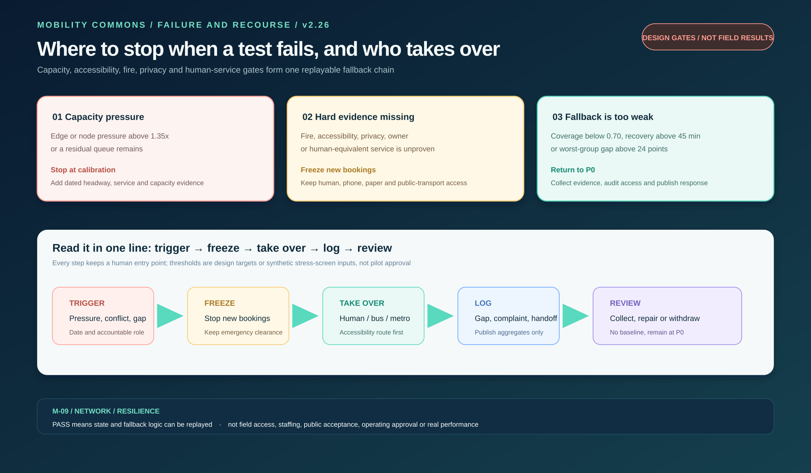

This board answers what happens when a test fails. Its thresholds are design gates or synthetic stress-screen inputs; they are not observed Haidian operating results [data:assets/figures/failure-recourse-board.svg] [data:visual/assets/network-flow-screen.json] [data:visual/assets/resilience-recovery-readout.json].

## Reviewer Guide: Where to Start Across the Seven Dimensions

This is a reviewer navigation aid, not a formal scorecard. Each row gives the shortest reading entry, the strongest evidence surface and the boundary that must remain explicit. The structured counterpart is `visual/assets/review-evidence-index.json`.

| Rubric dimension | Shortest entry | Primary reader | What to inspect first | What it still cannot prove |
| --- | --- | --- | --- |
| Brief alignment | Three-level scope, `compliance_matrix.json` | Planning and governance review | Three research scales, three key areas and AI+mobility task coverage | Provisional geometry is not a statutory redline |
| Originality | One-page brief, responsibility–acceptance contract | Design review | Time-windowed curb ledger, enterprise–resident commons and reversible human fallback | Roles are not signed contracts or partnerships |
| AI/planning innovation | Network-flow and capacity-closure runners | Data and technical review | Population-scale aggregate flow, capacity closure and air-candidate hard block | Synthetic pressure, satisfaction and capacity are not local performance |
| Implementation feasibility | `responsibility-acceptance-contract.json`, M-09 contract | Operations and implementation review | P0/P1/P2 roles, fields, thresholds, stop and rollback paths | Operators, budget, procurement, permits and headways still need dated evidence |
| Public interest/inclusion | One-page brief, M-09 evidence, `service-levels.json` | Residents, enterprises and accessibility review | Accessibility, care and night groups, non-digital access, public-route continuity and redress | No resident sample, consent record or field accessibility performance exists yet |
| Risk/compliance | Network-flow, `assumptions.json`, `sources.json` | Compliance and safety review | Air fail-closed, data minimisation, provisional and not-authorized boundaries | Policy and papers do not replace professional, insurance or permit review |
| Expression completeness | Bilingual proposals, offline HTML, visual, manifest | All readers | Human layer, boards, JSON audit layer, drawings and hash consistency as one package | The index is not an official score, CI result or implementation approval |

The table reduces reviewer search across long evidence and repeated boundary statements without adding a new fact, metric or implementation promise [data:visual/assets/review-evidence-index.json].

## Three status axes. Package, content review and formal professional eligibility

Under the provisional spatial basis, review eligibility is recorded on three axes. `package_state=ready_for_review` means that structure, bilingual files, figures, GeoJSON, metrics, matrices and the manifest pass package gates. `content_review_eligible=true` means an organiser polygon gap does not block maintainer and Review Agent content review of the package. `professional_scoring_eligible=false` keeps official SITE_BOUNDARY and KEY_AREA polygons as prerequisites for the official-spatial-data-dependent professional scoring axis. Maintainers may record a Review Agent intake score on the content-review axis; that score remains separate from formal professional eligibility.

| Status axis | Current value | What it supports | Still required |
| --- | --- | --- | --- |
| Package integrity | `package_state=ready_for_review` | Readable package gates and delivery structure | Official spatial data, field records and professional judgement |
| Content review eligibility | `content_review_eligible=true` | Entry to content review and package design evidence | Content review does not produce field performance, professional sign-off or implementation permission |
| Formal professional scoring eligibility | `professional_scoring_eligible=false` | Official spatial-data prerequisites remain visible | `official_site_boundary` and `official_key_areas` |

The structured record and bilingual board are `visual/assets/review-status-contract.json` and `assets/figures/review-status-contract.en.svg`. This section responds to Issue #1368 on status semantics. It does not change provisional geometry, simulation inputs or the first-ranked project.

## How the six taskbook tasks land in this package

The six taskbook tasks remain belt-wide work. This mobility package is responsible only for the part it can actually deliver. The table puts the mobility contribution first and leaves unsupported work to the organiser, planners, cultural researchers, and future operators. The full machine-readable crosswalk is `visual/assets/taskbook-crosswalk.json`; the bilingual board is `assets/figures/taskbook-crosswalk-board.en.svg`.

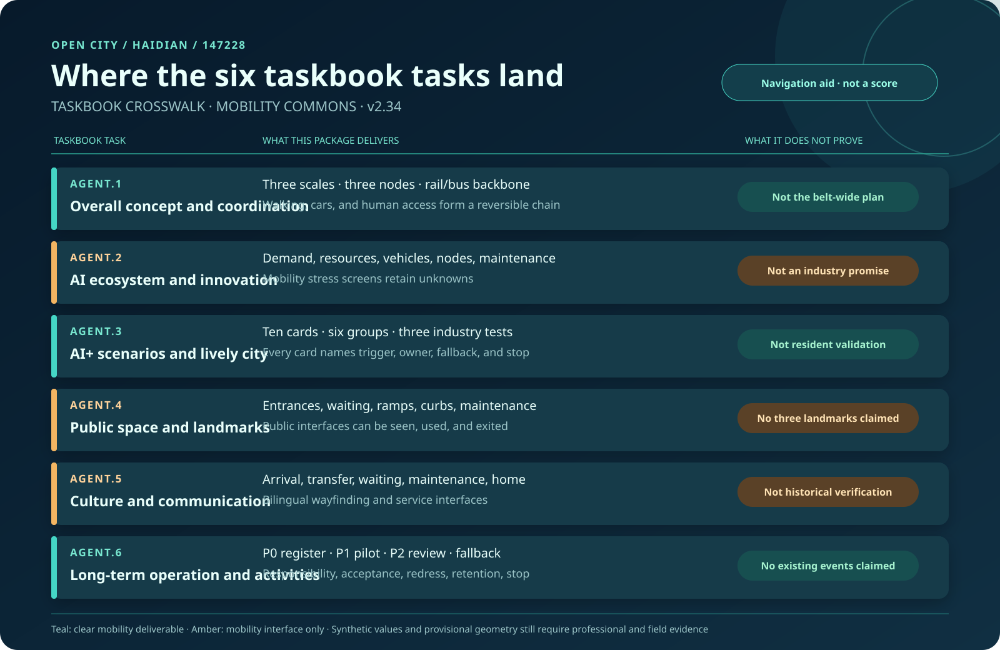

| Task | Package deliverable | Read first | Not claimed |
| --- | --- | --- | --- |
| agent.1 overall coordination | Three scales, three nodes, rail/bus backbone, and a reversible mobility chain | `mobility-spatial-plan.svg`, overall-structure section | Belt-wide master brand, statutory redlines, regulatory metrics, engineering conclusions |
| agent.2 AI ecosystem | Mobility-side ledgers for enterprise, residents, external commuters, vehicles, nodes, curbs, and maintenance | `demand-ledger.json`, `resource-pressure-readout.json` | Industrial attraction, funding, enterprise lists, confirmed partnerships |
| agent.3 AI+ scenarios | Ten bilingual scenario cards, six participant groups, three industry tests, and card-level stop rules | `scenario-cards-board.svg`, startup checks, people-flow section | Resident surveys, observed OD, field operation, public acceptance |
| agent.4 public space | Mobility interfaces at entrances, waiting areas, ramps, bicycle parking, curb desks, and maintenance points | `brand-system-board.svg`, key-area and blue-green sections | Three landmarks, heritage approval, bridge/tunnel engineering, official events |
| agent.5 cultural narrative | A bilingual public-service narrative of arrival, transfer, waiting, maintenance, and home | Mobility Commons public-space section and bilingual boards | Belt-wide cultural system, historical verification, unauthorised copyrighted material |
| agent.6 long-term operation | P0 registration, P1 pilot, P2 review, redress, retention, stop rules, and human fallback | Responsibility contract and M-09 readiness evidence | Annual events, developer community, attraction/conversion, operating contracts |

This table lets a reader find evidence quickly and see the gaps just as quickly. The 3,122,000 synthetic agents, tabletop replay, and package self-checks show only that the model and state logic can be replayed. They do not establish resident needs, field capacity, public consent, approval, or rank. All spatial layers remain provisional constraints, and air mobility stays blocked when evidence or approval is insufficient [data:visual/assets/taskbook-crosswalk.json].

## Reading Labels and Evidence Boundaries

The package uses four labels for numbers. Read the label before reading the value.

| Label | Meaning | What it can show here | What remains pending |
| --- | --- | --- | --- |
| ▲ Synthetic proxy | A runner output under declared inputs | A replayable comparison or pressure point | Field OD, headways, capacity, experience and survey evidence |
| ◇ Design gate | A proposed stop or acceptance condition | When a pilot must stop or fall back | Professional review, accountable operators and dated baselines |
| ★ Known in package | A value readable from a package file | Internal consistency across files | It does not automatically become a Haidian baseline |
| ? Pending official data | A field that cannot be filled responsibly yet | The next evidence collection target | Public, authorized or field evidence |

“Composite mobility-pressure proxy score” is the readable name for the model field `satisfaction_proxy`. It combines time, reliability, accessibility and conflict on one comparison scale. Resident satisfaction, public acceptance and field performance remain pending formal evidence. The claim audit checks that headline numbers carry this wording and point to the same runner in both languages [data:visual/assets/claim-audit.json].

## Calibration debt and parameter provenance. Let every number state its origin

The regional runner now records its mode capacities, base minutes, reliability proxies, conflict proxies, service-unit fields and mode weights in `visual/assets/mode-parameter-provenance.json`. All 234 declared fields are marked `agent_proposed` or `design_target`, with `observed_count=0` and `field_status=not_authorized_not_run`. This does not turn the numbers into field data. It makes their provisional status, method references and next calibration task visible at one entry point.

| Parameter family | Current register | Evidence to replace it | What it supports now |
| --- | ---: | --- | --- |
| Mode and service-unit parameters | 48 fields | Dated service, capacity, route, reliability and conflict observations | Compare modes under declared inputs and expose places to check |
| Mode weights | 180 fields | Grouped OD, mode counts and authorised enterprise and resident input | Replay candidate assignment, not individual choice |
| Synthetic population groups | 6 fields | Population, workforce, care, visitor and service-user evidence | Preserve conservation and coverage in the regional stress screen |

`source_ids` point to method or policy context and do not transfer external coefficients to Haidian. `run-mode-parameter-provenance.js` fails if an `observed` status or non-zero field observation appears and generates the bilingual calibration-debt board. Only an authorised organisation can replace the inputs after dated OD, service, capacity, accessibility and behaviour evidence exists [data:visual/assets/mode-parameter-provenance.json] [data:visual/assets/run-mode-parameter-provenance.js] [source:MATSIM-LARGE-SCALE-ABM] [source:MOBILITY-DATA-METHOD].

## Risk Register: Unknown Is Not a Release, and Air Mobility Stays Blocked

This package turns risk from a warning scattered across files into a readable review chain. Every dimension has evidence paths, triggers, a non-AI equivalent, a stop action and an accountable role. The root `risk.json` supplies eight common risk dimensions; `visual/assets/mobility-risk-register.json` links them to all 18 current `unknown` metrics; `node visual/assets/run-mobility-risk-audit.js --check` checks that paths exist, states remain bounded, unknown metrics remain attached to a risk, and air-ground transfer remains `blocked_until_evidence`.

| Review state | Meaning in this mobility package | Permitted next step | Prohibited leap |
| --- | --- | --- | --- |
| `controlled_by_gate` | A package rule is registered, but field risk has not disappeared | Continue human review, evidence collection and replay | Write safe, operational or achieved |
| `unknown` | Dated field, professional or public evidence is missing | P0 registration, walk-through, survey and recalculation | Fill the gap with synthetic output or paper coefficients |
| `blocked_until_evidence` | Responsibility, safety or permission is incomplete, so the scenario must stop | Keep ordinary transit, human and paper routes | Use air mobility or automation to hide a ground-system gap |
| `not_started` | Not authorised or not begun | Declare triggers, owner and deletion boundary | Present it as a pilot, partnership or operating result |

This register is a package-level risk/evidence index, not a field risk assessment, professional sign-off, operating permission, public consent or official score. `unknown` is not pass, and a local runner PASS never promotes a risk state [data:risk.json] [data:visual/assets/mobility-risk-register.json] [data:visual/assets/run-mobility-risk-audit.js].

## Design Basis and Source List

The open-call requirements cover three spatial scales, three key areas, AI and mobility scenarios, an innovation ecosystem and reviewable drawings and data layers [source:OFFICIAL-ANNOUNCEMENT] [source:AGENT-TASKBOOK]. The package uses the public provisional site package but replaces the narrative, road attributes, metrics, evidence register and visual boards with an enterprise–resident mobility focus. Both the site and key-area polygons declare `official_boundary=false` and `geometry_role=provisional_constraint` [data:geometry/site_boundary.geojson#SITE-001] [data:geometry/key_areas.geojson#PROV-KEY-001].

### Participant-source registration boundary

This package's `sources.json` is the complete source record for this proposal. The maintainer-owned `data/source_registry.json` is a shared catalogue, not a mandatory mirror for participant sources or community-contribution references. Accordingly, `ISSUE-1029-KEY3-ANCHOR` and `SWITCHBACK-PROTOCOL-1119` are registered in this package's source table and evidence index only; their absence from the central registry is neither automatic approval nor prohibition, and they cannot support official location, policy, field-performance or authorization claims. Review should use each source's type, stated use, link, access date and package citation [source:SOURCE-REGISTRY] [source:ISSUE-951-SOURCE-BOUNDARY] [assumption:A-SOURCE-BOUNDARY-001].

Three new public references are used only to make the boundary explicit. The barrier-free environment law connects accessibility work with age-friendly improvement and requires consultation of disabled and older-person representatives and relevant organisations on planning documents that concern accessibility. This package therefore places those roles and a continuous human fallback in the P0 evidence path, without claiming that consultation or a local compliance walkthrough has happened [standard:BARRIER-FREE-ENVIRONMENT-LAW] [source:BARRIER-FREE-ENVIRONMENT-LAW].

The State Council General Office plan on helping older people use smart technology requires traditional service channels to run in parallel with smart services. The package therefore keeps human, telephone, paper and public-transport access alongside digital entry. The policy is national and does not prove local implementation [standard:ELDERLY-SMART-TECH-PLAN-2020-45] [source:ELDERLY-SMART-TECH-PLAN-2020-45].

The Interim Measures for the Management of Generative Artificial Intelligence Services cannot replace transport operating permission, professional safety review or airspace approval. Here it is used only as background for public-service, transparency, rights and complaint boundaries, not as evidence of filing, permission or field safety [standard:GENERATIVE-AI-INTERIM-MEASURES] [source:GENERATIVE-AI-INTERIM-MEASURES].

| New reference | Use in this package | What it cannot establish |
| --- | --- | --- |
| Barrier-Free Environment Law | Age-friendly and accessible participation with a continuous human fallback | A completed local walkthrough or compliance finding |
| State Council General Office Plan 2020-45 | Traditional and smart service channels kept in parallel | Local implementation of the national policy |
| Interim Measures for Generative AI Services | Public-service, transparency and complaint boundaries | Transport permission, airspace approval or field safety |

### 1. Evidence hierarchy for mobility decisions

The package separates policy direction, provisional space, synthetic proxies and field baselines so that “replayable” is not mistaken for “observed”. Every readout must be read with both its permitted and disabled use.

| Evidence level | Package examples | Can support | Cannot support |
| --- | --- | --- | --- |
| Task and transport policy (formal/background) | Open-call announcement, transport plan, parking-service tender | Task coverage, public-transport priority, service interfaces and accountability questions | Corridor baseline, station OD, capacity, right-of-way or implementation commitment |
| Provisional spatial basis | `site_boundary`, `key_areas`, roads and key-area nodes | Concept relationships, ground interfaces, transfer sequence and a whole-package recomputation trigger | Statutory road redlines, cross-section dimensions, ownership, fire or accessibility compliance |
| Known package values and derived readouts | GeoJSON, `metrics.json`, claim audit and service levels | File consistency, relative comparison, issue lists and design gates | Actual footfall, vehicle counts, parking demand, service level or resident satisfaction |
| Synthetic proxies and tabletop replay | Regional commute proxy, M-09, tabletop and negative-fixture runners | State logic, stop/fallback, scenario comparison and fields to collect next | Field performance, public consent, staffing, P1/P2 authorization or official score |
| Administrative/open sources and methods | Statistics, policy, public methods, OSM and TDM research | Question calibration, data-collection priorities and mechanism reference | Local causal effects, partnership facts, siting or return on investment |
| Field and stakeholder baseline (not yet obtained) | OD, accessibility walkthrough, complaint log, enterprise/resident input | Evidence needed later to decide P1/P2 entry | It cannot currently be replaced by a model, case or one event |

The review rule is simple. `known` means only that a value is readable from package files; `unknown` must not be guessed; `design_target` is not field performance; `blocked` stops scale-up. A local PASS proves only that a structure or state machine can be replayed; it is not a field, professional or implementation finding.

Beijing’s 14th Five-Year transport plan frames one-hour door-to-door trips, integrated rail/bus/walking/cycling, public-transport priority and smart transport as policy directions [source:BEIJING-14TH-TRANSPORT-PLAN]. A current Haidian road-parking service tender combines order management, guidance, patrol, equipment inspection, exception handling, backend operations and complaint response. It demonstrates that a curb is an operated asset, not merely a line on a map [source:HAIDIAN-ROAD-PARKING-TENDER-2026]. A Haidian transport planning document requires transit-hub conditions, ground-floor public interfaces, bicycle interchange, emergency routes and traffic-impact review [source:BEIJING-HAIDIAN-TRANSIT-HUB-PDF]. None of these sources is a local baseline for this provisional study area.

Evidence is separated into `known` geometry values, `unknown` local baselines, `design_target` pilot gates and `blocked` conditions. Employer travel-demand-management research supports transit benefits, multimodal subsidies, flexible hours and guaranteed rides home, but its effects are context-dependent and are not copied as Haidian outcomes [source:EMPLOYER-TDM-LONGITUDINAL] [source:EMPLOYER-TDM-GUIDE].

## Site and Stakeholder Evidence Status: Mark the Unknowns Before the Pilot

This package does not claim that its author has visited the site, interviewed residents, consulted enterprises or transit operators, or completed an accessibility walkthrough. `visual/assets/site-and-stakeholder-evidence.json` makes the boundary reviewable: the package currently uses public policy, tender, method and open-map context only; it has no authorised resident or enterprise aggregate register, personal data or stakeholder endorsement. Resident school, care, health, shopping and night-return needs, enterprise arrival, shuttle, loading and charging needs, accessible-route continuity and external commuting are scenario assumptions awaiting validation, not validated demand [data:visual/assets/site-and-stakeholder-evidence.json] [data:assumptions.json].

Affected groups include residents, enterprise employees, carers and children, wheelchair users, night workers, visitors, logistics and maintenance staff, metro and bus operators, accessibility and safety reviewers, and emergency responders. Three questions remain open: could enterprise priority displace resident, accessible or emergency access; can grouped demand be collected with consent, minimisation, retention and deletion controls; and does a disruption fallback actually preserve care and accessible routes? They are registered as open questions, not replaced by model readouts [data:visual/assets/site-and-stakeholder-evidence.json].

## Enterprise–resident public decision ledger. Every question needs a receipt and an exit

Issue #1061 reminds us that personas and scenario cards describe research entrances, not evidence from residents, commuters, operators or enterprises. The package now adds `public-decision-ledger.json`, connecting eight question entrances to a public question, synthetic screen, authorised input, accountable owner, decision state, response receipt and fallback. It keeps field, consent and public-input status unknown and does not turn model readouts into resident support, public consensus or completed consultation [source:ISSUE-1061-PUBLIC-INPUT].

Every entrance retains a staffed desk, phone, paper and de-identified public aggregate log. A question can remain `design_only`. It enters `open_for_authorized_input` only after an authorised organisation defines the public window, consent, minimisation, deletion and appeal rules. Missing receipts, broken fire or accessibility routes, or a missing owner moves it to `pause` or `withdrawn` while ordinary public transport and human access remain. The bilingual board shows the chain on one page; complete fields and fail-closed checks are in [data:visual/assets/public-decision-ledger.json] [data:visual/assets/run-public-decision-ledger.js] [source:CITIZEN-TRANSPORT-PEER-RESEARCH-2026] [source:CURBSPACE-MANAGEMENT-2021].

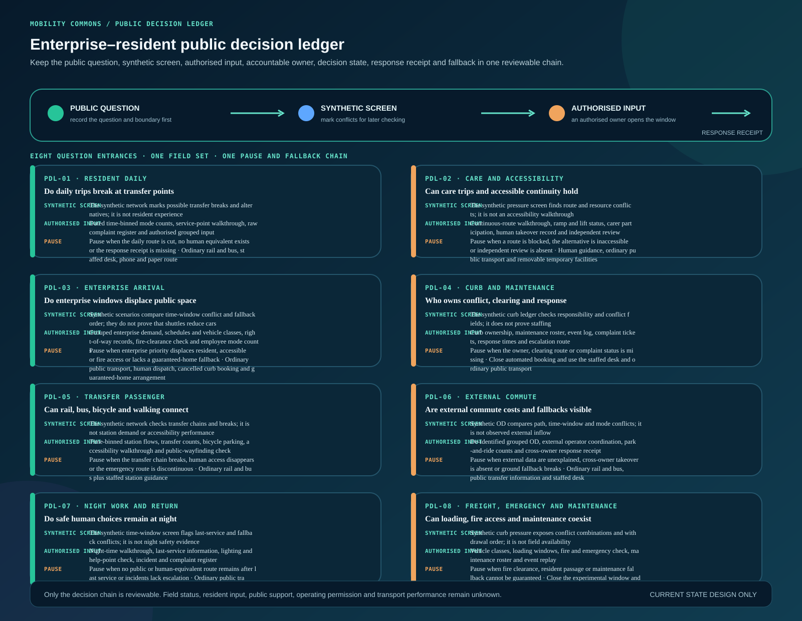

This ledger answers how future questions, records and fallbacks should work. It does not create a resident sample, enterprise list, field satisfaction result or operating permission. All eight entrances remain `not_authorized_not_run`.

P0 therefore starts when an authorised organisation confirms the participation window and responsibility boundary. Proposed role owners are the transport authority, subdistrict office, disabled persons federation or qualified accessibility reviewer, and older-person representatives. They first establish a public notice and response ledger, then collect dated grouped OD and mode counts, and then complete an accessibility and people-flow walkthrough with accessibility and age-friendly participation. Each step needs a date, evidence revision, unblocked metrics and a fallback owner. Not visiting the site does not block a concept submission, but until those records exist the package makes no claim of resident validation, site knowledge, stakeholder support, operating performance or P1/P2 authorisation. It does not upload private interview transcripts or contact details.

## Three-Level Scope Framework

The regional layer studies the rail, bus, campus, enterprise and residential relationships around the Jing-Zhang corridor. The overall layer translates them into access chains, curb states, public-service interfaces, blue-green fallback and maintenance packages. The key-area layer tests one reversible operational package in each of Zhongzhiyuan, the AI Origin Community and Dazhongsi [depth:three_level_scope_framework] [standard:PROJECT-OFFICIAL-ANNOUNCEMENT].

The three scales share the same provisional `site_boundary`, `key_areas`, `land_use`, `buildings`, `roads`, `green_space`, `public_space`, `constraints` and `phasing` layers. The approximately 11.41 km² area is a design-comparison value only [data:geometry/key_areas.geojson#PROV-KEY-001] [metric:site_area_sqm]. A future official revision must trigger one coordinated re-render of all geometry, metrics, drawings and visual cards.

## Coordinated Research Area: Industry and Future City Research

### Enterprise side

Enterprise mobility desks submit grouped demand windows: approximate employee bands, entrances, shuttle periods, freight and loading windows, visitor peaks, night work and emergency needs. The system compares public transport, consolidated shuttles, cycling, walking and shared feeder options. It does not retain individual trajectories. Enterprises receive a service window rather than permanent public right-of-way, and they share responsibility for on-site guidance, cleaning, maintenance and complaint closure.

### Resident side

Resident input records service types and time bands for school, care, health, shopping, night return and accessible travel. It does not require a continuous home-to-work trace. Offline, telephone, paper and human-service routes remain equivalent options. Results must be stratified by age, mobility, care load, night travel and enterprise affiliation; a single average satisfaction score cannot establish equity [source:BEIJING-ACCESSIBILITY-REGULATION] [source:SHARED-MOBILITY-OECD].

### Managed future mobility

Autonomous or on-demand shuttles are treated as regulated feeders, not replacements for rail or unlimited vehicle supply. Research finds that shared autonomous vehicles can complement or compete with transit and may increase vehicle kilometres if supply is unmanaged [source:SAV-TRANSIT-COMPETITION] [source:SAV-MICROTRANSIT]. Every feeder therefore needs capacity, a time window, a responsible operator, an accessible human fallback and a stop condition.

## Overall Design Area: Urban Renewal and Regulatory-Plan-Level Urban Design

### Overall structure: one commons loop, three connection types and four service levels

The overall structure is a shared mobility loop, not a new closed road. Three connection types are used: stable rail/bus interchange, consolidated enterprise/shared feeder services, and human-first accessible walking. Four service levels are measured: route continuity, transfer reliability, orderly curb use and complaint closure. Curb-management research supports treating delivery, ride-hail, shared mobility and public events as competing demands that require joint public/private scheduling and responsibility [source:CURBSPACE-MANAGEMENT-2021].

### Five ground modes and one conditional air experiment

The loop is layered instead of flattening every trip into one line: **metro/rail** carries the long-distance backbone and external commuting; **bus** adds coverage, night service and transfer resilience; **bicycle** handles station-to-campus and station-to-community access; **walking and wheelchair access** are the public base for every mode; and **cars** are managed for necessary trips, parking, loading, charging, drop-off and emergency access. Enterprise shuttles, on-demand minibuses and shared feeders must connect to rail/bus rather than add unmanaged vehicle supply [source:BEIJING-14TH-TRANSPORT-PLAN].

Future air mobility is represented only as an `air-mobility-candidate` relationship node. Without written review of airspace, routes, airworthiness, operator, insurance, weather, fire, noise, emergency response and public participation, the package draws no operating route, promises no vertiport and claims no permit. If an experiment becomes eligible, it starts with ground transfer, accessible evacuation, human supervision, low frequency, reversibility and weather cancellation [source:BEIJING-LOW-AIR-ECONOMY-2024] [source:CAAC-UAV-REGULATION-2024].

### Spatial update: reversible first, then fixed infrastructure

The first intervention is reversible: signs, wayfinding, rain shelters, seats, bicycle parking, accessible ramps, enterprise mobility desks, human service counters and time-window curb markers. Fixed construction is not proposed before the geometry, right-of-way, safety and maintenance evidence is complete.

People are the center of the simulation: enterprise employees, residents, carers, children, wheelchair users, visitors, logistics/maintenance staff, night workers and emergency responders receive separate grouped OD and time windows. No continuous personal trace is required. External commuting crosses the provisional boundary and must be recorded in P0 by origin/destination direction, metro, bus, bicycle, car, walking and shuttle mode, park-and-ride and cross-line transfer. It feeds `external_commute_od_baseline` and `external_commute_generalized_cost_index` as survey products, not guessed facts.

Scenarios include weekday AM/PM peaks, off-peak, event days, rain/heat, metro or bus outage, road/parking failure, and future-air comparisons with ground-only transfer and weather cancellation. Metro/bus inputs include schedules, station capacity, waiting and transfer buffers; bicycle inputs include parking, sharing and conflicts; car inputs include intersection queues, parking, loading, charging and emergency clearance; walking/wheelchair inputs include section width, crossings, gradients, care stops and accessible detours. SUMO is an open base for multimodal simulation, but local signals, station capacities, bicycle behaviour and pedestrian flows must be calibrated with field counts; software output is not a Haidian performance claim [source:SUMO-MULTIMODAL-DOCS] [source:MULTIMODAL-TRAFFIC-REALITY-2025].

Optimization is hard-gate first and Pareto-based afterward. Safety, fire/emergency access, accessibility continuity, public-transport protection, privacy and human service are screened before comparing generalized cost, people-flow conflicts, car vehicle-kilometres, energy, external-commute reliability and worst-group gaps. The result is an explainable candidate set and an unknown `multimodal_system_efficiency_index`, not an uncalibrated claim that one score is “the highest overall efficiency” [metric:person_flow_conflict_rate] [metric:multimodal_system_efficiency_index].

The package does not claim a new bridge, road widening, parking supply, building height, floor-area ratio or investment amount. All land-use and building relationships remain conceptual and are tied to the machine layers [data:geometry/land_use.geojson#LU-001] [data:geometry/buildings.geojson#BLDG-001] [depth:land_use_layout] [depth:development_intensity_controls].

## Detailed Design of Key Areas

Zhongzhiyuan tests enterprise arrival, shuttle consolidation and loading. The AI Origin Community tests daily resident access, care and a genuinely equivalent human route. Dazhongsi tests rail transfer, bicycle parking, loading and event-day public-space management. Each area has an accountable enterprise or community operator, a transport reviewer and a maintenance owner; no partner, permit or existing operation is claimed [metric:key_area_count] [depth:three_key_area_detailed_design] [source:HAIDIAN-ROAD-PARKING-TENDER-2026].

Dazhongsi needs one additional location boundary in the reader layer. Issue #1029 reports that the current provisional `PROV-KEY-003` has no officially confirmed spatial anchor to Dazhongsi station. This package keeps the source geometry and does not move it locally; station, transfer and curb ideas remain relational interfaces pending an official polygon or anchor relation. When that source is released, nodes, metrics, figures, narrative and manifest must be recalculated together [source:ISSUE-1029-KEY3-ANCHOR] [data:geometry/key_areas.geojson#PROV-KEY-003].

The first pilot is a small morning and evening window in Zhongzhiyuan, an accessible daily-route comparison in the Origin Community, and a rail/curb separation rehearsal at Dazhongsi. Enterprise bookings cannot become permanent community bans. Shared vehicles cannot occupy a fire route, accessible path or emergency corridor.

### Public Interfaces and Reversible Service Relations for the Three Key Areas

Mobility operations do not replace urban design. The following ledger translates each area’s mobility role into a provisional public interface and reversible-service relation; it does not change the geometry or present a regulatory-plan control. The announcement-scale areas are approximately 192.1, 104.3 and 72.0 ha for task scale only; they are not existing building area, parcel boundaries or regulatory-plan indicators [data:geometry/key_areas.geojson#PROV-KEY-001] [source:OFFICIAL-ANNOUNCEMENT].

| Key area | Spatial relationship | Public interface and reversible relation | Upper-height evidence | First professional evidence to collect |
| --- | --- | --- | --- | --- |
| Zhongzhiyuan AI Autonomous Innovation Acceleration Zone | Separate enterprise arrival, shuttle waiting, loading and fire-clearance layers; keep the ground interface service-oriented | Human desk and public observation remain adjacent; equipment, maintenance and test back-of-house can close; the walking spine stays open | Formal evidence pending | Existing buildings, energy/fire review, ownership, enterprise OD and curb survey |
| Beijing AI Origin Community | Place community services, continuous walking/accessibility, weather shelter and daily needs on one human-first interface | Staffed desk, paper entry and intergenerational learning face the ordinary route; test components remain removable and pausable | Formal evidence pending | Accessibility walk, resident-service baseline, ownership, care and night-safety evidence |
| Dazhongsi AI Industry Cluster | Distinguish rail transfer, bicycle parking, public ground-floor frontage and timed loading | Rail arrival, quiet route and service front are separated; events and data display can withdraw without taking the everyday route | Formal evidence pending | Station flow, curb counts, traffic organisation, fire and municipal interfaces |

Read the three ground-interface drawings before the simulation. They show only the places an ordinary person meets first: entry, waiting, parking, transfer and help. They deliberately add no unsupported massing, height, flow or capacity. Each drawing keeps the question of who takes over when something fails inside the picture. Facilities can be removed, windows can close and the public route must remain.

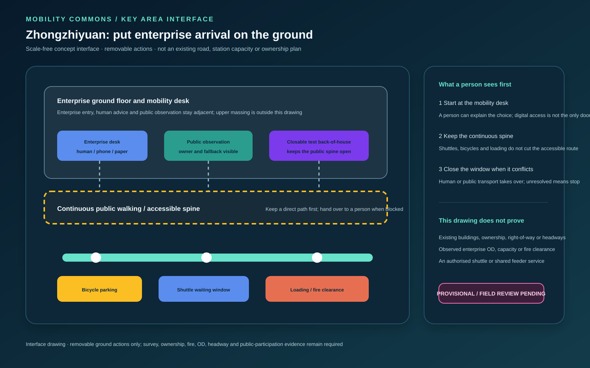

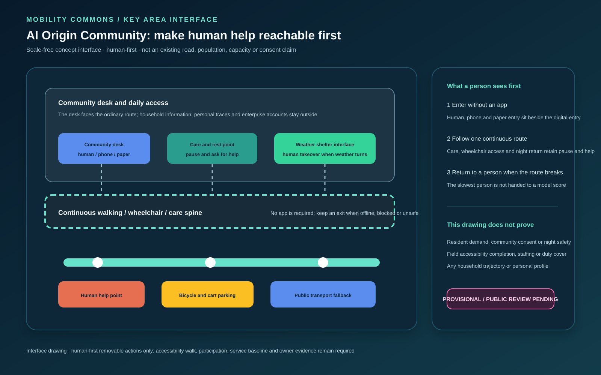

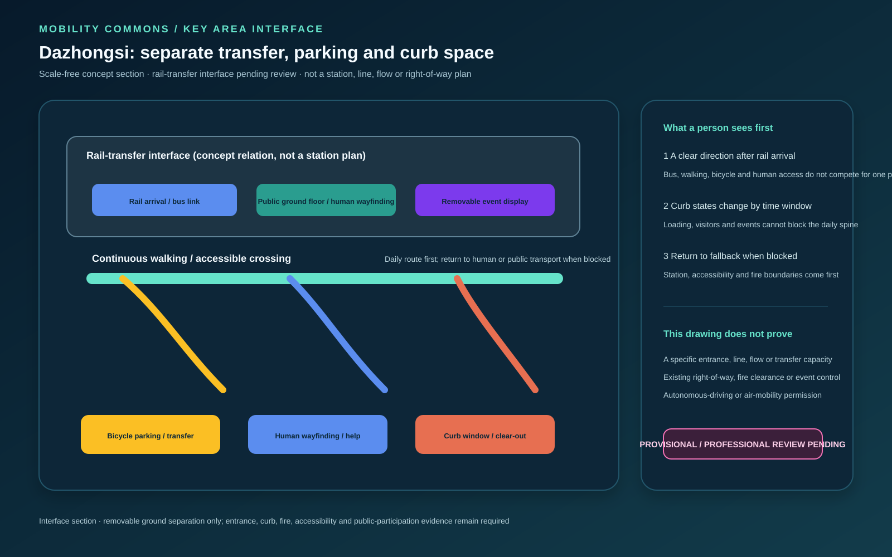

These relations compare how ordinary paths, human service, equipment back-of-house and upper functions are separated; they do not define development intensity, massing, demolition or engineering capacity. A formal scheme must recalculate them after survey, regulatory-plan review, ownership, fire, structural, municipal and public-participation evidence is complete [depth:height_massing_character] [depth:development_intensity_controls].

Until that evidence exists, the first spatial moves remain removable signs, weather shelters, bicycle parking, accessible ramps and curb-state boards. No road widening, building increment or demolition conclusion follows from this ledger [standard:MOHURD-CONTROL-DETAILED-PLANNING].

## AI Innovation Ecosystem, Personas, and AI+ Scenarios

### Mobility Commons identity and three public experience nodes

The working name is “Mobility Commons Loop”. Its mark places enterprise, resident and rail entrances around an open loop that keeps a human exit. It is a proposed identity, not an approved official logo or event brand. Three public experience nodes sit at the enterprise mobility desk in Zhongzhiyuan, the human access desk in AI Origin community, and the rail transfer gallery at Dazhongsi. Together they form a future learning route that starts with enterprise needs, moves through the resident entry and ends with a review of rail and curb conditions. “AI pilgrimage” here means public learning and review, not a built attraction, tourism result or scheduled event.

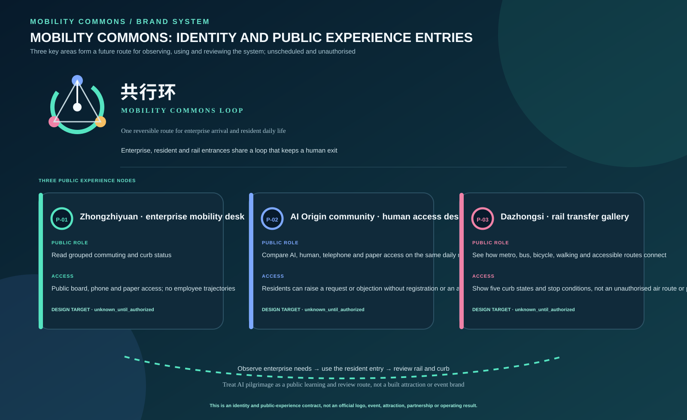

Each node keeps public-board, telephone and paper access, shows no personal trajectories, reserves no air route and does not turn model outputs into exhibition conclusions. Responsibility, venue, activity and operating state remain `unknown_until_authorized` or `not_scheduled_not_authorized` [data:visual/assets/brand-system.json].

### Six participants and three industry tests

Personas include enterprise mobility coordinators, residents and carers, wheelchair users, rail and bus operators, logistics and maintenance staff, school and community workers, night-shift staff and transport/privacy/fire professionals. AI aggregates demand, explains conflicts and prepares rollback checklists; it cannot permanently lock a public route. Accessibility and shared-feeder research informs the test boundaries, not a local outcome or permit [source:BEIJING-ACCESSIBILITY-REGULATION] [source:SAV-MICROTRANSIT].

Three industry tests structure the pilot: enterprise demand aggregation using grouped data; an equal-service comparison between AI, human, telephone and paper routes; and curb/communication-loss fallback during peak, event, snow or rain scenarios. Ten scenario cards cover consolidated enterprise shuttles, public-transport benefits, guaranteed night return, loading reservations, accessible daily routes, the last 500 metres to rail, event-day separation, degraded service and complaint-to-maintenance closure [source:EMPLOYER-TDM-GUIDE] [standard:PROJECT-AGENT-OPEN-CALL-TASKBOOK].

### Ten scenario cards

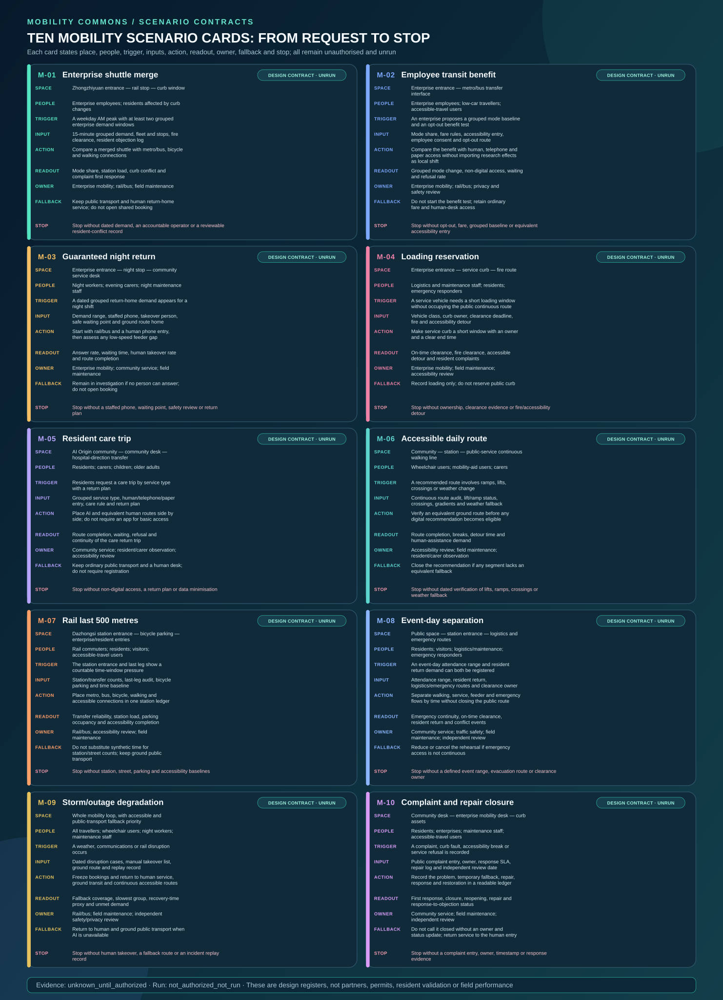

The ten cards are also registered in `visual/assets/scenario-cards.json`. Each card now states its place, affected people, trigger, evidence inputs, service action, readout, accountable design role, human fallback and stop condition. Their shared status remains `unknown_until_authorized` and `not_authorized_not_run`. The board helps a reader see who encounters what problem where; it is not evidence of a partner, permit, resident validation or field performance. Each card's node, startup entry and failure action are registered row by row in `mobility-scenario-operation-contract.json`.

### Ordinary-route continuity and node handoff

The three focus areas are not only parallel labels on a map. `visual/assets/mobility-route-continuity.schema.json` records Zhongzhiyuan (`MOB-NODE-001`), AI Origin Community (`MOB-NODE-002`) and Dazhongsi (`MOB-NODE-003`) as one public-transit, walking and accessibility relationship chain; every node is checked by residents, accessibility users, enterprise employees and operators. The synthetic design limit allows a neighbouring-node gap of at most 25%; a block, invisible human handoff, missing paper/telephone entry or lost fallback route reopens the service window and returns to human/public transport. `run-mobility-route-continuity.js` provides 10 positive and negative fixtures, while `verify.js` independently checks nodes, roads, the analytical graph and handoffs for all ten cards. These files prove only that the design contract can replay and reject cases; baseline remains `unknown`, with field results, authorization and professional accessibility review still absent.

### When Can a Pilot Start? Run the Ten Scenario Gates

“Reversible pilot” is not a date written into a concept document. Each scenario must first pass the shared P0 evidence gate and then its own start checklist. Until accountable roles, dated evidence and an independent stop reviewer exist together, the scenario remains a demand record rather than a booking or expansion. All ten cards remain `not_authorized_not_run`; no partner, timetable, budget or field effect is invented.

| Scenario | Check before start | Accountable roles | If one item is missing |
| --- | --- | --- | --- |
| M-01 Shuttle merge | Grouped enterprise demand, fleet and stop, curb/fire clearance, resident conflict response | Enterprise mobility, rail/bus, field maintenance | Keep public transport and human return-home service; do not open shared booking |
| M-02 Transit benefit | Grouped mode baseline, benefit rule, fare/accessibility entry, employee opt-out | Enterprise mobility, rail/bus, privacy/safety review | Do not turn research effects into a local shift; remain in investigation |
| M-03 Night return | Night demand, staffed phone, takeover person, safe waiting point and route | Enterprise mobility, community service, field maintenance | Stop at investigation if no person can answer |
| M-04 Loading reservation | Vehicle class, curb owner, clearance deadline, fire and accessibility detour | Enterprise mobility, field maintenance, accessibility review | Record loading only; do not reserve public curb |
| M-05 Resident care trip | Grouped service type, human/telephone/paper access, care rule and return plan | Community service, resident/carer observation, accessibility review | Keep ordinary public transport and a human desk; do not require registration |
| M-06 Accessible route | Continuous route audit, lift/ramp status, crossings and weather fallback | Accessibility review, field maintenance, resident/carer observation | Do not open a recommendation without an equivalent route |
| M-07 Rail last 500 m | Station and transfer counts, last-leg audit, bicycle parking and time baseline | Rail/bus, accessibility, field maintenance | Do not substitute synthetic time for station and street counts |
| M-08 Event separation | Attendance range, resident return, logistics and emergency routes, clearance owner | Community service, safety, field maintenance, independent review | Reduce or cancel the rehearsal if emergency access is not continuous |
| M-09 Storm/outage fallback | Dated disruption cases, manual takeover list, ground route and replay record | Rail/bus, field maintenance, independent safety/privacy review | Return to human and ground public transport when AI is unavailable |
| M-10 Complaint and repair | Public complaint entry, owner, response SLA, repair log and independent review date | Community service, field maintenance, independent review | It is not closed without an owner and status update |

The per-scenario fields and evidence paths are recorded in `visual/assets/pilot-startup-checklist.json`; `node visual/assets/run-pilot-startup-check.js` checks coverage, accountability, physical checks, human fallback and file traceability offline. It answers what must be true before a start request can be made. It does not grant permission, replace resident participation or professional and statutory review, and dates must be supplied by an authorised organisation [data:visual/assets/pilot-startup-checklist.json].

### An optional switchback interface. Borrow the vocabulary, not the package fields

Issue #1119 offers a community Switchback Protocol that makes controlled pilots, switchback, human takeover, appeal, review and write-back easier to compare across submissions. This package adds an attributed crosswalk only. It does not copy the current machine schema, and it does not treat its five-minute, 90-day or appeal-time defaults as local commitments. The mobility package's own `not_authorized_not_run`, `unknown`, `controlled_by_gate` and `blocked_until_evidence` states remain authoritative.

| Package state | Comparable community meaning | Action allowed in this package |
| --- | --- | --- |
| `not_authorized_not_run` | Candidate or virtual evaluation | Replay fields and human fallback only. Do not start a pilot. |
| `controlled_by_gate` | Controlled pilot | Apply only after dated P0 evidence, accountable roles and an independent stop reviewer are present. |
| `blocked_until_evidence` | Red switchback | Return to P0, ordinary public transport and human service, with a public aggregate reason. |
| `unknown` | No ready state | Keep unknown. Do not infer normal operation from synthetic output or policy material. |

The status, human takeover, review, appeal, retention and write-back fields for the ten M cards are cross-referenced under `optional_community_crosswalk` in `visual/assets/implementation-operation-contract.json`. All cards remain `not_authorized_not_run`. The protocol is a community reference, not an organiser standard, professional sign-off, field result or new authorization for this package [source:SWITCHBACK-PROTOCOL-1119] [data:visual/assets/implementation-operation-contract.json].

## Land Use, Building Scale, and Retain-Renovate-Demolish Strategy

The existing conceptual building footprints occupy about 2.72% of the provisional study area; this is not a statutory building-coverage ratio [metric:building_footprint_area_sqm] [metric:building_footprint_ratio]. Existing public services, transit entrances, fire routes, accessible paths and mature shade are retained. Reversible renewal upgrades entrances, waiting, bicycle parking, ramps, information signs and service counters. Demolition is not proposed without survey, ownership, structure, fire, utility and community evidence [source:HAIDIAN-ROAD-PARKING-TENDER-2026] [depth:retain_renovate_demolish].

## Transport, Rail, Municipal Infrastructure, and Public Services

The conceptual network includes one north–south relationship line of about 9.60 km, three east–west links and a slow-mobility relationship network of about 13.01 km. These are design lengths, not engineered road centrelines or proof of current continuity [metric:design_north_south_spine_length_m] [metric:design_east_west_connector_count] [metric:design_slow_mobility_network_length_m]. Each segment needs a future audit of section, signals, crossings, entrances, gradients, tactile paving, lighting, shade, loading, fire access, drainage, utilities, ownership and maintenance.

### A time-window curb ledger

The curb ledger uses `open`, `booked`, `service`, `human-only` and `emergency` states. Every state change has a responsible person, start and end time, service purpose, clearing action, alternative route and complaint entry. Enterprise data is grouped; resident data is service-based. The four operational metrics are accessible-route completion, first/last-mile reliability, curb-window compliance and complaint-closure hours [source:CURBSPACE-MANAGEMENT-2021] [source:NIST-HUMAN-CENTERED-AI]. All local demand, occupancy, delay, passenger, charging and complaint values remain unknown until measured.

### M-09 node-level curb functional section (non-scaled)

To keep M-09 from reading as readiness fields alone, this package uses Dazhongsi `PROV-KEY-003` and `ROAD-002` as a **candidate review node** and orders waiting, human handoff, a closable service window and emergency retreat as one functional sequence. `visual/assets/m09-curb-spatial-prototype.json` expresses bands and state transitions only; it does not claim a real station entrance, road section, dimension, capacity or operating service. A professional walk-through and accountable role must confirm the actual entrance and clearing window.[data:visual/assets/m09-curb-spatial-prototype.json] [data:geometry/key_areas.geojson#PROV-KEY-003] [depth:traffic_rail_slow_parking]

| Functional band | Visible state | Evidence before entry | Spatial action on failure |
| --- | --- | --- | --- |
| Walking and accessibility continuity | `open / human-only` | Segment walk-through, crossing/slope/lighting/obstruction record, human reroute | Reroute or guide people by hand; pause `booked/service` |
| Waiting and human handoff | `booked / human-only` | Waiting/station observation, accountable human role, public-transport alternative | Move to human and rail/bus service after a disconnect or missed transfer |
| Closable curb-service window | `booked / service` | Curb asset, grouped users, start/end, clearing, fire and accessibility conditions | Do not reserve or occupy public curb space if any condition is missing |
| Maintenance and emergency retreat | `service / emergency` | Maintenance owner, abnormal clearing, weather/disruption trigger and replay entry | Freeze reservations, restore open/human priority and return to P0 |

This is not an engineering section. It makes the intermediate design layer visible: who receives passage priority, who can stop the state, and when clearing occurs; dimensions, capacity, station flow and field-service outcomes remain `unknown`.[data:visual/assets/mobility-pilot-readiness.json]

### Two-sided demand registers and four service levels

Enterprise and resident demand remain separate, grouped and time-bounded. The model returns an aggregate conflict matrix, not a person-level route; consent, retention, deletion and public explanation remain required before collection.

Metro and bus are the backbone. Enterprise shuttles and on-demand vehicles feed that backbone. Parking and loading are managed as timed services rather than solved only by more supply. Rain, snow, lighting, charging, information signs and maintenance are entered into one municipal asset register. The Haidian transport document and slow-mobility procurement material provide the checklist for hub, interchange, emergency and construction review [source:BEIJING-HAIDIAN-TRANSIT-HUB-PDF] [source:HAIDIAN-SLOW-MOBILITY-TENDER-2022] [depth:traffic_rail_slow_parking] [depth:municipal_new_infrastructure].

### People flow and integrated simulation: gates first, efficiency second

People-flow checks keep residents, enterprise employees, carers, wheelchair users, visitors, logistics staff and night workers in separate groups. The simulation is a calibration surface for mode share, queues, transfers and worst-group gaps, not a local performance claim; mode-transfer reliability remains a target metric rather than a field result [metric:mode_transfer_reliability].

### Rail, parking and municipal interfaces

If an air-mobility experiment becomes eligible, it remains a controlled add-on to the ground system. Metro/bus transfer, walking/wheelchair paths, fire egress, noise and the quiet residential interface must be protected before airspace and operating permissions are reviewed. `air_ground_transfer_reliability`, throughput, cancellation, weather windows, noise, emergency response and insurance responsibility remain `unknown`. Beijing’s low-altitude action plan is policy context; the CAAC unmanned-aircraft regulation is a safety and operating-responsibility gate; neither is a local flight or construction permission [source:BEIJING-LOW-AIR-ECONOMY-2024] [source:CAAC-UAV-REGULATION-2024] [source:UAM-BEIJING-MULTIMODAL-2024].

### Design-scenario simulation (transparent sandbox, not a baseline)

Read this section as one evidence chain. Start with regional-scale coverage, then read network edges and transfer nodes, service-unit gaps, group distribution, the accessibility tail, relative resource pressure and robustness under disruption. All seven boards are projections of one aggregate output from `run-regional-commute-simulation.js`; they are not seven independent field measurements and their values must be replaced together when dated OD, capacity, accessibility and operational evidence arrives. The entry points, outputs and replacement conditions are registered in `regional-scale-commute.json` under `evidence_chain` [data:visual/assets/regional-scale-commute.json#evidence_chain].

Before field OD, station capacity, signals, people flow and curb counts exist, `visual/assets/movement-simulation.json` runs an interpretable 1,000-person normalized design unit: S0 unmanaged peak, S1 multimodal curb coordination, S2 air candidate blocked by regulatory gates, and S3 ground fallback in extreme weather. The package also includes the dependency-free deterministic runner `visual/assets/run-mobility-simulation.js`; it recomputes the declared design-unit queues and service supply without upgrading papers or synthetic values into a Haidian baseline. S1 is only a provisional design candidate after the proposed hard-gate screen; generalized cost, transfer reliability, people-flow conflicts, external-car inflow, worst-group gap and energy are illustrative inputs, not current Haidian performance. The board exposes the chain: hard gates first, Pareto comparison second, local calibration last [metric:multimodal_system_efficiency_index] [metric:person_flow_conflict_rate] [standard:SUMO-MULTIMODAL-SIMULATION].

The model objects are explicit rather than being a mode checklist: the 1,000-person design unit contains 380 residents, 450 enterprise employees, 60 carers/children, 50 visitors, 40 logistics or maintenance workers and 20 night-shift workers. Five `trip_leg_templates` make external enterprise commuting, resident daily services, enterprise-shuttle transfers, logistics/loading and ground-first air fallback inspectable. The network models metro trains (180 persons per vehicle, 10-minute headway), buses (60 persons per vehicle, 12-minute headway), bicycle parking, car curb service, a continuous walking/wheelchair stream and an air candidate held behind a gate. At 60-second steps it records location, mode, queue, vehicle occupancy, transfer status, curb state, conflicts and accessibility flags, then reports peak queues, station/vehicle load, transfer wait, car curb queues and worst-group gaps. Reviewers can run `node visual/assets/run-mobility-simulation.js` to recalculate mode shares, service supply, queues and calibration fields offline; the values in `model_analysis.derived_readouts` remain synthetic sensitivity outputs, not field observations [source:SUMO-MULTIMODAL-SIMULATION] [source:ATOM-MULTIMODAL-ABM] [source:ACCESS-ACCESSIBILITY-ABM].

In this normalized sandbox, the unmanaged peak produces a modeled peak curb queue of 86 cars and a station-gate load ratio of 1.05; the multimodal curb candidate produces 0 cars and 0.88; the weather ground fallback produces 47 cars and 0.96. This points to station gates, bus-stop capacity, curb service and accessible crossings as the first calibration targets, not to a construction conclusion. Following open activity/agent-based methods, formal calibration must compare mode share, road/curb volume, door-to-door time, trip distance and grouped accessibility—not only a single efficiency score. Dated cross-boundary OD, headways, sections, parking, conflicts and fire/accessibility review must replace the design inputs before rerunning or claiming performance.

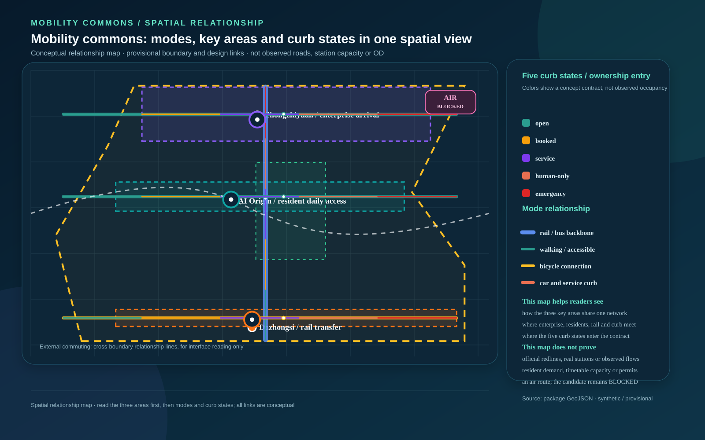

The map answers the spatial question before the model question. The three key areas, four conceptual links, external-commute interface and five curb states share one relationship view; colours describe a design contract and do not represent observed occupancy. The boundary, roads and key areas remain provisional, with no observed station capacity or flow drawn here [data:geometry/site_boundary.geojson#SITE-001] [data:geometry/key_areas.geojson#PROV-KEY-001] [data:geometry/roads.geojson#ROAD-001].

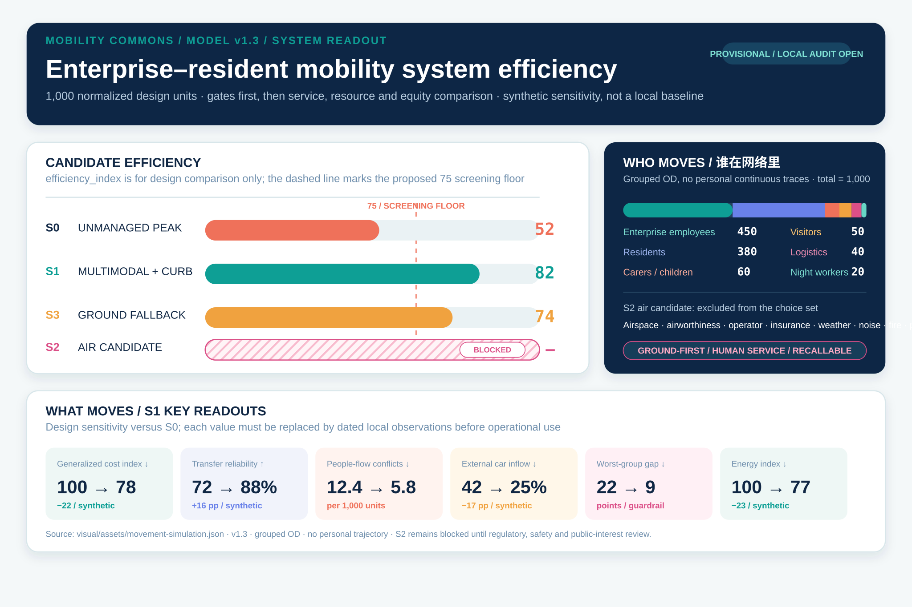

#### Population-reference synthetic AM/PM stress replay

To address the objective of maximizing system efficiency and the satisfaction outcome, the package now adds `visual/assets/regional-scale-commute.json` and `node visual/assets/run-regional-commute-simulation.js`. It uses the official Beijing profile’s 3.122 million Haidian permanent residents at the end of 2024 as a **population-scale coverage reference**, and processes one synthetic morning chain for every agent: home/boundary → first mile → metro/bus/bicycle/walking-accessible/car/enterprise shuttle → work or service destination. The 3,122,000 figure is a population-scale stress test, not a workforce count, census microdata release or observed local OD. The enterprise, resident-worker, carer/child, visitor/service, logistics/maintenance and night-worker shares are declared scenario weights awaiting calibration [source:HAIDIAN-POPULATION-2024].

The runner actually loops through all 3,122,000 synthetic agents and retains only group, zone, mode, route-template, time-histogram, passenger-kilometre, service-unit-ledger and mass-conservation aggregates; no address, employer, identity or continuous personal trace is stored. B0 is a concentrated-arrival stress case, O1/O2/O3/O4 are public-transport, active-mobility, equity and capacity-balanced candidates, and R1 is a ground fallback screen after a metro disruption. The runner fully replays O1/O2/O3/O4 for the AM leg, applies a hard gate of peak mode load ≤1.35×, then selects lexicographically by maximum composite mobility-pressure proxy score → generalized cost → p90 time → conflicts → external-car inflow → vehicle/service-km; O3 has the highest paper score but fails its bicycle-load gate, so O4 capacity-balanced wins the declared synthetic set. O4 then runs a separate full-population PM return coverage screen with reversed aggregate routes; evening OD remains pending dated evidence. “Composite mobility-pressure proxy score” is built from time, reliability, accessibility and conflict. A resident survey result remains pending formal evidence.

Under the current synthetic inputs, the full-replay-selected O4 moves the composite mobility-pressure proxy score from 54.67 to 66.44, generalized-cost proxy from 60.34 to 49.44, p90 time proxy from 90 to 60 minutes, people-flow conflicts from 5.74 to 3.13 per 1,000, external-car inflow from 26.95% to 8.47%, passenger-kilometre proxy from 34.86M to 28.40M, vehicle/service-kilometre proxy from 9.00M to 3.51M, and peak mode load from 1.57× to 1.21×. The `service_unit_ledger` reports, for each mode, required and available train departures, bus departures, bicycle slots, accessible-path slots, car vehicle equivalents and enterprise shuttle vehicles; these are transparent synthetic service screens, while observed fleets, timetables and capacity remain pending dated evidence. The ranked O1/O2/O3/O4 candidates, capacity loads and gate results are emitted by the runner, so a hand-picked candidate is not presented as optimal; O3 can return only after bicycle capacity is supplied or calibrated. These values demonstrate population-scale conservation, replayability and comparison. They do not establish the same improvement in Haidian. A resident survey result remains pending formal evidence. Before a local decision, the package still requires time-binned OD, workforce composition, station/bus/curb capacity, grouped mode shares, door-to-door p50/p90, accessibility audits and fleet/headway evidence.

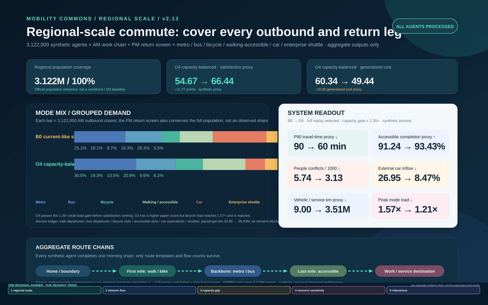

To keep group differences visible, the new group–mode–capacity board exposes the O4 proxy scores directly: resident workers 67.38, carers/children 67.24, night workers 66.35 and logistics/maintenance 57.21; grouped accessibility completion stays within the synthetic 92.87%–95.49% range. The right-hand ledger separates metro, bus, bicycle, accessible-path, car and enterprise-shuttle service pressure: 1.00× is the declared capacity line and 1.35× is the candidate gate. O4 still produces 332,639 synthetic capacity-overflow person-trips, so the board says “add service before expansion” and keeps the pressure visible. The 332,639 overflow proxy and the +301,925 closure gap belong to two different screens. The first keeps the O4 base service declaration and exposes its remaining pressure; the second is a sensitivity sweep that adds declared units until the end-of-window queue reaches zero. Neither is existing operating supply. Car share falls from 26.3% in B0 to 9.6% in O4, while logistics/maintenance still retains 75.8% car share; resident commute optimization does not erase necessary service vehicles [metric:resident_daily_trip_access_index] [metric:accessible_route_completion_ratio] [metric:peak_curb_conflict_rate].

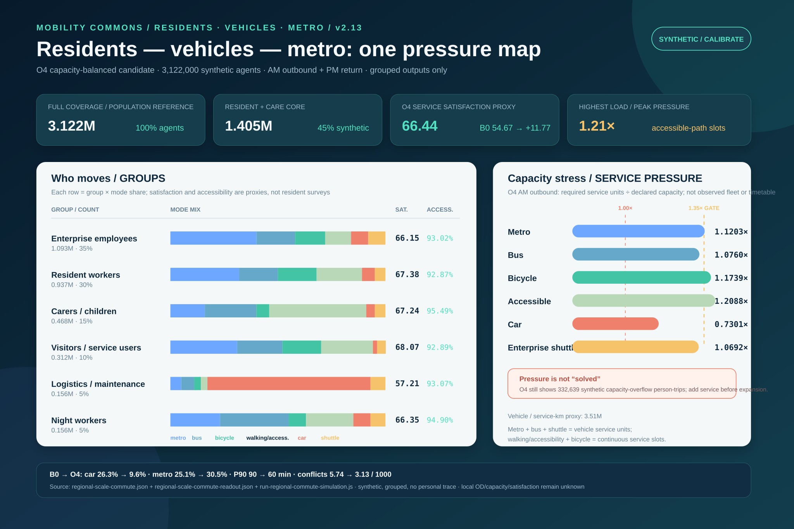

This revision also bins the same runner’s synthetic per-agent outputs by group, adding P50/P90 travel time and satisfaction-proxy P10/P50/P90. Under O4, the logistics/maintenance group has a satisfaction-proxy P10 of 50/100, night workers have a P90 travel-time bin of 90 minutes, and the group P10 spread is 20 proxy points. The readout keeps the lower tail visible beside the overall mean. A nominal candidate must keep both the group mean-satisfaction gap at or below 12 proxy points and the group P10 spread at or below 20 proxy points; the four stress scenarios use corresponding 18-point and 30-point screens. A transport-equity review recommends comparing distributions, sufficiency thresholds and multiple scenarios together; this package adopts that reading order without importing external population attributes, coefficients or Haidian outcomes [source:TRANSPORT-EQUITY-DISTRIBUTION-2023].

#### Give the accessibility tail its own gate: read the lowest tenth before the mean

This version pulls accessibility out from beside the group mean. The runner bins all 3,122,000 synthetic agents into six declared groups, retains accessibility-proxy P10, P50 and P90, and sends the lowest-group P10 spread through a candidate hard gate. The nominal O4 accessibility-proxy P10 spread is 5 proxy points, below the 20-point gate; under severe-weather stress, robust O2 is 20 proxy points, below the 30-point stress gate. This remains a synthetic sufficiency screen, not a resident accessibility walk-through, an accessibility audit or an operating promise. Formal decision work still needs dated grouped OD, door-to-door movement, continuous accessible-path checks, station service capacity and field review [source:TRANSPORT-EQUITY-DISTRIBUTION-2023] [data:visual/assets/regional-scale-commute-readout.json] [data:assets/figures/distributional-accessibility-board.svg].

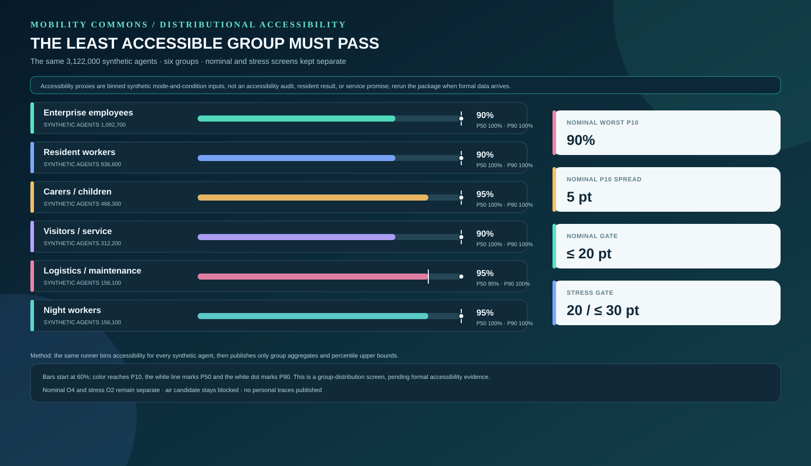

#### Activity-chain closure. From “reaching work” to “finishing the day”

An average one-way commute cannot answer whether a carer can return for a child, whether an enterprise employee can complete the return leg after a flex window, or whether a missed shuttle breaks the whole day. This iteration adds `visual/assets/activity-completion-screen.json` and `node visual/assets/run-activity-completion-screen.js`. It reuses the same mode choice, capacity load, reliability, accessibility and external-commute rules, then replays 3,122,000 synthetic agents in four ground scenarios. The chain checks departure, first mile and transfer, primary activity arrival, bounded deferral, return transfer and closure at origin; only aggregates are retained and no personal trajectory is published [source:MATRAM-ACTIVITY-ADAPTATION-2026] [source:MATSIM-LARGE-SCALE-ABM] [source:MATSIM-BOOK-ACTIVITY-BASED].

Five states stay separate: `on_time`, `delayed`, `deferred` within a declared bounded window, `inaccessible` before the primary activity, and `return_failed` after reaching the primary activity but failing to close the return. Nominal O4 closes 91.06% of synthetic agents' chains; metro disruption closes 64.53%, severe weather/bicycle constraint 60.74%, and multimodal capacity shock 65.90%. This is a synthetic screen, not a local resilience claim. These stress scenarios are not flattened into success: a failed stress gate is published as `stop_and_calibrate`, requiring grouped activity diaries, dated OD, service/denial records, continuous accessibility, return demand and disruption logs. Deferral is not success, and return failure is not silently rewritten as dissatisfaction; the two remain separate design and human-review signals.

The nominal group chain-completion spread is 14.8 proxy points; stress failures are evidence for further model and service work, not a local-resilience claim. Ground recourse is limited to one fallback with capacity and accessibility conditions; walking/accessibility demand is never silently rerouted as a source. The air candidate remains `blocked` and cannot fill a ground-evidence gap. The board shows the full status mix first, then the scenario comparison, so residents, enterprises, external commuters and service workers remain visible in the same integrated screen [source:DYNAMIC-PT-CAPACITY-2024] [source:TRANSPORT-EQUITY-DISTRIBUTION-2023] [data:visual/assets/activity-completion-readout.json].

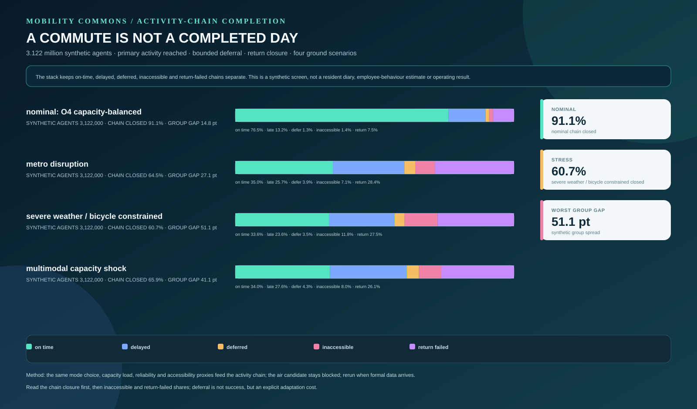

#### Utility-proxy decomposition: return every point to a travel cost

This version separates the part of the composite mobility-pressure proxy that readers may otherwise treat as satisfaction. The O4 synthetic satisfaction proxy is 66.44, and the sum of seven declared costs, time, waiting, crowding, curb, accessibility, reliability and people-flow conflict, reconstructs 66.44 within 0.05 points. The board keeps the six group components and the O1/O2/O3/O4 hard-gate comparison visible, so reviewers can see where the score comes from and which groups carry more proxy disutility. Observed resident satisfaction responses remain at 0 and the field satisfaction status is `not_authorized_not_run`; this is a synthetic aggregate screen, not resident satisfaction, employee preference, public acceptance or field operating performance [source:MATSIM-LARGE-SCALE-ABM] [source:TRANSPORT-EQUITY-DISTRIBUTION-2023] [data:visual/assets/utility-welfare-readout.json].

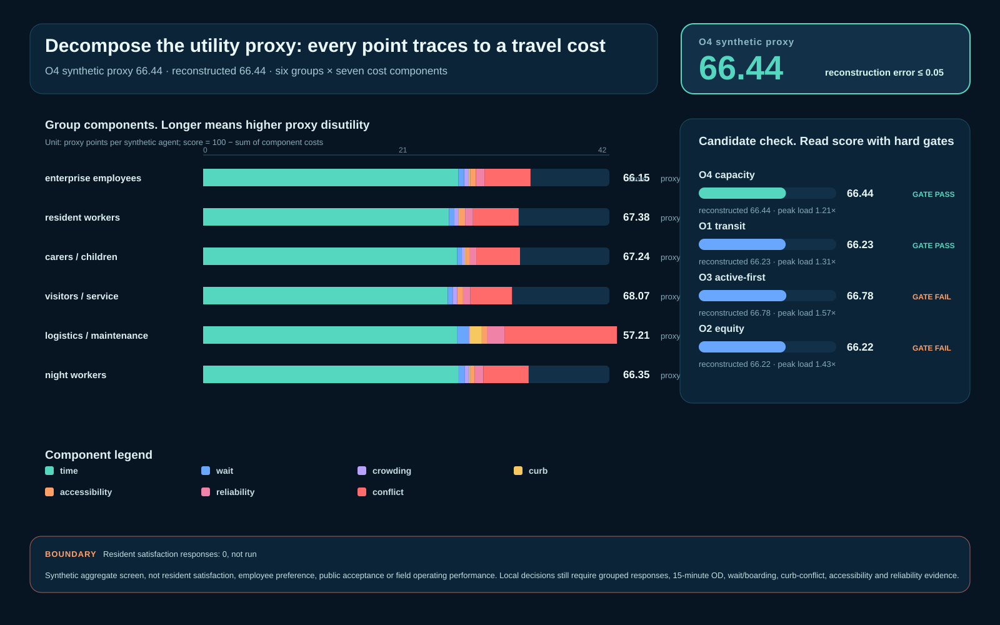

#### Relative resource pressure: separate passenger-km, service vehicles and unknowns

To avoid turning “less car travel” directly into an environmental-benefit claim, this increment adds `visual/assets/resource-pressure-screen.json`, `visual/assets/resource-pressure-readout.json` and `node visual/assets/run-resource-pressure-screen.js`. It splits the synthetic passenger-kilometre ledger by mode, then applies external method-reference intensities as a relative sensitivity screen: car is normalized to 1.00, rail and bus retain reference intensities, walking/cycling use a screen convention of zero operating intensity, and enterprise shuttle is not assigned a car or bus factor because fuel/power, fleet-kilometres, occupancy and route evidence are unknown [source:EEA-GHG-PASSENGER-MODES] [source:NCHRP-2024-59-ENERGY].

Under the current synthetic inputs, O4 has a known-mode relative resource index of 20.07M versus 28.82M for B0, a −30.4% change; O4 has 26.58M known-mode passenger-km and another 1.82M enterprise-shuttle passenger-km excluded from the index. The vehicle/service-kilometre proxy falls from 9.00M to 3.51M, but this is not kWh, MJ, gCO₂e, fleet evidence or environmental performance. The screen does not rank O1/O2/O3/O4 and cannot override capacity, accessibility, safety, privacy or human-service gates; the next calibration must replace external factors with dated electricity/fuel, occupancy, 15-minute passenger flow and life-cycle boundaries.

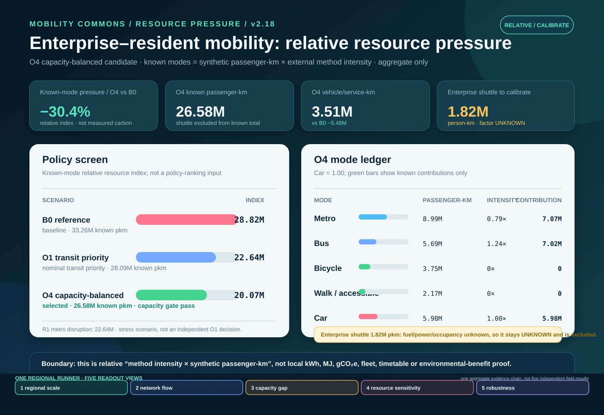

The robustness screen keeps a high nominal score separate from recovery under disruption. The new `robustness_screen` fully replays every O1/O2/O3/O4 candidate under four declared scenarios, nominal ground coordination, a 30-minute metro disruption, severe-weather bicycle constraint and multimodal capacity shock, for 16 × 3,122,000 synthetic agent-scenario replays, retaining aggregates only. Under the declared inputs, O2 has the highest worst-case composite mobility-pressure proxy score at 49.37, a worst peak mode load of 1.6986× and all three stress gates pass; O4 remains the nominal-efficiency winner but ranks second in the robustness screen; O3 reaches 2.0159× under the capacity shock and exits the gate. The decision rule is explicit: O4 is only the nominal screening candidate under declared inputs, while O2 is the robustness reference under stress; neither replaces field evidence or authorises implementation. This is a transparent sensitivity ranking. Until dated disruption, weather, capacity, accessibility and behavioural evidence exists, any failed gate remains a stop-and-calibrate signal [source:EXACT-SO-TRANSIT-2025] [source:UAM-MULTIMODAL-RESILIENCE-2025] [source:TRANSPORT-EQUITY-ABM-2025].

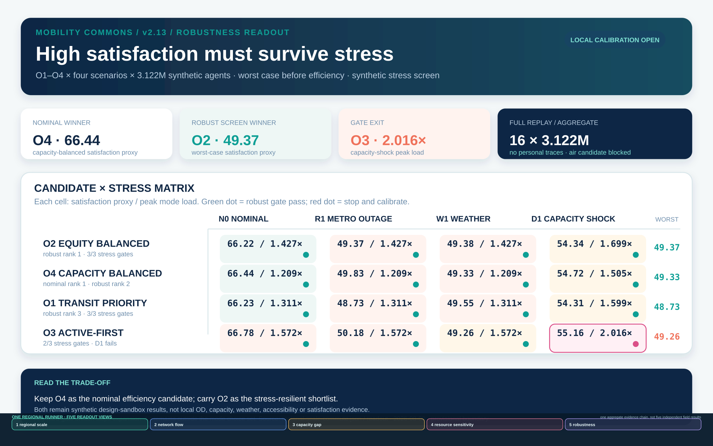

#### B1 Enterprise arrival sensitivity: an inspectable flex-window test

Without moving resident, care/child, visitor, logistics/maintenance or night-worker demand, B1 applies a 20% flexible-arrival sensitivity only to the 450 enterprise employee design units, moving 90 units out of the sharpest peak into a wider arrival window. The offline runner produces a synthetic readout of total peak queue 174 → 164 and mean queue person-minutes 75.7999 → 71.7917; peak car-curb queue stays at 60 and unmet demand stays at 89. The metro and bus load changes are pressure changes under the declared inputs, not an enterprise response or current Haidian performance; a real flex-window policy must also measure employee acceptance, rescheduling time cost, transit schedule compatibility and grouped mode-share change rather than optimizing queue reduction alone. Dated grouped enterprise OD, mode share, headways and station counts must replace the inputs before operational use [source:MATRAM-ACTIVITY-ADAPTATION-2026] [metric:mode_transfer_reliability].

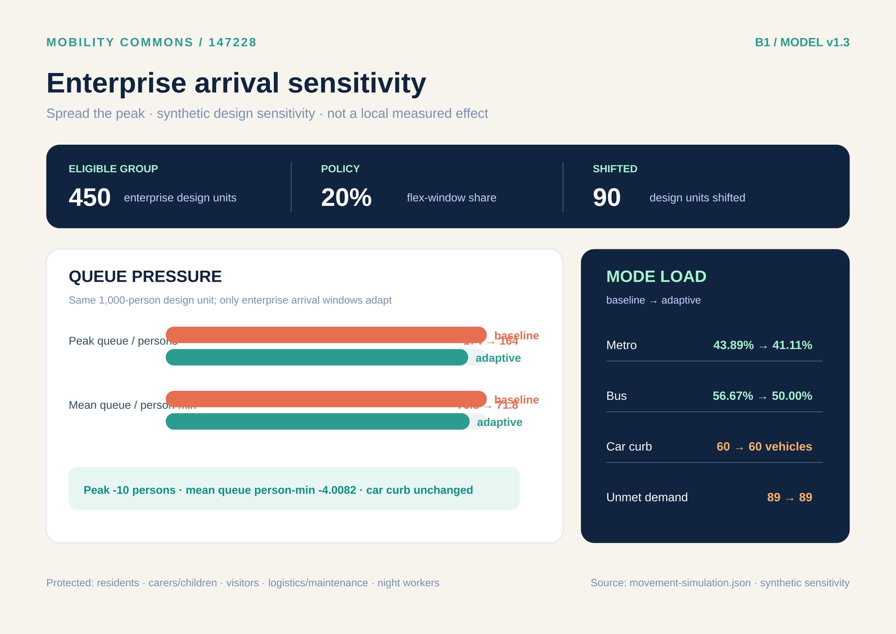

#### B2 Mode and departure-time choice: one ledger for external commuting and people flow

B1 asks whether enterprise arrival can be spread; B2 adds why a grouped traveller chooses a mode and time. Each alternative carries door-to-door time, arrival flexibility, waiting and transfer reliability, station crowding, curb/parking friction, fare/energy and the slowest-group gap. Fire, accessibility, public-transport, privacy and human-service gates are screened first. Enterprise employees may adjust an arrival window, while residents, carers, children, logistics and night workers keep their own activity chains and human fallback; cross-boundary commuting enters as grouped OD, never as a personal trajectory [source:JOINT-MODE-TIME-CROWDING-2020] [source:DTUE-PT-2025].

This is a calibratable behavioural contract, not a transfer of paper coefficients into Haidian. Dated mode shares, grouped departure times, headways/capacity, station and crossing counts, curb queues, door-to-door p50/p90 and accessible-route audits must be collected before local parameters are estimated. Flexible work schedules can change commute departure distributions, but flexibility, late-arrival penalties and care constraints must be validated by group rather than replaced by one average [source:FLEXTIME-DEPARTURE-CHOICE-2013] [source:MATRAM-ACTIVITY-ADAPTATION-2026].

This pass makes B2 executable as a separate `departure_time_choice_screen`. It still processes all 3,122,000 synthetic agents, but only enterprise employees may enter a synthetic 20-minute early-flex window; residents, carers/children, visitors, logistics and maintenance, and night workers are not shifted by the model. The B0 preferred window is 95%; the O4 screen becomes 6.99% early, 88.01% preferred and 5% late, with 218,266 synthetic enterprise agents marked as adjustable, a 4.365M person-minute rescheduling-cost proxy, and zero protected-group shifts. This is not employee behaviour, an arrival distribution or timetable performance observation, and it is not used to rank O4. It makes the operating contract explicit—who may adjust, who cannot be sacrificed and how rescheduling cost is recorded—pending employee acceptance, headway and 15-minute capacity evidence [source:JOINT-MODE-TIME-CROWDING-2020] [source:DTUE-PT-2025].

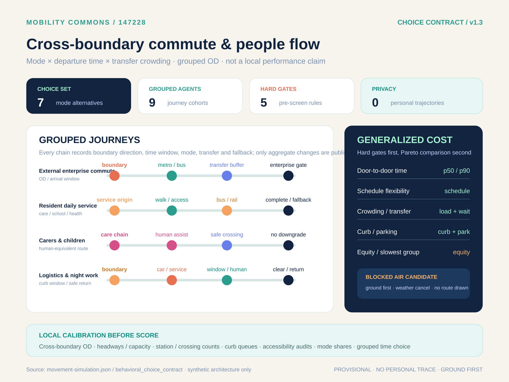

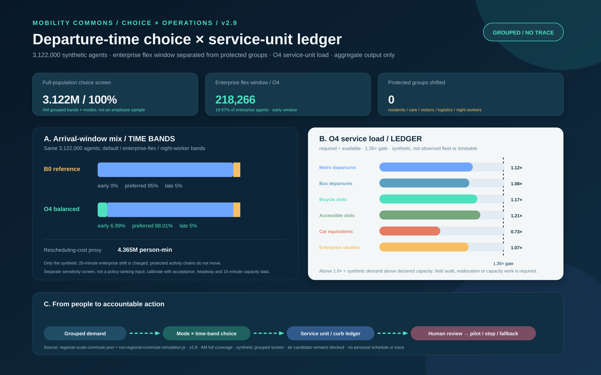

To keep a mode-level capacity screen of ≤1.35× from being misread as an operable timetable, v2.10 expands the same grouped departure demand into three 15-minute service slices. A FIFO residual-capacity rule carries queues from slice to slice and records available metro departures, bus departures, bicycle slots, continuous accessible-path slots, car equivalents and enterprise-shuttle vehicles, plus boarded trips, failed boarding attempts, residual queue and queue person-minute proxies. The independent O4 synthetic operations screen still processes 3,122,000 agents, reaches a 3.2431× peak slice load, leaves 452,668 trips in the end-of-window residual queue and produces a 16.241M queue-person-minute proxy; its operations gate is therefore **not passed**. This is not measured Haidian performance. It is an explicit stop signal: dated services, station/stop/curb capacity, boarding/denied-boarding counts and accessible-service capacity must be supplied before the candidate can be treated as operable. The screen does not rank O1/O2/O3/O4; the papers provide capacity-constrained schedule-based assignment boundaries, not local coefficients [source:SCHEDULED-CAPACITY-TRANSIT-2012] [source:DYNAMIC-PT-CAPACITY-2024].

v2.11 adds an independent **bounded-recourse screen** on top of the time-slice ledger. When a primary mode has residual queue, only a declared share of that group’s demand may test an alternate mode with spare capacity in the same slice; the readout records source mode, target mode, time slice and person-minute cost by group. Under the synthetic O4 inputs, 68,814.9 trips take a bounded `metro → car` fallback: 28,354 enterprise employees and 40,460.9 visitors/service users. End-of-window residual queue falls from the v2.10 value of 452,668 to 383,853.1, with a 550,519.2 person-minute recourse-cost proxy, but the 3.2431× peak and remaining queue keep the operations gate **failed closed**. Walking/accessibility is never a recourse source, and group-share, capacity and mass-conservation checks pass. This is not a local route-choice, passenger-acceptance or operating-performance result, and it does not rank candidates; local use still requires denied-boarding transfer data, alternate-mode acceptance, accessible/care constraints, spare headway capacity and mode-pair time/reliability evidence [source:DYNAMIC-PT-CAPACITY-2024].

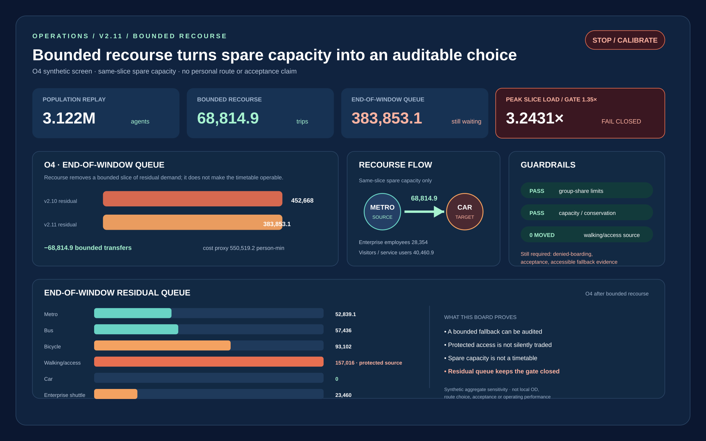

#### Capacity closure: calculate the gap before scaling

To turn the still-open operations gate into a concrete calibration question, this iteration adds `visual/assets/capacity-closure-screen.json` and `node visual/assets/run-capacity-closure-screen.js`. It reuses the O4 population-scale screen with 3,122,000 synthetic agents, three 15-minute FIFO service slices and the 1.35× peak-load gate, then independently sweeps the smallest declared service-unit multiplier for metro, bus, bicycle, walking/accessibility, car and enterprise shuttle in 0.01× steps. A mode passes only when its end-of-window residual queue is zero, peak load is at most 1.35×, the full synthetic population is conserved and the air candidate remains blocked [source:SCHEDULED-CAPACITY-TRANSIT-2012] [source:DYNAMIC-PT-CAPACITY-2024].

Under the current synthetic inputs, the minimum multipliers are metro 1.17×, bus 1.12×, bicycle 1.32×, walking/accessibility 1.34×, car 1.00× and enterprise shuttle 1.16×. The combined screen adds 301,925 declared service units, reaches a maximum mode peak of 1.2011× and leaves zero residual queue. “Service unit” means a synthetic departure/slot/vehicle equivalent inside the model; it is not an actual timetable, fleet, purchase quantity, operating permit or resident-performance result. The screen identifies which dated OD, headway, capacity, denied-boarding, accessibility and accountable-operator evidence is still needed; it does not automatically advance P1/P2.

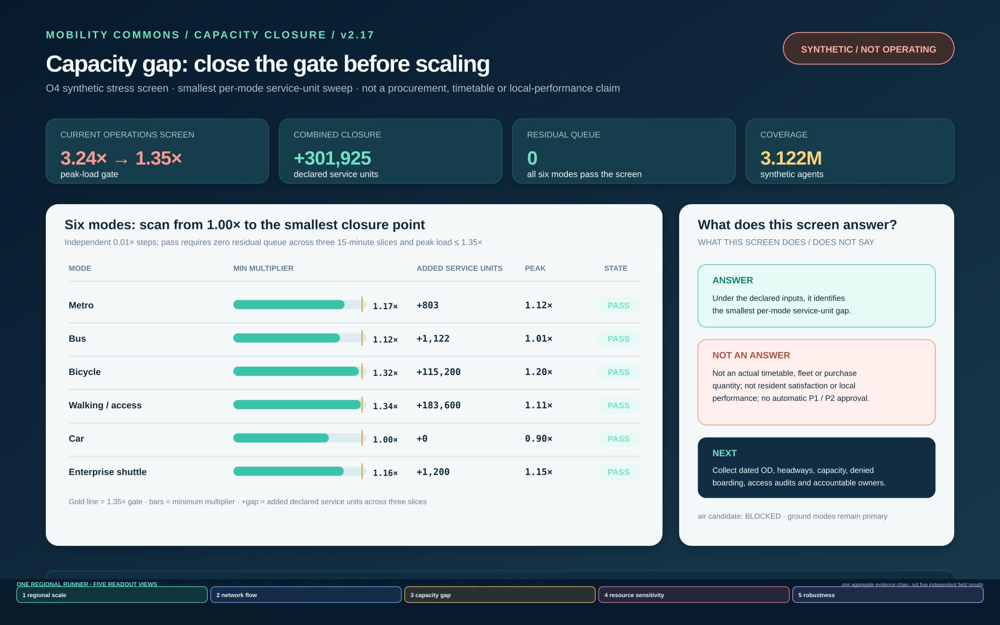

#### Network-level people flow: make “who passes where” auditable

The capacity-closure screen answers how many service units each mode would need; it does not yet show which spines, transfer nodes and service gates carry the people. v2.19 adds `visual/assets/network-flow-screen.json`, `visual/assets/network-flow-readout.json` and `node visual/assets/run-network-flow-screen.js`. It reuses the regional runner’s group ranges, origin/destination hashes, enterprise external-commute rule, O4 mode weights and enterprise flex-window rule, then expands each synthetic mode choice into a declared path and immediately reduces it into edge, node, time-slice, group, OD and vehicle/service-equivalent ledgers. The graph is an explicit analytical network, not current road or rail geometry, station capacity or a real-time traffic assignment; no personal trajectory, address, employer or vehicle identifier is retained [source:MATSIM-LARGE-SCALE-ABM] [source:MATSIM-BOOK-ACTIVITY-BASED].

Under the current synthetic inputs, O4 processes 3,122,000/3,122,000 agents. Mode trips are metro 952,295, bus 602,547, bicycle 422,597, walking/accessibility 652,746, car 299,361 and enterprise shuttle 192,454; 2,747,634 agents are in the preferred time slice. The declared maximum edge pressure is 1.264×, below the 1.35× network gate. The hottest edge is external gateway → metro backbone at 1.264×, followed by the logistics/maintenance gate at 1.076×; the Dazhongsi transfer node receives 1.555M people at 0.866×. As a reference, B0 concentrated arrival reaches 1.6539× on the managed-curb → destination edge and fails the network gate, making curb pressure visible instead of hiding it in a total average. These are synthetic screen outputs, not Haidian road, station, timetable or satisfaction observations; any edge/node above 1.35× remains a calibration stop, not something silently rewritten as operable.

Vehicle/service equivalents are kept separate: O4 yields 5,291 metro-train equivalents, 10,042 bus equivalents, 176,095 car equivalents and 8,019 enterprise-shuttle equivalents. Bicycle and walking/accessibility remain at zero vehicle equivalents, so active mobility is not converted into cars. The next calibration must replace declared inputs with dated 15-minute OD, metro/bus headway and station/stop capacity, road/curb/intersection counts, continuous-accessibility audits, and enterprise-shuttle fleet/operator evidence. This screen does not alter the O4 candidate ranking or advance P1/P2 [source:SCHEDULED-CAPACITY-TRANSIT-2012] [source:DYNAMIC-PT-CAPACITY-2024].

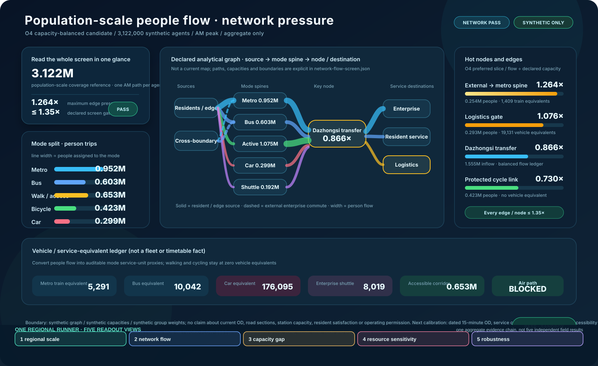

#### B3 Disruption, weather and the slowest group: efficiency must recover

B2 asks how grouped travellers choose in normal operation. B3 asks who can still arrive, and how fast the system recovers, when a metro segment is disrupted, severe weather suppresses cycling or the air candidate is closed. The runner replays three events on the S1 ground-first candidate: nominal operation, a 30-minute metro-segment disruption with declared bus fallback, and severe weather with bicycle fallback to bus. It reports affected-mode fallback coverage, queue person-minutes, a slowest-group gap proxy and a recovery-time proxy, while fire, accessibility, human-service and air-operation gates remain prior to optimization [source:UAM-MULTIMODAL-RESILIENCE-2025] [source:TRANSPORT-EQUITY-ABM-2025].

In the normalized design unit, the metro-disruption fallback coverage proxy is 76.92% and the severe-weather bicycle fallback proxy is 72.14%. The slowest group is the wheelchair-user group in both synthetic events, with gap proxies of 12.1998 and 13.3571 points and recovery proxies of 27.2997 and 30.0357 minutes. These are transparent stress-test outputs, not local resilience or p90 commute facts. Dated disruption logs, weather cancellations, accessible-route completion and grouped door-to-door p90 observations must replace them before operational use. If fallback coverage falls below 70%, the slowest-group gap proxy exceeds 24 points or recovery exceeds 45 minutes, the design stops for redesign; air mobility cannot fill an evidence gap [source:MATRAM-ACTIVITY-ADAPTATION-2026] [source:UAM-TOD-VERTIPORT-2026].

#### Recovery-time ledger: make TTR legible across seven groups

The existing B3 runner already computes grouped recovery-time proxies, but a single headline value hides who is slowest during disruption. This increment adds `visual/assets/run-resilience-recovery-screen.js` and `visual/assets/resilience-recovery-readout.json`: it consumes the B3 output from `run-mobility-simulation.js` and reorders the same values across three events and seven groups without changing demand weights, capacity or fallback fractions. In `R0` nominal operation, the slowest proxy is enterprise employees at 2.8419 minutes. In `R1`, a 30-minute metro-segment disruption has 76.92% fallback coverage; wheelchair users are slowest at 27.2997 minutes. In `R2`, severe-weather bicycle-to-ground fallback covers 72.14%, with a 30.0357-minute wheelchair-user recovery proxy. Both stress events remain inside the declared 70% fallback and 45-minute TTR gates, but that only means the synthetic screen passes; it is not a Haidian incident-response, accessibility-audit, resident-experience or local p90 result.

The board puts wheelchair users, carers/children and night workers beside the other groups in one matrix. Before a pilot, replace the proxies with dated disruption logs, weather cancellations, grouped door-to-door p90 and continuous accessible-route completion. Any gate failure stops redesign; the air candidate remains `BLOCKED` and cannot fill a ground-evidence gap [source:UAM-MULTIMODAL-RESILIENCE-2025] [source:TRANSPORT-EQUITY-ABM-2025].

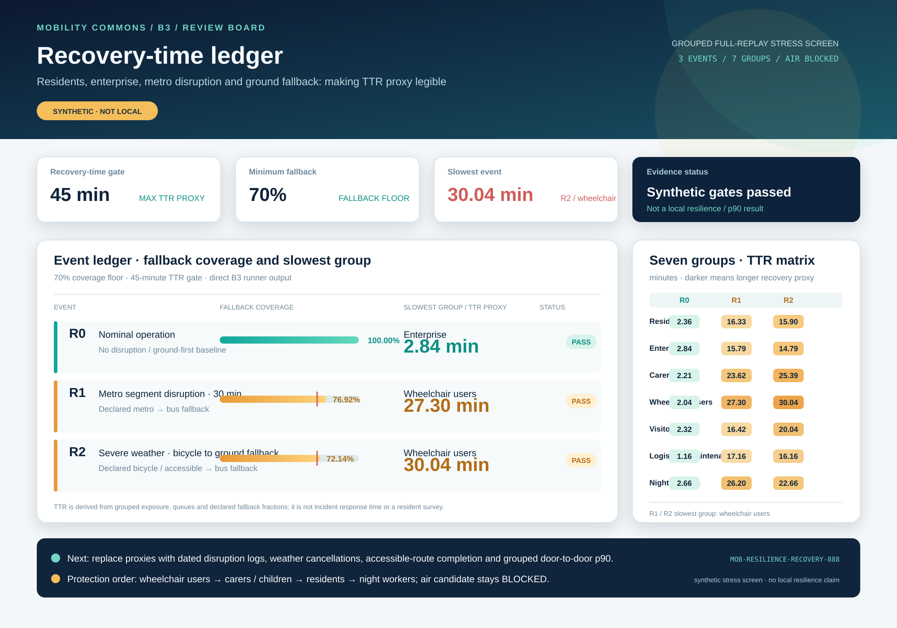

## Blue-Green Network, Public Space, and Urban Character

Blue-green space provides shade, rest, rain fallback and a safer night interface. The conceptual green ratio is about 12.34% and public-space ratio about 7.33%; neither proves ecological, thermal or drainage performance [metric:green_ratio] [metric:public_space_ratio]. Public counters, transit entrances, waiting, bicycle parking and green edges should share shelter, seats, lighting, water and accessible information without blocking wheelchair turns or fire access.

The hard boundaries are: do not send people into ponding routes during storms; provide a human alternate route during heat; and reduce unnecessary equipment and lighting during dark or ecologically sensitive periods. Beijing walking/cycling and accessibility sources support continuity and maintenance requirements [standard:BEIJING-WALK-CYCLE-DB11-1761] [standard:BEIJING-ACCESSIBILITY-REGULATION] [source:BEIJING-SLOW-MOBILITY].

## Renewal Projects, Implementation Policy, and Phasing

P0 inventories assets, demand, curbs, accessible routes and complaints. P1 runs small reversible tests for two enterprise windows, one resident daily chain and one rail transfer chain. P2 considers conditional feeder expansion only after traffic, fire, accessibility, privacy, ecology, insurance, procurement, operator and maintenance evidence is signed. The service-tender logic of asset IDs, patrol, equipment checks, exception handling and complaint response is translated into every mobility asset [source:HAIDIAN-ROAD-PARKING-TENDER-2026] [depth:renewal_project_list] [depth:phasing_implementation].

### Responsibility-and-acceptance contract (design targets, not an implementation promise)

Each phase has four role groups signing the readback: transport and local-management authorities own approvals, right-of-way and public safety; enterprise mobility coordinators and feeder operators own aggregated demand, schedules, loading and cost; community/resident representatives, accessibility advisers and human-service staff own access rights, alternatives and redress; maintenance, data-protection and independent-review roles own asset state, privacy, incidents and evidence retention. Specific institutions, contracts and budgets remain `unknown`; this records responsibility boundaries rather than claiming a partnership.

Each phase retains a dated asset register, demand version, responsible role, metric readout and stop decision. P0 is accepted only when 100% of priority assets have an ID, an accountable role and a human fallback. P1 reads waiting time, route completion, curb conflicts, first response and closure status by enterprise/resident/accessibility group. P2 enters expansion review only when traffic-impact, fire, accessibility, privacy, ecology, insurance, procurement and maintenance evidence is complete, with `accessible_route_completion_ratio >= 0.95`, `curb_time_window_compliance_ratio >= 0.90` and a complaint status update within 24 hours. Any group-level deterioration, ownerless action or failed hard gate switches service back to public transport, human, telephone and paper access, with a recorded review date; a composite model score cannot replace field evidence or approval.

The roles, fields, phase thresholds and human fallback are also recorded in `visual/assets/responsibility-acceptance-contract.json`. It publishes only an aggregate role × phase × group × metric acceptance structure, never personal trajectories, enterprise identities or vehicle identifiers. JSON `design_target` values are pre-pilot targets, not current achievements.

The implementation–operation contract is separately recorded in `visual/assets/implementation-operation-contract.json`, covering P0/P1/P2 roles, acceptance metrics, human fallback and stop/withdrawal conditions. It is a conceptual responsibility interface, not a confirmed institution, contract, budget, procurement, permit or operating commitment; any `unknown` baseline, missing consent/responsibility boundary or failed hard gate keeps the package in investigation or human-fallback status [data:visual/assets/implementation-operation-contract.json] [depth:phasing_implementation].

To turn “human fallback” into a reviewable minimum action, this iteration narrows the existing M-09 storm/network-outage degradation card into an offline tabletop rather than claiming a new operated scenario. `visual/assets/mobility-tabletop-contract.json` fixes four synthetic service requests, four trigger events, six acceptance checks and five reversible rollback steps; `node visual/assets/run-mobility-tabletop.js --check` reads only bundled fixtures, makes no network calls, touches no personal data or external system, creates no persistent state, and emits an aggregate readback isomorphic to `mobility-tabletop-evidence.json`. The current rehearsal keeps a human or public-transport entry for 4/4 requests, freezes reservations, passes 6/6 checks and replays 5/5 rollback steps; `performance_results=null` and `operational_status=not_authorized_not_run`, so PASS proves only that state, stop and rollback logic is inspectable. It cannot advance P1/P2 and does not prove staffing, accessibility performance, public acceptance, service availability or safety [data:visual/assets/mobility-tabletop-contract.json] [data:visual/assets/mobility-tabletop-evidence.json] [data:visual/assets/run-mobility-tabletop.js].

One question kept recurring in public feedback was who confirms the baseline and what makes a start permissible. This revision does not add another generic metric list. It turns the four M-09 synthetic requests into four readiness cards. Before authorisation, each card must name its observation unit, sample and time window; freeze success and stop conditions; name an operating role and an independent stop reviewer; and retain an equivalent human route, retention/deletion rule, redress entry and review cycle. The local baseline, observed value, authorised organisation and deletion receipt remain `unknown` or `not_available_before_authorization` on all four cards; three deliberate missing-field fixtures are rejected. A PASS from `run-mobility-pilot-readiness.js --check` proves only that this field chain is closed. It is not field readiness or P1 eligibility evidence [data:visual/assets/mobility-pilot-readiness.json] [data:visual/assets/mobility-pilot-readiness-evidence.json] [data:visual/assets/run-mobility-pilot-readiness.js].

| Request | Register first | Success and stop rule | Redress for an ordinary person |
| --- | --- | --- | --- |
| Resident daily care `M09-R01` | Grouped service type, time window, care and accessibility category | Keep human/phone/paper/public-transport access; stop if fallback or exit is unavailable | Community desk, telephone or paper entry |
| Wheelchair-accessible route `M09-R02` | Route segment, handover point, weather state and dated walkthrough | Replay continuity and human assistance; stop if the route breaks or an undated walkthrough is presented as a result | Human route desk, telephone or paper entry |
| Enterprise shuttle window `M09-R03` | Grouped demand, vehicle class, curb asset and loading window | Discuss a window only with an owner, fire clearance and accessible route; no booking when one is missing | On-site human, telephone or paper entry |
| Rail last-mile transfer `M09-R04` | Station exit, arrival window, mode and accessibility grouping | Keep staffed wayfinding and ordinary public transport; stop when ownership or dated observation is absent | Station desk, telephone or paper entry |

These four cards cross-reference the ten-card startup checklist, the M-09 tabletop and the P0/P1/P2 responsibility contract. They turn “collect the baseline later” into fields that cannot be silently bypassed, without promoting one package’s naming into a repository-wide hard gate. If maintainers publish a canonical, versioned pilot-readiness contract, this package will migrate through a field mapping and inventory-impact note.

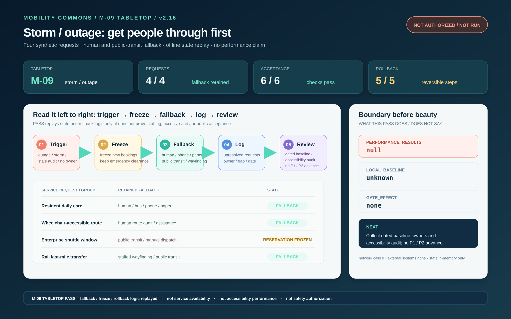

The implementation loop is register → pilot → review → expand or stop. Operators sign a reversible service agreement; residents keep public paths and human service. An AI recommendation may always be rejected by an on-site person.

## Metrics, Area Recalculation, and Compliance Matrix

### Current readable baseline

The package separates file-readable geometry, unknown local baselines and pilot targets. Known values include the provisional area, three key areas, building footprint, green/public ratios and design relationship lengths [metric:site_area_sqm] [metric:key_area_count] [metric:building_footprint_area_sqm] [metric:building_footprint_ratio] [metric:green_ratio] [metric:public_space_ratio] [metric:design_north_south_spine_length_m]. Unknown values include enterprise commute demand, external commute OD, resident access, employer multimodal trip rate, parking occupancy, curb compliance, transfer reliability, accessible-route completion, people-flow conflicts, complaint closure, workplace charging gap, multimodal system efficiency, mode-transfer reliability and air-ground transfer reliability.

This schema fix puts all 29 records under the single `metrics` object and makes `status`, `value`, `unit`, `source_files`, `formula` and `confidence` one auditable record contract. The offline result is 11 `known` and 18 `unknown` records, no stray top-level metric keys and no status/value contradictions; the summary is [data:visual/assets/metrics-schema-audit.json] and the checker is [data:visual/assets/run-metrics-schema-audit.js]. This proves schema and `known`/`unknown` consistency only; it does not prove field mobility performance, operational outcomes or an official score.

### Traffic metrics still needed

Pilot targets are not current outcomes: accessible-route completion at least 0.95, transfer reliability at least 0.85, curb-window compliance at least 0.90, a first complaint response within four hours and a status update within 24 hours [metric:accessible_route_completion_ratio] [metric:first_last_mile_transfer_reliability] [metric:curb_time_window_compliance_ratio] [metric:mobility_service_complaint_closure_hours].

### Five gates and matrices

Five gates cover authoritative geometry, consented demand, safety, responsibility and equity. The compliance, standards and design-depth matrices bind these claims to the proposal, GeoJSON, drawings and self-check [standard:SUMO-MULTIMODAL-SIMULATION] [standard:LOW-AIR-REGULATORY-GATE] [standard:PROJECT-OFFICIAL-ANNOUNCEMENT] [standard:PROJECT-AGENT-OPEN-CALL-TASKBOOK] [depth:metrics_recalculation] [depth:metrics_recalculation] [depth:risk_missing_data].

## Risk, Copyright, and Compliance

This package does not replace right-of-way confirmation, traffic-impact assessment, parking contracts, fire review, accessibility review, construction drawings, operating permits, data compliance, insurance or procurement. The main risks are enterprise demand displacing resident access, unmanaged on-demand vehicles adding traffic, unmaintained curb states, unowned complaints and digital exclusion. Each has a rollback: human service, public transport, paper/telephone access, removable equipment, paused reservations, public aggregate incident summaries and a next review date [source:SHARED-MOBILITY-OECD] [source:CURBSPACE-MANAGEMENT-2021] [depth:risk_missing_data].

Government and tender sources establish policy and responsibility frameworks; papers establish methods and cautions; OSM and provisional geometry only support background screening and design relationships. No source is used to claim a local capacity, enterprise partnership, station performance, accident rate, satisfaction improvement or health outcome.

## References

The source register records access date, use and non-use boundaries for the official transport plan, Haidian tender and planning evidence, employer TDM research, curb-management research, shared-mobility research, multimodal simulation documentation, air-mobility methods and the public site package [source:SOURCE-REGISTRY] [source:OSM-TRANSPORT-CONTEXT].

Additional method and policy entries are `BEIJING-LOW-AIR-ECONOMY-2024`, `CAAC-UAV-REGULATION-2024`, `SUMO-MULTIMODAL-DOCS`, `MULTIMODAL-TRAFFIC-REALITY-2025`, `UAM-BEIJING-MULTIMODAL-2024` and `UAM-PUBLIC-TRANSIT-2023`; they are not local baselines or permissions.

The choice-contract references are `JOINT-MODE-TIME-CROWDING-2020`, `DTUE-PT-2025`, `FLEXTIME-DEPARTURE-CHOICE-2013` and `UAM-TOD-VERTIPORT-2026`; they define calibration questions and safety boundaries, not imported coefficients, capacity or a local air route.

The population-scale method references are `MATSIM-LARGE-SCALE-ABM`, `MATSIM-BOOK-ACTIVITY-BASED`, `ACTIVITY-BASED-DISAGGREGATE-2001`, `ACCEQ-DRT-2023`, `SCHEDULED-CAPACITY-TRANSIT-2012`, `DYNAMIC-PT-CAPACITY-2024` and `SIMMOBILITY-MULTISCALE-2017`; they motivate activity chains, full-population replay, capacity feedback, time-slice boarding checks and future equity-oriented feeder candidates, but do not supply Haidian coefficients or outcomes.

**Boundary statement:** this is an auditable concept and reversible pilot framework for enterprise–resident mobility. It is not an approved plan, road-opening announcement, parking permit, enterprise agreement, capacity proof, health claim or construction commitment. This package contains only its own transport evidence and remains subject to the stated evidence gates.
