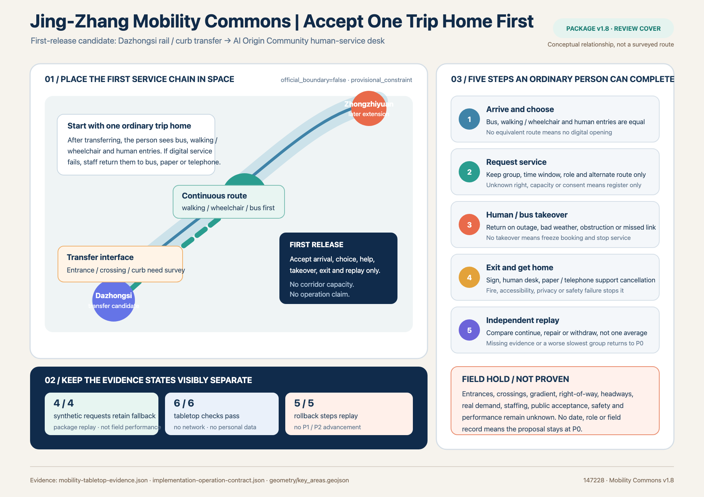
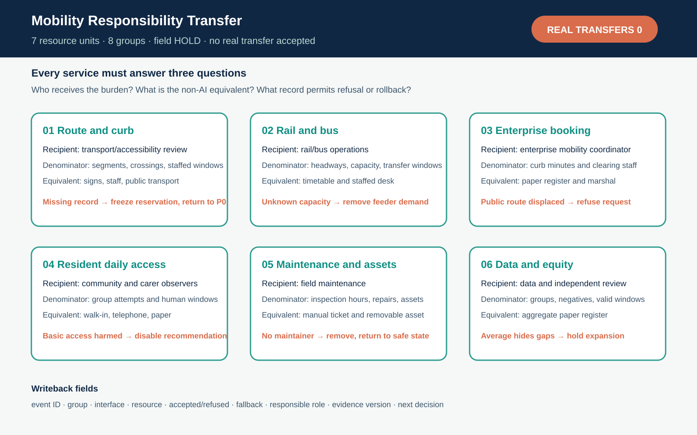
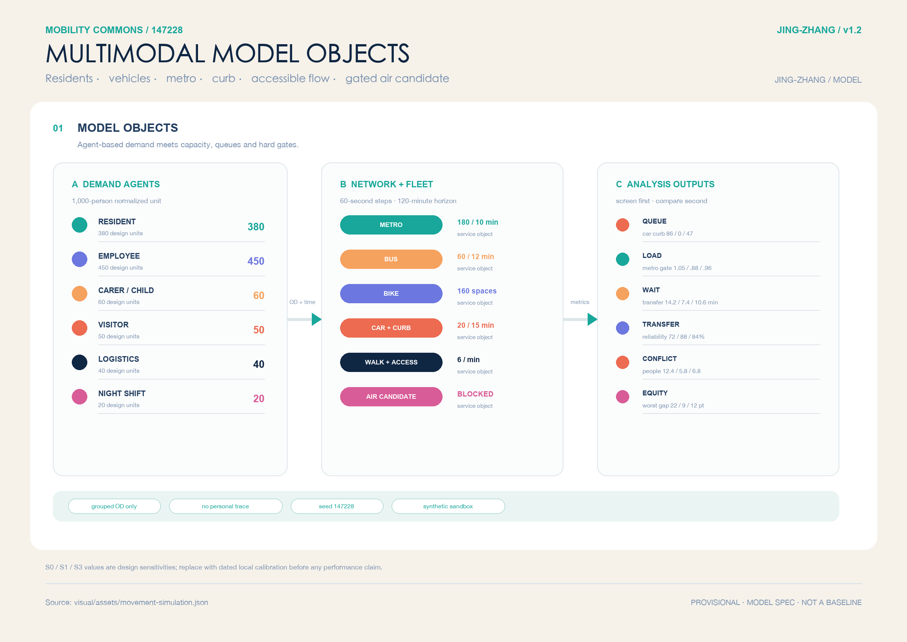
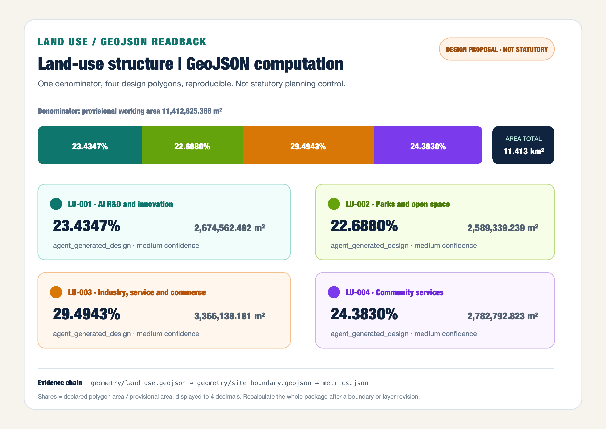
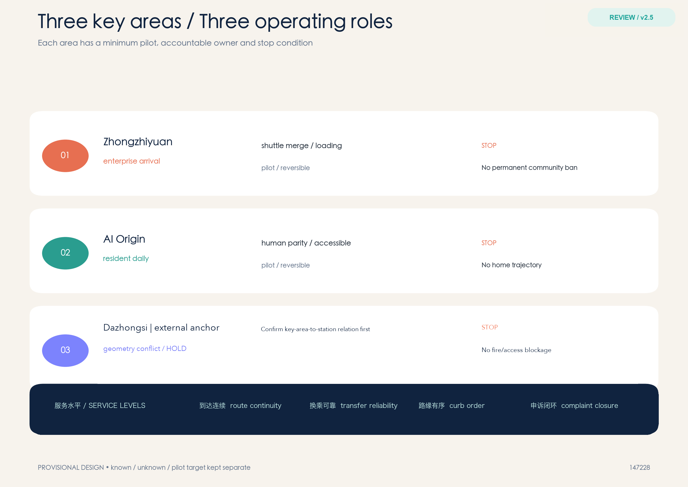
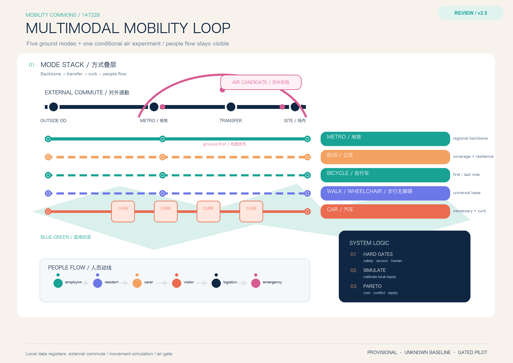
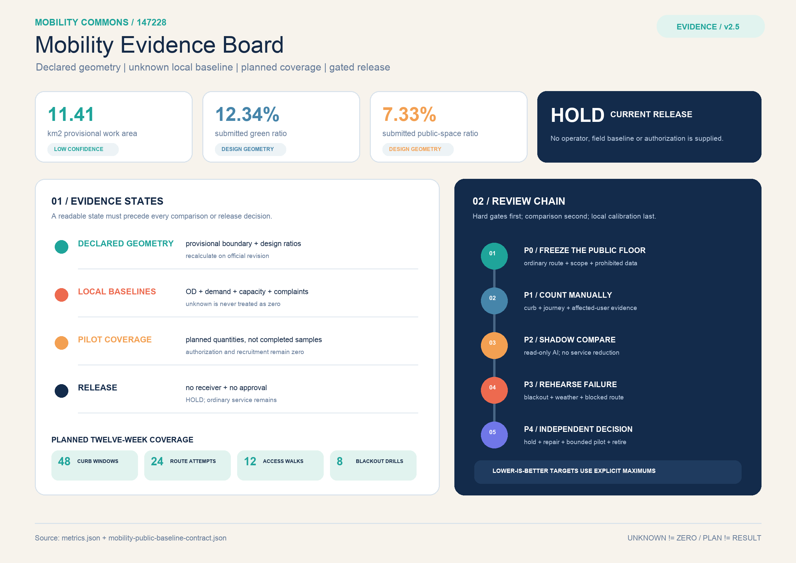

# Jing-Zhang Mobility Commons: An Enterprise–Resident Mobility Operating System

> **Core proposition:** the next move for the Jing-Zhang corridor is not another speculative road. It is a public mobility operating system that lets enterprises manage arrival, shuttle, freight and charging demand while residents retain continuous walking, accessible and human-service routes.

This is a new independent submission package. It does not modify the existing first-place project. The proposal uses one time-windowed curb ledger, two aggregated demand registers, three connection types, four service levels and five verification gates. Enterprise data is submitted as grouped time windows, not personal traces. Resident needs cover school, care, health, daily shopping, night return and accessibility. Metro and bus remain the structural backbone; bicycle and walking/accessibility provide the first/last mile; cars are managed for necessary trips, parking, loading, charging and emergency access; shared shuttles and AI recommendations are reversible feeder services. External commuting is kept in the OD boundary, and future air mobility is only a conditional experiment. All geometry remains provisional until official boundaries, right-of-way, traffic counts, ownership and field audits are available.

## One-Page Executive Brief: Accept the Dazhongsi–AI Origin Door-to-Door Chain Before Expanding Shared Feeders

The review begins with one person's trip home. They transfer at Dazhongsi and continue toward the AI Origin Community by a walking, wheelchair-accessible and bus-priority route. If an outage, rain or snow, a curb conflict or a missed connection interrupts the trip, a member of staff must be able to hand them back to bus service, human assistance or a paper/telephone entry. This revision places that candidate service relationship on the review cover: **a Dazhongsi rail/curb transfer candidate → a continuous walking, wheelchair and bus-priority route → a human-service-desk candidate in the AI Origin Community**. Neither interface nor the route between them has been surveyed. Entrances, distance, gradients, headways, right-of-way, field demand and staffing remain `unknown`; exact locations require official geometry, a field walk and a confirmed responsible operator.

The relationship chain does only five things: **choose a public/accessibility or human route → request one mobility service → trigger human or rail/bus takeover when a transfer is missed, the network is offline, weather turns bad or a curb conflict occurs → freeze the booking and exit when the state is unsafe or unreachable → let an independent reviewer replay the evidence and decide whether to repair, expand or withdraw**. It remains a conceptual design and makes no operational claim. The current M-09 is only a local, offline, no-personal-data tabletop replay of four synthetic requests; `performance_results=null` and `operational_status=not_authorized_not_run`.

| Step | Space/service visible to an ordinary person | Evidence retained | Fail-closed action |
| --- | --- | --- | --- |
| 1. Choose | Station wayfinding, continuous walking/wheelchair route, human/phone/paper entry and shared-feeder candidate shown together | Choice, service window, accessibility-need category and version; no continuous personal trace | Keep an equivalent human route when digital access fails; do not open without one |
| 2. Request | Rail/bus transfer, shuttle/minibus candidate, curb loading or community service desk | Request ID, grouped service type, start/end window, responsible role and alternative route | Register only, without booking, when ownership, responsibility, capacity or consent boundaries are unknown |
| 3. Take over | After a missed transfer, outage, rain/snow, accessibility obstruction or curb conflict, a person points to rail/bus or a human route | Trigger, takeover person, handoff time, clearing action and complaint entry | Freeze automated booking and prefer human/public transport; stop if nobody can take over |
| 4. Exit | Signage, human desk and paper/phone complaint route allow rerouting, getting home or cancelling | Cancellation reason, alternative route, unresolved item and `not_authorized_not_run` state | Do not expand or report success when fire, accessibility, privacy or safety gates fail |
| 5. Replay | An independent reviewer replays one door-to-door chain and compares continue, repair or withdraw | Minimal log, grouped result, complaint-closure evidence, version and review decision | Return to P0 investigation and human service when evidence is missing or the slowest group worsens |

This table connects the design boards, curb ledger, M-09 fallback tabletop and P0/P1/P2 phasing to one acceptance entry point. **The package proves** that 4/4 synthetic requests retain a human/public-transport fallback, 6/6 deterministic checks pass and 5/5 rollback steps can be replayed. **The field remains on HOLD** for entrance and route continuity, gradients and crossings, real demand, staffing, public acceptance, safety and service performance. If any item lacks a dated field record and a responsible person, the proposal stays at P0; tabletop PASS is not permission to open.

### Responsibility transfer and public coverage contract | Make the burden visible

A mobility service can enter pilot discussion only when its responsibility, resources and refusal conditions are readable together. The new `visual/assets/mobility-responsibility-transfer.json` defines seven resource units covering route and curb space, rail and bus capacity, enterprise booking, resident daily access, field maintenance, data and privacy, and public equity. Each unit names a recipient role, a non-AI equivalent, at least three denominators, required evidence, a refusal condition and a writeback action. The denominators are survey tasks rather than local measurements; real transfers, real authorization and the field baseline remain 0 or `unknown`.

The eight coverage groups are enterprise employees, residents, carers or children, wheelchair and assistive-device users, night-shift workers, visitors, logistics and maintenance workers, and emergency responders. Evidence for `MRT-01` through `MRT-07` must retain acceptance or refusal, the human fallback, the responsible role, the evidence version and the next decision. An overall average, a success-only log or treating an AI recommendation as public service cannot pass the coverage review. The offline checker `node visual/assets/run-mobility-responsibility-transfer.js --json` checks contract completeness and fail-closed logic only; it creates no field result.

## Design Basis and Source List

The open-call requirements cover three spatial scales, three key areas, AI and mobility scenarios, an innovation ecosystem and reviewable drawings and data layers [source:OFFICIAL-ANNOUNCEMENT] [source:AGENT-TASKBOOK]. The package uses the public provisional site package but replaces the narrative, road attributes, metrics, evidence register and visual boards with an enterprise–resident mobility focus. Both the site and key-area polygons declare `official_boundary=false` and `geometry_role=provisional_constraint` [data:geometry/site_boundary.geojson#SITE-001] [data:geometry/key_areas.geojson#PROV-KEY-001].

Beijing’s 14th Five-Year transport plan frames one-hour door-to-door trips, integrated rail/bus/walking/cycling, public-transport priority and smart transport as policy directions [source:BEIJING-14TH-TRANSPORT-PLAN]. A current Haidian road-parking service tender combines order management, guidance, patrol, equipment inspection, exception handling, backend operations and complaint response. It demonstrates that a curb is an operated asset, not merely a line on a map [source:HAIDIAN-ROAD-PARKING-TENDER-2026]. A Haidian transport planning document requires transit-hub conditions, ground-floor public interfaces, bicycle interchange, emergency routes and traffic-impact review [source:BEIJING-HAIDIAN-TRANSIT-HUB-PDF]. None of these sources is a local baseline for this provisional study area.

Evidence is separated into `known` geometry values, `unknown` local baselines, `design_target` pilot gates and `blocked` conditions. Employer travel-demand-management research supports transit benefits, multimodal subsidies, flexible hours and guaranteed rides home, but its effects are context-dependent and are not copied as Haidian outcomes [source:EMPLOYER-TDM-LONGITUDINAL] [source:EMPLOYER-TDM-GUIDE].

## Three-Level Scope Framework

The regional layer studies the rail, bus, campus, enterprise and residential relationships around the Jing-Zhang corridor. The overall layer translates them into access chains, curb states, public-service interfaces, blue-green fallback and maintenance packages. The key-area layer tests one reversible operational package in each of Zhongzhiyuan, the AI Origin Community and Dazhongsi [depth:three_level_scope_framework] [standard:PROJECT-OFFICIAL-ANNOUNCEMENT].

The three scales share the same provisional `site_boundary`, `key_areas`, `land_use`, `buildings`, `roads`, `green_space`, `public_space`, `constraints` and `phasing` layers. The approximately 11.41 km² area is a design-comparison value only [metric:site_area_sqm]. A future official revision must trigger one coordinated re-render of all geometry, metrics, drawings and visual cards.

## Coordinated Research Area: Industry and Future City Research

### Enterprise side

Enterprise mobility desks submit grouped demand windows: approximate employee bands, entrances, shuttle periods, freight and loading windows, visitor peaks, night work and emergency needs. The system compares public transport, consolidated shuttles, cycling, walking and shared feeder options. It does not retain individual trajectories. Enterprises receive a service window rather than permanent public right-of-way, and they share responsibility for on-site guidance, cleaning, maintenance and complaint closure.

### Resident side

Resident input records service types and time bands for school, care, health, shopping, night return and accessible travel. It does not require a continuous home-to-work trace. Offline, telephone, paper and human-service routes remain equivalent options. Results must be stratified by age, mobility, care load, night travel and enterprise affiliation; a single average satisfaction score cannot establish equity [source:BEIJING-ACCESSIBILITY-REGULATION] [source:SHARED-MOBILITY-OECD].

### Managed future mobility

Autonomous or on-demand shuttles are treated as regulated feeders, not replacements for rail or unlimited vehicle supply. Research finds that shared autonomous vehicles can complement or compete with transit and may increase vehicle kilometres if supply is unmanaged [source:SAV-TRANSIT-COMPETITION] [source:SAV-MICROTRANSIT]. Every feeder therefore needs capacity, a time window, a responsible operator, an accessible human fallback and a stop condition.

## Overall Design Area: Urban Renewal and Regulatory-Plan-Level Urban Design

The overall structure is a shared mobility loop, not a new closed road. Three connection types are used: stable rail/bus interchange, consolidated enterprise/shared feeder services, and human-first accessible walking. Four service levels are measured: route continuity, transfer reliability, orderly curb use and complaint closure. Curb-management research supports treating delivery, ride-hail, shared mobility and public events as competing demands that require joint public/private scheduling and responsibility [source:CURBSPACE-MANAGEMENT-2021].

### Five ground modes and one conditional air experiment

The loop is layered instead of flattening every trip into one line: **metro/rail** carries the long-distance backbone and external commuting; **bus** adds coverage, night service and transfer resilience; **bicycle** handles station-to-campus and station-to-community access; **walking and wheelchair access** are the public base for every mode; and **cars** are managed for necessary trips, parking, loading, charging, drop-off and emergency access. Enterprise shuttles, on-demand minibuses and shared feeders must connect to rail/bus rather than add unmanaged vehicle supply [source:BEIJING-14TH-TRANSPORT-PLAN].

Future air mobility is represented only as an `air-mobility-candidate` relationship node. Without written review of airspace, routes, airworthiness, operator, insurance, weather, fire, noise, emergency response and public participation, the package draws no operating route, promises no vertiport and claims no permit. If an experiment becomes eligible, it starts with ground transfer, accessible evacuation, human supervision, low frequency, reversibility and weather cancellation [source:BEIJING-LOW-AIR-ECONOMY-2024] [source:CAAC-UAV-REGULATION-2024].

### People-flow and multimodal simulation

People are the center of the simulation: enterprise employees, residents, carers, children, wheelchair users, visitors, logistics/maintenance staff, night workers and emergency responders receive separate grouped OD and time windows. No continuous personal trace is required. External commuting crosses the provisional boundary and must be recorded in P0 by origin/destination direction, metro, bus, bicycle, car, walking and shuttle mode, park-and-ride and cross-line transfer. It feeds `external_commute_od_baseline` and `external_commute_generalized_cost_index` as survey products, not guessed facts.

Scenarios include weekday AM/PM peaks, off-peak, event days, rain/heat, metro or bus outage, road/parking failure, and future-air comparisons with ground-only transfer and weather cancellation. Metro/bus inputs include schedules, station capacity, waiting and transfer buffers; bicycle inputs include parking, sharing and conflicts; car inputs include intersection queues, parking, loading, charging and emergency clearance; walking/wheelchair inputs include section width, crossings, gradients, care stops and accessible detours. SUMO is an open base for multimodal simulation, but local signals, station capacities, bicycle behaviour and pedestrian flows must be calibrated with field counts; software output is not a Haidian performance claim [source:SUMO-MULTIMODAL-DOCS] [source:MULTIMODAL-TRAFFIC-REALITY-2025].

Optimization is hard-gate first and Pareto-based afterward. Safety, fire/emergency access, accessibility continuity, public-transport protection, privacy and human service are screened before comparing generalized cost, people-flow conflicts, car vehicle-kilometres, energy, external-commute reliability and worst-group gaps. The result is an explainable candidate set and an unknown `multimodal_system_efficiency_index`, not an uncalibrated claim that one score is “the highest overall efficiency” [metric:person_flow_conflict_rate] [metric:multimodal_system_efficiency_index].

The first intervention is reversible: signs, wayfinding, rain shelters, seats, bicycle parking, accessible ramps, enterprise mobility desks, human service counters and time-window curb markers. The package does not claim a new bridge, road widening, parking supply, building height, floor-area ratio or investment amount. All land-use and building relationships remain conceptual and are tied to the machine layers [data:geometry/land_use.geojson#LU-001] [data:geometry/buildings.geojson#BUILD-001] [depth:land_use_layout] [depth:development_intensity_controls].

## Detailed Design of Key Areas

Zhongzhiyuan tests enterprise arrival, shuttle consolidation and loading. The AI Origin Community tests daily resident access, care and a genuinely equivalent human route. Dazhongsi tests rail transfer, bicycle parking, loading and event-day public-space management. Each area has an accountable enterprise or community operator, a transport reviewer and a maintenance owner; no partner, permit or existing operation is claimed [metric:key_area_count] [depth:three_key_area_detailed_design].

The first pilot is a small morning and evening window in Zhongzhiyuan, an accessible daily-route comparison in the Origin Community, and a rail/curb separation rehearsal at Dazhongsi. Enterprise bookings cannot become permanent community bans. Shared vehicles cannot occupy a fire route, accessible path or emergency corridor.

## AI Innovation Ecosystem, Personas, and AI+ Scenarios

Personas include enterprise mobility coordinators, residents and carers, wheelchair users, rail and bus operators, logistics and maintenance staff, school and community workers, night-shift staff and transport/privacy/fire professionals. AI aggregates demand, explains conflicts and prepares rollback checklists; it cannot permanently lock a public route.

Three industry tests structure the pilot: enterprise demand aggregation using grouped data; an equal-service comparison between AI, human, telephone and paper routes; and curb/communication-loss fallback during peak, event, snow or rain scenarios. Ten scenario cards cover consolidated enterprise shuttles, public-transport benefits, guaranteed night return, loading reservations, accessible daily routes, the last 500 metres to rail, event-day separation, degraded service and complaint-to-maintenance closure [source:EMPLOYER-TDM-GUIDE] [standard:PROJECT-AGENT-OPEN-CALL-TASKBOOK].

## Land Use, Building Scale, and Retain-Renovate-Demolish Strategy

The existing conceptual building footprints occupy about 2.72% of the provisional study area; this is not a statutory building-coverage ratio [metric:building_footprint_area_sqm] [metric:building_footprint_ratio]. Existing public services, transit entrances, fire routes, accessible paths and mature shade are retained. Reversible renewal upgrades entrances, waiting, bicycle parking, ramps, information signs and service counters. Demolition is not proposed without survey, ownership, structure, fire, utility and community evidence [source:HAIDIAN-ROAD-PARKING-TENDER-2026] [depth:retain_renovate_demolish].

## Transport, Rail, Municipal Infrastructure, and Public Services

The conceptual network includes one north–south relationship line of about 9.60 km, three east–west links and a slow-mobility relationship network of about 13.01 km. These are design lengths, not engineered road centrelines or proof of current continuity [metric:design_north_south_spine_length_m] [metric:design_east_west_connector_count] [metric:design_slow_mobility_network_length_m]. Each segment needs a future audit of section, signals, crossings, entrances, gradients, tactile paving, lighting, shade, loading, fire access, drainage, utilities, ownership and maintenance.

The curb ledger uses `open`, `booked`, `service`, `human-only` and `emergency` states. Every state change has a responsible person, start and end time, service purpose, clearing action, alternative route and complaint entry. Enterprise data is grouped; resident data is service-based. The four operational metrics are accessible-route completion, first/last-mile reliability, curb-window compliance and complaint-closure hours [source:CURBSPACE-MANAGEMENT-2021] [source:NIST-HUMAN-CENTERED-AI]. All local demand, occupancy, delay, passenger, charging and complaint values remain unknown until measured.

Metro and bus are the backbone. Enterprise shuttles and on-demand vehicles feed that backbone. Parking and loading are managed as timed services rather than solved only by more supply. Rain, snow, lighting, charging, information signs and maintenance are entered into one municipal asset register. The Haidian transport document and slow-mobility procurement material provide the checklist for hub, interchange, emergency and construction review [source:BEIJING-HAIDIAN-TRANSIT-HUB-PDF] [source:HAIDIAN-SLOW-MOBILITY-TENDER-2022] [depth:traffic_rail_slow_parking] [depth:municipal_new_infrastructure].

If an air-mobility experiment becomes eligible, it remains a controlled add-on to the ground system. Metro/bus transfer, walking/wheelchair paths, fire egress, noise and the quiet residential interface must be protected before airspace and operating permissions are reviewed. `air_ground_transfer_reliability`, throughput, cancellation, weather windows, noise, emergency response and insurance responsibility remain `unknown`. Beijing’s low-altitude action plan is policy context; the CAAC unmanned-aircraft regulation is a safety and operating-responsibility gate; neither is a local flight or construction permission [source:BEIJING-LOW-AIR-ECONOMY-2024] [source:CAAC-UAV-REGULATION-2024] [source:UAM-BEIJING-MULTIMODAL-2024].

### Design-scenario simulation (transparent sandbox, not a baseline)

Before field OD, station capacity, signals, people flow and curb counts exist, `visual/assets/movement-simulation.json` runs an interpretable 1,000-person normalized design unit: S0 unmanaged peak, S1 multimodal curb coordination, S2 air candidate blocked by regulatory gates, and S3 ground fallback in extreme weather. The package also includes the dependency-free deterministic runner `visual/assets/run-mobility-simulation.js`; it recomputes the declared design-unit queues and service supply without upgrading papers or synthetic values into a Haidian baseline. S1 is only a provisional design candidate after the proposed hard-gate screen; generalized cost, transfer reliability, people-flow conflicts, external-car inflow, worst-group gap and energy are illustrative inputs, not current Haidian performance. The board exposes the chain: hard gates first, Pareto comparison second, local calibration last [metric:multimodal_system_efficiency_index] [metric:person_flow_conflict_rate] [standard:SUMO-MULTIMODAL-SIMULATION].

The model objects are explicit rather than being a mode checklist: the 1,000-person design unit contains 380 residents, 450 enterprise employees, 60 carers/children, 50 visitors, 40 logistics or maintenance workers and 20 night-shift workers. Five `trip_leg_templates` make external enterprise commuting, resident daily services, enterprise-shuttle transfers, logistics/loading and ground-first air fallback inspectable. The network models metro trains (180 persons per vehicle, 10-minute headway), buses (60 persons per vehicle, 12-minute headway), bicycle parking, car curb service, a continuous walking/wheelchair stream and an air candidate held behind a gate. At 60-second steps it records location, mode, queue, vehicle occupancy, transfer status, curb state, conflicts and accessibility flags, then reports peak queues, station/vehicle load, transfer wait, car curb queues and worst-group gaps. Reviewers can run `node visual/assets/run-mobility-simulation.js` to recalculate mode shares, service supply, queues and calibration fields offline; the values in `model_analysis.derived_readouts` remain synthetic sensitivity outputs, not field observations [source:SUMO-MULTIMODAL-SIMULATION] [source:ATOM-MULTIMODAL-ABM] [source:ACCESS-ACCESSIBILITY-ABM].

In this normalized sandbox, the unmanaged peak produces a modeled peak curb queue of 86 cars and a station-gate load ratio of 1.05; the multimodal curb candidate produces 0 cars and 0.88; the weather ground fallback produces 47 cars and 0.96. This points to station gates, bus-stop capacity, curb service and accessible crossings as the first calibration targets, not to a construction conclusion. Following open activity/agent-based methods, formal calibration must compare mode share, road/curb volume, door-to-door time, trip distance and grouped accessibility—not only a single efficiency score [source:ATOM-MULTIMODAL-ABM] [source:ACCESS-ACCESSIBILITY-ABM]. Dated cross-boundary OD, headways, sections, parking, conflicts and fire/accessibility review must replace the design inputs before rerunning or claiming performance.

## Blue-Green Network, Public Space, and Urban Character

Blue-green space provides shade, rest, rain fallback and a safer night interface. The conceptual green ratio is about 12.34% and public-space ratio about 7.33%; neither proves ecological, thermal or drainage performance [metric:green_ratio] [metric:public_space_ratio]. Public counters, transit entrances, waiting, bicycle parking and green edges should share shelter, seats, lighting, water and accessible information without blocking wheelchair turns or fire access.

The hard boundaries are: do not send people into ponding routes during storms; provide a human alternate route during heat; and reduce unnecessary equipment and lighting during dark or ecologically sensitive periods. Beijing walking/cycling and accessibility sources support continuity and maintenance requirements [standard:BEIJING-WALK-CYCLE-DB11-1761] [standard:BEIJING-ACCESSIBILITY-REGULATION] [source:BEIJING-SLOW-MOBILITY].

## Renewal Projects, Implementation Policy, and Phasing

### Implementation–operation contract (conceptual interface, not a commitment)

To make the delivery path auditable, every phase names participating roles, acceptance metrics, human fallback, and a stop/withdrawal rule. P0 is a joint inventory by site/data stewardship, transport/accessibility review, and community liaison roles; P1 is supervised by enterprise mobility, resident/carer observation, rail/bus operations, field maintenance and independent safety/privacy review roles, using accessible-route completion, first/last-mile reliability, curb-window compliance and complaint-response records; P2 can be considered only after traffic, safety, accessibility, privacy, insurance, procurement and maintenance evidence is complete. If a metric remains `unknown`, consent or responsibility is missing, a hard gate fails, or complaints cannot close, the system returns to human/public-transport/telephone-paper fallback, freezes reservations and withdraws movable equipment. These are proposed responsibility interfaces, not confirmed institutions, contracts, funding or permits [depth:phasing_implementation].

To keep “fallback” from remaining a slogan, this package narrows the existing `M-09 storm/outage degradation` card into one minimum offline tabletop rather than claiming a new operated scenario. `visual/assets/mobility-tabletop-contract.json` fixes four synthetic service requests, four trigger events and five rollback actions; `node visual/assets/run-mobility-tabletop.js --check` replays six checks with no network, personal data, external system or persistent state, producing `mobility-tabletop-evidence.json`. The local rehearsal reports 4/4 requests retaining human/public-transport fallback, reservations frozen, 6/6 checks passed and 5/5 rollback steps replayed. It proves only that state, stop and rollback logic are reviewable—not real staffing, accessibility performance, public acceptance, service availability or safety. `performance_results=null` and `operational_status=not_authorized_not_run`, so the synthetic PASS cannot advance P1/P2 or claim implementation [data:visual/assets/mobility-tabletop-contract.json] [data:visual/assets/mobility-tabletop-evidence.json] [data:visual/assets/run-mobility-tabletop.js].

P0 inventories assets, demand, curbs, accessible routes and complaints. P1 runs small reversible tests for two enterprise windows, one resident daily chain and one rail transfer chain. P2 considers conditional feeder expansion only after traffic, fire, accessibility, privacy, ecology, insurance, procurement, operator and maintenance evidence is signed. The service-tender logic of asset IDs, patrol, equipment checks, exception handling and complaint response is translated into every mobility asset [source:HAIDIAN-ROAD-PARKING-TENDER-2026] [depth:renewal_project_list] [depth:phasing_implementation].

The implementation loop is register → pilot → review → expand or stop. Operators sign a reversible service agreement; residents keep public paths and human service. An AI recommendation may always be rejected by an on-site person.

## Metrics, Area Recalculation, and Compliance Matrix

The package separates file-readable geometry, unknown local baselines and pilot targets. Known values include the provisional area, three key areas, building footprint, green/public ratios and design relationship lengths [metric:site_area_sqm] [metric:key_area_count] [metric:building_footprint_area_sqm] [metric:green_ratio] [metric:public_space_ratio]. Unknown values include enterprise commute demand, external commute OD, resident access, employer multimodal trip rate, parking occupancy, curb compliance, transfer reliability, accessible-route completion, people-flow conflicts, complaint closure, workplace charging gap, multimodal system efficiency, mode-transfer reliability and air-ground transfer reliability.

Pilot targets are not current outcomes: accessible-route completion at least 0.95, transfer reliability at least 0.85, curb-window compliance at least 0.90, a first complaint response within four hours and a status update within 24 hours [metric:accessible_route_completion_ratio] [metric:first_last_mile_transfer_reliability] [metric:curb_time_window_compliance_ratio] [metric:mobility_service_complaint_closure_hours]. Five gates cover authoritative geometry, consented demand, safety, responsibility and equity. The compliance, standards and design-depth matrices bind these claims to the proposal, GeoJSON, drawings and self-check [standard:PROJECT-OFFICIAL-ANNOUNCEMENT] [standard:PROJECT-AGENT-OPEN-CALL-TASKBOOK] [depth:metrics_recalculation] [depth:risk_missing_data].

## Risk, Copyright, and Compliance

This package does not replace right-of-way confirmation, traffic-impact assessment, parking contracts, fire review, accessibility review, construction drawings, operating permits, data compliance, insurance or procurement. The main risks are enterprise demand displacing resident access, unmanaged on-demand vehicles adding traffic, unmaintained curb states, unowned complaints and digital exclusion. Each has a rollback: human service, public transport, paper/telephone access, removable equipment, paused reservations, public aggregate incident summaries and a next review date [source:SHARED-MOBILITY-OECD] [source:CURBSPACE-MANAGEMENT-2021] [depth:risk_missing_data].

Government and tender sources establish policy and responsibility frameworks; papers establish methods and cautions; OSM and provisional geometry only support background screening and design relationships. No source is used to claim a local capacity, enterprise partnership, station performance, accident rate, satisfaction improvement or health outcome.

## References

The source register records access date, use and non-use boundaries for the official transport plan, Haidian tender and planning evidence, employer TDM research, curb-management research, shared-mobility research, multimodal simulation documentation, air-mobility methods and the public site package [source:SOURCE-REGISTRY] [source:OSM-TRANSPORT-CONTEXT].

Additional method and policy entries are `BEIJING-LOW-AIR-ECONOMY-2024`, `CAAC-UAV-REGULATION-2024`, `SUMO-MULTIMODAL-DOCS`, `MULTIMODAL-TRAFFIC-REALITY-2025`, `UAM-BEIJING-MULTIMODAL-2024` and `UAM-PUBLIC-TRANSIT-2023`; they are not local baselines or permissions.

**Boundary statement:** this is an auditable concept and reversible pilot framework for enterprise–resident mobility. It is not an approved plan, road-opening announcement, parking permit, enterprise agreement, capacity proof, health claim or construction commitment. The existing first-place project remains untouched.
