# 京张共行环：企业—居民交通共益系统

> **一句话判断**：京张带的下一步不应是“再加一条未来道路”，而应把企业的到岗与装卸、居民的上学就医与回家、轨道换乘、路缘停车和维护投诉放进同一个可复算的交通操作系统，让每一项 AI 优化都先证明没有挤掉最慢的人。

本方案是一份独立的新投稿包，第一名项目 `zhongzhiyuan-autonomy-commons` 不在本目录中修改。方案提出“**一张时段路缘账本、两侧需求台账、三类接驳、四项服务水平、五道验证门**”：企业侧登记到岗、班车、货运和充电需求；居民侧登记不含个人轨迹的日常服务需求；空间侧用地铁—公交—自行车—步行/无障碍—汽车的多方式接驳链和可逆路缘窗口消化峰值，同时把跨边界对外通勤纳入 OD；未来空中出行仅保留一个有审批前置条件的实验接口。全部空间仍属于概念设计，官方边界、路权、交通量、权属和现场体验到位后才能复算，不把开放数据筛查写成现状容量。

## 一页执行摘要：先验收一条到站—到家链，再谈共享接驳扩展

普通人在出门、换乘、受阻、求助和回家每一步都要保有可理解的选择。第一个可逆试点只验收一条最小链：**选择公共/无障碍或人工路径 → 请求一项交通服务 → 在断网、雨雪、路缘冲突或错过衔接时触发人工/轨道公交接管 → 对不安全或不可达状态冻结预约并退出 → 由独立复核者回放证据后决定修复、扩展或撤回**。当前 M-09 只在本地、无网络、无个人数据的合成桌面演练中复演 4 条请求；它不构成现实运营承诺，`performance_results=null`、`operational_status=not_authorized_not_run`。

| 步骤 | 普通人看到的空间/服务 | 必须留存的证据 | 失效即闭环的动作 |
| --- | --- | --- | --- |
| 1. 选择 | 站口导向、连续步行/轮椅路线、人工/电话/纸面入口与共享接驳候选并列展示 | 选择方式、服务窗口、无障碍需求类别和版本号；不留连续个人轨迹 | 数字入口不可用时保留人工等价路径；没有等价路径就不开放 |
| 2. 请求 | 公共交通换乘、班车/小巴候选、路缘装卸或社区日常服务台 | 请求 ID、服务对象分组、起止时间窗、责任人和替代路线 | 权属、责任人、容量或同意边界未知时只登记、不预约 |
| 3. 接管 | 错过衔接、断网、雨雪、无障碍受阻或路缘冲突后，现场人员指向轨道/公交或人工路线 | 触发事件、接管人、到达/转交时间、清场动作和投诉入口 | 冻结自动预约，优先人工/公共交通；无人可接管时停止服务 |
| 4. 退出 | 消息牌、人工窗口和纸面/电话申诉让人能改道、回家或取消 | 取消原因、替代路线、未解决项和 `not_authorized_not_run` 状态 | 消防、无障碍、隐私或安全硬门失败时不扩容、不写成达标 |
| 5. 复核 | 独立复核者回放一条到站—到家链，比较是否继续、修复或撤回 | 原始最小日志、分组结果、投诉关闭证据、版本和复核意见 | 证据缺失或最慢群体变差时回到 P0 调查与人工服务 |

这张表把设计图、路缘账本、M-09 回退桌演和 P0/P1/P2 分期接成同一个验收入口；4 条合成请求的 PASS 只证明状态机和回滚逻辑可重放，不证明真实客流、无障碍绩效、人员值守、公众接受或安全结果。

### 首 168 小时与首 12 周：把“能不能做”先变成退出票据

高分方案常把愿景压缩成评审者可以逐项追问的交付链。本版保留两张设计票据，不把它们写成已经发生的工作。`visual/assets/mobility-first-168h.json` 把首 0–24、24–72、72–120、120–168 小时分别绑定到普通路线、空间接口、失效桌演和独立复核；`visual/assets/mobility-first-12-weeks.json` 再把 W01–02 的边界与同意、W03–04 的路线审计、W05–07 的普通服务等价、W08–09 的失效桌演、W10–11 的专业复核和 W12 的 HOLD/修复/撤回接起来。

其中 H1 不再笼统登记“三处接口”。它逐项引用众智园、AI 原点的 2 条待核顺序和 6 个候选点，共 8 个正式几何对象；现有校验器会核对这些引用能否在 `roads.geojson` 与 `public_space.geojson` 中回读。大钟寺的 3 个点和 1 条线则列入 `external_anchor_only`，只作公开底图筛查证据，且必须保持在正式图层之外，直到重点区几何、路线走查、无障碍与消防复核、责任接收者四项条件齐备 [data:visual/assets/mobility-first-168h.json] [data:geometry/roads.geojson#MOB-AUDIT-SEQUENCE-ZHONGZHIYUAN] [data:geometry/roads.geojson#MOB-AUDIT-SEQUENCE-AI_ORIGIN]。

时间表每一段都写四件事：**谁接收、要留下什么证据、什么情况必须停、停下后回到哪条普通路径**。因此它不把“12 周”写成承诺，也不把离线回放写成现场绩效；授权、现场观察和本地 baseline 仍为 0 或 `unknown`。首 168 小时的默认产出是 `HOLD`、补证据、修复或撤回，而不是开通服务。双语总览见 `assets/figures/mobility-release-chain.svg` 与 `.en.svg`。

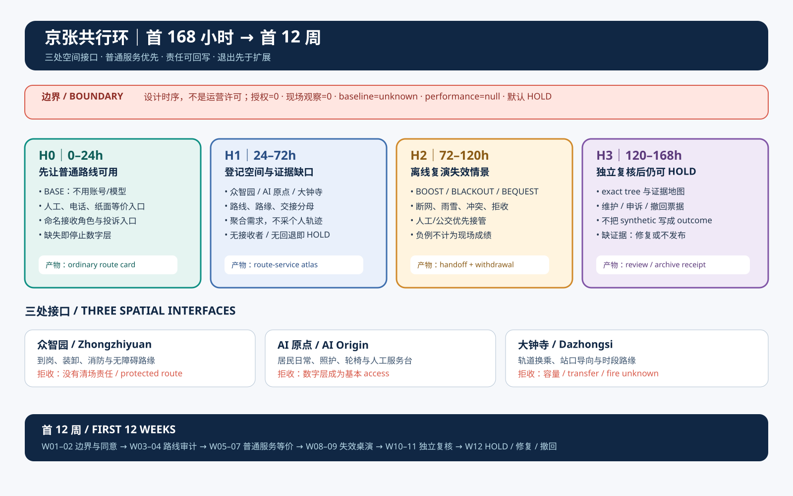

`visual/assets/mobility-release-evidence-map.json` 把普通人旅程、三处空间接口、交付维护、来源边界、治理权责、可逆性和视觉导航七个评审问题绑定到具体文件；每个维度的 `field_claims` 保持为空。这样评审者可以先看一张板，再沿同一条路径回到 JSON、图纸、假设与负例，而不会把“文件很多”误读成“已经运营”。

## 任务书一眼核对｜一趟完整行程怎样接住三区两翼

“共行环”用一趟完整行程回应任务书的三大定位。百年京张文化带落在人人看得懂的时刻、换乘和公共通行秩序上。都市 AI 生活体验带从建筑出口开始，经过首段步行或轮椅路线、过街、站口和换乘，一直走到目的地入口与安全回家。AI 融合创新带负责聚合分组需求、说明冲突、准备人工接管，并留下停止与复核记录。三条线共用一条边界。公共通行不能依赖企业账号，也不能要求居民交出连续个人轨迹 [standard:PROJECT-AGENT-OPEN-CALL-TASKBOOK]。

| 任务书功能 | 共行环中的可见成果 | 第一个可交付物 | 仍待补齐 |
| --- | --- | --- | --- |
| AI 全栈自主创新体系 | 需求台账、路缘状态机、多方式沙盘、回退运行器和版本化收据 | 众智园两段高峰脚本与合成故障演练 | 企业授权、现场容量和安全责任人 |
| 世界级 AI 创新生态 | 企业、公共交通、社区、开发者、无障碍使用者和独立复核者共同定义接口 | 开放字段字典、采购接口和可复演负样本 | 真实合作方、资金、人才和算力责任 |
| AI+ 场景应用新模式 | 十张场景卡、三项产业测试和完整行程收据共用停止条件 | M-09 四条合成请求与五步回滚 | 经批准的小样本与现场基线 |
| 智能化 AI 活力城市 | 轨道公交为骨架，步行、轮椅和人工服务保住公共通行 | 大钟寺到 AI 原点的到站回家候选链 | 站口、过街、坡度、班次和人员值守 |
| AI 治理全球话语权 | 一次推荐留下选择、接管、退出、申诉和复核记录 | 双语字段、失败档案和第三方回放说明 | 公共审议、独立复核机构和长期运营 |

六个国际公开参照各解决一段问题。USDOT Complete Trip 计划把跨机构协作和无障碍完整行程放在同一项目里，DART GoLink 案例说明首末端服务需要分阶段小范围测试并让一线运营人员参与采购。残障乘客首末端研究提醒评审者，车站或车辆可用仍可能在站外断掉 [source:USDOT-COMPLETE-TRIP-ITS4US] [source:USDOT-DART-GOLINK] [source:DISABLED-FIRST-LAST-MILE-2024]。完整行程综述继续追问断点，上海轮椅公共交通研究把步行障碍、站口和延误因素分开记录，FHWA 路缘资料则把无障碍、装卸、公交和微出行放在同一处空间里比较。这里吸收的是方法和交付关系，不迁移国外资金、机构、样本比例或绩效 [source:WHOLE-JOURNEY-DISABILITY-2021] [source:SHANGHAI-WHEELCHAIR-TRANSIT-2025] [source:FHWA-CURBSIDE-MANAGEMENT]。

为了避免“国际案例”停在名单上，本版另做六张迁移卡。Punggol ODP 只贡献共享城区接口，Seoul S-Map 只贡献公开比较方案的方法；传感器数量、城市监测权和国外治理结构不能成为海淀事实 [source:PUNGGOL-ODP-LIVING-LAB] [source:SEOUL-SMAP-OPEN-LAB]。

Helsinki Mobility Lab 只贡献“城市问题—小范围街测—居民与运营者反馈”的次序，Woven City 只贡献人本迭代测试循环；再加上 Complete Trip 的跨机构完整行程和 DART GoLink 的首末端分期。私域土地控制、客流、成本、资金与绩效同样不迁移 [source:HELSINKI-MOBILITY-LAB] [source:WOVEN-CITY-LIVING-LAB]。

### 一张共行收据｜七个环节都能走通才算完成

验收链从出门前获得信息开始，依次经过建筑出口、首段步行或轮椅路线、过街与站口、上车与换乘、末段路线，最后到达目的地入口并保留回程或退出办法。任何一环失败，这次行程都记为未完成，其他环节的平均成绩不能冲抵 [source:WHOLE-JOURNEY-DISABILITY-2021] [source:SHANGHAI-WHEELCHAIR-TRANSIT-2025] [source:FHWA-CURBSIDE-MANAGEMENT]。

收据只保留复核需要的字段，包括版本、分组后的需求类别、七环状态、障碍类型、人工接管角色、替代路线、申诉编号、关闭证据和下一次复核日期。样本登记还要说明哪些人没有进入样本。无法离开建筑、无法到达站点、没有智能手机或不同意连续观察的人，可以在取得同意后通过上门或电话访谈、照护者见证和无个人轨迹的障碍登记进入问题清单。当前尚未开展这些现场工作。

| 任务 | 本包现在交付什么 | 下一次专业深化 |
| --- | --- | --- |
| agent.1 总体概念与功能统筹 | 主名“京张共行环”、英文名“Jing-Zhang Mobility Commons”，视觉方向采用可分离双环和道岔 | 只放到经许可的站口导向、路缘状态牌和人工服务台，不替代一带正式标识 |
| agent.2 创新生态 | 六个公开方法与项目参照、企业居民双账本、五类要素接口和三区两翼职责 | 由专业团队补上土地、空间、资金、人才、算力、数据和场景的真实主体与授权 |
| agent.3 AI+ 场景 | 十张场景卡、三项测试、八类受影响者和“场景到空间再到退出”的映射 | 在小月河翼和三处重点区选择经批准的最小样本，公开基线和停止记录 |
| agent.4 公共空间与地标 | 大钟寺“共行时刻台”、AI 原点“到达权刻度”、众智园“失败档案站”三类候选组件 | 核对文保、绿地、消防、道路和权属后再定位置与尺寸 |
| agent.5 文化叙事 | 用铁路时刻、中关村协作和 AI 公共收据串起导视与一条回家路 | 由文史、视觉和无障碍团队共同审校史实与可读性 |
| agent.6 长期运营 | 季度完整行程审计走访、年度 Mobility Commons Week、合成数据挑战、运营培训和失败复盘 | 先确认主办角色、经费、场地、数据许可和公众参与 |

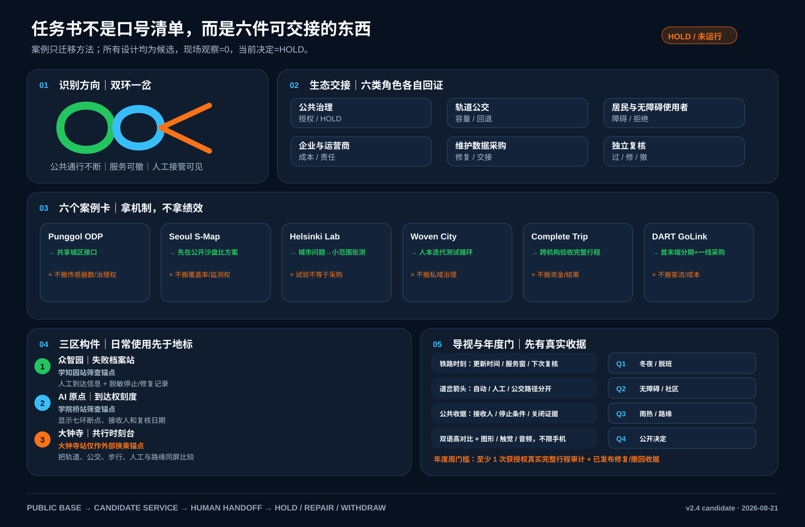

这张交付板不是愿景拼贴。双环一岔把不可撤销的公共通行、可撤的候选服务和可见的人工接管分开；生态图要求公共治理、轨道公交、居民与无障碍使用者、企业运营商、维护数据采购和独立复核各自“接收什么、交回什么”；三区构件先承担日常信息、障碍公示和失败修复，再讨论地标性。年度日历按冬夜、无障碍与社区、雨热与路缘、公开决定四季运行，但 `Mobility Commons Week` 只有在至少一趟获授权的真实完整行程完成审计并公开修复或撤回收据后才可启动。当前现场观察为 0，全年活动仍为 `HOLD` [data:visual/assets/taskbook-deliverables.json]。

三个候选地标都承担日常任务。“共行时刻台”显示公共交通、人工服务和路缘状态。“到达权刻度”公开七环中尚未闭合的障碍与下一次复核日期。“失败档案站”只展示已经脱敏、可以复演的停止和修复记录。荣誉授予修复公共障碍、公开失败证据并保持人工服务的人与团队。年度活动沿用同一条门槛，先完成一次真实的完整行程审计，再讨论展览、挑战赛和国际传播。它们都是待专业深化的方案建议，没有场地、经费或主办承诺 [data:visual/assets/taskbook-crosswalk.json] [depth:three_key_area_detailed_design] [depth:phasing_implementation]。

## 设计依据与资料清单

征集任务要求覆盖三层空间研究、三处重点区、AI+交通与产业生态，并交付可检查的图层、指标、图纸和视觉页 [source:OFFICIAL-ANNOUNCEMENT] [source:AGENT-TASKBOOK]。

本包沿用公开任务书的 provisional 工作底盘，但以交通运营为主题重做路网属性、指标、来源、图件和实施门槛；`geometry/site_boundary.geojson`、`geometry/key_areas.geojson` 都明确 `official_boundary=false`、`geometry_role=provisional_constraint`，不得解释为法定红线 [data:geometry/site_boundary.geojson#SITE-001] [data:geometry/key_areas.geojson#PROV-KEY-001]。

北京“十四五”交通规划将一小时门到门、轨道/公交/步行/自行车一体化、公交优先和智慧交通列为方向 [source:BEIJING-14TH-TRANSPORT-PLAN]。海淀区 2026—2027 年道路停车管理服务招标把停车秩序、引导巡查、设备检查、异常处置、后台和“接诉即办”放进同一项服务，按有责任主体和服务水平的运营资产管理路缘 [source:HAIDIAN-ROAD-PARKING-TENDER-2026]。

海淀西北旺规划交通材料还要求轨道站点/交通枢纽、首层公共界面、换乘自行车停放、应急疏散和交通影响评价共同校核 [source:BEIJING-HAIDIAN-TRANSIT-HUB-PDF]。这些材料只提供政策和招标依据，不能作为本 provisional 范围的现状数据。

资料等级分为四类：`known` 是文件可回读的几何数值；`unknown` 是必须调查而不能猜的企业、居民、停车、换乘和投诉基线；`design_target` 是可逆试点的验收门槛；`blocked` 是没有权属、路权、责任人、无障碍等价服务或安全回退时不得扩容的状态。企业通勤研究支持班车、公共交通补贴、弹性工时和保证回家等需求管理工具，但也提醒 rideshare 和补贴的效果取决于工作密度、制度和分组行为 [source:EMPLOYER-TDM-LONGITUDINAL] [source:EMPLOYER-TDM-GUIDE]；不把论文中的效果百分比迁移成海淀结果。

## 三层范围工作框架

三层结构把“企业为什么要改”和“居民如何真正受益”接到同一条证据链上 [depth:three_level_scope_framework] [standard:PROJECT-OFFICIAL-ANNOUNCEMENT]。

1. **统筹层**：研究京张—海淀的轨道、公交、校园、园区、社区和生活服务如何形成多方式接驳；识别企业时间窗、居民时间窗和公共空间之间的冲突，不新增一条未经交通论证的道路。
2. **总体层**：用 `land_use`、`buildings`、`roads`、`green_space`、`public_space`、`constraints` 和 `phasing` 共同定义到站、到岗、到家和服务维护的空间关系；用时段状态而不是永久占用表达路缘。
3. **重点区层**：在众智园、AI 原点社区、大钟寺 AI 产业聚集区各做一组可逆试点，分别验证企业到岗、居民日常和轨道/路缘换乘。

任务书点名的北纬社区、未来科学城、怀柔科学城、经开区与京津冀，在本方案中是五类**待确认交换接口**，不是既有合作方：北纬社区交换居民日常可达、夜间返程与无障碍问题单；未来科学城交换分组通勤 OD 与企业班车时窗；怀柔科学城交换长距离科研通勤及极端天气回退需求；经开区交换企业轮班、装卸、充电和路缘运行模板；京津冀层面只交换城际轨道、公交衔接时窗与匿名化失接原因。每个接口都必须先确认数据用途、分组粒度、接收责任角色和停止条件；没有具名接收者与书面同意时，只保留空白模板，不写成数据接入、联合试点或合作承诺 [standard:PROJECT-AGENT-OPEN-CALL-TASKBOOK]。

三层共享同一 provisional 约 11.41 km² 工作范围，面积只作为设计比较值 [metric:site_area_sqm]。正式边界发布后，应锁定 revision，重算所有图层、路线、分区、图纸和指标；不得只替换一张效果图。

## 统筹研究范围产业与未来城市研究

### 企业侧：把“通勤”从人力成本变成可治理的服务

企业不再各自发班车、各自占用路缘，而是在不上传个人轨迹的前提下，按日/周提交聚合需求台账：班次窗口、员工总量区间、园区入口、货运/装卸窗口、访客峰值、夜班和应急需求。企业交通专员只看分组后的需求矩阵，平台输出公共交通接驳、拼车/班车、骑行停车、共享接驳和保证回家服务的组合建议。企业必须为使用的路缘窗口、人工引导、设备维护和投诉闭环承担成本与责任，不能把拥堵外包给社区。

### 居民侧：把“到达权”作为不可稀释的公共服务

居民台账只记录匿名化的服务类型和时间段，例如上学、就医、买菜、照护、夜班回家、轮椅通行和快递取件；不采集连续家庭轨迹。任何 AI 推荐都必须保留线下、电话、纸面或人工等价路径。居民不需要加入企业平台才能使用人行路、公共交通、无障碍路线或服务台。分组结果应按年龄、行动能力、照护负担、夜间出行和是否园区员工分别回读，不能只看全体平均值 [source:BEIJING-ACCESSIBILITY-REGULATION] [source:SHARED-MOBILITY-OECD]。

### 未来城市：受控的接驳，而不是无限增加车辆

自动驾驶或按需小巴只在获批、低速、有人值守的首末端场景作为 feeder；研究显示共享自动驾驶既可能补充也可能挤压公共交通，若不管理供给，车辆公里数可能上升 [source:SAV-TRANSIT-COMPETITION] [source:SAV-MICROTRANSIT]。本方案因此把轨道和公交作为骨架，把按需服务设为有容量、时窗和退出条件的补充，并以现场交通影响评价、公共交通客流和居民体验决定是否继续。

## 总体设计范围城市更新与控规深度城市设计

### 总体结构：一条共行环、三类接驳、四项服务水平

“共行环”把既有轨道/公交站点、企业入口、社区服务点、公园慢行和公共停车/装卸节点串成可辨认的转乘链，不新增封闭环路。三类接驳为：

- **骨干接驳**：轨道与公交之间的稳定换乘，优先解决站口、过街、候车和自行车停放的连续性；
- **共享接驳**：企业合并需求后的定时班车、微循环小巴或共享出行，必须服务于骨干而不是与骨干抢客；
- **人本接驳**：无障碍步行、轮椅/照护者、儿童和夜班人工服务，任何数字服务失败都退回这条链。

### 五种地面方式与一个条件空中实验

“共行环”按方式分层，每种方式保留清楚的职责：**地铁/轨道**承担跨区骨干和对外通勤的长距离段，**公交**补充站点覆盖和夜间/换乘弹性，**自行车**承担站点—园区/社区的首末端，**步行与轮椅**是所有方式的基本公共路径，**汽车**只在必要出行、停车、装卸、充电、接送和应急路径中被管理。企业班车、按需小巴和共享接驳必须先接入轨道/公交，不以新增车辆替代公共方式 [source:BEIJING-14TH-TRANSPORT-PLAN]。

未来空中出行只建立 `air-mobility-candidate` 关系节点：在没有空域、航路、适航、运行人、保险、气象、消防、噪声、应急和公众参与的书面复核前，不画可运营航线、不承诺起降场、不把论文方法写成许可。若未来进入实验，必须从地面换乘、步行/无障碍疏散和数据记录开始，并设置可撤回、低频、有人值守和天气取消条件 [source:BEIJING-LOW-AIR-ECONOMY-2024] [source:CAAC-UAV-REGULATION-2024]。

四项服务水平是：**到达连续**（人行/无障碍路线不被路缘打断）、**换乘可靠**（等待和衔接在可接受窗口内）、**路缘有序**（预约/装卸/停车按时间窗清场）、**申诉可闭环**（责任人、状态、限时和复核可见）。路缘管理研究指出，配送、网约车、共享出行和公共活动对同一空间的需求会冲突，公共部门与企业必须共同安排时间、责任和数据边界 [source:CURBSPACE-MANAGEMENT-2021]。

### 空间更新：先可逆，再固定

现阶段不提出新建桥隧、道路拓宽、停车供应量、建筑高度、容积率或投资额。先用标线/可移动设施、站口导向、遮雨座椅、连续坡道、自行车停放、企业班车候车位和路缘电子/纸面状态牌做 P0/P1 试点。只有当现场测绘、交通模型、消防、市政管线、产权、环境和公众参与均有书面证据，才进入固定工程。

用地和建筑关系回接至 `geometry/land_use.geojson`、`geometry/buildings.geojson`，所有面积属于概念量 [data:geometry/land_use.geojson#LU-001] [data:geometry/buildings.geojson#BUILD-001]。

设计深度与强度边界分别回接 [depth:land_use_layout] [depth:development_intensity_controls]。

## 重点区域详细设计

三处重点区在同一条企业—居民出行链上承担三种运营角色；重点区数量为三处，几何仍是 provisional [metric:key_area_count] [data:geometry/key_areas.geojson#PROV-KEY-001]。

| 重点区 | 主要需求 | 设计动作 | 首个可逆试点 | 不能越过的边界 |
| --- | --- | --- | --- | --- |
| 众智园 AI 自主创新加速区 | 企业到岗、班车合并、园区物流、访客峰值 | 入口前置“企业交通台账台”；把班车、骑行停车、装卸和消防净空分成状态层 | 仅在园区管理范围内做 2 个高峰时窗，比较合并班车/公共交通接驳与路缘冲突 | 不把企业需求变成社区禁停；无权属、无现场安全员不开放共享接驳 |
| 北京 AI 原点社区 | 上学、就医、买菜、照护、夜班和无障碍日常 | 以社区服务台、连续人行线、遮雨候车和非数字预约形成“人工优先环” | 对照人工/电话/纸面服务，审计轮椅、照护者和老年人完成同一条日常路线 | 不收集家庭连续轨迹；不以 App、企业账号或摄像头换取基本通行 |
| 大钟寺 AI 产业聚集区 | 轨道换乘、企业访客、停车装卸、活动日人流 | 站口—骑行停放—步行穿越—企业入口统一导向；路缘按分钟级窗口清场 | 在工作日高峰与活动日做轨道接驳、装卸和居民归家分流演练 | 不占消防/无障碍通道；共享自动驾驶不替代轨道，不承诺社会道路许可 |

### 公开底图筛查｜从站口、过街和路缘窗口开始，不把框画成现场

本版用 2026-08-21 访问的 OpenStreetMap/Overpass 数据做背景筛查，在三处候选区周边分别标出已映射的站点或出入口、最近的已映射过街点、公交/路缘观察窗，再用一条虚线把它们连成 **P0 审计顺序**。这条线不是已核验路线；公开地图中的“存在”也不能证明坡度、净宽、信号、容量、无障碍、消防、路权或许可。两份 FeatureCollection 审计资产因此把 `authorization=0`、`field_observations=0`、`decision=HOLD` 写到每个点和线 [source:OSM-TRANSPORT-CONTEXT] [data:visual/assets/osm-mobility-context.json] [data:visual/assets/mobility-interface-candidates.json]。

本轮没有把 12 个筛查要素一股脑写进正式空间图层。只有同时落在临时 SITE 与对应 key-area 内的众智园、AI 原点 6 个候选节点和 2 条审计顺序进入 `public_space.geojson` / `roads.geojson`。节点统一为 `SCENARIO_NODE + confidence=low`，并保留 OSM 锚点、现场观察为 0、接收人未确认和四项启用前置条件 [data:geometry/public_space.geojson#MOB-INTERFACE-ZHONGZHIYUAN-1] [data:geometry/public_space.geojson#MOB-INTERFACE-AI_ORIGIN-1]。

两条线统一为 `p0_audit_sequence_not_a_verified_route`。它们使正式几何能回读“站口—过街—路缘”的待核关系，但没有增加任何现场事实、道路红线或施工尺寸 [data:geometry/roads.geojson#MOB-AUDIT-SEQUENCE-ZHONGZHIYUAN] [data:geometry/roads.geojson#MOB-AUDIT-SEQUENCE-AI_ORIGIN]。

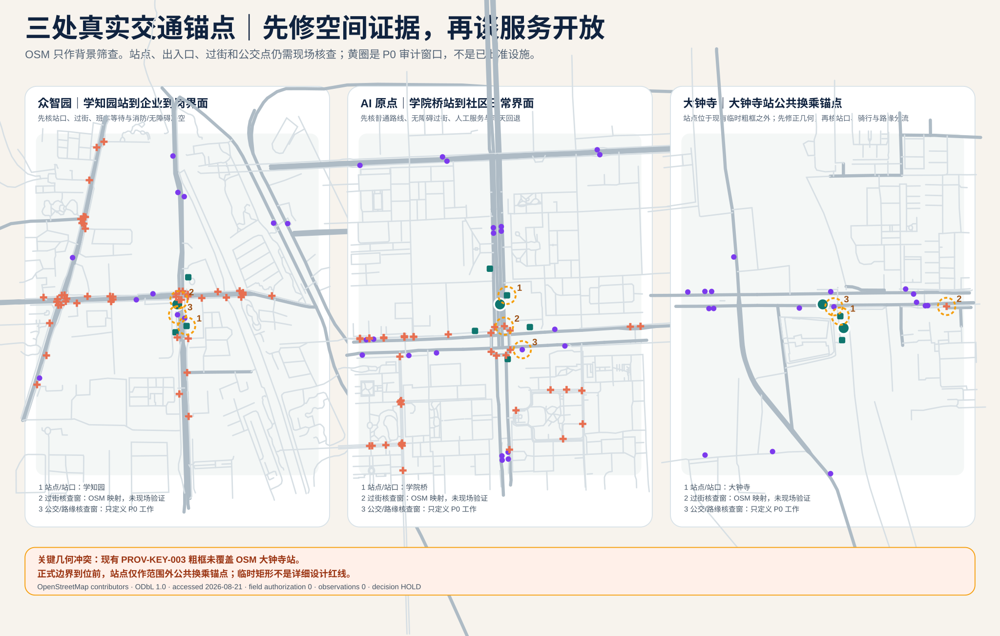

筛查还发现一处必须先停下来的冲突：当前临时 `PROV-KEY-003` 粗框没有覆盖公开地图中的大钟寺站，站点与粗框中心约相距 2.31 km。这里不移动粗框去“对齐”地名，也不把站点画成区内设施；本版只把大钟寺站登记为**外部公共换乘锚点**，并明确不把该组 3 个候选点和 1 条审计序列升格进正式几何。取得官方或专业确认的重点区几何后，必须重做站区关系、路线走查、无障碍/消防复核和责任接收，再决定“共行时刻台”是否有位置 [data:geometry/key_areas.geojson#PROV-KEY-003] [data:visual/assets/mobility-interface-candidates.json]。

每个重点区都要有企业责任人、社区/公共服务责任人、交通专业复核人和维护责任人，记录目标、输入、停止条件和回读证据；现阶段不声称已有合作方或运营许可 [depth:three_key_area_detailed_design] [source:HAIDIAN-ROAD-PARKING-TENDER-2026]。

责任移交表把七个资源单元映射到八类受影响群体，并逐项检查“有名责任人—普通替代—拒绝条件—回写字段”。`run-mobility-responsibility-transfer.js` 是 supplemental contract audit，不属于四道正式 self-check gate；它额外拒绝重复、空值、未知或未被任何资源单元覆盖的群组。`test-mobility-responsibility-transfer.js` 对这四类负例逐一回放。通过只证明审计契约完整，不证明现场覆盖、授权、用户观察或交通绩效 [data:visual/assets/mobility-responsibility-transfer.json] [data:visual/assets/run-mobility-responsibility-transfer.js] [data:visual/assets/test-mobility-responsibility-transfer.js]。

### 三处接口的回读顺序

三处重点区共用一条候选服务链，但各自接收不同责任。众智园先核对企业到岗与装卸分母，AI 原点社区先核对分组日常服务和无障碍等价路径，大钟寺先核对班次、过街和路缘观察窗。每个接口都给出拒绝条件和人工回退，缺少现场记录时保持 `HOLD` [data:visual/assets/mobility-route-service-atlas.json] [depth:three_key_area_detailed_design]。

| 接口 | 现场回读分母 | 无 AI 等价路径 | 证据缺失时的动作 |
| --- | --- | --- | --- |
| 众智园到岗与装卸 | 到岗尝试、可用路缘分钟、受保护消防/无障碍分钟 | 纸面登记、现场引导、公共交通 | 拒收预约，冻结并回到公共交通/人工台 |
| AI 原点社区日常到达 | 分组尝试、连续路线段、人工服务窗 | 步入、电话、纸面、公共交通 | 关闭推荐，保持值守路线并回到 P0 |
| 大钟寺轨道换乘 | 班次、换乘观察窗、过街窗、活动日路缘分钟 | 时刻表、站内人工台、公共过街信息 | 删除 feeder 需求，保持公共路线并人工引导 |

这张图是设计接口图，不是现状地图。它把三处重点区、服务对象、分母、拒绝和回退放在同一页；真实路线观察、责任交接和授权数量仍为 0，待正式边界与现场审计补齐 [data:visual/assets/mobility-route-service-atlas.json]。

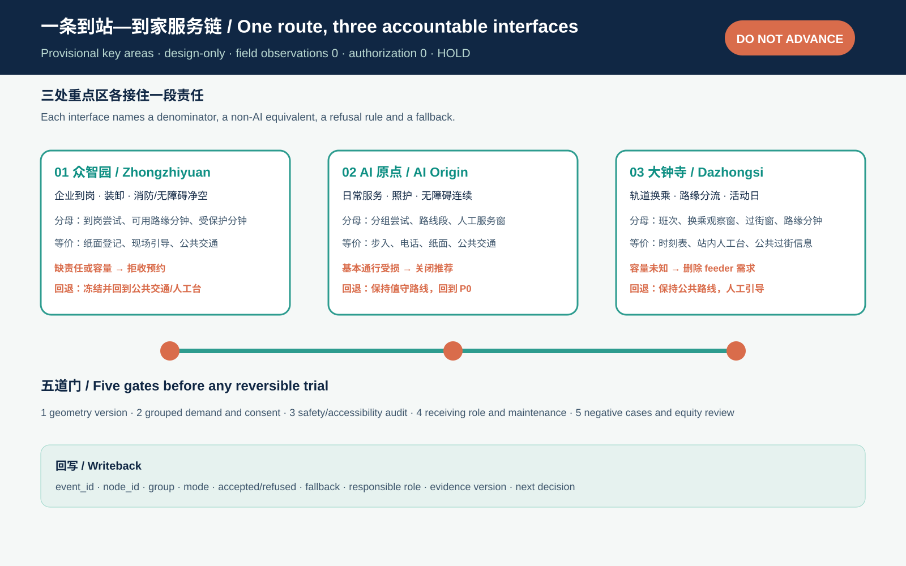

### 三处空间接口原型：从“有路线”推进到“能进入、能接管、能撤回”

路线账本回答“服务经过哪里”，但评审还需要看到“人如何进入、谁在现场接手、失败后怎样退回”。因此本版把三处重点区各自压成一个可被专业团队继续深化的空间接口原型：众智园是**到岗—装卸前厅**，AI 原点是**照护—人工连续环**，大钟寺是**轨道—路缘换乘廊**。图板使用 `1:500` 与 `1:50` 作为审阅层级标签，不提供施工尺寸；它只描述公共路线、人工节点、路缘窗口、回执与停止关系 [data:visual/assets/mobility-interface-prototypes.json] [depth:three_key_area_detailed_design]。

| 原型 | 先交付的普通服务 | AI 只做什么 | 缺证据时怎么停 |
| --- | --- | --- | --- |
| 众智园到岗—装卸前厅 | 公共交通、步入、人工导向、纸面登记 | 解释聚合时窗冲突 | 没有普通等价、消防/无障碍冲突或接收人时拒收预约 |
| AI 原点照护—人工连续环 | 步入、电话、纸面、公共交通、人工服务 | 聚合服务时窗、准备回退选项 | 基本通行依赖 App、无障碍断裂或隐私边界不清时关闭推荐 |
| 大钟寺轨道—路缘换乘廊 | 轨道、公交、公共过街、人工导向、骑行换乘 | 解释换乘冲突、提出可逆分流 | 公共路线被挤占、过街/路缘记录缺失时冻结接驳 |

三个原型共享四道闸门：普通路线先行、接收人与维护责任明确、观察证据带日期并可公开回读、失败即停止并回到人工/公共交通。`run-mobility-interface-prototypes.js` 会拒绝授权值、现场观察、数字尺寸、空的普通服务或非空 `field_claims`；负例测试用于证明这个空间契约不会把概念图板升级为现状或工程结论 [data:visual/assets/run-mobility-interface-prototypes.js] [data:visual/assets/test-mobility-interface-prototypes.js]。

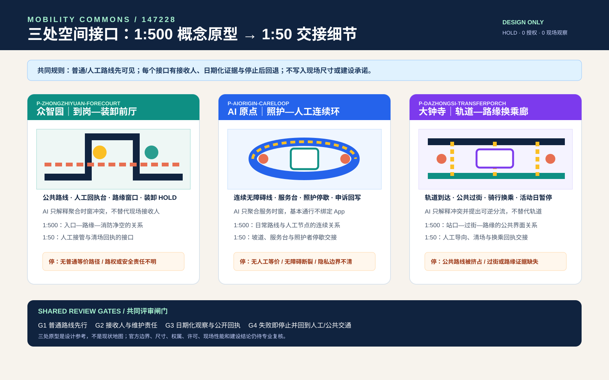

### 系统级空间选项：先裁决公共基线，再谈扩展方式

前面的接口原型回答“一个人如何进入、接管和退出”。本节再把三处接口放回同一套系统选项中，避免把一张漂亮节点图误当成完整交通方案。`mobility-spatial-options.json` 用五级尺度（`1:5000` → `1:50`）、四个候选、五项公共权利和五道硬门做概念比较：先拒绝把冲突外部化给公共空间的 S0，再把空中出行 S2 限制为地面基线之上的条件附加项；S3 是雨雪、断网和维护时的地面回退层。四个选项都覆盖三处重点区，但只有 S1 **地面优先多方式协同**获得“进入专业设计复核”的资格。这个资格不是授权、施工、容量、绩效或排名结论 [data:visual/assets/mobility-spatial-options.json] [source:BEIJING-14TH-TRANSPORT-PLAN] [depth:three_key_area_detailed_design]。

| 选项 | 空间裁决 | 评审状态 | 缺证据时的回退 |
| --- | --- | --- | --- |
| S0 无协同高峰 | 车流、装卸和接驳争用同一路缘；公共过街与无障碍路线成为剩余空间 | **REJECT** | 回到 P0，先清点权属、路权、公共路线和责任人 |
| S1 地面优先多方式协同 | 轨道/公交/步行无障碍是底座；三处接口都有人工接收、时段路缘和撤回路径 | **ADVANCE_TO_DESIGN_REVIEW** | 冻结接驳，保留普通路线并回到 P0 |
| S2 空中优先接驳 | 只保留地面—空中换乘关系；空域、天气、保险、噪声、应急与运营责任未核 | **REVISE** | 回到 S1，空中层不得挤占公共换乘 |
| S3 极端天气地面回退 | 雨雪、断网、维护时切换到轨道/公交、人工、纸面和电话；路缘转为 human-only/emergency | **REVISE** | 回到 S1，作为地面系统的韧性层 |

五级尺度把同一裁决逐级压到空间关系：`1:5000` 看走廊方式选择，`1:2000` 看三处重点区连接，`1:500` 看站口/路缘/社区节点，`1:100` 看普通路线和保护区，`1:50` 只看人工接管、申诉、暂停和撤回的交接细节。它们都是审阅层级标签，`numeric_dimensions=null`，不得从图板反推施工尺寸。五项公共权利也必须逐项回读：普通通行、无障碍与照护、轨道/公交保护、申诉与暂停、隐私与退出。`run-mobility-spatial-options.js` 的正向控制与 6 个负例会拒绝缺选项、选中 REJECT、数字尺寸、缺权利、现场声称和绕过普通路线；通过只证明比较合同可离线复核，不证明任何现场结果 [data:visual/assets/run-mobility-spatial-options.js] [data:visual/assets/test-mobility-spatial-options.js]。

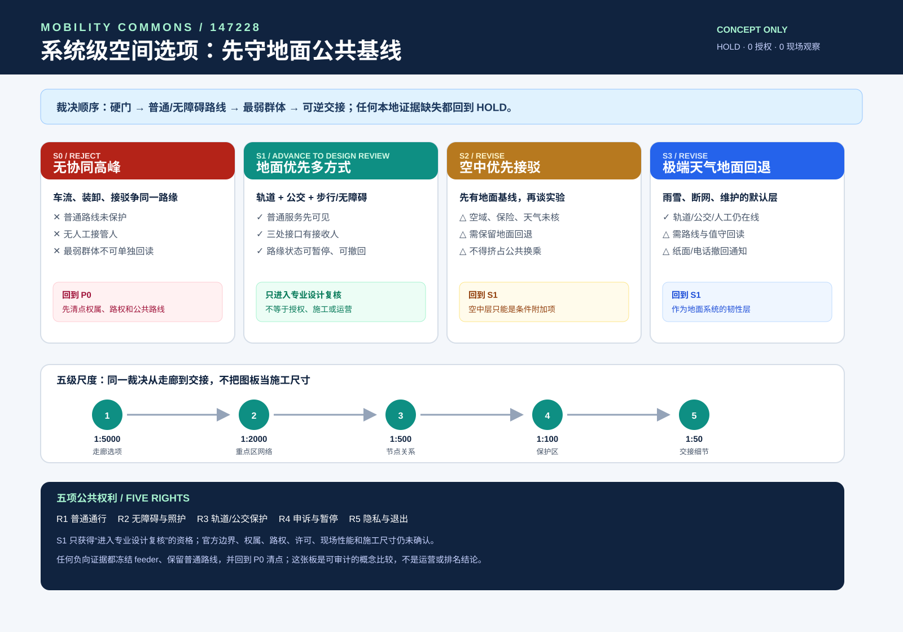

### 一日连续性回执｜同一条普通服务链要经得住四个时段

一条到站回家链不能只在单一高峰时段成立。方案把早高峰到岗、日常服务到达、晚间换乘和断网雨雪回退放进同一份回执。每个时段都先保留轨道、公交、步行、人工、电话或纸面入口，再让 AI 处理分组需求、冲突说明和回退清单；没有接收人、等价路线或带日期的恢复记录时，服务停在 `HOLD` [data:visual/assets/mobility-continuity-receipt.json] [source:NIST-HUMAN-CENTERED-AI] [depth:phasing_implementation]。

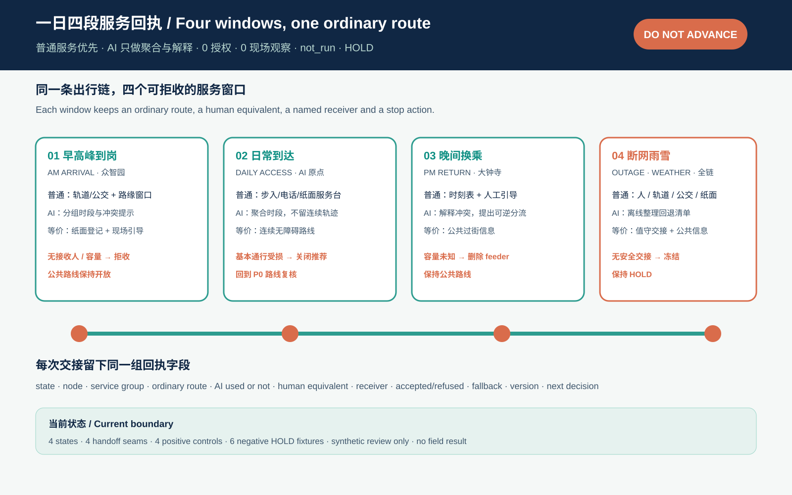

| 时段 | 普通服务先做什么 | AI 只承担什么 | 证据缺失时的动作 |
| --- | --- | --- | --- |
| 早高峰到岗 | 轨道/公交、受保护路缘和现场引导 | 聚合到岗时段，提示路缘冲突 | 无接收人或容量记录时拒收预约 |
| 日常服务到达 | 步入、电话、纸面和连续无障碍路线 | 按服务类型聚合时段，不留连续轨迹 | 基本通行受损时关闭推荐并回到 P0 |
| 晚间换乘回家 | 时刻表、公共过街信息和人工引导 | 解释换乘冲突，提出可逆分流 | 容量或责任未知时删除 feeder 需求 |
| 断网雨雪与维护 | 人工、轨道、公交、纸面和电话回退 | 离线整理冻结、改道和恢复清单 | 无安全交接或无日期记录时保持 HOLD |

`mobility-continuity-receipt.json` 固定 4 个时段、4 个交接缝、12 个回执字段、4 个正向控制和 6 个负例。`run-mobility-continuity-receipt.js` 与负例回归只证明合同能够离线复核，不能证明现场连续性；当前授权为 0，现场观察为 0，结果保持 `not_run`，`performance_results=null`。

### 十二周测量门槛｜给释放链补上分母

前面的释放链规定每个时段要留下什么票据，这份 `BASE → BOOST → BLACKOUT → BEQUEST` 合同再给票据补上最小观察分母。普通公共服务先独立成立，AI 只能在其上做分组聚合和冲突说明；一旦断网、无接收人或无障碍路线受阻，就冻结数字层并交回人工或公共交通。撤回后仍须留下静态导向、维护卡、投诉责任人和撤回回执 [data:visual/assets/mobility-public-baseline-contract.json]。

| 阶段 | 周次 | 现场动作 | 进入下一阶段的硬门 |
| --- | --- | --- | --- |
| P0 | 1—2 | 锁定普通旅程、场地边界、禁采字段和六个责任岗位 | 有授权范围、停止责任人和带日期的证据边界 |
| P1 | 3—6 | 先做人工路缘观察、普通路线尝试和受影响者无障碍走查 | 每条关键旅程都有非 AI 路线，严重通行障碍为 0 |
| P2 | 7—8 | 只读影子比较，不让 AI 改变基本服务 | 拒绝 AI 不降低基本出行能力 |
| P3 | 9—10 | 演练断网、雨雪、路线受阻和接收人缺失 | 每次失败都安全停止，并记录接收、回退和恢复动作 |
| P4 | 11—12 | 独立复核覆盖量、群体差异、维护负担和公共遗产 | 形成一份披露分歧的保持、修复、有限试点或退出决定 |

最低覆盖量先做 48 个路缘观察窗和 24 次普通路线尝试 [metric:planned_curb_observation_window_count] [metric:planned_ordinary_route_attempt_count]。另做 12 次由受影响者参与且不得找人代替的无障碍走查，以及 8 次断网和交接演练 [metric:planned_accessibility_walkthrough_count] [metric:planned_blackout_handoff_drill_count]。这些数字是覆盖计划，不是统计样本，也不代表已经招募、授权或完成。路缘数据按“规则、事件、汇总指标”分开，技术输出必须另用人工真值核验 [source:OMF-CDS-1-1] [source:OMF-CURB-TECH-2025]。

六个岗位分别承担公共交通、无障碍、路缘、数据、公众申诉和独立复核，目前都未确认。公共仓库不进入真实个案记录；未来编码后的原始观察最多保留 30 天，非个人汇总最多保留 365 天。评价同时看安全、可达、公平、运行和完整任务完成，不迁移国外项目的样本或结果 [source:USDOT-SMART-EVALUATION-2024] [source:SMARTHUBS-INCLUSIVE-KIOSK-2024]。离线运行器及其负例只检查这一约束能否复核 [data:visual/assets/run-mobility-public-baseline-contract.js] [data:visual/assets/test-mobility-public-baseline-contract.js]。

## AI 创新生态、人才画像与 AI+ 场景

### 六类参与者与三项产业测试

参与者包括园区企业交通专员、居民/照护者、轮椅和助行器使用者、轨道公交运营者、物流/维护人员、学校与社区服务人员、夜班员工以及交通/隐私/消防专业人员。AI 的作用是聚合需求、发现冲突、解释方案和生成回退清单；它没有权力把公共路线永久锁定。

1. **MOB-T01 企业需求合并测试**：企业只提交分组时段和人数区间，系统比较班车、公共交通、骑行和步行组合；回读企业多方式出行比例、站口拥挤、路缘占用和居民投诉。没有同意和分组阈值时，状态为 `blocked`。
2. **MOB-T02 居民等价到达测试**：对同一条上学/就医/买菜/夜班回家链，同时提供 AI 推荐、人工窗口、电话和纸面方案；按行动能力和照护负担分组回读完成率、等待和拒绝率 [source:BEIJING-ACCESSIBILITY-REGULATION]。
3. **MOB-T03 路缘与断网回退测试**：在工作日高峰、活动日、雨雪和通信中断场景下，检验预约装卸清场、人工引导、轨道接驳和公共服务恢复。若没有人能接手，任何自动化接驳都不能扩容 [source:SAV-MICROTRANSIT]。

### 十张场景卡

`M-01` 企业合并班车；`M-02` 员工公共交通补贴；`M-03` 夜班保证回家；`M-04` 园区装卸预约；`M-05` 居民就医人工接驳；`M-06` 轮椅等价路线；`M-07` 轨道站最后 500 米；`M-08` 活动日人车分流；`M-09` 雨雪/断网服务降级；`M-10` 投诉—维修—复核闭环。每张卡必须绑定空间、责任人、输入数据、最小化规则、服务水平和停止条件；场景数量是设计清单，不是已发生的运营量 [source:EMPLOYER-TDM-GUIDE] [standard:PROJECT-AGENT-OPEN-CALL-TASKBOOK]。

## 用地、建筑规模与拆改留方案

交通优化首先消化既有城市结构，不以“未来通勤”掩盖开发强度。当前 `buildings` 图层只表达概念建筑足迹，建筑足迹约占 provisional 工作范围的 2.72%，该比例不是法定建筑密度 [metric:building_footprint_area_sqm] [metric:building_footprint_ratio]。AI 企业、社区服务、商业服务和公园绿地按既有图层做关系表达，不提出新增容积率或建筑高度承诺。

保留—更新—拆除的顺序为：保留既有公共服务、轨道站口、消防通道、连续人行空间和成熟树荫；可逆更新首层入口、候车、骑行停放、无障碍坡道、路缘信息牌和企业交通台；只有现场结构、权属、消防和交通评估共同证明必要时，才讨论小规模拆改。任何停车/装卸设施应先核对道路停车管理责任、设备巡检、异常处置和投诉闭环 [source:HAIDIAN-ROAD-PARKING-TENDER-2026] [depth:retain_renovate_demolish]。

## 交通、轨道、市政与公共服务设施

这是本方案的核心。现有概念网络包含一条南北关系线约 9.60 km、三条东西连接线，合计慢行关系线约 13.01 km；它们是网络设计长度，不是工程道路中心线，也不表示当前连续可走 [metric:design_north_south_spine_length_m] [metric:design_east_west_connector_count] [metric:design_slow_mobility_network_length_m]。正式交通深化必须对每条线逐段补：断面、信号配时、站口、过街、坡度、盲道、照明、树荫、停车/装卸、消防、排水、管线、产权和维护单位。

### 一张时段路缘账本

路缘单元采用 `open` 公共通行、`booked` 企业班车/接送、`service` 维护/装卸、`human-only` 无障碍与人工优先、`emergency` 应急五种状态。每次变更至少写入责任人、起止时间、服务对象、清场动作、替代路线和投诉入口。默认时间窗只是试验参数：早高峰、午间配送、放学/下班、夜间维护需先做人工计数与居民参与，再决定分钟级分配。企业获得的是可审计的短时服务，不是永久路权；居民获得的是不被预约切断的连续公共路线。

### 两侧需求台账与四项服务水平

企业侧按匿名分组提交人数区间、入口、班次、货运和充电需求；居民侧按服务类型提交时段、无障碍、照护和夜间需求。系统只输出聚合矩阵和冲突热区，原始记录应有目的限定、保留周期、删除责任和公开的算法说明 [source:CURBSPACE-MANAGEMENT-2021] [source:NIST-HUMAN-CENTERED-AI]。四项服务水平对应可测指标：到达连续看 `accessible_route_completion_ratio`；换乘可靠看 `first_last_mile_transfer_reliability`；路缘有序看 `curb_time_window_compliance_ratio` 与 `peak_curb_conflict_rate`；申诉闭环看 `mobility_service_complaint_closure_hours`。当前全部是 `unknown` 或 `design_target`，不写成已达标。

### 人员动线与综合模拟：先守硬门，再追整体效率

综合模拟把**人**放在网络中心：企业员工、居民、照护者、儿童、轮椅使用者、访客、物流/维护人员、夜班人员和应急响应者分别建 OD 与时间窗；不上传个人连续轨迹，采用分组需求、匿名计数和可回读版本。对外通勤不被截断在 provisional 边界内，P0 必须记录跨边界起讫、进出方向、地铁/公交/自行车/汽车/步行/班车方式、停车换乘和跨线衔接，形成 `external_commute_od_baseline` 与 `external_commute_generalized_cost_index` 的调查底稿。

仿真场景至少覆盖工作日早晚高峰、平峰、活动日、雨雪/高温、地铁或公交中断、道路/停车故障，以及未来空中实验的“仅地面接驳”和“天气取消”对照。地铁/公交输入班次、站口容量、候车与换乘缓冲；自行车输入停放、借还和人车冲突；汽车输入路口排队、停车、装卸、充电和应急净空；步行/轮椅输入断面、过街、坡度、照护停留和无障碍绕行。SUMO 可作为开放的多方式仿真底座，但本地信号、站点容量、自行车行为和人员动线必须用现场计数校准，不能直接把软件输出当成海淀绩效 [source:SUMO-MULTIMODAL-DOCS] [source:MULTIMODAL-TRAFFIC-REALITY-2025]。参考公开的 activity/agent-based 多方式建模方法，正式校准还要同时回读方式份额、道路/路缘流量、门到门时间、距离和分组可达性 [source:ATOM-MULTIMODAL-ABM] [source:ACCESS-ACCESSIBILITY-ABM]。

优化采用“硬门优先、帕累托比较”：消防/应急、无障碍连续、安全、公共交通不被挤占、隐私和人工服务先判定；通过后再同时降低广义出行成本（步行、等待、车内、换乘、停车排队）、人员动线冲突、汽车行驶量与能耗，并观察最慢群体差距、对外通勤可靠性和 `mode_transfer_reliability`。输出是一组可解释的候选方案和 `multimodal_system_efficiency_index`，不是一个未经校准的“整体效率第一”结论 [metric:person_flow_conflict_rate] [metric:multimodal_system_efficiency_index]。

### 轨道、停车与市政接口

轨道/公交是骨干，企业班车和按需小巴只能把人送到骨干换乘；停车与装卸是受时间窗管理的服务，不以扩充车位解决全部需求；市政接口要把雨雪、积水、照明、充电、信息牌、排水和维修纳入同一资产清单。西北旺交通规划材料对枢纽、首层、换乘停车、应急疏散和交通影响评价的要求，正好构成本方案进入工程阶段前的检查表 [source:BEIJING-HAIDIAN-TRANSIT-HUB-PDF]。慢行系统工程和道路交通导改也应按正式项目流程另行论证 [source:HAIDIAN-SLOW-MOBILITY-TENDER-2022] [depth:traffic_rail_slow_parking] [depth:municipal_new_infrastructure]。

空中出行实验若有机会，只能作为地面系统的受控附加层：先证明地铁/公交接驳、步行/轮椅路径、消防疏散、噪声与社区安静界面不被破坏，再审空域和运行许可；`air_ground_transfer_reliability`、吞吐、取消率、气象窗口、噪声、应急响应和保险责任目前均为 `unknown`。北京低空经济行动计划可作为设施协同的政策背景，民航无人驾驶航空器法规则构成安全、运行和责任的前置门槛，二者都不等于本项目获得飞行或建设许可 [source:BEIJING-LOW-AIR-ECONOMY-2024] [source:CAAC-UAV-REGULATION-2024] [source:UAM-BEIJING-MULTIMODAL-2024]。

### 设计场景综合模拟（透明沙盘，不是现状）

在现场 OD、站点容量、信号、人员动线和路缘计数到位前，先用 `visual/assets/movement-simulation.json` 做 1000 人归一化设计单位的可解释对比，并可用 `node visual/assets/run-mobility-simulation.js` 离线复核方式份额、服务供给和队列：S0 无协同高峰、S1 多方式与路缘协同、S2 受监管闸门阻断的空中候选、S3 极端天气地面回退。S1 只是在建议硬门筛查后暂选的设计候选；广义成本、换乘可靠性、人员冲突、汽车外来流入、最差群体差距和能耗都是示范输入，不是海淀现状。图件把“先过硬门、再做帕累托比较、最后用现场数据替换”的决策链公开 [metric:multimodal_system_efficiency_index] [metric:person_flow_conflict_rate] [standard:SUMO-MULTIMODAL-SIMULATION]。

模型对象也被显式拆开：1000 人设计单位包含居民 380、企业员工 450、照护者/儿童 60、访客 50、物流维护 40、夜班人员 20；网络侧把地铁列车（180 人/车、10 分钟间隔）、公交车辆（60 人/车、12 分钟间隔）、自行车停车、汽车路缘服务、步行/轮椅连续流和受阻断的空中候选分别作为服务对象。五条 `trip_leg_templates` 把对外企业通勤、居民日常服务、企业班车换乘、物流装卸和空中候选的地面回退写成可检查的人员动线。模型以 60 秒步长记录位置、方式、队列、车辆占用、换乘、路缘状态、冲突和无障碍标志，再输出各方式峰值排队、站点/车辆负荷、换乘等待、汽车路缘排队和最差群体差距；`model_analysis.derived_readouts` 里的数值是声明过输入后的合成敏感性分析，不是现场观测。评审可在离线环境运行 `node visual/assets/run-mobility-simulation.js`，重算方式份额、服务供给、队列和校准字段；该运行器不联网、不生成本地现状 [source:SUMO-MULTIMODAL-SIMULATION] [source:ATOM-MULTIMODAL-ABM] [source:ACCESS-ACCESSIBILITY-ABM]。换乘稳定性仍须用现场同步观察校准 [metric:mode_transfer_reliability]。

在这套归一化沙盘中，未协同高峰的汽车路缘峰值排队为 86 辆、站口闸机负荷为 1.05；多方式路缘协同候选为 0 辆和 0.88；极端天气地面回退为 47 辆和 0.96。它说明优先校准站口闸机、公交站容量、路缘服务和无障碍过街，而不是把“模型分数”直接当成建设结论。现场补齐有日期的跨边界 OD、班次、断面、停车、冲突和消防审查后，才允许替换设计输入并重新运行。

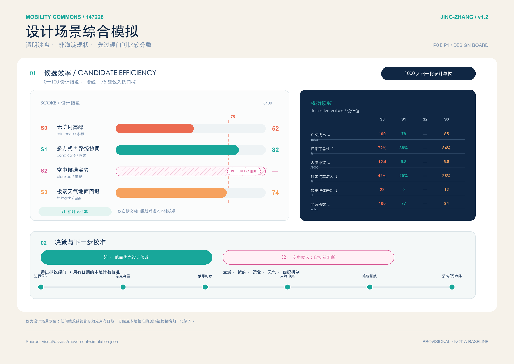

## 蓝绿空间、公共空间与城市风貌

蓝绿空间承担连续到达链的遮阴、停歇、雨天回退和夜间安全。当前绿地比例约 12.34%，公共空间比例约 7.33%，由概念图层计算，不能推出生态、热舒适或排水绩效 [metric:green_ratio] [metric:public_space_ratio]。更新时优先让公共服务台、站口、候车、慢行和蓝绿边界共享遮雨、座椅、照明、饮水和无障碍信息；不得用树池、花箱或活动设施堵住轮椅转弯和消防。

蓝绿策略设置三条硬边界：雨天不把积水路径当接驳路线；热浪时提供人工服务和可休息的替代路径；暗夜和生态敏感时段降低不必要的灯光与设备活动。北京步行骑行标准、无障碍法规和海淀慢行工程提供连续性、设施和维护的政策依据 [standard:BEIJING-WALK-CYCLE-DB11-1761] [standard:BEIJING-ACCESSIBILITY-REGULATION] [source:BEIJING-SLOW-MOBILITY]。没有现场遮阴、热舒适、水风险、生态和照明数据时，相关指标保持 `unknown`。

## 更新项目清单、实施政策与分期计划

### 实施—运营合同（概念接口，非实施承诺）

为让“有分期”可以被复核，每一阶段同时写明参与主体、验收指标、人工回退和停止/撤回规则。P0 由场地与数据责任角色、交通/无障碍专业复核角色、社区联络角色共同完成盘点和授权登记；P1 由企业交通专员角色、居民/照护者观察席、轨道/公交运营角色、现场维护角色和独立安全/隐私复核角色共同值守，按无障碍路线完成率、首末端换乘可靠性、路缘时窗遵守率和投诉响应记录验收；P2 只有在交通影响、安全、无障碍、隐私、保险、采购和维护证据齐全后，才由专业责任方判断是否条件扩展。任一指标仍为 `unknown`、参与者同意或责任边界缺失、硬门失败或投诉无法闭环时，自动回到人工/公共交通/电话纸面入口，冻结预约并撤回可移动设施。这里的角色是待确认的责任接口，不是已确定机构、合同、资金或许可 [depth:phasing_implementation]。

为避免“有回退”停留在口号，本包把既有 `M-09 雨雪/断网服务降级` 收敛为一个最小离线桌面演练，而不是新增一个已运行场景。`visual/assets/mobility-tabletop-contract.json` 固定四条合成服务请求、四个触发事件和五个回滚动作；`node visual/assets/run-mobility-tabletop.js --check` 可在无网络、无个人数据、无外部系统和仅内存状态下复演 6 项检查，输出 `mobility-tabletop-evidence.json`。本地演练的结果是 4/4 请求保留人工/公共交通回退、预约冻结、6/6 检查通过、5/5 回滚步骤复演；它只证明状态、停止和回滚逻辑可复核，不证明真实人员值守、无障碍绩效、公众接受、服务可用性或安全。`performance_results=null`、`operational_status=not_authorized_not_run`，因此不会把合成 PASS 推进为 P1/P2 或现实实施 [data:visual/assets/mobility-tabletop-contract.json] [data:visual/assets/mobility-tabletop-evidence.json] [data:visual/assets/run-mobility-tabletop.js]。

| 阶段 | 工作包 | 交付与验收 | 停止条件 |
| --- | --- | --- | --- |
| P0 读懂路缘 | 现场盘点、站口/过街/无障碍审计、企业和居民聚合台账、责任人登记 | 形成路缘资产表、路线障碍清单、隐私/申诉规则和基线版本号 | 权属、路权或人工等价服务不清，停在调查 |
| P1 合并需求 | 两个企业时窗、一个社区日常链、一个轨道换乘链的可逆试点 | 公开聚合的等待、完成、冲突、清场、投诉与维修记录 | 任一人群完成率明显下降、消防/无障碍受阻或投诉未闭环，回到人工 |
| P2 条件扩展 | 仅在批准范围内扩展共享接驳/按需小巴，更新工程和采购任务书 | 交通影响评价、安全/隐私/无障碍/生态复核、运营 SLA 与资金责任齐全 | 缺一项就不扩容，不用模型分数替代实测 |

实施政策采用“登记—小试—复核—扩展/停止”循环。停车招标对巡查、设备和接诉即办的要求被转译为每个交通资产必须有 ID、状态、责任人、响应时间和关闭证据 [source:HAIDIAN-ROAD-PARKING-TENDER-2026] [depth:renewal_project_list] [depth:phasing_implementation]。企业签署的是可撤回的服务协议，居民保有公共路线和人工服务；任何 AI 建议都可由现场人员否决。

## 指标体系、面积复算与合规矩阵

### 当前可回读的底盘

当前可从 GeoJSON 回读的量为：provisional 工作范围面积 [metric:site_area_sqm]、三处重点区 [metric:key_area_count]。

建筑足迹及其比例 [metric:building_footprint_area_sqm] [metric:building_footprint_ratio]、绿地与公共空间比例 [metric:green_ratio] [metric:public_space_ratio] 也可回读，但都属于概念底盘。

设计关系线长度 [metric:design_north_south_spine_length_m] 只用于方案内比较；正式边界和专业资料到位后必须全量重算。

### 必须补齐的交通指标

企业通勤需求基线、对外通勤 OD、居民日常出行可达指数、企业多方式出行比例、分时停车占用、路缘时窗遵守率、首末端换乘可靠性、无障碍路线完成率、峰值路缘/人员动线冲突率、投诉闭环小时数、工作场所充电供需缺口、综合系统效率、方式换乘可靠性和空地接驳可靠性均为 `unknown`。

试点可以设置 `design_target`：无障碍路线完成率至少 0.95，首末端换乘可靠性至少 0.85 [metric:accessible_route_completion_ratio] [metric:first_last_mile_transfer_reliability]。

路缘时窗遵守率至少 0.90，投诉首响不超过 4 小时且 24 小时内给出责任/处理状态 [metric:curb_time_window_compliance_ratio] [metric:mobility_service_complaint_closure_hours]；这些目标是验收门槛，不是海淀现状或保证结果。

### 五道验证门与矩阵

1. **几何门**：官方边界、站口、道路、红线和权属可回读；
2. **需求门**：企业/居民聚合需求有同意、分组和时间版本；
3. **安全门**：交通、消防、无障碍、应急和极端天气测试通过；
4. **责任门**：运营方、维护方、采购、保险、数据和投诉 SLA 明确；
5. **公平门**：AI 推荐与人工/电话/纸面方案的分组结果不把最慢的人排除。

“整体效率最高”只有在五道门都通过后才有意义：先公开每种方式的输入、换乘链、人员动线瓶颈、对外通勤 OD、汽车外来流入和最差群体差距，再比较候选方案的广义成本与资源消耗。若硬门冲突，结果就是停止/回退，而不是用单一分数掩盖安全或公平损失 [standard:SUMO-MULTIMODAL-SIMULATION] [standard:LOW-AIR-REGULATORY-GATE] [depth:metrics_recalculation]。

`compliance_matrix.json` 覆盖公告与任务书的全部要求；`standard_matrix.json` 对应规划、步行骑行、无障碍、停车/资产运营、隐私和接驳研究；`design_depth_matrix.json` 将三层空间、三处重点区、交通/市政、更新分期、指标和风险绑定到正文、GeoJSON、图纸和自检 [standard:PROJECT-OFFICIAL-ANNOUNCEMENT] [standard:PROJECT-AGENT-OPEN-CALL-TASKBOOK]。

正式边界不清、交通基线不全或路权冲突时，提交保持 provisional，不把未知值填成模型预测 [depth:metrics_recalculation] [depth:risk_missing_data]。

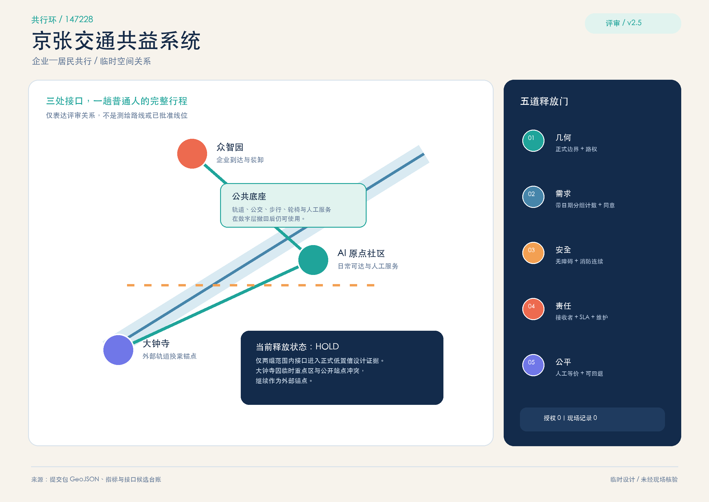
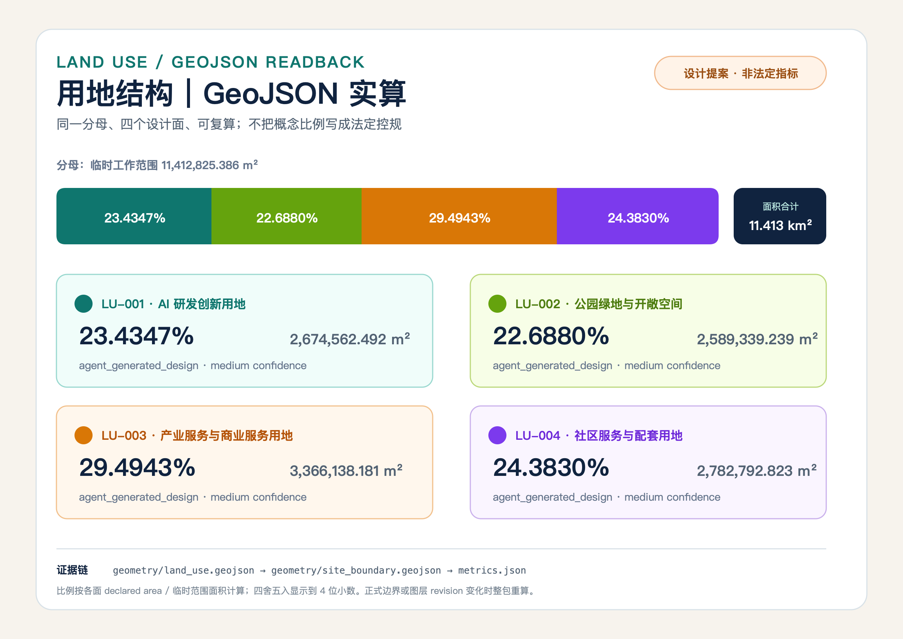
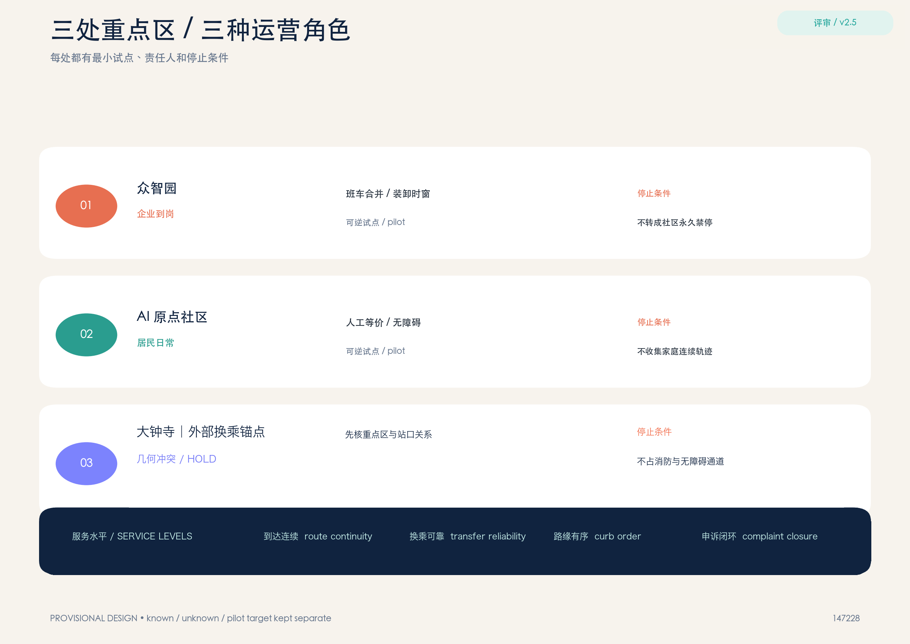
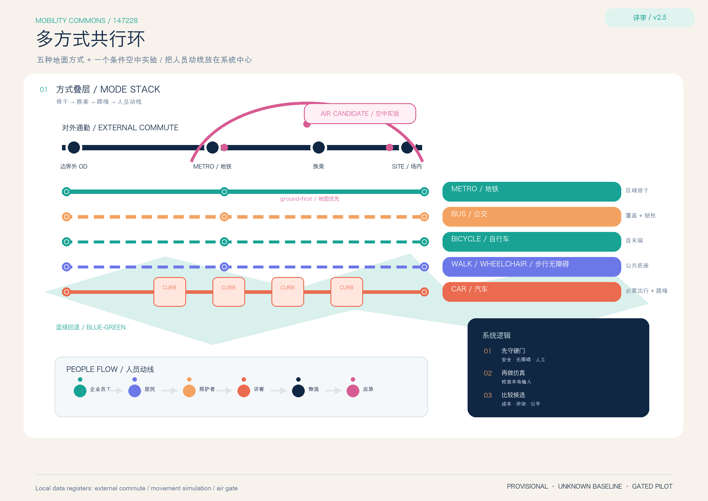
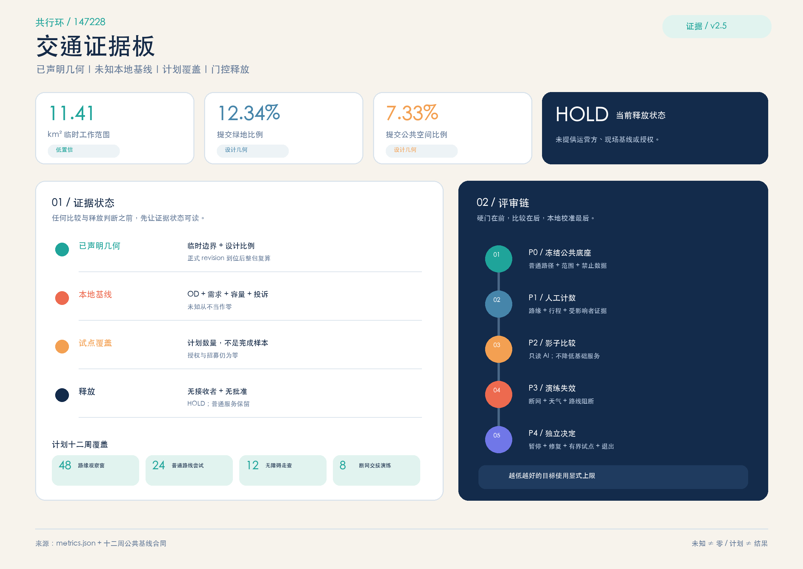

## 风险、版权与合规说明

本包不替代道路红线、交通影响评价、停车管理合同、消防审查、无障碍专项、施工图、运营许可、数据合规、保险或采购文件。最重要的风险来自企业需求挤占居民公共路线、按需车辆增加交通量、路缘状态无人维护、投诉没有责任人和低数字能力人群被排除。每个风险都有回退：人工服务、公共交通、纸面/电话入口、可移动设施撤场、停止预约、公开事件摘要和下一次复核日期 [source:SHARED-MOBILITY-OECD] [source:CURBSPACE-MANAGEMENT-2021] [depth:risk_missing_data]。

来源使用边界清楚区分：北京政府和招标文件用于政策/责任框架；论文用于方法与风险启发；OSM 和现有 provisional GeoJSON 仅用于背景筛查与设计关系。论文没有提供京张基线，停车招标的数量也不等于本方案范围内车位数量；任何企业名称、合作关系、车辆、站点容量、事故率、满意度和健康效果都不在本包中作事实主张。

## 参考资料

来源登记把官方政策、招标材料、论文方法、开放地图筛查和本包设计数据分开，并记录访问日期、用途与不适用边界 [source:SOURCE-REGISTRY] [source:OSM-TRANSPORT-CONTEXT]。官方政策和招标材料只回答城市方向、服务责任和审批清单，不回答本范围内的站口容量、路缘占用、交通量、停车位或企业需求。

开放地图和 provisional 几何只用于定位空间关系与离线复算。工作范围面积的置信度已经降为 `low`；正式边界、站口或道路资料一旦变化，geometry、metrics、图件和报告必须基于同一版本整体重算。任何图示都不能把概念线位变成现状连续性或工程容量。

四条新增方法来源分别约束路缘数据结构、采购前验证、多维评价和受影响者完整任务测试。它们支持 12 周计划与人工真值核验，不证明海淀已经部署技术或完成用户研究。当前缺口仍包括授权、招募、运营人、预算、现场观察和投诉日志；任一缺口未闭合时，所有 `field_value` 保持 `null`，决策保持 `HOLD`。

**最终边界声明**　这是一个以企业与居民共益交通为核心的可审计概念和可逆试验框架，不是政府批准规划、道路开放公告、停车许可、企业合作协议、交通容量证明、健康效果证明或建设承诺。
