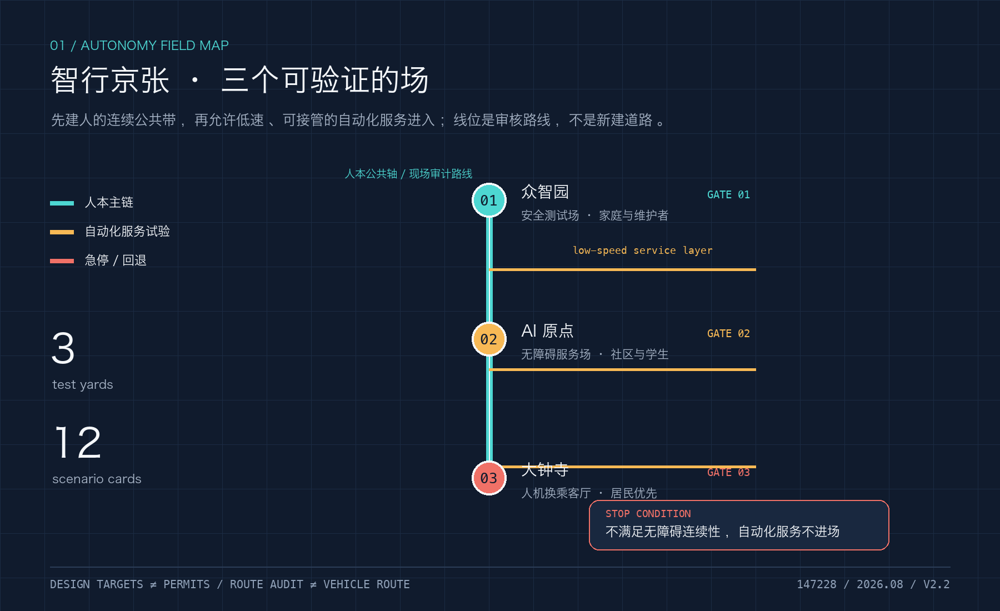
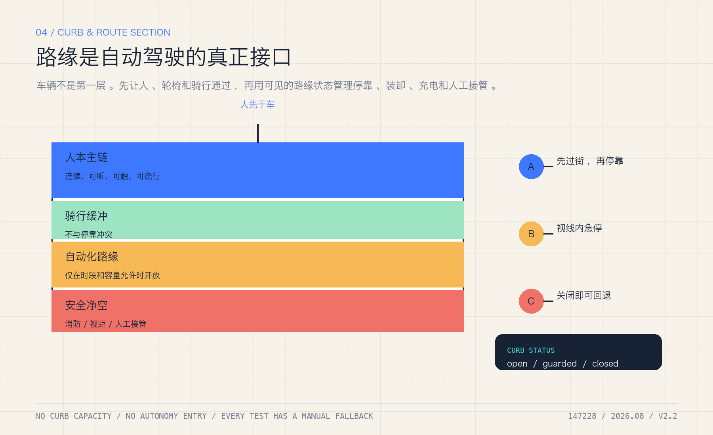
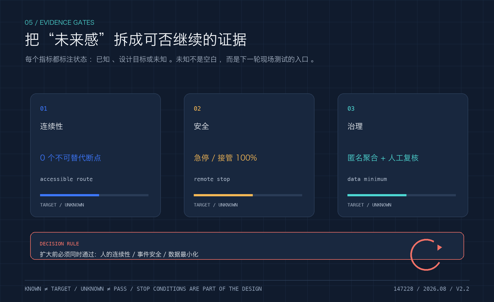

# Jing-Zhang Autonomous Commons: A Public Belt After Automated Driving

> **Core proposition:** the more automated driving spreads, the less the city should be designed around vehicles alone. The Jing-Zhang belt must protect continuous walking, wheelchair, cycling, child, care and maintenance routes before it decides where vehicles may operate.

This is an independent autonomous-mobility iteration, not a renamed copy of the earlier Jing-Zhang Open Pulse package. It uses the same provisional spatial base and adds machine-readable evidence for autonomous-driving curbs, low-speed shuttles, accessible service, remote intervention, data minimisation and failure rollback. Every spatial move remains a concept proposal; the package does not claim that any road inside the site is open to autonomous driving, nor that a vehicle, vendor or permit already exists.

## 1. Evidence, policy boundary and data status

The open call requires AI+transport, robotics, automated driving and unmanned-delivery scenarios, together with three spatial scales, three key areas and auditable urban-design depth [source:OFFICIAL-ANNOUNCEMENT] [source:AGENT-TASKBOOK]. The package uses the repository's provisional boundary, key areas, standards and source registry. Both the site and key-area layers are explicitly `official_boundary=false` and `geometry_role=provisional_constraint` [data:geometry/site_boundary.geojson#SITE-001] [data:geometry/key_areas.geojson#PROV-KEY-001].

Beijing's 2025 rules for automated-vehicle road testing and demonstration applications place L3+ activities within a joint municipal working mechanism and approved roads/areas [source:BEIJING-AV-TEST-2025]. The 2025 policy-first-zone notice identifies designated roads, qualifications and time restrictions [source:BEIJING-AV-ROADS-2025]. The national MIIT/MPS/MOT framework requires an eligible test subject, driver, vehicle, testing evaluation and liability capacity [source:MIIT-AV-TEST-2021]. These sources establish a regulated pathway, not a local permit, road opening or operating baseline.

The package distinguishes `known` geometry-derived values, `design_target` trial gates, `unknown` local performance baselines and `blocked` conditions that prohibit expansion. The three research papers on street-canyon CFD, wind/heat/PM2.5 monitoring and roof/canyon geometry are method evidence only; they do not provide Jing-Zhang boundary conditions, health causality, accident rates or transferable percentages [source:LIU-URBAN-VENTILATION-2017] [source:MENG-WIND-HEAT-PM25-2022] [source:NOSEK-STREET-CANYON-2025].

## 2. Spatial structure: one public axis, three test yards, two safety nets

The proposal is organised as **one public axis + three test yards + two safety nets + twelve scenario cards**. The public axis is the Jing-Zhang heritage park and its slow-mobility/blue-green connections. The test yards are Zhongzhiyuan, the AI Origin Community and Dazhongsi. The safety nets are:

- a **human safety net**: continuous accessible routes, staffed service, legible curbs, low-speed operation, emergency stop and human takeover;
- an **ecology-and-data safety net**: weather and network rollback, dark-sky and bird protection, data minimisation, public algorithm records and revocable consent.

Autonomous driving is a constrained service layer over walking, cycling, rail, transit, emergency and maintenance systems. Every vehicle or robot yields to the continuous human route. Curbs register who may stop, when, for how long and who clears the space [standard:BEIJING-ACCESSIBILITY-REGULATION] [standard:ISO-TR-4448-PUBLIC-MOBILE-ROBOTS].

## 3. Three key areas

| Key area | Public role | First reversible test | Hard boundary |
| --- | --- | --- | --- |
| Zhongzhiyuan | safety evaluation, simulation, vehicle-road-cloud interfaces and enterprise services | low-speed shuttle or inspection within a managed window | no social-road operation without approval; simulation is not safety proof |
| AI Origin Community | community service, accessible ride, public explanation and opt-out | assisted reservation with an equivalent human path | no app-only access, continuous resident tracking or forced consent |
| Dazhongsi | rail interchange, curb logistics and event-day human-machine separation | delivery/maintenance robot at a station-edge curb | no blocking fire, accessible or emergency routes; immediate rollback in rain, crowds or network loss |

The three detailed points are stored in `visual/assets/autonomy_nodes.json`; they are provisional design markers, not designated test roads or statutory station locations [data:visual/assets/autonomy_nodes.json#AUTO-NODE-001].

## 4. Design rules for an automated future

**Curb before vehicle.** Draw the continuous human route and the exit-capable service zone before drawing a vehicle route. Curb states are `open`, `booked`, `service`, `restricted` and `human-only`; every change needs an owner, time window, sign and restoration condition.

**Speed and rights are gates.** The package does not invent a statutory speed limit. It records low-speed operation, yielding, stopping distance and human intervention as test fields [metric:autonomy_trial_speed_limit_status] [metric:remote_stop_response_seconds]. A successful trial lets the slowest pedestrian, wheelchair user, child and maintenance worker complete the route safely.

**Someone can always take over.** Every test yard has staffed service, physical emergency stop, remote stop, broadcast, incident log and withdrawal route. Uncertainty, communication loss, severe weather, crowds, ecological protection or blocked accessibility defaults to human service or shutdown [source:BEIJING-AV-TEST-2025] [source:MIIT-AV-TEST-2021].

**Data is collected only to complete the service.** Read the authorised curb state, obstacle class, accessible route and emergency message; do not build resident profiles or publish continuous camera streams. Public records show aggregate events, responsibility and corrections; retention and deletion require professional and legal confirmation [source:CASE-HELSINKI-AI-REGISTER] [source:CASE-UK-ATRS] [source:NIST-HUMAN-CENTERED-AI].

## 5. Twelve scenario cards

The cards cover accessible rides, low-speed shuttle, rail transfer, night maintenance, rain/snow service, scheduled loading, event separation, network-loss rollback, child/older-adult assistance, public-asset inspection, open safety-audit day and resident complaint/opt-out. Every card has a carrier space, responsible party, data boundary, acceptance gate and stop condition in `visual/assets/autonomous-scenarios.json` [metric:autonomy_scenario_card_count]. They are design objects, not existing services.

## 6. Industry tests and people

Three tests make the concept falsifiable: **AV-T01 curb-conflict test** records obstruction, yielding, emergency-stop and loading conflicts; **AV-T02 equivalent accessible service** compares automated, human and paper/phone routes; **AV-T03 network/weather rollback** tests stop, broadcast, takeover, evacuation and recovery across the three yards [metric:curb_conflict_rate] [metric:accessible_route_continuity_ratio] [metric:autonomy_fallback_success_ratio].

Residents, wheelchair users and carers, students, park workers, start-ups, logistics and maintenance crews, older visitors, night workers and child guardians are users and reviewers. Each gets an offline entrance, human help, revocable consent and a public complaint route [source:BEIJING-ACCESSIBILITY-REGULATION].

## 7. Landmarks and cultural narrative

The concept proposes three public landmarks: **the Human-Takeover Monument** at the Origin Community, recording rejected and paused automation; **the Curb Lighthouse** at Zhongzhiyuan, showing aggregate status and review gates without personal data; and **the Human-Machine Transfer Salon** at Dazhongsi, mapping rail, walking, wheelchair, freight and public service as one arrival system. These are cultural and interpretive proposals, not approved structures or sponsorship commitments [metric:ai_landmark_count].

## 8. Spatial layers, phases and evidence

The package retains the provisional base layers for land use, buildings, roads, green space and public space and adds `visual/assets/autonomy_nodes.json`. Existing area values are recomputed from the submitted layers [metric:site_area_sqm] [metric:green_ratio] [metric:public_space_ratio]. The new autonomy metrics are deliberately `unknown` or `design_target`: curb conflict rate, accessible-route continuity, remote-stop response, rollback success, data-minimisation coverage and trial-route length [metric:curb_conflict_rate] [metric:remote_stop_response_seconds] [metric:data_minimization_coverage_ratio].

Phasing is: **P0 legible curbs and accessibility audit**; **P1 approved, low-speed, reversible tests**; **P2 conditional expansion only after safety, traffic, ecology, privacy, participation and liability gates pass**. Automated vehicles are a service layer, never an assumed new road capacity. Climate, drainage, microclimate and ecology outcomes remain unknown without local observations and professional models [source:BEIJING-VENTILATION-NETWORK-2035] [source:BEIJING-FLOOD-PLAN-2021-2025] [source:BEIJING-BIRD-BIODIVERSITY-2024].

## 9. Compliance, risks and future recalculation

`compliance_matrix.json` covers announcement sections 1.3–1.5 and agent.1–agent.6. `standard_matrix.json` covers urban design, detailed planning, walking/cycling, accessibility, asset management, service-robot and automated-driving boundaries. `design_depth_matrix.json` links every depth item to narrative, layer, metric and rollback condition. No claim substitutes for a permit, vehicle certification, safety assessment, traffic review, insurance, privacy impact assessment, ecological review or construction document [source:BEIJING-AV-SAFETY-ASSESSMENT-2025].

Once official polygons, road/utility/ownership, traffic, weather, drainage and ecology baselines arrive, all layers, metrics, drawings, reports and self-check outputs must be regenerated. A single image must never be changed to turn a future target into a known fact.

## References

- `brief/public-brief.md`, `brief/site-package/agent_taskbook.json`, `data/source_registry.json`
- [source:BEIJING-AV-TEST-2025], [source:BEIJING-AV-ROADS-2025], [source:BEIJING-AV-SAFETY-ASSESSMENT-2025], [source:MIIT-AV-TEST-2021]
- [source:BEIJING-ACCESSIBILITY-REGULATION], [source:BEIJING-WALK-CYCLE-DB11-1761], [source:ISO-TR-4448-PUBLIC-MOBILE-ROBOTS], [source:ISO-13482-SERVICE-ROBOT-SAFETY]
- [source:CASE-HELSINKI-AI-REGISTER], [source:CASE-UK-ATRS], [source:NIST-HUMAN-CENTERED-AI]
- [source:LIU-URBAN-VENTILATION-2017], [source:MENG-WIND-HEAT-PM25-2022], [source:NOSEK-STREET-CANYON-2025]

**Boundary statement:** this is an auditable concept and trial framework. It is not a government-approved plan, road-opening notice, autonomous-driving permit, company partnership, health/air-quality proof or construction commitment.
