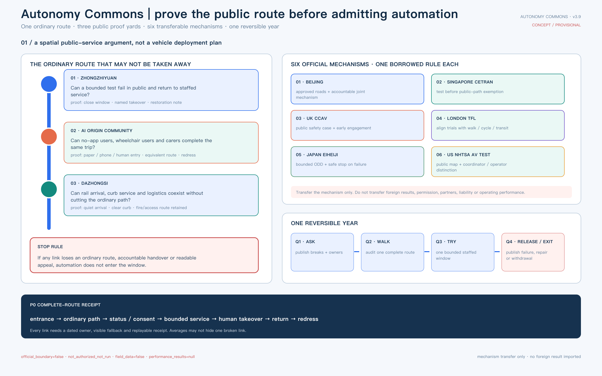
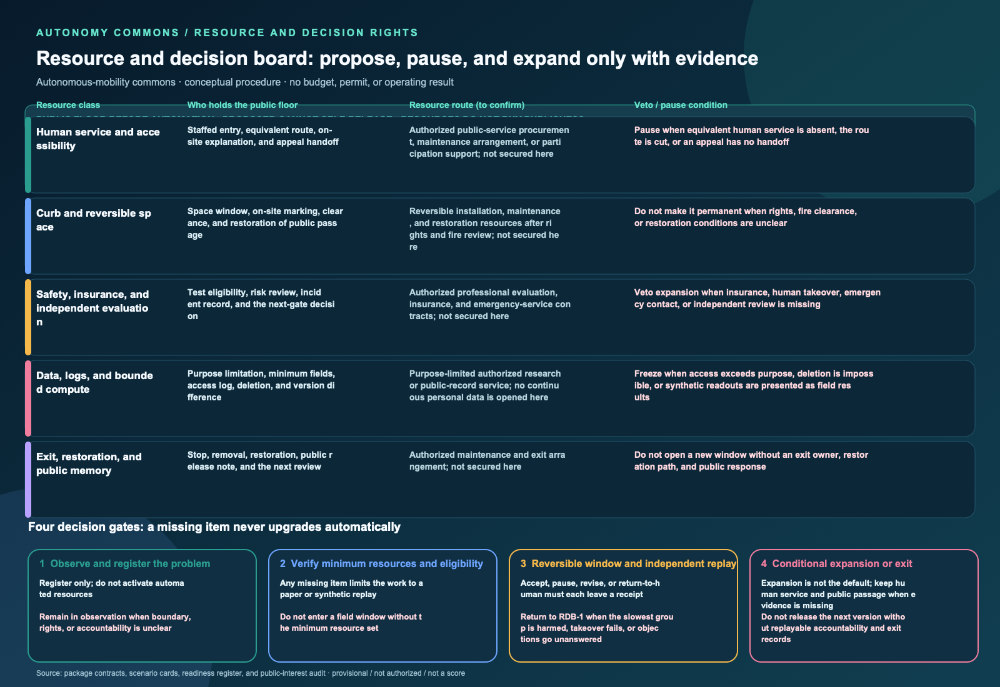
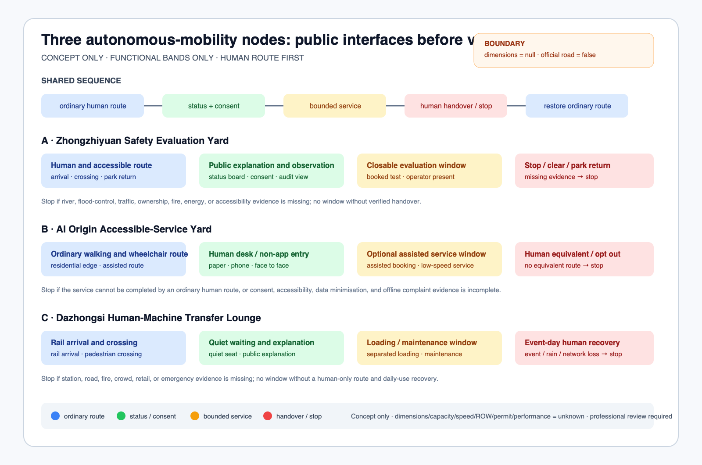
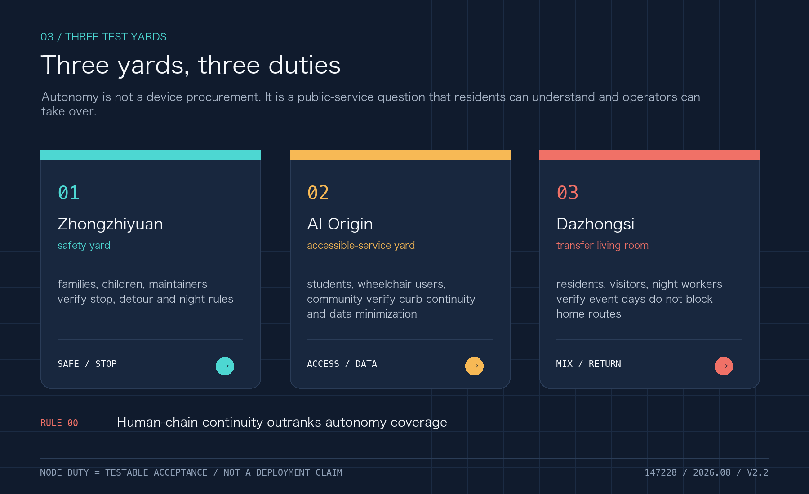
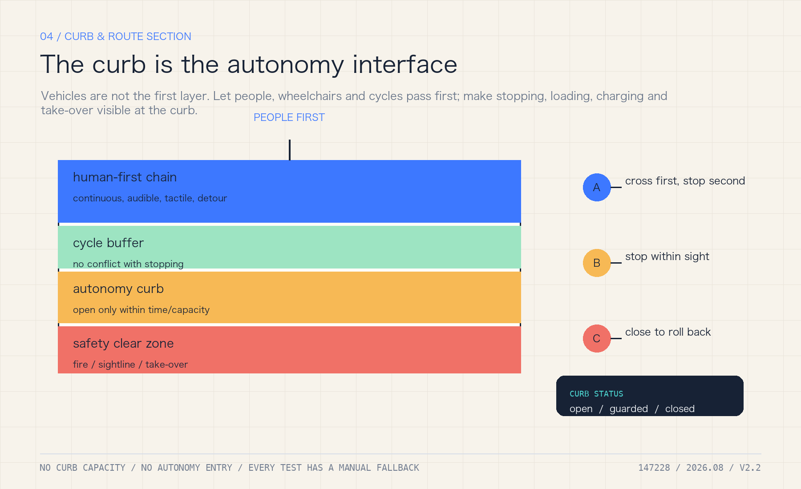
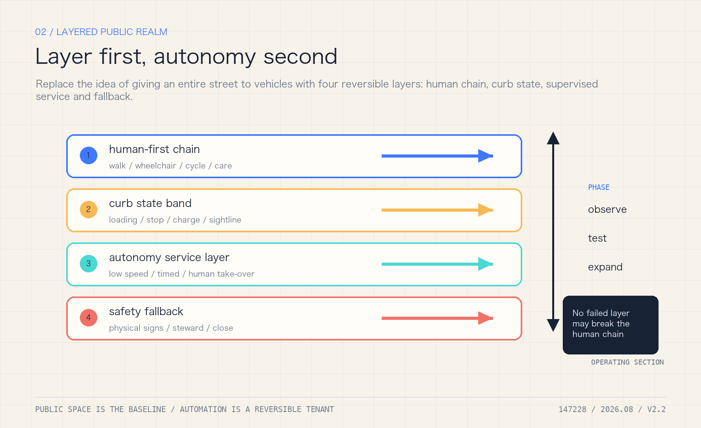
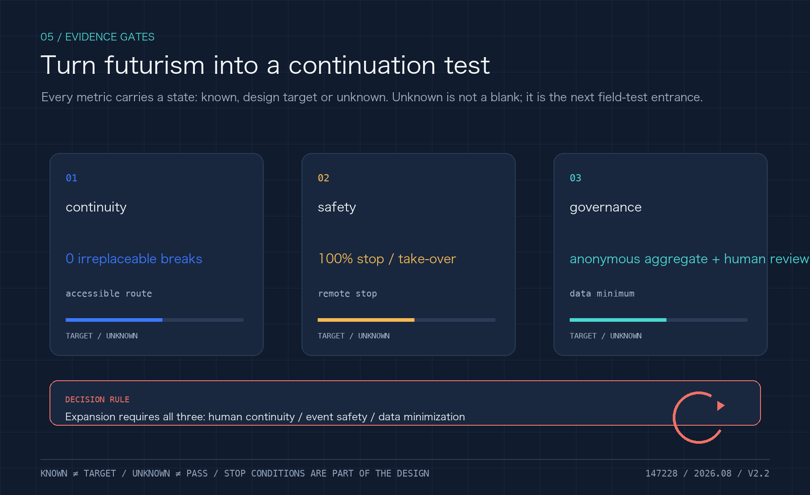
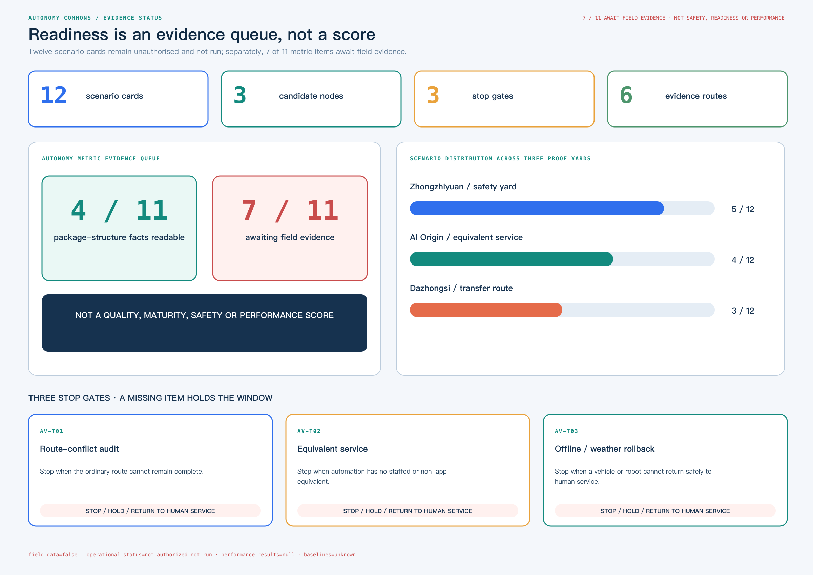

# Jing-Zhang Autonomous Commons: A Public Belt After Automated Driving

> **Core proposition:** the more automated driving spreads, the less the city should be designed around vehicles alone. The Jing-Zhang belt must protect continuous walking, wheelchair, cycling, child, care and maintenance routes before it decides where vehicles may operate.

This is an independent autonomous-mobility iteration, not a renamed copy of an earlier package. It uses the same provisional spatial base but has a different identity invariant: one ordinary-route continuity line, three test yards and two human-safety arcs. It adds machine-readable evidence for autonomous-driving curbs, low-speed shuttles, accessible service, remote intervention, data minimisation and failure rollback. Every spatial move remains a concept proposal; the package does not claim that any road inside the site is open to autonomous driving, nor that a vehicle, vendor or permit already exists [data:visual/assets/identity-system.json].

## One-page executive brief: prove one public service chain before scaling automation

The first reversible acceptance unit is not “make the vehicle run.” It lets an ordinary person choose, use, stop, challenge and leave an automated service while returning to human service. This is a concept-level review interface only: it presupposes no measured length, road, vehicle or operator; exact points and engineering scale remain subject to formal boundaries, field walk-through and professional review.

**Status: target design · not deployed · not authorized · not run**

Caption: this board asks one public-space service question—before automation enters, can the ordinary route, human takeover, return journey and redress remain complete? The three nodes, six case mechanisms and Q1–Q4 loop are a concept review framework, not an approved road, deployed vehicle or field result.

| Ordinary-person path | Visible space/service | Evidence to leave | If it fails |
| --- | --- | --- | --- |
| Choose ordinary or assisted route | Planned dual entry, target accessible surface, planned paper/phone entry | Choice state and obstruction record, without identity | No trial if ordinary route is unavailable |
| Request one low-speed service | Planned staffed desk, target legible curb, planned version status board | Scenario ID, version and equivalent human route | Hold if no equivalent human service exists |
| Trigger human takeover | Planned physical emergency stop, remote stop and local broadcast | Reason, time and responsible role | Stop automation if takeover is unavailable |
| Meet obstruction, network loss or weather | Planned isolation zone, rollback route and paper/phone fallback | Trigger, broadcast, evacuation and recovery record | Remain human-only; do not expand |
| Requester self-service replay and exit (not third-party verified) | Planned receipt, redress entrance and exit sign | Requester replay result, unproven items and closure record | Return to design stage if it cannot be replayed |

The package currently has only an offline synthetic tabletop: four branches, seven contract checks, five rollback steps, and one synthetic negative replay for each `stop_if`. Each negative replay sends a trigger input through a pure decision path and records `decision=reject_or_stop`, `result_status=not_run`, and `performance_results=null`; it proves that the rejection/stop path is replayable at contract level, not field safety, authorization, deployment, or performance. `not_authorized_not_run`, `performance_results=null`, and the missing local baselines remain explicit [data:visual/assets/autonomy-curbside-tabletop-contract.json#AUTONOMY-CURBSIDE-TABLETOP-001].

### Identity system: make the right to exit visible

The “Jing-Zhang Autonomous Commons” mark is not a vehicle brand and does not reuse the previous parallel-rail identity. `assets/identity/jingzhang-commons-mark.svg` uses one ordinary-route line to connect three test yards and two human-safety arcs for takeover and reversible withdrawal; `visual/assets/identity-system.json` records high-contrast, tactile, paper, telephone and audible alternatives. The landmark catalogue grounds the identity in public interfaces: a Human-Takeover Marker records paused automation, a Curb Lighthouse shows aggregate status without personal identity, and a Human-Machine Transfer Salon explains rail, walking, wheelchair, freight and staffed service [data:visual/assets/public-landmarks.json].

This is a public narrative and operating entrance, not a registered trademark, building, enterprise partnership or field result. If the mark cannot show an owner, a stop action and the ordinary route, the service window is withdrawn while the human path remains.

## Resource and decision board — confirm the public floor before scaling automation

The autonomy proposal needed one delivery surface that answers who holds the public floor, which resources may enter, and who can pause. `resource-decision-board.json` separates human service and accessibility, curb and reversible space, safety and independent evaluation, data and bounded compute, and exit and restoration. Each class records a proposed confirmation route, the public floor it holds, minimum evidence, and veto conditions [data:visual/assets/resource-decision-board.json] [depth:phasing_implementation].

This board describes a confirmation procedure only. It supplies no budget amount, institution name, vendor, insurance result, permit, or operating performance. A proposer may submit a candidate but cannot release it alone. Public-interest, accessibility, safety, and independent-review roles may pause or return it to human service. Support from resources cannot buy permanent curb access, exemption from review, or a higher score. Four gates move from problem registration and minimum-resource review through a reversible window and independent replay to conditional expansion or exit. Any missing item stays in paper or synthetic replay [data:visual/assets/check-resource-decision-board.js] [depth:risk_missing_data].

The resource routes on the board are not funding commitments. Only after official geometry, tenure, fire review, accessibility, insurance, data authorization, public baselines, and an executable exit responsibility are available may a professional team decide whether to advance. Until then, ordinary routes, staffed service, and public passage remain the priority [depth:phasing_implementation] [depth:risk_missing_data].

**Acceptance trace quick map (for item-by-item review)**

| Check | Gate | Fixture | Scenario | Boundary fields |
| --- | --- | --- | --- | --- |
| AT-01 | AV-T01 / AV-T02 / AV-T03 | — | — | — |
| AT-02 | — | ordinary_curb_audit | S01 | — |
| AT-03 | — | accessible_route_obstruction | S02 | — |
| AT-04 | — | equivalent_service_worse | S03 | — |
| AT-05 | — | network_weather_rollback | S02 | — |
| AT-06 | — | — | — | authorization / operational_status / result_status |
| AT-07 | — | — | — | performance_results / baselines |

This is a reading index, not new field evidence. The network-free runner resolves each reference against the contract and scenario matrix and fails if a reference is missing or the declared counts do not reconcile.

### Six automated-mobility cases: transfer the mechanism, not the outcome

Cases are not decorative precedent. Each of these six official mechanisms acts directly on spatial release for automated mobility and states both the transferable action and the conclusion that must not travel with it.

| Official mechanism | Transferable Jing-Zhang action | Prohibited inference |
| --- | --- | --- |
| Beijing road-test and demonstration rules [source:BEIJING-AV-TEST-2025] | Make the approved road/bounded site, accountable subject, time window and stop authority release-blocking fields | No Jing-Zhang road, operator, vehicle or permit is thereby designated |
| Singapore CETRAN and test-before-public-path-exemption [source:SINGAPORE-LTA-CETRAN-AV] | Complete closed-site and shared-path checks before proposing a public-route window, with pedestrians and active-mobility users in review | A foreign test framework is not Beijing certification, exemption or a local safety finding |
| UK automated-vehicle trialling code [source:UK-CCAV-AV-TRIAL-CODE] | Require a public safety note, named owner, insurance and engagement record before opening a window | UK legal conditions create neither Chinese permission nor immunity from liability |
| TfL guidance for London CAV trials [source:TFL-CAV-LONDON-TRIALS] | Make walking, wheelchair, cycling and transit/rail continuity a precondition to the vehicle route | Policy alignment does not prove that a Jing-Zhang route is safe or available |
| Japan's Eiheiji Level 4 authorisation [source:JAPAN-MLIT-EIHEIJI-L4] | Define a bounded operating design domain, fail-safe stop and staffed recovery route for every candidate window | A case authorisation does not transfer a vehicle, route or remote-operation permission |
| US NHTSA AV TEST public map [source:US-NHTSA-AV-TEST] | Publish bounded location/route, status, coordinator, operator and update date | Voluntary disclosure is not complete safety evidence, incident reporting or independent review |

All six mechanisms terminate in one P0 complete-route receipt: **entry → ordinary route → status/consent → bounded service → human takeover → return → redress**. A broken link fails the trial; an average score, vehicle completion rate or synthetic replay cannot cancel the break [data:visual/assets/case-mechanism-matrix.json].

## Design Basis and Source List

The open call requires AI+transport, robotics, automated driving and unmanned-delivery scenarios, together with three spatial scales, three key areas and auditable urban-design depth [source:OFFICIAL-ANNOUNCEMENT] [source:AGENT-TASKBOOK]. The package uses the repository's provisional boundary, key areas, standards and source registry. Both the site and key-area layers are explicitly `official_boundary=false` and `geometry_role=provisional_constraint` [data:geometry/site_boundary.geojson#SITE-001] [data:geometry/key_areas.geojson#PROV-KEY-001].

Beijing's 2025 rules for automated-vehicle road testing and demonstration applications place L3+ activities within a joint municipal working mechanism and approved roads/areas [source:BEIJING-AV-TEST-2025]. The 2025 policy-first-zone notice identifies designated roads, qualifications and time restrictions [source:BEIJING-AV-ROADS-2025]. The national MIIT/MPS/MOT framework requires an eligible test subject, driver, vehicle, testing evaluation and liability capacity [source:MIIT-AV-TEST-2021]. These sources establish a regulated pathway, not a local permit, road opening or operating baseline.

The package distinguishes `known` geometry-derived values, `design_target` trial gates, `unknown` local performance baselines and `blocked` conditions that prohibit expansion. The three research papers on street-canyon CFD, wind/heat/PM2.5 monitoring and roof/canyon geometry are method evidence only; they do not provide Jing-Zhang boundary conditions, health causality, accident rates or transferable percentages [source:LIU-URBAN-VENTILATION-2017] [source:MENG-WIND-HEAT-PM25-2022] [source:NOSEK-STREET-CANYON-2025].

### 1. Evidence hierarchy and autonomous-mobility decision boundary

The autonomy proposal first asks what action a source can support, then discusses vehicles, curbs or services. Registration, replay and design targets do not automatically become field facts.

| Evidence level | Package examples | Can support | Cannot support |
| --- | --- | --- | --- |
| Task and regulatory pathway (formal/background) | Open-call, Beijing AV testing rules, designated-road notice and national framework | A regulated pathway, eligibility questions, authorization questions and professional review entry points | A project permit, an opened road, an operator or operating/incident performance |
| Provisional spatial base | Site/key areas, roads, autonomy nodes and test yards | Concept relationships, ordinary routes, node sequence and a whole-package recomputation trigger | Statutory redlines, road sections, speed/capacity, ownership, fire or accessibility compliance |
| Known and derived package readouts | GeoJSON, `metrics.json`, scenario cards, readiness and accountability matrices | File consistency, node actions, phase dependencies, issue lists and design gates | Existing footfall, takeover latency, conflict rate, vehicle performance or development intensity |
| Synthetic replay and design targets | AV-T01—T03, tabletop, `known`/`design_target` metrics | Stop, human takeover, rollback, data minimisation and next-test contracts | Field safety, public acceptance, staffing, P1/P2 authorization or official score |
| Papers and methods | Wind/heat/CFD, ecology, asset and embodied-intelligence methods | Future measurement variables, model inputs, uncertainty and professional review questions | Jing-Zhang wind field, health causality, accident rate, transferable percentage or permit basis |
| Blocked and accountability records | `blocked` conditions and insurance/safety/privacy/human-route gaps | When to stop, who must supply evidence and when scale-up is prohibited | Replacing accountability, approval, insurance or implementation results with “pending” |

The review rule is: `known` means only that a value is readable from package files; `design_target` is not field performance; `unknown` must not be guessed; `blocked` stops scale-up. A local PASS proves only that a structure or state machine can be replayed; it is not a field, professional or implementation finding.

## Coordinated Research Area: Industry and Future City Research

The coordinated research area connects AI industry, talent, rail, community, public governance and future-city research through public value rather than a single vendor. Enterprises may provide controlled test capacity, universities and students may participate in audit, communities provide real needs and redress, and rail and staffed service desks provide non-app entry points [source:AGENT-TASKBOOK]. The design intent is to make automation usable by residents, handover-ready for maintainers and reviewable by professionals. Spatially this assigns roles to the public axis and three yards; metrically it prioritises accessible continuity, equivalent human service, rollback and complaint closure, not vehicle count or model accuracy. Liability agreements, budgets, insurance, staffing and demand distribution remain unknown, so the industry chain is a coordination hypothesis rather than a partnership or implementation claim.

## 2. Spatial structure: one public axis, three test yards, two safety nets

The proposal is organised as **one public axis + three test yards + two safety nets + twelve scenario cards**. The public axis is the Jing-Zhang heritage park and its slow-mobility/blue-green connections. The test yards are Zhongzhiyuan, the AI Origin Community and Dazhongsi. The safety nets are:

- a **human safety net**: continuous accessible routes, staffed service, legible curbs, low-speed operation, emergency stop and human takeover;
- an **ecology-and-data safety net**: weather and network rollback, dark-sky and bird protection, data minimisation, public algorithm records and revocable consent.

Autonomous driving is a constrained service layer over walking, cycling, rail, transit, emergency and maintenance systems. Every vehicle or robot yields to the continuous human route. Curbs register who may stop, when, for how long and who clears the space [standard:BEIJING-ACCESSIBILITY-REGULATION] [standard:ISO-TR-4448-PUBLIC-MOBILE-ROBOTS].

## Overall Design Area: Urban Renewal and Regulatory-Plan-Level Urban Design

The overall design area keeps provisional land-use, building, road, green, public-space and phasing layers as one spatial base; autonomous nodes express test relationships, not statutory redlines. Human routes, fire clearance, maintenance access, quiet interfaces and reversible upgrades come before service windows [depth:overall_spatial_structure]. Geometry is read back from `land_use.geojson`, `buildings.geojson`, `constraints.geojson` and `phasing.geojson`, while area, footprint, green and public-space ratios are recomputed from the metric ledger. Official regulatory plans, ownership, utilities, fire review and a demolition schedule are absent, so no floor-area, height, demolition or investment conclusion is made.

## Three-Level Scope Framework

The three levels ask how policy and industry become public-space capacity, how curbs, stations, slow mobility and maintenance form a continuous system, and how each test yard becomes small, reversible and auditable. The following table translates that framework into three provisional key-area roles.

| Key area | Public role | First reversible test | Hard boundary |
| --- | --- | --- | --- |
| Zhongzhiyuan | safety evaluation, simulation, vehicle-road-cloud interfaces and enterprise services | low-speed shuttle or inspection within a managed window | no social-road operation without approval; simulation is not safety proof |
| AI Origin Community | community service, accessible ride, public explanation and opt-out | assisted reservation with an equivalent human path | no app-only access, continuous resident tracking or forced consent |
| Dazhongsi | rail interchange, curb logistics and event-day human-machine separation | delivery/maintenance robot at a station-edge curb | no blocking fire, accessible or emergency routes; immediate rollback in rain, crowds or network loss |

The three detailed points are stored in `visual/assets/autonomy_nodes.json`: `AUTO-NODE-001` Zhongzhiyuan safety yard, `AUTO-NODE-002` AI Origin accessible-service yard and `AUTO-NODE-003` Dazhongsi human-machine transfer living room. They are provisional design markers, not designated test roads or statutory station locations [data:visual/assets/autonomy_nodes.json#AUTO-NODE-001].

## Detailed Design of Key Areas

Zhongzhiyuan hosts managed-window safety evaluation, the AI Origin Community hosts equivalent automated and human service, and Dazhongsi hosts rail interchange, curb logistics and event-day separation. Each node must connect to a scenario card, curb state, responsible party, data boundary and stop condition; the node file is a low-confidence design register, not a permit or construction location. Survey, signal timing, station accessibility, fire routes, logistics windows and stratified resident baselines are still missing, so any first test must be closable, human-handover-ready and publicly replayable [data:visual/assets/autonomy_nodes.json#AUTO-NODE-001].

### Public Interfaces and Reversible Relationships for the Three Test Yards

An autonomous node cannot be reduced to a vehicle stopping point. The ledger below translates each test yard’s automation relationship into public interfaces, ordinary routes and reversible service relationships for later urban-design comparison; it does not change the node file or create a new redline. Official controls, tenure, utilities, fire review and a demolition schedule are absent, so no development control, storey count or engineering scale is filled in.

| Test yard | Ground-floor choice | Public interface and reversible relationship | First professional evidence to collect |
| --- | --- | --- | --- |
| Zhongzhiyuan | Separate enterprise arrival, low-speed service, maintenance/charging and fire-clearance layers; keep automation within a closable managed interface | Public observation, human takeover and safety replay face the ordinary route; testing and maintenance back-of-house can close without cutting the accessible spine | Existing buildings, ownership, fire/energy review, managed-site boundary and enterprise OD |
| AI Origin Community | Put staffed service, continuous accessibility and equivalent paper/phone entry before the pick-up bay; automation cannot cut the daily route | Paper, phone and staffed entries face the ordinary route; service is not app-dependent, and automation components can pause and return to human service | Accessibility walk, resident-service baseline, care/night needs, ownership and safety |
| Dazhongsi | Separate rail transfer, walking-priority curb, loading clearance and public explanation; return the whole interface to human-only during events or network loss | Arrival, quiet movement, staffed service and bounded loading are separated; display and booking can withdraw without occupying fire, access or emergency routes | Station flow, curb counts, traffic organisation, fire, municipal and event-emergency evidence |

These relationships answer which public and reversible conditions to compare first; they do not answer where construction is permitted, how much can be built, or whether a vehicle may operate. A formal scheme must determine development controls and engineering scale after official planning, survey, ownership, structural, fire, municipal, traffic and public-participation evidence is available [depth:height_massing_character] [depth:development_intensity_controls].

Until that evidence exists, spatial actions remain removable wayfinding, weather shelter, staffed service, accessible ramps, curb-state boards and movable separation. Nothing here authorises road widening, building increment, demolition or autonomous operation on a social road [standard:MOHURD-CONTROL-DETAILED-PLANNING].

### Autonomous-Mobility Functional Bands at the Three Nodes (Concept Only)

To prevent a “node” from being read as a vehicle stopping point, this package separates five continuous interfaces: ordinary human route, public status and consent, bounded service window, human handover/stop, and restoration of the ordinary route. Zhongzhiyuan first tests a closable safety-evaluation yard; AI Origin preserves paper, telephone and equivalent human service; Dazhongsi separates rail arrival, quiet movement, and loading/maintenance windows. Dimensions, capacity, speed, right-of-way, permits and performance remain null; the plan expresses functional bands only, not a road section or redline [data:visual/assets/autonomy-node-interface-plans.json#AV-INTERFACE-001].

Caption: The three-row plan makes “ordinary route first, closable service, human fallback when evidence is missing” visible in one view. Colors express interface relationships, not existing-condition measurements, engineering dimensions, or vehicle performance.

Caption: The key-area board is not a point list: it places enterprise service, equivalent community service and rail interchange at ground interfaces, and shows when the system returns to human, accessible and emergency routes.

## 4. Design rules for an automated future

**Curb before vehicle.** Draw the continuous human route and the exit-capable service zone before drawing a vehicle route. Curb states are `open`, `booked`, `service`, `restricted` and `human-only`; every change needs an owner, time window, sign and restoration condition.

The “status board plus removable functional bands” is a methodological transfer, not a local finding: curb research prompts fields for enforcement, public communication, data management and interagency coordination; citizen research on driverless streets treats greenery, seating, shelter and micromobility as questions for public preference in flexible zones; place-based eHMI research suggests that autonomous interfaces should be integrated with the context of a place. These studies only define what should be asked, measured and professionally reviewed next; their samples and outcomes are not transferred into Jing-Zhang preferences, dimensions or safety effects [source:DIEHL-CURBSPACE-MANAGEMENT-2021] [source:FAYYAZ-DRIVERLESS-STREETS-2025] [source:WANG-PLACE-BASED-EHMI-2025].

### A typical curb cross-section: continuity before the service window

| Cross-section band | Spatial move | Visible state and takeover | Fact that cannot be assumed yet |
| --- | --- | --- | --- |
| Continuous walking/accessibility band | Carry walking, wheelchair and care routes through station, service desk and crossings; vehicles do not enter | `open` or `human-only`; staff redirect around obstruction, water or blockage | Width, slope, tactile paving and lift status require a professional walk audit |
| Curb service band | Place short-term pick-up, loading, maintenance and clearing windows outside the public route | `booked`, `service` or `restricted`; a board shows owner, window and restoration condition | Right-of-way, ownership, fire clearance and conflict rate lack field baselines |
| Transfer/help node | Put station entrance, waiting, staffed help and complaint entry on one legible interface | Any service failure switches to `human-only`; the app is not the only entry | Station flow, waiting space and public experience require field verification |
| Maintenance/emergency fallback band | Keep removable elements, clearing actions and emergency access; do not turn a temporary service into a fixed road | Staff can emergency-stop, withdraw and restore public passage | Fire, utilities, maintenance shifts and emergency contacts require authorised confirmation |

This cross-section fixes spatial relationships and state changes only. It does not fill engineering dimensions, road redlines, vehicle speeds or autonomous-operation permissions; those fields remain `unknown` pending survey, professional review and public participation.

**Speed and rights are gates.** The package does not invent a statutory speed limit. It records low-speed operation, yielding, stopping distance and human intervention as test fields [metric:autonomy_trial_speed_limit_status] [metric:remote_stop_response_seconds]. A successful trial lets the slowest pedestrian, wheelchair user, child and maintenance worker complete the route safely.

**Someone can always take over.** Every test yard has staffed service, physical emergency stop, remote stop, broadcast, incident log and withdrawal route. Uncertainty, communication loss, severe weather, crowds, ecological protection or blocked accessibility defaults to human service or shutdown [source:BEIJING-AV-TEST-2025] [source:MIIT-AV-TEST-2021].

**Data is collected only to complete the service.** Read the authorised curb state, obstacle class, accessible route and emergency message; do not build resident profiles or publish continuous camera streams. Public records show aggregate events, responsibility and corrections; retention and deletion require professional and legal confirmation [source:CASE-HELSINKI-AI-REGISTER] [source:CASE-UK-ATRS] [source:NIST-HUMAN-CENTERED-AI].

### 4.5 Public-route continuity: keep people moving before opening a service window

The first public question is not whether a vehicle completes a task, but whether an ordinary resident, wheelchair user, carer or maintainer still has a route that is visible, handover-ready and exit-capable. `public-route-continuity.schema.json` places three candidate nodes and four reviewer classes—professional, operator, resident and accessibility user—in one record. `gap_ratio` is a design demonstration; `max_gap_ratio=0.25` is not a road-safety standard, and any blocking gap or invisible handover reopens the node [data:visual/assets/public-route-continuity.schema.json] [data:visual/assets/example-public-route-continuity.json].

The order is fixed: check all four reviewer readings at every node; check route continuity and visible human handover; only then allow an explainable `caution` state within the design limit. When it fails, the action is not to raise a model score: freeze new trials, keep the non-AI equivalent route open, publish the trigger and owner, repeat the affected node with every reviewer class, and require two consecutive clear rounds before reconsidering a window. `accessible_route_continuity_ratio` and `autonomy_fallback_success_ratio` remain `unknown`; the synthetic record proves field wiring and rejection paths only, not accessibility performance, resident outcomes, vehicle performance or permission [metric:accessible_route_continuity_ratio] [metric:autonomy_fallback_success_ratio].

The dependency-free checker and ten deterministic positive/negative fixtures are `visual/assets/check_public_route_continuity.js` and `run_public_route_continuity.js`. They make “the ordinary route remains” a public mechanism that a reviewer can deliberately break and observe failing; a local PASS is not field evidence.

Caption: The system board shows how curb states connect to human takeover, rain/heat/network-loss rollback and ecological constraints; its subject is the spatial path of stopping and recovery, not vehicle performance.

## 5. Twelve scenario cards

The cards cover accessible rides, low-speed shuttle, rail transfer, night maintenance, rain/snow service, scheduled loading, event separation, network-loss rollback, child/older-adult assistance, public-asset inspection, open safety-audit day and resident complaint/opt-out. They are design objects, not existing services. To close the gap between scenario cards, the operation matrix and test gates, this iteration adds `visual/assets/autonomy-readiness-register.json`: each of the 12 cards has one participant-proposed primary operation row, readiness fields, a human-equivalent service and a stop condition; S06, S07, S08, S09 and S12 remain explicitly supporting operations. The mapping still requires future professional/operator confirmation and does not assign a field duty [metric:autonomy_scenario_card_count] [data:visual/assets/autonomy-readiness-register.json#autonomy-readiness-register-v1].

The register makes baseline, observation population/sample/time window, success and stop thresholds, accountability, deletion evidence, review and appeal required before an authorised trial. Every card currently remains `unknown`, `not_authorized_not_run`, `field_data=false` and `performance_results=null`; the checker proves reference completeness and boundary stability only, not a field result.

The two counts are intentionally different: 12 `AV-01—AV-12` cards describe perceptible autonomous-mobility situations—who meets what service in which space—while 14 `S01—S14` operation rows describe triggers, owners, evidence, non-AI equivalence and failure action. The package does not mechanically rename 12 cards as 14; `scenario-operation-contract.json` gives every operation row a design gate, and a missing owner, evidence or human fallback fails [data:visual/assets/scenario-operation-matrix.json] [data:visual/assets/scenario-operation-contract.json].

## AI Innovation Ecosystem, Personas, and AI+ Scenarios

Three tests make the concept falsifiable: **AV-T01 curb-conflict test** records obstruction, yielding, emergency-stop and loading conflicts; **AV-T02 equivalent accessible service** compares automated, human and paper/phone routes; **AV-T03 network/weather rollback** tests stop, broadcast, takeover, evacuation and recovery across the three yards [metric:curb_conflict_rate] [metric:accessible_route_continuity_ratio] [metric:autonomy_fallback_success_ratio].

To make the three gates reviewable before any field activity, the package adds an offline synthetic tabletop: it replays four branches, seven acceptance checks and five rollback steps across AV-T01–T03 and S01–S03. The ordinary curb branch preserves manual patrol and paper signage; an accessible obstruction, a worse automated service, or a network/weather fault moves to hold, human takeover and recovery. This replay is not a field test, permit, safety assessment, deployment or performance result: the status remains `not_authorized_not_run`, measured results remain `null`, and baselines remain `unknown`. Its receipt and network-free runner are recorded at [data:visual/assets/autonomy-curbside-tabletop-evidence.json#AUTONOMY-CURBSIDE-TABLETOP-001].

Personas here are not a list of people to be “looked after”; they are accountability roles that every public mechanism must answer. The needs, review action and decision right for P1–P9 are in `visual/assets/persona-role-matrix.json`; these are design roles, not a resident census, consent record or demographic conclusion.

| Role | Who is here | Must be able to do | Mechanism responsibility / decision right |
| --- | --- | --- | --- |
| P1 Older resident | ordinary non-app user | choose the ordinary route, paper/phone entry and staffed service | may decline automation and request human completion |
| P2 Wheelchair or mobility-aid user | continuity reviewer | review route and visible handover at every node | any blocking break reopens the node |
| P3 Carer | shared decision-maker for assisted journeys | choose assisted or equivalent human path | may withdraw consent and end service |
| P4 Child and guardian | family needing legible low-speed boundaries | understand stop cues and confirm with a guardian | guardian may stop the service |
| P5 Night worker | night arrival, return and help user | use lighting, staffed contact and withdrawal route | no trial without a safe human return |
| P6 Student or researcher | replay and public-knowledge contributor | rerun checks, publish limits and separate synthetic/field | may not upgrade synthetic output to field evidence |
| P7 Delivery or maintenance worker | curb, tools, fire and recovery user | keep loading and maintenance windows off the public spine | may hold a window for safety or access |
| P8 Small business or visitor | public-status and fair-arrival user | get explanation, redress and service without forced registration | may use paper, phone or staffed entry |
| P9 Operator or professional reviewer | gate, record and review owner | record evidence level, trigger stop and publish responsibility | may hold, reopen or return to human service, but cannot authorise operation through this package |

All nine roles have an offline entrance, human help, revocable consent and a public complaint route; no one loses the service for not using an app [data:visual/assets/persona-role-matrix.json] [source:BEIJING-ACCESSIBILITY-REGULATION].

## 7. Landmarks and cultural narrative

The concept proposes three public landmarks: **the Human-Takeover Marker** at the Origin Community, recording rejected and paused automation; **the Curb Lighthouse** at Zhongzhiyuan, showing aggregate status and review gates without personal data; and **the Human-Machine Transfer Salon** at Dazhongsi, mapping rail, walking, wheelchair, freight and public service as one arrival system. These are cultural and interpretive proposals, not approved structures or sponsorship commitments [metric:ai_landmark_count] [data:visual/assets/public-landmarks.json].

## Transport, Rail, Municipal Infrastructure, and Public Services

Walking, wheelchair, cycling, rail interchange, fire access, maintenance and public-service continuity take priority; an autonomous vehicle is a service layer and does not create road capacity. The first transport audit should locate the last 300–800 metre breaks, crossing conflicts, curb occupation, station accessibility and event-day spillover, then use counts and walk audits before any trial. Road ownership, signal timing, cross-sections, transit demand, loading, utilities and fire verification are still missing; the submitted roads and public-space layers therefore express relationships and candidate audit points, not engineering alignments or capacity [source:BEIJING-WALK-CYCLE-DB11-1761].

## Land Use, Building Scale, and Retain-Renovate-Demolish Strategy

The package retains the provisional land-use and building base and does not convert autonomous nodes into development intensity, building-height, demolition or investment commitments. Reversible upgrades should use existing roads, stations, public buildings, shade and service desks; entrances, accessible toilets, waiting, maintenance/charging and human takeover are public-service interfaces. `land_use.geojson`, `buildings.geojson`, `public_space.geojson` and `constraints.geojson` express spatial relations, while area and footprint are recomputed from `metrics.json`. Ownership, structures, equipment, underground space, parking and cost data remain missing [data:geometry/land_use.geojson#LU-001].

Caption: The land-use board places the public axis, three test yards, slow/green connections and human rollback on one spatial base; candidate relationships are not engineering alignments or statutory redlines.

## Blue-Green Network, Public Space, and Urban Character

Blue-green and public space are safety boundaries for continuous human movement, weather rollback, dark-night operation and bird protection, not decorative background. Shade, rain gardens, open space, lighting, maintenance access and curb states must be coordinated; the layers show candidate audits and rollback relations, not ecological redlines, drainage capacity or health benefit. Tree and bird inventories, stormwater sections, microclimate, lighting and night-use baselines are missing, so outcomes remain `unknown` or `design_target` until field and professional evidence exists [source:BEIJING-VENTILATION-NETWORK-2035].

## Renewal Projects, Implementation Policy, and Phasing

Phasing follows a reversible sequence: P0 delivers a curb ledger, accessibility audit, human service, redress and data-minimisation rules; P1 allows only approved, low-speed, staffed and rollback-capable AV-T01–T03 windows; P2 considers expansion only after written safety, traffic, ecology, privacy, participation, liability and maintenance evidence. Participants include government and regulators, enterprises, universities, communities, residents, maintainers and professional teams; measurable indicators include passed gates, conflict/intervention/rollback logs, accessible continuity, waiting, complaint closure and maintenance response. Every phase must connect deliverables, acceptance, responsibility, gaps and stop actions to `phasing.geojson`, scenario cards and the evidence ledger. Procurement scope, operator, SLA, budget and emergency contacts are absent, so this is a design-task brief, not a construction or operating commitment [depth:phasing_implementation].

### Four-season events and long-term operations: an event is also an exit-capable service chain

The annual cadence does not present an event as a confirmed arrangement. It creates four reversible windows—public calibration, bounded low-speed service, developer/maintainer co-creation, and exit/review. `annual-event-system.json` registers the public action, owner role, minimum evidence and failure action for each season: missing ordinary route, owner, rights-cleared method, human return or two clear review rounds means that the next window does not open. Developer sharing publishes reproducible methods and anonymous aggregates, not personal trajectories or continuous imagery; attendance, event impact, conversion and budget remain unknown [data:visual/assets/annual-event-system.json].

The item-level taskbook coverage, recomputed counts and evidence routes are in `visual/assets/taskbook_coverage.json`: 12 AV cards, 14 operation rows, 9 design roles, 3 public landmarks, 6 mechanism cases and 8 public components are each linked to a file. These counts prove deliverables exist; they do not prove event approval or an operating service.

## 8. Spatial layers, phases and evidence

The package retains the provisional base layers for land use, buildings, roads, green space and public space and adds `visual/assets/autonomy_nodes.json`. Existing area values are recomputed from the submitted layers [metric:site_area_sqm] [metric:green_ratio] [metric:public_space_ratio]. The new autonomy metrics are deliberately `unknown` or `design_target`: curb conflict rate, accessible-route continuity, remote-stop response, rollback success, data-minimisation coverage and trial-route length [metric:curb_conflict_rate] [metric:remote_stop_response_seconds] [metric:data_minimization_coverage_ratio].

Phasing is: **P0 legible curbs and accessibility audit**; **P1 approved, low-speed, reversible tests**; **P2 conditional expansion only after safety, traffic, ecology, privacy, participation and liability gates pass**. Automated vehicles are a service layer, never an assumed new road capacity. Climate, drainage, microclimate and ecology outcomes remain unknown without local observations and professional models [source:BEIJING-VENTILATION-NETWORK-2035] [source:BEIJING-FLOOD-PLAN-2021-2025] [source:BEIJING-BIRD-BIODIVERSITY-2024].

Caption: The metrics board separates the P0 readable-curb, P1 restricted-trial and P2 conditional-expansion gates, while showing `unknown`, `design_target` and rollback as different states.

Caption: The readiness board connects scenario cards, test yards, gates and evidence routes so a reader can see where missing evidence stops progress; readiness is not deployed capability.

## Metrics, Area Recalculation, and Compliance Matrix

`compliance_matrix.json` covers announcement sections 1.3–1.5 and agent.1–agent.6. `standard_matrix.json` covers urban design, detailed planning, walking/cycling, accessibility, asset management, service-robot and automated-driving boundaries. `design_depth_matrix.json` links every depth item to narrative, layer, metric and rollback condition. No claim substitutes for a permit, vehicle certification, safety assessment, traffic review, insurance, privacy impact assessment, ecological review or construction document [source:BEIJING-AV-SAFETY-ASSESSMENT-2025].

## Risk, Copyright, and Compliance

The package does not replace road-testing permission, vehicle certification, traffic organisation, fire review, insurance, privacy impact assessment, ecological review or construction documents. Rights and reuse boundaries remain in the package copyright statement and source records; future figures must be regenerated from the same structured data and must not turn a target into a known fact. Official polygons, road/utility/ownership, traffic, weather, drainage and ecology baselines, plus professional review, remain prerequisites for any operational or implementation conclusion.

The package-root `risk.json` records eight standard dimensions—policy and data uncertainty, spatial dispute, equity and inclusion, implementation complexity, technology maturity, public acceptance, privacy and operations cost—with bounded mitigations and human-review routes. It is a package-level boundary record, not a field risk assessment, permit or operational-safety conclusion.

Once official polygons, road/utility/ownership, traffic, weather, drainage and ecology baselines arrive, all layers, metrics, drawings, reports and self-check outputs must be regenerated. A single image must never be changed to turn a future target into a known fact.

## References

The complete source index, publishers, use boundaries, access dates and limitations are recorded in `sources.json`; this section does not repeat the structured index, while the readable narrative keeps representative anchors next to the claims they support [source:SOURCE-REGISTRY]. The source layer exists to make each policy, standard, case and method traceable to its publisher, scope, licence boundary and known gap rather than treating citation count as quality. Geometry, areas, green/public ratios and autonomy metrics are read back from GeoJSON, JSON and matrices; papers define future measurement variables but do not provide local observations. Until official polygons, transport/ownership data, field baselines and professional review exist, trial, performance, permit and implementation outcomes remain targets, unknowns or pending formal evidence.

**Boundary statement:** this is an auditable concept and trial framework. It is not a government-approved plan, road-opening notice, autonomous-driving permit, company partnership, health/air-quality proof or construction commitment.
