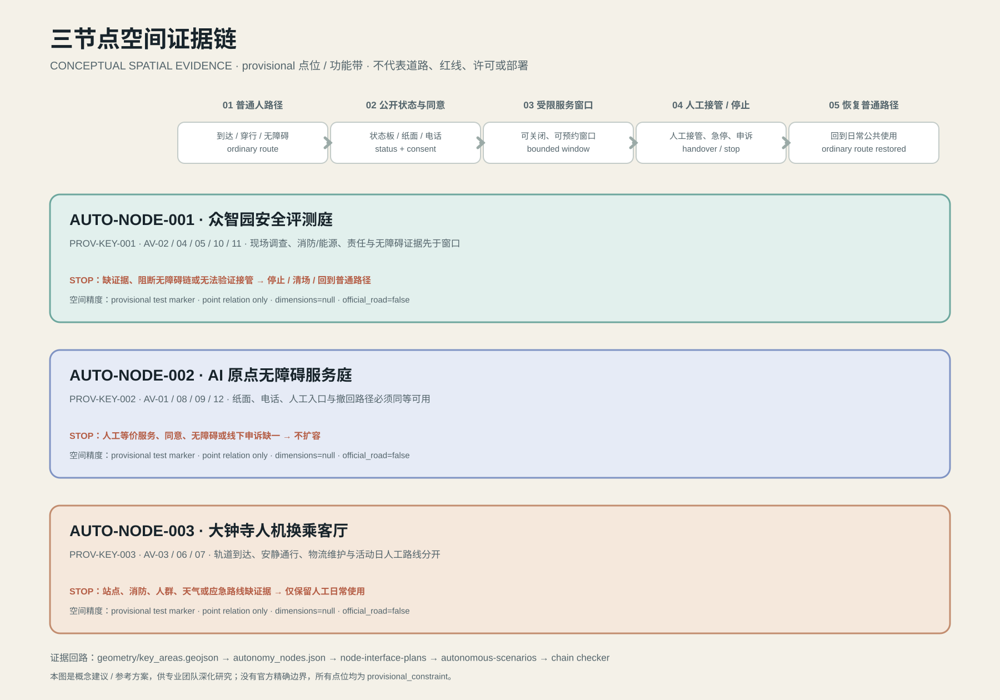
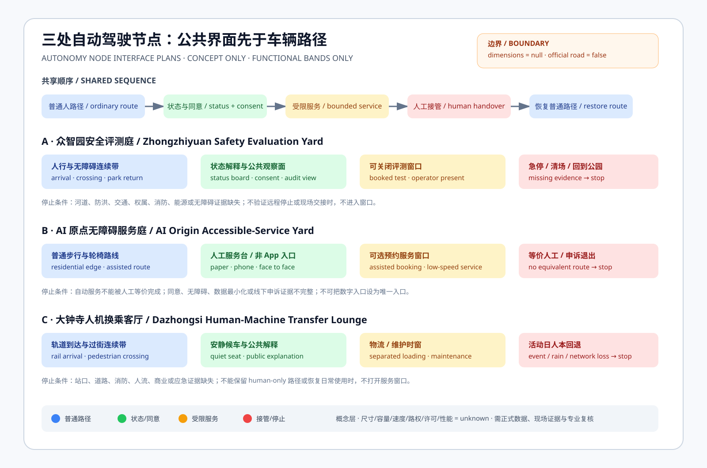
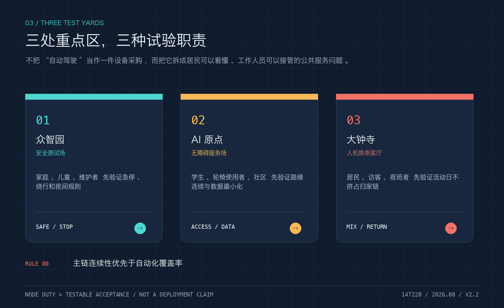
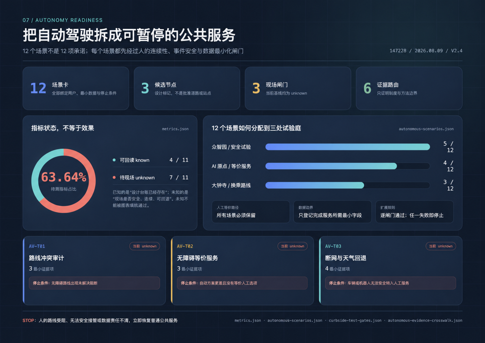
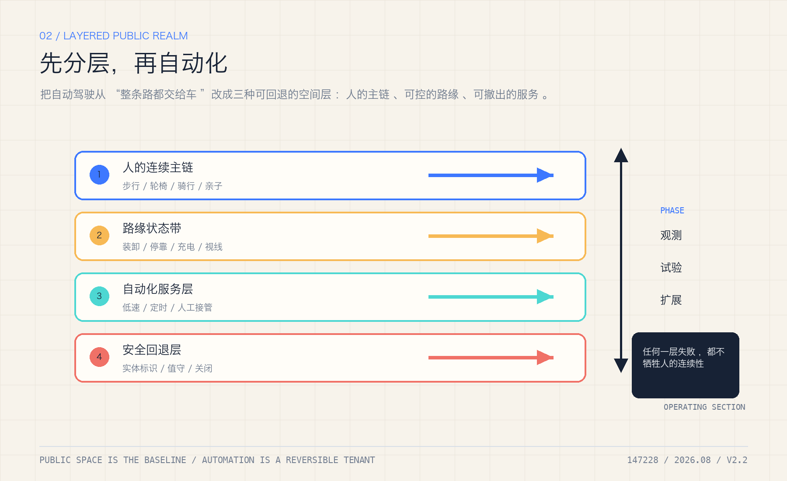

# 智行京张：自动驾驶普及后的公共带

> **一句话判断**：未来自动驾驶越普及，城市越不能只为车设计。京张带要先把“人、轮椅、儿童、骑行者和维护人员的连续通行权”写进路缘、节点、运营和回退，再讨论车辆进入哪里。

本方案是一个独立的自动驾驶公共性迭代，不是把既有投稿直接换名复制。它沿用同一份 provisional 空间底盘，新增自动驾驶路缘、低速接驳、无障碍服务、远程接管、数据最小化和故障回退的机器可读证据层。所有空间仍是概念建议；不声称海淀已经开放某条自动驾驶道路，也不声称任何企业、车辆或监管许可已经落地。

## 一页执行摘要：先验收一条公共服务链，再谈自动化扩展

首个可逆验收单元不是“让车跑起来”，而是让普通人能够选择、使用、叫停、申诉并回到人工服务。它只作为概念级审查界面，不预设长度、道路、车辆或运营主体；具体点位和工程尺度待正式边界、现场走测与专业核查后确定。

**状态标签：目标设计 · 未部署 · 未授权 · 未运行**

| 普通人路径 | 必须看见的空间/服务 | 必须留下的证据 | 不通过时 |
| --- | --- | --- | --- |
| 选择普通或自动辅助路径 | 拟设双入口、目标连续无障碍面、拟提供纸面/电话入口 | 选择状态与障碍记录，不记录身份 | 普通路径不可用则不开试验 |
| 请求一次低速服务 | 拟设人工服务台、目标可辨识路缘、拟设版本状态牌 | 场景 ID、版本、人工等价路径 | 无等价人工服务则暂停 |
| 主动触发人工接管 | 规划中的物理急停、远程停止与现场广播 | 接管原因、时间、责任角色 | 无法接管则停止自动化 |
| 遇到阻断、断网或天气异常 | 设计中的隔离区、回退路线与纸面/电话兜底 | 触发、广播、撤离、恢复记录 | 保持 human-only，不扩容 |
| 请求方自助复演与退出（非第三方核验） | 计划中的凭证、申诉入口与退出标识 | 请求方复演结果、未证明事项、关闭记录 | 不能复演则退回设计阶段 |

当前只具备离线合成 tabletop：4 个分支、7 个契约验收项、5 个回退步骤，以及针对四个 `stop_if` 的合成负回放。每条负回放都把触发输入送入纯判定路径，并记录 `decision=reject_or_stop`、`result_status=not_run`、`performance_results=null`；它证明拒绝/停止链路在契约层可复演，不证明现场安全、许可、部署或性能。`not_authorized_not_run`、`performance_results=null` 和待补本地基线继续有效 [data:visual/assets/autonomy-curbside-tabletop-contract.json#AUTONOMY-CURBSIDE-TABLETOP-001]。

**验收项快速映射（供逐项核对）**

| 验收项 | gate | fixture | scenario | 边界字段 |
| --- | --- | --- | --- | --- |
| AT-01 | AV-T01 / AV-T02 / AV-T03 | — | — | — |
| AT-02 | — | ordinary_curb_audit | S01 | — |
| AT-03 | — | accessible_route_obstruction | S02 | — |
| AT-04 | — | equivalent_service_worse | S03 | — |
| AT-05 | — | network_weather_rollback | S02 | — |
| AT-06 | — | — | — | authorization / operational_status / result_status |
| AT-07 | — | — | — | performance_results / baselines |

这张表是阅读索引，不是新增实测证据；无网络 runner 会把这些引用逐一回接到契约和场景矩阵，并在引用缺失或计数不一致时失败。

## 设计依据与资料清单

官方任务要求回应 AI+交通、机器人、自动驾驶、无人配送等场景，并达到三层空间研究、三处重点区和可审查的城市设计深度 [source:OFFICIAL-ANNOUNCEMENT] [source:AGENT-TASKBOOK]。本包使用 `brief/site-package/` 的 provisional boundary、key areas、标准快照和来源注册表；`geometry/site_boundary.geojson` 明确 `official_boundary=false`、`geometry_role=provisional_constraint` [data:geometry/site_boundary.geojson#SITE-001]。

自动驾驶部分的政策证据采用北京政府公开文件：北京市 2025 年《自动驾驶汽车道路测试与示范应用办法（试行）》将 L3 级及以上道路测试和示范应用纳入联合工作机制，并要求在批准区域和道路范围内活动 [source:BEIJING-AV-TEST-2025]；北京市 2025 年政策先行区测试道路通告列明指定道路、资格和时段约束 [source:BEIJING-AV-ROADS-2025]；工信部、公安部、交通运输部管理规范要求测试主体、驾驶人、车辆、测试评价和责任能力具备可审查条件 [source:MIIT-AV-TEST-2021]。这些文件证明“存在制度化测试路径”，不证明本项目边界内已有许可、道路或运营数据。

资料等级分为四类：

1. `known`：可由当前 GeoJSON、JSON 或公开文件直接回读；例如 provisional 工作面积和节点数量。
2. `design_target`：设计门槛或试点验收目标，必须在现场测试、专业复核或正式许可后替换为实测结果。
3. `unknown`：当前没有本地基线，例如自动驾驶流量、接管时延、路缘冲突率、障碍物误识别率和无障碍连续性。
4. `blocked`：若没有责任主体、保险/安全评估、人工接管、隐私说明或连续人工路线，不得扩展试点。

现有论文只提供方法边界：街谷 CFD、风热 PM2.5 联合监测和屋顶/街谷几何研究用于定义未来模型变量 [source:LIU-URBAN-VENTILATION-2017] [source:MENG-WIND-HEAT-PM25-2022] [source:NOSEK-STREET-CANYON-2025]；它们不提供京张的风场、健康因果、事故率或可迁移百分比。

## 统筹研究范围产业与未来城市研究

统筹层把 AI 产业、人才、轨道、社区、公共治理和未来城市研究放在同一条公共价值链上：企业提供受控试验能力，高校和学生参与审计，社区提供真实需求与申诉，轨道和公共服务台提供不依赖 App 的入口 [source:AGENT-TASKBOOK]。设计意图不是为某个品牌预留市场，而是把“自动化能力”转译成可被居民使用、可被维护者接手、可被专业团队复核的公共服务。空间上，统筹判断影响公共轴和三座试验庭的分工；指标上，优先看无障碍连续性、人工等价服务、停止/回退和申诉闭环，不把车辆数量、模型精度或活动人流当作公共价值。当前缺少责任协议、预算、保险、人员技能和真实需求分布，产业链仍是研究与协同假设，不能写成企业合作或实施承诺。

## 2. 核心概念：一条公共轴、三座试验庭、两条安全网

总体结构为“**一条公共轴 + 三座试验庭 + 两条安全网 + 十二个场景卡**”。公共轴是京张遗址公园及其慢行/蓝绿联系；三座试验庭分别对应众智园、北京 AI 原点社区、大钟寺 AI 产业聚集区；两条安全网是：

- **人本安全网**：连续无障碍路线、人工服务台、可读路缘、低速限行、紧急停车和人工接管。
- **生态与数据安全网**：雨雪/热浪/断网回退、暗夜和鸟类保护、数据最小化、公开算法记录和可撤销授权。

自动驾驶不是独立道路系统，而是叠加在步行、骑行、轨道、公交、消防、绿地和维护系统上的“受限服务层”。任何车辆或机器人都必须让位于连续人工路线；路缘空间首先登记谁可以停、何时停、停多久、谁负责清场 [standard:BEIJING-ACCESSIBILITY-REGULATION] [standard:ISO-TR-4448-PUBLIC-MOBILE-ROBOTS]。

图注：总览图把三座试验庭放在一条公共轴上，并把人本安全网、生态与数据安全网和分期门槛作为同一套空间关系阅读；它不表达法定边界或已开放道路。

### 三节点空间证据链：从点位到可回放的公共路径

总览图只回答“哪里形成关系”，因此本轮把三处节点继续拆成可回放的空间证据链：`geometry/key_areas.geojson` 的三个 provisional 重点区 → `autonomy_nodes.json` 的三个 provisional 点位 → `autonomy-node-interface-plans.json` 的五阶段公共界面 → `autonomous-scenarios.json` 的 12 张场景卡 → `curbside-test-gates.json` 的停止闸门。这样，图上的每个节点都有重点区 feature ID、场景 ID、用户群、首要证据和停止规则，不会把概念点位误读为道路或已部署设施 [data:visual/assets/autonomy-spatial-chain.json#AUTO-NODE-001] [data:geometry/key_areas.geojson#PROV-KEY-001] [depth:key_area_design]。

五个空间动作固定为：普通人路径 → 公开状态与同意 → 受限服务窗口 → 人工接管或停止 → 恢复普通路径。第一处优先验证可关闭的安全评测庭，第二处优先验证老人、轮椅使用者和不会使用 App 的居民仍能通过纸面/电话/人工完成同一服务，第三处优先验证轨道到达、安静通行、物流维护和活动日人工路线分离。只要缺少现场测绘、消防/能源、责任主体、无障碍走查、居民服务基线或应急证据，就停在“概念建议/参考方案”状态，不得扩容 [data:visual/assets/autonomy-spatial-chain.json#CHAIN-CHECK-03]。

图注：三行节点均标注 `official_boundary=false`、`geometry_role=provisional_constraint`、`dimensions=null` 和 `official_road=false`；审计关系线也不是车辆路线。该图与 JSON 检查器只证明引用关系可回放，不证明道路许可、工程可行性、运营绩效或安全结果。

## 总体设计范围城市更新与控规深度城市设计

总体设计把 provisional 的用地、建筑、道路、绿地、公共空间和分期图层作为同一套空间底盘；自动驾驶节点只表达测试关系，不生成法定红线。设计意图是先守住人行主链、消防净空、维护通道、安静界面和可逆改造，再讨论路缘服务窗口 [depth:overall_spatial_structure]。几何影响由 `land_use.geojson`、`buildings.geojson`、`constraints.geojson` 和 `phasing.geojson` 共同回读，指标影响由面积、建筑底盘、绿地和公共空间比例复算。当前没有官方控规、权属、地下管线、消防审查和拆改清单，因此不提出容积率、建筑高度、拆除数量或投资金额；后续应由规划、建筑、市政、消防和交通专业人员统一深化。

## 三层范围工作框架

统筹研究范围回答“北京智能网联汽车政策与产业链如何转成公共空间能力”；总体设计范围回答“路缘、站点、慢行和维护如何形成连续系统”；重点区域回答“每个试验庭如何有小范围、可撤回、可审查的测试场”。空间面积和边界仅使用当前提交 GeoJSON 复算 [metric:site_area_sqm] [metric:key_area_count]。

| 重点区 | 自动驾驶公共性角色 | 首个可逆测试 | 必须守住的边界 |
| --- | --- | --- | --- |
| 众智园 | 安全评测、仿真、车路云接口与企业服务 | 园区内低速接驳/巡检，预约、封闭或明确管理窗口 | 未获批准不驶入社会道路；不把仿真结果当真实安全证明 |
| AI 原点社区 | 社区服务、无障碍接送、公众解释和退出机制 | 人工陪同的预约接送与无障碍路线审查 | 无 App 等价服务；不采集居民连续轨迹；可随时人工完成同一服务 |
| 大钟寺 | 轨道换乘、路缘物流、活动日人机分流 | 站点周边货运/维护机器人与步行优先路缘试点 | 不占用消防、无障碍和应急通道；高峰/雨雪/断网立即回退 |

三处详细节点落在 `visual/assets/autonomy_nodes.json`，其坐标只是 provisional 设计标记，不是车辆测试道路或法定站点 [data:visual/assets/autonomy_nodes.json#AUTO-NODE-001]。

## 重点区域详细设计

众智园承担封闭/预约窗口内的安全评测，AI 原点社区承担自动与人工等价服务，大钟寺承担轨道换乘、路缘物流和活动日人机分流。每处节点都要同时回接场景卡、路缘状态、责任主体、数据边界和停止条件；详细点位只在 `autonomy_nodes.json` 中作为低置信度设计标记，不代表许可证、社会道路或建设地点。专业深化前仍缺现场测绘、信号配时、站口无障碍、消防通道、物流时窗和分层居民基线，故首个测试必须限定在可关闭、可人工接手、可公开复盘的窗口内 [data:visual/assets/autonomy_nodes.json#AUTO-NODE-001]。

### 三座试验庭的公共界面与可逆关系

自动驾驶节点不能只画成车辆停靠点。下表把每个试验庭的自动化服务关系翻译成公共界面、普通路径和可逆服务关系，供后续城市设计比较；它不改变节点文件，也不生成新的红线。当前没有官方控规、权属、地下管线、消防审查和拆改清单，故不填写开发控制、层数或工程尺度。

| 试验庭 | 首层空间选择 | 公共界面与可逆关系 | 首先补齐的专业证据 |
| --- | --- | --- | --- |
| 众智园 | 企业入口、低速接驳、维护/充电和消防净空分层；自动化服务留在可关闭的管理界面 | 公众观察、人工接管和安全复盘面向普通路径；测试或维护后场可关闭，不切断无障碍主链 | 现状建筑、权属、消防/能源、封闭场地边界、企业 OD |
| 北京 AI 原点社区 | 人工服务台、连续无障碍路径、等价纸面/电话入口先于上下客位；自动化不得截断日常路线 | 纸面、电话和人工入口朝向普通路径；服务不依赖 App，自动化组件可暂停并回到人本服务 | 无障碍走查、居民服务基线、照护/夜间需求、权属与安全 |
| 大钟寺 | 轨道换乘、步行优先路缘、物流清场和公共解释界面分开；活动或断网时整体退回 human-only | 到达、安静通行、服务前台和受控物流分流；展示/预约可撤回，不占用消防、无障碍和应急通道 | 站口客流、路缘计数、交通组织、消防、市政和活动日应急证据 |

这些关系只回答先比较哪些公共性与可逆性，不回答哪里可以建设、建多少或是否允许车辆进入。正式方案必须在官方规划、测绘、产权、结构、消防、市政、交通和公众参与资料齐备后，由专业团队确定开发控制与工程尺度 [depth:height_massing_character] [depth:development_intensity_controls]。

在证据到位前，空间动作只包括可撤回的导向、候车遮雨、人工服务台、无障碍坡道、路缘状态牌和可移动隔离；不据此提出道路拓宽、建筑增量、拆除或自动驾驶社会道路开放 [standard:MOHURD-CONTROL-DETAILED-PLANNING]。

### 三处节点的自动驾驶功能带（概念层）

为避免“节点”被误读成一处车辆停靠点，本包把三处节点拆成普通人路径、公开状态与同意、受限服务窗口、人工接管/停止和恢复普通路径五个连续界面。众智园先验收可关闭的安全评测庭，AI 原点先保留纸面/电话/人工等价服务，大钟寺先把轨道到达、安静通行和物流维护窗口分开；尺寸、容量、速度、路权、许可和性能仍为空，节点计划只表达 functional bands，不是道路断面或红线 [data:visual/assets/autonomy-node-interface-plans.json#AV-INTERFACE-001]。

图注：三行节点计划把“普通路径先行、受限服务可关、证据不足即人工回退”放到同一张图上；颜色表示界面关系，不表示现状测量、工程尺寸或车辆性能。

图注：重点区图不是点位清单，而是把企业服务、社区等价服务和轨道换乘分别落到首层界面，并显示何时回退到人工、无障碍和应急通道。

## 4. 自动驾驶普及后的空间规则

### 4.1 路缘先于车道

所有自动驾驶场景先绘制“人行连续带”和“可退出服务带”，再决定车辆路径。路缘登记采用五种状态：`open`（公共通行）、`booked`（短时装卸/接送）、`service`（维护窗口）、`restricted`（风险天气或活动管制）、`human-only`（人工与无障碍优先）。状态变更必须有责任人、起止时间、现场标识和恢复条件，不能由模型自动永久锁定。

这里的“状态牌 + 可撤回功能带”是方法性借鉴而非本地结论：路缘研究提醒设计同时记录执法、公众沟通、数据管理和跨部门协同；驾驶人本位街道研究把绿化、座椅、遮蔽和微出行设施作为公众参与时的弹性空间问题；place-based eHMI 研究则提示自动驾驶界面需要嵌入场所语境。三项研究只决定后续要问什么、测什么和由谁复核，不把外地样本或参与者结果转移成京张偏好、尺寸或安全效果 [source:DIEHL-CURBSPACE-MANAGEMENT-2021] [source:FAYYAZ-DRIVERLESS-STREETS-2025] [source:WANG-PLACE-BASED-EHMI-2025]。

#### 典型路缘断面：先保连续通行，再放服务窗口

| 断面带 | 空间动作 | 可见状态与接管 | 不能先行假定的事实 |
| --- | --- | --- | --- |
| 人行/无障碍连续带 | 连续步行、轮椅和照护路线贯穿站口、服务台与过街点；车辆不进入 | `open` 或 `human-only`；路障、积水或受阻时由人工指引 | 断面宽度、坡度、盲道和电梯状态须由专业走查确定 |
| 路缘服务带 | 在公共路线外侧安排短时上下客、装卸、维护和清场窗口 | `booked`、`service` 或 `restricted`；状态牌显示责任人、时窗和恢复条件 | 路权、权属、消防净空和实际冲突率尚无现场基线 |
| 换乘/求助节点 | 把站口、候车、人工服务台和申诉入口放在同一可读界面 | 任一服务失败即切到 `human-only`，不以 App 作为唯一入口 | 站口客流、等候空间和公众体验须现场核对 |
| 维护/应急回退带 | 保留可撤回设施、清场动作和应急通道，不把临时服务变成固定道路 | 现场人员可急停、撤场并恢复公共通行 | 消防、管线、维护班次和应急联络须由有权组织确认 |

这个断面只规定空间关系和状态转换，不预填工程尺寸、道路红线、车辆速度或自动驾驶许可；这些字段保持 `unknown`，待测绘、专业审查和公众参与后复算。

### 4.2 速度与权利是设计变量

本方案不写未经审批的法定速度值，而将低速、让行、停止距离和人工接管写成验收字段 [metric:autonomy_trial_speed_limit_status] [metric:remote_stop_response_seconds]。试点的成功不是车辆跑得快，而是最慢的行人、轮椅使用者、儿童和维护人员仍能安全完成同一条路线 [standard:BEIJING-WALK-CYCLE-DB11-1761]。

### 4.3 “永远有人能接手”

每个试点节点配置人工服务点、物理急停、远程停止、现场广播、事件记录和撤场路线。出现感知不确定、通信中断、雨雪/积水、活动拥挤、鸟类保护时段或无障碍受阻，默认降级为人工服务或停止运行，而不是继续扩大自动化范围 [source:BEIJING-AV-TEST-2025] [source:MIIT-AV-TEST-2021]。

### 4.4 数据只为完成服务

车辆/机器人只需读取通过授权的路缘状态、障碍物类别、无障碍路线和应急信息；不建立居民画像，不把摄像头连续流作为公共展示，不以个人轨迹换取基本服务。事件记录公开聚合指标、责任链和纠正结果，原始数据保留周期、访问主体和删除机制由专业/法务团队确定 [source:CASE-HELSINKI-AI-REGISTER] [source:CASE-UK-ATRS] [source:NIST-HUMAN-CENTERED-AI]。

图注：系统图展示路缘状态如何连接人工接管、雨雪/热浪/断网回退和生态约束；重点是停止与恢复的空间路径，不是车辆性能结果。

## 5. 十二张场景卡：从可逆试点到可退出服务

| 编号 | 场景 | 空间载体 | 通过条件 | 停止/回退 |
| --- | --- | --- | --- | --- |
| AV-01 | 原点社区无障碍预约接送 | AI 原点社区 | 人工陪同、等价人工路径、出行者同意 | 任何无障碍阻断即转人工 |
| AV-02 | 众智园低速接驳 | 众智园试验庭 | 封闭/获批窗口、现场安全员、急停 | 识别不确定或人流超阈值即停 |
| AV-03 | 大钟寺站末端换乘 | 站点周边路缘 | 轨道/步行优先、清晰上下客位 | 占用消防/无障碍通道即撤 |
| AV-04 | 夜间维护机器人 | 公园维护带 | 暗夜照明审查、反光标识、人工巡检 | 鸟类/行人风险上升即人工维护 |
| AV-05 | 雨雪低速服务 | 蓝绿边界 | 水深、能见度、抓地和通信门槛 | 超阈值全部人工化 |
| AV-06 | 路缘预约装卸 | 大钟寺商业界面 | 时窗、货物责任、可清场 | 超时或冲突即取消预约 |
| AV-07 | 事件日人机分流 | 全球 AI 活动路线 | 预案、人工引导、动态封控 | 人流拥挤时车辆退出 |
| AV-08 | 断网安全回退 | 三处试验庭 | 本地安全状态、广播、物理急停 | 断网不保持开放运行 |
| AV-09 | 儿童/老人陪同模式 | 原点社区 | 监护人确认、人工接管 | 任一授权撤回即结束 |
| AV-10 | 公共设施巡检 | 绿地、排水、照明节点 | 资产 ID、巡检清单、人工复核 | 误报不触发自动施工 |
| AV-11 | 开源安全审计日 | 众智园 | 公开测试摘要、第三方/专业复核 | 未通过不进入下一阶段 |
| AV-12 | 乘客/居民申诉与退出 | 三处公共服务台 | 线下、电话、网页三路等价 | 申诉未闭环不得扩容 |

这些场景是设计对象，不是已经存在的运营项目。其机器可读版本为 `visual/assets/autonomous-scenarios.json`，每张卡都绑定空间、责任、数据最小化和停止条件 [metric:autonomy_scenario_card_count]。

## AI 创新生态、人才画像与 AI+ 场景

### 产业测试

1. **AV-T01 路缘冲突测试**：在众智园/大钟寺两个候选节点，以人工计数和事件日志核对占道、让行、急停、装卸冲突；不使用未授权视频训练。验收字段为冲突类型、处置时间、人工复核率和连续无障碍路线是否保持 [metric:curb_conflict_rate] [metric:accessible_route_continuity_ratio]。
2. **AV-T02 无障碍等价服务测试**：AI 原点社区同时提供自动驾驶接送、人工服务和纸面/电话预约，按出行完成率、等待时间、拒绝率和满意度分组比较；任何自动化优势不得以减少人工选项为代价 [standard:BEIJING-ACCESSIBILITY-REGULATION]。
3. **AV-T03 断网/极端天气回退测试**：三处试验庭分别模拟通信中断、暴雨积水、热浪和活动拥挤，验证远程停止、现场接管、广播、撤离和恢复。气象和排水是未知输入，不用论文或模拟分数替代现场结果 [metric:autonomy_fallback_success_ratio]。

为让三道闸门可以先在桌面上复核，包内增加一个离线合成 tabletop：它只回放 4 个分支、7 个验收检查和 5 个回退步骤，分别覆盖 AV-T01—T03 与 S01—S03；普通路缘保留人工巡查和纸面标识，无障碍阻断、等价服务变差或断网/天气异常均进入暂停、人工接管和恢复链。该回放不是现场测试、许可、安全评估、部署或性能结果，运行状态仍为 `not_authorized_not_run`，实测结果为 `null`，基线仍为 `unknown`。复核凭证与无网络 runner 见 [data:visual/assets/autonomy-curbside-tabletop-evidence.json#AUTONOMY-CURBSIDE-TABLETOP-001]。

### 用户画像

居民、轮椅使用者/照护者、高校师生、园区员工、初创企业、物流/维护人员、老年访客、夜班人员和儿童监护人共同参与。每人都拥有非数字入口、人工帮助、撤回授权和公开申诉路径；不存在“不会用 App 就失去服务”的默认规则 [source:BEIJING-ACCESSIBILITY-REGULATION]。

## 7. 三座 AI 朝圣地标与城市文化

- **人字折返·公共接管碑**（原点社区）：记录被人工否决、暂停和修复的自动化建议，把詹天佑以折返解决坡度的工程记忆转译为“拒绝也是城市能力”。
- **路缘灯塔**（众智园）：一座不展示个人数据的可视化灯塔，只显示当前路缘状态、试点阶段、已通过门槛、事故/申诉闭环和下一次复核日期。
- **人机换乘客厅**（大钟寺）：把车、轨道、步行、轮椅、货运和公共服务放在同一张可读地图上，强调“到达权”而不是车辆品牌。

三处地标均是文化与公共解释建议，不是已批准建筑、雕塑、企业冠名或建设承诺 [metric:ai_landmark_count]。

## 交通、轨道、市政与公共服务设施

沿用同一 provisional 空间底盘的用地、建筑、道路、绿地和公共空间图层，所有空间量从当前文件复算 [metric:site_area_sqm] [metric:green_ratio] [metric:public_space_ratio]。新增自动驾驶节点不画新的法定红线，只以点位、路缘状态和测试依赖表达设计意图。正式边界发布后，必须重算所有图层和面积，不得把本包坐标当成测试道路。

分期为：

- **P0（现在—2027）可读路缘**：现场盘点、无障碍审计、人工服务台、路缘登记、公开申诉和数据最小化规则；不需要先部署自动驾驶。
- **P1（2027—2030）受限试验**：只在获批、低速、可回退的候选空间开展 AV-T01—T03；每月公开聚合事件与关闭项。
- **P2（2030 以后）条件扩展**：仅当安全评估、专业交通审查、生态/隐私审查、居民参与和责任保险全部通过，才考虑扩大场景；不通过则保留人工服务和公共空间。

交通组织遵守步行/骑行优先、轨道换乘、消防和无障碍连续，自动驾驶车辆是服务层，不是新增道路容量。蓝绿系统保留风、雨、热、暗夜和鸟类保护的验证入口；没有 CFD、排水模型、微气候实测和生态基线时，所有效果只写 `unknown` 或 `design_target` [source:BEIJING-VENTILATION-NETWORK-2035] [source:BEIJING-FLOOD-PLAN-2021-2025] [source:BEIJING-BIRD-BIODIVERSITY-2024]。

图注：指标图把 P0 可读路缘、P1 受限试验和 P2 条件扩展排成阶段门，并把 `unknown`、`design_target` 与回退动作分开显示。

图注：准备度看板把场景卡、试验庭、闸门和证据路由接成一条复核线，读者可以看到缺证据时停在哪一门，而不是把准备度当成已部署能力。

## 用地、建筑规模与拆改留方案

本包保留既有 provisional 用地和建筑底盘，自动驾驶节点不转化为新增开发强度、建筑高度、拆除数量或投资承诺。优先动作是利用既有道路、站点、公共建筑、树荫和服务台做可逆改造，并把首层入口、无障碍卫生间、等候点、维护/充电和人工接管空间当作公共服务接口。`land_use.geojson`、`buildings.geojson`、`public_space.geojson` 和 `constraints.geojson` 共同表达空间关系；面积、footprint 和比例仍以 `metrics.json` 的公式回读。当前缺少权属、结构、设备、地下空间、停车和成本资料，正式深化前不得推出拆改或建设结论 [data:geometry/land_use.geojson#LU-001]。

## 蓝绿空间、公共空间与城市风貌

蓝绿和公共空间不是自动驾驶效果的背景图，而是决定人能否连续通行、何时转人工、如何应对雨雪/热浪/暗夜和鸟类保护的安全边界。设计上保留树荫、雨水花园、开放空间、照明、维护路线和路缘状态的联系；几何层只表达候选审计点、公共性关系和回退路径，不推出生态红线、排水能力或健康收益。绿地比例、公共空间比例、可达连续性、积水/热风险和暗夜影响需分别由图层、现场记录和专业模型复算；当前缺逐点树木、鸟类、雨洪、微气候、照度和夜间人流基线，故相关效果只能保持 `unknown` 或 `design_target` [source:BEIJING-VENTILATION-NETWORK-2035]。

## 更新项目清单、实施政策与分期计划

分期采用“先可读、再小试、后条件扩展”的可逆路径：P0 交付路缘台账、无障碍审计、人工服务、申诉和数据最小化规则；P1 只在获批、低速、有人值守且可回退的窗口开展 AV-T01—T03；P2 只有安全、交通、生态、隐私、参与、保险和维护责任均有书面证据后才讨论扩展。参与主体包括政府/监管部门、企业、高校、社区、居民、维护者和专业团队；可衡量指标包括通过门数量、冲突/接管/回退记录、无障碍连续性、等待、申诉闭环和维护响应。每阶段都要把成果、验收、责任、缺口和停止动作回接到 `phasing.geojson`、场景卡和证据台账；当前没有招标范围、运营主体、SLA、预算和应急联络，因此这里只是设计任务书级建议，不是中标、施工或运营承诺 [depth:phasing_implementation]。

图注：用地分层图把公共轴、三座试验庭、慢行/蓝绿联系和人工回退放在同一空间底盘中；候选关系不等于工程对齐或法定红线。

## 指标体系、面积复算与合规矩阵

当前可直接回读的底盘指标包括：provisional site area 11.41 km²、三处重点区、绿地比例和公共空间比例。自动驾驶新增指标全部明确为 `unknown` 或 `design_target`：路缘冲突率、无障碍连续性、远程停止响应、回退成功率、数据最小化覆盖率、试验路线长度和自动驾驶场景卡数量 [metric:curb_conflict_rate] [metric:remote_stop_response_seconds] [metric:autonomy_fallback_success_ratio]。

`compliance_matrix.json` 覆盖公告 1.3、1.4、1.5 与 agent.1—agent.6；`standard_matrix.json` 覆盖城市设计、控规深度、步行骑行、无障碍、资产管理、服务机器人和自动驾驶测试边界；`design_depth_matrix.json` 将每项设计深度绑定正文、图层、指标和回退条件。所有可知数值都带单位、公式、来源文件、置信度和假设 [metric:autonomy_metric_count]。

## 风险、版权与合规说明

本方案不替代道路测试许可、安全评估、车辆认证、交通组织、消防、保险、隐私影响评估、生态审查或施工图。任何测试主体必须先确定运营责任、现场安全员/远程操作员、应急联络、数据保留、投诉渠道、事故记录和撤场条件 [source:BEIJING-AV-SAFETY-ASSESSMENT-2025]。

公开运营采用“登记—小试—复核—扩展/停止”循环：每个节点发布用途、责任人、时间窗、当前状态、已知缺口和下一次复核；居民可在线下服务台提交意见；指标不达标时自动回到人工服务，不允许用宣传活动掩盖失败。年度 AI 活动周只展示已经通过的摘要，不展示未经授权的个人或车辆数据。

### 交付与复算

本包包含中文正文、英文对照、GeoJSON、指标、假设、来源、六张由同一数据底盘生成的核心图件、A3/A0 图纸和离线视觉页。正式官方 polygons、道路/管线/权属/交通/气象/排水/生态基线到位后，必须重新生成图层、metrics、图件、报告和自检；不能只替换一张图或把未来目标改写成已知事实。

## 参考资料

完整来源索引、发布方、用途边界、访问日期和限制以本包的 `sources.json` 为准；本节不重复结构化索引，正文只在对应论点附近保留代表性锚点 [source:SOURCE-REGISTRY]。来源的设计用途是让每个政策、标准、案例和方法证据都能回到发布方、覆盖范围、许可边界和已知缺口，而不是把参考文献数量当作方案质量。空间边界、重点区、面积、绿地、公共空间和自动驾驶指标分别回读 GeoJSON、JSON 和结构化矩阵；论文只用于定义未来测量变量，不提供本地实测结果。官方 polygons、道路/权属/交通/气象/排水/生态基线及专业审查到位前，所有试验、性能、许可和实施结论都保持为设计目标、未知或待正式数据补齐。

**最终边界声明**：这是一个可审计的概念与试验框架，不是政府批准的规划、道路开放公告、自动驾驶运营许可、企业合作协议、健康/空气质量证明或建设承诺。
