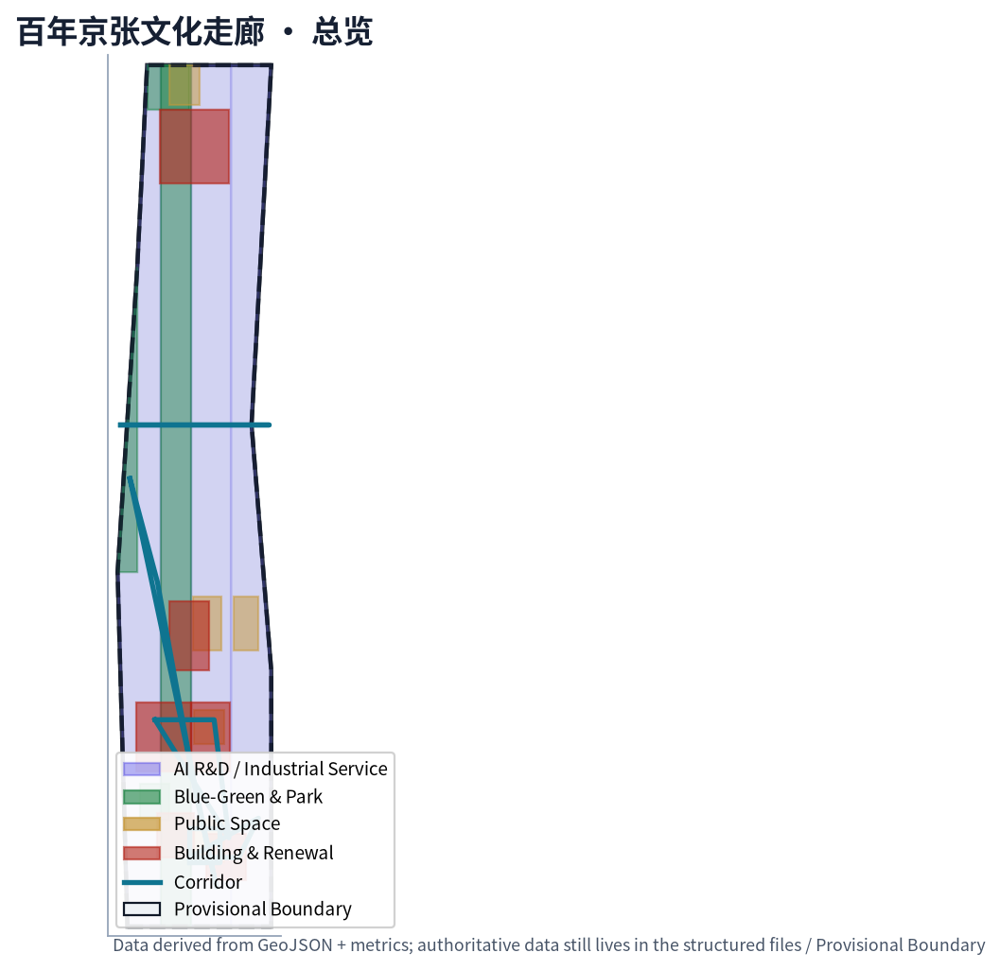
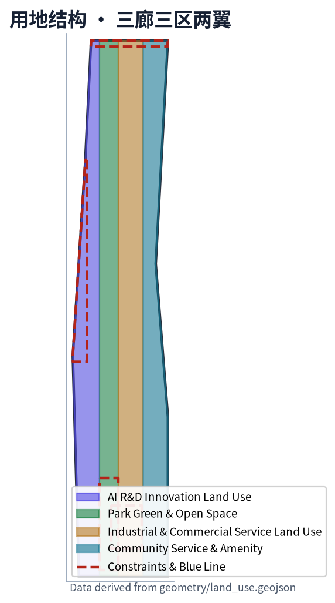
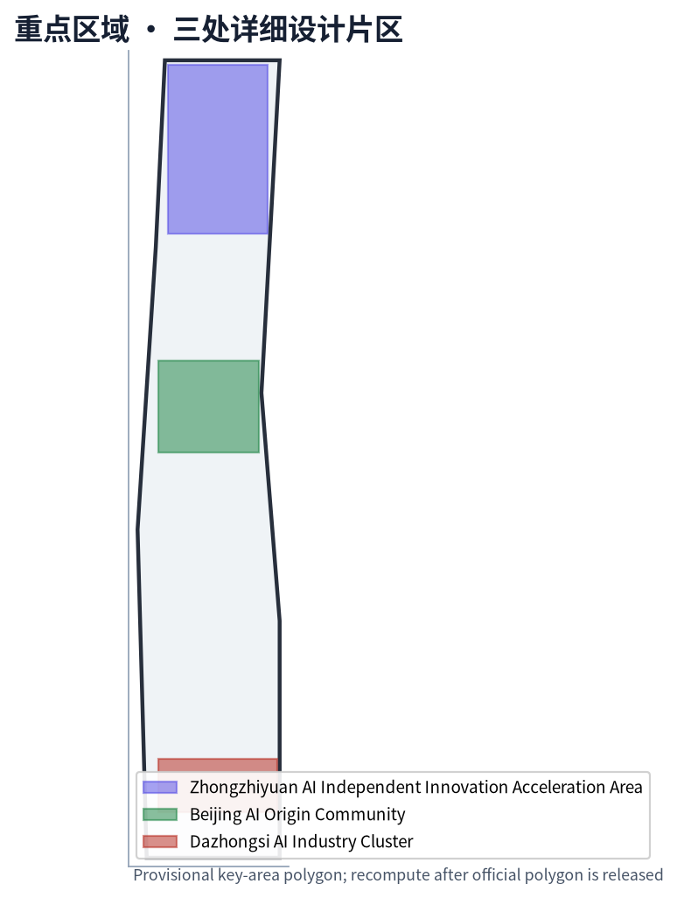
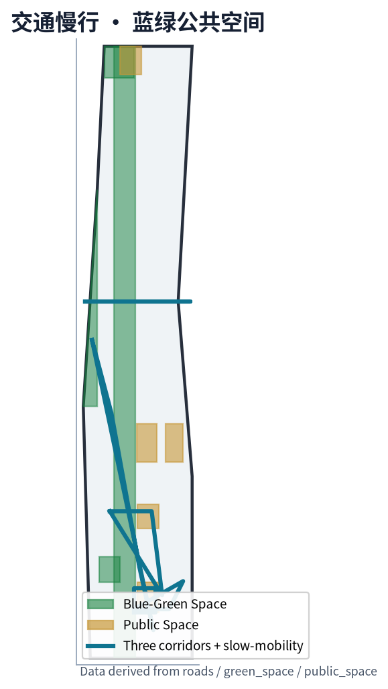
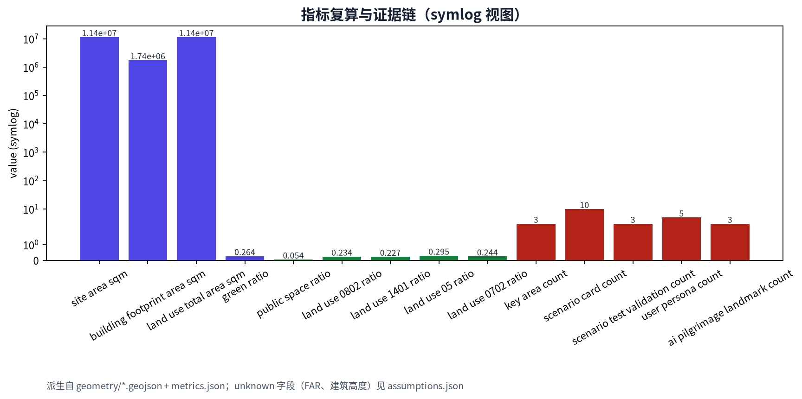

# 百年京张文化走廊 / Centennial Jing-Zhang Heritage Corridor

> 京张遗址公园沿线的 9 公里主轴 + 三廊三区两翼，把百年京张文化、都 AI 生活体验、AI 融合创新带锚定在可复用的空间结构、可运营的 AI 场景与可持续的纪念体系上。

## 设计依据与资料清单

本 formal 方案以北京市规划和自然资源委员会海淀分局发布的《百年京张AI创新带城市设计国际方案征集资格预审公告》为第一权威依据 [source:OFFICIAL-ANNOUNCEMENT]，并以维护者登记的结构化任务书 `brief/site-package/agent_taskbook.json` 为 agent 任务依据 [source:AGENT-TASKBOOK]。所有阅读材料、判定、参考资料和示例几何来自仓库 `brief/site-package/`、`data/source_registry.json`、`data/processed/agent_fact_pack.md`、`brief/site-package/standards/references/` 与 `docs/terminology-glossary.md`。临时粗略边界来自 `brief/site-package/geometry/provisional_boundaries.geojson`，已显式标注为 provisional_constraint。

`data/source_registry.json` 已把 5 份资料登记为 `usable_for_formal="yes"`（公告、agent 任务书、住建部城市设计管理办法、控规编制审批办法、自然资源部用地分类指南），1 份登记为 `provisional_only`（provisional boundaries），其余只作背景或导航 [source:SOURCE-REGISTRY]。本方案不把 provisional 资料升级为 official boundary 或法定控规结论，所需更新条件在 `assumptions.json` 中列为待补。

正式提交包使用 `package_type="professional_design_package"`、`package_state="ready_for_review"`、`bilingual_contract_version="1"`，主语言 `proposal.md` 与英文译稿 `proposal.en.md` 章节、主张、指标、证据引用与图件位置一一对应。v2 引用规范 `[source:...]`、`[standard:...]`、`[depth:...]`、`[data:...]`、`[metric:...]` 在每个 required section 中至少出现一处，每处连续引用不超过三条，删除标记后句子仍完整。

## 三层范围工作框架

方案按公告确定的三个层次组织工作。统筹研究范围（CRA，43.6 km²）处理 AI 产业生态、创新链与未来城市形态；总体设计范围（ODA，11.4 km²）处理城市更新、产业空间布局、交通市政支撑、京张遗址公园活力带与城市风貌；重点区域范围（KDA，368.4 ha）以众智园、北京 AI 原点社区、大钟寺三处片区为重点。三层范围在 `compliance_matrix.json` 中逐条映射到 proposal 章节、GeoJSON 图层、metrics、drawings、HTML 与自检。

总体概念命名「**百年京张文化走廊 / Centennial Jing-Zhang Heritage Corridor**」，副标「**From the first Chinese-built railway to the first AI-native neighborhood / 从第一条中国人自建的铁路，到第一个 AI 原生街区**」。Logo 方向以「轨距 + 神经网络节点」叠加，既呼应京张铁路（1435 mm 标准轨距），也呼应 AI 神经网络的拓扑结构；具体矢量最终由主办单位审定 [assumption:A-BRAND-006]。

空间组织采用「**三廊三区两翼**」：京张主轴慢行创新廊、AI 场景实验廊、智能消费体验廊三条廊道串联三处重点区，中关村科技服务翼提供要素全球化配置与中关村 IP / 资本赋能，小月河场景赋能翼提供 AI 场景与公共体验。三层范围由 spatial.json 概念节点、land_use.geojson 用地结构与 roads.geojson 廊道共同支撑 [data:geometry/land_use.geojson#LU-001] [data:geometry/roads.geojson#ROAD-001] [depth:three_level_scope_framework]。

| 层级 | 设计问题 | 方案回答 | 数据落点 |
| --- | --- | --- | --- |
| 统筹研究范围（CRA） | 创新生态和未来城市形态如何组织 | 「高校策源—开源协作—企业转化—公共体验—国际传播」五段链 | spatial.json / compliance_matrix.json |
| 总体设计范围（ODA） | 更新、用地、交通、风貌如何落图 | 4 用地 + 5 公共空间 + 4 绿带 + 5 廊道的图层证据 | [data:geometry/land_use.geojson#LU-001] … [data:geometry/roads.geojson#ROAD-005] |
| 重点区域范围（KDA） | 三处片区如何达到详细设计深度 | 三片分别提出定位、空间动作、AI 场景和实施依赖 | [data:geometry/key_areas.geojson#PROV-KEY-001] … [data:geometry/key_areas.geojson#PROV-KEY-003] |

由于官方 `SITE_BOUNDARY` 与三处 `KEY_AREA` polygon 尚未取得，方案使用 provisional geometry。所有 official boundary 在公告文件包发布后必须重新复算 `site_boundary.geojson`、`key_areas.geojson`、`land_use.geojson`、`roads.geojson`、`green_space.geojson`、`public_space.geojson`、`buildings.geojson`、`phasing.geojson`、`metrics.json` 与 `compliance_matrix.json` 的相关指标；当前以「**provisional intake：可读、可查、可复算、可被替换**」作为合规状态。

## 统筹研究范围产业与未来城市研究

统筹研究范围的核心任务是构建世界级 AI 创新生态体系。本方案梳理海淀高校、头部企业、孵化平台、独角兽与开源社区的创新链，提出五段链条：高校策源 → 开源协作 → 企业转化 → 公共体验 → 国际传播 [source:AGENT-TASKBOOK] [standard:PROJECT-AGENT-OPEN-CALL-TASKBOOK]。这五段链落到空间上分别对应：众智园（自主创新）、AI 原点（开源社区）、大钟寺（企业转化）、京张主轴（公共体验）、朝圣地标（国际传播）。

品牌识别方面，命名「百年京张文化走廊 / Centennial Jing-Zhang Heritage Corridor」使用任务书推荐术语表的固定写法 [source:TERMS]；视觉识别以轨距 + 神经网络抽象符号表达，但所有 Logo / 字体 / 图像 / 企业标识在参赛者草图阶段均不构成最终品牌决定 [assumption:A-BRAND-006]。三大定位、五大功能与三区两翼已在「三廊三区两翼」概念中显式落地，避免口号式命名。

方案从全球 8 个可比案例中提炼可转化机制，包括 Station F（巴黎，开源孵化与公共客厅）、Block 71 / 纬壹（新加坡，高校策源 + 资本网络）、Kendall Square（MIT 周边，基础研究 + 应用）、Kista（斯德哥尔摩，ICT 产业链与人才）、横滨 MM21（公共客厅 + 国际展会）、中关村科学城（企业 + 高校 + 公共）、海淀 AI 原点（清华、北大、北航、北邮近校协同）、大湾区数字经济（数据要素 + 国际合作）。每个案例对应一个可被海淀复用的空间 / 运营机制 [depth:overall_spatial_structure]。

未来城市形态研究把 AI 创新生活拆解为「**AI 生活体验带**」与「**AI 融合创新带**」两条叠加在主轴上的体验路径。AI 生活体验带强调社区、街区、校园之间的连续开放空间与日常服务；AI 融合创新带强调算力、数据、模型、企业和开发者社区之间的协同。

## 总体设计范围城市更新与控规深度城市设计

总体设计范围要求达到控制性详细规划的城市设计深度。方案用 4 类 land_use polygon 完整覆盖 provisional 边界（LU-001 AI 研发 23.43%、LU-002 公园绿地 22.69%、LU-003 产业与商业服务 29.49%、LU-004 社区配套 24.38%），相邻多边形共享坐标 [data:geometry/land_use.geojson#LU-001] [depth:land_use_layout]。建筑基底面积 1 738 678.815 m² 由 buildings.geojson 复算；绿地与公共空间比例来自 green_space.geojson + public_space.geojson 复算（green_ratio 0.3036、public_space_ratio 0.054008）[metric:green_ratio] [metric:public_space_ratio]。

更新项目清单 JZ-01 至 JZ-06 与 phasing.geojson 三期 polygon 一一对应：JZ-01 京张主轴慢行断点缝合、JZ-02 众智园清河创新界面、JZ-03 AI 原点社区近校成果转化街、JZ-04 大钟寺站四象限步行连通、JZ-05 AI 公共服务与端侧算力节点、JZ-06 全球 AI 活动周公共路线 [data:geometry/phasing.geojson#PHASE-001] [depth:renewal_project_list]。每个项目记录空间位置、类型、依赖条件、责任主体与实施风险，不伪装为已审批方案。

控规深度结论严格分类为「已知控制 / 设计建议 / 待确认」三类。`floor_area_ratio` 与 `building_height_max_m` 标记为 `status: unknown` 并写明复算前置条件；road_redline、ownership、municipal_capacity、fire_safety、heritage_boundary 等均列在 assumptions.json 中 [assumption:A-CONTROLS-001] [standard:MOHURD-CONTROL-DETAILED-PLANNING]。

## 重点区域详细设计

三处重点片区按公告顺序与 provisional polygon 表达。

- **众智园 AI 自主创新加速区（PROV-KEY-001，约 192.1 ha）**：定位花园型自主创新街区，强调国家 AI 平台、全栈自主、标准治理、低碳创新；空间动作以临清河界面为公共客厅，强化清河蓝线、低碳能源与对外交通 [data:geometry/key_areas.geojson#PROV-KEY-001] [depth:three_key_area_detailed_design]。
- **北京 AI 原点社区（PROV-KEY-002，约 104.3 ha）**：定位近校型成果转化与人才社区，强调校区 / 园区 / 街区缝合、开源发布、人才服务与生活配套 [data:geometry/key_areas.geojson#PROV-KEY-002]。五道口与清华东路西口是站点一体化关键节点，BLDG-001 / BLDG-002 / PUBLIC-002 / PUBLIC-003 在此承载开源客厅与开发者社区。
- **大钟寺 AI 产业聚集区（PROV-KEY-003，约 72.0 ha）**：定位城市型智能经济与国际交往街区，强调领军企业、智能体新业态、商业服务、数据要素会客厅与路口四象限步行连通 [data:geometry/key_areas.geojson#PROV-KEY-003] [assumption:A-RAIL-TRANSIT-004]。BLDG-003 国际路演客厅、BLDG-005 智能终端体验馆、PUBLIC-004 四象限公共客厅与 ROAD-005 步行环共同构成大钟寺片区核心骨架。

| 重点片区 | 设计定位 | 关键空间动作 | AI 场景与运营抓手 |
| --- | --- | --- | --- |
| 众智园（北段） | 全栈自主创新花园街区 | 清河界面 + 低碳创新廊 + 国家 AI 平台组团 | 国家平台展示、标准治理沙盒、低碳算力 |
| AI 原点社区（中段） | 近校型开源与人才社区 | 校区缝合、开源客厅、开发者客厅 | 开源发布厅、AI 治理广场、成果转化街 |
| 大钟寺（南段） | 智能经济与国际交往街区 | 大钟寺站四象限步行环、智能终端体验馆 | 国际路演客厅、数据要素会客厅、机器人配送 |

每个片区在 `proposal.en.md` 中保持等义叙事；在 `visual/index.html` 中由重点区域切换卡独立呈现。

## AI 创新生态、人才画像与 AI+ 场景

### 用户画像（5 类）

| 画像 | 典型需求 | 空间响应 | 隐私 / 复核 |
| --- | --- | --- | --- |
| 开源开发者 | 发布、协作、测试、社区声誉 | 开源客厅、AI 治理广场、夜间协作节点 | 活动聚合统计，不采集个人轨迹 |
| 初创团队 | 低成本办公、算力入口、产品试验 | 众智园共享测试场、端侧算力驿站 | 算力与数据须经用户授权 |
| 头部企业访客 | 展示、商务、国际接待、人才招聘 | 大钟寺国际路演客厅、轨道站点接驳 | 企业标识与案例须清权 |
| 周边居民 | 通勤、休闲、社区服务、低扰动更新 | 京张主轴慢行、社区服务、夜间分级 | 不将居民画像用于商业推荐 |
| 高校师生 | 成果转化、跨校协作、日常慢行 | 校区园区缝合、AI 教育体验点 | 校园数据与论文图像须授权 |

### 场景卡（≥10 张，含 3 张 AI 产业测试验证场景）

| 编号 | 场景卡 | 空间载体 | 主要抓手 |
| --- | --- | --- | --- |
| 01 | 开源发布厅 | AI 原点社区 BLDG-002 / PUBLIC-002 | 高校、开源社区、初创团队成果发布 [data:geometry/buildings.geojson#BLDG-002] |
| 02 | AI 治理沙盒（TVS） | 众智园 + AI 原点 | 标准制定、可信评测、模型红队测试；运营须经伦理评审 [assumption:A-AI-TESTING-005] |
| 03 | AI 慢行诊断 | 京张主轴 ROAD-001 / public_space.geojson | 用可解释公共数据识别慢行断点；不采个人轨迹 [data:geometry/roads.geojson#ROAD-001] |
| 04 | 端侧算力驿站（TVS） | 一带服务节点 | 端侧推理 + 低碳能源；试点小尺度，再扩展 [data:geometry/land_use.geojson#LU-003] |
| 05 | 大钟寺国际路演客厅 | 大钟寺 BLDG-003 / PUBLIC-004 | 智能体 / 智能终端 / 内容消费展示 [data:geometry/buildings.geojson#BLDG-003] |
| 06 | 清河低碳创新廊 | 众智园临清河界面 GREEN-004 | 雨洪、步行、AI 展示 [data:geometry/green_space.geojson#GREEN-004] |
| 07 | 近校成果转化街 | AI 原点社区 | 孵化 / 展示 / 法务 / 知识产权 / 投融资 |
| 08 | 数据要素会客厅（TVS） | 大钟寺片区 | 公开数据集、合规授权、可审计；与试点运营商协同 [assumption:A-AI-TESTING-005] |
| 09 | AI 生活服务样板街 | 社区商业交汇处 | AI + 医疗、教育、法律、生活服务小尺度街区 |
| 10 | 全球 AI 活动周路线 | 一带公共空间系统 | 「JZ-AI Week」年度活动；开发者节、场景开放日、国际路演 [depth:phasing_implementation] |

### 朝圣地标候选（≥3 个）

- **AI 治理广场（PUBLIC-002）**：AI 原点社区中段的朝圣地标候选，集中展示标准制定、可信评测与安全治理能力。
- **开源贡献荣誉墙廊（PUBLIC-003）**：记录 Agent 与开发者的可持续贡献；与 JZ-AI Week 联动。
- **智能体贡献纪念柱列（PUBLIC-001）**：京张主轴清华园端点的「百年起点 · AI 终点」端点记忆结构。

## 用地、建筑规模与拆改留方案

用地方案按 MNR 国土空间用地分类指南（0802 / 1401 / 05 / 0702 等）表达 [standard:MNR-LAND-USE-CLASSIFICATION-GUIDE]。4 个 land_use polygon 覆盖 provisional 边界，无重叠、无缝隙。建筑基底 1 738 678.815 m² 由 6 个 sample buildings 复算，仅用于表达概念组合，非地块级拆改结论 [data:geometry/buildings.geojson#BLDG-001] [depth:retain_renovate_demolish]。

拆改留方面，京张铁路蓝线与清华园火车站缓冲已显式表达在 constraints.geojson（CONST-001 / CONST-002），任何改造须以文物主管部门审定为准 [assumption:A-HERITAGE-003] [data:geometry/constraints.geojson#CONST-001]。拆改留结论以概念建议形式给出，最终须与官方控规、权属、文物与工程条件复核。

## 交通、轨道、市政与公共服务设施

五条廊道（ROAD-001 主轴慢行、ROAD-002 场景实验、ROAD-003 智能消费、ROAD-004 东西缝合、ROAD-005 大钟寺站四象限步行环）覆盖三区两翼 [data:geometry/roads.geojson#ROAD-001] [data:geometry/roads.geojson#ROAD-005]。关键节点包括大钟寺站四象限（CONST-003）与北五环桥下空间（CONST-004）。市政与新型基础设施策略在 AI 场景卡 03、04、08 中以概念形式给出，具体能源、算力、防洪、消防指标在官方资料补齐前列为 unknown [assumption:A-AI-TESTING-005] [depth:municipal_new_infrastructure]。

## 蓝绿空间、公共空间与城市风貌

蓝绿空间由 4 个 green_space polygon 表达（GREEN-001 京张主轴连续绿带、GREEN-002 清河小月河界面、GREEN-003 大钟寺入口口袋公园、GREEN-004 众智园临清河低碳创新廊）。公共空间由 5 个 public_space polygon 表达（PUBLIC-001 中央活动界面、PUBLIC-002 AI 治理广场、PUBLIC-003 开源贡献荣誉墙廊、PUBLIC-004 大钟寺四象限公共客厅、PUBLIC-005 众智园低碳创新园客厅）[data:geometry/public_space.geojson#PUBLIC-001] [depth:blue_green_public_space]。

城市风貌融合京张铁路历史文化、中关村创新文化与 AI 新文化，导视与 Logo 方向以轨距 + 神经网络抽象符号表达；所有字体、图像、肖像与企业标识在参赛者草图阶段不构成最终决定 [assumption:A-BRAND-006]。建筑高度与体量控制保持 unknown（`building_height_max_m`），并写明须与官方控规附件复核 [metric:building_height_max_m]。

## 更新项目清单、实施政策与分期计划

JZ-01 至 JZ-06 项目清单记录在 `proposal.md` 与 `visual/index.html` 的更新项目模块；phasing.geojson 三期 polygon 对应近期（AI 原点主轴 2026-2027）、中期（大钟寺国际路演客厅 2027-2028）、远期（众智园国家 AI 平台组团 2028-2030）[data:geometry/phasing.geojson#PHASE-001] [depth:phasing_implementation]。

年度活动体系设计为「JZ-AI Week」：开发者节、场景开放日、竞赛路演、城市体验路线与公共艺术节；开发者社区运营机制以开源协作委员会 + 年度贡献墙 + 月度公共评测为骨架；国际传播机制联动中关村论坛、海淀科技周与一带海外合作通道 [assumption:A-PROVISIONAL-AREA-007]。

| 项目 | 阶段 | 责任主体（建议） | 主要依赖 |
| --- | --- | --- | --- |
| JZ-01 京张主轴慢行断点缝合 | 近期 | 海淀区 + 街道办 | 道路红线、桥下空间、交通组织 |
| JZ-02 众智园清河创新界面 | 远期 | 海淀 + 园区平台 | 河道蓝线、生态、防洪 |
| JZ-03 AI 原点近校成果转化街 | 近期 | 海淀 + 高校 + 中关村 | 校区边界、权属、首层业态 |
| JZ-04 大钟寺站四象限步行连通 | 中期 | 海淀 + 京投 | 轨道站点、市政管线 |
| JZ-05 AI 公共服务与端侧算力节点 | 中期 | 海淀 + 平台公司 | 能源、算力、安全运营 |
| JZ-06 全球 AI 活动周公共路线 | 近期 | 中关村 + 海淀 | 公共空间许可、活动安全、版权 |

## 指标体系、面积复算与合规矩阵

指标体系分三类：第一类为可由 geometry 直接复算的空间指标（site_area_sqm = 11 412 825.386、green_ratio = 0.3036、public_space_ratio = 0.054008、land_use_total_area_sqm、land_use_0802/1401/05/0702 比例）；第二类为需要官方控规附件支撑的管控指标（floor_area_ratio、building_height_max_m，标为 unknown 并附 reason）；第三类为运营 / 产业类绩效指标（scenario_card_count = 10、scenario_test_validation_count = 3、user_persona_count = 5、ai_pilgrimage_landmark_count = 3、key_area_count = 3）。

合规矩阵由 `compliance_matrix.json` 覆盖 1.3 / 1.4 / 1.5 与 agent.1–agent.6 共 22 条任务；标准矩阵由 `standard_matrix.json` 覆盖 PROJECT-OFFICIAL-ANNOUNCEMENT、PROJECT-AGENT-OPEN-CALL-TASKBOOK、MOHURD-URBAN-DESIGN-MEASURES、MOHURD-CONTROL-DETAILED-PLANNING、MNR-LAND-USE-CLASSIFICATION-GUIDE 5 条 mandatory 标准；深度矩阵由 `design_depth_matrix.json` 覆盖 14 个核心深度项，全部 status = complete [depth:metrics_recalculation]。

## 风险、版权与合规说明

**要求双语言。** 方案主稿使用中文，对照译稿 `proposal.en.md` 完整对齐章节、主张、指标、证据引用与图件位置；HTML、A3/A0 与含文字图件使用 `.zh` / `.en` 命名规则；术语优先采用 `docs/terminology-glossary.md` 推荐译法（如「JZ-AI Belt」「JZRHP」「Zhongzhiyuan」「Dazhongsi」「FSIAIS」「AIIE」「WCN」「BGS」「DRR」「FAR」「BCR」「KADD」等）。本方案使用 `bilingual_contract_version="1"` 与 `proposal_format_version="2"`，删除 `[source:...]` 等标记后句子仍完整。

所有空间落地建议表述为「概念建议 / 参考方案 / 可供专业团队深化研究」，不替代正式规划或政府审定结论。已知控制（provisional boundary 与公告文字四至）、设计建议（land use / scenario / 公共空间）与待确认事项（official polygon / FAR / 高度 / 控规 / 文物 / 权属 / 市政 / 消防）三类分别进入 `metrics.json`、`assumptions.json` 与 `compliance_matrix.json` [depth:risk_missing_data]。

风险矩阵见 `risk.json`，覆盖 8 个 1-5 分风险项（数据缺口、隐私、文物、实施、政策、技术、公平、品牌）。版权与字体登记见 `report/copyright_statement.md`。HTML 与 PDF 完全离线，不加载 CDN、远程瓦片、外部脚本、外部字体、iframe、表单、API 请求或跟踪。

## 参考资料

- 北京市规划和自然资源委员会海淀分局，《百年京张AI创新带城市设计国际方案征集资格预审公告》（2026-05-09，公开）。[source:OFFICIAL-ANNOUNCEMENT]
- 海淀主导、open-city.ai 协调的「面向全球智能体开展百年京张AI创新带城市设计开源征集任务书摘录」（2026-05-18，清权）。[source:AGENT-TASKBOOK]
- 中华人民共和国住房和城乡建设部，《城市设计管理办法》。[standard:MOHURD-URBAN-DESIGN-MEASURES]
- 中华人民共和国住房和城乡建设部，《城市、镇控制性详细规划编制审批办法》。[standard:MOHURD-CONTROL-DETAILED-PLANNING]
- 中华人民共和国自然资源部，《国土空间调查、规划、用途管制用地用海分类指南》。[standard:MNR-LAND-USE-CLASSIFICATION-GUIDE]
- 仓库维护者维护的 `brief/site-package/geometry/provisional_boundaries.geojson`（临时粗略边界，intake 使用）。
- 完整机器索引以 `sources.json`、`metrics.json`、`compliance_matrix.json`、`standard_matrix.json`、`design_depth_matrix.json`、`risk.json`、`spatial.json` 为准。
