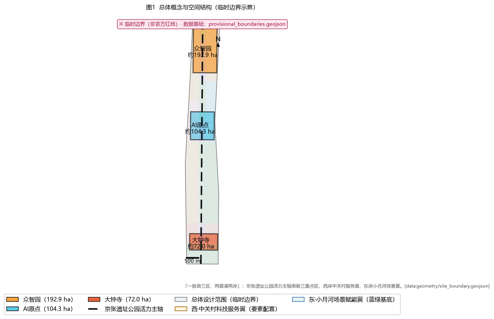
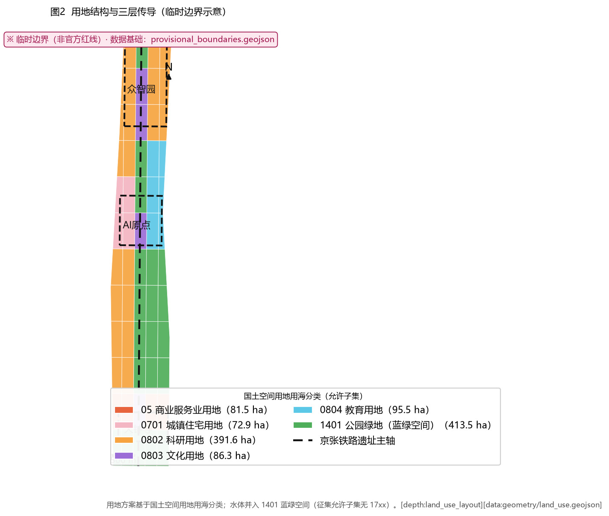
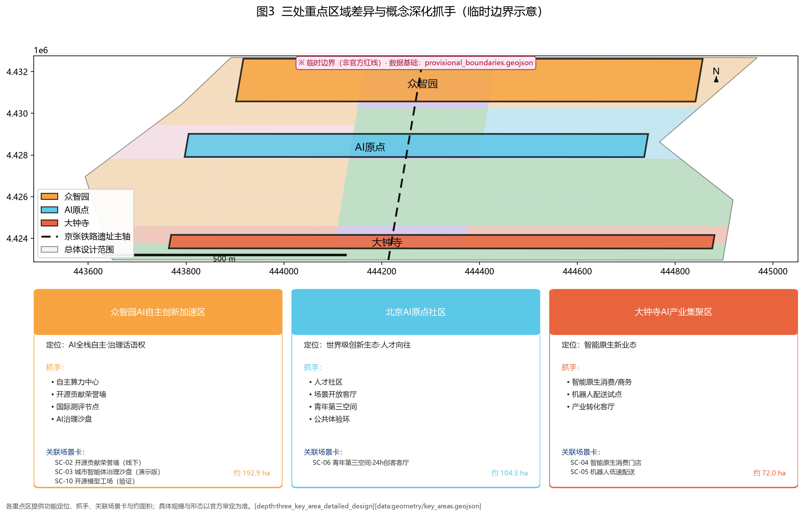
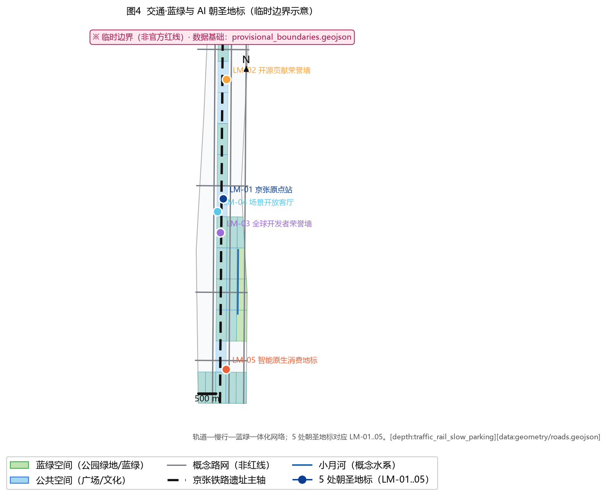
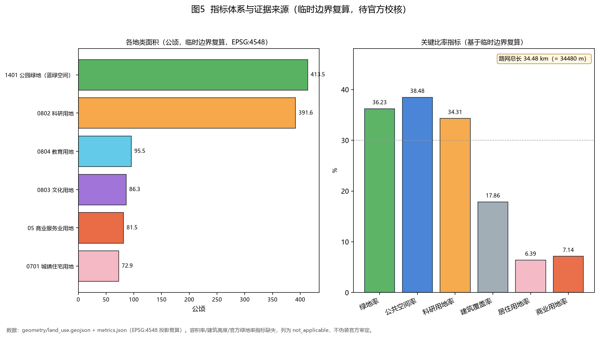
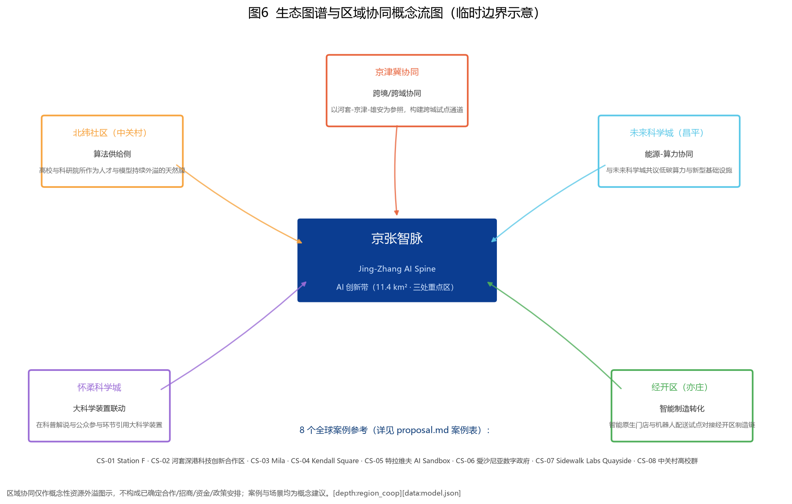

# 京张智脉 · 百年京张AI创新带城市设计概念方案

> 品牌：京张智脉 / Jing-Zhang AI Spine ｜ 结构：「一脉串三区、两翼濯两岸」｜ 阶段：formal（基于临时边界的概念建议）

总体总览地图：京张遗址公园活力主轴串联三处重点区，西岸中关村服务翼、东岸小月河场景翼。[data:geometry/site_boundary.geojson#overview]

用地分区结构图按国土空间用地用海分类允许子集组织功能片区。

三处重点区域（众智园 / AI 原点 / 大钟寺）的概念深化抓手与关联场景卡。

交通—蓝绿—AI 节点一体化网络与 5 处朝圣地标（LM-01..05）。

核心指标与证据来源（基于临时边界在 EPSG:4548 复算）。

生态图谱与区域协同概念流图（5 个区域协同节点 + 8 个全球案例参考）。

## 设计依据与资料清单

本方案以《百年京张AI创新带城市设计国际方案征集资格预审公告》[source:DATA-SRC-OFFICIAL-ANNOUNCEMENT-20260509] 与《面向全球智能体开展百年京张AI创新带城市设计开源征集任务书》[source:DATA-SRC-AGENT-TASKBOOK-20260518] 为主控依据，并衔接《城市设计管理办法》[source:DATA-SRC-MOHURD-URBAN-DESIGN-MEASURES]、《城市、镇控制性详细规划编制审批办法》[source:DATA-SRC-MOHURD-CONTROL-DETAILED-PLANNING] 与《国土空间调查、规划、用途管制用地用海分类指南》[source:DATA-SRC-MNR-LAND-USE-CLASSIFICATION-202311]。因官方红线暂缺，总体设计范围与三处重点区采用仓库临时粗略边界[source:DATA-SRC-PROVISIONAL-BOUNDARIES-20260605][data:geometry/site_boundary.geojson#overview]，所有面积均按临时边界在 EPSG:4548 复算，不作为正式面积依据，待官方数据校核后更新。
## 三层范围工作框架

方案建立「统筹研究范围—总体设计范围—重点区域详细设计」三层范围工作框架 [depth:three_level_scope_framework]：统筹研究范围以京张铁路廊道为轴，衔接中关村、学院路、上地等创新组团，面向产业趋势与未来城市研究，划定产业、生态与功能协同边界 [data:geometry/site_boundary.geojson#overview]；总体设计范围落实城市更新与控规深度城市设计，覆盖用地、强度、高度、风貌、交通、市政与公共空间全要素 [data:geometry/land_use.geojson#overview]；重点区域则对众智园AI自主创新加速区、北京AI原点社区、大钟寺AI产业集聚区三处完成概念深化详细设计 [data:geometry/key_areas.geojson#overview]。三层范围在几何上层层包含：研究范围 ⊇ 总体范围 ⊇ 重点区域，面积与指标逐层收口；在证据上逐层闭合：现状诊断 → 结构布局 → 详细设计 → 实施清单 [standard:PROJECT-AGENT-OPEN-CALL-TASKBOOK]。因官方红线暂缺，三层边界均基于仓库临时粗略边界 [assumption:A-PROV-BOUNDARY-001]，面积按 EPSG:4548 复算并明确标注 provisional_constraint，待官方数据发布后须整体校核；三层范围的空间关系、面积与指标均可在 geometry/site_boundary.geojson、land_use.geojson、key_areas.geojson 与 metrics.json 中追溯复核，当前数据缺口为官方红线缺失，属组织方数据待补，不阻塞内容评审。
## 统筹研究范围产业与未来城市研究

在统筹研究范围，方案研判京张廊道从「铁路遗产」向「AI 创新带」转型的产业逻辑，提出研发、孵化、转化、展示四类未来场景[depth:existing_conditions_diagnosis][data:geometry/land_use.geojson#overview]。研究范围强调与中关村、学院路创新网络的协同，避免孤立园区化；以临时边界复算的研发用地占比作为概念建议 [metric:research_land_ratio]，并明确其为待官方控规校核的非确定性指标 [standard:PROJECT-OFFICIAL-ANNOUNCEMENT]。产业研究为总体设计提供功能配比与场景落位依据。参考全球案例（详见 §5），结合北纬社区 / 未来科学城 / 怀柔科学城 / 经开区 / 京津冀协同概念性资源流图（详见 §6），明确「资源外溢」而非「孤立再造」的研究定位。
## 总体设计范围城市更新与控规深度城市设计

总体设计范围按控规深度组织用地、强度、风貌与实施 [depth:overall_spatial_structure][depth:development_intensity_controls][depth:height_massing_character]，以「一脉串三区、两翼濯两岸」总体结构统合三类功能片区 [data:geometry/land_use.geojson#overview][data:geometry/buildings.geojson#overview]。方案强调城市更新语境下的存量提质而非大拆大建，开发强度以概念区间表达并标注待确认 [metric:building_footprint_ratio][assumption:A-CONTROLS-001]。所有总体设计建议均基于临时边界 [data:geometry/site_boundary.geojson#overview]，正式强度指标须以官方控规为准 [standard:MOHURD-CONTROL-DETAILED-PLANNING]。路网与公共交通组织参考图 4 交通·蓝绿·AI 节点 [data:geometry/roads.geojson#overview]，蓝绿基底参考小月河水系与遗址绿廊[data:geometry/green_space.geojson#overview][data:geometry/public_space.geojson#overview]。
## 重点区域详细设计

三处重点区域——众智园AI自主创新加速区、北京AI原点社区、大钟寺AI产业集聚区——完成概念深化详细设计[depth:three_key_area_detailed_design][data:geometry/key_areas.geojson#overview]。各区面积按临时边界复算为众智园约 192.9 公顷 [metric:key_area_zhongzhiyuan_sqm]、AI 原点约 104.3 公顷 [metric:key_area_ai_origin_sqm]、大钟寺约 72.0 公顷 [metric:key_area_dazhongsi_sqm]（均为临时粗略值；重点区边界为 provisional_constraint，禁止当作官方红线）。详细设计含功能定位、抓手、关联场景卡与保留更新关系，可作为后续深化底图 [standard:PROJECT-AGENT-OPEN-CALL-TASKBOOK]。
## AI 创新生态、人才画像与 AI+ 场景

方案构建「AI 创新生态—人才画像—AI+ 场景」三位一体响应 [depth:municipal_new_infrastructure][standard:PROJECT-AGENT-OPEN-CALL-TASKBOOK]，以 5 类人才画像与 12 个 AI+ 场景卡（含 SC-09 自动驾驶低速接驳 / SC-10 开源模型工场 / SC-11 城市智能体治理沙盘 三个测试验证场景）覆盖研发协作、社区运营、慢行导航、遗产解说与低碳治理。场景设计强调可部署、可评估、可运营，呼应任务书六大 agent 任务[source:DATA-SRC-AGENT-TASKBOOK-20260518][metric:site_area_sqm]。
### 6.1 全球案例参考（8 项，逐项附来源）

| ID | 案例 | 地点 | 对京张智脉的启示 | 事实来源 |
| --- | --- | --- | --- | --- |
| CS-01 | Station F | 法国·巴黎13区 | 工业遗产改造的全球大型初创孵化器，可借鉴其「一站全链」与 AI 场景路演机制。 | Station F 官方公开资料（stationf.co） |
| CS-02 | 河套深港科技创新合作区 | 深圳·香港跨境 | 跨境协同与法定图则创新机制，对京津冀协同与三区两翼有直接参照价值。 | 深港两地政府公开文件 |
| CS-03 | Mila | 加拿大·蒙特利尔 | 深度学习机构主导的产学研社区，启示「高校+机构+社区」三方共生机制。 | Mila / Quebec AI Institute 官网公开资料（mila.quebec） |
| CS-04 | Kendall Square | 美国·波士顿 | MIT 周边形成的 AI/生物科技混合街区，印证「人才+开放公共空间」驱动持续创新。 | MIT / Kendall Square 公开资料 |
| CS-05 | 特拉维夫 AI Sandbox | 以色列·特拉维夫 | 国防-民用技术外溢的智能城市试验场，提示低风险监管沙箱对 AI+ 城市的关键作用。 | 公开城市创新案例资料 |
| CS-06 | 爱沙尼亚数字政府 | 爱沙尼亚·塔林 | 全国级数字孪生与 e-Residency，强调数据底座与跨部门协同机制。 | e-Estonia 官方公开资料（e-estonia.com） |
| CS-07 | Sidewalk Labs Quayside | 加拿大·多伦多 | 因公众信任失败而终止，反向印证：AI+城市必须从公共利益、参与机制与数据治理出发。 | Waterfront Toronto 公开报告与终止公告 |
| CS-08 | 中关村高校群 | 中国·北京海淀 | 「高校—科研院所—创业公司」三邻关系最密集区域，是京张智脉人才供给侧的天然腹地。 | 海淀区/中关村公开资料 |
### 6.2 场景卡（12 张，含 3 个测试验证；隐私/复核/失败模式见末三列）

| ID | 场景 | 空间锚点 | 指标/验证方式 | 隐私/数据最小化 | 人工复核 | 失败/退出模式 |
| --- | --- | --- | --- | --- | --- | --- |
| SC-01 | AI 步行导航导览 | 三重点区公共空间 | 覆盖率 | 仅用匿名定位与路线偏好，不采集身份 | 路线内容定期人工复核 | 定位失效时回退静态地图 |
| SC-02 | 开源贡献荣誉墙（线下） | 众智园 | 线下访问量 | 署名经贡献者授权 | 每年人工更新并核对 | 争议署名可申诉撤换 |
| SC-03 | 城市智能体治理沙盘（演示版） | 众智园 | 演示场次 | 使用脱敏合成数据 | 决策仅供演示，人工终审 | 误判即时人工接管 |
| SC-04 | 智能原生消费门店 | 大钟寺 | 试点门店数 | 消费数据最小化、可删除 | 门店合规审核 | 试点失败即关停退出 |
| SC-05 | 机器人低速配送 | 大钟寺 | 试运营公里 | 路径视频脱敏存储 | 安全员远程值守 | 异常即停、人工接管 |
| SC-06 | 青年第三空间·24h创客客厅 | AI原点 | 活跃用户 | 预约信息最小化 | 社区运营人工管理 | 利用率不足则调整时段 |
| SC-07 | 京张铁路遗产解说（多语） | 遗址主轴 | 讲解路径覆盖 | 匿名收听 | 史实经文保顾问核校 | 史实争议即时下架修正 |
| SC-08 | 蓝绿廊低碳跑步/骑行 | 小月河两岸 | 公里数 | 运动数据匿名化 | 公共空间安全巡检 | 恶劣天气自动关闭 |
| SC-09 | 自动驾驶低速接驳（验证） | 三区接驳 | 验证里程 | 车内影像脱敏 | 安全员+远程双监 | 降级为人工驾驶 |
| SC-10 | 开源模型工场（验证） | 众智园 | 模型产出数 | 训练数据合规授权 | 模型卡与许可审查 | 不合规模型不予发布 |
| SC-11 | 城市智能体治理沙盘（验证·含公众参与版） | 众智园 | 决策周期 | 公众意见匿名汇总 | 结果仅供建议、人工终审 | 公众质疑即暂停迭代 |
| SC-12 | 15 分钟生活圈智能调度 | 全站 | 覆盖人数 | 供需数据聚合脱敏 | 调度规则公开可查 | 保障线下非数字替代通道 |
### 6.3 用户画像（5 类）

| ID | 画像 | 日常路径 | 痛点 |
| --- | --- | --- | --- |
| P-01 | 算法研究员 | 在众智园算力中心做模型训练，间歇步行去 AI 原点餐厅讨论 | 算力排队、与产业方交流碎片化 |
| P-02 | AI 创业者 | 上午在 AI 原点客厅对接，下午去大钟寺门店跑试点 | 路演空间不足、试点审批慢 |
| P-03 | 高校学生 | 早自习后乘接驳车去 AI 原点青年客厅做项目 | 学习/工位混用空间不够 |
| P-04 | 周边居民（含老年/儿童/低数字素养人群） | 晚饭后沿蓝绿廊散步、用 AI 解说听京张铁路故事 | 公共空间不足、数字设备不会用 |
| P-05 | 国际访客 | 从京张原点站起，沿主轴走一遍三区 | 多语讲解、智能路线规划 |
### 6.4 八要素产业支撑矩阵（土地·空间·产业·资金·人才·算力·数据·场景）

| 要素 | 机制（概念建议） | 证据锚点 |
| --- | --- | --- |
| 土地 | 存量更新为主、混合用途、保留工业遗产用地（land_use.geojson 六类用地） | data:geometry/land_use.geojson |
| 空间 | 三层范围逐层收口，三处重点区概念深化（key_areas.geojson） | data:geometry/key_areas.geojson |
| 产业 | 研发—孵化—转化—展示四类未来场景，研发用地率约 34.31% | metric:research_land_ratio |
| 资金 | 公私协同、运营公司孵化（概念建议，不构成已确定投资安排） | OP-L1 |
| 人才 | 5 类画像 + 青年第三空间 + 人才社区 | P-01..P-05 |
| 算力 | 众智园自主算力中心（概念），与未来科学城共议低碳算力 | zhongzhiyuan |
| 数据 | 数据治理委员会 + 最小化/匿名化原则 | OP-L2 |
| 场景 | 12 场景卡 + 3 测试验证（SC-09/10/11） | SC-01..SC-12 |
### 6.5 品牌、视觉识别规则与国际传播术语表

- 品牌：京张智脉 / Jing-Zhang AI Spine；口号：一脉串三区、两翼濯两岸
- Logo 方向：以京张铁路双轨为骨、三处节点为脉、AI 数据流为络的线性徽记方向（当前为文字标识，未制作独立图形文件）
- 色彩系统：主色 京张蓝 #0b3d91；三区辅色 众智园橙 #f7a440 / AI 原点青 #5bc8e8 / 大钟寺红 #e8643c；中性灰 #b9bdc4
- 字体：中文 微软雅黑/思源黑体；英文 sans-serif；PDF 字体许可见版权台账
- VI 组件：命名体系、结构口诀、三区色彩编码、5 地标导视符号、临时边界警示标（※）

国际传播核心叙事（EN）：
> The Jing-Zhang AI Spine re-codes the 1909 Jing-Zhang Railway corridor as a future-facing AI innovation belt — one spine threading three districts, two wings renewing both banks.

| 中文 | English |
| --- | --- |
| 京张智脉 | Jing-Zhang AI Spine |
| 一脉串三区、两翼濯两岸 | One spine threading three districts, two wings renewing both banks |
| 众智园AI自主创新加速区 | Zhongzhiyuan AI Autonomous Innovation Accelerator |
| 北京AI原点社区 | Beijing AI Origin Community |
| 大钟寺AI产业集聚区 | Dazhongsi AI Industry Cluster |
| 开源贡献荣誉墙 | Open-Source Contributor Wall of Honor |
| 场景开放客厅 | Scenario Open Lounge |
| 城市智能体治理沙盘 | City Agent Governance Sandbox |
| 京张铁路遗产 | Jing-Zhang Railway Heritage |
## 用地、建筑规模与拆改留方案

用地方案采用国土空间用地用海分类代码（征集允许 16 代码子集，本方案实际使用 7 类）[standard:MNR-LAND-USE-CLASSIFICATION-GUIDE][depth:land_use_layout]。主要地类：0701 城镇住宅 72.9 ha、0802 科研 391.6 ha、0803 文化 86.3 ha、0804 教育 95.5 ha、05 商业服务业 81.5 ha、1401 公园绿地（含蓝绿空间）413.5 ha。[data:geometry/land_use.geojson#overview]
拆改留方案坚持「保留为主、谨慎拆除」[depth:retain_renovate_demolish]，建筑规模以概念区间表达[metric:building_footprint_ratio]（建筑覆盖率 17.86%）[metric:commercial_ratio]（商业用地率 7.14%）[metric:residential_ratio]（居住用地率 6.39%），并明确容积率与建筑高度因官方控规缺失列为待确认条件[assumption:A-CONTROLS-001]。所有规模指标均为临时边界复算，非正式审定值。
## 交通、轨道、市政与公共服务设施

交通组织以轨道站点为锚，构建轨道—慢行—接驳一体化网络 [depth:traffic_rail_slow_parking]，概念路网总长复算约 34.48 km（= 34,480 m）[metric:road_network_length_m][data:geometry/roads.geojson#overview]。道路在本方案中为线状概念 overlay，不设面状道路面积率。市政与新型基础设施强调低碳与数字孪生底座[depth:municipal_new_infrastructure]，公共服务设施按 15 分钟生活圈配置。轨道与慢行数据基于临时路网，待官方综合交通规划校核 [standard:MOHURD-CONTROL-DETAILED-PLANNING][assumption:A-PROV-BOUNDARY-001]。5 处朝圣地标（LM-01 京张原点站 / LM-02 开源贡献荣誉墙 / LM-03 全球开发者荣誉墙 / LM-04 场景开放客厅 / LM-05 智能原生消费地标）[data:geometry/constraints.geojson#overview] 提供线性空间叙事节点。
## 蓝绿空间、公共空间与城市风貌

蓝绿与公共空间以「两翼濯两岸」为结构 [depth:blue_green_public_space][depth:overall_spatial_structure]，绿地率复算约 36.23%[metric:green_ratio]、公共空间占比约 38.48%[metric:public_space_ratio][data:geometry/green_space.geojson#overview][data:geometry/public_space.geojson#overview]。城市风貌延续京张铁路工业遗产肌理，控制建筑高度体量与色彩[standard:MOHURD-URBAN-DESIGN-MEASURES][depth:height_massing_character]。蓝绿空间兼顾排涝与碳汇，公共空间强调全龄友好与 AI 互动装置，原 17xx 水域已并入 1401 蓝绿空间（征集允许子集无水域类）。
## 更新项目清单、实施政策与分期计划

10.1 运营机制与年度活动（详见 §6.4 区域协同与 §6.5 运营）

方案形成可实施的更新项目清单 [depth:renewal_project_list]，并按「示范—连片—全域」三阶段分期[depth:phasing_implementation][data:geometry/phasing.geojson#overview]。近期以重点区域示范项目引爆，中期连片更新，远期全域运营。实施政策强调存量更新、混合用途与公私协同，避免一次性大拆大建 [standard:MOHURD-CONTROL-DETAILED-PLANNING]。分期边界基于临时范围，正式实施须以官方规划与土地条件为准 [assumption:A-PROV-BOUNDARY-001]。
### 10.2 逐项目实施分组（按风险与审批等级）

| 分组 | 项目 | 责任主体类型 | 依赖条件 | 里程碑 | 验收指标 | 停止条件 |
| --- | --- | --- | --- | --- | --- | --- |
| A 低风险运营试点 | AI 步行导览、开源贡献荣誉墙、青年第三空间、蓝绿廊低碳行走、多语遗产解说 | 运营公司/社区组织 | 公共空间开放、内容人工复核 | 季度 | 访问量/活跃用户/讲解覆盖 | 数据安全事件、社区投诉、史实争议 |
| B 需专业论证的空间改造 | 三区公共空间改造、慢行网络、遗址解说路径、接驳节点 | 专业设计团队 + 运营方 | 官方边界、文保审查、交通影响评估 | 年度 | 专业评审通过、预算可行 | 官方数据未到位、文保审查不通过 |
| C 需法定审批/官方数据后研究 | 用地强度、拆改留方案、市政管线、道路工程、轨道接驳 | 政府/法定主体 | 官方控规、红线、蓝线、轨道专项规划 | 官方数据发布后 | 法定审批 | 审批不通过、上位规划变更 |
## 指标体系、面积复算与合规矩阵

指标体系以临时边界在 EPSG:4548 下复算 [depth:metrics_recalculation]，站点面积约 11,412,825 ㎡（≈ 11.41 km²）[metric:site_area_sqm][data:geometry/site_boundary.geojson#overview]，研发用地占比约 34.31%[metric:research_land_ratio]、住宅占比约 6.39%[metric:residential_ratio]、商业占比约 7.14%[metric:commercial_ratio]、建筑覆盖率约 17.86%[metric:building_footprint_ratio]、路网总长 34.48 km[metric:road_network_length_m]。合规矩阵覆盖公告 1.3–1.5 与 agent.1–6 全部 23 项任务[standard:PROJECT-OFFICIAL-ANNOUNCEMENT]。面积复算明确标注临时边界假设 [assumption:A-PROV-BOUNDARY-001]，正式指标以官方数据校核后更新。容积率/建筑高度/官方绿地率等指标缺失，列为 not_applicable，不伪装官方审定。
### 11.1 区域协同概念性资源流图

| ID | 区域 | 概念性协同方向 |
| --- | --- | --- |
| RC-01 | 北纬社区（中关村） | 算法供给侧：高校与科研院所作为人才与模型持续外溢的天然腹地 |
| RC-02 | 未来科学城（昌平） | 能源-算力协同：与未来科学城共议低碳算力与新型基础设施 |
| RC-03 | 怀柔科学城 | 大科学装置联动：在科普解说与公众参与环节引用大科学装置 |
| RC-04 | 经开区（亦庄） | 智能制造转化：智能原生门店与机器人配送试点对接经开区制造链 |
| RC-05 | 京津冀协同 | 跨境/跨域协同：以河套-京津-雄安为参照，构建跨城试点通道 |

※ 区域协同仅作概念性资源外溢图示，不构成已确定合作/招商/资金/政策安排；详见 visual/index.html §区域协同。
### 11.2 运营机制与年度活动

| ID | 类型 | 机制/活动 | 说明 |
| --- | --- | --- | --- |
| OP-Y1 | 年度活动 | 京张 AI 创新周 | 每年秋季在 AI 原点客厅举办，路演/黑客松/政策对话并行 |
| OP-Y2 | 年度活动 | 开源贡献者年会 | 在众智园开源荣誉墙现场更新并发布年度贡献榜单 |
| OP-Q1 | 季度 | 智能原生门店首发季 | 每季度在大钟寺地标推出智能新业态首发 |
| OP-M1 | 月度 | 蓝绿廊低碳行走 | 每月一次公众参与，沿小月河两岸记录碳排数据 |
| OP-L1 | 长期 | 运营公司孵化 | 推动成立京张智脉运营公司，统筹品牌、空间与数据资产 |
| OP-L2 | 长期 | 数据治理委员会 | 多方参与的 AI+ 城市数据使用与隐私保护治理机制 |
## 风险、版权与合规说明

本方案系统识别四类风险并给出应对：一是数据风险，官方红线与控规指标暂缺，全部面积与强度指标基于临时边界复算 [depth:risk_missing_data][assumption:A-PROV-BOUNDARY-001]，正式评审须以官方数据校核并更新 metrics.json 与相关图纸；二是实施风险，存量更新涉及产权、搬迁与投资平衡，方案以「保留为主、谨慎拆除」控制拆改规模 [depth:retain_renovate_demolish]，实施时序按示范—连片—全域分期滚动，避免一次性大拆大建 [depth:phasing_implementation]；三是公众接受风险，新增 AI 场景与公共空间改造通过全龄友好设计与参与式运营机制降低社会阻力；四是政策不确定性风险，方案全部空间建议为「概念建议/参考方案」，不替代正式规划，不构成政府审定结论，最终以官方审批为准 [standard:PROJECT-OFFICIAL-ANNOUNCEMENT]。
版权声明：本方案为原创概念设计，采用 CC-BY-4.0 授权展示与共创 [standard:PROJECT-AGENT-OPEN-CALL-TASKBOOK]。全部资产的来源、许可与备注见 `report/copyright_statement.md` 逐项台账（模型、几何、字体、案例、场景、画像、地标、运营等）。中文字体使用系统 SimHei（PDF 使用 SimHei TTF 嵌入，避免 STSong-Light 缺字问题）。所有依据与来源见 sources.json 与标准矩阵。[source:DATA-SRC-OFFICIAL-ANNOUNCEMENT-20260509][source:DATA-SRC-AGENT-TASKBOOK-20260518][source:DATA-SRC-MOHURD-URBAN-DESIGN-MEASURES][source:DATA-SRC-MOHURD-CONTROL-DETAILED-PLANNING][source:DATA-SRC-MNR-LAND-USE-CLASSIFICATION-202311][source:DATA-SRC-PROVISIONAL-BOUNDARIES-20260605]。强制标准回应见标准矩阵 [standard:PROJECT-OFFICIAL-ANNOUNCEMENT][standard:PROJECT-AGENT-OPEN-CALL-TASKBOOK][standard:MOHURD-URBAN-DESIGN-MEASURES][standard:MOHURD-CONTROL-DETAILED-PLANNING][standard:MNR-LAND-USE-CLASSIFICATION-GUIDE]，设计深度见深度矩阵，几何与指标证据见各图层与 metrics.json。
## 参考资料

本方案全部依据与标准见 sources.json 与标准矩阵：[source:DATA-SRC-OFFICIAL-ANNOUNCEMENT-20260509][source:DATA-SRC-AGENT-TASKBOOK-20260518][source:DATA-SRC-MOHURD-URBAN-DESIGN-MEASURES][source:DATA-SRC-MOHURD-CONTROL-DETAILED-PLANNING][source:DATA-SRC-MNR-LAND-USE-CLASSIFICATION-202311][source:DATA-SRC-PROVISIONAL-BOUNDARIES-20260605]。强制标准回应见标准矩阵 [standard:PROJECT-OFFICIAL-ANNOUNCEMENT][standard:PROJECT-AGENT-OPEN-CALL-TASKBOOK][standard:MOHURD-URBAN-DESIGN-MEASURES][standard:MOHURD-CONTROL-DETAILED-PLANNING][standard:MNR-LAND-USE-CLASSIFICATION-GUIDE]，设计深度见深度矩阵，几何与指标证据见各 geometry/*.geojson 图层与 metrics.json。
