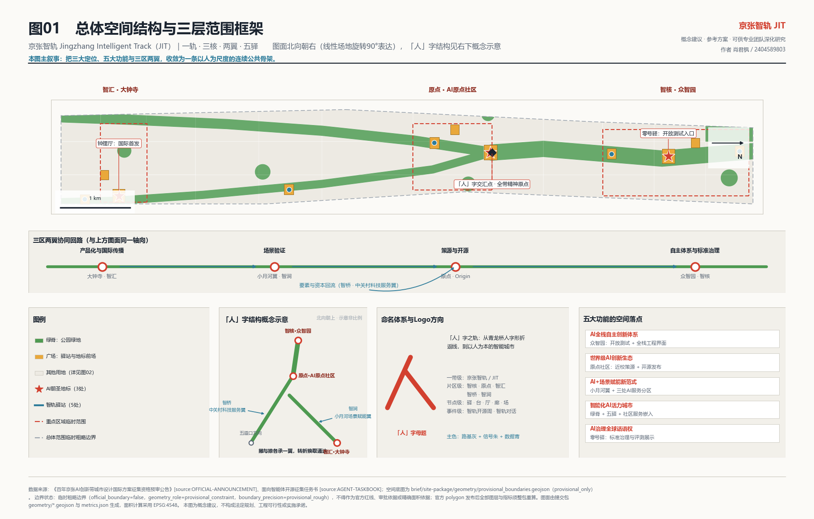
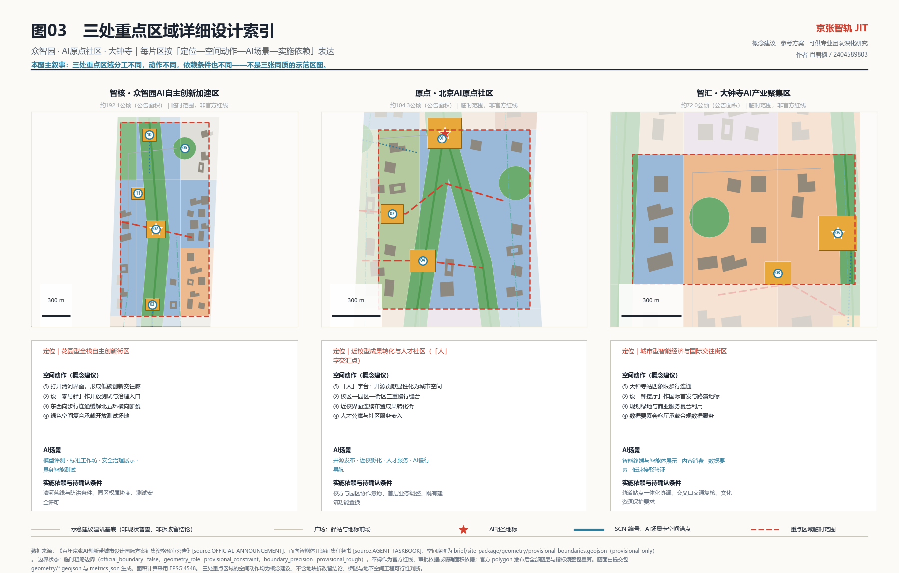
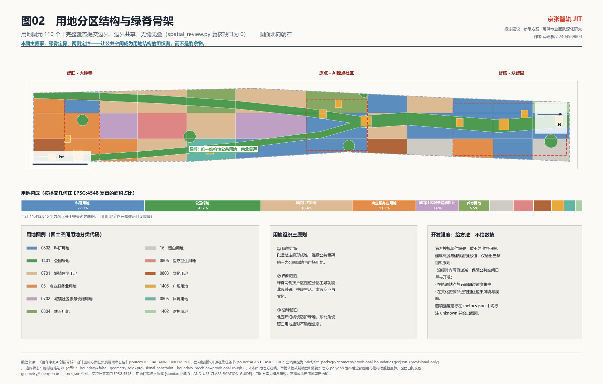
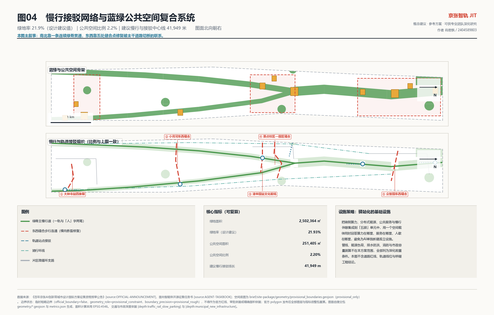
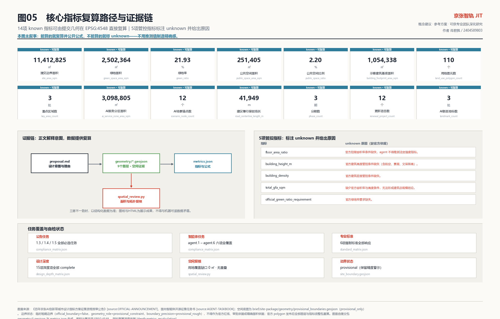

# 京张智轨：以「人」字之轨重构百年京张AI创新带的城市设计概念建议

## 设计依据与资料清单

本方案的第一依据是北京市规划和自然资源委员会海淀分局发布的《百年京张AI创新带城市设计国际方案征集资格预审公告》[source:OFFICIAL-ANNOUNCEMENT]，第二依据是面向全球智能体的开源征集任务书 [source:AGENT-TASKBOOK]，机器可读依据来自站点资料包 [source:SITE-PACKAGE]、公开资料登记表 [source:SOURCE-REGISTRY]、资料导航层 [source:PROCESSED-FACT-PACK]，空间起始条件来自 [source:BOUNDARY-SOURCE] 与 [source:KEY-AREA-SOURCE]，可公开引用的资料范围与提交纪律以公开资料索引内的 [source:PUBLIC-BRIEF]（`brief/public-brief.md`、`brief/README.md`）为准。专业标准响应依据为 [standard:PROJECT-OFFICIAL-ANNOUNCEMENT]、[standard:PROJECT-AGENT-OPEN-CALL-TASKBOOK]、[standard:MOHURD-URBAN-DESIGN-MEASURES]、[standard:MOHURD-CONTROL-DETAILED-PLANNING]、[standard:MNR-LAND-USE-CLASSIFICATION-GUIDE] 和 [standard:MOHURD-ARCH-DESIGN-DEPTH-2016]。

现状诊断按 [depth:existing_conditions_diagnosis] 组织，结论建立在三个可核查的判断上，而不是印象式描述。第一，本地区的核心资产是一条**线**而不是一片地：京张铁路遗址走廊是唯一贯穿全部三层范围、同时连接高校、产业园区、居住社区和商圈的连续公共空间载体，因此本方案把它确定为总体结构的唯一主脊。第二，本地区的核心矛盾是**横向断裂**：走廊被北五环、清华东路、西直门外大街等东西向快速与主干道路多次切断，使南北向的连续体验和东西向的校区—园区—社区联系同时受损，因此"东西缝合、南北贯通"不是修辞而是首要空间任务。第三，本地区的核心机会是**存量而非增量**：三处重点区域均位于建成度很高的城市地区，方案必须以更新、织补、界面开放和运营为主要手段。

必须明确声明数据边界。截至本次提交，组织方尚未提供官方 `SITE_BOUNDARY` 与 `KEY_AREA` 精确 polygon，本方案使用登记为 `provisional_only` 的临时粗略边界 [source:BOUNDARY-SOURCE]、[source:KEY-AREA-SOURCE] 作为生成、展示与自检基础，见 [data:geometry/site_boundary.geojson#SITE-001]。该边界在 EPSG:4548 下复算面积为 [metric:site_area_sqm]，公告文字面积约为 11,400,000 平方米，二者差异属于边界精度缺口而非设计结论。三处重点区域已全部落图，数量为 [metric:key_area_count]，几何见 [data:geometry/key_areas.geojson#PROV-KEY-001]，但 `official_boundary=false`、`geometry_role=provisional_constraint`、`boundary_precision=provisional_rough`。这些临时几何**不得**用作官方红线、审批依据、精确面积依据或法定控制结论；官方 polygon 发布后，用地、绿地、公共空间、建筑、道路、分期与全部指标必须整包重算，而不是只替换单个文件。组织方数据缺口本身不阻断内容评分，但精度警示必须随成果一并保留。

`MOHURD-ARCH-DESIGN-DEPTH-2016` 在仓库中的本地快照状态为 `needs_official_file` / `missing_source_url`，因此本方案只在方法层面响应建筑设计文件深度要求，并把它列为待补官方文件的数据缺口，不据此给出任何建筑工程结论。所有 `background_only` 与 `provisional_only` 资料均未被升级为官方边界、法定控规、正式评分依据或实施承诺。

## 三层范围工作框架

方案按公告确定的三个层次递进组织工作，并用一句话锁定各层的可交付物边界：统筹研究范围（约 43.6 平方公里）交付产业生态与未来城市形态的**判断**；总体设计范围（约 11.4 平方公里）交付城市更新与控规深度城市设计的**结构与图层**；重点区域范围（约 368.4 公顷）交付三处片区的**详细设计动作**。三层不是三套互不相干的图纸，判断决定结构，结构约束动作，动作反过来验证判断是否可实施。该框架由 [depth:three_level_scope_framework] 与 [depth:overall_spatial_structure] 约束，范围索引以 [source:PROCESSED-FACT-PACK] 中的三层范围表为导航，任务依据为 [standard:PROJECT-OFFICIAL-ANNOUNCEMENT]。

### 总体概念、命名体系与视觉识别方向（回应 agent.1）

**总体概念：「人」字之轨。** 京张铁路最著名的工程遗产，是詹天佑在青龙桥一带采用的「人」字形折返线路——用一个转折解决了看似无法逾越的坡度难题。本方案把这个历史原型直接转译为AI时代的城市命题：**「人」字既是京张铁路的技术符号，也是"以人为本"的伦理符号**。人工智能创新带如果只有算力与产业而没有人的尺度，就失去了这条铁路留下的最好一课。因此方案主张：一条以人为尺度的轨，一次以转折换取通达的设计。

**主名称：京张智轨。英文名称：Jingzhang Intelligent Track，缩写 JIT。** "轨"同时指铁路轨迹、创新轨道与城市生长轨迹；缩写 JIT 在计算机语境中指"即时编译"，恰好呼应本方案的核心机制主张——把高校策源的知识**即时编译**为可用的城市空间与开放场景。品牌短名为"智轨 / JIT"。

**命名体系（三级，可延展、可交给专业团队深化）：**

| 层级 | 命名规则 | 具体命名 |
| --- | --- | --- |
| 一带级 | 主名称 + 英文缩写 | 京张智轨 / Jingzhang Intelligent Track（JIT） |
| 片区级 | 单字品牌名 + 官方片区名 | 智核·众智园AI自主创新加速区；原点·北京AI原点社区；智汇·大钟寺AI产业聚集区；智桥·中关村科技服务翼；智涧·小月河场景赋能翼 |
| 节点级 | 后缀词库（驿·台·厅·廊·场） | 「人」字台、零号驿、钟摆厅、清河低碳创新廊、成果发布场 |
| 事件级 | 品牌名 + 活动类型 | 智轨开源周、原点马拉松、智轨对话、场景开放日、轨枕计划 |

**视觉识别与Logo方向（方向性建议，非最终稿）：** 以「人」字折线为唯一母题，取其两笔交汇的锐角作为标志核心；折线可读作三重意象——京张铁路人字形线路、轨道断面、以及两条数据流的汇聚点。延展系统建议：折线角度固定、笔画粗细随尺度变化，形成从徽标到导视、从地面铺装到数字界面的一致语言；主色建议取"路基灰 + 信号朱 + 数据青"三色，其中信号朱来自铁路信号系统，用于强调节点与荣誉标识。片区标识由主标志旋转/截取生成，保证同源可辨。所有字体、图像、商标与肖像在深化阶段必须使用可清权素材，本次提交不附带任何未清权的第三方视觉资产。

### 空间结构：一轨、三核、两翼、五驿

结构由 [data:geometry/site_boundary.geojson#SITE-001] 与 [data:geometry/green_space.geojson#GREEN-001] 共同表达，可读为四个层次：**一轨**为京张遗址走廊形成的连续绿脊主轴，在原点社区北界形成「人」字交汇点，向北为主脊、向西南与东南分出两笔支脊；**三核**为公告确定的三处重点区域，分别承担全栈自主创新与治理话语权、世界级创新生态、智能原生新业态；**两翼**为中关村科技服务翼（要素与资本赋能）与小月河场景赋能翼（场景与活力城市），以「人」字两笔的走向与之衔接；**五驿**为沿轨布置的五处智轨驿站，把慢行节点、端侧算力、公共服务与场景开放叠合为可运营的最小单元。三区两翼的协同回路为：中关村翼输入资本与要素 → 原点社区完成策源与孵化 → 众智园完成自主体系构建与标准治理 → 大钟寺完成产品化与国际路演 → 小月河翼完成场景验证并反馈需求 → 回到原点社区。

| 层级 | 设计问题 | 方案回答 | 数据落点 |
| --- | --- | --- | --- |
| 统筹研究范围 | AI产业生态与未来城市形态如何组织 | 建立"策源—开源—转化—验证—传播"五段创新链与三区两翼协同回路 | [data:geometry/constraints.geojson#AISZ-01]、[metric:ai_service_zone_area_sqm] |
| 总体设计范围 | 更新、用地、交通与风貌如何落图 | 以绿脊为骨架的用地全覆盖分区、慢行接驳网络与三期实施建议 | [data:geometry/land_use.geojson#LU-001]、[data:geometry/roads.geojson#ROAD-001] |
| 重点区域范围 | 三处片区如何达到详细设计深度 | 逐片提出定位、空间动作、AI场景与实施依赖 | [data:geometry/key_areas.geojson#PROV-KEY-002]、[metric:key_area_count] |

## 统筹研究范围产业与未来城市研究

统筹研究范围的任务是回答"世界级AI创新生态如何在既有城市中长出来"。本方案的判断是：海淀不缺策源能力，缺的是**从论文到场景的最短路径**与**可被外部看见的公共界面**。因此产业策略以五段创新链组织：高校院所策源 → 开源协作与人才聚集 → 企业转化与产品化 → 城市场景验证 → 国际传播与招引。五段链条分别锚定在不同空间：策源锚定原点社区近校界面，开源与人才锚定「人」字台与发布场，转化锚定众智园与大钟寺，验证锚定小月河翼与三处AI服务分区，传播锚定钟摆厅与全线活动路线。这一链条不新增伪精确红线，而是通过 [standard:MOHURD-URBAN-DESIGN-MEASURES] 要求的公共空间与风貌统筹，回接到 [depth:overall_spatial_structure] 与可见图层。

### 全球AI创新生态案例借鉴（回应 agent.2）

以下案例均为公开报道与机构公开信息中广为人知的**机制**，其资料属性登记为 background_only，见 [source:GLOBAL-CASE-BACKGROUND]。本方案只借鉴机制、不引用任何投资额、产值、企业名单或财政承诺数据；案例事实须在深化阶段以官方或权威公开资料核验（见 `assumptions.json` 中 A-CASES-001）。选择标准是与本地区的三重同构性：铁路/工业遗存、大学邻近、存量更新。

| 案例 | 类型 | 可借鉴机制 | 与京张智轨的对应 |
| --- | --- | --- | --- |
| 伦敦 King's Cross 知识与科技街区（英国） | 铁路货运棚区更新为知识街区 | 公共空间先行、统一统筹主体、历史构筑物再利用后引入科技总部 | 直接对应遗址走廊：先做公共空间与界面，再谈产业入驻 |
| 巴黎 Station F（法国） | 铁路车站巨构改造为创业综合体 | 单一巨构内多加速器共栖、配套国际创业者居住与签证服务 | 对应原点社区"一栋楼即一个生态"的成果转化街 |
| 蒙特利尔 Mila 集群（加拿大） | 学术策源型AI集群 | 研究所为核、长期公共资助、企业实验室邻近布局、以公共宣言确立AI伦理立场 | 对应近校策源与众智园标准治理的组合 |
| 新加坡 one-north 纬壹科技城 | 政府主导混合功能科学城 | 研发—居住—服务高度混合、以弹性用地应对不确定业态 | 对应留白用地与人才居住嵌入策略 |
| 赫尔辛基 Maria 01（芬兰） | 旧医院院区改造为创业园区 | 存量公共建筑改造、城市参与运营、社区型园区氛围 | 对应存量建筑更新与轻量启动路径 |
| 匹兹堡 Hazelwood Green 与机器人生态（美国） | 钢厂棕地更新叠加机器人/自动驾驶研发 | 大学能力 + 棕地空间 + 真实道路测试三者绑定 | 对应产业测试验证场景的空间落位逻辑 |

从案例中提取的共同机制是三条：**公共空间先于产业招引**、**存量空间的弹性权属安排**、**测试场地与大学能力的空间绑定**。这三条构成本方案要素保障建议的骨架：土地与空间以留白用地和存量改造提供弹性；算力与数据以驿站化的端侧算力节点分布式供给，避免单点集中；场景以三处AI服务分区（面积 [metric:ai_service_zone_area_sqm]，见 [data:geometry/constraints.geojson#AISZ-02]）作为开放优先区；人才以近校居住与人才公寓嵌入解决通勤；资金与要素由中关村科技服务翼对接。以上均为机制建议，产业招商、资金支持与政策安排不属于本方案可以确定的事项。

## 总体设计范围城市更新与控规深度城市设计

总体设计范围要求达到控制性详细规划的城市设计深度，本方案按 [standard:MOHURD-CONTROL-DETAILED-PLANNING] 把该深度拆解为可审查对象，并同时声明哪些内容因缺少官方控制条件而必须留白。可交付的部分是：完整闭合的用地结构、以绿脊为骨架的公共空间网络、慢行与接驳组织、示意性建筑基底与更新逻辑、三期实施建议、可复算指标。不可交付的部分是：容积率、建筑高度、建筑密度、退线、道路红线与市政容量等法定管控指标。

用地结构由 [depth:land_use_layout] 约束，几何见 [data:geometry/land_use.geojson#LU-001]，共 [metric:land_use_polygon_count] 个用地图元，完整覆盖提交边界且相互无重叠，由 `scripts/spatial_review.py` 复核确认覆盖缺口为零。结构逻辑是"绿脊定骨、两侧定性"：绿脊及其两笔支脊统一为公园绿地与广场用地，构成南北贯通的公共骨架；绿脊两侧按片区定位分配主导功能——众智园以科研用地为主导，原点社区以科研与教育用地缝合近校界面，大钟寺以商业服务业与文化用地承载智能原生消费与国际交往，中段以居住、社区服务、医疗、体育用地保障日常生活，并在北五环沿线与众智园东北角设置防护绿地与留白用地。

开发强度部分按 [depth:development_intensity_controls] 处理为**方法而非数值**。本方案不给出容积率与高度数字，而是给出三条强度组织原则供专业团队深化：其一，强度沿绿脊向两侧递减，保证公共空间的日照与开敞感；其二，强度在轨道站点与五驿周边适度集中，形成站城一体的紧凑单元；其三，强度在文物与文化资源邻近范围让位于风貌与视廊。这三条原则可在获得官方控规条件后直接转为分区强度上限，而不需要推翻结构。相应的 `metrics.json` 中 `floor_area_ratio`、`building_height_m`、`building_density`、`total_gfa_sqm` 一律标注为 unknown 并给出原因，避免用推测值制造精确感。

## 重点区域详细设计

三处重点区域是必选项，几何见 [data:geometry/key_areas.geojson#PROV-KEY-001]、[data:geometry/key_areas.geojson#PROV-KEY-002]、[data:geometry/key_areas.geojson#PROV-KEY-003]，数量为 [metric:key_area_count]，深度由 [depth:three_key_area_detailed_design] 校核。每处片区均按"定位—空间动作—AI场景—实施依赖—待确认条件"五段表达，避免出现"打造示范区"式的空洞描述。

**智核·众智园AI自主创新加速区（约 192.1 公顷，公告面积）。** 定位为花园型全栈自主创新街区，承担AI全栈自主创新体系与AI治理全球话语权两项功能。空间动作有四：一是沿清河界面打开连续的低碳创新交往廊，把原本背向河道的园区界面转为面向公共空间的展示面；二是在片区中部设置"零号驿"，作为开放测试与标准治理的公共入口（见 [data:geometry/public_space.geojson#PUB-L02]）；三是以东西向步行连通打通园区与两侧城市，缓解北五环带来的横向断裂；四是把绿色空间同时用作开放测试场地，实现绿地的复合利用。AI场景以模型评测、标准制定工作坊、安全治理展示、具身智能公共测试为主。实施依赖为清河蓝线与生态防洪条件、园区权属协商、测试活动的安全与合规许可。待确认条件为控规强度、河道管理要求与轨道接驳可行性。

**原点·北京AI原点社区（约 104.3 公顷，公告面积）。** 定位为近校型成果转化与人才社区，承担世界级AI创新生态功能，是「人」字交汇点所在，也是全带的精神原点。空间动作有四：一是以「人」字台作为地标与荣誉台，把开源贡献显性化为城市空间（见 [data:geometry/public_space.geojson#PUB-L01]）；二是组织校区—园区—街区的三重慢行缝合，重点处理清华东路西口与五道口方向的断点；三是沿近校界面布置成果转化街，将首层空间开放为孵化、法务、知识产权与投融资服务的连续界面；四是以人才公寓与社区服务嵌入解决"住得远、来得慢"的现实问题。AI场景以开源发布、近校孵化、人才服务、AI慢行导航为主。实施依赖为校方与园区的空间协作意愿、首层业态调整、既有建筑的功能置换空间。待确认条件为高校用地边界、权属关系与建筑改造可行性。

**智汇·大钟寺AI产业聚集区（约 72.0 公顷，公告面积）。** 定位为城市型智能经济与国际交往街区，承担智能原生新业态功能。空间动作有四：一是围绕大钟寺站组织四象限步行连通，解决路口对城市功能的切割（见 [data:geometry/roads.geojson#ROAD-006]）；二是设置"钟摆厅"作为国际首发与路演地标，取大钟寺古钟意象转译为AI时代的"节律"符号；三是把规划绿地与商业服务复合利用，形成可展示、可消费、可停留的连续界面；四是以数据要素会客厅承载合规前提下的数据与数字资产服务展示。AI场景以智能终端与智能体展示、内容消费、数据要素服务、低速接驳验证为主。实施依赖为轨道站点一体化协调、交叉口交通组织复核、文化资源保护要求。待确认条件为文物保护范围与建设控制地带的官方边界、轨道与市政管线条件。

三处片区的共同要求是：所有空间动作均表述为概念建议与参考方案，可供专业团队深化研究；不涉及具体地块的拆改留结论、桥隧与地下空间工程可行性判断，也不擅自改造企业建筑或权属空间。

## AI 创新生态、人才画像与 AI+ 场景

本章回应 agent.3，并把"场景"从口号还原为可审查的设计对象。原则有三：数据最小化与公开来源优先；每个场景必须有可运营主体与退出机制；每个场景必须保留人工复核环节，AI 只增强人的判断而不替代审批。场景的空间锚点已全部进入结构化图层，数量为 [metric:scenario_node_count]，见 [data:geometry/constraints.geojson#SCN-01]，超过任务书不少于10张场景卡的要求。

### 六类用户画像

| 画像 | 典型需求 | 空间响应 | 隐私与自检边界 |
| --- | --- | --- | --- |
| 开源开发者与独立研究者 | 成果发布、协作、评测、社区声誉 | 「人」字台荣誉台、开源发布厅、夜间协作空间 | 不采集个人行为轨迹；贡献展示须本人授权，活动数据仅做聚合统计 |
| 初创团队创始人与算法工程师 | 低成本办公、算力入口、可用的试验场 | 成果转化街、端侧算力驿站、零号驿测试场 | 算力与数据服务另行授权；测试数据不得二次商用 |
| 头部企业研发与商务人员（含国际访客） | 展示、洽谈、国际接待、招聘 | 钟摆厅国际首发厅、数据要素会客厅、站点接驳 | 企业标识与案例须清权；不展示未授权客户信息 |
| 高校师生与青年研究者 | 成果转化、跨校协作、日常慢行 | 校区—园区慢行缝合、近校转化街、AI教育体验点 | 校园数据与科研成果需授权；学生身份信息不进入场景系统 |
| 周边社区居民（含老年与儿童） | 通勤、休闲、社区服务、低扰动更新 | 绿脊慢行环、社区服务嵌入、活动分级与夜间照明分区 | 不将居民画像用于商业推荐；儿童与老年数据不采集 |
| 城市运维与治理人员 | 设施维护、公共安全、活动运营 | 五驿运维支点、场景开放管理界面 | 治理类AI输出只作为辅助建议，须人工确认后执行 |

### 十二张AI场景卡

| 编号 | 场景 | 空间锚点 | 服务对象 | 数据来源与隐私边界 | 人工复核 | 建议运营主体 |
| --- | --- | --- | --- | --- | --- | --- |
| 01 | 开源发布厅 | 原点社区「人」字台 | 开发者、高校、初创 | 自愿提交的公开成果数据 | 发布内容人工审核 | 开源社区联合体 |
| 02 | 安全治理与红队评测沙盒 | 众智园零号驿 | 企业、评测机构、监管 | 受控测试数据，不出场 | 评测结论专家复核 | 标准与评测机构 |
| 03 | 端侧算力驿站 | 众智园南门户 | 初创、开发者、公共服务 | 不采集用户内容数据 | 算力调度异常人工介入 | 园区平台公司 |
| 04 | AI慢行导航与无障碍诊断 | 清华园站文化前场 | 居民、师生、访客 | 公开地图与匿名聚合客流 | 断点结论现场复核 | 街道与市政单位 |
| 05 | 钟摆厅国际首发与路演 | 大钟寺钟摆厅前场 | 企业、投资、媒体、国际来访 | 参与者自愿登记信息 | 内容与版权人工审核 | 产业促进机构 |
| 06 | 清河低碳创新廊 | 众智园清河界面 | 居民、园区员工 | 公开环境与能耗指标 | 生态影响人工评估 | 园区与水务协作 |
| 07 | 近校成果转化街 | 原点社区发布场 | 高校团队、投资、法务 | 授权后的成果信息 | 转化协议人工把关 | 高校技术转移机构 |
| 08 | 数据要素会客厅 | 大钟寺会客厅前场 | 企业、数据服务方 | 仅使用已授权、可审计数据 | 合规审查前置 | 数据交易与合规机构 |
| 09 | AI生活服务样板街 | 小月河场景开放场 | 居民、青年、家庭 | 最小必要业务数据 | 服务纠错人工响应 | 街道与运营企业 |
| 10 | 全球AI活动周体验路线 | 北五环门户至大钟寺全线 | 公众、国际访客 | 公开活动信息 | 活动安全人工值守 | 活动运营联合体 |
| 11 | 具身智能公共空间测试场 | 众智园标准治理前场 | 机器人企业、科研团队 | 测试场内受控感知数据 | 安全员全程在场 | 园区与测试机构 |
| 12 | 低速接驳与微循环验证场 | 大钟寺站四象限 | 通勤者、企业、物流 | 匿名化运行数据 | 交通安全人工复核 | 交通管理与运营方 |

### 三个产业测试验证场景

**其一，具身智能与服务机器人公共空间测试场（锚定 SCN-11）。** 测试内容为服务机器人在真实但受控的公共空间中的导航、避障与人机交互；空间条件为绿脊内可临时围合、可分级开放的场地；准入边界为限定时段、限定区域、公示告知、安全员在场；评估指标为人机冲突事件数、任务完成率与公众接受度；退出机制为出现安全事件即刻暂停并复盘。**其二，低速接驳与微循环验证场（锚定 SCN-12）。** 测试内容为大钟寺站周边低速接驳与末端物流；空间条件为四象限步行连通与微循环支路；准入边界为低速限定、路权分离、不占用无障碍通行空间；评估指标为接驳时耗、准点率与冲突点数量；退出机制为交通管理部门可随时终止。**其三，公共服务智能体评测沙盒（锚定 SCN-02）。** 测试内容为面向政务、生活与医疗健康服务的智能体在真实咨询场景中的可靠性与可解释性；空间条件为零号驿内的封闭评测空间；准入边界为不使用个人隐私数据、不接入未授权业务系统；评估指标为答复准确率、拒答恰当率与人工接管率；退出机制为不达标即退回实验室。三个场景均为测试与验证性质，不得表述为已批准运营。

## 用地、建筑规模与拆改留方案

用地分类严格采用 [standard:MNR-LAND-USE-CLASSIFICATION-GUIDE] 的用地代码语义，几何见 [data:geometry/land_use.geojson#LU-002]，深度由 [depth:land_use_layout] 与 [depth:development_intensity_controls] 约束。用地图元共 [metric:land_use_polygon_count] 个，覆盖完整、边界共享、无缝无叠。用地组织的核心决策是把"绿脊"设为唯一的结构性公共用地，其余功能围绕它分层布置，从而使公共空间成为用地结构的组织者而不是剩余物。

建筑部分按 [depth:height_massing_character] 与 [depth:retain_renovate_demolish] 组织，几何见 [data:geometry/buildings.geojson#BLDG-001]，示意基底面积为 [metric:building_footprint_area_sqm]。**必须强调：该图层是示意性建议基底，不是现状建筑普查成果，也不是任何地块的拆改留结论。** 在缺少现状建筑、权属、控规与工程条件的前提下，本方案只提供"拆改留"的**判别方法**：以居住、留白与防护绿地范围内的建筑为"以保留为主，低扰动更新并嵌入公共服务"；以文化用地内建筑为"保护性利用与功能活化"；以教育与科研界面建筑为"功能改造与首层界面开放"；其余为"功能置换、更新改造或织补新建作为研究方向"。每个建筑要素均带 `renewal_suggestion_zh` 与 `is_statutory_conclusion=false` 属性，便于专业团队逐条替换为经核实的结论。

建筑风貌与体量按 [standard:MOHURD-URBAN-DESIGN-MEASURES] 的城市设计统筹要求给出引导方向而非数值：沿绿脊界面强调连续、通透与人的尺度，鼓励底层架空与首层开放；轨道站点与五驿周边允许适度紧凑与竖向标志性；文化资源邻近范围以低平体量、坡屋顶与材质呼应铁路工业遗存。建筑设计文件深度相关要求参照 [standard:MOHURD-ARCH-DESIGN-DEPTH-2016]，但如前所述该标准本地快照缺失官方正文，故仅作方法层面响应，任何建筑规模、层数与结构结论均待官方条件补齐后另行确定。

## 交通、轨道、市政与公共服务设施

交通组织按 [depth:traffic_rail_slow_parking] 组织，几何见 [data:geometry/roads.geojson#ROAD-001]，建议中心线总长为 [metric:road_centerline_length_m]。本方案不涉及道路线形、轨道线位、桥隧工程与红线结论，只提出慢行与接驳的组织建议，分四类：**主脊与两笔支脊的绿道**构成南北贯通骨架；**五条东西向步行连通**分别处理众智园、原点社区、清华园站、小月河与大钟寺站的横向断裂，是"东西缝合"的具体落点；**四条轨道接驳线**连接北五环门户、众智园南门户、五道口方向与大钟寺站，强化站城一体；**微循环支路与骑行环线**承担片区内部可达性与非机动车通行。停车与非机动车停放建议以站点周边集约供给、结合五驿设置规范停放区，具体供给量待交通评估确认。

市政与新型基础设施按 [depth:municipal_new_infrastructure] 组织。核心建议是**驿站化的基础设施**：把端侧算力、分布式能源、公共服务与慢行休憩集成到五驿单元中，用一个空间载体同时解决"算力在哪里、服务在哪里、人歇在哪里"三个问题，避免为AI单独新建孤立设施。公共服务设施建议按"社区级—片区级—一带级"三级配置：社区级嵌入居住与社区服务用地，补齐托育、助老与AI生活服务站点；片区级结合医疗、体育、教育用地布置；一带级由三处地标与钟摆厅承担展示、发布与国际交往。管线、能源负荷、排水防洪、消防与市政容量等专业测算不在本方案范围内，全部列为正式深化的前置条件，相关约束条件的缺失情况记录于 [data:geometry/constraints.geojson#AISZ-03] 的说明与 `assumptions.json`。

## 蓝绿空间、公共空间与城市风貌

蓝绿与公共空间是本方案的主结构，按 [depth:blue_green_public_space] 校核。绿地几何见 [data:geometry/green_space.geojson#GREEN-001]，面积为 [metric:green_space_area_sqm]，占提交边界比例为 [metric:green_ratio]；公共空间几何见 [data:geometry/public_space.geojson#PUB-L01]，面积为 [metric:public_space_area_sqm]，比例为 [metric:public_space_ratio]。需说明：该绿地率为设计建议值而非官方管控指标，官方绿地率要求在 `metrics.json` 中标注为 unknown。公共空间只统计广场与地标前场，未把绿地内部活动场地重复计入，以避免比例虚高。

### AI公共空间与三处朝圣地标（回应 agent.4）

AI朝圣地标数量为 [metric:landmark_count]，均落位于公共空间图层：**「人」字台**位于原点社区，是全带的精神原点与开源贡献者荣誉台，形态取「人」字折线的实体化，铭刻系统以"轨枕"为单元逐条增长，使贡献可被长期记忆；**零号驿**位于众智园，取铁路机务段"零号"编号意象，是开放测试与标准治理的公共入口，也是公众理解"AI如何被检验"的场所；**钟摆厅**位于大钟寺，取古钟意象转译为AI时代的节律符号，承担国际首发与路演。三处地标共同构成"起点—检验—发布"的叙事闭环，避免地标沦为单纯的网红打卡物。

荣誉展示体系命名为**轨枕计划（Sleeper Program）**：以轨枕为最小铭刻单元，沿绿脊连续布置，记录开源贡献、场景共建者与青年团队；采用可增长、可替换、可撤除的构造，避免不可逆的公共资源占用。公共空间组件库建议标准化五类构件——驿亭、贡献轨枕、可开合测试围界、导视立柱、地面数据纹样铺装，形成可复制、可分期实施的轻量工具箱。以上均为概念建议，不涉及桥隧、地下空间与工程可行性判断，也不违反文保、绿地与交通安全约束。

### 百年京张、中关村与AI新文化的融合叙事（回应 agent.5）

文化叙事按 [standard:MOHURD-URBAN-DESIGN-MEASURES] 的风貌统筹要求组织，形成三层时间的叠合：**1909年的京张铁路**代表中国自主工程能力的起点，其「人」字形线路是"以巧解难"的技术精神象征；**二十世纪八十年代以来的中关村**代表民间创新活力与知识转化的传统；**当下的AI新文化**代表开源、共创与全球协作。三者的共同点是"自主"与"共创"，这正是本方案叙事的主轴：从自主修路，到自主创新，到自主智能。空间上以清华园火车站等铁路文化资源为叙事锚点，串联三处地标形成可步行的故事线；导视与标识系统以「人」字母题统一，但明确与一带整体Logo分层——文化标识系统服务于叙事识别，不替代品牌标志系统。国际传播文案主轴建议为"From a Zigzag to a Breakthrough：一次转折，百年通达"。所有历史表述以公开史实为准，不歪曲历史，不使用未清权的肖像、商标、论文图像与版权材料。

## 更新项目清单、实施政策与分期计划

更新项目清单按 [depth:renewal_project_list] 组织，共 [metric:renewal_project_count] 个概念建议项目；分期按 [depth:phasing_implementation] 组织，几何见 [data:geometry/phasing.geojson#PHASE-001]，分期数量为 [metric:phase_count]。清单中的项目均为研究性建议，不构成立项、投资、时序或审批结论。

| 编号 | 项目名称 | 类型 | 主要依赖条件 | 分期 |
| --- | --- | --- | --- | --- |
| JZ-01 | 绿脊南北贯通与慢行断点缝合 | 公共空间/交通 | 道路红线、桥下空间与交通组织复核 | 一至三期 |
| JZ-02 | 「人」字台与轨枕荣誉系统 | 地标/运营 | 公共空间许可、构造安全、清权素材 | 一期 |
| JZ-03 | 原点社区近校成果转化街 | 城市更新/产业服务 | 校区边界、权属、首层业态调整 | 一期 |
| JZ-04 | 大钟寺站四象限步行连通 | 轨道一体化/慢行 | 轨道站点、交叉口、市政管线 | 一期 |
| JZ-05 | 钟摆厅国际首发与路演厅 | 地标/产业服务 | 文化资源保护要求、建筑改造条件 | 一期 |
| JZ-06 | 众智园清河低碳创新界面 | 蓝绿空间/产业展示 | 河道蓝线、生态与防洪条件 | 二期 |
| JZ-07 | 零号驿开放测试与标准治理入口 | 新基建/治理 | 测试合规许可、安全边界、运营主体 | 二期 |
| JZ-08 | 五驿端侧算力与公共服务单元 | 新基建/公共服务 | 能源、算力、安全与运营主体 | 二期 |
| JZ-09 | 众智园东西缝合步行连通 | 交通/公共空间 | 北五环沿线条件、权属协商 | 二期 |
| JZ-10 | 小月河AI生活服务样板街 | 城市更新/公共服务 | 河道管理、社区意愿、业态调整 | 三期 |
| JZ-11 | 人才居住与社区服务嵌入 | 城市更新/配套 | 居住权属、社区协商、设施标准 | 三期 |
| JZ-12 | 全球AI活动周公共路线 | 运营/品牌 | 公共空间许可、活动安全、版权清权 | 一至三期 |

分期逻辑是"轻先重后、以运营带建设"。一期集中在原点社区与大钟寺门户，多以界面开放、轻量设施与运营活动启动，尽早形成可感知的公共成果；二期推进众智园的开放测试、标准治理与清河界面成型；三期完成中段缝合与全线贯通。需要区分两个时间概念：征集设计周期是成果提交的时间要求，实施分期是城市更新的推进路径，二者不可混同。

### 全球AI创新活动体系与长期运营（回应 agent.6）

年度活动体系建议五项，均为设想安排而非已确定事项：**智轨开源周**（年度，全线，开源成果发布与城市开放日）、**原点马拉松**（季度，原点社区，面向高校与初创的黑客松）、**智轨对话**（年度，众智园，AI治理与标准的国际论坛）、**场景开放日**（月度，三处AI服务分区，向开发者开放真实场景）、**轨枕计划**（持续，全线，贡献者驻留与荣誉铭刻）。活动品牌视觉沿用「人」字母题的事件级延展，形成统一可辨的传播资产。

开发者社区运营机制建议三层：以线上贡献登记与线下发布厅结合形成**贡献可见性**；以场景开放日与测试场准入形成**能力可验证性**；以轨枕铭刻与荣誉名录形成**长期归属感**。场景开放运营机制建议采用"申请—合规审查—限定开放—评估—续期或退出"五步闭环，每一步都保留人工决策环节。国际传播与招引转化路径建议为：国际论坛与首发活动建立关注度 → 场景开放日提供可验证的落地机会 → 成果转化街与人才服务承接团队入驻 → 中关村科技服务翼对接要素与资本。转化路径中的招商、政策与资金安排均需由相关主体依法依规另行决定，本方案不作承诺。运营风险包括活动依赖财政投入、社区扰动、场景开放的安全与合规压力，须在深化阶段配套评估。

## 指标体系、面积复算与合规矩阵

指标体系按 [depth:metrics_recalculation] 组织，全部 known 指标均可从提交几何在 EPSG:4548 下直接复算，复算脚本为 `scripts/spatial_review.py`。指标分三类管理：**第一类空间指标**可由几何直接复算，包括 [metric:site_area_sqm]、[metric:green_space_area_sqm]、[metric:green_ratio]、[metric:public_space_area_sqm]、[metric:public_space_ratio]、[metric:building_footprint_area_sqm]、[metric:land_use_polygon_count]、[metric:key_area_count]、[metric:ai_service_zone_area_sqm]、[metric:scenario_node_count]、[metric:road_centerline_length_m]、[metric:phase_count]、[metric:renewal_project_count] 与 [metric:landmark_count]；**第二类管控指标**需官方控规条件支撑，包括容积率、建筑高度、建筑密度、建筑总规模与官方绿地率要求，一律标注 unknown 并给出原因；**第三类绩效指标**需运营数据长期校准，包括慢行可达性、场景使用频次、活动参与度与人才服务满意度，属于运营评估范畴而非规划审定条件。

合规矩阵是任务响应性的主控文件。`compliance_matrix.json` 逐条覆盖公告 1.3、1.4、1.5 的全部必选任务与 agent.1 至 agent.6 六项智能体任务，并把每条任务映射到报告章节、几何图层、指标、图纸、HTML 页面、来源、假设与自检项。`standard_matrix.json` 覆盖六项强制专业标准，`design_depth_matrix.json` 覆盖十五项正式设计深度项并全部标记为 complete。三个矩阵与本文的对应关系是：正文负责解释设计意图与理由，矩阵负责证明覆盖完整性，GeoJSON 与 metrics 负责提供可复算证据；三者不一致时，以结构化数据为准。

为使评审者不必相信文本中的任何数字，本方案在 `report/narrative.md` 中完整披露了几何构形规则、指标计算公式、图纸与页面的生成流程和一致性约定，评审者可据此独立重建几何并核对每一项指标。图纸与 HTML 中的指标数值一律从 `metrics.json` 读取而非手工填写，因此人类可读成果无法与机器可读证据脱节。

## 风险、版权与合规说明

风险与缺资料清单按 [depth:risk_missing_data] 组织，并与 [data:geometry/constraints.geojson#AISZ-01] 的说明字段相互校核。**首要风险是空间精度风险**：官方 `SITE_BOUNDARY` 与三处 `KEY_AREA` 精确 polygon 缺失，全部面积与比例指标均为临时边界复算值，官方数据发布后必须整包重算。**其次是控制条件缺失风险**：容积率、建筑高度、建筑密度、退线、道路红线、市政容量、文物保护范围与建设控制地带、河道蓝线均无官方条件，本方案据此拒绝给出相关结论，相关内容全部降级为待确认事项，记录在 `assumptions.json`。**第三是数据与隐私风险**：全部AI场景均要求数据最小化、公开来源优先、人工复核前置；不使用企业经营数据与个人隐私数据，不设计无法人工复核的场景。**第四是运营与政策风险**：活动体系、社区运营与场景开放依赖持续投入与多方协作，存在不确定性。**第五是版权风险**：本次提交不包含第三方字体、图像、商标与肖像资产；全部图纸与图示由本方案生成，来源与许可记录于 `sources.json` 与 `report/copyright_statement.md`。

合规声明：本方案全部成果为面向开源征集的**概念建议、参考方案与可供专业团队深化研究的材料**，不替代正式规划，不构成政府审定结论，不构成法定规划判断、地块拆改留方案、工程可行性结论、土地权属与投资判断，也不构成任何审批或实施承诺。全球案例部分仅借鉴公开报道中的机制，不含投资额、产值、企业名单与财政承诺数据，案例事实须在深化阶段核验。`visual/index.html` 与 `report/proposal.html` 均为离线静态页面，不加载远程脚本、远程地图瓦片、远程字体，不含 iframe、表单与外部接口调用，不跟踪评审者行为。作者对本方案的事实陈述、来源标注、版权状态、空间数据与指标复算负责；维护者与专业评审可依据自检结果、空间复核与合规矩阵要求返修或拒绝。

## 参考资料

下列资料中，`brief/public-brief.md` 与 `brief/README.md` 属于本仓库 `sources/public-sources.json` 登记的公开资料索引；索引之外的资料全部在本目录 `sources.json` 中逐条登记了 `usability`、`authority`、`limitations` 与公开性说明，未登记的资料不得作为设计依据使用。

- 公开征集资料与公开边界说明：[source:PUBLIC-BRIEF]，即 `brief/public-brief.md` 与 `brief/README.md`
- 官方公告与任务依据：[source:OFFICIAL-ANNOUNCEMENT]、[source:AGENT-TASKBOOK]
- 站点资料包与资料登记：[source:SITE-PACKAGE]、[source:SOURCE-REGISTRY]、[source:PROCESSED-FACT-PACK]
- 临时空间数据来源：[source:BOUNDARY-SOURCE]、[source:KEY-AREA-SOURCE]
- 专业标准：`brief/site-package/standards/standards.json` 及 `standards/references/` 本地快照
- 用地分类：`brief/site-package/enums/land_use_codes.json`
- 设计边界与约束：`brief/site-package/allowed_design_space.json`、`brief/site-package/ranges/planning_limits.json`
- 结构化成果：`geometry/*.geojson`、`metrics.json`、`compliance_matrix.json`、`standard_matrix.json`、`design_depth_matrix.json`、`assumptions.json`、`sources.json`
- 人类可读成果：`proposal.md`、`report/proposal.html`、`visual/index.html`、`drawings/a3-booklet.pdf`、`drawings/a0-boards.pdf`
