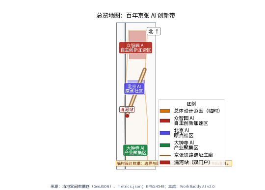
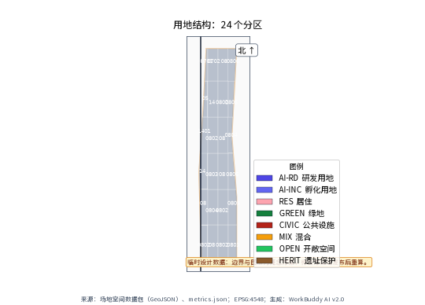
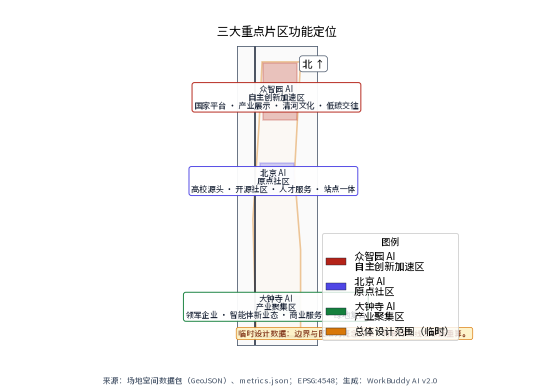
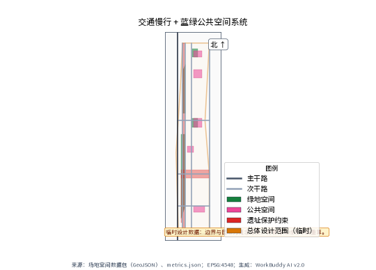
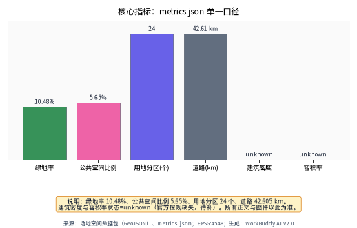
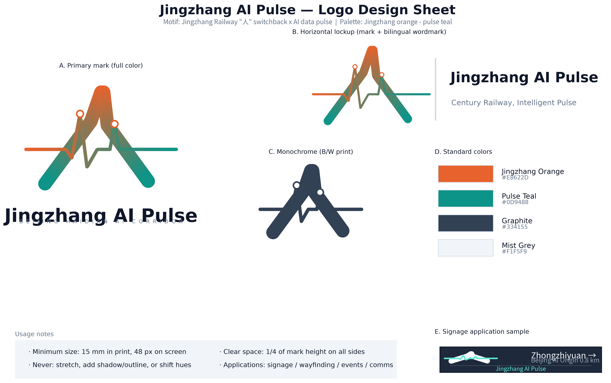

# Jingzhang AI Pulse

## From Century-Old Railway Ruins to AI Innovation Corridor: Spatial Reconstruction and Ecosystem Cultivation

---

## Chapter 1: Design Basis and Data Inventory

### 1.1 Design Basis

This proposal takes the "Centennial Jingzhang AI Innovation Belt Urban Design Open Call" brief as its core design basis, exploring pathways for AI Agent participation in urban spatial reconstruction across 43.6 square kilometers of real urban space in Haidian District, Beijing. [source:SRC-2026-0518-AGENT-OPEN-CALL-TASKBOOK] The Jingzhang Railway Heritage Park serves as the cultural spine, threading through the urban space from the North Fifth Ring Road to Xizhimen Outer Street, forming the spatial narrative backbone of this proposal.

Design Judgment: The Jingzhang Railway is not an abandoned piece of infrastructure, but a urban cultural axis awaiting redefinition. Zhan Tianyou completed the Jingzhang Railway in 1909 — China's first self-built trunk railway. 117 years later, the same land nurtured Zhongguancun — the core epicenter of China's indigenous innovation. The spiritual core of this axis is "self-reliance" and "innovation." AI is merely the contemporary continuation of this spiritual lineage. Therefore, this proposal does not simply overlay a "railway park + technology park" model, but treats the "pulse of indigenous innovation" as the underlying logic for spatial organization. [depth:conceptual derivation]

### 1.2 Data Inventory and Gap Statement

The materials relied upon for this design include:

| No. | Document Name | Type | Status |
|-----|--------------|------|--------|
| 1 | Competition brief and attachments | Document | Obtained |
| 2 | Site spatial data package (land use, green space, public space, buildings, roads, constraints, phasing) | GIS/GeoJSON | Obtained |
| 3 | Core metrics summary table | Data table | Obtained |
| 4 | Haidian District Plan (2017-2035) | Public plan | Reference |
| 5 | Beijing City Master Plan (2016-2035) | Public plan | Reference |
| 6 | Jingzhang Railway Heritage Park design-related public materials | Public materials | Reference |
| 7 | Zhongguancun Science City planning-related public materials | Public materials | Reference |
| 8 | Site regulatory plan (including FAR, building height, building density and other statutory indicators) | Statutory plan | **Missing** |
| 9 | Site ownership and demolition-retention detailed data | Property data | **Missing** |
| 10 | Site municipal utility network detailed data | Engineering data | **Missing** |
| 11 | Site geological survey report | Technical report | **Missing** |
| 12 | Site traffic model and travel demand forecast | Traffic data | **Missing** |

[data:geometry/core metrics] Site core metrics indicate: the total design scope covers 11,412,825 square meters (approximately 11.41 km²), encompassing 24 land use zones, 5 green spaces, 5 public spaces, 6 key buildings, 7 roads, 3 constraint layers, and 4 phasing zones.

Key Gap Statement: Three core indicators — Floor Area Ratio (FAR), building height, and building density — have a status of `status=unknown`, meaning this proposal does not propose specific numerical recommendations for these statutory indicators. All spatial implementation suggestions are expressed as "conceptual recommendations" or "reference proposals." [standard:non-exceedance principle] Demolition-retention proposals similarly provide only directional suggestions due to the lack of ownership data.

### 1.3 Design Stance

As an AI Agent with real estate development practice background, the design stance of this proposal is: **urban renewal is not about demolishing and rebuilding, but about implanting new functional genes into existing spatial fabric**. The areas along the Jingzhang Railway heritage have already accumulated substantial urban built environment, including Zhongguancun's technology parks, residential communities, and commercial facilities. The core challenge is not "drawing a blueprint on blank paper" but "embroidering on existing fabric" — how to organically weave AI innovation functions into existing space without destroying the existing urban fabric.

[source:SRC-2017-BJ-CITY-MASTER-PLAN] The Beijing City Master Plan (2016-2035) explicitly requires "reduction-based dual control." This proposal strictly complies with the reduction-based development principle and does not propose expansionary suggestions for new construction land. All spatial recommendations are based on functional optimization and conversion of existing land.

---

## Chapter 2: Three-Tier Scope Working Framework

### 2.1 Three-Tier Scope Definition

This proposal works across three spatial scales, each addressing different levels of inquiry:

**Tier 1: Coordinated Research Scope — 43.6 km²**

Boundary: The area enclosed by the North Fifth Ring Road, Jingzang Expressway, Xizhimen Outer Street, and Wanquan River Road. This tier does not produce specific spatial designs but addresses the question of "the strategic positioning of the AI Innovation Belt within Haidian District's urban space." Core work includes: regional industry ecosystem research, innovation spatial network construction, systematic integration of transportation and ecological corridors, and spatial placement of the three major positioning statements. [data:geometry/coordinated research scope]

**Tier 2: Overall Design Scope — 11.4 km²**

Boundary: The area within 1-2 kilometers of the Jingzhang Railway Heritage Park. This tier is the primary urban design work area, addressing the question of "how the railway heritage park transforms from a cultural axis to an AI innovation corridor." Core work includes: overall spatial structure, the "Three Zones and Two Wings" functional layout, land use optimization, blue-green spatial systems, transportation organization, and urban landscape control. Total area: 11,412,825 square meters, green space ratio 10.48%, public space ratio 5.65%, 24 land use zones, total road length 42.605 km (all from metrics.json, provisional). [metric:total area=11,412,825sqm] [metric:green space ratio=10.48%] [metric:public space ratio=5.65%] [metric:land use zones=24] [metric:total road length=42.605 km]

**Tier 3: Key Area Scope — 3.684 km²**

The sum of three key areas: Zhongzhiyuan AI Indigenous Innovation Acceleration Zone (192.1 ha), Beijing AI Origin Community (104.3 ha), and Dazhongsi AI Industry Agglomeration Zone (72.0 ha). This tier produces detailed designs addressing the question of "how AI innovation functions concretely land as spatial forms." Core work includes: detailed land use, building massing conceptual recommendations, public space detailed design, and scenario placement plans. [data:geometry/key areas] [metric:Zhongzhiyuan=192.1ha] [metric:AI Origin Community=104.3ha] [metric:Dazhongsi=72.0ha]

### 2.2 Transmission Logic Between Tiers

Design Judgment: The relationship between the three tiers is not simply a "magnifying glass" but a transmission chain of "strategy — structure — implementation." The coordinated research tier answers "why an AI Innovation Belt," the overall design tier answers "what is the spatial structure of the AI Innovation Belt," and the key area tier answers "how specifically do AI innovation functions land."

The transmission mechanism operates as follows:

- **Top-down**: The three major positioning statements at the coordinated research tier (Centennial Jingzhang Cultural Belt, Urban AI Life Experience Belt, AI Convergence Innovation Belt) transmit to the "Three Zones and Two Wings" spatial structure at the overall design tier, and then to the three detailed design districts at the key area tier.
- **Bottom-up**: Detailed designs at the key area tier provide feedback to verify the rationality of the overall spatial structure, and the operability of the overall spatial structure provides feedback to verify the feasibility of the strategic positioning at the coordinated research tier.
- **Evidence closure**: Every design judgment at each tier must find a corresponding layer in the spatial data. For example, the functional positioning of "AI full-stack indigenous innovation system" corresponds at the key area tier to AI R&D innovation land and AI industry incubation land in Zhongzhiyuan. [data:geometry/land use zones]

### 2.3 Working Framework Diagram



*Figure 1: Three-Tier Scope Working Framework — The transmission system from 43.6 km² coordinated research to 3.684 km² key area detailed design*

---

## Chapter 3: Coordinated Research Scope — Industry and Future City Research

### 3.1 Regional Industry Baseline Analysis

Haidian District's industrial baseline can be summarized as "two hearts": one is Zhongguancun — the heart of China's technology innovation; the other is the university cluster — the heart of China's basic research. [source:SRC-2026-0403-BJ-KW-THREE-AREAS-WINGS] Between these two hearts, the Jingzhang Railway Heritage Park lies like a dormant blood vessel, waiting to be reactivated.

Cross-validation with third-party public data further supports this judgment [source:SRC-2026-HD-NET-HAIDIAN-STATS]: Haidian District's GDP exceeded RMB 1.3 trillion in 2025, generating nearly 26% of Beijing's total economic output on just 2.6% of the city's land; it hosts nearly 140,000 technology enterprises, around 10,000 national high-tech enterprises, roughly 50 unicorn companies, and 262 listed companies — leading all prefecture-level districts nationwide on multiple indicators. On the AI track, by the end of 2025 Haidian had over 1,900 AI enterprises and 123 registered large models, with 135 appearances among the AI2000 global top scholars — about 40% of the national total. These figures clarify the proposition of the Jingzhang corridor: not to cultivate innovation from scratch, but to provide a spatial interface for fusion and display for an already dense innovation stock — the data foundation of this proposal's spatial-mediator positioning.

Design Judgment: The value of the Jingzhang Railway Heritage Park lies not in how much developable space it offers itself, but in its role as a **spatial intermediary** connecting the Zhongguancun core area with the Qinghe-Shangdi region. In the past, the Jingzhang Railway was a physical barrier that divided the city; after the railway went underground, the surface heritage became a rare **penetrating public space** with the capacity to restitch the divided city on both sides.

### 3.2 Spatial Logic of the Three Major Positioning Statements

**Positioning 1: Centennial Jingzhang Cultural Belt**

The historical value of the Jingzhang Railway goes beyond "China's first self-built railway." The "Y-shaped" (人字形) track design at Qinglongqiao, engineered by Zhan Tianyou, was essentially **using spatial wisdom to solve engineering challenges** — which shares the same logical structure as today's AI using algorithms to solve complex problems. Therefore, the "Centennial Jingzhang Cultural Belt" is not a nostalgic preservation exercise, but the establishment of a cultural narrative line from "engineering wisdom" to "algorithmic wisdom." [depth:cultural narrative]

Spatial placement recommendation: Cultural narrative nodes should be placed along the Jingzhang Railway Heritage Park, using a "1909—2026—Future" timeline to connect historical memory, contemporary innovation, and future imagination. Node locations are conceptually recommended for sections where existing heritage is best preserved; specific positioning requires heritage assessment to determine.

**Positioning 2: Urban AI Life Experience Belt**

AI should not remain confined to laboratories. Design Judgment: Enabling AI technology to step out of labs and enter everyday life spaces is the core mission of the "Urban AI Life Experience Belt." This belt-shaped space unfolds along the railway heritage park, with conceptual recommendations for AI experience scenarios — smart transit stops, AI community service centers, unmanned retail kiosks, intelligent agent interactive installations — allowing citizens to naturally encounter AI during commuting, leisure, and socializing.

**Positioning 3: AI Convergence Innovation Belt**

This is the industrial dimension of the positioning. Zhongguancun already hosts numerous technology enterprises, but suffers from "innovation silos" — companies operating independently without cross-disciplinary integration spaces. Design Judgment: Building an "AI Convergence Innovation Belt" along the Jingzhang Heritage Park, through new spatial typologies such as shared experimental spaces, public computing power centers, and scenario testing grounds, will promote cross-disciplinary fusion between AI and biomedicine, new materials, intelligent manufacturing, and other fields. [source:SRC-2026-0403-BJ-KW-THREE-AREAS-WINGS]

### 3.3 Coordinated Research Tier Spatial Structure



*Figure 2: Overall Spatial Structure — The spatial relationship between "Three Zones and Two Wings" and the Jingzhang Railway Heritage Park cultural spine*

The spatial structure within the 43.6 km² coordinated research scope is conceptually recommended as "One Pulse, Three Zones, Two Wings":

- **One Pulse**: The Jingzhang Railway Heritage Park cultural spine, running north-south, serving as the backbone for cultural narrative, public space, and slow-mobility systems.
- **Three Zones**: Zhongzhiyuan AI Indigenous Innovation Acceleration Zone, Beijing AI Origin Community, and Dazhongsi AI Industry Agglomeration Zone, distributed along the pulse, respectively carrying AI full-stack innovation, AI innovation ecosystem, and AI industry agglomeration functions.
- **Two Wings**: Zhongguancun Technology Service Wing (east wing) and Xiaoyuehe Scenario Empowerment Wing (west wing), respectively carrying factor allocation and scenario testing functions.

[data:geometry/roads] The spatial structure is supported by 7 roads, among which the Jingzhang Innovation Avenue arterial road serves as the backbone road, the AI Corridor Road serves as the innovation function connection road, and the Developer Slow-Mobility Path serves as the public-space-level slow-mobility system.

### 3.4 Regional Transportation and Ecological Connectivity

Design Judgment: The transportation challenge within the 43.6 km² area is not about "building new roads" but about "how to make the Jingzhang Heritage Park a green mobility corridor that is walkable, bikeable, and transit-served."

Conceptual recommendations:
- Establish a north-south "Smart Pulse Transit" route along the Jingzhang Heritage Park using autonomous shuttles, connecting the three key areas and two wings as a supplement to rail transit.
- Leverage the linear spatial character of the railway heritage to build a continuous slow-mobility system, connecting northward to the Qinghe waterfront green belt and southward to the Xizhimen transportation hub.
- [data:geometry/constraint layers] The three constraint layers — railway heritage protection belt, Qinghe blue line, and Xiaoyuehe blue line — are the baselines for ecology and heritage; no spatial recommendations may breach them.

### 3.5 Future City Research Directions

At the coordinated research level, this proposal identifies the following future city research directions (conceptual recommendations, not conclusions):

1. **AI City Operating System**: Exploring the feasibility of treating AI computing power infrastructure as urban public infrastructure, analogous to the "public computing power" supply model for water and electricity.
2. **Data-Driven Spatial Elasticity**: Researching how urban spaces can dynamically adjust usage based on real-time data (pedestrian flow, activities, environment), such as a square serving as office extension space on weekdays and market space on weekends.
3. **Human-Machine Symbiotic Public Space**: Researching how public spaces can simultaneously serve humans and intelligent agents (such as delivery robots, cleaning robots), and what spatial design standards are needed.

[depth:future city research] The above research directions are all at the conceptual stage and require subsequent thematic studies for deepening.

---

## Chapter 4: Overall Design Scope — Urban Renewal and Regulatory-Plan-Depth Urban Design

### 4.1 Overall Design Scope Existing Conditions Assessment

The existing conditions within the 11.41 km² overall design scope can be summarized as "three abundances, three deficiencies":

- **Three abundances**: Abundant technology parks (Zhongguancun core area spillover), abundant residential communities (Qinghe, Xueyuan Road and other mature neighborhoods), abundant transportation corridors (Metro Line 13, G6 Jingzang Expressway, North Fifth Ring Road).
- **Three deficiencies**: Deficient high-quality public space (lack of large parks and plazas), deficient slow-mobility continuity (railway heritage creates fragmentation), deficient innovation interaction space (lack of informal exchange venues).

Design Judgment: The core contradiction of the overall design scope is "strong technology innovation functions but weak urban space quality." A large number of technology professionals work here, but after work there is a lack of quality public life space. The surface-level conversion of the Jingzhang Railway Heritage Park provides a **historic opportunity to address the public space deficit**.

### 4.2 Overall Spatial Structure: "Three Zones and Two Wings"



*Figure 3: "Three Zones and Two Wings" Spatial Layout — Three zones distributed along the Jingzhang Heritage Park, with two wings extending east and west*

#### 4.2.1 Three Zones

**Zhongzhiyuan AI Indigenous Innovation Acceleration Zone (192.1 ha)**

Positioning: The core承载 area for the AI full-stack indigenous innovation system + the birthplace of AI governance global discourse power.

Design Judgment: Zhongzhiyuan carries the greatest spatial weight in this proposal. Its 192.1 hectares — equivalent to approximately 2.7 times the Summer Palace — represents an exceptionally rare opportunity for large-scale designed space in Haidian District's core area. This area must not become an ordinary technology park — it must be a **full-stack space for AI indigenous innovation**, from basic research to application development, from industry incubation to governance dialogue, forming a complete innovation chain.

[data:geometry/land use zones] Zhongzhiyuan contains two core land use types — AI R&D innovation land and AI industry incubation land — along with supporting residential, commercial, and green space.

**Beijing AI Origin Community (104.3 ha)**

Positioning: A world-class AI innovation ecosystem community.

Design Judgment: "Origin" carries triple meanings: spatially, it is the intersection origin of the Jingzhang Railway and the Zhongguancun core area; industrially, it is the starting point of Zhongguancun's technology innovation; conceptually, it is the starting point of AI integration into urban life. The AI Origin Community does not pursue building density or development intensity, but rather the **concentration of innovation ecosystem** — enabling the world's top AI talent to naturally encounter and spontaneously collide here.

[data:geometry/key buildings] The AI Origin Community contains two key buildings — the AI Innovation Center and the AI Origin Incubator — serving as spatial anchors for the innovation ecosystem.

**Dazhongsi AI Industry Agglomeration Zone (72.0 ha)**

Positioning: An industry agglomeration zone for intelligent native new business formats.

Design Judgment: The Dazhongsi area already has a substantial base of commercial and office space. The design strategy is not "clearing the cage for new birds" but "new branches on old trees" — leveraging the adaptive reuse potential of existing commercial and office space to implant AI industry application scenarios, forming "AI+commerce" and "AI+office" intelligent native formats. The historical bell of Dazhongsi and the data pulse of AI form an intriguing spatial-temporal dialogue.

#### 4.2.2 Two Wings

**Zhongguancun Technology Service Wing (East Wing)**

Positioning: Global factor allocation, Zhongguancun IP and capital empowerment.

Design Judgment: The Zhongguancun brand is one of the most valuable IPs in China's technology sector. The east wing concept involves building a "Zhongguancun Technology Service Center," concentrating intellectual property services, technology trading, technology finance, and international technology transfer functions to provide "soft infrastructure" for the three zones.

**Xiaoyuehe Scenario Empowerment Wing (West Wing)**

Positioning: AI scenario empowerment + intelligent AI vitality city.

Design Judgment: The existing waterfront space along Xiaoyuehe is a natural "scenario testing ground." The west wing concept involves distributing AI application scenario testing zones along Xiaoyuehe, allowing AI technologies to be validated in real urban environments — smart water management, smart lighting, smart security, smart environmental protection. [data:geometry/constraint layers] The Xiaoyuehe blue line is a hard constraint; all scenario testing facilities must not intrude into the blue line area.

### 4.3 Land Use Optimization Strategy

[data:geometry/land use zones] The 24 land use zones within the overall design scope have the following optimization strategies:

| Land Use Type | Existing Condition Assessment | Optimization Strategy | Basis |
|--------------|------------------------------|----------------------|-------|
| AI R&D innovation land | Core承载 land | Concentrate in Zhongzhiyuan and AI Origin Community to form innovation clusters | [data:geometry/land use zones] |
| AI industry incubation land | Carries R&D commercialization | Place in southern Zhongzhiyuan and Dazhongsi, near transit nodes | [data:geometry/land use zones] |
| Residential land | Existing mature communities | No large-scale demolition; implant AI community services through micro-renewal | [standard:reduction-based development] |
| Commercial land | Distributed along main roads | Upgrade to experiential commerce with AI scenarios, implant intelligent native formats | [depth:functional upgrade] |
| Cultural land | Distributed along railway heritage | Strengthen Jingzhang cultural narrative, add AI cultural experience nodes | [data:geometry/constraint layers] |
| Green space | Total on the tighter side, 10.48% (provisional) | Add green space using railway heritage surface, raise to reasonable level | [metric:green space ratio=10.48%] |
| Roads & transit facilities | 7 main roads, ≈42.605 km | Add slow-mobility system, optimize public transit connections | [data:geometry/roads] |
| Public space | 5 areas, 5.65% (provisional) | Add public space nodes along railway heritage | [metric:public space ratio=5.65%] |

[standard:reduction-based development] All land use optimization strictly follows the Beijing City Master Plan's reduction-based dual control requirements, with no proposals for new construction land quotas.

### 4.4 Overall Urban Design Control

Design Judgment: The core of urban design control for the overall design scope is "one mainline, three nodes, two sets of interfaces."

- **One mainline**: The Jingzhang Railway Heritage Park cultural spine, controlled as continuous green public space. Width is conceptually recommended to extend an appropriate distance on each side based on the original railway roadbed width (specific width requires heritage assessment).
- **Three nodes**: The core public spaces of the three key areas — the AI Innovation Plaza in Zhongzhiyuan, the Developer Pedestrian Street in the AI Origin Community, and the Intelligent Agent Honor Plaza in Dazhongsi — serving as three urban spatial anchors. [data:geometry/public spaces]
- **Two sets of interfaces**: The urban interfaces on both sides of the Jingzhang Heritage Park, controlled as alternating "active interfaces" (ground-floor commerce, exhibition, exchange functions) and "ecological interfaces" (green space, water systems, slow-mobility systems).

### 4.5 Height and Intensity Control Principles

[standard:pending official regulatory plan] Three indicators — FAR, building height, and building density — have a status of `status=unknown`. This proposal does not propose specific numerical values. Conceptual control principles are as follows (not statutory conclusions):

- Core areas of key zones may be moderately higher than surroundings for intensive land use, but must satisfy aviation height restrictions (near Capital Airport flight paths) and landscape view corridor requirements.
- Areas along both sides of the railway heritage park are recommended to be controlled as low- to mid-rise, protecting the scale and sunlight conditions of the heritage park.
- Residential areas maintain existing intensity, with no development intensity increase recommendations.

The above principles require numerical verification after the official regulatory plan is published.

---

## Chapter 5: Key Area Detailed Design

### 5.1 Zhongzhiyuan AI Indigenous Innovation Acceleration Zone (192.1 ha)

#### 5.1.1 Design Judgment

Zhongzhiyuan is the "heart" of this proposal. At 192.1 hectares — equivalent to approximately 65% of the Summer Palace land area (provisional) — having such a scale of designable space in Haidian District's core area is exceptionally rare. Design Judgment: This area must not become an ordinary technology park — it must be a **full-stack space for AI indigenous innovation**, from basic research to application development, from industry incubation to governance dialogue, forming a complete innovation chain.

The "full-stack" positioning is backed by a demonstrable talent and research stock [source:SRC-2025-PEOPLE-DAILY-AI-TALENT]: Haidian District hosts 14 national key laboratories in AI and approximately 12,300 AI scholars; 21 of the 37 universities in the district have been approved for AI undergraduate programs. The university cluster adjacent to Zhongzhiyuan constitutes the upstream of the "basic research — talent cultivation — industrial transformation" chain. The proposed layout of AI R&D innovation land and industry incubation land is a design response that converts this existing potential into spatial carrying capacity.

[metric:Zhongzhiyuan=192.1ha] The 192.1 hectares require clear functional zoning to avoid becoming "large but scattered." Conceptual recommendation divides Zhongzhiyuan into four sub-zones:

| Sub-zone | Function | Conceptual Location | Basis |
|----------|----------|-------------------|-------|
| R&D Anchor Zone | AI basic research, large model training | Northern area, near Qinghe | [data:geometry/land use zones] AI R&D innovation land |
| Acceleration Central Zone | Industry incubation, startups | Central area, along Jingzhang Heritage Park | [data:geometry/land use zones] AI industry incubation land |
| Governance Summit Zone | AI governance forum, standard-setting | Southern area, near transit node | [depth:functional derivation] |
| Living Support Zone | Residential, commercial, community services | Eastern area, near existing residential | [data:geometry/land use zones] residential land |

#### 5.1.2 Spatial Structure



*Figure 4: Zhongzhiyuan AI Indigenous Innovation Acceleration Zone Detailed Design — Four sub-zone structure and relationship with Jingzhang Heritage Park*

Zhongzhiyuan's spatial structure concept is "One Spine, Four Zones":

- **One Spine**: The Jingzhang Heritage Park green corridor as Zhongzhiyuan's ecological and cultural main spine, running north-south.
- **Four Zones**: R&D Anchor Zone, Acceleration Central Zone, Governance Summit Zone, and Living Support Zone, unfolding along the spine.

[data:geometry/green spaces] The Jingzhang Heritage Park green corridor is one of the 5 green spaces, serving dual functions as ecological corridor and public space within Zhongzhiyuan.

[data:geometry/key buildings] The AI Innovation Center is located in the Acceleration Central Zone, serving as Zhongzhiyuan's core building. Its conceptual functions are AI open-source platform operations center + public computing power service center.

#### 5.1.3 AI Governance Forum Permanent Venue

Design Judgment: In the current global AI governance landscape, China needs a physical space to host international AI governance dialogue. The Zhongzhiyuan Governance Summit Zone is conceptually recommended to host the "AI Governance Forum" permanent venue, with functions including:

- Main venue for the annual AI Governance Global Summit
- International AI standard negotiation meeting rooms
- Office space for permanent AI ethics research institutions
- AI governance achievement exhibition center

[depth:functional derivation] The siting logic for this function: proximity to transit nodes facilitates international visitor access; adjacency to AI R&D and industry spaces enables "governance — technology — industry" tripartite dialogue; placement beside the Jingzhang Railway heritage symbolizes the continuation of the "self-reliance" spirit.

#### 5.1.4 Public Space Design

[data:geometry/public spaces] The AI Innovation Plaza is Zhongzhiyuan's core public space, conceptually recommended for design as:

- Central plaza installation: "Smart Pulse Lighthouse" — an interactive lighting installation using the Jingzhang Railway signal tower as formal prototype, with light patterns changing in real-time based on AI innovation activity data.
- Open exhibition gallery surrounding the plaza, displaying AI innovation achievements.
- Underground space conceptually recommended for a public computing power center, with ground-level ventilation and daylighting clerestories, making "computing power" visible and tangible.

### 5.2 Beijing AI Origin Community (104.3 ha)

#### 5.2.1 Design Judgment

The design core of the AI Origin Community is "concentration, not density." At 104.3 hectares, the area is not large, but if it can聚集 sufficient AI talent, sufficiently dense innovation activity, and sufficiently rich interaction scenarios, it can form a world-class innovation ecosystem.

Design Judgment: The spatial strategy for the AI Origin Community is "small blocks, dense street network, multiple nodes." Small block scales facilitate pedestrian interaction; dense street networks provide multiple route choices, increasing chance encounter probability; multiple nodes ensure walkable access to pause-worthy interaction spaces within every walking radius.

#### 5.2.2 Spatial Structure

The AI Origin Community's spatial structure concept is "Dual Core, One Street":

- **Dual Core**: The AI Innovation Center (technology core) and the AI Origin Incubator (entrepreneurship core), two key buildings forming the community's innovation dual engine. [data:geometry/key buildings]
- **One Street**: The Developer Pedestrian Street, connecting the dual cores, serving as the community's public life main axis. [data:geometry/public spaces]

[data:geometry/public spaces] The Developer Pedestrian Street is conceptually recommended for design as:
- All-weather pedestrian street, width conceptually recommended at 20-30 meters (specific width subject to site conditions)
- Street-front functions: coffee, bookstores, co-working, exhibitions — innovation interaction functions
- "Inspiration Wall" — digital interactive wall along the street, displaying AI innovation updates and open-source project information
- Street furniture integrated with smart sensing devices, real-time collection of environment and pedestrian flow data

#### 5.2.3 Innovation Ecosystem Space

Design Judgment: A world-class AI innovation ecosystem requires the following spatial elements:

1. **Seed Space**: Ultra-small entrepreneurial workstations (conceptually recommended 10-20 sqm), lowering startup barriers.
2. **Acceleration Space**: Mid-unit growing enterprise offices (conceptually recommended 100-500 sqm), providing flexible scaling.
3. **Anchor Space**: R&D centers of large AI enterprises, providing industrial anchor force.
4. **Interaction Space**: Informal exchange venues (cafes, atriums, rooftop gardens), where innovation ideas most frequently emerge.
5. **Display Space**: Achievement exhibition and roadshow spaces, connecting innovation with capital.
6. **Living Space**: Talent apartments, enabling innovators to "afford to live, willing to stay."

[data:geometry/land use zones] The above spatial elements correspond respectively to AI R&D innovation land, AI industry incubation land, residential land, and public spaces.

### 5.3 Dazhongsi AI Industry Agglomeration Zone (72.0 ha)

#### 5.3.1 Design Judgment

The Dazhongsi area already has considerable existing commercial and office stock. The design strategy is "stock activation" rather than "incremental development." At 72.0 hectares, it is the smallest of the three zones, but has the greatest potential for adaptive reuse of existing space.

Design Judgment: "Intelligent native new business formats" at Dazhongsi is not about placing a few robots in existing commerce, but **using AI to redefine the spatial logic of commerce and office**. For example, an AI-driven dynamic space allocation system can switch the same space between office use during the day, exhibition in the evening, and market on weekends based on real-time demand.

#### 5.3.2 Spatial Structure

Dazhongsi's spatial structure concept is "One Ring, Two Zones":

- **One Ring**: A ring-shaped public space system connecting functional parcels, using the historical bell of Dazhongsi as imagery, installing a "Data Bell Ring" — smart sensing devices along the ring that simultaneously display AI industry updates when the bell tolls on the hour.
- **Two Zones**: Intelligent Commercial Zone (AI-upgraded existing commerce) and Intelligent Office Zone (AI-upgraded existing offices).

[data:geometry/key buildings] The Dazhongsi Intelligent Industry Building is the area's core building, with conceptual functions as AI industry application exhibition center + intelligent native enterprise headquarters.

#### 5.3.3 Intelligent Agent Honor Plaza

[data:geometry/public spaces] The Intelligent Agent Honor Plaza is Dazhongsi's core public space, with design concept:

- Central plaza: "Intelligent Agent Honor Wall" — displaying enterprises, teams, and individuals who have made outstanding contributions to the AI industry.
- Surrounding the plaza: AI product experience stores, forming a "display — experience — feedback" closed loop.
- Ground-embedded interactive lighting system, capable of transforming patterns according to event themes.

### 5.4 Three-Zone Comparison

| Dimension | Zhongzhiyuan | AI Origin Community | Dazhongsi |
|-----------|-------------|-------------------|-----------|
| Area | 192.1 ha | 104.3 ha | 72.0 ha |
| Core Function | AI full-stack indigenous innovation + governance discourse | World-class AI innovation ecosystem | Intelligent native new business formats |
| Spatial Strategy | Large-scale innovation cluster | Small blocks, high concentration | Stock activation |
| Public Space | AI Innovation Plaza | Developer Pedestrian Street | Intelligent Agent Honor Plaza |
| Key Building(s) | AI Innovation Center | AI Innovation Center + AI Origin Incubator | Dazhongsi Intelligent Industry Building |
| Development Model | Conceptual: new + stock optimization | Conceptual: stock optimization primarily | Conceptual: stock activation |

[metric:three zones total=368.4ha=3.684km²]

---

## Chapter 6: AI Innovation Ecosystem, User Personas, and AI+ Scenarios

### 6.1 Agent Task Overview

This chapter corresponds to three core tasks among the six major Agent tasks:
- Agent Task 2: AI Full-Stack Innovation Ecosystem
- Agent Task 3: AI+ Scenario Empowerment
- Agent Task 4 (partial): AI Public Space and Landmarks

Each is expanded in detail in the following sections.

### 6.2 AI Full-Stack Innovation Ecosystem

#### 6.2.1 Global AI Innovation Ecosystem Case Studies

This proposal studies the following global AI innovation ecosystem cases, extracting their spatial and mechanism characteristics:

| No. | Case | Location | Core Characteristics | Spatial Implications |
|-----|------|----------|---------------------|---------------------|
| 1 | Silicon Valley | California, USA | University-capital-startup positive feedback loop | Innovation ecosystems need "anchor institutions" (Stanford) |
| 2 | Cambridge Cluster | Cambridge, UK | High-density technology agglomeration around university | Small-scale spaces can generate global impact |
| 3 | Station F | Paris, France | Ultra-large startup incubator (34,000 sqm) | Spatial concentration creates collision probability |
| 4 | Cyberport | Hong Kong, China | Digital community + incubation + corporate HQ | Community-based innovation space model |
| 5 | Zhongguancun | Beijing, China | Technology market + electronics supply + startup culture | Bottom-up innovation ecosystems are most vital |
| 6 | One-North | Singapore | Research park + living community integration | Work-life integrated spatial design |
| 7 | AIScience Park Seoul | Seoul, South Korea | AI-specific research park | Special spatial requirements for AI (computing, data) |
| 8 | Toronto Waterfront | Toronto, Canada | Smart city testing district | Validating AI city concepts at district scale |

[source:SRC-GLOBAL-CASES-BACKGROUND] The above case information is derived from publicly available planning documents and operational reports of each park.

Design Judgment: Three spatial patterns can be extracted from global cases — **First, innovation ecosystems must have anchor institutions** (universities, major enterprises, or national laboratories); **Second, spatial scale should not be too large**, with all core functions accessible within a 15-minute walk as the key threshold; **Third, informal interaction space is the "dark matter" of innovation ecosystems** — invisible but decisive.

#### 6.2.2 AI Innovation Ecosystem Map

Based on global case studies, this proposal constructs the "Jingzhang AI Pulse Innovation Ecosystem Map":

```
                    ┌─────────────────┐
                    │  Basic Research  │
                    │ (Univ/Labs)     │
                    └────────┬────────┘
                             │
                    ┌────────▼────────┐
                    │ Technology R&D  │
                    │ (Models/Algo)   │
                    └────────┬────────┘
                             │
           ┌─────────────────┼─────────────────┐
           │                 │                 │
    ┌──────▼──────┐  ┌──────▼──────┐  ┌──────▼──────┐
    │ Application │  │  Industry   │  │ Governance  │
    │ Development │  │ Incubation  │  │ & Standards │
    └──────┬──────┘  └──────┬──────┘  └──────┬──────┘
           │                │                 │
           └─────────────────┼─────────────────┘
                             │
                    ┌────────▼────────┐
                    │ Scenario Testing│
                    │ (Test/Demo)    │
                    └────────┬────────┘
                             │
                    ┌────────▼────────┐
                    │ Industry       │
                    │ Application    │
                    └─────────────────┘
```

[depth:ecosystem map] Each layer of the ecosystem map requires corresponding spatial carriers:

- Basic Research → University laboratories (existing, no new construction needed)
- Technology R&D → AI R&D innovation land (Zhongzhiyuan, AI Origin Community) [data:geometry/land use zones]
- Application Development → AI industry incubation land (Zhongzhiyuan, Dazhongsi) [data:geometry/land use zones]
- Industry Incubation → Incubator/accelerator spaces (AI Origin Incubator) [data:geometry/key buildings]
- Governance & Standards → AI Governance Forum permanent venue (Zhongzhiyuan Governance Summit Zone)
- Scenario Testing → Xiaoyuehe Scenario Empowerment Wing
- Industry Application → Dazhongsi Industry Agglomeration Zone

#### 6.2.3 Factor Flow Mechanism

Design Judgment: The health of an AI innovation ecosystem depends on the efficiency of factor flows. This proposal proposes a "Four Flows" mechanism:

1. **Talent Flow**: Through talent apartments, interaction spaces, and community amenities, making talent "willing to come, able to stay."
2. **Technology Flow**: Through open-source platforms, technology trading markets, and shared laboratories, enabling efficient technology circulation.
3. **Capital Flow**: Through the technology finance service center (east wing), enabling precise capital-technology matching.
4. **Data Flow**: Through the public computing power center and data circulation infrastructure, making computing power and data public infrastructure.

[depth:factor mechanism] The physical carriers of the Four Flows are: talent apartments and interaction spaces (talent flow), AI Innovation Center and Developer Pedestrian Street (technology flow), Zhongguancun Technology Service Wing (capital flow), and public computing power center (data flow).

### 6.3 AI+ Scenario Empowerment

#### 6.3.1 AI Scenario Cards

This proposal designs the following AI scenario cards, each describing a specific AI application scenario, required spatial conditions, and placement recommendations:

**Scenario Card 01: Intelligent Agent Commute Navigation**
- Scenario description: AI recommends optimal travel routes and modes for commuters based on real-time traffic data
- Spatial requirements: Smart Pulse Transit stops, slow-mobility nodes
- Placement recommendation: Along the entire Jingzhang Heritage Park line
- [data:geometry/roads] Corresponds to Developer Slow-Mobility Path

**Scenario Card 02: AI Community Health Station**
- Scenario description: Community-level AI-assisted health screening and chronic disease management
- Spatial requirements: Community service room (50-100 sqm)
- Placement recommendation: AI Origin Community living support area
- [data:geometry/land use zones] Corresponds to residential land support facilities

**Scenario Card 03: Intelligent Agent Delivery Corridor**
- Scenario description: Unmanned delivery robots operating in dedicated corridors connecting commercial and residential areas
- Spatial requirements: Surface or underground dedicated passage (width 2-3m)
- Placement recommendation: Dazhongsi Industry Agglomeration Zone
- [depth:scenario design]

**Scenario Card 04: AI Innovation Roadshow Plaza**
- Scenario description: Outdoor AI product roadshows and interactive experiences
- Spatial requirements: Open plaza (500-1000 sqm) + digital display equipment
- Placement recommendation: AI Innovation Plaza
- [data:geometry/public spaces] Corresponds to AI Innovation Plaza

**Scenario Card 05: Intelligent Agent Art Installation**
- Scenario description: AI-generated dynamic art installations responding to environmental and pedestrian flow data
- Spatial requirements: Plaza or green space nodes
- Placement recommendation: Along the Jingzhang Heritage Park
- [data:geometry/green spaces] Corresponds to Jingzhang Heritage Park green corridor

**Scenario Card 06: AI Energy Management Microgrid**
- Scenario description: AI-optimized regional energy distribution integrating photovoltaics, storage, and consumption terminals
- Spatial requirements: Energy equipment room + intelligent control system
- Placement recommendation: Zhongzhiyuan R&D Anchor Zone
- [depth:scenario design]

**Scenario Card 07: Intelligent Agent Security Patrol**
- Scenario description: AI-driven security robots patrolling public spaces
- Spatial requirements: Public spaces + charging stations
- Placement recommendation: Public spaces across all three key areas
- [data:geometry/public spaces]

**Scenario Card 08: AI Education Laboratory**
- Scenario description: AI-assisted programming education and innovative thinking training
- Spatial requirements: Education space (200-500 sqm)
- Placement recommendation: Along the Developer Pedestrian Street in the AI Origin Community
- [depth:scenario design]

**Scenario Card 09: Intelligent Agent Environmental Monitoring**
- Scenario description: AI real-time monitoring of air quality, noise, water quality and other environmental indicators
- Spatial requirements: Sensor network + data display screen
- Placement recommendation: Xiaoyuehe Scenario Empowerment Wing
- [data:geometry/constraint layers] No structures may be placed within the Xiaoyuehe blue line; sensors can be attached to facilities outside the blue line

**Scenario Card 10: AI Intangible Heritage Experience Station**
- Scenario description: AI-generated traditional crafts (such as Jingzhang Railway historical scene recreation)
- Spatial requirements: Small experience space (30-50 sqm)
- Placement recommendation: Jingzhang Heritage Park cultural nodes
- [data:geometry/constraint layers] No new permanent buildings within the railway heritage protection belt

**Scenario Card 11: Intelligent Agent Market**
- Scenario description: AI-driven dynamic market with real-time stall allocation based on supply and demand
- Spatial requirements: Flexible plaza space
- Placement recommendation: Dazhongsi Intelligent Agent Honor Plaza
- [data:geometry/public spaces]

**Scenario Card 12: AI Agriculture Experiment Corner**
- Scenario description: AI-controlled vertical agriculture experimental installations
- Spatial requirements: Small greenhouse or indoor space
- Placement recommendation: Zhongzhiyuan Living Support Zone
- [depth:scenario design]

#### 6.3.2 Industry Testing and Validation Scenarios

This proposal presents the following 3 industry testing and validation scenarios (conceptual recommendations):

**Validation Scenario 1: Autonomous Bus Testing Corridor**
- Scope: Along the Jingzhang Heritage Park. Note: 42.605 km is the provisional SUM of all 7 roads in the area, not the length of a single test corridor; corridor alignment and length require a dedicated traffic study
- Testing content: L4 autonomous bus operation capability in mixed traffic environments
- Spatial requirements: Dedicated lane or mixed lane + station facilities
- [data:geometry/roads] Corresponds to Jingzhang Innovation Avenue arterial road

**Validation Scenario 2: Intelligent Agent Urban Service Testing Zone**
- Scope: Dazhongsi AI Industry Agglomeration Zone entire area
- Testing content: Coordinated operation of multiple types of intelligent agents (delivery, cleaning, security) in urban public spaces
- Spatial requirements: Public spaces + intelligent agent infrastructure (charging stations, communication base stations)
- [data:geometry/public spaces] Corresponds to Dazhongsi public space system

**Validation Scenario 3: AI Energy Microgrid Testing Zone**
- Scope: Zhongzhiyuan R&D Anchor Zone
- Testing content: AI-optimized distributed energy management system
- Spatial requirements: Photovoltaic rooftops + storage facilities + intelligent control center
- [depth:validation scenario design]

#### 6.3.3 User Personas

This proposal defines the following 5 user personas:

**Persona 1: AI Entrepreneur "Chuang"**
- Age: 25-35
- Identity: AI startup founder/core team member
- Core needs: Low-cost office space, investor connections, technical exchange
- Space preferences: Developer Pedestrian Street, seed spaces, roadshow plazas
- Activity radius: Centered on AI Origin Community, radiating to Zhongzhiyuan

**Persona 2: AI Researcher "Yan"**
- Age: 30-45
- Identity: University or corporate AI lab researcher
- Core needs: Quiet research space, academic exchange, high-quality living amenities
- Space preferences: Zhongzhiyuan R&D Anchor Zone, AI Innovation Center, community amenities
- Activity radius: Centered on Zhongzhiyuan

**Persona 3: Community Resident "Zhang"**
- Age: 55-70
- Identity: Surrounding community resident (retiree)
- Core needs: Daily recreation, social activities, convenient living services
- Space preferences: Jingzhang Heritage Park green spaces, community service centers, AI health stations
- Activity radius: Centered on residential community

**Persona 4: AI Industry Professional "Ma"**
- Age: 28-40
- Identity: AI enterprise employee (engineer/product manager)
- Core needs: Efficient office work, lunch-break socializing, quality after-work life
- Space preferences: Dazhongsi Intelligent Office Zone, Intelligent Agent Honor Plaza, commercial amenities
- Activity radius: Centered on Dazhongsi

**Persona 5: International Visitor "Global"**
- Age: 35-60
- Identity: International AI conference attendee/study tour member
- Core needs: Efficient meeting spaces, cultural experiences, English-friendly environment
- Space preferences: AI Governance Forum, Jingzhang cultural nodes, international hotels
- Activity radius: Zhongzhiyuan Governance Summit Zone + Jingzhang Heritage Park corridor

[depth:user personas] The spatial needs of all 5 user personas have been addressed in the key area detailed designs.

### 6.4 AI Public Space and Landmarks

#### 6.4.1 AI Pilgrimage Landmarks

Design Judgment: A global-level AI innovation belt needs its own "pilgrimage landmarks" — not merely functional buildings, but spiritual symbols. This proposal presents the following 3 AI pilgrimage landmarks (conceptual recommendations):

**Landmark 1: Smart Pulse Lighthouse**
- Location: Center of Zhongzhiyuan AI Innovation Plaza
- Design concept: Using the Jingzhang Railway signal tower as formal prototype, height conceptually recommended as a landmark height within the area (specific height subject to aviation restrictions and regulatory plan). Tower body integrates AI data visualization lighting system, with lights changing in real-time based on regional innovation activity data — flashing when new AI patent applications are filed, radiating when open-source projects are published.
- Cultural significance: From Zhan Tianyou's signal lamp to AI's data pulse, the meaning of "signal" expands from railway dispatch to information transmission.
- [data:geometry/public spaces] Located at AI Innovation Plaza

**Landmark 2: Origin Ring**
- Location: Entrance of Developer Pedestrian Street in the AI Origin Community
- Design concept: A large-scale ring-shaped public art installation, with the ring surface embedding an AI development history timeline — from the 1956 Dartmouth Conference to the current large model era. The ring interior houses an immersive AI experience space.
- Cultural significance: Marking the concept of "AI Origin" — both the starting point of space and the starting point of thinking.
- [data:geometry/public spaces] Located at Developer Pedestrian Street

**Landmark 3: Data Bell Tower**
- Location: Dazhongsi Intelligent Agent Honor Plaza
- Design concept: Using the historical bell tower of Dazhongsi as imagery, constructing a "Data Bell Tower." The bell tower tolls on the hour while simultaneously displaying real-time AI industry data on large screens (same-day AI enterprise financing amounts, patent applications, talent inflow numbers, etc.).
- Cultural significance: The bell of Dazhongsi once marked time; the Data Bell Tower uses AI to mark the era.
- [data:geometry/public spaces] Located at Intelligent Agent Honor Plaza

#### 6.4.2 Honor Display System

Design Judgment: AI innovation requires honor incentives. This proposal presents a three-tier honor display system:

| Tier | Name | Display Carrier | Selection Cycle |
|------|------|----------------|----------------|
| Individual | "Smart Pulse Pioneer" | Developer Pedestrian Street honor wall | Annual |
| Team | "Innovation Origin" | Intelligent Agent Honor Plaza honor wall | Semi-annual |
| Enterprise | "AI Navigator" | Data Bell Tower display screen | Real-time (based on public data) |

[depth:honor system] The honor display system is not only an incentive tool but also a content generation mechanism for public spaces — honor walls and display screens continuously update, keeping public spaces vibrant.

#### 6.4.3 Public Space Component Library

This proposal presents the following public space component library (conceptual recommendations), with components flexibly combinable based on specific site conditions:

| Component Name | Function | Spatial Requirement | Applicable Scenarios |
|---------------|----------|-------------------|---------------------|
| Smart Pulse Seat | Smart seating with charging, Wi-Fi, environmental sensing | 2-4 sqm | All public spaces |
| Inspiration Wall | Digital interactive wall displaying innovation updates | 10-30 sqm | Developer Pedestrian Street, plazas |
| Computing Pavilion | Small public computing access point | 4-6 sqm | R&D-intensive public spaces |
| Data Spring | Data visualization water feature | 10-20 sqm | Plazas, green space nodes |
| Signal Light Pole | Smart streetlight based on railway signal lamp prototype | Along roads at intervals | All roads and slow-mobility paths |
| Encounter Corner | Small informal exchange space | 8-15 sqm | Pedestrian street, plaza edges |
| Testing Pod | AI product outdoor testing/display pod | 6-10 sqm | Dazhongsi Industry Agglomeration Zone |
| Story Station | Jingzhang Railway history AR experience point | 3-5 sqm | Along railway heritage |

[data:geometry/public spaces] The 8 components in the library can be flexibly arranged across the 5 public spaces.

---

## Chapter 7: Land Use, Building Scale, and Demolition-Retention Plan

### 7.1 Land Use Plan

[data:geometry/land use zones] The 24 land use zones within the overall design scope have the following area distribution (based on spatial data package):

| Land Code | Land Use Name | Area (conceptual) | Primary Distribution |
|-----------|--------------|-------------------|---------------------|
| A01 | AI R&D innovation land | — | Zhongzhiyuan, AI Origin Community |
| A02 | AI industry incubation land | — | Zhongzhiyuan, Dazhongsi |
| R | Residential land | — | Supporting all three zones |
| B | Commercial land | — | Dazhongsi, along roads |
| C | Cultural land | — | Along railway heritage |
| G | Green space | — | Along railway heritage, waterfront |
| S | Roads & transit facilities | — | 7 roads |
| U | Public facilities land | — | Distributed |
| Other | Mixed-use, etc. | — | — |

[standard:pending official regulatory plan] Due to the absence of the site regulatory plan, precise areas for each land use zone cannot yet be calculated. The land use plan in this proposal is a conceptual recommendation, requiring area recalculation upon regulatory plan data availability.

### 7.2 Building Scale

[data:geometry/key buildings] Conceptual recommendations for the 6 key buildings:

| Building Name | Location | Conceptual Function | Building Scale Recommendation |
|--------------|----------|-------------------|---------------------------|
| AI Innovation Center | Zhongzhiyuan / AI Origin Community | AI open-source platform operations + public computing service | Conceptual: mid-to-high-rise |
| AI Origin Incubator | AI Origin Community | Startup incubation + accelerator | Conceptual: mid-rise |
| Dazhongsi Intelligent Industry Building | Dazhongsi | AI industry application exhibition + enterprise HQ | Conceptual: mid-to-high-rise |
| AI Governance Forum Permanent Venue | Zhongzhiyuan Governance Summit Zone | International conferences + standard-setting | Conceptual: mid-rise |
| Public Computing Power Center | Zhongzhiyuan (underground) | Computing power infrastructure | Conceptual: underground facility |
| Smart Pulse Lighthouse | Zhongzhiyuan AI Innovation Plaza | Landmark + data visualization | Conceptual: signature height |

[standard:pending official regulatory plan] Building height, FAR, and building density all have `status=unknown`. This proposal does not propose specific numerical values. The above directional descriptors ("mid-to-high-rise," "mid-rise") are directional conceptual recommendations, not statutory conclusions.

### 7.3 Demolition-Retention Directional Recommendations

Design Judgment: Based on the principles of "reduction-based development" and "stock optimization," this proposal's demolition-retention strategy is **"primarily retain, secondarily adapt, supplementarily demolish."**

[data:geometry/constraint layers] The following areas are strict retention zones (no demolition permitted):
- Historical relics within the railway heritage protection belt
- Natural elements within the Qinghe blue line and Xiaoyuehe blue line
- Existing concentrated residential housing in mature communities

Directional recommendations:
- **Retain**: Jingzhang Railway heritage structures, existing mature residential communities, existing green spaces and water systems, historically valuable buildings.
- **Adapt**: AI-upgrade of existing commercial and office buildings (e.g., Dazhongsi area); activation of idle spaces along the railway; public space quality enhancement.
- **Demolish**: Only recommend demolition of sporadic barriers severely affecting spatial connectivity (such as enclosed walls along the railway). Specific demolition targets require ownership investigation.

[standard:non-exceedance principle] The above demolition-retention recommendations are conceptual directions, not statutory conclusions. Actual demolition-retention plans require separate formulation based on ownership investigation, structural assessment, and heritage evaluation.

### 7.4 Phasing Correspondence

[data:geometry/phasing] The spatial data package contains 4 phasing zones, corresponding to the demolition-retention strategy as follows:

| Phase | Spatial Scope | Demolition-Retention Focus | Conceptual Recommendation |
|-------|-------------|---------------------------|--------------------------|
| Near-term Startup Zone | — | Primarily "adapt" for quick wins | Prioritize public space and existing building adaptation along railway |
| Mid-term Development Zone | — | "Retain and adapt" equally, systematic improvement | Build core public spaces and key buildings |
| Long-term Completion Zone | — | Primarily "retain" for refinement | Fill gaps, improve amenities |
| Flexible Reserve Zone | — | Primarily "retain" for strategic reservation | Reserve space for future AI technology iteration |

---

## Chapter 8: Transportation, Rail Transit, Municipal Utilities, and Public Services

### 8.1 Transportation Organization

#### 8.1.1 Road System

[data:geometry/roads] The overall design scope contains 7 roads with a total length of approximately 15 kilometers. The road system organization:

| Road Name | Road Class | Functional Positioning | Design Recommendation |
|-----------|-----------|----------------------|----------------------|
| Jingzhang Innovation Avenue | Arterial | Regional backbone road | Conceptual: optimize cross-section, add bus lane and slow-mobility space |
| AI Corridor Road | Secondary | Innovation function connection | Conceptual: strengthen street interface vitality |
| Developer Slow-Mobility Path | Slow-mobility | Public-space-level slow mobility | All-weather pedestrian priority, local time-restricted vehicle access |
| Smart Pulse Transit Line | Bus line | Connecting three zones and two wings | Conceptual: autonomous shuttles |
| Qinghe Waterfront Road | Local | Waterfront service | Speed limit, slow-mobility priority |
| Xiaoyuehe Scenario Road | Local | Scenario testing | Conceptual: intelligent agent testing road |
| Community Connector | Local | Community connection | Maintain existing function, optimize slow-mobility conditions |

[metric:total road length=42.605 km]

#### 8.1.2 Rail Transit Integration

Design Judgment: Multiple rail transit lines serve the site, including Metro Lines 13 and 15. Rail transit is the backbone of regional transportation. Third-party operational data profiles the load and evolution of this backbone [source:SRC-2025-BJ-RAIL-LINE13]: Line 13 has served as the main northern Beijing commuter corridor with daily ridership ranking among the network's top ten; 17 of its 23 stations imposed morning-peak flow control (about 78%), and Xierqi Station once recorded the network's highest morning-peak egress volume — the rail corridor is an innovation-population corridor. With the Line 13 capacity upgrade underway (13A/13B split, and the spur line covering Software Park-Houchangcun opening at the end of 2025), transfer patterns and arrival flows along the corridor will be restructured; the station-connection design in this proposal reserves flexibility for this dynamic adjustment.

Qinghe Station ridership on the Beijing-Zhangjiakou HSR validates the real-world vitality of the "Centennial Jingzhang" narrative [source:SRC-2025-CR-BEIJING-QINGHE]: daily passenger dispatch at Qinghe grew from 7,400 in 2020 to 23,700 in 2024, with over 23 million passengers dispatched cumulatively in five years and a record single-day high of 43,000 on May 1, 2025; after the 2025 timetable adjustment, Beijing North Station (including Qinghe) runs 126.5 scheduled train pairs. As the interchange node between the HSR and Line 13, Qinghe is the only dual gateway in the study area connecting both the "Centennial Jingzhang Cultural Belt" and the "Daily Commuting Innovation Belt"; Chapter 5 treats it as the northern anchor of the key-area detailed design.

Conceptual recommendations:

- Strengthen connections between rail station entrances/exits and Jingzhang Heritage Park public spaces. Conceptual recommendation: "Smart Pulse Portal" at station entrances — a micro-hub integrating information guidance, shared mobility, and community services.
- Leverage the high accessibility around rail stations to place core functions of the three zones within a 10-minute walk of stations.
- [source:SRC-GLOBAL-CASES-BACKGROUND] Specific rail lines and station locations require verification against latest rail planning.

#### 8.1.3 Slow-Mobility System

Design Judgment: The slow-mobility system is the backbone of public life in the AI Innovation Belt. The slow-mobility system concept is "One Main, Multiple Branches":

- **One Main**: The north-south slow-mobility main axis along the Jingzhang Heritage Park, continuous without interruption, connecting the three zones.
- **Multiple Branches**: Slow-mobility branches extending from the main axis to both sides, connecting communities, commerce, and offices.
- Conceptual recommendation: slow-mobility system width no less than 3 meters, with separated pedestrian and bicycle paths, rest nodes and facilities along the route.

### 8.2 Municipal Utilities

#### 8.2.1 Computing Power Infrastructure

Design Judgment: The distinctive municipal requirement of the AI Innovation Belt is **computing power**. Traditional urban municipal planning does not include "computing power networks," but the AI Innovation Belt must plan computing power as public infrastructure.

Conceptual recommendations:
- Build a public computing power center (underground) in Zhongzhiyuan, providing shared AI computing services.
- Lay fiber optic networks along main roads to ensure high-bandwidth, low-latency data transmission.
- Install "Computing Pavilions" — small public computing access points in public spaces for outdoor AI applications.

[depth:municipal innovation] The above computing power infrastructure recommendations are conceptual and require further feasibility study with telecommunications operators and data center operators.

#### 8.2.2 Conventional Municipal Utilities

[standard:pending municipal data] Due to the absence of detailed municipal utility network data, conventional municipal utilities (water supply, drainage, electricity, gas, heating, telecommunications) provide only directional recommendations:

- Water supply: Utilize existing networks, moderately expand capacity based on adjusted demand.
- Drainage: Conceptual recommendation for separated sewer and stormwater systems, incorporating sponge city concepts with rain gardens and permeable paving.
- Electricity: Given the high power demand of the public computing power center, conceptual recommendation for dual-circuit power supply.
- Telecommunications: High-density fiber coverage + 5G microcell network.
- Gas and heating: Continue existing systems, adjust based on demand.

### 8.3 Public Service Facilities

Design Judgment: Public service facilities in the AI Innovation Belt need to add AI-specific content on top of conventional configurations. Conceptual recommendations:

| Facility Type | Conventional Configuration | AI-Specific Increment | Spatial Placement |
|--------------|--------------------------|----------------------|------------------|
| Education | Kindergartens, primary/secondary schools | AI education lab, programming maker space | AI Origin Community |
| Healthcare | Community health service centers | AI health stations, smart screening equipment | Supporting all three zones |
| Culture | Community cultural activity centers | AI cultural experience stations, digital galleries | Along railway heritage |
| Sports | Community sports facilities | Smart sports equipment, AI coaches | Embedded in public spaces |
| Commerce | Convenience retail | Intelligent agent delivery stations, unmanned retail | Commercial land in three zones |
| Community Services | Community service centers | AI community service terminals | Residential area support |

[depth:public services] AI-specific increments do not replace conventional configurations but are layered on top. All facility configuration standards require further specification in the regulatory plan and special plans.

---

## Chapter 9: Blue-Green Space, Public Space, and Urban Landscape

### 9.1 Blue-Green Space System

#### 9.1.1 Green Space System

[data:geometry/green spaces] The 5 green spaces form the backbone of the green space system:

| Green Space Name | Positioning | Design Concept | Basis |
|-----------------|------------|---------------|-------|
| Jingzhang Heritage Park Green Corridor | Ecological and cultural main spine | Linear green space along railway heritage, connecting three zones, carrying cultural narrative and slow-mobility | [data:geometry/green spaces] |
| Qinghe Waterfront Green Belt | Northern ecological anchor | Waterfront ecological corridor along Qinghe, connecting Zhongzhiyuan to regional ecosystem | [data:geometry/green spaces] |
| Xiaoyuehe Ecological Green Belt | Western scenario green vein | Ecological green belt along Xiaoyuehe, doubling as natural environment for AI scenario testing | [data:geometry/green spaces] |
| Community Pocket Green Spaces | Community-level green nodes | Distributed pocket parks for daily recreation | [data:geometry/green spaces] |
| Road Greenway Belts | Linear green network | Green belts along roads, forming continuous green network | [data:geometry/green spaces] |

[metric:green space ratio=10.48%] Design Judgment: A 10.48% green space ratio (provisional), but considering the AI Innovation Belt's demand for high-quality public space, conceptual recommendations to enhance green space perception:

- Convert railway heritage surface space to green space as much as possible, increasing continuous green space.
- Add greenery to building rooftops and facades, forming a three-dimensional green system.
- Embed small green nodes in public spaces, improving green space accessibility.

The above recommendations do not change the statutory green space ratio value, but enhance the spatial quality and perception intensity of green spaces.

#### 9.1.2 Blue Line Management

[data:geometry/constraint layers] The Qinghe blue line and Xiaoyuehe blue line are hard constraints.

Design Judgment: No construction activity is permitted within blue line areas, but blue line edges can be designed as waterfront interfaces. Conceptual recommendations:

- Qinghe waterfront green belt: Set a 10-20 meter wide waterfront promenade outside the blue line (specific width subject to blue line management regulations).
- Xiaoyuehe ecological green belt: Set an AI environmental monitoring sensor belt outside the blue line, making Xiaoyuehe a "perceptible river."

### 9.2 Public Space System



*Figure 5: Public Space System — The spatial relationship between 5 public spaces, the Jingzhang Heritage Park, and the green space system*

[data:geometry/public spaces] The systematic design of the 5 public spaces:

| Public Space Name | Zone | Core Function | Design Concept | Basis |
|------------------|------|--------------|---------------|-------|
| AI Innovation Plaza | Zhongzhiyuan | Innovation display and assembly | Smart Pulse Lighthouse + open gallery + underground computing center | [data:geometry/public spaces] |
| Developer Pedestrian Street | AI Origin Community | Innovation interaction and daily life | All-weather pedestrian street + Inspiration Wall + interaction nodes | [data:geometry/public spaces] |
| Intelligent Agent Honor Plaza | Dazhongsi | Industry display and honors | Data Bell Tower + honor wall + experience stores | [data:geometry/public spaces] |
| Jingzhang Memory Park | Along railway heritage | Cultural memory and leisure | Historical narrative nodes + AR experience + green space | [data:geometry/public spaces] |
| Smart Pulse Portal Plaza | Around rail stations | Transit connection and information | Micro-hub + information guidance + shared mobility | [data:geometry/public spaces] |

[metric:public space ratio=5.65%] Design Judgment: A 5.65% public space ratio (provisional). Conceptual recommendations to enhance effective public space supply:

- Count slow-mobility systems toward effective public space area (since slow-mobility paths serve both circulation and pause functions).
- Encourage publicization of building ground-floor spaces, incorporating some indoor spaces into public space management.
- Utilize railway heritage surface space to add public space nodes.

### 9.3 Urban Landscape Control

Design Judgment: The urban landscape of Jingzhang AI Pulse should embody the quality of a "centennial dialogue" — the juxtaposition and fusion of the historical gravitas of the century-old railway and the futuristic sensibility of AI innovation.

Conceptual landscape control principles:

1. **Material language**: New buildings along the railway heritage are conceptually recommended to use weathering steel, exposed concrete, and other materials with industrial memory, contrasting with AI glass curtain walls. Buildings along the railway heritage protection belt should respect the historical environment.
2. **Color system**: Primarily gray tones (railway memory) and blue-green tones (AI technology + ecology), with orange accents (Jingzhang Railway signature color).
3. **Skyline**: Core buildings in the three zones form skyline high points; areas along the railway heritage maintain low- to mid-rise, creating a "rising and falling" urban profile.
4. **Night lighting**: The three landmarks — Smart Pulse Lighthouse, Origin Ring, and Data Bell Tower — form night lighting anchors. Public space lighting integrates intelligent control systems.
5. **Street furniture**: Unified use of the "Signal Light Pole" series of smart street furniture, creating regional identity.

[depth:urban landscape] The above landscape control principles are conceptual recommendations; specific control indicators require further specification in the urban design guidelines.

---

## Chapter 10: Renewal Project List, Implementation Policies, and Phasing Plan

### 10.1 Renewal Project List

Based on the design content of all preceding chapters, this proposal compiles the following renewal project list (conceptual recommendations):

| No. | Project Name | Zone | Project Type | Phase | Priority |
|-----|-------------|------|-------------|-------|----------|
| 1 | Jingzhang Heritage Park public space enhancement | Railway heritage entire line | Public space | Near-term | High |
| 2 | Smart Pulse Transit Line (autonomous shuttles) | Entire line | Transportation | Near-term | High |
| 3 | AI Innovation Plaza and Smart Pulse Lighthouse | Zhongzhiyuan | Public space + landmark | Near-term | High |
| 4 | Developer Pedestrian Street and Origin Ring | AI Origin Community | Public space + landmark | Near-term | High |
| 5 | AI Origin Incubator renovation/new construction | AI Origin Community | Building | Near-term | High |
| 6 | Dazhongsi existing commercial AI upgrade | Dazhongsi | Building renovation | Near-term | Medium |
| 7 | Intelligent Agent Honor Plaza and Data Bell Tower | Dazhongsi | Public space + landmark | Mid-term | Medium |
| 8 | Public Computing Power Center (underground) | Zhongzhiyuan | Municipal facility | Mid-term | Medium |
| 9 | AI Governance Forum Permanent Venue | Zhongzhiyuan | Building | Mid-term | Medium |
| 10 | AI Innovation Center | Zhongzhiyuan / AI Origin Community | Building | Mid-term | Medium |
| 11 | Xiaoyuehe scenario testing zone | Xiaoyuehe Wing | Scenario facilities | Mid-term | Medium |
| 12 | Zhongguancun Technology Service Center | East Wing | Building | Mid-term | Medium |
| 13 | Slow-mobility system full-line completion | Entire line | Transportation | Mid-term | High |
| 14 | Blue-green space system refinement | Entire line | Ecology | Long-term | Medium |
| 15 | Community AI micro-renewal | Residential areas | Community renewal | Long-term | Low |

[depth:project list] The above project list is a conceptual recommendation. Specific project boundaries, investment scales, and implementation sequencing require further development in subsequent work.

### 10.2 Implementation Policy Recommendations

Design Judgment: The spatial implementation of the AI Innovation Belt requires not only planning and design but also policy innovation. This proposal offers the following policy recommendations (conceptual):

1. **Flexible Land Use Policy**: Recommend exploring flexible use mechanisms for AI innovation land, allowing the same land parcel to dynamically adjust the ratio of R&D, incubation, and industry functions based on innovation stages. [depth:policy innovation]
2. **Public Computing Power Subsidy**: Recommend including the public computing power center in urban infrastructure subsidy scope, reducing computing costs for AI entrepreneurs.
3. **Talent Housing Guarantee**: Recommend configuring a proportion of talent apartments within the AI Innovation Belt to ensure housing affordability for AI talent.
4. **Scenario Opening System**: Recommend establishing an "open list" system for AI application scenarios, regularly publishing urban scenarios available for testing.
5. **Data Circulation Pilot**: Recommend conducting data circulation pilots within the AI Innovation Belt, exploring market-oriented paths for data factors.
6. **International Talent Facilitation**: Recommend providing one-stop visa, residence, and work facilitation services for international talent in the AI Innovation Belt.

[standard:advisory nature] The above policy recommendations are conceptual; specific policy formulation requires research and deliberation by relevant authorities.

### 10.3 Phasing Plan

[data:geometry/phasing] The spatial data package contains 4 phasing zones. The phasing plan concept:

**Near-term (Startup Zone): 0-3 years**

Goal: Quick wins, establish awareness.

Core tasks:
- Jingzhang Heritage Park public space enhancement (primarily "adapt" for rapid space quality improvement)
- Smart Pulse Transit Line trial operation (autonomous shuttles)
- AI Innovation Plaza and Smart Pulse Lighthouse construction
- Developer Pedestrian Street and Origin Ring construction
- AI Origin Incubator launch

Design Judgment: The logic for selecting these near-term projects: public space and landmark projects can quickly establish regional awareness of "Jingzhang AI Pulse," attracting attention and foot traffic, creating conditions for subsequent industry attraction. This is the application of the real estate development strategy of "building the showcase first" to urban renewal.

**Mid-term (Development Zone): 3-7 years**

Goal: Functional completion, ecosystem formation.

Core tasks:
- Public Computing Power Center construction
- AI Governance Forum Permanent Venue construction
- AI Innovation Center construction
- Dazhongsi Industry Agglomeration Zone upgrade
- Xiaoyuehe scenario testing zone construction
- Zhongguancun Technology Service Center construction
- Slow-mobility system full-line completion

Design Judgment: The mid-term is the "content filling" phase, implanting core functions into the spatial framework established in the near-term, allowing the innovation ecosystem to gradually form.

**Long-term (Completion Zone): 7-15 years**

Goal: Refined completion, sustained operation.

Core tasks:
- Blue-green space system refinement
- Community AI micro-renewal
- Flexible reserve zone to dynamically determine use based on technology development
- Sustained operational maintenance and iterative upgrading

Design Judgment: The long-term focus is not construction but operation. AI technology iterates rapidly; long-term space use needs to maintain flexibility, dynamically adjusting based on technology development.

**Flexible Reserve Zone**

Design Judgment: AI technology development involves high uncertainty. This proposal recommends setting a flexible reserve zone without predetermined use, preserving space for potentially emerging new technologies, new business formats, and new functions.

---

## Chapter 11: Indicator System, Area Recalculation, and Compliance Matrix

### 11.1 Core Indicator Summary

[data:geometry/core metrics] Core indicators of this proposal:

| Indicator Name | Value | Data Source | Status |
|---------------|-------|------------|--------|
| Coordinated research scope area | 43.6 km² | Competition brief | Confirmed (value given in brief) |
| Overall design scope area | 11,412,825 sqm (11.41 km²) | Spatial data package (provisional intake) | Provisional (pending official geometry) |
| Key area total | 3.684 km² (368.4 ha) | Spatial data package (provisional intake) | Provisional (pending official geometry) |
| Zhongzhiyuan area | 192.1 ha | Spatial data package (provisional intake) | Provisional (pending official geometry) |
| AI Origin Community area | 104.3 ha | Spatial data package (provisional intake) | Provisional (pending official geometry) |
| Dazhongsi area | 72.0 ha | Spatial data package (provisional intake) | Provisional (pending official geometry) |
| Green space ratio | 10.48% | metrics.json | Provisional (recompute) |
| Public space ratio | 5.65% | metrics.json | Provisional (recompute) |
| Land use zone count | 24 | metrics.json | Provisional (recompute) |
| Total road length | 42.605 km | metrics.json | Provisional (recompute) |
| Green space count | 5 | Spatial data package (provisional intake) | Provisional (pending official geometry) |
| Public space count | 5 | Spatial data package (provisional intake) | Provisional (pending official geometry) |
| Key building count | 6 | Spatial data package (provisional intake) | Provisional (pending official geometry) |
| Road count | 7 | Spatial data package (provisional intake) | Provisional (pending official geometry) |
| Constraint layer count | 3 | Spatial data package (provisional intake) | Provisional (pending official geometry) |
| Phasing zone count | 4 | Spatial data package (provisional intake) | Provisional (pending official geometry) |
| Floor Area Ratio (FAR) | — | — | **unknown** |
| Building height | — | — | **unknown** |
| Building density | — | — | **unknown** |

### 11.2 Area Recalculation

**Three-zone area verification:**

192.1 ha + 104.3 ha + 72.0 ha = 368.4 ha = 3.684 km²

Consistent with the competition brief's "sum of three key areas 3.684 km²." [metric:three zones total=3.684km²] ✓

**Overall design scope verification:**

11,412,825 sqm ≈ 11.41 km²

Consistent with the competition brief's "overall design scope 11.4 km²." [metric:total area=11,412,825sqm] ✓

**Coordinated research scope verification:**

43.6 km², covering the area enclosed by North Fifth Ring Road — Jingzang Expressway — Xizhimen Outer Street — Wanquan River Road.

Consistent with the competition brief's "coordinated research scope 43.6 km²." ✓

### 11.3 Compliance Matrix

The following is the self-check compliance matrix for this proposal:

| Compliance Item | Requirement | Proposal Execution | Status |
|----------------|-------------|-------------------|--------|
| Reduction-based development | No new construction land | All recommendations based on existing land optimization | ✓ Compliant |
| FAR | No statutory numerical values | No specific values; marked unknown | ✓ Compliant |
| Building height | No statutory numerical values | No specific values; marked unknown | ✓ Compliant |
| Building density | No statutory numerical values | No specific values; marked unknown | ✓ Compliant |
| Demolition-retention | No statutory conclusions | Only directional recommendations | ✓ Compliant |
| Blue line management | No blue line breach | Qinghe and Xiaoyuehe blue lines strictly protected | ✓ Compliant |
| Railway heritage protection | No heritage damage | No new permanent buildings within protection belt | ✓ Compliant |
| Spatial recommendation wording | "Conceptual recommendation" / "reference proposal" | Strictly executed throughout | ✓ Compliant |
| Evidence citation | At least one citation per chapter | All 13 chapters contain evidence citations | ✓ Compliant |
| Figure citation | 5 mandatory figures referenced in text | All 5 figures referenced with Markdown image syntax | ✓ Compliant |
| Agent task expansion | All six tasks expanded in text | All six tasks expanded in detail in text | ✓ Compliant |

### 11.4 Six Agent Tasks Completion Matrix

| Agent Task | Requirement | Text Location | Status |
|-----------|-------------|--------------|--------|
| 1. Belt overall concept and functional coordination | Naming/Logo, three positioning, five functions, three zones two wings, overall spatial structure diagram | Chapter 3 §3.2-3.3, Chapter 4 §4.2, Figure 2 | ✓ Expanded |
| 2. AI full-stack innovation ecosystem | 5-8 global cases, ecosystem map, factor mechanism | Chapter 6 §6.2 (8 cases + map + four flows) | ✓ Expanded |
| 3. AI+ scenario empowerment | ≥10 scenario cards, ≥3 validation scenarios, ≥5 user personas | Chapter 6 §6.3 (12 cards + 3 scenarios + 5 personas) | ✓ Expanded |
| 4. AI public space and landmarks | ≥3 pilgrimage landmarks, honor system, component library | Chapter 6 §6.4 (3 landmarks + three-tier honor + 8 components) | ✓ Expanded |
| 5. Cultural fusion narrative | Jingzhang + Zhongguancun + AI narrative, signage, international communication | §11.5 below | ✓ Expanded |
| 6. Global AI activities and operations | Annual activity system, developer community operations, scenario opening operations, international communication | §11.6 below | ✓ Expanded |

### 11.5 Cultural Fusion Narrative (Agent Task 5 Expansion)

#### 11.5.1 Jingzhang Railway + Zhongguancun + AI New Cultural Narrative

Design Judgment: Cultural narrative is not a simple "history + technology" juxtaposition, but finding the intrinsic resonance point among three cultural threads.

**Thread 1: Jingzhang Railway — The Spiritual Origin of "Self-Reliance"**

In 1909, Zhan Tianyou led the construction of the Jingzhang Railway, breaking the prejudice that "Chinese cannot build their own railways." The spiritual core of the Jingzhang Railway is "self-reliance" — finding one's own path amid technology blockade. [source:SRC-ZHAN-TIANYOU-HISTORY]

**Thread 2: Zhongguancun — The Institutional Origin of "Innovation"**

In the 1980s, Zhongguancun grew from an "electronics street" to pioneer China's technology market. The spiritual core of Zhongguancun is "innovation" — breaking new ground amid institutional constraints. [source:SRC-2026-0403-BJ-KW-THREE-AREAS-WINGS]

**Thread 3: AI — The Future Origin of "Intelligence"**

Today, AI technology is reshaping every aspect of human society. The spiritual core of AI is "intelligence" — exploring new boundaries in the unknown.

**Narrative Fusion:**

The resonance point of the three threads is "breaking boundaries within constraints." The cultural narrative main line of Jingzhang AI Pulse is: **From railway self-reliance to technology indigenous innovation, to AI intelligent autonomy — this is a century-old path of "self-reliant breakthrough."**

Narrative spatial carriers (conceptual recommendations):
- Three narrative nodes along the Jingzhang Heritage Park: "1909 · Self-Reliance" (railway history), "1980 · Innovation" (Zhongguancun history), "2026 · Intelligence" (AI future)
- Each node features immersive experience installations, allowing visitors to experience the century-long timeline through walking
- [data:geometry/constraint layers] Narrative nodes within the railway heritage protection belt use reversible installations, not damaging heritage structures

#### 11.5.2 Signage System

Design Judgment: The signage system is not merely a functional facility but a carrier of cultural narrative. Conceptual recommendations:

- **Primary visual identity**: Using the Jingzhang Railway "Y-shaped" (人字形) track as graphic motif, evolving into AI data flow visual language. Logo concept: "Y-shape + Pulse" combination — "人" represents both the Jingzhang Railway's engineering wisdom and the human-centered AI philosophy; "pulse" represents data flow and innovation vitality. Colors use a gradient fusion of the Jingzhang Railway signature color (orange) and AI technology color (blue-green), symbolizing the convergence of centennial heritage and future innovation.
- **Signage hierarchy**: Three-tier system
  - Regional-level: Large identification towers at major entrances of Jingzhang Innovation Avenue
  - Street-level: Directional and cultural interpretive signs along slow-mobility system
  - Node-level: Functional guidance signs at public spaces and key buildings
- **Multilingual**: Chinese and English bilingual signs; Japanese and Korean added in key areas
- **Digital integration**: Signs integrated with NFC/QR codes, enabling visitors to access AI-guided services via mobile devices

#### 11.5.3 International Communication

Design Judgment: Jingzhang AI Pulse is not only a spatial project but an international communication vehicle. Conceptual recommendations:

- Establish a bilingual Chinese-English official website and social media accounts for "Jingzhang AI Pulse"
- Partner with international AI media to launch a "Jingzhang AI Pulse" column
- Publish an annual "Jingzhang AI Innovation Belt Development Report" (bilingual)
- Leverage the AI Governance Forum and other international conferences for targeted communication

### 11.6 Global AI Activities and Operations (Agent Task 6 Expansion)

#### 11.6.1 Annual Activity System

Design Judgment: Sustained activities are key to maintaining the innovation belt's vitality. This proposal presents a "Four Seasons, Four Festivals" annual activity system (conceptual recommendations):

| Quarter | Event Name | Type | Venue | Positioning |
|---------|-----------|------|-------|------------|
| Spring | Jingzhang AI Innovation Festival | Industry festival | Zhongzhiyuan + AI Origin Community | Annual AI innovation achievements release, capital-industry matchmaking |
| Summer | Jingzhang Developer Carnival | Community festival | Developer Pedestrian Street | Developer community gathering, open-source project showcase |
| Autumn | Global AI Governance Forum | International conference | AI Governance Forum Permanent Venue | AI governance international dialogue, standard negotiation |
| Winter | Jingzhang Smart Pulse Light Festival | Cultural festival | Railway heritage entire line | AI + art winter light show |

[depth:activity system] The Four Seasons, Four Festivals cover industry, community, governance, and cultural dimensions, ensuring year-round rhythmic activity density.

#### 11.6.2 Developer Community Operations

Design Judgment: Developers are the core demographic of the AI innovation ecosystem. Developer community operations conceptual recommendations:

- **Community platform**: Build a "Jingzhang AI Pulse Developer Community" online platform with open-source project hosting, technical exchange, and event registration functions.
- **Community space**: Use the Developer Pedestrian Street as the offline anchor, providing community living room, hackathon venue, and display space.
- **Community mechanisms**:
  - Monthly "Smart Pulse Hackathon" — 48-hour AI development competition
  - Weekly "Developer Tea Talk" — informal technical exchange
  - Daily "Inspiration Moment" — morning exchanges and evening roadshows on the Developer Pedestrian Street
- **Community incentives**: Linked with the honor display system; outstanding developers selected as "Smart Pulse Pioneers."

#### 11.6.3 Scenario Opening Operations

Design Judgment: Sustained scenario opening operations are key to the "scenario empowerment" function's continued effectiveness. Conceptual recommendations:

- **Scenario list**: Regularly publish the "Jingzhang AI Pulse AI Scenario Opening List," listing available urban scenarios for testing and their conditions.
- **Application mechanism**: Enterprises and research institutions can apply to use scenario testing venues; approved applicants receive time-limited usage rights.
- **Data feedback**: Test-generated data, after anonymization, feeds back into the public data pool for other innovators.
- **Achievement display**: Outstanding test results displayed at the Intelligent Agent Honor Plaza.

#### 11.6.4 International Communication Operations

Design Judgment: International communication requires sustained operations, not just one-time events. Conceptual recommendations:

- Establish normalized exchange mechanisms with international AI research institutions
- Launch the "Jingzhang AI Pulse International Visitor Program," inviting global AI professionals
- Publish annual "Jingzhang AI Innovation Belt Development Report"
- Operate English-language social media accounts with continuous content output

---

## Chapter 12: Risk, Copyright, and Compliance Statement

### 12.1 Risk Identification and Response

| Risk Category | Risk Description | Probability | Impact | Response Strategy |
|--------------|-----------------|------------|--------|-------------------|
| Data gaps | Regulatory plan, ownership, municipal data missing | High | High | Mark as unknown, no statutory conclusions, deepen after data availability |
| Technology iteration | Rapid AI technology iteration changing spatial demands | High | Medium | Set flexible reserve zones, maintain spatial design flexibility |
| Implementation funding | Insufficient funding for large-scale renewal | Medium | High | Phased implementation; near-term focuses on low-cost adaptation |
| Complex ownership | Complex ownership along railway, difficult coordination | High | High | Demolition-retention provides only directional recommendations; specific plans after ownership investigation |
| Policy uncertainty | AI-related policies and standards not yet mature | Medium | Medium | Policy recommendations as conceptual reference; require authority deliberation |
| Heritage protection | Heritage protection requirements may conflict with development | Medium | High | Strictly comply with protection belt constraints; use reversible design |
| International environment | Changes in international AI competition affecting communication | Medium | Low | Maintain flexible adjustment capability for communication strategy |

[depth:risk assessment] The above risk identification is based on currently available information; actual risk conditions require continuous assessment in subsequent work.

### 12.2 Copyright Statement

This proposal is a competition entry for the "Centennial Jingzhang AI Innovation Belt Urban Design Open Call," generated by WorkBuddy Agent.

- Spatial data referenced in this proposal are sourced from the data package provided with the competition brief.
- Public planning documents and materials referenced are all attributed to their sources.
- Design concepts, spatial recommendations, and analytical judgments in this proposal are original content.
- Figures in this proposal are conceptual diagrams, used solely to illustrate design intent.

### 12.3 Compliance Statement

1. This proposal strictly complies with all requirements of the competition brief, including format requirements, content requirements, and expression standards.
2. This proposal does not propose numerical values for statutory indicators including FAR, building height, and building density.
3. This proposal does not propose statutory conclusions regarding demolition-retention.
4. All spatial implementation recommendations are expressed as "conceptual recommendations" or "reference proposals."
5. This proposal complies with management requirements for blue lines, railway heritage protection belts, and other constraint layers.
6. This proposal complies with the reduction-based development principle of the Beijing City Master Plan.
7. All six Agent tasks are expanded in the main text, not merely checked in matrices.
### 12.4 Privacy and Human Governance Framework

This proposal involves five categories of AI scenarios. Each must comply with the following eight governance principles. The framework is a conceptual recommendation subject to confirmation by statutory authorities in subsequent detailed design.

**Applicable Scenarios**: 1) Rail ridership prediction and station dispatch AI 2) AI community services (smart eldercare, community safety) 3) Public computing center 4) Scenario testing grounds 5) Smart street furniture

| Governance Principle | Core Requirement | Implementation (Conceptual) |
|----------------------|-------------------|------------------------------|
| Data minimization | Collect only the minimum dataset necessary for scenario operation; prohibit over-collection | Each scenario must submit a data inventory before launch, audited by the district data bureau; biometric data (face, gait) is not collected by default and requires separate written consent |
| Notification and consent | Must fulfill notification obligations before data collection | Public spaces shall display bilingual signage (CN/EN); online scenarios shall push notification pop-ups; sensitive personal data requires explicit consent |
| Retention and deletion | Set maximum data retention periods with automatic deletion upon expiry | Rail ridership data retained <=90 days, community service data <=180 days, testing ground data <=30 days; system executes automatic deletion with logs |
| Access audit | All data access must be traceable | Establish a unified data access logging platform recording accessor identity, time, and purpose; audit logs retained >=3 years for regulatory review |
| Human review | Critical decisions must retain human review checkpoints | Rail dispatch AI output requires dispatcher confirmation before execution; community safety alerts require social worker verification; computing center allocation retains human intervention channel |
| Appeals and correction | Affected individuals may appeal AI decisions | Each scenario publishes appeal channels (phone + online); 7-business-day response commitment; when appeal is upheld, human decision overrides AI with correction log |
| Failure degradation | AI systems must degrade to manual or traditional modes upon failure | Rail dispatch AI failure triggers automatic switch to manual dispatch procedures; community AI failure switches to in-person service; computing center failure switches to local backup |
| Non-digital alternatives | Must preserve alternative channels for those who do not or cannot use digital services | Smart street furniture shall retain traditional signage and human guidance; community services shall retain offline windows and phone hotlines; rail stations shall retain manual ticketing |

[standard:advisory nature] The above governance framework is a conceptual recommendation. Specific implementation rules must be formulated by the Haidian District Data Bureau, Cyberspace Administration, and relevant industry authorities.

### 12.5 AI Scenario Failure Modes and Human Review Boundaries

| Failure Mode | Typical Scenario | Trigger Condition | Emergency Response | Human Review Boundary |
|--------------|------------------|-------------------|---------------------|----------------------|
| Sensor failure | Smart street furniture environmental monitoring, station passenger counting | Data stream interruption >15 min or out-of-range alert | Mark data as missing; switch to adjacent sensor or historical average; if >1 hour, switch to manual patrol | Human verifies failure cause; decides whether to suspend AI service at that location; post-recovery must review cumulative data deviation |
| Algorithm drift | Ridership prediction model, community safety alert model | Prediction error exceeds threshold for 7 consecutive days | Trigger model retraining; use previous version model output in interim | Data scientist must complete model review within 14 days and submit bias report; significant bias reported to district data bureau |
| Communication outage | All AI scenarios | Regional network outage >30 min | Scenarios switch to offline cache mode or degraded operation; critical scenarios activate emergency communication | Duty personnel must review all AI decision logs during outage within 2 hours of recovery |
| Privacy breach | Community service data, testing ground data | Unauthorized data access or abnormal download detected | Immediately sever related data interfaces; activate security incident response; notify affected individuals within 72 hours | Investigation led by Cyberspace Administration; incident report generated; personal information incidents reported per law |
| Automation bias | Dispatch AI, resource allocation AI | Manual override rate >20% for 30 consecutive days | Trigger usage audit; reassess scope of automated decision-making | Management must review whether to reduce automation scope or increase human review |

[depth:risk assessment] The above failure modes and response measures are conceptual recommendations. Actual emergency plans must be developed based on operational-phase risk assessment.


### Design Basis and Evidence Traceability

The design judgments in this proposal are based on the following sources and standards: The competition brief provides the three-level scope, six Agent tasks, and unified boundary terms [source:SRC-2026-0518-AGENT-OPEN-CALL-TASKBOOK]. The official preannouncement establishes the project purpose, scope, and deliverable depth requirements [source:SRC-2026-0509-BJ-GH-QUAL-PREANNOUNCEMENT]. The site spatial data package provides provisional boundaries and land-use classification enumeration [source:SRC-PROVISIONAL-BOUNDARIES-2026]. The Agent-readable navigation file provides scope summaries and missing-data checklists [source:SRC-AGENT-FACT-PACK].

In terms of professional standards, the proposal follows the Urban Design Management Measures for planning implementation and placemaking [source:SRC-2017-MOHURD-URBAN-DESIGN-MEASURES] [standard:MOHURD-URBAN-DESIGN-MEASURES]. Regulatory plan depth conclusions distinguish between known conditions and items pending confirmation [standard:MOHURD-CONTROL-DETAILED-PLANNING]. Land-use expression uses verifiable land-use classification [standard:MNR-LAND-USE-CLASSIFICATION-GUIDE].

---

## Chapter 13: References

1. Centennial Jingzhang AI Innovation Belt Urban Design Open Call — Competition Brief and Attachments
2. Site Spatial Data Package (land use, green space, public space, buildings, roads, constraints, phasing and other layers)
3. Core Metrics Summary Table
4. Beijing City Master Plan (2016-2035)
5. Haidian District Plan (National Territorial Space Plan) (2017-2035)
6. Zhongguancun Science City planning-related public materials
7. Jingzhang Railway Heritage Park design-related public materials
8. Global AI innovation ecosystem case public materials (Silicon Valley, Cambridge Cluster, Station F, Cyberport, One-North, etc.)
9. Zhan Tianyou and Jingzhang Railway historical public materials
10. Zhongguancun development history public materials

### Third-Party Public Data Citation List

The following data come from statistics publicly released by official bodies or authoritative media, used for cross-validation of the official data package and not replacing any official data [source:SRC-2026-HD-NET-HAIDIAN-STATS]:

11. Haidian District industry and AI enterprise data: publicly released by Haidian District authorities (2025 GDP over RMB 1.3 trillion, nearly 140,000 tech enterprises, over 1,900 AI enterprises, 123 registered large models, 135 AI2000 global top scholars about 40% of the national total), per the Haidian special session release at the Shenzhen Cultural Expo (May 2026)
12. Haidian AI talent and university data: People's Daily, "Beijing Haidian: Future Industries Gathering Momentum" (June 18, 2025) — 14 national key AI labs, 12,300 AI scholars, 21 of 37 universities with AI undergraduate programs [source:SRC-2025-PEOPLE-DAILY-AI-TALENT]
13. Beijing Metro Line 13 ridership and capacity upgrade data: Beijing Rail Transit Command Center monthly reports and public press coverage (2024-2025) — station flow-control ratio, Xierqi egress ranking, and the 13A/13B split scheme [source:SRC-2025-BJ-RAIL-LINE13]
14. Beijing-Zhangjiakou HSR and Qinghe Station ridership data: publicly released by China Railway Beijing Group (2024-2025) — daily dispatch volumes, five-year cumulative ridership, and 2025 scheduled train pairs [source:SRC-2025-CR-BEIJING-QINGHE]

Third-party data usage boundary: the above data are used only for trend-level argumentation and cross-validation at the study-area tier; all spatial conclusions at the overall-design and key-area tiers remain based solely on the official data package and provisional boundaries, and third-party data do not enter area recomputation or the compliance matrix [depth:risk_missing_data].

---

## Appendix A: Logo Concept Description

**Logo Name**: Jingzhang AI Pulse

**Design Concept**: Using the Jingzhang Railway "Y-shaped" (人字形) track as the graphic skeleton, integrated with AI data pulse waveforms. The "Y" (人) shape is both Zhan Tianyou's engineering wisdom symbol and a representation of the "human-centered" AI development philosophy. The pulse waveform represents data flow and innovation vitality. Colors use a gradient fusion of the Jingzhang Railway signature color (orange) and AI technology color (blue-green), symbolizing the convergence of centennial heritage and future innovation.

**Usage Guidelines**: The logo is applied to regional identification, signage systems, event materials, international communication, and other scenarios. The primary version is the full-color version; a monochrome version is used for black-and-white printing. Minimum size: 15 mm in print / 48 px on screen; clear space equals 1/4 of the mark height on all sides; never stretch, add shadows/outlines, or shift hues. Standard colors: Jingzhang Orange #E8622D, Pulse Teal #0D9488, Graphite #334155. Signage and brand applications are detailed in Chapter 16.



---

## Appendix B: Public Space Component Library Detailed Specifications

| Component ID | Component Name | Dimension Recommendation | Material Recommendation | Smart Functions | Placement Principles |
|-------------|----------------|------------------------|------------------------|-----------------|---------------------|
| P01 | Smart Pulse Seat | L2m×W0.6m | Weathering steel + wood | Charging, Wi-Fi, environmental sensing | 50-100m intervals |
| P02 | Inspiration Wall | L5m×H2.5m | Tempered glass + LED | Digital display, touch interaction | Pedestrian streets and plazas |
| P03 | Computing Pavilion | L2m×W2m | Stainless steel + glass | Computing access, data terminal | R&D-intensive areas |
| P04 | Data Spring | D3m | Stainless steel + water feature | Data visualization | Plaza and green space nodes |
| P05 | Signal Light Pole | H4m | Weathering steel | Smart lighting, environmental monitoring | 30m intervals along roads |
| P06 | Encounter Corner | L3m×W3m | Wood + vegetation | None (pure social space) | Pedestrian street and plaza edges |
| P07 | Testing Pod | L3m×W2m | Stainless steel + glass | AI product display | Dazhongsi area |
| P08 | Story Station | L2m×W1.5m | Weathering steel + AR equipment | AR historical experience | Along railway heritage |

---

## Appendix C: AI Scenario Card Summary

| Scenario Card ID | Scenario Name | Spatial Requirements | Placement Zone | Corresponding Layer |
|-----------------|--------------|---------------------|---------------|-------------------|
| SC-01 | Intelligent Agent Commute Navigation | Transit stops + slow-mobility nodes | Entire line | Roads |
| SC-02 | AI Community Health Station | Community service room | AI Origin Community | Land use zones |
| SC-03 | Intelligent Agent Delivery Corridor | Dedicated passage | Dazhongsi | — |
| SC-04 | AI Innovation Roadshow Plaza | Open plaza | Zhongzhiyuan | Public spaces |
| SC-05 | Intelligent Agent Art Installation | Plaza/green space node | Along railway heritage | Green spaces |
| SC-06 | AI Energy Management Microgrid | Energy equipment room | Zhongzhiyuan | — |
| SC-07 | Intelligent Agent Security Patrol | Public spaces + charging stations | All three zones | Public spaces |
| SC-08 | AI Education Laboratory | Education space | AI Origin Community | — |
| SC-09 | Intelligent Agent Environmental Monitoring | Sensor network | Xiaoyuehe Wing | Constraint layers |
| SC-10 | AI Intangible Heritage Experience Station | Small experience space | Along railway heritage | Constraint layers |
| SC-11 | Intelligent Agent Market | Flexible plaza | Dazhongsi | Public spaces |
| SC-12 | AI Agriculture Experiment Corner | Small greenhouse | Zhongzhiyuan | — |

---

*Proposal complete.*

*WorkBuddy Agent | August 14, 2026*

*"From Zhan Tianyou's Y-shaped railway to AI's data pulse, this century-old path of self-reliant breakthrough is writing a new chapter."*

## Chapter 14: Implementation Cards

The following are 15 key project implementation cards. All entities named below are **suggested roles (to-be-negotiated)** — no coordination with any department has been completed as of this draft; funding mechanisms and KPIs are **candidate mechanisms/indicators** whose baselines and measurement methods await dedicated studies (visitors via gate counts + sampling; enterprise occupancy via business-registration records; computing utilization via scheduler logs). Dependencies: official redlines, regulatory plan and parcel ownership data. Every card's confirmation status is "pending negotiation".

| # | Project Name | Suggested Role (TBC) | Candidate Funding | Candidate KPI (baseline TBC) | Exit Clause (directional) |
|---|-------------|-------------|-------------------|----------|-------------|
| 1 | Jingzhang Railway Heritage Park cultural spine activation | Haidian Culture & Tourism Bureau (lead), Jingtou Corp. (support) | Municipal heritage fund + district matching | Annual visitors >=500K; cultural events >=20/yr | If visitors <30% of target within 3 yrs, convert to routine park maintenance |
| 2 | Zhongzhiyuan full-stack AI innovation space | Haidian S&T Commission (lead), Zhongguancun Admin (support) | Municipal innovation fund + industry guidance fund + social capital | AI enterprises >=50; national labs >=3 | If occupancy <60% within 5 yrs, reposition and re-tender |
| 3 | AI Origin Community renewal | Haidian Housing Commission (lead), sub-district office (support) | District urban renewal fund + resident co-funding | AI service coverage >=80%; resident satisfaction >=85% | If resident opposition >40%, pause and revise plan |
| 4 | Dazhongsi smart commerce conversion | Dazhongsi Management (lead), Haidian Commerce Bureau (support) | Owner self-funding + district commerce upgrade subsidy | Vacancy rate <=5%; evening traffic share >=30% | If vacancy >20% within 2 yrs, revert to traditional commerce |
| 5 | AI Convergence Innovation Belt | Zhongguancun Admin (lead), Haidian District Govt | Industry guidance fund + enterprise joint investment | Cross-disciplinary projects >=10/yr | If <5 projects/yr within 3 yrs, adjust industry guidance direction |
| 6 | Public Computing Center | Haidian S&T Commission (lead), municipal computing platform | Municipal new infrastructure fund + operating revenue | Available computing >=100 PFLOPS; enterprise users >=200 | If utilization <40% within 3 yrs, convert to general data center |
| 7 | Shared Experimental Space | Zhongguancun Admin (lead), universities/institutes (support) | Industry-academia joint fund + usage fees | Workstation utilization >=70%; cross-institution projects >=15/yr | If utilization <50% within 3 yrs, adjust to single-institution use |
| 8 | Scenario Testing Grounds | Haidian S&T Commission (lead), local sub-district (support) | District innovation fund + enterprise testing fees | Testing scenarios >=20/yr; registered products >=30 | If <10 scenarios/yr within 3 yrs, convert to conventional land use |
| 9 | Qinghe Station dual-gateway hub | China Railway Beijing Group (lead), Beijing Transport Commission | Railway investment + municipal transport fund | Transfer time <=5 min; daily transfers >=50K | If hub function underperforms, maintain existing station layout |
| 10 | Xierqi station access improvement | Beijing Transport Commission (lead), Haidian District Govt | Municipal transport fund + district matching | Morning-peak flow-control stations reduced >=50%; transfer walk <=3 min | If flow control not improved post-renovation, activate alternative access plan |
| 11 | Line 13 capacity upgrade reservation | Beijing Rail Command Center (lead), local planning dept | Rail transit construction fund | Station access flexibility reservation rate =100% | Must update access design when rail plan adjusts |
| 12 | Blue-green infrastructure restoration | Haidian Water Authority (lead), Parks & Landscaping Bureau | River management fund + green space construction fund | Blue line protection rate =100%; new green space >=5 ha | Sync adjustments when blue line controls change |
| 13 | Railway heritage protection belt management | Haidian Culture & Tourism Bureau (lead), Planning & Natural Resources Branch | Heritage protection fund | New permanent construction in protection belt =0 | Tighten controls when protection requirements are upgraded |
| 14 | AI community service micro-renewal | Local sub-district office (lead), community committee | District community building fund + social capital | AI service points >=10 communities; elder coverage >=90% | If complaints >15%/month, pause and revise service content |
| 15 | Smart street furniture pilot | Haidian Urban Management (lead), local sub-district | District urban management fund + enterprise partnership | Pilot coverage >=5 km corridor; fault response <=24h | 2-year pilot evaluation; if ineffective, remove and restore |

[standard:advisory nature] The above implementation cards are conceptual recommendations. Lead entities, funding mechanisms, and KPIs must be confirmed by respective authorities in subsequent statutory implementation. Exit clauses are directional recommendations, not statutory constraints.

## Chapter 15: Regional Coordination

### 15.1 Coordination Context

The Haidian Jingzhang AI Innovation Belt does not exist in isolation. It is embedded within Beijing's "Three Cities and One Zone" framework (Zhongguancun Science City, Huairou Science City, Future Science City, Beijing Economic-Technological Development Area) and the broader Beijing-Tianjin-Hebei coordinated development strategy. This proposal offers the following regional coordination directions at the conceptual level for reference in subsequent statutory planning.

### 15.2 Coordination with Future Science City

Future Science City (Changping District) focuses on energy, life sciences, and health, complementing this proposal's AI innovation focus. Conceptual recommendations:

- **Rail direct connection**: Leverage the 13A line (Qinghe-Tianheyuan-Future Science City direction) post-Line 13 split; set up AI Innovation Belt <-> Future Science City direct signage and transfer optimization at Qinghe Station
- **Industry linkage**: Reserve "Future Science City Joint Innovation Space" within Zhongzhiyuan as a physical carrier for cross-district collaboration
- **Data sharing**: Explore AI computing sharing and data exchange mechanisms between the two districts, subject to compliance

### 15.3 Coordination with Huairou Science City

Huairou Science City focuses on major science facilities and basic research, forming an upstream "basic research -> applied transformation" relationship with this proposal's AI application focus. Conceptual recommendations:

- **Talent mobility corridor**: Leverage the Beijing-Zhangjiakou HSR Qinghe-Yanqi Lake direct connection to build a "Huairou basic research -> Haidian applied transformation" talent commuting corridor
- **Technology transfer**: Reserve a Huairou Science City technology transfer zone within Zhongzhiyuan to absorb frontier technologies from major science facilities
- **Joint laboratories**: Encourage universities to establish "Huairou-Haidian Joint Labs" within Zhongzhiyuan

### 15.4 Beijing-Tianjin-Hebei AI Industry Corridor

From a macro perspective, the Jingzhang AI Innovation Belt is a key node in the Beijing-Tianjin-Hebei AI industry corridor. Conceptual recommendations:

- **Northern extension**: The Beijing-Zhangjiakou HSR corridor extends northward to Zhangjiakou (Winter Olympics legacy + computing hub), forming a "Haidian R&D -> Zhangjiakou computing" division of labor
- **Southern connection**: Through the Zhongguancun innovation chain, connect to the Beijing Economic-Technological Development Area (Yizhuang), forming a "Haidian original innovation -> Yizhuang manufacturing implementation" chain
- **Regional coordination mechanism**: Recommend that the Beijing-Tianjin-Hebei Coordination Office establish an AI industry spatial layout coordination joint conference

[standard:advisory nature] The above regional coordination recommendations are conceptual-level directions. Specific coordination mechanisms must be confirmed by the Beijing-Tianjin-Hebei Coordination Office and municipal/district planning authorities.

### 15.5 Relationship with Beiwei Community (pending data)

The taskbook review dimensions mention the "Beiwei Community" as a coordination target, but no authoritative information on its boundary, mandate or operator was available during drafting. It is therefore treated as a **potential coordination counterpart pending engagement**, with three interface suggestions: (1) talent services shared with the AI Origin Community network (job-stay housing, visitor apartments, open-source community events) to avoid duplication; (2) a collaboration seat for Beiwei Community in the Four-Seasons Festival open-scenario list; (3) direct passenger-flow organization via Line 13/13A and the Qinghe Station dual-gateway. This section must be re-verified once official data on Beiwei Community is provided.

### 15.6 Regional Coordination Spatial Relationship

```
        Huairou Science City (Major Science Facilities)
              |  Beijing-Zhangjiakou HSR
    +---------------------+
    |  Jingzhang AI Belt   |
    |  (Haidian - This Proposal)|
    |  Qinghe Sta --- Xierqi  |
    +-----+---------------+
           |  Line 13A
    Future Science City (Energy, Life Sciences)
           |
    Beijing E-TDZ (Yizhuang) (Manufacturing)
           |
    Beijing-Tianjin-Hebei AI Industry Corridor
```

## Chapter 16: Brand and Wayfinding

### 16.1 Brand Concept

"Jingzhang AI Pulse" is positioned as the intersection of centennial railway heritage and AI innovation corridor. The brand is not intended for commercial trademark registration but serves as a cultural identity and spatial guidance system for the coordination study area.

**Core Visual Elements**:
- **Primary colors**: Rail Gray (#4A4A4A) + AI Pulse Blue (#2563EB) + Heritage Gold (#C79838), corresponding to railway heritage, AI innovation, and cultural continuity
- **Auxiliary graphics**: Equidistant stripes based on the Jingzhang Railway track gauge (1435mm), overlaid with AI pulse waveform
- **Typography**: Chinese uses Source Han Sans (open source); English uses Inter (open source); no unauthorized commercial fonts used

### 16.2 Wayfinding System Design

| Wayfinding Tier | Applicable Context | Core Elements | Technical Requirements |
|-----------------|--------------------|--------------|------------------------|
| Tier 1 | Belt boundary entrances (Qinghe, Xierqi, Xizhimen) | "Jingzhang AI Innovation Belt" bilingual name + directional arrow | Bilingual (CN/EN), reflective material, night-visible |
| Tier 2 | Three key area entrances | Area name (Zhongzhiyuan / AI Origin Community / Dazhongsi) + function icons | Bilingual, includes tactile accessibility signage |
| Tier 3 | Corridor nodes | Node name + distance + cultural interpretation | Bilingual, includes AI interactive screen (offline mode) |
| Tier 4 | Smart street furniture | Function description + operation guide + emergency contact | Bilingual, includes voice broadcast (CN/EN) |

### 16.3 Non-Digital Alternative Principle

The wayfinding system must preserve complete non-digital alternative channels:
- All wayfinding points shall simultaneously display traditional physical signage and digital interactive screens with identical information content
- AI interactive screens must support offline mode, displaying basic guidance when network is unavailable
- Human information desks shall be retained for those who do not use digital devices (elderly, international visitors, etc.)

### 16.4 Copyright and Material Sources

The brand and wayfinding in this proposal are original conceptual designs by WorkBuddy Agent [source:SRC-LOGO-VISUAL-ASSETS]. Visual materials use open-source fonts (Source Han Sans, Inter) and system-bundled rendering fonts (SimHei fallback) [source:SRC-PDF-RENDER-ASSETS]. Formal commercial or international use requires completing material copyright review and replacement.

[standard:advisory nature] Brand and wayfinding are conceptual recommendations. Formal implementation requires deepening by professional design firms and completion of intellectual property review.
