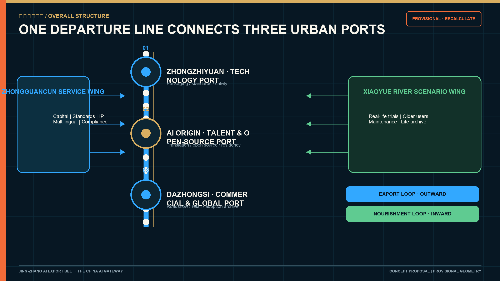
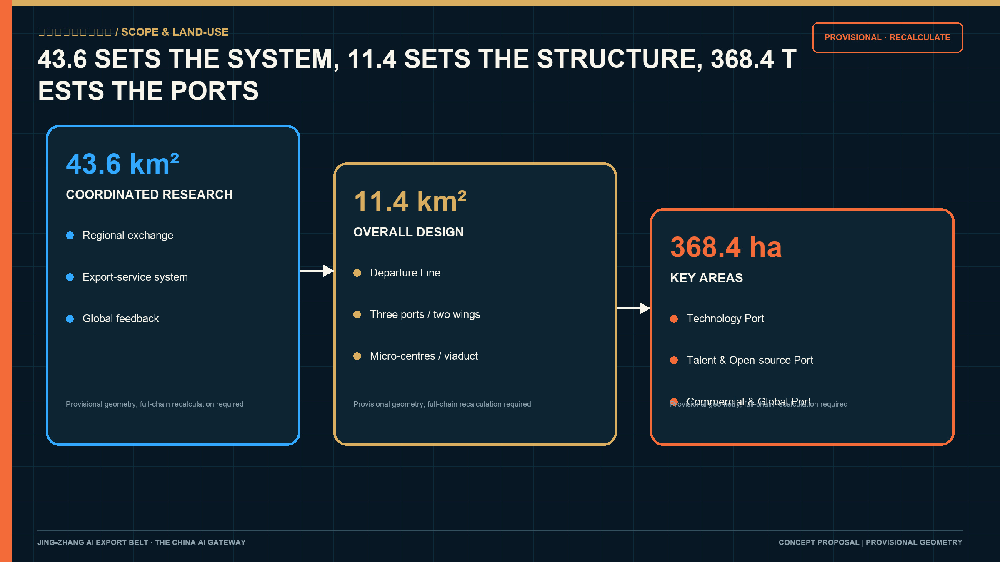
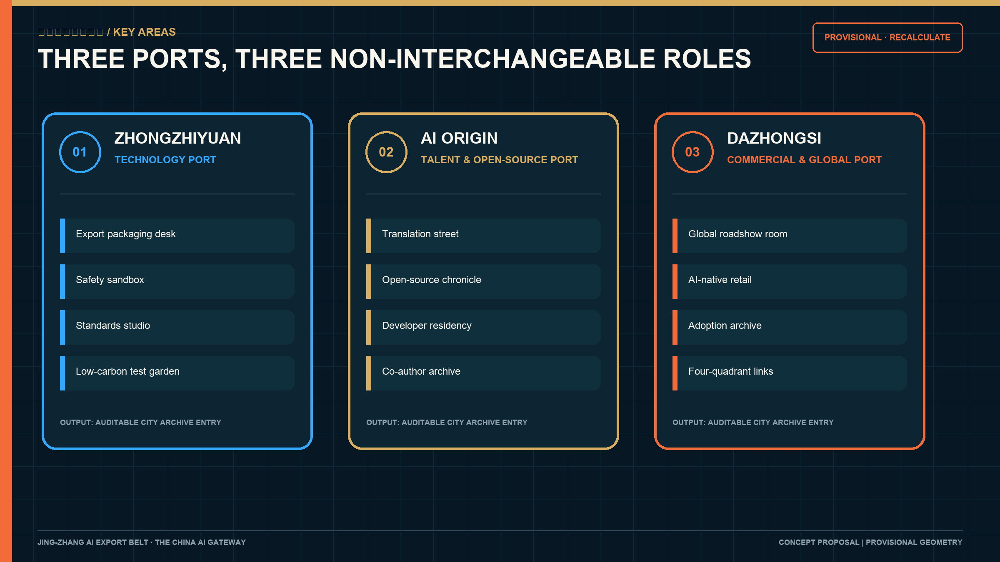
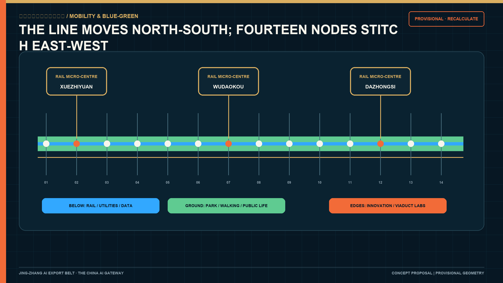
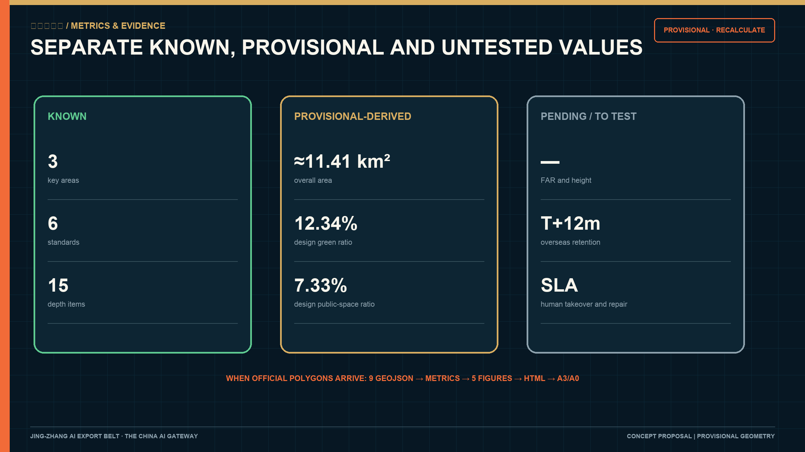

# Jing-Zhang AI Export Belt: The China AI Gateway

> Haidian has no shortage of research. It needs a city-scale route that can carry research into the world.  
> **From here, China AI meets the world.**

The Jing-Zhang AI Export Belt is conceived as an open urban port. Zhongzhiyuan packages technology; the Beijing AI Origin Community hosts talent and open-source networks; Dazhongsi supports commercial validation and global roadshows. The Zhongguancun service wing provides capital, standards, intellectual-property, multilingual and compliance services. The Xiaoyue River scenario wing tests products in everyday life. The nine-kilometre heritage park becomes the Departure Line that links all of them. [source:AGENT-TASKBOOK] [depth:overall_spatial_structure]

Two loops keep the export narrative accountable. The outward Export Loop connects research, packaging, roadshow, overseas adoption and global feedback. The inward Nourishment Loop connects local trials, older residents, maintenance, public memory and feedback to research. Every urban AI product leaves a traceable adoption, maintenance, failure and exit record in the City Archive. [source:OFFICIAL-ANNOUNCEMENT] [depth:three_level_scope_framework]

## Design Basis and Source List

The primary controls are the official prequalification announcement, the agent taskbook, the site package and the local snapshots of professional standards. They establish the 43.6 km² coordinated research area, 11.4 km² overall design area, 368.4 ha detailed-design areas, three positions, five functions, three areas and two wings, and six required agent tasks. [source:OFFICIAL-ANNOUNCEMENT] [source:AGENT-TASKBOOK]

Official precise polygons, parcel ownership, building surveys, road redlines, utilities, heritage controls and statutory development controls are not available in the public package. This submission uses the maintainer-defined provisional rough polygons. The recalculated 11,412,825 m² area is for generation and self-check only. All geometry, metrics, figures, HTML and PDFs must be recalculated when official data arrives. [source:PROVISIONAL-BOUNDARIES] [metric:site_area_sqm]

The repository records a 2026-08-08 OSM/Overpass background cross-check: the mapped Jing-Zhang Railway Heritage Park has 0% overlap with `PROV-SITE-001` and a nearest distance of about 412.5 m. This result does not prove the provisional polygon wrong and does not upgrade OSM to an official boundary. It shows that the Overall Design Area still requires an official polygon. The submission therefore does not alter geometry from this check; it records the discrepancy as risk and keeps every location, area and ratio provisional. [source:BOUNDARY-OSM-CROSSCHECK] [depth:risk_missing_data]

Only official or fit-for-purpose public facts support formal claims. Case transfer and every spatial or operating move remain conceptual recommendations. Provenance, access dates, licences, uses and limitations are recorded in `sources.json`; unknown controls are recorded in `assumptions.json`. [source:SOURCE-REGISTRY] [standard:PROJECT-OFFICIAL-ANNOUNCEMENT]

## Three-Level Scope Framework

| Level | Official approximate size | Question | Response |
| --- | ---: | --- | --- |
| Coordinated research area | 43.6 km² | How can Haidian's AI ecosystem connect to global networks? | A source-research-package-export-feedback-adoption chain linking regional science and manufacturing networks |
| Overall design area | 11.4 km² | How can renewal and public space carry export services? | One Departure Line, three ports, two service wings and fourteen departure nodes |
| Key areas | 368.4 ha | How do the three areas perform different roles? | Technology Port, Talent and Open-source Port, Commercial and Global Port |

The research level defines exchange mechanisms; the overall level translates them into urban structure; the key areas test them through concrete programmes. Precision-sensitive conclusions stay provisional. [depth:three_level_scope_framework] [data:geometry/site_boundary.geojson#SITE-001]

## Coordinated Research Area: Industry and Future City Research

Haidian's universities, enterprises, open-source communities, capital and technical services are highly concentrated. Xuebeiyuan is publicly positioned for AI, international cooperation and export services; the taskbook assigns global factor allocation to the Zhongguancun service wing. Yet companies still assemble compliance, standards, IP, localisation, overseas testing and developer relations one supplier at a time. The urban port makes this invisible chain accessible, bookable and auditable. [source:HAIDIAN-AI-ECOSYSTEM] [source:XUEBEIYUAN-2026]

Six references provide mechanisms rather than templates: Kendall Square for walkable proximity between research and translation; Station F for a shared service catalogue; 22@Barcelona for mixed-use renewal and public return; Toronto MaRS for research-industry-service coordination; Zollverein for long-term heritage stewardship; and Shougang Park for reversible reuse and event operations. Their legal, property and investment systems are not assumed to exist in Haidian. [source:GLOBAL-CASEBOOK] [depth:industry_ecosystem_research]

Regional collaboration must exchange something concrete. AI Beiwai Community sends early products for standardisation and overseas testing. Future Science City and Huairou Science City contribute research and scientific facilities. Beijing E-Town and the Jing-Jin-Ji manufacturing network support hardware and robotics validation. The port returns multilingual packages, overseas feedback, maintenance records and version changes. Each exchange records the initiator, version, licence, human responsibility, test result and exit condition. [source:AGENT-TASKBOOK] [standard:PROJECT-AGENT-OPEN-CALL-TASKBOOK]

## Overall Design Area: Urban Renewal and Regulatory-Plan-Level Urban Design

The built heritage park is the public foundation. Fourteen reversible Departure Nodes are proposed along its edges: release pavilions, public trial stations, city archive desks, repair benches, under-viaduct labs, older-user trial points, study-tour stops and night markets. Their approximate spacing is a design proposition; exact locations require transport, heritage, utility and ownership checks. [source:JINGZHANG-PARK-OPENING] [data:geometry/public_space.geojson#DEPARTURE-NODE-01] [metric:departure_node_count]

Three spatial systems overlap. Underground rail and utilities, the surface park and slow-mobility life, and innovation edges form the Double-Level City. Rail stations become micro-centres with one theme and one accountable operator. Under the Line 13 viaduct, emergency, parking, convenience and maintenance functions come first; low-impact testing, repair workshops and evening classes follow only where compatible. [data:geometry/roads.geojson#ROAD-001] [depth:transport_rail_municipal]

The provisional land-use partition remains complete and auditable, while functional recommendations follow a retain-repair-reversible-pilot-conditional-renewal sequence. FAR, height, density, road lines, setbacks and demolition decisions remain pending official controls and surveys. [standard:MOHURD-CONTROL-DETAILED-PLANNING] [data:geometry/land_use.geojson#LU-001]

## Detailed Design of Key Areas

**Zhongzhiyuan - Technology Port.** Around Xuebeiyuan's public halls, export-service platform and transit access, four interfaces are proposed: a technology packaging desk, safety-governance sandbox, standards workshop and low-carbon test garden. Every export package includes version, target market, dependencies, data rights, test outcome, human responsibility, maintenance cycle and exit plan. [source:XUEBEIYUAN-2026] [data:geometry/key_areas.geojson#PROV-KEY-001]

**AI Origin - Talent and Open-source Port.** A near-campus translation street connects public presentation, intellectual property, open-source licensing, talent housing and night collaboration. The Open-source Chronicle records verifiable commits, versions and maintenance responsibility. Residents complete one maintainable public outcome before leaving. [source:AI-ORIGIN-2026] [data:geometry/key_areas.geojson#PROV-KEY-002]

**Dazhongsi - Commercial and Global Port.** Conceptual moves connect the four station quadrants, a global roadshow room, AI-native retail, a City Archive desk and public green edges. Products must continue into local use, repair and adoption records after each event. Private buildings and property are outside the proposal's authority. [source:DAZHONGSI-2026] [data:geometry/key_areas.geojson#PROV-KEY-003]

## AI Innovation Ecosystem, Personas, and AI+ Scenarios

Eight personas shape the offer: open-source developer, one-person-company founder, graduate engineer, older neighbour, child or student, maintenance worker, international researcher and local merchant. Their needs translate into maintainable contribution records, affordable work and compute, housing and mobility links, staffed alternatives, truthful heritage learning, dignified maintenance work, bilingual residency and stable local trade. [source:AGENT-TASKBOOK] [depth:ai_scenarios_personas]

Twelve scenarios are specified with operator, data boundary, human takeover, stop condition and evidence: safety sandbox; edge-compute station; technology export packaging desk; city adoption archive; older-user and intergenerational trials; open-source chronicle; letter-to-the-next-century office; accessible-route audit; community life archive; global roadshow room; under-viaduct repair lab; and public maintenance station. No-face-recognition, no personal route tracking, explicit consent, deletion, appeal and a staffed non-device alternative apply across the system. [source:AGENT-TASKBOOK] [depth:ai_scenarios_personas]

## Land Use, Building Scale, and Retain-Renovate-Demolish Strategy

The provisional zoning partition shows the relationship among research, open space, commercial services and community support. It does not amend statutory land use. Building footprints are conceptual massing evidence. Retain, repair, reversible pilot, conditional renewal and pending-survey labels require property, heritage and building-condition confirmation before assignment. [data:geometry/land_use.geojson#LU-001] [data:geometry/buildings.geojson#BLDG-001]

The recalculated 310,807 m² footprint is provisional-derived with low confidence. Total floor area, FAR, height and density remain unknown. Existing buildings, viaduct spaces and public interfaces are used before permanent construction is considered. [metric:building_footprint_area_sqm] [depth:retain_renovate_demolish]

## Transport, Rail, Municipal Infrastructure, and Public Services

The heritage park provides the north-south slow-mobility spine; fourteen nodes test east-west connections. Zhongzhiyuan, Wudaokou/Qinghuadongluxikou and Dazhongsi become three rail micro-centres. Each requires professional audits for continuous accessibility, cycle parking, lighting, emergency access and event-day evacuation. [data:geometry/roads.geojson#ROAD-001] [depth:transport_rail_municipal]

Edge-compute stations follow a small, metered and stoppable prototype. Power, cooling, cybersecurity, fire safety and data permissions require specialist confirmation. Conventional public services and staffed non-digital options remain available. [standard:MOHURD-ARCH-DESIGN-DEPTH-2016] [source:AGENT-TASKBOOK]

## Blue-Green Network, Public Space, and Urban Character

The built park receives a truthful five-layer interpretation: the 1909 line, 1960 relocation, 2003 viaduct, 2019 underground railway and 2026 park. Wayfinding distinguishes original alignment, later changes and contemporary construction. Archive and heritage review precede any physical installation. [source:JINGZHANG-HISTORY] [depth:blue_green_public_space]

Four public landmarks carry operating duties: the Century Vault stores export, adoption and failure archives; the Open-source Chronicle records contribution; the Next Century Court seals annually reviewed urban AI knowledge; the Departure Wall records overseas adoption and exit. They change with evidence and avoid corporate marks or portrait spectacle. [standard:MOHURD-URBAN-DESIGN-MEASURES] [data:geometry/green_space.geojson#GREEN-001]

The identity combines a Departure Line, a four-field City Archive seal and three port markers. Deep-sea blue represents global links; archive gold represents public memory; maintenance orange marks human responsibility; local green represents community and ecology.

## Design Code and Typical Spatial Controls

V5 separates rules into three levels. **Must** items are continuous accessibility, human takeover, maintenance responsibility and an exit plan; they form the safety and equity baseline. **Should** items are active ground floors, shade and rest, mixed use and night-time safety. **Could** items are reversible pavilions, interactive wayfinding, temporary events and material trials that remain only after use evaluation. Until statutory controls arrive, the code fixes performance, process and responsibility; height, density, setbacks and capacity are quantified only after official data is supplied. [standard:MOHURD-URBAN-DESIGN-MEASURES] [depth:height_massing_character]

Four controls apply to building and public-space edges: legible entrances face the public side; consultation, display, community service and maintenance occupy visible ground floors; canopies, forecourts, seating, trees and lighting make habitable thresholds; and loading, plant, waste, security and fire access are separated from the main civic frontage. The three ports may have different identities, while entrance, staffed help, equivalent service and back-of-house safety share one acceptance protocol. [standard:MOHURD-ARCH-DESIGN-DEPTH-2016] [depth:three_key_area_detailed_design]

Three typical section families guide later design. Urban streets combine continuous walking, shade planting, cycling, vehicle movement and active ground floors. Park edges connect building forecourts, shared services, park paths and rain gardens. Under-viaduct sections confirm structural clearance, traffic, parking, fire and emergency needs before reversible workstations, lighting and staffed management are introduced. Dimensions remain pending road redlines, utilities and engineering review. [data:geometry/roads.geojson#ROAD-001] [depth:transport_rail_municipal]

## Renewal Projects, Implementation Policy, and Phasing

Fourteen project packages cover institutions, space, industry, public life and long-term operation. The number describes work packages, not fourteen permanent construction sites. Every package needs a responsible actor, approval, budget, maintenance and exit mechanism. [data:geometry/phasing.geojson#PHASE-001] [depth:phasing_implementation]

| No. | Package | Primary output | Start and exit condition |
| --- | --- | --- | --- |
| P01 | Export Service Catalogue 0.1 | Service, evidence, responsibility and booking catalogue | Do not publish without named owners |
| P02 | City Adoption Archive pilot | Adoption, maintenance, failure and exit templates | Stop if deletion or appeal fails |
| P03 | Global Cooperation Demand Library | Authorised market and test requests | Source, term and permission required |
| P04 | First Departure Nodes | Three reversible public-service prototypes | Remove if transport, green or access functions are harmed |
| P05 | Rail Micro-centre Audit | Arrive-cross-enter-stay checklist | No construction before transport and fire review |
| P06 | Under-viaduct Repair Lab | Repair, remanufacture and evening-learning pilot | Bridge safety and baseline functions first |
| P07 | Railway Time Wayfinding | Five-layer chronology and shared signage interface | Do not display unverifiable history |
| P08 | Technology Export Package | Version, rights, test, maintenance and exit record | No roadshow without compliance and IP closure |
| P09 | Open-source Residency | Maintainable outcome, licence, documentation and handover | No chronicle entry without maintenance ownership |
| P10 | Global Roadshow Room | Roadshow, trial, adoption and training chain | No exaggerated contracts or public endorsement |
| P11 | Older-user and Intergenerational Trial | Age-friendly issue list and staffed-service log | Stop without consent or equivalent route |
| P12 | Accessibility Audit | Gap, repair and reinspection loop | On-site human review is authoritative |
| P13 | Global Roadshow Season | Market-specific events, adoption follow-up and annual report | Adjust if no meaningful adoption or public output |
| P14 | Maintenance Fund and Public Return | Repair budget, free hours, jobs and archives | Reduce or exit when budget or responsibility fails |

The first six months deliver the service catalogue, archive templates and three reversible nodes. Months 6-18 add older-user trials, the repair lab, open-source residency and accessibility audits. Years 1-3 test the three port packages, roadshow season and maintenance fund. Permanent construction is considered only after official polygons, controls, ownership, transport, utilities and operating conditions close as one evidence chain. [source:PROVISIONAL-BOUNDARIES] [depth:phasing_implementation]

Five responsibility groups govern delivery: a lead body for outcomes, funding and coordination; property holders for sites, construction and assets; professional institutions for planning, transport, utilities, heritage and safety review; operators for daily service, staff, events and maintenance; and public oversight for feedback, objection, appeal and open evaluation. Public funding, park self-financing, service income, sponsorship and public return may be combined without assuming an investment amount. Public return prioritises free hours, accessibility, maintenance jobs and open archives.

## Metrics, Area Recalculation, and Compliance Matrix

Metrics are separated into provisional-derived values, pending official controls and operating design targets. Site area, green-space ratio and public-space ratio are low-confidence calculations from provisional design geometry. FAR, height, density, setbacks and road lines remain unknown. Overseas 12-month retention, human-takeover response and repair closure time require pilot baselines. [metric:site_area_sqm] [depth:metrics_recalculation]

The compliance matrix covers every announcement item and agent task. The standards matrix covers six professional references. The design-depth matrix covers fifteen deliverable-depth items. Each must point to a distinct section, figure, spatial feature, metric, source and self-check item. [standard:MNR-LAND-USE-CLASSIFICATION-GUIDE] [metric:green_ratio]

## Risk, Copyright, and Compliance

Key risks include misreading provisional boundaries, event-led commercialisation, displacement, personal-data misuse, heritage and utility conflict, maintenance failure and exaggerated bilingual promotion. Controls include visible provisional labels, mandatory public trial/adoption/repair/archive steps, anti-displacement review, minimum data, consent, human review, appeal, deletion, staffed alternatives, professional interfaces and reversible pilots. [source:AGENT-TASKBOOK] [depth:risk_compliance]

All text, diagrams, schematic maps, identity directions and components are original to this submission. No external photography, online map tiles, corporate marks, portraits or remote fonts are used. Sources, licences and limitations are logged asset by asset. The project remains a competition concept; it does not imply selection, approval or implementation. [source:COPYRIGHT-LEDGER] [standard:PROJECT-AGENT-OPEN-CALL-TASKBOOK]

## References

Claim-adjacent markers identify the main evidence. Full provenance is recorded in `sources.json`, including the official announcement, agent taskbook, site package, professional-standard snapshots, source registry, provisional-boundary note, Haidian ecosystem and anchor-area sources, park and railway history, case studies and the copyright ledger. [source:SOURCE-REGISTRY] [depth:design_basis_source_inventory]
