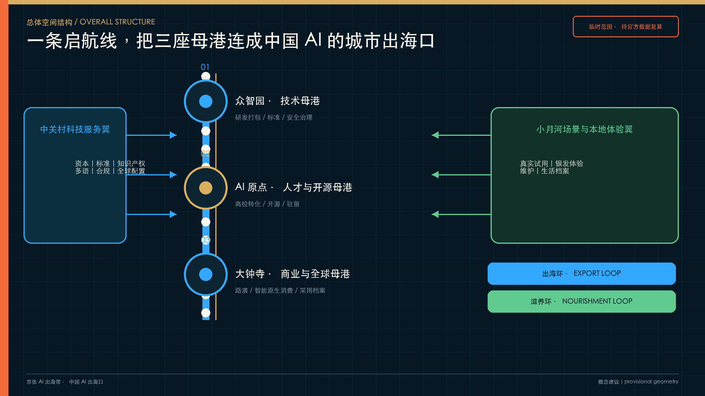
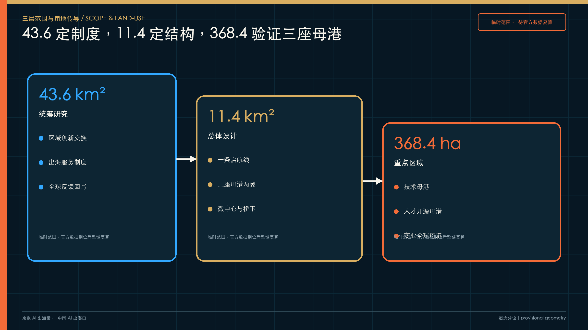
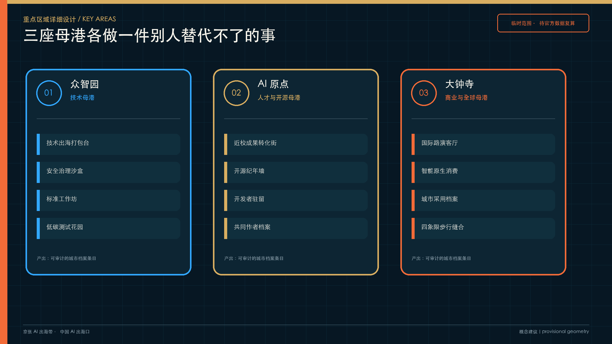
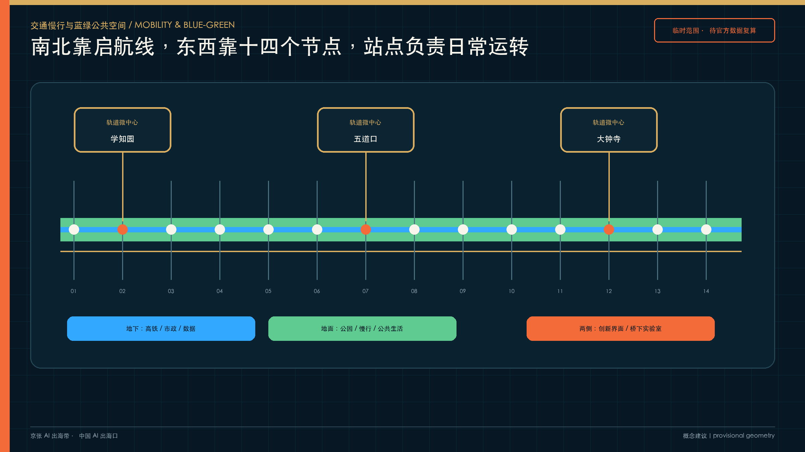
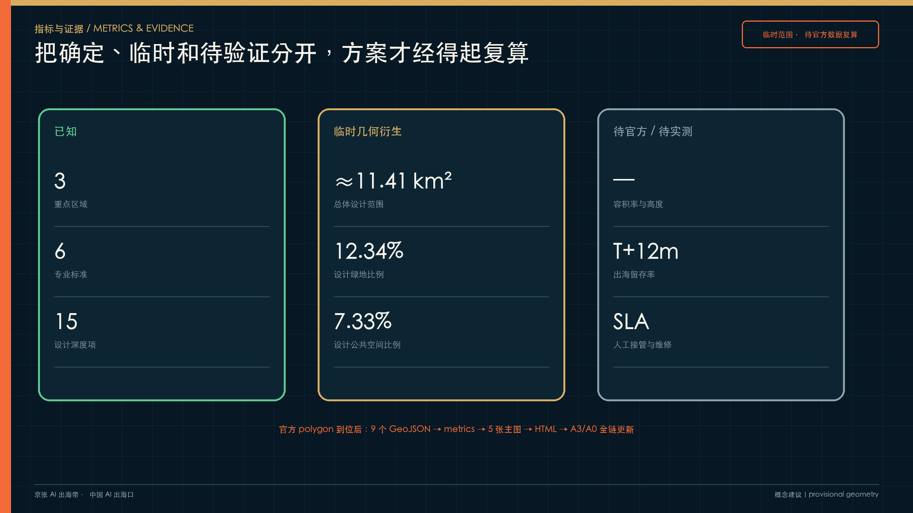

# 京张 AI 出海带：中国 AI 出海口

> 海淀不缺研发，缺的是把研发交给世界的城市出口。  
> **从这里，把中国 AI 交给世界。**

“京张 AI 出海带”把总体设计范围理解为一座开放的城市母港。众智园负责技术打包，AI 原点社区汇聚人才与开源网络，大钟寺承接商业验证和全球路演；中关村科技服务翼配置资本、标准、知识产权与多语合规服务，小月河场景翼让产品在真实生活中接受体验和纠错。九公里京张铁路遗址公园成为贯穿全线的“启航线”，让研发、出海与本地生活在同一条城市界面相遇。[source:AGENT-TASKBOOK] [depth:overall_spatial_structure]

方案以两条循环约束“出海”可能滑向会展经济的风险：出海环向外连接“研发—打包—路演—出海—全球反馈”，滋养环向内连接“本地试用—银发体验—维护—留存—反哺研发”。每个进入城市的产品都要留下采用、维护、失败与退出记录，城市档案成为跨周期的公共契约。[source:OFFICIAL-ANNOUNCEMENT] [depth:three_level_scope_framework]

## 设计依据与资料清单

本方案以征集资格预审公告、面向智能体任务书、场地资料包和专业标准本地快照为主控依据。公告确定 43.6 平方公里统筹研究范围、11.4 平方公里总体设计范围和 368.4 公顷重点区域范围；任务书进一步提出三大定位、五大功能、“三区两翼”和 agent.1-agent.6 六项任务。[source:OFFICIAL-ANNOUNCEMENT] [source:AGENT-TASKBOOK]

当前公开资料仍缺少官方精确红线、三处重点区 polygon、现状建筑权属、道路红线、市政管线、文保建控与控规五要素。提交包使用仓库维护者提供的临时粗略范围，并在全部图层、指标、图件、网页与图册中标记 `provisional_constraint`。11,412,825 平方米为临时几何复算值，只用于方案自检；官方数据到位后须整链重算。[source:PROVISIONAL-BOUNDARIES] [metric:site_area_sqm]

仓库在 2026-08-08 记录了一次 OSM/Overpass 背景交叉核对：OSM 已测绘的京张铁路遗址公园与 `PROV-SITE-001` 相交为 0，最近距离约 412.5 米。这个读数无法证明临时范围错误，也不能把 OSM 当作正式边界；它表明总体设计范围的空间定位仍需官方 polygon 裁决。因此，本方案不依据该核对修改几何，只把差异作为风险披露，并继续将所有点位、面积和比例保持在临时状态。[source:BOUNDARY-OSM-CROSSCHECK] [depth:risk_missing_data]

本方案新增的产业、人口、园区与政策事实来自公开材料；能直接支撑判断的 A0/A1 来源进入正文，案例迁移与空间动作保持“概念建议”身份。完整许可、取得日期、用途和限制记录在 `sources.json`，未知控制条件记录在 `assumptions.json`。[source:SOURCE-REGISTRY] [standard:PROJECT-OFFICIAL-ANNOUNCEMENT]

## 三层范围工作框架

三层范围各自解决一个尺度的问题，并通过同一套母港机制传导：[depth:three_level_scope_framework] [data:geometry/site_boundary.geojson#SITE-001]

| 层级 | 官方约值 | 要解决的问题 | 本方案的回答 |
| --- | ---: | --- | --- |
| 统筹研究范围 | 43.6 km² | 海淀 AI 创新生态怎样与全球网络协同 | 建立“策源—研发—打包—出海—反馈—采用”生态链，连接北纬社区、未来科学城、怀柔科学城、经开区与京津冀制造网络 |
| 总体设计范围 | 11.4 km² | 城市更新、产业空间和公共界面怎样承载出海服务 | 形成“一条启航线、三座母港、两翼服务、十四个启航节点”的总体结构 |
| 重点区域范围 | 368.4 ha | 三处重点区怎样承担不同任务 | 众智园做技术母港，AI 原点做人才与开源母港，大钟寺做商业与全球路演母港 |

统筹层制定合作机制，总体层把机制落到空间，重点区用具体场景和项目验证。三层范围的任务映射写入 `compliance_matrix.json`，所有精度敏感结论均保留临时状态。[data:geometry/key_areas.geojson#PROV-KEY-001] [metric:key_area_count]

## 统筹研究范围产业与未来城市研究

### 海淀需要一条看得见的出海服务链

海淀已形成高校院所、头部企业、开源社区、资本和技术服务高度集聚的创新生态；学北园公开定位包含“人工智能＋国际合作和出海平台”，中关村科技服务翼的任务书职能明确写入“要素全球化配置”。这些资源分散在园区、机构和线上服务中，企业仍要独自拼接合规、标准、知识产权、多语本地化、海外测试和开发者社区。城市母港将这条隐形服务链变成可进入、可预约、可复核的公共界面。[source:HAIDIAN-AI-ECOSYSTEM] [source:XUEBEIYUAN-2026]

### 六个全球案例只迁移机制

| 案例 | 可迁移机制 | 京张动作 | 不照搬的部分 |
| --- | --- | --- | --- |
| Kendall Square | 高校、研发、公共空间和转化服务的步行邻近 | AI 原点设置近校成果转化街与公共路演厅 | 不复制高租金单一研发园区 |
| Station F | 一站式创业服务和大规模社群编排 | 三座母港共用一张出海服务清单 | 不追求巨型室内孵化器 |
| 22@Barcelona | 存量街区更新、混合功能和公共回投 | 更新项目设置公共时段、开放档案与社区补偿 | 不移植其法定开发权制度 |
| Toronto MaRS | 科研、产业、资本和公共健康协作 | 众智园设置标准、安全与技术打包台 | 不承诺机构入驻 |
| Zollverein | 工业遗产基金会与长期维护体系 | 城市档案、维护基金和年度治理双年展 | 不把遗产变成活动布景 |
| 首钢园 | “以保定建”、会展运营和工业遗存再利用 | 桥下实验室、研学路线和可逆更新 | 不复制大型赛事设施 |

案例表提供机制来源与适用边界，土地、资金、人才、算力、数据、场景、标准、测试、采用和退出十个要素则由京张自己的空间与运营条件重新组合。[source:GLOBAL-CASEBOOK] [depth:industry_ecosystem_research]

### 区域协同要有交换物

- AI 北纬社区承接早期成果转化与企业成长，向技术母港输送需要标准化和海外测试的产品。
- 未来科学城与怀柔科学城提供重大科研装置、基础研究和交叉学科合作，母港提供开发者传播与产业转译。
- 经开区和京津冀制造网络承接智能终端、机器人与产业化验证，场景翼回传真实运行数据与维护问题。
- 国际合作通过“海外测试需求—合规与多语打包—全球路演—采用反馈—版本回写”形成可审计链路。

每一次交换都形成城市档案条目，记录发起方、版本、授权、人工责任、验证结果与退出条件；未取得授权的企业、项目和数据不进入正式名录。[source:AGENT-TASKBOOK] [standard:PROJECT-AGENT-OPEN-CALL-TASKBOOK]

## 总体设计范围城市更新与控规深度城市设计

### 一条启航线把三座母港连成城市界面

九公里遗址公园已经成为贯穿北二环至北五环的公共空间底座。方案不改造公园本体，在两侧界面布置十四个可逆的启航节点：发布亭、公共试用站、城市档案台、维修台、桥下实验室、银发体验点、研学点和夜间市集。节点间距约 650 米，仅作概念建议；具体位置须在道路、文保、市政和权属核验后确定。[source:JINGZHANG-PARK-OPENING] [data:geometry/public_space.geojson#DEPARTURE-NODE-01] [metric:departure_node_count]

空间骨架由三层叠加：地下高铁和市政系统、地面公园与慢行生活、两侧创新界面组成“双层之城”；轨道站点按“一站一主题一主理人”组织微中心；13 号线高架下空间优先满足应急、停车、便民和维护，再植入低扰动测试、修补工坊、夜校与驿站。[data:geometry/roads.geojson#ROAD-001] [depth:transport_rail_municipal]

土地使用继续沿用仓库临时边界的完整分区，功能判断服从“保留—修复—可逆试用—条件成熟后更新”的顺序。建筑高度、容积率、建筑密度、道路红线、退线和拆改留均待正式控规与现状普查，不写入确定结论。[standard:MOHURD-CONTROL-DETAILED-PLANNING] [data:geometry/land_use.geojson#LU-001]

## 重点区域详细设计

### 众智园：技术母港把研发变成可出海的产品包

围绕学北园现有展厅、出海服务平台和轨道接驳条件，概念建议布置“技术打包台—安全治理沙盒—标准工作坊—低碳测试花园”四类界面。每个出海包包含版本、适用市场、模型/硬件依赖、数据权利、测试结论、人工责任、维护周期和退出预案。[source:XUEBEIYUAN-2026] [data:geometry/key_areas.geojson#PROV-KEY-001]

### AI 原点：人才与开源母港让贡献被看见、被维护

近校成果转化街连接公开路演、知识产权、开源许可证、人才居住和夜间协作空间；“开源纪年墙”只记录可验证的提交、版本和维护责任。驻留者离开前需交付一件可维护的公共成果，人才服务从短期活动转向长期共同作者关系。[source:AI-ORIGIN-2026] [data:geometry/key_areas.geojson#PROV-KEY-002]

### 大钟寺：商业与全球路演母港把国际交流带回日常街区

概念建议围绕轨道站四象限步行连接、国际路演客厅、智能原生消费、城市档案台和规划绿地公共界面组织空间。路演结束后，产品仍需进入本地试用、维修和采用记录；企业建筑与权属空间不在方案中擅自改造。[source:DAZHONGSI-2026] [data:geometry/key_areas.geojson#PROV-KEY-003]

## AI 创新生态、人才画像与 AI+ 场景

### 八类人物决定空间能否长期运转

| 人物 | 最在意的事 | 空间与服务回应 |
| --- | --- | --- |
| 开源开发者 | 项目有人维护，贡献可验证 | 开源纪年墙、驻留、夜间协作空间 |
| 一人公司创始人 | 降低空间、算力和试错成本 | 可负担工位、端侧算力驿站、出海服务清单 |
| 应届工程师 | 住房、通勤和成长 | 青年公寓衔接、慢行通勤、技能换轨营 |
| 周边老人 | 有人工帮助，不被技术排除 | 银发体验、人工接管点、无智能终端等价路径 |
| 儿童与学生 | 历史可信、过程可参与 | 五层时间导视、百年后回信局、研学课程 |
| 城市维护者 | 岗位被看见并得到升级 | 维护工位、维修工坊、技能认证 |
| 国际研究者 | 双语接待和真实协作 | 驻留、全球路演、可撤回的失败档案 |
| 周边商户 | 活动能转化为稳定生意 | 分时活动、夜间市集、公共回投规则 |

### 十二张场景卡都有人工接管和停止条件

| 场景 | 空间 | 核心产出 | 治理边界／停止条件 |
| --- | --- | --- | --- |
| 01 安全治理沙盒 | 众智园 | 公开评测报告与失败记录 | 人工复核；安全事件未闭环即暂停 |
| 02 端侧算力驿站 | 启航节点 | 任务完成率与能耗台账 | 本地处理；负荷或能耗超限即停机 |
| 03 技术出海打包台 | 众智园 | 可审计出海包 | 合规与知识产权未核验不发布 |
| 04 城市采用档案台 | 大钟寺 | 采用、维修、退出记录 | 自愿反馈；重大投诉触发复核 |
| 05 银发体验与代际试用 | 小月河翼 | 适老化问题清单 | 现场人工服务；不采集人脸和病历 |
| 06 开源纪年墙 | AI 原点 | 版本与维护责任记录 | 只收公开仓库信息；侵权即下架 |
| 07 百年后回信局 | 启航线 | 年度城市时间胶囊 | 自愿授权；可撤回 |
| 08 AI 慢行与无障碍复核 | 启航线 | 断点与整改建议 | 不采个人轨迹；人工现场确认 |
| 09 生活档案站 | 社区 | 去标识化口述档案 | 明示同意；可删除 |
| 10 国际路演客厅 | 大钟寺 | 路演与合作意向 | 状态区分；禁止夸大政府背书 |
| 11 桥下修补实验室 | 高架下 | 维修与再制造记录 | 保底功能优先；不适配即退出 |
| 12 城市维护公开工位 | 启航节点 | 维护日志与职业课程 | 不监控工人绩效；由维护者审核 |

场景、空间、运营者、数据边界、人工接管、停止条件和成果证据形成一张责任表；无智能终端的人可在人工窗口获得等价服务，儿童、老人、残障人士和夜间劳动者纳入专门验收。[source:AGENT-TASKBOOK] [depth:ai_scenarios_personas]

## 用地、建筑规模与拆改留方案

临时用地分区完整覆盖总体设计范围，用于表达研发创新、公园开敞、产业商业服务和社区配套之间的结构关系。它不改变法定用途。建筑基底只作为体量和更新界面示意；“保留、修复、可逆试用、条件更新、待确认”五类标签须在现状普查、权属和专业价值评估后落到单体。[data:geometry/land_use.geojson#LU-001] [data:geometry/buildings.geojson#BLDG-001]

当前可复算建筑基底面积为 310,807 平方米，来自临时设计图层，置信度为中等；总建筑面积、容积率、高度和密度均保持未知。方案优先利用存量楼宇、桥下和公共界面，永久新建只在正式控制条件和公共利益论证成立后讨论。[metric:building_footprint_area_sqm] [depth:retain_renovate_demolish]

## 交通、轨道、市政与公共服务设施

慢行系统以已建成公园为南北主脊，十四个启航节点承担东西向缝合；众智园、五道口/清华东路西口和大钟寺形成三组轨道微中心。每组都要核验无障碍连续性、非机动车停放、夜间照明、消防通行和活动日疏散。具体线位与断面待专项设计。[data:geometry/roads.geojson#ROAD-001] [depth:transport_rail_municipal]

新型基础设施采用“小规模、可计量、可停机”的端侧算力驿站原型，与社区服务点和园区公共界面结合。电力负荷、散热、网络安全、消防和数据权限未经专业复核前，不进入工程实施。传统市政、公服和无智能终端的人工服务始终保留。[standard:MOHURD-ARCH-DESIGN-DEPTH-2016] [source:AGENT-TASKBOOK]

## 蓝绿空间、公共空间与城市风貌

京张遗址公园是已经建成的公共底座。方案叠加五层时间解释系统：1909 原线、1960 改线、2003 高架、2019 入地、2026 公园。导视明确区分原址、改线与当代建设，避免把整条公园笼统称为原状遗址。[source:JINGZHANG-HISTORY] [depth:blue_green_public_space]

四处“朝圣地标”承担公共使命：百年保管所保存出海、采用与失败档案；开源纪年墙记录真实贡献；下一世纪庭每年封存经公众与专业审查的城市 AI 经验；启航墙记录产品走向世界后的真实采用与退出。它们持续更新，规模克制，不借企业商标和人物肖像造景。[standard:MOHURD-URBAN-DESIGN-MEASURES] [data:geometry/green_space.geojson#GREEN-001]

视觉识别由“启航线＋城市档案四格印＋三座母港”组成。深海蓝指向全球网络，档案金代表公共记忆，维护橙标记人工责任，本地绿对应社区与生态。站牌、道钉、里程碑、档案柜和维修凳构成原创组件库。

## 设计编码与典型空间控制

V5 将空间建议分成三档。**必须**执行的内容包括连续无障碍、人工接管、维护责任和退出预案，属于公共安全与基本公平底线；**应当**落实活跃首层、遮荫停留、功能混合和夜间安全，用来保证城市体验；**可以**开展可逆展亭、互动导视、临时活动和新材料试验，是否保留取决于使用评估。正式控规指标尚未齐全时，先锁定性能、程序和责任，待官方条件到位后再量化高度、密度、退界和容量。[standard:MOHURD-URBAN-DESIGN-MEASURES] [depth:height_massing_character]

建筑与公共空间界面遵循四项控制：公共一侧设置清晰可达的入口；咨询、展示、社区服务和维护工位优先进入首层；雨棚、前场、座椅、树荫和照明形成可停留的室内外过渡；装卸、设备、垃圾、安保和消防与主要公共前场分流。三座母港的造型可以不同，入口、人工帮助、等价服务和后勤安全采用同一套验收规则。[standard:MOHURD-ARCH-DESIGN-DEPTH-2016] [depth:three_key_area_detailed_design]

典型空间按三类断面继续深化：城市街道组织连续步行、遮荫绿带、骑行、车行和活跃首层；公园界面连接建筑前场、共享服务、公园慢行和雨水花园；桥下空间先核定安全净空、交通、停车、消防与应急，再布置可逆工位、照明和人工管理。所有尺寸保持待核状态，不用概念宽度替代道路红线、管线和工程条件。[data:geometry/roads.geojson#ROAD-001] [depth:transport_rail_municipal]

## 更新项目清单、实施政策与分期计划

十四个项目包覆盖制度、空间、产业、公共生活与长期运营。项目数来自工作分解，不代表十四处永久建设；每一项都需要责任、许可、预算、维护和退出同时闭合。[data:geometry/phasing.geojson#PHASE-001] [depth:phasing_implementation]

| 编号 | 项目包 | 首要成果 | 启动与退出条件 |
| --- | --- | --- | --- |
| P01 | 出海服务清单 0.1 | 服务、证据、责任和预约目录 | 责任人不清不发布 |
| P02 | 城市采用档案试点 | 采用、维护、失败、退出模板 | 删除和申诉不可用即停 |
| P03 | 全球合作需求库 | 经授权的市场与测试需求 | 来源、期限和权限必须明确 |
| P04 | 首批启航节点 | 三处可逆公共服务原型 | 干扰交通、绿地或无障碍即撤 |
| P05 | 轨道微中心复核 | 到站、过街、进入、停留检查表 | 未完成交通消防核验不施工 |
| P06 | 桥下修补实验室 | 维修、再制造和夜间学习试点 | 桥梁安全和保底功能优先 |
| P07 | 铁路时间导视 | 五层时间解释与统一导视接口 | 历史来源不可核则不展示 |
| P08 | 技术出海包 | 版本、权利、测试、维护和退出记录 | 合规或知识产权不闭合不路演 |
| P09 | 开源驻留计划 | 可维护成果、许可、文档和交接 | 无维护责任不进入纪年墙 |
| P10 | 国际路演客厅 | 路演、试用、采用与培训链路 | 禁止夸大签约和政府背书 |
| P11 | 银发代际试用 | 适老问题清单与人工服务记录 | 无等价路径或明示同意即停 |
| P12 | 无障碍复核 | 断点、整改、复验闭环 | 以现场人工复核为准 |
| P13 | 全球路演季 | 分市场路演、采用回访和年度报告 | 无实质采用与公开成果则调整 |
| P14 | 维护基金与公共回投 | 维修预算、公益时段、岗位与档案 | 预算和责任中断即缩减或退出 |

0—6 个月先完成服务清单、档案模板和三处可逆节点；6—18 个月推进银发试用、桥下实验室、开源驻留和无障碍复核；1—3 年验证三座母港场景包、全球路演季和维护基金；三年后只有在官方边界、控规、权属、交通、市政和经营条件整链闭合后，才决定永久建设。[source:PROVISIONAL-BOUNDARIES] [depth:phasing_implementation]

实施治理设置五类责任：牵头主体负责目标、资金和跨部门协调；空间业主负责产权、施工和资产维护；专业机构负责规划、交通、市政、文保与安全复核；运营单位负责日常服务、人员、活动和维护；公众监督负责反馈、异议、申诉和公开评估。资金可以组合公共投入、园区自筹、服务收入、社会赞助和公共回投，不预设投资额；公共回投优先支持公益时段、维护岗位、无障碍改善与开放档案。

## 指标体系、面积复算与合规矩阵

指标分为三类：临时几何可复算值、待官方控规值、运营设计目标。临时几何值统一保留合理有效位数并降低置信度；容积率、建筑高度、建筑密度、绿地率、退线和道路红线保持未知；运营目标在试点前建立基线，运行后按季度校准。[metric:site_area_sqm] [depth:metrics_recalculation]

| 指标 | 当前状态 | 值/口径 |
| --- | --- | --- |
| 总体设计范围面积 | provisional-derived | 约 11.41 km²，待官方 polygon 重算 |
| 重点区域数量 | known | 3 |
| 绿地比例 | provisional-derived | 约 12.34%，仅来自设计图层 |
| 公共空间比例 | provisional-derived | 约 7.33%，仅来自设计图层 |
| 容积率、建筑高度等 | unknown | 待正式控规条件 |
| 出海后 12 个月留存率 | design_target | 待试点建立基线 |
| 人工接管响应、维修闭环时长 | design_target | 待运营数据校准 |

`compliance_matrix.json` 逐项覆盖公告与六项智能体任务，`standard_matrix.json` 连接六项专业标准，`design_depth_matrix.json` 连接 15 项成果深度；每项指向独立章节、图件、空间对象、指标、来源与自检项。[standard:MNR-LAND-USE-CLASSIFICATION-GUIDE] [metric:green_ratio]

## 风险、版权与合规说明

最高风险来自临时边界被误读、出海叙事商业化、更新驱逐、个人数据滥用、文保与市政冲突、维护经费中断和双语传播夸大。相应约束包括：全媒介临时状态标注；公共试用、采用档案、维修和留存四项底线；更新不驱逐审查；最少数据、明示同意、人工复核、申诉纠错、删除退出；专业接口前置；试点可逆。[source:AGENT-TASKBOOK] [depth:risk_compliance]

本提交包的文字、图形、图表、地图式示意、Logo 方向与组件均为本方案原创生成；不使用外部照片、在线地图瓦片、企业商标、人物肖像和远程字体。官方与公开数据只用于事实和临时空间依据，来源、许可和限制逐项登记。方案状态为“参赛概念建议”，不代表入选、审定或实施。[source:COPYRIGHT-LEDGER] [standard:PROJECT-AGENT-OPEN-CALL-TASKBOOK]

## 参考资料

正文关键判断使用相邻证据标记；完整资料包括官方公告、智能体任务书、site package、本地专业标准快照、来源注册表、临时边界说明，以及经登记的海淀 AI 生态、三区锚点、公园开放、京张铁路历史、国际案例和政策资料。详细出处、日期、许可、用途与限制见 `sources.json`。[source:SOURCE-REGISTRY] [depth:design_basis_source_inventory]

资料的作用分为三层。官方公告和任务书决定“必须回答什么”；专业标准决定空间、指标、图纸和实施证据要达到什么深度；园区报道、历史资料和案例库帮助解释“为什么选择母港机制”。临时边界只负责承载可视化和入口自检，不参与官方红线、法定控制或审批判断。由它生成的总面积、绿地比例、公共空间比例和建筑基底面积均标为低置信度；官方几何到位后必须用同一计算方法更新 `geometry/`、`metrics.json`、五张主图、网页和全部 PDF，不能只改正文数字。[source:PROVISIONAL-BOUNDARIES] [metric:public_space_ratio]

仍待补齐的资料包括官方边界与三处重点区 polygon、控规五要素、现状建筑与权属、道路红线与客流、市政能源消防防洪、文保建控、公共服务底数，以及出海运营的真实基线。它们分别进入 `assumptions.json` 和更新项目的审批接口。资料未补齐期间，方案能证明的是空间与运营方法、责任边界和深化路径，不能证明具体工程可行性、投资规模、招商结果或政府实施承诺。[standard:MOHURD-CONTROL-DETAILED-PLANNING] [depth:development_intensity_controls]
