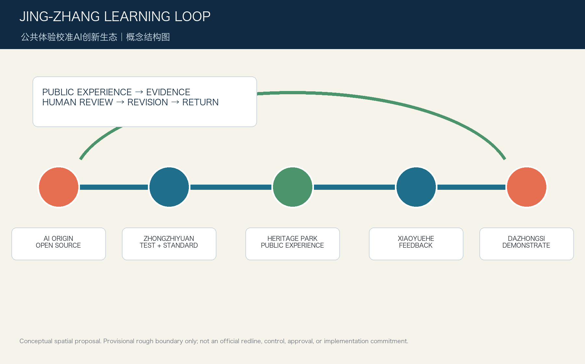
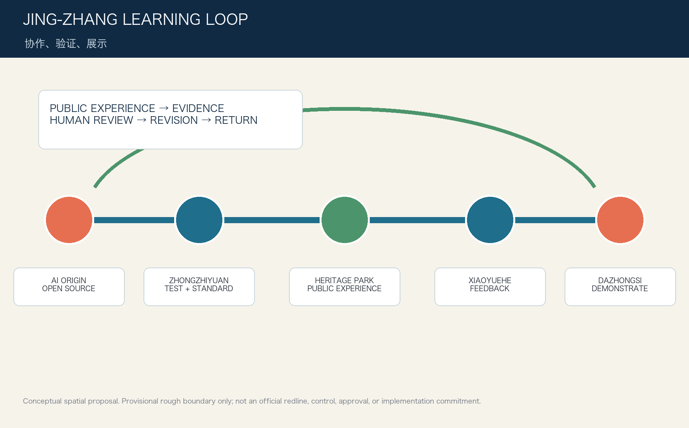
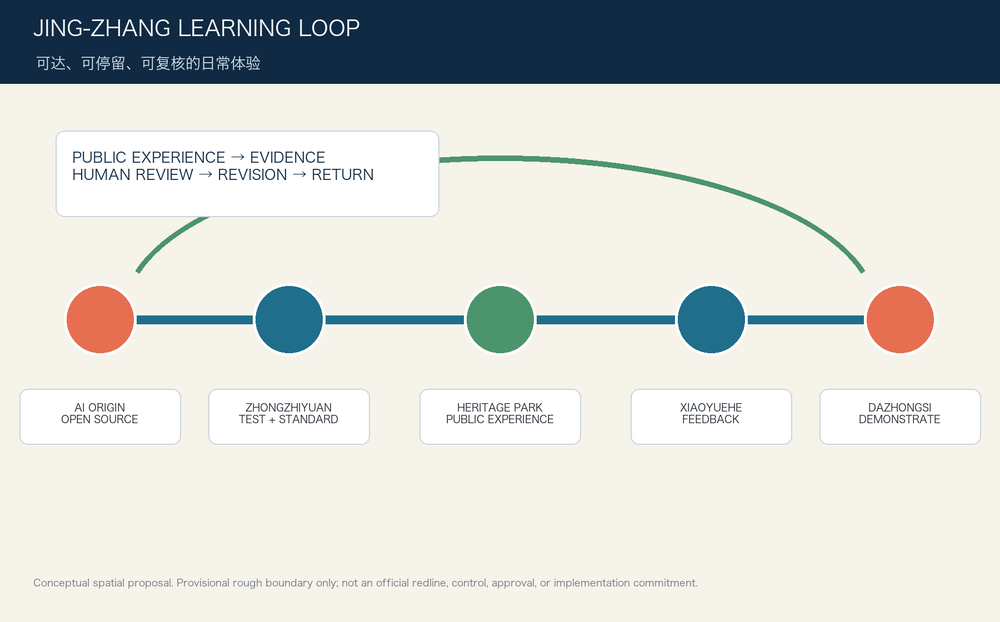
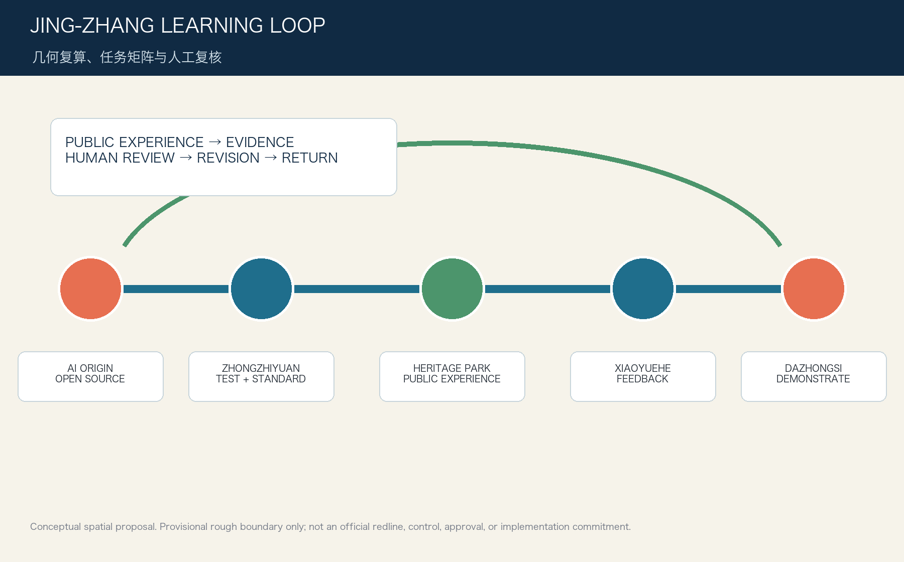

# Jing-Zhang Learning Loop

The Learning Loop is a public-value framework: encounter, consented feedback, evidence review, service revision and return. Its identity uses a loop, station marks and calibrated ticks. Deep blue signals public accountability, green signals public landscape, and orange signals a required human judgment. This is a conceptual identity direction, not an official logo. [source:AGENT-TASKBOOK]

## Design Basis and Source List

This proposal uses the public official announcement, the cleared agent taskbook, the repository source registry and the local standard snapshots. The working boundary is explicitly provisional. It supports concept visualization and reproducible intake checks only; it is not an official redline, a statutory control, or an approval basis. [source:AGENT-TASKBOOK] [depth:overall_spatial_structure]

## Three-Level Scope Framework

The 43.6 square kilometre research scope frames innovation ecology; the 11.4 square kilometre overall design scope turns that ecology into public-space, mobility and renewal moves; the three key areas test those moves at a detailed-design scale. The Learning Loop links evidence, public experience, revision and return across all three levels. [source:AGENT-TASKBOOK] [depth:overall_spatial_structure]

## Coordinated Research Area: Industry and Future City Research

The proposed ecosystem links university-originated research, open-source communities, testing services, enterprise conversion and everyday public experience. It treats AI as a civic capability with a human review point, rather than a standalone product. Global reference cases are used as operational precedents, not as promises that a copied institution will be delivered here. [source:AGENT-TASKBOOK] [depth:overall_spatial_structure]

## Overall Design Area: Urban Renewal and Regulatory-Plan-Level Urban Design

The overall structure is a heritage-park learning spine with three stations and two service wings. It coordinates land-use, building footprints, slow mobility, green space, public space and phasing in the GeoJSON package. Missing controls for FAR, height, ownership, road lines and municipal systems remain pending official data. [source:AGENT-TASKBOOK] [depth:overall_spatial_structure]

## Detailed Design of Key Areas

Zhongzhiyuan hosts an open safety-and-standards studio; the AI Origin Community hosts an open-source commons and talent service street; Dazhongsi hosts a public demonstration and international exchange room. Each is a conceptual spatial prototype, subject to later survey, ownership, heritage, transport and engineering confirmation. [source:AGENT-TASKBOOK] [depth:overall_spatial_structure]

## AI Innovation Ecosystem, Personas, and AI+ Scenarios

Five personas guide the offer: open-source developer, start-up team, enterprise visitor, nearby resident and university student. Twelve scenario cards span accessible wayfinding, safety testing, research publication, service co-pilots, maintenance reporting, education, health-navigation referral, legal-information routing, low-carbon operations, public events, inclusive access and cultural interpretation. Three test settings require consent, minimum data, audit logs and human override. [source:AGENT-TASKBOOK] [depth:overall_spatial_structure]

## Land Use, Building Scale, and Retain-Renovate-Demolish Strategy

The submitted land-use partition and building footprints are design-layer evidence, not a land-rights finding. Retain, renovate, renew and new-build categories are framed as survey tasks for professional teams. No proposal value claims an approved FAR, height, density, setback or demolition decision. [source:AGENT-TASKBOOK] [depth:overall_spatial_structure]

## Transport, Rail, Municipal Infrastructure, and Public Services

A slow-mobility learning route joins rail access, neighbourhood crossings, park rooms and the three key areas. Public-service nodes are placed as concept points where accessible routes, wayfinding and maintenance feedback can be evaluated. Road redlines, utilities, fire access, station interfaces and construction feasibility need official confirmation. [source:AGENT-TASKBOOK] [depth:overall_spatial_structure]

## Blue-Green Network, Public Space, and Urban Character

The blue-green network is a continuous public laboratory: shade, rainwater, seating, culture and low-impact sensing make the learning cycle legible without turning public space into surveillance. The design language translates railway time, Zhongguancun experimentation and AI responsibility into signs, markers and a modest contribution display. [source:AGENT-TASKBOOK] [depth:overall_spatial_structure]

## Renewal Projects, Implementation Policy, and Phasing

Near term work is limited to research, consent protocols, accessible route audits and reversible public pilots. Medium term work is conditional on formal controls and co-ordination. Long term work is a global developer and city-learning programme with annual open review. None of these steps is a government commitment. [source:AGENT-TASKBOOK] [depth:overall_spatial_structure]

## Metrics, Area Recalculation, and Compliance Matrix

Known area, green-space and public-space values are recomputed from the submitted geometry in EPSG:4548 and exposed in metrics.json. The compliance, standard and design-depth matrices map every announcement item and agent.1–agent.6 to readable, spatial and audit evidence. All provisional values must be recalculated when official polygons arrive. [source:AGENT-TASKBOOK] [depth:overall_spatial_structure]

## Risk, Copyright, and Compliance

Risks include provisional geometry, missing controls, privacy, accessibility, technical maturity, public acceptance and operating cost. Every AI setting requires purpose limitation, visible human escalation, appeal and withdrawal routes. All text and diagrams are original for this submission; no external images, fonts, tiles, tracking, APIs or private data are used. [source:AGENT-TASKBOOK] [depth:overall_spatial_structure]

## References

Primary project materials are the local official-announcement snapshot, cleared agent taskbook, source registry, planning-limit file, standards snapshots and provisional-boundary note. Their identifiers, permitted uses and limitations are recorded in sources.json and assumptions.json. [source:AGENT-TASKBOOK] [depth:overall_spatial_structure]

