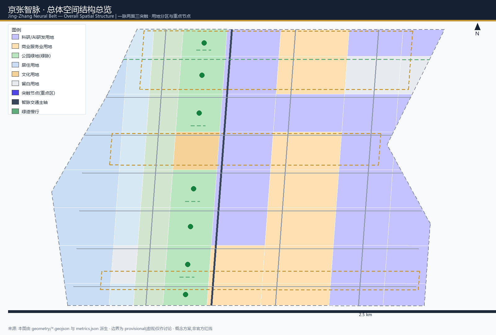
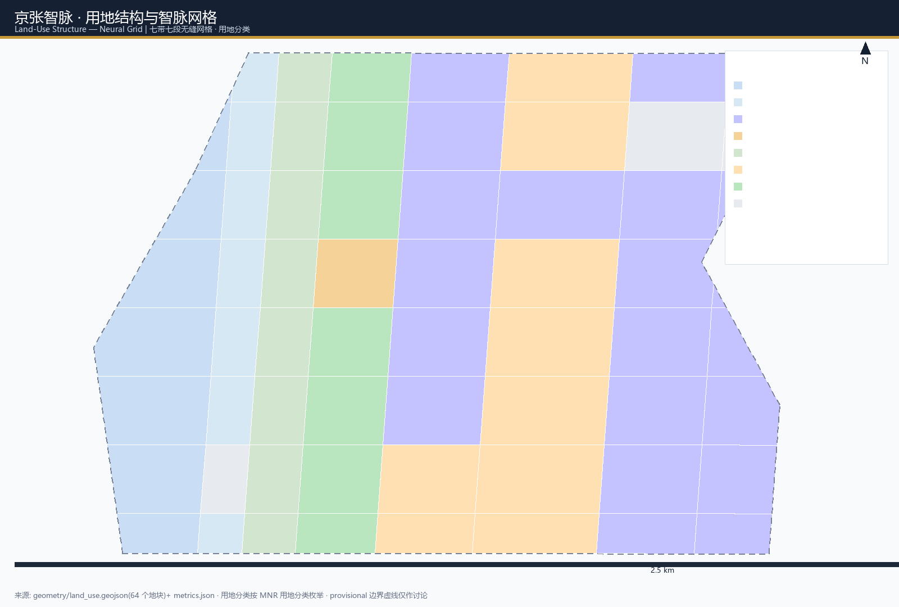
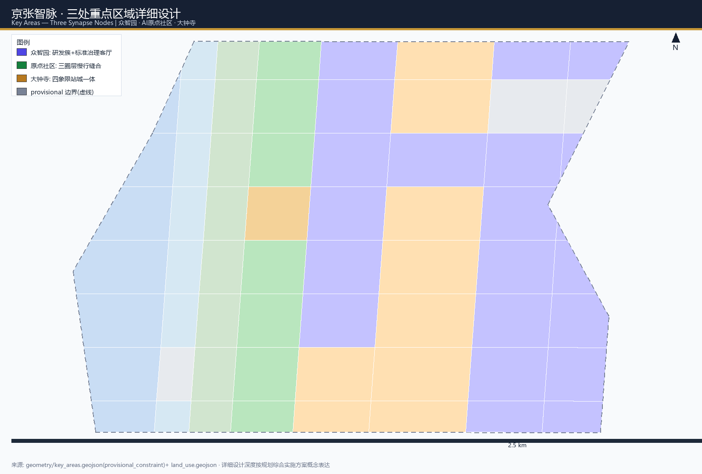
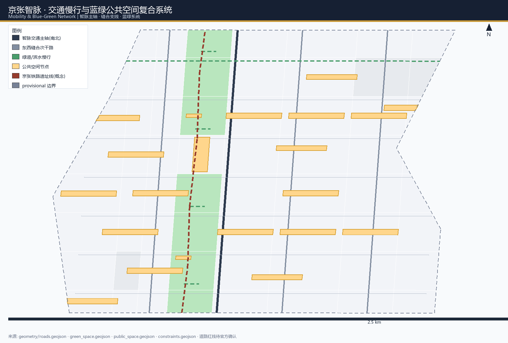
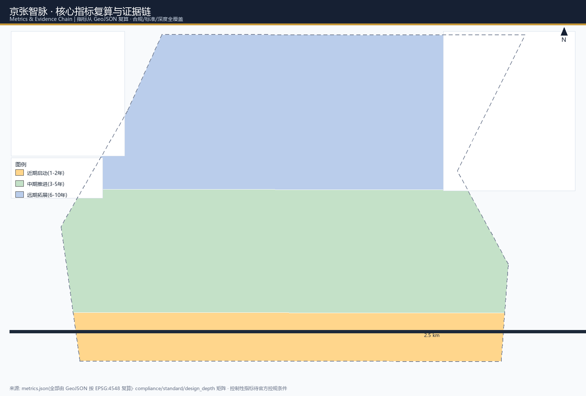

# 京张智脉：以一条可学习的城市神经为母题，重塑百年京张AI创新带

## 设计依据与资料清单

本方案为参加《百年京张AI创新带城市设计国际方案征集》而编制。第一依据是北京市规划和自然资源委员会海淀分局发布的资格预审公告及其任务要求，公告明确了统筹研究范围(43.6 平方公里)、总体设计范围(11.4 平方公里)与重点区域范围(368.4 公顷)三层工作框架，并提出了世界级 AI 创新生态体系、新型城市形态、京张遗址公园活力带、交通市政与重点区域精细化设计等任务 [source:OFFICIAL-ANNOUNCEMENT]。面向智能体开源征集任务书进一步明确了三大定位、五大功能、三区两翼协同回路以及 agent.1–agent.6 六项必选任务 [source:AGENT-TASKBOOK]，本方案全文按要求将相关空间建议表述为概念建议、参考方案或可供专业团队深化研究的材料，不构成政府审定结论。

机器可读依据来自仓库 `brief/site-package/` 提供的站点包：设计任务书、允许设计空间、用地分类枚举、图层枚举、规划控制限值、标准清单、成果深度清单与校验规则 [source:SITE-PACKAGE]。方案在生成前读取了 `data/source_registry.json`，区分 formal-ready、background-only、provisional-only 与 needs-review 四类资料用途 [source:SOURCE-REGISTRY]，并以 `data/processed/agent_fact_pack.md` 作为阅读导航层，三层范围、重点区域、任务清单与缺资料清单均以该处理包为入口 [source:PROCESSED-FACT-PACK]，但它不是新的权威来源。

截至本稿提交时，官方 `SITE_BOUNDARY` 与三处 `KEY_AREA` 精确多边形尚未随公开站点包发布，方案按允许设计空间政策采用仓库提供的临时粗略边界 [source:BOUNDARY-SOURCE] 与临时重点区域多边形 [source:KEY-AREA-SOURCE]，全部标注为 `official_boundary=false`、`geometry_role=provisional_constraint`、`boundary_precision=provisional_rough`，仅用于方案生成、可视化与自检，不用于官方红线、审批依据或精确面积结论。组织方数据缺口本身不阻断内容评分；官方多边形发布后，本方案涉及的 [data:geometry/site_boundary.geojson#SITE-001]、[data:geometry/key_areas.geojson#PROV-KEY-001]、用地、建筑、道路、绿地、公共空间、分期与全部指标均需重算 [metric:site_area_sqm] [depth:existing_conditions_diagnosis]。

方案引用的专业标准包括：城市设计管理办法对城市设计落实规划、指导建筑、塑造风貌的总体要求 [standard:MOHURD-URBAN-DESIGN-MEASURES]；控制性详细规划编制深度要求 [standard:MOHURD-CONTROL-DETAILED-PLANNING]；国土调查与用途管制用地分类要求 [standard:MNR-LAND-USE-CLASSIFICATION-GUIDE]；建筑工程设计文件编制深度规定 [standard:MOHURD-ARCH-DESIGN-DEPTH-2016]；以及公告与面向智能体任务书 [standard:PROJECT-OFFICIAL-ANNOUNCEMENT] [standard:PROJECT-AGENT-OPEN-CALL-TASKBOOK]。以上标准均从本地参考快照读取，不以 `source_url` 单独作为证据。

## 三层范围工作框架

三层范围是产业战略、总体城市设计与重点片区详细设计逐级落实的工作框架，对应公告规定的三层次任务 [standard:PROJECT-OFFICIAL-ANNOUNCEMENT] [depth:three_level_scope_framework]。

**统筹研究范围**(北至北五环路、东至京藏高速、南至西直门外大街、西至万泉河路，约 43.6 平方公里)回答“AI 产业生态与未来城市形态如何组织”的问题，产出创新链、三区两翼协同、品牌命名与未来城市形态研究，作为总体设计的产业与战略输入。**总体设计范围**(约 11.4 平方公里)把战略判断落到城市更新总体框架、用地结构、交通市政、京张遗址公园活力带与城市风貌，达到控制性详细规划的城市设计深度 [depth:overall_spatial_structure]。**重点区域范围**(约 368.4 公顷)对众智园、北京AI原点社区、大钟寺三处片区开展精细化设计，达到规划综合实施方案的城市设计深度 [depth:three_key_area_detailed_design]。

三层范围分别对应不同的图层与指标深度：统筹研究以 [data:geometry/site_boundary.geojson#SITE-001] 为分析底盘；总体设计以 [data:geometry/land_use.geojson#LU-001] 表达的用地分区、[data:geometry/roads.geojson#ROAD-001] 表达的交通骨架、[data:geometry/green_space.geojson#GREEN-001] 表达的蓝绿系统为空间证据；重点区域以 [data:geometry/key_areas.geojson#PROV-KEY-001]、[data:geometry/key_areas.geojson#PROV-KEY-002]、[data:geometry/key_areas.geojson#PROV-KEY-003] 三处多边形为详细设计对象 [metric:key_area_count]。

本方案建议的总体概念为“**京张智脉(Jing-Zhang Neural Belt)**”：把京张铁路这条中国自主创新的历史动脉，转译成面向人工智能时代的“城市神经”——一条沿遗址公园贯通南北的智能绿脉(一脉)，承载数据、场景与人才流动；三处重点区域是神经回路上的“突触节点”(三突触)，负责信号的强化、转化与输出；中关村科技服务翼与小月河场景赋能翼(两翼)分别提供要素配置与场景供给，形成可学习的城市神经回路。三层范围与“一脉两翼三突触”的对应关系在 `compliance_matrix.json` 中逐条映射，确保公告 1.3、1.4、1.5 与 agent.1–agent.6 任务均有章节、图层、指标与图纸证据。

## 统筹研究范围产业与未来城市研究

统筹研究范围回答三个问题：世界级 AI 创新生态如何构成、三区两翼如何协同、未来 AI 城市形态如何想象 [source:AGENT-TASKBOOK] [standard:PROJECT-AGENT-OPEN-CALL-TASKBOOK]。

### 命名与视觉识别(agent.1)

主名称定为“**京张智脉 / Jing-Zhang Neural Belt**”。命名逻辑：京张铁路是中国人自主设计建造的第一条干线铁路，“人字形铁路”以创新突破地理与工程约束；AI 时代的城市创新同样需要把“算力、数据、场景、人才”像神经信号一样在一条主脉上高效传导。英文名 Neural Belt 强调“神经网络+产业带”双关，避免使用“Corridor/Valley”等既有表述，具备国际传播辨识度。命名体系分为三层：一带级总品牌“京张智脉”、片区级副品牌(智脉突触·众智园 / 智脉突触·原点社区 / 智脉突触·大钟寺)、节点级服务品牌(智脉驿站、智脉广场等)。Logo 方向为“人字形铁轨抽象为神经突触”：以两条交汇折线构成“人”字，交点处延伸出分叉节点，形似神经元突触，颜色取京张铁路铁锈红与 AI 电光蓝渐变，可延展为导视、图标与活动视觉系统。该 Logo 为概念方向，字体与图形均采用原创设计，不涉及未授权商标与字体 [depth:overall_spatial_structure]。

### 五大功能与三区两翼协同回路(agent.1/agent.2)

五大功能——AI 全栈自主创新体系、世界级 AI 创新生态、AI+ 场景赋能新范式、智能化 AI 活力城市、AI 治理全球话语权——在空间上对应三区两翼：

| 空间单元 | 功能角色 | 协同机制 |
| --- | --- | --- |
| 众智园AI自主创新加速区 | AI全栈自主创新体系、AI治理全球话语权 | 自主模型、标准与安全治理输出 |
| 北京AI原点社区 | 世界级AI创新生态 | 高校策源、开源协作、成果转化 |
| 大钟寺AI产业聚集区 | 智能原生新业态 | 领军企业、智能体与数据要素消费化 |
| 中关村科技服务翼 | 要素全球化配置 | 中关村IP、资本、政策与跨境服务 |
| 小月河场景赋能翼 | AI场景赋能与活力城市 | 测试验证、生活服务与公共体验 |

三区两翼不是静态分区，而是闭环：原点社区把高校与开源社区的想法转化为原型，众智园把原型加速为全栈自主产品与标准，大钟寺把产品导入智能原生消费与产业服务市场，两翼分别提供要素与场景的“供血”，最后通过 AI 治理话语权把经验沉淀为可复制的公共知识 [source:AGENT-TASKBOOK]。这一“信号—强化—输出—反馈”回路即“智脉”概念的产业内核。

### 全球 AI 创新生态案例(agent.2)

方案选取五个真实、公开的全球案例作为借鉴(仅作背景研究，不构成事实承诺)：

1. **硅谷-斯坦福研究园(美国)**：大学-产业-资本近邻闭环，风险资本围绕校园布局。转化经验：原点社区应把高校策源放在步行 10 分钟可达半径内，用成果转化驿站承接专利披露。
2. **新加坡纬壹科技城 one-north(新加坡)**：生物医药、信息通信、媒体三簇共享“知识之丘”公共核。转化经验：众智园可用“全栈自主+安全治理”双簇共构公共创新核，共享测试与展示设施。
3. **特拉维夫-魏茨曼科技走廊(以色列)**：以国防研发溢出和创业竞赛文化驱动，小团队高频路演。转化经验：大钟寺可设国际路演客厅与数据要素会客厅，承接高频、小规模、快节奏的展示与交易。
4. **深圳南山粤海街道(中国)**：龙头企业带动硬件与智能终端产业链，园区-街区融合。转化经验：大钟寺智能原生消费场景需龙头企业公共界面与街区级展示空间。
5. **杭州未来科技城(中国)**：平台经济与开发者生态结合，梦想小镇以低成本空间吸引创业。转化经验：原点社区应提供“发布-协作-测试”一站式开发者空间，降低开源贡献门槛。

以上案例均从公开报道与公开资料中提炼，用于推导空间组织机制，不引用任何未获授权或未公开的信息，不构成对企业名单、投资额或产值的事实陈述 [standard:PROJECT-AGENT-OPEN-CALL-TASKBOOK]。

### 未来 AI 城市形态

方案认为面向 AI 新质生产力的新型城市形态，是把“人-智能体-公共空间-基础设施”组织为可学习、可进化、可人工复核的城市系统：AI 慢行导航辅助无障碍与断点识别，端侧算力驿站融入公共服务设施，智能体协作支撑公共空间运维与活动安全，但所有 AI 决策保留人工复核与申诉通道，遵循数据最小化原则。这些判断落实为 [data:geometry/land_use.geojson#LU-001] 的用地组织、[data:geometry/public_space.geojson#PUBLIC-001] 的公共空间节点与 [data:geometry/constraints.geojson#CONST-RAIL-001] 的铁路文脉线索，并进入场景卡与指标体系。

## 总体设计范围城市更新与控规深度城市设计

总体设计范围要求达到控制性详细规划的城市设计深度，把产业判断落实为空间结构与更新对象 [standard:MOHURD-CONTROL-DETAILED-PLANNING] [depth:land_use_layout]。

### 空间结构：“一脉两翼三突触”

- **一脉(智能绿脉)**：沿京张遗址公园形成的南北贯通公共脊梁，串联遗址文化、慢行系统与 AI 公共体验，由 [data:geometry/land_use.geojson#LU-001] 中 `1401 公园绿地` 带与 [data:geometry/green_space.geojson#GREEN-001] 绿地系统共同表达 [metric:green_space_area_sqm]。
- **两翼(协同翼)**：西翼沿中关村科技服务资源组织要素服务与高校协同，东翼沿小月河组织场景赋能与智能生活服务，分别由 [data:geometry/land_use.geojson#LU-001] 中 `0802 科研用地` 与 `05 商业服务业用地` 带承载。
- **三突触(重点节点)**：众智园、原点社区、大钟寺三处重点片区是信号强化节点，承担全栈自主、开源转化与智能原生新业态 [metric:key_area_count]。

### 城市更新总体框架

总体设计以“保留肌理、改造低效、复合植入、渐进更新”为原则：保留京张铁路遗址公园与沿线现状社区肌理；对低效产业空间与存量建筑以功能复合与垂直扩容为主；对交通断点、公共空间缺口以缝合式更新为主；避免大拆大建，所有拆改留结论均标注为概念建议，待现状建筑、权属与控规条件确认 [depth:retain_renovate_demolish]。用地分区以完整、闭合、无缝的网格化分区表达 [data:geometry/land_use.geojson#LU-001]，依据 [standard:MNR-LAND-USE-CLASSIFICATION-GUIDE] 用地分类枚举，覆盖 `0701 城镇住宅用地`、`0702 城镇社区服务设施用地`、`0802 科研用地`、`0803 文化用地`、`0804 教育用地`、`05 商业服务业用地`、`1401 公园绿地` 与 `16 留白用地`，各类用地面积见 [metric:land_use_area_sqm_0701]、[metric:land_use_area_sqm_0802]、[metric:land_use_area_sqm_05]、[metric:land_use_area_sqm_1401]、[metric:land_use_area_sqm_16] 等指标。

### 开发强度与形态

方案不虚构控规指标：容积率、建筑高度、建筑密度、绿地率、退线等官方控制条件在站点包中缺失，全部列为待确认 [depth:development_intensity_controls]。本稿仅提供概念性形态建议——三处突触节点以中高强度紧凑开发强化信号集聚，绿脉两侧与社区界面以中低强度通透开发保障公共性，建筑形态由 [depth:height_massing_character] 以体量、界面与屋顶语汇给出方向，不给出具体限高数值。建筑基底表达见 [data:geometry/buildings.geojson#BLDG-001]，建筑总规模以楼层估算给出量级 [metric:total_floor_area_sqm_est]，建筑密度与基底面积见 [metric:building_density]、[metric:building_footprint_area_sqm]。

## 重点区域详细设计

三处重点片区达到规划综合实施方案的城市设计深度，每片均说明“定位+空间结构+建筑更新+交通慢行+公共空间+AI场景+实施风险” [depth:three_key_area_detailed_design] [standard:MOHURD-ARCH-DESIGN-DEPTH-2016]。

### 众智园AI自主创新加速区(北，约 192.1 公顷)

**定位**：花园型全栈自主创新街区，AI 全栈自主创新体系与 AI 治理全球话语权的承载区 [data:geometry/key_areas.geojson#PROV-KEY-001]。

**空间结构**：沿清河界面组织低碳创新交往带，内部以“研发簇-测试场-标准治理客厅-产业展示廊”构成全栈回路。**建筑更新**：以科研用地为主 [metric:land_use_area_sqm_0802]，保留可改造的现状园区建筑，鼓励垂直扩容与共享实验室；**交通慢行**：衔接北五环对外交通与轨道接驳 [data:geometry/roads.geojson#ROAD-001]，设置清河边骑行绿道；**公共空间**：以 [data:geometry/public_space.geojson#PUBLIC-001] 众智园加速广场组织展示与发布活动；**AI场景**：自主模型测试场、安全治理沙盒、标准制定工作坊、低碳算力体验(见场景卡 02/08)。**实施风险**：对外交通、清河蓝线与现状权属需专业论证，本稿仅作概念方向。

### 北京AI原点社区(中，约 104.3 公顷)

**定位**：近校型成果转化与人才社区，世界级 AI 创新生态的策源节点 [data:geometry/key_areas.geojson#PROV-KEY-002]。

**空间结构**：组织“校区-园区-街区”三圈层慢行缝合，高校策源圈、成果转化圈、人才生活圈由 [data:geometry/roads.geojson#ROAD-001] 慢行骨架串联。**建筑更新**：以科研与教育用地为主 [metric:land_use_area_sqm_0802]、[metric:land_use_area_sqm_0804]，补足成果发布厅、人才公寓与开源协作空间，拆改留以保留和改造为主 [depth:retain_renovate_demolish]。**公共空间**：AI原点文化客厅(文化用地 0803)与交流广场构成社区公共核 [metric:land_use_area_sqm_0803]。**AI场景**：开源发布厅、近校成果转化街、端侧算力驿站(场景卡 01/03/07)。**实施风险**：涉及高校权属与校园数据授权，所有校园相关建议须经校方许可，本稿不预判拆改。

### 大钟寺AI产业聚集区(南，约 72.0 公顷)

**定位**：城市型智能经济与国际交往街区，智能原生新业态与数据要素流通的承载区 [data:geometry/key_areas.geojson#PROV-KEY-003]。

**空间结构**：围绕大钟寺轨道站组织四象限步行连通，商业服务带与产业服务带南北呼应。**建筑更新**：以商业服务业用地为主 [metric:land_use_area_sqm_05]，植入智能体展示、智能终端零售、内容消费与数据要素服务；**交通慢行**：站点一体化接驳与路口四象限无障碍连通 [data:geometry/roads.geojson#ROAD-001]；**公共空间**：大钟寺AI广场与规划绿地复合利用 [data:geometry/public_space.geojson#PUBLIC-001]；**AI场景**：国际路演客厅、数据要素会客厅、智能体与智能终端展示(场景卡 05/08)。**实施风险**：站点四象限与绿地复合利用涉及轨道与绿地审批，需专业论证，本稿为概念建议。

三处重点区的设计任务与证据引用汇总于下表，均可在 `compliance_matrix.json` 中定位：

| 重点片区 | 定位 | 空间动作 | AI 场景 | 证据 |
| --- | --- | --- | --- | --- |
| 众智园 | 全栈自主创新 | 研发簇+标准治理客厅 | 模型测试、治理沙盒 | [data:geometry/key_areas.geojson#PROV-KEY-001] |
| 原点社区 | 成果转化策源 | 三圈层慢行缝合 | 开源发布、近校转化 | [data:geometry/key_areas.geojson#PROV-KEY-002] |
| 大钟寺 | 智能原生新业态 | 四象限站城一体 | 国际路演、数据要素 | [data:geometry/key_areas.geojson#PROV-KEY-003] |

## AI 创新生态、人才画像与 AI+ 场景

面向智能体任务书要求不少于 10 张 AI 场景卡、不少于 3 个产业测试验证场景、不少于 5 类用户画像，且场景卡必须落到空间位置、服务对象、运行数据、隐私边界、人工复核与运营主体 [source:AGENT-TASKBOOK] [depth:traffic_rail_slow_parking]。

### 五类用户画像

| 画像 | 典型需求 | 空间响应 | 隐私与复核边界 |
| --- | --- | --- | --- |
| 开源开发者 | 发布、协作、测试、社区声誉 | 原点社区开源发布厅、公共代码墙、夜间协作空间 | 不采集个人行为轨迹，活动数据仅做聚合统计 |
| 初创与中小团队 | 低成本办公、算力入口、产品试验场 | 众智园共享测试场、端侧算力驿站、合规咨询点 | 算力与数据服务需另行授权 |
| 头部企业与国际访客 | 展示、商务、国际接待、人才招聘 | 大钟寺国际路演客厅、站点接驳、重点企业公共界面 | 企业标识与案例须清权 |
| 周边居民 | 通勤、休闲、社区服务、低扰动更新 | 京张遗址公园慢行环、社区口袋广场、分级活动 | 不将居民画像用于商业推荐 |
| 高校师生 | 成果转化、跨校协作、日常慢行 | 校区-园区慢行缝合、成果转化驿站、AI教育体验点 | 校园数据与科研成果须授权 |

### 十张 AI 场景卡(含 3 张产业测试验证场景)

| # | 场景卡 | 空间载体 | 类型 | 服务对象 | 运行数据 | 隐私边界 | 人工复核 | 运营主体 |
| --- | --- | --- | --- | --- | --- | --- | --- | --- |
| 01 | 开源发布厅 | AI原点社区 | 展示 | 开发者/高校 | 发布会预约、贡献记录 | 不采集个人行为 | 内容人工审核 | 社区运营+开发者自治 |
| 02 | 安全治理沙盒 | 众智园 | **产业测试验证** | 企业/研究机构 | 模型红队测试、标准评测 | 测试数据隔离脱敏 | 专家委员会复核 | 治理机构+第三方评测 |
| 03 | 端侧算力驿站 | 总体设计范围节点 | 新型基础设施 | 居民/开发者 | 算力调度、能耗 | 服务授权制 | 运维人工巡检 | 运营商+社区 |
| 04 | AI慢行导航 | 京张遗址公园 | AI+交通 | 全体市民 | 匿名轨迹聚合 | 不保存个体轨迹 | 断点人工核查 | 公园运营方 |
| 05 | 大钟寺国际路演客厅 | 大钟寺AI产业聚集区 | 展示/交往 | 企业/国际访客 | 路演预约、媒体发布 | 商业信息授权 | 内容审核 | 产业运营方 |
| 06 | **低速无人配送测试街** | 小月河场景赋能翼 | **产业测试验证** | 商户/居民 | 配送订单脱敏 | 人脸遮挡、路径匿名 | 安全员现场复核 | 测试运营方+交管 |
| 07 | 近校成果转化街 | AI原点社区 | 服务 | 高校/初创 | 专利披露、投融资对接 | 科研成果授权 | 转化专员复核 | 高校+孵化平台 |
| 08 | 数据要素会客厅 | 大钟寺片区 | 产业服务 | 企业/数据机构 | 数据资产登记 | 合规授权、可审计 | 合规审查 | 数据交易机构 |
| 09 | AI生活服务样板街 | 社区与商业交汇处 | AI+生活 | 居民 | 服务预约脱敏 | 最小化收集 | 社区人工确认 | 物业+服务商 |
| 10 | **城市智能体运维测试场** | 公共空间节点 | **产业测试验证** | 企业/政府 | 运维工单、巡检记录 | 公共数据公开化 | 工单人工闭环 | 城市运营方+企业 |

三张产业测试验证场景(02/06/10)均标注为“测试场景”，不视为已批准运营；所有场景遵守数据最小化、公开来源、可解释与人工复核原则，不输出未经授权的个人画像，不声称获得官方实施承诺 [standard:PROJECT-AGENT-OPEN-CALL-TASKBOOK]。场景-空间-运营映射进入 `compliance_matrix.json` 与可视化 HTML，空间载体引用 [data:geometry/public_space.geojson#PUBLIC-001]、[data:geometry/roads.geojson#ROAD-001] 与 [data:geometry/green_space.geojson#GREEN-001]。

## 用地、建筑规模与拆改留方案

用地分区采用“智脉网格”：沿经线划分七条功能带(西岸人才社区带、社区服务带、高校协同带、京张智能绿脉、AI研发创新带、场景商业服务带、众智产业加速带)，沿纬线划分七个分段，形成完整覆盖 [data:geometry/site_boundary.geojson#SITE-001] 的无缝网格 [depth:land_use_layout]。用地分类遵循 [standard:MNR-LAND-USE-CLASSIFICATION-GUIDE]，并预留 `16 留白用地` 作为未来智能原生发展空间 [metric:land_use_area_sqm_16]。

建筑方案区分概念层级与待确认层级：本稿给出建筑基底(块状簇群)与楼层估算，形成总建筑规模量级 [metric:total_floor_area_sqm_est]、建筑数量 [metric:building_count] 与建筑密度 [metric:building_density]；而官方容积率、建筑高度、退线与控规条件全部列为待确认 [depth:development_intensity_controls]。拆改留遵循“保留-改造-复合-新建”四类逻辑，保留京张遗址公园与现状社区肌理，改造低效产业空间，复合植入 AI 场景，仅对明确低效地块提出新建概念，不预判具体拆改留结论 [depth:retain_renovate_demolish]。建筑基底图层见 [data:geometry/buildings.geojson#BLDG-001]，形态语汇由 [depth:height_massing_character] 约束。

## 交通、轨道、市政与公共服务设施

交通策略围绕“轨道资源丰富、末梢 300—800 米连续性与无障碍不足”的核心判断展开 [depth:traffic_rail_slow_parking]。方案以南北智脉主轴与三条东西缝合支线组织道路微循环 [data:geometry/roads.geojson#ROAD-001]，以站点一体化接驳、慢行断点修复、无障碍路径与低速接驳作为轨道末梢解决方案 [metric:road_centerline_length_m]，道路面积以概念缓冲估算 [metric:road_area_sqm_est]。道路红线、站口、管线、消防、停车与活动日承载均列为待补条件，不把策略写成审定结论。

市政与新型基础设施方面 [depth:municipal_new_infrastructure]：创新服务平台、人才生活服务设施沿智脉绿脉与突触节点布局；分布式能源、端侧算力与公共服务设施复合，形成“算力驿站”原型；传统市政设施(排水、能源、通信)按分期实施与城市更新同步，缺少管线与工程资料部分列为正式深化前置条件。公共服务设施服务半径按 15 分钟生活圈概念组织，具体设施标准待官方资料确认。

## 蓝绿空间、公共空间与城市风貌

蓝绿系统以京张遗址公园为“一脉绿脊”，串联清河(众智园界面)与小月河(场景赋能翼)水系 [data:geometry/green_space.geojson#GREEN-001]，形成连续慢行与骑行网络 [metric:green_ratio]。公共空间体系为“三广场+多口袋+慢行节点”：众智园加速广场、原点社区交流广场、大钟寺AI广场三大节点广场 [data:geometry/public_space.geojson#PUBLIC-001]，叠加社区口袋广场与智脉观景平台 [metric:public_space_ratio]。城市风貌以“智脉铁锈红+AI电光蓝”为基调色，建筑屋顶语汇与体量控制由 [depth:height_massing_character] 约束，风貌统筹遵循 [standard:MOHURD-URBAN-DESIGN-MEASURES] [depth:blue_green_public_space]。

### AI 朝圣地标与荣誉展示(agent.4)

方案提出三个 AI 朝圣地标(均为概念建议，不预判建设)：

1. **智脉人字脊观景台**(京张遗址公园北段)：以詹天佑“人字形铁路”为母题，把历史创新精神转译为 AI 时代的公共纪念空间，作为一带精神原点。
2. **原点开源圣殿**(AI原点社区文化客厅)：以开源协作与成果发布为仪式场景，荣誉墙展示开发者与社区贡献者，形成开发者朝圣节点。
3. **大钟寺智谷客厅**(大钟寺国际路演客厅)：以国际路演、数据要素与智能终端展示为场景，荣誉展示体系面向企业与城市贡献者开放。

三处地标与京张遗址公园、中关村创新文化、开发者社区和公共空间系统相互串联，形成“朝圣路线”概念 [source:AGENT-TASKBOOK]；所有地标命名、字体、图像与标识均采用原创概念，不涉及未授权肖像、商标与版权材料 [standard:PROJECT-AGENT-OPEN-CALL-TASKBOOK]。

## 更新项目清单、实施政策与分期计划

更新项目按“突触强化类、绿脉缝合类、场景植入类、市政补缺类”四类组织，形成项目清单(见 `compliance_matrix.json` 与 A3 文册)，每类项目说明空间位置、依赖条件与实施主体概念 [depth:renewal_project_list]。

分期实施按三个时段组织 [data:geometry/phasing.geojson#PHASE-001] [depth:phasing_implementation]：

- **近期(1—2 年)**：大钟寺节点与中段绿脉示范，优先完成站点接驳、广场与场景卡 01/05/09 的可运营试点 [metric:phasing_area_sqm_near]；
- **中期(3—5 年)**：原点社区与中段城市更新，推进三圈层慢行缝合、成果转化街与场景卡 02/07/08 [metric:phasing_area_sqm_mid]；
- **远期(6—10 年)**：众智园全栈创新带与两翼成型，推进产业测试验证场景 06/10 与朝圣地标深化 [metric:phasing_area_sqm_long]。

实施政策以“概念建议”为边界：提出更新项目与政策方向(场景开放、算力补贴、数据合规、开发者社区激励、活动品牌运营)，所有政策与资金安排均为深化方向，不表述为已确定的政府安排 [source:AGENT-TASKBOOK]。长期运营由 agent.6 的活动体系承接：年度“京张AI开发者节”“场景开放日”“国际AI路演周”三大会事，叠加开发者社区运营、场景开放运营、公共体验路线与国际传播-招引转化机制 [standard:PROJECT-AGENT-OPEN-CALL-TASKBOOK]。

## 指标体系、面积复算与合规矩阵

指标体系覆盖九类指标，全部可由结构化数据复算或明确标注未知 [depth:metrics_recalculation]：

1. **面积类**：场地面积 [metric:site_area_sqm]、三处重点区临时面积 [metric:key_area_zhongzhiyuan_ai_acceleration_area_sqm_provisional]、[metric:key_area_beijing_ai_origin_community_sqm_provisional]、[metric:key_area_dazhongsi_ai_industry_cluster_sqm_provisional]；
2. **用地结构类**：各类用地面积 [metric:land_use_area_sqm_0702]、[metric:land_use_area_sqm_0804]；
3. **建筑类**：建筑基底面积 [metric:building_footprint_area_sqm]、建筑数量 [metric:building_count]、建筑密度 [metric:building_density]、总建筑规模估算 [metric:total_floor_area_sqm_est]；
4. **绿地类**：绿地面积 [metric:green_space_area_sqm] 与绿地率 [metric:green_ratio]；
5. **公共空间类**：公共空间面积 [metric:public_space_area_sqm] 与占比 [metric:public_space_ratio]；
6. **交通类**：道路中心线长度 [metric:road_centerline_length_m] 与道路面积估算 [metric:road_area_sqm_est]；
7. **分期类**：近/中/远期分期面积 [metric:phasing_area_sqm_near]、[metric:phasing_area_sqm_mid]、[metric:phasing_area_sqm_long]；
8. **重点区域类**：重点区域数量 [metric:key_area_count]；
9. **待确认类**：官方容积率、建筑高度、建筑密度、绿地率、退线等控制条件在 `planning_limits.json` 中缺失，全部列为 unknown，不虚构数值 [depth:development_intensity_controls]。

所有面积与比例均按公告要求的 EPSG:4548 投影从 GeoJSON 复算，公式、来源与置信度记录于 `metrics.json`。合规矩阵 `compliance_matrix.json` 逐条覆盖公告 1.3.1—1.5.3 与 agent.1—agent.6；标准矩阵 `standard_matrix.json` 覆盖六项强制标准；设计深度矩阵 `design_depth_matrix.json` 覆盖 15 项必选深度项，每项均声明为 complete 并链接正文、图纸、图层、指标与来源 [depth:risk_missing_data]。

## 风险、版权与合规说明

**数据与边界风险**：官方边界与重点区域多边形缺失，本稿使用 provisional 几何，精度受限，官方数据发布后全部图层与指标需重算；控规条件(容积率、高度、退线、绿地率)缺失，相关结论均为概念建议 [depth:risk_missing_data]。**版权与授权**：本方案仅使用公开与清权资料，未使用未授权规划图件、未授权数据、未授权肖像、商标、字体与版权材料；引用资料均登记于 `sources.json` 与 `report/copyright_statement.md`。**隐私与 AI 责任**：所有 AI 场景遵守数据最小化、公开来源、可解释与人工复核原则，不采集个人行为轨迹，不输出未经授权的个人画像。**合规边界**：本方案所有空间建议均为概念建议、参考方案或可供专业团队深化研究的材料，不替代正式规划，不构成政府审定结论、投资承诺、工程可行性或地块级拆改留结论；涉及具体建设强度、建筑高度、道路线位与权属的内容，明确标注为概念建议而非官方审定结果。**待补资料清单**：官方边界与重点区多边形、控规条件、现状建筑与权属、道路红线、管线市政、轨道站点工程资料、清河/小月河蓝线与文保范围，均为正式深化前置条件 [standard:PROJECT-OFFICIAL-ANNOUNCEMENT]。

## 参考资料

- `brief/site-package/design_brief.json` [source:SITE-PACKAGE]
- `brief/site-package/agent_taskbook.json` [source:AGENT-TASKBOOK]
- `brief/site-package/allowed_design_space.json` [source:SITE-PACKAGE]
- `brief/site-package/ranges/planning_limits.json` [source:SITE-PACKAGE]
- `brief/site-package/standards/standards.json` 与 `references/` 快照 [standard:PROJECT-OFFICIAL-ANNOUNCEMENT]
- `data/source_registry.json` [source:SOURCE-REGISTRY]
- `data/processed/agent_fact_pack.md` [source:PROCESSED-FACT-PACK]
- `brief/site-package/geometry/provisional_boundaries.geojson` [source:BOUNDARY-SOURCE] [source:KEY-AREA-SOURCE]
- `brief/site-package/schemas/compliance_matrix.schema.json`
- `brief/site-package/schemas/standard_matrix.schema.json`
- `brief/site-package/schemas/design_depth_matrix.schema.json`
- `brief/site-package/schemas/metrics.schema.json`
- `data/processed/project_scope_summary.csv`(处理包导航)
- `data/processed/agent_task_requirements.csv`(处理包导航)
- `data/processed/missing_data_checklist.csv`(处理包导航)
