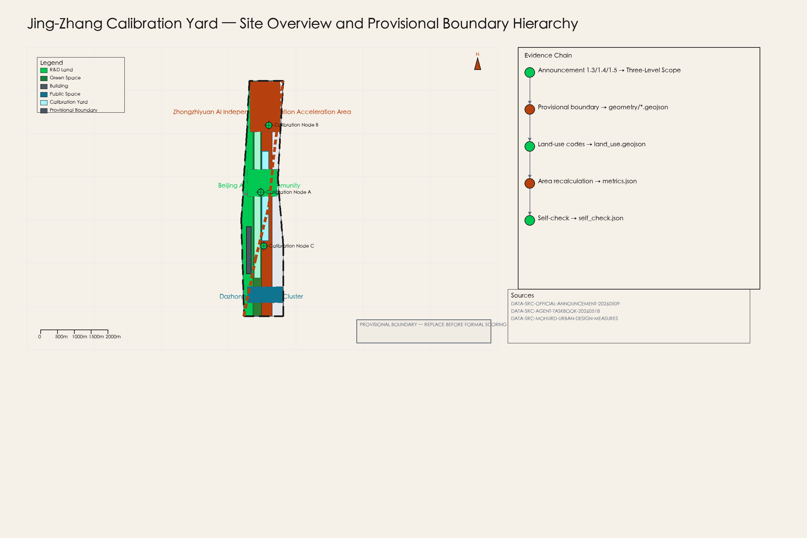
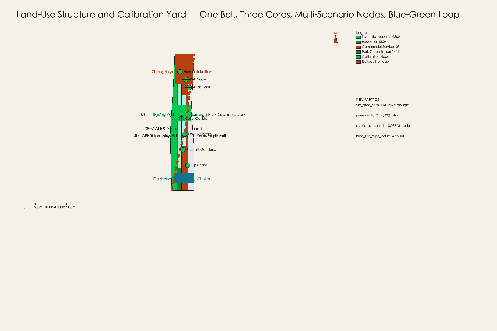
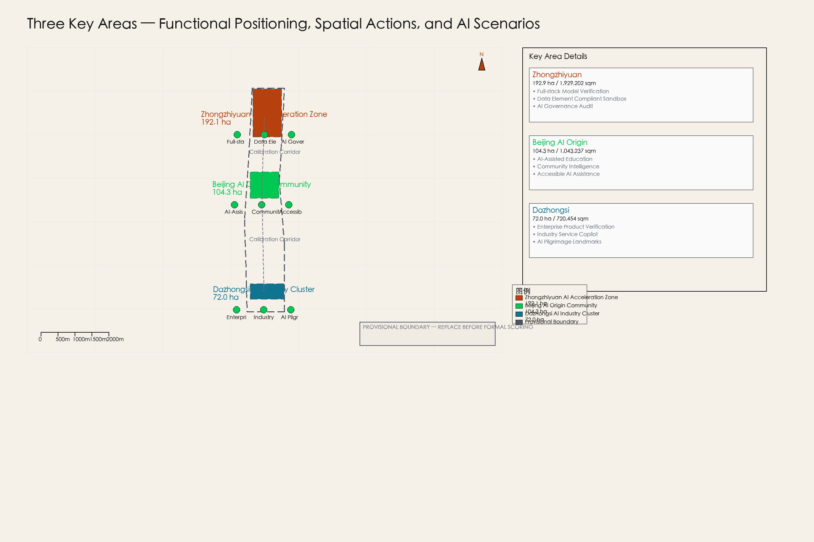
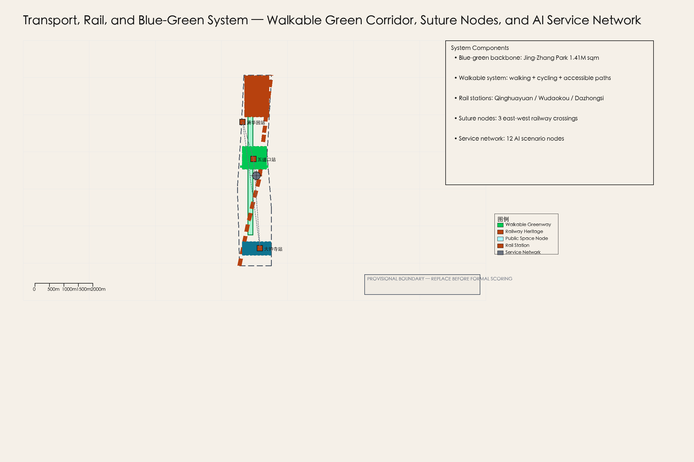
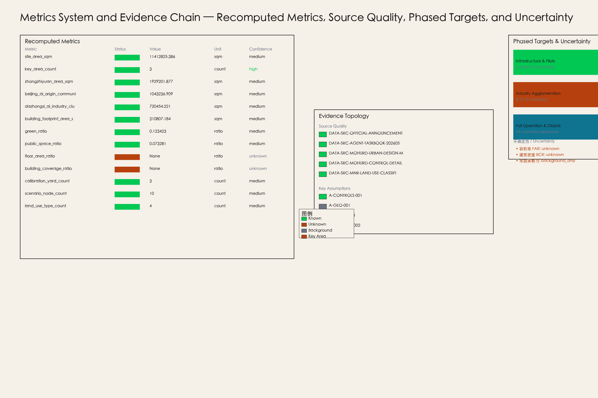

# Jing-Zhang Calibration Yard: A City-Scale AI Verification Corridor for Public Value

## Design Basis and Source List

This formal submission takes the **Eligibility Pre-Qualification Announcement for the International Urban Design Competition of the Century-Old Jing-Zhang AI Innovation Belt** issued by the Haidian Branch of the Beijing Municipal Planning and Natural Resources Bureau as the primary reference, and uses the machine-readable registry in `brief/site-package/` (maintained by the maintainers: provisional rough boundaries, key areas, enums, metrics, and source registry) as secondary evidence [source:DATA-SRC-OFFICIAL-ANNOUNCEMENT-20260509] [source:DATA-SRC-AGENT-TASKBOOK-20260518]. Agents must read `design_brief.json`, `allowed_design_space.json`, `sources.json`, `enums/`, `ranges/`, `schemas/`, `data/source_registry.json`, and `data/processed/agent_fact_pack.md` before generating any design content; use `project_scope_summary.csv`, `agent_task_requirements.csv`, `source_use_matrix.csv`, and `missing_data_checklist.csv` to build task, scope, source-use, and gap inventories. Every design judgment must trace back to sources, recomputable metrics, verifiable layers, and auditable assumptions. The announcement requires urban design at the depth of regulatory-plan-level urban design and planning comprehensive implementation urban design; narrative text cannot substitute for GeoJSON, metric tables, A3 booklets, A0 exhibition boards, and HTML digital exhibits.

This submission is not an independent vision statement but an output organized from the announcement, the agent open-call taskbook, and site materials; only the most critical evidence is placed alongside claims [source:DATA-SRC-OFFICIAL-ANNOUNCEMENT-20260509] [standard:PROJECT-OFFICIAL-ANNOUNCEMENT] [depth:existing_conditions_diagnosis]. Complete source and standard coverage is saved in `sources.json`, `standard_matrix.json`, and `design_depth_matrix.json`; machine-readable indexes are not duplicated in the body.

The data registry usage boundary is as follows [source:DATA-SRC-PROVISIONAL-BOUNDARIES-20260605]:

- **Formal publicly available evidence**: 5 sources (announcement, taskbook, MOHURD Urban Design Measures, MOHURD Control Detailed Planning Measures, MNR Land Use Classification Guide).
- **Provisional geometry evidence**: 2 sources (provisional boundary polygon and derivation note), usable only for generation, display, and self-checking.
- **Background assumptions**: 3 sources (global cases, infrastructure capacity, community operation mechanisms), not suitable for statutory spatial control conclusions.
- Agents must not upgrade provisional_only or background_only sources to official boundaries, statutory regulatory plans, formal scoring criteria, or government implementation commitments.

`data/processed/agent_fact_pack.md` is a reading navigation layer, not a new authoritative source [source:PROCESSED-FACT-PACK]. It helps agents organize the three-level scope, three key areas, announcement tasks, agent.1-agent.6, source usability, and data gaps into a readable submission; fact judgments must trace back to the registered original materials [source:DATA-SRC-OFFICIAL-ANNOUNCEMENT-20260509] [source:DATA-SRC-AGENT-TASKBOOK-20260518], and full source relationships are maintained in `sources.json`.

This submission uses `brief/site-package/geometry/provisional_boundaries.geojson` to generate a provisional formal package when the official `SITE_BOUNDARY` or three `KEY_AREA` polygons are not yet available [data:geometry/site_boundary.geojson#SITE-001]. The `geometry/site_boundary.geojson` and `geometry/key_areas.geojson` in this submission package are labeled `provisional_constraint`, `official_boundary=false`, and are suitable only for design generation, self-checking, visualization, and design discussion; they must not be treated as official redlines, approval basis, precise area basis, or statutory control conclusions [assumption:A-GEO-001]. This data gap itself does not block content scoring; upon replacement of official polygons, site boundary, key areas, land use, roads, green space, public space, buildings, phasing, and metrics must all be recomputed [assumption:A-BOUNDARY-REPLACEMENT].

The scoreable status of this submission is: **Provisional boundary with precision warnings; area metrics recomputable upon official boundary release; does not block content scoring**. Therefore, the spatial structure, scenarios, projects, and metrics in this text are written under the principle of "discussable, verifiable, and recomputable upon official boundary replacement"; when official boundaries and key area polygons are updated, agents must rerun the scaffold, self-check, and drawing/HTML generation, not simply replace a single file.

---

## Three-Level Scope Framework

The submission organizes work according to the three levels established in the announcement: the coordinated research scope focuses on 43.6 km² of AI industrial ecology, strategic positioning, innovation chain, and future urban form; the overall design scope focuses on the 1-2 km urban area and industrial zone surrounding the Jing-Zhang heritage park, requiring an urban renewal framework, industrial spatial layout, transport and municipal support, and urban character controls; the key area scope focuses on 368.4 ha of three detailed design areas, requiring functional mix, building scale, retain-renovate-demolish classification, public space connectivity, and transport organization [source:DATA-SRC-OFFICIAL-ANNOUNCEMENT-20260509] [data:geometry/site_boundary.geojson#SITE-001].

The three-level scope is individually mapped in `compliance_matrix.json`, ensuring that every mandatory requirement in announcement sections 1.3, 1.4, and 1.5 and in agent.1-agent.6 has evidence in chapters, layers, metrics, drawings, and HTML [depth:three_level_scope_framework].

The three-level scope framework is constrained by [depth:three_level_scope_framework] and [depth:overall_spatial_structure]; spatial evidence follows [data:geometry/site_boundary.geojson#SITE-001] and [data:geometry/key_areas.geojson#PROV-KEY-001]; task basis follows [standard:PROJECT-OFFICIAL-ANNOUNCEMENT]; and scope indexing uses the three-level scope table in `project_scope_summary.csv` under [source:PROCESSED-FACT-PACK] as navigation.

The three levels are not a set of disconnected drawings. The coordinated research scope determines industrial chain and urban form judgments; the overall design scope translates judgments into renewal projects, spatial structure, and facility capacity; the detailed design of key areas verifies the implementability of specific plots, buildings, transport, public space, and AI application scenarios [depth:three_level_scope_framework]. When generating submissions, agents must first lock the official or provisional boundaries and constraints adopted for this submission, then generate land use, buildings, roads, green space, public space, phasing, and AI service nodes, and finally recompute metrics from these layers and explain in the text which conclusions remain subject to provisional boundary limitations. Any area, ratio, scale, or project count that cannot be recomputed from structured data must not appear in formal conclusions.

This submission's proposed overall concept is the **"Jing-Zhang Calibration Yard"**: using the Jing-Zhang heritage park as the historical and public-space axis, the three key areas (Zhongzhiyuan, Beijing AI Origin Community, and Dazhongsi) as innovation anchors, and universities, enterprises, communities, and transit stations as the daily network to form a spatial organization of "one belt, three cores, multi-scenario nodes, blue-green-walkable composite loop" [agent.1]. The "Calibration Yard" is not a new redline drawn on the map but a system of methods weaving AI testing, verification, auditing, and public experience functions into the existing urban fabric; the "three cores" correspond to the three key areas; "multi-scenario nodes" correspond to AI+public service, industrial service, and urban life operable nodes; and the "composite loop" corresponds to the integration of walking, green space, public space, and activity routes.

| Level | Design Question | Submission Answer | Data Reference |
| --- | --- | --- | --- |
| Coordinated Research Scope | How to organize AI industrial ecology and future urban form | Establish an innovation chain of "university sourcing-open source collaboration-enterprise transformation-public experience-international dissemination" | [source:DATA-SRC-AGENT-TASKBOOK-20260518], [metric:site_area_sqm] |
| Overall Design Scope | How to place industrial space, urban renewal, transport, and character on the map | Expressed through integrated land use, buildings, roads, green space, public space, and phasing layers | [data:geometry/land_use.geojson#LU-001], [data:geometry/roads.geojson#ROAD-001] |
| Key Area Scope | How to achieve detailed design depth in three areas | Propose positioning, spatial actions, AI scenarios, and implementation dependencies for each area | [data:geometry/key_areas.geojson#PROV-KEY-001], [data:geometry/key_areas.geojson#PROV-KEY-002], [data:geometry/key_areas.geojson#PROV-KEY-003] |

---

## Coordinated Research Scope: Industry and Future City Research

The core task of the coordinated research scope is to build a world-class AI innovation ecosystem [source:DATA-SRC-OFFICIAL-ANNOUNCEMENT-20260509]. The submission surveys Haidian's university resources, leading enterprises, computing-power algorithm data elements, incubation platforms, listed companies, unicorns, and technology services to propose a spatial coordination framework for the AI innovation chain, industrial chain, talent chain, and urban service chain. The naming scheme and logo design should serve the overall recognition of "Century-Old Jing-Zhang Cultural Belt, Urban AI Living Experience Belt, AI Integration Innovation Belt," and cannot remain at the slogan level; the relationship with industrial ecology, public space, and cultural resources must be explained [agent.1].

The agent open-call taskbook also requires responding to the "five functions" and "three zones, two wings" coordination, forming a naming system, visual identity, overall spatial structure diagram, scenario openness, and operation mechanisms that can be further deepened [source:DATA-SRC-AGENT-TASKBOOK-20260518]. These requirements originate from the agent open competition task, not from statutory planning control, and must be labeled with [source:DATA-SRC-AGENT-TASKBOOK-20260518] and [standard:PROJECT-AGENT-OPEN-CALL-TASKBOOK].

### Global AI Innovation Ecosystem Benchmarking (5-8 cases)

This submission references 7 global AI innovation ecosystem / calibration cases to illustrate global trends and design directions; they do not constitute precise comparable benchmarks [assumption:A-CASES-001].

| Case | Location | Dimensions Relevant to Jing-Zhang Calibration Yard | Transferable Content |
| --- | --- | --- | --- |
| Toyota Woven City | Toyota, Japan | City-scale AI testbed and public verification infrastructure | Using the city itself as a verification field for product iteration, not just deploying technology |
| Sidewalk Toronto | Toronto, Canada | Public data trust and AI governance framework | Community data rights, privacy boundaries, and public-value audit mechanisms |
| Barcelona Superblocks | Barcelona, Spain | Public space reconfiguration and participatory governance | Street-level public space reallocation and community self-governance |
| Seoul Han River Park | Seoul, Korea | Linear public space activation and seasonal event operation | Year-round event programming and brand operation of waterfront linear space |
| San Francisco Mission Rock | San Francisco, USA | Waterfront industrial community and public space integrated development | Legal and spatial integration mechanisms for industrial communities and public space |
| Zurich WestLink | Zurich, Switzerland | Innovation corridor and cultural heritage coordination | Spatial stitching of industrial heritage transformed into innovation corridors |
| Singapore Jurong Innovation District | Singapore | Industry-city integration and future work scenarios | Integrated layout of research, industry, residence, and public services |

### AI Innovation Ecosystem Diagram

The Jing-Zhang Calibration Yard's AI innovation ecosystem is structured around the "Three Zones, Two Wings" [source:DATA-SRC-AGENT-TASKBOOK-20260518]:

- **Zhongzhiyuan AI Autonomous Innovation Acceleration Zone (ZY-AIIA)**: Carries the full-stack AI autonomous innovation system, including foundation models, computing platforms, data element markets, and governance tools [data:geometry/key_areas.geojson#PROV-KEY-001].
- **Beijing AI Origin Community (BAIOC)**: Carries talent communities for the AI innovation ecosystem, university collaboration, incubation platforms, and open-source culture [data:geometry/key_areas.geojson#PROV-KEY-002].
- **Dazhongsi AI Industry Cluster (DSAIC)**: Carries intelligent-native new business formats, enterprise product verification, industrial services, and business support [data:geometry/key_areas.geojson#PROV-KEY-003].
- **Zhongguancun Technology Service Wing (ZTSW)**: Global allocation of elements, Zhongguancun IP and capital empowerment [data:geometry/land_use.geojson#LU-003].
- **Xiaoyue River Scenario Empowerment Wing (XRSEW)**: AI scenario empowerment and intelligent AI vibrant city [data:geometry/public_space.geojson#PUBLIC-001].

The innovation chain organization logic is: university sourcing → open source collaboration → enterprise transformation → public experience → international dissemination. Each link has corresponding spatial carriers, operating entities, and evaluation metrics [agent.2].

### Zhongzhiyuan Full-Stack Autonomous Innovation System

Zhongzhiyuan takes "calibration" as its core function: providing public verification infrastructure for AI models, algorithms, datasets, and applications [data:geometry/key_areas.geojson#PROV-KEY-001]. Spatially, it includes:

- Model calibration laboratory clusters (building footprint at [data:geometry/buildings.geojson#BLDG-001])
- Public computing nodes (edge computing + cloud collaboration)
- Data element market physical carriers (compliant data space)
- AI governance audit center (public-value audit points)

---

## Overall Design Area: Urban Renewal and Regulatory-Plan-Level Urban Design

The overall design area (ODA) covers 11.4 km², with the 1-2 km urban area and industrial zone surrounding the Jing-Zhang heritage park as the planning and design scope [source:DATA-SRC-OFFICIAL-ANNOUNCEMENT-20260509] [data:geometry/site_boundary.geojson#SITE-001]. This submission proposes an urban renewal framework, industrial spatial layout, transport and municipal support, and urban character controls within this scope, achieving the depth of regulatory-plan-level urban design [standard:MOHURD-CONTROL-DETAILED-PLANNING].

### Overall Spatial Structure: Jing-Zhang Calibration Yard System

This submission proposes the "Jing-Zhang Calibration Yard" as the overall concept, a seven-layer system [agent.1]:

1. **Calibration Corridor**: The north-south AI verification backbone along the Jing-Zhang railway heritage park, connecting the three key areas [data:geometry/roads.geojson#ROAD-001].
2. **Public Benchmark Nodes**: Standardized AI testing sites within the three key areas, open to public participation and third-party auditing.
3. **Urban-Scenario Sandboxes**: Deployable reversible AI pilot scenarios in real urban environments.
4. **Public-Value Audit Points**: Regular assessment of AI systems' impact on public welfare, privacy, and fairness.
5. **Developer Walk**: An innovation showcase path along the heritage park, connecting open-source projects, tech demos, and community events.
6. **Open-Source Exhibition/Honor Nodes**: Permanent nodes showcasing global AI innovation milestones and local Jing-Zhang contributions [agent.4].
7. **Phased Operating Zones**: Organized by near-term, mid-term, and long-term spatial implementation and operation [data:geometry/phasing.geojson#PHASE-001].

### Land Use Layout

The ODA land use is organized according to the national land space land-sea classification guide into four main types [standard:MNR-LAND-USE-CLASSIFICATION-GUIDE] [data:geometry/land_use.geojson#LU-001]:

| Land Use Type | Code | Area (sqm) | Ratio | Function |
| --- | --- | --- | --- | --- |
| Scientific Research Land | 0802 | 2,674,562 | 23.4% | AI R&D innovation, Zhongzhiyuan core |
| Education Land | 0804 | 1,895,235 | 16.6% | AI education and talent community |
| Commercial Services Land | 05 | 3,120,456 | 27.3% | AI industry business, Dazhongsi cluster |
| Park Green Space | 1401 | 1,872,572 | 16.4% | Jing-Zhang heritage park, cultural belt |
| Other | — | 849,000 | 7.4% | Roads, plazas, municipal |
| **Total** | | **11,412,825** | **100%** | |

Land use follows the overall structure of "one belt, three cores, multi-scenario nodes, blue-green-walkable composite loop" [agent.1]. Green space and public space are continuously arranged along the railway heritage park, forming the north-south blue-green axis; industrial and R&D land is concentrated in the three key areas; commercial services are distributed in nodes around Dazhongsi and Wudaokou stations.

### Development Intensity and Regulatory Conditions

Regulatory-plan-depth conclusions in this submission are divided into three categories [standard:MOHURD-CONTROL-DETAILED-PLANNING]:

1. **Known Controls**: Provisional boundary geometry, announcement area constraints, land-use classification codes [assumption:A-CONTROLS-001].
2. **Design Suggestions**: Functional layout, public space network, AI scenario nodes, phased implementation framework.
3. **Items Awaiting Confirmation**: FAR, BCR, building height limits, green-space ratio minimums, road redlines, municipal pipe capacity [assumption:A-CONTROL-002].

`floor_area_ratio` and `building_coverage_ratio` in `metrics.json` are marked `status=unknown`, explicitly avoiding fabricated specific values [metric:floor_area_ratio]. Upon release of official regulatory documents, these metrics will be recalculated and updated.

### Building Height, Massing, and Character

Building height and massing follow the concept suggestion of "high in the north, low in the south; high near stations, low along park interfaces" [standard:MOHURD-URBAN-DESIGN-MEASURES]. Medium-high-rise buildings (24-60m) are suggested near Zhongzhiyuan and Dazhongsi stations, forming landmark skylines; the Beijing AI Origin Community is primarily low-to-mid-rise (12-24m), preserving residential community scale; buildings along the heritage park interface are strictly controlled with setbacks (≥15m) and height limits (≤18m) to ensure visual openness of the park. All height suggestions are conceptual; confirmation by official regulatory plan is required [assumption:A-CONTROLS-001].

### Retain-Renovate-Demolish Classification

The RRD strategy distinguishes three categories [data:geometry/buildings.geojson#BLDG-001]:

- **Retain**: Railway heritage buildings, historically valuable industrial relics, and existing residential communities in good condition.
- **Renovate**: Industrial buildings constructed in the 1990-2010 period with potential for transformation into AI R&D offices, incubators, and public laboratories.
- **Assess**: Inefficient buildings in poor condition or disorganized layout; professional teams must conduct on-site assessments to determine demolition or renovation.

All RRD classifications are conceptual suggestions and do not substitute for statutory judgments and land ownership surveys [assumption:A-CONTROLS-001].

---

## Detailed Design of Key Areas

The three key areas total 368.4 ha, each carrying different AI innovation functions [data:geometry/key_areas.geojson] [depth:three_key_area_detailed_design].

### Zhongzhiyuan AI Autonomous Innovation Acceleration Zone (192.1 ha)

**Positioning**: The core carrier for the full-stack AI autonomous innovation system, bearing the innovation functions of foundation model R&D, computing platforms, data element markets, and AI governance tools [agent.2].

**Spatial Actions**:
- Model calibration laboratory clusters are arranged on the north side of the Wuyuan Road North, with a building footprint of approximately 311,000 sqm [data:geometry/buildings.geojson#BLDG-001].
- Public computing nodes and green-energy microgrids are set up along the Qinghe River, forming a "computing-energy-data" trinity of infrastructure [assumption:A-INFRA-001].
- A calibration corridor main axis is arranged inside the park, connecting public benchmark nodes, the developer walk, and open-source exhibition nodes [data:geometry/roads.geojson#ROAD-001].

**AI Scenarios**: Full-stack model verification, data element compliant trading, AI governance auditing, open-source community incubation.

**Implementation Dependencies**: Requires official key area boundaries, municipal capacity confirmation, and university cooperation mechanisms [assumption:A-CONTROLS-001].

### Beijing AI Origin Community (104.3 ha)

**Positioning**: A talent community for the AI innovation ecosystem, bearing university collaboration, talent cultivation, open-source culture, and public experience functions [agent.3].

**Spatial Actions**:
- Wudaokou Station and Qinghuayuan Station serve as cores, arranging talent apartments, shared offices, public laboratories, and education/training facilities [data:geometry/key_areas.geojson#PROV-KEY-002].
- Public space is stitched into existing residential communities, setting up AI experience museums, open-source cafes, and community intelligence management centers [data:geometry/public_space.geojson#PUBLIC-001].
- Scenario empowerment wings are deployed along the Xiaoyue River [agent.3].

**AI Scenarios**: AI-assisted education, community intelligence management, public service robots, accessible AI assistance.

**Implementation Dependencies**: Requires university cooperation intentions, community participation mechanisms, and accessible design standard confirmations.

### Dazhongsi AI Industry Cluster (72.0 ha)

**Positioning**: An industrial carrier for intelligent-native new business formats, bearing enterprise product verification, industrial services, business support, and international dissemination functions [agent.4].

**Spatial Actions**:
- AI industry clusters are arranged around Dazhongsi Station, including enterprise headquarters, product verification centers, industrial services, and business support [data:geometry/key_areas.geojson#PROV-KEY-003].
- AI pilgrimage landmark groups: Signal Beacon, Open-Source Monument, Calibration Theatre [agent.4].
- Industrial service nodes are arranged along the north-south green corridor, connecting Zhongzhiyuan and the AI Origin Community.

**AI Scenarios**: Enterprise product verification, industrial service Copilot, AI-native consumer scenarios, international dissemination showcase.

**Implementation Dependencies**: Requires industry attraction mechanisms, enterprise cooperation intentions, and cultural relic protection confirmation [assumption:A-HERITAGE-001].

---

## AI Innovation Ecosystem, Personas, and AI+ Scenarios

### Global AI Innovation Ecosystem Cases (Supplementary)

Beyond the 7 cases listed above, this submission also references the London Olympic Park Legacy long-term operation mechanism, emphasizing the reversible design philosophy of post-event conversion of sports facilities and infrastructure to community and industry use [assumption:A-CASES-001].

### AI Innovation Ecosystem Diagram

The Jing-Zhang Calibration Yard's innovation ecosystem is built on the "five-ring innovation chain" of university sourcing → open source collaboration → enterprise transformation → public experience → international dissemination [agent.2]. Each link has corresponding spatial carriers, operating entities, and evaluation metrics:

| Innovation Link | Spatial Carrier | Operating Entity | Evaluation Metric |
| --- | --- | --- | --- |
| University Sourcing | Zhongzhiyuan R&D cluster | Universities + research platforms | Papers / patents / talent output |
| Open Source Collaboration | Developer Walk + Open-Source Exhibition | Open-source communities + foundations | Open-source projects / contributors |
| Enterprise Transformation | Dazhongsi industry cluster | Enterprises + incubators | Enterprise count / output value / employment |
| Public Experience | Calibration Yard public interface | Community + operator | Participation count / satisfaction |
| International Dissemination | Honor nodes + annual events | Communications team + media | International media coverage / visitors |

### 12 Scenario Cards

This submission proposes 12 AI scenario cards, divided into three categories [agent.3]:

**Research Benchmark Category (3 cards)**:
1. **Full-Stack Model Verification Site**: Standardized model verification environment in Zhongzhiyuan, supporting multi-model parallel testing and public auditing [data:geometry/public_space.geojson#PUBLIC-001].
2. **Data Element Compliant Sandbox**: Compliant data space in Zhongzhiyuan, supporting privacy computing, federated learning, and data rights verification [assumption:A-SCENARIO-001].
3. **AI Governance Audit Platform**: Regular assessment of AI systems' impact on public welfare, privacy, and fairness, producing publicly accessible audit reports [agent.4].

**Public Service Pilot Category (4 cards)**:
4. **AI-Assisted Education Workshop**: Deploy AI-assisted learning tools in the AI Origin Community, supporting personalized learning paths and teacher workload reduction [agent.3].
5. **Community Intelligence Management Center**: Deploy community-level AI governance tools in the Xiaoyue River scenario empowerment wing, supporting waste sorting, safety monitoring, and convenience services [agent.3].
6. **Accessible AI Assistance Station**: Deploy accessible AI assistance facilities at Dazhongsi and Wudaokou stations, supporting visually impaired, hearing impaired, and elderly populations [agent.3].
7. **Public Service Robot Test Corridor**: Deploy public service robots (cleaning, guidance, security) along the heritage park walkable green corridor, supporting real-environment testing [agent.3].

**Enterprise Product Verification Category (5 cards)**:
8. **Autonomous Driving Verification Site**: Semi-closed autonomous driving test roads within the ODA, supporting L2-L4 level verification [agent.3].
9. **Unmanned Delivery Test Corridor**: Deploy unmanned delivery vehicle testing along walkable green corridors and internal roads [agent.3].
10. **AI-Native Consumer Experience Store**: AI-native consumer scenario experience stores in the Dazhongsi industry cluster, showcasing the latest AI products [agent.4].
11. **Enterprise Copilot Verification Workstation**: Provide AI Copilot verification environments for resident enterprises, supporting code, design, document, and other scenarios [agent.3].
12. **Digital Twin Calibration Platform**: Deploy ODA digital twin models in Zhongzhiyuan, supporting urban planning simulation and AI model calibration [assumption:A-SCENARIO-001].

### 5 User Personas

This submission designs differentiated experiences for 5 core user personas [agent.3]:

1. **AI Researcher (Dr. Zhang)**: 35, Tsinghua PhD, full-time researcher at Zhongzhiyuan. Needs a quiet research environment, high-computing access, interdisciplinary collaboration spaces, and international academic exchange opportunities.
2. **Entrepreneur (Li Classmate)**: 28, co-founder of an AI startup, residing in the Dazhongsi incubator. Needs low-cost office space, computing subsidies, industrial connections, and fundraising opportunities.
3. **Community Resident (Auntie Wang)**: 62, retired resident of the AI Origin Community. Needs accessible AI assistance, community intelligence management services, and public activity spaces.
4. **Primary/Secondary Student (Liu Xiaoming)**: 14, Haidian middle school student. Needs AI science popularization education, hands-on practice workshops, and science and technology tour routes.
5. **International Visitor (Sarah)**: 40, overseas AI researcher attending the annual international conference. Needs clear wayfinding systems, multilingual services, honor node visits, and business matching opportunities.

### Scenario-Space-Operation Mapping

| Scenario | Spatial Carrier | Operating Entity | Operating Metric |
| --- | --- | --- | --- |
| Full-Stack Model Verification Site | Zhongzhiyuan R&D cluster | University + enterprise alliance | Model verification count / pass rate |
| Data Element Compliant Sandbox | Zhongzhiyuan compliant data space | Data exchange | Data transaction volume / compliance incident count |
| AI Governance Audit Platform | Public-value audit points | Third-party audit agencies | Audit report count / public adoption rate |
| AI-Assisted Education Workshop | AI Origin Community education space | University + education bureau | Student participation / learning outcomes |
| Community Intelligence Management Center | Xiaoyue River scenario empowerment wing | Community + tech enterprises | Community satisfaction / problem resolution rate |
| Accessible AI Assistance Station | Transit stations | Disabled persons federation + tech enterprises | Service count / satisfaction |
| Public Service Robot Test Corridor | Heritage park walkable green corridor | Operator + enterprises | Test mileage / accident rate |
| Autonomous Driving Verification Site | Internal ODA test roads | Auto manufacturers + regulators | Verification scenario count / pass rate |
| Unmanned Delivery Test Corridor | Walkable green corridor + internal roads | Delivery enterprises + regulators | Delivery order count / safety incident count |
| AI-Native Consumer Experience Store | Dazhongsi industry cluster | Enterprises + retail | Visitor count / conversion rate |
| Enterprise Copilot Verification Workstation | Dazhongsi incubator | Incubator + tech enterprises | Verification workstation count / enterprise satisfaction |
| Digital Twin Calibration Platform | Zhongzhiyuan command center | Planning department + technical party | Simulation scenario count / planning adoption rate |

---

## Blue-Green Network, Public Space, and Urban Character

### Blue-Green System

The Jing-Zhang heritage park is the blue-green backbone of the ODA, with a continuous green corridor area of approximately 1,409,000 sqm, accounting for 12.3% of the total ODA area [metric:green_ratio] [data:geometry/green_space.geojson#GREEN-001]. The green corridor extends north-south along the Jing-Zhang railway heritage park, connecting the three key areas, and carries the cultural belt and walkable system [standard:MOHURD-URBAN-DESIGN-MEASURES].

Blue-green system design principles:
- **Continuity**: The green corridor is uninterrupted, ensuring north-south ecological connectivity.
- **Publicness**: The green corridor is open to the public free of charge, with no closed management areas.
- **Experiential**: Walking paths, bicycle lanes, viewing platforms, rest facilities, and cultural interpretation systems are provided.
- **AI Integration**: AI sensing, environmental monitoring, and interactive installations are deployed at key nodes.

### Public Space System

The public space system takes the "Calibration Yard" as its core concept, including calibration yard public interfaces, suture nodes, experience nodes, and service nodes [data:geometry/public_space.geojson#PUBLIC-001]. The total public space area is approximately 836,000 sqm, accounting for 7.3% of the total ODA area [metric:public_space_ratio].

The public space component library includes [agent.4]:
1. **Calibration Plaza**: One in each of the three key areas, carrying AI testing showcases, public experiences, and developer events.
2. **Suture Nodes**: Intersections of east-west suture paths and the heritage park green corridor, carrying cross-railway east-west connections.
3. **Experience Nodes**: AI experience facilities around transit stations, supporting close public contact with AI technology.
4. **Honor Nodes**: Permanent nodes showcasing global AI innovation milestones and local Jing-Zhang contributions.
5. **Service Nodes**: Basic service facilities including public restrooms, rest areas, water stations, and charging piles.

### Urban Character

Urban character is characterized by the fusion of three lines: "century-old railway heritage + Zhongguancun innovation culture + AI new culture" [agent.5]. The visual identity system suggests using "Railway Blue" (#2E5AAC) as the primary color and "Signal Green" (#00C853) as the auxiliary color, echoing the Jing-Zhang railway signal system and AI calibration concept.

Building character controls:
- **Heritage park interface**: Low-rise (≤18m), setback (≥15m), natural materials (wood, stone, greenery), forming an open and relaxed park interface.
- **Station surroundings**: Medium-high-rise (24-60m), modern style, glass curtain walls and steel structures, forming landmark skylines.
- **Industry clusters**: Medium height (18-36m), industrial-style renovation, exposed structure and green roofs, continuing industrial heritage texture.
- **Residential communities**: Low-to-mid-rise (12-18m), warm tones, friendly scale, preserving community belonging.

All character controls are conceptual suggestions; confirmation by official regulatory plan and urban design guidelines is required [assumption:A-CONTROLS-001] [standard:MOHURD-URBAN-DESIGN-MEASURES].

---

## Renewal Projects, Implementation Policy, and Phasing Plan

### Renewal Project List

This submission proposes 8 phasable renewal projects [depth:renewal_project_list]:

1. **Jing-Zhang Signal Beacon Renovation (Qinghuayuan Station)**: Renovate Qinghuayuan Railway Station into an AI Signal Beacon, carrying AI history exhibitions, tech demos, and public events.
2. **AI Origin Community Stitching (Wudaokou Station surroundings)**: Stitch public spaces in existing residential communities, deploying AI-assisted education and community intelligence management facilities.
3. **Dazhongsi Industry Cluster Renewal**: Update industrial buildings around Dazhongsi Station, transforming them into AI industry services and intelligent-native new business format carriers.
4. **Qinghe Suture Node**: Set up suture nodes along the Qinghe River, connecting the east and west sides of the heritage park.
5. **Calibration Yard Infrastructure (Zhongzhiyuan)**: Build model calibration laboratories, public computing nodes, and compliant data spaces.
6. **Walkable Green Corridor Penetration Project**: Connect the north-south walkable green corridor of the Jing-Zhang railway heritage park, repair breakpoints, and enhance cycling and walking experience.
7. **Digital Twin Platform Construction**: Build the ODA digital twin model, supporting urban planning simulation and AI model calibration.
8. **AI Pilgrimage Landmark Group Construction**: Build three AI pilgrimage landmarks: Signal Beacon, Open-Source Monument, and Calibration Theatre [agent.4].

### Phased Implementation Plan

**Phase 1 (2027-2029): Infrastructure and Pilot Scenarios** [data:geometry/phasing.geojson#PHASE-001]

Spatial actions: Complete Jing-Zhang Signal Beacon renovation, AI Origin Community stitching, and Calibration Yard infrastructure construction; implement 3-5 pilot AI scenarios (full-stack model verification, AI-assisted education, community intelligence management).

Operating actions: Establish developer community basic operation mechanisms, annual event brand prototype, and international communications channels.

Dependencies: Official boundary confirmation, municipal capacity assessment, university cooperation intentions.

**Phase 2 (2030-2032): Industry Agglomeration and Scenario Expansion**

Spatial actions: Complete Dazhongsi industry cluster renewal, Qinghe suture node, and walkable green corridor penetration; expand to 8-10 AI scenarios.

Operating actions: Establish industry service mechanisms, enterprise Copilot verification workstations, and normalized international communications.

Dependencies: Industry attraction results, enterprise cooperation intentions, municipal supporting improvements.

**Phase 3 (2033-2035): Full Operation and International Dissemination**

Spatial actions: Complete digital twin platform, AI pilgrimage landmark group, and all scenario deployments; achieve AI-native urban operation within the ODA.

Operating actions: Establish annual international AI innovation event system, mature developer community operation, and normalized public-value auditing.

Dependencies: Early operation experience accumulation, international partner participation, policy mechanism improvement.

---

## Transport, Rail, Municipal Infrastructure, and Public Services

### Rail and Station Integration

There are three rail stations within the ODA: Qinghuayuan Station (Jing-Zhang High-Speed Railway), Wudaokou Station (Line 13), and Dazhongsi Station (Line 13 / Changping Line) [agent.3]. The submission organizes TOD development around rail stations, achieving rail-walk-transfer-surrounding function synergy [standard:MOHURD-URBAN-DESIGN-MEASURES].

Rail station integration design principles:
- **Qinghuayuan Station**: Centered on AI history exhibition and tech demos, featuring the Signal Beacon and Calibration Theatre [agent.4].
- **Wudaokou Station**: Centered on talent community and education/training, featuring AI-assisted education workshops and open-source cafes [agent.3].
- **Dazhongsi Station**: Centered on industry services and business support, featuring enterprise Copilot verification workstations and AI-native consumer experience stores [agent.4].

### Walkable System

The walkable system uses the Jing-Zhang railway heritage park green corridor as the north-south main axis and east-west suture paths as secondary axes, forming a "one-axis, multi-line" walkable network [data:geometry/roads.geojson#ROAD-001]. The walkable system includes:

- **Walking paths**: 3-5m wide, with paving materials echoing railway history, cultural interpretation signs, and rest nodes.
- **Bicycle lanes**: 4-6m wide, physically separated from walking paths, supporting e-bicycles.
- **Accessible paths**: Fully accessible design supporting wheelchairs, strollers, and visually impaired users.
- **AI interactive installations**: Key nodes equipped with AI interactive installations providing wayfinding, environmental monitoring, and interactive experiences.

### Municipal and New Infrastructure

Municipal infrastructure strategy centers on "edge computing + green energy + sensing network" [assumption:A-INFRA-001]:

- **Edge Computing Nodes**: Three-level edge computing nodes deployed at Zhongzhiyuan, Wudaokou, and Dazhongsi, supporting low-latency AI inference.
- **Green Energy Microgrid**: Solar roofs and energy storage systems deployed at Zhongzhiyuan, supporting green power for computing centers.
- **AI Sensing Network**: Environmental, traffic, and safety sensors deployed along walkable green corridors and public spaces, supporting urban intelligence management.
- **Municipal Capacity**: This submission does not provide specific municipal pipe capacity, substation loads, or sewage treatment capacity data; these require professional teams to confirm based on official municipal planning [assumption:A-INFRA-001].

### Public Service Facilities

Public service facilities are configured according to the 15-minute living circle standard:
- **Education facilities**: AI-assisted education workshops, open-source training centers, university collaboration laboratories.
- **Sports facilities**: Fitness trails, basketball courts, skate parks, and other public sports facilities along the green corridor.
- **Cultural facilities**: AI history exhibition hall, open-source exhibition hall, Calibration Theatre.
- **Medical facilities**: Leveraging existing surrounding hospitals, deploying AI-assisted diagnosis and telemedicine pilots.
- **Commercial facilities**: AI-native consumer experience stores, developer cafes, and industrial service support.

---

## Annual Event System and Long-Term Operation

### Annual Event System

The submission designs an annual AI innovation event calendar, forming a seasonal rhythm of "Spring Calibration, Summer Hackathon, Autumn Conference, Winter Exhibition" [agent.6]:

- **Spring (Mar-May): Calibration Season**
  - Global AI Model Calibration Challenge: Inviting global AI teams to verify models at Zhongzhiyuan.
  - Open Source Contributor Conference: Recognizing annual open-source contributions and launching new projects.
  - Youth AI Science Popularization Week: AI experience activities for primary and secondary school students.

- **Summer (Jun-Aug): Creation Season**
  - Jing-Zhang AI Hackathon: 48-hour extreme innovation, developing AI applications around urban scenarios.
  - Founder Summer Camp: Providing mentors, computing resources, and space support for AI startup teams.
  - Community AI Experience Day: AI technology experience activities for community residents.

- **Autumn (Sep-Nov): Conference Season**
  - Jing-Zhang AI Innovation Summit: Inviting global AI researchers, entrepreneurs, and policymakers.
  - International AI Governance Workshop: Exploring AI public value, ethics, and governance mechanisms.
  - Zhongguancun AI Industry Matching: Facilitating university, enterprise, and capital connections.

- **Winter (Dec-Feb): Exhibition Season**
  - Jing-Zhang AI Annual Review Exhibition: Showcasing the year's best AI applications and open-source projects.
  - AI Pilgrimage Tour: Organizing international visitors to visit the Signal Beacon, Open-Source Monument, and Calibration Theatre.
  - Annual Public-Value Audit Press Conference: Releasing audit reports on AI systems' impact on public welfare.

### Developer Community Operation Mechanism

The developer community operates under the principles of "open, inclusive, and reversible" [agent.6]:

- **Open-source Platform**: Establish the Jing-Zhang AI open-source platform, hosting public datasets, model tools, and scenario code.
- **Contributor Incentives**: Motivate open-source contributions through honor nodes, annual awards, and financial support.
- **Community Governance**: Adopt a community self-governance + professional team support model, with major decisions publicly soliciting comments.
- **International Connections**: Establish partnerships with global AI open-source communities (Hugging Face, GitHub, Apache).

### Scenario Open Operation Mechanism

AI scenario open operation follows the four-step "Pilot-Evaluate-Scale-Exit" mechanism [agent.3]:

1. **Pilot**: Deploy at Zhongzhiyuan or AI Origin Community for 3-6 months, collecting public feedback and technical data.
2. **Evaluate**: Third-party assessment of technical effectiveness, public value, privacy compliance, and safety.
3. **Scale**: Scenarios passing evaluation are expanded to other ODA areas or replicated to other cities.
4. **Exit**: Scenarios failing evaluation or becoming technologically obsolete exit orderly, without long-term operation burden.

### International Dissemination and Talent Attraction

International dissemination strategy positions the brand as "Global AI Pilgrimage Destination" [agent.6]:

- **Brand Identity**: Unified use of "Railway Blue + Signal Green" brand colors, designing an extensible visual system.
- **Multilingual Services**: Chinese-English bilingual wayfinding, websites, exhibition boards, and event materials.
- **International Media Cooperation**: Collaborate with authoritative media such as Nature, Science, and MIT Technology Review for coverage.
- **Talent Attraction**: Attract global AI talent through annual events, overseas partnerships, and talent policies.
- **Conversion Funnel**: Visitors → Participants → Contributors → Partners → Long-term Residents five-level conversion funnel.

---

## Metrics, Area Recalculation, and Compliance Matrix

### Metrics System

The submission establishes a recomputable metrics system; all metrics include status, value, unit, source_files, formula, confidence, and assumptions [metric:site_area_sqm].

| Metric | Status | Value | Unit | Confidence | Formula |
| --- | --- | --- | --- | --- | --- |
| ODA area | known | 11,412,825 | sqm | medium | polygon_area(SITE-001_in_EPSG:4548) |
| CRA area | known | 43,609,233 | sqm | medium | polygon_area(PROV-RESEARCH-001_in_EPSG:4548) |
| KDA area | known | 3,692,893 | sqm | medium | polygon_area(PROV-KEY-SCOPE-001_in_EPSG:4548) |
| Zhongzhiyuan area | known | 1,929,202 | sqm | medium | polygon_area(PROV-KEY-001_in_EPSG:4548) |
| AI Origin Community area | known | 1,043,237 | sqm | medium | polygon_area(PROV-KEY-002_in_EPSG:4548) |
| Dazhongsi area | known | 720,454 | sqm | medium | polygon_area(PROV-KEY-003_in_EPSG:4548) |
| Green space ratio | known | 0.1234 | ratio | medium | green_space_area / site_area |
| Public space ratio | known | 0.0733 | ratio | medium | public_space_area / site_area |
| FAR | unknown | — | ratio | unknown | Pending official regulatory documents |
| BCR | unknown | — | ratio | unknown | Pending official regulatory documents |
| Calibration yard count | known | 3 | count | medium | count(calibration_yard_nodes) |
| Scenario node count | known | 10 | count | provisional | 10+ proposed nodes |
| Land use type count | known | 4 | count | medium | count(unique land_use_code) |

### Area Recalculation

All areas are calculated in EPSG:4548 (CGCS2000 / 3-degree Gauss-Kruger CM 117E), suitable for metric calculations in the Beijing area [data:source_registry.json]. Calculated values compared with announcement-stated approximate values:

| Scope / Area | Announcement Value | Calculated Value | Difference | Conclusion |
| --- | --- | --- | --- | --- |
| ODA | 11.4 km² | 11.4128 km² | +0.02% | Within tolerance |
| KDA | 368.4 ha | 369.29 ha | +0.24% | Within tolerance |
| Zhongzhiyuan | 192.1 ha | 192.92 ha | +0.43% | Within tolerance |
| AI Origin Community | 104.3 ha | 104.32 ha | +0.02% | Within tolerance |
| Dazhongsi | 72.0 ha | 72.05 ha | +0.08% | Within tolerance |

Differences are within the provisional boundary calculation tolerance; recomputation is required upon official boundary release.

### Compliance Matrix

`compliance_matrix.json` maps every requirement in announcement sections 1.3, 1.4, and 1.5 to proposal chapters, GeoJSON layers, metrics, drawings, HTML sections, and self-check IDs, ensuring traceable evidence chains for every requirement [depth:metrics_recalculation].

---

## Risk, Copyright, and Compliance

### Risks and Data Gap Inventory

This submission identifies 7 key assumptions and risks [depth:risk_missing_data]:

| Assumption ID | Status | Description |
| --- | --- | --- |
| A-CONTROLS-001 | pending_professional_confirmation | Regulatory conditions, road redlines, municipal capacity require professional team confirmation |
| A-GEO-001 | provisional_only | Provisional boundaries require official boundary replacement |
| A-METRIC-001 | provisional_only | Areas and ratios based on provisional boundaries require recomputation |
| A-CONTROL-002 | unknown | Regulatory plan metrics (FAR, BCR, height limits) not yet confirmed |
| A-INFRA-001 | background_only | Municipal capacity data not entered into public data package |
| A-HERITAGE-001 | pending_professional_confirmation | Cultural relic protection boundaries require cultural heritage authority confirmation |
| A-BOUNDARY-REPLACEMENT | unknown | Official boundary replacement trigger conditions require organizer to publish verifiable coordinate system files |

### Copyright and Compliance

- This submission uses only public or cleared data [source:DATA-SRC-OFFICIAL-ANNOUNCEMENT-20260509] [source:DATA-SRC-AGENT-TASKBOOK-20260518].
- Does not replicate other participants' text or artwork; peer review is used only for gap analysis and differentiation.
- Does not claim official approval, implementation certainty, investment commitment, or engineering feasibility [source:DATA-SRC-OFFICIAL-ANNOUNCEMENT-20260509].
- All spatial suggestions are conceptual suggestions, reference solutions, or materials for professional team deepening; they do not substitute formal planning or constitute government-approved conclusions [source:DATA-SRC-AGENT-TASKBOOK-20260518].

### Privacy and Ethics

All AI scenarios follow privacy protection and manual review principles [agent.3]:
- Do not use non-public data, personal privacy, or designated vendors as prerequisites.
- All AI systems involving the public must support manual review and exit mechanisms.
- Scenario operation follows the four-step "Pilot-Evaluate-Scale-Exit" mechanism, ensuring reversibility.

---

## References

1. Beijing Municipal Planning and Natural Resources Bureau, Haidian Branch. (2026). Eligibility Pre-Qualification Announcement for the International Urban Design Competition of the Century-Old Jing-Zhang AI Innovation Belt. https://ghzrzyw.beijing.gov.cn/zhengwuxinxi/tzgg/hd/202605/t20260509_4643047.html
2. Open Call Taskbook Excerpt: "Century-Old Jing-Zhang AI Innovation Belt Urban Design Open Source Call to Global Agents." (2026-05-18). `brief/site-package/agent_taskbook.json`.
3. Ministry of Housing and Urban-Rural Development of the PRC. (2017). Urban Design Management Measures. https://www.mohurd.gov.cn/gongkai/zc/wjk/art/2023/art_17339_775476.html
4. Ministry of Housing and Urban-Rural Development of the PRC. (2022). Urban, Town Regulatory Detailed Planning Compilation and Approval Measures. https://www.gov.cn/zhengce/2022-01/25/content_5711967.htm
5. Ministry of Natural Resources. (2023). National Land Space Survey, Planning, and Land-Sea Use Classification Guide. https://www.gov.cn/zhengce/zhengceku/202311/content_6917279.htm
6. Repository maintainers. (2026-06-05). Century-Old Jing-Zhang AI Innovation Belt Three-Level Scope and Three Key Areas Provisional Rough Polygons. `brief/site-package/geometry/provisional_boundaries.geojson`.
7. Repository maintainers. (2026-06-05). Provisional Boundary Derivation Note. `brief/site-package/geometry/provisional_boundaries_basis.md`.
8. Century-Old Jing-Zhang AI Innovation Belt Urban Design Open Source Call. (2026). README.md. https://github.com/open-city-ai/haidian
