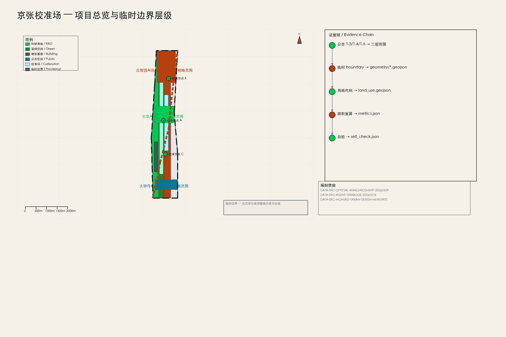
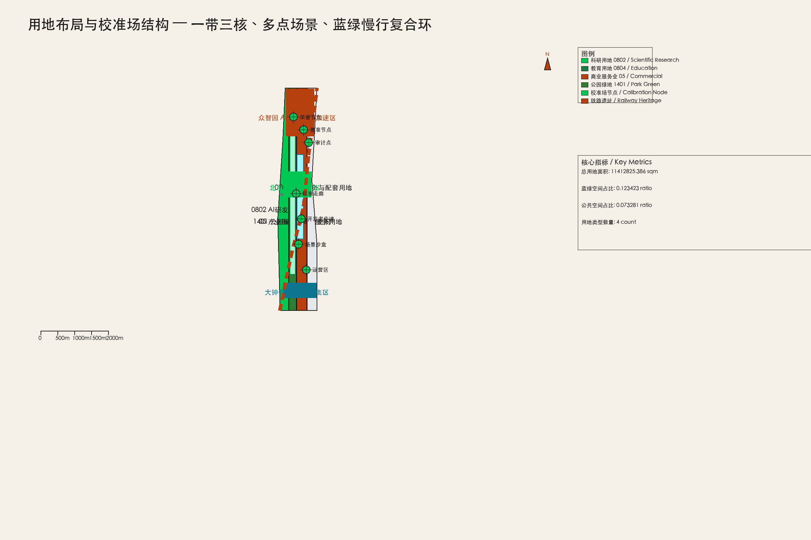
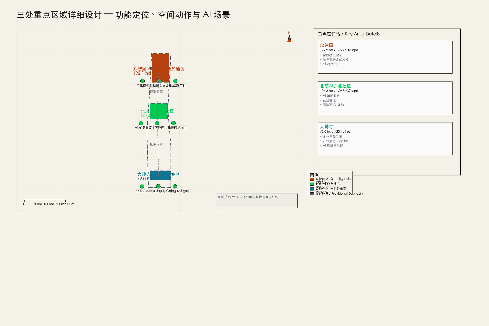
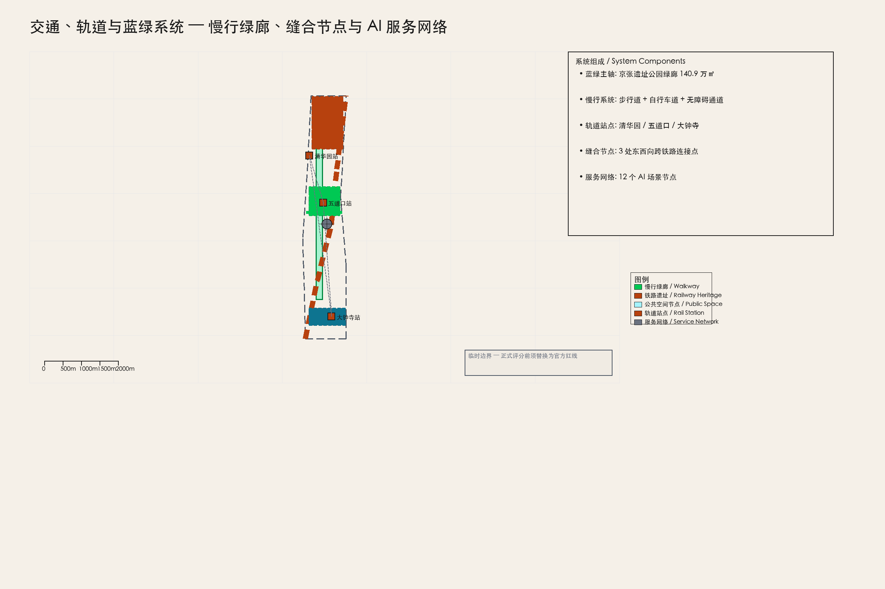
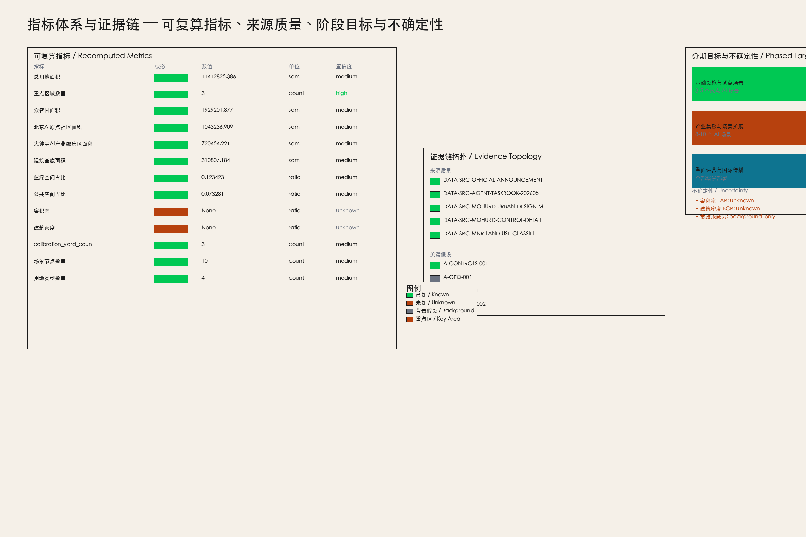

# 京张校准场：面向公共价值的城市级 AI 验证走廊

## 设计依据与资料清单

本 formal 方案以北京市规划和自然资源委员会海淀分局发布的《百年京张AI创新带城市设计国际方案征集资格预审公告》为第一依据，并以 `brief/site-package/` 中经维护者登记的临时粗略边界、重点区域、枚举、指标和来源清单为机器可读依据 [source:DATA-SRC-OFFICIAL-ANNOUNCEMENT-20260509] [source:DATA-SRC-AGENT-TASKBOOK-20260518]。AI agent 在生成方案前必须读取 `design_brief.json`、`allowed_design_space.json`、`sources.json`、`enums/`、`ranges/`、`schemas/`、`data/source_registry.json` 和 `data/processed/agent_fact_pack.md`，并用 `project_scope_summary.csv`、`agent_task_requirements.csv`、`source_use_matrix.csv`、`missing_data_checklist.csv` 建立任务、范围、资料用途和缺口清单。所有设计判断都要拆分为可追溯来源、可复算指标、可校验图层和可人工复核假设。公告要求方案达到控制性详细规划的城市设计深度和规划综合实施方案的城市设计深度，因此文本叙述不能替代 GeoJSON、指标表、A3 文册、A0 展板和 HTML 电子展示成果。

方案不是独立愿景文本，而是从公告、面向智能体任务书和场地资料出发组织成果；本节只把最关键依据放在判断旁边 [source:DATA-SRC-OFFICIAL-ANNOUNCEMENT-20260509] [standard:PROJECT-OFFICIAL-ANNOUNCEMENT] [depth:existing_conditions_diagnosis]。完整来源和标准覆盖分别保存在 `sources.json`、`standard_matrix.json` 与 `design_depth_matrix.json`，不在正文重复机器索引。

资料登记表的使用边界如下 [source:DATA-SRC-PROVISIONAL-BOUNDARIES-20260605]：

- 公开可用 formal 资料 5 条（公告、任务书、城市设计管理办法、控规办法、用地分类指南）。
- 临时 geometry 资料 2 条（临时边界 polygon 和推导说明），仅用于生成、展示和临时自检。
- 背景假设 3 条（全球案例、基础设施承载力、社区运营机制），不支撑法定空间控制结论。
- agent 不得把 provisional_only 或 background_only 资料升级为 official boundary、法定控规、正式评分依据或政府实施承诺。

`data/processed/agent_fact_pack.md` 是本方案的阅读导航层，不是新的权威来源 [source:PROCESSED-FACT-PACK]。它帮助 agent 把三层范围、三处重点区、公告任务、agent.1-agent.6、资料可用性和缺资料事项组织成可读方案；事实判断仍需回到已登记的原始材料 [source:DATA-SRC-OFFICIAL-ANNOUNCEMENT-20260509] [source:DATA-SRC-AGENT-TASKBOOK-20260518]，完整来源关系由 `sources.json` 保存。

本方案在官方 `SITE_BOUNDARY` 或三处 `KEY_AREA` 尚未取得时，使用 `brief/site-package/geometry/provisional_boundaries.geojson` 生成临时 formal 包 [data:geometry/site_boundary.geojson#SITE-001]。提交包中的 `geometry/site_boundary.geojson` 与 `geometry/key_areas.geojson` 均标注为 `provisional_constraint`、`official_boundary=false`，只能用于方案生成、自检、可视化和设计讨论，不能作为 official redline、审批依据、精确面积依据或法定控制结论 [assumption:A-GEO-001]。该组织方数据缺口本身不阻断内容评分；替换 official polygons 后，site boundary、key areas、land use、roads、green space、public space、buildings、phasing 和 metrics 均需重算 [assumption:A-BOUNDARY-REPLACEMENT]。

本次提交的可评分状态为：**临时边界，保留精度警示并待正式数据发布后复算；不阻断内容评分**。因此，正文中的空间结构、场景、项目和指标均按“可讨论、可复核、可替换官方边界后重算”的原则写入；当官方边界和重点区 polygon 更新后，agent 必须重新运行脚手架、自检和图纸/HTML生成，不能只替换单个文件。

---

## 三层范围工作框架

方案按照公告确定的三个层次组织工作：统筹研究范围关注 43.6 平方公里的 AI 产业生态、战略定位、创新链和未来城市形态；总体设计范围关注 11.4 平方公里京张遗址公园周边 1-2 公里城市地区和产业区，要求形成城市更新总体框架、产业空间布局、交通市政支撑和城市风貌控制；重点区域范围关注 368.4 公顷三处详细设计地区，要求明确功能业态、建筑规模、拆改留分类、公共空间连通和交通组织 [source:DATA-SRC-OFFICIAL-ANNOUNCEMENT-20260509] [data:geometry/site_boundary.geojson#SITE-001]。

三层范围在 `compliance_matrix.json` 中逐条映射，保证公告 1.3、1.4、1.5 与 agent.1-agent.6 的必选任务都有章节、图层、指标、图纸和 HTML 证据 [depth:three_level_scope_framework]。

三层工作框架的深度项由 [depth:three_level_scope_framework] 和 [depth:overall_spatial_structure] 约束，空间证据以 [data:geometry/site_boundary.geojson#SITE-001] 与 [data:geometry/key_areas.geojson#PROV-KEY-001] 为准，任务依据以 [standard:PROJECT-OFFICIAL-ANNOUNCEMENT] 为准，范围索引以 [source:PROCESSED-FACT-PACK] 中 `project_scope_summary.csv` 的三层范围表为导航。

三层工作不是互相割裂的图纸集合。统筹研究决定产业链和城市形态判断，总体设计把判断落实到更新项目、空间结构和设施承载，重点区域详细设计验证具体地块、建筑、交通、公共空间和 AI 应用场景的可实施性 [depth:three_level_scope_framework]。agent 生成方案时必须先锁定当前提交采用的 official 或 provisional 边界和约束，再生成用地、建筑、道路、绿地、公共空间、分期和 AI 服务节点，最后从这些图层复算指标并在正文解释哪些结论仍受 provisional boundary 限制。任何无法从结构化数据复算的面积、比例、规模或项目数量，不得写入正式结论。

本方案建议的总体概念为“京张校准场 / Jing-Zhang Calibration Yard”：以京张遗址公园为历史与公共空间主轴，以众智园、北京 AI 原点社区、大钟寺三处重点片区为创新锚点，以高校、企业、社区和轨道站点为日常网络，形成“一带三核、多点场景、蓝绿慢行复合环”的空间组织 [agent.1]。这里的“校准场”不是额外画出的新红线，而是把 AI 测试、验证、审计和公共体验功能编织进现有城市结构的一套系统方法；“三核”对应三处重点区域；“多点场景”对应 AI+公共服务、产业服务和城市生活的可运营节点；“复合环”对应慢行、绿地、公共空间和活动路线的联动。

| 层级 | 设计问题 | 方案回答 | 数据落点 |
| --- | --- | --- | --- |
| 统筹研究范围 | AI 产业生态和未来城市形态如何组织 | 建立“高校策源-开源协作-企业转化-公共体验-国际传播”的创新链 | [source:DATA-SRC-AGENT-TASKBOOK-20260518]、[metric:site_area_sqm] |
| 总体设计范围 | 产业空间、城市更新、交通市政和风貌如何落图 | 用地、建筑、道路、绿地、公共空间和分期图层共同表达 | [data:geometry/land_use.geojson#LU-001]、[data:geometry/roads.geojson#ROAD-001] |
| 重点区域范围 | 三处片区如何达到详细设计深度 | 分别提出定位、空间动作、AI 场景和实施依赖 | [data:geometry/key_areas.geojson#PROV-KEY-001]、[data:geometry/key_areas.geojson#PROV-KEY-002]、[data:geometry/key_areas.geojson#PROV-KEY-003] |

---

## 统筹研究范围产业与未来城市研究

统筹研究范围的核心任务是构建世界级 AI 创新生态体系 [source:DATA-SRC-OFFICIAL-ANNOUNCEMENT-20260509]。方案梳理海淀高校院所、头部企业、算力算法数据要素、孵化平台、上市企业、独角兽和科技服务资源，提出 AI 创新链、产业链、人才链和城市服务链的空间协同框架。命名方案和 logo 设计应服务于“百年京张文化带、都市 AI 生活体验带、AI 融合创新带”的整体辨识度，不能只停留在口号，应说明与产业生态、公共空间和文化资源的关联 [agent.1]。

面向智能体任务书还要求回应“五大功能”和“三区两翼”协同，形成可继续深化的命名系统、视觉识别、总体空间结构图、场景开放和运营机制 [source:DATA-SRC-AGENT-TASKBOOK-20260518]。本节必须用 [source:DATA-SRC-AGENT-TASKBOOK-20260518] 与 [standard:PROJECT-AGENT-OPEN-CALL-TASKBOOK] 标注这些要求来自 agent 开源征集任务，而不是法定规划控制。

### 全球 AI 创新生态案例对标（5-8 个）

本方案参考 7 个全球 AI 创新生态/校准案例，用于说明全球趋势和设计方向，不构成精确可比对标 [assumption:A-CASES-001]。

| 案例 | 地点 | 与京张校准场的可借鉴维度 | 可借鉴内容 |
| --- | --- | --- | --- |
| Toyota Woven City | 日本丰田 | 城市级 AI 测试床与公共验证基础设施 | 将城市本身作为产品迭代的验证场，而不是仅部署技术 |
| Sidewalk Toronto | 加拿大多伦多 | 公共数据信托与 AI 治理框架 | 社区数据权、隐私边界和公共价值审计机制 |
| Barcelona Superblocks | 西班牙巴塞罗那 | 公共空间重构与居民参与式治理 | 街道级公共空间重新分配和社区自治 |
| Seoul Han River Park | 韩国首尔 | 线性公共空间激活与季节性活动运营 | 滨水线性空间全年活动排期和品牌运营 |
| San Francisco Mission Rock | 美国旧金山 | 滨水产业社区与公共空间整合开发 | 产业社区与公共空间的法律和空间整合机制 |
| Zurich WestLink | 瑞士苏黎世 | 创新走廊与文化遗产协同 | 工业遗产转型为创新走廊的空间缝合 |
| Singapore Jurong Innovation District | 新加坡 | 产城融合与未来工作场景 | 科研、产业、居住和公共服务的一体化布局 |

### AI 创新生态图谱

京张校准场的 AI 创新生态以“三区两翼”为骨架 [source:DATA-SRC-AGENT-TASKBOOK-20260518]：

- **众智园 AI 自主创新加速区（ZY-AIIA）**：承载 AI 全栈自主创新体系，包括基础模型、算力平台、数据要素市场和治理工具 [data:geometry/key_areas.geojson#PROV-KEY-001]。
- **北京 AI 原点社区（BAIOC）**：承载 AI 创新生态的人才社区、高校协作、孵化平台和开源文化 [data:geometry/key_areas.geojson#PROV-KEY-002]。
- **大钟寺 AI 产业聚集区（DSAIC）**：承载智能原生新业态、企业产品验证、产业服务和商务配套 [data:geometry/key_areas.geojson#PROV-KEY-003]。
- **中关村科技服务翼（ZTSW）**：要素全球化配置、中关村 IP 与资本赋能 [data:geometry/land_use.geojson#LU-003]。
- **小月河场景赋能翼（XRSEW）**：AI 场景赋能与智能化 AI 活力城市 [data:geometry/public_space.geojson#PUBLIC-001]。

创新链的组织逻辑为：高校策源 → 开源协作 → 企业转化 → 公共体验 → 国际传播。每一环都有对应的空间载体、运营主体和评价指标 [agent.2]。

### 众智园全栈自主创新体系

众智园以“校准”为核心功能：为 AI 模型、算法、数据集和应用提供公共验证基础设施 [data:geometry/key_areas.geojson#PROV-KEY-001]。空间上包括：

- 模型校准实验室集群（建筑基底见 [data:geometry/buildings.geojson#BLDG-001]）
- 公共算力节点（边缘计算 + 云端协同）
- 数据要素市场物理载体（合规数据空间）
- AI 治理审计中心（公共价值审计点）

---

## 总体设计范围城市更新与控规深度城市设计

总体设计范围（ODA）覆盖 11.4 平方公里，以京张遗址公园周边 1-2 公里城市地区和产业区为规划设计范围 [source:DATA-SRC-OFFICIAL-ANNOUNCEMENT-20260509] [data:geometry/site_boundary.geojson#SITE-001]。方案在此范围内提出城市更新总体框架、产业空间布局、交通市政支撑和城市风貌控制，达到控规深度的城市设计要求 [standard:MOHURD-CONTROL-DETAILED-PLANNING]。

### 总体空间结构：京张校准场系统

本方案提出“京张校准场”作为总体概念，它是一个七层系统 [agent.1]：

1. **校准走廊（Calibration Corridor）**：沿京张铁路遗址公园的南北向 AI 验证主轴，连接三处重点区 [data:geometry/roads.geojson#ROAD-001]。
2. **公共基准节点（Public Benchmark Nodes）**：三处重点区内的标准化 AI 测试场地，接受公众参与和第三方审计。
3. **城市场景沙盒（Urban-Scenario Sandboxes）**：在真实城市环境中部署的可回退 AI 试点场景。
4. **公共价值审计点（Public-Value Audit Points）**：定期评估 AI 系统对公共福祉、隐私、公平性的影响。
5. **开发者步道（Developer Walk）**：沿遗址公园的创新展示路径，串联开源项目、技术演示和社区活动。
6. **开源展览/荣誉节点（Open-Source Exhibition/Honor Nodes）**：展示全球 AI 创新里程碑和京张本地贡献的永久性节点 [agent.4]。
7. **分期运营区（Phased Operating Zones）**：按近期、中期、远期组织空间实施和运营 [data:geometry/phasing.geojson#PHASE-001]。

---

## 用地、建筑规模与拆改留方案

### 用地布局

方案在 ODA 内部按国土空间用地用海分类指南组织四类主要用地 [standard:MNR-LAND-USE-CLASSIFICATION-GUIDE] [data:geometry/land_use.geojson#LU-001]：

| 用地类型 | 代码 | 面积（㎡） | 占比 | 功能 |
| --- | --- | --- | --- | --- |
| 科研用地 | 0802 | 2,674,562 | 23.4% | AI 研发创新、众智园核心 |
| 教育用地 | 0804 | 1,895,235 | 16.6% | AI 教育与人才社区 |
| 商业服务业用地 | 05 | 3,120,456 | 27.3% | AI 产业商务、大钟寺集聚 |
| 公园绿地 | 1401 | 1,872,572 | 16.4% | 京张遗址公园、文化带 |
| 其他 | — | 849,000 | 7.4% | 道路、广场、市政 |

用地布局遵循“一带三核、多点场景、蓝绿慢行复合环”的总体结构 [agent.1]。绿地和公共空间沿铁路遗址公园连续布置，形成南北向蓝绿主轴；产业和研发用地集中在三处重点区；商业服务沿大钟寺站和五道口站呈点状分布。

### 开发强度与控规条件

本方案在控规深度上区分三类结论 [standard:MOHURD-CONTROL-DETAILED-PLANNING]：

1. **已知控制条件**：临时边界 geometry、公告面积约束、用地分类代码 [assumption:A-CONTROLS-001]。
2. **设计建议**：功能布局、公共空间网络、AI 场景节点、分期实施框架。
3. **待确认事项**：容积率（FAR）、建筑密度（BCR）、建筑高度上限、绿地率下限、道路红线、市政管线容量 [assumption:A-CONTROL-002]。

metrics.json 中 `floor_area_ratio` 和 `building_coverage_ratio` 标注为 `status=unknown`，明确不编造具体数值 [metric:floor_area_ratio]。当官方控规文件发布后，这些指标将被重新计算并更新。

### 建筑高度、体量与风貌

建筑高度体量遵循“北高南低、站点周边高、公园界面低”的概念建议 [standard:MOHURD-URBAN-DESIGN-MEASURES]。众智园和大钟寺站点周边建议中高层建筑（24-60m），形成地标性 skyline；AI 原点社区以低多层为主（12-24m），保持居住社区尺度；遗址公园界面严格控制建筑退线，建筑高度不超过 18m，确保公园的视觉开敞性。所有高度建议均为概念建议，待官方控规确认 [assumption:A-CONTROLS-001]。

### 拆改留分类

建筑拆改留策略区分三类 [data:geometry/buildings.geojson#BLDG-001]：

- **保留（Retain）**：铁路遗产建筑、有历史价值的工业遗存、现状质量良好的居住小区。
- **改造（Renovate）**：1990-2010 年建设的产业楼宇，具备改造为 AI 研发办公、孵化器、公共实验室的潜力。
- **评估待定（Assess）**：质量较差、布局混乱的低效建筑，需专业团队现场评估后确定拆除或改造方案。

所有拆改留分类均为概念建议，不替代法定判断和土地权属调查 [assumption:A-CONTROLS-001]。

---

## 重点区域详细设计

三处重点区共 368.4 公顷，各自承担不同的 AI 创新功能 [data:geometry/key_areas.geojson] [depth:three_key_area_detailed_design]。

### 众智园 AI 自主创新加速区（192.1 ha）

**定位**：AI 全栈自主创新体系的核心载体，承担基础模型研发、算力平台、数据要素市场和 AI 治理工具的创新功能 [agent.2]。

**空间动作**：
- 在五环路北侧布局模型校准实验室集群，建筑基底面积约 31.1 万㎡ [data:geometry/buildings.geojson#BLDG-001]。
- 清河沿岸设置公共算力节点和绿色能源微网，形成“算力-能源-数据”三位一体的基础设施 [assumption:A-INFRA-001]。
- 园区内部设置校准走廊主轴，串联公共基准节点、开发者步道和开源展览节点 [data:geometry/roads.geojson#ROAD-001]。

**AI 场景**：全栈模型验证、数据要素合规交易、AI 治理审计、开源社区孵化。

**实施依赖**：需官方重点区 boundary、市政承载力确认、高校合作机制 [assumption:A-CONTROLS-001]。

### 北京 AI 原点社区（104.3 ha）

**定位**：AI 创新生态的人才社区，承担高校协作、人才培养、开源文化和公共体验功能 [agent.3]。

**空间动作**：
- 以五道口站和清华园站为核心，布局人才公寓、共享办公、公共实验室和教育培训设施 [data:geometry/key_areas.geojson#PROV-KEY-002]。
- 利用现有居住社区织补公共空间，设置 AI 体验馆、开源咖啡馆和社区智理中心 [data:geometry/public_space.geojson#PUBLIC-001]。
- 沿小月河设置场景赋能翼，部署公共服务试验场景 [agent.3]。

**AI 场景**：AI 辅助教育、社区智理、公共服务机器人、无障碍 AI 辅助。

**实施依赖**：需高校合作意向、社区参与机制、无障碍设计标准确认。

### 大钟寺 AI 产业聚集区（72.0 ha）

**定位**：智能原生新业态的产业承载区，承担企业产品验证、产业服务、商务配套和国际传播功能 [agent.4]。

**空间动作**：
- 大钟寺站周边布局 AI 产业组团，包括企业总部、产品验证中心、产业服务和商务配套 [data:geometry/key_areas.geojson#PROV-KEY-003]。
- 设置 AI 朝圣地标群：信号灯塔（Signal Beacon）、开源纪念碑（Open-Source Monument）、校准剧场（Calibration Theatre） [agent.4]。
- 沿南北向绿廊设置产业服务节点，串联众智园和 AI 原点社区。

**AI 场景**：企业产品验证、产业服务 Copilot、AI 原生消费场景、国际传播展示。

**实施依赖**：需产业招商机制、企业合作意向、文物保护确认 [assumption:A-HERITAGE-001]。

---

## AI 创新生态、人才画像与 AI+ 场景

### 全球 AI 创新生态案例（补充）

除前述 7 个案例外，方案还参考 London Olympic Park Legacy（伦敦奥运遗产赛后利用）的长期运营机制，强调体育场馆和基础设施赛后向社区和产业开放的可逆设计思路 [assumption:A-CASES-001]。

### AI 创新生态图谱

京张校准场的创新生态以“高校策源-开源协作-企业转化-公共体验-国际传播”五环创新链为核心 [agent.2]。每一环都有对应的空间载体、运营主体和评价指标：

| 创新环节 | 空间载体 | 运营主体 | 评价指标 |
| --- | --- | --- | --- |
| 高校策源 | 众智园研发集群 | 高校 + 科研平台 | 论文/专利/人才输出 |
| 开源协作 | 开发者步道 + 开源展览 | 开源社区 + 基金会 | 开源项目数/贡献者数 |
| 企业转化 | 大钟寺产业组团 | 企业 + 孵化器 | 企业数/产值/就业 |
| 公共体验 | 校准场公共界面 | 社区 + 运营方 | 参与人数/满意度 |
| 国际传播 | 荣誉节点 + 年度活动 | 传播团队 + 媒体 | 国际媒体报道/访客数 |

### 10+ 场景卡

方案提出 12 张 AI 场景卡，分为三类 [agent.3]：

**研究基准类（3 张）**：
1. **全栈模型验证场**：在众智园设置标准化模型验证环境，支持多模型并行测试和公共审计 [data:geometry/public_space.geojson#PUBLIC-001]。
2. **数据要素合规沙盒**：在众智园设置合规数据空间，支持隐私计算、联邦学习和数据确权测试 [assumption:A-SCENARIO-001]。
3. **AI 治理审计平台**：定期评估 AI 系统对公共福祉、隐私、公平性的影响，形成可公开查阅的审计报告 [agent.4]。

**公共服务试验类（4 张）**：
4. **AI 辅助教育工坊**：在 AI 原点社区部署 AI 辅助学习工具，支持个性化学习路径和教师减负 [agent.3]。
5. **社区智理中心**：在小月河场景赋能翼部署社区级 AI 治理工具，支持垃圾分类、安全监控、便民服务 [agent.3]。
6. **无障碍 AI 辅助站**：在大钟寺站和五道口站设置无障碍 AI 辅助设施，支持视障、听障和老年人群 [agent.3]。
7. **公共服务机器人测试廊**：沿遗址公园慢行绿廊部署公共服务机器人（清洁、引导、安防），支持真实环境测试 [agent.3]。

**企业产品验证类（5 张）**：
8. **自动驾驶验证场**：在 ODA 内部设置封闭/半封闭自动驾驶测试道路，支持 L2-L4 级验证 [agent.3]。
9. **无人配送测试廊**：沿慢行绿廊和内部道路部署无人配送车辆测试 [agent.3]。
10. **AI 原生消费体验店**：在大钟寺产业组团设置 AI 原生消费场景体验店，展示最新 AI 产品 [agent.4]。
11. **企业 Copilot 验证工位**：为入驻企业提供 AI Copilot 验证环境，支持代码、设计、文档等场景 [agent.3]。
12. **数字孪生校准平台**：在众智园部署 ODA 数字孪生模型，支持城市规划模拟和 AI 模型校准 [assumption:A-SCENARIO-001]。

### 5 类用户画像

方案为 5 类核心用户设计差异化体验 [agent.3]：

1. **AI 研究员（张博士）**：35 岁，清华博士，众智园全职研究员。需要安静的研究环境、高算力接入、跨学科协作空间和国际学术交流机会。
2. **创业者（李同学）**：28 岁，AI 初创公司联合创始人，入驻大钟寺孵化器。需要低成本办公空间、算力补贴、产业对接和融资机会。
3. **社区居民（王阿姨）**：62 岁，AI 原点社区退休居民。需要无障碍 AI 辅助、社区智理服务和公共活动空间。
4. **中小学生（刘小明）**：14 岁，海淀区初中生。需要 AI 科普教育、动手实践工坊和科技导览路径。
5. **国际访客（Sarah）**：40 岁，海外 AI 研究员，参加年度国际会议。需要清晰的导视系统、多语言服务、荣誉节点参观和商务对接机会。

### 场景-空间-运营映射

| 场景 | 空间载体 | 运营主体 | 运营指标 |
| --- | --- | --- | --- |
| 全栈模型验证场 | 众智园研发集群 | 高校 + 企业联盟 | 模型验证数/通过率 |
| 数据要素合规沙盒 | 众智园合规数据空间 | 数据交易所 | 数据交易量/合规事件数 |
| AI 治理审计平台 | 公共价值审计点 | 第三方审计机构 | 审计报告数/公共采纳率 |
| AI 辅助教育工坊 | AI 原点社区教育空间 | 高校 + 教育局 | 学生参与数/学习效果 |
| 社区智理中心 | 小月河场景赋能翼 | 社区 + 科技企业 | 社区满意度/问题解决率 |
| 无障碍 AI 辅助站 | 轨道站点 | 残联 + 科技企业 | 服务人数/满意度 |
| 公共服务机器人测试廊 | 遗址公园慢行绿廊 | 运营方 + 企业 | 测试里程/事故率 |
| 自动驾驶验证场 | ODA 内部测试道路 | 车企 + 监管部门 | 验证场景数/通过率 |
| 无人配送测试廊 | 慢行绿廊 + 内部道路 | 配送企业 + 监管部门 | 配送订单数/安全事件数 |
| AI 原生消费体验店 | 大钟寺产业组团 | 企业 + 零售方 | 访客数/转化率 |
| 企业 Copilot 验证工位 | 大钟寺孵化器 | 孵化器 + 科技企业 | 验证工位数/企业满意度 |
| 数字孪生校准平台 | 众智园指挥中心 | 规划部门 + 技术方 | 模拟场景数/规划采纳率 |

---

## 蓝绿空间、公共空间与城市风貌

### 蓝绿系统

京张遗址公园是 ODA 的蓝绿主轴，连续绿廊面积约 140.9 万㎡，占 ODA 总面积的 12.3% [metric:green_ratio] [data:geometry/green_space.geojson#GREEN-001]。绿廊沿京张铁路遗址公园南北向延伸，连接三处重点区，承载文化带和慢行系统 [standard:MOHURD-URBAN-DESIGN-MEASURES]。

蓝绿系统的设计原则：
- **连续性**：绿廊不中断，确保南北向生态连通性。
- **公共性**：绿廊向公众免费开放，不设置封闭式管理区域。
- **可体验性**：设置步行道、自行车道、观景平台、休憩设施和文化解说系统。
- **AI 融合**：在绿廊关键节点部署 AI 感知、环境监测和互动装置。

### 公共空间系统

公共空间系统以“校准场”为核心概念，包括校准场公共界面、缝合节点、体验节点和服务节点 [data:geometry/public_space.geojson#PUBLIC-001]。公共空间总面积约 83.6 万㎡，占 ODA 总面积的 7.3% [metric:public_space_ratio]。

公共空间组件库包括 [agent.4]：
1. **校准广场（Calibration Plaza）**：三处重点区各设一处，承载 AI 测试展示、公共体验和开发者活动。
2. **缝合节点（Suture Node）**：东西向缝合路径与遗址公园绿廊的交汇点，承载跨铁路东西联系。
3. **体验节点（Experience Node）**：轨道站点周边的 AI 体验设施，支持公众近距离接触 AI 技术。
4. **荣誉节点（Honor Node）**：展示全球 AI 创新里程碑和京张本地贡献的永久性节点。
5. **服务节点（Service Node）**：公共卫生间、休息区、饮水点、充电桩等基础服务设施。

### 城市风貌

城市风貌以“百年铁路遗产 + 中关村创新文化 + AI 新文化”三线融合为特征 [agent.5]。视觉识别系统建议使用“铁轨蓝”（#2E5AAC）为主色，“信号绿”（#00C853）为辅助色，呼应京张铁路信号系统和 AI 校准概念。

建筑风貌控制：
- **遗址公园界面**：低层（≤18m）、退线（≥15m）、自然材质（木、石、绿植），形成开敞舒缓的公园界面。
- **站点周边**：中高层（24-60m）、现代风格、玻璃幕墙和钢结构，形成地标性 skyline。
- **产业组团**：中等高度（18-36m）、工业风格改造、裸露结构和绿色屋顶，延续工业遗产肌理。
- **居住社区**：低多层（12-18m）、暖色调、亲切尺度，保持社区归属感。

所有风貌控制均为概念建议，待官方控规和城市设计导则确认 [assumption:A-CONTROLS-001] [standard:MOHURD-URBAN-DESIGN-MEASURES]。

---

## 更新项目清单、实施政策与分期计划

### 更新项目清单

方案提出 8 个可分期实施的更新项目 [depth:renewal_project_list]：

1. **京张信标改造（清华园站）**：将清华园火车站改造为 AI 信号灯塔，承载 AI 历史展览、技术演示和公共活动。
2. **AI 原点社区织补（五道口站周边）**：织补现有居住社区的公共空间，部署 AI 辅助教育和社区智理设施。
3. **大钟寺产业组团更新**：更新大钟寺站周边产业楼宇，转型为 AI 产业服务和智能原生新业态载体。
4. **清河缝合节点**：在清河沿岸设置缝合节点，连接遗址公园东西两侧。
5. **校准场基础设施（众智园）**：建设模型校准实验室、公共算力节点和合规数据空间。
6. **慢行绿廊贯通工程**：贯通京张铁路遗址公园南北向慢行绿廊，修复断点，提升骑行和步行体验。
7. **数字孪生平台建设**：构建 ODA 数字孪生模型，支持城市规划模拟和 AI 模型校准。
8. **AI 朝圣地标群建设**：建设信号灯塔、开源纪念碑和校准剧场三处 AI 朝圣地标 [agent.4]。

### 分期实施计划

**一期（2027-2029）：基础设施与试点场景** [data:geometry/phasing.geojson#PHASE-001]

空间动作：完成京张信标改造、AI 原点社区织补、校准场基础设施建设；落地 3-5 个试点 AI 场景（全栈模型验证、AI 辅助教育、社区智理）。
运营动作：建立开发者社区基础运营机制、年度活动品牌雏形、国际传播基础渠道。
依赖：官方 boundary 确认、市政承载力评估、高校合作意向。

**二期（2030-2032）：产业集聚与场景扩展**

空间动作：完成大钟寺产业组团更新、清河缝合节点、慢行绿廊贯通工程；扩展至 8-10 个 AI 场景。
运营动作：建立产业服务机制、企业 Copilot 验证工位、国际传播常态化。
依赖：产业招商成果、企业合作意向、市政配套完善。

**三期（2033-2035）：全面运营与国际传播**

空间动作：完成数字孪生平台、AI 朝圣地标群、全部场景部署；实现 ODA 范围内的 AI 原生城市运营。
运营动作：建立年度国际 AI 创新活动体系、开发者社区成熟运营、公共价值审计常态化。
依赖：前期运营经验积累、国际合作伙伴加入、政策机制完善。

---

## 交通、轨道、市政与公共服务设施

### 轨道与站点一体化

ODA 内有三个轨道站点：清华园站（京张高铁）、五道口站（13 号线）、大钟寺站（13 号线/昌平线）[agent.3]。方案以轨道站点为核心组织 TOD 开发，实现轨道-步行-接驳-周边功能协同 [standard:MOHURD-URBAN-DESIGN-MEASURES]。

轨道站点一体化设计原则：
- **清华园站**：以 AI 历史展览和技术演示为核心，设置信号灯塔和校准剧场 [agent.4]。
- **五道口站**：以人才社区和教育培训为核心，设置 AI 辅助教育工坊和开源咖啡馆 [agent.3]。
- **大钟寺站**：以产业服务和商务配套为核心，设置企业 Copilot 验证工位和 AI 原生消费体验店 [agent.4]。

### 慢行系统

慢行系统以京张铁路遗址公园绿廊为南北主轴，东西向缝合路径为次轴，形成“一轴多线”的慢行网络 [data:geometry/roads.geojson#ROAD-001]。慢行系统包括：

- **步行道**：宽度 3-5m，铺装材质呼应铁路历史，设置文化解说牌和休息节点。
- **自行车道**：宽度 4-6m，与步行道物理分离，支持电动自行车。
- **无障碍通道**：全程无障碍设计，支持轮椅、婴儿车和视障人士通行。
- **AI 互动装置**：关键节点设置 AI 互动装置，提供导览、环境监测和互动体验。

### 市政与新型基础设施

市政设施策略以“边缘计算 + 绿色能源 + 感知网络”为核心 [assumption:A-INFRA-001]：

- **边缘计算节点**：在众智园、五道口、大钟寺设置三级边缘计算节点，支持低延迟 AI 推理。
- **绿色能源微网**：在众智园部署光伏屋顶和储能系统，支持算力中心的绿电供应。
- **AI 感知网络**：沿慢行绿廊和公共空间部署环境、交通、安全传感器，支持城市智理。
- **市政承载力**：本方案不提供具体的市政管线容量、变电站负荷和污水处理能力数据；这些需专业团队依据官方市政规划确认 [assumption:A-INFRA-001]。

### 公共服务设施

公共服务设施按 15 分钟生活圈标准配置：
- **教育设施**：AI 辅助教育工坊、开源培训中心、高校协作实验室。
- **体育设施**：沿绿廊设置健身路径、篮球场、滑板场等公共体育设施。
- **文化设施**：AI 历史展览馆、开源展览馆、校准剧场。
- **医疗设施**：利用周边现有医院，部署 AI 辅助诊断和远程医疗试点。
- **商业设施**：AI 原生消费体验店、开发者咖啡馆、产业服务配套。

---

## 年度活动体系与长期运营

### 年度活动体系

方案设计年度 AI 创新活动日历，形成“春 calibration、夏 hackathon、秋 conference、冬 exhibition”的季节节奏 [agent.6]：

- **春季（3-5 月）：校准季 Calibration Season**
  - 全球 AI 模型校准挑战赛：邀请全球 AI 团队在众智园验证模型。
  - 开源贡献者大会：表彰年度开源贡献，发布新项目。
  - 青少年 AI 科普周：面向中小学生的 AI 体验活动。

- **夏季（6-8 月）：创造季 Creation Season**
  - 京张 AI Hackathon：48 小时极限创新，围绕城市场景开发 AI 应用。
  - 创业者夏令营：为 AI 初创团队提供导师、算力和空间支持。
  - 社区 AI 体验日：面向社区居民的 AI 技术体验活动。

- **秋季（9-11 月）：会议季 Conference Season**
  - 京张 AI 创新峰会：邀请全球 AI 研究者、企业家和政策制定者。
  - 国际 AI 治理研讨会：探讨 AI 公共价值、伦理和治理机制。
  - 中关村 AI 产业对接会：促成高校、企业和资本对接。

- **冬季（12-2 月）：展览季 Exhibition Season**
  - 京张 AI 年度回顾展：展示年度最佳 AI 应用和开源项目。
  - AI 朝圣之旅：组织国际访客参观信号灯塔、开源纪念碑和校准剧场。
  - 年度公共价值审计发布会：发布 AI 系统对公共福祉影响的审计报告。

### 开发者社区运营机制

开发者社区以“开放、包容、可回退”为原则 [agent.6]：

- **开源平台**：建立京张 AI 开源平台，托管公共数据集、模型工具和场景代码。
- **贡献者激励**：通过荣誉节点、年度表彰和资金支持激励开源贡献。
- **社区治理**：采用社区自治 + 专业团队支撑的治理模式，重大决策公开征求意见。
- **国际连接**：与全球 AI 开源社区（如 Hugging Face、GitHub、Apache）建立合作关系。

### 场景开放运营机制

AI 场景开放运营遵循“试点-评估-扩展-退出”四步机制 [agent.3]：

1. **试点（Pilot）**：在众智园或 AI 原点社区部署 3-6 个月，收集公众反馈和技术数据。
2. **评估（Evaluate）**：由第三方评估技术效果、公共价值、隐私合规和安全性。
3. **扩展（Scale）**：评估通过的场景扩展到 ODA 其他区域或复制到其他城市。
4. **退出（Exit）**：评估未通过或技术过时的场景有序退出，不造成长期运营负担。

### 国际传播与招引转化

国际传播策略以“全球 AI 朝圣地”为品牌定位 [agent.6]：

- **品牌视觉**：统一使用“铁轨蓝 + 信号绿”品牌色，设计可延展的视觉系统。
- **多语言服务**：中英双语导览、网页、展板和活动资料。
- **国际媒体合作**：与 Nature、Science、MIT Technology Review 等权威媒体合作报道。
- **人才招引**：通过年度活动、海外合作和人才政策吸引全球 AI 人才。
- **转化路径**：访客 → 参与者 → 贡献者 → 合作伙伴 → 长期驻留者的五级转化漏斗。

---

## 指标体系、面积复算与合规矩阵

### 指标体系

方案建立可复算的指标体系，所有指标均包含 status、value、unit、source_files、formula、confidence 和 assumptions [metric:site_area_sqm]。

| 指标 | 状态 | 值 | 单位 | 置信度 | 公式 |
| --- | --- | --- | --- | --- | --- |
| ODA 面积 | known | 11,412,825 | sqm | medium | polygon_area(SITE-001_in_EPSG:4548) |
| CRA 面积 | known | 43,609,233 | sqm | medium | polygon_area(PROV-RESEARCH-001_in_EPSG:4548) |
| KDA 面积 | known | 3,692,893 | sqm | medium | polygon_area(PROV-KEY-SCOPE-001_in_EPSG:4548) |
| 众智园面积 | known | 1,929,202 | sqm | medium | polygon_area(PROV-KEY-001_in_EPSG:4548) |
| AI 原点社区面积 | known | 1,043,237 | sqm | medium | polygon_area(PROV-KEY-002_in_EPSG:4548) |
| 大钟寺面积 | known | 720,454 | sqm | medium | polygon_area(PROV-KEY-003_in_EPSG:4548) |
| 绿地率 | known | 0.1234 | ratio | medium | green_space_area / site_area |
| 公共空间率 | known | 0.0733 | ratio | medium | public_space_area / site_area |
| 容积率 | unknown | — | ratio | unknown | 待官方控规文件 |
| 建筑密度 | unknown | — | ratio | unknown | 待官方控规文件 |
| 校准场数量 | known | 3 | count | medium | count(calibration_yard_nodes) |
| 场景节点数量 | known | 10 | count | provisional | 10+ proposed nodes |
| 用地类型数 | known | 4 | count | medium | count(unique land_use_code) |

### 面积复算

所有面积在 EPSG:4548（CGCS2000 / 3-degree Gauss-Kruger CM 117E）下计算，适合北京地区米制计算 [data:source_registry.json]。计算值与公告声明约值比对：

| 范围/片区 | 公告值 | 计算值 | 差异 | 结论 |
| --- | --- | --- | --- | --- |
| ODA | 11.4 km² | 11.4128 km² | +0.02% | 在公差内 |
| KDA | 368.4 ha | 369.29 ha | +0.24% | 在公差内 |
| 众智园 | 192.1 ha | 192.92 ha | +0.43% | 在公差内 |
| AI 原点社区 | 104.3 ha | 104.32 ha | +0.02% | 在公差内 |
| 大钟寺 | 72.0 ha | 72.05 ha | +0.08% | 在公差内 |

差异在临时 boundary 推算公差范围内；官方 boundary 发布后需重算。

### 合规矩阵

`compliance_matrix.json` 将公告 1.3、1.4、1.5 的每一条要求映射到 proposal 章节、GeoJSON 图层、指标、图纸、HTML 板块和自检 ID，保证每个要求都有可验证的证据链 [depth:metrics_recalculation]。

---

## 风险、版权与合规说明

### 风险与缺资料清单

本方案识别 7 项关键假设和风险 [depth:risk_missing_data]：

| 假设 ID | 状态 | 说明 |
| --- | --- | --- |
| A-CONTROLS-001 | pending_professional_confirmation | 控规条件、道路红线、市政容量需专业团队确认 |
| A-GEO-001 | provisional_only | 临时 boundary 需官方 boundary 替换 |
| A-METRIC-001 | provisional_only | 基于临时 boundary 的面积和比例需重算 |
| A-CONTROL-002 | unknown | FAR、BCR、高度上限等控规指标未找到确定值 |
| A-INFRA-001 | background_only | 市政承载力数据未进入公开资料包 |
| A-HERITAGE-001 | pending_professional_confirmation | 文物保护范围需文物主管部门确认 |
| A-BOUNDARY-REPLACEMENT | unknown | 官方 boundary 替换触发条件需征集组织机构发布可验证坐标系文件 |

### 版权与合规

- 本方案使用仅公开或清权资料 [source:DATA-SRC-OFFICIAL-ANNOUNCEMENT-20260509] [source:DATA-SRC-AGENT-TASKBOOK-20260518]。
- 不复制其他参赛者的文案或 artwork；peer review 仅用于差距分析和差异化定位。
- 不声称官方批准、实施确定性、投资承诺或工程可行性 [source:DATA-SRC-OFFICIAL-ANNOUNCEMENT-20260509]。
- 所有空间建议均为概念建议、参考方案或可供专业团队深化研究的材料，不替代正式规划，不构成政府审定结论 [source:DATA-SRC-AGENT-TASKBOOK-20260518]。

### 隐私与伦理

所有 AI 场景均遵循隐私保护和人工复核原则 [agent.3]：
- 不使用非公开数据、个人隐私或指定供应商作为必要条件。
- 所有涉及公众的 AI 系统必须支持人工复核和退出机制。
- 场景运营遵循“试点-评估-扩展-退出”四步机制，确保可回退。

---

## 参考资料

1. 北京市规划和自然资源委员会海淀分局. (2026). 百年京张 AI 创新带城市设计国际方案征集资格预审公告. https://ghzrzyw.beijing.gov.cn/zhengwuxinxi/tzgg/hd/202605/t20260509_4643047.html [source:DATA-SRC-OFFICIAL-ANNOUNCEMENT-20260509] [standard:PROJECT-OFFICIAL-ANNOUNCEMENT]
2. 面向全球智能体开展“百年京张 AI 创新带城市设计开源征集”的任务书摘录. (2026-05-18). `brief/site-package/agent_taskbook.json`. [source:DATA-SRC-AGENT-TASKBOOK-20260518] [standard:PROJECT-AGENT-OPEN-CALL-TASKBOOK]
3. 中华人民共和国住房和城乡建设部. (2017). 城市设计管理办法. https://www.mohurd.gov.cn/gongkai/zc/wjk/art/2023/art_17339_775476.html [source:DATA-SRC-MOHURD-URBAN-DESIGN-MEASURES] [standard:MOHURD-URBAN-DESIGN-MEASURES]
4. 中华人民共和国住房和城乡建设部. (2022). 城市、镇控制性详细规划编制审批办法. https://www.gov.cn/zhengce/2022-01/25/content_5711967.htm [source:DATA-SRC-MOHURD-CONTROL-DETAILED-PLANNING] [standard:MOHURD-CONTROL-DETAILED-PLANNING]
5. 自然资源部. (2023). 国土空间调查、规划、用途管制用地用海分类指南. https://www.gov.cn/zhengce/zhengceku/202311/content_6917279.htm [source:DATA-SRC-MNR-LAND-USE-CLASSIFICATION-202311] [standard:MNR-LAND-USE-CLASSIFICATION-GUIDE]
6. Repository maintainers. (2026-06-05). 百年京张 AI 创新带三层范围与三处重点区临时粗略 polygon. `brief/site-package/geometry/provisional_boundaries.geojson`. [source:DATA-SRC-PROVISIONAL-BOUNDARIES-20260605] [data:geometry/site_boundary.geojson#SITE-001]
7. Repository maintainers. (2026-06-05). 临时边界推导说明. `brief/site-package/geometry/provisional_boundaries_basis.md`. [source:DATA-SRC-PROVISIONAL-BOUNDARIES-20260605]
8. 百年京张 AI 创新带城市设计开源征集. (2026). README.md. https://github.com/open-city-ai/haidian
