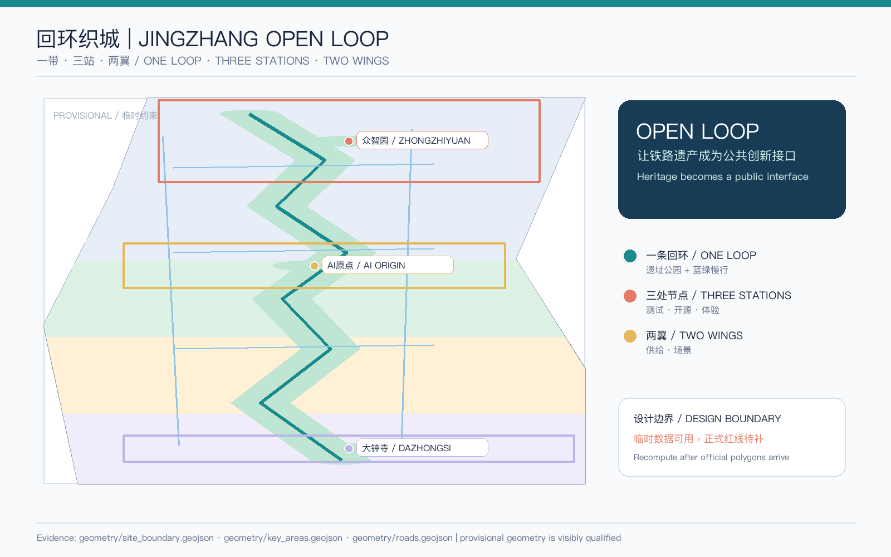
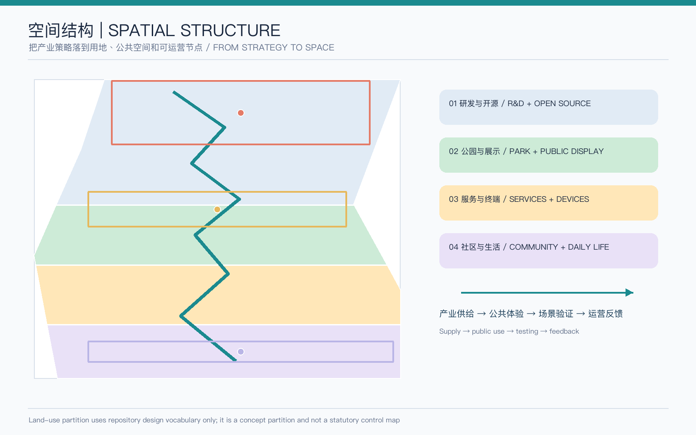
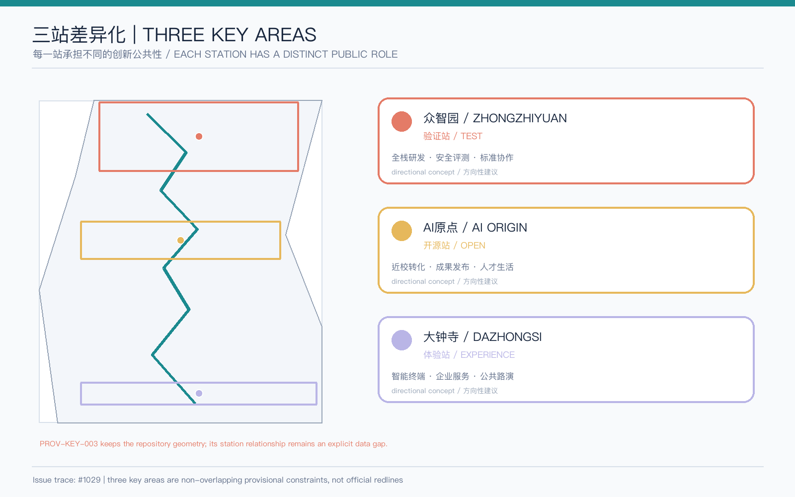
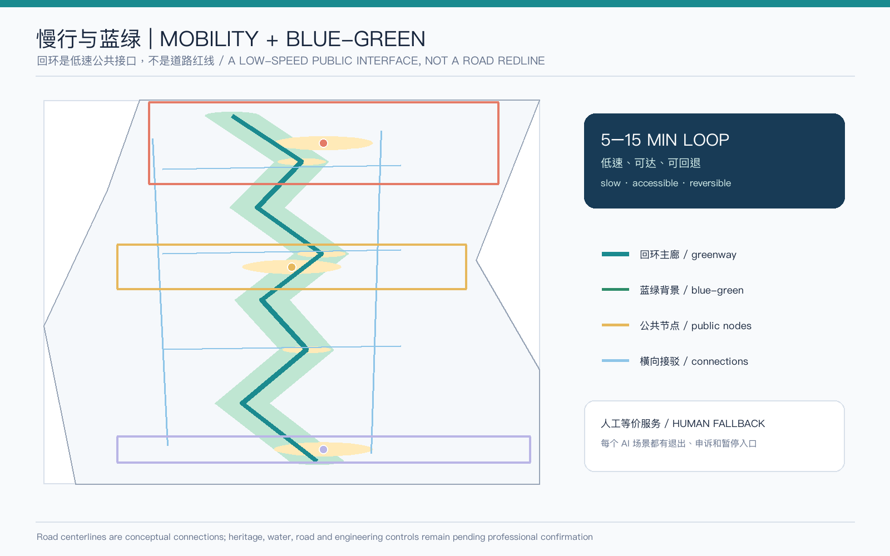
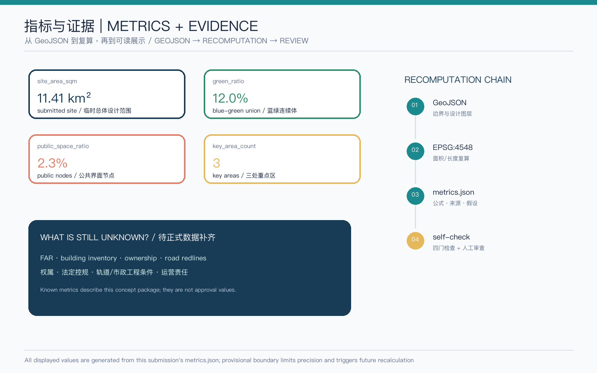

# Jingzhang Open Loop | 回环织城

## Design Basis and Source List

Jingzhang Open Loop turns the Centennial Jing-Zhang heritage line from something merely viewed into a public interface that people can walk, question, test, pause, and maintain. The first basis is the public qualification announcement; the second is the repository taskbook for agents, source registry, land-use vocabulary, and submission contract. No concept proposal is presented as a statutory plan or government commitment [source:OFFICIAL-ANNOUNCEMENT] [source:AGENT-TASKBOOK].

Before writing, the agent read `design_brief.json`, `allowed_design_space.json`, `agent_taskbook.json`, `source_registry.json`, the local standard snapshots, processed fact-pack indexes, and the GeoJSON rules. Land use, buildings, roads, green space, public space, and phasing are derived from one spatial source. `data/processed/agent_fact_pack.md` is navigation, not a new authority; provenance, licenses, limitations, and transformations are recorded in `sources.json` [source:SOURCE-REGISTRY] [source:PROCESSED-FACT-PACK].

The repository currently does not provide official detailed polygons for the overall design boundary or the three key areas. This package preserves `PROV-SITE-001` and `PROV-KEY-001/002/003` exactly as repository provisional constraints. They are usable for intake, design discussion, visualization, and self-check only; they are not official redlines, approval bases, ownership boundaries, engineering boundaries, or precise-area evidence [data:geometry/site_boundary.geojson#SITE-001] [data:geometry/key_areas.geojson#PROV-KEY-001]. Issue #1029 also records that `PROV-KEY-003` is not yet station- or road-anchored. This proposal does not shift it and treats the Dazhongsi design as directional [source:ISSUE-1029].

All text, diagrams, PDFs, HTML, and machine-readable layers were generated for this fresh proposal. Images are the interpretation layer; GeoJSON, `metrics.json`, the three matrices, `sources.json`, `assumptions.json`, and self-check form the audit layer. When official polygons, regulatory controls, building inventory, ownership, municipal, and specialist conditions arrive, the whole package must be recalculated rather than replacing one image [depth:existing_conditions_diagnosis].

## Three-Level Scope Framework

The proposal uses “upstream strategy—middle-scale loop—downstream stations.” The coordinated research area is approximately 43.6 km² and addresses industry, talent, compute, data, culture, and international exchange. The overall design area is approximately 11.4 km² and translates those questions into renewal, slow mobility, public services, blue-green structure, and character. The key detailed-design area is approximately 368.4 ha and differentiates Zhongzhiyuan, AI Origin Community, and Dazhongsi [standard:PROJECT-OFFICIAL-ANNOUNCEMENT] [depth:three_level_scope_framework].

`site_area_sqm` is the EPSG:4548 recomputation of the submitted provisional overall-design polygon, approximately 11.41 km². It exists so that the layers can be checked against one another; it does not replace the announcement's approximate 11.4 km² statement and does not turn a provisional polygon into a precise redline [data:geometry/site_boundary.geojson#SITE-001] [metric:site_area_sqm]. The three required key areas remain non-overlapping source geometries and their areas are provisional comparisons only. Official polygons must trigger recalculation of key areas, land use, public space, buildings, and phasing [data:geometry/key_areas.geojson#PROV-KEY-002] [metric:key_area_count].

The transmission logic is: research proposes an open innovation chain; the overall design translates it into one loop, four land-use bands, three public stations, and two service wings; the detailed areas become a validation station, an open-release station, and an experience station. Industry strategy therefore becomes spatially legible without treating the map as an approved control drawing [data:geometry/land_use.geojson#LU-001] [data:geometry/roads.geojson#ROAD-001].

## Coordinated Research Area: Industry and Future City Research

### Concept, naming, and visual identity

“Open Loop” has three meanings: it reconnects heritage, blue-green space, and daily walking; it closes the loop between research, open source, experience, and feedback; and it returns AI automation to a human circuit of appeal, exit, and maintenance. The logo direction is a broken rail line inside an unclosed square: the gap signals questioning and rollback, while the square signals that the city can host contribution. The recommended palette is rail blue, public teal, node gold, and risk coral. Fonts, corporate marks, historic images, and landmark symbols require separate clearance before professional development; no external logo or image is reused [standard:PROJECT-AGENT-OPEN-CALL-TASKBOOK].

The three positionings become three perceptible urban layers. The Centennial Jing-Zhang Cultural Belt is the public historical ground; the Urban AI Life Experience Belt is the everyday service layer for residents, students, and visitors; the AI Integration Innovation Belt is the testing network for research, scenarios, and governance. The five functions make a loop: full-stack autonomous innovation supplies methods, a world-class ecosystem supplies collaboration, AI+ scenarios supply real feedback, an intelligent lively city supplies public experience, and global AI governance supplies explainable rules.

The three areas and two wings are a division of work, not new administrative districts. Zhongzhiyuan is the full-stack validation station; AI Origin Community is the open-release and transfer station; Dazhongsi is the urban experience station. The Zhongguancun technology-service wing is a conceptual interface for enterprise services, capital, and knowledge resources. The Xiaoyuehe scenario-empowerment wing reconnects public space, education, health, mobility, and daily services through cross-links and service nodes rather than unauthorized road or engineering lines [data:geometry/public_space.geojson#PUBLIC-001] [depth:overall_spatial_structure].

### Transferable global ecosystem patterns

The following are non-quantitative public background patterns, not claims about output, investment, company rosters, or local equivalence. They make “world-class ecosystem” spatially and operationally testable [source:CASE-PATTERNS].

| Pattern | Transferable mechanism | Open Loop translation |
| --- | --- | --- |
| Kendall Square | Close collaboration among research, companies, and public space | A near-campus transfer and evening collaboration interface in AI Origin |
| Station F | Shared services, founder community, and a recognizable public entry | Shared service desks, booking, testing, and contribution records in the two wings |
| MaRS | Research, entrepreneurship, and social questions in one conversation | Safety, accessibility, and public-value checks before Zhongzhiyuan testing |
| Barcelona 22@ | Industrial renewal and public-space transformation proceed together | Renewal and public interfaces are phased together; renewal is not equated with demolition |
| Punggol Digital District | Business, education, daily life, and digital infrastructure are coordinated | A school–park–community scenario chain with human-equivalent service |
| Open knowledge models | Contributions can be cited, reused, and revised | An open catalogue and retractable contribution wall at AI Origin |

The proposal therefore uses an eight-column ecosystem ledger: space, industry, compute, data, talent, capital/services, scenarios, and public return. Every AI project or scenario should state who supplies it, who uses it, who reviews it, who can exit, and how learning returns to the public knowledge base [metric:key_area_count].

Future-city research does not mean putting sensors everywhere. It means designing a minimum-data, visible-explanation, human-takeover interface. Mobility uses aggregate readings; health, education, legal, and public-service scenarios require explicit authorization and responsibility; and every public space still works without AI. Specialists must confirm algorithm safety, accessibility, heritage, fire, network, and municipal conditions [standard:MOHURD-URBAN-DESIGN-MEASURES].

## Overall Design Area: Urban Renewal and Regulatory-Plan-Level Urban Design

The overall structure is one loop, three stations, two wings, and six public interfaces. The loop is a heritage-park and blue-green slow-mobility circuit; the stations are validation, open release, and experience; the wings are service supply and scenario feedback. The six interfaces are research, knowledge release, community, park/waterfront, transit connection, and contribution memory. `geometry/roads.geojson` expresses one main loop, two alternative slow routes, and three cross-links. These are conceptual connections, not road redlines [data:geometry/roads.geojson#ROAD-001] [depth:overall_spatial_structure].

The land-use partition uses four continuous bands derived from the same provisional site boundary. The northern band uses 0802 research land for full-stack research and evaluation; the middle-north band uses 1401 park green space for the heritage park, water interface, and public display; the middle-south band uses 05 commercial-service land for enterprise services, devices, and international exchange; the southern band uses 0702 community-service land for talent life, daily services, and accessibility. The bands fully cover the submitted boundary without overlap, but they do not represent approved statutory land use [data:geometry/land_use.geojson#LU-002] [standard:MNR-LAND-USE-CLASSIFICATION-GUIDE].

Renewal follows “retain public memory, renovate inefficient interfaces, add only carefully tested service nodes.” The eight concept footprints represent a research courtyard, evaluation hall, open-release hall, transfer station, contribution gallery, intelligent-economy salon, community service group, and transit/accessibility point. Retain/renovate is prioritized; new build is limited to a concept node pending professional verification. There is no official building inventory, FAR, height, ownership, or fire condition in the cleared package, so no intensity or demolition conclusion is invented [data:geometry/buildings.geojson#BLDG-001] [depth:retain_renovate_demolish].

Regulatory-plan-level depth here means that the objects and evidence chain are complete, not that control values are fabricated. Land use, buildings, roads, blue-green space, public space, and phasing have separate layers, while formulas, units, sources, confidence, and assumptions are explicit. FAR, total floor area, road redlines, and parking baselines remain unknown. This respects the implementation role of regulatory planning while keeping concept design separate from approved controls [standard:MOHURD-CONTROL-DETAILED-PLANNING] [depth:development_intensity_controls].

## Detailed Design of Key Areas

### Zhongzhiyuan AI Acceleration Area: the validation station

Zhongzhiyuan is the “validate before diffusion” station. The reference scheme combines a green-edge interface, a full-stack research courtyard, and a safety-governance evaluation hall. The inside supports research, compute, model evaluation, and standards collaboration; the public edge supports bookable, low-risk demonstrations, developer walks, and plain-language explanation. Retain/renovate comes before new volume, and public interfaces come before expansion. Every demonstration needs provenance, a time limit, a stop threshold, and human review [data:geometry/key_areas.geojson#PROV-KEY-001].

The safety-governance sandbox, low-carbon compute stop, and city-operations review desk are deliberately reversible industry-validation scenarios. A professional team should decide whether any node can move into field testing after official boundaries, heritage/blue-line conditions, fire, compute energy, and network conditions are known. This submission supplies relationships and public-value logic, not permission to deploy.

### Beijing AI Origin Community: the open-release station

AI Origin Community is the “near-campus transfer plus public knowledge” station. The reference scheme repairs walking gaps among campus, park, enterprise, and community through an open-release hall, a talent-service front desk, an evening collaboration room, and small community courtyards. Scenario cards focus on release, AI education, public-service translation, and accessible guidance. Data is minimized and authorized; residents retain a traditional human service path [data:geometry/key_areas.geojson#PROV-KEY-002] [metric:public_space_ratio].

Building renewal favors reversible occupation: movable exhibitions, shared rooms, removable wayfinding, and graded night lighting. “Talent life” is not a promise of new housing. The current proposal treats community service, short learning, public rest, and service reach as spatial goals; ownership and residential supply require official information and professional confirmation.

### Dazhongsi AI Industry Cluster: the experience station

Dazhongsi is the station where innovation meets daily urban life: intelligent-device display, enterprise services, international pitching, and four-quadrant walking repair. Because the repository `PROV-KEY-003` is not yet station- or road-anchored, this proposal does not claim a precise Dazhongsi station integration or engineering solution. It only states that an experience station should offer transit access, walkability, a public enterprise interface, and display choices that do not depend on private corporate space [data:geometry/key_areas.geojson#PROV-KEY-003] [source:ISSUE-1029].

The program focus is intelligent devices, low-speed robots, content experience, and enterprise services, not any named company or investment. Short-term exhibitions, evening pitches, public technical explanation, and a human service desk can be explored. If official data changes the area location, size, or mobility conditions, all nodes and metrics must be recalculated [depth:three_key_area_detailed_design].

## AI Innovation Ecosystem, Personas, and AI+ Scenarios

### Personas and space–operation mapping

| Persona | Need | Spatial response | Human and privacy boundary |
| --- | --- | --- | --- |
| Open-source developer | Release, collaboration, testing, contribution reputation | Open-release hall, contribution wall, evening collaboration room | No personal tracking; contribution can be anonymous or withdrawn |
| Startup team | Affordable testing, compute access, enterprise services | Zhongzhiyuan test space, wing service desk, bookable nodes | Data and compute are authorized case by case; no required vendor |
| Student or researcher | Near-campus transfer, learning, cross-campus exchange | Campus–park slow route, education point, transfer station | Research and campus data are not open by default |
| Resident or older adult | Commute, leisure, services, understandable interfaces | Public courtyards, human desk, accessible guidance, analogue path | No commercial profiling; non-digital access remains |
| Enterprise visitor or international founder | Hosting, pitching, recruitment, city orientation | Dazhongsi experience salon, cultural route, transit interface | Corporate marks and cases require clearance; visitor data minimized |

### Twelve scenario cards

Every card includes a user, space, data boundary, human review, exit condition, and operating responsibility. The table is the readable summary; matrices and layers provide the complete audit. Cards marked “industry validation” are reference test scenarios, not approved operations [source:AGENT-TASKBOOK] [depth:municipal_new_infrastructure].

| No. | Scenario | Space and service | Validation boundary |
| --- | --- | --- | --- |
| 01 | Open-release hall | Results, code contribution display, and human-hosted release at AI Origin | Low-risk content, human review, and withdrawal |
| 02 | Safety-governance sandbox | Model evaluation, red-team explanation, and standards workshop at Zhongzhiyuan | **Industry validation**; authorized data, stop threshold, human review |
| 03 | Edge-compute stop | Low-power public information and developer tools along the loop | **Industry validation**; energy, network, and security pending |
| 04 | AI walkability guide | Aggregate crowding and accessibility feedback helps route choice | Minimum aggregate data; user can turn it off |
| 05 | Dazhongsi international salon | Public display, pitching, and services for devices and robots | **Industry validation**; no private-space assumption or investment promise |
| 06 | Qinghe low-carbon innovation walk | Public explanation of energy, rainwater, and compute | **Industry validation**; water, blue-line, and energy review needed |
| 07 | Public-service translation desk | Multilingual help for health, education, legal, and daily services | **Industry validation**; human equivalent, complaint, and correction first |
| 08 | AI learning walk | Hands-on AI literacy micro-lessons for students and residents | Cleared public content; child-safety boundary |
| 09 | Low-speed robot delivery test | Observe a time-limited delivery interface without conflicting with walking | **Industry validation**; simulation first, authorization second, immediate stop |
| 10 | Contribution and honor wall | Open results, repair contributions, and retractable attribution | No uncleared people, marks, or paper images |
| 11 | City-operations review desk | Monthly review of events, space use, and complaint handling | Aggregate display only; human decision ownership |
| 12 | Night walk companion | Lighting, wayfinding, human help, and low-intrusion anomaly alert | No identification; human patrol and emergency route remain |

The three industry-validation pathways have three gates: authorized data, spatial safety, and public return. If any gate is not ready, the scenario remains a paper or closed test and does not enter public space. Success rates, sample sizes, and operating KPIs are not invented; they require accountable operators and specialist safety review.

## Land Use, Building Scale, and Retain-Renovate-Demolish Strategy

The concept partition uses the repository's allowed 0802, 1401, 05, and 0702 vocabulary, with shared edges derived from one boundary. `land_use.geojson` is authoritative for this package; the image is not used to infer area [data:geometry/land_use.geojson#LU-003] [standard:MNR-LAND-USE-CLASSIFICATION-GUIDE]. Research and open collaboration concentrate in the north, the park and public display form the middle ground, enterprise services and devices occupy the middle-south, and community services sit at the daily southern interface.

The building layer describes design supply and renewal priority, not an existing-building survey. The eight footprints prioritize retain or renovate; a transit/accessibility node is the only new-build concept and is explicitly pending professional verification. Total floor area, storeys, FAR, height, setbacks, and ownership remain unknown and cannot be inferred from the footprints [data:geometry/buildings.geojson#BLDG-008] [metric:floor_area_ratio].

The retain–renovate–demolish logic is “public interface first, structure second, reversible renewal first.” Improve walking, wayfinding, opening hours, first-floor transparency, and public service before deciding whether a structure changes. Demolition or new construction requires official data, heritage, fire, ownership, and specialist review; the generated rectangles are not parcels [depth:height_massing_character] [depth:retain_renovate_demolish].

## Transport, Rail, Municipal Infrastructure, and Public Services

Mobility is “low-speed loop + cross-links + reserved transit interfaces.” The main loop supports walking, cycling, interpretation, and public events. Two alternatives reconnect community, campus, enterprise, and park. Three cross-links provide directional connections. Centerlines in `roads.geojson` describe network relationships only; they are not road redlines and do not assert bridges, tunnels, underground works, or sections [data:geometry/roads.geojson#ROAD-004] [depth:traffic_rail_slow_parking].

Transit is treated as an external public interface. Until official station, entrance, and road data are released, the scheme reserves relationships for wayfinding, shared-cycle and walking transfers, accessible continuity, and a human night-service point. It does not claim that station integration is determined. Parking is a research direction around time-shared supply and cycle priority; exact bays, fire, traffic, and walking gaps require specialist review.

Municipal and new infrastructure are organized in four layers: traditional safety, low-carbon energy and rainwater, edge compute and network, and human takeover for public services. Compute, sensors, and robots enter testing only with authorization, energy, cybersecurity, and maintenance responsibility. Health, education, legal, and daily-service scenarios retain an analogue human route. AI should make maintenance, complaints, and public explanation more traceable, not replace municipal responsibility [standard:MOHURD-CONTROL-DETAILED-PLANNING] [metric:road_length_m].

## Blue-Green Network, Public Space, and Urban Character

Green and public space use a “continuous ground + station pockets + cross-links” structure. `green_space.geojson` represents the loop buffer and three station green cores; `public_space.geojson` represents entrances and intermediate public interfaces. The current recomputed green ratio is about 12.0% and public-space ratio about 2.3%. They are design-layer readouts, not statutory controls [data:geometry/green_space.geojson#GREEN-001] [metric:green_ratio] [metric:public_space_ratio].

Character guidance is slow, legible, restrained, graded at night, and contribution-visible. Open first floors, comprehensible wayfinding, low-glare lighting, and event interfaces that do not block accessible routes are preferred. Heritage, blue/green lines, height, color, and materials remain subject to official material and specialist development [standard:MOHURD-URBAN-DESIGN-MEASURES] [depth:blue_green_public_space].

Three AI pilgrimage landmarks are public components rather than large sculptures. “Loop Zero” at AI Origin records the first open contribution with retractable attribution. “Proof Signal” at Zhongzhiyuan turns testing, stopping, and human review into readable public signals. “Civic Echo Hall” at Dazhongsi connects human-hosted pitches, contribution display, and monthly operations review. They can be built from modular exhibitions, replaceable wayfinding, and low-maintenance materials; no exact construction location or engineering method is claimed [depth:overall_spatial_structure].

The cultural narrative has three chapters: “how the rail carried knowledge into the city” for Jing-Zhang history; “how code carries collaboration into the street” for Zhongguancun innovation; and “how the city returns contribution to people” for AI culture. It uses public historical text, cleared graphics, public collection, and retractable contribution records instead of uncleared portraits, old photographs, or paper images. Technology is not historical decoration, and history is not a wrapper for technology [source:OFFICIAL-ANNOUNCEMENT] [source:AGENT-TASKBOOK].

## Renewal Projects, Implementation Policy, and Phasing

The project list follows “public first, testing second; reversible first, construction second; authorization first, opening second.” These are concept projects for professional deepening, not approved projects, investment schedules, or government commitments:

| Project | Location/layer | Reference move | Dependency |
| --- | --- | --- | --- |
| P01 Loop public interface | `PUBLIC-001` | Continuous wayfinding, walk priority, human desk | Official boundary, accessibility, traffic review |
| P02 Zhongzhiyuan validation court | `PROV-KEY-001` | Safety evaluation, standards workshop, low-carbon display | Compute, network, fire, and data authorization |
| P03 AI Origin open lounge | `PROV-KEY-002` | Release, collaboration, evening learning, contribution record | Campus/building rights and operating responsibility |
| P04 Dazhongsi experience salon | `PROV-KEY-003` | Devices, enterprise services, public pitching | Official key area and station anchoring |
| P05 Blue-green low-carbon walk | `GREEN-001` | Green space, rainwater, energy, public explanation | Water, blue/green line, and maintenance review |
| P06 City review desk | `PHASE-003` | Public monthly ledger, complaints, and pause mechanism | Data governance, human review, public participation |

The phasing layer has three steps: phase one connects public interfaces, wayfinding, accessibility, and three station-entry prototypes; phase two opens authorized, closed or semi-open scenarios with human service and stop thresholds; phase three discusses full-belt operations, international exchange, and replication. Areas are recomputed from `phasing.geojson`, but the phases do not represent a fixed development schedule [data:geometry/phasing.geojson#PHASE-001] [depth:phasing_implementation].

Long-term operation is a concept mechanism of quarterly themes, an annual Open Loop festival, and a public contribution ledger. Spring reviews open data and accessibility; summer hosts developer co-creation and low-carbon scenarios; autumn hosts an AI public-city forum; winter publishes the annual continue/pause list. Community operations include developer duty, resident feedback, human support, scenario owners, and professional reviewers. International communication only shares public, cleared, status-labelled work; it does not call a submission selected or built. Events, attraction, and resource matching require later authorization [source:AGENT-TASKBOOK] [depth:renewal_project_list].

## Metrics, Area Recalculation, and Compliance Matrix

Metrics are separated into values known from the current geometry, directional design readouts, and items pending official data. `metrics.json` records value, unit, formula, source files, confidence, and assumptions. The visual page only displays marked known values [metric:site_area_sqm] [metric:green_ratio] [metric:public_space_ratio].

| Metric | Current readout | Meaning and limitation |
| --- | ---: | --- |
| `site_area_sqm` | 11,412,825.386 sqm | EPSG:4548 readout of the provisional submitted site; recalculate after official polygon |
| `building_footprint_area_sqm` | union of eight concept footprints | Not an existing-building total or approved density |
| `green_ratio` | 0.120451 | Green-loop and station-core union / provisional site |
| `public_space_ratio` | 0.023185 | Public-node union / provisional site; not statutory public-space ratio |
| `building_density` | union of concept footprints / site | Comparison of spatial supply only, not a control |
| `floor_area_ratio` | unknown | Official building and regulatory data are absent |
| `key_area_count` | 3 | Required key-area count; location is still provisional |

The compliance matrix covers every announcement requirement in sections 1.3, 1.4, and 1.5 plus agent.1 through agent.6. The standard matrix covers the announcement, taskbook, urban-design measures, regulatory-plan approval rules, and land-use classification guide. The design-depth matrix covers diagnosis, three levels, structure, land use, pending controls, building character, renewal logic, mobility, municipal systems, blue-green space, three key areas, project list, phasing, metrics, risk, and missing data. Each record links narrative, layers, metrics, drawings, HTML, sources, assumptions, and checks [data:geometry/constraints.geojson] [depth:metrics_recalculation] [standard:MOHURD-CONTROL-DETAILED-PLANNING].

## Risk, Copyright, and Compliance

The first risk is boundary and data precision. Site and key areas are provisional, and the station relation of PROV-KEY-003 remains open. The package discloses this through dashed treatment, captions, sources, assumptions, and self-check; it does not use OSM, news diagrams, or textual four-sided descriptions as official polygons. The second risk is regulatory and ownership uncertainty: building intensity, height, roads, municipal, heritage, fire, parking, and delivery responsibility are pending official or specialist evidence [source:ISSUE-1029] [depth:risk_missing_data].

The third risk is privacy, equity, and acceptance. Every scenario has human-equivalent service, exit, appeal, pause, and minimum-data boundaries. No personal data is uploaded, and personal tracks, research files, or internal enterprise data are not treated as evidence. Health, education, legal, and public-safety scenes need their own professional responsibility; this package cannot replace safety review, complaint handling, or human decision-making [standard:PROJECT-AGENT-OPEN-CALL-TASKBOOK].

The narrative, diagrams, HTML, PDFs, and machine files were generated by Codex. Only public or cleared repository materials and explicitly registered background case pages are used; no external photograph, trademark, portrait, paper image, remote font, map tile, or remote script is bundled. System fonts are used only during local rendering and are not redistributed. Copyright, display permission, and provisional-boundary limits are stated in `report/copyright_statement.md`. This proposal does not claim official approval, determined construction, secured investment, completed attraction, or built implementation; final judgment belongs to people and professional teams [standard:MOHURD-URBAN-DESIGN-MEASURES].

## References

1. Haidian Branch of the Beijing Municipal Commission of Planning and Natural Resources, *Qualification Pre-announcement for the Centennial Jing-Zhang AI Innovation Belt Urban Design International Call*, 2026.
2. `brief/site-package/agent_taskbook.json` and its local reference snapshot, agent-facing open-call taskbook.
3. `data/source_registry.json` and `data/processed/agent_fact_pack.md`, public-source registry and task navigation.
4. Ministry of Housing and Urban-Rural Development, *Urban Design Management Measures*, local official snapshot.
5. Ministry of Housing and Urban-Rural Development, *Measures for the Preparation and Approval of Regulatory Detailed Plans*, local official snapshot.
6. Ministry of Natural Resources, *Land and Sea Use Classification Guide*, local official snapshot.
7. `brief/site-package/geometry/provisional_boundaries.geojson` and its basis note, provisional intake geometry only.
8. open-city-ai/haidian Issue #1029, public review record on the provisional PROV-KEY-003 location gap.
