# RailCode Commons v1.4

**Put responsibility, opt-out, and public value into space before AI enters the city.**

**Four reviewer checks, answered up front:**

| Check | Auditable package evidence | Current state |
| --- | --- | --- |
| Does it answer the Jing-Zhang AI innovation-belt brief? | One public version spine, three differentiated prototypes, 12 scenario cards, two wings, and task matrices | Package-level design response complete |
| Can the concept move into a controlled pilot? | G0-G4 evidence gates, RC-01—RC-06 delivery contracts, 90-day cadence, and six stop lines | Proposed only; not authorised and not field-run |
| Who can pause or resume a trial? | Pause authority, resume evidence, dual sign-off, and actor-role type on every contract | Role types defined; institutions unconfirmed |
| Which numbers are not existing conditions or budgets? | Provisional boundary, unknown controls, quantity/lifecycle-cost method, and rights ledger | Amounts, institutions, and field performance remain null or unconfirmed |
| Can the rules be replayed? | 24 offline synthetic cases cover 6 pass and 18 reject-or-pause branches | 24/24 proves rule consistency only; field runs remain 0 |

Version 1.4 frames the Jing-Zhang corridor as a public validation operating system rather than a technology display belt. Railway heritage is the continuous civic base; Zhongzhiyuan, AI Origin Community, and Dazhongsi become three distinct validation prototypes; every AI scenario must carry spatial, data, accountability, human-fallback, pause, and exit contracts. The original contribution is to translate open-source versioning, testing, rollback, and public review into an urban experience that people can walk through, inspect, and challenge.

## Design Basis and Source List

The announcement establishes the scope, approximate scale, three key areas, and deliverables; the cleared Agent taskbook establishes three positions, five functions, two wings and three zones, and tasks agent.1—agent.6 [source:OFFICIAL-ANNOUNCEMENT] [source:AGENT-TASKBOOK] [standard:PROJECT-OFFICIAL-ANNOUNCEMENT]. Official site and key-area polygons remain unavailable. Maintainer-provided rough polygons stay marked `official_boundary=false` and `geometry_role=provisional_constraint`; they support concept generation and review only, not statutory boundaries, surveys, regulatory plans, or approvals [source:BOUNDARY-SOURCE] [data:geometry/site_boundary.geojson#SITE-001] [depth:existing_conditions_diagnosis].

Evidence has three powers: official text determines what must be answered; provisional geometry provides a replaceable testing container; Agent design proposes how it might work. Ownership, buildings, heritage, road red lines, rail protection, utilities, fire, flood, movement, and engineering remain unknown. Any official geometry must trigger coordinated recalculation of nine GeoJSON layers, metrics, figures, HTML, and PDFs [source:SITE-PACKAGE] [source:SOURCE-REGISTRY] [depth:risk_missing_data].

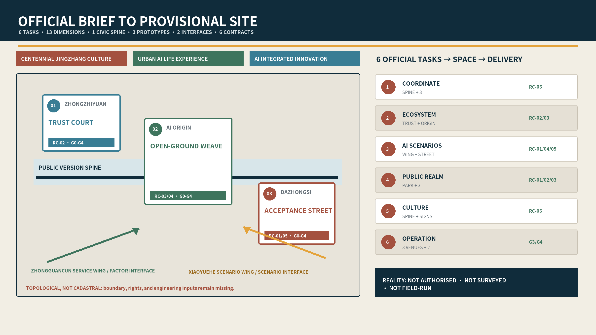

## Official Brief to Site and Professional Handoff

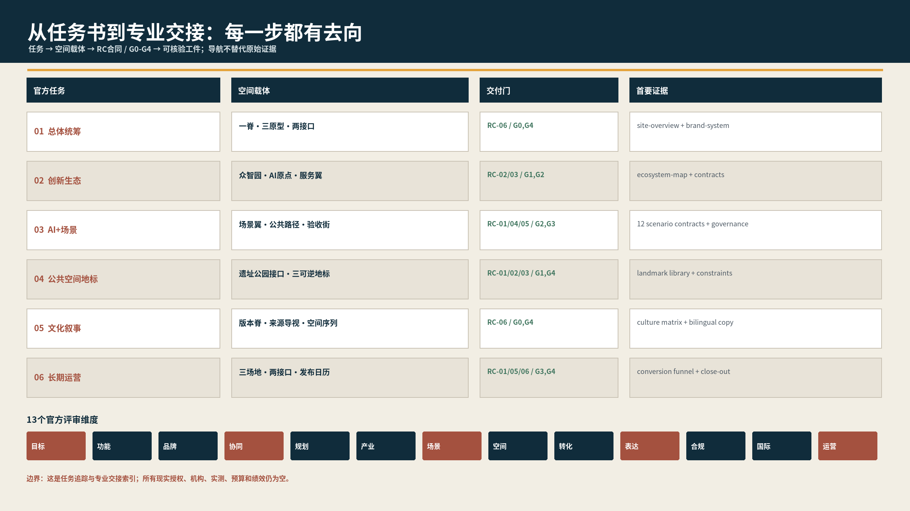

`visual/assets/official_brief_trace.json` is the first-read task trace: each of the six official tasks is connected to a spatial carrier, an RC contract, a G0-G4 gate, and primary evidence. `visual/assets/key_area_handoff.json` turns Zhongzhiyuan, AI Origin, and Dazhongsi into four-step spatial sequences with role types, entry evidence, pause triggers, resume receipts, and missing official inputs. These records are navigation and professional handoff templates only; provisional geometry is not upgraded to an official redline and role types are not named institutions.

The review path is explicit: **brief → spine / three prototypes / two interfaces → RC-01—RC-06 → G0-G4 → receipt and reality boundary**. Every focus area remains not authorised, not surveyed, and not field-run. Any real-world work must add rights, heritage, fire, accessibility, privacy, operating, and budget evidence before a gate can advance.

The professional handoff has two levels. Existing spatial sequences, role types, stop/resume rules, and evidence templates can enter G1/G2 **desktop professional review**. Rights, surveyed boundaries, fire/accessibility/heritage findings, field baselines, real accountable institutions, quantities, quotations, and budgets do not exist, so procurement, construction, and a G3 field pilot remain closed. `visual/assets/render_audit.json` records the final paired render check: four HTML documents passed eight 1440 px/390 px cases, and the paired A3/A0 set totals 48 pages with no blank or cropped page. This is participant-side presentation QA, not independent certification.

## Three-Level Scope Framework

The 43.6 km² coordinated layer handles regional innovation; the approximate 11.4 km² overall layer structures the civic spine and renewal; the 368.4 ha key-area layer tests three urban prototypes. One problem–space–contract–evidence chain links all three [depth:three_level_scope_framework].

The structure is **one public version spine + three urban prototypes + two collaboration interfaces + twelve scenario contracts**. Jing-Zhang Heritage Park is the historic base that can receive accountable updates; Zhongzhiyuan tests safety and hard technology; AI Origin translates open-source outcomes into daily life; Dazhongsi tests public services and international communication [depth:overall_spatial_structure] [data:geometry/land_use.geojson#LU-001].

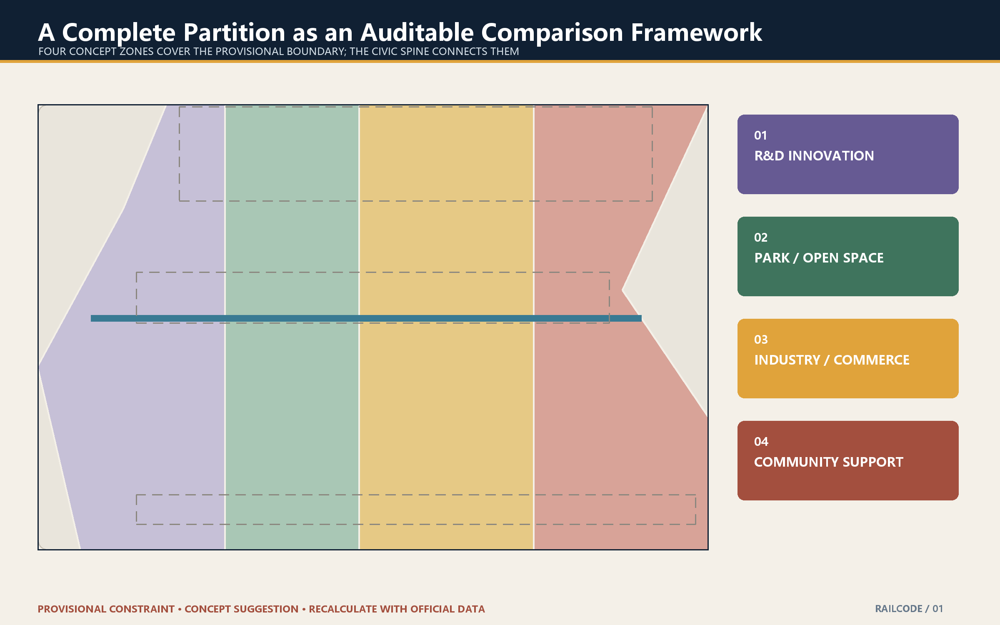

## Coordinated Research Area: Industry and Future City

The submission identity is an original participant-authored system with horizontal, stacked, monochrome, and minimum-size states. A rail carries infrastructure memory, an open bracket permits challenge and patches, and a version node requires responsibility, evidence, and exit. Heritage navy, civic green, brick red, and validation amber form its fixed palette. The wordmark uses Noto Sans SC under the SIL Open Font License 1.1; only rasterised output and the licence text are distributed. This identity is cleared for this repository submission and community display, but is not an official brand, registered trademark, or government endorsement; any third-party formal adoption requires separate brand and trademark review.

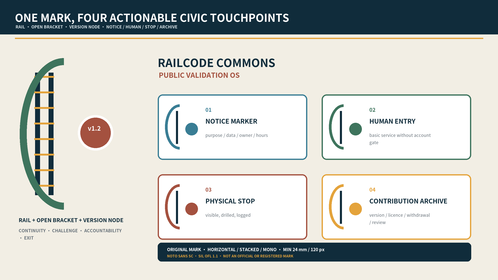

The identity combines rail, an open bracket, and version nodes: infrastructure memory, permission to challenge, and traceable urban trials. The ecosystem loop is **problem intake—capability team—isolated validation—public acceptance—limited scaling**. Each stage names beneficiaries, roles, data permission, evidence, and an exit route. Regional collaboration is expressed as portable contracts, not unsupported institutional commitments [depth:industry_future_city_strategy].

Six international references test transfer limits rather than form a success list: Helsinki Kalasatama foregrounds resident time in living labs; Singapore Punggol Digital District links district, university, and digital infrastructure; Barcelona 22@ warns that innovation districts need mixed daily life and social infrastructure; Toronto Quayside shows why data governance must precede space and procurement; Montréal Mila connects research, talent, and community responsibility; Singapore AI Verify offers a reproducible testing toolchain. Promotional performance figures are not reused, and no governance, land, or funding model is assumed transferable. Full provenance and non-transferable conditions are in `visual/assets/global_case_studies.json`.

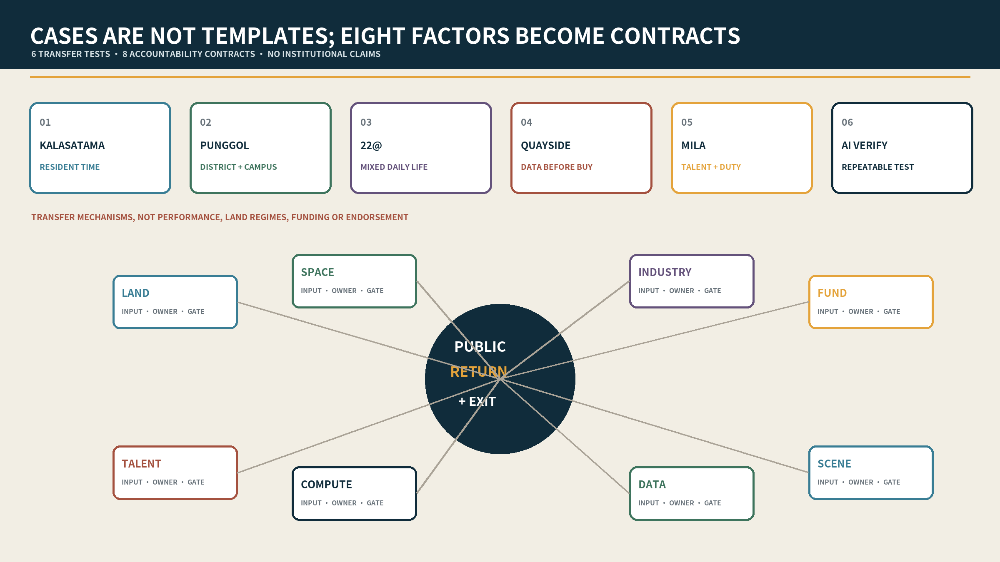

Eight factors become accountability contracts, not an investment list: land, space, industry, funding, talent, compute, data, and scenarios each identify an input, accountable actor type, admission gate, public return, and exit method. Details are in `visual/assets/ecosystem_contracts.json`. The nearby Beiwei community is proposed as a daily-life and accessible co-test interface; Future Science City and Huairou may contribute research questions and methods; the Beijing Economic-Technological Development Area may connect engineering validation; Jing-Jin-Ji cities may reuse cards and audit formats. These are interfaces, not confirmed partnerships.

Five reviewable but unconfirmed collaboration contracts now specify an issue-owner type, input, permission, output, failure handling, and openness level. Beiwei would produce a de-identified daily-life/access barrier list; Future Science City and Huairou would contribute research questions, methods, or evaluation protocols; Beijing E-Town would receive only G2-cleared engineering-validation packages; Jing-Jin-Ji reuse would retain scenario, provenance, stop, and exit records. No interface activates without partner confirmation, permission evidence, and a named role. See `visual/assets/regional_collaboration_contracts.json`.

## Overall Design Area: Renewal and Regulatory-Plan-Level Design

Renewal prioritises retention and adaptation, then public ground floors and reversible components; permanent additions remain last. Three replicable components make the proposal spatial: a 6 m explanation porch, an 18 m co-test court, and a 30 m public ground-floor band. These are relative design prototypes—not road lines, setbacks, or engineering dimensions. Every real building requires heritage, structure/fire, ownership/use, and carbon/economic evidence before any action [standard:MNR-LAND-USE-CLASSIFICATION-GUIDE] [data:geometry/buildings.geojson#BLDG-001] [depth:land_use_layout] [depth:retain_renovate_demolish] [depth:development_intensity_controls] [depth:height_massing_character].

## Detailed Design of Key Areas

The three areas now use distinct spatial gradients, delivery contracts, and stop rules while retaining provisional boundaries [data:geometry/key_areas.geojson#PROV-KEY-001] [depth:three_key_area_detailed_design].

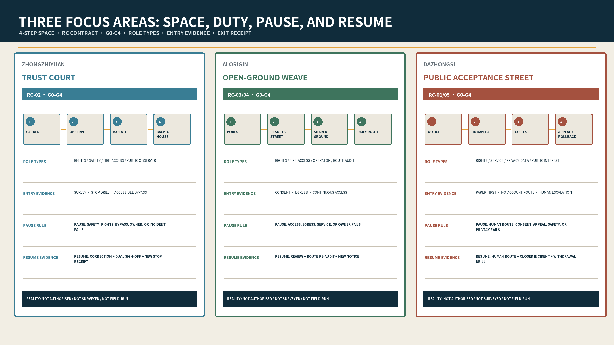

### Zhongzhiyuan — Trust Court

Public river garden—transparent observation gallery—controlled test court—research back-of-house. Visitors never cross equipment logistics; the gallery makes time, responsibility, human stewards, and physical emergency stops visible. Ownership/river/fire review, isolation and stop drills, and limited appointments are sequential gates. A serious incident, over-collection, or failed stop closes the trial.

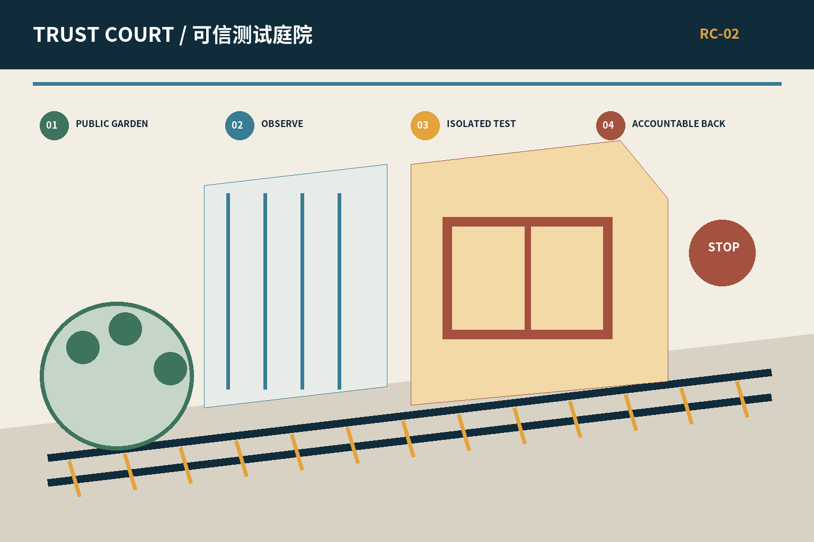

### AI Origin Community — Open-Ground-Floor Weave

Campus/park pores—open-results street—contributors’ living room—near-campus daily-life lanes. Publication, licensing, incubation, childcare, health, and evening collaboration alternate rather than forming an office monoculture. Every result node displays provenance, licence, a human contact, and withdrawal. Fire, ownership, or resident consultation gaps prevent activation.

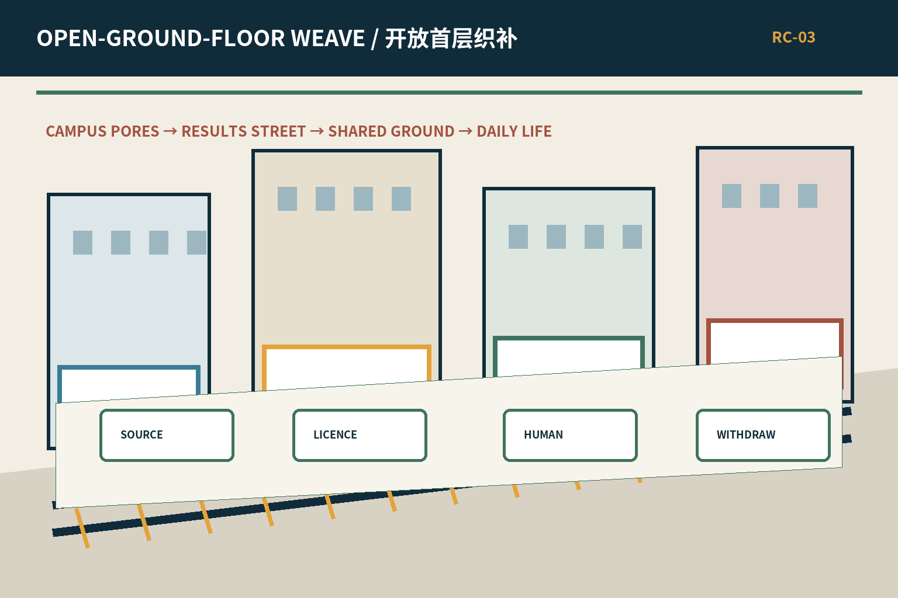

### Dazhongsi — Public Acceptance Street

A relative 100 m sequence—not a surveyed road—moves through notice (0–20 m), parallel human and AI service (20–45 m), inclusive co-testing (45–75 m), and appeal/rollback (75–100 m). A continuous accessible path connects all four; equipment is removable and may not obstruct basic movement [depth:public_service_facilities].

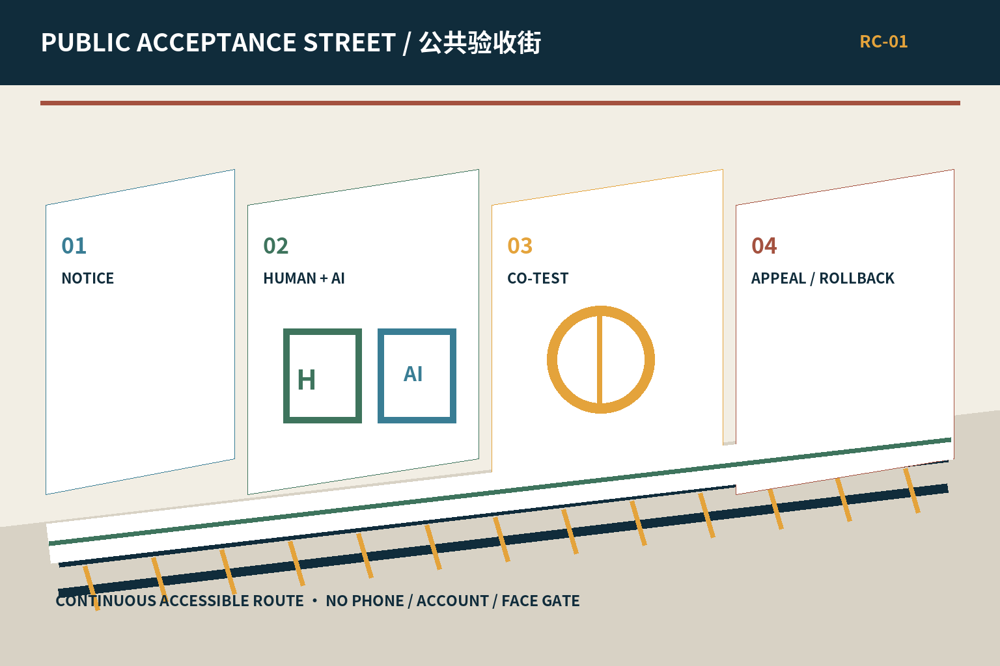

Across all three prototypes, space exposes accountability first: without an app, a visitor should understand purpose, data, responsible human, fallback, and exit within thirty seconds.

## AI Ecosystem, Personas, and AI+ Scenarios

Six personas—open-source researchers, startups, industry engineers, university communities, residents, and older/disabled users—are task-driven hypotheses, not tracked profiles. Twelve contracts cover an open-source hall, model-safety sandbox, edge-device field, low-carbon compute station, walking navigation, accessible co-testing, translation desk, enterprise copilot, data-consent room, multilingual living room, heritage guide, and Global Open Week. Each contract specifies minimum data, accountable human, success gate, and stop condition. High-impact outcomes require 100% human final confirmation; default biometric and continuous personal tracking are zero; basic services retain non-digital paths [standard:GENERATIVE-AI-INTERIM-MEASURES] [standard:BARRIER-FREE-ENVIRONMENT-LAW] [depth:ai_scenario_service_nodes].

### Scenario-by-scenario professional responsibility lock

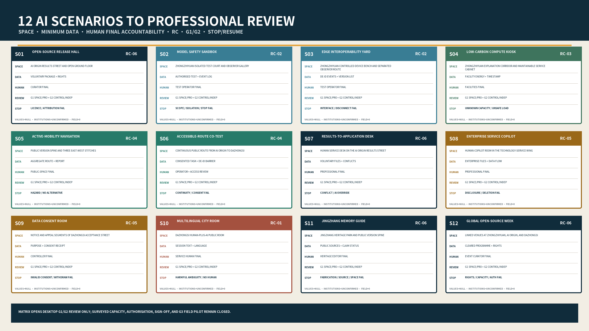

`visual/assets/scenario_professional_review_matrix.json` locks S01-S12 individually to a spatial prototype, minimum data, human final accountability, RC contract, G1 desktop-professional roles, G2 control/independent-review roles, measurable spatial or capacity proxy, conflict/failure case, pause line, and resume evidence. All 12 records are structurally complete, while every surveyed value remains `null`, confirmed institutions remain zero, and field evidence remains zero. “Ready for G1/G2” means only that desktop review and drill design can start from the template; G3 field piloting stays closed until rights, survey, professional findings, accountable institutions, budget, and authorisation exist.

Agent.5 is backed by a cultural-evidence matrix rather than a generic heritage label. Rail infrastructure history, Dazhongsi context, Xueyuan Road science-and-education memory, open-source contribution history, and community everyday memory each connect a narrative theme to a spatial carrier, source, rights basis, and verified/pending/creative state. Only rights-checked public facts enter guidance; creative interpretations stay labelled and may not invent people or events. See `visual/assets/cultural_evidence_matrix.json`.

The pre-field accessibility plan requires at least 12 consented route tasks across at least three access-need groups, including older, mobility, sensory, cognitive/low-digital-literacy, or no-smart-device users, plus two independent professional reviewer types. Participation may not be exchanged for service entitlement; only de-identified barriers, task outcome, and correction evidence are retained, and withdrawal remains available. A continuous-route, alternative-information, keyboard-access, or human-fallback failure pauses the activity. No recruitment or field test is claimed. Package-level human checks are recorded separately in `visual/assets/accessibility_qa.json`.

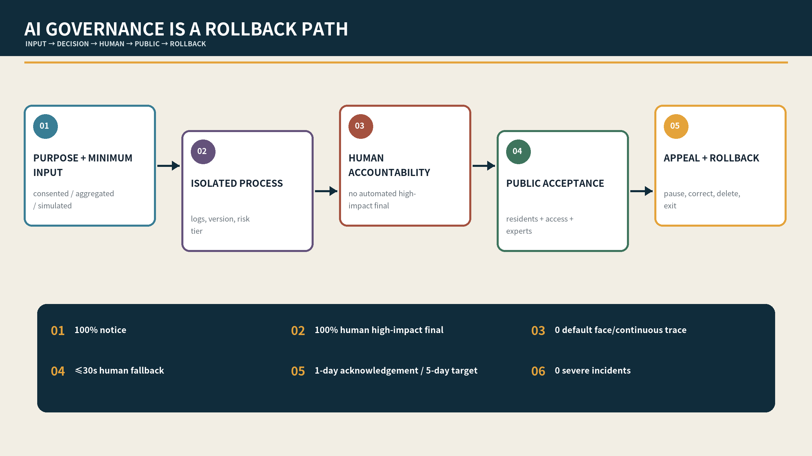

## Land Use, Building Scale, and Action Strategy

The package recalculates an approximate 11.41 km² provisional boundary, 12.34% design green layer, 7.33% design public-space layer, and about 310,800 m² of concept footprints. These are internal GeoJSON consistency measures—not existing or approved controls [metric:site_area_sqm] [metric:green_ratio] [metric:public_space_ratio]. No real building receives a retain, renovate, or demolish decision.

## Mobility, Rail, Utilities, and Public Services

Mobility uses a north–south civic spine, three east–west stitches, and two professional interfaces. Ground-level continuity, safe crossings, cycling, accessibility, and rail interchange precede bridge, tunnel, or underground speculation [data:geometry/roads.geojson#ROAD-001] [depth:traffic_rail_slow_parking]. Plug-in service stacks combine maintainable power, communications, edge compute, sensing, and fallback interfaces; capacity remains unknown pending engineering data [data:geometry/constraints.geojson#CONSTRAINTS] [depth:municipal_new_infrastructure].

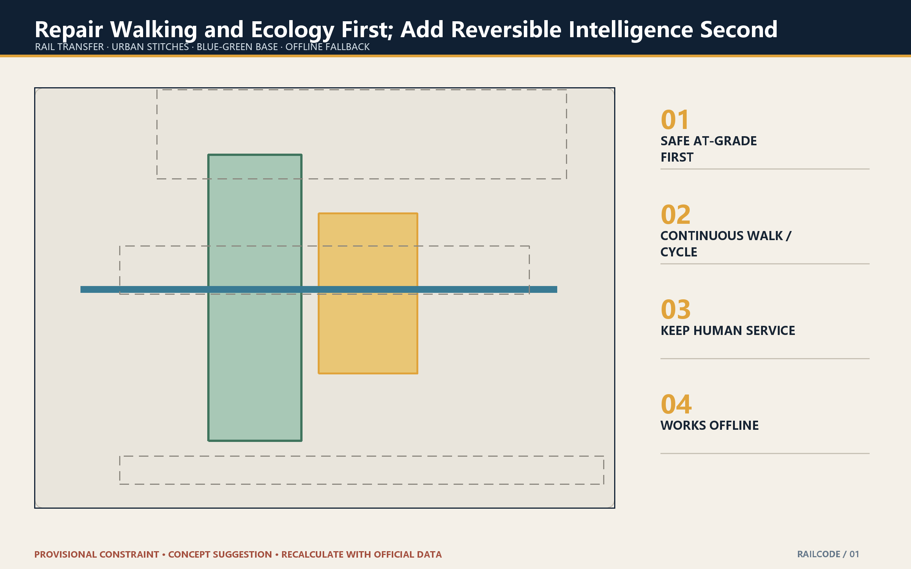

## Blue-Green Space, Public Realm, and Character

The heritage park is the first meeting room. Historic traces and quiet materials form the daily base; tests appear only as reversible amber nodes. Blue-green space supports movement, cooling, rain, rest, and public review, never an exemption from safety or heritage constraints [data:geometry/green_space.geojson#GREEN-001] [depth:blue_green_public_space].

Three pilgrimage landmarks are public learning facilities, not oversized attractions: Zhongzhiyuan's **Trust Observation Ring** exposes safety boundaries, versions, and a physical stop; AI Origin's **Open Version Zero** records provenance, licence, and withdrawal through a tactile rail/open-bracket marker; Dazhongsi's **Public Acceptance Table** places human service, AI demonstration, co-testing, and appeal side by side. All are reversible, keep basic access clear, and have a maintenance owner type and stop rule. See `visual/assets/landmark_component_library.json`.

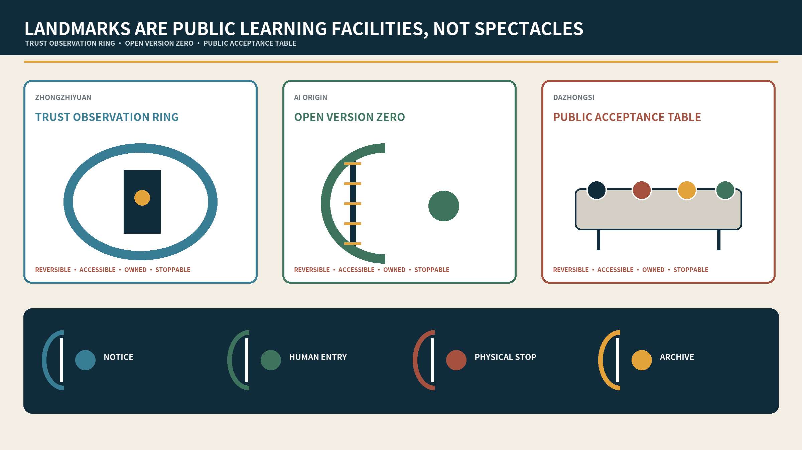

## Project List, Delivery Policy, and Phasing

Five gates govern delivery: G0 data/rights clearance; G1 ownership, heritage, transport, utilities, fire, and accessibility review; G2 sandbox, accountable human, stop, and appeal drills; G3 a 90-day reversible pilot; G4 independent adapt/scale/exit decision [data:geometry/phasing.geojson#PHASE-001] [depth:phasing_implementation]. Six minimum delivery contracts cover the acceptance street, trust court, open-ground-floor weave, accessible co-test line, consent room, and contribution archive. Each has 0–30, 31–60, and 61–90 day outputs, one accountable operator, L1/L2 cost bands, and explicit stop conditions.

Baseline methods, minimum samples, acceptance records, evidence-retention periods, and actor-confirmation status for RC-01—RC-06 are recorded in `visual/assets/delivery_contracts.json`. This version retains preflight evidence, pause authority, resume evidence, and dual sign-off to every contract. An operating role may pause first; resumption requires closure of the failed condition, a retained record, and joint sign-off by the accountable role type and an independent professional reviewer type. Every actor remains a **proposed role type, not a confirmed institution**; the common state is **not authorised and not field-run**. No L1/L2 contract may enter budgeting or procurement discussion before G1 professional checks, a bill of quantities, and separate capital, operating, maintenance, removal, and reinstatement costs.

### Pre-G3 commissioning and no-go plan

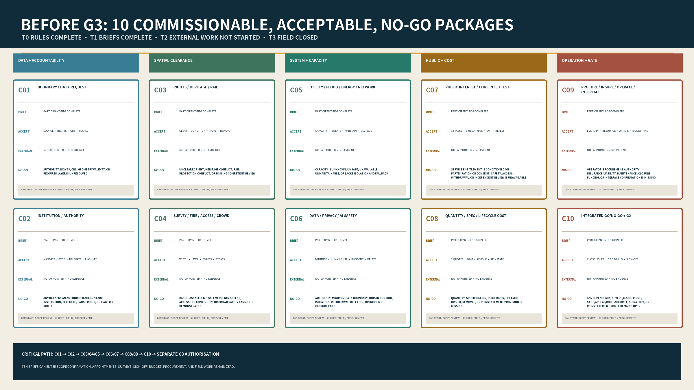

`visual/assets/pre_g3_commissioning_plan.json` converts reality gaps into C01-C10 commissionable packages: official geometry/data request; institutional authority; rights/heritage/rail; survey/fire/access/crowd; utility/flood/energy/network capacity; data/privacy/AI safety; public-interest co-test; quantities/specifications/lifecycle cost; procurement/insurance/operation/five regional interfaces; and integrated go/no-go plus G2 drills. Every package names an accountable role type, professional roles, prepared output, external input, dependency, acceptance definition, and no-go trigger.

The readiness ladder is explicit: T0 rules and synthetic replay are complete; T1 ten participant-authored commissioning briefs are complete and can enter scope confirmation by authorised parties; T2 appointment, survey, findings, quantities, quotations, and sign-off have not started; T3 procurement, construction, live data, recruitment, and G3 field piloting are closed. This proves how a real professional team can take over the next step, not that the missing field evidence already exists.

Each contract also carries an `implementation_preflight` review sheet for site/rights evidence, actor-confirmation method, required professions, authorisation documents, baseline/sample, capital/operating/maintenance/removal-and-reinstatement costs, and closure condition. Every field remains `not_started` or `unconfirmed`; no institution or invented amount is inserted.

`visual/assets/implementation_readiness.json` aligns each G0-G4 decision and record with RC-01—RC-06. All five gates are `not_started`. This is an explicit reality state, not an omitted deliverable: no operation, approval, or achieved-performance claim may be inferred.

The package retains a zero-network, zero-personal-data, zero-field-input RC tabletop package so that the contracts are executable rather than static prose. Each contract has one fully synthetic pass branch and three reject-or-pause branches for an unconfirmed actor, incomplete quantity/cost evidence, or an open incident. `node visual/assets/rc-tabletop/run_tabletop.js` replays 24 cases: 24/24 match expectation, comprising 6 synthetic pass branches, 18 reject-or-pause branches, and 0 field runs. This proves only that participant-authored rules and receipts execute consistently; it is not authorisation, safety, public acceptance, engineering, or budget evidence [metric:tabletop_case_count] [metric:tabletop_rejection_branch_count].

`visual/assets/quantity_cost_method.json` defines measurable objects, units, measurement bases, specifications, quotation evidence, and formulae for capital, annual operations, maintenance, removal, and reinstatement for every RC. Quantities, rates, currency, price date, taxes, and contingency remain null until measured inputs and at least two comparable quotations or an approved rate basis exist. This closes the package-level method gap without inventing a real budget [metric:quantity_cost_template_contract_count].

`visual/assets/review_evidence_map.json` routes each of the seven review dimensions to three primary evidence entries. It is navigation, not a substitute for the referenced JSON, GeoJSON, narrative, or drawings [metric:review_evidence_dimension_count].

Six red-line KPIs are project targets: 100% notice before activation; 100% human final decision for high impact; zero mandatory phone/account/face gates for basic service; ≤30-second human fallback target; appeal acknowledgement in one working day and target response in five; zero severe safety incidents. Any red-line failure pauses the pilot [metric:pilot_duration_days] [metric:redline_kpi_count] [metric:delivery_contract_count].

Cost bands enable comparison rather than claim a quotation: **L0** changes operations or rules without new equipment; **L1** adds signs, furniture, light edge devices, or removable components; **L2** requires limited site, MEP, fire-safety, or specialist integration. Before any L1/L2 contract passes G1, a bill-of-quantities estimate must separate capital, annual operations, maintenance responsibility, removal, and reinstatement. No RMB total is invented without site dimensions, equipment lists, and market quotations.

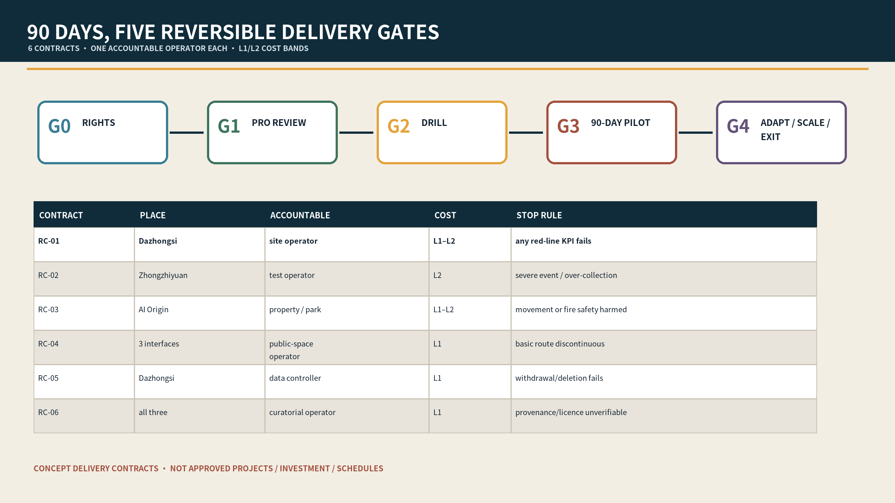

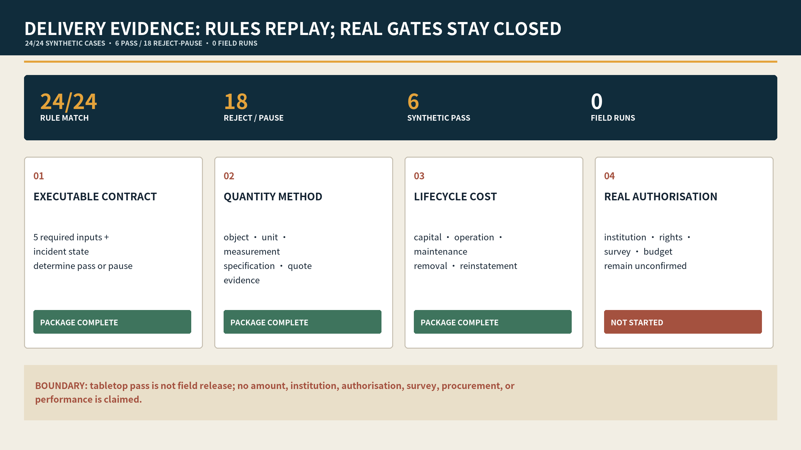

An annual “one repository, two reviews, four seasons” cycle keeps problem and failure records open, separates quarterly public-interest review from annual professional review, and runs contribution, co-testing, international comparison, and archival seasons. A committee never replaces the one named accountable operator or statutory authority [depth:implementation_policy] [depth:renewal_project_list].

Agent.6 uses a five-stage developer conversion funnel: **join—co-create—test—publish—reuse**. Join records capability, conduct, and conflicts; co-create outputs a problem contract; test retains sandbox, stop, and evaluation receipts; publish requires provenance, licence, human review, and withdrawal; reuse preserves version, responsibility, limitations, and failure history. Each stage defines owner type, resources, output evidence, review cadence, and stop rule in `visual/assets/developer_conversion_funnel.json`. No developer membership, event organiser, international recruitment, or conversion performance is claimed.

## Metrics, Recalculation, and Compliance

Spatial metrics derive from projected GeoJSON; non-spatial metrics count located cards, contracts, and gates. The package records 3 key areas, 12 scenarios, 6 personas, 3 industrial test types, 4 contribution nodes, 6 delivery contracts, 5 implementation gates, and 6 red-line KPIs [metric:key_area_count] [metric:scenario_card_count] [metric:persona_count] [metric:implementation_gate_count] [depth:metrics_recalculation]. Complete evidence sits in the compliance, standard, and design-depth matrices [depth:professional_standard_response] [depth:formal_package_completeness].

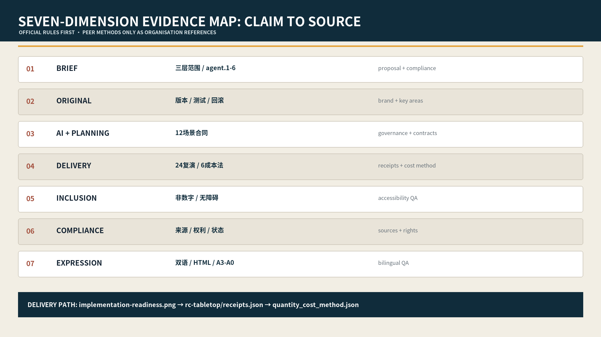

## Risk, Rights, and Compliance

Provisional boundaries must not be mistaken for statutory evidence. AI services retain human fallback, stopping, appeal, correction, and deletion. The cover and three scenes are original Python/Pillow drawings derived from the proposal contracts; no image-generation service, site photograph, resident evidence, or third-party visual asset is used. They are not boundaries, approvals, or engineering proof, and structured evidence prevails. No commercial map screenshot, news photo, private enterprise data, unauthorised trademark, or identifiable real person is used. Nothing in this proposal constitutes government endorsement, investment, feasibility, procurement, or implementation schedule.

The asset-level chain is in `visual/assets/asset_rights_ledger.json`: narratives, diagrams, PDFs, offline pages, cover, and three scenes are participant-authored; the four scene assets are local Python/Pillow drawings; Noto Sans SC is rasterised under SIL OFL 1.1, with the licence text retained and no font file distributed; six cases retain public links and original mechanism summaries only, with no copied page text, image, logo, or promotional performance claim; the local generator is excluded from the submission.

## References

The announcement, cleared Agent taskbook, and repository standards are the formal task basis; provisional boundaries remain review containers [source:OFFICIAL-ANNOUNCEMENT] [source:AGENT-TASKBOOK] [source:KEY-AREA-SOURCE]. Machine evidence comprises GeoJSON, metrics, three matrices, task-specific JSON records, manifest, sources, assumptions, and self-check; human-facing evidence comprises bilingual narratives, ten figure pairs, three synthetic scenes, offline HTML, A3 booklet, and A0 boards.
