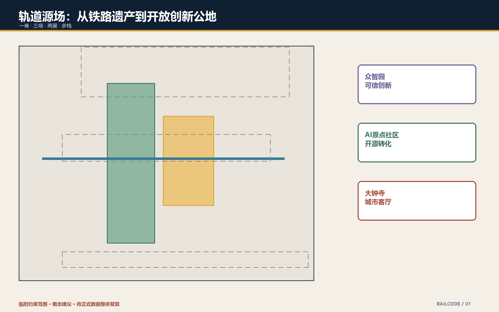
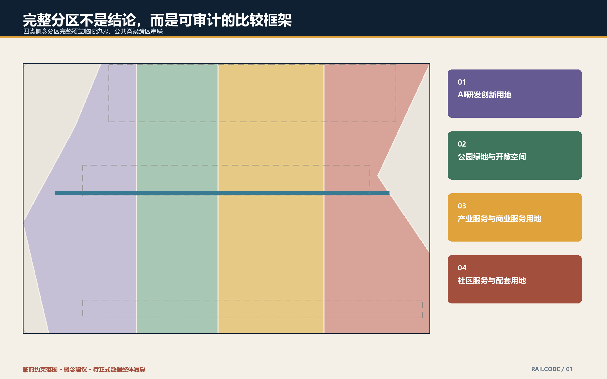
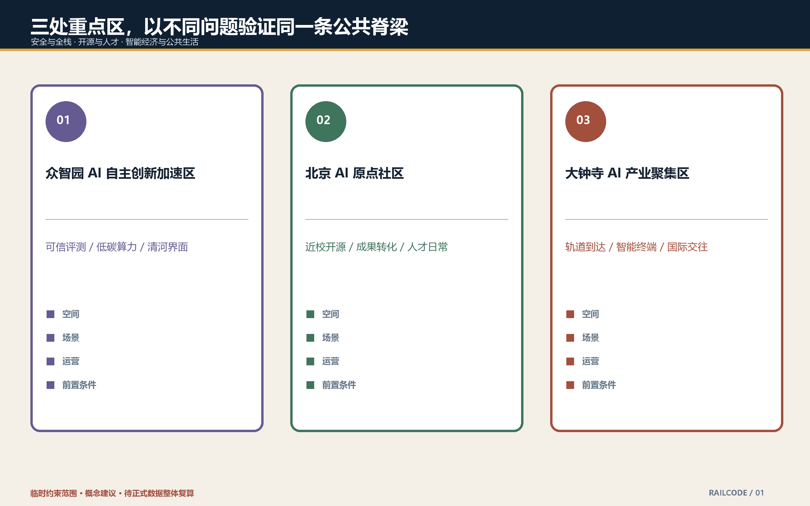
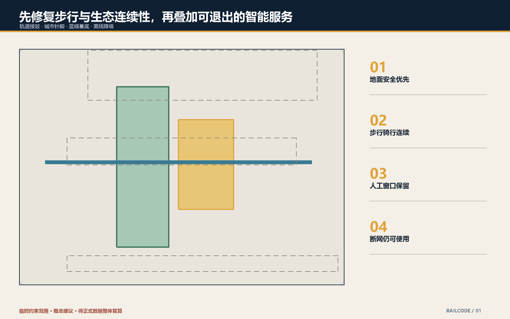
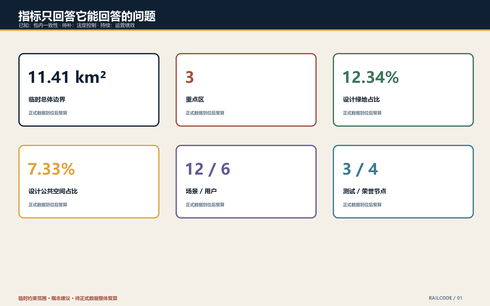

# 轨道源场 RailCode Commons

> 一条遗产公共脊梁，三处验证街区，十二个日常场景。这里的 AI 不被塑造成地标外壳，而被组织成可解释、可退出、有人复核的公共能力。

## 设计依据与资料清单

本方案只使用征集仓库登记的公开或已清权资料。官方公告与智能体任务书给出三层范围、三处重点区和任务边界；当前仓库没有正式 `SITE_BOUNDARY` 与 `KEY_AREA` 多边形，因此提交几何采用维护者提供的临时粗略边界。它只支撑概念生成、拓扑检查和内容评审，不是法定红线、精确测绘或审批依据 [source:OFFICIAL-ANNOUNCEMENT] [source:BOUNDARY-SOURCE] [depth:existing_conditions_diagnosis]。

设计判断分为三类：公告明确的面积和任务作为正式文字依据；临时边界形成可替换的空间容器；用地、道路、公共空间和分期均为智能体提出的参考方案。正式多边形、控规、现状建筑、权属、道路红线、市政、文保和工程资料到位后，应统一重算而不是局部修补 [data:geometry/site_boundary.geojson#SITE-001] [metric:site_area_sqm]。

## 三层范围工作框架

43.6 平方公里统筹研究范围负责产业与区域协同，11.4 平方公里总体设计范围负责城市更新结构，368.4 公顷重点区域负责三处节点深化。三层不是三张互不相干的图，而是一条“战略—空间—验证”证据链：上层定义创新资源如何协作，中层把公共脊梁与城市界面组织起来，下层用场景、运营和人工复核测试空间假设 [standard:PROJECT-OFFICIAL-ANNOUNCEMENT] [depth:three_level_scope_framework]。

总体空间语法是“一脊、三场、两翼、多栈”：京张遗址公园作为公共脊梁；众智园、AI 原点社区、大钟寺作为三处验证场；中关村科技服务翼与小月河场景赋能翼形成知识和生活接口；沿线分布可迁移的服务栈。其用途是帮助专业团队比较方案，不新增规划红线 [data:geometry/land_use.geojson#LU-001] [depth:overall_spatial_structure]。

## 统筹研究范围产业与未来城市研究

“RailCode”把铁路的线性基础设施记忆与开源代码的协作方法并置；“Commons”强调公共利益、共享规则和持续维护。视觉识别建议以两条平行轨线与一个开放括号构成非封闭标记，主色使用轨道深蓝、砖红、植被绿和安全琥珀；字体与最终 Logo 须由后续团队完成授权核验 [source:AGENT-TASKBOOK] [standard:PROJECT-AGENT-OPEN-CALL-TASKBOOK]。

六个国际案例不做排名或照搬：Toronto MaRS 提供城市型创新集群启发，Boston Kendall Square 提供校企步行网络启发，Paris Station F 提供大尺度共享孵化启发，Barcelona 22@ 提供生产片区更新启发，Helsinki Jätkäsaari Mobility Lab 提供真实街区测试启发，Seoul Digital Media City 提供内容产业与公共界面启发。所有案例只作为公开背景比较，落地前须复核最新运营状态、许可与可转移性 [source:SOURCE-REGISTRY] [depth:industry_future_city_strategy]。

生态机制不是“企业名单”，而是六步循环：高校/院所策源—开源协作—安全评测—企业转化—城市试用—公共反馈。空间分别承载低门槛协作桌、可预约沙盒、成果发布、企业服务、真实但最小化数据的试点和公众申诉入口；资金、招商和政策均不作既定承诺 [data:geometry/public_space.geojson#PUBLIC-001] [depth:overall_spatial_structure]。

## 总体设计范围城市更新与控规深度城市设计

本稿用完整分区覆盖临时总体边界，避免把“概念走廊”当作剩余用地。四类概念分区分别承载研发创新、公园开敞、产业商业和生活配套；铁路公共脊梁贯穿而不改变其法定用地属性。建筑基底仅作为形态测试样本，不代表现状盘点或具体拆改留结论 [data:geometry/land_use.geojson#LU-001] [standard:MOHURD-CONTROL-DETAILED-PLANNING] [depth:land_use_layout]。

更新方法采用“先审价值、再判动作”：具有历史、使用、结构或碳价值的对象优先保留；可通过首层开放、节能和无障碍改善的对象优先微改造；只有在正式调查、权属协商和专业鉴定后才讨论拆除或新建。容积率、建筑高度、建筑密度、退线和道路红线全部待正式条件补齐 [data:geometry/buildings.geojson#BLDG-001] [depth:retain_renovate_demolish]。

## 重点区域详细设计

三处重点区域均沿用仓库临时粗略多边形，并以“空间动作—场景—运营—前置条件”四栏深化，不能作为审批图使用 [data:geometry/key_areas.geojson#PROV-KEY-001] [depth:three_key_area_detailed_design]。

| 重点区 | 参考定位 | 空间动作 | 首批验证 |
| --- | --- | --- | --- |
| 众智园 AI 自主创新加速区 | 全栈可信创新花园 | 形成清河生态界面、可预约测试庭院、标准治理廊和低扰动服务环 | 模型安全红队、端侧设备互操作、低碳算力调度 |
| 北京 AI 原点社区 | 近校开源转化社区 | 以首层开放、慢行缝合、共享发布厅和人才生活驿站连接校区与城市 | 开源贡献护照、成果转化助手、无障碍路线共测 |
| 大钟寺 AI 产业聚集区 | 智能经济城市客厅 | 以轨道到达、四象限步行接口、内容工坊和夜间公共客厅改善城市界面 | 智能终端体验、合规数据沙盒、多语种路演服务 |

三处设计都采用可逆设施和阶段性使用协议优先；桥隧、地下连通、河道工程、轨道一体化和企业物业改造必须等待主管部门与专业团队确认 [data:geometry/key_areas.geojson#PROV-KEY-003] [depth:phasing_implementation]。

## AI 创新生态、人才画像与 AI+ 场景

六类用户是：开源开发者、初创团队、高校师生、企业与国际访客、周边居民、银龄及行动不便者。每类都同时写入“目标”和“拒绝项”：开发者需要协作但不被持续追踪；居民需要便利但不接受商业画像；无障碍用户需要可用路线且保留非数字替代 [standard:BARRIER-FREE-ENVIRONMENT-LAW] [depth:public_service_facilities]。

十二张场景卡为：开源发布厅、安全治理沙盒、端侧互操作场、低碳算力驿站、AI 慢行导航、无障碍共测路线、近校成果转化台、企业服务共驾、数据授权会客厅、多语种城市客厅、京张记忆导览、全球 AI 开源周。每张卡都要求告知、最小化数据、人工复核、退出渠道和日志留存期限 [data:geometry/public_space.geojson#PUBLIC-001] [standard:GENERATIVE-AI-INTERIM-MEASURES] [depth:ai_scenario_service_nodes]。

三个产业测试场景分别验证：模型安全与红队流程、端侧设备互操作与无障碍、合规数据授权与撤回。测试状态不得被宣传为批准运营；涉及人员、设备和城市设施时设置现场负责人、停止按钮、异常记录和公众反馈窗口 [data:geometry/constraints.geojson#CONSTRAINTS] [depth:risk_missing_data]。

## 用地、建筑规模与拆改留方案

用地以统一切分线形成无缝分区，面积由 EPSG:4548 重算。由于边界临时粗略，约 1141.28 公顷仅用于几何一致性检查；已知绿地、公共空间和建筑基底比例是设计层内部量，不代表正式现状或控规指标 [metric:green_ratio] [standard:MNR-LAND-USE-CLASSIFICATION-GUIDE] [depth:metrics_recalculation]。

建筑更新设置四级证据门：历史与文保核验、结构安全核验、实际使用与权属核验、碳与经济比较。当前只展示“可适应性再利用”的形态原型；任何具体建筑的保留、改造、拆除和新建都待现场调查与法定程序 [data:geometry/buildings.geojson#BLDG-001] [depth:development_intensity_controls]。

## 交通、轨道、市政与公共服务设施

交通策略以步行、骑行和轨道接驳的连续体验为先：公共脊梁为南北主线，三条横向“城市针脚”连接社区、校园与产业界面，重点节点采用地面安全优化优先。上跨、下穿和轨道工程只列为待比选课题，不作可行性结论 [data:geometry/roads.geojson#ROAD-001] [depth:traffic_rail_slow_parking]。

市政与新基建采用“小栈可替换”原则：电力、通信、端侧算力、传感和维护接口共用可检修机柜；每项 AI 服务保留人工窗口、纸质/静态导视和断网降级路径。能源负荷、排水、防洪、消防、管线容量与服务半径待专项复核 [data:geometry/constraints.geojson#CONSTRAINTS] [depth:municipal_new_infrastructure]。

## 蓝绿空间、公共空间与城市风貌

京张遗址公园是文化与生态主角，不是科技装饰背景。设计建议用保留轨迹、砖石、耐候钢和季节性种植构成低饱和基底，以琥珀色小尺度信息点提示场景；不设置压倒遗产尺度的巨型屏幕和霓虹塔 [data:geometry/green_space.geojson#GREEN-001] [standard:MOHURD-URBAN-DESIGN-MEASURES] [depth:blue_green_public_space]。

四个“朝圣/荣誉”节点是开放贡献档案馆、京张零公里算法刻度、AI 公益修复台和年度开源贡献长桌。它们展示可验证贡献与失败复盘，不塑造个人崇拜；姓名、商标、论文图像和肖像只有在获得许可后展示 [source:AGENT-TASKBOOK] [depth:height_massing_character]。

文化叙事从“机器替人”转向“基础设施扩展人的协作”：京张铁路连接城市，中关村文化连接知识，开源 AI 连接可复用公共能力。导视同时提供中英文本、触觉/高对比信息和非手机路径。

## 更新项目清单、实施政策与分期计划

近期 0—2 年建议先做不依赖法定调整的共测：临时导视、无障碍走查、开放数据目录、场景伦理评审和活动原型；中期 3—5 年在条件明确后推进首层开放、公共空间针脚和存量建筑适应性改造；远期根据正式规划、绩效和公众反馈决定永久设施 [data:geometry/phasing.geojson#PHASE-001] [depth:renewal_project_list] [depth:phasing_implementation]。

长效运营采用“一会、一库、一周、四季”：季度公共利益委员会审查场景；持续维护开源问题库；年度全球 AI 开源周串联三处片区；四季分别进行安全红队、无障碍共测、低碳算力和文化档案活动。活动均为建议，不代表政府排期、财政承诺或招商结果 [source:AGENT-TASKBOOK] [depth:implementation_policy]。

## 指标体系、面积复算与合规矩阵

已知指标只用于包内一致性：临时总体边界面积约 11,412,825 平方米、3 处重点区、绿地设计占比约 12.34%、公共空间设计占比约 7.33%；场景卡 12 张、用户画像 6 类、产业测试 3 个、荣誉节点 4 个。正式边界到位后，所有面积和比例必须整体复算 [metric:site_area_sqm] [metric:key_area_count] [depth:metrics_recalculation]。

任务覆盖矩阵逐项对应公告 1.3—1.5 与 agent.1—agent.6；专业标准矩阵和设计深度矩阵保存完整索引。正文只在判断旁保留少量锚点，避免用编号堆砌替代设计解释 [standard:MOHURD-ARCH-DESIGN-DEPTH-2016] [depth:professional_standard_response]。

## 风险、版权与合规说明

最大风险是临时边界被误读为正式成果。所有图、PDF 和离线页面均标注“临时约束范围/概念建议”；生成式图片通道不可用，因此本版封面与图件均由本地脚本从结构化数据绘制，没有把合成效果图当作现场证据 [source:BOUNDARY-SOURCE] [depth:risk_missing_data]。

待补资料包括正式边界、现状建筑和地块、控规、权属、道路红线、市政、消防、防洪、文保、客流与运营数据。个人数据、企业内部数据、未授权商标、肖像、字体和媒体不得进入提交包。所有空间建议不替代正式规划，不构成政府审定、投资承诺、工程可行性或拆改留结论 [data:geometry/constraints.geojson#CONSTRAINTS] [standard:BARRIER-FREE-ENVIRONMENT-LAW]。

## 参考资料

本方案的依据采用“来源决定可说什么、几何决定可落在哪里、指标决定可复算到什么程度”的分层方法。征集官方公告提供三层范围、任务与成果要求，面向智能体开源征集任务书提供品牌、案例、场景、用户、地标、文化和运营任务 [source:OFFICIAL-ANNOUNCEMENT] [source:AGENT-TASKBOOK]。场地包、公开来源登记和专业标准本地快照共同约束资料用途，背景或临时资料不会被升级成法定控制或政府承诺 [source:SITE-PACKAGE] [standard:PROJECT-OFFICIAL-ANNOUNCEMENT]。

空间含义以提交包 GeoJSON 为准，面积和比例以 `metrics.json` 的公式为准，缺失条件以 `assumptions.json` 为准。正式边界、建筑、地块、控规、道路、市政、文保和工程资料仍待补齐；它们到位时须重建空间分区并整体复算，而不能只替换一张图。完整来源、指标、任务覆盖、专业标准与设计深度保存在机器审计层，本报告、五张图、A3/A0 与离线页面负责解释设计判断及其限制 [depth:formal_package_completeness]。
