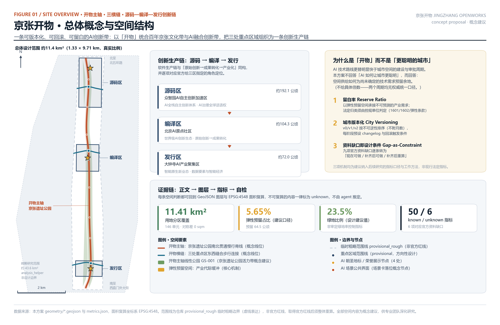
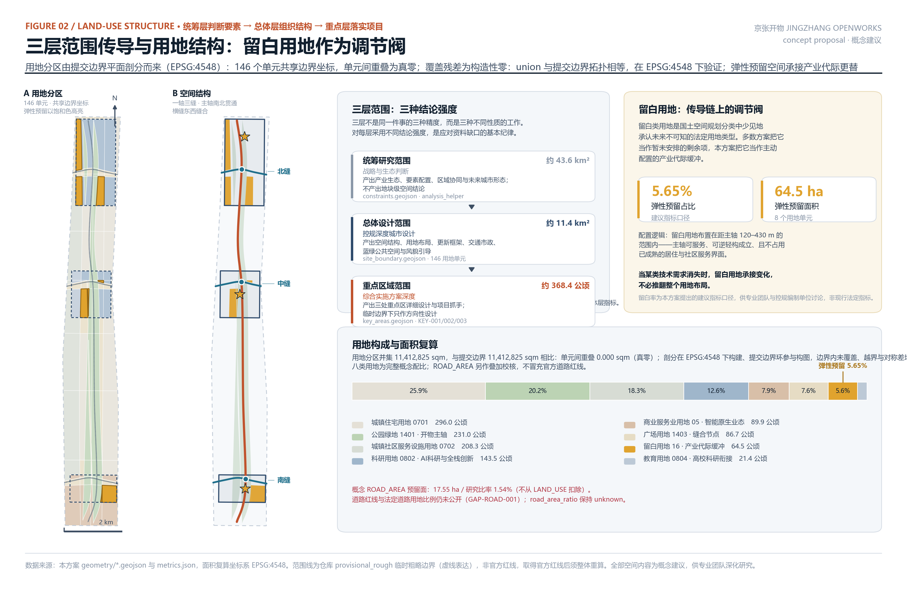
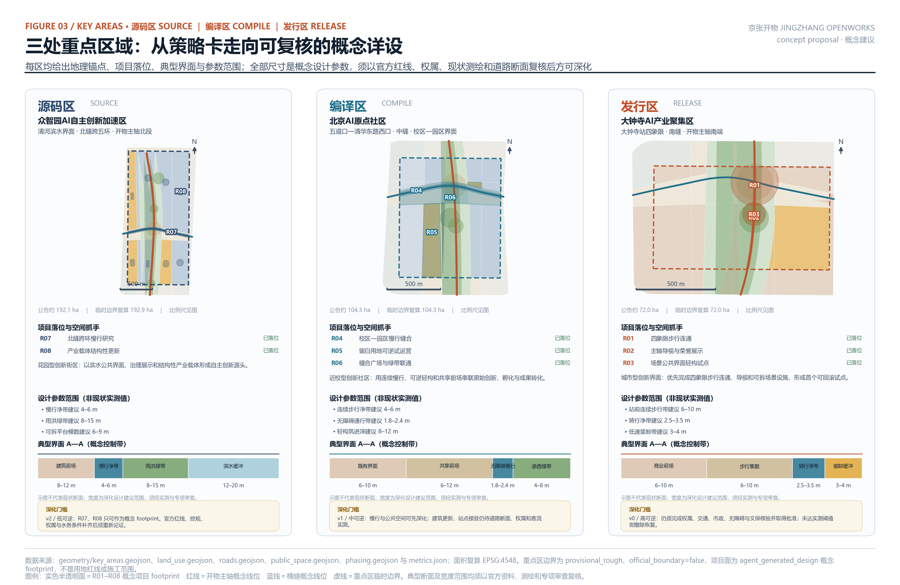
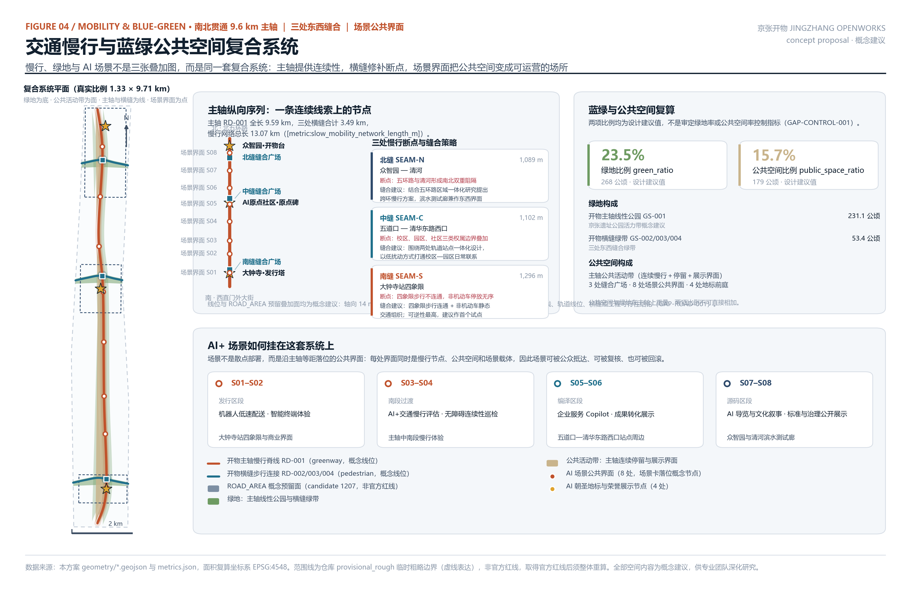
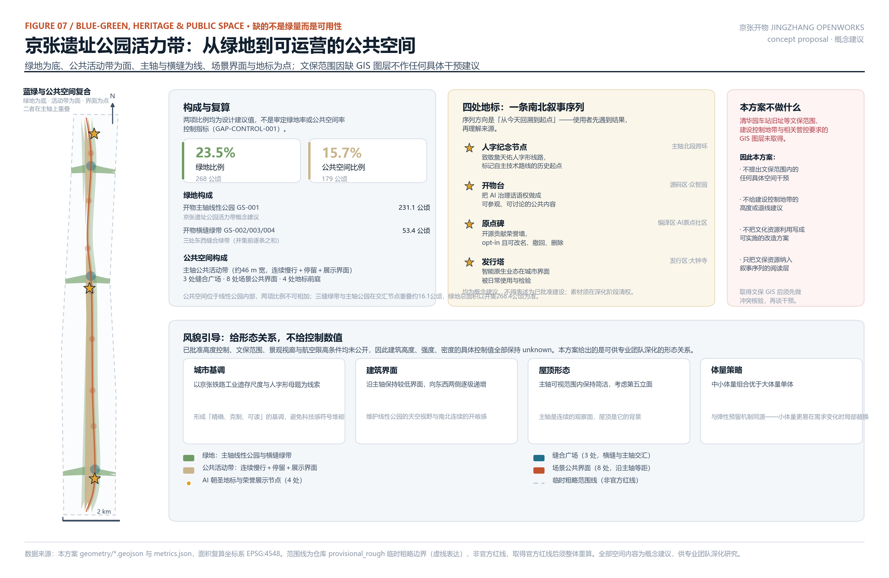
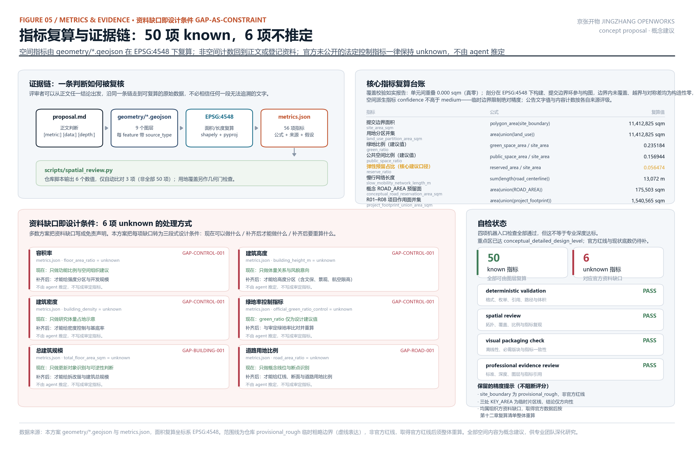
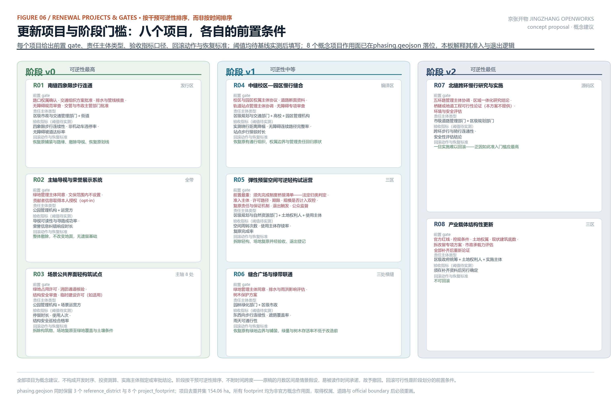

JINGZHANG OPENWORKS — A Versionable, Rollbackable, Reserve-Ready AI Innovation Belt
本方案是面向智能体开源征集的开放共创建议，不替代正式规划，不构成政府审定结论。文中全部空间落地内容均为概念建议、参考方案或可供专业团队深化研究的材料。当前使用仓库提供的 `provisional_rough` 临时粗略边界，非官方红线；取得官方红线后需按第十二章给出的复算清单整体重算。

## 摘要

海淀要在京张铁路遗址公园两侧建设一条世界级AI创新带。这件事最难的部分不是技术想象力，而是一个速率差：人工智能的技术路线更替明显快于城市空间的建设与审批周期。一条按2026年的AI产业形态精确设计的城市带，在建成时可能正好迎上下一代技术对空间需求的整体改写——算力从集中走向端侧，办公从工位走向人机协作，测试从实验室走向街道。

这个判断本方案按定性方式表述，不给具体倍数。原因是：技术代际的长度与规划周期的长度都没有权威统一口径，把两个区间相除得到一个"倍数"会制造虚假精确 [source:DATA-SRC-AGENT-TASKBOOK-20260518]。同时必须说明，北京现行控规管理机制并非静态——《北京市控制性详细规划实施管理办法》已确立按需深化、动态运行、街区控规与规划综合实施方案分层衔接的机制 [source:DATA-SRC-BJ-CONTROL-PLAN-IMPLEMENTATION]。本方案要处理的不是"制度僵化"，而是在既有的动态机制之下，空间供给如何为尚未确定的技术需求预留余地；本方案的机制建议应当嵌入现行动态运行机制，而不是另起一套体系 [standard:MOHURD-CONTROL-DETAILED-PLANNING]。

多数方案把AI当作要被安置进城市的内容。本方案把AI产业的变化速率当作要被城市形态吸收的荷载。

由此提出总体概念「开物」。取《天工开物》之意：开物成务，把自然之物开发为可用之物。京张铁路是中国人自主"开物"的起点——詹天佑的人字形铁路证明了自主技术路线可行；人工智能是当代的开物。这个概念让「百年京张文化带」与「AI融合创新带」在同一个词上成立，而不是把文化当作科技的装饰 [source:DATA-SRC-AGENT-TASKBOOK-20260518]。"开物"同时直指开源（open）与造物（works），与本次面向全球智能体的开源征集机制同源。

方案提出三项可被专业团队直接深化的机制：

- 留白率（Reserve Ratio）：把留白用地从"暂未安排"的剩余项，转为主动配置的产业代际缓冲。本方案在总体设计范围内配置弹性预留空间 [metric:land_use_area_reserved_land_sqm]，占比 [metric:reserve_ratio]，并建议将该指标口径纳入后续控规研究讨论 [standard:MNR-LAND-USE-CLASSIFICATION-GUIDE]。这项机制的法定接口需要审慎处理，第七章专门讨论北京市 1601 战略留白与 1602 动态留白的适用条件——本方案不自行认定法定归类。
- 城市版本化（City Versioning）：把城市更新分期按不可逆性而非时间排序：可逆性最高的干预先做，高不可逆的干预必须等官方资料补齐后才允许进入下一阶段，并为每个阶段预设回滚触发条件 [data:geometry/phasing.geojson#PH-001] [metric:phase_count]。
- 资料缺口即设计条件（Gap-as-Constraint）：组织方尚未发布官方红线与控规条件。本方案不把这写成免责声明，而是逐条转为"当前可做什么／补齐后才能做什么／补齐后要重算什么"的设计条件 [source:DATA-SRC-PROVISIONAL-BOUNDARIES-20260605]。

空间上，京张遗址公园成为南北贯通的开物主轴，三条开物横缝在三处重点区域跨轴缝合东西 [data:geometry/roads.geojson#RD-001]。三区按创新链环节分工：众智园承担全栈自主创新与治理话语权、AI原点社区承担原始创新到成果转化、大钟寺承担智能原生新业态；中关村科技服务翼供给要素与资本、小月河场景赋能翼承担场景验证 [data:geometry/key_areas.geojson#KEY-001]。这一分工与官方给三区指定的角色定位逐项对应，也与创新从原始研究到产业化的真实路径同构。

关于本方案与站内先例的关系（原创性声明）
用软件生产链（源码／编译／发行）比喻创新链，在本次征集中并非本方案首创。经核实，PR #1366《京张编译带 COMPILE JINGZHANG》于 2026-08-10T07:56:31Z 提交，早于本方案 162 分钟，已完整提出"铁路即源代码"、编译／测试／评审／发布／回滚流程、以及三区分别命名为测试坞／评审庭／发布台。本方案早期稿曾以"源码—编译—发行"作为主要叙事，现予调整并明确说明：
- 相同之处：均以软件生产链隐喻组织创新链，均在三区映射链条环节，均使用"回滚"概念，均设贡献者荣誉展示。
- 实质差异：#1366 的"回滚"作用于 AI 场景运营（沙盒申请→评审→测试→上线→回滚，对象是应用）；本方案的"回滚"作用于 空间更新决策（按干预不可逆性排序分期，对象是城市建设动作），并配以留白用地这一法定用地工具。#1366 全文未涉及留白用地、不可逆性排序或产业代际缓冲。
- 本方案的立足点：不在隐喻，而在留白用地的制度化配置与按不可逆性组织更新分期这两项可被控规编制单位直接讨论的机制。软件术语在本方案中降为辅助说明，不再扩展。
本方案不使用"第一""唯一""独有"一类无法证实的表述。

## 设计依据与资料清单

本方案的第一依据是北京市规划和自然资源委员会海淀分局2026年5月9日发布的《百年京张AI创新带城市设计国际方案征集资格预审公告》[source:DATA-SRC-OFFICIAL-ANNOUNCEMENT-20260509] [standard:PROJECT-OFFICIAL-ANNOUNCEMENT]。公告确定了三层范围（统筹研究范围约43.6平方公里、总体设计范围约11.4平方公里、重点区域范围约368.4公顷）、三处重点区域、1.3节征集目的、1.4节项目规模、1.5节设计任务，以及"控制性详细规划的城市设计深度"和"规划综合实施方案的城市设计深度"两项深度要求。

第二依据是《面向全球智能体开展百年京张AI创新带城市设计开源征集任务书摘录》[source:DATA-SRC-AGENT-TASKBOOK-20260518] [standard:PROJECT-AGENT-OPEN-CALL-TASKBOOK]，它补充了十条智能体共创原则、三大定位、五大功能、三区两翼、六项智能体必答任务（agent.1–agent.6）、十三项统一评审维度和统一边界条款。

专业标准依据取自仓库本地参考快照，而非仅引用外部链接：《城市设计管理办法》[source:DATA-SRC-MOHURD-URBAN-DESIGN-MEASURES] [standard:MOHURD-URBAN-DESIGN-MEASURES]、《城市、镇控制性详细规划编制审批办法》[source:DATA-SRC-MOHURD-CONTROL-DETAILED-PLANNING] [standard:MOHURD-CONTROL-DETAILED-PLANNING]、《国土空间调查、规划、用途管制用地用海分类指南》[source:DATA-SRC-MNR-LAND-USE-CLASSIFICATION-202311]。《建筑工程设计文件编制深度规定（2016年版）》在仓库中登记为 `needs_official_file` / `missing_source_url`，本方案据此不把它写成已满足的权威依据，只作为建筑专业深度的待补参照项 [source:DATA-SRC-MOHURD-ARCH-DESIGN-DEPTH-PENDING] [standard:MOHURD-ARCH-DESIGN-DEPTH-2016]。

北京市地方依据须单独登记，不能用国家标准的引用来充当。本方案第七章关于留白用地的全部精确条文引自《北京市国土空间调查、规划、用途管制用地分类指南（试行）》[source:DATA-SRC-BJ-LAND-USE-CLASSIFICATION-GUIDE]；关于"按需深化、动态运行"的机制表述引自《北京市控制性详细规划实施管理办法》[source:DATA-SRC-BJ-CONTROL-PLAN-IMPLEMENTATION]。此前稿曾用国家层面的《城市、镇控制性详细规划编制审批办法》与自然资源部分类指南支撑这两处北京市地方结论,属引用错配,现已改正。

站内先例同样登记为来源：PR #1366《京张编译带》[source:DATA-SRC-SITE-PRECEDENT-PR1366] 早于本方案 162 分钟提出同构的软件生产链隐喻，本方案据此撤回任何优先性断言（详见下文原创性声明）。

全球案例不再使用无 URL 的“常识性汇总条目”。七个案例分别登记官方背景来源，来源只支撑案例基本事实；可转化经验与迁移限制均明确写作本方案的设计推论，不借来源之名制造因果结论。逐案引用见第三章。

空间依据方面必须明确说明其性质。仓库尚未取得官方精确红线，`brief/site-package/geometry/provisional_boundaries.geojson` 提供的三层范围与三处重点区 polygon 是 `provisional_rough` 临时粗略边界。本方案全部空间生成、面积复算、图面表达和自检均基于该临时边界，并在 `sources.json`、`assumptions.json`、`self_check.json`、`visual/index.html` 和全部图纸中同步标注。它不是官方红线，不能作为审批依据、精确面积依据或正式专业评分依据 [depth:existing_conditions_diagnosis]。

资料可用性分两层管理：对 `data/source_registry.json` 已登记的公告、任务书、部委标准和临时边界，严格沿用其可用性分级；北京地方政策、站内先例与七个案例作为 `sources.json` 的 submission-level supplemental sources 单独登记。参赛者 PR 不能修改仓库级 registry，因此这些补充来源标记为 `pending maintainer registration`，不冒称已经回写公共 registry；案例均为 `background_only`，不支撑本项目数值或法定结论。

坐标与面积口径依 `design_brief.json`：GeoJSON 交换坐标系 EPSG:4326（经度、纬度顺序），面积复算坐标系 EPSG:4548（CGCS2000 / 3度带高斯-克吕格，中央经线117°E）。全部 `status=known` 指标均由本方案生成链重跑产生；空间指标先投影到 EPSG:4548 再做布尔运算，非空间计数则回到正文或登记资料。仓库 `scripts/spatial_review.py` 输出 6 个数值，但只把其中 3 项与 `metrics.json` 自动比较；用地覆盖另作几何门检查。逐项状态见 `self_check.json` 的 METRIC_RECOMPUTATION 检查项（metrics.json 顶层只保留 schema 允许的键），不混称为“6 项独立交叉验证”或“全部已由仓库脚本复现”。

## 三层范围工作框架

公告给出的三层范围不是同一件事的三种精度，而是三种不同性质的工作。本方案对三层分别采用不同的结论强度，这是应对资料缺口的基本纪律 [depth:three_level_scope_framework]。

统筹研究范围（约43.6平方公里） 承担战略与生态判断 [metric:coordinated_research_area_sqm]。这一层的产出是产业生态体系、要素配置机制、区域协同关系和未来城市形态判断，不产出地块级空间结论。该范围的临时边界在本方案中作为 `analysis_helper` 记录于 `constraints.geojson`，而不放入 `site_boundary.geojson` [data:geometry/constraints.geojson#CN-010]。这个处理有一个技术理由：面积复算与用地覆盖校验以总体设计范围为分母，若把43.6平方公里并入边界图层，覆盖率与各项比例指标将全部失去意义。

总体设计范围（约11.4平方公里） 承担控规深度的城市设计 [metric:site_area_sqm] [data:geometry/site_boundary.geojson#SITE-001]。这一层产出空间结构、用地布局、更新框架、交通与市政体系、蓝绿公共空间和风貌引导。本方案的用地分区在这一层完成平面剖分，相邻单元共享边界坐标、单元间无重叠；覆盖精度的真实数值与容差见第十二章 [data:geometry/land_use.geojson#LU-001] [depth:land_use_layout]。这一范围的实际形状是一条1.33公里宽、9.71公里长的窄带（长宽比约1:7.3），这个几何特征直接决定了空间策略：任何"中心放射"式结构在这里都不成立，只有"一轴多缝"的线性组织能同时解决南北贯通与东西缝合。

重点区域范围（约368.4公顷） 承担规划综合实施方案深度的详细设计 [metric:key_area_count]。三处重点区域分别为众智园AI自主创新加速区（公告约192.1公顷，临时边界复算 [metric:key_area_zhongzhiyuan_ai_acceleration_area_sqm]）、北京AI原点社区（公告约104.3公顷，[metric:key_area_beijing_ai_origin_community_sqm]）、大钟寺AI产业聚集区（公告约72.0公顷，[metric:key_area_dazhongsi_ai_industry_cluster_sqm]）[data:geometry/key_areas.geojson#KEY-002]。复算值与公告值的差异来自临时边界精度，取得官方 KEY_AREA polygon 后必须整体重算。

三层之间的传导关系是本方案的结构性要求：统筹层的要素判断必须能在总体层找到空间承载，总体层的空间结构必须能在重点层找到项目抓手，重点层的项目必须能反向修正总体层指标。留白率机制正是这条传导链的调节阀——当技术代际更替使某类空间需求消失时，留白用地承接变化，而不必推翻整个用地布局。

## 统筹研究范围产业与未来城市研究

### 命名与视觉识别方向（agent.1）

中文名：京张开物。英文名：JINGZHANG OPENWORKS。副标题：一条可版本化、可回滚、可留白的AI创新带。

命名逻辑有三层，缺一层就会退回口号：第一层，"开物"出自《天工开物》，本义是开物成务——把自然之物开发为可用之物，这正是人工智能这一代技术在做的事；第二层，京张铁路是中国人自主"开物"的历史起点，詹天佑在关沟段用人字形线路解决了大坡度爬升，证明了自主技术路线的可行性，这与今天"AI全栈自主创新体系"的诉求是同一件事的两个时代版本；第三层，"开物"在英文中自然对应 open + works，与本次面向全球智能体的开源征集机制同源，也与开发者社区的语汇相通 [source:DATA-SRC-AGENT-TASKBOOK-20260518]。

这个命名不需要解释就能同时容纳"百年京张文化带"和"AI融合创新带"两个定位，因此文化不是科技的装饰，而是同一概念的另一面 [standard:PROJECT-AGENT-OPEN-CALL-TASKBOOK]。

视觉识别方向（仅为方向性建议，不含未授权字体与图像）：以人字形作为核心图形母题，取其两笔交汇又各自延伸的形态，同时对应京张铁路的人字形线路、"人"字本身的人本内涵、以及代码合并（merge）的分叉与汇合。主色建议取自铁轨与工业遗存的赭红（对应主轴），辅色取自缝合关系的青蓝（对应横缝），强调色取自留白用地的琥珀（对应本方案核心机制）。字体、图像与标识须在深化阶段完成清权，本方案不使用任何未经授权的商标、字体、图片或人物肖像。

### 三大定位、五大功能与三区两翼协同回路（agent.1）

三大定位在本方案中不是并列的三句话，而是同一条带的三个剖面：百年京张文化带是时间剖面（历史的开物与当代的开物），都市AI生活体验带是日常剖面（AI从实验室进入通勤、居住、消费与学习），AI融合创新带是生产剖面（创新链从原始研究到产业化）。

五大功能与三区两翼的对应关系如下，这是本方案"源码—编译—发行"链条的依据 [data:geometry/key_areas.geojson#KEY-003]：

- AI全栈自主创新体系与AI治理全球话语权落在众智园＝源码区。源码区处理"从零开始的自主构建"与"规则的制定权"，两者本质上都是对底层的掌握。
- 世界级AI创新生态落在AI原点社区＝编译区。编译区处理"把原始创新翻译成可用产物"，即高校院所的策源成果向企业与产品的转化。
- 智能原生新业态落在大钟寺＝发行区。发行区处理"产物如何进入市场与日常生活"。
- AI+场景赋能新范式与智能化AI活力城市落在小月河场景赋能翼＝测试翼。测试翼是全链条的验证环节。
- 中关村科技服务翼＝依赖库翼，提供要素全球化配置、中关村IP与资本赋能——在软件语汇里，这正是所有项目共同依赖的库。

协同回路是双向的：源码区的标准与治理成果向下游输出约束（如可解释性要求、数据合规口径），发行区的市场反馈向上游回传需求；依赖库翼横向供给要素，测试翼横向提供验证。这个回路的空间载体是开物主轴——它不仅是绿地和慢行道，也是这条产业链在城市界面上的可见形态 [data:geometry/public_space.geojson#PS-004] [metric:public_space_area_sqm]。

### 五至八个全球AI创新生态案例（agent.2）

本方案研究了7个案例（任务书要求5–8个）[metric:global_case_study_count]。每案分别回引所在地政府或官方运营机构的公开页面，只据此描述案例的基本定位；“可转化经验”和“迁移限制”是本方案基于这些事实作出的设计推论，不冒充来源原文，也不引入企业内部数据、投资额、产值或财政承诺数据。

案例研究最容易退化为装饰性罗列。因此每个案例给出四项内容：为什么选它（它与本项目的哪个具体条件可比）、可转化经验、同时暴露的问题、本方案的对应处理。第三项尤其重要——本带条件与这些案例都不完全相同，知道哪里不能照搬比知道哪里可以学更有用。

- 美国·肯戴尔广场（Kendall Square）。剑桥市政府将其描述为由工业地区转型而来的生物科技创新中心，并同时形成住房、酒店、餐饮与商业 [source:DATA-SRC-CASE-KENDALL-CAMBRIDGE]。
  为什么选它：同样是紧邻高校、嵌入既有城区的创新地区。
  可转化经验（本方案推论）：研发、转化、居住和日常服务应在步行尺度内形成混合，而不是只配置封闭研发园区。
  迁移限制（本方案推论）：该来源不证明混合功能必然带来某种创新绩效，也不支撑租金或挤出判断；本带须另做住房、租金与商户基线，不能以案例类比代替本地调查。
  本方案对应处理：编译区把转化界面压到步行可达范围，并以反挤出基线和停工 gate 约束更新。
- 英国·伦敦国王十字（King's Cross）。Camden Council 将其列为大型更新地区，公开内容包括住房、社区设施、公园与开放空间 [source:DATA-SRC-CASE-KINGS-CROSS-CAMDEN]。
  为什么选它：铁路遗产与公共空间共同成为更新主线，和京张遗址公园的议题可比。
  可转化经验（本方案推论）：遗产廊道可以同时承担公共通行、开放空间与新旧建筑衔接。
  迁移限制（本方案推论）：官方页面不足以证明其权属结构或分期机制能直接复制；本带必须以自身权属和审批条件设置项目 gate。
  本方案对应处理：以开物主轴串联遗址公园，但分期按干预不可逆性而非照搬案例时序。
- 西班牙·巴塞罗那22@。巴塞罗那市政府把 22@ 持续定位为经济活动与技术转移的创新枢纽 [source:DATA-SRC-CASE-BARCELONA-22AT]。
  为什么选它：展示城市更新、产业转型与创新基础设施如何在同一地区组织。
  可转化经验（本方案推论）：产业政策需要空间与基础设施接口，不能只停留在招商口号。
  迁移限制（本方案推论）：该官方来源不支撑“业态锁定导致空置”等因果判断；本方案只从自身技术不确定性出发提出弹性预留，不把它包装成对 22@ 的失败诊断。
  本方案对应处理：把弹性预留作为后续控规研究议题，并保留 1601/1602/非留白三种待验证情景 [standard:MNR-LAND-USE-CLASSIFICATION-GUIDE]。
- 新加坡·纬壹科技城（one-north）。JTC 的公开页面显示其汇集企业、公共研究机构和高等教育机构，并以多个片区构成创新园区 [source:DATA-SRC-CASE-ONE-NORTH-JTC]。
  为什么选它：可对照科研、企业、教育与生活服务的复合组织。
  可转化经验（本方案推论）：研发空间需要与教育、公共空间和日常服务协同配置。
  迁移限制（本方案推论）：JTC 主导的规划运营条件与北京既有城区不同，不能据此推定本带运营主体或配套规模。
  本方案对应处理：三区同步配置社区服务与研发界面 [metric:land_use_area_community_service_sqm]，具体规模待人口与现状服务底数补齐后核定。
- 韩国·板桥科技谷（Pangyo）。官方概览将其定位为 IT、BT、CT 等融合研发园区，并强调产业、大学、研究机构与政府协作 [source:DATA-SRC-CASE-PANGYO-OFFICIAL]。
  为什么选它：可比较创新集群如何把研发基础设施、人才培养和企业服务组织在一起。
  可转化经验（本方案推论）：集群价值来自协作系统，不只是企业数量。
  迁移限制（本方案推论）：官方概览不支持“产业结构单一、技术更替时整体承压”的旧判断，该判断现撤回；本方案的三区分工仅依据任务书角色与本地风险管理逻辑。
  本方案对应处理：按创新链环节区分三区，并用版本复核防止空间一次锁定。
- 芬兰·阿尔托／奥塔涅米（Otaniemi）。Espoo 市政府把奥塔涅米描述为由大学、科研、就业、住房、商业服务和轨道交通共同演进的创新集群 [source:DATA-SRC-CASE-OTANIEMI-ESPOO]。
  为什么选它：校园、科研与城市生活在同一地区耦合，和编译区议题相近。
  可转化经验（本方案推论）：交通可达、住房和公共服务是创新生态的一部分。
  迁移限制（本方案推论）：官方页面不证明社区运营比硬件“更重要”或机制必然需要特定年限；本带仍需明确本地运营主体和预算来源。
  本方案对应处理：将开发者社区运营与公共体验路线纳入长期运营矩阵，而非只建设地标。
- 中国·深圳西丽湖国际科教城。南山区官方工作总结记录了规划推进、跨部门协同，以及技术转移和成果转化服务平台建设 [source:DATA-SRC-CASE-XILI-NANSHAN]。
  为什么选它：提供国内科教产融合和政府协同的制度语境参照。
  可转化经验（本方案推论）：空间规划、成果转化服务和跨层级协调需要同步推进。
  迁移限制（本方案推论）：该来源不证明西丽湖与本带具有相同权属结构；本带的权属难点仍是待核验问题，不能由案例反推。
  本方案对应处理：中缝先列为候选慢行缝合项目，须在校区、园区、交通与权属 gate 闭合后启动。

### AI创新生态图谱与八类要素机制（agent.2）

生态图谱的组织方式是"链条＋要素"的二维结构。链条方向是源码→编译→发行（纵向），要素方向是八类可配置资源（横向）。八类要素机制的空间与制度建议如下 [metric:land_use_area_ai_research_sqm] [metric:land_use_area_education_link_sqm]：

- 土地：以留白用地作为弹性供给池，配置在距主轴120–430米范围内——主轴可服务、可逆轻构成立、且不占用已成熟的居住与社区服务界面。
- 空间：可逆轻构优先于新建，留改优先于拆除。空间供给的核心指标不是总量而是可调整性。
- 产业：三区分工承担链条不同环节，避免单一业态锁定 [metric:land_use_area_commercial_service_sqm]。
- 资金：由依赖库翼（中关村科技服务翼）承担要素全球化配置与资本赋能的通道职能。此项为机制建议，不涉及任何具体资金安排或财政承诺。
- 人才：六类人才画像对应差异化的空间与服务配置，详见第六章 [metric:user_persona_count]。
- 算力：建议探索端侧算力与分布式能源同传统市政设施的融合布局，选址原则是靠近使用端、可分期扩容、且不占用主轴公共界面。具体容量与负荷测算属专业范畴，本方案不给出。
- 数据：建议建立公开数据目录与开放接口的运营机制，明确哪些数据可公开、哪些需授权、哪些不得采集。所有场景卡均标注数据来源与隐私边界。
- 场景：由测试翼（小月河场景赋能翼）承担验证职能，配合四个产业测试验证场景形成"受审批、可撤回、可复核"的开放机制 [metric:industry_test_scenario_count]。

### 适配人工智能的未来城市形态（1.5.1.2）

本方案对"未来城市形态"的回答是一个判断：面向快速变化的产业，城市形态的关键属性不是先进性，而是可修改性。

由此提出三项形态特征。第一，自适应：以留白用地和可逆轻构承接需求变化，使空间调整不必以推翻规划为代价。第二，可进化：以城市版本化组织更新，每个版本有明确的变更内容与回滚条件，使城市更新具备版本管理的可追溯性 [metric:phase_count]。第三，可复核：所有空间判断都能回到图层与指标复算，公众和专业团队可以检验而不必信任 [metric:land_use_partition_area_sqm]。

AI文化、AI社会、AI城市三者在本方案中的定义是操作性的，不是宣言式的。AI文化是把创新过程本身变成公共内容——开源贡献被展示、标准讨论被公开、失败的试点也被记录。AI社会是人机协作在日常尺度上的可感知与可退出——每个场景都有人工复核通道和退出选项。AI城市是空间对技术更替的吸收能力——即本方案的三项机制。

可感知、可交互的"AI+"交通系统与连续无界的绿色空间体系，由开物主轴与三条横缝共同承担：主轴提供9.59公里的南北连续慢行与绿色空间，三条横缝合计3.49公里修补东西向断点，慢行网络总长 [metric:slow_mobility_network_length_m] [data:geometry/green_space.geojson#GS-001]。八处场景公共界面沿主轴等距落位，使AI场景可被公众抵达而不是散布在封闭园区内 [metric:green_ratio]。

## 总体设计范围城市更新与控规深度城市设计

本章以控制性详细规划的城市设计深度为目标组织内容，但受现状、权属、道路断面和法定控制指标缺失所限，实际达到深度以 `design_depth_matrix.json.attained_depth` 为准；可由公开资料与本方案图层支撑的部分给出明确判断，受资料缺口限制的部分写为待确认，不把章节齐全误称为专业深度已达标 [standard:MOHURD-CONTROL-DETAILED-PLANNING] [depth:development_intensity_controls]。

### 空间结构：一轴、三缝、三区、两翼

总体设计范围是一条1.33公里宽、9.71公里长的窄带。这个几何事实排除了"中心—放射"型结构的可能，也解释了为什么公告把"南北贯通、东西连通"同时列为要求——在这种长宽比下，南北是连续性问题，东西是可达性问题，两者的解法不同。

开物主轴沿京张铁路遗址公园南北贯通，全长9.59公里，是全带的主要连续线索 [data:geometry/roads.geojson#RD-001]。主轴承担三重职能：连续慢行通道、线性公园、以及创新链的公共展示界面。主轴的核心带宽按130米组织线性公园，其中约46米宽的内带作为公共活动带，即连续慢行加停留加展示的复合界面 [data:geometry/public_space.geojson#PS-004]。

三条开物横缝分别在三处重点区域跨轴缝合东西：北缝（众智园—清河，1,089米）、中缝（五道口—清华东路西口，1,102米）、南缝（大钟寺站四象限，1,296米）[data:geometry/roads.geojson#RD-004]。横缝不是新增道路，而是对既有断点的修补策略，具体线位为概念建议。

三区两翼的分工已在第三章说明。空间上，三区沿主轴自北向南依次分布，形成从"底层构建"到"市场发行"的空间序列；两翼在东西两侧提供要素供给与场景验证。

### 产业发展目标与功能布局（1.5.2.1）

用地功能比例由用地分区复算得出，全部可追溯 [depth:land_use_layout]：

- 城镇住宅用地 [metric:land_use_area_housing_sqm]，占比约25.9%——这是既有城市地区的现实，说明本带不是产业新城而是嵌入成熟社区的更新工作。
- 公园绿地 [metric:land_use_area_park_green_sqm]，占比约20.2%，主体是开物主轴线性公园。
- 城镇社区服务设施用地 [metric:land_use_area_community_service_sqm]，占比约18.3%，支撑"人、城、产"融合中的生活服务。
- 科研用地 [metric:land_use_area_ai_research_sqm]，占比约12.6%，对应AI科研与全栈创新空间。
- 商业服务业用地 [metric:land_use_area_commercial_service_sqm]，占比约7.9%，对应智能原生新业态。
- 广场用地 [metric:land_use_area_plaza_sqm]，占比约7.6%，主体是缝合节点。
- 留白用地 [metric:land_use_area_reserved_land_sqm]，占比 [metric:reserve_ratio]，即本方案核心机制。
- 教育用地 [metric:land_use_area_education_link_sqm]，占比约1.9%，对应高校科研衔接界面。

关于创新指标体系：本方案建议在后续控规研究中讨论三类指标口径。第一类是既有指标（绿地率、建筑密度等），须以官方审定值为准，本方案的对应值仅为设计建议值。第二类是产业指标（AI创新指数、人才密度、产值规模），本方案不给具体数值——这些需要产业统计数据支撑，而相关数据未公开，编造数值会同时违反公开资料边界和风险合规两项要求。第三类是本方案新提出的口径，即留白率与版本可回滚率，建议纳入后续研究讨论 [standard:MNR-LAND-USE-CLASSIFICATION-GUIDE]。

海淀"1+X+1"产业体系下的"AI+"融合方向，本方案建议聚焦于能在本带空间内形成可见场景的领域：AI+交通、AI+医疗健康、AI+教育、AI+生活服务、AI+公共空间、AI+文化叙事。选择标准是"能否在公共空间被公众感知与检验"，而非产业规模。

### 城市更新总体框架（1.5.2.2）

更新潜力空间资源的识别受限于现状资料缺口——现状建筑轮廓、高度、层数、建成年代、权属状态均未取得。本方案因此不给地块级更新清单，而是给出更新对象的识别原则与可逆性判断[depth:retain_renovate_demolish]。

识别原则有三条：靠近主轴或横缝、可服务于创新链某一环节、且干预可从可逆动作开始。据此在三处重点区域内布置了 16 个概念体量（conceptual massing）[metric:building_footprint_area_sqm]，占地比 [metric:building_coverage_ratio_study] [data:geometry/buildings.geojson#BD-001]。

必须明确三点，否则这一图层会被误读：

- 这 16 个体量是 agent 生成的概念体量示意，confidence 标记为 low。它们不对应任何现状建筑——本方案没有现状建筑轮廓资料，无法知道那里现在有什么。
- 因此其属性字段使用 `massing_treatment`（体量处置方向）而非"拆改留"。其中 5 个位于弹性预留空间上、标为 `reversible_light`（可逆轻构意向），11 个标为 `adaptive_reuse_ready`（适应性利用体量意向）。后者仍只是对干预方式的方向建议，不是对具体现状建筑的保留／改造判断——对本方案数据中并不存在的现状建筑做拆改留分类没有依据。可逆性是干预的属性，不能替代"保留／改造／拆除／新建"这一法定分类。
- 区域规划建筑总规模 `total_floor_area_sqm` 保持 unknown。缺现状建筑底数与控规强度条件，推定总规模没有依据 [standard:MOHURD-ARCH-DESIGN-DEPTH-2016]。

京张遗址公园两侧低效空间的更新路径建议采取"先缝合、再更新"的顺序：先用可逆性较高的慢行与公共空间干预建立东西联系和公共使用，验证需求后再讨论结构性更新。这个顺序的理由是资料状态——慢行缝合对控规条件的依赖低于结构性更新，但仍须完成权属、交通、市政与无障碍核验并取得主管部门批准。

校区园区街区融合的重点区域是编译区（AI原点社区），候选深化空间集中在中缝沿线。统筹实施模式建议采用低扰动有机更新，即优先研究存量适应性利用与可逆轻构，避免在权属复杂地区从拆除入手。

### 支撑人工智能发展的交通、轨道、市政与配套（1.5.2.3）

详见第八章。此处仅说明其与更新框架的关系：城市交通承载能力的提升与建筑规模总量直接相关，而建筑总规模因资料缺口保持 unknown，因此本方案不给交通承载力的定量结论，只给微循环改善与站点一体化的空间组织建议 [depth:traffic_rail_slow_parking]。

### 京张遗址公园活力带（1.5.2.4）

详见第九章。主轴与三条横缝构成活力带的骨架，绿地 [metric:green_space_area_sqm] 与公共空间 [metric:public_space_area_sqm] 共同承载 [depth:blue_green_public_space]。

### 彰显人工智能时代特色的城市风貌（1.5.2.5）

风貌控制的依据是《城市设计管理办法》关于建筑布局、景观风貌、公共空间与城市特色统筹的要求 [standard:MOHURD-URBAN-DESIGN-MEASURES] [depth:height_massing_character]。

本方案给出的是引导性建议，不是控制指标：建议以京张铁路人字形与工业遗存的尺度为形态母题；建议沿主轴保持较低的建筑界面以维护线性公园的天空视野，向东西两侧逐级递增；建议屋顶形态在主轴可视范围内保持简洁并考虑第五立面的展示价值；建议以清河、小月河蓝绿空间为界面组织宜居宜业的城市空间。

建筑高度、强度、密度的具体控制值全部保持 unknown。理由明确：已批准控规条件未公开，且本区域涉及文保（清华园车站旧址等）、景观视廊与可能的航空限高，任何由 agent 推定的数值都可能与法定控制冲突 [metric:land_use_partition_area_sqm]。这不是回避，而是把"哪些能做、哪些不能做"划清——本方案给形态关系与设计意图，法定数值留给取得官方条件后的专业团队。

## 重点区域详细设计

三处重点区域按“定位＋空间分区＋项目 footprint＋建筑界面＋交通慢行＋公共空间＋概念断面＋AI 场景＋实施 gate”分别成篇 [depth:three_key_area_detailed_design] [metric:key_area_count]。本轮已把原先的策略卡推进到 conceptual_detailed_design_level（概念详细设计级）：三区均形成可对应 R01–R08 的概念项目范围、局部总平关系、典型界面断面参数带与深化替换字段，能够说明“哪里做、各系统怎样相接、先过什么 gate”。这仍没有达到法定控规或规划综合实施方案的可审批深度：公告目标所需的现状测绘、官方道路红线、现状建筑与权属、控规指标及工程论证尚未取得，因而本方案不把概念尺寸写成现状实测值或控制线。

三区边界均为临时粗略边界（`official_boundary=false`、`boundary_precision=provisional_rough`），因此本章局部总平与项目 footprint 只作概念设计证据，不构成征拆范围、用地红线或实施边界；取得官方 KEY_AREA polygon 后必须整体重算 [source:DATA-SRC-PROVISIONAL-BOUNDARIES-20260605]。下文尺寸均为后续专业深化的目标参数带，用于检验空间是否容得下相应活动，不是对现状宽度的测量，也不是规范达标结论；每一组均同时列出必须用实测或官方资料替换的字段。

### 源码区：众智园AI自主创新加速区

定位：AI全栈自主创新体系与AI治理全球话语权。公告要求建设"更具智慧型与未来感的花园型人工智能创新街区"，抓住国家人工智能平台建设契机，推进标准制定与安全治理 [source:DATA-SRC-OFFICIAL-ANNOUNCEMENT-20260509]。公告面积约192.1公顷，临时边界复算 [metric:key_area_zhongzhiyuan_ai_acceleration_area_sqm] [data:geometry/key_areas.geojson#KEY-001]。

空间结构：本区位于全带最北端，紧邻北五环与清河。空间上采取"滨水界面＋留白组团＋展示轴"三段组织。清河一侧形成滨水创新交往界面；中部沿主轴东侧成组布置留白用地，承接国家平台类空间需求；主轴在本区形成标准与治理的公共展示段。

概念局部总平与项目范围：本区分为四个可复核子区。A“清河滨水测试界面”承接慢行、停留与低速测试；B“治理展示核”把开物台、标准展示与主轴公共层连成一体；C“弹性研发组团”对应可逆轻构与后续产业载体；D“北缝转换界面”只预留跨环方案的接入条件，不预判桥、隧或地道。R07 北缝研究、R08 产业载体结构性更新及本区的 R05 弹性预留试运营均以概念 footprint 表达 [data:geometry/phasing.geojson#PF-R07] [data:geometry/phasing.geojson#PF-R08] [data:geometry/phasing.geojson#PF-R05]；footprint 只说明研究作用范围，不等于项目红线。

本区四个子区的概念参数带、界面关系、项目与 gate、深化替换字段如下（均为目标参数带，非现状实测）：

- A 清河滨水测试界面，断面 A–A。概念参数带：连续慢行净带 3.5–5.0 m；活动与生态缓冲带 8–15 m；临水建筑公共层退让目标带 10–20 m。建筑与公共空间关系：首层公共功能朝水面开口，测试设施不得切断连续步行带。对应项目与 gate：R07；先过河道、五环、市政、生态与工程可行性 gate。深化时必须替换：实测岸线、洪水位、蓝线、桥下净空、管线、树木与管理边界。
- B 治理展示核。概念参数带：主轴公共界面目标带 18–30 m；其中无障碍连续通行净带 4–6 m；可撤展示带 6–10 m。建筑与公共空间关系：开物台与建筑首层形成可穿行前场，不设封闭园区门槛。对应项目与 gate：R02／R03；先过绿地管理、文保、消防和个人信息治理 gate。深化时必须替换：公园红线、文保范围、消防通道、既有出入口与客流基线。
- C 弹性研发组团。概念参数带：组团间公共通廊 8–14 m；可逆轻构与既有／待核建筑之间预留 6–12 m 检修及回滚带。建筑与公共空间关系：轻构先行、永久载体后置；公共通廊保持全天可达。对应项目与 gate：R05／R08；制度桥接、权属、控规、市政容量 gate 全部通过后方可进入下一步。深化时必须替换：地块权属、容积率、高度、现状建筑、消防、市政容量与许可路径。
- D 北缝转换界面。概念参数带：接入公共空间目标宽度 12–20 m；纵坡、转弯半径和结构净空不在本轮定值。建筑与公共空间关系：以可识别的公共前场衔接未来跨环设施，不把工程口落在封闭后场。对应项目与 gate：R07；五环管理主体与工程可行性 gate。深化时必须替换：官方道路红线、断面、交通量、结构形式、无障碍纵坡与安全疏散。

建筑更新：本区识别出的研究体量只表达适应性利用意向，其中位于留白用地上的部分归为可逆轻构。建筑、绿地、水系一体化设计是公告明确要求，本方案建议以清河水系为组织线索，让研发建筑的公共层向水面开放。所有体量为研究性示意，不构成拆改留结论 [data:geometry/buildings.geojson#BD-002]。

交通慢行：本区最突出的问题是北缝断点——五环路与清河形成南北向双重阻隔，东西向联系仅靠机动车路。缝合建议：结合五环路区域一体化规划建设研究提出跨环慢行方案，滨水测试廊兼作东西通行界面。本区对外交通水平的提升须与五环路一体化研究衔接，具体方案不属本方案给出范围 [data:geometry/roads.geojson#RD-002]。

公共空间：设开物台作为标准与治理展示地标，位于本区主轴节点。开物台的设计意图是把AI治理话语权做成可参观、可讨论的公共内容，而不是留在会议室里的成果。绿色空间服务人工智能发展的功能场景，建议以滨水测试廊承担——绿地同时是通行、停留与低速测试的空间 [data:geometry/green_space.geojson#GS-002]。

断面与界面控制：A–A 断面按“水体／生态缓冲／连续慢行／可撤测试／公共首层”排序；雨洪与生态带优先级高于测试设备，任何试点必须保留一条不中断的无障碍通行路径。概念参数带只能用于方案比选；岸线与工程资料补齐后，应按“先锁定不可动条件—再压缩测试带—最后调整建筑界面”的顺序替换，不得反向挤占滨水生态空间。

AI场景锚点：S07（AI导览与文化叙事，清河文化与自主创新叙事的公共解说）、S08（标准与治理公开展示）、测试场景T1（滨水低速测试廊，受审批、可撤回的低速试点接口）。

实施风险与版本归属：归 阶段 v2（可逆性最低），高不可逆性。PH-003 是阶段参照片区，PF-R07／PF-R08 才是本轮的概念项目作用范围，二者都不是实施红线。本区结论受资料缺口限制最深——跨环慢行涉及五环路管理主体，国家平台类空间需求涉及未公开的具体安排，结构性更新涉及权属与控规条件。因此本区在官方红线、控规条件与权属资料补齐后必须重新论证 [data:geometry/phasing.geojson#PH-003] [metric:stage_v2_reference_district_sqm]。

### 编译区：北京AI原点社区

定位：世界级AI创新生态，原始创新到成果转化。公告要求建设"更具人才吸引力、创新活力、科技成果转化能力的近校型人工智能创新街区"，围绕清华、北大、中科院等高校的原始创新策源成果规划孵化区与转化区。公告面积约104.3公顷，临时边界复算 [metric:key_area_beijing_ai_origin_community_sqm]。

空间结构：本区是三区中直接贴合高校的一段，空间组织的核心是界面而非园区。建议形成"校区界面—转化街—社区界面"的三层过渡：靠高校一侧布置成果孵化与展示，中部为转化街（可逆轻构与灵活空间为主），靠社区一侧衔接居住与生活服务 [metric:land_use_area_education_link_sqm]。

概念局部总平与项目范围：本区分为 A“校园开放界面”、B“成果转化街”、C“社区共享界面”和 D“中缝站点接驳界面”。四个子区不以围墙分隔，而以全天可达的东西向公共通廊串联。R04 中缝慢行、R05 弹性预留及 R08 产业载体更新在本区均有概念 footprint [data:geometry/phasing.geojson#PF-R04] [data:geometry/phasing.geojson#PF-R05] [data:geometry/phasing.geojson#PF-R08]；跨权属部分在协议与现场核验前只标研究范围，不表达通行权已经取得。

本区四个子区的概念参数带、界面关系、项目与 gate、深化替换字段如下（均为目标参数带，非现状实测）：

- A 校园开放界面。概念参数带：校园侧共享前场目标带 12–20 m；连续慢行净带 4–6 m；安防转换带按校方规则后定。建筑与公共空间关系：成果展示朝公共通廊开放，安防边界后移但不预判校园开放制度。对应项目与 gate：R04；高校、园区、公安安防、无障碍与站点主体 gate。深化时必须替换：校园权属线、真实出入口、安防等级、课时客流与高峰步行量。
- B 成果转化街，断面 B–B。概念参数带：街道公共界面总目标带 18–26 m；连续通行 4–6 m；可撤展示／试制外摆 6–10 m；建筑公共首层前场 6–10 m。建筑与公共空间关系：小开间、可合并的首层界面面向街道；后场物流与公众流线分离。对应项目与 gate：R05／R08；临时使用许可、消防、噪声、装卸与复原保证 gate。深化时必须替换：道路红线、沿街建筑轮廓与用途、产权、消防登高面、物流时窗。
- C 社区共享界面。概念参数带：生活服务前场 8–15 m；无障碍连续通行不小于概念目标 3.5 m；不设置侵占住宅出入口的活动带。建筑与公共空间关系：社区服务界面优先于展示流量，夜间运营须受噪声与居民协商约束。对应项目与 gate：R02／R03；居民商户基线、噪声、消防与反挤出 gate。深化时必须替换：居住人口、商户、租金、噪声、日照、既有服务半径与产权。
- D 中缝站点接驳界面。概念参数带：站点—主轴连续步行目标带 4–6 m；节点停留／集散目标 10–18 m；骑行停放带 2.5–4.0 m。建筑与公共空间关系：先保证换乘与无障碍连续性，再布置展示和停留设施。对应项目与 gate：R04；轨道站点、交通组织、非机动车和无障碍专项 gate。深化时必须替换：官方站点边界、出入口、客流、道路断面、停车供给和实测绕行距离。

建筑更新：本区权属最复杂（校区、园区、社区三类边界叠加），因此明确采取低扰动有机更新：优先研究存量适应性利用与可逆轻构，不从拆除入手。城市更新（建筑拆改留）方案的具体分类须待权属与现状建筑资料补齐后才能形成，本方案只给干预方向与可逆性判断 [depth:retain_renovate_demolish]。

交通慢行：中缝断点表现为校区、园区、社区三类权属边界叠加导致的慢行绕行。缝合建议：围绕五道口、清华东路西口两处轨道交通站点开展一体化设计，以低扰动方式打通校区—园区日常联系，长度约1,102米 [data:geometry/roads.geojson#RD-003]。

公共空间：设原点碑作为开源贡献荣誉墙，长期保存 agent 与人类贡献者的贡献记录；任何个人身份信息的公开展示须经本人选择加入并可撤回、可纠错（规则见蓝绿空间章的个人信息治理条款）。这个设计直接呼应本次征集"优秀贡献以碑刻长期保留"的机制，也呼应1909年京张铁路的自主开物起点——一百年前的工程师姓名与今天的贡献者姓名在同一条线上 [data:geometry/public_space.geojson#PS-102]。成果展示发布与居住生活配套功能建议同步补齐。

断面与界面控制：B–B 断面按“校园／研发首层—共享前场—连续慢行—可撤展示—社区服务界面”组织，重点不是追求固定街宽，而是保证安防、公众通行、装卸与居民生活四套流线能够分别核验。若官方道路红线或权属线与概念参数冲突，应先保连续慢行与消防需求，再缩减展示带，最后调整轻构位置；不得把社区出入口或校园安防空间作为弹性余量。

AI场景锚点：S05（企业服务Copilot，面向初创与转化团队的公共服务导航）、S06（成果转化展示，开源贡献与论文—产品链路的公开陈列）、测试场景T2（校区—园区慢行评估，以人本尺度复核缝合效果）。

实施风险与版本归属：归 阶段 v1（可逆性中等），中不可逆性。PH-002 是阶段参照片区；R04／R05／R08 的 footprint 才表达项目研究落位。慢行缝合与公共空间联通可以进入专业深化，但在跨权属协议与主管部门批准前不得写成“可实施”；建筑更新须待资料补齐。本区风险主要在权属协调、反挤出与运行管理，而不只是技术 [data:geometry/phasing.geojson#PH-002] [metric:stage_v1_reference_district_sqm]。

### 发行区：大钟寺AI产业聚集区

定位：智能原生新业态，数据要素与智能经济。公告要求建设"更具世界影响力、城市发展活力的城市型人工智能创新街区"，围绕智能体、智能终端、内容消费等AI原生和AI+融合赋能新业态。公告面积约72.0公顷，临时边界复算 [metric:key_area_dazhongsi_ai_industry_cluster_sqm]。

空间结构：本区是三区中最"城市"的一段，紧邻大钟寺地铁站与既有商业。空间组织以站点为核心：地铁站四象限作为整合枢纽，向外衔接重点企业周边公共环境与商业服务业态 [metric:land_use_area_commercial_service_sqm]。规划绿地建议复合利用——同时承担展示、测试与通行功能，而不是单一的隔离绿带。

概念局部总平与项目范围：本区分为 A“站点四象限”、B“发行公共核”、C“智能商业界面”和 D“南缝绿广场界面”。A 负责换乘与过街，B 负责发布、试用与公众反馈，C 负责可降级的场景运营，D 把横缝、绿带与主轴接成连续公共空间。R01、R03、R06 与本区 R08 均以概念 footprint 标出 [data:geometry/phasing.geojson#PF-R01] [data:geometry/phasing.geojson#PF-R03] [data:geometry/phasing.geojson#PF-R06] [data:geometry/phasing.geojson#PF-R08]；它们用于协调项目接口，不是道路红线或施工范围。

本区四个子区的概念参数带、界面关系、项目与 gate、深化替换字段如下（均为目标参数带，非现状实测）：

- A 站点四象限，断面 C–C。概念参数带：每象限连续步行净带目标 4–6 m；转角集散净区 8–15 m；非机动车停放带 2.5–4.0 m。建筑与公共空间关系：转角首层保持可见、可达，不以临时展陈占用换乘净区。对应项目与 gate：R01；交管、市政、轨道、无障碍、消防与管线 gate。深化时必须替换：官方红线、路缘线、信号配时、出入口、客流、地下管线与消防条件。
- B 发行公共核。概念参数带：公共前场目标 15–25 m；活动核心与连续通行之间保留 4–8 m 可撤缓冲。建筑与公共空间关系：发行塔及活动设施退让换乘主流线，设备故障时可切换非 AI 流程。对应项目与 gate：R02／R03；场地、活动安全、数据、业务与撤场 gate。深化时必须替换：人流基线、疏散容量、活动许可、设备荷载、电力通信与维护责任。
- C 智能商业界面。概念参数带：沿街连续通行 3.5–5.0 m；可撤体验带 4–8 m；装卸界面与公众通行分离。建筑与公共空间关系：智能终端进入既有商业首层，不以封闭展厅替代日常城市界面。对应项目与 gate：R03／R08；产权、消防、装卸、个人信息与人工降级 gate。深化时必须替换：商铺权属、现状开口、消防分区、装卸时窗、客流和数据治理条件。
- D 南缝绿广场界面。概念参数带：东西向连续慢行 4–6 m；树荫停留带 6–12 m；雨洪空间按专项计算后定。建筑与公共空间关系：绿地同时承担通行、停留和雨洪，但测试设备不得侵占树木保护范围。对应项目与 gate：R06；园林、排水、树木保护与雨洪 gate。深化时必须替换：绿地边界、树木、竖向标高、汇水分区、积水点与地下设施。

建筑更新：本区更新以公共环境品质与商业业态提升为主，建筑干预程度最低。潜力地块的用地功能与周边高校更新改造方案的研判须待官方资料，本方案只提出"便捷、高效的产业集聚载体"的空间组织原则。

交通慢行：南缝断点最具体也最可解——大钟寺地铁站所在路口四象限步行不连通，非机动车停放无序。缝合建议：四象限步行连通设计加非机动车静态交通组织，长度约1,296米。这是全带对官方红线依赖程度最低的重点干预（但仍须完成权属、交通组织、市政与无障碍核验并取得批准），因此本方案建议它作为首个试点 [data:geometry/roads.geojson#RD-004]。轨道交通大钟寺站一体化方案的优化与重点地块连通水平的提升，须与轨道管理主体衔接。

公共空间：设发行塔作为智能原生新业态展示地标，把智能经济的产品与服务放到城市界面上被日常使用与检验，而不是放在展厅里被参观 [data:geometry/public_space.geojson#PS-103]。企业国际交往需求与人才通勤需求的满足，依托站点一体化与四象限连通。

断面与界面控制：C–C 断面按“商业公共首层—连续步行—转角集散—骑行停放—机动车边界”排序。设计优先级依次为无障碍连续性、轨道换乘安全、消防与装卸、停留展示；后两项不得挤占前三项。概念宽度只作为下一轮交通微循环仿真和现场放样的起始参数，实测客流、信号配时与路缘线取得后须整套替换。

AI场景锚点：S01（机器人低速配送，四象限连通后的低速配送与装卸组织）、S02（智能终端体验，商业界面上的智能原生消费场景）、测试场景T3（四象限步行连通复核，改造前后步行连续性对比测量）。

实施风险与版本归属：归 阶段 v0，可逆性最高。PH-001 是阶段参照片区，PF-R01／PF-R03／PF-R06 等是概念项目作用范围；只有后者可用于讨论项目接口，但仍不能替代审批边界。导视、铺装、轻构筑与场景试点的可逆性较高，但均须完成前置核验并取得主管部门批准后方可启动，且铺装类干预的复原有成本与工期，不属完全可逆。本区是全带建议的首个可回滚试点，其价值不仅在于自身改善，更在于验证城市版本化机制本身是否成立 [data:geometry/phasing.geojson#PH-001] [metric:stage_v0_reference_district_sqm]。

### 自选区域场景设计（可选项）

在总体设计范围内、重点区域范围外，本方案沿开物主轴布置8处场景公共界面作为自选区域的场景落位 [metric:public_space_ratio]。选择"沿主轴等距"而非"集中成组"的理由是可达性：场景若集中在重点区内，主轴中段的居民与通勤者无法接触；等距布置使AI应用场景成为日常经过的内容，也使场景效果的检验对象包含普通市民而不只是从业者。

## AI 创新生态、人才画像与 AI+ 场景

本章回应 agent.3 的全部数量与内容要求：不少于10张AI场景卡（本方案12张）、不少于3个AI产业测试验证场景（本方案4个）、不少于5类用户画像（本方案6类），并说明场景—空间—运营映射、隐私边界与人工复核机制 [standard:PROJECT-AGENT-OPEN-CALL-TASKBOOK] [metric:scenario_card_count]。

### 六类人才画像与需求（agent.3）

画像的划分标准是空间需求的差异，而不是身份标签。判断一个画像划分得是否有用，标准是它能不能推出一条与其他画像不同的空间要求——如果六类人的空间诉求可以合并成一条"高品质配套"，这个画像就没有设计价值。

因此每类画像下面给出三样具体内容：时间节律（决定设施的运营时段）、可接受步行距离（决定服务半径口径的建议依据）、对更新的敏感度（决定该类人群适合出现在哪个版本的干预范围内）。三项都是建议口径，须在取得设施底数与人口数据后校核 [metric:user_persona_count]。

- P1 AI研究者与算法工程师（高校院所与企业研发岗）。需求：高强度协作与安静深度工作交替、算力可达、通勤时间短。时间节律：工作时段不规则，深夜与周末在岗常见。步行距离：建议研发界面到餐饮与休息设施控制在 300 m 以内——超出这个距离，不规则时段的使用会退化为"不出门"。更新敏感度：低，可接受施工期扰动。空间落点：编译区与源码区的研发界面、主轴慢行通勤。
- P2 初创团队与开源开发者（早期创业与开源社区贡献者）。需求：低成本可变空间、公开的成果展示机会、政策与合规信息可查。时间节律：项目驱动，强度波动大，空间需求以月为单位变化。步行距离：建议到公共展示界面与共享设备 500 m 以内。更新敏感度：低，且主动需要"可搬走"的空间。空间落点：留白用地可逆轻构、原点碑荣誉墙、企业服务Copilot。这一类是留白用地机制的直接受益者——他们的空间需求变化最快，最不适合长租期固定空间，也最能验证可逆轻构是否真的可逆（对应测试场景T4）。
- P3 青年人才与实习生（在校生、应届生、青年租户）。需求：可负担居住、夜间活力、社交与学习的第三空间。时间节律：夜间活跃，公共空间使用高峰在 19:00 之后。步行距离：建议居住到轨道站点 800 m 以内、到第三空间 400 m 以内。更新敏感度：中，对租金变化敏感——更新推高租金会直接把这一类挤出。空间落点：主轴公共活动带、场景公共界面、社区服务设施用地 [metric:land_use_area_housing_sqm]。
- P4 长期居民与老年人（既有社区居民）。需求：不被更新挤出、无障碍连续、公共服务可达。时间节律：日间为主，早晚使用公共空间。步行距离：建议到社区服务与医疗 500 m 以内，且路径须无障碍连续、有休憩点——对这一类人群，"距离"必须按可通行性而非直线距离计。更新敏感度：高，施工期扰动与服务中断直接影响日常生活。空间落点：低扰动有机更新、无障碍巡检（场景S04）、社区服务界面。这一类的诉求是本方案坚持"留改优先于拆除"、且把编译区归为 v1 而非 v0 的重要理由——本带住宅用地占比约25.9%，说明这是嵌入成熟社区的更新工作，不是产业新城建设。
- P5 企业运营与产业服务方（领军企业、孵化平台、科技服务机构）。需求：产业空间弹性、要素供给顺畅、国际交往条件。时间节律：常规工作时段，但国际交往需求产生跨时区活动。步行距离：建议到轨道站点 500 m 以内（决定对外交往便利性）。更新敏感度：中，关注更新期间的运营连续性。空间落点：依赖库翼要素供给、发行区业态载体、轨道站点一体化。
- P6 访客与国际同行（参会者、参访者、公众）。需求：清晰的公共叙事、可参观的创新过程、可抵达的地标。时间节律：集中在活动期与周末。步行距离：全程步行路线建议单段控制在 2 km 以内并可分段进出——主轴全长 9.59 km 不可能一次走完，因此叙事序列必须支持"从任一段切入"。更新敏感度：低。空间落点：四处朝圣地标、AI导览（场景S07）、年度活动体系 [metric:pilgrimage_landmark_count]。

六类画像叠加后可以推出三条对全带的硬要求，这也是划分画像的实际产出：其一，主轴沿线的服务界面必须支持长时段运营（P1 的不规则时段 + P3 的夜间高峰 + P4 的日间使用三者时段互补，若只服务通勤高峰则三类都不满足）；其二，服务半径必须按可通行性而非直线距离计（P4 的无障碍连续性要求决定了这条口径，而它同时提升所有人的步行体验）；其三，更新分期必须把高敏感度人群所在片区放到更靠后的版本（这正是编译区归 v1、源码区归 v2、而低敏感度的发行区归 v0 的依据之一）。

### 十二张AI场景卡（agent.3）

每张卡说明服务对象、空间位置、所需数据、隐私边界与人工复核机制。所有场景均为概念建议，不含非公开数据，不把测试场景写成已批准运营 [data:geometry/public_space.geojson#PS-201]。

- S01 机器人低速配送。位置：发行区·大钟寺站四象限。对象：居民、商户、配送企业。数据：公开道路几何、时段路缘规则、公开配送需求统计。隐私边界：仅采集运行状态与路权占用，不采集行人身份或人脸。人工复核：低速试点须可撤回，每次路权变更由现场管理人员确认。
- S02 智能终端体验。位置：发行区·商业界面。对象：居民、访客、智能终端企业。数据：公开展陈信息、自愿参与的体验数据。隐私边界：体验数据不与个人身份关联，现场可选择退出。人工复核：运营方须公示数据用途，不得默认开启采集。
- S03 AI+交通慢行评估。位置：主轴中南段。对象：通勤者、学生、轮椅与推车使用者。数据：公开道路几何、慢行连续性实测、无障碍设施位置。隐私边界：只统计通行状态，不做个体轨迹追踪。人工复核：评估结论须由交通与无障碍专业人员复核。
- S04 无障碍连续性巡检。位置：主轴全线。对象：轮椅使用者、视障者、老年人、推车家长。数据：公开人行道与坡道数据、志愿者实测记录。隐私边界：巡检影像不保留可识别人像。人工复核：整改建议须经无障碍专业复核后才进入项目清单。
- S05 企业服务Copilot。位置：编译区·五道口站点周边。对象：初创团队、成果转化团队。数据：公开政策文本、公开办事指南、企业自愿提交的诉求。隐私边界：不使用企业内部数据，诉求数据可申请删除。人工复核：政策解读须标注生效日期与出处，人工审核后发布。
- S06 成果转化展示。位置：编译区·原点碑周边。对象：高校研究者、开发者、公众。数据：公开论文与开源仓库元数据、经授权的展陈内容。隐私边界：展示内容须取得作者授权，不使用未授权论文图像。人工复核：展陈内容由学术与版权双重人工复核。
- S07 AI导览与文化叙事。位置：源码区·清河文化界面。对象：访客、学生、市民、国际来访者。数据：公开史料、公开文保信息、经授权的图文素材。隐私边界：不采集访客身份，导览记录仅统计聚合流量。人工复核：史实表述须经文史专业复核，不得歪曲历史。
- S08 标准与治理公开展示。位置：源码区·开物台。对象：研究者、企业、公众、国际同行。数据：公开标准文本、公开治理研究成果。隐私边界：不展示任何未公开的政府或企业内部材料。人工复核：展示内容须标注为研究性内容，非审定结论。
- S09 AI+医疗健康服务导航。位置：编译区与主轴社区界面。对象：居民、老年人、人才家庭。数据：公开医疗机构名录、公开挂号与科室信息。隐私边界：不接入个人健康档案，仅做公开信息导航。人工复核：不提供诊断建议，须显著提示就医咨询专业医师。
- S10 AI+教育与终身学习。位置：编译区·校区—园区界面。对象：学生、青年人才、社区居民。数据：公开课程与讲座信息、开放教育资源。隐私边界：不采集未成年人个人信息。人工复核：内容推荐须可关闭，保留人工编辑通道。
- S11 公共安全与活动运营复核。位置：三处缝合广场。对象：活动主办方、市民、管理部门。数据：公开活动报备信息、公共空间容量估算。隐私边界：只做人流密度聚合估算，不做个体识别。人工复核：任何限流或疏导决策均须由现场管理人员确认。
- S12 AI+生活服务与社区治理。位置：主轴沿线社区服务界面。对象：居民、社区工作者、青年租户。数据：公开社区设施名录、居民自愿提交的诉求。隐私边界：诉求可匿名提交，不做居民画像分析。人工复核：处理结果须公开，居民可申诉并要求人工介入。

### 核心场景的运营闭环（先补齐四张示范卡）

第三轮复审指出：场景卡若只有对象、位置、数据、隐私与人工复核，仍停在原则层，缺少让场景真正可运营、可停止的闭环字段。本方案选定与公共安全和日常使用关系最紧的四张卡（S01、S03、S04、S11）先补齐闭环，作为其余场景卡的示范模板；其余八张卡降级为候选场景库，其闭环字段须在深化阶段按同一模板补齐后方可进入试点。每张示范卡给出七个字段：运营主体类型／基线与阈值／观测窗口／降级与非AI等价路径／预算与采购口径／停止条件／申诉与复核。所有数值字段标注"待基线实测后填写"——本方案给结构，不编数值。

- S01 机器人低速配送（示范闭环）。运营主体类型：发行区商业运营方＋配送企业＋属地交通管理部门（三方协议，本方案不指定具体单位）。基线与阈值：试点前实测四象限行人流量、冲突点数量与配送时段分布，阈值（机器人占比上限、避让响应要求）由基线推导并经交通管理部门核定。观测窗口：试点期按周复核冲突事件与通行效率，窗口长度在审批时确定。降级与非AI等价路径：任何故障或冲突率超标即回退为人工配送与原有路缘规则，行人路权不因试点缩减。预算与采购口径：试点费用由运营协议方承担并公开量级类别，公共资金参与须走公开采购，不形成排他性授权。停止条件：发生伤人冲突、连续超标或公众投诉核查成立即停止，撤除设备恢复原状。申诉与复核：现场公示申诉入口，复核由交通管理部门主持。
- S03 AI+交通慢行评估（示范闭环）。运营主体类型：区级交通部门＋专业评估机构（须具备交通或无障碍专业资质）。基线与阈值：改造前实测绕行距离、断面流量与无障碍断点数；评估结论只有在前后对照与对照组数据齐备时发布。观测窗口：改造后至少覆盖一个完整季节周期再出结论。降级与非AI等价路径：评估工具失效时使用人工计数与问卷，结论效力相同。预算与采购口径：评估属政府购买服务范畴，公开采购、结果公开。停止条件：数据采集影响通行安全或样本不足以支撑结论时停止发布。申诉与复核：专业结论须署名并开放复核申请。
- S04 无障碍连续性巡检（示范闭环）。运营主体类型：街道＋残联或无障碍专业组织＋志愿者团队。基线与阈值：以现行无障碍规范为达标基准，巡检前先建立全轴断点台账。观测窗口：常态化月度巡检＋版本节点专项复核。降级与非AI等价路径：影像识别不可用时完全转为人工实测，不降低巡检频次。预算与采购口径：设施类小口径，纳入公共空间运维预算并公示。停止条件：巡检数据被用于商业画像或个体识别即停止并追责。申诉与复核：残障人士组织对整改清单有优先复核权。
- S11 公共安全与活动运营复核（示范闭环）。运营主体类型：活动主办方＋属地管理部门（限流决策权始终在管理部门）。基线与阈值：以场地容量与历史人流峰值为基线，预警阈值由管理部门核定。观测窗口：活动前中后全程。降级与非AI等价路径：密度估算失效时启用人工观察哨与既有广播疏导预案，安全管理不因工具故障降级。预算与采购口径：活动安全预算由主办方承担并接受审计。停止条件：任何将聚合估算转为个体识别的用法一经发现即停止。申诉与复核：限流措施须现场公示依据，事后可申诉复核。

其余八张卡（S02、S05–S10、S12）在候选库中保留定位、数据与隐私边界，但不得进入公共空间试点，直至按上述七字段模板补齐运营闭环并通过同样的审批流程。场景数量要求仍按12张满足 [metric:scenario_card_count]，闭环完成度作为质量分层如实标注。

### 四个AI产业测试验证场景（agent.3）

测试验证场景与普通场景卡的区别在于它们服务的是技术验证而非日常使用，因此必须附带受审批、可撤回、可复核的机制 [metric:industry_test_scenario_count]：

- T1 滨水低速测试廊（源码区·清河界面）。为自动驾驶与机器人提供受审批、可撤回、地面接驳优先的低速测试段。回滚与复核：测试须公示时段与范围，任何阶段可回滚至测试前状态。
- T2 校区—园区慢行评估（编译区·中缝）。以人本尺度复核缝合前后的绕行距离、连续性与无障碍达标情况。回滚与复核：评估须有对照组与前后实测，结论交专业团队复核。
- T3 四象限步行连通复核（发行区·南缝）。改造前后步行连续性与非机动车停放秩序的对比测量。回滚与复核：可逆性较高的干预，未达阈值即回滚，不进入下一阶段；复原成本与工期须在方案中预先列明。
- T4 留白用地可逆轻构试运营（三区留白用地组团）。验证留白用地承接产业代际需求的可行性与可逆性。回滚与复核：轻构须可拆除复原，试运营期满须重新评估 [metric:land_use_area_reserved_land_sqm]。

T4 是本方案三项机制中最需要实证的一项——留白率作为规划指标能否成立，取决于留白用地上的可逆轻构在真实使用中是否真的可逆。把它列为测试场景而不是既成结论，是本方案对自身机制的自我检验要求。

### 场景—空间—运营映射与小月河场景赋能翼

映射关系有三条规则。第一，每个场景必须有明确空间位置，不允许"全域部署"的表述——无法定位就无法复核，也无法回滚。第二，每个场景必须有运营主体的类型说明（政府部门、运营方、社区组织、企业），但本方案不指定任何具体单位或供应商。第三，每个场景必须有退出机制：技术不达预期时如何恢复原状。

小月河场景赋能翼作为测试翼承担验证职能：它不是场景的展示地，而是场景在进入公共空间之前的验证环节。四个测试验证场景的结论应当先在测试翼形成，再决定是否推广到主轴的八处场景公共界面。公共体验路径由主轴串联——从发行区（S01–S02）向北经中南段（S03–S04）、编译区（S05–S06）到源码区（S07–S08），构成一条可步行的"从市场回溯到源码"的公共路线 [metric:slow_mobility_network_length_m]。

### 隐私、数据与人工复核的统一边界

所有场景遵守四条统一边界：只使用公开数据或用户自愿提交的数据；不做个体身份识别、人脸识别或轨迹追踪；每个场景保留人工复核通道与公众申诉通道；不把任何测试场景表述为已批准运营 [source:DATA-SRC-AGENT-TASKBOOK-20260518]。

这四条不是附加声明，而是场景设计的前置条件——本方案在选择场景时已排除了需要非公开数据、需要个体识别、或无法人工复核的场景类型。

## 用地、建筑规模与拆改留方案

### 用地布局的生成方式与可复核性

本方案的用地分区不是“各画矩形再拼合”，而是一次真正的平面剖分：把开物主轴走廊边界、三条横缝走廊边界、校区—产业梯度线、三处重点区边界以及若干片区级横向街道全部 noded 成一张拓扑图，再用 polygonize 生成面域 [depth:land_use_layout] [standard:MNR-LAND-USE-CLASSIFICATION-GUIDE]。本轮另外把主轴和三条横缝的概念线位缓冲为 4 个 `ROAD_AREA` 概念道路预留面，用于检验局部总平和典型断面能否容纳交通界面；这些面是 overlay，不参与 LAND_USE 平面剖分，也不冒充官方道路红线。

这个做法的意义在可复核性：相邻用地单元共享边界坐标，单元之间的重叠面积为 0.000 平方米（这一项是真正的零，因为 polygonize 的输出在拓扑上不可能自相重叠）。覆盖一致性在 EPSG:4548 下逐项复算：边界内未覆盖 0.000 平方米、越界 0.000 平方米、对称差 0.000 平方米——用地分区并集 [metric:land_use_partition_area_sqm] 与提交边界 [metric:site_area_sqm] 拓扑相等 [data:geometry/land_use.geojson#LU-034]。

必须说明这组零的性质，它不是本方案早期稿的那个零。早期稿把布尔运算放在 EPSG:4326 下执行、只把结果投影到 EPSG:4548 算面积，此时边界线段是顶点间的直线弦、设计廊道是密采样曲线，贴合处的亚米级裂缝在度空间 collapse 成 0.000，形成误报。中间版本改为全部布尔运算在 EPSG:4548 下进行，测得真实残差 187.30 平方米并如实披露；第三轮复审进一步指出，内部分区与"自己提交的场地边界"完全可以严格拓扑一致，在 EPSG:4548 下 noded/clip/polygonize 不属于在粗略输入上追求虚假精度。现版本据此把整张平面图移到 EPSG:4548 投影平面构建，提交边界环参与构图，覆盖残差按构造为零且可被任何人复算。继续受 `provisional_rough` 边界限制的是由该几何派生的空间面积、长度与比例的绝对精度；取得官方红线后，这些 geometry-derived 空间指标须连同本分区一并重算，公告文字值与正文计数不在此列。

分类规则是空间的、可解释的，而不是随机赋值：落在主轴走廊内的单元成为公园绿地（1401）；落在横缝走廊内的单元成为广场用地（1403）；重点区域内按各区角色分配科研用地（0802）、教育衔接用地（0804）或商业服务业用地（05）；重点区域内距主轴120–430米且满足间隔条件的单元配置为弹性预留空间（16）；重点区域外按校区—产业梯度分配社区服务设施用地（0702）与城镇住宅用地（0701）；南端边缘按现状特征归为商业服务业用地。

LAND_USE 的八类用地代码全部取自 `enums/land_use_codes.json` 的规范子集，没有自造代码；ROAD_AREA overlay 的 `land_use_code=1207` 同时强制标记 `classification_status=conceptual_candidate_pending_official_redline`，只表示若官方道路红线与专业论证支持，后续可按城镇村道路用地接口转化，本轮并未把 1207 切入 LAND_USE，也未把概念预留面计作法定用地 [data:geometry/roads.geojson#RA-001] [data:geometry/roads.geojson#RA-002] [data:geometry/roads.geojson#RA-003] [data:geometry/roads.geojson#RA-004]。

### 概念道路预留面补足了空间校核，但没有补出法定道路比例

本节的比例数字有一处重要限制，必须在使用前说明清楚：LAND_USE 分区仍不含 `1207 城镇村道路用地`；新增 ROAD_AREA 只是非官方、可替换的概念道路预留 overlay。

资料状态没有改变：道路红线与道路断面资料未取得（GAP-ROAD-001），因此官方口径的 `road_area_ratio` 在 `metrics.json` 中继续保持 `unknown`。改变的是本方案的概念设计证据：以主轴概念中心线 14 m 总宽、三条横缝各 12 m 总宽生成 4 个 reservation overlay，并按并集去重复算 [metric:conceptual_road_reservation_area_sqm] 与 [metric:conceptual_road_reservation_ratio_study]。这两项只回答“本轮设计为交通与慢行界面预留了多少研究空间”，不能回答“法定道路用地是多少”。

这带来一个不能回避的后果：上述八类比例不是可审计的全域法定用地结构，而是“尚未按官方道路红线扣除 1207 的概念配比”。任何把它们与法定用地平衡表直接对照，或把 ROAD_AREA overlay 与 LAND_USE 相加求总面积的做法都会造成重复计算。同理，本方案的弹性预留空间占比 [metric:reserve_ratio] 仍是当前概念分区口径；补齐道路资料后须按最终指标定义重算，本轮不预判变化方向。

本方案选择把“空间校核”和“法定用地平衡”分成两层：ROAD_AREA overlay 服务概念总平、断面与项目 footprint 协调；LAND_USE 继续保持完整拓扑分区，不因一组设计宽度而伪造法定 1207。这样既能检验交通空间是否被其他功能挤占，又不会制造一份看起来完整、实际不可核验的法定用地平衡表 [standard:MOHURD-CONTROL-DETAILED-PLANNING]。

补齐道路红线与断面资料后需要做四件事：以官方红线替换 4 个概念 overlay；完成现状与规划断面、交叉口和站点接口校核；若法定方案采用 1207，则重新参与平面剖分并从现有八类中扣除相应面积；最后重算全部用地比例、道路比例与弹性预留指标。任何一步都不得把当前 14 m／12 m 设计参数直接沿用为官方值。

### 弹性预留空间：机制建议与法定接口的审慎处理

这是本方案的核心机制，也是最需要把话说准的一节。先说结论：本方案提出的是一项机制建议，其法定归类必须由控规编制单位判定，本方案不自行认定。

#### 北京市的留白用地实际是怎么规定的

《北京市国土空间调查、规划、用途管制用地分类指南（试行）》把国家分类的"16 留白用地"细分为两个二级类，两者的适用条件差别很大 [source:DATA-SRC-BJ-LAND-USE-CLASSIFICATION-GUIDE]（国家层面的分类语义依据见 [standard:MNR-LAND-USE-CLASSIFICATION-GUIDE] 与 [source:DATA-SRC-MNR-LAND-USE-CLASSIFICATION-202311]）：

- 16 留白用地：指"暂未明确规划用途、规划期内不开发或特定条件下开发的用地"。
- 1601 战略留白用地：为城市长远发展预留战略空间，"实行城乡建设用地规模和建筑规模双控，原则上 2035 年前不予启用"；服务保障"四个中心"功能建设、重大活动与重大项目预留条件。
- 1602 动态留白用地：为促进建筑规模指标集约有效利用，规划期内暂无实施计划的用地；指南明确"容积率低于节地标准的用地可划为动态留白用地，引导建筑规模指标向重点地区集中"。

这三条对本方案有两个直接后果，必须写明：

其一，本方案早期稿的推导过快。 早期稿称"16 是唯一承认未来不可知的法定类型，已有法定依据、不需新设制度"，随后让它承载可逆轻构、新型基础设施与临时产业。这个推导不成立：1601 原则上 2035 年前不予启用，不能用于承载临时建设；1602 的立法目的是把建筑规模指标腾挪到重点地区，而不是提供临时建设空间。两者都不能仅凭分类代码自动获得临时建设或产业使用许可。 本方案的 `sources.json` 也已登记该来源只支持分类语义，不能替代地块审批与控规条件。

其二，1602 的机制目的与本方案的诉求逻辑同源。 动态留白的本质是"把暂时用不上的建筑规模先存起来、待条件成熟再释放到需要的地方"。本方案主张的"产业代际缓冲"是同一件事在时间维度上的表达：把暂时无法确定用途的空间弹性先保留，待技术路线明确后再配置。这个同源关系，比早期稿"已有法定依据"的说法更准确，也更有讨论价值——它意味着本方案的机制建议有真实的制度接口可以对接，而不是凭空新设。

#### 三种情景，而不是一个结论

在未取得地块权属、控规条件与规模指标的情况下，本方案不判定这 [metric:land_use_area_reserved_land_sqm] 弹性预留空间属于哪一类，而是给出三种待验证情景，供专业团队按实际条件选择：

- 情景A：划为 1601 战略留白。 适用于确实需要为长远重大项目预留、且可接受 2035 年前不启用的地块。此情景下本方案的可逆轻构与试运营内容均不适用，弹性只体现为"不锁定用途"。
- 情景B：划为 1602 动态留白。 适用于规划期内暂无实施计划、容积率低于节地标准的地块。此情景与本方案诉求最接近，但仍须解决临时使用的许可路径——分类本身不等于许可。
- 情景C：不划入留白，仅作为控规层面的弹性条款。 例如以用途兼容性、规模调整机制或分期出让条件实现弹性，而不动用留白分类。此情景的制度成本最低，但弹性也最弱。

#### 制度桥接清单（本方案不能自行回答，但必须提出）

无论采用哪种情景，把"弹性预留"变成可实施的机制至少需要回答以下问题。本方案将其列为待政策与地块条件验证的前置事项，而非已解决的设计内容：

- 准入主体：谁可以申请使用？是否限于特定类型的创新主体？
- 土地权属与许可路径：临时使用对应哪一类审批？是否需要临时建设工程规划许可？
- 期限：单次使用期限与可续期次数？与 1601 的 2035 年节点如何衔接？
- 规模上限：临时建筑规模是否计入双控指标？若计入，如何与"腾挪到重点地区"的立法目的协调？
- 复原责任与保证机制：谁承担拆除复原义务？是否需要保证金或复原方案预审？
- 退出触发条件：什么情况下必须收回？技术路线变化、公共利益需要、还是期限届满？
- 公众监督：使用状态是否公示？公众如何提出异议？

#### 空间配置逻辑与指标性质

弹性预留空间布置在距主轴 120–430 米范围内，理由有三条：下限 120 米避开主轴公共界面本身，不占用线性公园与公共活动带；上限 430 米保证主轴的慢行与服务可覆盖；成组而非分散布置，使临时使用具备最小可用规模。同时避开已成熟的居住与社区服务界面，不以挤出既有居民为代价换取弹性。

指标性质：当前复算值 [metric:reserve_ratio]。必须明确三点——这是本方案的设计配置结果，不是规范要求的比例，不是审定控制指标；LAND_USE 尚未按官方道路红线扣除 1207（见上节），补齐道路资料后该指标须依最终口径重算；本方案建议纳入后续研究讨论的是“留白率”这个指标口径，而不是这个具体数值。

### 建筑规模与拆改留：能给什么、不能给什么

本节的边界必须写在最前面：现状建筑轮廓、高度、层数、用途、建成年代与保留改造拆除状态均未取得，土地权属与权属状态未取得，已批准控规的强度条件未公开 [depth:development_intensity_controls] [standard:MOHURD-CONTROL-DETAILED-PLANNING]。

因此本方案不给：区域规划建筑总规模（`total_floor_area_sqm` 保持 unknown）、容积率（`floor_area_ratio` unknown）、建筑高度（`building_height_m` unknown）、建筑密度（`building_density` unknown）、任何具体地块的拆改留分类。

本方案能给的是三样东西。第一，更新对象的识别原则：靠近主轴或横缝、可服务于创新链某一环节、干预可从可逆动作开始。第二，16个研究体量的空间示意 [metric:building_footprint_area_sqm]，研究体量占地比 [metric:building_coverage_ratio_study]，confidence 标记为 low，明确不代表现状或规划建筑规模 [data:geometry/buildings.geojson#BD-005]。第三，在拆改留数据缺失时先登记体量干预方向，而不是伪造分类：位于留白用地上的 5 个体量标为“可逆轻构意向”，其余 11 个标为“适应性利用体量意向”[depth:retain_renovate_demolish]。两类都不等于保留、改造、拆除或新建结论。

这个替代是有意的。地块级拆改留结论需要权属、现状建筑与控规三类资料同时具备；而"可逆性判断"只需要判断一件事——这个干预如果错了，能不能撤回。在资料缺口条件下，后者是可以负责地给出的，前者不是。

《建筑工程设计文件编制深度规定（2016年版）》在仓库中登记为待补资料，因此本方案在建筑专业深度上明确未达该规定要求，并把它列为深化阶段的前置条件 [standard:MOHURD-ARCH-DESIGN-DEPTH-2016] [source:DATA-SRC-MOHURD-ARCH-DESIGN-DEPTH-PENDING]。

## 交通、轨道、市政与公共服务设施

### 慢行系统与三处断点

本节全部现状表述的性质须先说明。 本方案未取得道路断面、轨道站点边界、出入口位置、客流、慢行断点实测与停车供给资料。因此下文关于三处断点的描述不是现场调查结论，而是依据公告 1.5.2.4"聚焦公园慢行系统断点"等要求、结合公开地图与公开报道形成的待核验问题假设；三处横缝的长度数值来自本方案自行绘制的概念线位在 EPSG:4548 下的量算，反映的是设计线位长度，不是现状断点的实测跨度。取得官方交通资料与现场调查后，这些假设须逐条核验，本节结论可能需要修正。

在此前提下，本带的交通问题有一个可从场地几何直接判断的特征：南北是连续性问题，东西是可达性问题 [depth:traffic_rail_slow_parking]。这一条不依赖交通资料——1.33 公里宽、9.71 公里长的窄带形态本身就决定了两个方向的问题性质不同。

南北连续性由开物主轴解决：全长9.59公里的慢行脊线沿京张铁路遗址公园贯通，road_class 为 `greenway`（绿道／滨水慢行），设计角色是主轴慢行脊线 [data:geometry/roads.geojson#RD-001]。

东西可达性由三条横缝解决，road_class 为 `pedestrian`（步行通道）。三处断点的成因与缝合建议各不相同：

- 北缝（1,089米）：五环路与清河形成南北向双重阻隔，东西向仅靠机动车路联系。缝合建议结合五环路区域一体化规划建设研究提出跨环慢行方案。此项依赖五环路管理主体，属 v2。
- 中缝（1,102米）：校区、园区、社区三类权属边界叠加导致慢行绕行距离长。缝合建议围绕五道口、清华东路西口两处轨道站点做一体化设计，以低扰动方式打通日常联系。属 v1。
- 南缝（1,296米）：大钟寺地铁站所在路口四象限步行不连通，非机动车停放无序。缝合建议四象限步行连通设计加非机动车静态交通组织。属阶段 v0，可逆性最高，但须经交管与市政主管部门批准。

慢行网络总长 [metric:slow_mobility_network_length_m]，全部为概念线位，不构成道路红线、道路断面、轨道线位、桥隧工程或工程可行性结论。为使线位从“只有一根线”推进到可做空间冲突检查的概念详细设计，本轮以主轴 14 m、三条横缝 12 m 的总宽参数形成 ROAD_AREA reservation overlay，并与三区典型断面 A–A／B–B／C–C 对应。概念道路预留面积 [metric:conceptual_road_reservation_area_sqm]、研究比率 [metric:conceptual_road_reservation_ratio_study] 均为设计参数派生值；官方道路用地比例 `road_area_ratio` 仍保持 unknown——缺道路红线与断面资料，无法复算。

这组宽度的用途仅有三项：检查项目 footprint 是否侵入连续通行界面、检查建筑和公共空间是否为站点／横缝留下接入条件、为下一轮交通与无障碍专业深化提供统一起算参数。它们不是现状道路宽度，也不是红线建议值。取得官方资料后，应以道路红线、路缘线、机动车／非机动车／步行断面、站点出入口、客流、信号配时、消防和地下管线逐项替换，并重新生成 ROAD_AREA；若替换后宽度不足，优先压缩展示与可撤设施，不得压缩无障碍连续通行和消防安全空间。

### 轨道站点一体化与静态交通

公告明确鼓励围绕轨道交通站点开展一体化功能布局。本方案涉及的站点包括大钟寺站（发行区）、五道口站与清华东路西口站（编译区）。一体化建议的内容限于空间组织原则：站点出入口与主轴慢行的直接衔接、站点周边公共空间的连续性、非机动车停放的有序组织、以及站点与重点地块之间的连通水平提升。

具体的站点边界、出入口位置、客流数据与工程方案均未取得，因此本方案不给站点改造方案，也不给客流测算 [metric:public_space_area_sqm]。

### 四类设施的体系分层与配置逻辑

公告 1.5.2.3 要求"制定AI产业服务设施、创新服务平台设施、人才生活服务设施、新型基础设施的体系和标准，并科学开展空间布局"，并要求探索分布式能源、端侧算力等新型设施与传统三大设施的融合发展模式 [depth:municipal_new_infrastructure]。

设施底数（学校、医疗、养老、体育、文化、社区服务、商业服务的现状规模与分布）未取得，因此本方案不给配置标准的定量值，但可以给出比"完善配套"更可深化的东西：四类设施各自的分层结构、服务半径口径的建议依据、以及它们在本带线性形态下的落位规则。这三样在补齐底数后可以直接转为配置标准，而不必重做体系。

第一类：AI产业服务设施。 建议分三层。带级（服务全带、每类一处）承担测试验证与标准展示职能，落位于源码区——因为这类设施使用频次低、单体规模大、且需要与治理话语权功能同址。区级（每重点区一处）承担共性技术服务与中试职能，落位于各区留白用地组团，理由是这类需求的技术路线变化最快，需要可逆空间承载。街区级（沿主轴分布）承担设备共享与小试职能，落位于八处场景公共界面的后场，使产业服务与公共展示共用界面。

第二类：创新服务平台设施。 建议按创新链环节分层而非按行政层级分层：源码区配置标准与合规服务（知识产权、数据合规、标准符合性验证）；编译区配置转化服务（技术经理人、中试对接、样品验证）；发行区配置市场服务（产品准入、国际交往、渠道对接）。这个分层的依据是本方案的"源码—编译—发行"链条——平台设施若不按环节分工，会在三区重复建设同类服务 [metric:land_use_area_ai_research_sqm]。

第三类：人才生活服务设施。 建议以六类人才画像的差异化需求作为配置依据，而不是按人口规模平均配置。关键判断是三类不同的时间节律需要三套不同的设施可达性：P1（研究者）与 P2（初创与开源开发者）的工作时间不规则，需要夜间与周末可达的餐饮、健身与第三空间；P3（青年人才）需要可负担居住与社交学习空间的紧邻；P4（长期居民与老年人）需要步行可达的医疗、养老与社区服务，且不因更新被挤远。三者叠加的结论是：主轴沿线的服务界面必须支持长时段运营，而非仅服务通勤高峰 [metric:land_use_area_community_service_sqm]。

第四类：新型基础设施。 建议四条落位规则，均可在取得市政底数后直接校核：
- 靠近使用端：端侧算力的价值在于低延迟，集中布置会抵消其意义，因此建议随研发与场景界面分散布置。
- 可分期扩容：对应技术代际更替的不确定性，建议优先利用留白用地承接容量不确定的设施需求。
- 不占用主轴公共界面：公共空间的连续性优先于设施布置便利性。
- 与传统三大设施同址复合：建议在既有市政设施用地内探索复合布置，以减少新增占地——这也是"融合发展模式"在空间上最可操作的一种解释。

### 待专业测算的内容

以下内容属专业范畴且相关底数未取得，本方案不给任何测算结论：管线、排水、电力、燃气、消防通道、防洪排涝、海绵城市指标、能源负荷、市政容量、以及各类设施的具体规模指标。

本方案的社区服务设施用地 [metric:land_use_area_community_service_sqm] 是用地分区的分类结果，反映"这一层级的服务应当在此配置"的空间判断，不代表对现状设施的统计，也不构成设施配置标准的达标结论。

补齐设施底数后需要做的事有三件：核定四类设施的现状缺口、把上述分层结构转为定量配置标准、并复核落位规则与实际权属和市政条件是否冲突。

## 蓝绿空间、公共空间与城市风貌

### 京张遗址公园活力带：从绿地到可运营的公共空间

公告对活力带的要求是"规划南北贯通、东西连通的步道、骑行道和绿色空间体系"，并"聚焦公园慢行系统断点"[source:DATA-SRC-OFFICIAL-ANNOUNCEMENT-20260509] [depth:blue_green_public_space]。

本方案的判断是：遗址公园已经是绿地，缺的不是绿量而是可用性。 因此活力带的设计重点不在增加绿化，而在三件事——把线性绿地变成连续可通行的慢行通道、把绿地边缘变成可停留可使用的公共界面、把公共界面变成可承载AI场景与文化叙事的场所。

绿地体系由两部分构成 [metric:green_space_area_sqm]：开物主轴线性公园（约231.1公顷，主体，对应京张遗址公园活力带概念建议）[data:geometry/green_space.geojson#GS-001] 与三条开物横缝绿带（约53.4公顷，为三缝绿带并集前逐条之和，逐条为 [data:geometry/green_space.geojson#GS-002] [data:geometry/green_space.geojson#GS-003] [data:geometry/green_space.geojson#GS-004]）。三缝绿带与主轴线性公园在交汇节点处存在约16.1公顷重叠，因此两部分面积不能直接相加；体系总面积以去重后的并集口径（约268.4公顷）为准。绿地比例 [metric:green_ratio]。

公共空间体系由四类构成 [metric:public_space_area_sqm]：主轴公共活动带（约46米宽的连续慢行加停留加展示界面）[data:geometry/public_space.geojson#PS-004]、三处缝合广场（横缝与主轴交汇的节点）、八处场景公共界面（AI场景卡的落位节点）、四处地标前庭。公共空间比例 [metric:public_space_ratio]。

必须说明一个技术要点：公共空间与绿地在主轴上空间重叠——主轴公共活动带位于线性公园内部。因此两项比例不可直接相加，也不能理解为两类互斥用地的占比。这个重叠是设计意图：绿地若不叠加公共使用就只是隔离带，公共空间若不叠加绿量就只是硬地。

### 清河、小月河蓝绿空间与文化资源

清河位于源码区北侧，是本带最重要的水系界面。本方案建议以清河滨水界面承担双重职能：一是国际化、低碳绿色的创新交往环境，二是滨水测试廊（测试场景T1的空间载体）。这个叠加使绿色空间"服务人工智能发展的功能场景"落到具体空间，而不是停留在概念 [metric:land_use_area_park_green_sqm]。

小月河对应场景赋能翼，承担场景验证职能，详见第六章。

文化资源方面，清华园火车站等文化资源与北影等艺术资源的利用，本方案建议纳入主轴的文化叙事序列（详见下节），但不提出任何涉及文保范围内的空间干预——清华园车站旧址等文保范围、建设控制地带与相关管控要求的GIS图层未取得，任何具体干预建议都可能与文保要求冲突 [standard:MOHURD-URBAN-DESIGN-MEASURES]。

### 城市风貌与建筑形态引导

风貌引导的依据是《城市设计管理办法》对建筑布局、景观风貌、公共空间与城市特色统筹的要求 [depth:height_massing_character]。本方案给出引导性建议，不给控制指标：

- 城市基调：以京张铁路的工业遗存尺度与人字形母题为形态线索，形成"精确、克制、可读"的基调，避免以科技感符号堆砌。
- 建筑界面：建议沿主轴保持较低的建筑界面以维护线性公园的天空视野，向东西两侧逐级递增。
- 屋顶形态：建议在主轴可视范围内保持简洁，并考虑第五立面的展示价值。
- 体量：建议以中小体量组合替代大体量单体，理由与留白机制一致——小体量的组合更容易在产业需求变化时被局部替换。
- 景观节点：公告要求聚焦公园南端、北端以及上跨环路区域打造标志性城市景观节点，本方案以四处地标对应（见下节）。

建筑高度、强度、密度的具体控制值全部保持 unknown [metric:building_coverage_ratio_study] [metric:land_use_area_plaza_sqm]。

### 四个AI朝圣地标与荣誉展示体系（agent.4）

任务书要求不少于3个AI朝圣地标与荣誉展示体系，本方案提出4个 [metric:pilgrimage_landmark_count]。设计原则是：地标必须承载可参与的内容，而不只是可拍照的形态；不过度娱乐化、网红化或低俗化 [source:DATA-SRC-AGENT-TASKBOOK-20260518]。

- 开物台（源码区·众智园，标准与治理展示地标）。把AI治理话语权做成可参观、可讨论的公共内容，而不是留在会议室里的成果。空间上位于本区主轴节点 [data:geometry/public_space.geojson#PS-101]。
- 原点碑（编译区·AI原点社区，开源贡献荣誉墙）。长期保存 agent 与人类贡献者的贡献记录，公开展示须遵守下文的个人信息治理规则（opt-in、可撤回、可纠错），呼应1909年京张铁路的自主开物起点。这是本方案与本次征集机制耦合最深的一处设计——征集本身承诺"优秀贡献以碑刻长期保留"，原点碑把这个承诺变成永久的城市空间。
- 发行塔（发行区·大钟寺，智能原生新业态展示）。把智能经济的产品与服务放到城市界面上被日常使用与检验，而不是放进展厅被参观。
- 人字纪念节点（主轴北段跨环区域，京张人字形铁路致敬节点）。以詹天佑人字形线路为空间母题，标记自主技术路线的历史与当代呼应。位置对应公告要求的"上跨环路区域"景观节点。

荣誉展示体系的机制建议：贡献记录分为两层，两层的规则不同，不得混同。第一层是内部贡献账本：以可追加、不可删改的方式组织——新的贡献记录逐年追加，已有记录不因项目阶段变化而被移除；这一层保证贡献事实的审计完整性，对应任务书"贡献可记忆"原则。第二层是公开展示层（原点碑碑刻、导视牌、线上展示）：任何个人身份信息（含 GitHub 名称）进入公开展示层，必须遵守以下个人信息治理规则——

- 选择加入（opt-in）：公开展示须取得本人明确的书面或等效电子授权，默认不展示；未授权者的贡献只记录在内部账本，以匿名或聚合方式呈现。
- 可撤回：本人可随时撤回展示授权；撤回后公开展示层须在公示的承诺时限内移除或匿名化。撤回不影响内部账本的审计记录，但公开展示不再出现可识别信息。
- 可纠错：本人可申请更正名称、署名方式或贡献描述；纠错申请须在公示时限内响应，响应时长作为 R02 的验收指标之一。
- 到期与复核：展示授权设有期限（建议以征集章程约定的期限为准），到期须重新确认；未确认的展示项转入匿名展示或撤下。
- 未成年人规则：未成年人贡献者不进入公开展示层的可识别展示，仅在内部账本记录并取得监护人同意后方可在非可识别语境下提及。
- 申诉通道：与场景申诉通道共用同一入口，处理结果公开可查。

这一设计把"不可删改"严格限定在账本的审计属性上，避免把个人信息的公开呈现也变成永久且不可撤回——后者与个人信息保护的基本要求冲突。机制对应任务书"贡献可记忆"原则，也是把开源社区的实践引入城市公共空间；具体授权表单、时限数值与责任主体类型须在实施阶段由运营方与法律顾问确定，本方案只给出规则结构。

公共空间组件库（方向性建议）：本方案建议建立六类可复用组件——导视与说明牌、可拆除轻构筑、遮蔽与停留设施、场景界面标识、荣誉展示单元、无障碍连续性设施。组件库的意义在于可逆性：组件化的公共空间干预可以整体拆除复原，这是阶段 v0 具备较高可逆性的物质基础。须说明的是，拆除复原本身有成本与工期，组件化降低的是复原难度，不是把复原成本降为零。

所有地标与组件均为概念建议，不得表述为已批准建设。地标、导视、Logo、字体、图像、人物与企业标识须在深化阶段完成清权，本方案不使用任何未经授权的素材。

### 百年京张文化、中关村文化与AI新文化的融合叙事（agent.5）

三种文化在本方案中不是并列展示，而是同一条技术自主叙事的三个时代切片：

- 百年京张文化：1909年京张铁路建成，詹天佑以人字形线路解决关沟段大坡度爬升问题。其历史意义不只是工程成就，而是证明了自主技术路线的可行性。
- 中关村创新文化：从电子一条街到科技园区，其核心是"从模仿到自主"的持续尝试与试错文化。
- AI新文化：开源协作、公开评审、快速迭代与可回滚——这些实践本身构成一种新的技术文化。

三者的共同点是开物：把未知变为可用。本方案的文化叙事因此不需要把三者强行关联，它们本来就在同一条线上 [standard:PROJECT-AGENT-OPEN-CALL-TASKBOOK]。

空间文化系统：主轴从南到北构成一条可步行的叙事序列——发行区（当代的产物）→中南段（日常的使用）→编译区（成果的转化）→源码区（底层的构建）→人字纪念节点（历史的起点）。这条序列的方向是"从今天回溯到起点"，与创新链的方向相反，这是有意的：使用者先遇到结果，再理解来源。

导视与标识符号系统（方向性建议）：以人字形为基础母题，形成主轴导视、场景说明、荣誉展示三套子系统。须与一带整体Logo系统区分层级，不得混淆——文化标识系统服务于叙事阅读，Logo系统服务于品牌识别。

城市气质与国际传播叙事：对外表述建议围绕一个可被国际同行理解的问题，而不是一个自我加冕的头衔：当技术路线更替快于建设周期时，城市空间靠什么保持可修改？ 本方案给出的答案是弹性预留＋按不可逆性排序的分期。这个提法不依赖对中国语境的了解，也不需要翻译文化典故，同时不声称任何优先性或独创性——是否为首例须由系统检索证明，本方案不作此断言。所有历史表述须经文史专业复核，不得歪曲历史事实。

## 更新项目清单、实施政策与分期计划

### 城市版本化：为什么按不可逆性而不是时间排序

常规的更新分期按"近期／中期／长期"排序，其隐含假设是需求已知、只是资源分批投入。但本项目的实际状态是：需求本身在变，且官方资料尚未齐备。 在这个条件下按时间排序会产生一个具体风险——近期项目按2026年的判断做成不可逆的形态，中期发现判断需要修改时已无法调整 [depth:phasing_implementation]。

因此本方案把分期表达为软件版本发布：v0/v1/v2 按干预的不可逆性排序，每个版本有明确的变更内容（changelog）、验收指标和回滚触发条件 [metric:phase_count]。

- 阶段 v0（可逆性最高），空间参照发行区 [metric:stage_v0_reference_district_sqm] [data:geometry/phasing.geojson#PH-001]。内容限于可逆性较高的干预：导视、铺装、轻构筑、场景试点。对官方红线的依赖程度最低，但仍须完成权属、交通组织、市政、无障碍与文保核验并取得主管部门批准后方可启动。
- 阶段 v1（可逆性中等），空间参照编译区 [metric:stage_v1_reference_district_sqm] [data:geometry/phasing.geojson#PH-002]。内容为慢行缝合、公共空间联通、弹性预留空间试运营。依赖道路断面与权属资料。
- 阶段 v2（可逆性最低），空间参照源码区 [metric:stage_v2_reference_district_sqm] [data:geometry/phasing.geojson#PH-003]。内容为结构性更新与产业载体建设。必须在官方红线、控规条件与权属资料补齐后重新论证。

关于时间与"立即"的说明。 本方案早期稿把三个阶段标注为"0–12 个月／12–36 个月／36 个月以后"，并称 v0"不依赖官方红线、可立即启动、完全可逆"。这三个表述都已收回，理由如下：

- "不依赖官方红线"不成立。 铺装、路缘、非机动车停放组织与轻构筑至少依赖土地权属、交通组织、排水管线、消防通道、无障碍规范与主管部门审批。红线不是唯一前置条件，去掉红线依赖并不等于无前置条件。
- "可立即启动"是实施就绪判断，超出本方案作为概念建议的边界，也与同一提交中承认缺少权属、站点、交通、市政、文保资料的事实冲突。
- "完全可逆"对物理铺装并不成立。 铺装与路缘的拆除复原有成本、有工期、有材料损耗，准确的表述是可逆性较高而非完全可逆。
- 时间区间已改为阶段序号。原区间是情景假设，但写成月数容易被读成时间承诺，因此改为按可逆性排序的 v0／v1／v2，不附时间跨度。

回滚触发条件（机制建议）：当验收指标未达阈值，或官方资料发布后与本方案假设冲突时，回滚该阶段增量。回滚的可行性是阶段划分的前置条件——一个无法回滚的干预不应进入 v0。每个项目的具体阈值、责任主体、成本量级与恢复验收标准见下节的项目表，本方案给出的是表格结构与判断口径，具体数值须由专业团队结合实测基线填写。

这个机制的价值可以用一句话概括：它让"资料没齐就先做可逆性高的事"从权宜之计变成可以写进分期逻辑的方法。

### 更新项目清单（八项）

清单按版本归属组织。所有项目内容均为概念建议，不构成开发时序、投资测算、实施主体指定或审批结论 [depth:renewal_project_list] [standard:MOHURD-CONTROL-DETAILED-PLANNING]。本轮已在 `geometry/phasing.geojson` 中为 R01–R08 建立 8 个 `geometry_kind=project_footprint` 的概念作用范围 [metric:project_footprint_count]，总面积及分版本并集由 [metric:project_footprint_union_area_sqm]、[metric:stage_v0_project_union_area_sqm]、[metric:stage_v1_project_union_area_sqm]、[metric:stage_v2_project_union_area_sqm] 复算。它们回答“哪个项目研究哪片空间”，不回答征拆、用地审批或施工边界。

每个项目给出七项内容：内容 / 前置 gate / 责任主体类型 / 量级 / 验收指标 / 回滚动作 / 恢复标准。指标阈值均标为“待基线实测后填写”——本方案给出的是判断口径与表格结构，不编造数值。责任主体只写类型，不指定任何具体单位。进入实施评审前，每个项目还必须补齐一张 gate record：基线封存日期、观测窗口、最终批准主体、预算上限与资金来源、回滚完成时限、恢复验收签字方；任一字段为空时，gate 状态只能是 `NOT_EVALUABLE`，不得写成通过。每个 footprint 还必须以官方边界／权属／现状测绘替换并记录版本；`official_boundary=false` 与 `non_official=true` 未被正式资料解除前，不得转成实施面积。

阶段 v0（可逆性最高）

- R01 南缝四象限步行连通（发行区）[data:geometry/phasing.geojson#PF-R01]。内容：铺装、导视、路缘与非机动车停放组织。前置 gate：路口权属确认、交通组织方案批准、排水与管线核查、无障碍规范符合性审查、交管与市政主管部门批准。责任主体类型：区级市政与交通管理部门＋街道。量级：市政小型改造级。验收指标：四象限步行连续性（可通行路径数／需绕行距离）、非机动车违停率、无障碍坡道达标率——阈值待基线实测后填写。回滚动作：恢复原铺装与路缘、撤除导视、恢复原停放划线。恢复标准：路口通行能力与改造前实测值持平或更优。footprint 替换字段：官方红线、路缘、轨道出入口、客流、信号、管线与产权。
- R02 主轴导视与荣誉展示系统（全带）[data:geometry/phasing.geojson#PF-R02]。内容：统一导视、开源贡献展示、场景说明牌。前置 gate：绿地管理主体同意、文保范围内不设置、贡献者个人信息展示遵守蓝绿空间章荣誉展示体系的个人信息治理规则（opt-in、可撤回、可纠错、到期复核、未成年人保护）。责任主体类型：公园管理机构＋运营方。量级：公共设施小型增设级。验收指标：导视可读性与寻路成功率、荣誉信息纠错响应时长。回滚动作：整体撤除，不改变地面。恢复标准：撤除后无遗留基础。footprint 替换字段：公园管理边界、文保范围、消防通道、设施基础与维护责任区。
- R03 场景公共界面轻构筑试点（主轴 8 处）[data:geometry/phasing.geojson#PF-R03]。内容：可拆除轻构筑、遮蔽与停留设施 [data:geometry/public_space.geojson#PS-205]。前置 gate：绿地占用许可、消防通道核验、结构安全审查、临时建设许可（如适用）。责任主体类型：公园管理机构＋场景运营方。量级：临时构筑物级。验收指标：停留时长、使用人次、结构安全巡检合格率。回滚动作：拆除构筑物、场地复原。恢复标准：绿地覆盖与土壤条件恢复至试点前状态。footprint 替换字段：逐节点绿地边界、树木、地下设施、消防、结构基础和人流基线。

阶段 v1（可逆性中等）

- R04 中缝校区—园区慢行缝合（编译区）[data:geometry/phasing.geojson#PF-R04]。内容：慢行连接、无障碍连续性、站点接驳。前置 gate：校区与园区权属主体协议、道路断面资料、轨道站点管理主体协调、无障碍专项审查。责任主体类型：区级规划与交通部门＋高校＋园区管理机构。量级：街区级慢行改造。验收指标：校区—园区实测绕行距离降幅、无障碍连续路径完整率、站点步行接驳时长。回滚动作：恢复原有通行组织。恢复标准：各权属主体边界与管理责任回归原状。footprint 替换字段：权属线、校园出入口、站点边界、道路断面、安防规则与实测绕行。
- R05 弹性预留空间可逆轻构试运营（三区）[data:geometry/phasing.geojson#PF-R05]。内容：可逆轻构、临时使用、试运营评估 [metric:land_use_area_reserved_land_sqm]。前置 gate：本项目的前置条件最重——须先完成第七章的制度桥接清单（法定归类判定、准入主体、许可路径、期限、规模是否计入双控、复原责任与保证机制、退出触发、公众监督），任一项未解决即不得启动。责任主体类型：区级规划与自然资源部门＋土地权利人＋使用主体。量级：临时建设级。验收指标：空间周转次数、使用主体存续率、复原完成率。回滚动作：拆除轻构、场地复原、退出登记。恢复标准：地块恢复至可重新配置状态，且复原经验收。footprint 替换字段：法定分类、权属、许可路径、控规规模、现状建筑、市政容量与复原保证。
- R06 缝合广场与绿带联通（三处横缝）[data:geometry/phasing.geojson#PF-R06]。内容：绿带联通、广场公共化、雨洪与遮荫。前置 gate：绿地管理主体同意、排水与雨洪影响评估、树木保护方案。责任主体类型：园林绿化部门＋区级市政。量级：公共空间改造级。验收指标：东西向步行连续性、遮荫覆盖率、雨天可通行性。回滚动作：恢复原有绿地边界与铺装。恢复标准：绿量与树木存活率不低于改造前。footprint 替换字段：绿地边界、树木、竖向、汇水分区、积水点、地下设施与养护责任。

阶段 v2（可逆性最低）

- R07 北缝跨环慢行研究与实施（源码区）[data:geometry/phasing.geojson#PF-R07]。内容：跨五环慢行方案研究。前置 gate：五环路管理主体协调、区域一体化研究结论、桥隧或地道方案的工程可行性论证（本方案不提供该论证）、环境与安全评估。责任主体类型：市级道路管理部门＋区级规划部门。量级：跨线交通设施级。验收指标：跨环步行与骑行连通性、安全性评估结论。回滚动作：本项目一旦实施难以回滚，因此其准入门槛应最高。恢复标准：不适用——正因如此，本方案主张先完成 v0／v1 验证再论证本项目。footprint 替换字段：五环与河道管理边界、工程线位、结构、净空、纵坡、地质、洪水和交通安全条件。
- R08 产业载体结构性更新（三区）[data:geometry/phasing.geojson#PF-R08]。内容：产业空间载体更新。前置 gate：官方红线、控规条件、土地权属、现状建筑底数、拆改留专项方案、市政承载力评估全部补齐后重新论证。责任主体类型：区级政府统筹＋土地权利人＋实施主体。量级：结构性更新级。验收指标：须在补齐资料后另行确定。回滚动作：不可回滚。恢复标准：不适用。footprint 替换字段：地块边界、权属、容积率、高度、现状建筑、拆改留、市政容量与投资／审批条件。

关于 phasing 图层的双层语义。 `geometry/phasing.geojson` 保留三个 `geometry_kind=reference_district` 的面（PH-001/002/003），分别等于三处临时重点区域，是“阶段所参照的片区”；同时新增八个 `geometry_kind=project_footprint` 的 PF-R01–PF-R08，表达项目的概念作用范围。前者对应 [metric:stage_v0_reference_district_sqm] 等参照片区指标，后者按 `phase_version` 求并集形成三项项目指标。两层不得混用：reference district 不是项目占地，project footprint 也不是实施红线。取得官方边界并完成专业论证后，应保留 project_id、reversibility 与版本记录，逐项替换 footprint 并重算，而不是把当前概念面直接升格。

八项概念 footprint 的逐项复算入口为：R01 [metric:project_r01_footprint_area_sqm]、R02 [metric:project_r02_footprint_area_sqm]、R03 [metric:project_r03_footprint_area_sqm]、R04 [metric:project_r04_footprint_area_sqm]、R05 [metric:project_r05_footprint_area_sqm]、R06 [metric:project_r06_footprint_area_sqm]、R07 [metric:project_r07_footprint_area_sqm]、R08 [metric:project_r08_footprint_area_sqm]。各项可能相互重叠，因此八项面积不能直接相加；全域与分版本规模一律使用 union 指标。

### 实施政策建议与公众参与

政策建议均为机制方向，不涉及任何具体资金安排、招商承诺或审批简化，也不得理解为已确定的政府安排 [source:DATA-SRC-AGENT-TASKBOOK-20260518]：

- 留白用地的使用规则：建议研究留白用地上可逆轻构的准入与退出规则，包括使用期限、复原要求与再配置程序。这是留白率机制能否落地的关键制度前提。
- 版本公示机制：建议每个版本的变更内容、验收指标与回滚条件向公众公示，并在下一版本启动前公开上一版本的执行结果——包括未达标的部分。
- 公众参与：建议在三处缝合广场设置常态化的意见收集与反馈公示（对应场景S12），使公众参与与空间改造在同一地点发生。
- 运营维护：建议公共空间组件库采用可复用、可拆除、可替换的标准，降低长期运维成本并保持可逆性。

### 反挤出与更新权益保护机制

本节是对"更新会不会把现有居民与商户挤出去"这一问题的正面回应。本带住宅用地占比约 25.9%，更新嵌入成熟社区，反挤出不是附加条款而是机制成立的前提。以下各条均为机制建议：基线数值与阈值须由实施前的现状调查确定，本方案不编造数据，也不以合成用地数据替代现状调查 [depth:existing_conditions_diagnosis]。

- 租金与迁出基线（v0 启动前必须完成）：在项目影响范围内建立租金、租约到期、迁出率、商户歇业的基线台账，由独立第三方或街道既有统计口径采集；此后按版本公示机制逐版本复测并公开。没有基线，任何"未造成挤出"的说法都不可验证——因此基线本身是 v0 的前置条件之一。
- 可负担性与居住保障：更新新增的居住供给建议包含可负担户型比例要求（具体比例属政策决策，本方案只建议将其列为条件）；对受更新直接影响的租户，建议提供过渡安置或等效补偿方案，过渡安排未落实前不得启动对其居所的物理干预。
- 小微商户连续经营：对影响范围内的既有商户，建议提供"原址回迁优先、就近过渡、租约衔接"三选一的连续性安排；施工期须保留临时经营界面与导引，不得以围挡长期遮蔽。商户连续经营率纳入版本验收指标，阈值待基线后填写。
- 社区服务净损失评估：任何社区服务设施（菜场、诊所、养老驿站等）的转换或拆除，须先做服务净损失评估并落实替代方案，替代方案的服务半径不得劣于现状（对画像 P4 尤其按可通行性计）。
- 补偿原则：对因更新受损的居住与经营主体，补偿与安置标准须公开并可申诉；本方案不设定补偿数额（属政策与权属方职权），只建议把"补偿安置方案公开并生效"列为相应项目 gate 的组成部分。
- 代表席位：建议项目评审与版本复核机制中设置居民代表与商户代表席位，且代表产生方式、议事规则与异议记录公开。反挤出条款的修订须经代表席位审议。
- 申诉时限与停工 gate：受影响主体可就基线采集、过渡安排、补偿方案提出申诉，受理与答复须有公示时限（具体天数由实施方承诺并公开）；当基线监测指标（租金涨幅、迁出率、商户歇业率）超过预设阈值时，触发停工 gate——暂停新增物理干预，先复核并公开原因。阈值待基线实测后填写，本方案给出的是触发结构而非数值。

必须说明该机制的证据边界："弹性预留空间避开成熟居住界面"是本方案在空间布置上降低挤出风险的一项设计选择（见用地章），但它不能替代上述制度安排——空间避让只能减少暴露面，不能消除更新对租金与经营的传导影响，因此反挤出必须同时有基线、保障、补偿与停工 gate。

### 全球AI创新活动体系与长期运营（agent.6）

活动体系由四类机制构成，与三处地标和版本机制耦合。所有活动均为概念建议，不得表述为已确定安排 [metric:pilgrimage_landmark_count]：

- 开物年会 OPENWORKS SUMMIT（年度，源码区开物台）。AI治理与标准的国际研讨。对应源码区"AI治理全球话语权"定位。
- 原点开源周 ORIGIN OPEN WEEK（年度，编译区原点碑）。开源贡献者集会与荣誉墙更新。这是把"贡献可记忆"原则做成周期性事件。
- 发行日 RELEASE DAY（季度，发行区发行塔）。智能原生新业态的公开发布与试用。
- 版本公示 CHANGELOG REVIEW（每版本，三处缝合广场）。更新分期的公众参与与回滚复核。这一项把更新分期的复核过程本身变成公共活动，使公众参与发生在与空间改造同一地点、同一节奏上。

#### 运营责任矩阵（概念结构，非机构任命）

各机制的牵头与批准主体类型、资源口径、维护节奏、证据口径与退出机制如下：

- 开物年会。牵头主体类型／最终批准主体类型：园区公共服务平台牵头；区级主管部门批准公共空间与安全方案。资源与采购口径：年度活动预算、场地与无障碍服务分项采购；不得以指定技术供应商为前提。维护节奏：年度筹备，活动后在预先公示的期限内公开复盘。年度证据与 KPI 口径：参会结构、无障碍可达、议题成果公开率、投诉处理闭环率。停止／退出机制：安全或合规 gate 未通过则取消线下部分；资料归档后退出当年项目。
- 原点开源周。牵头主体类型／最终批准主体类型：高校／园区／开源社区联合工作组；个人信息负责人批准公开展示。资源与采购口径：社区赞助与公共文化经费分账，内容授权和展示制作分别采购。维护节奏：年度活动＋季度贡献记录复核。年度证据与 KPI 口径：授权有效率、纠错响应、公开成果可访问率、社区参与连续性。停止／退出机制：撤回授权即下架公开层；版权或个人信息争议未结案则暂停展示。
- 发行日。牵头主体类型／最终批准主体类型：场景开放运营平台牵头；行业主管与场地管理主体共同批准。资源与采购口径：参展方自担产品测试成本，公共安全与第三方评测单列预算。维护节奏：季度申请、上线前审查、活动后复核。年度证据与 KPI 口径：完成人工复核的试用比例、故障与投诉、非 AI 降级可用性。停止／退出机制：达停止阈值立即切换非 AI 流程并撤下设备；未完成复盘不得进入下一期。
- 版本公示。牵头主体类型／最终批准主体类型：区级统筹平台牵头；对应项目最终批准主体确认 changelog。资源与采购口径：公示、第三方监测和居民商户代表参与费用纳入项目预算。维护节奏：每一版本启动前后各一次，观测期按 gate record。年度证据与 KPI 口径：上一版本指标、回滚执行、反挤出基线变化、异议答复时限。停止／退出机制：上一版本证据未公开、停工 gate 未解除或代表异议未闭环，不得发布下一版本。
- 开发者社区与数据目录。牵头主体类型／最终批准主体类型：公共服务平台设常设秘书处；数据责任人批准目录变更。资源与采购口径：基础运维预算与开放接口维护分项采购，避免单一供应商锁定。维护节奏：月度目录维护、季度权限审计、年度外部复核。年度证据与 KPI 口径：数据来源完整率、失效链接、权限越界事件、议题响应时长。停止／退出机制：无持续责任主体或预算时进入只读归档；敏感数据误入立即下线并审计。
- AI 场景开放运营。牵头主体类型／最终批准主体类型：场景运营方提出申请；数据、业务、场地三类责任主体联合批准。资源与采购口径：试点预算须同时覆盖人工替代、申诉处理、撤场与数据删除成本。维护节奏：上线前基线、试点期监测、到期复核；具体窗口见各卡 gate。年度证据与 KPI 口径：只对 S01/S03/S04/S11 使用正文闭环口径，其余 8 张补齐前不计为可运营场景。停止／退出机制：达停止阈值、无法人工降级、数据越界或投诉超时即停止；设备撤场、权限回收、数据按规则删除。

矩阵中的主体均为类型而非已确定机构，数值阈值、预算额和具体观测窗口仍待实施前填写；但责任、资金、维护、证据和退出五列不得留空。这样可以区分“有一个活动名称”和“存在可运营闭环”。

开发者社区运营机制：建议以开源协作的方式组织本带的持续研究——公开数据目录、公开场景接口、公开评审记录。本次面向智能体的开源征集本身已经建立了这个机制的雏形，建议延续而非另起。

AI场景开放运营机制：建议建立"申请—审批—试点—复核—推广或回滚"的标准流程，其中"回滚"是必备环节而非例外处理。

公共体验路线：主轴从南到北的叙事序列（详见第九章）即为默认公共体验路线，可步行、可分段、无需门票。

国际传播与招引转化机制：建议以"可复核的城市实验"作为对外叙事核心——公开的数据、公开的评审、公开的失败记录，本身就是对国际同行最有效的招引。具体的招商、政策与资金安排不属本方案给出范围，也不得表述为确定承诺。

## 指标体系、面积复算与合规矩阵

### 指标的四类性质

本方案的指标分为四类，区分它们的性质比数值本身更重要 [depth:metrics_recalculation]：

第一类：可由本方案图层复算的空间指标（`status=known`）。 这类指标的可审计性来自可复现性——任何人用同一套 GeoJSON 在 EPSG:4548 下都能得到相同结果 [standard:MNR-LAND-USE-CLASSIFICATION-GUIDE]。但其绝对值受临时边界精度限制，因此 confidence 不高于 medium。

第二类：公告文字值与内容计数（`status=known`）。 统筹研究面积来自公告登记，场景、测试、画像、地标和案例数量来自正文或相应图层计数；它们不是 GeoJSON 面积复算值，可按来源与计数完整性标为 high。

第三类：官方未公开的法定控制指标（6项，status=unknown）。 这类指标本方案不推定，理由与处理方式见下文。

第四类：本方案提出的建议指标口径。 目前是留白率一项。它是"建议纳入后续研究讨论的指标口径"，不是审定指标。

### 核心指标复算与设计含义

面积复算的关键校验是覆盖一致性，其结果逐项如实报告 [data:geometry/site_boundary.geojson#SITE-001]：

- 单元间重叠：0.000 平方米。 这一项是真正的零——平面剖分的输出在拓扑上不可能自相重叠。
- 边界内未覆盖 gap：0.000 平方米；越界 outside：0.000 平方米；对称差：0.000 平方米。

这组零是构造性零，与本方案早期稿的假零有本质区别，这里必须说明，因为它关系到整份方案的证据可信度。早期稿曾声称"对称差 0.000 平方米"，那是一个测量错误：布尔运算在 EPSG:4326（度）下执行、只把结果投影到 EPSG:4548 算面积，亚米级裂缝在度空间 collapse 成零。中间版本改为全部布尔运算在 EPSG:4548 下进行并分别报告 gap 与 outside，测得真实残差：边界内未覆盖 84.27 平方米、越界 103.03 平方米、对称差 187.30 平方米，并如实披露。第三轮复审进一步指出：临时外部边界可以粗略，但内部分区与"自己提交的场地边界"仍可严格拓扑一致，在 EPSG:4548 下 node/clip/polygonize 不属于虚假精度。现版本据此修复：整个平面图在 EPSG:4548 投影平面下 noded 并剖分，提交边界环作为边参与构图，内部面恰好铺满边界，于是重叠、gap、outside 与对称差全部按构造为零，并在同一坐标系下测量验证、任何人可复算。"在容差内"与"实际为零"仍是两件不同的事——本方案现在给出的是构造上成立的零，而不是容差的另一种表述。 继续受临时边界限制的，是由 provisional geometry 派生的空间面积、长度与比例的绝对精度，不是内部拓扑一致性；公告文字值与正文计数不随边界替换而变化。

同样需要收回的是「全部 known 指标均由仓库脚本独立复现」的说法。`scripts/spatial_review.py` 输出 6 个数值（site_area、green_space_area、public_space_area、building_footprint、green_ratio、public_space_ratio），但代码只把 3 项（site_area_sqm、green_ratio、public_space_ratio）与 `metrics.json` 自动比较；用地覆盖另作为几何门检查。准确的表述是：50 项 known 指标由本方案生成链重跑产生，仓库脚本仅自动比对其中 3 项。 本方案现已与仓库脚本统一为“逐 feature 投影至 EPSG:4548 后再做并集”的运算顺序，green/public 面积的顺序差异分别为 +0.00、+0.00 平方米。

统筹研究范围 [metric:coordinated_research_area_sqm] 采用公告文字面积，不由临时 polygon 复算——因为该范围在本方案中是分析辅助层而非设计边界，用它复算会引入无意义的精度争议 [data:geometry/constraints.geojson#CN-001]。

各类用地面积及其设计含义：科研用地 [metric:land_use_area_ai_research_sqm] 承载AI科研与全栈创新，集中在源码区与编译区；教育衔接用地 [metric:land_use_area_education_link_sqm] 是编译区近校界面的空间基础；商业服务业用地 [metric:land_use_area_commercial_service_sqm] 对应发行区的智能原生业态；城镇住宅用地 [metric:land_use_area_housing_sqm] 占比最高，说明这是嵌入成熟社区的更新工作；社区服务设施用地 [metric:land_use_area_community_service_sqm] 支撑"人、城、产"融合中最容易被忽略的生活维度；公园绿地 [metric:land_use_area_park_green_sqm] 主体是主轴线性公园；广场用地 [metric:land_use_area_plaza_sqm] 是三处缝合节点的空间载体；留白用地 [metric:land_use_area_reserved_land_sqm] 是本方案核心机制。

绿地与公共空间：绿地面积 [metric:green_space_area_sqm]、绿地比例 [metric:green_ratio]；公共空间面积 [metric:public_space_area_sqm]、公共空间比例 [metric:public_space_ratio]。两项比例均为设计建议值，不是审定绿地率或公共空间率控制指标。绿地比例的设计含义是人才生活品质的空间基础；公共空间比例的设计含义是创新交往的发生条件——创新的非正式交流需要场所，而这个场所在本带只能是主轴 [data:geometry/green_space.geojson#GS-004] [data:geometry/public_space.geojson#PS-003]。

关于 `public_space` 图层的本体，需要一处更正。 经核查，该图层与概念体量图层存在 [metric:public_space_building_overlap_sqm] 的重叠（主要在主轴公共活动带 PS-004 与三个概念体量之间）。这说明 `public_space` 的准确本体是公共活动影响带，而不是纯粹的开放空间——它包含了活动可达但可能有构筑物占地的范围。因此本方案同时给出两个口径：影响带口径 [metric:public_space_area_sqm]（含重叠），以及扣除概念体量占地后的净开放空间 [metric:public_open_space_area_sqm]、占比 [metric:public_open_space_ratio]。使用时须明确采用哪一个：讨论可达性用影响带口径，讨论开放空间指标用净口径。两者都不是审定控制指标。

留白率 [metric:reserve_ratio]：分子是留白用地面积，分母是提交边界面积。设计含义已在第七章说明——以法定用地类型承接产业代际更替的空间弹性。

建筑指标：研究体量基底面积 [metric:building_footprint_area_sqm]、研究体量占地比 [metric:building_coverage_ratio_study]。两项 confidence 均为 low，明确不代表现状或规划建筑规模，仅用于说明更新对象的空间量级 [data:geometry/buildings.geojson#BD-010]。

慢行网络长度 [metric:slow_mobility_network_length_m]：主轴9.59公里加三条横缝3.49公里。设计含义是南北连续性与东西可达性的量化表达 [data:geometry/roads.geojson#RD-003]。

重点区域面积：[metric:key_area_count] 处重点区域，分别为 [metric:key_area_zhongzhiyuan_ai_acceleration_area_sqm]、[metric:key_area_beijing_ai_origin_community_sqm]、[metric:key_area_dazhongsi_ai_industry_cluster_sqm] [data:geometry/key_areas.geojson#KEY-002]。三项与公告面积的差值均来自临时边界精度。

分期指标：[metric:phase_count] 个版本，面积分别为 [metric:stage_v0_reference_district_sqm]、[metric:stage_v1_reference_district_sqm]、[metric:stage_v2_reference_district_sqm] [data:geometry/phasing.geojson#PH-002]。

内容计数指标：场景卡 [metric:scenario_card_count] 张（要求不少于10）、产业测试验证场景 [metric:industry_test_scenario_count] 个（要求不少于3）、用户画像 [metric:user_persona_count] 类（要求不少于5）、AI朝圣地标 [metric:pilgrimage_landmark_count] 个（要求不少于3）、全球案例 [metric:global_case_study_count] 个（要求5–8）。这五项反映任务书数量要求的满足情况。

### 六项 unknown 指标：资料缺口即设计条件

本方案不把资料缺口写成免责声明，而是把每项缺口转为三段式设计条件：现在可以做什么／补齐后才能做什么／补齐后要重算什么 [depth:risk_missing_data] [standard:MOHURD-CONTROL-DETAILED-PLANNING]。

- 容积率 `floor_area_ratio`（GAP-CONTROL-001）。现在：只做功能比例与空间组织建议。补齐后：才能给强度分区与开发规模。
- 建筑高度 `building_height_m`（GAP-CONTROL-001）。现在：只做体量关系与风貌意向。补齐后：才能给高度分区，须同时纳入文保、景观视廊与航空限高条件。
- 建筑密度 `building_density`（GAP-CONTROL-001）。现在：只做研究体量占地示意。补齐后：才能给密度控制与基底率。
- 绿地率控制指标 `official_green_ratio_control`（GAP-CONTROL-001）。现在：本方案 green_ratio 仅为设计建议值。补齐后：与审定绿地率比对并重算。
- 总建筑规模 `total_floor_area_sqm`（GAP-BUILDING-001）。现在：只做更新对象识别与可逆性判断。补齐后：才能给拆改留方案与建筑总规模。
- 道路用地比例 `road_area_ratio`（GAP-ROAD-001）。现在：只做概念线位与断点识别。补齐后：才能给红线、断面与道路用地比例。

这六项都不由 agent 推定，也不写成审定指标。

### 取得官方红线后的复算清单

取得官方 SITE_BOUNDARY 与三处 KEY_AREA polygon 后，须按以下顺序整体重算，不得只替换单个文件：

- 替换 `site_boundary.geojson` 与 `key_areas.geojson`，并将 `geometry_role` 改为 `official_constraint`、`official_boundary` 改为 `true`、移除 `boundary_precision`。
- 以新边界重新执行平面剖分，重建 `land_use.geojson`（用地单元的数量与形态都会变化）。
- 由新的用地分区重新派生 `green_space.geojson`、`public_space.geojson`、`buildings.geojson`、`roads.geojson`、`phasing.geojson`。
- 更新 `constraints.geojson` 中的临时边界提示项。
- 重算 `metrics.json` 中全部 geometry-derived 空间指标，并按官方数据质量重新评定 confidence；公告文字值与正文计数不随边界替换而重算。
- 重新生成七张图纸、A3 文册、A0 展板与 `visual/index.html`，并重跑四项自检与构建守卫。

### 三个矩阵的覆盖情况

`compliance_matrix.json` 覆盖 23 条必选任务：公告 1.3.1–1.3.3、1.4.1–1.4.3、1.5.1.1–1.5.1.2、1.5.2.1–1.5.2.5、1.5.3.required、1.5.3.1–1.5.3.3，以及 agent.1–agent.6。每条映射到正文章节、GeoJSON 图层、可复算指标、图纸、HTML 版块、来源、假设与自检项 [standard:PROJECT-OFFICIAL-ANNOUNCEMENT]。

`standard_matrix.json` 覆盖 6 项标准，其中 5 项为 `mandatory_for_formal` 且 review_status 为 `addressed`；《建筑工程设计文件编制深度规定（2016年版）》为 `data_gap`，如实反映其在仓库中的 `missing_source_url` 状态 [standard:MOHURD-ARCH-DESIGN-DEPTH-2016]。

`design_depth_matrix.json` 覆盖 15 项必需深度项。这里必须把"complete"的含义讲清楚，否则会误导评审。

仓库的 `scripts/validate_submission.py` 强制要求每一项 formal 深度项的 `status` 必须为 `complete`——标注 `data_gap` 会直接导致 deterministic validation 失败、方案无法进入入口检查（尽管 schema 的 enum 同时允许 `incomplete` 与 `data_gap`，这是规则内部的一处不一致）。因此 `status` 字段保留 `complete` 以满足格式要求，本方案的真实自评写在另外两个字段里：

- `attained_depth`：该项实际达到的深度层级
- `depth_limit_zh`：缺什么资料、这个缺口限制了什么

按 `attained_depth` 如实统计，15 项中有 8 项达到 complete（三层范围框架、总体空间结构、用地布局、蓝绿公共空间、更新项目清单、分期实施、指标复算、风险与缺资料清单），其余 7 项均低于 complete：

- `existing_conditions_diagnosis` → assumption_level（问题假设，非现状诊断）
- `retain_renovate_demolish` → direction_only（只给体量处置方向，未做拆改留分类）
- `three_key_area_detailed_design` → conceptual_detailed_design_level（概念详细设计级：已有分区总平关系、项目 footprint、典型界面断面参数带与 gate，仍未达法定控规或规划综合实施方案的可审批深度）
- `traffic_rail_slow_parking` → concept_level（概念线位，无断面与客流）
- `municipal_new_infrastructure` → system_structure_only（体系结构与落位规则，无容量测算）
- `development_intensity_controls` → gap_declared（缺口的三段式转化，非强度结论）
- `height_massing_character` → guidance_only（形态意向，无高度数值）

因此，"complete"在本矩阵中的含义是"已按可获得资料的最大深度完成论述并声明缺口"，不是"达到可审批的工程深度"，也不是"达到公告要求的全部深度" [depth:existing_conditions_diagnosis] [depth:overall_spatial_structure] [depth:three_level_scope_framework] [depth:retain_renovate_demolish] [depth:traffic_rail_slow_parking] [depth:municipal_new_infrastructure] [depth:development_intensity_controls] [depth:height_massing_character] [depth:three_key_area_detailed_design]。本方案宁可在自评上显得保守，也不把"通过机器校验"表述为"专业深度已成立"。

## 风险、版权与合规说明

### 资料合法性与公开性边界

本方案全部资料来自公开来源或仓库登记的清权资料，并逐条记录于 `sources.json`。仓库已登记来源回引 `data/source_registry.json` 的 `source_id`；北京地方政策、站内先例与七个案例为 submission-level supplemental sources，标记为 `pending maintainer registration`，不冒称已经进入公共 registry。本方案未使用非公开规划图件、非公开空间数据、内部控制指标、企业内部数据或个人隐私数据 [source:DATA-SRC-OFFICIAL-ANNOUNCEMENT-20260509]。

`brief/site-package/geometry/study_area_bbox.geojson` 明确不可作为边界来源，本方案未使用。新闻示意图、宣传图、截图、商业地图底图、OSM 推测边界以及按文字四至手画的 polygon 均未作为边界依据 [source:DATA-SRC-PROVISIONAL-BOUNDARIES-20260605]。

### 官方批准与实施承诺的禁用

本方案不声称取得任何形式的政府批准、官方背书或实施承诺，也不含"已确定实施""保证落地""无需审批""已确定的投资或招商安排""已确定的活动安排"一类表述。全部空间落地建议均表述为"概念建议""参考方案""可供专业团队深化研究" [standard:PROJECT-AGENT-OPEN-CALL-TASKBOOK]。

本方案不给出以下最终结论：控规调整、容积率、建筑高度、建筑强度等法定规划判断；具体地块拆改留方案；道路线形、轨道线位、桥隧工程、市政管线等工程方案；地下空间工程可行性、能源负荷、市政容量等专业测算；土地权属、投资测算、开发时序与审批判断。

### 版权与素材清权

本方案的图纸、HTML 与全部图片均由提交包内的 GeoJSON 与 metrics 派生生成，不使用远程图片、data URI、外部地图截图或未清权素材。字体使用系统字体族声明，不嵌入未授权字体文件。本方案不使用未经授权的商标、图片、人物肖像、论文图像或版权材料。地标、导视与视觉识别方向中涉及的具体字体、图像与标识须在深化阶段完成清权 [source:DATA-SRC-MOHURD-URBAN-DESIGN-MEASURES]。

详见 `report/copyright_statement.md`。

### 隐私保护与AI生成责任

12张场景卡与4个测试验证场景均遵守统一隐私边界：只使用公开数据或用户自愿提交数据；不做个体身份识别、人脸识别或轨迹追踪；每个场景保留人工复核通道与公众申诉通道；不把测试场景表述为已批准运营。

本方案由 AI agent 生成，生成方式、依据来源与限制已在 `agent.json`、`sources.json`、`assumptions.json` 中披露。方案的最终判断权属于人类评审与专业团队——这不是免责表述，而是本方案的设计前提：三项机制的价值恰在于把判断权和修改权留给后续的专业工作。

### 主要风险与应对

- 边界精度风险（高）。由 provisional geometry 派生的空间面积、长度与比例的绝对值受临时边界限制。应对：全程标注 provisional 状态，给出完整复算清单，并把这些空间指标的 confidence 限制在 medium 以下。
- 控规条件冲突风险（高）。官方控规条件发布后可能与本方案的空间组织建议冲突。应对：城市版本化机制中的 v2 明确要求重新论证；六项法定指标保持 unknown 不予推定。
- 文保冲突风险（中）。清华园车站旧址等文保范围与建设控制地带的 GIS 图层未取得。应对：本方案不提出文保范围内的任何具体空间干预。
- 权属协调风险（中）。编译区涉及校区、园区、社区三类权属。应对：采取低扰动有机更新，以可逆干预先行。
- 技术成熟度风险（中）。场景涉及的部分技术尚未成熟。应对：全部测试场景设为受审批、可撤回，并设回滚触发条件。
- 公众接受度风险（中）。AI场景在公共空间的部署可能引发隐私顾虑。应对：统一隐私边界、人工复核通道、公众申诉通道，并通过版本公示机制公开执行结果。

### 待补资料清单

以下资料须由组织方或权属方提供后方可进入更深层次设计：三层范围与三处重点区域的精确官方 polygon；正式坐标系统与测绘基准说明；控规条件（容积率、建筑高度、建筑密度、绿地率、退线、建筑控制线、道路红线）；现状地块与土地权属状态；现状建筑轮廓、高度、层数、用途、建成年代与保留改造拆除状态；京张铁路遗址公园一期二期精确范围与已实施设计边界；清华园车站旧址等文保范围与管控要求的 GIS 图层；交通基础数据（道路红线、断面、轨道站点边界、公交站点、客流、慢行断点、停车供给）；市政与安全约束；公共服务设施底数；《建筑工程设计文件编制深度规定（2016年版）》官方文本 [source:DATA-SRC-MOHURD-ARCH-DESIGN-DEPTH-PENDING]。

## 参考资料

本方案引用的全部资料及其可用性分级登记于 `sources.json`；其中仓库已有来源回引 registry id，补充来源明确登记其待注册状态；关键假设登记于 `assumptions.json`。核心依据为公告 [source:DATA-SRC-OFFICIAL-ANNOUNCEMENT-20260509] 与面向智能体任务书 [source:DATA-SRC-AGENT-TASKBOOK-20260518]，专业标准依据为 [standard:PROJECT-OFFICIAL-ANNOUNCEMENT]、[standard:MOHURD-URBAN-DESIGN-MEASURES] 等六项，空间基底为 [data:geometry/site_boundary.geojson#SITE-001]，指标复算入口为 [metric:site_area_sqm]，设计深度证据链见 [depth:metrics_recalculation]。

- `brief/public-brief.md`（公开任务书索引，含可用性分级）
- `docs/public-sources.md`（投稿者可引用的公开资料索引）
- `brief/site-package/design_brief.json`
- `brief/site-package/allowed_design_space.json`
- `brief/site-package/agent_taskbook.json`
- `brief/site-package/sources.json`
- `brief/site-package/enums/land_use_codes.json`、`road_classes.json`、`building_types.json`、`layers.json`
- `brief/site-package/ranges/planning_limits.json`
- `brief/site-package/standards/standards.json` 与 `standards/references/`
- `brief/site-package/geometry/provisional_boundaries.geojson`
- `data/source_registry.json`
- `docs/formal-submission-guide.md`、`docs/data-workflow.md`、`docs/review-rubric.md`
- `brief/site-package/schemas/compliance_matrix.schema.json`
- `brief/site-package/schemas/standard_matrix.schema.json`
- `brief/site-package/schemas/design_depth_matrix.schema.json`
