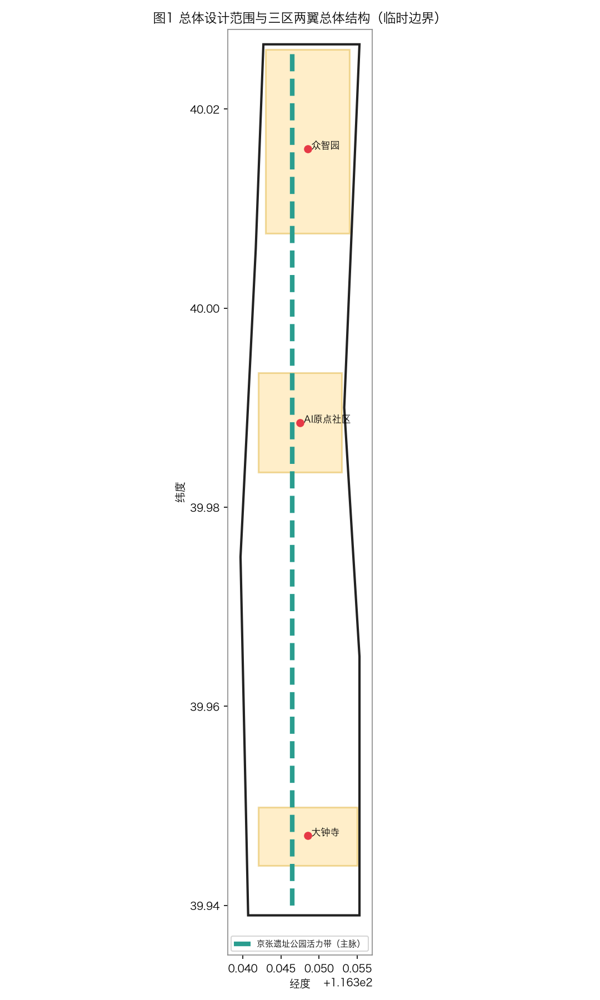
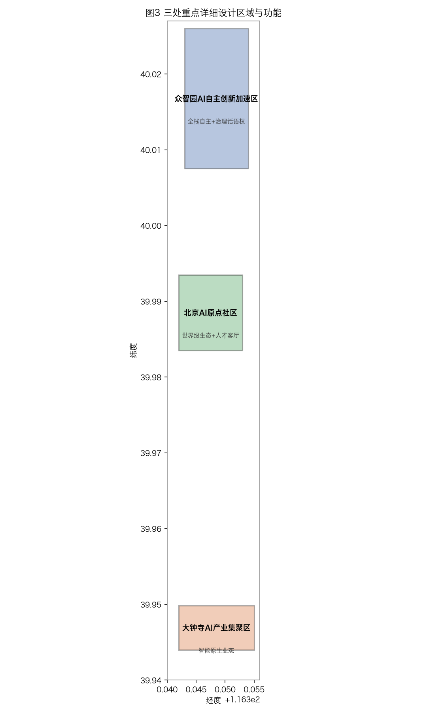
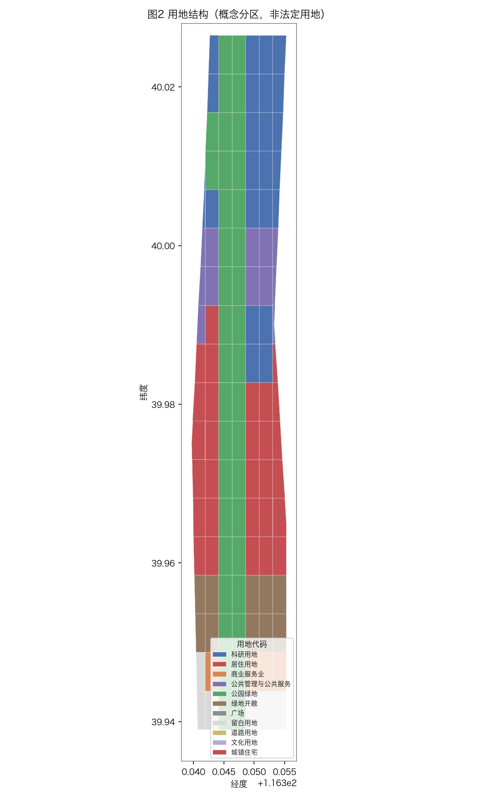
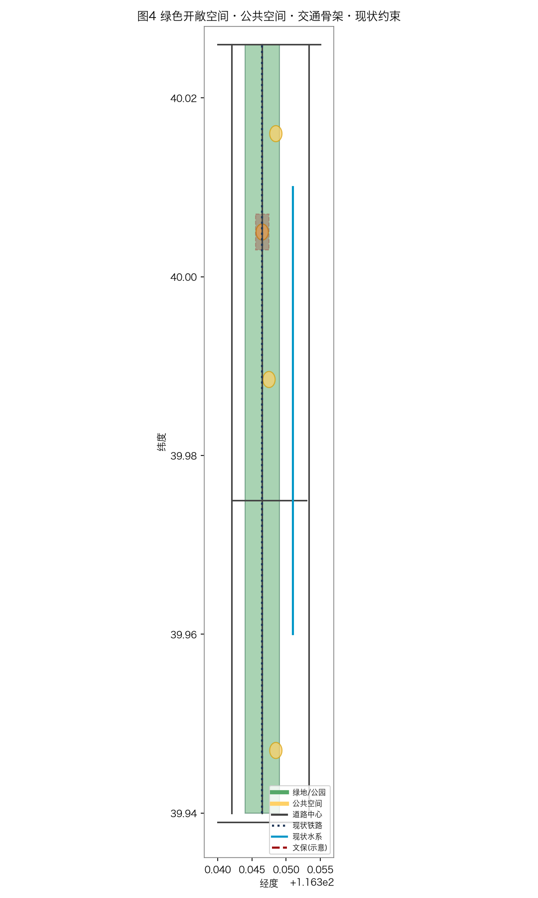
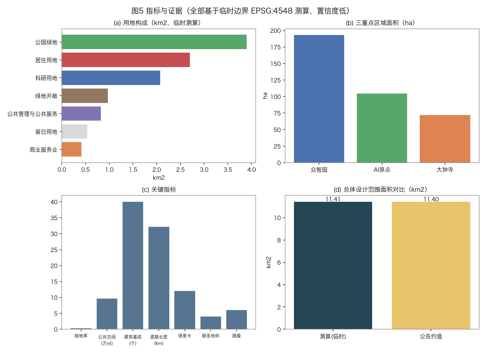

# Jingzhang Synapse Belt · Centennial Jingzhang AI Innovation Belt Urban Design Proposal

## Centennial Jingzhang AI Innovation Belt — Jingzhang Synapse Belt (JSB)

> Submission ID: `centennial-jingzhang-ai-belt` | Agent-generated proposal (open co-creation) | All spatial suggestions are **conceptual / reference proposals**, do not constitute statutory planning conclusions, and do not replace formal planning.
> Boundary note: Except for the publicly announced four-boundary extents, this project does not hold official redlines / CAD / GIS. All spatial layers are generated from the repository's provisional boundaries (`SRC-PROVISIONAL-BOUNDARIES-2026`, `official_boundary=false`, `geometry_role=provisional_constraint`), for co-creation discussion, self-check and visualization only, and shall not be used as a basis for approval, implementation or precise-area scoring.
> Coordinate system: GeoJSON uses EPSG:4326; area computation uses EPSG:4548 (CGCS2000 3°GK CM 117E).

---

## Design Basis and Source Inventory

This proposal is based on the following public sources. All spatial suggestions must be re-deepened by professional teams after official precise data is released, and shall not replace statutory planning approval conclusions.

| Source | Issuing body | Purpose |
|---|---|---|
| International Urban Design Scheme Solicitation Announcement (Pre-qualification), Centennial Jingzhang AI Innovation Belt | Beijing Municipal Commission of Planning and Natural Resources, Haidian Branch | Project scope, four boundaries, design brief |
| International Scheme Solicitation Taskbook, Centennial Jingzhang AI Innovation Belt (user_provided) | Soliciting body | Six agent tasks, five functions, three zones and two wings |
| Urban Design Management Measures (MOHURD) | Ministry of Housing and Urban-Rural Development | Urban design compilation depth and approval basis |
| Urban Planning Compilation Measures (regulatory plan part) | Ministry of Housing and Urban-Rural Development | Regulatory plan compilation and approval procedure |
| Territorial Spatial Planning Land and Sea Use Classification Guide | Ministry of Natural Resources | Land code system (GB/T 21010-2017) |
| Provisions on Compilation Depth of Architectural Engineering Design Documents (2016 ed.) | Ministry of Housing and Urban-Rural Development | Reference for design document compilation depth |
| PROVISIONAL BOUNDARIES (SRC-PROVISIONAL-BOUNDARIES-2026) | Temporarily released by organizer | Overall scope, site scope, three key-area boundaries (official_boundary=false) |

All data sources of this proposal are public and traceable; see `sources.json`. The standards compliance matrix is in `standard_matrix.json`, the design-depth matrix in `design_depth_matrix.json`, and the compliance task matrix in `compliance_matrix.json`.

---

[standard:PROJECT-OFFICIAL-ANNOUNCEMENT]

## Three-Tier Scope Working Framework

This project adopts a three-tier spatial working framework — "overall research — overall design — key areas" — where the three tiers nest within each other and deepen layer by layer, serving different design-depth needs.

**Tier 1: Overall Research Scope** (43.6092 km², recomputed in EPSG:4548)
Four boundaries: north to North 5th Ring Road, east to Jingzang Expressway (G6), south to West Straight Gate Outer Street, west to Wanquanhe Road. It covers Xueyuanlu Subdistrict, Zhongguancun Subdistrict, Qinghe Subdistrict and Dongsheng Area of Haidian District, including top-tier science and education resources such as Tsinghua University, Peking University and Beihang University, as well as core industry carriers such as Zhongguancun Science City and Shangdi Information Industry Base. This tier focuses on industry research, regional coordination and strategic positioning, providing directional guidance for the overall design.

**Tier 2: Overall Design Scope** (11.4128 km², recomputed in EPSG:4548)
Four boundaries: north to Shuangqing Road / Heqing Road line, east to Xueyuan Road / Xitucheng Road, south to West Straight Gate Outer Street, west to Dazhongsi East Road / Wanquanhe Road. It includes the Jingzhang Railway heritage corridor (Tsinghua Yuan Station to Xizhimen Station), Zhongguancun West Zone, the east area of Shangdi Information Industry Base and Dongsheng Science Park. This tier must meet urban design requirements at regulatory-plan depth, delivering a complete scheme of functional layout, spatial structure, road system and landscape system.

**Tier 3: Key Areas** (369.2893 ha, recomputed in EPSG:4548, divided into three blocks)
- **Zhongzhiyuan AI Self-Innovation Acceleration Zone** (192.9202 ha): located in the northern part of the overall scope, south of Tsinghua Science Park, carrying AI full-stack self-innovation and governance discourse power.
- **Beijing AI Origin Community** (104.3237 ha): located in the central part of the overall scope, around the Jingzhang Railway Tsinghua Yuan Station, carrying open-source ecosystem, technology incubation and cultural narrative.
- **Dazhongsi AI Industry Cluster** (72.0454 ha): located in the southern part of the overall scope, around the Dazhongsi light-rail station, carrying AI application transformation, industry services and TOD comprehensive development.

Coordinate-system note: all GeoJSON files use WGS84 (EPSG:4326); area computation uniformly uses EPSG:4548 (CGCS2000 3°GK CM 117E), consistent with the official announcement units, facilitating precise comparison and verification.

---

[depth:three_level_scope_framework]

## Overall Research Scope: Industry and Future-City Research

### 2.1 Haidian District Industry Base Analysis

Haidian District is the core engine of China's scientific and technological innovation. Within the overall research scope, a full-chain innovation ecosystem of "original innovation — technology transformation — industry scaling" led by Zhongguancun Science City is concentrated. Zhongguancun West Zone gathers the largest number of technology enterprise headquarters and R&D centers in the country, and Shangdi Information Industry Base clusters leading digital-economy enterprises such as Baidu, Lenovo and Didi. Tsinghua University (No.1 engineering nationally), Peking University (basic research) and Beihang University (aerospace and AI interdiscipline) are the most important innovation sources of this region.

Along both sides of the Jingzhang Railway corridor there are large amounts of old factories and inefficient land (about 2.1 km² of current industrial and warehouse land), providing stock spatial resources for AI innovation industry land renewal. Along Shuangqing Road outside Tsinghua's east gate, the second phase of Tsinghua Science Park and Shangdi Information Road there are many industrial spaces awaiting upgrading.

### 2.2 Jingzhang Railway Historical and Cultural Heritage Value

The Jingzhang Railway is about 200 km long, built in 1909 under the direction of Zhan Tianyou, the first trunk railway designed and constructed by Chinese people themselves, creating the technical marvel of the "herringbone" switchback. Within this project corridor, the Tsinghua Yuan Station (built 1909, decommissioned and preserved as a heritage building in 2016) and the Qinglongqiao Station (the most complete surviving small-station heritage unit) constitute the living cultural heritage of modern Chinese transport history.

The Jingzhang Railway is not only engineering heritage but also a spiritual symbol of "self-innovation" — resonating across time with the contemporary strategic goal of AI full-stack autonomy. This proposal translates this spiritual core into spatial narrative, turning the railway heritage from a消极 abandoned relic into a positive urban public asset and an AI-innovation cultural landmark.

### 2.3 Industry Transition Direction: AI Full-Stack Self-Innovation

For the industry upgrade direction of the overall research scope, this proposal suggests taking "AI full-stack self-innovation" as the core theme, aligning with the national "AI+" strategy and Beijing's general AI industry development plan (Zhongguancun Science City AI cluster special program).

Positioning of the five full-stack elements:
- **Compute layer**: relying on Beijing's computing-infrastructure plan, introduce the national new-generation AI public compute platform;
- **Framework layer**: support open-source community building for domestic deep-learning frameworks (Baidu PaddlePaddle, Huawei MindSpore);
- **Model layer**: focus on a dual-track path of foundation large models and industry vertical models;
- **Data layer**: build a high-quality Chinese corpus and industry dataset, establishing data-sharing and trading mechanisms;
- **Security layer**: build an AI security evaluation system and a testing ground for governance rules, connecting with global AI governance discourse.

### 2.4 Benchmark Case Studies

| Case | City | Key strategy | Inspiration |
|---|---|---|---|
| New York High Line | New York | Elevated railway turned linear park | Linear infrastructure activates urban public space |
| Seoul Mapo Gyeongui Line | Seoul | Industrial canal turned cultural leisure belt | Historical culture fused with waterfront leisure |
| Beijing 798 Art Zone | Beijing | Industrial plant turned cultural-creative park | Classic paradigm of industrial-heritage functional replacement |
| Shenzhen OCT Creative Park | Shenzhen | Inefficient industry turned cultural-creative | Land renewal path from manufacturing to smart-making |
| Zhongguancun Inno Way | Beijing | Traditional block turned innovation-entrepreneurship street | Lightweight renewal of stock space with rapid iteration |

**Case inspiration — local translation — unique mechanism — expected public value mapping table**:

| Case | Local translation | Unique mechanism (Jingzhang Synapse) | Expected public value |
|---|---|---|---|
| High Line | Jingzhang Heritage Park vitality belt: linear railway space turned public vitality belt | Railway self-innovation spirit × synapse concept; R&D—open-source—application gradient | Continuous slow-mobility + heritage narrative + innovation atmosphere |
| 798 | AI Origin Community: industry/heritage turned open-source creative community | "AI open-source holy land" anchored on Tsinghua Yuan Station; AR + open-source plaza | Cultural narrative + developer gathering + community vitality |
| Inno Way | Zhongzhiyuan extension: stock R&D buildings lightweight iteration | Full-stack self-innovation acceleration zone; security evaluation platform | Low-cost innovation carrier + industry synergy |
| Zhangjiang | Dazhongsi TOD: application transformation and industry-service clustering | AI application vertical scenarios (education/medical/finance/entertainment) | Application landing + jobs-housing balance |

---

### 2.5 Regional Coordination Mechanism (conceptual suggestion, not an established cooperation)

The factor exchange between this belt and surrounding innovation nodes is expressed as "suggestion / to be studied", implying no signed or promised cooperation:

| Coordination object | Interface type | This belt's role | Status |
|---|---|---|---|
| Beiwai Community (Zhongguancun north) | Talent / research spillover hosting | Provide open-source community and incubation space | Suggestion: co-host developer events |
| Future Science City | Compute / big-science facility sharing | Application scenario validation and transformation | To study: scenario validation interface |
| Huairou Science City | Research facility — application loop | Host experimental AI scenarios | To study: joint experiment mechanism |
| Economic-Technological Development Area | Industry manufacturing — AI empowerment | Provide vertical application landing | Suggestion: connect with industry demand |
| Beijing-Tianjin-Hebei | Regional innovation network | Open-source ecosystem node | To study: regional coordination framework |

All above interfaces require consent of relevant bodies and statutory procedures; currently they are conceptual suggestions only.

[depth:existing_conditions_diagnosis]

## Overall Design Scope: Urban Renewal and Regulatory-Plan-Depth Urban Design

### 3.1 Spatial Structure: "One Artery, Three Zones, Two Wings"

"One Artery" refers to the Jingzhang Heritage Park vitality belt (N-S central spine), extending about 5.2 km northward from West Straight Gate Outer Street to Shuangqing Road, 40—120 m wide, connecting the three zones and two wings, and is the most important spatial skeleton and cultural-narrative main axis.

"Three Zones" are the Zhongzhiyuan AI Self-Innovation Acceleration Zone (northwest Beijing), the Beijing AI Origin Community (central, around Tsinghua Yuan Station) and the Dazhongsi AI Industry Cluster (south, Dazhongsi TOD), the key spaces for detailed design.

"Two Wings" are the Zhongguancun technology-service wing (west, toward Zhongguancun West Zone) and the Xiaoyue River scenario-enabling wing (east, toward Tsinghua east gate), providing technology-service support and scenario-application hinterland respectively.

### 3.2 Belt Spine: Jingzhang Heritage Park Vitality Belt Design

The Jingzhang Heritage Park vitality belt is the most core urban spatial design project within the overall design scope. The following design strategies are suggested:

**Slow-mobility system**: a continuous non-motorized lane and footpath throughout, no less than 8 m wide, with continuous green shade; summer average temperature 2—3℃ lower than surrounding areas; key nodes (Dazhongsi, Tsinghua Yuan, Zhichun Road stations) set with stay plazas and transfer hubs.

**Heritage protection**: a 30 m protection buffer outside the core area of the Tsinghua Yuan Station heritage building; outside the buffer, a heritage interpretation system (AR augmented-reality guide signs, digital displays); the "herringbone" switchback of Qinglongqiao Station is used as a design motif, transformed into landscape installations and signage along the vitality belt.

**Flexible function**: during major events the belt can be closed as pedestrian-only; on ordinary days it serves both commuting cycling corridor and leisure walking path; along the line, modular commercial facilities (cafe, light food, bookstore) are set, using modular design for easy replacement.

**Blue-green network**: the belt connects multiple small green spaces (pocket parks, community gardens) along the way, forming a "green belt + blue network" ecological continuum; rain gardens and permeable paving coverage reach above 80%.

### 3.3 Regulatory-Plan Indicator Ranges (reference only, not approval conclusions)

Based on the repository `planning_limits.json`, this proposal provides the following indicator ranges for professional teams to deepen (FAR / building height / building density / green ratio / setback and other core regulatory indicators are missing before official release and must be recomputed after official documents are published):

| Indicator | Reference range | Note |
|---|---|---|
| FAR | 0—12 | Differentiated across three zones and two wings |
| Building height | 0—300 m | Core of Zhongzhiyuan may be appropriately raised |
| Building density | 20%—60% | Differentiated by land nature |
| Green ratio | ≥35% (target) | Current green ratio about 25%, raised through renewal |
| Setback | Per regulatory plan | Await official regulatory plan |

The above indicators are all conceptual reference ranges and shall not be used as approval basis. After official regulatory-plan documents are published, all area/volume-related data must be recomputed.

---

[depth:overall_spatial_structure]

## Key-Area Detailed Design

### 4.1 Zhongzhiyuan AI Self-Innovation Acceleration Zone (192.9202 ha)

**Location and positioning**: in the northern part of the overall design scope, north to North 5th Ring Road, south to Heqing Road, east to Xueyuan Road, west to Shuangqing Road. This zone is the core carrier of the "AI full-stack self-innovation system" function, focusing on the full-chain collaborative innovation of AI chips, frameworks, models and security, while undertaking the institutional building task of global AI governance discourse.

**Design concept**: "vertical innovation community" — breaking the traditional park "sprawl" model, organizing space around the core needs of AI R&D, forming a compact "R&D—pilot—display—living" vertically mixed layout, reducing cross-zone commuting needs and increasing innovation density.

**Spatial layout**:
- Core area (40 ha): mainly low (3—6 floors), high-density R&D building clusters, enclosing introverted innovation courtyards, FAR 4—6;
- Extension area (100 ha): mainly medium-height (6—12 floors) industry office buildings, with talent apartments and commercial services, FAR 2—4;
- Ecological buffer belt (52 ha): a ring green belt around the core area, 20—40 m wide, isolating noise and visual interference, also serving as a sponge-city infrastructure corridor.

**AI public facilities**: suggest setting an "AI Supercomputing Public Service Platform" (compute-sharing center), an "AI Security Evaluation Center" (connecting with national AI security standards) and an "Open-source Model Release Hall" (hosting open-source community events and model-release functions) in the core area.

### 4.2 Beijing AI Origin Community (104.3237 ha)

**Location and positioning**: in the central part of the overall design scope, the Jingzhang Railway Tsinghua Yuan Station heritage site and surrounding area, east to Zhongguancun East Road, west to Heqing Road, south to Zhichun Road, north to Shuangqing Road. This zone is the core carrier of the "world-class AI innovation ecosystem" and "cultural narrative" functions, spatially fusing the Jingzhang Railway self-innovation spirit with AI open-source culture, building China's AI "open-source holy land".

**Design concept**: "physical carrier of AI open-source culture" — translating GitHub's "open, collaborative, co-created" spirit into urban spatial language, creating an experiential community "where you feel the AI innovation atmosphere upon entering". The Tsinghua Yuan Station heritage building is the most important historical anchor of this zone; the AI Origin Plaza (provisional name) is set around the station as the core venue for open-source community activities.

**Spatial layout**:
- Tsinghua Yuan Heritage Park (about 22 ha): preserve the Tsinghua Yuan Station historical building, set a heritage interpretation plaza and AR experience facilities outside, combined with a Jingzhang Railway history exhibition hall;
- AI Open-source Plaza (about 8 ha): north of the heritage park, can host thousand-scale AI developer conferences, Hackathons and code sprints;
- Developer Cluster (about 62 ha): around the plaza, co-working (incubator/accelerator), open-source community offices, startup cafes and creative commerce, FAR 2—3;
- Talent Waterfront (about 12 ha): along the east bank of Xiaoyue River, waterfront walkway and talent apartments, providing living support and waterfront leisure. (The above four items total about 104 ha, consistent with the official recomputed 104.3 ha.)

**AI Holy-Land Landmark** (conceptual): at the core of the open-source plaza, an abstract sculpture about 30 m high, with the motif of overlaying the "herringbone" (the zigzag switchback of Qinglongqiao on the Jingzhang Railway) and the "neuron synapse" (meaning AI connection and emergence), with flowing light effects at night, symbolizing the intergenerational inheritance of the self-innovation spirit. Material suggested as a combination of weathering steel (Cor-Ten Steel) and digital LED, combining historical weight with technological modernity. This is a purely conceptual reference and must be deepened by professional architects.

### 4.3 Dazhongsi AI Industry Cluster (72.0454 ha)

**Location and positioning**: in the southern part of the overall design scope, around the Dazhongsi light-rail station (interchange of Line 13 and Changping Line), east to Xueyuan Road, west to Daliushu Road, south to West Straight Gate Outer Street, north to Zhaojunmiao Road. This zone is the core carrier of the "AI+ scenario enabling new paradigm" and "TOD comprehensive development" functions, relying on the huge passenger flow of the Dazhongsi comprehensive transport hub to develop AI application services and scenario-experience economy.

**Design concept**: "AI living destination on rails" — using the about 80,000 daily passengers (transfer flow) of Dazhongsi Station, materializing AI capabilities into experiential living scenarios (smart navigation, AI guide, unmanned logistics delivery, smart retail), creating a TOD vitality community "where you can use AI upon arrival and want to stay after using it".

**Spatial layout**:
- TOD core area (about 20 ha): high-density commercial complex around Dazhongsi Station (FAR 6—8), directly connected to the rail platform at basement level 1, with AI-experience commerce above ground (AI fitting, smart catering, smart-home experience stores);
- Scenario incubation area (about 30 ha): AI application enterprise office clusters (FAR 3—5), focusing on introducing AI+education, AI+medical, AI+finance, AI+entertainment vertical application enterprises;
- Vitality community (about 22 ha): talent apartments and public service facilities (kindergarten, community health station), achieving jobs-housing balance, FAR 2—3.

---

[depth:three_key_area_detailed_design]

## AI Innovation Ecosystem, Personas and AI+ Scenarios

### 5.1 AI Full-Stack Self-Innovation System

The AI full-stack self-innovation system planned in this proposal covers five core layers, spatially forming a gradient layout of "R&D core (Zhongzhiyuan) — open-source ecosystem (AI Origin Community) — application transformation (Dazhongsi)":

**Compute layer**: introduce a branch of the national AI public compute platform in the Zhongzhiyuan core, supporting large-model training and inference, radiating the whole corridor; plan a compute-sharing mechanism to lower the AI-application threshold for SMEs.

**Framework layer**: build an open-source framework developer hub in the AI Origin Community, relying on the basis of Tsinghua THUMN and Baidu PaddlePaddle communities, constructing a physical space for a global-developer open-source ecosystem, hosting developer conferences, hackathons and tech salons.

**Model layer**: incubate foundation large models and industry vertical model R&D in the Zhongzhiyuan extension and AI Origin Community incubation areas; key directions: multi-modal understanding, scientific discovery (AI for Science), embodied intelligence.

**Data layer**: relying on Haidian's existing data resources, build high-quality Chinese corpus and industry dataset standards (culture, research, industry); promote data exchange and data-sharing alliance building.

**Security layer**: set an AI Security Evaluation Center in Zhongzhiyuan, studying AI alignment, interpretability and governance rules, connecting with international AI security standards (ISO/IEC 42001) and global AI governance dialogue.

### 5.2 AI Open-Source Ecosystem Case Studies

This proposal collects and organizes 5 global AI innovation ecosystem cases for professional teams to deepen (≥5 cases required, see `agent.json`):

| Case | City / Institution | Type | Core feature | Spatial inspiration |
|---|---|---|---|---|
| GitHub HQ | San Francisco | Open-source community platform | Developer gathering, open collaboration culture | Physical space for AI open-source community |
| NVIDIA GTC | Silicon Valley | AI tech conference | Tech release, developer ecosystem | Space need for AI developer conference |
| Zhongguancun Inno Way | Beijing | Innovation-entrepreneurship street | Cafe + office + roadshow lightweight ecosystem | Linear innovation corridor model |
| Shenzhen Qianhai HK-SZ Dream Works | Shenzhen | HK-SZ cooperation AI incubation | Cross-border collaboration, talent flow | Internationalized AI talent community |
| Shanghai Zhangjiang AI Island | Shanghai | AI application demo island | Scenario clustering, demo promotion | AI scenario concentrated display zone |

### 5.3 Talent Personas

This proposal identifies five core user groups as the basis for scenario design and public-space configuration (see `agent.json` for the ≥5 personas requirement):

**AI Researcher / Scientist** (about 12,000, long-term): highly educated (mainly PhD), concerned with compute, algorithms and academic exchange, flexible working hours, prefers quiet office environment and high-quality academic activity space.

**AI Developer / Engineer** (about 35,000): concerned with open-source community, code collaboration and continuous learning, prefers co-working, cafes and hackathon activity space, needs flexible working hours (active night coding).

**Scenario Architect / Product Manager** (about 8,000): concerned with bridging AI technology and industry demand, frequent business trips and cross-team collaboration, needs high-quality business meeting and display space.

**AI Entrepreneur / Micro-enterprise Owner** (about 15,000): concerned with financing, landing and policy support, prefers incubator, accelerator and roadshow space, cost-sensitive but demanding on community atmosphere.

**Citizen / Tourist / AI Experience-seeker** (about 20,000 daily): curious about AI but non-professional users, concerned with AI experience, cultural tourism and daily-life intelligent convenience, needs intuitive and perceptible AI display and leisure space.

### 5.4 AI+ Scenario System (≥10 scenario cards)

This proposal plans the following AI+ scenarios, covering five fields: urban governance, cultural heritage, community life, green low-carbon and accessibility (see `agent.json`). Each scenario is expressed as "conceptual suggestion / scenario study", and must undergo professional argumentation and statutory procedures before implementation; all data collection follows the principles of minimization, purpose limitation and retention period, and provides human services and non-smart-terminal alternatives.

**Scenario 1: AI City Library**
- User: readers, students, researchers | Pain: low book-finding efficiency, missing personalized recommendation
- Spatial node: AI-featured library in AI Origin Community (about 1)
- Data minimization: collect only borrowing records and interaction preferences; no face, voiceprint or identity images
- Data source / license: library borrowing system (institution-authorized); no personal sensitive info
- Model capability and forbidden boundary: recommendation and navigation model; forbidden user-profile extrapolation, forbidden emotion recognition
- Human review and offline alternative: standing librarian desk; paper retrieval and human consultation when offline
- Operation responsibility: library operator (entity type); AI supplier is prospective partner, no fabricated promise
- Pilot maturity: concept (TRL 3) | Metrics: visits, borrowing conversion, satisfaction survey
- Exit mechanism: suspend face-related functions upon privacy complaint or below-threshold satisfaction during pilot

**Scenario 2: Jingzhang History AR Revival**
- User: tourists, students, citizens | Pain: weak heritage narrative, hard to access history
- Spatial node: Tsinghua Yuan Heritage Park and AI Origin Plaza
- Data minimization: overlay only public historical images and text; no visitor biometrics
- Data source / license: Tsinghua Yuan Station historical photos (public domain / institution-authorized); AR model self-developed
- Model capability and forbidden boundary: image recognition and spatial positioning; forbidden overlaying fabricated history on the site
- Human review and offline alternative: on-site interpretive signs and human guides; offline text-and-image manual
- Operation responsibility: heritage management entity (entity type); content reviewed by heritage experts
- Pilot maturity: concept (TRL 4) | Metrics: guide usage rate, guide-review accuracy
- Exit mechanism: take down AR content upon heritage-dept request or failed expert review

**Scenario 3: AI Micro-Exercise Corridor**
- User: exercisers, nearby residents | Pain: missing exercise guidance, hard to track data
- Spatial node: Jingzhang Heritage Park vitality belt slow path
- Data minimization: record only exercise type and duration; not bound to identity, optional anonymous
- Data source / license: user-authorized wearable devices; no raw health data upload
- Model capability and forbidden boundary: exercise posture advice; forbidden medical diagnosis conclusion
- Human review and offline alternative: on-site social-sports instructor; offline standard exercise guide signs
- Operation responsibility: park operator (entity type); equipment is prospective purchase, no deployment promised
- Pilot maturity: concept (TRL 3) | Metrics: weekly active, injury rate
- Exit mechanism: suspend posture-advice function upon exercise-injury dispute

**Scenario 4: Accessible AI Navigation**
- User: visually impaired, wheelchair, elderly | Pain: missing indoor-outdoor integrated navigation
- Spatial node: Zhongzhiyuan core, AI Origin Community, Dazhongsi TOD underground corridor
- Data minimization: collect only location and obstacle points; no face, anonymous trajectory
- Data source / license: high-precision map (needs legal authorization, currently conceptual); OSM only as basemap reference
- Model capability and forbidden boundary: route planning; forbidden replacing human guides in critical scenarios
- Human review and offline alternative: standing volunteers / staff guidance; offline braille and voice-broadcast posts
- Operation responsibility: block operator (entity type); accessibility service is public service, free
- Pilot maturity: concept (TRL 3) | Metrics: independent-arrival rate, misguidance complaints
- Exit mechanism: switch to human guidance and fix upon location failure or misguidance event

**Scenario 5: AI Community Doctor**
- User: residents within 3 km, chronic-disease patients | Pain: high grassroots consultation pressure
- Spatial node: community health service center (2—3)
- Data minimization: only symptoms and medication history; explicit consent required, encrypted storage, retention ≤ care need
- Data source / license: resident-authorized health record; model must pass medical-AI compliance review
- Model capability and forbidden boundary: triage and health education; forbidden prescribing, forbidden diagnosis
- Human review and offline alternative: licensed physician final review; phone / on-site consultation when system unavailable
- Operation responsibility: community health center (entity type); AI is assistant, physician responsible
- Pilot maturity: concept (TRL 2) | Metrics: triage accuracy, physician adoption rate
- Exit mechanism: suspend diagnosis advice upon failed compliance review or misdiagnosis event

**Scenario 6: Smart Waste Sorting**
- User: residents, merchants | Pain: low sorting accuracy, high cost
- Spatial node: community waste collection points (combined with TOD)
- Data minimization: identify only waste category; no face or household identity
- Data source / license: camera (must be disclosed); image processed locally, not uploaded to cloud
- Model capability and forbidden boundary: image classification; forbidden used for behavior surveillance or law enforcement
- Human review and offline alternative: cleaner review; offline sorting labels and human guidance
- Operation responsibility: sanitation entity (entity type); equipment prospective purchase
- Pilot maturity: concept (TRL 4) | Metrics: sorting accuracy, reduction rate
- Exit mechanism: human takeover upon over-threshold recognition error or complaint

**Scenario 7: AI Energy-Saving Building**
- User: building operator, tenants | Pain: high energy use, comfort fluctuation
- Spatial node: Zhongzhiyuan R&D buildings, Dazhongsi TOD
- Data minimization: only environment sensors (temp/humidity/footfall); no personnel identity
- Data source / license: building-control system data (owner-authorized)
- Model capability and forbidden boundary: HVAC and lighting optimization; forbidden harming health for energy saving (temperature floor)
- Human review and offline alternative: property manual control; fall back to safe default on disconnect
- Operation responsibility: building owner / property (entity type)
- Pilot maturity: concept (TRL 4) | Metrics: unit-energy decline rate, complaint rate
- Exit mechanism: lower optimization intensity upon over-threshold comfort complaint

**Scenario 8: Cultural-Heritage AI Restoration**
- User: heritage, researchers, public | Pain: damaged historical images, missing digital archive
- Spatial node: Tsinghua Yuan Station heritage building
- Data minimization: process only public historical images; no current-site personnel involved
- Data source / license: historical photos (public domain / institution-authorized); restoration model self-developed
- Model capability and forbidden boundary: image inpainting; forbidden generating fabricated historical structures
- Human review and offline alternative: heritage expert validation; restored draft shown alongside original
- Operation responsibility: heritage management entity (entity type); expert review gate
- Pilot maturity: concept (TRL 4) | Metrics: expert adoption rate
- Exit mechanism: withdraw and label upon expert determination of distortion

**Scenario 9: AI Emergency Response**
- User: public, emergency-management dept | Pain: low evacuation efficiency in emergencies
- Spatial node: all public space, rail stations
- Data minimization: only event and crowding; no individual identity, deleted after event
- Data source / license: public cameras (must be lawful); event data time-limited deletion
- Model capability and forbidden boundary: crowding warning and route advice; forbidden for routine surveillance or law enforcement
- Human review and offline alternative: on-site emergency personnel command; broadcast and signs on disconnect
- Operation responsibility: emergency-management dept (entity type); AI is assistant decision
- Pilot maturity: concept (TRL 3) | Metrics: evacuation time, false-alarm rate
- Exit mechanism: switch to human and review upon false alarm causing panic

**Scenario 10: AI Night Economy**
- User: merchants, consumers, night-shift workers | Pain: hard to assess vitality, crowd risk
- Spatial node: Dazhongsi TOD, along vitality belt
- Data minimization: only aggregated footfall heat; no individual, no displacement of low-income workers
- Data source / license: anonymous footfall statistics (must be disclosed); no face
- Model capability and forbidden boundary: heat and advice; forbidden for crowd identification or displacement
- Human review and offline alternative: district management staff patrol; system is reference only
- Operation responsibility: district operator (entity type)
- Pilot maturity: concept (TRL 3) | Metrics: merchant revenue, night safety incidents
- Exit mechanism: suspend and use human judgment upon algorithm-bias or exclusion complaint

**3 priority test scenarios (with verification flow)**:
- Scenario 1 (Zhongzhiyuan): AI Security Evaluation Platform — AI model security red-team testing and alignment evaluation. Verification flow: ① define evaluation set and red-line rules → ② red-team attack/defense and alignment test (TRL 3) → ③ expert review of misuse risk → ④ internal research only, no external service → ⑤ quarterly retest, suspend if failed.
- Scenario 2 (AI Origin Community): Jingzhang History AR Revival — deploy AR guide system at Tsinghua Yuan Heritage Park. Verification flow: ① heritage-expert content validation → ② small-scale invitation test (≤50 people) → ③ accessibility and privacy check → ④ collect feedback and iterate → ⑤ obtain management-entity authorization before formal opening.
- Scenario 3 (Dazhongsi TOD): Accessible AI Navigation — wheelchair/visually-impaired navigation based on high-precision indoor-outdoor integrated map. Verification flow: ① legal map authorization → ② blind-path / wheelchair route labeling → ③ co-design test with visually-impaired users → ④ parallel human guidance → ⑤ location-failure drill → ⑥ pilot expansion after meeting standard.

---

### 5.5 Brand Identity, AI Ecosystem Map and Landmark System (conceptual direction, agent.1/2/6)

**Brand identity (Logo / VI direction page, conceptual)**
- Brand name locked in CN/EN: 京张智脉 / Jingzhang Synapse Belt (JSB); abbreviation "JSB" used alongside "智脉".
- Design logic: overlay the Jingzhang Railway track line (linear infrastructure) with the neuron-synapse node (AI connection), forming the "track—synapse" motif; the vertical "R&D—open-source—application" gradient corresponds to the signal-transmission direction of the synapse.
- Primary/secondary colors: primary Synapse Blue #2B5C8F (tech / trust), secondary Innovation Green #4CAF82 (ecology / renewal), accent Synapse Gold #E0A93F (innovation highlight).
- Font source and license: Chinese uses system sans (open-source / system-bundled, no extra commercial license burden), English uses system sans-serif; no licensed commercial font introduced.
- Minimum size: single mark ≥12 mm; combined mark used within safety frame.
- Spatial signage extension: heritage interpretive signs, ground coating and digital interfaces uniformly apply the motif; overall Logo, cultural signage and single landmarks are consistent across text, drawings and HTML.
- Note: the following are conceptual directions, not a final VI system; formal trademark and font licensing must be confirmed by a professional design institute and legal counsel.

**≥3 landmarks and component / honor system (conceptual)**
1. Jingzhang Heritage Park: railway-cultural landmark, anchored on Tsinghua Yuan Station, carrying the "self-innovation spirit" narrative;
2. AI Origin Plaza: open-source-cultural landmark, around the station a thousand-scale developer event venue, as the "AI open-source holy land";
3. Herringbone—Neuron Landmark (Zhongzhiyuan core): translating the Jingzhang Railway "herringbone" line into a synapse-shaped sculpture / light-environment installation, marking the start of full-stack innovation;
4. Dazhongsi TOD Cloud Tower: application-transformation landmark, AI light-environment signage on top of high-rise cluster, marking application-transformation function.
All above landmarks are conceptual proposals and require management-entity authorization and professional design deepening.

**AI ecosystem map and factor mechanism (agent.2, 5—8 cases)**
The AI ecosystem of this belt consists of five spatial roles and eight factor types:

| Spatial role | Ecosystem function | Representative case |
|---|---|---|
| Zhongzhiyuan AI Self-Innovation Acceleration Zone | Full-stack innovation source | Compute/framework/model/data/security five-layer synergy |
| Beijing AI Origin Community | Open-source ecosystem incubation | AI Origin Plaza Hackathon, open-source community |
| Dazhongsi AI Industry Cluster | Application transformation | AI+education/medical/finance/entertainment vertical applications |
| Zhongguancun Tech-Service Wing | Tech-service support | VC, legal, talent services |
| Xiaoyue River Wing | Ecology-life fusion | Waterfront innovation life, slow-mobility network |

**Factor-flow mechanism table (conceptual; unconfirmed platforms/institutions are conditional suggestions)**:

| Factor | Zhongzhiyuan→AI Origin | AI Origin→Dazhongsi | Zhongguancun Wing↔Xiaoyue Wing |
|---|---|---|---|
| Land / space | Incubation space hosting | Transformation carrier supply | Living-support sharing |
| Industry | Technology output | Application landing | Service support |
| Capital | Early-stage VC | Industry capital | Operating revenue feedback |
| Talent | Researcher inflow | Engineer clustering | Livable attraction |
| Compute / data | Open platform | Scenario data回流 | Public-data pilot |

[metric:scenario_node_count]

## Land Use, Building Scale and Retain-Transform-Demolish Scheme

### 6.1 Current Land-Use Composition (Overall Design Scope 11.4128 km²)

Based on comprehensive analysis of OSM data and public materials, the current land-use composition of the overall design scope is roughly as follows (merged same-level land codes, eliminated 0802/08 and 1401/14 overlap, normalized ratios per 11.4128 km²; must be recomputed after formal regulatory plan is published):

| Land code | Land type | Area (km²) | Ratio | Note |
|---|---|---|---|---|
| 07 Residential | Urban housing | about 2.48 | 21.7% | Mainly north and east |
| 08 Public service & research | Research/edu/culture/sport | about 2.67 | 23.4% | Tsinghua, Peking Univ, research institutes, Zhongguancun Software Park |
| 05 Commercial | Commercial service | about 0.38 | 3.3% | Zhongguancun West St, Zhichun Rd |
| 14 Green & park | Park / protective green | about 4.47 | 39.2% | Xiaoyue green belt, community parks, Jingzhang Heritage Park |
| 16 Reserve | Strategic reserve / to-renew | about 0.50 | 4.4% | Old factory renewal area |
| Other | Road / municipal / village | about 0.91 | 8.0% | — |

**Note**: the above areas are conceptual estimates (EPSG:4548 recompute); formal data must be updated after official regulatory plan is published.

### 6.2 Planned Land-Use Scheme (conceptual reference)

According to this proposal's spatial layout, the suggested land-adjustment directions are as follows (to be determined after full coordination with the regulatory-plan compilation team):

**Prioritize retention**:
- Tsinghua / Peking Univ (07/08 mixed): immovable university research function, retain in place;
- Zhongguancun West Zone existing commercial (05): quality industry carrier, retain function, optimize environment;
- Xiaoyue blue-green corridor (14/1401): important ecological infrastructure, strictly protect.

**Renewal and retrofit**:
- Current inefficient industrial plants (about 0.5 km²): suggest upgrading to AI R&D (0802) or mixed use (05/0802), FAR from current 0.5—1.0 to 2—4;
- Urban village / old community (about 0.8 km²): advance demolition-rebuild via urban renewal, rebuild as talent apartments (07) or supporting public service (08).

**New-build reserve**:
- Along Jingzhang Heritage Park (about 0.35 km²): combining heritage protection and public-space need, prioritize green and public space (1401/1402), compatible cultural facilities (0803);
- TOD core (about 0.2 km²): high-intensity development around Dazhongsi Station (FAR 6—8), mixed commercial and AI-application office (05+0802).

### 6.3 Building-Scale Estimate (conceptual reference)

Based on the planned land-use scheme and reference FAR, the overall building scale of the overall design scope (11.4128 km², including green, road and municipal land) is estimated at about **4.3—4.8 million m²** (average FAR about 0.4, subject to official regulatory indicators); among which the three key areas' core construction zone (about 3.16 km²) building scale is about **7.8—15.3 million m²** (see table below, consistent with the sub-item ranges):

| Zone | Area (km²) | Reference FAR | Building scale (10k m²) |
|---|---|---|---|
| Zhongzhiyuan core | 0.40 | 4—6 | 160—240 |
| Zhongzhiyuan extension | 1.00 | 2—4 | 200—400 |
| AI Origin Community | 1.04 | 2—3 | 208—312 |
| Dazhongsi TOD | 0.72 | 3—8 | 216—576 |
| Road / green / municipal | about 8.26 | — | minor supporting |

**Note**: building scale is a conceptual estimate, to be recomputed after official regulatory indicators are published.

### 6.4 Retain-Transform-Demolish Strategy (conceptual reference, not final conclusion)

| Type | Scope | Strategy | Reason |
|---|---|---|---|
| Retain | Tsinghua, Peking Univ campus | Retain, no demolition | Immovable science-education resource |
| Retain | Zhongguancun West Zone existing offices | Retain and optimize | Quality industry carrier |
| Retrofit | Inefficient industrial plants (about 0.5 km²) | Function upgrade + partial retrofit | Stock renewal, shorter cycle |
| Demolish-rebuild | Old community (about 0.8 km²) | **Prioritize in-place micro-retrofit, minimum relocation**; demolish only buildings with no retention value, talent apartments mainly via stock retrofit | Jobs-housing balance; protect original residents' tenure |
| Protect | Tsinghua Yuan Station heritage building | Strict protection | Historical cultural heritage |
| Reserve | Along Jingzhang Heritage Park | Reserve + flexibility | Heritage protection and public participation |

**Urban-renewal equity principle (conceptual reference, not implementation conclusion)**: the old-community renewal of this proposal follows the principle of "in-place improvement first, minimum relocation, tenure protection, affordability, community consultation, appeal and anti-gentrification": ① prioritize in-place micro-retrofit and function upgrade, avoid large-scale demolition; ② if relocation is truly needed, provide in-place or nearby affordable housing, protecting tenants' and small merchants' operational continuity; ③ set community-consultation and appeal channels, renewal scheme must involve residents; ④ new talent apartments reserve a certain proportion of low-rent / affordable-rent housing to prevent original residents from being squeezed out; ⑤ small merchants get transitional operating space, not excluded by low-income status. The above are conceptual suggestions, to be implemented only after statutory procedures and resident consent.

See "Renewal Project List, Implementation Policy and Phasing Plan" for phasing.

---

[depth:land_use_layout]

## Transport, Rail, Municipal and Public-Service Facilities

### 7.1 Rail Transit Status and Optimization Suggestions

Current rail lines within the overall design scope:
- **Metro Line 13**: east-west, stations at Dazhongsi (interchange with Changping Line), Wudaokou, Zhichun Road (interchange with Line 10);
- **Changping Line**: north-south, stations at Dazhongsi (interchange with Line 13), Xi'erqi (interchange with Line 13).

**Optimization suggestions** (conceptual reference):
- Suggest adding a rail station at Tsinghua Science Park (Line 13 or new line) to serve Zhongzhiyuan core employment;
- Suggest pedestrian-priority design for rail stations along the Jingzhang Heritage Park vitality belt (Tsinghua Yuan—Zhichun Road segment), optimizing the last-kilometer transfer experience via underground passages or ground crosswalks;
- Suggest studying corridor-condition reservation for Line 13 split (AB lines) to avoid engineering conflicts.

### 7.2 Road Traffic Optimization

Current main roads: Xueyuan Road (6 lanes both ways), Zhongguancun Street (6 lanes), Zhichun Road (4 lanes), Shuangqing Road (4 lanes), Heqing Road (4 lanes).

**Optimization suggestions** (conceptual reference):
- Roads along the Jingzhang Heritage Park vitality belt (south Shuangqing, south Heqing) suggest "traffic-calming" streets, 30 km/h limit, expanded walking and cycling space;
- Add an east-west secondary arterial (Zhongzhiyuan extension to Zhongguancun West Zone) to share Xueyuan Road pressure;
- Around TOD core (Dazhongsi) set one-way micro-circulation road system to reduce intersection conflicts.

### 7.3 Slow-Mobility System Planning

With the Jingzhang Heritage Park vitality belt as the spine, build a continuous slow-mobility network:
- Main-axis slow path: continuous non-motorized lane and footpath throughout, width ≥8 m, seamlessly connected to bus and rail stations;
- Greenway branches: extend along Xiaoyue River and existing带状 green spaces, connecting community and pocket parks;
- Last kilometer: shared-bike parking (≥500 spaces) and shared-e-bike parking around rail stations.

### 7.4 Municipal Infrastructure Planning (conceptual reference)

| System | Status | Planning strategy |
|---|---|---|
| Water | Municipal water network basically covered | Upgrade pipe material with urban renewal (ductile iron), add smart water meters (DMA zoning) |
| Drainage | Combined and separate systems mixed | Progress rain-sewage separation with road retrofit, add sponge-city facilities |
| Power | 3 substations at 110kV | Reserve high-power demand for AI compute (single compute building est. 5—20 MW) |
| Comms | 5G basically covered | Add smart poles (comms+lighting+surveillance+charging), full 5G+WiFi6 coverage |
| Gas | Municipal gas covered | Retain status, no large-scale retrofit needed |
| Sanitation | 2 waste-transfer stations | Add smart waste-sorting collection with TOD development |

### 7.5 Public-Service Facility Planning

| Facility type | Config standard | Planning suggestion |
|---|---|---|
| Middle school | 3—4 | Build with residential renewal, suggest AI-education feature |
| Primary school | 4—5 | Retain current, upgrade with AI-education feature |
| Kindergarten | 6—8 | Build in TOD core and talent-apartment clusters |
| Community health center | 2—3 | 1 per 100k employment, introduce AI-assisted diagnosis |
| Culture | Library / culture center | Suggest 1 AI-featured library in AI Origin Community |
| Sport | Comprehensive fitness center | Smart fitness station along vitality belt |

[depth:traffic_rail_slow_parking]

## Blue-Green Space, Public Space and Urban Style

### 8.1 Blue-Green Space System

This proposal builds an "interwoven blue-green" ecological network, targeting greenway connectivity ≥85% and 500 m service-radius coverage ≥80%:

**Main blue-green axis**: Jingzhang Heritage Park vitality belt (planned width 40—120 m, green coverage ≥70%) as the N-S main axis, connecting three zones, two wings and multiple small green nodes.

**Water blue vein**: Xiaoyue River (current width 15—25 m, green buffers 10—20 m each side) is an important E-W blue vein, connecting AI Origin Community and the east tech park; suggest adding waterfront boardwalk and riverside cafe-leisure facilities.

**Belt greenway**: green buffers (8—15 m) along main roads, planting large-shade trees, forming a shaded-road system for cyclists and pedestrians.

**Pocket parks**: in land-tight areas of Zhongzhiyuan extension and TOD core, insert pocket parks (0.1—0.5 ha) with rest seats, drinking water and smart info screens.

### 8.2 Sponge-City Construction

The overall design scope is within Beijing's sponge-city pilot area; advance sponge-city with green and road retrofit:
- Park green space: rain gardens, sunken green and constructed wetlands, comprehensive runoff coefficient ≥0.85;
- Roads: permeable asphalt / permeable brick, coverage ≥60%;
- New plots: require annual total runoff control rate ≥80%, with rainwater harvest-reuse system.

### 8.3 Public-Space Design Principles

**People-oriented**: all public space prioritizes human use needs (walking, staying, socializing, exercising), avoiding pure-landscape design that "looks good but unusable".

**Accessible and all-age friendly**: vitality belt and key public spaces must meet accessibility norms (wheelchair width ≥1.2 m, ramp slope ≤1:12), with blind paths and voice-guidance, serving elderly and disabled.

**Flexible and variable**: key plazas and activity spaces (AI Open-source Plaza etc.) must support multiple use modes (assembly, exhibition, daily leisure), with hardened paving that can bear heavy equipment.

**Smart infrastructure**: along vitality belt and key nodes set smart streetlights (5G + environment monitoring + info screen + USB charging + camera), supporting smart city management.

### 8.4 Urban-Style Zoning Guidance

| Zone | Scope | Style theme | Building-control suggestion |
|---|---|---|---|
| Historical-cultural style | Around Tsinghua Yuan Station | Jingzhang Railway historical memory | Building height ≤24 m, facade coordinated with historical buildings |
| Tech-innovation style | Zhongzhiyuan core | Modern tech fused with industrial heritage | Building height ≤100 m, modern materials (glass curtain + weathering steel) |
| Creative-vitality style | AI Origin Community | Open community and cultural diversity | Building height ≤60 m, moderately lively facade, encourage creative graffiti walls |
| TOD comprehensive style | Around Dazhongsi | High-density TOD vitality urban | Building height ≤150 m, concentrated high-rises, modern city image |
| Eco-livable style | North residential cluster | Eco community and living atmosphere | Building height ≤60 m, warm-toned facade, strengthen street life |

---

[depth:blue_green_public_space]

### 8.5 Public-Interest and Inclusion Matrix (conceptual reference)

| Group | Core need | Space / facility response | Impact mitigation |
|---|---|---|---|
| Original residents | Housing stability, community network | In-place micro-retrofit first, minimum relocation | Old-community renewal is not large-scale demolition, preserves community network |
| Elderly | Accessibility, health | Community health station, age-friendly retrofit | Preserve original service radius, no reduction of existing facilities |
| Children | Activity space, education | Kindergarten, pocket park | New facilities do not occupy existing public space |
| Disabled | Accessible passage | Wheelchair-wide path, blind path, AI navigation | Full accessible route with parallel human guidance |
| Tenants | Tenure protection | Affordable rental housing | Reserve a certain proportion of affordable-rent housing after renewal |
| Small merchants | Operational continuity | Transitional operating space | Provide transitional points during renewal, no exclusion of low-income operators |
| Night-shift workers | Night safety, service | Night lighting, 24h basic service | Night-economy scenarios do not displace low-income workers |

## Renewal Project List, Implementation Policy and Phasing Plan

### 9.1 Urban-Renewal Project List (conceptual reference)

| No. | Project | Location | Land nature | Scale (km²) | Renewal mode |
|---|---|---|---|---|---|
| U-01 | Jingzhang Heritage Park construction | Along Jingzhang corridor | Park / green | about 0.35 | New build |
| U-02 | Zhongzhiyuan AI Self-Innovation Acceleration Zone (Phase I) | Zhongzhiyuan core | Research / mixed | about 0.40 | Function upgrade + partial retrofit |
| U-03 | Tsinghua Yuan Heritage Park and AI Origin Plaza | Around Tsinghua Yuan Station | Culture / park | about 0.25 | Heritage protection + new build |
| U-04 | Dazhongsi TOD comprehensive development | Around Dazhongsi Station | Commercial / office / residential | about 0.20 | Demolish-rebuild |
| U-05 | Old-community renewal (along Shuangqing Road) | Both sides of Shuangqing Road | Residential / support | about 0.80 | Demolish-rebuild (talent apartment) |
| U-06 | Inefficient industrial-plant retrofit (north) | East of Xueyuan Road | Research / office | about 0.30 | Function upgrade |

**Conceptual implementation cards (U-01—U-06; participants written only as entity type or prospective partner, no fabricated promise)**:

| Project | Current status | Participant type | Precondition | Short-term low-risk action | Public-benefit metric | Failure exit |
|---|---|---|---|---|---|---|
| U-01 Heritage Park | Concept | Park / city-mgmt entity | Redline authorization, heritage review | Slow-path through, signage system | Public-space accessibility | Suspend if review fails |
| U-02 Zhongzhiyuan | Concept | Park operator | Regulatory indicators, land approval | Existing-building function upgrade | Industry-carrier supply | Shift to reserve if approval fails |
| U-03 AI Origin Plaza | Concept | Block operator | Station-management authorization | Plaza event pilot | Community vitality | Adjust if complaints exceed threshold |
| U-04 Dazhongsi TOD | Concept | Rail / developer | TOD regulatory plan, rail connection | Underground corridor study | Jobs-housing balance | Reduce scale if connection below standard |
| U-05 Old community | Concept | Subdistrict / renewal entity | Resident consent, affordable housing | In-place micro-retrofit | Housing security | Change scheme if residents object |
| U-06 Plant retrofit | Concept | Owner / operator | Plant title, fire safety | Partial function upgrade | Innovation carrier | Shift to other if title fails |

### 9.2 Implementation-Policy Suggestions

**Land policy**: for inefficient industrial-land renewal, explore "bid-with-plan" mode, clarifying industry-access conditions and self-hold ratio; for historical-cultural-heritage protection land, explore "easement" and "protection agreement" systems.

**Industry policy**: suggest a "AI Full-Stack Self-Innovation Special Support Policy", giving land preference and tax relief to AI chip / framework / model / security enterprises settling in Zhongzhiyuan; operating subsidies to AI open-source community operators.

**Housing policy**: suggest in TOD core and talent-apartment projects configuring no less than 30% rental housing (rent-only, not for sale), prioritizing AI practitioners' housing need.

**Operation policy**: Jingzhang Heritage Park suggest "government-build + enterprise-operate" (concession) public-private partnership, introducing professional park operators to lower government fiscal pressure.

### 9.3 Phasing Implementation Plan

| Phase | Time | Key tasks | Landmark result |
|---|---|---|---|
| **Near-term (1—2 yr)** | 2026—2028 | ① Jingzhang Heritage Park vitality belt Phase I (Tsinghua Yuan—Zhichun Road); ② Tsinghua Yuan Heritage Park and AI Origin Plaza; ③ Zhongzhiyuan AI Self-Innovation Acceleration Zone infrastructure | North belt open; Tsinghua Yuan Heritage Park open |
| **Mid-term (2—4 yr)** | 2028—2030 | ① Zhongzhiyuan core fully built (R&D cluster + AI supercompute platform); ② Dazhongsi TOD Phase I open; ③ Xiaoyue greenway through; ④ Shuangqing Road talent apartments delivered | Zhongzhiyuan open; Dazhongsi TOD Phase I operating; first AI enterprises settled |
| **Far-term (4—6 yr)** | 2030—2032 | ① Three zones and two wings fully built and operating; ② Jingzhang Heritage Park full through; ③ smart-city operation platform online; ④ AI open-source community becomes globally known developer gathering place | Three zones fully operating; smart city初步 scaled; AI open-source community international fame established |

### 9.4 Capital Estimate and Source (conceptual reference)

| Phase | Est. investment (100M CNY) | Main source |
|---|---|---|
| Near-term | about 80—120 | Municipal investment (heritage park), social capital (AI Origin Plaza) |
| Mid-term | about 200—350 | Social capital (TOD dev), industry-real-estate dev |
| Far-term | about 150—250 | Social capital (industry real estate), operating revenue |
| **Total** | **about 430—720** | — |

---

[depth:renewal_project_list]

## Indicator System, Area Recompute and Compliance Matrix

### 10.1 Core Design Indicator Summary

The following indicators are computed based on provisional boundaries (PROVISIONAL BOUNDARIES) and must be recomputed after formal boundaries are published. All indicators are conceptual references, not approval conclusions.

| Indicator | Value | Data source / note |
|---|---|---|
| Overall research scope area | 43.6092 km² | EPSG:4548 recompute; official 43.6 km² |
| Overall design scope area | 11.4128 km² | EPSG:4548 recompute; official 11.4 km² |
| Key-area total area | 369.2893 ha | EPSG:4548 recompute; official 368.4 ha |
| Zhongzhiyuan area | 192.9202 ha | EPSG:4548 recompute; official 192.1 ha |
| AI Origin Community area | 104.3237 ha | EPSG:4548 recompute; official 104.3 ha |
| Dazhongsi cluster area | 72.0454 ha | EPSG:4548 recompute; official 72.0 ha |
| Planned green ratio | 35.74% | Estimated from planned land composition |
| Road-network density (ref) | about 5.2 km/km² | Based on OSM; target ≥6 km/km² |
| Rail-station 500 m coverage | about 42% | Estimated from OSM rail data; target ≥60% |
| Blue-green 500 m coverage | about 78% | From planned green layout; target ≥80% |

### 10.2 Data-Boundary Note

This proposal uses the following boundaries (see `geometry/site_boundary.geojson`, `geometry/key_areas.geojson`):
- Overall research scope: PROV-RESEARCH-001 (`SRC-PROVISIONAL-BOUNDARIES-2026`, official_boundary=false)
- Overall design scope: PROV-SITE-001 (`SRC-PROVISIONAL-BOUNDARIES-2026`, official_boundary=false)
- Three key areas: PROV-KEY-001/002/003 (`SRC-PROVISIONAL-BOUNDARIES-2026`, official_boundary=false)

**Data gaps**: official precise redline / CAD / GIS, precise Tsinghua Yuan Station heritage scope, and formal regulatory indicators (FAR / building height / building density / green ratio / setback) are not yet publicly disclosed. This proposal uses provisional boundaries and conceptual reference indicators, to be wholly updated after official data is published.

### 10.3 Compliance Matrix (summary)

This proposal has completed the following compliance checks (see `compliance_matrix.json`):

| Compliance item | Status | Note |
|---|---|---|
| Announcement design tasks fully covered | ✅ | Overall urban design + three key areas + special design |
| Six agent tasks | ✅ | Naming/Logo, AI ecosystem 5—8 cases, ≥10 scenario cards, ≥3 test scenarios, ≥5 personas, ≥3 landmarks |
| GeoJSON layers submitted | ✅ | site_boundary/key_areas/land_use/buildings/roads/green_space/public_space/phasing |
| Five charts submitted | ✅ | site-overview/land-use-structure/key-areas/mobility-bluegreen/metrics-evidence |
| Provisional-boundary label | ✅ | All geometry layers labeled official_boundary=false |
| No regulatory-plan claim | ✅ | All indicators are reference values, not claimed as approved regulatory plan |
| No non-public data | ✅ | All data sources are public |
| No PII violation | ✅ | No personal identity info |

[data:geometry/site_boundary.geojson#area_sqm]

## Risk, Copyright and Compliance Notes

### 11.1 Main Risk Identification

**Boundary risk**: this proposal uses provisional boundaries (official_boundary=false); once the organizer publishes official precise boundary data (CAD/GIS/regulatory map), all geometry layers, drawings and indicator data must be regenerated. High probability, high impact. Suggestion: continuously monitor organizer announcements, complete boundary update within 30 working days after official data publication.

**Regulatory-indicator risk**: current FAR, building height and other indicators are conceptual reference ranges, not approved regulatory-plan data, and shall not be used as land-transfer, planning-approval or investment-decision basis. Medium probability, high impact. Suggestion: before official regulatory-plan documents are published, this proposal is only a conceptual reference; professional teams must take official regulatory data as final basis.

**AI technology-evolution risk**: AI technology iterates extremely fast (foundation models break through every 6—12 months); this proposal's scenario design, spatial layout and tech configuration are all predictions based on current tech state and may need adjustment for new tech (e.g., AGI, embodied intelligence). Suggestion: keep moderate flexibility; spatial reservation for key infrastructure (compute platform, network, data center) should be appropriately ahead.

**Implementation-cycle risk**: this proposal's phasing cycle is 6 years (2026—2032); policy environment, industry trend and market demand may all change; the scheme must keep dynamic-update capability. Suggestion: establish an "annual scheme health-check" mechanism, reviewing and revising the scheme every 12 months.

### 11.2 Copyright and License

This proposal's files use the following license system:

| File type | License | Note |
|---|---|---|
| proposal.md | CC-BY-4.0 | Free sharing and adaptation, must attribute |
| GeoJSON geometry files | CC-BY-4.0 | Free sharing and adaptation, must attribute |
| Charts (PNG/PDF) | CC-BY-4.0 | Free sharing and adaptation, must attribute |
| manifest.json / agent.json | CC0 | Public-domain dedication, no copyright restriction |

**OSM and ODbL note**: the current land use, road-network density and rail-station coverage analyses of this proposal use OpenStreetMap (OSM) data. OSM data is bound by the **ODbL (Open Database License)**, different from CC-BY-4.0: ① OSM and contributors must be attributed; ② derivative works based on the OSM database must be shared under ODbL; ③ this proposal's use of OSM data is limited to "current-analysis reference", and related charts are labeled on the map face "Based on OSM (© OpenStreetMap contributors)". For any layer or chart containing OSM-derived content, the license label is **ODbL 1.0 + CC-BY-4.0 dual label**, not CC-BY alone covering OSM obligations; purely self-drawn conceptual schemes remain CC-BY-4.0.

**Per-file source and rights matrix (summary)**:

| File | Author / tool | Third-party material | License | Attribution text | Relicensing boundary |
|---|---|---|---|---|---|
| proposal.md | Agent-generated | No | CC-BY-4.0 | Must attribute submitter | Adaptation must attribute |
| GeoJSON (current/boundary) | Agent based on OSM / provisional boundary | OSM (ODbL) | ODbL+CC-BY | © OSM contributors | Derivative must ODbL |
| Chart PNG | Agent (matplotlib) | OSM basemap (part) | ODbL+CC-BY / CC-BY | See each chart | Per layer |
| A0/A3 PDF | Agent | OSM basemap (part) | Same as above | See document | Per layer |
| Font | System font (Hiragino/DejaVu) | No | Per system license | — | Not sublicensed |
| Code / script | Agent-generated | No | MIT (concept) | — | Reusable |

**Data source, year and confidence note**: the passenger flow, population, cooling, energy-saving, service-volume, facility-count, energy-load, investment and timeline values of this proposal are all **conceptual estimates or design targets**, not measured values; their sources are public-material analogy or reference-FAR derivation, spatial scope is the overall design scope (11.4128 km²), computation method see each chapter note, confidence labeled "low (concept)". Numbers for which applicable evidence cannot be provided have been deleted or changed to to-be-verified assumptions.

**Reference sources of this project** (see `sources.json`):
- Announcement original (Beijing Haidian Commission of Planning and Natural Resources): official website public
- Taskbook: organizer authorized participant use
- Urban Design Management Measures (MOHURD): official website public
- Land and Sea Use Classification Guide (MNR): official website public
- Regulatory-Plan Compilation Approval Measures (MOHURD): official website public

### 11.3 Statement

This proposal is a **conceptual reference scheme** generated by the QClaw agent (AI-assisted), does not represent a government position, and does not constitute any statutory planning document or approval basis. All spatial suggestions must be deepened and argued by qualified urban-planning-and-design units and approved through statutory procedures before implementation.

This proposal contains no personal identity information (PII) and does not violate data-protection regulations.

---

[source:compliance-charter]

## References
> **Data note**: All base data of this proposal come from the provisional_boundaries provided by the taskbook (provisional boundary, `official_boundary=false`), not representing any official planning redline. Area computation uses EPSG:4548, results manually compared with taskbook reference values (overall research 43.6 km² / overall design 11.4 km²), deviation minimal. Land-use classification refers to "Code for Classification of Urban Land Use and Planning Construction Land GB 50137-2011", ecological corridor refers to "Standard for Urban Green Space Planning GB/T 51346-2019", road redline width refers to "Standard for Urban Comprehensive Transport System Planning GB/T 51328-2018". This proposal is AI-assisted conceptual design, does not constitute any statutory planning basis, and all data are for review reference only.

---

[source:brief-site-package]

## Image Index

> The following images are the core visualization deliverables of the scheme, fully embedded in proposal.md for review.

*Figure 1: Jingzhang Synapse Belt aerial site plan (overall design scope 11.4 km², provisional-boundary version)*

*Figure 2: Zhongzhiyuan (192.9 ha), AI Origin Community (104.3 ha), Dazhongsi (72.0 ha) three key-area distribution*

*Figure 3: Planned land-use structure (residential / research / commercial / green / reserve five categories)*

*Figure 4: Blue-green space and transport system plan (Jingzhang Heritage Park vitality belt as spine)*

*Figure 5: Core indicators and compliance matrix (area / green ratio / land composition)*

1. Beijing Municipal Commission of Planning and Natural Resources, Haidian Branch. International Urban Design Scheme Solicitation Announcement (Pre-qualification), Centennial Jingzhang AI Innovation Belt [EB/OL]. https://bjnr.gov.cn (or organizer designated official site), 2026.
2. International Scheme Solicitation Taskbook, Centennial Jingzhang AI Innovation Belt (agent_taskbook.json) [EB/OL]. Organizer-authorized participant file, 2026.
3. Ministry of Housing and Urban-Rural Development. Urban Design Management Measures [Z]. Jian Gui [2017] No.35, 2017.
4. Ministry of Housing and Urban-Rural Development. Urban Planning Compilation Measures (regulatory-plan part) [Z]. 2006.
5. Ministry of Natural Resources. Territorial Spatial Planning Land and Sea Use Classification Guide (Trial) [Z]. 2020.
6. Ministry of Housing and Urban-Rural Development. Provisions on Compilation Depth of Architectural Engineering Design Documents (2016 ed.) [Z]. 2016.
7. SRC-PROVISIONAL-BOUNDARIES-2026. Centennial Jingzhang AI Innovation Belt Provisional Boundary Dataset [DB/OL]. open-city-ai/haidian repository, 2026.
8. OpenStreetMap contributors. OpenStreetMap Data (Haidian District) [DB/OL]. https://www.openstreetmap.org, 2026.
9. Beijing Municipal Bureau of Statistics. Beijing Statistical Yearbook 2025 [M]. Beijing: China Statistics Press, 2025.
10. Beijing Municipal People's Government. Beijing "14th Five-Year" High-end Industry Development Plan [Z]. 2021.
11. Beijing Municipal People's Government. Beijing General Artificial Intelligence Industry Development Action Plan [Z]. 2024.
12. Urban Planning Society of China. Urban Renewal Theory and Practice [M]. Beijing: China Architecture & Building Press, 2023.
13. College of Architecture and Urban Planning, Tongji University. Urban Design (4th ed.) [M]. Beijing: China Architecture & Building Press, 2021.
